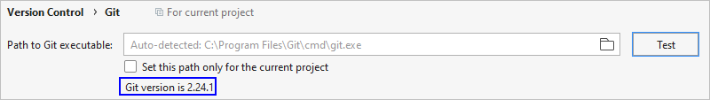
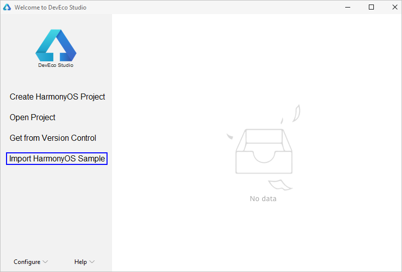
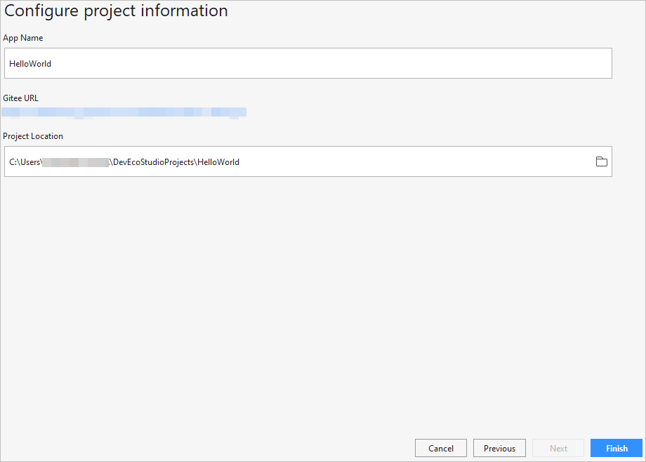

# 导入OpenHarmony工程

> **说明：** 
>该功能适用于通过DevEco Studio 2.1 Release及以上版本，创建OpenHarmony工程。

OpenHarmony SDK配置完成后，便可以启动应用开发。针对OpenHarmony应用开发，**只能通过导入Sample工程的方式来创建一个新工程**。

目前，支持OpenHarmony应用开发的Sample工程，请选择导入含有“**This sample is intended for novices at developing OpenHarmony applications.**”说明的Sample，例如选择common分类中的**JsHelloWorld**。

1.  在DevEco Studio的欢迎页，进入**Configure （或****图标） \> Settings \> Version Control \> Git**界面，点击Test按钮检测是否安装Git工具。
    -   已安装，请根据[2](#li5947194711181)开始导入Sample。

        

    -   未安装，请点击**Download and Install**，DevEco Studio会自动下载并安装。安装完成后，请根据[2](#li5947194711181)开始导入Sample。

        

2.  在DevEco Studio的欢迎页，点击**Import HarmonyOS Sample**按钮，导入Sample工程。

    

3.  选择common下的**JsHelloWorld**工程，然后点击**Next**。

    

4.  设置**App Name**和**Project Location**，然后点击**Finish**，等待Sample工程导入完成。

    

5.  Sample导入后，请打开工程下的build.gradle，修改hap插件的版本号为“2.4.4.3-RC”。

    

6.  修改完成后，点击右上角Gradle中的按钮，重新同步工程。

    

7.  等待工程同步完成，同步成功后，便可以进行OpenHarmony应用开发了。

    

