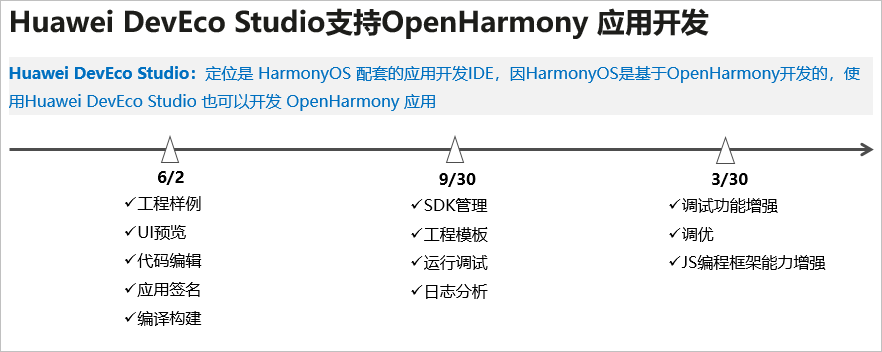

# 概述

-   [总体说明](#section189422248491)
-   [使用约束](#section65191625782)
-   [DevEco Studio演进路标](#section187875207166)

## 总体说明

DevEco Studio是HarmonyOS的配套的开发IDE，因为HarmonyOS是基于OpenHarmony开发的，因此，使用DevEco Studio（配套HarmonyOS）也可以进行OpenHarmony的应用开发。

使用DevEco Studio开发开发OpenHarmony应用的流程与开发HarmonyOS的流程完全一样，本文档仅描述OpenHarmony应用开发与HarmonyOS应用开发的差异点。

-   **搭建开发环境差异**：OpenHarmony应用开发环境需要开发者手动配置SDK，具体可参考[配置OpenHarmony SDK](配置OpenHarmony-SDK.md)章节。
-   **导入OpenHarmony工程**：OpenHarmony应用开发，只能通过导入Sample工程的方式来创建一个新工程，具体可参考[导入OpenHarmony工程](导入OpenHarmony工程.md)。
-   **调试签名配置**：OpenHarmony应用运行在真机设备上，需要对应用进行签名，关于OpenHarmony应用的签名指导请参考[配置OpenHarmony应用签名信息](配置OpenHarmony应用签名信息.md)。
-   **在真机设备上运行应用**：需要使用hdc工具将OpenHarmony的hap包推送到真机设备上进行安装，具体可参考[安装运行OpenHarmony应用](安装运行OpenHarmony应用.md)。

关于DevEco Studio的详细操作指导，请访问[HUAWEI DevEco Studio使用指南](https://developer.harmonyos.com/cn/docs/documentation/doc-guides/tools_overview-0000001053582387)。

## 使用约束

-   OpenHarmony只支持使用JS语言开发应用，不支持Java、C/C++语言。
-   OpenHarmony开发环境DevEco Studio暂只支持Windows系统。

OpenHarmony与HarmonyOS的开发工具都是DevEco Studio，下表为OpenHarmony与HarmonyOS的IDE功能差异说明：

<table><thead align="left"><tr id="row1952618913415"><th class="cellrowborder" valign="top" width="29.882988298829883%" id="mcps1.1.4.1.1">
特性名称

</th>
<th class="cellrowborder" valign="top" width="36.783678367836785%" id="mcps1.1.4.1.2">
HarmonyOS版本

</th>
<th class="cellrowborder" valign="top" width="33.33333333333333%" id="mcps1.1.4.1.3">
OpenHarmony版本

</th>
</tr>
</thead>
<tbody><tr id="row3627192183319"><td class="cellrowborder" valign="top" width="29.882988298829883%" headers="mcps1.1.4.1.1 ">
创建Module

</td>
<td class="cellrowborder" valign="top" width="36.783678367836785%" headers="mcps1.1.4.1.2 ">
<strong id="b17226139143511">√</strong>

</td>
<td class="cellrowborder" valign="top" width="33.33333333333333%" headers="mcps1.1.4.1.3 ">
<strong id="b122614963510">X</strong>

</td>
</tr>
<tr id="row955132319355"><td class="cellrowborder" valign="top" width="29.882988298829883%" headers="mcps1.1.4.1.1 ">
服务卡片

</td>
<td class="cellrowborder" valign="top" width="36.783678367836785%" headers="mcps1.1.4.1.2 ">
<strong id="b11551102403511">√</strong>

</td>
<td class="cellrowborder" valign="top" width="33.33333333333333%" headers="mcps1.1.4.1.3 ">
<strong id="b255116244356">X</strong>

</td>
</tr>
<tr id="row1552619933411"><td class="cellrowborder" valign="top" width="29.882988298829883%" headers="mcps1.1.4.1.1 ">
自动化签名

</td>
<td class="cellrowborder" valign="top" width="36.783678367836785%" headers="mcps1.1.4.1.2 ">
<strong id="b14431122873617">√</strong>

</td>
<td class="cellrowborder" valign="top" width="33.33333333333333%" headers="mcps1.1.4.1.3 ">
<strong id="b4431328163619">X</strong>

</td>
</tr>
<tr id="row115263913344"><td class="cellrowborder" valign="top" width="29.882988298829883%" headers="mcps1.1.4.1.1 ">
远程模拟器

</td>
<td class="cellrowborder" valign="top" width="36.783678367836785%" headers="mcps1.1.4.1.2 ">
<strong id="b8231173533613">√</strong>

</td>
<td class="cellrowborder" valign="top" width="33.33333333333333%" headers="mcps1.1.4.1.3 ">
<strong id="b1523111352363">X</strong>

</td>
</tr>
<tr id="row183441037105115"><td class="cellrowborder" valign="top" width="29.882988298829883%" headers="mcps1.1.4.1.1 ">
本地模拟器

</td>
<td class="cellrowborder" valign="top" width="36.783678367836785%" headers="mcps1.1.4.1.2 ">
<strong id="b1693264315118">√</strong>

</td>
<td class="cellrowborder" valign="top" width="33.33333333333333%" headers="mcps1.1.4.1.3 ">
<strong id="b169321543175116">X</strong>

</td>
</tr>
<tr id="row15269933419"><td class="cellrowborder" valign="top" width="29.882988298829883%" headers="mcps1.1.4.1.1 ">
使用DevEco Studio运行调试、日志查看、调优

</td>
<td class="cellrowborder" valign="top" width="36.783678367836785%" headers="mcps1.1.4.1.2 ">
<strong id="b10231535143615">√</strong>

</td>
<td class="cellrowborder" valign="top" width="33.33333333333333%" headers="mcps1.1.4.1.3 ">
<strong id="b1423123514368">X</strong>

</td>
</tr>
<tr id="row7357734143617"><td class="cellrowborder" valign="top" width="29.882988298829883%" headers="mcps1.1.4.1.1 ">
云测试

</td>
<td class="cellrowborder" valign="top" width="36.783678367836785%" headers="mcps1.1.4.1.2 ">
<strong id="b3669546133610">√</strong>

</td>
<td class="cellrowborder" valign="top" width="33.33333333333333%" headers="mcps1.1.4.1.3 ">
<strong id="b11669144693616">X</strong>

</td>
</tr>
<tr id="row124331939191517"><td class="cellrowborder" valign="top" width="29.882988298829883%" headers="mcps1.1.4.1.1 ">
安全测试

</td>
<td class="cellrowborder" valign="top" width="36.783678367836785%" headers="mcps1.1.4.1.2 ">
<strong id="b101485149375">√</strong>

</td>
<td class="cellrowborder" valign="top" width="33.33333333333333%" headers="mcps1.1.4.1.3 ">
<strong id="b01481614133717">X</strong>

</td>
</tr>
</tbody>
</table>

## DevEco Studio演进路标

Huawei DevEco Studio分阶段支持OpenHarmony应用开发的演进路标如下：

