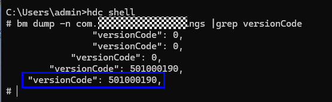

# 包管理子系统通用错误码

> **说明：**
>
> 以下仅介绍本模块特有错误码，通用错误码请参考[通用错误码说明文档](../errorcode-universal.md)。

## 17700001 指定的bundleName不存在

**错误信息**<br/>
The specified bundle name is not found.

**错误描述**<br/>
调用查询等接口时，传入的bundleName不存在。

**可能原因**<br/>

1. 输入的bundleName有误。
2. 系统中对应的应用没有安装。

**处理步骤**<br/>
1. 检查bundleName拼写是否正确。
2. 确认对应的应用是否安装。

## 17700002 指定的moduleName不存在

**错误信息**<br/>
The specified module name is not found.

**错误描述**<br/>
调用查询或者免安装相关接口时，传入的moduleName不存在。

**可能原因**<br/>
1. 输入的moduleName有误。
2. 系统中对应的应用没有安装该模块。

**处理步骤**<br/>
1. 检查moduleName拼写是否正确。
2. 确认对应的应用是否安装该模块。

## 17700003 指定的abilityName不存在

**错误信息**<br/>
The specified ability name is not found.

**错误描述**<br/>
调用查询等接口时，传入的abilityName不存在。

**可能原因**<br/>
1. 输入的abilityName有误。
2. 系统中对应的应用不存在该abilityName对应的ability。

**处理步骤**<br/>
1. 检查abilityName拼写是否正确。
2. 确认对应的应用是否存在该abilityName对应的ability。

## 17700004 指定的用户不存在

**错误信息**<br/>
The specified user ID is not found.

**错误描述**<br/>
调用与用户相关接口时，传入的用户不存在。<!--Del-->[BundleInstaller.install](js-apis-installer-sys.md#bundleinstallerinstall)抛出该错误码时，错误信息后会追加内部错误码用于定位错误原因，例如`[8519687]`。<!--DelEnd-->

**可能原因**<br/>
1. 输入的用户名有误。
2. 系统中没有该用户。

**处理步骤**<br/>
1. 检查用户名拼写是否正确。
2. 确认系统中存在该用户。
<!--Del-->
## 17700005 指定的appId为空字符串

**错误信息**<br/>
The specified app ID is an empty string.

**错误描述**<br/>
调用[appControl模块](../apis-ability-kit/js-apis-appControl-sys.md)中的相关接口时，传入的appId为空字符串。

**可能原因**<br/>
传入的appId为空字符串。

**处理步骤**<br/>
检查appId是否为空字符串。

## 17700006 查询的权限不存在

**错误信息**<br/>
The specified permission is not found.

**错误描述**<br/>
调用bundleManager模块中的[getPermissionDef接口](../apis-ability-kit/js-apis-bundleManager-sys.md#bundlemanagergetpermissiondef)时，传入的权限不存在。

**可能原因**<br/>
1. 传入的permission名称拼写有误。
2. 系统中不存在对应的权限。

**处理步骤**<br/>
1. 检查permission拼写是否正确。
2. 确认系统中是否有该权限。

## 17700007 输入的设备Id有误

**错误信息**<br/>
The specified device ID is not found.

**错误描述**<br/>
调用[distributedBundle模块](../apis-ability-kit/js-apis-distributedBundleManager-sys.md)相关接口时，传入的设备id有误。

**可能原因**<br/>
1. 传入的deviceId拼写有误。
2. deviceId不存在。

**处理步骤**<br/>
1. 检查deviceId拼写是否正确。
2. 确认deviceId是否存在。

## 17700010 文件解析失败导致应用安装失败

**错误信息**<br/>
Failed to install the HAP because the HAP fails to be parsed.

**错误描述**<br/>
调用installer模块中的[install接口](../apis-ability-kit/js-apis-installer-sys.md#bundleinstallerinstall)时，传入的HAP解析失败。[BundleInstaller.install](js-apis-installer-sys.md#bundleinstallerinstall)抛出该错误码时，错误信息后会追加内部错误码用于定位错误原因，例如`[8519687]`。

**可能原因**<br/>
1. HAP的格式不是zip格式。
2. HAP的配置文件不满足json格式。
3. HAP的配置文件缺少必要的字段。

**处理步骤**<br/>
1. 确认hap的格式是zip。
2. 确认hap的配置文件满足[配置文件json格式](../../quick-start/application-configuration-file-overview-stage.md)。
3. 检查DevEco Studio编译hap时是否有错误提示，缺省字段时会有相应的报错。

## 17700011 签名校验失败导致应用安装失败

**错误信息**<br/>
Failed to install the HAP because the HAP signature fails to be verified.

**错误描述**<br/>
调用installer模块中的[install接口](../apis-ability-kit/js-apis-installer-sys.md#bundleinstallerinstall)时，签名校验失败导致应用安装失败。[BundleInstaller.install](js-apis-installer-sys.md#bundleinstallerinstall)抛出该错误码时，错误信息后会追加内部错误码用于定位错误原因，例如`[8519687]`。

**可能原因**<br/>

1. HAP没有签名。
2. hap签名信息来源不可靠。
3. 升级的HAP与已安装的HAP签名信息不一致。
4. 多个hap的签名信息不一致。

**处理步骤**<br/>
1. 确认hap包是否签名成功。
2. 确认hap包的签名证书是从应用市场申请。
3. 确认多个hap包签名时使用的证书相同。
4. 确认升级的hap包签名证书与已安装的hap包相同。

## 17700012 安装包路径无效或者文件过大导致应用安装失败

**错误信息**<br/>
Failed to install the HAP because the HAP path is invalid or the HAP is too large.

**错误描述**<br/>
调用installer模块中的[install接口](../apis-ability-kit/js-apis-installer-sys.md#bundleinstallerinstall)时，安装包路径无效或者文件过大导致应用安装失败。[BundleInstaller.install](js-apis-installer-sys.md#bundleinstallerinstall)抛出该错误码时，错误信息后会追加内部错误码用于定位错误原因，例如`[8519687]`。

**可能原因**<br/>
1. 输入错误，HAP的文件路径不存在。
2. HAP的路径无法访问。
3. HAP的大小超过最大限制4G。

**处理步骤**<br/>
1. 确认hap是否存在。
2. 查看hap的可执行权限，是否可读。
3. 查看HAP的大小是否超过4G。

## 17700015 多个HAP配置信息不同导致应用安装失败

**错误信息**<br/>
Failed to install the HAPs because they have different configuration information.

**错误描述**<br/>
调用installer模块中的[install接口](../apis-ability-kit/js-apis-installer-sys.md#bundleinstallerinstall)时，多个HAP配置信息不同导致应用安装失败。[BundleInstaller.install](js-apis-installer-sys.md#bundleinstallerinstall)抛出该错误码时，错误信息后会追加内部错误码用于定位错误原因，例如`[8519687]`。

**可能原因**<br/>
多个hap包中配置文件中app标签下面的字段信息不一致。

**处理步骤**<br/>
确认多个HAP中配置文件app下面的字段是否一致。

## 17700016 系统磁盘空间不足导致应用安装失败

**错误信息**<br/>
Failed to install the HAP because of insufficient system disk space.

**错误描述**<br/>
调用installer模块中的[install接口](../apis-ability-kit/js-apis-installer-sys.md#bundleinstallerinstall)时，系统磁盘空间不足导致应用安装失败。[BundleInstaller.install](js-apis-installer-sys.md#bundleinstallerinstall)抛出该错误码时，错误信息后会追加内部错误码用于定位错误原因，例如`[8519687]`。

**可能原因**<br/>
系统空间不足。

**处理步骤**<br/>
确认系统是否有足够的空间。

## 17700017 新安装的应用版本号低于已安装的版本号导致应用安装失败

**错误信息**<br/>
Failed to install the HAP since the version of the HAP to install is too early.

**错误描述**<br/>
调用installer模块中的[install接口](../apis-ability-kit/js-apis-installer-sys.md#bundleinstallerinstall)时，新安装的应用版本号低于已安装的版本号导致应用安装失败。[BundleInstaller.install](js-apis-installer-sys.md#bundleinstallerinstall)抛出该错误码时，错误信息后会追加内部错误码用于定位错误原因，例如`[8519687]`。

**可能原因**<br/>
新安装的应用版本号低于已安装的版本号。

**处理步骤**<br/>
确认新安装的应用版本号是否不低于已安装的同应用版本号。

1. 已安装应用版本号查询，依赖[hdc工具](../../dfx/hdc.md#环境准备)。
```
// 取dump出来的最后一个字段
hdc shell bm dump -n com.xxx.demo |grep versionCode
```



2. 新安装的应用查看版本，HAP或者HSP用DevEco Studio打开，查看里面module.json文件中的versionCode字段配置。


## 17700018 安装失败，依赖的模块不存在

**错误信息**<br/>
Failed to install the HAP or HSP because the dependent module does not exist.

**错误描述**<br/>
安装hap或者hsp时，依赖的模块不存在。[BundleInstaller.install](js-apis-installer-sys.md#bundleinstallerinstall)抛出该错误码时，错误信息后会追加内部错误码用于定位错误原因，例如`[8519687]`。

**可能原因**<br/>
依赖的模块没有安装。

**处理步骤**<br/>
先安装依赖的模块。

## 17700020 预置应用无法卸载

**错误信息**<br/>
The preinstalled app cannot be uninstalled.

**错误描述**<br/>
调用installer模块中的[uninstall接口](../apis-ability-kit/js-apis-installer-sys.md#bundleinstalleruninstall)卸载预置应用时，无法卸载。

**可能原因**<br/>
1. 传入的bundleName拼写有误。
2. 对应的预置应用无法卸载。

**处理步骤**<br/>
1. 确认bundleName是否拼写正确。
2. 确认对应的预置应用是否可卸载。<!--DelEnd-->

## 17700021 指定的uid无效

**错误信息**<br/>
The specified uid is invalid.

**错误描述**<br/>
调用bundleManager模块中的[getBundleNameByUid接口](../apis-ability-kit/js-apis-bundleManager.md#bundlemanagergetbundlenamebyuid14)时，指定的uid无效。

**可能原因**<br/>
1. 传入的uid拼写有误。
2. 传入的uid在系统中不存在。

**处理步骤**<br/>
1. 检查uid的拼写。
2. 检查系统中是否存在该uid。
<!--Del-->
## 17700022 输入的待解析源文件无效

**错误信息**<br/>
The input source file is invalid.

**错误描述**<br/>
调用bundleManager模块中的[getBundleArchiveInfo接口](../apis-ability-kit/js-apis-bundleManager-sys.md#bundlemanagergetbundlearchiveinfo)时，传入的HAP路径无效。

**可能原因**<br/>
1. 待解析的源文件不存在。
2. 待解析的源文件不符合zip格式。

**处理步骤**<br/>
1. 确认待解析的源文件是否存在。
2. 确认待解析的源文件符合zip格式。

## 17700023 指定的默认应用不存在

**错误信息**<br/>
The specified default app does not exist.

**错误描述**<br/>
调用defaultAppManager模块中的[getDefaultApplication接口](../apis-ability-kit/js-apis-defaultAppManager-sys.md#defaultappmanagergetdefaultapplication)时，指定的默认应用不存在。

**可能原因**<br/>
设备没有设置对应的默认应用。

**处理步骤**<br/>
确认设备是否设置了对应的默认应用。<!--DelEnd-->

## 17700024 没有相应的配置文件

**错误信息**<br/>
Failed to get the profile because the specified profile is not found in the HAP.

**错误描述**<br/>
调用查询profile文件的相关接口时，没有相应的配置文件。

**可能原因**<br/>
1. 输入的metadata name在配置文件中不存在。
2. 配置文件的内容不是json格式。
3. 查询的配置文件类型不存在。

**处理步骤**<br/>
1. 确认要查询的ability或者extensionAbility中的metadata name是否存在。
2. 确认指定查询的profile文件的内容是否为json格式。
3. 确认应用中是否存在与查询的profileType类型相符的配置文件。
<!--Del-->
## 17700025 输入的type无效

**错误信息**<br/>
The specified type is invalid.

**错误描述**<br/>
调用defaultAppManager模块的相关接口时，输入的type无效。

**可能原因**<br/>
1. 输入的type拼写有误。
2. 输入的type不存在。

**处理步骤**<br/>
1. 确认输入的type是否拼写正确。
2. 确认输入的type是否存在。<!--DelEnd-->

## 17700026 指定应用被禁用

**错误信息**<br/>
The specified bundle is disabled.

**错误描述**<br/>
当调用查询应用的相关信息接口时，指定应用被禁用。

**可能原因**<br/>
设备上对应的应用已经被禁用，无法查询。

**处理步骤**<br/>
确认设备上对应的应用是否被禁用。
<!--Del-->
## 17700027 分布式服务未启动

**错误信息**<br/>
The distributed service is not running.

**错误描述**<br/>
当调用[distributedBundle模块](../apis-ability-kit/js-apis-distributedBundleManager-sys.md)的相关接口时，分布式服务未启动。

**可能原因**<br/>
设备未组网。

**处理步骤**<br/>
确认设备是否组网成功。
## 17700028 输入的ability与type不匹配

**错误信息**<br/>
The ability does not match the type.

**错误描述**<br/>
当调用defaultAppManager模块中的[setDefaultApplication接口](../apis-ability-kit/js-apis-defaultAppManager-sys.md#defaultappmanagersetdefaultapplication)时，输入的ability与type不匹配。

**可能原因**<br/>
输入的ability和type拼写有误。

**处理步骤**<br/>
确认输入的ability和type拼写是否正确。<!--DelEnd-->

## 17700029 指定的ability被禁用

**错误信息**<br/>
The specified ability is disabled.

**错误描述**<br/>
当调用查询ability相关信息的接口时，指定的ability被禁用。

**可能原因**<br/>
指定的ability被禁用。

**处理步骤**<br/>
确认指定的ability是否被禁用，可以使用[bm工具](../../tools/bm-tool.md)查询对应的应用信息。
<!--Del-->
## 17700030 指定的应用不支持清除缓存文件

**错误信息**<br/>
The specified bundle does not support clearing of cache files.

**错误描述**<br/>
当调用bundleManager模块中的[cleanBundleCacheFiles接口](../apis-ability-kit/js-apis-bundleManager-sys.md#bundlemanagercleanbundlecachefiles)时，指定的应用不支持清除缓存文件。

**可能原因**<br/>
指定的应用为系统应用且在签名证书中配置了不能清除数据(AllowAppDataNotCleared)的字段。

**处理步骤**<br/>
1. 确认指定的应用是否为系统应用，可以使用[bm工具](../../tools/bm-tool.md)查询对应的应用信息，查看isSystemApp是否为true。
2. 确认指定的应用是否配置了能清除缓存(AllowAppDataNotCleared)的字段，可以使用[bm工具](../../tools/bm-tool.md)查询对应的应用信息，查看userDataClearable是否为true。

## 17700031 Overlay特性校验失败导致HAP安装失败

**错误信息**<br/>
Failed to install the HAP because the overlay check of the HAP failed.

**错误描述**<br/>
当安装overlay特征的应用时，指定的应用和待安装的overlay特征应用不为预置应用，或者目标应用/目标module是overlay特征的应用/module。[BundleInstaller.install](js-apis-installer-sys.md#bundleinstallerinstall)抛出该错误码时，错误信息后会追加内部错误码用于定位错误原因，例如`[8519687]`。

**可能原因**<br/>
1. 使用应用间的overlay特性时，overlay特征应用必须为预置应用。
2. 使用应用间的overlay特性时，目标应用必须为预置应用。
3. 使用应用间的overlay特性时，目标应用不能是具有overlay特征的应用
4. 目标module不能是具有overlay特征的module。

**处理步骤**<br/>
1. 检查overlay特征应用是否为预置应用。
2. 检查目标应用是否为预置应用。
3. 检查目标应用是否不为overlay特征的应用
4. 检查目标module是否不为overlay特征的module。<!--DelEnd-->

## 17700032 指定的应用不包含overlay特征的module

**错误信息**<br/>
The specified bundle does not contain any overlay module.

**错误描述**<br/>
查询指定应用中overlay特征module的overlayModuleInfo时，指定的应用不包含overlay特征module。

**可能原因**<br/>
指定的应用不包含overlay特征module。

**处理步骤**<br/>
检查指定的应用是否不包含overlay特征module。

## 17700033 指定的module不是overlay特征的module

**错误信息**<br/>
The specified module is not an overlay module.

**错误描述**<br/>
查询指定的overlay特征module的overlayModuleInfo时，指定的module不是overlay特征module。

**可能原因**<br/>
指定的module不是overlay特征的module。

**处理步骤**<br/>
检查指定的module是否不为overlay特征的module。

## 17700034 指定的module是overlay特征的module

**错误信息**<br/>
The specified module is an overlay module.

**错误描述**<br/>
查询指定的目标module所关联的overlayModuleInfo时，指定的module是overlay特征module。

**可能原因**<br/>
指定的module是overlay特征的module。

**处理步骤**<br/>
检查指定的module是否为overlay特征的module。
<!--Del-->
## 17700035 指定的应用只包含overlay特征的module

**错误信息**<br/>
The specified bundle is an overlay bundle.

**错误描述**<br/>
查询指定应用的目标module所关联的overlayModuleInfo时，指定的应用只包含overlay特征的module。

**可能原因**<br/>
指定的应用只包含overlay特征的module。

**处理步骤**<br/>
检查指定的应用是否只包含overlay特征的module。

## 17700036 共享库缺少AllowAppShareLibrary特权导致安装失败

**错误信息**<br/>
Failed to install the HSP due to the lack of required permission.

**错误描述**<br/>
共享库未申请配置AllowAppShareLibrary特权，可能存在安全隐私风险，不允许安装。[BundleInstaller.install](js-apis-installer-sys.md#bundleinstallerinstall)抛出该错误码时，错误信息后会追加内部错误码用于定位错误原因，例如`[8519687]`。

**可能原因**<br/>
发布共享库前，未申请配置AllowAppShareLibrary特权。

**处理步骤**<br/>
为共享库申请配置AllowAppShareLibrary特权，重新签名并发布。

## 17700037 被卸载的shared library版本被其他应用依赖

**错误信息**<br/>
The version of the shared bundle is dependent on other applications.

**错误描述**<br/>
当卸载shared library某一版本时，指定的shared library的版本被其他应用依赖，卸载失败。

**可能原因**<br/>
1. 当前卸载的版本是shared library的最高版本，且该shared library被其他应用依赖。
2. 当前卸载时未指定shared library的版本，会卸载shared library的所有版本，该shared library被其他应用依赖。

**处理步骤**<br/>
1. 检查被卸载的shared library是否被其他应用依赖。
2. 检查被卸载的版本是否为shared library的最高版本。

## 17700038 被卸载的shared library不存在

**错误信息**<br/>
The specified shared bundle does not exist.

**错误描述**<br/>
当卸载shared library时，卸载的shared library不存在。

**可能原因**<br/>
1. 当前指定卸载的版本不存在与被卸载的shared library中。
2. 当前指定卸载的shared library不存在与设备中。

**处理步骤**<br/>
1. 检查被卸载的shared library是否存在于当前设备中。
2. 检查被卸载的版本是否存在于被卸载的shared library中。

## 17700039 不允许安装应用间共享库
**错误信息**<br/>
Failed to install the HSP because installing a shared bundle specified by hapFilePaths is not allowed.

**错误描述**<br/>
安装应用时，传入的安装包为应用间共享库类型。[BundleInstaller.install](js-apis-installer-sys.md#bundleinstallerinstall)抛出该错误码时，错误信息后会追加内部错误码用于定位错误原因，例如`[8519687]`。

**可能原因**<br/>
1. 通过[bm工具](../../tools/bm-tool.md)安装应用时，-p参数传入了应用间共享库的安装包路径。
2. 通过[install接口](../apis-ability-kit/js-apis-installer-sys.md#bundleinstallerinstall)安装应用时，hapFilePaths参数传入了应用间共享库的安装包路径。

**处理步骤**<br/>
1. 通过-p参数指定应用间共享库的安装包路径。
2. 通过installParam参数的sharedBundleDirPaths字段指定应用间共享库的安装包路径。

## 17700040 不允许卸载应用间共享库
**错误信息**<br/>
The specified bundle is a shared bundle which cannot be uninstalled.

**错误描述**<br/>
卸载应用时，传入的是应用间共享库的包名。

**可能原因**<br/>
1. 通过[bm工具](../../tools/bm-tool.md)卸载应用时，-n参数传入了应用间共享库的包名。
2. 通过[uninstall接口](../apis-ability-kit/js-apis-installer-sys.md#bundleinstalleruninstall)卸载应用时，bundleName传入的是应用间共享库的包名。

**处理步骤**<br/>
1. 通过-n参数指定卸载的应用为共享库应用。
2. 通过UninstallParam参数的bundleName及versionCode指定卸载的共享库的包名及版本。

## 17700041 企业设备管理不允许安装该应用
**错误信息**<br/>
Failed to install the HAP because the installation is forbidden by enterprise device management.

**错误描述**<br/>
安装应用时，企业设备管理不允许安装。[BundleInstaller.install](js-apis-installer-sys.md#bundleinstallerinstall)抛出该错误码时，错误信息后会追加内部错误码用于定位错误原因，例如`[8519687]`。

**可能原因**<br/>
企业设备管理不允许安装该应用。

**处理步骤**<br/>
请在设备中检查应用是否被企业设备管理禁止安装。

## 17700042 数据代理中的uri配置错误
**错误信息**<br/>
Failed to install the HAP because of incorrect URI in the data proxy.

**错误描述**<br/>
安装应用时，数据代理的uri配置错误。[BundleInstaller.install](js-apis-installer-sys.md#bundleinstallerinstall)抛出该错误码时，错误信息后会追加内部错误码用于定位错误原因，例如`[8519687]`。

**可能原因**<br/>
1. uri中的包名与当前应用的包名不一致。
2. uri重复。

**处理步骤**<br/>
1. 修改uri中的包名为当前应用的包名。
2. 修改重复的uri，每一个数据代理的uri都是唯一的。

## 17700043 数据代理中的权限配置错误
**错误信息**<br/>
Failed to install the HAP because of low APL in the non-system data proxy (required APL: system_basic or system_core).

**错误描述**<br/>
安装应用时，非系统应用的数据代理的权限等级过低，应为system_basic或system_core。[BundleInstaller.install](js-apis-installer-sys.md#bundleinstallerinstall)抛出该错误码时，错误信息后会追加内部错误码用于定位错误原因，例如`[8519687]`。

**可能原因**<br/>
1. 非系统应用的数据代理未配置权限。
2. 非系统应用的数据代理的权限等级过低。

**处理步骤**<br/>
1. 在数据代理中配置读权限和写权限。
2. 修改读权限和写权限，并确认其权限等级为system_basic或system_core。

## 17700044 安装包设置的多进程配置项与系统配置项设置矛盾
**错误信息**<br/>
Failed to install the HAP because the isolationMode configured is not supported.

**错误描述**<br/>
安装应用时，设置的isolationMode与系统配置项所允许的系统配置项矛盾。[BundleInstaller.install](js-apis-installer-sys.md#bundleinstallerinstall)抛出该错误码时，错误信息后会追加内部错误码用于定位错误原因，例如`[8519687]`。

**可能原因**<br/>
1. 设备支持隔离模式，即persist.bms.supportIsolationMode为true时，HAP配置的isolationMode为nonisolationOnly。
2. 设备不支持隔离模式，即persist.bms.supportIsolationMode为false时，HAP配置的isolationMode为isolationOnly。

**处理步骤**<br/>
按照设备的隔离模式正确配置HAP字段isolationMode。

## 17700045 企业设备管理不允许卸载该应用
**错误信息**<br/>
Failed to uninstall the HAP because the uninstall is forbidden by enterprise device management.

**错误描述**<br/>
卸载应用时，企业设备管理不允许卸载。

**可能原因**<br/>
企业设备管理不允许安装该应用。

**处理步骤**<br/>
请在设备中检查应用是否被企业设备管理禁止卸载安装。

## 17700047 要更新的应用版本没有大于当前版本
**错误信息**<br/>
Failed to install the HAP because the VersionCode to be updated is not greater than the current VersionCode.

**错误描述**<br/>
安装应用时，要更新的应用版本没有大于当前版本。[BundleInstaller.install](js-apis-installer-sys.md#bundleinstallerinstall)抛出该错误码时，错误信息后会追加内部错误码用于定位错误原因，例如`[8519687]`。

**可能原因**<br/>
1. 安装应用的版本号小于等于已安装应用的版本号。
2. installFlag被设置为NORMAL，此时待更新的应用的版本号必须大于当前已安装的版本。

**处理步骤**<br/>
1. 设置应用的版本号大于当前版本，查看版本号的方法请参考[17700017错误码](#17700017-新安装的应用版本号低于已安装的版本号导致应用安装失败)的操作步骤。
2. 如果希望应用更新但版本号不升级，需要设置installFlag为REPLACE_EXISTING。

## 17700048 代码签名校验失败
**错误信息**<br/>
Failed to install the HAP because the code signature verification failed.

**错误描述**<br/>
安装应用时，安装包的代码签名文件校验失败。[BundleInstaller.install](js-apis-installer-sys.md#bundleinstallerinstall)抛出该错误码时，错误信息后会追加内部错误码用于定位错误原因，例如`[8519687]`。

**可能原因**<br/>
1. 代码签名文件对应的module在安装包中不存在。
2. 代码签名文件路径无效。
3. 代码签名文件和对应的安装包不匹配。

**处理步骤**<br/>
1. 检查代码签名文件对应的module是否包含在安装包路径之中。
2. 检查提供的代码签名文件的路径是否合法。
3. 使用和安装包匹配的代码签名文件。

## 17700049 应用自升级时安装的应用与调用方包名不同
**错误信息**<br/>
Failed to install the HAP because the bundleName is different from the bundleName of the caller application.

**错误描述**<br/>
企业mdm应用自升级时，安装的应用与调用方包名不同。

**可能原因**<br/>
要安装的hap或hsp不属于当前应用。

**处理步骤**<br/>
检查要安装的hap或hsp是否属于当前应用。

## 17700050 企业设备校验失败
**错误信息**<br/>
Failed to install the HAP because an enterprise normal/MDM bundle cannot be installed on non-enterprise devices.

**错误描述**<br/>
安装应用时，企业normal应用或企业mdm应用无法在非企业设备上安装。[BundleInstaller.install](js-apis-installer-sys.md#bundleinstallerinstall)抛出该错误码时，错误信息后会追加内部错误码用于定位错误原因，例如`[8519687]`。

**可能原因**<br/>
安装设备不是企业设备。

**处理步骤**<br/>
1. 检查安装设备是否为企业设备。
2. 检查设备参数const.bms.allowenterprisebundle是否为true。

## 17700051 应用自升级时调用方的签名证书profile文件中的类型不是企业mdm
**错误信息**<br/>
Failed to install the HAP because the distribution type of the caller application is not enterprise_mdm.

**错误描述**<br/>
企业mdm应用自升级时，调用方[签名证书profile文件](https://developer.huawei.com/consumer/cn/doc/app/agc-help-add-releaseprofile-0000001914714796)中的类型不是企业mdm。

**可能原因**<br/>
调用方签名证书profile文件中的类型不是企业mdm。

**处理步骤**<br/>
检查应用的签名文件是否正确配置。

## 17700052 非开发者模式下不允许安装调试应用
**错误信息**<br/>
Failed to install the HAP because a debug bundle can be installed only in developer mode.

**错误描述**<br/>
安装调试应用时，设备处于非开发者模式，不允许安装。[BundleInstaller.install](js-apis-installer-sys.md#bundleinstallerinstall)抛出该错误码时，错误信息后会追加内部错误码用于定位错误原因，例如`[8519687]`。

**可能原因**<br/>
应用为调试应用，而设备处于非开发者模式。

**处理步骤**<br/>
执行hdc shell param get const.security.developermode.state，若返回结果为false，说明该设备无法安装调试应用。

## 17700053 非应用市场调用
**错误信息**<br/>
The caller is not AppGallery.

**错误描述**<br/>
非应用市场的应用调用，仅供应用市场调用的接口。

**可能原因**<br/>
调用者不是应用市场。

**处理步骤**<br/>
请检查调用者是否是应用市场。

## 17700054 权限校验失败导致应用安装失败
**错误信息**<br/>
Failed to install the HAP because the HAP requests wrong permissions.

**错误描述**<br/>
待安装的应用申请了错误的权限，导致安装失败。[BundleInstaller.install](js-apis-installer-sys.md#bundleinstallerinstall)抛出该错误码时，错误信息后会追加内部错误码用于定位错误原因，例如`[8519687]`。

**可能原因**<br/>
1. 非MDM应用申请了MDM类型的权限。
2. 应用的权限级别比其申请权限的权限级别低。

**处理步骤**<br/>
1. 排查是否申请了[MDM类型的权限](../../security/AccessToken/permissions-for-mdm-apps.md)，MDM类型的权限仅针对应用类型为MDM的应用开放。
2. 排查申请的权限是否为开放权限。详情请见[权限列表](../../security/AccessToken/app-permissions.md)。<!--DelEnd-->

## 17700055 指定的link无效

**错误信息**<br/>
The specified link is invalid.

**错误描述**<br/>
调用bundleManager模块中的[canOpenLink接口](../apis-ability-kit/js-apis-bundleManager.md#bundlemanagercanopenlink12)时，指定的link无效。

**可能原因**<br/>
输入的link格式有误。

**处理步骤**<br/>
检查link格式是否正确。

## 17700056 指定link的scheme未在querySchemes字段下配置

**错误信息**<br/>
The scheme of the specified link is not in the querySchemes.

**错误描述**<br/>
调用bundleManager模块中的[canOpenLink接口](../apis-ability-kit/js-apis-bundleManager.md#bundlemanagercanopenlink12)时，指定link的scheme未在querySchemes字段下配置。

**可能原因**<br/>
未在querySchemes字段下配置指定link的scheme。

**处理步骤**<br/>
检查是否在querySchemes字段下配置了相应的URL scheme。
<!--Del-->
## 17700057 指定的应用不是预置应用

**错误信息**<br/>
Failed to uninstall updates because the HAP is not pre-installed.

**错误描述**<br/>
调用installer模块中的[uninstallUpdates接口](../apis-ability-kit/js-apis-installer-sys.md#bundleinstalleruninstallupdates12)时，指定的应用不是预置应用。

**可能原因**<br/>
指定的应用不是预置应用，无法调用uninstallUpdates接口。

**处理步骤**<br/>
确认指定的应用是否为预置应用。

## 17700058 指定的应用禁止在本设备或指定用户下安装

**错误信息**<br/>
Failed to install the HAP because this application is prohibited from being installed on this device or by specified users.

**错误描述**<br/>
指定的应用禁止在本设备或指定用户下安装。[BundleInstaller.install](js-apis-installer-sys.md#bundleinstallerinstall)抛出该错误码时，错误信息后会追加内部错误码用于定位错误原因，例如`[8519687]`。

**可能原因**<br/>
1. 当前使用的设备是洗白机。
2. 指定的应用不支持在指定的用户下安装。

**处理步骤**<br/>
1. 确认使用的设备是否是洗白机。
2. 将指定的应用安装在其他用户下。

## 17700059 指定的开发者ID不存在

**错误信息**<br/>
The specified developerId is invalid.

**错误描述**<br/>
调用bundleManager模块中的[getAllBundleInfoByDeveloperId接口](../apis-ability-kit/js-apis-bundleManager-sys.md#bundlemanagergetallbundleinfobydeveloperid12)时，指定的developerId无效。

**可能原因**<br/>
设备上未安装指定开发者ID的应用。

**处理步骤**<br/>
检查输入的开发者ID有效性。

## 17700060 指定的应用不允许被卸载

**错误信息**<br/>
The specified application cannot be uninstalled.

**错误描述**<br/>
调用BundleInstaller模块中的[uninstall接口](../apis-ability-kit/js-apis-installer-sys.md#bundleinstalleruninstall)或bundleManager模块中的[switchUninstallState接口](../apis-ability-kit/js-apis-bundleManager-sys.md#bundlemanagerswitchuninstallstate12)时，指定的应用不允许被卸载。

**可能原因**<br/>
1. 调用uninstall接口卸载指定应用时，应用由于自身业务拒绝了此次卸载操作。
2. 调用switchUninstallState接口时，指定的应用具有不可卸载特权。

**处理步骤**<br/>
1. 查看应用提示的无法卸载的具体原因，并进行相应操作。
2. 检查指定的应用是否具有不可卸载特权。

## 17700061 指定的应用分身索引无效

**错误信息**<br/>
The appIndex is invalid.

**错误描述**<br/>
调用应用分身相关的接口时，指定的应用分身索引无效。

**可能原因**<br/>
1. 分身索引超出允许的范围。
2. 应用没有该索引的分身。
3. 创建应用分身时，该索引已存在。

**处理步骤**<br/>
1. 检查索引是否再允许范围内。
2. 检查应用是否有该索引的分身。
3. 检查是否调用createAppClone，且该索引的应用分身是否已存在。

## 17700062 应用设置了卸载处置规则，不允许直接卸载

**错误信息**<br/>
Failed to uninstall the app because the app has uninstall rule.

**错误描述**<br/>
卸载应用时，应用存在卸载处置规则，不允许直接卸载。

**可能原因**<br/>
应用存在卸载处置规则，不允许直接卸载。

**处理步骤**<br/>
检查应用是否设置了卸载处置规则，由设置方对规则进行处理。

## 17700065 ShortcutInfo结构体中指定的want，不支持被拉起

**错误信息**<br/>
The ability specified by want in the ShortcutInfo struct cannot be started.

**错误描述**<br/>
调用launcherBundleManager模块中的[startShortcut接口](../apis-ability-kit/js-apis-launcherBundleManager-sys.md#launcherbundlemanagerstartshortcut12)时，ShortcutInfo结构体中的want指定的ability不支持被拉起。

**可能原因**<br/>
ShortcutInfo结构体中的want指定的ability不存在，ShortcutInfo结构体中的want指定的ability不能被拉起等。

**处理步骤**<br/>
检查ShortcutInfo结构体中的want有效性。

## 17700066 安装失败，native软件包安装失败

**错误信息**<br/>
Failed to install the HAP because installing the native package failed.

**错误描述**<br/>
安装hap时，native软件包安装失败。[BundleInstaller.install](js-apis-installer-sys.md#bundleinstallerinstall)抛出该错误码时，错误信息后会追加内部错误码用于定位错误原因，例如`[8519687]`。

**可能原因**<br/>native软件包配置信息有误。

**处理步骤**<br/>检查native软件包的配置信息。

## 17700067 卸载应用失败，native软件包卸载失败

**错误信息**<br/>
Failed to uninstall the HAP because uninstalling the native package failed.

**错误描述**<br/>卸载应用时，native软件包卸载失败。

**可能原因**<br/>需要卸载的native软件包被占用。

**处理步骤**<br/>检查是否存在进程占用相应native软件包。

## 17700069 多开模式非分身的应用，不能创建分身实例

**错误信息**<br/>
The app does not support the creation of an appClone instance.

**错误描述**<br/>
多开模式非分身的应用，不能创建分身实例。

**可能原因**<br/>
没有配置分身模式，或者多开模式配置为其他模式。

**处理步骤**<br/>
1. 检查更新应用是否支持分身。

## 17700070 指定的快捷方式id不合法

**错误信息**<br/>
The specified shortcut id is illegal.

**错误描述**<br/>
快捷方式id是不合法的。

**可能原因**<br/>
已经存在相同包名、分身索引、用户id和快捷方式id的快捷方式信息；传参对应的快捷方式id不存在，或快捷方式id为空字符串。

**处理步骤**<br/>
1. 检查包名或者快捷方式id是否正确。

## 17700071 不允许企业应用安装
**错误信息**<br/>
It is not allowed to install the enterprise bundle.

**错误描述**<br/>
[特定的安装接口](../apis-ability-kit/js-apis-installer-sys.md#bundleinstallerinstallpreexistingapp12)，不允许通过其安装企业应用。

**可能原因**<br/>
因策略管制，不允许通过特定的接口，安装企业应用。

**处理步骤**<br/>
请更换[install接口](../apis-ability-kit/js-apis-installer-sys.md#bundleinstallerinstall)。<!--DelEnd-->


## 17700072 Launch Want不存在
**错误信息**<br/>
The launch want is not found.

**错误描述**<br/>
Launch Want不存在。

**可能原因**<br/>
应用没有Ability，或者没有entities配置为entity.system.home和actions配置为ohos.want.action.home的Ability。

**处理步骤**<br/>
应用需要有entities配置为entity.system.home并且actions配置为ohos.want.action.home的Ability。

<!--Del-->
## 17700073 由于设备上存在具有相同包名称但不同签名信息的应用程序，导致安装失败
**错误信息**<br/>
Failed to install the HAP because an application with the same bundle name but different signature information exists on the device.

**错误描述**<br/>
由于设备上存在具有相同包名称但不同签名信息的应用程序，导致安装失败。[BundleInstaller.install](js-apis-installer-sys.md#bundleinstallerinstall)抛出该错误码时，错误信息后会追加内部错误码用于定位错误原因，例如`[8519687]`。

**可能原因**<br/>

1. 由于设备上存在具有相同包名称但不同签名信息的已安装应用程序，导致安装失败。
2. 设备上存在相同包名但签名信息不一致的应用被保留数据地卸载，导致安装失败。

**处理步骤**<br/>
1. 卸载设备上相同包名的应用。
2. 若设备上存在相同包名但签名信息不一致的应用被保留数据地卸载，导致安装失败，则先安装已卸载的应用之后不保留数据地卸载掉。

## 17700074 传入的appIdentifier无效

**错误信息**<br/>
The specified appIdentifier is invalid.

**错误描述**<br/>
调用[appControl模块](../apis-ability-kit/js-apis-appControl-sys.md)中的相关接口时，传入的appIdentifier为无效。

**可能原因**<br/>
传入的appIdentifier为空字符串。

**处理步骤**<br/>
检查appIdentifier是否为空字符串。

## 17700075 want指定的bundleName与调用方不符

**错误信息**<br/>
The specified bundleName of want is not the same with caller.

**错误描述**<br/>
设置卸载处置规则时，want指定的bundleName与调用方不相同。

**可能原因**<br/>
设置卸载处置规则时，want指定的bundleName与调用方不相同。

**处理步骤**<br/>
修改want指定的bundleName与调用方相同。

## 17700076 签名证书profile文件中的类型被限制，不允许安装到当前设备中，导致安装失败
**错误信息**<br/>
Failed to install the HAP or HSP because the app distribution type is not allowed.

**错误描述**<br/>
签名证书profile文件中的类型被限制，不允许安装到当前设备中。[BundleInstaller.install](js-apis-installer-sys.md#bundleinstallerinstall)抛出该错误码时，错误信息后会追加内部错误码用于定位错误原因，例如`[8519687]`。

**可能原因**<br/>
该[签名证书profile文件](https://developer.huawei.com/consumer/cn/doc/app/agc-help-add-releaseprofile-0000001914714796)中的类型被限制，禁止安装到当前设备中。

**处理步骤**<br/>
更换签名证书profile文件中的类型。

## 17700077 安装应用失败，但安装对应的预置应用成功

**错误信息**<br/>
Failed to install the HAP and restore to preinstalled bundle.

**错误描述**<br/>
安装指定应用前，若对应的预置应用已卸载，会优先安装预置应用，预置应用安装成功后安装指定应用失败。[BundleInstaller.install](js-apis-installer-sys.md#bundleinstallerinstall)抛出该错误码时，错误信息后会追加内部错误码用于定位错误原因，例如`[8519687]`。

**可能原因**<br/>
1. 待安装应用的版本号小于等于预置版本号。

**处理步骤**<br/>
1. 检查并确保指定应用版本号大于对应的预置应用版本号。
2. 重新安装指定应用。
<!--DelEnd-->

<!--Del-->
## 17700080 源路径中存在无效路径

**错误信息**<br/>
The source paths are invalid.

**错误描述**<br/>
源路径无效。

**可能原因**<br/>
1. 源路径数组为空。
2. 源路径包含"../"特殊路径。
3. 所有路径均无法转到指定路径。

**处理步骤**<br/>
传入真实存在的路径，不能包含"../特殊路径"。

## 17700081 目标路径为无效路径

**错误信息**<br/>
The destination path is invalid.

**错误描述**<br/>
目标路径无效。

**可能原因**<br/>
1. 目标路径为空。
2. 目标路径包含"../"特殊路径。
3. 目标路径不能转换为指定路径。

**处理步骤**<br/>
传入真实存在的路径，不能包含"../"特殊路径。

## 17700082 用户身份认证失败

**错误信息**<br/>
User authentication failed.

**错误描述**<br/>
用户身份认证失败。

**可能原因**<br/>
1. 当前系统不支持用户身份认证。
2. 当前用户没有开启用户身份认证。
3. 因用户身份认证信息错误、用户取消身份认证等，导致用户身份认证失败。

**处理步骤**<br/>
1. 确认当前系统是否支持用户身份认证，若不支持，该接口不支持使用。
2. 确认用户是否开启身份认证。
3. 用户重新输入准确的认证信息，保证身份认证成功。

## 17700083 用户身份认证超时

**错误信息**<br/>
Waiting for user authentication timeout.

**错误描述**<br/>
等待用户身份认证超时。

**可能原因**<br/>
用户身份认证超时，用户身份认证等待时间为5分钟。

**处理步骤**<br/>
用户在等待时间内完成身份认证。

## 17700084 源路径中存在未开启权限路径

**错误信息**<br/>
There are inaccessible path in the source paths.

**错误描述**<br/>
源路径中存在未开启读权限的路径。

**可能原因**<br/>
源路径中的任一路径均未开启读权限。

**处理步骤**<br/>
传入真实存在并且开启读权限的路径。

## 17700085 目标路径未开启写权限

**错误信息**<br/>
The destination path cannot be accessed.

**错误描述**<br/>
无法访问目标路径。

**可能原因**<br/>
目标路径未开启写入权限。

**处理步骤**<br/>
传入真实存在并且开启写权限的路径。

## 17700086 发生系统错误

**错误信息**<br/>
System error occurred during copy execution.

**错误描述**<br/>
拷贝执行过程中发生系统错误。

**可能原因**<br/>
文件拷贝时，出现目的路径空间容量不足、源路径下的文件被移除等文件操作相关错误。

**处理步骤**<br/>
1. 检查目标路径空间是否充足。
2. 检查源路径文件是否存在。

## 17700087 当前设备不支持安装插件

**错误信息**<br/>
Failed to install the plugin because the current device does not support plugin. 

**错误描述**<br/>
当前设备不支持插件能力。

**可能原因**<br/>
设备不具备插件能力，安装插件失败。

**处理步骤**<br/>
使用[param工具](../../tools/param-tool.md)设置const.bms.support_plugin的值为true，即执行hdc shell param set const.bms.support_plugin true。

## 17700088 应用缺少安装插件的权限

**错误信息**<br/>
Failed to install the plugin because the host application lacks ohos.permission.kernel.SUPPORT_PLUGIN.

**错误描述**<br/>
应用缺少ohos.permission.kernel.SUPPORT_PLUGIN权限，安装插件失败。

**可能原因**<br/>
1. 应用没有申请ohos.permission.kernel.SUPPORT_PLUGIN权限。
2. 应用申请了该权限，但是权限没有生效。

**处理步骤**<br/>
1. 参考[权限申请指导](../../security/AccessToken/declare-permissions.md)申请[ohos.permission.kernel.SUPPORT_PLUGIN权限](../../security/AccessToken/restricted-permissions.md#ohospermissionkernelsupport_plugin)。
2. 该权限等级为system_basic，若[应用APL等级](../../security/AccessToken/app-permission-mgmt-overview.md#权限机制中的基本概念)低于system_basic，请[申请受限权限](../../security/AccessToken/declare-permissions-in-acl.md)。

## 17700089 插件的 pluginDistributionIDs 解析失败

**错误信息**<br/>
Failed to install the plugin because the plugin id fails to be parsed.

**错误描述**<br/>
解析插件profile签名文件中的pluginDistributionIDs失败，插件安装失败。

**可能原因**<br/>
插件应用签名文件中的pluginDistributionIDs配置不符合规范。

**处理步骤**<br/>
参考如下格式，重新配置插件profile签名文件中的"app-services-capabilities"字段。
```
"app-services-capabilities":{
    "ohos.permission.kernel.SUPPORT_PLUGIN":{
        "pluginDistributionIDs":"value-1|value-2|···"
    }
}
```


## 17700090 插件与应用之间 pluginDistributionIDs 校验失败

**错误信息**<br/>
Failed to install the plugin because the plugin id fails to be verified.

**错误描述**<br/>
插件与应用的pluginDistributionIDs之间没有共同值，校验失败，该应用上无法安装这个插件。

**可能原因**<br/>
插件与应用的pluginDistributionIDs之间没有共同值。

**处理步骤**<br/>
重新配置应用或者插件[签名证书profile文件](https://developer.huawei.com/consumer/cn/doc/app/agc-help-add-releaseprofile-0000001914714796)中的pluginDistributionIDs。

## 17700091 插件与主体同包名

**错误信息**<br/>
Failed to install the plugin because the plugin name is same as host bundle name.

**错误描述**<br/>
插件的包名与应用的包名一致，不符合插件与应用之间异包名的规格，安装插件失败。

**可能原因**<br/>
插件的包名与应用的包名一致。

**处理步骤**<br/>
重新配置插件的包名。

## 17700092 插件包名不存在

**错误信息**<br/>
Failed to uninstall the plugin because the specified plugin is not found.

**错误描述**<br/>
插件包名不存在，导致插件卸载时失败。

**可能原因**<br/>
插件没有在应用中安装。

**处理步骤**<br/>
使用[bm dump -n 命令](../../tools/bm-tool.md#查询应用信息命令dump)查询应用信息，确认插件是否安装。

<!--DelEnd-->

## 17700101 包管理服务异常
**错误信息**<br/>
Bundle manager service is excepted.

**错误描述**<br/>
包管理服务异常。

**可能原因**<br/>
场景一： 
系统出现未知的异常，导致包管理服务已停止或者异常退出。

场景二：
系统抛出未捕获的错误码，例如IPC失败、文件拷贝失败等。

**处理步骤**<br/>
1. 重启手机后再次尝试请求接口。

2. 重复上述步骤3到5次后依旧请求失败，请查询设备的/data/log/faultlog/faultlogger/目录下是否存在包含foundation字样的crash文件。

    ```
    hdc shell
    cd /data/log/faultlog/faultlogger/
    ls -ls
    ```

3. 导出crash文件和日志文件提[在线工单](https://developer.huawei.com/consumer/cn/support/feedback/#/)获取帮助。

    ```
    hdc file recv /data/log/faultlog/faultlogger/
    hdc file recv /data/log/hilog/
    ```

<!--Del-->
## 17700201 abc文件校验失败
**错误信息**<br/>
Failed to verify the abc file.

**错误描述**<br/>
.abc文件路径校验失败。

**可能原因**<br/>
.abc文件不可信。

**处理步骤**<br/>
请传递可信.abc文件路径。

## 17700202 abc文件删除失败
**错误信息**<br/>
Failed to delete the abc file.

**错误描述**<br/>
.abc文件删除失败。

**可能原因**<br/>
.abc文件不存在。

**处理步骤**<br/>
请传递有效的.abc文件的路径。

## 17700301 扩展资源添加失败
**错误信息**<br/>
Failed to add extended resources.

**错误描述**<br/>
扩展资源添加失败。

**可能原因**<br/>
hsp文件不存在或者不可信。

**处理步骤**<br/>
请传递正确且可信hsp文件路径。

## 17700302 扩展资源删除失败
**错误信息**<br/>
Failed to remove extended resources.

**错误描述**<br/>
扩展资源删除失败。

**可能原因**<br/>
moduleName对应的hsp不存在。

**处理步骤**<br/>
请传递有效的moduleName。

## 17700303 扩展资源查询失败
**错误信息**<br/>
Failed to obtain extended resources.

**错误描述**<br/>
扩展资源查询失败。

**可能原因**<br/>
bundleName没有hsp。

**处理步骤**<br/>
请传递有效的bundleName。

## 17700304 动态图标使能失败
**错误信息**<br/>
Failed to enable the dynamic icon.

**错误描述**<br/>
动态图标使能失败。

**可能原因**<br/>
hsp包没有正确的图标资源。

**处理步骤**<br/>
使能动态图标前确保moduleName对应的hsp有效且包含图标资源。

## 17700305 动态图标去使能失败
**错误信息**<br/>
Failed to disable the dynamic icon.

**错误描述**<br/>
动态图标去使能失败。

**可能原因**<br/>
bundleName没有动态图标。

**处理步骤**<br/>
去使能动态图标前确保bundleName存在动态图标。

## 17700306 动态图标查询失败
**错误信息**<br/>
Failed to obtain the dynamic icon.

**错误描述**<br/>
动态图标查询失败。

**可能原因**<br/>
bundleName没有动态图标。

**处理步骤**<br/>
查询动态图标前确保bundleName存在动态图标。

## 17700307 由于存在自定义主题，动态图标无法生效
**错误信息**<br/>
Dynamic icons cannot take effect due to existing custom themes.

**错误描述**<br/>
由于存在自定义主题，动态图标无法生效。

**可能原因**<br/>
用户使用了自定义主题（例如在主题应用中设置了非官方的主题），主题包内包含了相应应用的图标资源。此时接口调用方来使能对应应用的动态图标会失败，抛出17700307错误码。

**处理步骤**<br/>
1. 检查当前使用的主题是否为自定义主题。<br/>
2. 可以切换为官方主题后重新调用使能接口。<!--DelEnd-->
