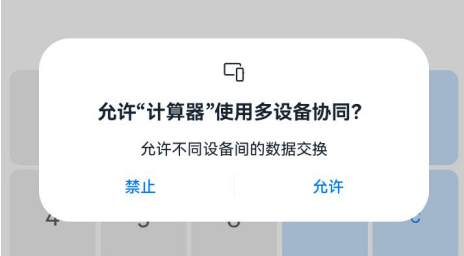
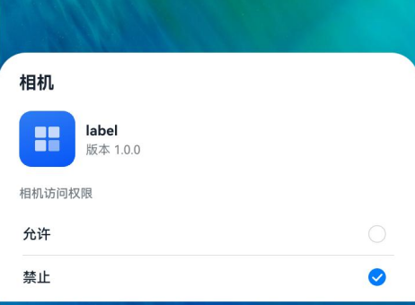
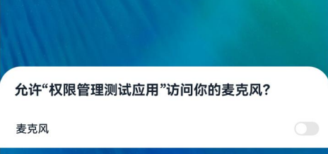

# @ohos.abilityAccessCtrl (程序访问控制管理)

<!--Kit: Ability Kit-->
<!--Subsystem: Security-->
<!--Owner: @xia-bubai-->
<!--Designer: @linshuqing; @hehehe-li-->
<!--Tester: @leiyuqian-->
<!--Adviser: @zengyawen-->

程序访问控制提供应用程序的权限校验和管理能力。

> **说明：**
> 本模块首批接口从API version 8开始支持。后续版本的新增接口，采用上角标单独标记接口的起始版本。

## 导入模块

```ts
import { abilityAccessCtrl } from '@kit.AbilityKit';
```

## abilityAccessCtrl.createAtManager

createAtManager(): AtManager

访问控制管理：创建程序访问控制管理的实例对象。

**原子化服务API：** 从API version 11开始，该接口支持在原子化服务中使用。

**系统能力：** SystemCapability.Security.AccessToken


**返回值：**

| 类型 | 说明 |
| -------- | -------- |
| [AtManager](#atmanager) | 获取程序访问控制模块的实例。 |

**示例：**

```ts
let atManager: abilityAccessCtrl.AtManager = abilityAccessCtrl.createAtManager();
```

## AtManager

管理访问控制模块的实例。

### checkAccessToken<sup>9+</sup>

checkAccessToken(tokenID: number, permissionName: Permissions): Promise&lt;GrantStatus&gt;

校验应用是否被授予权限。使用Promise异步回调。

**原子化服务API：** 从API version 11开始，该接口支持在原子化服务中使用。

**系统能力：** SystemCapability.Security.AccessToken

**参数：**

| 参数名   | 类型                 | 必填 | 说明                                       |
| -------- | -------------------  | ---- | ------------------------------------------ |
| tokenID   |  number   | 是   | 要校验的目标应用的身份标识，可通过应用的[ApplicationInfo](js-apis-bundleManager-applicationInfo.md)的accessTokenId字段获得。|
| permissionName | [Permissions](../../security/AccessToken/app-permissions.md) | 是   | 需要校验的权限名称，合法的权限名取值可在[应用权限列表](../../security/AccessToken/app-permissions.md)中查询。 |

**返回值：**

| 类型          | 说明                                |
| :------------ | :---------------------------------- |
| Promise&lt;[GrantStatus](#grantstatus)&gt; | Promise对象，返回授权状态结果。 |

**错误码：**

以下错误码的详细介绍请参见[通用错误码](../errorcode-universal.md)和[访问控制错误码](errorcode-access-token.md)。

| 错误码ID | 错误信息 |
| -------- | -------- |
| 401 | Parameter error. Possible causes: 1.Mandatory parameters are left unspecified; 2.Incorrect parameter types. |
| 12100001 | Invalid parameter. The tokenID is 0, or the permissionName exceeds 256 characters. |

**示例：**

```ts
import { abilityAccessCtrl } from '@kit.AbilityKit';
import { BusinessError } from '@kit.BasicServicesKit';

let atManager: abilityAccessCtrl.AtManager = abilityAccessCtrl.createAtManager();
let tokenID: number = 0; // 系统应用可以通过bundleManager.getApplicationInfo获取，三方应用可以通过bundleManager.getBundleInfoForSelf获取。
atManager.checkAccessToken(tokenID, 'ohos.permission.GRANT_SENSITIVE_PERMISSIONS').then((data: abilityAccessCtrl.GrantStatus) => {
  console.info(`checkAccessToken success, result: ${data}`);
}).catch((err: BusinessError) => {
  console.error(`checkAccessToken fail, code: ${err.code}, message: ${err.message}`);
});
```

### checkAccessTokenSync<sup>10+</sup>

checkAccessTokenSync(tokenID: number, permissionName: Permissions): GrantStatus

校验应用是否被授予权限，同步返回结果。

**原子化服务API：** 从API version 11开始，该接口支持在原子化服务中使用。

**系统能力：** SystemCapability.Security.AccessToken

**参数：**

| 参数名   | 类型                 | 必填 | 说明                                       |
| -------- | -------------------  | ---- | ------------------------------------------ |
| tokenID   |  number   | 是   | 要校验应用的身份标识，可通过应用的[ApplicationInfo](js-apis-bundleManager-applicationInfo.md)的accessTokenId字段获得。|
| permissionName | [Permissions](../../security/AccessToken/app-permissions.md) | 是   | 需要校验的权限名称，合法的权限名取值可在[应用权限列表](../../security/AccessToken/app-permissions.md)中查询。 |

**返回值：**

| 类型          | 说明                                |
| :------------ | :---------------------------------- |
| [GrantStatus](#grantstatus) | 枚举实例，返回授权状态。 |

**错误码：**

以下错误码的详细介绍请参见[通用错误码](../errorcode-universal.md)和[访问控制错误码](errorcode-access-token.md)。

| 错误码ID | 错误信息 |
| -------- | -------- |
| 401 | Parameter error. Possible causes: 1.Mandatory parameters are left unspecified; 2.Incorrect parameter types. |
| 12100001 | Invalid parameter. The tokenID is 0, or the permissionName exceeds 256 characters. |

**示例：**

```ts
import { abilityAccessCtrl, Permissions } from '@kit.AbilityKit';

let atManager: abilityAccessCtrl.AtManager = abilityAccessCtrl.createAtManager();
let tokenID: number = 0; // 系统应用可以通过bundleManager.getApplicationInfo获取，三方应用可以通过bundleManager.getBundleInfoForSelf获取。
let permissionName: Permissions = 'ohos.permission.GRANT_SENSITIVE_PERMISSIONS';
let data: abilityAccessCtrl.GrantStatus = atManager.checkAccessTokenSync(tokenID, permissionName);
console.info(`Result: ${data}`);
```

### on<sup>18+</sup>

on(type: 'selfPermissionStateChange', permissionList: Array&lt;Permissions&gt;, callback: Callback&lt;PermissionStateChangeInfo&gt;): void

订阅本应用的指定权限列表的权限授权状态变化事件。当本应用对应权限的授权状态发生变化时，触发对应回调函数的执行。

- 多次调用本订阅接口时，如果订阅的权限列表相同，callback不同，允许订阅成功。

- 多次调用本订阅接口时，如果订阅的权限列表间有相同的子集，callback相同时，订阅失败。

**原子化服务API：** 从API version 18开始，该接口支持在原子化服务中使用。

**系统能力：** SystemCapability.Security.AccessToken

**参数：**

| 参数名             | 类型                   | 必填 | 说明                                                          |
| ------------------ | --------------------- | ---- | ------------------------------------------------------------ |
| type               | string                | 是   | 订阅事件类型，固定为'selfPermissionStateChange'，自身权限状态变更事件。  |
| permissionList | Array&lt;[Permissions](../../security/AccessToken/app-permissions.md)&gt;   | 是   | 订阅的权限名列表，如果为空，则表示订阅所有的权限状态变化，合法的权限名取值可在[应用权限列表](../../security/AccessToken/app-permissions.md)中查询。|
| callback | Callback&lt;[PermissionStateChangeInfo](#permissionstatechangeinfo18)&gt; | 是 | 订阅指定权限名状态变更事件的回调。|

**错误码：**

以下错误码的详细介绍请参见[通用错误码](../errorcode-universal.md)和[访问控制错误码](errorcode-access-token.md)。

| 错误码ID | 错误信息 |
| -------- | -------- |
| 401 | Parameter error. Possible causes: 1.Mandatory parameters are left unspecified; 2.Incorrect parameter types. |
| 12100001 | Invalid parameter. Possible causes: 1. The permissionList exceeds the size limit; 2. The permissionNames in the list are all invalid. |
| 12100004 | The API is used repeatedly with the same input. |
| 12100005 | The registration time has exceeded the limit. |
| 12100007 | The service is abnormal. |

**示例：**

```ts
import { abilityAccessCtrl, Permissions } from '@kit.AbilityKit';

let atManager: abilityAccessCtrl.AtManager = abilityAccessCtrl.createAtManager();
let permissionList: Array<Permissions> = ['ohos.permission.APPROXIMATELY_LOCATION'];
try {
    atManager.on('selfPermissionStateChange', permissionList, (data: abilityAccessCtrl.PermissionStateChangeInfo) => {
        console.info(`receive permission state change, result: ${data}`);
    });
} catch(err) {
    console.error(`Code: ${err.code}, message: ${err.message}`);
}
```
### off<sup>18+</sup>

off(type: 'selfPermissionStateChange', permissionList: Array&lt;Permissions&gt;, callback?: Callback&lt;PermissionStateChangeInfo&gt;): void

取消订阅自身指定权限列表的权限状态变更事件，使用callback回调异步返回结果。

取消订阅不传callback时，批量删除permissionList下面的所有callback。

**原子化服务API：** 从API version 18开始，该接口支持在原子化服务中使用。

**系统能力：** SystemCapability.Security.AccessToken

**参数：**

| 参数名             | 类型                   | 必填 | 说明                                                          |
| ------------------ | --------------------- | ---- | ------------------------------------------------------------ |
| type               | string         | 是   | 订阅事件类型，固定为'selfPermissionStateChange'，权限状态变更事件。  |
| permissionList | Array&lt;[Permissions](../../security/AccessToken/app-permissions.md)&gt;   | 是   | 取消订阅的权限名列表，为空时表示取消订阅所有的权限状态变化，必须与on的输入一致，合法的权限名取值可在[应用权限列表](../../security/AccessToken/app-permissions.md)中查询。 |
| callback | Callback&lt;[PermissionStateChangeInfo](#permissionstatechangeinfo18)&gt; | 否 | 取消订阅指定tokenID与指定权限名状态变更事件的回调。|

**错误码：**

以下错误码的详细介绍请参见[通用错误码](../errorcode-universal.md)和[访问控制错误码](errorcode-access-token.md)。

| 错误码ID | 错误信息 |
| -------- | -------- |
| 401 | Parameter error. Possible causes: 1.Mandatory parameters are left unspecified; 2.Incorrect parameter types. |
| 12100001 | Invalid parameter. The permissionNames in the list are all invalid. |
| 12100004 | The API is not used in pair with 'on'. |
| 12100007 | The service is abnormal. |

**示例：**

```ts
import { abilityAccessCtrl, Permissions } from '@kit.AbilityKit';

let atManager: abilityAccessCtrl.AtManager = abilityAccessCtrl.createAtManager();
let permissionList: Array<Permissions> = ['ohos.permission.APPROXIMATELY_LOCATION'];
try {
    atManager.off('selfPermissionStateChange', permissionList);
} catch(err) {
    console.error(`Code: ${err.code}, message: ${err.message}`);
}
```

### requestPermissionsFromUser<sup>9+</sup>

requestPermissionsFromUser(context: Context, permissionList: Array&lt;Permissions&gt;, requestCallback: AsyncCallback&lt;PermissionRequestResult&gt;): void

用于<!--RP1-->[UIAbility](js-apis-app-ability-uiAbility.md#uiability)<!--RP1End-->拉起弹框请求[用户授权](../../security/AccessToken/request-user-authorization.md)。使用callback异步回调。

如果用户拒绝授权，将无法再次拉起弹框，需要用户在系统应用“设置”的界面中，手动授予权限，或是调用[requestPermissionOnSetting](#requestpermissiononsetting12)，拉起权限设置弹框，引导用户授权。

<!--RP3-->

<!--RP3End-->

**原子化服务API：** 从API version 12开始，该接口支持在原子化服务中使用。

**模型约束：** 此接口仅可在Stage模型下使用。

**系统能力：** SystemCapability.Security.AccessToken

**参数：**

| 参数名 | 类型 | 必填 | 说明 |
| -------- | -------- | -------- | -------- |
| context | [Context](js-apis-inner-application-context.md) | 是 | 请求权限的<!--RP1-->UIAbility<!--RP1End-->的Context。 |
| permissionList | Array&lt;[Permissions](../../security/AccessToken/app-permissions.md)&gt; | 是 | 权限名列表，合法的权限名取值可在[应用权限列表](../../security/AccessToken/app-permissions.md)中查询。 |
| requestCallback | AsyncCallback&lt;[PermissionRequestResult](js-apis-permissionrequestresult.md)&gt; | 是 | 回调函数，返回接口调用是否成功的结果。 |

**错误码：**

以下错误码的详细介绍请参见[通用错误码](../errorcode-universal.md)和[访问控制错误码](errorcode-access-token.md)。

| 错误码ID | 错误信息 |
| -------- | -------- |
| 401 | Parameter error. Possible causes: 1.Mandatory parameters are left unspecified; 2.Incorrect parameter types. |
| 12100001 | Invalid parameter. The context is invalid when it does not belong to the application itself. |

**示例：**

下述示例中context的获取方式请参见[获取UIAbility的上下文信息](../../application-models/uiability-usage.md#获取uiability的上下文信息)。
关于向用户申请授权的完整流程及示例，请参见[向用户申请授权](../../security/AccessToken/request-user-authorization.md)。
<!--code_no_check-->
```ts
import { abilityAccessCtrl, Context, PermissionRequestResult, common } from '@kit.AbilityKit';
import { BusinessError } from '@kit.BasicServicesKit';

let atManager: abilityAccessCtrl.AtManager = abilityAccessCtrl.createAtManager();
let context: Context = this.getUIContext().getHostContext() as common.UIAbilityContext;
atManager.requestPermissionsFromUser(context, ['ohos.permission.CAMERA'], (err: BusinessError, data: PermissionRequestResult) => {
  if (err) {
    console.error(`requestPermissionsFromUser fail, code: ${err.code}, message: ${err.message}`);
  } else {
    console.info(`requestPermissionsFromUser success, result: ${data}`);
    console.info('requestPermissionsFromUser data permissions:' + data.permissions);
    console.info('requestPermissionsFromUser data authResults:' + data.authResults);
    console.info('requestPermissionsFromUser data dialogShownResults:' + data.dialogShownResults);
  }
});
```

### requestPermissionsFromUser<sup>9+</sup>

requestPermissionsFromUser(context: Context, permissionList: Array&lt;Permissions&gt;): Promise&lt;PermissionRequestResult&gt;

用于<!--RP1-->[UIAbility](js-apis-app-ability-uiAbility.md#uiability)<!--RP1End-->拉起弹框请求[用户授权](../../security/AccessToken/request-user-authorization.md)。使用promise异步回调。

如果用户拒绝授权，将无法再次拉起弹框，需要用户在系统应用“设置”的界面中，手动授予权限，或是调用[requestPermissionOnSetting](#requestpermissiononsetting12)，拉起权限设置弹框，引导用户授权。

**原子化服务API：** 从API version 11开始，该接口支持在原子化服务中使用。

**模型约束：** 此接口仅可在Stage模型下使用。

**系统能力：** SystemCapability.Security.AccessToken

**参数：**

| 参数名 | 类型 | 必填 | 说明 |
| -------- | -------- | -------- | -------- |
| context | [Context](js-apis-inner-application-context.md) | 是 | 请求权限的<!--RP1-->UIAbility<!--RP1End-->的Context。 |
| permissionList | Array&lt;[Permissions](../../security/AccessToken/app-permissions.md)&gt; | 是 | 需要校验的权限名称，合法的权限名取值可在[应用权限列表](../../security/AccessToken/app-permissions.md)中查询。 |

**返回值：**

| 类型 | 说明 |
| -------- | -------- |
| Promise&lt;[PermissionRequestResult](js-apis-permissionrequestresult.md)&gt; | 返回一个Promise，包含接口的结果。 |

**错误码：**

以下错误码的详细介绍请参见[通用错误码](../errorcode-universal.md)和[访问控制错误码](errorcode-access-token.md)。

| 错误码ID | 错误信息 |
| -------- | -------- |
| 401 | Parameter error. Possible causes: 1.Mandatory parameters are left unspecified; 2.Incorrect parameter types. |
| 12100001 | Invalid parameter. The context is invalid when it does not belong to the application itself. |

**示例：**

下述示例中context的获取方式请参见[获取UIAbility的上下文信息](../../application-models/uiability-usage.md#获取uiability的上下文信息)。
关于向用户申请授权的完整流程及示例，请参见[向用户申请授权](../../security/AccessToken/request-user-authorization.md)。
<!--code_no_check-->
```ts
import { abilityAccessCtrl, Context, PermissionRequestResult, common } from '@kit.AbilityKit';
import { BusinessError } from '@kit.BasicServicesKit';

let atManager: abilityAccessCtrl.AtManager = abilityAccessCtrl.createAtManager();
let context: Context = this.getUIContext().getHostContext() as common.UIAbilityContext;
atManager.requestPermissionsFromUser(context, ['ohos.permission.CAMERA']).then((data: PermissionRequestResult) => {
  console.info(`requestPermissionsFromUser success, result: ${data}`);
  console.info('requestPermissionsFromUser data permissions:' + data.permissions);
  console.info('requestPermissionsFromUser data authResults:' + data.authResults);
  console.info('requestPermissionsFromUser data dialogShownResults:' + data.dialogShownResults);
}).catch((err: BusinessError) => {
  console.error(`requestPermissionsFromUser fail, code: ${err.code}, message: ${err.message}`);
});
```

### requestPermissionOnSetting<sup>12+</sup>

requestPermissionOnSetting(context: Context, permissionList: Array&lt;Permissions&gt;): Promise&lt;Array&lt;GrantStatus&gt;&gt;

用于[UIAbility](js-apis-app-ability-uiAbility.md#uiability)/[UIExtensionAbility](js-apis-app-ability-uiExtensionAbility.md#uiextensionability)二次拉起权限设置弹框。

在调用此接口前，应用需要先调用[requestPermissionsFromUser](#requestpermissionsfromuser9)，如果用户在首次弹窗授权时已授权，调用当前接口将无法拉起弹窗。

<!--RP4-->

<!--RP4End-->

**原子化服务API：** 从API version 12开始，该接口支持在原子化服务中使用。

**模型约束：** 此接口仅可在Stage模型下使用。

**系统能力：** SystemCapability.Security.AccessToken

**参数：**

| 参数名 | 类型 | 必填 | 说明 |
| -------- | -------- | -------- | -------- |
| context | [Context](js-apis-inner-application-context.md) | 是 | 请求权限的UIAbility/UIExtensionAbility的Context。 |
| permissionList | Array&lt;[Permissions](../../security/AccessToken/app-permissions.md)&gt; | 是 | 权限名列表，合法的权限名取值可在[应用权限组列表](../../security/AccessToken/app-permission-group-list.md)中查询。 |

**返回值：**

| 类型          | 说明                                |
| :------------ | :---------------------------------- |
| Promise&lt;Array&lt;[GrantStatus](#grantstatus)&gt;&gt; | Promise对象，返回授权状态结果。 |

**错误码：**

以下错误码的详细介绍请参见[通用错误码](../errorcode-universal.md)和[访问控制错误码](errorcode-access-token.md)。

| 错误码ID | 错误信息 |
| -------- | -------- |
| 401 | Parameter error. Possible causes: 1.Mandatory parameters are left unspecified; 2.Incorrect parameter types. |
| 12100001 | Invalid parameter. Possible causes: 1. The context is invalid because it does not belong to the application itself; 2. The permission list contains the permission that is not declared in the module.json file; 3. The permission list is invalid because the permissions in it do not belong to the same permission group. |
| 12100010 | The request already exists. |
| 12100011 | All permissions in the permission list have been granted. |
| 12100012 | The permission list contains the permission that has not been revoked by the user. |
| 12100014 | Unexpected permission. You cannot request this type of permission from users via a pop-up window. |

**示例：**
示例中context的获取方式请参见[获取UIAbility的上下文信息](../../application-models/uiability-usage.md#获取uiability的上下文信息)。
<!--code_no_check-->
```ts
import { abilityAccessCtrl, Context, common } from '@kit.AbilityKit';
import { BusinessError } from '@kit.BasicServicesKit';

let atManager: abilityAccessCtrl.AtManager = abilityAccessCtrl.createAtManager();
let context: Context = this.getUIContext().getHostContext() as common.UIAbilityContext;
atManager.requestPermissionOnSetting(context, ['ohos.permission.CAMERA']).then((data: Array<abilityAccessCtrl.GrantStatus>) => {
  console.info(`requestPermissionOnSetting success, result: ${data}`);
}).catch((err: BusinessError) => {
  console.error(`requestPermissionOnSetting fail, code: ${err.code}, message: ${err.message}`);
});
```

### requestGlobalSwitch<sup>12+</sup>

requestGlobalSwitch(context: Context, type: SwitchType): Promise&lt;boolean&gt;

用于UIAbility/UIExtensionAbility拉起全局开关设置弹框。

在某些情况下，如果录音、拍照等功能被禁用，应用可拉起此弹框请求用户同意开启对应功能。如果当前全局开关的状态为开启，则不拉起弹框。

<!--RP5-->

<!--RP5End-->

**原子化服务API：** 从API version 12开始，该接口支持在原子化服务中使用。

**模型约束：** 此接口仅可在Stage模型下使用。

**系统能力：** SystemCapability.Security.AccessToken

**参数：**

| 参数名 | 类型 | 必填 | 说明 |
| -------- | -------- | -------- | -------- |
| context | [Context](js-apis-inner-application-context.md) | 是 | 请求权限的UIAbility/UIExtensionAbility的Context。 |
| type | [SwitchType](#switchtype12) | 是 | 全局开关类型。 |

**返回值：**

| 类型          | 说明                                |
| :------------ | :---------------------------------- |
| Promise&lt;boolean&gt; | Promise对象，返回全局开关状态。true表示开启，false表示关闭。 |

**错误码：**

以下错误码的详细介绍请参见[通用错误码](../errorcode-universal.md)和[访问控制错误码](errorcode-access-token.md)。

| 错误码ID | 错误信息 |
| -------- | -------- |
| 401 | Parameter error. Possible causes: 1. Mandatory parameters are left unspecified; 2. Incorrect parameter types. |
| 12100001 | Invalid parameter. Possible causes: 1. The context is invalid because it does not belong to the application itself; 2. The type of global switch is not support. |
| 12100010 | The request already exists. |
| 12100013 | The specific global switch is already open. |

**示例：**
示例中context的获取方式请参见[获取UIAbility的上下文信息](../../application-models/uiability-usage.md#获取uiability的上下文信息)。
<!--code_no_check-->
```ts
import { abilityAccessCtrl, Context, common } from '@kit.AbilityKit';
import { BusinessError } from '@kit.BasicServicesKit';

let atManager: abilityAccessCtrl.AtManager = abilityAccessCtrl.createAtManager();
let context: Context = this.getUIContext().getHostContext() as common.UIAbilityContext;
atManager.requestGlobalSwitch(context, abilityAccessCtrl.SwitchType.CAMERA).then((data: Boolean) => {
  console.info(`requestGlobalSwitch success, result: ${data}`);
}).catch((err: BusinessError) => {
  console.error(`requestGlobalSwitch fail, code: ${err.code}, message: ${err.message}`);
});
```

### getSelfPermissionStatus<sup>20+</sup>

getSelfPermissionStatus(permissionName: Permissions): PermissionStatus

查询应用权限状态，同步返回结果。

**原子化服务API：** 从API version 20开始，该接口支持在原子化服务中使用。

**系统能力：** SystemCapability.Security.AccessToken

**参数：**

| 参数名 | 类型 | 必填 | 说明 |
| -------- | -------- | -------- | -------- |
| permissionName | [Permissions](../../security/AccessToken/app-permissions.md) | 是   | 需要校验的权限名称，合法的权限名取值可在[应用权限列表](../../security/AccessToken/app-permissions.md)中查询。 |

**返回值：**

| 类型          | 说明                                |
| :------------ | :---------------------------------- |
| [PermissionStatus](#permissionstatus20) | 枚举实例，返回权限状态。 |

**错误码：**

以下错误码的详细介绍请参见[访问控制错误码](errorcode-access-token.md)。

| 错误码ID | 错误信息 |
| -------- | -------- |
| 12100001 | Invalid parameter. The permissionName is empty or exceeds 256 characters. |
| 12100007 | The service is abnormal. |

**示例：**

```ts
import { abilityAccessCtrl } from '@kit.AbilityKit';
import { BusinessError } from '@kit.BasicServicesKit';

let atManager: abilityAccessCtrl.AtManager = abilityAccessCtrl.createAtManager();
try {
  let data: abilityAccessCtrl.PermissionStatus = atManager.getSelfPermissionStatus('ohos.permission.CAMERA');
  console.info(`getSelfPermissionStatus success, result: ${data}`);
} catch(err) {
  console.error(`getSelfPermissionStatus fail, code: ${err.code}, message: ${err.message}`);
}
```

### verifyAccessTokenSync<sup>9+</sup>

verifyAccessTokenSync(tokenID: number, permissionName: Permissions): GrantStatus

校验应用是否被授予权限，同步返回结果。

**系统能力：** SystemCapability.Security.AccessToken

**参数：**

| 参数名   | 类型                 | 必填 | 说明                                       |
| -------- | -------------------  | ---- | ------------------------------------------ |
| tokenID   |  number   | 是   | 要校验应用的身份标识，可通过应用的[ApplicationInfo](js-apis-bundleManager-applicationInfo.md)的accessTokenId字段获得。|
| permissionName | [Permissions](../../security/AccessToken/app-permissions.md) | 是   | 需要校验的权限名称，合法的权限名取值可在[应用权限列表](../../security/AccessToken/app-permissions.md)中查询。 |

**返回值：**

| 类型          | 说明                                |
| :------------ | :---------------------------------- |
| [GrantStatus](#grantstatus) | 枚举实例，返回授权状态。 |

**错误码：**

以下错误码的详细介绍请参见[通用错误码](../errorcode-universal.md)和[访问控制错误码](errorcode-access-token.md)。

| 错误码ID | 错误信息 |
| -------- | -------- |
| 401 | Parameter error. Possible causes: 1.Mandatory parameters are left unspecified; 2.Incorrect parameter types. |
| 12100001 | Invalid parameter. The tokenID is 0, or the permissionName exceeds 256 characters. |

**示例：**

```ts
import { abilityAccessCtrl } from '@kit.AbilityKit';

let atManager: abilityAccessCtrl.AtManager = abilityAccessCtrl.createAtManager();
let tokenID: number = 0; // 系统应用可以通过bundleManager.getApplicationInfo获取，三方应用可以通过bundleManager.getBundleInfoForSelf获取。
try {
  let data: abilityAccessCtrl.GrantStatus = atManager.verifyAccessTokenSync(tokenID, 'ohos.permission.GRANT_SENSITIVE_PERMISSIONS');
  console.info(`verifyAccessTokenSync success, result: ${data}`);
} catch(err) {
  console.error(`verifyAccessTokenSync fail, code: ${err.code}, message: ${err.message}`);
}
```

### verifyAccessToken<sup>9+</sup>

verifyAccessToken(tokenID: number, permissionName: Permissions): Promise&lt;GrantStatus&gt;

校验应用是否被授予权限。使用Promise异步回调。

> **说明：**
>
> 建议使用[checkAccessToken](#checkaccesstoken9)替代。

**系统能力：** SystemCapability.Security.AccessToken

**参数：**

| 参数名   | 类型                 | 必填 | 说明                                       |
| -------- | -------------------  | ---- | ------------------------------------------ |
| tokenID   |  number   | 是   | 要校验的目标应用的身份标识，可通过应用的[ApplicationInfo](js-apis-bundleManager-applicationInfo.md)的accessTokenId字段获得。|
| permissionName | [Permissions](../../security/AccessToken/app-permissions.md) | 是   | 需要校验的权限名称，合法的权限名取值可在[应用权限列表](../../security/AccessToken/app-permissions.md)中查询。 |

**返回值：**

| 类型          | 说明                                |
| :------------ | :---------------------------------- |
| Promise&lt;[GrantStatus](#grantstatus)&gt; | Promise对象，返回授权状态结果。 |

**示例：**

```ts
import { abilityAccessCtrl, Permissions } from '@kit.AbilityKit';
import { BusinessError } from '@kit.BasicServicesKit';

let atManager: abilityAccessCtrl.AtManager = abilityAccessCtrl.createAtManager();
let tokenID: number = 0; // 系统应用可以通过bundleManager.getApplicationInfo获取，三方应用可以通过bundleManager.getBundleInfoForSelf获取。
let permissionName: Permissions = 'ohos.permission.GRANT_SENSITIVE_PERMISSIONS';
atManager.verifyAccessToken(tokenID, permissionName).then((data: abilityAccessCtrl.GrantStatus) => {
  console.info(`verifyAccessToken success, result: ${data}`);
}).catch((err: BusinessError) => {
  console.error(`verifyAccessToken fail, code: ${err.code}, message: ${err.message}`);
});
```

### verifyAccessToken<sup>(deprecated)</sup>

verifyAccessToken(tokenID: number, permissionName: string): Promise&lt;GrantStatus&gt;

校验应用是否被授予权限。使用Promise异步回调。

> **说明：**
>
> 从API version 9开始不再维护，建议使用[checkAccessToken](#checkaccesstoken9)替代。

**系统能力：** SystemCapability.Security.AccessToken

**参数：**

| 参数名   | 类型                 | 必填 | 说明                                       |
| -------- | -------------------  | ---- | ------------------------------------------ |
| tokenID   |  number   | 是   | 要校验的目标应用的身份标识，可通过应用的[ApplicationInfo](js-apis-bundleManager-applicationInfo.md)的accessTokenId字段获得。|
| permissionName | string | 是   | 需要校验的权限名称，合法的权限名取值可在[应用权限列表](../../security/AccessToken/app-permissions.md)中查询。 |

**返回值：**

| 类型          | 说明                                |
| :------------ | :---------------------------------- |
| Promise&lt;[GrantStatus](#grantstatus)&gt; | Promise对象，返回授权状态结果。 |

**示例：**

```ts
import { abilityAccessCtrl } from '@kit.AbilityKit';
import { BusinessError } from '@kit.BasicServicesKit';

let atManager: abilityAccessCtrl.AtManager = abilityAccessCtrl.createAtManager();
let tokenID: number = 0; // 系统应用可以通过bundleManager.getApplicationInfo获取，三方应用可以通过bundleManager.getBundleInfoForSelf获取。
atManager.verifyAccessToken(tokenID, 'ohos.permission.GRANT_SENSITIVE_PERMISSIONS').then((data: abilityAccessCtrl.GrantStatus) => {
  console.info(`verifyAccessToken success, result: ${data}`);
}).catch((err: BusinessError) => {
  console.error(`verifyAccessToken fail, code: ${err.code}, message: ${err.message}`);
});
```

## GrantStatus

表示授权状态的枚举。

**原子化服务API：** 从API version 11开始，该接口支持在原子化服务中使用。

**系统能力：** SystemCapability.Security.AccessToken

| 名称               |    值 | 说明        |
| ------------------ | ----- | ----------- |
| PERMISSION_DENIED  | -1    | 表示未授权。 |
| PERMISSION_GRANTED | 0     | 表示已授权。 |

## SwitchType<sup>12+</sup>

表示全局开关类型的枚举。

**原子化服务API：** 从API version 12开始，该接口支持在原子化服务中使用。

**系统能力：** SystemCapability.Security.AccessToken

| 名称               |    值 | 说明        |
| ------------------ | ----- | ----------- |
| CAMERA  | 0    | 表示相机全局开关。 |
| MICROPHONE | 1     | 表示麦克风全局开关。 |
| LOCATION | 2     | 表示位置全局开关。 |

## PermissionStateChangeType<sup>18+</sup>

表示权限授权状态变化操作类型的枚举。

**原子化服务API：** 从API version 18开始，该接口支持在原子化服务中使用。

**系统能力：** SystemCapability.Security.AccessToken

| 名称                     |    值 | 说明              |
| ----------------------- | ------ | ----------------- |
| PERMISSION_REVOKED_OPER | 0      | 表示权限取消操作。 |
| PERMISSION_GRANTED_OPER | 1      | 表示权限授予操作。 |

## PermissionStateChangeInfo<sup>18+</sup>

表示某次权限授权状态变化的详情。

**原子化服务API：** 从API version 18开始，该接口支持在原子化服务中使用。

**系统能力：** SystemCapability.Security.AccessToken

| 名称           | 类型                       | 只读 | 可选 | 说明                |
| -------------- | ------------------------- | ---- | ---- | ------------------ |
| change         | [PermissionStateChangeType](#permissionstatechangetype18) | 否   | 否   | 权限授权状态变化类型。        |
| tokenID        | number                    | 否   | 否   | 被订阅的应用身份标识，可通过应用的[ApplicationInfo](js-apis-bundleManager-applicationInfo.md)的accessTokenId字段获得。|
| permissionName | [Permissions](../../security/AccessToken/app-permissions.md)                    | 否   | 否   | 当前授权状态发生变化的权限名，合法的权限名取值可在[应用权限列表](../../security/AccessToken/app-permissions.md)中查询。 |

## PermissionRequestResult<sup>10+</sup>

type PermissionRequestResult = _PermissionRequestResult

权限请求结果对象。

**原子化服务API：** 从API version 11开始，该接口支持在原子化服务中使用。

**模型约束：** 此接口仅可在Stage模型下使用。

**系统能力：** SystemCapability.Security.AccessToken

| 类型 | 说明 |
| -------- | -------- |
| [_PermissionRequestResult](js-apis-permissionrequestresult.md) | 权限请求结果对象。 |

## Context<sup>10+</sup>

type Context = _Context

提供了ability或application的上下文的能力，包括访问特定应用程序的资源等。

**原子化服务API：** 从API version 11开始，该接口支持在原子化服务中使用。

**模型约束：** 此接口仅可在Stage模型下使用。

**系统能力：** SystemCapability.Security.AccessToken

| 类型 | 说明 |
| -------- | -------- |
| [_Context](js-apis-inner-application-context.md) | 提供了ability或application的上下文的能力，包括访问特定应用程序的资源等。 |

## PermissionStatus<sup>20+</sup>

表示权限状态的枚举。

**原子化服务API：** 从API version 20开始，该接口支持在原子化服务中使用。

**系统能力：** SystemCapability.Security.AccessToken

| 名称               |    值 | 说明        |
| ------------------ | ----- | ----------- |
| DENIED  | -1    | 表示用户未授权。 |
| GRANTED | 0     | 表示已授权。 |
| NOT_DETERMINED | 1     | 表示未操作。应用声明[用户授权权限](../../security/AccessToken/permissions-for-all-user.md)，暂未调用[requestPermissionsFromUser](#requestpermissionsfromuser9)接口请求用户授权时，或用户在设置中将权限状态修改为每次询问时，查询权限状态将返回此值。 |
| INVALID | 2     | 表示无效。应用未[声明权限](../../security/AccessToken/declare-permissions.md)或当前无法处理。例如：当模糊位置权限的状态为NOT_DETERMINED时，查询精确位置权限状态，返回此值。 |
| RESTRICTED | 3     | 表示受限。<!--RP2-->应用被设置禁止通过[requestPermissionsFromUser](#requestpermissionsfromuser9)接口请求用户授权。<!--RP2End--> |