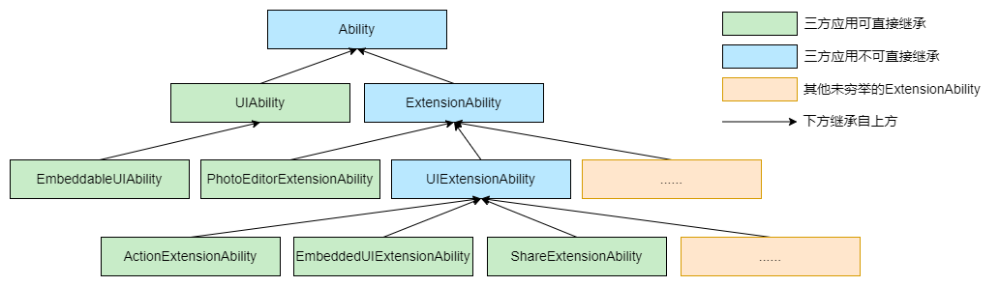

# @ohos.app.ability.Ability (Ability基类)

[UIAbility](js-apis-app-ability-uiAbility.md)和[ExtensionAbility](js-apis-app-ability-extensionAbility.md)的基类，提供系统配置更新回调和系统内存调整回调。不支持开发者直接继承该基类。

> **说明：**
> 
> 本模块首批接口从API version 9 开始支持。后续版本的新增接口，采用上角标单独标记接口的起始版本。
>
> 本模块接口仅可在Stage模型下使用。

## 导入模块

```ts
import { Ability } from '@kit.AbilityKit';
```

## Ability的继承关系说明

各类Ability的继承关系如下图所示。

> **说明：**
>
> 部分ExtensionAbility组件（例如[FormExtensionAbility](../apis-form-kit/js-apis-app-form-formExtensionAbility.md)、[InputMethodExtensionAbility](../apis-ime-kit/js-apis-inputmethod-extension-ability.md)等）与下图中的ExtensionAbility基类不存在继承关系，均未在图中列出。



## Ability.onConfigurationUpdate

onConfigurationUpdate(newConfig: Configuration): void

当系统配置更新时调用。

**原子化服务API：** 从API version 11开始，该接口支持在原子化服务中使用。

**系统能力**：SystemCapability.Ability.AbilityRuntime.AbilityCore

**参数：**

| 参数名 | 类型 | 必填 | 说明 |
| -------- | -------- | -------- | -------- |
| newConfig | [Configuration](js-apis-app-ability-configuration.md) | 是 | 表示需要更新的配置信息。 |

**示例：**
  ```ts
// Ability是顶层基类，不支持开发者直接继承。故以派生类UIAbility举例说明。
import { UIAbility, Configuration } from '@kit.AbilityKit';

class MyUIAbility extends UIAbility {
    onConfigurationUpdate(config: Configuration) {
        console.log(`onConfigurationUpdate, config: ${JSON.stringify(config)}`);
    }
}
  ```

## Ability.onMemoryLevel

onMemoryLevel(level: AbilityConstant.MemoryLevel): void

当内存到达不同级别时系统回调该方法。

**原子化服务API：** 从API version 11开始，该接口支持在原子化服务中使用。

**系统能力**：SystemCapability.Ability.AbilityRuntime.AbilityCore

**参数：**

| 参数名 | 类型 | 必填 | 说明 |
| -------- | -------- | -------- | -------- |
| level | [AbilityConstant.MemoryLevel](js-apis-app-ability-abilityConstant.md#abilityconstantmemorylevel) | 是 | 当前内存使用级别。|

**示例：**

  ```ts
// Ability是顶层基类，不支持开发者直接继承。故以派生类UIAbility举例说明。
import { UIAbility, AbilityConstant } from '@kit.AbilityKit';

class MyUIAbility extends UIAbility {
  onMemoryLevel(level: AbilityConstant.MemoryLevel) {
    console.log(`onMemoryLevel, level: ${JSON.stringify(level)}`);
  }
}
  ```
