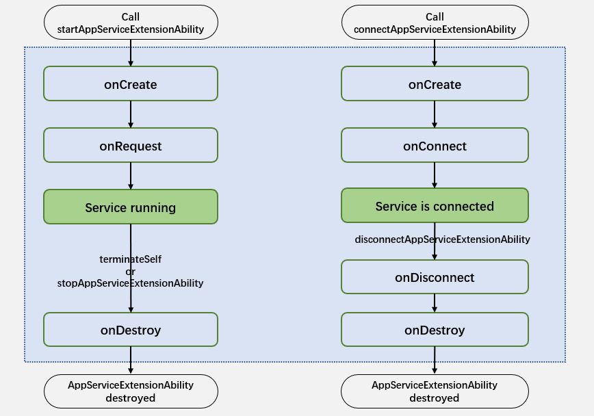

# @ohos.app.ability.AppServiceExtensionAbility (应用后台服务扩展组件)
<!--Kit: Ability Kit-->
<!--Subsystem: Ability-->
<!--Owner: @yewei0794-->
<!--Designer: @jsjzju-->
<!--Tester: @lixueqing513-->
<!--Adviser: @huipeizi-->

AppServiceExtensionAbility模块提供后台服务相关扩展能力，包括后台服务的创建、销毁、连接、断开等生命周期回调。

> **说明：**
>
> 本模块首批接口从API version 20开始支持。后续版本的新增接口，采用上角标单独标记接口的起始版本。
>
> 本模块接口仅可在Stage模型下使用。

## 约束限制

- 当前仅支持2in1设备。
- 应用集成AppServiceExtensionAbility的组件需要申请ACL权限（ohos.permission.SUPPORT_APP_SERVICE_EXTENSION）。该ACL权限当前只对企业普通应用开放申请。

## 生命周期

AppServiceExtensionAbility提供了[onCreate()](#oncreate)、[onRequest()](#onrequest)、[onConnect()](#onconnect)、[onDisconnect()](#ondisconnect)和[onDestroy()](#ondestroy)生命周期回调，开发者可根据需要重写对应的回调方法。下图展示了AppServiceExtensionAbility的生命周期。



- **onCreate**
  在AppServiceExtensionAbility实例创建时，系统会触发该回调。

- **onDestroy**
  在AppServiceExtensionAbility实例销毁时，系统会触发该回调。

- **onRequest**
  调用方使用[startAppServiceExtensionAbility()](js-apis-inner-application-uiAbilityContext.md#startappserviceextensionability20)拉起AppServiceExtensionAbility实例时，系统会触发该回调。

- **onConnect**
  调用方使用[connectAppServiceExtensionAbility](js-apis-inner-application-uiAbilityContext.md#connectappserviceextensionability20)连接AppServiceExtensionAbility实例时，系统会触发该回调。

- **onDisconnect**
  当所有连接方断开与AppServiceExtensionAbility实例的连接时，系统会触发该回调。

## 导入模块

```ts
import { AppServiceExtensionAbility } from '@kit.AbilityKit';
```

## AppServiceExtensionAbility

AppServiceExtensionAbility模块提供后台服务相关扩展能力，包括后台服务的创建、销毁、连接、断开等生命周期回调。

### 属性

**系统能力**：SystemCapability.Ability.AbilityRuntime.Core

| 名称 | 类型 | 只读 | 可选 | 说明 |
| -------- | -------- | -------- | -------- | -------- |
| context | [AppServiceExtensionContext](js-apis-inner-application-appServiceExtensionContext.md)  | 否 | 否 | AppServiceExtensionAbility的上下文环境，继承自[ExtensionContext](js-apis-inner-application-extensionContext.md)。 |


### onCreate

onCreate(want: Want): void

在AppServiceExtensionAbility实例创建时，系统会触发该回调。应用可以在该接口中执行自己的业务逻辑初始化操作，例如注册公共事件监听等。

> **说明：**
>
> 如果AppServiceExtensionAbility实例已创建，再次启动或连接该实例时不会触发onCreate()回调。

**系统能力**：SystemCapability.Ability.AbilityRuntime.Core

**参数：**

| 参数名 | 类型 | 必填 | 说明 |
| -------- | -------- | -------- | -------- |
| want |  [Want](js-apis-app-ability-want.md) | 是 | 调用方拉起当前AppServiceExtensionAbility实例时传递的Want类型信息，包括Ability名称、Bundle名称等。 |

**示例：**

  ```ts
  import { AppServiceExtensionAbility, Want } from '@kit.AbilityKit';
  import { hilog } from '@kit.PerformanceAnalysisKit';

  const TAG: string = '[AppServiceExtAbility]';

  export default class AppServiceExtAbility extends AppServiceExtensionAbility {
    onCreate(want: Want) {
      hilog.info(0x0000, TAG, `onCreate, want: ${want.abilityName}`);
    }
  }
  ```

### onDestroy

onDestroy(): void

在AppServiceExtensionAbility实例销毁时，系统会触发该回调。应用可以在该接口中执行资源清理等操作，如注销监听等。

**系统能力**：SystemCapability.Ability.AbilityRuntime.Core

**示例：**

  ```ts
  import { AppServiceExtensionAbility } from '@kit.AbilityKit';
  import { hilog } from '@kit.PerformanceAnalysisKit';

  const TAG: string = '[AppServiceExtAbility]';

  export default class AppServiceExtAbility extends AppServiceExtensionAbility {
    onDestroy() {
      hilog.info(0x0000, TAG, `onDestroy`);
    }
  }
  ```

### onRequest

onRequest(want: Want, startId: number): void

调用方每次使用[startAppServiceExtensionAbility()](js-apis-inner-application-uiAbilityContext.md#startappserviceextensionability20)拉起AppServiceExtensionAbility实例时，系统都会触发该回调。

**系统能力**：SystemCapability.Ability.AbilityRuntime.Core

**参数：**

| 参数名 | 类型 | 必填 | 说明 |
| -------- | -------- | -------- | -------- |
| want |  [Want](js-apis-app-ability-want.md) | 是 | 调用方拉起当前AppServiceExtensionAbility实例时传递的Want类型信息，包括Ability名称、Bundle名称等。 |
| startId | number | 是 | 返回拉起次数。首次拉起初始值返回1，多次拉起时自动递增。 |

**示例：**

  ```ts
  import { AppServiceExtensionAbility, Want } from '@kit.AbilityKit';
  import { hilog } from '@kit.PerformanceAnalysisKit';

  const TAG: string = '[AppServiceExtAbility]';

  export default class AppServiceExtAbility extends AppServiceExtensionAbility {
    onRequest(want: Want, startId: number) {
      hilog.info(0x0000, TAG, `onRequest, want: ${want.abilityName}, startId: ${startId}`);
    }
  }
  ```

### onConnect

onConnect(want: Want): rpc.RemoteObject

调用方使用[connectAppServiceExtensionAbility](js-apis-inner-application-uiAbilityContext.md#connectappserviceextensionability20)连接AppServiceExtensionAbility实例时，系统会触发该回调。


应用需要在该接口中返回一个RemoteObject对象，用于客户端和服务端进行通信。当AppServiceExtensionAbility实例处于连接状态时，如果调用方发起新的连接，系统会返回缓存的RemoteObject对象，而不会重复回调[onConnect()](#onconnect)接口。

**系统能力**：SystemCapability.Ability.AbilityRuntime.Core

**参数：**

| 参数名 | 类型 | 必填 | 说明 |
| -------- | -------- | -------- | -------- |
| want |  [Want](js-apis-app-ability-want.md)| 是 | 调用方拉起当前AppServiceExtensionAbility实例时传递的Want类型信息，包括Ability名称、Bundle名称等。 |

**返回值：**

| 类型 | 说明 |
| -------- | -------- |
| [rpc.RemoteObject](../apis-ipc-kit/js-apis-rpc.md#iremoteobject) | 一个RemoteObject对象，用于客户端和服务端进行通信。 |

**示例：**

  ```ts
  import { AppServiceExtensionAbility, Want } from '@kit.AbilityKit';
  import { rpc } from '@kit.IPCKit';
  import { hilog } from '@kit.PerformanceAnalysisKit';

  const TAG: string = '[AppServiceExtAbility]';

  class StubTest extends rpc.RemoteObject {
    constructor(des: string) {
      super(des);
    }

    onConnect(code: number, data: rpc.MessageSequence, reply: rpc.MessageSequence, option: rpc.MessageOption) {
    }
  }

  export default class AppServiceExtAbility extends AppServiceExtensionAbility {
    onConnect(want: Want) {
      hilog.info(0x0000, TAG, `onConnect, want: ${want.abilityName}`);
      return new StubTest('test');
    }
  }
  ```

### onDisconnect

onDisconnect(want: Want): void

当所有连接方断开与AppServiceExtensionAbility实例的连接时，系统会触发该回调。

**系统能力**：SystemCapability.Ability.AbilityRuntime.Core

**参数：**

| 参数名 | 类型 | 必填 | 说明 |
| -------- | -------- | -------- | -------- |
| want |[Want](js-apis-app-ability-want.md)| 是 | AppServiceExtensionAbility实例最近一次被拉起或者连接时，调用方传递的Want类型信息，包括Ability名称、Bundle名称等。 |

**示例：**

  ```ts
  import { AppServiceExtensionAbility, Want } from '@kit.AbilityKit';
  import { hilog } from '@kit.PerformanceAnalysisKit';

  const TAG: string = '[AppServiceExtAbility]';

  export default class AppServiceExtAbility extends AppServiceExtensionAbility {
    onDisconnect(want: Want) {
      hilog.info(0x0000, TAG, `onDisconnect, want: ${want.abilityName}`);
    }
  }
  ```
