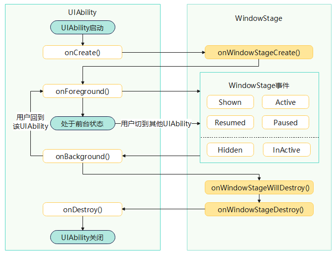

# @ohos.app.ability.UIAbility (带界面的应用组件)

<!--Kit: Ability Kit-->
<!--Subsystem: Ability-->
<!--Owner: @littlejerry1; @Luobniz21-->
<!--Designer: @ccllee1-->
<!--Tester: @lixueqing513-->
<!--Adviser: @huipeizi-->

UIAbility是包含UI界面的应用组件，继承自[Ability](js-apis-app-ability-ability.md)，提供UIAbility组件创建、销毁、前后台切换等[生命周期](#uiability生命周期状态)回调，同时也具备[后台通信能力](#后台通信能力)。

> **说明：**
>
> 本模块首批接口从API version 9 开始支持。后续版本的新增接口，采用上角标单独标记接口的起始版本。
>
> 本模块接口仅可在Stage模型下使用。

各类Ability的继承关系详见[继承关系说明](./js-apis-app-ability-ability.md#ability的继承关系说明)。

## UIAbility生命周期状态

**图1** UIAbility生命周期状态



- Create：表示UIAbility实例已创建。系统会在该状态下触发其[onCreate](#oncreate)回调函数，开发者可以在[onCreate](#oncreate)中执行初始化操作。
- Foreground：表示UIAbility被拉到前台。系统会在该状态下触发其[onForeground](#onforeground)回调函数，开发者可以在[onForeground](#onforeground)中申请应用所需的资源。
- Background：表示UIAbility被拉到后台。系统会在该状态下触发其[onBackground](#onbackground)回调函数，开发者可以在[onBackground](#onbackground)中释放一些应用资源。
- Destroy：表示UIAbility实例要销毁。系统会在该状态下触发其[onDestroy](#ondestroy)回调函数，开发者可以在[onDestroy](#ondestroy)中执行数据保存等操作。

## 后台通信能力

通过Call调用可以与目标UIAbility进行后台通信。Call调用示意图如下所示。


**图2** Call调用示意图


- Caller UIAbility调用[startAbilityByCall()](js-apis-inner-application-uiAbilityContext.md#startabilitybycall)接口获取[Caller](#caller)对象，并使用Caller对象的[call](#call)方法向Callee UIAbility发送数据。

- Callee UIAbility持有一个[Callee](#callee)对象，通过Callee的[on](#on)方法注册回调函数，用于接收Caller对象发送的数据。

## 导入模块

```ts
import { UIAbility } from '@kit.AbilityKit';
```

## UIAbility

表示包含UI界面的应用组件，提供组件创建、销毁、前后台切换等生命周期回调，同时也具备组件协同的能力。

### 属性

**系统能力**：SystemCapability.Ability.AbilityRuntime.AbilityCore

| 名称 | 类型 | 只读 | 可选 | 说明 |
| -------- | -------- | -------- | -------- | -------- |
| context | [UIAbilityContext](js-apis-inner-application-uiAbilityContext.md) | 否 | 否 | UIAbility的上下文。<br>**原子化服务API**：从API version 11开始，该接口支持在原子化服务中使用。 |
| launchWant | [Want](js-apis-app-ability-want.md) | 否 | 否 | UIAbility冷启动时接收到的Want参数，取值为[onCreate](#oncreate)接收到的Want参数。<br>**原子化服务API**：从API version 11开始，该接口支持在原子化服务中使用。 |
| lastRequestWant | [Want](js-apis-app-ability-want.md) | 否 | 否 | 最近一次拉起UIAbility请求的Want参数。<br>- 首次拉起UIAbility时，取值为[onCreate](#oncreate)接收到的Want参数。<br>- 重复拉起UIAbility时，取值为[onNewWant](#onnewwant)最近一次接收到的Want参数。<br>**原子化服务API**：从API version 11开始，该接口支持在原子化服务中使用。|
| callee | [Callee](#callee) | 否 | 否 | 系统为UIAbility创建的后台通信对象，Callee UIAbility（被调用方），可以通过Callee对象接收Caller对象发送的数据进。 |


### onCreate

onCreate(want: Want, launchParam: AbilityConstant.LaunchParam): void

当UIAbility实例完成创建时，系统会触发该回调，开发者可在该回调中执行初始化逻辑（如定义变量、加载资源等）。该回调仅会在UIAbility[冷启动](../../application-models/uiability-intra-device-interaction.md#目标uiability冷启动)时触发。

同步接口，不支持异步回调。

**原子化服务API**：从API version 11开始，该接口支持在原子化服务中使用。

**系统能力**：SystemCapability.Ability.AbilityRuntime.AbilityCore

**参数：**

| 参数名 | 类型 | 必填 | 说明 |
| -------- | -------- | -------- | -------- |
| want | [Want](js-apis-app-ability-want.md) | 是 | 调用方拉起该UIAbility时传递的数据。 |
| launchParam | [AbilityConstant.LaunchParam](js-apis-app-ability-abilityConstant.md#launchparam) | 是 | 应用启动参数，包含应用启动原因、应用上次退出原因等。 |

**示例：**


```ts
import { UIAbility, AbilityConstant, Want } from '@kit.AbilityKit';
import { hilog } from '@kit.PerformanceAnalysisKit';

export default class MyUIAbility extends UIAbility {
  onCreate(want: Want, launchParam: AbilityConstant.LaunchParam) {
    // 执行异步任务
    hilog.info(0x0000, 'testTag', `onCreate, want: ${want.abilityName}`);
    hilog.info(0x0000, 'testTag', `the launchReason is +  ${launchParam.launchReason} + , the lastExitReason is  + ${launchParam.lastExitReason}`);
  }
}
```


### onWindowStageCreate

onWindowStageCreate(windowStage: window.WindowStage): void

当WindowStage实例创建完成后，系统会触发该回调。开发者可以在该回调中通过WindowStage加载页面。

**原子化服务API**：从API version 11开始，该接口支持在原子化服务中使用。

**系统能力**：SystemCapability.Ability.AbilityRuntime.AbilityCore

**参数：**

| 参数名 | 类型 | 必填 | 说明 |
| -------- | -------- | -------- | -------- |
| windowStage | [window.WindowStage](../apis-arkui/arkts-apis-window-WindowStage.md) | 是 | WindowStage实例对象。 |

**示例：**

```ts
import { UIAbility } from '@kit.AbilityKit';
import { hilog } from '@kit.PerformanceAnalysisKit';
import { window } from '@kit.ArkUI';

export default class MyUIAbility extends UIAbility {
  // 主窗口已创建，为该UIAbility设置主页面
  onWindowStageCreate(windowStage: window.WindowStage): void {
    windowStage.loadContent('pages/Index', (err, data) => {
      if (err.code) {
        hilog.error(0x0000, 'testTag', `Failed to load the content. Cause: ${JSON.stringify(err)}`);
        return;
      }
      hilog.info(0x0000, 'testTag', `Succeeded in loading the content. Data: ${JSON.stringify(data)}`);
    });
  }
}
```


### onWindowStageWillDestroy<sup>12+</sup>

onWindowStageWillDestroy(windowStage: window.WindowStage): void

当WindowStage即将销毁时，系统触发该回调。开发者可以在该生命周期中取消windowStage事件的监听。

**原子化服务API**：从API version 12开始，该接口支持在原子化服务中使用。

**系统能力**：SystemCapability.Ability.AbilityRuntime.AbilityCore

**参数：**

| 参数名 | 类型 | 必填 | 说明 |
| -------- | -------- | -------- | -------- |
| windowStage | [window.WindowStage](../apis-arkui/arkts-apis-window-WindowStage.md) | 是 | WindowStage实例对象。 |

**示例：**

```ts
import { UIAbility } from '@kit.AbilityKit';
import { hilog } from '@kit.PerformanceAnalysisKit';
import { window } from '@kit.ArkUI';

export default class MyUIAbility extends UIAbility {
  onWindowStageWillDestroy(windowStage: window.WindowStage) {
    hilog.info(0x0000, 'testTag', `onWindowStageWillDestroy`);
  }
}
```


### onWindowStageDestroy

onWindowStageDestroy(): void

当WindowStage销毁后，系统触发该回调。该回调用于通知开发者WindowStage对象已被销毁，不能再继续使用。

仅当UIAbility正常退出时会触发该回调，异常退出场景（例如低内存查杀）不会触发该回调。

**原子化服务API**：从API version 11开始，该接口支持在原子化服务中使用。

**系统能力**：SystemCapability.Ability.AbilityRuntime.AbilityCore

**示例：**

```ts
import { UIAbility } from '@kit.AbilityKit';
import { hilog } from '@kit.PerformanceAnalysisKit';

export default class MyUIAbility extends UIAbility {
  onWindowStageDestroy() {
    // 主窗口已销毁，释放UI相关资源
    hilog.info(0x0000, 'testTag', `onWindowStageDestroy`);
  }
}
```


### onWindowStageRestore

onWindowStageRestore(windowStage: window.WindowStage): void

当UIAbility跨端迁移时，目标端UIAbility恢复页面栈时回调。

> **说明：**
>
> 在应用迁移启动时，无论是冷启动还是热启动，都会在执行完[onCreate()](#oncreate)/[onNewWant()](#onnewwant)后，触发onWindowStageRestore()生命周期函数，不执行onWindowStageCreate()生命周期函数。


**原子化服务API**：从API version 11开始，该接口支持在原子化服务中使用。

**系统能力**：SystemCapability.Ability.AbilityRuntime.AbilityCore

**参数：**

| 参数名 | 类型 | 必填 | 说明 |
| -------- | -------- | -------- | -------- |
| windowStage | [window.WindowStage](../apis-arkui/arkts-apis-window-WindowStage.md) | 是 | WindowStage实例对象。 |

**示例：**

```ts
import { UIAbility } from '@kit.AbilityKit';
import { hilog } from '@kit.PerformanceAnalysisKit';
import { window } from '@kit.ArkUI';

export default class MyUIAbility extends UIAbility {
  onWindowStageRestore(windowStage: window.WindowStage) {
    hilog.info(0x0000, 'testTag', `onWindowStageRestore`);
  }
}
```


### onDestroy

onDestroy(): void | Promise&lt;void&gt;

当UIAbility被销毁（例如使用[terminateSelf](js-apis-inner-application-uiAbilityContext.md#terminateself)接口停止UIAbility）时，系统触发该回调。开发者可以在该生命周期中执行资源清理、数据保存等相关操作。使用同步回调或Promise异步回调。

在执行完onDestroy生命周期回调后，应用可能会退出，从而可能导致onDestroy中的异步函数未能正确执行，比如异步写入数据库。推荐使用Promise异步回调，避免因应用退出导致onDestroy中的异步函数（比如异步写入数据库）未能正确执行。

仅当UIAbility正常退出时会触发该回调，异常退出场景（例如低内存查杀）不会触发该回调。

**原子化服务API**：从API version 11开始，该接口支持在原子化服务中使用。

**系统能力**：SystemCapability.Ability.AbilityRuntime.AbilityCore

**返回值：**

| 类型 | 说明 |
| -------- | -------- |
| void&nbsp;\|&nbsp;Promise&lt;void&gt; | 无返回结果或无返回结果的Promise对象。 |

**示例：**

- 同步回调示例如下：

  ```ts
  import { UIAbility } from '@kit.AbilityKit';
  import { hilog } from '@kit.PerformanceAnalysisKit';

  export default class MyUIAbility extends UIAbility {
    onDestroy() {
      hilog.info(0x0000, 'testTag', `onDestroy`);
      // 调用同步函数...
    }
  }
  ```

- Promise异步回调示例如下：

  ```ts
  import { UIAbility } from '@kit.AbilityKit';
  import { hilog } from '@kit.PerformanceAnalysisKit';

  export default class MyUIAbility extends UIAbility {
    async onDestroy() {
      hilog.info(0x0000, 'testTag', `onDestroy`);
      // 调用异步函数...
    }
  }
  ```


### onWillForeground<sup>20+</sup>

onWillForeground(): void

UIAbility生命周期回调，应用转到前台前触发，在[onForeground](#onforeground)前被调用。可在该回调中实现采集应用开始进入前台的时间。如果与[onDidForeground](#ondidforeground20)配合使用，还可以统计出从应用开始进入前台到切换至前台状态的耗时。

同步接口，不支持异步回调。

**原子化服务API**：从API version 20开始，该接口支持在原子化服务中使用。

**系统能力**：SystemCapability.Ability.AbilityRuntime.AbilityCore

**示例：**

```ts
import { UIAbility } from '@kit.AbilityKit';
import { hiAppEvent, hilog } from '@kit.PerformanceAnalysisKit';
import { BusinessError } from '@kit.BasicServicesKit';

export default class EntryAbility extends UIAbility {
  // ...

  onWillForeground(): void {
    // 应用开始进入前台事件打点
    let eventParams: Record<string, number> = { 'xxxx': 100 };
    let eventInfo: hiAppEvent.AppEventInfo = {
      // 事件领域定义
      domain: "lifecycle",
      // 事件名称定义
      name: "onwillforeground",
      // 事件类型定义
      eventType: hiAppEvent.EventType.BEHAVIOR,
      // 事件参数定义
      params: eventParams,
    };
    hiAppEvent.write(eventInfo).then(() => {
      hilog.info(0x0000, 'testTag', `HiAppEvent success to write event`);
    }).catch((err: BusinessError) => {
      hilog.error(0x0000, 'testTag', `HiAppEvent err.code: ${err.code}, err.message: ${err.message}`);
    });
  }
  // ...

  onDidForeground(): void {
    // 应用进入前台后事件打点
    let eventParams: Record<string, number> = { 'xxxx': 100 };
    let eventInfo: hiAppEvent.AppEventInfo = {
      // 事件领域定义
      domain: "lifecycle",
      // 事件名称定义
      name: "ondidforeground",
      // 事件类型定义
      eventType: hiAppEvent.EventType.BEHAVIOR,
      // 事件参数定义
      params: eventParams,
    };
    hiAppEvent.write(eventInfo).then(() => {
      hilog.info(0x0000, 'testTag', `HiAppEvent success to write event`);
    }).catch((err: BusinessError) => {
      hilog.error(0x0000, 'testTag', `HiAppEvent err.code: ${err.code}, err.message: ${err.message}`);
    });
  }
}
```


### onForeground

onForeground(): void

当应用首次启动到前台或者从后台转入到前台时，系统触发该回调。开发者可在该回调中实现系统所需资源的申请，如应用转到前台时申请定位服务等。

同步接口，不支持异步回调。

**原子化服务API**：从API version 11开始，该接口支持在原子化服务中使用。

**系统能力**：SystemCapability.Ability.AbilityRuntime.AbilityCore

**示例：**


```ts
import { UIAbility } from '@kit.AbilityKit';
import { hilog } from '@kit.PerformanceAnalysisKit';

export default class MyUIAbility extends UIAbility {
  onForeground() {
    // 执行异步任务
    hilog.info(0x0000, 'testTag', `onForeground`);
  }
}
```


### onDidForeground<sup>20+</sup>

onDidForeground(): void

UIAbility生命周期回调，应用转到前台后触发，在[onForeground](#onforeground)后被调用，可在该回调中实现应用切换到前台后的时间打点。如果与[onWillForeground](#onwillforeground20)配合使用，还可以统计出从应用开始进入前台到切换至前台状态的耗时。

同步接口，不支持异步回调。

**原子化服务API**：从API version 20开始，该接口支持在原子化服务中使用。

**系统能力**：SystemCapability.Ability.AbilityRuntime.AbilityCore

**示例：**

参考[onWillForeground](#onwillforeground20)。


### onWillBackground<sup>20+</sup>

onWillBackground(): void

UIAbility生命周期回调，当应用从前台转到后台前触发，在[onBackground](#onbackground)前被调用。可在该回调中实现数据打点，例如，打点应用运行过程中发生的故障信息、统计信息、安全信息、用户行为信息等。

同步接口，不支持异步回调。

**原子化服务API**：从API version 20开始，该接口支持在原子化服务中使用。

**系统能力**：SystemCapability.Ability.AbilityRuntime.AbilityCore

**示例：**

```ts
import { UIAbility } from '@kit.AbilityKit';
import { hiAppEvent, hilog } from '@kit.PerformanceAnalysisKit';
import { BusinessError } from '@kit.BasicServicesKit';

export default class MyUIAbility extends UIAbility {
  onWillBackground(): void {
    let eventParams: Record<string, number | string> = {
      "int_data": 100,
      "str_data": "strValue",
    };
    // 打点应用故障信息
    hiAppEvent.write({
      domain: "test_domain",
      name: "test_event",
      eventType: hiAppEvent.EventType.FAULT,
      params: eventParams,
    }, (err: BusinessError) => {
      if (err) {
        hilog.error(0x0000, 'testTag', `hiAppEvent code: ${err.code}, message: ${err.message}`);
        return;
      }
      hilog.info(0x0000, 'testTag', `hiAppEvent success to write event`);
    });
  }
}
```


### onBackground

onBackground(): void

当应用从前台转入到后台时，系统触发该回调。开发者可在该回调中实现UI不可见时的资源释放操作，如停止定位功能等。

同步接口，不支持异步回调。

**原子化服务API**：从API version 11开始，该接口支持在原子化服务中使用。

**系统能力**：SystemCapability.Ability.AbilityRuntime.AbilityCore

**示例：**

```ts
import { UIAbility } from '@kit.AbilityKit';
import { hilog } from '@kit.PerformanceAnalysisKit';

export default class MyUIAbility extends UIAbility {
  onBackground() {
    // UIAbility回到后台
    hilog.info(0x0000, 'testTag', `onBackground`);
  }
}
```


### onDidBackground<sup>20+</sup>

onDidBackground(): void

UIAbility生命周期回调，当应用从前台转到后台后触发，在[onBackground](#onbackground)之后被调用。可在该回调中实现应用进入后台之后的资源释放操作，如进入后台后停止音频播放等。

同步接口，不支持异步回调。

**原子化服务API**：从API version 20开始，该接口支持在原子化服务中使用。

**系统能力**：SystemCapability.Ability.AbilityRuntime.AbilityCore

**示例：**

```ts
import { UIAbility } from '@kit.AbilityKit';
import { BusinessError } from '@kit.BasicServicesKit';
import { hilog } from '@kit.PerformanceAnalysisKit';
import { audio } from '@kit.AudioKit';

export default class MyUIAbility extends UIAbility {
  static audioRenderer: audio.AudioRenderer;
  // ...
  onForeground(): void {
    let audioStreamInfo: audio.AudioStreamInfo = {
      samplingRate: audio.AudioSamplingRate.SAMPLE_RATE_48000, // 采样率。
      channels: audio.AudioChannel.CHANNEL_2, // 通道。
      sampleFormat: audio.AudioSampleFormat.SAMPLE_FORMAT_S16LE, // 采样格式。
      encodingType: audio.AudioEncodingType.ENCODING_TYPE_RAW // 编码格式。
    };

    let audioRendererInfo: audio.AudioRendererInfo = {
      usage: audio.StreamUsage.STREAM_USAGE_MUSIC, // 音频流使用类型：音乐。根据业务场景配置，参考StreamUsage。
      rendererFlags: 0 // 音频渲染器标志。
    };

    let audioRendererOptions: audio.AudioRendererOptions = {
      streamInfo: audioStreamInfo,
      rendererInfo: audioRendererInfo
    };

    // 在前台时申请audioRenderer，用于播放PCM（Pulse Code Modulation）音频数据
    audio.createAudioRenderer(audioRendererOptions).then((data) => {
      MyUIAbility.audioRenderer = data;
      hilog.info(0x0000, 'testTag', `AudioRenderer Created : Success : Stream Type: SUCCESS.`);
    }).catch((err: BusinessError) => {
      hilog.error(0x0000, 'testTag', `AudioRenderer Created : F : ${JSON.stringify(err)}.`);
    });
  }

  onDidBackground() {
    // 转到后台后，释放audioRenderer资源
    MyUIAbility.audioRenderer.release((err: BusinessError) => {
      if (err) {
        hilog.error(0x0000, 'testTag', `AudioRenderer release failed, error: ${JSON.stringify(err)}.`);
      } else {
        hilog.info(0x0000, 'testTag',  `AudioRenderer released.`);
      }
    });
  }
}
```

### onContinue

onContinue(wantParam: Record&lt;string, Object&gt;): AbilityConstant.OnContinueResult | Promise&lt;AbilityConstant.OnContinueResult&gt;

当Ability准备迁移时触发，保存数据。

> **说明：**
>
> 从API version 12 开始，UIAbility.onContinue生命周期新增支持返回值为Promise\<[AbilityConstant.OnContinueResult](js-apis-app-ability-abilityConstant.md#oncontinueresult)\>形式。

**原子化服务API**：从API version 11开始，该接口支持在原子化服务中使用。

**系统能力**：SystemCapability.Ability.AbilityRuntime.AbilityCore

**参数：**

| 参数名 | 类型 | 必填 | 说明 |
| -------- | -------- | -------- | -------- |
| wantParam | Record&lt;string,&nbsp;Object&gt; | 是 | 开发者通过该参数保存待迁移的数据。 |

**返回值：**

| 类型 | 说明 |
| -------- | -------- |
| [AbilityConstant.OnContinueResult](js-apis-app-ability-abilityConstant.md#oncontinueresult)&nbsp;\|&nbsp;Promise&lt;[AbilityConstant.OnContinueResult](js-apis-app-ability-abilityConstant.md#oncontinueresult)&gt;  | 表示是否同意迁移的结果：<br>- AGREE：表示同意。<br>- REJECT：表示拒绝，如应用在onContinue中异常可以返回REJECT。<br>- MISMATCH：表示版本不匹配，接续源端应用可以在onContinue中获取到迁移对端应用的版本号，进行协商后，如果版本不匹配导致无法迁移，可以返回该结果。<br> 该回调与onWindowStageRestore成对出现。在接续场景下，源端的UIAbility触发onContinue保存自定义数据，在目标端UIAbility触发onWindowStageRestore恢复自定义数据。 |

**示例：**

- 应用迁移时使用同步接口进行数据保存，示例如下：

  ```ts
  import { UIAbility, AbilityConstant } from '@kit.AbilityKit';

  export default class MyUIAbility extends UIAbility {
    onContinue(wantParams: Record<string, Object>) {
      console.info('onContinue');
      wantParams['myData'] = 'my1234567';
      return AbilityConstant.OnContinueResult.AGREE;
    }
  }
  ```

- 应用迁移时使用异步接口进行数据保存，示例如下：

  ```ts
  import { UIAbility, AbilityConstant } from '@kit.AbilityKit';

  export default class MyUIAbility extends UIAbility {
    async setWant(wantParams: Record<string, Object>) {
      console.info('setWant start');
      for (let time = 0; time < 1000; ++time) {
        wantParams[time] = time;
      }
      console.info('setWant end');
    }

    async onContinue(wantParams: Record<string, Object>) {
      console.info('onContinue');
      return this.setWant(wantParams).then(() => {
        return AbilityConstant.OnContinueResult.AGREE;
      });
    }
  }
  ```


### onNewWant

onNewWant(want: Want, launchParam: AbilityConstant.LaunchParam): void

当已在前台运行过的UIAbility实例被再次拉起时，会触发该生命周期回调。若在特定场景下（参见[Scenarios](./js-apis-app-ability-contextConstant.md#scenarios20)），不需要触发该生命周期回调，可以使用[setOnNewWantSkipScenarios](./js-apis-inner-application-uiAbilityContext.md#setonnewwantskipscenarios20)接口设置。


**原子化服务API**：从API version 11开始，该接口支持在原子化服务中使用。

**系统能力**：SystemCapability.Ability.AbilityRuntime.AbilityCore

**参数：**

| 参数名 | 类型 | 必填 | 说明 |
| -------- | -------- | -------- | -------- |
| want | [Want](js-apis-app-ability-want.md) | 是 | 调用方再次拉起该UIAbility时传递的数据。 |
| launchParam | [AbilityConstant.LaunchParam](js-apis-app-ability-abilityConstant.md#launchparam) | 是 | UIAbility启动的原因。 |

**示例：**

```ts
import { UIAbility, AbilityConstant, Want } from '@kit.AbilityKit';

export default class MyUIAbility extends UIAbility {
  onNewWant(want: Want, launchParam: AbilityConstant.LaunchParam) {
    console.info(`onNewWant, want: ${want.abilityName}`);
    console.info(`onNewWant, launchParam: ${JSON.stringify(launchParam)}`);
  }
}
```

### onDump

onDump(params: Array\<string>): Array\<string>

应用调测场景下，通过命令行dump UIAbility转储UIAbility数据时回调。开发者可以在该回调中返回UIAbility要dump出的非敏感信息。

**原子化服务API**：从API version 11开始，该接口支持在原子化服务中使用。

**系统能力**：SystemCapability.Ability.AbilityRuntime.AbilityCore

**参数：**

| 参数名 | 类型 | 必填 | 说明 |
| -------- | -------- | -------- | -------- |
| params | Array\<string> | 是 | 表示dump命令参数。|

**返回值：**

| 类型 | 说明 |
| -------- | -------- |
| Array\<string> | 返回的dump信息。|

**示例：**

```ts
import { UIAbility } from '@kit.AbilityKit';

export default class MyUIAbility extends UIAbility {
  onDump(params: Array<string>) {
    console.info(`dump, params: ${JSON.stringify(params)}`);
    return ['params'];
  }
}
```


### onSaveState

onSaveState(reason: AbilityConstant.StateType, wantParam: Record&lt;string, Object&gt;): AbilityConstant.OnSaveResult

该API配合[appRecovery](js-apis-app-ability-appRecovery.md)使用。当应用出现故障时，如果已启用自动保存状态，框架将调用onSaveState来保存UIAbility的状态。

如果应用已使能故障恢复功能（即[enableAppRecovery](js-apis-app-ability-appRecovery.md#apprecoveryenableapprecovery)接口中saveOccasion参数配置为SAVE_WHEN_ERROR），当应用出现故障时，将触发该回调来保存UIAbility的数据。

> **说明：**
>
> 从API version 20开始，当[UIAbility.onSaveStateAsync](#onsavestateasync20)实现时，本回调函数将不执行。

**原子化服务API**：从API version 11开始，该接口支持在原子化服务中使用。

**系统能力**：SystemCapability.Ability.AbilityRuntime.AbilityCore

**参数：**

| 参数名 | 类型 | 必填 | 说明 |
| -------- | -------- | -------- | -------- |
| reason | [AbilityConstant.StateType](js-apis-app-ability-abilityConstant.md#statetype) | 是 | 触发应用保存状态的原因，当前仅支持APP_RECOVERY（即应用故障恢复场景）。 |
| wantParam | Record&lt;string,&nbsp;Object&gt; | 是 | 用户自定义的应用状态数据，应用再启动时被保存在onCreate中的Want.parameters中。 |

**返回值：**

| 类型 | 说明 |
| -------- | -------- |
| [AbilityConstant.OnSaveResult](js-apis-app-ability-abilityConstant.md#onsaveresult) | 返回一个数据保存策略的对象（如全部拒绝、全部允许、只允许故障恢复场景等）。 |

**示例：**

```ts
import { UIAbility, AbilityConstant } from '@kit.AbilityKit';

export default class MyUIAbility extends UIAbility {
  onSaveState(reason: AbilityConstant.StateType, wantParam: Record<string, Object>) {
    console.info('onSaveState');
    wantParam['myData'] = 'my1234567';
    return AbilityConstant.OnSaveResult.RECOVERY_AGREE;
  }
}
```

### onSaveStateAsync<sup>20+</sup>

onSaveStateAsync(stateType: AbilityConstant.StateType, wantParam: Record&lt;string, Object&gt;): Promise\<AbilityConstant.OnSaveResult>

如果应用已使能故障恢复功能（即[enableAppRecovery](js-apis-app-ability-appRecovery.md#apprecoveryenableapprecovery)接口中的saveOccasion参数设置为SAVE_WHEN_ERROR），当应用出现故障时，将触发该回调来保存UIAbility的数据。使用Promise异步回调。

**原子化服务API**：从API version 20开始，该接口支持在原子化服务中使用。

**系统能力**：SystemCapability.Ability.AbilityRuntime.AbilityCore

**参数：**

| 参数名 | 类型 | 必填 | 说明 |
| -------- | -------- | -------- | -------- |
| stateType | [AbilityConstant.StateType](js-apis-app-ability-abilityConstant.md#statetype) | 是 | 触发应用保存状态的原因，当前仅支持`APP_RECOVERY`（即应用故障恢复场景）。 |
| wantParam | Record&lt;string,&nbsp;Object&gt; | 是 | 用户自定义的应用状态数据，应用再启动时被保存在Want.parameters中。 |

**返回值：**

| 类型 | 说明 |
| -------- | -------- |
| Promise\<[AbilityConstant.OnSaveResult](js-apis-app-ability-abilityConstant.md#onsaveresult)> | Promise对象。返回一个数据保存策略的对象（如全部拒绝、全部允许、只允许故障恢复场景等）。 |

**示例：**

```ts
import { UIAbility, AbilityConstant } from '@kit.AbilityKit';

class MyUIAbility extends UIAbility {
  async onSaveStateAsync(reason: AbilityConstant.StateType, wantParam: Record<string, Object>) : Promise<AbilityConstant.OnSaveResult> {
    await new Promise<string>((res, rej) => {
      setTimeout(res, 1000); // 延时1秒后执行
    });
    return AbilityConstant.OnSaveResult.RECOVERY_AGREE;
  }
}
```

### onShare<sup>10+</sup>

onShare(wantParam: Record&lt;string, Object&gt;): void

当跨端分享原子化服务时，系统触发该回调。开发者可以在该回调中设置待分享原子化服务的标题、摘要和URL等数据。

**原子化服务API**：从API version 11开始，该接口支持在原子化服务中使用。

**系统能力**：SystemCapability.Ability.AbilityRuntime.AbilityCore

**参数：**

| 参数名 | 类型 | 必填 | 说明 |
| -------- | -------- | -------- | -------- |
| wantParam | Record&lt;string,&nbsp;Object&gt; | 是 | 待分享的数据。 |

**示例：**

```ts
import { UIAbility } from '@kit.AbilityKit';

export default class MyUIAbility extends UIAbility {
  onShare(wantParams: Record<string, Object>) {
    console.info('onShare');
    wantParams['ohos.extra.param.key.shareUrl'] = 'example.com';
  }
}
```

### onPrepareToTerminate<sup>10+</sup>

onPrepareToTerminate(): boolean

在UIAbility即将关闭前（例如用户通过点击应用窗口右上角的关闭按钮、或者通过Dock栏/托盘右键退出应用时），系统会触发该回调，用于在UIAbility正式关闭前执行其他操作。开发者可以在该回调中返回true阻拦此次关闭，然后在合适时机主动调用[terminateSelf](js-apis-inner-application-uiAbilityContext.md#terminateself)接口关闭。例如，询问用户是否确认关闭UIAbility，再主动销毁UIAbility。


> **说明：**
>
> - 从API version 15开始，当[UIAbility.onPrepareToTerminateAsync](#onpreparetoterminateasync15)实现时，本回调函数将不执行。当[AbilityStage.onPrepareTerminationAsync](js-apis-app-ability-abilityStage.md#onprepareterminationasync15)或[AbilityStage.onPrepareTermination](js-apis-app-ability-abilityStage.md#onpreparetermination15)实现时，在dock栏或系统托盘处右键点击关闭，本回调函数将不执行。
> - 如果应用本身或者所使用的三方框架注册了[window.WindowStage.on('windowStageClose')](../apis-arkui/arkts-apis-window-WindowStage.md#onwindowstageclose14)监听，本回调函数将不执行。

**需要权限**：ohos.permission.PREPARE_APP_TERMINATE

**原子化服务API**：从API version 11开始，该接口支持在原子化服务中使用。

**系统能力**：SystemCapability.Ability.AbilityRuntime.AbilityCore

**设备行为差异**：该接口仅在2in1和Tablet设备中可正常执行回调，在其他设备上不执行回调。

**返回值：**

| 类型 | 说明 |
| -- | -- |
| boolean | 是否执行UIAbility关闭操作，返回true表示本次UIAbility关闭流程取消，返回false表示UIAbility继续正常关闭。 |

**示例：**

```ts
import { UIAbility, Want } from '@kit.AbilityKit';
import { BusinessError } from '@kit.BasicServicesKit';

export default class EntryAbility extends UIAbility {
  onPrepareToTerminate() {
    // 开发者定义预关闭动作
    // 例如拉起另一个ability，根据ability处理结果执行异步关闭
    let want: Want = {
      bundleName: "com.example.myapplication",
      moduleName: "entry",
      abilityName: "SecondAbility"
    }
    this.context.startAbilityForResult(want)
      .then((result)=>{
        // 获取ability处理结果，当返回结果的resultCode为0关闭当前UIAbility
        console.info('startAbilityForResult success, resultCode is ' + result.resultCode);
        if (result.resultCode === 0) {
          this.context.terminateSelf();
        }
      }).catch((err: BusinessError)=>{
      // 异常处理
      console.error('startAbilityForResult failed, err:' + JSON.stringify(err));
      this.context.terminateSelf();
    })

    return true; // 已定义预关闭操作后，返回true表示UIAbility取消关闭
  }
}
```

### onPrepareToTerminateAsync<sup>15+</sup>

onPrepareToTerminateAsync(): Promise\<boolean>

在UIAbility关闭前（例如用户通过点击应用窗口右上角的关闭按钮、或者通过Dock栏/托盘右键退出应用时），系统会触发该回调，用于在UIAbility正式关闭前执行其他操作。

开发者可以在该回调中返回true阻拦此次关闭，然后在合适时机主动调用[terminateSelf](js-apis-inner-application-uiAbilityContext.md#terminateself)接口关闭。例如，询问用户是否确认关闭UIAbility，再主动销毁UIAbility。


> **说明：**
>
> - 当[AbilityStage.onPrepareTerminationAsync](js-apis-app-ability-abilityStage.md#onprepareterminationasync15)或[AbilityStage.onPrepareTermination](js-apis-app-ability-abilityStage.md#onpreparetermination15)实现时，在dock栏或系统托盘处右键点击关闭，本回调函数将不执行。
> - 如果应用本身或者所使用的三方框架注册了[window.WindowStage.on('windowStageClose')](../apis-arkui/arkts-apis-window-WindowStage.md#onwindowstageclose14)监听，本回调函数将不执行。
>
> - 若异步回调内发生crash，按超时处理，执行等待超过10秒未响应，UIAbility将被强制关闭。

**需要权限**：ohos.permission.PREPARE_APP_TERMINATE

**原子化服务API**：从API version 15开始，该接口支持在原子化服务中使用。

**系统能力**：SystemCapability.Ability.AbilityRuntime.AbilityCore

**设备行为差异**：
- 从API version 15开始，该接口仅在2in1设备中可正常执行回调，在其他设备上不执行回调。
- 从API version 19开始，该接口在2in1和Tablet设备中可正常执行回调，在其他设备上不执行回调。

**返回值：**

| 类型 | 说明 |
| -- | -- |
| Promise\<boolean> | Promise对象。表示是否执行UIAbility关闭操作，返回true表示本次UIAbility关闭流程取消，返回false表示UIAbility继续正常关闭。 |

**示例：**

```ts
import { UIAbility } from '@kit.AbilityKit';

export default class EntryAbility extends UIAbility {
  async onPrepareToTerminateAsync(): Promise<boolean> {
    await new Promise<boolean>((res, rej) => {
      setTimeout(res, 2000); // 延时2秒
    });
    return true; // 已定义预关闭操作后，返回true表示UIAbility取消关闭
  }
}
```

### onBackPressed<sup>10+</sup>

onBackPressed(): boolean

UIAbility生命周期回调，当UIAbility侧滑返回时触发，根据返回值决定是否销毁UIAbility。

- 当targetSdkVersion<12时，默认返回值为false，会销毁UIAbility。
- 当targetSdkVersion>=12时，默认返回值为true，会将UIAbility移动到后台不销毁。

**原子化服务API**：从API version 11开始，该接口支持在原子化服务中使用。

**系统能力**：SystemCapability.Ability.AbilityRuntime.AbilityCore

**返回值：**

| 类型 | 说明 |
| -- | -- |
| boolean | 返回true表示UIAbility将会被移到后台不销毁，返回false表示UIAbility将正常销毁。 |

**示例：**

```ts
import { UIAbility } from '@kit.AbilityKit';

export default class EntryAbility extends UIAbility {
  onBackPressed() {
    return true;
  }
}
```

### onCollaborate<sup>18+</sup>

onCollaborate(wantParam: Record&lt;string, Object&gt;): AbilityConstant.CollaborateResult

UIAbility生命周期回调，在多设备协同场景下，协同方应用在被拉起的过程中返回是否接受协同。

 **说明：**
- 该生命周期回调不支持specified启动模式。
- 通过startAbility()等方法拉起协同方应用时，需要在Want对象中设置协同标记[Flags](js-apis-ability-wantConstant.md#flags)为FLAG_ABILITY_ON_COLLABORATE。
- 冷启动时，该回调在[onForeground](#onforeground)前或[onBackground](#onbackground)后调用；热启动时，该回调在[onNewWant](#onnewwant)前调用。


**系统能力**：SystemCapability.Ability.AbilityRuntime.AbilityCore

**参数：**

| 参数名    | 类型                              | 必填 | 说明                                                         |
| --------- | --------------------------------- | ---- | ------------------------------------------------------------ |
| wantParam | Record&lt;string,&nbsp;Object&gt; | 是   | want相关参数，仅支持key值取"ohos.extra.param.key.supportCollaborateIndex"。通过该key值可以可以获取到调用方传输的数据并进行相应的处理。|

**返回值：**

| 类型     | 说明   |
| -------- | ---- |
| [AbilityConstant.CollaborateResult](js-apis-app-ability-abilityConstant.md#collaborateresult18) | 协同方是否接受协同的结果。 |

**示例：**

```ts
import { UIAbility, AbilityConstant } from '@kit.AbilityKit';

export default class MyAbility extends UIAbility {
  onCollaborate(wantParam: Record<string, Object>) {
    return AbilityConstant.CollaborateResult.ACCEPT;
  }
}
```

## Caller

调用方Caller UIAbility（仅支持系统应用）可以通过[startAbilityByCall](js-apis-inner-application-uiAbilityContext.md#startabilitybycall)接口拉起目标Callee UIAbility（可以为三方应用）。Callee UIAbility会返回一个Caller对象给到Caller UIAbility。Caller UIAbility拿到这个Caller对象后，就可以通过Caller对象与Callee UIAbility通讯，发送数据。

### call

call(method: string, data: rpc.Parcelable): Promise&lt;void&gt;

Caller UIAbility向Callee UIAbility发送双方约定好的序列化的数据。使用Promise异步回调。

**系统能力**：SystemCapability.Ability.AbilityRuntime.AbilityCore

**参数：**

| 参数名 | 类型 | 必填 | 说明 |
| -------- | -------- | -------- | -------- |
| method | string | 是 | 由Caller和Callee双方约定好的方法名，Callee方通过该字段区分消息类型。 |
| data | [rpc.Parcelable](../apis-ipc-kit/js-apis-rpc.md#parcelable9) | 是 | 由Caller向Callee发送的消息内容，消息内容是序列化的数据。 |

**返回值：**

| 类型 | 说明 |
| -------- | -------- |
| Promise&lt;void&gt; | Promise对象。无返回结果的Promise对象。 |

**错误码：**

以下错误码详细介绍请参考[通用错误码](../errorcode-universal.md)和[元能力子系统错误码](errorcode-ability.md)。

| 错误码ID | 错误信息 |
| ------- | -------------------------------- |
| 401      | Parameter error. Possible causes: 1. Mandatory parameters are left unspecified; 2. Incorrect parameter types. |
| 16200001 | The caller has been released. |
| 16200002 | The callee does not exist. |
| 16000050 | Internal error. |

**示例：**

```ts
import { UIAbility, Caller } from '@kit.AbilityKit';
import { window } from '@kit.ArkUI';
import { rpc } from '@kit.IPCKit';
import { BusinessError } from '@kit.BasicServicesKit';

class MyMessageAble implements rpc.Parcelable { // 自定义的Parcelable数据结构
  name: string;
  str: string;
  num: number = 1;
  constructor(name: string, str: string) {
    this.name = name;
    this.str = str;
  }
  marshalling(messageSequence: rpc.MessageSequence) {
    messageSequence.writeInt(this.num);
    messageSequence.writeString(this.str);
    console.info(`MyMessageAble marshalling num[${this.num}] str[${this.str}]`);
    return true;
  }
  unmarshalling(messageSequence: rpc.MessageSequence) {
    this.num = messageSequence.readInt();
    this.str = messageSequence.readString();
    console.info(`MyMessageAble unmarshalling num[${this.num}] str[${this.str}]`);
    return true;
  }
}
let method = 'call_Function'; // 约定的通知消息字符串

export default class MainUIAbility extends UIAbility {
  onWindowStageCreate(windowStage: window.WindowStage) {
    this.context.startAbilityByCall({
      bundleName: 'com.example.myservice',
      abilityName: 'MainUIAbility',
      deviceId: ''
    }).then((obj) => {
      let caller: Caller = obj;
      let msg = new MyMessageAble('msg', 'world'); // 参考Parcelable数据定义
      caller.call(method, msg)
        .then(() => {
          console.info('Caller call() called');
        })
        .catch((callErr: BusinessError) => {
          console.error(`Caller.call catch error, error.code: ${callErr.code}, error.message: ${callErr.message}`);
        });
    }).catch((err: BusinessError) => {
      console.error(`Caller GetCaller error, error.code: ${err.code}, error.message: ${err.message}`);
    });
  }
}
```


### callWithResult

callWithResult(method: string, data: rpc.Parcelable): Promise&lt;rpc.MessageSequence&gt;

Caller UIAbility向Callee UIAbility发送消息，Callee UIAbility处理完成后返回结果。使用Promise异步回调。

**系统能力**：SystemCapability.Ability.AbilityRuntime.AbilityCore

**参数：**

| 参数名 | 类型 | 必填 | 说明 |
| -------- | -------- | -------- | -------- |
| method | string | 是 | 由Caller和Calle双方约定好的方法名，Callee方通过该字段区分消息类型。 |
| data | [rpc.Parcelable](../apis-ipc-kit/js-apis-rpc.md#parcelable9) | 是 | 由Caller向Callee发送的消息内容，消息内容是序列化的数据。 |

**返回值：**

| 类型 | 说明 |
| -------- | -------- |
| Promise&lt;[rpc.MessageSequence](../apis-ipc-kit/js-apis-rpc.md#messagesequence9)&gt; | Promise对象，返回Callee UIAbility的应答数据。 |

**错误码：**

以下错误码详细介绍请参考[通用错误码](../errorcode-universal.md)和[元能力子系统错误码](errorcode-ability.md)。

| 错误码ID | 错误信息 |
| ------- | -------------------------------- |
| 401      | Parameter error. Possible causes: 1. Mandatory parameters are left unspecified; 2. Incorrect parameter types. |
| 16200001 | The caller has been released. |
| 16200002 | The callee does not exist. |
| 16000050 | Internal error. |

**示例：**

```ts
import { UIAbility, Caller } from '@kit.AbilityKit';
import { window } from '@kit.ArkUI';
import { rpc } from '@kit.IPCKit';
import { BusinessError } from '@kit.BasicServicesKit';

class MyMessageAble implements rpc.Parcelable {
  name: string
  str: string
  num: number = 1

  constructor(name: string, str: string) {
    this.name = name;
    this.str = str;
  }

  marshalling(messageSequence: rpc.MessageSequence) {
    messageSequence.writeInt(this.num);
    messageSequence.writeString(this.str);
    console.info(`MyMessageAble marshalling num[${this.num}] str[${this.str}]`);
    return true;
  }

  unmarshalling(messageSequence: rpc.MessageSequence) {
    this.num = messageSequence.readInt();
    this.str = messageSequence.readString();
    console.info(`MyMessageAble unmarshalling num[${this.num}] str[${this.str}]`);
    return true;
  }
}
let method = 'call_Function';
let caller: Caller;

export default class MainUIAbility extends UIAbility {
  onWindowStageCreate(windowStage: window.WindowStage) {
    this.context.startAbilityByCall({
      bundleName: 'com.example.myservice',
      abilityName: 'MainUIAbility',
      deviceId: ''
    }).then((obj) => {
      caller = obj;
      let msg = new MyMessageAble('msg', 'world');
      caller.callWithResult(method, msg)
        .then((data) => {
          console.info('Caller callWithResult() called');
          let retMsg = new MyMessageAble('msg', 'world');
          data.readParcelable(retMsg);
        })
        .catch((callErr: BusinessError) => {
          console.error(`Caller.callWithResult catch error, error.code: ${callErr.code}, error.message: ${callErr.message}`);
        });
    }).catch((err: BusinessError) => {
      console.error(`Caller GetCaller error, error.code: ${err.code}, error.message: ${err.message}`);
    });
  }
}
```


### release

release(): void

Caller主动释放与Callee UIAbility的连接。调用该接口后，Caller不能再使用call或callWithResult向Callee方发送消息。

**系统能力**：SystemCapability.Ability.AbilityRuntime.AbilityCore

**错误码：**

以下错误码详细介绍请参考[元能力子系统错误码](errorcode-ability.md)。

| 错误码ID | 错误信息 |
| ------- | -------------------------------- |
| 16200001 | The caller has been released. |
| 16200002 | The callee does not exist. |

**示例：**

```ts
import { UIAbility, Caller } from '@kit.AbilityKit';
import { window } from '@kit.ArkUI';
import { BusinessError } from '@kit.BasicServicesKit';

let caller: Caller;

export default class MainUIAbility extends UIAbility {
  onWindowStageCreate(windowStage: window.WindowStage) {
    this.context.startAbilityByCall({
      bundleName: 'com.example.myservice',
      abilityName: 'MainUIAbility',
      deviceId: ''
    }).then((obj) => {
      caller = obj;
      try {
        caller.release();
      } catch (releaseErr) {
        console.error(`Caller.release catch error, error.code: ${releaseErr.code}, error.message: ${releaseErr.message}`);
      }
    }).catch((err: BusinessError) => {
      console.error(`Caller GetCaller error, error.code: ${err.code}, error.message: ${err.message}`);
    });
  }
}
```

### onRelease

onRelease(callback: OnReleaseCallback): void

Caller可使用该接口注册Callee UIAbility断开的通知，通过callback回调监听Callee UIAbility主动断开或异常断开事件。

**系统能力**：SystemCapability.Ability.AbilityRuntime.AbilityCore

**参数：**

| 参数名 | 类型 | 必填 | 说明 |
| -------- | -------- | -------- | -------- |
| callback | [OnReleaseCallback](#onreleasecallback) | 是 | 回调函数，返回onRelease回调结果。 |

**错误码：**

以下错误码详细介绍请参考[通用错误码](../errorcode-universal.md)和[元能力子系统错误码](errorcode-ability.md)。

| 错误码ID | 错误信息 |
| ------- | -------------------------------- |
| 401      | Parameter error. Possible causes: 1. Mandatory parameters are left unspecified; 2. Incorrect parameter types. |
| 16200001 | The caller has been released. |

**示例：**

```ts
import { UIAbility, Caller } from '@kit.AbilityKit';
import { window } from '@kit.ArkUI';
import { BusinessError } from '@kit.BasicServicesKit';

export default class MainUIAbility extends UIAbility {
  onWindowStageCreate(windowStage: window.WindowStage) {
    this.context.startAbilityByCall({
      bundleName: 'com.example.myservice',
      abilityName: 'MainUIAbility',
      deviceId: ''
    }).then((obj) => {
      let caller: Caller = obj;
      try {
        caller.onRelease((str) => {
          console.info(`Caller OnRelease CallBack is called ${str}`);
        });
      } catch (error) {
        console.error(`Caller.onRelease catch error, error.code: ${error.code}, error.message: ${error.message}`);
      }
    }).catch((err: BusinessError) => {
      console.error(`Caller GetCaller error, error.code: ${err.code}, error.message: ${err.message}`);
    });
  }
}
```

### onRemoteStateChange<sup>10+</sup>

onRemoteStateChange(callback: OnRemoteStateChangeCallback): void

注册协同场景下跨设备组件状态变化监听通知。使用callback异步回调。

**系统能力**：SystemCapability.Ability.AbilityRuntime.AbilityCore

**参数：**

| 参数名 | 类型 | 必填 | 说明 |
| -------- | -------- | -------- | -------- |
| callback | [OnRemoteStateChangeCallback](#onremotestatechangecallback10) | 是 | 回调函数，返回onRemoteStateChange回调结果。 |

**错误码：**

以下错误码详细介绍请参考[通用错误码](../errorcode-universal.md)和[元能力子系统错误码](errorcode-ability.md)。

| 错误码ID | 错误信息 |
| ------- | -------------------------------- |
| 401      | Parameter error. Possible causes: 1. Mandatory parameters are left unspecified; 2. Incorrect parameter types. |
| 16200001 | The caller has been released. |

**示例：**

```ts
import { UIAbility, Caller } from '@kit.AbilityKit';
import { window } from '@kit.ArkUI';
import { BusinessError } from '@kit.BasicServicesKit';

export default class MainAbility extends UIAbility {
  onWindowStageCreate(windowStage: window.WindowStage) {
    let dstDeviceId: string = 'xxxxx';
    this.context.startAbilityByCall({
      bundleName: 'com.example.myservice',
      abilityName: 'MainUIAbility',
      deviceId: dstDeviceId
    }).then((obj) => {
      let caller: Caller = obj;
      try {
        caller.onRemoteStateChange((str) => {
          console.info('Remote state changed ' + str);
        });
      } catch (error) {
        console.error(`Caller.onRemoteStateChange catch error, error.code: ${JSON.stringify(error.code)}, error.message: ${JSON.stringify(error.message)}`);
      }
    }).catch((err: BusinessError) => {
      console.error(`Caller GetCaller error, error.code: ${JSON.stringify(err.code)}, error.message: ${JSON.stringify(err.message)}`);
    });
  }
}
```

### on('release')

on(type: 'release', callback: OnReleaseCallback): void

Caller可使用该接口注册Callee UIAbility断开的通知，通过callback回调监听Callee UIAbility主动断开或异常断开事件。

**系统能力**：SystemCapability.Ability.AbilityRuntime.AbilityCore

**参数：**

| 参数名 | 类型 | 必填 | 说明 |
| -------- | -------- | -------- | -------- |
| type | string | 是 | 监听releaseCall事件，固定为'release'。 |
| callback | [OnReleaseCallback](#onreleasecallback) | 是 | 回调函数，返回on回调结果。 |

**错误码：**

以下错误码详细介绍请参考[通用错误码](../errorcode-universal.md)和[元能力子系统错误码](errorcode-ability.md)。

| 错误码ID | 错误信息 |
| ------- | -------------------------------- |
| 401      | Parameter error. Possible causes: 1. Mandatory parameters are left unspecified; 2. Incorrect parameter types; 3. Parameter verification failed. |
| 16200001 | The caller has been released. |

**示例：**

```ts
import { UIAbility, Caller } from '@kit.AbilityKit';
import { window } from '@kit.ArkUI';
import { BusinessError } from '@kit.BasicServicesKit';

export default class MainUIAbility extends UIAbility {
  onWindowStageCreate(windowStage: window.WindowStage) {
    let dstDeviceId: string = 'xxxx';
    this.context.startAbilityByCall({
      bundleName: 'com.example.myservice',
      abilityName: 'MainUIAbility',
      deviceId: dstDeviceId
    }).then((obj) => {
      let caller: Caller = obj;
      try {
        caller.on('release', (str) => {
          console.info(`Caller OnRelease CallBack is called ${str}`);
        });
      } catch (error) {
        console.error(`Caller.on catch error, error.code: ${error.code}, error.message: ${error.message}`);
      }
    }).catch((err: BusinessError) => {
      console.error(`Caller GetCaller error, error.code: ${err.code}, error.message: ${err.message}`);
    });
  }
}
```

### off('release')

off(type: 'release', callback: OnReleaseCallback): void

取消注册Callee UIAbility断开的通知，与[Caller.on('release')](#onrelease-1)是反向操作，当前暂未支持。

**系统能力**：SystemCapability.Ability.AbilityRuntime.AbilityCore

**参数：**

| 参数名 | 类型 | 必填 | 说明 |
| -------- | -------- | -------- | -------- |
| type | string | 是 | 监听releaseCall事件，固定为'release'。 |
| callback | [OnReleaseCallback](#onreleasecallback) | 是 | 回调函数，返回off回调结果。 |

**错误码：**

以下错误码详细介绍请参考[通用错误码](../errorcode-universal.md)。

| 错误码ID | 错误信息 |
| ------- | -------------------------------- |
| 401      | Parameter error. Possible causes: 1. Mandatory parameters are left unspecified; 2. Incorrect parameter types; 3. Parameter verification failed. |

**示例：**

```ts
import { UIAbility, Caller, OnReleaseCallback } from '@kit.AbilityKit';
import { window } from '@kit.ArkUI';
import { BusinessError } from '@kit.BasicServicesKit';

export default class MainUIAbility extends UIAbility {
  onWindowStageCreate(windowStage: window.WindowStage) {
    this.context.startAbilityByCall({
      bundleName: 'com.example.myservice',
      abilityName: 'MainUIAbility',
      deviceId: ''
    }).then((obj) => {
      let caller: Caller = obj;
      try {
        let onReleaseCallBack: OnReleaseCallback = (str) => {
          console.info(`Caller OnRelease CallBack is called ${str}`);
        };
        caller.on('release', onReleaseCallBack);
        caller.off('release', onReleaseCallBack);
      } catch (error) {
        console.error(`Caller.on or Caller.off catch error, error.code: ${error.code}, error.message: ${error.message}`);
      }
    }).catch((err: BusinessError) => {
      console.error(`Caller GetCaller error, error.code: ${err.code}, error.message: ${err.message}`);
    });
  }
}
```

### off('release')

off(type: 'release'): void

取消注册Callee UIAbility断开的通知，与[Caller.on('release')](#onrelease-1)是反向操作，当前暂未支持。

**系统能力**：SystemCapability.Ability.AbilityRuntime.AbilityCore

**参数：**

| 参数名 | 类型 | 必填 | 说明 |
| -------- | -------- | -------- | -------- |
| type | string | 是 | 监听releaseCall事件，固定为'release'。 |

**错误码：**

以下错误码详细介绍请参考[通用错误码](../errorcode-universal.md)。

| 错误码ID | 错误信息 |
| ------- | -------------------------------- |
| 401      | Parameter error. Possible causes: 1. Mandatory parameters are left unspecified; 2. Incorrect parameter types; 3. Parameter verification failed. |

**示例：**

```ts
import { UIAbility, Caller, OnReleaseCallback } from '@kit.AbilityKit';
import { window } from '@kit.ArkUI';
import { BusinessError } from '@kit.BasicServicesKit';

let caller: Caller;

export default class MainUIAbility extends UIAbility {
  onWindowStageCreate(windowStage: window.WindowStage) {
    this.context.startAbilityByCall({
      bundleName: 'com.example.myservice',
      abilityName: 'MainUIAbility',
      deviceId: ''
    }).then((obj) => {
      caller = obj;
      try {
        let onReleaseCallBack: OnReleaseCallback = (str) => {
          console.info(`Caller OnRelease CallBack is called ${str}`);
        };
        caller.on('release', onReleaseCallBack);
        caller.off('release');
      } catch (error) {
        console.error(`Caller.on or Caller.off catch error, error.code: ${error.code}, error.message: ${error.message}`);
      }
    }).catch((err: BusinessError) => {
      console.error(`Caller GetCaller error, error.code: ${err.code}, error.message: ${err.message}`);
    });
  }
}
```

## Callee

通用组件服务端注册和解除客户端caller通知送信的callback接口。

### on

on(method: string, callback: CalleeCallback): void

通用组件服务端注册消息通知callback。

**系统能力**：SystemCapability.Ability.AbilityRuntime.AbilityCore

**参数：**

| 参数名 | 类型 | 必填 | 说明 |
| -------- | -------- | -------- | -------- |
| method | string | 是 | 与客户端约定的通知消息字符串。 |
| callback | [CalleeCallback](#calleecallback) | 是 | 一个[rpc.MessageSequence](../apis-ipc-kit/js-apis-rpc.md#messagesequence9)类型入参的js通知同步回调函数,&nbsp;回调函数至少要返回一个空的[rpc.Parcelable](../apis-ipc-kit/js-apis-rpc.md#parcelable9)数据对象,&nbsp;其他视为函数执行错误。 |

**错误码：**

以下错误码详细介绍请参考[通用错误码](../errorcode-universal.md)和[元能力子系统错误码](errorcode-ability.md)。

| 错误码ID | 错误信息 |
| ------- | -------------------------------- |
| 401      | Parameter error. Possible causes: 1. Mandatory parameters are left unspecified; 2. Incorrect parameter types; 3. Parameter verification failed. |
| 16200004 | The method has been registered. |
| 16000050 | Internal error. |

**示例：**

```ts
import { UIAbility, AbilityConstant, Want } from '@kit.AbilityKit';
import { rpc } from '@kit.IPCKit';

class MyMessageAble implements rpc.Parcelable {
  name: string
  str: string
  num: number = 1
  constructor(name: string, str: string) {
    this.name = name;
    this.str = str;
  }
  marshalling(messageSequence: rpc.MessageSequence) {
    messageSequence.writeInt(this.num);
    messageSequence.writeString(this.str);
    console.info(`MyMessageAble marshalling num[${this.num}] str[${this.str}]`);
    return true;
  }
  unmarshalling(messageSequence: rpc.MessageSequence) {
    this.num = messageSequence.readInt();
    this.str = messageSequence.readString();
    console.info(`MyMessageAble unmarshalling num[${this.num}] str[${this.str}]`);
    return true;
  }
};
let method = 'call_Function';

function funcCallBack(pdata: rpc.MessageSequence) {
  let msg = new MyMessageAble('test', '');
  pdata.readParcelable(msg);
  return new MyMessageAble('test1', 'Callee test');
}
export default class MainUIAbility extends UIAbility {
  onCreate(want: Want, launchParam: AbilityConstant.LaunchParam) {
    console.info('Callee onCreate is called');
    try {
      this.callee.on(method, funcCallBack);
    } catch (error) {
      console.error(`Callee.on catch error, error.code: ${error.code}, error.message: ${error.message}`);
    }
  }
}
```

### off

off(method: string): void

解除通用组件服务端注册消息通知callback。

**系统能力**：SystemCapability.Ability.AbilityRuntime.AbilityCore

**参数：**

| 参数名 | 类型 | 必填 | 说明 |
| -------- | -------- | -------- | -------- |
| method | string | 是 | 已注册的通知事件字符串。 |

**错误码：**

以下错误码详细介绍请参考[通用错误码](../errorcode-universal.md)和[元能力子系统错误码](errorcode-ability.md)。

| 错误码ID | 错误信息 |
| ------- | -------------------------------- |
| 401      | Parameter error. Possible causes: 1. Mandatory parameters are left unspecified; 2. Incorrect parameter types; 3. Parameter verification failed. |
| 16200005 | The method has not been registered. |
| 16000050 | Internal error. |

**示例：**

```ts
import { UIAbility, AbilityConstant, Want } from '@kit.AbilityKit';

let method = 'call_Function';

export default class MainUIAbility extends UIAbility {
  onCreate(want: Want, launchParam: AbilityConstant.LaunchParam) {
    console.info('Callee onCreate is called');
    try {
      this.callee.off(method);
    } catch (error) {
      console.error(`Callee.off catch error, error.code: ${error.code}, error.message: ${error.message}`);
    }
  }
}
```

## OnReleaseCallback

### (msg: string)

(msg: string): void

注册通用组件服务端Stub（桩）断开监听通知的回调函数类型。

**系统能力**：SystemCapability.Ability.AbilityRuntime.AbilityCore

**参数：**

| 参数名 | 类型 | 必填 | 说明 |
| --- | ----- | --- | -------- |
| msg | string | 是 | 用于传递释放消息。 |

## OnRemoteStateChangeCallback<sup>10+</sup>

### (msg: string)

(msg: string): void

注册协同场景下跨设备组件状态变化监听通知的回调函数类型。

**系统能力**：SystemCapability.Ability.AbilityRuntime.AbilityCore

**参数：**

| 参数名 | 类型 | 必填 | 说明 |
| --- | ----- | --- | -------- |
| msg | string | 是 | 用于传递释放消息。 |

## CalleeCallback

### (indata: rpc.MessageSequence)

(indata: rpc.MessageSequence): rpc.Parcelable

通用组件服务端注册消息通知的回调函数类型。

**系统能力**：SystemCapability.Ability.AbilityRuntime.AbilityCore

**参数：**

| 参数名 | 类型 | 必填 | 说明 |
| --- | ----- | --- | -------- |
| indata | [rpc.MessageSequence](../apis-ipc-kit/js-apis-rpc.md#messagesequence9) | 是 | 发送需传递的数据。 |

**返回值：**

| 类型   | 说明                                  |
| ------------ | ------------------------------------- |
| [rpc.Parcelable](../apis-ipc-kit/js-apis-rpc.md#parcelable9) | 返回的数据对象。 |
