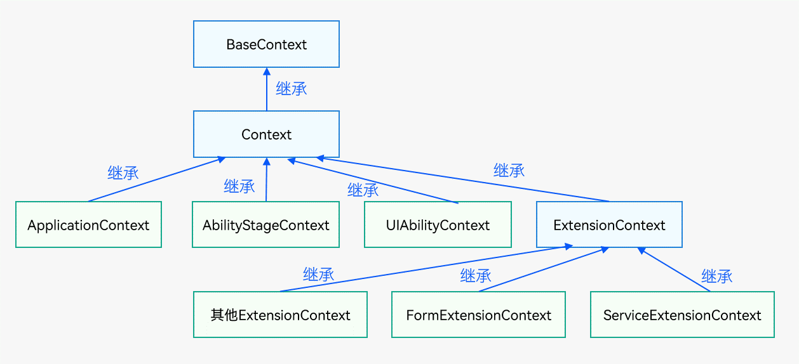
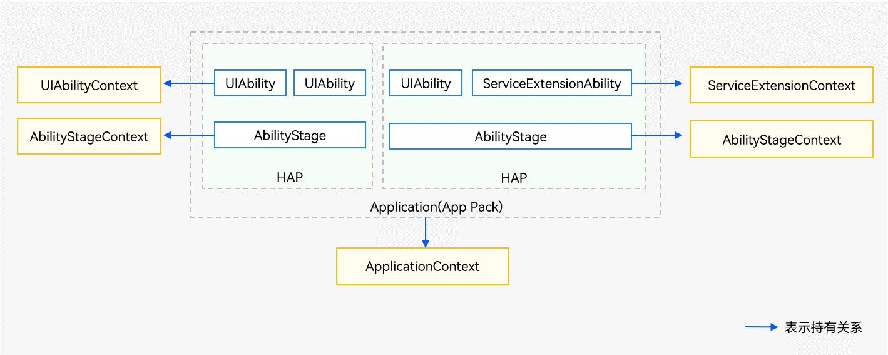

# Context (Stage模型的上下文基类)

<!--Kit: Ability Kit-->
<!--Subsystem: Ability-->
<!--Owner: @zexin_c-->
<!--Designer: @li-weifeng2024-->
<!--Tester: @liangchengguang-->
<!--Adviser: @HelloCrease-->

Context是Stage模型的上下文基类，主要用于访问特定应用程序的资源，以及执行应用级操作的回调。

> **说明：**
>
>  - 本模块首批接口从API version 9开始支持。后续版本的新增接口，采用上角标单独标记接口的起始版本。
>  - 本模块接口仅可在Stage模型下使用。

## 不同类型Context的继承和持有关系
- 不同类型Context的继承关系如下：

  

- 不同类型Context的持有关系如下：

  

> **说明**
>
> [UIContext](../../reference/apis-arkui/arkts-apis-uicontext-uicontext.md)是指UI实例上下文，用于关联窗口与UI页面。与本文档中的应用上下文Context无直接关联，不存在继承或持有关系。

## 导入模块

```ts
import { common } from '@kit.AbilityKit';
```

## Context

Context提供了ability或application的上下文的能力，包括访问特定应用程序的资源等。

### 属性

**系统能力**：SystemCapability.Ability.AbilityRuntime.Core

| 名称                  | 类型     | 只读   | 可选   | 说明                                                               |
|---------------------| ------ | ---- | ---- |------------------------------------------------------------------|
| resourceManager     | resmgr.[ResourceManager](../apis-localization-kit/js-apis-resource-manager.md#resourcemanager) | 否    | 否    | 资源管理对象。<br>**原子化服务API**：从API version 11开始，该接口支持在原子化服务中使用。 |
| applicationInfo     | [ApplicationInfo](js-apis-bundleManager-applicationInfo.md) | 否    | 否    | 当前应用程序的信息。 <br>**原子化服务API**：从API version 11开始，该接口支持在原子化服务中使用。 |
| cacheDir            | string | 否    | 否    | 缓存目录，详情参考[应用沙箱目录](../../file-management/app-sandbox-directory.md)。<br>**原子化服务API**：从API version 11开始，该接口支持在原子化服务中使用。 |
| tempDir             | string | 否    | 否    | 临时目录，详情参考[应用沙箱目录](../../file-management/app-sandbox-directory.md)。<br/>**原子化服务API**：从API version 11开始，该接口支持在原子化服务中使用。 |
| resourceDir<sup>11+</sup>         | string | 否    | 否    | 资源目录。<br>**说明**：需要开发者手动在`\<module-name>\resource`路径下创建`resfile`目录。创建的`resfile`目录仅支持以只读方式访问。<br>**原子化服务API**：从API version 11开始，该接口支持在原子化服务中使用。 |
| filesDir            | string | 否    | 否    | 文件目录，详情参考[应用沙箱目录](../../file-management/app-sandbox-directory.md)。<br/>**原子化服务API**：从API version 11开始，该接口支持在原子化服务中使用。 |
| databaseDir         | string | 否    | 否    | 数据库目录，详情参考[应用沙箱目录](../../file-management/app-sandbox-directory.md)。<br/>**原子化服务API**：从API version 11开始，该接口支持在原子化服务中使用。 |
| preferencesDir      | string | 否    | 否    | preferences目录，详情参考[应用沙箱目录](../../file-management/app-sandbox-directory.md)。<br/>**原子化服务API**：从API version 11开始，该接口支持在原子化服务中使用。 |
| bundleCodeDir       | string | 否    | 否    | 安装包目录。不能拼接路径访问资源文件，请使用[资源管理](../apis-localization-kit/js-apis-resource-manager.md)访问资源，详情参考[应用沙箱目录](../../file-management/app-sandbox-directory.md)。<br/>**原子化服务API**：从API version 11开始，该接口支持在原子化服务中使用。 |
| distributedFilesDir | string | 否    | 否    | 分布式文件目录，详情参考[应用沙箱目录](../../file-management/app-sandbox-directory.md)。<br/>**原子化服务API**：从API version 11开始，该接口支持在原子化服务中使用。 |
| cloudFileDir<sup>12+</sup>        | string | 否    | 否    | 云文件目录。<br>**原子化服务API**：从API version 12开始，该接口支持在原子化服务中使用。    |
| logFileDir<sup>22+</sup>        | string | 否    | 否    | 日志文件目录。<br>**原子化服务API**：从API version 22开始，该接口支持在原子化服务中使用。    |
| eventHub            | [EventHub](js-apis-inner-application-eventHub.md) | 否    | 否    | 事件中心，提供订阅、取消订阅、触发事件的能力。<br>**原子化服务API**：从API version 11开始，该接口支持在原子化服务中使用。 |
| area                | contextConstant.[AreaMode](js-apis-app-ability-contextConstant.md#areamode) | 否    | 否    | 文件分区信息，按加密等级[AreaMode](js-apis-app-ability-contextConstant.md#areamode) 进行分区。<br>**原子化服务API**：从API version 11开始，该接口支持在原子化服务中使用。 |
| processName<sup>18+</sup> | string | 否   | 否 | 当前应用的进程名。<br/>**原子化服务API**：从API version 18开始，该接口支持在原子化服务中使用。 |

### createModuleContext<sup>(deprecated)</sup>

createModuleContext(moduleName: string): Context

根据模块名创建上下文。

> **说明：**
>
> - 仅支持获取本应用中其他Module的Context和应用内HSP（共享包）的Context，不支持获取其他应用的Context。
>
> - 从API version 9 开始支持，从API version 12 开始废弃，建议使用[application.createModuleContext](./js-apis-app-ability-application.md#applicationcreatemodulecontext)替代，否则可能导致资源获取异常。
>
> - 由于创建模块上下文的过程涉及资源查询与初始化，耗时相对较长，在对应用流畅性要求较高的场景下，不建议频繁或多次调用createModuleContext接口创建多个Context实例，以免影响用户体验。

**原子化服务API**：从API version 11开始，该接口支持在原子化服务中使用。

**系统能力**：SystemCapability.Ability.AbilityRuntime.Core

**参数：**

| 参数名       | 类型                     | 必填   | 说明            |
| -------- | ---------------------- | ---- | ------------- |
| moduleName | string | 是    | 模块名。 |

**返回值：**

| 类型 | 说明 |
| -------- | -------- |
| Context | 模块的上下文，可用于访问模块资源、获取模块路径、执行模块级操作等。 |

**错误码**：

以下错误码详细介绍请参考[通用错误码](../errorcode-universal.md)。

| 错误码ID | 错误信息 |
| ------- | -------------------------------- |
| 401 | Parameter error. Possible causes: 1.Mandatory parameters are left unspecified. 2.Incorrect parameter types. |

**示例：**

```ts
import { common, UIAbility } from '@kit.AbilityKit';
import { BusinessError } from '@kit.BasicServicesKit';

export default class EntryAbility extends UIAbility {
  onCreate() {
    console.info('MyAbility onCreate');
    let moduleContext: common.Context;
    try {
      // 根据模块名创建上下文
      moduleContext = this.context.createModuleContext('entry');
    } catch (error) {
      console.error(`createModuleContext failed, error.code: ${(error as BusinessError).code}, error.message: ${(error as BusinessError).message}`);
    }
  }
}
```

### getApplicationContext

getApplicationContext(): ApplicationContext

获取当前应用上下文。提供应用级事件订阅等能力，与应用内所有UIAbility共享。详情请参见[ApplicationContext (应用上下文)](js-apis-inner-application-applicationContext.md)。

**原子化服务API**：从API version 11开始，该接口支持在原子化服务中使用。

**系统能力**：SystemCapability.Ability.AbilityRuntime.Core

**返回值：**

| 类型 | 说明 |
| -------- | -------- |
| [ApplicationContext](js-apis-inner-application-applicationContext.md) | 应用上下文，提供应用级别的上下文能力，包括应用生命周期管理、环境变量配置等。 |

**错误码**：

以下错误码详细介绍请参考[通用错误码](../errorcode-universal.md)。

| 错误码ID | 错误信息 |
| ------- | -------------------------------- |
| 401 | Parameter error. Possible causes: 1.Mandatory parameters are left unspecified. 2.Incorrect parameter types. |

**示例：**

```ts
import { common, UIAbility } from '@kit.AbilityKit';
import { BusinessError } from '@kit.BasicServicesKit';

export default class EntryAbility extends UIAbility {
  onCreate() {
    console.info('MyAbility onCreate');
    let applicationContext: common.Context;
    try {
      // 获取当前应用上下文
      applicationContext = this.context.getApplicationContext();
    } catch (error) {
      console.error(`Failed to get application context. Code: ${(error as BusinessError).code}, message: ${(error as BusinessError).message}`);
    }
  }
}
```

### getGroupDir<sup>10+</sup>

getGroupDir(dataGroupID: string): Promise\<string>

通过应用中的Group ID获取对应的共享目录，使用Promise异步回调。

**原子化服务API**：从API version 11开始，该接口支持在原子化服务中使用。

**系统能力**：SystemCapability.Ability.AbilityRuntime.Core

**参数：**

| 参数名       | 类型                     | 必填   | 说明            |
| -------- | ---------------------- | ---- | ------------- |
| [dataGroupID](../apis-arkdata/js-apis-data-preferences.md#options10) | string | 是    | 原子化服务类型的应用创建时，系统会指定分配唯一Group ID。 |

**返回值：**

| 类型 | 说明 |
| -------- | -------- |
| Promise\<string> | Promise对象，返回对应的共享目录。如果不存在则返回为空，仅支持应用el2加密级别。|

**错误码：**

以下错误码详细介绍请参考[通用错误码](../errorcode-universal.md)和[元能力子系统错误码](errorcode-ability.md)。

| 错误码ID | 错误信息 |
| ------- | -------------------------------- |
| 401 | Parameter error. Possible causes: 1.Mandatory parameters are left unspecified. 2.Incorrect parameter types. |
| 16000011 | The context does not exist. |

**示例：**

```ts
import { common, UIAbility } from '@kit.AbilityKit';
import { BusinessError } from '@kit.BasicServicesKit';

export default class EntryAbility extends UIAbility {
  onCreate() {
    console.info('MyAbility onCreate');
    let groupId = '1';
    let getGroupDirContext: common.Context = this.context;
    try {
      // 通过Group ID获取共享目录（Promise方式）
      getGroupDirContext.getGroupDir(groupId).then(data => {
        console.info('getGroupDir result:' + data);
      })
    } catch (error) {
      console.error(`Failed to get group directory. Code: ${(error as BusinessError).code}, message: ${(error as BusinessError).message}`);
    }
  }
}
```

### getGroupDir<sup>10+</sup>

getGroupDir(dataGroupID: string, callback: AsyncCallback\<string>): void

通过应用中的Group ID获取对应的共享目录，使用callback异步回调。

**原子化服务API**：从API version 11开始，该接口支持在原子化服务中使用。

**系统能力**：SystemCapability.Ability.AbilityRuntime.Core

**参数：**

| 参数名       | 类型                     | 必填   | 说明            |
| -------- | ---------------------- | ---- | ------------- |
| [dataGroupID](../apis-arkdata/js-apis-data-preferences.md#options10) | string | 是    | 原子化服务类型的应用创建时，系统会指定分配唯一Group ID。 |
| callback | AsyncCallback\<string> | 是    | 回调函数。当获取共享目录成功，err为undefined，data为对应的共享目录，如果不存在则返回为空；否则为错误对象。<br>**说明**：仅支持应用el2加密级别。|

**错误码：**

以下错误码详细介绍请参考[通用错误码](../errorcode-universal.md)和[元能力子系统错误码](errorcode-ability.md)。

| 错误码ID | 错误信息 |
| ------- | -------------------------------- |
| 401 | Parameter error. Possible causes: 1.Mandatory parameters are left unspecified. 2.Incorrect parameter types. |
| 16000011 | The context does not exist. |

**示例：**

```ts
import { common, UIAbility } from '@kit.AbilityKit';
import { BusinessError } from '@kit.BasicServicesKit';

export default class EntryAbility extends UIAbility {
  onCreate() {
    console.info('MyAbility onCreate');
    let getGroupDirContext: common.Context = this.context;

    // 通过Group ID获取共享目录（callback方式）
    getGroupDirContext.getGroupDir('1', (err: BusinessError, data) => {
      if (err) {
        console.error(`getGroupDir failed, err: ${JSON.stringify(err)}`);
      } else {
        console.info(`getGroupDir result is: ${JSON.stringify(data)}`);
      }
    });
  }
}
```

### createAreaModeContext<sup>18+</sup>

createAreaModeContext(areaMode: contextConstant.AreaMode): Context

创建特定数据加密等级的应用上下文。开发者可以调用该接口创建不同加密级别的上下文，从而获取对应的沙箱路径。

**原子化服务API**：从API version 18开始，该接口支持在原子化服务中使用。

**系统能力**：SystemCapability.Ability.AbilityRuntime.Core

**参数：**

| 参数名   | 类型                                                         | 必填 | 说明                     |
| -------- | ------------------------------------------------------------ | ---- | ------------------------ |
| areaMode | [contextConstant.AreaMode](js-apis-app-ability-contextConstant.md#areamode) | 是   | 指定的数据加密等级。 |

**返回值：**

| 类型    | 说明                   |
| ------- | ---------------------- |
| Context | 指定数据加密等级的上下文，可用于获取对应加密级别的沙箱路径、访问相应加密级别的文件和数据。 |

**示例：**

```ts
import { common, UIAbility, contextConstant } from '@kit.AbilityKit';
import { hilog } from '@kit.PerformanceAnalysisKit';

export default class EntryAbility extends UIAbility {
  onCreate() {
    hilog.info(0x0000, 'testTag', '%{public}s', 'Ability onCreate');
    let areaMode: contextConstant.AreaMode = contextConstant.AreaMode.EL2;
    let areaModeContext: common.Context;
    try {
      // 创建特定数据加密级别的应用上下文
      areaModeContext = this.context.createAreaModeContext(areaMode);
    } catch (error) {
      const err: BusinessError = error as BusinessError;
    hilog.error(0x0000, 'testTag', 'Failed to create area mode context. Code: %{public}d, message: %{public}s', err.code, err.message);
    }
  }
}
```

### createDisplayContext<sup>15+</sup>

createDisplayContext(displayId: number): Context

根据指定的物理屏幕ID创建带有屏幕信息（包括屏幕密度[ScreenDensity](../apis-localization-kit/js-apis-resource-manager.md#screendensity)和屏幕方向[Direction](../apis-localization-kit/js-apis-resource-manager.md#direction)）的应用上下文。

**原子化服务API**：从API version 15开始，该接口支持在原子化服务中使用。

**系统能力**：SystemCapability.Ability.AbilityRuntime.Core

**参数：**

| 参数名   | 类型                                                         | 必填 | 说明                     |
| -------- | ------------------------------------------------------------ | ---- | ------------------------ |
| [displayId](../apis-arkui/arkts-apis-window-i.md#windowproperties) | number | 是    | 物理屏幕ID。 |

**返回值：**

| 类型    | 说明                   |
| ------- | ---------------------- |
| [Context](#context) | 带有指定物理屏幕信息的上下文。 |

**错误码：**

以下错误码详细介绍请参考[通用错误码](../errorcode-universal.md)。

| 错误码ID | 错误信息                                                     |
| -------- | ------------------------------------------------------------ |
| 401      | Parameter error. Possible causes: 1.Mandatory parameters are left unspecified. 2.Incorrect parameter types. |

**示例：**

```ts
import { common, UIAbility } from '@kit.AbilityKit';
import { hilog } from '@kit.PerformanceAnalysisKit';
import { BusinessError } from '@kit.BasicServicesKit';

export default class EntryAbility extends UIAbility {
  onCreate() {
    hilog.info(0x0000, 'testTag', '%{public}s', 'Ability onCreate');
    let displayContext: common.Context;
    try {
      // displayId通过display.getDefaultDisplay()等接口获取，详见屏幕管理开发指导
      displayContext = this.context.createDisplayContext(0);
    } catch (error) {
      const err: BusinessError = error as BusinessError;
      hilog.error(0x0000, 'testTag', 'Failed to create display context. Code: %{public}d, message: %{public}s', err.code, err.message);
    }
  }
}
```

### isContextOf

isContextOf(contextType: contextConstant.ContextType): boolean

判断当前Context是否为指定的ContextType类型。

**起始版本**：26.0.0

**原子化服务API**：从API版本26.0.0开始，该接口支持在原子化服务中使用。

**系统能力**：SystemCapability.Ability.AbilityRuntime.Core

**参数：**

| 参数名   | 类型                                                         | 必填 | 说明                     |
| -------- | ------------------------------------------------------------ | ---- | ------------------------ |
| contextType | [contextConstant.ContextType](js-apis-app-ability-contextConstant.md#contexttype) | 是    | 上下文类型。 |

**返回值：**

| 类型    | 说明                   |
| ------- | ---------------------- |
| boolean | 是否为指定类型的上下文。返回true表示Context类型为指定类型，返回false表示当前Context不是指定类型。 |

**示例：**

```ts
import { UIAbility, contextConstant } from '@kit.AbilityKit';
import { hilog } from '@kit.PerformanceAnalysisKit';

export default class EntryAbility extends UIAbility {
  onCreate() {
    hilog.info(0x0000, 'testTag', `%{public}s`, 'Ability onCreate');
    // 判断当前Context是否为指定的ContextType类型
    let result = this.context.isContextOf(contextConstant.ContextType.UIABILITY_CONTEXT);
    hilog.info(0x0000, 'testTag', `match contextType result is:%{public}s`, JSON.stringify(result));
  }
}
```