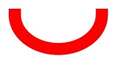

# Enums

> **说明：**
>
> - 本模块首批接口从API version 11开始支持。后续版本的新增接口，采用上角标单独标记接口的起始版本。
>
> - 本模块使用屏幕物理像素单位px。
>
> - 本模块为单线程模型策略，需要调用方自行管理线程安全和上下文状态的切换。

## BlendMode

混合模式枚举。混合模式会将两种颜色（源色、目标色）以特定的方式混合生成一种新的颜色，通常用于叠加、滤镜和遮罩等图形操作场景。混合操作会分别作用于红、绿、蓝三个颜色通道，采用相同的混合逻辑，而透明度（Alpha通道）则根据各模式的定义另行处理。

为简洁起见，我们使用以下缩写：

s : source 源的缩写。 d : destination 目标的缩写。 sa : source alpha 源透明度的缩写。 da : destination alpha 目标透明度的缩写。

计算结果用如下缩写表示：

r : 如果4个通道（透明度、红、绿、蓝）的计算方式相同，用r表示。 ra : 如果只操作透明度通道，用ra表示。 rc : 如果操作3个颜色通道，用rc表示。

以黄色矩形为源图像，蓝色圆形为目标图像，各混合模式枚举生成的效果示意图请参考下表。

**系统能力：** SystemCapability.Graphics.Drawing

| 名称        | 值   | 说明                                                         | 示意图   |
| ----------- | ---- | ------------------------------------------------------------ | -------- |
| CLEAR       | 0    | 清除模式，r = 0，设置为全透明。                                |  |
| SRC         | 1    | r = s（result的4个通道，都等于source的4个通道，即结果等于源。），使用源像素替换目标像素。 |  |
| DST         | 2    | r = d（result的4个通道，都等于destination的4个通道，即结果等于目标。），保持目标像素不变。 |  |
| SRC_OVER    | 3    | r = s + (1 - sa) * d，在目标像素上方绘制源像素，考虑源像素的透明度。 |  |
| DST_OVER    | 4    | r = d + (1 - da) * s，在源像素上方绘制目标像素，考虑目标像素的透明度。 |  |
| SRC_IN      | 5    | r = s * da，仅保留源像素与目标不透明部分的交集。 |  |
| DST_IN      | 6    | r = d * sa，仅保留目标像素与源不透明部分的交集。 |  |
| SRC_OUT     | 7    | r = s * (1 - da)，保留源像素中不与目标重叠的部分。 |  |
| DST_OUT     | 8    | r = d * (1 - sa)，保留目标像素中不与源重叠的部分。 |  |
| SRC_ATOP    | 9    | r = s * da + d * (1 - sa)，源像素覆盖在目标像素上，仅在目标不透明部分显示源像素。 |  |
| DST_ATOP    | 10   | r = d * sa + s * (1 - da)，目标像素覆盖在源像素上，仅在源不透明部分显示目标像素。 |  |
| XOR         | 11   | r = s * (1 - da) + d * (1 - sa)，仅显示源像素和目标像素中不重叠的部分。 |  |
| PLUS        | 12   | r = min(s + d, 1)，源和目标像素的颜色值相加。                   |  |
| MODULATE    | 13   | r = s * d，源和目标像素的颜色值相乘。                           |  |
| SCREEN      | 14   | 滤色模式，r = s + d - s * d，反转源和目标像素的颜色值，相乘后再反转，结果通常更亮。 |  |
| OVERLAY     | 15   | 叠加模式，根据目标像素的亮度，选择性地应用MULTIPLY或SCREEN模式，增强对比度。 |  |
| DARKEN      | 16   | 变暗模式，rc = s + d - max(s * da, d * sa), ra = s + (1 - sa) * d，取源和目标像素中较暗的颜色值。 |  |
| LIGHTEN     | 17   | 变亮模式，rc = s + d - min(s * da, d * sa), ra = s + (1 - sa) * d，取源和目标像素中较亮的颜色值。 |  |
| COLOR_DODGE | 18   | 颜色减淡模式，通过减小对比度使目标像素变亮以反映源像素。           |  |
| COLOR_BURN  | 19   | 颜色加深模式，通过增加对比度使目标像素变暗以反映源像素。           |  |
| HARD_LIGHT  | 20   | 强光模式，根据源像素的亮度，选择性地应用MULTIPLY或SCREEN模式。    |  |
| SOFT_LIGHT  | 21   | 柔光模式，根据源像素的亮度，柔和地变亮或变暗目标像素。             |  |
| DIFFERENCE  | 22   | 差值模式，rc = s + d - 2 * (min(s * da, d * sa)), ra = s + (1 - sa) * d，计算源和目标像素颜色值的差异。 |  |
| EXCLUSION   | 23   | 排除模式，rc = s + d - two(s * d), ra = s + (1 - sa) * d，类似于DIFFERENCE，但对比度较低。 |  |
| MULTIPLY    | 24   | 正片叠底，r = s * (1 - da) + d * (1 - sa) + s * d，源和目标像素的颜色值相乘，结果通常更暗。 |  |
| HUE         | 25   | 色相模式，使用源像素的色相，目标像素的饱和度和亮度。               |  |
| SATURATION  | 26   | 饱和度模式，使用源像素的饱和度，目标像素的色相和亮度。             |  |
| COLOR       | 27   | 颜色模式，使用源像素的色相和饱和度，目标像素的亮度。               |  |
| LUMINOSITY  | 28   | 亮度模式，使用源像素的亮度，目标像素的色相和饱和度。               |  |

## PathMeasureMatrixFlags12+

路径测量中的矩阵信息维度枚举，常用于控制物体沿路径移动的动画场景。

**系统能力：** SystemCapability.Graphics.Drawing

| 名称        | 值   | 说明                                                         |
| ----------- | ---- | ------------------------------------------------------------ |
| GET_POSITION_MATRIX        | 0    | 获取位置信息对应的矩阵。                                            |
| GET_TANGENT_MATRIX          | 1    | 获取切线信息对应的矩阵。 |
| GET_POSITION_AND_TANGENT_MATRIX    | 2     | 获取位置和切线信息对应的矩阵。 |

## SrcRectConstraint12+

源矩形区域约束类型枚举，用于在画布绘制图像时指定是否将采样范围限制在源矩形区域内。

**系统能力：** SystemCapability.Graphics.Drawing

| 名称        | 值   | 说明                                                         |
| ----------- | ---- | ------------------------------------------------------------ |
| STRICT         | 0    | 严格限制采样范围在源矩形区域内，速度较慢。                                            |
| FAST           | 1    | 允许采样范围超出源矩形范围，速度较快。 |

## ShadowFlag12+

控制阴影绘制行为的枚举。

**系统能力：** SystemCapability.Graphics.Drawing

| 名称                         | 值    | 说明                 |
| -------------------------- | ---- | ------------------ |
| NONE      | 0    | 不使用任何阴影处理选项。        |
| TRANSPARENT_OCCLUDER | 1    | 遮挡物是半透明的。         |
| GEOMETRIC_ONLY    | 2    | 仅使用几何阴影效果。        |
| ALL           | 3    | 使用所有可用的阴影处理选项，以生成组合阴影效果，包括半透明遮挡和几何阴影效果。 |

## PathOp12+

路径操作类型枚举，可用于合并或裁剪路径等功能。

**系统能力：** SystemCapability.Graphics.Drawing

| 名称                   | 值   | 说明                           |
| ---------------------- | ---- | ------------------------------ |
| DIFFERENCE     | 0    | 差集操作。 |
| INTERSECT    | 1    | 交集操作。 |
| UNION    | 2    | 并集操作。 |
| XOR     | 3    | 异或操作。 |
| REVERSE_DIFFERENCE     | 4    | 反向差集操作。 |

## PathIteratorVerb18+

迭代器包含的路径操作类型枚举，可用于读取path的操作指令。

**系统能力：** SystemCapability.Graphics.Drawing

| 名称  | 值   | 说明                           |
| ----- | ---- | ------------------------------ |
| MOVE  | 0    | 设置起始点。 |
| LINE  | 1    | 添加线段。 |
| QUAD  | 2    | 添加二阶贝塞尔圆滑曲线。 |
| CONIC | 3    | 添加圆锥曲线。 |
| CUBIC | 4    | 添加三阶贝塞尔圆滑曲线。 |
| CLOSE | 5    | 路径闭合。 |
| DONE  | CLOSE + 1    | 路径设置完成。 |

## TextEncoding

文本的编码类型枚举。

**系统能力：** SystemCapability.Graphics.Drawing

| 名称                   | 值   | 说明                           |
| ---------------------- | ---- | ------------------------------ |
| TEXT_ENCODING_UTF8     | 0    | 使用1个字节表示UTF-8或ASCII。  |
| TEXT_ENCODING_UTF16    | 1    | 使用2个字节表示大部分unicode。 |
| TEXT_ENCODING_UTF32    | 2    | 使用4个字节表示全部unicode。   |
| TEXT_ENCODING_GLYPH_ID | 3    | 使用2个字节表示glyph index。   |

## ClipOp12+

画布裁剪方式的枚举。

**系统能力：** SystemCapability.Graphics.Drawing

| 名称                 | 值    | 说明           | 示意图   |
| ------------------ | ---- | ---------------- | -------- |
| DIFFERENCE | 0    | 将指定区域裁剪（取差集）。 |  |
| INTERSECT  | 1    | 将指定区域保留（取交集）。 |  |

> **说明：**
>
> 示意图展示了以INTERSECT方式裁剪一个矩形后，使用不同枚举值继续裁剪一个圆形的结果，绿色区域为最终的裁剪区域。

## FilterMode12+

过滤模式枚举。

**系统能力：** SystemCapability.Graphics.Drawing

| 名称                  | 值    | 说明      |
| ------------------- | ---- | ------- |
| FILTER_MODE_NEAREST | 0    | 邻近过滤模式。 |
| FILTER_MODE_LINEAR  | 1    | 线性过滤模式。 |

## PathDirection12+

添加闭合轮廓方向的枚举。

**系统能力：** SystemCapability.Graphics.Drawing

| 名称                  | 值    | 说明      |
| ------------------- | ---- | ------- |
| CLOCKWISE   | 0    | 顺时针方向添加闭合轮廓。 |
| COUNTER_CLOCKWISE  | 1    | 逆时针方向添加闭合轮廓。 |

## PathFillType12+

定义路径的填充类型枚举。

**系统能力：** SystemCapability.Graphics.Drawing

| 名称                  | 值    | 说明      |
| ------------------- | ---- | ------- |
| WINDING   | 0    | 绘制区域中的任意一点，向任意方向射出一条射线，对于射线和路径的所有交点，初始计数为0，遇到每个顺时针的交点（路径从射线的左边向右穿过），计数加1，遇到每个逆时针的交点（路径从射线的右边向左穿过），计数减1，若最终的计数结果不为0，则认为这个点在路径内部，需要被涂色；若计数为0则不被涂色。 |
| EVEN_ODD  | 1    | 绘制区域中的任意一点，向任意方向射出一条射线，若这条射线和路径相交的次数是奇数，则这个点被认为在路径内部，需要被涂色；若是偶数则不被涂色。 |
| INVERSE_WINDING  | 2    | WINDING涂色规则取反。 |
| INVERSE_EVEN_ODD  | 3    | EVEN_ODD涂色规则取反。 |

> **说明：** 
>  
> 如图所示圆环为路径，箭头指示路径的方向，p为区域内任意一点，蓝色线条为点p出发的射线，黑色箭头所指为对应填充规则下使用蓝色填充路径的结果。WINDING填充规则下，射线与路径的交点计数为2，不为0，点p被涂色；EVEN_ODD填充规则下，射线与路径的相交次数为2，是偶数，点p不被涂色。

## PointMode12+

绘制数组点的方式的枚举。

**系统能力：** SystemCapability.Graphics.Drawing

| 名称                 | 值    | 说明            |
| ------------------ | ---- | ------------- |
| POINTS  | 0    | 分别绘制每个点。      |
| LINES   | 1    | 将每对点绘制为线段。    |
| POLYGON | 2    | 将点阵列绘制为开放多边形。 |

## FontEdging12+

字型边缘效果类型枚举。

**系统能力：** SystemCapability.Graphics.Drawing

| 名称                  | 值    | 说明      |
| ------------------- | ---- | ------- |
| ALIAS | 0    | 无抗锯齿处理。 |
| ANTI_ALIAS  | 1    | 使用抗锯齿来平滑字型边缘。 |
| SUBPIXEL_ANTI_ALIAS  | 2    | 使用次像素级别的抗锯齿平滑字型边缘，可以获得更平滑的字型渲染效果。 |

## FontHinting12+

字型轮廓效果类型枚举。

**系统能力：** SystemCapability.Graphics.Drawing

| 名称                  | 值    | 说明      |
| ------------------- | ---- | ------- |
| NONE    | 0    | 不修改字型轮廓。 |
| SLIGHT  | 1    | 最小限度修改字型轮廓以改善对比度。 |
| NORMAL  | 2    | 修改字型轮廓以提高对比度。 |
| FULL    | 3    | 修改字型轮廓以获得最大对比度。 |

## FontMetricsFlags12+

字体度量标志枚举，指示字体度量中的各字段数据是否有效。

**系统能力：** SystemCapability.Graphics.Drawing

| 名称                          | 值        | 说明                           |
| ----------------------------- | --------- | ------------------------------ |
| UNDERLINE_THICKNESS_VALID     | 1 << 0    | 表示[FontMetrics](arkts-apis-graphics-drawing-i.md#fontmetrics)结构中的underlineThickness（下划线厚度）字有效。    |
| UNDERLINE_POSITION_VALID      | 1 << 1    | 表示[FontMetrics](arkts-apis-graphics-drawing-i.md#fontmetrics)结构中的underlinePosition（下划线位置）字段有效。  |
| STRIKETHROUGH_THICKNESS_VALID | 1 << 2    | 表示[FontMetrics](arkts-apis-graphics-drawing-i.md#fontmetrics)结构中strikethroughThickness（删除线厚度）是有效的。|
| STRIKETHROUGH_POSITION_VALID  | 1 << 3    | 表示[FontMetrics](arkts-apis-graphics-drawing-i.md#fontmetrics)结构中strikethroughPosition（删除线位置）字段有效。  |
| BOUNDS_INVALID                | 1 << 4    | 表示[FontMetrics](arkts-apis-graphics-drawing-i.md#fontmetrics)结构中的边界度量值（如top、bottom、xMin、xMax）无效。  |

## RectType12+

定义填充网格的矩形类型的枚举。仅在[Lattice](arkts-apis-graphics-drawing-Lattice.md)中使用。

**系统能力：** SystemCapability.Graphics.Drawing

| 名称         | 值   | 说明                                                             |
| ------------ | ---- | --------------------------------------------------------------- |
| DEFAULT      | 0    | 将图像绘制到矩形网格中。                                          |
| TRANSPARENT  | 1    | 将矩形网格设置为透明的。                                          |
| FIXEDCOLOR   | 2    | 将[Lattice](arkts-apis-graphics-drawing-Lattice.md)中fColors数组的颜色绘制到矩形网格中。       |

## PathDashStyle18+

路径效果的绘制样式枚举。

**系统能力：** SystemCapability.Graphics.Drawing

| 名称   | 值 | 说明               |
| ------ | - | ------------------ |
| TRANSLATE | 0 | 不会随着路径旋转，只会平移。 |
| ROTATE  | 1 | 随着路径的旋转而旋转。 |
| MORPH  | 2 | 随着路径的旋转而旋转，并在转折处进行拉伸或压缩等操作以增加平滑度。 |

## TileMode12+

着色器效果平铺模式的枚举。

**系统能力：** SystemCapability.Graphics.Drawing

| 名称                   | 值   | 说明                           |
| ---------------------- | ---- | ------------------------------ |
| CLAMP     | 0    | 如果着色器效果超出其原始边界，剩余区域使用着色器的边缘颜色填充。 |
| REPEAT    | 1    | 在水平和垂直方向上重复着色器效果。 |
| MIRROR    | 2    | 在水平和垂直方向上重复着色器效果，交替镜像图像，以便相邻图像始终接合。 |
| DECAL     | 3    | 仅在其原始边界内渲染着色器效果。|

## JoinStyle12+

定义线条转角样式的枚举，即画笔在绘制折线段时，在折线转角处的样式。

**系统能力：** SystemCapability.Graphics.Drawing

| 名称        | 值   | 说明                                                         | 示意图   |
| ----------- | ---- | ----------------------------------------------------------- | -------- |
| MITER_JOIN | 0    | 转角类型为尖角，如果折线角度比较小，则尖角会很长，需要使用限制值（miter limit）进行限制。 |  |
| ROUND_JOIN | 1    | 转角类型为圆头。 |  |
| BEVEL_JOIN | 2    | 转角类型为平头。 |  |

## CapStyle12+

定义线帽样式的枚举，即画笔在绘制线段时，在线段头尾端点的样式。

**系统能力：** SystemCapability.Graphics.Drawing

| 名称        | 值   | 说明                                                         | 示意图   |
| ---------- | ---- | ----------------------------------------------------------- | -------- |
| FLAT_CAP   | 0    | 没有线帽样式，线条头尾端点处横切。 |  |
| SQUARE_CAP | 1    | 线帽的样式为方框，线条的头尾端点处多出一个方框，方框宽度和线段一样宽，高度是线段宽度的一半。 |  |
| ROUND_CAP  | 2    | 线帽的样式为圆弧，线条的头尾端点处多出一个半圆弧，半圆的直径与线段宽度一致。 |  |

## BlurType12+

定义蒙版滤镜模糊中操作类型的枚举。

**系统能力：** SystemCapability.Graphics.Drawing

| 名称   | 值 | 说明               | 示意图   |
| ------ | - | ------------------ | -------- |
| NORMAL | 0 | 全面模糊，外圈边缘和内部实体一起模糊。 |  |
| SOLID  | 1 | 内部实体不变，只模糊外圈边缘部分。 |  |
| OUTER  | 2 | 只有外圈边缘模糊，内部实体完全透明。 |  |
| INNER  | 3 | 只有内部实体模糊，外圈边缘清晰。 |  |

## ScaleToFit12+

源矩形到目标矩形的缩放方式枚举。

**系统能力：** SystemCapability.Graphics.Drawing

| 名称                   | 值   | 说明                           |
| ---------------------- | ---- | ------------------------------ |
| FILL_SCALE_TO_FIT     | 0    | 将源矩形缩放以填充满整个目标矩形，可能会改变源矩形的长宽比。  |
| START_SCALE_TO_FIT    | 1    | 保持源矩形的长宽比进行缩放，并对齐到目标矩形的左上方。 |
| CENTER_SCALE_TO_FIT    | 2    | 保持源矩形的长宽比进行缩放，并居中对齐到目标矩形。   |
| END_SCALE_TO_FIT | 3    | 保持源矩形的长宽比进行缩放，并对齐到目标矩形的右下方。   |

## RegionOp12+

两个区域合并时的操作的枚举。

**系统能力：** SystemCapability.Graphics.Drawing

| 名称                   | 值   | 说明                           | 示意图   |
| --------------------- | ---- | ------------------------------ | -------- |
| DIFFERENCE         | 0    | 两个区域的相减操作。  |  |
| INTERSECT          | 1    | 两个区域的相交操作。 |  |
| UNION              | 2    | 两个区域的联合操作。   |  |
| XOR                | 3    | 两个区域的异或操作。   |  |
| REVERSE_DIFFERENCE | 4    | 两个区域的反向相减操作。   |  |
| REPLACE            | 5    | 两个区域替换操作。   |  |

> **说明：**
>
> 示意图展示了一个以红色区域为基础，使用不同枚举值与另一个蓝色区域合并后获得的结果，其中绿色区域为最终得到的区域。

## CornerPos12+

圆角位置枚举。

**系统能力：** SystemCapability.Graphics.Drawing

| 名称                   | 值   | 说明                           |
| --------------------- | ---- | ------------------------------ | 
| TOP_LEFT_POS          | 0    | 左上角圆角位置。  |
| TOP_RIGHT_POS         | 1    | 右上角圆角位置。 |
| BOTTOM_RIGHT_POS      | 2    | 右下角圆角位置。   |
| BOTTOM_LEFT_POS       | 3    | 左下角圆角位置。   |
