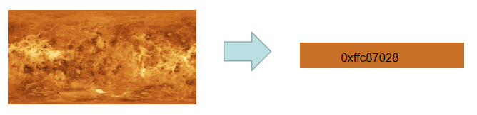

# @ohos.effectKit (图像效果)

图像效果提供处理图像的一些基础能力，包括对当前图像的亮度调节、模糊化、灰度调节、智能取色等。

该模块提供以下图像效果相关的常用功能：

- [Filter](#filter)：效果类，用于添加指定效果到图像源。
- [Color](#color)：颜色类，用于保存取色的结果。
- [ColorPicker](#colorpicker)：智能取色器。

> **说明：**
> 
> 本模块首批接口从API version 9开始支持。后续版本的新增接口，采用上角标单独标记接口的起始版本。

## 导入模块

```ts
import { effectKit } from "@kit.ArkGraphics2D";
```

## effectKit.createEffect
createEffect(source: image.PixelMap): Filter

通过传入的PixelMap创建Filter实例。

**卡片能力：** 从API version 12开始，该接口支持在ArkTS卡片中使用。

**原子化服务API：** 从API version 12开始，该接口支持在原子化服务中使用。

**系统能力：** SystemCapability.Multimedia.Image.Core

**参数：**

| 参数名    | 类型               | 必填 | 说明     |
| ------- | ----------------- | ---- | -------- |
| source  | [image.PixelMap](../apis-image-kit/js-apis-image.md#pixelmap7) | 是   | image模块创建的PixelMap实例。可通过图片解码或直接创建获得，具体可见[图片开发指导](../../media/image/image-overview.md)。   |

**返回值：**

| 类型                             | 说明           |
| -------------------------------- | -------------- |
| [Filter](#filter) | 返回不带任何效果的Filter链表的头节点，失败时返回null。 |

**示例：**

```ts
import { image } from "@kit.ImageKit";
import { effectKit } from "@kit.ArkGraphics2D";

const color = new ArrayBuffer(96);
let opts : image.InitializationOptions = {
  editable: true,
  pixelFormat: 3,
  size: {
    height: 4,
    width: 6
  }
}
image.createPixelMap(color, opts).then((pixelMap) => {
  let headFilter = effectKit.createEffect(pixelMap);
})
```

## effectKit.createColorPicker

createColorPicker(source: image.PixelMap): Promise\<ColorPicker>

通过传入的PixelMap创建ColorPicker实例，使用Promise异步回调。

**卡片能力：** 从API version 12开始，该接口支持在ArkTS卡片中使用。

**原子化服务API：** 从API version 12开始，该接口支持在原子化服务中使用。

**系统能力：** SystemCapability.Multimedia.Image.Core

**参数：**

| 参数名     | 类型         | 必填 | 说明                       |
| -------- | ----------- | ---- | -------------------------- |
| source   | [image.PixelMap](../apis-image-kit/js-apis-image.md#pixelmap7) | 是   |  image模块创建的PixelMap实例。可通过图片解码或直接创建获得，具体可见[图片开发指导](../../media/image/image-overview.md)。 |

**返回值：**

| 类型                   | 说明           |
| ---------------------- | -------------- |
| Promise\<[ColorPicker](#colorpicker)>  | Promise对象。返回创建的ColorPicker实例。 |

**错误码：**

以下错误码的详细介绍请参见[通用错误码](../errorcode-universal.md)。

| 错误码ID | 错误信息                        |
| -------- | ------------------------------ |
| 401      | Input parameter error.             |

**示例：**

```ts
import { image } from "@kit.ImageKit";
import { effectKit } from "@kit.ArkGraphics2D";
import { BusinessError } from "@kit.BasicServicesKit";

const color = new ArrayBuffer(96);
let opts : image.InitializationOptions = {
  editable: true,
  pixelFormat: 3,
  size: {
    height: 4,
    width: 6
  }
}

image.createPixelMap(color, opts).then((pixelMap) => {
  effectKit.createColorPicker(pixelMap).then(colorPicker => {
    console.info("color picker=" + colorPicker);
  }).catch( (reason : BusinessError) => {
    console.error("error=" + reason.message);
  })
})
```

## effectKit.createColorPicker<sup>10+</sup>

createColorPicker(source: image.PixelMap, region: Array\<number>): Promise\<ColorPicker>

通过传入的PixelMap创建选定取色区域的ColorPicker实例，使用Promise异步回调。

**卡片能力：** 从API version 12开始，该接口支持在ArkTS卡片中使用。

**原子化服务API：** 从API version 12开始，该接口支持在原子化服务中使用。

**系统能力：** SystemCapability.Multimedia.Image.Core

**参数：**

| 参数名     | 类型         | 必填 | 说明                       |
| -------- | ----------- | ---- | -------------------------- |
| source   | [image.PixelMap](../apis-image-kit/js-apis-image.md#pixelmap7) | 是   |  image模块创建的PixelMap实例。可通过图片解码或直接创建获得，具体可见[图片开发指导](../../media/image/image-overview.md)。 |
| region   | Array\<number> | 是   |  指定图片的取色区域。<br>数组元素个数为4，取值范围为[0, 1]，数组元素分别表示图片区域的左、上、右、下位置，图片最左侧和最上侧对应位置0，最右侧和最下侧对应位置1。数组第三个元素需大于第一个元素，第四个元素需大于第二个元素。|

**返回值：**

| 类型                   | 说明           |
| ---------------------- | -------------- |
| Promise\<[ColorPicker](#colorpicker)>  | Promise对象。返回创建的ColorPicker实例。 |

**错误码：**

以下错误码的详细介绍请参见[通用错误码](../errorcode-universal.md)。

| 错误码ID | 错误信息                        |
| -------- | ------------------------------ |
| 401      | Input parameter error.             |

**示例：**

```ts
import { image } from "@kit.ImageKit";
import { effectKit } from "@kit.ArkGraphics2D";
import { BusinessError } from "@kit.BasicServicesKit";

const color = new ArrayBuffer(96);
let opts : image.InitializationOptions = {
  editable: true,
  pixelFormat: 3,
  size: {
    height: 4,
    width: 6
  }
}

image.createPixelMap(color, opts).then((pixelMap) => {
  effectKit.createColorPicker(pixelMap, [0, 0, 1, 1]).then(colorPicker => {
    console.info("color picker=" + colorPicker);
  }).catch( (reason : BusinessError) => {
    console.error("error=" + reason.message);
  })
})
```

## effectKit.createColorPicker

createColorPicker(source: image.PixelMap, callback: AsyncCallback\<ColorPicker>): void

通过传入的PixelMap创建ColorPicker实例，使用callback异步回调。

**卡片能力：** 从API version 12开始，该接口支持在ArkTS卡片中使用。

**原子化服务API：** 从API version 12开始，该接口支持在原子化服务中使用。

**系统能力：** SystemCapability.Multimedia.Image.Core

**参数：**

| 参数名     | 类型                | 必填 | 说明                       |
| -------- | ------------------ | ---- | -------------------------- |
| source   | [image.PixelMap](../apis-image-kit/js-apis-image.md#pixelmap7) | 是  |image模块创建的PixelMap实例。可通过图片解码或直接创建获得，具体可见[图片开发指导](../../media/image/image-overview.md)。  |
| callback | AsyncCallback\<[ColorPicker](#colorpicker)> | 是  | 回调函数。返回创建的ColorPicker实例。 |

**错误码：**

以下错误码的详细介绍请参见[通用错误码](../errorcode-universal.md)。

| 错误码ID | 错误信息                        |
| -------- | ------------------------------ |
| 401      | Input parameter error.             |

**示例：**

```ts
import { image } from "@kit.ImageKit";
import { effectKit } from "@kit.ArkGraphics2D";

const color = new ArrayBuffer(96);
let opts : image.InitializationOptions = {
  editable: true,
  pixelFormat: 3,
  size: {
    height: 4,
    width: 6
  }
}
image.createPixelMap(color, opts).then((pixelMap) => {
  effectKit.createColorPicker(pixelMap, (error, colorPicker) => {
    if (error) {
      console.error('Failed to create color picker.');
    } else {
      console.info('Succeeded in creating color picker.');
    }
  })
})
```

## effectKit.createColorPicker<sup>10+</sup>

createColorPicker(source: image.PixelMap, region:Array\<number>, callback: AsyncCallback\<ColorPicker>): void

通过传入的PixelMap创建选定取色区域的ColorPicker实例，使用callback异步回调。

**卡片能力：** 从API version 12开始，该接口支持在ArkTS卡片中使用。

**原子化服务API：** 从API version 12开始，该接口支持在原子化服务中使用。

**系统能力：** SystemCapability.Multimedia.Image.Core

**参数：**

| 参数名     | 类型                | 必填 | 说明                       |
| -------- | ------------------ | ---- | -------------------------- |
| source   | [image.PixelMap](../apis-image-kit/js-apis-image.md#pixelmap7) | 是  |image模块创建的PixelMap实例。可通过图片解码或直接创建获得，具体可见[图片开发指导](../../media/image/image-overview.md)。  |
| region   | Array\<number> | 是   |  指定图片的取色区域。<br>数组元素个数为4，取值范围为[0, 1]，数组元素分别表示图片区域的左、上、右、下位置，图片最左侧和最上侧对应位置0，最右侧和最下侧对应位置1。数组第三个元素需大于第一个元素，第四个元素需大于第二个元素。|
| callback | AsyncCallback\<[ColorPicker](#colorpicker)> | 是  | 回调函数。返回创建的ColorPicker实例。 |

**错误码：**

以下错误码的详细介绍请参见[通用错误码](../errorcode-universal.md)。

| 错误码ID | 错误信息                        |
| -------- | ------------------------------ |
| 401      | Input parameter error.             |

**示例：**

```ts
import { image } from "@kit.ImageKit";
import { effectKit } from "@kit.ArkGraphics2D";

const color = new ArrayBuffer(96);
let opts : image.InitializationOptions = {
  editable: true,
  pixelFormat: 3,
  size: {
    height: 4,
    width: 6
  }
}
image.createPixelMap(color, opts).then((pixelMap) => {
  effectKit.createColorPicker(pixelMap, [0, 0, 1, 1], (error, colorPicker) => {
    if (error) {
      console.error('Failed to create color picker.');
    } else {
      console.info('Succeeded in creating color picker.');
    }
  })
})
```

## Color

颜色类，用于保存取色的结果。

**卡片能力：** 从API version 12开始，该接口支持在ArkTS卡片中使用。

**原子化服务API：** 从API version 12开始，该接口支持在原子化服务中使用。

**系统能力：** SystemCapability.Multimedia.Image.Core

| 名称   | 类型   | 可读 | 可写 | 说明              |
| ------ | ----- | ---- | ---- | ---------------- |
| red   | number | 是   | 否   | 红色分量值，取值范围[0x0, 0xFF]。           |
| green | number | 是   | 否   | 绿色分量值，取值范围[0x0, 0xFF]。           |
| blue  | number | 是   | 否   | 蓝色分量值，取值范围[0x0, 0xFF]。           |
| alpha | number | 是   | 否   | 透明通道分量值，取值范围[0x0, 0xFF]。       |

## TileMode<sup>14+</sup>

着色器效果平铺模式的枚举。

| 名称                   | 值   | 说明                           |
| ---------------------- | ---- | ------------------------------ |
| CLAMP     | 0    | 如果着色器效果超出其原始边界，剩余区域使用着色器的边缘颜色填充。 |
| REPEAT    | 1    | 在水平和垂直方向上重复着色器效果。 |
| MIRROR    | 2    | 在水平和垂直方向上重复着色器效果，交替镜像图像，以便相邻图像始终接合。 |
| DECAL     | 3    | 仅在其原始边界内渲染着色器效果。|

## ColorPicker

取色类，用于从一张图像数据中获取它的主要颜色。在调用ColorPicker的方法前，需要先通过[createColorPicker](#effectkitcreatecolorpicker)创建一个ColorPicker实例。

### getMainColor

getMainColor(): Promise\<Color>

读取图像主色的颜色值，结果写入[Color](#color)里，使用Promise异步回调。

**卡片能力：** 从API version 12开始，该接口支持在ArkTS卡片中使用。

**原子化服务API：** 从API version 12开始，该接口支持在原子化服务中使用。

**系统能力：** SystemCapability.Multimedia.Image.Core

**返回值：**

| 类型           | 说明                                            |
| :------------- | :---------------------------------------------- |
| Promise\<[Color](#color)> | Promise对象。返回图像主色对应的颜色值，失败时返回错误信息。 |

**示例：**

```ts
import { image } from "@kit.ImageKit";
import { effectKit } from "@kit.ArkGraphics2D";

const color = new ArrayBuffer(96);
let opts: image.InitializationOptions = {
  editable: true,
  pixelFormat: 3,
  size: {
    height: 4,
    width: 6
  }
}
image.createPixelMap(color, opts).then((pixelMap) => {
  effectKit.createColorPicker(pixelMap, (error, colorPicker) => {
    if (error) {
      console.error('Failed to create color picker.');
     } else {
       console.info('Succeeded in creating color picker.');
       colorPicker.getMainColor().then(color => {
        console.info('Succeeded in getting main color.');
         console.info(`color[ARGB]=${color.alpha},${color.red},${color.green},${color.blue}`);
      })
    }
  })
})
```

### getMainColorSync

getMainColorSync(): Color

读取图像主色的颜色值，结果写入[Color](#color)里，使用同步方式返回。

**卡片能力：** 从API version 12开始，该接口支持在ArkTS卡片中使用。

**原子化服务API：** 从API version 12开始，该接口支持在原子化服务中使用。

**系统能力：** SystemCapability.Multimedia.Image.Core

**返回值：**

| 类型     | 说明                                  |
| :------- | :----------------------------------- |
| [Color](#color)    | Color实例，即图像主色对应的颜色值，失败时返回null。 |

**示例：**

```ts
import { image } from "@kit.ImageKit";
import { effectKit } from "@kit.ArkGraphics2D";

const color = new ArrayBuffer(96);
let opts : image.InitializationOptions = {
  editable: true,
  pixelFormat: 3,
  size: {
    height: 4,
    width: 6
  }
}
image.createPixelMap(color, opts).then((pixelMap) => {
  effectKit.createColorPicker(pixelMap, (error, colorPicker) => {
    if (error) {
      console.error('Failed to create color picker.');
    } else {
      console.info('Succeeded in creating color picker.');
      let color = colorPicker.getMainColorSync();
      console.info('get main color =' + color);
    }
  })
})
```


### getLargestProportionColor<sup>10+</sup>

getLargestProportionColor(): Color

读取图像占比最多的颜色值，结果写入[Color](#color)里，使用同步方式返回。

**卡片能力：** 从API version 12开始，该接口支持在ArkTS卡片中使用。

**原子化服务API：** 从API version 12开始，该接口支持在原子化服务中使用。

**系统能力：** SystemCapability.Multimedia.Image.Core

**返回值：**

| 类型           | 说明                                            |
| :------------- | :---------------------------------------------- |
| [Color](#color)       | Color实例，即图像占比最多的颜色值，失败时返回null。 |

**示例：**

```ts
import { image } from "@kit.ImageKit";
import { effectKit } from "@kit.ArkGraphics2D";

const color = new ArrayBuffer(96);
let opts : image.InitializationOptions = {
  editable: true,
  pixelFormat: 3,
  size: {
    height: 4,
    width: 6
  }
}
image.createPixelMap(color, opts).then((pixelMap) => {
  effectKit.createColorPicker(pixelMap, (error, colorPicker) => {
    if (error) {
      console.error('Failed to create color picker.');
    } else {
      console.info('Succeeded in creating color picker.');
      let color = colorPicker.getLargestProportionColor();
      console.info('get largest proportion color =' + color);
    }
  })
})
```


### getTopProportionColors<sup>12+</sup>

getTopProportionColors(colorCount: number): Array<Color | null>

读取图像占比靠前的颜色值，个数由`colorCount`指定，结果写入[Color](#color)的数组里，使用同步方式返回。

**卡片能力：** 从API version 12开始，该接口支持在ArkTS卡片中使用。

**原子化服务API：** 从API version 12开始，该接口支持在原子化服务中使用。

**系统能力：** SystemCapability.Multimedia.Image.Core

**参数：**
| 参数名      | 类型   | 必填 | 说明              |
| ---------- | ------ | ---- | ------------------------------------------- |
| colorCount | number | 是   | 需要取主色的个数，取值范围为[1, 10]，向下取整。   |

**返回值：**

| 类型                                     | 说明                                            |
| :--------------------------------------- | :---------------------------------------------- |
| Array<[Color](#color) \| null> | Color数组，即图像占比前`colorCount`的颜色值数组，按占比排序。<br>- 当实际读取的特征色个数小于`colorCount`时，数组大小为实际特征色个数。<br>- 取色失败返回空数组。<br>- 取色个数小于1返回`[null]`。<br>- 取色个数大于10视为取前10个。 |

**示例：**

```js
import { image } from "@kit.ImageKit";
import { effectKit } from "@kit.ArkGraphics2D";

const color = new ArrayBuffer(96);
let opts : image.InitializationOptions = {
  editable: true,
  pixelFormat: 3,
  size: {
    height: 4,
    width: 6
  }
}
image.createPixelMap(color, opts).then((pixelMap) => {
  effectKit.createColorPicker(pixelMap, (error, colorPicker) => {
    if (error) {
      console.error('Failed to create color picker.');
    } else {
      console.info('Succeeded in creating color picker.');
      let colors = colorPicker.getTopProportionColors(2);
      for(let index = 0; index < colors.length; index++) {
        if (colors[index]) {
          console.info('get top proportion colors: index ' + index + ', color ' + colors[index]);
        }
      }
    }
  })
})
```


### getHighestSaturationColor<sup>10+</sup>

getHighestSaturationColor(): Color

读取图像饱和度最高的颜色值，结果写入[Color](#color)里，使用同步方式返回。

**卡片能力：** 从API version 12开始，该接口支持在ArkTS卡片中使用。

**原子化服务API：** 从API version 12开始，该接口支持在原子化服务中使用。

**系统能力：** SystemCapability.Multimedia.Image.Core

**返回值：**

| 类型           | 说明                                            |
| :------------- | :---------------------------------------------- |
| [Color](#color)       | Color实例，即图像饱和度最高的颜色值，失败时返回null。 |

**示例：**

```ts
import { image } from "@kit.ImageKit";
import { effectKit } from "@kit.ArkGraphics2D";

const color = new ArrayBuffer(96);
let opts: image.InitializationOptions = {
  editable: true,
  pixelFormat: 3,
  size: {
    height: 4,
    width: 6
  }
}
image.createPixelMap(color, opts).then((pixelMap) => {
  effectKit.createColorPicker(pixelMap, (error, colorPicker) => {
    if (error) {
      console.error('Failed to create color picker.');
    } else {
      console.info('Succeeded in creating color picker.');
      let color = colorPicker.getHighestSaturationColor();
      console.info('get highest saturation color =' + color);
    }
  })
})
```


### getAverageColor<sup>10+</sup>

getAverageColor(): Color

读取图像平均的颜色值，结果写入[Color](#color)里，使用同步方式返回。

**卡片能力：** 从API version 12开始，该接口支持在ArkTS卡片中使用。

**原子化服务API：** 从API version 12开始，该接口支持在原子化服务中使用。

**系统能力：** SystemCapability.Multimedia.Image.Core

**返回值：**

| 类型           | 说明                                            |
| :------------- | :---------------------------------------------- |
| [Color](#color)       | Color实例，即图像平均的颜色值，失败时返回null。 |

**示例：**

```ts
import { image } from "@kit.ImageKit";
import { effectKit } from "@kit.ArkGraphics2D";

const color = new ArrayBuffer(96);
let opts: image.InitializationOptions = {
  editable: true,
  pixelFormat: 3,
  size: {
    height: 4,
    width: 6
  }
}
image.createPixelMap(color, opts).then((pixelMap) => {
  effectKit.createColorPicker(pixelMap, (error, colorPicker) => {
    if (error) {
      console.error('Failed to create color picker.');
    } else {
      console.info('Succeeded in creating color picker.');
      let color = colorPicker.getAverageColor();
      console.info('get average color =' + color);
    }
  })
})
```


### isBlackOrWhiteOrGrayColor<sup>10+</sup>

isBlackOrWhiteOrGrayColor(color: number): boolean

判断图像是否为黑白灰颜色，返回true或false。

**卡片能力：** 从API version 12开始，该接口支持在ArkTS卡片中使用。

**原子化服务API：** 从API version 12开始，该接口支持在原子化服务中使用。

**系统能力：** SystemCapability.Multimedia.Image.Core

**参数：**

| 参数名     | 类型         | 必填 | 说明                       |
| -------- | ----------- | ---- | -------------------------- |
| color| number | 是   |  需要判断是否黑白灰色的颜色值，取值范围[0x0, 0xFFFFFFFF]。 |

**返回值：**

| 类型           | 说明                                            |
| :------------- | :---------------------------------------------- |
| boolean              | 如果此图像为黑白灰颜色，则返回true；否则返回false。 |

**示例：**

```ts
import { image } from "@kit.ImageKit";
import { effectKit } from "@kit.ArkGraphics2D";

const color = new ArrayBuffer(96);
let opts: image.InitializationOptions = {
  editable: true,
  pixelFormat: 3,
  size: {
    height: 4,
    width: 6
  }
}
image.createPixelMap(color, opts).then((pixelMap) => {
  effectKit.createColorPicker(pixelMap, (error, colorPicker) => {
    if (error) {
      console.error('Failed to create color picker.');
    } else {
      console.info('Succeeded in creating color picker.');
      let bJudge = colorPicker.isBlackOrWhiteOrGrayColor(0xFFFFFFFF);
      console.info('is black or white or gray color[bool](white) =' + bJudge);
    }
  })
})
```

## Filter

图像效果类，用于将指定的效果添加到输入图像中。在调用Filter的方法前，需要先通过[createEffect](#effectkitcreateeffect)创建一个Filter实例。

### blur

blur(radius: number): Filter

将模糊效果添加到效果链表中，结果返回效果链表的头节点。

>  **说明：**
>
>  该接口为静态模糊接口，为静态图像提供模糊化效果，如果要对组件进行实时渲染的模糊，可以使用[动态模糊](../../ui/arkts-blur-effect.md)。

**卡片能力：** 从API version 12开始，该接口支持在ArkTS卡片中使用。

**原子化服务API：** 从API version 12开始，该接口支持在原子化服务中使用。

**系统能力：** SystemCapability.Multimedia.Image.Core

**参数：**

| 参数名 | 类型        | 必填 | 说明                                                         |
| ------ | ----------- | ---- | ------------------------------------------------------------ |
|  radius   | number | 是   | 模糊半径，单位是像素。模糊效果与所设置的值成正比，值越大效果越明显。 |

**返回值：**

| 类型           | 说明                                            |
| :------------- | :---------------------------------------------- |
| [Filter](#filter) | 返回已添加的图像效果。 |

**示例：**

```ts
import { image } from "@kit.ImageKit";
import { effectKit } from "@kit.ArkGraphics2D";

const color = new ArrayBuffer(96);
let opts : image.InitializationOptions = {
  editable: true,
  pixelFormat: 3,
  size: {
    height: 4,
    width: 6
  }
};
image.createPixelMap(color, opts).then((pixelMap) => {
  let radius = 5;
  let headFilter = effectKit.createEffect(pixelMap);
  if (headFilter != null) {
    headFilter.blur(radius);
  }
})
```


### blur<sup>14+</sup>

blur(radius: number, tileMode: TileMode): Filter

将模糊效果添加到效果链表中，结果返回效果链表的头节点。

>  **说明：**
>
>  该接口为静态模糊接口，为静态图像提供模糊化效果，如果要对组件进行实时渲染的模糊，可以使用[动态模糊](../../ui/arkts-blur-effect.md)。

**系统能力：** SystemCapability.Multimedia.Image.Core

**参数：**

| 参数名 | 类型        | 必填 | 说明                                                         |
| ------ | ----------- | ---- | ------------------------------------------------------------ |
|  radius   | number | 是   | 模糊半径，单位是像素。模糊效果与所设置的值成正比，值越大效果越明显。 |
|  tileMode   | [TileMode](#tilemode14) | 是   | 着色器效果平铺模式。影响图像边缘的模糊效果。目前仅支持CPU渲染，所以目前着色器平铺模式仅支持DECAL。 |

**返回值：**

| 类型           | 说明                                            |
| :------------- | :---------------------------------------------- |
| [Filter](#filter) | 返回已添加的图像效果。 |

**示例：**

```ts
import { image } from "@kit.ImageKit";
import { effectKit } from "@kit.ArkGraphics2D";

const color = new ArrayBuffer(96);
let opts : image.InitializationOptions = {
  editable: true,
  pixelFormat: 3,
  size: {
    height: 4,
    width: 6
  }
};
image.createPixelMap(color, opts).then((pixelMap) => {
  let radius = 30;
  let headFilter = effectKit.createEffect(pixelMap);
  if (headFilter != null) {
    headFilter.blur(radius, effectKit.TileMode.DECAL);
  }
})
```


### invert<sup>12+</sup>

invert(): Filter

将反转效果添加到效果链表中，结果返回效果链表的头节点。

**系统能力：** SystemCapability.Multimedia.Image.Core

**返回值：**

| 类型           | 说明                                            |
| :------------- | :---------------------------------------------- |
| [Filter](#filter) | 返回已添加的图像效果。 |

**示例：**

```ts
import { image } from "@kit.ImageKit";
import { effectKit } from "@kit.ArkGraphics2D";

const color = new ArrayBuffer(96);
let opts : image.InitializationOptions = {
  editable: true,
  pixelFormat: 3,
  size: {
    height: 4,
    width: 6
  }
};
image.createPixelMap(color, opts).then((pixelMap) => {
  let headFilter = effectKit.createEffect(pixelMap);
  if (headFilter != null) {
    headFilter.invert();
  }
})
```


### setColorMatrix<sup>12+</sup>

setColorMatrix(colorMatrix: Array\<number>): Filter

将自定义效果添加到效果链表中，结果返回效果链表的头节点。

**系统能力：** SystemCapability.Multimedia.Image.Core

**参数：**

| 参数名 | 类型        | 必填 | 说明                                                         |
| ------ | ----------- | ---- | ------------------------------------------------------------ |
|  colorMatrix  |   Array\<number> | 是   | 自定义颜色矩阵。 <br>用于创建效果滤镜的 5x4 大小的矩阵, 矩阵元素取值范围为[0, 1], 0和1代表的是矩阵中对应位置的颜色通道的权重，0代表该颜色通道不参与计算，1代表该颜色通道参与计算并保持原始权重。 |

**返回值：**

| 类型           | 说明                                            |
| :------------- | :---------------------------------------------- |
| [Filter](#filter) | 返回已添加的图像效果。 |

**错误码：**

以下错误码的详细介绍请参见[通用错误码](../errorcode-universal.md)。

| 错误码ID | 错误信息                        |
| -------- | ------------------------------ |
| 401      | Input parameter error.             |

**示例：**

```ts
import { image } from "@kit.ImageKit";
import { effectKit } from "@kit.ArkGraphics2D";

const color = new ArrayBuffer(96);
let opts : image.InitializationOptions = {
  editable: true,
  pixelFormat: 3,
  size: {
    height: 4,
    width: 6
  }
};
image.createPixelMap(color, opts).then((pixelMap) => {
  let colorMatrix:Array<number> = [
    0.2126,0.7152,0.0722,0,0,
    0.2126,0.7152,0.0722,0,0,
    0.2126,0.7152,0.0722,0,0,
    0,0,0,1,0
  ];
  let headFilter = effectKit.createEffect(pixelMap);
  if (headFilter != null) {
    headFilter.setColorMatrix(colorMatrix);
  }
})
```

### brightness

brightness(bright: number): Filter

将高亮效果添加到效果链表中，结果返回效果链表的头节点。

**卡片能力：** 从API version 12开始，该接口支持在ArkTS卡片中使用。

**原子化服务API：** 从API version 12开始，该接口支持在原子化服务中使用。

**系统能力：** SystemCapability.Multimedia.Image.Core

**参数：**

| 参数名 | 类型        | 必填 | 说明                                                         |
| ------ | ----------- | ---- | ------------------------------------------------------------ |
|  bright   | number | 是   | 高亮程度，取值范围在0-1之间，取值为0时图像保持不变。 |

**返回值：**

| 类型           | 说明                                            |
| :------------- | :---------------------------------------------- |
| [Filter](#filter) | 返回已添加的图像效果。 |

**示例：**

```ts
import { image } from "@kit.ImageKit";
import { effectKit } from "@kit.ArkGraphics2D";

const color = new ArrayBuffer(96);
let opts : image.InitializationOptions = {
  editable: true,
  pixelFormat: 3,
  size: {
    height: 4,
    width: 6
  }
};
image.createPixelMap(color, opts).then((pixelMap) => {
  let bright = 0.5;
  let headFilter = effectKit.createEffect(pixelMap);
  if (headFilter != null) {
    headFilter.brightness(bright);
  }
})
```


### grayscale

grayscale(): Filter

将灰度效果添加到效果链表中，结果返回效果链表的头节点。

**卡片能力：** 从API version 12开始，该接口支持在ArkTS卡片中使用。

**原子化服务API：** 从API version 12开始，该接口支持在原子化服务中使用。

**系统能力：** SystemCapability.Multimedia.Image.Core

**返回值：**

| 类型           | 说明                                            |
| :------------- | :---------------------------------------------- |
| [Filter](#filter) | 返回已添加的图像效果。 |

**示例：**

```ts
import { image } from "@kit.ImageKit";
import { effectKit } from "@kit.ArkGraphics2D";

const color = new ArrayBuffer(96);
let opts : image.InitializationOptions = {
  editable: true,
  pixelFormat: 3,
  size: {
    height: 4,
    width: 6
  }
};
image.createPixelMap(color, opts).then((pixelMap) => {
  let headFilter = effectKit.createEffect(pixelMap);
  if (headFilter != null) {
    headFilter.grayscale();
  }
})
```


### getEffectPixelMap<sup>11+</sup>

getEffectPixelMap(): Promise<image.PixelMap>

获取已添加链表效果的源图像的image.PixelMap，使用Promise异步回调。

**卡片能力：** 从API version 12开始，该接口支持在ArkTS卡片中使用。

**原子化服务API：** 从API version 12开始，该接口支持在原子化服务中使用。

**系统能力：** SystemCapability.Multimedia.Image.Core

**返回值：**

| 类型                   | 说明           |
| ---------------------- | -------------- |
| Promise\<image.PixelMap>  | Promise对象。返回已添加链表效果的源图像的image.PixelMap。 |


**示例：**

```ts
import { image } from "@kit.ImageKit";
import { effectKit } from "@kit.ArkGraphics2D";

const color = new ArrayBuffer(96);
let opts : image.InitializationOptions = {
  editable: true,
  pixelFormat: 3,
  size: {
    height: 4,
    width: 6
  }
};
image.createPixelMap(color, opts).then((pixelMap) => {
  effectKit.createEffect(pixelMap).grayscale().getEffectPixelMap().then(data => {
    console.info('getPixelBytesNumber = ', data.getPixelBytesNumber());
  })
})
```

### getPixelMap<sup>(deprecated)</sup>

getPixelMap(): image.PixelMap

获取已添加链表效果的源图像的image.PixelMap。

> **说明：**
>
> 此接口从API version 9开始支持，从API version 11开始废弃，推荐使用[getEffectPixelMap](#geteffectpixelmap11)。

**系统能力：** SystemCapability.Multimedia.Image.Core

**返回值：**

| 类型           | 说明                                            |
| :------------- | :---------------------------------------------- |
| [image.PixelMap](../apis-image-kit/js-apis-image.md#pixelmap7) | 已添加效果的源图像的image.PixelMap。 |

**示例：**

```ts
import { image } from "@kit.ImageKit";
import { effectKit } from "@kit.ArkGraphics2D";

const color = new ArrayBuffer(96);
let opts : image.InitializationOptions = {
  editable: true,
  pixelFormat: 3,
  size: {
    height: 4,
    width: 6
  }
};
image.createPixelMap(color, opts).then((pixelMap) => {
  let pixel = effectKit.createEffect(pixelMap).grayscale().getPixelMap();
  console.info('getPixelBytesNumber = ', pixel.getPixelBytesNumber());
})
```
