# @ohos.graphics.drawing (绘制模块)

drawing模块提供了基本的绘制能力，如绘制矩形、圆形、点、直线、自定义Path、字体等等。

> **说明：**
>
> - 本模块首批接口从API version 11开始支持。后续版本的新增接口，采用上角标单独标记接口的起始版本。
>
> - 本模块采用屏幕物理像素单位px。
>
> - 本模块为单线程模型策略，需要调用方自行管理线程安全和上下文状态的切换。

## 导入模块

```ts
import { drawing } from '@kit.ArkGraphics2D';
```

## BlendMode

混合模式枚举。混合模式的操作会为两种颜色（源色、目标色）生成一种新的颜色。 这些操作在红、绿、蓝3个颜色通道上是相同的（透明度有另外的处理规则）。 对于这些，我们使用透明度通道作为示例，而不是单独命名每个通道。

为简洁起见，我们使用以下缩写：

s : source 源的缩写。 d : destination 目标的缩写。 sa : source alpha 源透明度的缩写。 da : destination alpha 目标透明度的缩写。

计算结果用如下缩写表示：

r : 如果4个通道（透明度、红、绿、蓝）的计算方式相同，用r表示。 ra : 如果只操作透明度通道，用ra表示。 rc : 如果操作3个颜色通道，用rc表示。

以黄色矩形为源图像，蓝色圆形为目标图像，各混合模式枚举生成的效果示意图请参考下表。

**系统能力：** SystemCapability.Graphics.Drawing

| 名称        | 值   | 说明                                                         | 示意图   |
| ----------- | ---- | ------------------------------------------------------------ | -------- |
| CLEAR       | 0    | 清除模式，r = 0，设置为全透明。                                |  |
| SRC         | 1    | r = s（result的4个通道，都等于source的4个通道，即结果等于源。），使用源像素替换目标像素。 | 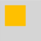 |
| DST         | 2    | r = d（result的4个通道，都等于destination的4个通道，即结果等于目标。），保持目标像素不变。 |  |
| SRC_OVER    | 3    | r = s + (1 - sa) * d，在目标像素上方绘制源像素，考虑源像素的透明度。 |  |
| DST_OVER    | 4    | r = d + (1 - da) * s，在源像素上方绘制目标像素，考虑目标像素的透明度。 |  |
| SRC_IN      | 5    | r = s * da，仅保留源像素与目标不透明部分的交集。 |  |
| DST_IN      | 6    | r = d * sa，仅保留目标像素与源不透明部分的交集。 |  |
| SRC_OUT     | 7    | r = s * (1 - da)，保留源像素中不与目标重叠的部分。 |  |
| DST_OUT     | 8    | r = d * (1 - sa)，保留目标像素中不与源重叠的部分。 |  |
| SRC_ATOP    | 9    | r = s * da + d * (1 - sa)，源像素覆盖在目标像素上，仅在目标不透明部分显示源像素。 |  |
| DST_ATOP    | 10   | r = d * sa + s * (1 - da)，目标像素覆盖在源像素上，仅在源不透明部分显示目标像素。 |  |
| XOR         | 11   | r = s * (1 - da) + d * (1 - sa)，仅显示源像素和目标像素中不重叠的部分。 |  |
| PLUS        | 12   | r = min(s + d, 1)，源和目标像素的颜色值相加。                   |  |
| MODULATE    | 13   | r = s * d，源和目标像素的颜色值相乘。                           |  |
| SCREEN      | 14   | 滤色模式，r = s + d - s * d，反转源和目标像素的颜色值，相乘后再反转，结果通常更亮。 |  |
| OVERLAY     | 15   | 叠加模式，根据目标像素的亮度，选择性地应用MULTIPLY或SCREEN模式，增强对比度。 |  |
| DARKEN      | 16   | 变暗模式，rc = s + d - max(s * da, d * sa), ra = s + (1 - sa) * d，取源和目标像素中较暗的颜色值。 |  |
| LIGHTEN     | 17   | 变亮模式，rc = s + d - min(s * da, d * sa), ra = s + (1 - sa) * d，取源和目标像素中较亮的颜色值。 |  |
| COLOR_DODGE | 18   | 颜色减淡模式，通过减小对比度使目标像素变亮以反映源像素。           |  |
| COLOR_BURN  | 19   | 颜色加深模式，通过增加对比度使目标像素变暗以反映源像素。           |  |
| HARD_LIGHT  | 20   | 强光模式，根据源像素的亮度，选择性地应用MULTIPLY或SCREEN模式。    |  |
| SOFT_LIGHT  | 21   | 柔光模式，根据源像素的亮度，柔和地变亮或变暗目标像素。             | 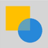 |
| DIFFERENCE  | 22   | 差值模式，rc = s + d - 2 * (min(s * da, d * sa)), ra = s + (1 - sa) * d，计算源和目标像素颜色值的差异。 |  |
| EXCLUSION   | 23   | 排除模式，rc = s + d - two(s * d), ra = s + (1 - sa) * d，类似于DIFFERENCE，但对比度较低。 |  |
| MULTIPLY    | 24   | 正片叠底，r = s * (1 - da) + d * (1 - sa) + s * d，源和目标像素的颜色值相乘，结果通常更暗。 |  |
| HUE         | 25   | 色相模式，使用源像素的色相，目标像素的饱和度和亮度。               |  |
| SATURATION  | 26   | 饱和度模式，使用源像素的饱和度，目标像素的色相和亮度。             | 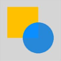 |
| COLOR       | 27   | 颜色模式，使用源像素的色相和饱和度，目标像素的亮度。               |  |
| LUMINOSITY  | 28   | 亮度模式，使用源像素的亮度，目标像素的色相和饱和度。               |  |

## PathMeasureMatrixFlags<sup>12+</sup>

路径测量获取相应矩阵信息维度枚举。

**系统能力：** SystemCapability.Graphics.Drawing

| 名称        | 值   | 说明                                                         |
| ----------- | ---- | ------------------------------------------------------------ |
| GET_POSITION_MATRIX        | 0    | 获取位置信息对应的矩阵。                                            |
| GET_TANGENT_MATRIX          | 1    | 获取切线信息对应的矩阵。 |
| GET_POSITION_AND_TANGENT_MATRIX    | 2     | 获取位置和切线信息对应的矩阵。 |

## SrcRectConstraint<sup>12+</sup>

源矩形区域约束类型枚举。

**系统能力：** SystemCapability.Graphics.Drawing

| 名称        | 值   | 说明                                                         |
| ----------- | ---- | ------------------------------------------------------------ |
| STRICT         | 0    | 严格限制采样范围在源矩形区域内，速度较慢。                                            |
| FAST           | 1    | 允许采样范围超出源矩形范围，速度较快。 |

## ShadowFlag<sup>12+</sup>

控制阴影绘制行为的标志，以实现不同的阴影效果。

**系统能力**：SystemCapability.Graphics.Drawing

| 名称                         | 值    | 说明                 |
| -------------------------- | ---- | ------------------ |
| NONE      | 0    | 不使能以下标志。        |
| TRANSPARENT_OCCLUDER | 1    | 遮挡物是透明的。         |
| GEOMETRIC_ONLY    | 2    | 仅使用几何阴影效果。        |
| ALL           | 3    | 使能以上所有功能。 |

## PathOp<sup>12+</sup>

路径操作类型枚举。

**系统能力**：SystemCapability.Graphics.Drawing

| 名称                   | 值   | 说明                           |
| ---------------------- | ---- | ------------------------------ |
| DIFFERENCE     | 0    | 差集操作。 |
| INTERSECT    | 1    | 交集操作。 |
| UNION    | 2    | 并集操作。 |
| XOR     | 3    | 异或操作。 |
| REVERSE_DIFFERENCE     | 4    | 反向差集操作。 |

## PathIteratorVerb<sup>18+</sup>

迭代器包含的路径操作类型枚举。

**系统能力**：SystemCapability.Graphics.Drawing

| 名称  | 值   | 说明                           |
| ----- | ---- | ------------------------------ |
| MOVE  | 0    | 设置起始点操作。 |
| LINE  | 1    | 添加线段操作。 |
| QUAD  | 2    | 添加二阶贝塞尔圆滑曲线操作。 |
| CONIC | 3    | 添加圆锥曲线操作。 |
| CUBIC | 4    | 添加三阶贝塞尔圆滑曲线操作。 |
| CLOSE | 5    | 路径闭合操作。 |
| DONE  | CLOSE + 1   | 路径设置完成操作。 |

## PathIterator<sup>18+</sup>

表示路径操作迭代器。

### constructor<sup>18+</sup>

constructor(path: Path)

构造一个迭代器并绑定该路径。

**系统能力：** SystemCapability.Graphics.Drawing

**参数：**

| 参数名   | 类型                                         | 必填 | 说明                            |
| -------- | -------------------------------------------- | ---- | ------------------------------- |
| path | [Path](#path) | 是   | 迭代器绑定的路径对象。                 |

**示例：**

```ts
import { drawing } from '@kit.ArkGraphics2D';
let path: drawing.Path = new drawing.Path();
let iter: drawing.PathIterator = new drawing.PathIterator(path);
```

### next<sup>18+</sup>

next(points: Array<common2D.Point>, offset?: number): PathIteratorVerb

返回当前路径的下一个操作，并将迭代器置于该操作。

**系统能力：** SystemCapability.Graphics.Drawing

**参数：**

| 参数名   | 类型                                         | 必填 | 说明                            |
| -------- | -------------------------------------------- | ---- | ------------------------------- |
| points | Array\<[common2D.Point](js-apis-graphics-common2D.md#point)>   | 是   | 坐标点数组，数组长度需要大于等于4，在操作后数组会被重写，数组中坐标点数对的数量取决于路径操作类型。具体来说：MOVE操作会在坐标点数组中填入1组坐标点；LINE操作会在坐标点数组中填入2组坐标点；QUAD操作会在坐标点数组中填入3组坐标点；CONIC操作会在坐标点数组中填入3.5组坐标点，即3组坐标点加圆锥曲线的权重；CUBIC操作会在坐标点数组中填入4组坐标点；CLOSE、DONE操作不会在坐标点数组中填入坐标点。因此坐标点数组长度至少为偏移量加上4。 |
| offset | number   | 否   | 数组中写入位置相对起始点的偏移量，默认为0，取值范围为[0, size-4]，size是指坐标点数组长度。 |

**返回值：**

| 类型                  | 说明           |
| --------------------- | -------------- |
| [PathIteratorVerb](#pathiteratorverb18) | 迭代器包含的路径操作类型。 |

**错误码：**

以下错误码的详细介绍请参见[通用错误码](../errorcode-universal.md)。

| 错误码ID | 错误信息 |
| ------- | --------------------------------------------|
| 401 | Parameter error.Possible causes:1. Mandatory parameters are left unspecified;2. Incorrect parameter types; 3. Parameter verification failed. |

**示例：**

```ts
import { common2D, drawing } from '@kit.ArkGraphics2D';
let path: drawing.Path = new drawing.Path();
path.moveTo(10, 20);
let iter: drawing.PathIterator = new drawing.PathIterator(path);
let verbStr: Array<string> = ["MOVE", "LINE", "QUAD", "CONIC", "CUBIC", "CLOSE", "DONE"];
let pointCount: Array<number> = [1,2,3,4,4,0,0]; //1,2,3,3.5,4,0,0
let points: Array<common2D.Point> = [{x: 0, y: 0}, {x: 0, y: 0}, {x: 0, y: 0}, {x: 0, y: 0}];
let offset = 0;
let verb = iter.next(points, offset);
let outputMessage: string = "pathIteratorNext: ";
outputMessage += "verb =" + verbStr[verb] + "; has " + pointCount[verb] + " pairs: ";
for (let j = 0; j < pointCount[verb] + offset; j++) {
  outputMessage += "[" + points[j].x + ", " + points[j].y + "]";
}
console.info(outputMessage);
```

### peek<sup>18+</sup>

peek(): PathIteratorVerb

返回当前路径的下一个操作，迭代器仍在原操作。

**系统能力：** SystemCapability.Graphics.Drawing

**返回值：**

| 类型                  | 说明           |
| --------------------- | -------------- |
| [PathIteratorVerb](#pathiteratorverb18) | 迭代器包含的路径操作类型。 |

**示例：**

```ts
import { drawing } from '@kit.ArkGraphics2D';
let path: drawing.Path = new drawing.Path();
let iter: drawing.PathIterator = new drawing.PathIterator(path);
let res = iter.peek();
```

### hasNext<sup>18+</sup>

hasNext(): boolean

判断路径操作迭代器中是否还有其他操作。

**系统能力：** SystemCapability.Graphics.Drawing

**返回值：**

| 类型    | 说明           |
| ------- | -------------- |
| boolean | 判断路径操作迭代器中是否还有其他操作。true表示有，false表示没有。 |

**示例：**

```ts
import { drawing } from '@kit.ArkGraphics2D';
let path: drawing.Path = new drawing.Path();
let iter: drawing.PathIterator = new drawing.PathIterator(path);
let res = iter.hasNext();
```

## Path

由直线、圆弧、二阶贝塞尔、三阶贝塞尔组成的复合几何路径。

### constructor<sup>12+</sup>

constructor()

构造一个路径。

**系统能力：** SystemCapability.Graphics.Drawing

**示例：**

```ts
import { drawing } from '@kit.ArkGraphics2D';
let path: drawing.Path = new drawing.Path();
```

### constructor<sup>12+</sup>

constructor(path: Path)

构造一个已有路径的副本。

**系统能力：** SystemCapability.Graphics.Drawing

**参数：**

| 参数名   | 类型                                         | 必填 | 说明                            |
| -------- | -------------------------------------------- | ---- | ------------------------------- |
| path | [Path](#path) | 是   | 待复制的路径对象。                 |

**示例：**

```ts
import { drawing } from '@kit.ArkGraphics2D';
let path: drawing.Path = new drawing.Path();
path.moveTo(0, 0);
path.lineTo(0, 700);
path.lineTo(700, 0);
path.close();
let path1: drawing.Path =  new drawing.Path(path);
```

### moveTo

moveTo(x: number, y: number) : void

用于设置自定义路径的起始点位置。

**系统能力**：SystemCapability.Graphics.Drawing

**参数：**

| 参数名 | 类型   | 必填 | 说明                    |
| ------ | ------ | ---- | ----------------------- |
| x      | number | 是   | 起始点的x轴坐标，该参数为浮点数。 |
| y      | number | 是   | 起始点的y轴坐标，该参数为浮点数。 |

**错误码：**

以下错误码的详细介绍请参见[通用错误码](../errorcode-universal.md)。

| 错误码ID | 错误信息 |
| ------- | --------------------------------------------|
| 401 | Parameter error.Possible causes:1.Mandatory parameters are left unspecified;2.Incorrect parameter types. |

**示例：**

```ts
import { drawing } from '@kit.ArkGraphics2D';
let path = new drawing.Path();
path.moveTo(10,10);
```

### lineTo

lineTo(x: number, y: number) : void

用于添加一条从路径的最后点位置（若路径没有内容则默认为 (0, 0)）到目标点位置的线段。

**系统能力**：SystemCapability.Graphics.Drawing

**参数：**

| 参数名 | 类型   | 必填 | 说明                    |
| ------ | ------ | ---- | ----------------------- |
| x      | number | 是   | 目标点的x轴坐标，该参数为浮点数。 |
| y      | number | 是   | 目标点的y轴坐标，该参数为浮点数。 |

**错误码：**

以下错误码的详细介绍请参见[通用错误码](../errorcode-universal.md)。

| 错误码ID | 错误信息 |
| ------- | --------------------------------------------|
| 401 | Parameter error.Possible causes:1.Mandatory parameters are left unspecified;2.Incorrect parameter types. |

**示例：**

```ts
import { drawing } from '@kit.ArkGraphics2D';
let path = new drawing.Path();
path.moveTo(10,10);
path.lineTo(10, 15);
```

### arcTo

arcTo(x1: number, y1: number, x2: number, y2: number, startDeg: number, sweepDeg: number): void

用于给路径添加一段弧线，绘制弧线的方式为角度弧，该方式首先会指定一个矩形边框，矩形边框会包裹椭圆， 然后会指定一个起始角度和扫描度数，从起始角度扫描截取的椭圆周长一部分即为绘制的弧线。另外会默认添加一条从路径的最后点位置到弧线起始点位置的线段。

**系统能力**：SystemCapability.Graphics.Drawing

**参数：**

| 参数名   | 类型   | 必填 | 说明                       |
| -------- | ------ | ---- | -------------------------- |
| x1       | number | 是   | 矩形左上角的x坐标，该参数为浮点数。 |
| y1       | number | 是   | 矩形左上角的y坐标，该参数为浮点数。 |
| x2       | number | 是   | 矩形右下角的x坐标，该参数为浮点数。 |
| y2       | number | 是   | 矩形右下角的y坐标，该参数为浮点数。 |
| startDeg | number | 是   | 起始的角度。角度的起始方向（0°）为x轴正方向。 |
| sweepDeg | number | 是   | 扫描的度数，为正数时顺时针扫描，为负数时逆时针扫描。实际扫描的度数为该入参对360取模的结果。 |

**错误码：**

以下错误码的详细介绍请参见[通用错误码](../errorcode-universal.md)。

| 错误码ID | 错误信息 |
| ------- | --------------------------------------------|
| 401 | Parameter error.Possible causes:1.Mandatory parameters are left unspecified;2.Incorrect parameter types. |

**示例：**

```ts
import { drawing } from '@kit.ArkGraphics2D';
let path = new drawing.Path();
path.moveTo(10,10);
path.arcTo(10, 15, 10, 10, 10, 10);
```

### quadTo

quadTo(ctrlX: number, ctrlY: number, endX: number, endY: number): void

用于添加一条从路径最后点位置（若路径没有内容则默认为 (0, 0)）到目标点位置的二阶贝塞尔圆滑曲线。

**系统能力**：SystemCapability.Graphics.Drawing

**参数：**

| 参数名 | 类型   | 必填 | 说明                  |
| ------ | ------ | ---- | --------------------- |
| ctrlX  | number | 是   | 控制点的x坐标，该参数为浮点数。 |
| ctrlY  | number | 是   | 控制点的y坐标，该参数为浮点数。 |
| endX   | number | 是   | 目标点的x坐标，该参数为浮点数。 |
| endY   | number | 是   | 目标点的y坐标，该参数为浮点数。 |

**错误码：**

以下错误码的详细介绍请参见[通用错误码](../errorcode-universal.md)。

| 错误码ID | 错误信息 |
| ------- | --------------------------------------------|
| 401 | Parameter error.Possible causes:1.Mandatory parameters are left unspecified;2.Incorrect parameter types. |

**示例：**

```ts
import { drawing } from '@kit.ArkGraphics2D';
let path = new drawing.Path();
path.moveTo(10,10);
path.quadTo(10, 15, 10, 10);
```

### conicTo<sup>12+</sup>

conicTo(ctrlX: number, ctrlY: number, endX: number, endY: number, weight: number): void

在当前路径上添加一条路径终点（若路径没有内容则默认为 (0, 0)）到目标点位置的圆锥曲线，其控制点为 (ctrlX, ctrlY)，结束点为 (endX, endY)。

**系统能力**：SystemCapability.Graphics.Drawing

**参数：**

| 参数名 | 类型   | 必填 | 说明                  |
| ------ | ------ | ---- | --------------------- |
| ctrlX  | number | 是   | 控制点的x坐标，该参数为浮点数。 |
| ctrlY  | number | 是   | 控制点的y坐标，该参数为浮点数。 |
| endX   | number | 是   | 目标点的x坐标，该参数为浮点数。 |
| endY   | number | 是   | 目标点的y坐标，该参数为浮点数。 |
| weight | number | 是   | 表示曲线的权重，决定了曲线的形状，越大越接近控制点。若小于等于0则等同于使用[lineTo](#lineto)添加一条到结束点的线段，若为1则等同于[quadTo](#quadto)，该参数为浮点数。 |

**错误码：**

以下错误码的详细介绍请参见[通用错误码](../errorcode-universal.md)。

| 错误码ID | 错误信息 |
| ------- | --------------------------------------------|
| 401 | Parameter error.Possible causes:1.Mandatory parameters are left unspecified;2.Incorrect parameter types. |

**示例：**

```ts
import { drawing } from '@kit.ArkGraphics2D';

const path = new drawing.Path();
path.conicTo(200, 400, 100, 200, 0);
```

### cubicTo

cubicTo(ctrlX1: number, ctrlY1: number, ctrlX2: number, ctrlY2: number, endX: number, endY: number): void

用于添加一条从路径最后点位置（若路径没有内容则默认为 (0, 0)）到目标点位置的三阶贝塞尔圆滑曲线。

**系统能力**：SystemCapability.Graphics.Drawing

**参数：**

| 参数名 | 类型   | 必填 | 说明                        |
| ------ | ------ | ---- | --------------------------- |
| ctrlX1 | number | 是   | 第一个控制点的x坐标，该参数为浮点数。 |
| ctrlY1 | number | 是   | 第一个控制点的y坐标，该参数为浮点数。 |
| ctrlX2 | number | 是   | 第二个控制点的x坐标，该参数为浮点数。 |
| ctrlY2 | number | 是   | 第二个控制点的y坐标，该参数为浮点数。 |
| endX   | number | 是   | 目标点的x坐标，该参数为浮点数。 |
| endY   | number | 是   | 目标点的y坐标，该参数为浮点数。 |

**错误码：**

以下错误码的详细介绍请参见[通用错误码](../errorcode-universal.md)。

| 错误码ID | 错误信息 |
| ------- | --------------------------------------------|
| 401 | Parameter error.Possible causes:1.Mandatory parameters are left unspecified;2.Incorrect parameter types. |

**示例：**

```ts
import { drawing } from '@kit.ArkGraphics2D';
let path = new drawing.Path();
path.moveTo(10,10);
path.cubicTo(100, 100, 80, 150, 300, 150);
```

### rMoveTo<sup>12+</sup>

rMoveTo(dx : number, dy : number): void

设置一个相对于当前路径终点（若路径没有内容则默认为 (0, 0)）的路径起始点位置。

**系统能力**：SystemCapability.Graphics.Drawing

**参数：**

| 参数名 | 类型   | 必填 | 说明                    |
| ------ | ------ | ---- | ----------------------- |
| dx     | number | 是   | 路径新起始点相对于当前路径终点的x轴偏移量，正数往x轴正方向偏移，负数往x轴负方向偏移，该参数为浮点数。 |
| dy     | number | 是   | 路径新起始点相对于当前路径终点的y轴偏移量，正数往y轴正方向偏移，负数往y轴负方向偏移，该参数为浮点数。 |

**错误码：**

以下错误码的详细介绍请参见[通用错误码](../errorcode-universal.md)。

| 错误码ID | 错误信息 |
| ------- | --------------------------------------------|
| 401 | Parameter error.Possible causes:1.Mandatory parameters are left unspecified;2.Incorrect parameter types. |

**示例：**

```ts
import { drawing } from '@kit.ArkGraphics2D';

const path = new drawing.Path();
path.rMoveTo(10, 10);
```

### rLineTo<sup>12+</sup>

rLineTo(dx : number, dy : number): void

使用相对位置在当前路径上添加一条当前路径终点（若路径没有内容则默认为 (0, 0)）到目标点位置的线段。

**系统能力**：SystemCapability.Graphics.Drawing

**参数：**

| 参数名 | 类型   | 必填 | 说明                    |
| ------ | ------ | ---- | ----------------------- |
| dx     | number | 是   | 目标点相对于当前路径终点的x轴偏移量，正数往x轴正方向偏移，负数往x轴负方向偏移，该参数为浮点数。 |
| dy     | number | 是   | 目标点相对于当前路径终点的y轴偏移量，正数往y轴正方向偏移，负数往y轴负方向偏移，该参数为浮点数。 |

**错误码：**

以下错误码的详细介绍请参见[通用错误码](../errorcode-universal.md)。

| 错误码ID | 错误信息 |
| ------- | --------------------------------------------|
| 401 | Parameter error.Possible causes:1.Mandatory parameters are left unspecified;2.Incorrect parameter types. |

**示例：**

```ts
import { drawing } from '@kit.ArkGraphics2D';

const path = new drawing.Path();
path.rLineTo(400, 200);
```

### rQuadTo<sup>12+</sup>

rQuadTo(dx1: number, dy1: number, dx2: number, dy2: number): void

使用相对位置在当前路径上添加一条当前路径终点（若路径没有内容则默认为 (0, 0)）到目标点位置的二阶贝塞尔曲线。

**系统能力**：SystemCapability.Graphics.Drawing

**参数：**

| 参数名 | 类型   | 必填 | 说明                  |
| ------ | ------ | ---- | --------------------- |
| dx1  | number | 是   | 控制点相对于路径终点的x轴偏移量，正数往x轴正方向偏移，负数往x轴负方向偏移，该参数为浮点数。 |
| dy1  | number | 是   | 控制点相对于路径终点的y轴偏移量，正数往y轴正方向偏移，负数往y轴负方向偏移，该参数为浮点数。 |
| dx2   | number | 是   | 目标点相对于路径终点的x轴偏移量，正数往x轴正方向偏移，负数往x轴负方向偏移，该参数为浮点数。 |
| dy2   | number | 是   | 目标点相对于路径终点的y轴偏移量，正数往y轴正方向偏移，负数往y轴负方向偏移，该参数为浮点数。 |

**错误码：**

以下错误码的详细介绍请参见[通用错误码](../errorcode-universal.md)。

| 错误码ID | 错误信息 |
| ------- | --------------------------------------------|
| 401 | Parameter error.Possible causes:1.Mandatory parameters are left unspecified;2.Incorrect parameter types. |

**示例：**

```ts
import { drawing } from '@kit.ArkGraphics2D';

const path = new drawing.Path();
path.rQuadTo(100, 0, 0, 200);
```

### rConicTo<sup>12+</sup>

rConicTo(ctrlX: number, ctrlY: number, endX: number, endY: number, weight: number): void

使用相对位置在当前路径上添加一条路径终点（若路径没有内容则默认为 (0, 0)）到目标点位置的圆锥曲线。

**系统能力**：SystemCapability.Graphics.Drawing

**参数：**

| 参数名 | 类型   | 必填 | 说明                  |
| ------ | ------ | ---- | --------------------- |
| ctrlX  | number | 是   | 控制点相对于路径终点的x轴偏移量，正数往x轴正方向偏移，负数往x轴负方向偏移，该参数为浮点数。 |
| ctrlY  | number | 是   | 控制点相对于路径终点的y轴偏移量，正数往y轴正方向偏移，负数往y轴负方向偏移，该参数为浮点数。 |
| endX   | number | 是   | 目标点相对于路径终点的x轴偏移量，正数往x轴正方向偏移，负数往x轴负方向偏移，该参数为浮点数。 |
| endY   | number | 是   | 目标点相对于路径终点的y轴偏移量，正数往y轴正方向偏移，负数往y轴负方向偏移，该参数为浮点数。 |
| weight | number | 是   | 表示曲线的权重，决定了曲线的形状，越大越接近控制点。若小于等于0则等同于使用[rLineTo](#rlineto12)添加一条到结束点的线段，若为1则等同于[rQuadTo](#rquadto12)，该参数为浮点数。 |

**错误码：**

以下错误码的详细介绍请参见[通用错误码](../errorcode-universal.md)。

| 错误码ID | 错误信息 |
| ------- | --------------------------------------------|
| 401 | Parameter error.Possible causes:1.Mandatory parameters are left unspecified;2.Incorrect parameter types. |

**示例：**

```ts
import { drawing } from '@kit.ArkGraphics2D';

const path = new drawing.Path();
path.rConicTo(200, 400, 100, 200, 0);
```

### rCubicTo<sup>12+</sup>

rCubicTo(ctrlX1: number, ctrlY1: number, ctrlX2: number, ctrlY2: number, endX: number, endY: number): void

使用相对位置在当前路径上添加一条当前路径终点（若路径没有内容则默认为 (0, 0)）到目标点位置的三阶贝塞尔曲线。

**系统能力**：SystemCapability.Graphics.Drawing

**参数：**

| 参数名 | 类型   | 必填 | 说明                        |
| ------ | ------ | ---- | --------------------------- |
| ctrlX1 | number | 是   | 第一个控制点相对于路径终点的x轴偏移量，正数往x轴正方向偏移，负数往x轴负方向偏移，该参数为浮点数。 |
| ctrlY1 | number | 是   | 第一个控制点相对于路径终点的y轴偏移量，正数往y轴正方向偏移，负数往y轴负方向偏移，该参数为浮点数。 |
| ctrlX2 | number | 是   | 第二个控制点相对于路径终点的x轴偏移量，正数往x轴正方向偏移，负数往x轴负方向偏移，该参数为浮点数。 |
| ctrlY2 | number | 是   | 第二个控制点相对于路径终点的y轴偏移量，正数往y轴正方向偏移，负数往y轴负方向偏移，该参数为浮点数。 |
| endX   | number | 是   | 目标点相对于路径终点的x轴偏移量，正数往x轴正方向偏移，负数往x轴负方向偏移，该参数为浮点数。 |
| endY   | number | 是   | 目标点相对于路径终点的y轴偏移量，正数往y轴正方向偏移，负数往y轴负方向偏移，该参数为浮点数。 |

**错误码：**

以下错误码的详细介绍请参见[通用错误码](../errorcode-universal.md)。

| 错误码ID | 错误信息 |
| ------- | --------------------------------------------|
| 401 | Parameter error.Possible causes:1.Mandatory parameters are left unspecified;2.Incorrect parameter types. |

**示例：**

```ts
import { drawing } from '@kit.ArkGraphics2D';

const path = new drawing.Path();
path.rCubicTo(200, 0, 0, 200, -20, 0);
```

### addArc<sup>12+</sup>

addArc(rect: common2D.Rect, startAngle: number, sweepAngle: number): void

向路径添加一段圆弧。
当startAngle和sweepAngle同时满足以下两种情况时，添加整个椭圆而不是圆弧:
1.startAngle对90取余接近于0；
2.sweepAngle不在(-360, 360)区间内。
其余情况sweepAngle会对360取余后添加圆弧。

**系统能力**：SystemCapability.Graphics.Drawing

**参数：**

| 参数名         | 类型                                       | 必填   | 说明                  |
| ----------- | ---------------------------------------- | ---- | ------------------- |
| rect        | [common2D.Rect](js-apis-graphics-common2D.md#rect) | 是    | 包含弧的椭圆的矩形边界。      |
| startAngle   | number | 是   | 弧的起始角度，单位为度，0度为x轴正方向，该参数为浮点数。 |
| sweepAngle   | number | 是   | 扫描角度，单位为度。正数表示顺时针方向，负数表示逆时针方向，该参数为浮点数。 |

**错误码：**

以下错误码的详细介绍请参见[通用错误码](../errorcode-universal.md)。

| 错误码ID | 错误信息 |
| ------- | --------------------------------------------|
| 401 | Parameter error.Possible causes:1.Mandatory parameters are left unspecified;2.Incorrect parameter types. |

**示例：**

```ts
import { common2D, drawing } from '@kit.ArkGraphics2D';

let path = new drawing.Path();
const rect: common2D.Rect = {left:100, top:100, right:500, bottom:500};
path.addArc(rect, 90, 180);
```

### addCircle<sup>12+</sup>

addCircle(x: number, y: number, radius: number, pathDirection?: PathDirection): void

按指定方向，向路径添加圆形，圆的起点位于(x + radius, y)。

**系统能力**：SystemCapability.Graphics.Drawing

**参数：**

| 参数名         | 类型                                       | 必填   | 说明                  |
| ----------- | ---------------------------------------- | ---- | ------------------- |
| x   | number | 是   | 表示圆心的x轴坐标，该参数为浮点数。 |
| y   | number | 是   | 表示圆心的y轴坐标，该参数为浮点数。 |
| radius   | number | 是   | 表示圆形的半径，该参数为浮点数，小于等于0时不会有任何效果。 |
| pathDirection   | [PathDirection](#pathdirection12)  | 否   | 表示路径方向，默认为顺时针方向。 |

**错误码：**

以下错误码的详细介绍请参见[通用错误码](../errorcode-universal.md)。

| 错误码ID | 错误信息 |
| ------- | --------------------------------------------|
| 401 | Parameter error. Possible causes: 1. Mandatory parameters are left unspecified;2. Incorrect parameter types; 3. Parameter verification failed. |

**示例：**

```ts

import { drawing } from '@kit.ArkGraphics2D';

let path = new drawing.Path();
path.addCircle(100, 200, 50, drawing.PathDirection.CLOCKWISE);
```

### addOval<sup>12+</sup>

addOval(rect: common2D.Rect, start: number, pathDirection?: PathDirection): void

按指定方向，将椭圆添加到路径中，其中矩形对象作为椭圆的外切矩形区域。

**系统能力**：SystemCapability.Graphics.Drawing

**参数：**

| 参数名         | 类型                                       | 必填   | 说明                  |
| ----------- | ---------------------------------------- | ---- | ------------------- |
| rect        | [common2D.Rect](js-apis-graphics-common2D.md#rect) | 是    | 椭圆的矩形边界。      |
| start   | number | 是   | 表示椭圆初始点的索引，0，1，2，3分别对应椭圆的上端点，右端点，下端点，左端点，该参数为不小于0的整数，大于等于4时会对4取余。 |
| pathDirection   | [PathDirection](#pathdirection12)  | 否   | 表示路径方向，默认为顺时针方向。 |

**错误码：**

以下错误码的详细介绍请参见[通用错误码](../errorcode-universal.md)。

| 错误码ID | 错误信息 |
| ------- | --------------------------------------------|
| 401 | Parameter error. Possible causes: 1. Mandatory parameters are left unspecified;2. Incorrect parameter types; 3. Parameter verification failed.|

**示例：**

```ts
import { common2D, drawing } from '@kit.ArkGraphics2D';

let path = new drawing.Path();
const rect: common2D.Rect = {left:100, top:100, right:500, bottom:500};
path.addOval(rect, 5, drawing.PathDirection.CLOCKWISE);
```

### addRect<sup>12+</sup>

addRect(rect: common2D.Rect, pathDirection?: PathDirection): void

按指定方向，将矩形添加到路径中，添加的路径的起始点为矩形左上角。

**系统能力**：SystemCapability.Graphics.Drawing

**参数：**

| 参数名         | 类型                                       | 必填   | 说明                  |
| ----------- | ---------------------------------------- | ---- | ------------------- |
| rect        | [common2D.Rect](js-apis-graphics-common2D.md#rect) | 是    | 向路径中添加的矩形轮廓。      |
| pathDirection   | [PathDirection](#pathdirection12)  | 否   | 表示路径方向，默认为顺时针方向。 |

**错误码：**

以下错误码的详细介绍请参见[通用错误码](../errorcode-universal.md)。

| 错误码ID | 错误信息 |
| ------- | --------------------------------------------|
| 401 | Parameter error. Possible causes: 1. Mandatory parameters are left unspecified;2. Incorrect parameter types; 3. Parameter verification failed.|

**示例：**

```ts
import { common2D, drawing } from '@kit.ArkGraphics2D';

let path = new drawing.Path();
const rect: common2D.Rect = {left:100, top:100, right:500, bottom:500};
path.addRect(rect, drawing.PathDirection.CLOCKWISE);
```

### addRoundRect<sup>12+</sup>

addRoundRect(roundRect: RoundRect, pathDirection?: PathDirection): void

按指定方向，向路径添加圆角矩形轮廓。路径添加方向为顺时针时，起始点位于圆角矩形左下方圆角与左边界的交点；路径添加方向为逆时针时，起始点位于圆角矩形左上方圆角与左边界的交点。

**系统能力**：SystemCapability.Graphics.Drawing

**参数：**

| 参数名         | 类型                                       | 必填   | 说明                  |
| ----------- | ---------------------------------------- | ---- | ------------------- |
| roundRect        | [RoundRect](#roundrect12) | 是    | 圆角矩形对象。      |
| pathDirection   | [PathDirection](#pathdirection12)  | 否   | 表示路径方向，默认为顺时针方向。 |

**错误码：**

以下错误码的详细介绍请参见[通用错误码](../errorcode-universal.md)。

| 错误码ID | 错误信息 |
| ------- | --------------------------------------------|
| 401 | Parameter error. Possible causes: 1. Mandatory parameters are left unspecified;2. Incorrect parameter types; 3. Parameter verification failed.|

**示例：**

```ts
import { common2D, drawing } from '@kit.ArkGraphics2D';

let path = new drawing.Path();
const rect: common2D.Rect = {left:100, top:100, right:500, bottom:500};
let roundRect = new drawing.RoundRect(rect, 50, 50);
path.addRoundRect(roundRect, drawing.PathDirection.CLOCKWISE);
```

### addPath<sup>12+</sup>

addPath(path: Path, matrix?: Matrix | null): void

将源路径进行矩阵变换后，添加到当前路径中。

**系统能力**：SystemCapability.Graphics.Drawing

**参数：**

| 参数名         | 类型                                       | 必填   | 说明                  |
| ----------- | ---------------------------------------- | ---- | ------------------- |
| path        | [Path](#path) | 是    | 表示源路径对象。      |
| matrix   | [Matrix](#matrix12)\|null  | 否   | 表示矩阵对象，默认为单位矩阵。 |

**错误码：**

以下错误码的详细介绍请参见[通用错误码](../errorcode-universal.md)。

| 错误码ID | 错误信息 |
| ------- | --------------------------------------------|
| 401 | Parameter error.Possible causes:1.Mandatory parameters are left unspecified;2.Incorrect parameter types. |

**示例：**

```ts
import { common2D, drawing } from '@kit.ArkGraphics2D';

let path = new drawing.Path();
let matrix = new drawing.Matrix();
const rect: common2D.Rect = {left:100, top:100, right:500, bottom:500};
let roundRect = new drawing.RoundRect(rect, 50, 50);
path.addRoundRect(roundRect, drawing.PathDirection.CLOCKWISE);
let dstPath = new drawing.Path();
dstPath.addPath(path, matrix);
```

### transform<sup>12+</sup>

transform(matrix: Matrix): void

对路径进行矩阵变换。

**系统能力**：SystemCapability.Graphics.Drawing

**参数：**

| 参数名         | 类型                                       | 必填   | 说明                  |
| ----------- | ---------------------------------------- | ---- | ------------------- |
| matrix   | [Matrix](#matrix12)  | 是   | 表示矩阵对象。 |

**错误码：**

以下错误码的详细介绍请参见[通用错误码](../errorcode-universal.md)。

| 错误码ID | 错误信息 |
| ------- | --------------------------------------------|
| 401 | Parameter error.Possible causes:1.Mandatory parameters are left unspecified;2.Incorrect parameter types. |

**示例：**

```ts
import { common2D, drawing } from '@kit.ArkGraphics2D';

let path = new drawing.Path();
let matrix = new drawing.Matrix();
matrix.setScale(1.5, 1.5, 10, 10);
const rect: common2D.Rect = {left:100, top:100, right:500, bottom:500};
let roundRect = new drawing.RoundRect(rect, 50, 50);
path.addRoundRect(roundRect, drawing.PathDirection.CLOCKWISE);
path.transform(matrix);
```

### contains<sup>12+</sup>

contains(x: number, y: number): boolean

判断指定坐标点是否被路径包含，判定是否被路径包含的规则参考[PathFillType](#pathfilltype12)。

**系统能力：** SystemCapability.Graphics.Drawing

**参数：**

| 参数名 | 类型   | 必填 | 说明                    |
| ------ | ------ | ---- | ----------------------- |
| x      | number | 是   | x轴上坐标点，该参数必须为浮点数。 |
| y      | number | 是   | y轴上坐标点，该参数必须为浮点数。 |

**返回值：**

| 类型    | 说明           |
| ------- | -------------- |
| boolean | 返回指定坐标点是否在路径内。true表示点在路径内，false表示点不在路径内。 |

**错误码：**

以下错误码的详细介绍请参见[通用错误码](../errorcode-universal.md)。

| 错误码ID | 错误信息 |
| ------- | --------------------------------------------|
| 401 | Parameter error.Possible causes:1.Mandatory parameters are left unspecified;2.Incorrect parameter types. |

**示例：**

```ts
import { common2D, drawing } from '@kit.ArkGraphics2D';

const path = new drawing.Path();
let rect : common2D.Rect = {left: 50, top: 50, right: 250, bottom: 250};
path.addRect(rect, drawing.PathDirection.CLOCKWISE);
console.info("test contains: " + path.contains(0, 0));
console.info("test contains: " + path.contains(60, 60));
```

### setFillType<sup>12+</sup>

setFillType(pathFillType: PathFillType): void

设置路径的填充类型，这个决定了路径内部区域的定义方式。例如，使用 Winding 填充类型时，路径内部区域由路径环绕的次数决定，而使用 EvenOdd 填充类型时，路径内部区域由路径环绕的次数是否为奇数决定。

**系统能力**：SystemCapability.Graphics.Drawing

**参数：**

| 参数名         | 类型                                       | 必填   | 说明                  |
| ----------- | ---------------------------------------- | ---- | ------------------- |
| pathFillType   | [PathFillType](#pathfilltype12)  | 是   | 表示路径填充规则。 |

**错误码：**

以下错误码的详细介绍请参见[通用错误码](../errorcode-universal.md)。

| 错误码ID | 错误信息 |
| ------- | --------------------------------------------|
| 401 | Parameter error. Possible causes: 1. Mandatory parameters are left unspecified;2. Incorrect parameter types; 3. Parameter verification failed.|

**示例：**

```ts
import { drawing } from '@kit.ArkGraphics2D';

const path = new drawing.Path();
path.setFillType(drawing.PathFillType.WINDING);
```

### getBounds<sup>12+</sup>

getBounds(): common2D.Rect

获取包含路径的最小矩形边界。

**系统能力**：SystemCapability.Graphics.Drawing

**返回值：**

| 类型                                               | 说明                   |
| -------------------------------------------------- | ---------------------- |
| [common2D.Rect](js-apis-graphics-common2D.md#rect) | 包含路径的最小矩形区域。 |

**示例：**

```ts
import { common2D, drawing } from '@kit.ArkGraphics2D';

const path = new drawing.Path();
path.lineTo(50, 40)
let rect : common2D.Rect = {left: 0, top: 0, right: 0, bottom: 0};
rect = path.getBounds();
console.info("test rect.left: " + rect.left);
console.info("test rect.top: " + rect.top);
console.info("test rect.right: " + rect.right);
console.info("test rect.bottom: " + rect.bottom);
```

### addPolygon<sup>12+</sup>

addPolygon(points: Array\<common2D.Point>, close: boolean): void

通过坐标点列表添加多条连续的线段。

**系统能力**：SystemCapability.Graphics.Drawing

**参数：**

| 参数名 | 类型   | 必填 | 说明                    |
| ------ | ------ | ---- | ----------------------- |
| points | Array\<[common2D.Point](js-apis-graphics-common2D.md#point)>   | 是   | 坐标点数组。 |
| close  | boolean                                                        | 是   | 表示是否将路径闭合，即是否添加路径起始点到终点的连线。true表示将路径闭合，false表示不将路径闭合。 |

**错误码：**

以下错误码的详细介绍请参见[通用错误码](../errorcode-universal.md)。

| 错误码ID | 错误信息 |
| ------- | --------------------------------------------|
| 401 | Parameter error.Possible causes:1.Mandatory parameters are left unspecified;2.Incorrect parameter types. |

**示例：**

```ts
import { common2D, drawing } from '@kit.ArkGraphics2D';

let pointsArray = new Array<common2D.Point>();
const point1: common2D.Point = { x: 200, y: 200 };
const point2: common2D.Point = { x: 400, y: 200 };
const point3: common2D.Point = { x: 100, y: 400 };
const point4: common2D.Point = { x: 300, y: 400 };
pointsArray.push(point1);
pointsArray.push(point2);
pointsArray.push(point3);
pointsArray.push(point4);
const path = new drawing.Path();
path.addPolygon(pointsArray, false);
```

### offset<sup>12+</sup>

offset(dx: number, dy: number): Path

将路径沿着x轴和y轴方向偏移一定距离并保存在返回的路径对象中。

**系统能力**：SystemCapability.Graphics.Drawing

**参数：**

| 参数名 | 类型   | 必填 | 说明                    |
| ------ | ------ | ---- | ----------------------- |
| dx     | number        | 是   | x轴方向偏移量，正数往x轴正方向偏移，负数往x轴负方向偏移，该参数为浮点数。 |
| dy     | number        | 是   | y轴方向偏移量，正数往y轴正方向偏移，负数往y轴负方向偏移，该参数为浮点数。 |

**返回值：**

| 类型   | 说明                |
| ------ | ------------------ |
| [Path](#path) | 返回当前路径偏移(dx,dy)后生成的新路径对象。 |

**错误码：**

以下错误码的详细介绍请参见[通用错误码](../errorcode-universal.md)。

| 错误码ID | 错误信息 |
| ------- | --------------------------------------------|
| 401 | Parameter error.Possible causes:1.Mandatory parameters are left unspecified;2.Incorrect parameter types. |

**示例：**

```ts
import { drawing } from '@kit.ArkGraphics2D';

const path = new drawing.Path();
path.moveTo(200, 200);
path.lineTo(300, 300);
const dst = path.offset(200, 200);
```

### op<sup>12+</sup>

op(path: Path, pathOp: PathOp): boolean

将当前路径置为和path按照指定的路径操作类型合并后的结果。

**系统能力**：SystemCapability.Graphics.Drawing

**参数：**

| 参数名 | 类型   | 必填 | 说明                    |
| ------ | ------ | ---- | ----------------------- |
| path    | [Path](#path) | 是   | 路径对象，用于与当前路径合并。 |
| pathOp  | [PathOp](#pathop12)   | 是    | 路径操作类型枚举。    |

**返回值：**

| 类型   | 说明                |
| ------ | ------------------ |
| boolean | 返回路径合并是否成功的结果。true表示合并成功，false表示合并失败。 |

**错误码：**

以下错误码的详细介绍请参见[通用错误码](../errorcode-universal.md)。

| 错误码ID | 错误信息 |
| ------- | --------------------------------------------|
| 401 | Parameter error.Possible causes:1.Mandatory parameters are left unspecified;2.Incorrect parameter types;3.Parameter verification failed. |

**示例：**

```ts
import { drawing } from '@kit.ArkGraphics2D';

const path = new drawing.Path();
const path2 = new drawing.Path();
path.addCircle(100, 200, 100, drawing.PathDirection.CLOCKWISE);
console.info("get pathOp: ", path2.op(path, drawing.PathOp.DIFFERENCE));
```

### close

close(): void

用于闭合路径，会添加一条从路径起点位置到最后点位置的线段。

**系统能力**：SystemCapability.Graphics.Drawing

**示例：**

```ts
import { drawing } from '@kit.ArkGraphics2D';
let path = new drawing.Path();
path.moveTo(10,10);
path.cubicTo(10, 10, 10, 10, 15, 15);
path.close();
```

### reset

reset(): void

用于重置自定义路径数据。

**系统能力**：SystemCapability.Graphics.Drawing

**示例：**

```ts
import { drawing } from '@kit.ArkGraphics2D';
let path = new drawing.Path();
path.moveTo(10,10);
path.cubicTo(10, 10, 10, 10, 15, 15);
path.reset();
```

### getLength<sup>12+</sup>

getLength(forceClosed: boolean): number

用于获取路径长度。

**系统能力**：SystemCapability.Graphics.Drawing

**参数：**

| 参数名| 类型  | 必填| 说明     |
| ----- | ------ | ---- | --------- |
| forceClosed  | boolean | 是  | 表示是否按照闭合路径测量，true表示测量时路径会被强制视为已闭合，false表示会根据路径的实际闭合状态测量。|

**返回值：**

| 类型  | 说明 |
| ------ | ---- |
| number | 路径长度。|

**示例：**

```ts
import { drawing } from '@kit.ArkGraphics2D'
let path = new drawing.Path();
path.arcTo(20, 20, 180, 180, 180, 90);
let len = path.getLength(false);
console.info("path length = " + len);
```

### getPositionAndTangent<sup>12+</sup>

getPositionAndTangent(forceClosed: boolean, distance: number, position: common2D.Point, tangent: common2D.Point): boolean

获取距路径起始点指定距离的坐标点和切线值。

**系统能力**：SystemCapability.Graphics.Drawing

**参数：**

| 参数名   | 类型                                         | 必填 | 说明                            |
| -------- | -------------------------------------------- | ---- | ------------------------------- |
| forceClosed | boolean | 是   | 表示是否按照闭合路径测量，true表示测量时路径会被强制视为已闭合，false表示会根据路径的实际闭合状态测量。                 |
| distance | number | 是   | 表示与路径起始点的距离，小于0时会被视作0，大于路径长度时会被视作路径长度。该参数为浮点数。               |
| position | [common2D.Point](js-apis-graphics-common2D.md#point) | 是   | 存储获取到的距离路径起始点distance处的点的坐标。                  |
| tangent | [common2D.Point](js-apis-graphics-common2D.md#point) | 是   | 存储获取到的距离路径起始点distance处的点的的切线值，tangent.x表示该点切线的余弦值，tangent.y表示该点切线的正弦值。                 |

**返回值：**

| 类型                  | 说明           |
| --------------------- | -------------- |
| boolean |表示是否成功获取距离路径起始点distance处的点的坐标和正切值的结果。true表示获取成功，false表示获取失败，position和tangent不会被改变。 |

**错误码：**

以下错误码的详细介绍请参见[通用错误码](../errorcode-universal.md)。

| 错误码ID | 错误信息 |
| ------- | --------------------------------------------|
| 401 | Parameter error.Possible causes:1.Mandatory parameters are left unspecified;2.Incorrect parameter types. |

**示例：**

```ts
import { common2D, drawing } from '@kit.ArkGraphics2D';
let path: drawing.Path = new drawing.Path();
path.moveTo(0, 0);
path.lineTo(0, 700);
path.lineTo(700, 0);
let position: common2D.Point = { x: 0.0, y: 0.0 };
let tangent: common2D.Point = { x: 0.0, y: 0.0 };
if (path.getPositionAndTangent(false, 0.1, position, tangent)) {
  console.info("getPositionAndTangent-----position:  "+ position.x);
  console.info("getPositionAndTangent-----position:  "+ position.y);
  console.info("getPositionAndTangent-----tangent:  "+ tangent.x);
  console.info("getPositionAndTangent-----tangent:  "+ tangent.y);
}
```

### getSegment<sup>18+</sup>

getSegment(forceClosed: boolean, start: number, stop: number, startWithMoveTo: boolean, dst: Path): boolean

截取路径的片段并追加到目标路径上。

**系统能力**：SystemCapability.Graphics.Drawing

**参数：**

| 参数名   | 类型                                         | 必填 | 说明                            |
| -------- | -------------------------------------------- | ---- | ------------------------------- |
| forceClosed | boolean | 是   | 表示是否按照闭合路径测量，true表示测量时路径会被强制视为已闭合，false表示会根据路径的实际闭合状态测量。                 |
| start | number | 是   | 表示与路径起始点的距离，距离路径起始点start距离的位置即为截取路径片段的起始点，小于0时会被视作0，大于等于stop时会截取失败。该参数为浮点数。               |
| stop | number | 是   | 表示与路径起始点的距离，距离路径起始点stop距离的位置即为截取路径片段的终点，小于等于start时会截取失败，大于路径长度时会被视作路径长度。该参数为浮点数。                  |
| startWithMoveTo | boolean | 是   | 表示是否在目标路径执行[moveTo](#moveto)移动到截取路径片段的起始点位置。true表示执行，false表示不执行。                |
| dst | number | [Path](#path)   | 目标路径，截取成功时会将得到的路径片段追加到目标路径上，截取失败时不做改变。               |

**返回值：**

| 类型                  | 说明           |
| --------------------- | -------------- |
| boolean |表示是否成功截取路径片段。true表示截取成功，false表示截取失败。 |

**错误码：**

以下错误码的详细介绍请参见[通用错误码](../errorcode-universal.md)。

| 错误码ID | 错误信息 |
| ------- | --------------------------------------------|
| 401 | Parameter error.Possible causes:1.Mandatory parameters are left unspecified;2.Incorrect parameter types. |

**示例：**

```ts
import { drawing } from '@kit.ArkGraphics2D';
let path: drawing.Path = new drawing.Path();
path.moveTo(0, 0);
path.lineTo(0, 700);
path.lineTo(700, 0);
let dstPath: drawing.Path = new drawing.Path();
console.info("getSegment-----result:  "+ path.getSegment(true, 10.0, 20.0, true, dstPath));
```

### isClosed<sup>12+</sup>

isClosed(): boolean

获取路径是否闭合。

**系统能力**：SystemCapability.Graphics.Drawing

**返回值：**

| 类型                  | 说明           |
| --------------------- | -------------- |
| boolean | 表示当前路径是否闭合，true表示闭合，false表示不闭合。 |

**示例：**

```ts
import { drawing } from '@kit.ArkGraphics2D';
let path: drawing.Path = new drawing.Path();
path.moveTo(0, 0);
path.lineTo(0, 700);
if (path.isClosed()) {
  console.info("path is closed.");
} else {
  console.info("path is not closed.");
}
```

### getMatrix<sup>12+</sup>

getMatrix(forceClosed: boolean, distance: number, matrix: Matrix, flags: PathMeasureMatrixFlags): boolean

获取距路径起始点指定距离的相应变换矩阵。

**系统能力**：SystemCapability.Graphics.Drawing

**参数：**

| 参数名   | 类型                                         | 必填 | 说明                            |
| -------- | -------------------------------------------- | ---- | ------------------------------- |
| forceClosed | boolean | 是   | 表示是否按照闭合路径测量，true表示测量时路径会被强制视为已闭合，false表示会根据路径的实际闭合状态测量。                  |
| distance | number | 是   | 表示与路径起始点的距离，小于0时会被视作0，大于路径长度时会被视作路径长度。该参数为浮点数。                  |
| matrix | [Matrix](#matrix12) | 是   | 矩阵对象，用于存储得到的矩阵。                  |
| flags | [PathMeasureMatrixFlags](#pathmeasurematrixflags12) | 是   | 矩阵信息维度枚举。                  |

**返回值：**

| 类型                  | 说明           |
| --------------------- | -------------- |
| boolean | 返回获取变换矩阵是否成功的结果，true表示获取成功，false表示获取失败。 |

**错误码：**

以下错误码的详细介绍请参见[通用错误码](../errorcode-universal.md)。

| 错误码ID | 错误信息 |
| ------- | --------------------------------------------|
| 401 | Parameter error. Possible causes: Mandatory parameters are left unspecified. |

**示例：**

```ts
import { drawing } from '@kit.ArkGraphics2D';
let path: drawing.Path = new drawing.Path();
let matrix = new drawing.Matrix();
if(path.getMatrix(false, 10, matrix, drawing.PathMeasureMatrixFlags.GET_TANGENT_MATRIX)) {
  console.info("path.getMatrix return true");
} else {
  console.info("path.getMatrix return false");
}
```

### buildFromSvgString<sup>12+</sup>

buildFromSvgString(str: string): boolean

解析SVG字符串表示的路径。

**系统能力**：SystemCapability.Graphics.Drawing

**参数：**

| 参数名   | 类型                                         | 必填 | 说明                            |
| -------- | -------------------------------------------- | ---- | ------------------------------- |
| str | string | 是   | SVG格式的字符串，用于描述绘制路径。                 |

**返回值：**

| 类型                  | 说明           |
| --------------------- | -------------- |
| boolean | 返回解析SVG字符串是否成功的结果，true表示解析成功，false表示解析失败。 |

**错误码：**

以下错误码的详细介绍请参见[通用错误码](../errorcode-universal.md)。

| 错误码ID | 错误信息 |
| ------- | --------------------------------------------|
| 401 | Parameter error. Possible causes: Mandatory parameters are left unspecified. |

**示例：**

```ts
import { drawing } from '@kit.ArkGraphics2D';
let path: drawing.Path = new drawing.Path();
let svgStr: string =  "M150 100 L75 300 L225 300 Z";
if(path.buildFromSvgString(svgStr)) {
  console.info("buildFromSvgString return true");
} else {
  console.info("buildFromSvgString return false");
}
```

### getPathIterator<sup>18+</sup>

getPathIterator(): PathIterator

返回该路径的操作迭代器。

**系统能力：** SystemCapability.Graphics.Drawing

**返回值：**

| 类型                  | 说明           |
| --------------------- | -------------- |
| [PathIterator](#pathiterator18) | 该路径的迭代器对象。 |

**示例：**

```ts
import { drawing } from '@kit.ArkGraphics2D';
let path: drawing.Path = new drawing.Path();
let iter = path.getPathIterator();
```

## Canvas

承载绘制内容与绘制状态的载体。

> **说明：**
>
> 画布自带一个黑色，开启反走样，不具备其他任何样式效果的默认画刷，当且仅当画布中主动设置的画刷和画笔都不存在时生效。

### constructor

constructor(pixelmap: image.PixelMap)

Canvas对象的构造函数。

**系统能力**：SystemCapability.Graphics.Drawing

**参数：**

| 参数名   | 类型                                         | 必填 | 说明           |
| -------- | -------------------------------------------- | ---- | -------------- |
| pixelmap | [image.PixelMap](../apis-image-kit/js-apis-image.md#pixelmap7) | 是   | 构造函数入参。 |

**错误码：**

以下错误码的详细介绍请参见[通用错误码](../errorcode-universal.md)。

| 错误码ID | 错误信息 |
| ------- | --------------------------------------------|
| 401 | Parameter error.Possible causes:1.Mandatory parameters are left unspecified;2.Incorrect parameter types. |

**示例：**

```ts
import { drawing } from '@kit.ArkGraphics2D';
import { image } from '@kit.ImageKit';
const color = new ArrayBuffer(96);
let opts : image.InitializationOptions = {
  editable: true,
  pixelFormat: 3,
  size: {
    height: 4,
    width: 6
  }
}
image.createPixelMap(color, opts).then((pixelMap) => {
  const canvas = new drawing.Canvas(pixelMap);
})
```

### drawRect

drawRect(rect: common2D.Rect): void

用于绘制一个矩形，默认使用黑色填充。

**系统能力**：SystemCapability.Graphics.Drawing

**参数：**

| 参数名 | 类型                                               | 必填 | 说明           |
| ------ | -------------------------------------------------- | ---- | -------------- |
| rect   | [common2D.Rect](js-apis-graphics-common2D.md#rect) | 是   | 绘制的矩形区域。 |

**错误码：**

以下错误码的详细介绍请参见[通用错误码](../errorcode-universal.md)。

| 错误码ID | 错误信息 |
| ------- | --------------------------------------------|
| 401 | Parameter error.Possible causes:1.Mandatory parameters are left unspecified;2.Incorrect parameter types. |

**示例：**

```ts
import { RenderNode } from '@kit.ArkUI';
import { common2D, drawing } from '@kit.ArkGraphics2D';
class DrawingRenderNode extends RenderNode {
  draw(context : DrawContext) {
    const canvas = context.canvas;
    const pen = new drawing.Pen();
    pen.setStrokeWidth(5);
    pen.setColor({alpha: 255, red: 255, green: 0, blue: 0});
    canvas.attachPen(pen);
    canvas.drawRect({ left : 0, right : 10, top : 0, bottom : 10 });
    canvas.detachPen();
  }
}
```

### drawRect<sup>12+</sup>

drawRect(left: number, top: number, right: number, bottom: number): void

用于绘制一个矩形，默认使用黑色填充。性能优于[drawRect](#drawrect)接口，推荐使用本接口。

**系统能力**：SystemCapability.Graphics.Drawing

**参数：**

| 参数名 | 类型    | 必填 | 说明           |
| ------ | ------ | ---- | -------------- |
| left   | number | 是   | 矩形的左上角x轴坐标，该参数为浮点数。 |
| top    | number | 是   | 矩形的左上角y轴坐标，该参数为浮点数。 |
| right  | number | 是   | 矩形的右下角x轴坐标，该参数为浮点数。 |
| bottom | number | 是   | 矩形的右下角y轴坐标，该参数为浮点数。 |

**错误码：**

以下错误码的详细介绍请参见[通用错误码](../errorcode-universal.md)。

| 错误码ID | 错误信息 |
| ------- | --------------------------------------------|
| 401 | Parameter error.Possible causes:1.Mandatory parameters are left unspecified;2.Incorrect parameter types. |

**示例：**

```ts
import { RenderNode } from '@kit.ArkUI';
import { drawing } from '@kit.ArkGraphics2D';
class DrawingRenderNode extends RenderNode {

  draw(context : DrawContext) {
    const canvas = context.canvas;
    const pen = new drawing.Pen();
    pen.setStrokeWidth(5);
    pen.setColor({alpha: 255, red: 255, green: 0, blue: 0});
    canvas.attachPen(pen);
    canvas.drawRect(0, 0, 10, 10);
    canvas.detachPen();
  }
}
```

### drawRoundRect<sup>12+</sup>

drawRoundRect(roundRect: RoundRect): void

画一个圆角矩形。

**系统能力**：SystemCapability.Graphics.Drawing

**参数**

| 参数名     | 类型                    | 必填 | 说明       |
| ---------- | ----------------------- | ---- | ------------ |
| roundRect  | [RoundRect](#roundrect12) | 是   | 圆角矩形对象。|

**错误码：**

以下错误码的详细介绍请参见[通用错误码](../errorcode-universal.md)。

| 错误码ID | 错误信息 |
| ------- | --------------------------------------------|
| 401 | Parameter error.Possible causes:1.Mandatory parameters are left unspecified;2.Incorrect parameter types. |

**示例**

```ts
import { RenderNode } from '@kit.ArkUI';
import { common2D, drawing } from '@kit.ArkGraphics2D';
class DrawingRenderNode extends RenderNode {
  draw(context : DrawContext) {
    const canvas = context.canvas;
    let rect: common2D.Rect = { left : 100, top : 100, right : 400, bottom : 500 };
    let roundRect = new drawing.RoundRect(rect, 10, 10);
    canvas.drawRoundRect(roundRect);
  }
}
```

### drawNestedRoundRect<sup>12+</sup>

drawNestedRoundRect(outer: RoundRect, inner: RoundRect): void

绘制两个嵌套的圆角矩形，外部矩形边界必须包含内部矩形边界，否则无绘制效果。

**系统能力**：SystemCapability.Graphics.Drawing

**参数**

| 参数名  | 类型                    | 必填 | 说明       |
| ------ | ----------------------- | ---- | ------------ |
| outer  | [RoundRect](#roundrect12) | 是   | 圆角矩形对象，表示外部圆角矩形边界。|
| inner  | [RoundRect](#roundrect12) | 是   | 圆角矩形对象，表示内部圆角矩形边界。|

**错误码：**

以下错误码的详细介绍请参见[通用错误码](../errorcode-universal.md)。

| 错误码ID | 错误信息 |
| ------- | --------------------------------------------|
| 401 | Parameter error.Possible causes:1.Mandatory parameters are left unspecified;2.Incorrect parameter types. |

**示例**

```ts
import { RenderNode } from '@kit.ArkUI';
import { common2D, drawing } from '@kit.ArkGraphics2D';
class DrawingRenderNode extends RenderNode {
  draw(context : DrawContext) {
    const canvas = context.canvas;
    let inRect: common2D.Rect = { left : 200, top : 200, right : 400, bottom : 500 };
    let outRect: common2D.Rect = { left : 100, top : 100, right : 400, bottom : 500 };
    let outRoundRect = new drawing.RoundRect(outRect, 10, 10);
    let inRoundRect = new drawing.RoundRect(inRect, 10, 10);
    canvas.drawNestedRoundRect(outRoundRect, inRoundRect);
    canvas.drawRoundRect(outRoundRect);
  }
}
```

### drawBackground<sup>12+</sup>

drawBackground(brush: Brush): void

使用画刷填充画布的可绘制区域。

**系统能力**：SystemCapability.Graphics.Drawing

**参数**

| 参数名 | 类型            | 必填 | 说明       |
| ------ | --------------- | ---- | ---------- |
| brush  | [Brush](#brush) | 是   | 画刷对象。 |

**错误码：**

以下错误码的详细介绍请参见[通用错误码](../errorcode-universal.md)。

| 错误码ID | 错误信息 |
| ------- | --------------------------------------------|
| 401 | Parameter error.Possible causes:1.Mandatory parameters are left unspecified;2.Incorrect parameter types. |

**示例**

```ts
import { RenderNode } from '@kit.ArkUI';
import { common2D, drawing } from '@kit.ArkGraphics2D';
class DrawingRenderNode extends RenderNode {
  draw(context : DrawContext) {
    const canvas = context.canvas;
    const brush = new drawing.Brush();
    const color : common2D.Color = { alpha: 255, red: 255, green: 0, blue: 0 };
    brush.setColor(color);
    canvas.drawBackground(brush);
  }
}
```

### drawShadow<sup>12+</sup>

drawShadow(path: Path, planeParams: common2D.Point3d, devLightPos: common2D.Point3d, lightRadius: number, ambientColor: common2D.Color, spotColor: common2D.Color, flag: ShadowFlag) : void

绘制射灯类型阴影，使用路径描述环境光阴影的轮廓。

**系统能力**：SystemCapability.Graphics.Drawing

**参数：**

| 参数名          | 类型                                       | 必填   | 说明         |
| ------------ | ---------------------------------------- | ---- | ---------- |
| path | [Path](#path)                | 是    | 路径对象，可生成阴影。 |
| planeParams  | [common2D.Point3d](js-apis-graphics-common2D.md#point3d12) | 是    | 表示一个三维向量，用于计算遮挡物相对于画布在z轴上的偏移量，其值取决于x与y坐标。 |
| devLightPos  | [common2D.Point3d](js-apis-graphics-common2D.md#point3d12) | 是    | 光线相对于画布的位置。 |
| lightRadius   | number           | 是    | 圆形灯半径，该参数为浮点数。      |
| ambientColor  | [common2D.Color](js-apis-graphics-common2D.md#color) | 是    | 环境阴影颜色。 |
| spotColor  | [common2D.Color](js-apis-graphics-common2D.md#color) | 是    | 点阴影颜色。 |
| flag         | [ShadowFlag](#shadowflag12)                  | 是    | 阴影标志枚举。    |

**错误码：**

以下错误码的详细介绍请参见[通用错误码](../errorcode-universal.md)。

| 错误码ID | 错误信息 |
| ------- | --------------------------------------------|
| 401 | Parameter error.Possible causes:1.Mandatory parameters are left unspecified;2.Incorrect parameter types;3.Parameter verification failed. |

**示例：**

```ts
import { RenderNode } from '@kit.ArkUI';
import { common2D, drawing } from '@kit.ArkGraphics2D';
class DrawingRenderNode extends RenderNode {
  draw(context : DrawContext) {
    const canvas = context.canvas;
    const path = new drawing.Path();
    path.addCircle(100, 200, 100, drawing.PathDirection.CLOCKWISE);
    let pen = new drawing.Pen();
    pen.setAntiAlias(true);
    let pen_color : common2D.Color = { alpha: 0xFF, red: 0xFF, green: 0x00, blue: 0x00 };
    pen.setColor(pen_color);
    pen.setStrokeWidth(10.0);
    canvas.attachPen(pen);
    let brush = new drawing.Brush();
    let brush_color : common2D.Color = { alpha: 0xFF, red: 0x00, green: 0xFF, blue: 0x00 };
    brush.setColor(brush_color);
    canvas.attachBrush(brush);
    let point1 : common2D.Point3d = {x: 100, y: 80, z:80};
    let point2 : common2D.Point3d = {x: 200, y: 10, z:40};
    let color1 : common2D.Color = {alpha: 0xFF, red:0, green:0, blue:0xFF};
    let color2 : common2D.Color = {alpha: 0xFF, red:0xFF, green:0, blue:0};
    let shadowFlag : drawing.ShadowFlag = drawing.ShadowFlag.ALL;
    canvas.drawShadow(path, point1, point2, 30, color1, color2, shadowFlag);
  }
}
```

### drawShadow<sup>18+</sup>

drawShadow(path: Path, planeParams: common2D.Point3d, devLightPos: common2D.Point3d, lightRadius: number, ambientColor: common2D.Color | number, spotColor: common2D.Color | number, flag: ShadowFlag) : void

绘制射灯类型阴影，使用路径描述环境光阴影的轮廓。

**系统能力**：SystemCapability.Graphics.Drawing

**参数：**

| 参数名          | 类型                                       | 必填   | 说明         |
| ------------ | ---------------------------------------- | ---- | ---------- |
| path | [Path](#path)                | 是    | 路径对象，可生成阴影。 |
| planeParams  | [common2D.Point3d](js-apis-graphics-common2D.md#point3d12) | 是    | 表示一个三维向量，用于计算z轴方向的偏移量。 |
| devLightPos  | [common2D.Point3d](js-apis-graphics-common2D.md#point3d12) | 是    | 光线相对于画布的位置。 |
| lightRadius   | number           | 是    | 圆形灯半径，该参数为浮点数。      |
| ambientColor  |[common2D.Color](js-apis-graphics-common2D.md#color) \| number | 是    | 环境阴影颜色，可以用16进制ARGB格式的32位无符号整数表示。 |
| spotColor  |[common2D.Color](js-apis-graphics-common2D.md#color) \| number | 是    | 点阴影颜色，可以用16进制ARGB格式的32位无符号整数表示。 |
| flag         | [ShadowFlag](#shadowflag12)                  | 是    | 阴影标志枚举。    |

**错误码：**

以下错误码的详细介绍请参见[通用错误码](../errorcode-universal.md)。

| 错误码ID | 错误信息 |
| ------- | --------------------------------------------|
| 401 | Parameter error.Possible causes:1.Mandatory parameters are left unspecified;2.Incorrect parameter types;3.Parameter verification failed. |

**示例：**

```ts
import { RenderNode } from '@kit.ArkUI';
import { common2D, drawing } from '@kit.ArkGraphics2D';
class DrawingRenderNode extends RenderNode {
  draw(context : DrawContext) {
    const canvas = context.canvas;
    const path = new drawing.Path();
    path.addCircle(300, 600, 100, drawing.PathDirection.CLOCKWISE);
    let point1 : common2D.Point3d = {x: 100, y: 80, z:80};
    let point2 : common2D.Point3d = {x: 200, y: 10, z:40};
    let shadowFlag : drawing.ShadowFlag = drawing.ShadowFlag.ALL;
    canvas.drawShadow(path, point1, point2, 30, 0xFF0000FF, 0xFFFF0000, shadowFlag);
  }
}
```

### getLocalClipBounds<sup>12+</sup>

getLocalClipBounds(): common2D.Rect

获取画布裁剪区域的边界。

**系统能力**：SystemCapability.Graphics.Drawing

**返回值：**

| 类型                                       | 说明       |
| ---------------------------------------- | -------- |
| [common2D.Rect](js-apis-graphics-common2D.md#rect) | 返回画布裁剪区域的矩形边界。 |

**示例：**

```ts
import { RenderNode } from '@kit.ArkUI';
import { common2D, drawing } from '@kit.ArkGraphics2D';
class DrawingRenderNode extends RenderNode {
  draw(context : DrawContext) {
    const canvas = context.canvas;
    let clipRect: common2D.Rect = {
      left : 150, top : 150, right : 300, bottom : 400
    };
    canvas.clipRect(clipRect,drawing.ClipOp.DIFFERENCE, true);
    console.info("test rect.left: " + clipRect.left);
    console.info("test rect.top: " + clipRect.top);
    console.info("test rect.right: " + clipRect.right);
    console.info("test rect.bottom: " + clipRect.bottom);
    canvas.getLocalClipBounds();
  }
}
```

### getTotalMatrix<sup>12+</sup>

getTotalMatrix(): Matrix

获取画布矩阵。

**系统能力**：SystemCapability.Graphics.Drawing

**返回值：**

| 类型                | 说明       |
| ----------------- | -------- |
| [Matrix](#matrix12) |返回画布矩阵。 |

**示例：**

```ts
import { RenderNode } from '@kit.ArkUI';
import { drawing } from '@kit.ArkGraphics2D';
class DrawingRenderNode extends RenderNode {
  draw(context : DrawContext) {
    const canvas = context.canvas;
    let matrix = new drawing.Matrix();
    matrix.setMatrix([5, 0, 0, 0, 1, 1, 0, 0, 1]);
    canvas.setMatrix(matrix);
    let matrixResult =canvas.getTotalMatrix();
  }
}
```

### drawCircle

drawCircle(x: number, y: number, radius: number): void

用于画一个圆形。如果半径小于等于零，则不绘制任何内容。默认使用黑色填充。

**系统能力**：SystemCapability.Graphics.Drawing

**参数：**

| 参数名 | 类型   | 必填 | 说明                |
| ------ | ------ | ---- | ------------------- |
| x      | number | 是   | 圆心的x坐标，该参数为浮点数。 |
| y      | number | 是   | 圆心的y坐标，该参数为浮点数。 |
| radius | number | 是   | 圆的半径，大于0的浮点数。 |

**错误码：**

以下错误码的详细介绍请参见[通用错误码](../errorcode-universal.md)。

| 错误码ID | 错误信息 |
| ------- | --------------------------------------------|
| 401 | Parameter error.Possible causes:1.Mandatory parameters are left unspecified;2.Incorrect parameter types;3.Parameter verification failed. |

**示例：**

```ts
import { RenderNode } from '@kit.ArkUI';
import { drawing } from '@kit.ArkGraphics2D';
class DrawingRenderNode extends RenderNode {
  draw(context : DrawContext) {
    const canvas = context.canvas;
    const pen = new drawing.Pen();
    pen.setStrokeWidth(5);
    pen.setColor({alpha: 255, red: 255, green: 0, blue: 0});
    canvas.attachPen(pen);
    canvas.drawCircle(10, 10, 2);
    canvas.detachPen();
  }
}
```

### drawImage

drawImage(pixelmap: image.PixelMap, left: number, top: number, samplingOptions?: SamplingOptions): void

用于画一张图片，图片的左上角坐标为(left, top)。

**系统能力**：SystemCapability.Graphics.Drawing

**参数：**

| 参数名   | 类型                                         | 必填 | 说明                            |
| -------- | -------------------------------------------- | ---- | ------------------------------- |
| pixelmap | [image.PixelMap](../apis-image-kit/js-apis-image.md#pixelmap7) | 是   | 图片的PixelMap。                  |
| left     | number                                       | 是   | 图片位置的左上角x轴坐标，该参数为浮点数。 |
| top      | number                                       | 是   | 图片位置的左上角y轴坐标，该参数为浮点数。 |
| samplingOptions<sup>12+</sup>  | [SamplingOptions](#samplingoptions12)  | 否  | 采样选项对象，默认为不使用任何参数构造的原始采样选项对象。 |

**错误码：**

以下错误码的详细介绍请参见[通用错误码](../errorcode-universal.md)。

| 错误码ID | 错误信息 |
| ------- | --------------------------------------------|
| 401 | Parameter error.Possible causes:1.Mandatory parameters are left unspecified;2.Incorrect parameter types. |

**示例：**

```ts
import { RenderNode } from '@kit.ArkUI';
import { image } from '@kit.ImageKit';
import { drawing } from '@kit.ArkGraphics2D';
class DrawingRenderNode extends RenderNode {
  pixelMap: image.PixelMap | null = null;

  async draw(context : DrawContext) {
    const canvas = context.canvas;
    let options = new drawing.SamplingOptions(drawing.FilterMode.FILTER_MODE_NEAREST);
    if (this.pixelMap != null) {
      canvas.drawImage(this.pixelMap, 0, 0, options);
    }
  }
}
```

### drawImageRect<sup>12+</sup>

drawImageRect(pixelmap: image.PixelMap, dstRect: common2D.Rect, samplingOptions?: SamplingOptions): void

将图片绘制到画布的指定区域上。

**系统能力**：SystemCapability.Graphics.Drawing

**参数：**

| 参数名   | 类型                                         | 必填 | 说明                            |
| -------- | -------------------------------------------- | ---- | ------------------------------- |
| pixelmap | [image.PixelMap](../apis-image-kit/js-apis-image.md#pixelmap7) | 是   | 图片的PixelMap。                 |
| dstRect     | [common2D.Rect](js-apis-graphics-common2D.md#rect)                               | 是   | 矩形对象，用于指定画布上图片的绘制区域。 |
| samplingOptions     | [SamplingOptions](#samplingoptions12)                           | 否   | 采样选项对象，默认为不使用任何参数构造的原始采样选项对象。 |

**错误码：**

以下错误码的详细介绍请参见[通用错误码](../errorcode-universal.md)。

| 错误码ID | 错误信息 |
| ------- | --------------------------------------------|
| 401 | Parameter error.Possible causes:1.Mandatory parameters are left unspecified;2.Incorrect parameter types. |

**示例：**

```ts
import { RenderNode } from '@kit.ArkUI';
import { image } from '@kit.ImageKit';
import { common2D, drawing } from '@kit.ArkGraphics2D';
class DrawingRenderNode extends RenderNode {
pixelMap: image.PixelMap | null = null;
  draw(context : DrawContext) {
    const canvas = context.canvas;
    let pen = new drawing.Pen();
    canvas.attachPen(pen);
    let rect: common2D.Rect = { left: 0, top: 0, right: 200, bottom: 200 };
    canvas.drawImageRect(this.pixelMap, rect);
    canvas.detachPen();
  }
}
```

### drawImageRectWithSrc<sup>12+</sup>

drawImageRectWithSrc(pixelmap: image.PixelMap, srcRect: common2D.Rect, dstRect: common2D.Rect, samplingOptions?: SamplingOptions, constraint?: SrcRectConstraint): void

将图片的指定区域绘制到画布的指定区域。

**系统能力**：SystemCapability.Graphics.Drawing

**参数：**

| 参数名   | 类型                                         | 必填 | 说明                            |
| -------- | -------------------------------------------- | ---- | ------------------------------- |
| pixelmap | [image.PixelMap](../apis-image-kit/js-apis-image.md#pixelmap7) | 是   | 图片的PixelMap。                 |
| srcRect     | [common2D.Rect](js-apis-graphics-common2D.md#rect)                               | 是   | 矩形对象，用于指定图片的待绘制区域。 |
| dstRect     | [common2D.Rect](js-apis-graphics-common2D.md#rect)                               | 是   | 矩形对象，用于指定画布上图片的绘制区域。 |
| samplingOptions     | [SamplingOptions](#samplingoptions12)                           | 否   | 采样选项对象，默认为不使用任何参数构造的原始采样选项对象。 |
| constraint     | [SrcRectConstraint](#srcrectconstraint12)                        | 否   | 源矩形区域约束类型，默认为STRICT。 |

**错误码：**

以下错误码的详细介绍请参见[通用错误码](../errorcode-universal.md)。

| 错误码ID | 错误信息 |
| ------- | --------------------------------------------|
| 401 | Parameter error.Possible causes:1.Mandatory parameters are left unspecified;2.Incorrect parameter types. |

**示例：**

```ts
import { RenderNode } from '@kit.ArkUI';
import { image } from '@kit.ImageKit';
import { common2D, drawing } from '@kit.ArkGraphics2D';
class DrawingRenderNode extends RenderNode {
pixelMap: image.PixelMap | null = null;
  draw(context : DrawContext) {
    const canvas = context.canvas;
    let pen = new drawing.Pen();
    canvas.attachPen(pen);
    let srcRect: common2D.Rect = { left: 0, top: 0, right: 100, bottom: 100 };
    let dstRect: common2D.Rect = { left: 100, top: 100, right: 200, bottom: 200 };
    canvas.drawImageRectWithSrc(this.pixelMap, srcRect, dstRect);
    canvas.detachPen();
  }
}
```

### drawColor

drawColor(color: common2D.Color, blendMode?: BlendMode): void

绘制背景颜色。

**系统能力**：SystemCapability.Graphics.Drawing

**参数：**

| 参数名    | 类型                                                 | 必填 | 说明                             |
| --------- | ---------------------------------------------------- | ---- | -------------------------------- |
| color     | [common2D.Color](js-apis-graphics-common2D.md#color) | 是   | ARGB格式的颜色，每个颜色通道是0到255之间的整数。                   |
| blendMode | [BlendMode](#blendmode)                              | 否   | 颜色混合模式，默认模式为SRC_OVER。 |

**错误码：**

以下错误码的详细介绍请参见[通用错误码](../errorcode-universal.md)。

| 错误码ID | 错误信息 |
| ------- | --------------------------------------------|
| 401 | Parameter error.Possible causes:1.Mandatory parameters are left unspecified;2.Incorrect parameter types;3.Parameter verification failed. |

**示例：**

```ts
import { RenderNode } from '@kit.ArkUI';
import { common2D, drawing } from '@kit.ArkGraphics2D';
class DrawingRenderNode extends RenderNode {
  draw(context : DrawContext) {
    const canvas = context.canvas;
    let color: common2D.Color = {
      alpha : 255,
      red: 0,
      green: 10,
      blue: 10
    }
    canvas.drawColor(color, drawing.BlendMode.CLEAR);
  }
}
```

### drawColor<sup>12+</sup>

drawColor(alpha: number, red: number, green: number, blue: number, blendMode?: BlendMode): void

绘制背景颜色。性能优于[drawColor](#drawcolor)接口，推荐使用本接口。

**系统能力**：SystemCapability.Graphics.Drawing

**参数：**

| 参数名     | 类型                    | 必填 | 说明                                               |
| --------- | ----------------------- | ---- | ------------------------------------------------- |
| alpha     | number                  | 是   | ARGB格式颜色的透明度通道值，该参数是0到255之间的整数，传入范围内的浮点数会向下取整。 |
| red       | number                  | 是   | ARGB格式颜色的红色通道值，该参数是0到255之间的整数，传入范围内的浮点数会向下取整。   |
| green     | number                  | 是   | ARGB格式颜色的绿色通道值，该参数是0到255之间的整数，传入范围内的浮点数会向下取整。   |
| blue      | number                  | 是   | ARGB格式颜色的蓝色通道值，该参数是0到255之间的整数，传入范围内的浮点数会向下取整。   |
| blendMode | [BlendMode](#blendmode) | 否   | 颜色混合模式，默认模式为SRC_OVER。                   |

**错误码：**

以下错误码的详细介绍请参见[通用错误码](../errorcode-universal.md)。

| 错误码ID | 错误信息 |
| ------- | --------------------------------------------|
| 401 | Parameter error.Possible causes:1.Mandatory parameters are left unspecified;2.Incorrect parameter types;3.Parameter verification failed. |

**示例：**

```ts
import { RenderNode } from '@kit.ArkUI';
import { drawing } from '@kit.ArkGraphics2D';
class DrawingRenderNode extends RenderNode {
  draw(context : DrawContext) {
    const canvas = context.canvas;
    canvas.drawColor(255, 0, 10, 10, drawing.BlendMode.CLEAR);
  }
}
```

### drawColor<sup>18+</sup>

drawColor(color: number, blendMode?: BlendMode): void

绘制背景颜色。

**系统能力**：SystemCapability.Graphics.Drawing

**参数：**

| 参数名    | 类型                                                 | 必填 | 说明                             |
| --------- | ---------------------------------------------------- | ---- | -------------------------------- |
| color     | number | 是   | 16进制ARGB格式的颜色。                   |
| blendMode | [BlendMode](#blendmode)                              | 否   | 颜色混合模式，默认模式为SRC_OVER。 |

**错误码：**

以下错误码的详细介绍请参见[通用错误码](../errorcode-universal.md)。

| 错误码ID | 错误信息 |
| ------- | --------------------------------------------|
| 401 | Parameter error.Possible causes:1.Mandatory parameters are left unspecified;2.Incorrect parameter types;3.Parameter verification failed. |

**示例：**

```ts
import { RenderNode } from '@kit.ArkUI';
import { drawing } from '@kit.ArkGraphics2D';
class DrawingRenderNode extends RenderNode {
  draw(context : DrawContext) {
    const canvas = context.canvas;
    canvas.drawColor(0xff000a0a, drawing.BlendMode.CLEAR);
  }
}
```

### drawPixelMapMesh<sup>12+</sup>

drawPixelMapMesh(pixelmap: image.PixelMap, meshWidth: number, meshHeight: number, vertices: Array\<number>, vertOffset: number, colors: Array\<number>, colorOffset: number): void

在网格上绘制像素图，网格均匀分布在像素图上。

**系统能力**：SystemCapability.Graphics.Drawing

**参数：**

| 参数名      | 类型            | 必填 | 说明                            |
| ----------- | -------------  | ---- | ------------------------------- |
| pixelmap    | [image.PixelMap](../apis-image-kit/js-apis-image.md#pixelmap7) | 是   | 用于绘制网格的像素图。 |
| meshWidth   | number         | 是   | 网格中的列数，大于0的整数。 |
| meshHeight  | number         | 是   | 网格中的行数，大于0的整数。 |
| vertices    | Array\<number> | 是   | 顶点数组，指定网格的绘制位置，浮点数组，大小必须为((meshWidth+1) * (meshHeight+1) + vertOffset) * 2。 |
| vertOffset  | number         | 是   | 绘图前要跳过的vert元素数，大于等于0的整数。 |
| colors      | Array\<number> | 是   | 颜色数组，在每个顶点指定一种颜色，整数数组，可为null，大小必须为(meshWidth+1) * (meshHeight+1) + colorOffset。 |
| colorOffset | number         | 是   | 绘制前要跳过的颜色元素数，大于等于0的整数。 |

**错误码：**

以下错误码的详细介绍请参见[通用错误码](../errorcode-universal.md)。

| 错误码ID | 错误信息 |
| ------- | --------------------------------------------|
| 401 | Parameter error.Possible causes:1.Mandatory parameters are left unspecified;2.Incorrect parameter types. |

**示例：**

```ts
import { RenderNode } from '@kit.ArkUI';
import { image } from '@kit.ImageKit';
import { drawing } from '@kit.ArkGraphics2D';
class DrawingRenderNode extends RenderNode {
  pixelMap: image.PixelMap | null = null;

  async draw(context : DrawContext) {
    const canvas = context.canvas;
    if (this.pixelMap != null) {
      const brush = new drawing.Brush(); // 只支持brush，使用pen没有绘制效果。
      canvas.attachBrush(brush);
      let verts : Array<number> = [0, 0, 50, 0, 410, 0, 0, 180, 50, 180, 410, 180, 0, 360, 50, 360, 410, 360]; // 18
      canvas.drawPixelMapMesh(this.pixelMap, 2, 2, verts, 0, null, 0);
      canvas.detachBrush();
    }
  }
}
```

### clear<sup>12+</sup>

clear(color: common2D.Color): void

使用指定颜色填充画布上的裁剪区域。

**系统能力**：SystemCapability.Graphics.Drawing

**参数：**

| 参数名    | 类型                                                 | 必填 | 说明                             |
| --------- | ---------------------------------------------------- | ---- | -------------------------------- |
| color     | [common2D.Color](js-apis-graphics-common2D.md#color) | 是   | ARGB格式的颜色，每个颜色通道是0到255之间的整数。      |

**错误码：**

以下错误码的详细介绍请参见[通用错误码](../errorcode-universal.md)。

| 错误码ID | 错误信息 |
| ------- | --------------------------------------------|
| 401 | Parameter error.Possible causes:1.Mandatory parameters are left unspecified;2.Incorrect parameter types. |

**示例：**

```ts
import { RenderNode } from '@kit.ArkUI';
import { common2D, drawing } from '@kit.ArkGraphics2D';
class DrawingRenderNode extends RenderNode {
  draw(context : DrawContext) {
    const canvas = context.canvas;
    let color: common2D.Color = {alpha: 255, red: 255, green: 0, blue: 0};
    canvas.clear(color);
  }
}
```

### clear<sup>18+</sup>

clear(color: common2D.Color | number): void

使用指定颜色填充画布上的裁剪区域。

**系统能力**：SystemCapability.Graphics.Drawing

**参数：**

| 参数名    | 类型                                                 | 必填 | 说明                             |
| --------- | ---------------------------------------------------- | ---- | -------------------------------- |
| color     | [common2D.Color](js-apis-graphics-common2D.md#color) \| number| 是   | 颜色，可以用16进制ARGB格式的无符号整数表示。  |

**错误码：**

以下错误码的详细介绍请参见[通用错误码](../errorcode-universal.md)。

| 错误码ID | 错误信息 |
| ------- | --------------------------------------------|
| 401 | Parameter error.Possible causes:1.Mandatory parameters are left unspecified;2.Incorrect parameter types. |

**示例：**

```ts
import { RenderNode } from '@kit.ArkUI';
import { drawing } from '@kit.ArkGraphics2D';
class DrawingRenderNode extends RenderNode {
  draw(context : DrawContext) {
    const canvas = context.canvas;
    let color: number = 0xffff0000;
    canvas.clear(color);
  }
}
```

### getWidth<sup>12+</sup>

getWidth(): number

获取画布的宽度。

**系统能力**：SystemCapability.Graphics.Drawing

**返回值：**

| 类型   | 必填 | 说明           |
| ------ | ---- | -------------- |
| number | 是   | 返回画布的宽度，该参数为浮点数。 |

**示例：**

```ts
import { RenderNode } from '@kit.ArkUI';
import { drawing } from '@kit.ArkGraphics2D';
class DrawingRenderNode extends RenderNode {
  draw(context : DrawContext) {
    const canvas = context.canvas;
    let width = canvas.getWidth();
    console.info('get canvas width:' + width);
  }
}
```

### getHeight<sup>12+</sup>

getHeight(): number

获取画布的高度。

**系统能力**：SystemCapability.Graphics.Drawing

**返回值：**

| 类型   | 必填 | 说明           |
| ------ | ---- | -------------- |
| number | 是   | 返回画布的高度，该参数为浮点数。 |

**示例：**

```ts
import { RenderNode } from '@kit.ArkUI';
import { drawing } from '@kit.ArkGraphics2D';
class DrawingRenderNode extends RenderNode {
  draw(context : DrawContext) {
    const canvas = context.canvas;
    let height = canvas.getHeight();
    console.log('get canvas height:' + height);
  }
}
```

### drawOval<sup>12+</sup>

drawOval(oval: common2D.Rect): void

在画布上绘制一个椭圆，椭圆的形状和位置由定义椭圆边界的矩形参数定义。

**系统能力**：SystemCapability.Graphics.Drawing

**参数**

| 参数名 | 类型                                               | 必填 | 说明           |
| ------ | -------------------------------------------------- | ---- | -------------- |
| oval   | [common2D.Rect](js-apis-graphics-common2D.md#rect) | 是   | 矩形区域，该矩形的内切椭圆即为待绘制椭圆。 |

**错误码：**

以下错误码的详细介绍请参见[通用错误码](../errorcode-universal.md)。

| 错误码ID | 错误信息 |
| ------- | --------------------------------------------|
| 401 | Parameter error.Possible causes:1.Mandatory parameters are left unspecified;2.Incorrect parameter types. |

**示例**

```ts
import { RenderNode } from '@kit.ArkUI';
import { common2D, drawing } from '@kit.ArkGraphics2D';
class DrawingRenderNode extends RenderNode {
  draw(context : DrawContext) {
    const canvas = context.canvas;
    const pen = new drawing.Pen();
    pen.setStrokeWidth(5);
    const color : common2D.Color = { alpha: 255, red: 255, green: 0, blue: 0 };
    pen.setColor(color);
    canvas.attachPen(pen);
    const rect: common2D.Rect = {left:100, top:50, right:400, bottom:500};
    canvas.drawOval(rect);
    canvas.detachPen();
  }
}
```

### drawArc<sup>12+</sup>

drawArc(arc: common2D.Rect, startAngle: number, sweepAngle: number): void

在画布上绘制一段圆弧。该方法允许指定圆弧的起始角度、扫描角度。当扫描角度的绝对值大于360度时，该方法绘制的是一个椭圆。

**系统能力**：SystemCapability.Graphics.Drawing

**参数**

| 参数名 | 类型                                               | 必填 | 说明           |
| ------ | -------------------------------------------------- | ---- | -------------- |
| arc   | [common2D.Rect](js-apis-graphics-common2D.md#rect) | 是   | 包含要绘制的圆弧的椭圆的矩形边界。 |
| startAngle      | number | 是   | 弧的起始角度，单位为度，该参数为浮点数。0度时起始点位于椭圆的右端点，正数时以顺时针方向放置起始点，负数时以逆时针方向放置起始点。 |
| sweepAngle      | number | 是   | 弧的扫描角度，单位为度，该参数为浮点数。为正数时顺时针扫描，为负数时逆时针扫描。它的有效范围在-360度到360度之间，当绝对值大于360度时，该方法绘制的是一个椭圆。 |

**错误码：**

以下错误码的详细介绍请参见[通用错误码](../errorcode-universal.md)。

| 错误码ID | 错误信息 |
| ------- | --------------------------------------------|
| 401 | Parameter error.Possible causes:1.Mandatory parameters are left unspecified;2.Incorrect parameter types. |

**示例**

```ts
import { RenderNode } from '@kit.ArkUI';
import { common2D, drawing } from '@kit.ArkGraphics2D';
class DrawingRenderNode extends RenderNode {
  draw(context : DrawContext) {
    const canvas = context.canvas;
    const pen = new drawing.Pen();
    pen.setStrokeWidth(5);
    const color : common2D.Color = { alpha: 255, red: 255, green: 0, blue: 0 };
    pen.setColor(color);
    canvas.attachPen(pen);
    const rect: common2D.Rect = {left:100, top:50, right:400, bottom:200};
    canvas.drawArc(rect, 90, 180);
    canvas.detachPen();
  }
}
```

### drawPoint

drawPoint(x: number, y: number): void

用于绘制一个点。

**系统能力**：SystemCapability.Graphics.Drawing

**参数：**

| 参数名 | 类型   | 必填 | 说明                |
| ------ | ------ | ---- | ------------------- |
| x      | number | 是   | 点的x轴坐标，该参数为浮点数。 |
| y      | number | 是   | 点的y轴坐标，该参数为浮点数。 |

**错误码：**

以下错误码的详细介绍请参见[通用错误码](../errorcode-universal.md)。

| 错误码ID | 错误信息 |
| ------- | --------------------------------------------|
| 401 | Parameter error.Possible causes:1.Mandatory parameters are left unspecified;2.Incorrect parameter types. |

**示例：**

```ts
import { RenderNode } from '@kit.ArkUI';
import { drawing } from '@kit.ArkGraphics2D';
class DrawingRenderNode extends RenderNode {
  draw(context : DrawContext) {
    const canvas = context.canvas;
    const pen = new drawing.Pen();
    pen.setStrokeWidth(5);
    pen.setColor({alpha: 255, red: 255, green: 0, blue: 0});
    canvas.attachPen(pen);
    canvas.drawPoint(10, 10);
    canvas.detachPen();
  }
}
```

### drawPoints<sup>12+</sup>

drawPoints(points: Array\<common2D.Point>, mode?: PointMode): void

在画布上绘制一组点、线段或多边形。通过指定点的数组和绘制模式来决定如何绘制这些点。

**系统能力**：SystemCapability.Graphics.Drawing

**参数：**

| 参数名  | 类型                                       | 必填   | 说明        |
| ---- | ---------------------------------------- | ---- | --------- |
| points  | Array\<[common2D.Point](js-apis-graphics-common2D.md#point)> | 是    | 要绘制的点的数组。长度不能为0。   |
| mode | [PointMode](#pointmode12)                  | 否    | 绘制数组中的点的方式，默认为drawing.PointMode.POINTS。 |

**错误码：**

以下错误码的详细介绍请参见[通用错误码](../errorcode-universal.md)。

| 错误码ID | 错误信息 |
| ------- | --------------------------------------------|
| 401 | Parameter error. Possible causes: 1. Mandatory parameters are left unspecified;2. Incorrect parameter types; 3. Parameter verification failed.|

**示例：**

```ts
import { RenderNode } from '@kit.ArkUI';
import { common2D, drawing } from '@kit.ArkGraphics2D';
class DrawingRenderNode extends RenderNode {
  draw(context : DrawContext) {
    const canvas = context.canvas;
    const pen = new drawing.Pen();
    pen.setStrokeWidth(30);
    const color : common2D.Color = { alpha: 255, red: 255, green: 0, blue: 0 };
    pen.setColor(color);
    canvas.attachPen(pen);
    canvas.drawPoints([{x: 100, y: 200}, {x: 150, y: 230}, {x: 200, y: 300}], drawing.PointMode.POINTS);
    canvas.detachPen();
  }
}
```

### drawPath

drawPath(path: Path): void

用于绘制一个自定义路径，该路径包含了一组路径轮廓，每个路径轮廓可以是开放的或封闭的。

**系统能力**：SystemCapability.Graphics.Drawing

**参数：**

| 参数名 | 类型          | 必填 | 说明               |
| ------ | ------------- | ---- | ------------------ |
| path   | [Path](#path) | 是   | 要绘制的路径对象。 |

**错误码：**

以下错误码的详细介绍请参见[通用错误码](../errorcode-universal.md)。

| 错误码ID | 错误信息 |
| ------- | --------------------------------------------|
| 401 | Parameter error.Possible causes:1.Mandatory parameters are left unspecified;2.Incorrect parameter types. |

**示例：**

```ts
import { RenderNode } from '@kit.ArkUI';
import { drawing } from '@kit.ArkGraphics2D';
class DrawingRenderNode extends RenderNode {
  draw(context : DrawContext) {
    const canvas = context.canvas;
    const pen = new drawing.Pen();
    pen.setStrokeWidth(5);
    pen.setColor({alpha: 255, red: 255, green: 0, blue: 0});
    let path = new drawing.Path();
    path.moveTo(10,10);
    path.cubicTo(10, 10, 10, 10, 15, 15);
    path.close();
    canvas.attachPen(pen);
    canvas.drawPath(path);
    canvas.detachPen();
  }
}
```

### drawLine

drawLine(x0: number, y0: number, x1: number, y1: number): void

用于画一条直线段，从指定的起点到指点的终点。如果直线段的起点和终点是同一个点，无法绘制。

**系统能力**：SystemCapability.Graphics.Drawing

**参数：**

| 参数名 | 类型   | 必填 | 说明                    |
| ------ | ------ | ---- | ----------------------- |
| x0     | number | 是   | 线段起点的X坐标，该参数为浮点数。 |
| y0     | number | 是   | 线段起点的Y坐标，该参数为浮点数。 |
| x1     | number | 是   | 线段终点的X坐标，该参数为浮点数。 |
| y1     | number | 是   | 线段终点的Y坐标，该参数为浮点数。 |

**错误码：**

以下错误码的详细介绍请参见[通用错误码](../errorcode-universal.md)。

| 错误码ID | 错误信息 |
| ------- | --------------------------------------------|
| 401 | Parameter error.Possible causes:1.Mandatory parameters are left unspecified;2.Incorrect parameter types. |

**示例：**

```ts
import { RenderNode } from '@kit.ArkUI';
import { drawing } from '@kit.ArkGraphics2D';
class DrawingRenderNode extends RenderNode {
  draw(context : DrawContext) {
    const canvas = context.canvas;
    const pen = new drawing.Pen();
    pen.setStrokeWidth(5);
    pen.setColor({alpha: 255, red: 255, green: 0, blue: 0});
    canvas.attachPen(pen);
    canvas.drawLine(0, 0, 20, 20);
    canvas.detachPen();
  }
}
```

### drawTextBlob

drawTextBlob(blob: TextBlob, x: number, y: number): void

用于绘制一段文字。若构造blob的字体不支持待绘制字符，则该部分字符无法绘制。

**系统能力**：SystemCapability.Graphics.Drawing

**参数：**

| 参数名 | 类型                  | 必填 | 说明                                       |
| ------ | --------------------- | ---- | ------------------------------------------ |
| blob   | [TextBlob](#textblob) | 是   | TextBlob对象。                             |
| x      | number                | 是   | 所绘制出的文字基线（下图蓝线）的左端点（下图红点）的横坐标，该参数为浮点数。 |
| y      | number                | 是   | 所绘制出的文字基线（下图蓝线）的左端点（下图红点）的纵坐标，该参数为浮点数。 |


**错误码：**

以下错误码的详细介绍请参见[通用错误码](../errorcode-universal.md)。

| 错误码ID | 错误信息 |
| ------- | --------------------------------------------|
| 401 | Parameter error.Possible causes:1.Mandatory parameters are left unspecified;2.Incorrect parameter types. |

**示例：**

```ts
import { RenderNode } from '@kit.ArkUI';
import { drawing } from '@kit.ArkGraphics2D';
class DrawingRenderNode extends RenderNode {
  draw(context : DrawContext) {
    const canvas = context.canvas;
    const brush = new drawing.Brush();
    brush.setColor({alpha: 255, red: 255, green: 0, blue: 0});
    const font = new drawing.Font();
    font.setSize(20);
    const textBlob = drawing.TextBlob.makeFromString("Hello, drawing", font, drawing.TextEncoding.TEXT_ENCODING_UTF8);
    canvas.attachBrush(brush);
    canvas.drawTextBlob(textBlob, 20, 20);
    canvas.detachBrush();
  }
}
```

### drawSingleCharacter<sup>12+</sup>

drawSingleCharacter(text: string, font: Font, x: number, y: number): void

用于绘制单个字符。当前字型中的字体不支持待绘制字符时，退化到使用系统字体绘制字符。

**系统能力**：SystemCapability.Graphics.Drawing

**参数**

| 参数名 | 类型                | 必填 | 说明        |
| ------ | ------------------- | ---- | ----------- |
| text   | string | 是   | 待绘制的单个字符，字符串的长度必须为1。  |
| font   | [Font](#font) | 是   | 字型对象。  |
| x      | number | 是   | 所绘制出的字符基线（下图蓝线）的左端点（下图红点）的横坐标，该参数为浮点数。 |
| y      | number | 是   | 所绘制出的字符基线（下图蓝线）的左端点（下图红点）的纵坐标，该参数为浮点数。 |


**错误码：**

以下错误码的详细介绍请参见[通用错误码](../errorcode-universal.md)。

| 错误码ID | 错误信息 |
| ------- | --------------------------------------------|
| 401 | Parameter error.Possible causes:1.Mandatory parameters are left unspecified;2.Incorrect parameter types;3.Parameter verification failed. |

**示例**

```ts
import { RenderNode } from '@kit.ArkUI';
import { drawing } from '@kit.ArkGraphics2D';

class DrawingRenderNode extends RenderNode {
  draw(context : DrawContext) {
    const canvas = context.canvas;
    const brush = new drawing.Brush();
    brush.setColor({alpha: 255, red: 255, green: 0, blue: 0});
    const font = new drawing.Font();
    font.setSize(20);
    canvas.attachBrush(brush);
    canvas.drawSingleCharacter("你", font, 100, 100);
    canvas.drawSingleCharacter("好", font, 120, 100);
    canvas.detachBrush();
  }
}
```

### drawRegion<sup>12+</sup>

drawRegion(region: Region): void

用于绘制一个区域。

**系统能力**：SystemCapability.Graphics.Drawing

**参数**

| 参数名 | 类型                | 必填 | 说明        |
| ------ | ------------------- | ---- | ----------- |
| region   | [Region](#region12) | 是   | 绘制的区域。  |

**错误码：**

以下错误码的详细介绍请参见[通用错误码](../errorcode-universal.md)。

| 错误码ID | 错误信息 |
| ------- | --------------------------------------------|
| 401 | Parameter error.Possible causes:1.Mandatory parameters are left unspecified;2.Incorrect parameter types. |

**示例**

```ts
import { RenderNode } from '@kit.ArkUI';
import { drawing } from '@kit.ArkGraphics2D';
class DrawingRenderNode extends RenderNode {
  draw(context : DrawContext) {
    const canvas = context.canvas;
    const pen = new drawing.Pen();
    let region = new drawing.Region();
    pen.setStrokeWidth(10);
    pen.setColor({ alpha: 255, red: 255, green: 0, blue: 0 });
    canvas.attachPen(pen);
    region.setRect(100, 100, 400, 400);
    canvas.drawRegion(region);
    canvas.detachPen();
  }
}
```

### attachPen

attachPen(pen: Pen): void

绑定画笔给画布，画布将使用画笔的样式和颜色去绘制图形形状的轮廓。

> **说明：**
>
> 执行该方法后，若pen的效果发生改变并且开发者希望该变化生效于接下来的绘制动作，需要再次执行该方法以确保变化生效。

**系统能力**：SystemCapability.Graphics.Drawing

**参数：**

| 参数名 | 类型        | 必填 | 说明       |
| ------ | ----------- | ---- | ---------- |
| pen    | [Pen](#pen) | 是   | 画笔对象。 |

**错误码：**

以下错误码的详细介绍请参见[通用错误码](../errorcode-universal.md)。

| 错误码ID | 错误信息 |
| ------- | --------------------------------------------|
| 401 | Parameter error.Possible causes:1.Mandatory parameters are left unspecified;2.Incorrect parameter types. |

**示例：**

```ts
import { RenderNode } from '@kit.ArkUI';
import { drawing } from '@kit.ArkGraphics2D';
class DrawingRenderNode extends RenderNode {
  draw(context : DrawContext) {
    const canvas = context.canvas;
    const pen = new drawing.Pen();
    pen.setStrokeWidth(5);
    pen.setColor({alpha: 255, red: 255, green: 0, blue: 0});
    canvas.attachPen(pen);
    canvas.drawRect({ left : 0, right : 10, top : 0, bottom : 10 });
    canvas.detachPen();
  }
}
```

### attachBrush

attachBrush(brush: Brush): void

绑定画刷给画布，画布将使用画刷的样式和颜色去绘制图形形状，并在其内部进行填充。

> **说明：**
>
> 执行该方法后，若brush的效果发生改变并且开发者希望该变化生效于接下来的绘制动作，需要再次执行该方法以确保变化生效。

**系统能力**：SystemCapability.Graphics.Drawing

**参数：**

| 参数名 | 类型            | 必填 | 说明       |
| ------ | --------------- | ---- | ---------- |
| brush  | [Brush](#brush) | 是   | 画刷对象。 |

**错误码：**

以下错误码的详细介绍请参见[通用错误码](../errorcode-universal.md)。

| 错误码ID | 错误信息 |
| ------- | --------------------------------------------|
| 401 | Parameter error.Possible causes:1.Mandatory parameters are left unspecified;2.Incorrect parameter types. |

**示例：**

```ts
import { RenderNode } from '@kit.ArkUI';
import { drawing } from '@kit.ArkGraphics2D';
class DrawingRenderNode extends RenderNode {
  draw(context : DrawContext) {
    const canvas = context.canvas;
    const brush = new drawing.Brush();
    brush.setColor({alpha: 255, red: 255, green: 0, blue: 0});
    canvas.attachBrush(brush);
    canvas.drawRect({ left : 0, right : 10, top : 0, bottom : 10 });
    canvas.detachBrush();
  }
}
```

### detachPen

detachPen(): void

用于去除掉画布中的画笔，画布将不再使用画笔去绘制图形形状的轮廓。

**系统能力**：SystemCapability.Graphics.Drawing

**示例：**

```ts
import { RenderNode } from '@kit.ArkUI';
import { drawing } from '@kit.ArkGraphics2D';
class DrawingRenderNode extends RenderNode {
  draw(context : DrawContext) {
    const canvas = context.canvas;
    const pen = new drawing.Pen();
    pen.setStrokeWidth(5);
    pen.setColor({alpha: 255, red: 255, green: 0, blue: 0});
    canvas.attachPen(pen);
    canvas.drawRect({ left : 0, right : 10, top : 0, bottom : 10 });
    canvas.detachPen();
  }
}
```

### detachBrush

detachBrush(): void

用于去除掉画布中的画刷，画布将不再使用画刷去绘制图形形状，也不会进行填充。

**系统能力**：SystemCapability.Graphics.Drawing

**示例：**

```ts
import { RenderNode } from '@kit.ArkUI';
import { drawing } from '@kit.ArkGraphics2D';
class DrawingRenderNode extends RenderNode {
  draw(context : DrawContext) {
    const canvas = context.canvas;
    const brush = new drawing.Brush();
    brush.setColor({alpha: 255, red: 255, green: 0, blue: 0});
    canvas.attachBrush(brush);
    canvas.drawRect({ left : 0, right : 10, top : 0, bottom : 10 });
    canvas.detachBrush();
  }
}
```

### clipPath<sup>12+</sup>

clipPath(path: Path, clipOp?: ClipOp, doAntiAlias?: boolean): void

用于裁剪一个自定义路径。

**系统能力**：SystemCapability.Graphics.Drawing

**参数：**

| 参数名       | 类型               | 必填 | 说明                                |
| ------------ | ----------------- | ---- | ------------------------------------|
| path         | [Path](#path)     | 是   | 路径对象。                                                 |
| clipOp       | [ClipOp](#clipop12) | 否   | 裁剪方式。默认为INTERSECT。                                     |
| doAntiAlias  | boolean           | 否   | 表示是否使能抗锯齿绘制。true表示使能，false表示不使能。默认为false。 |

**错误码：**

以下错误码的详细介绍请参见[通用错误码](../errorcode-universal.md)。

| 错误码ID | 错误信息 |
| ------- | --------------------------------------------|
| 401 | Parameter error.Possible causes:1.Mandatory parameters are left unspecified;2.Incorrect parameter types. |

**示例：**

```ts
import { RenderNode } from '@kit.ArkUI';
import { common2D, drawing } from '@kit.ArkGraphics2D';
class DrawingRenderNode extends RenderNode {
  draw(context : DrawContext) {
    const canvas = context.canvas;
    let path = new drawing.Path();
    path.moveTo(10, 10);
    path.cubicTo(100, 100, 80, 150, 300, 150);
    path.close();
    canvas.clipPath(path, drawing.ClipOp.INTERSECT, true);
    canvas.clear({alpha: 255, red: 255, green: 0, blue: 0});
  }
}
```

### clipRect<sup>12+</sup>

clipRect(rect: common2D.Rect, clipOp?: ClipOp, doAntiAlias?: boolean): void

用于裁剪一个矩形。

**系统能力**：SystemCapability.Graphics.Drawing

**参数：**

| 参数名         | 类型                                       | 必填   | 说明                  |
| ----------- | ---------------------------------------- | ---- | ------------------- |
| rect        | [common2D.Rect](js-apis-graphics-common2D.md#rect) | 是    | 需要裁剪的矩形区域。      |
| clipOp      | [ClipOp](#clipop12)                  | 否    | 裁剪方式。默认为INTERSECT。     |
| doAntiAlias | boolean           | 否   | 表示是否使能抗锯齿绘制。true表示使能，false表示不使能。默认为false。 |

**错误码：**

以下错误码的详细介绍请参见[通用错误码](../errorcode-universal.md)。

| 错误码ID | 错误信息 |
| ------- | --------------------------------------------|
| 401 | Parameter error.Possible causes:1.Mandatory parameters are left unspecified;2.Incorrect parameter types. |

**示例：**

```ts
import { RenderNode } from '@kit.ArkUI';
import { common2D, drawing } from '@kit.ArkGraphics2D';
class DrawingRenderNode extends RenderNode {
  draw(context : DrawContext) {
    const canvas = context.canvas;
    canvas.clipRect({left : 10, right : 500, top : 300, bottom : 900}, drawing.ClipOp.DIFFERENCE, true);
    canvas.clear({alpha: 255, red: 255, green: 0, blue: 0});
  }
}
```

### save<sup>12+</sup>

save(): number

用于保存当前画布的状态（画布矩阵）到栈顶。需要与恢复接口[restore](#restore12)配合使用。

**系统能力**：SystemCapability.Graphics.Drawing

**返回值：**

| 类型   | 说明                |
| ------ | ------------------ |
| number | 画布状态个数，该参数为正整数。 |

**示例：**

```ts
import { RenderNode } from '@kit.ArkUI';
import { common2D, drawing } from '@kit.ArkGraphics2D';
class DrawingRenderNode extends RenderNode {
  draw(context : DrawContext) {
    const canvas = context.canvas;
    let rect: common2D.Rect = {left: 10, right: 200, top: 100, bottom: 300};
    canvas.drawRect(rect);
    let saveCount = canvas.save();
  }
}
```

### saveLayer<sup>12+</sup>

saveLayer(rect?: common2D.Rect | null, brush?: Brush | null): number

保存当前画布的矩阵和裁剪区域，并为后续绘制分配位图。调用恢复接口[restore](#restore12)将会舍弃对矩阵和裁剪区域做的更改，并绘制位图。

**系统能力**：SystemCapability.Graphics.Drawing

**参数：**

| 参数名  | 类型     | 必填   | 说明         |
| ---- | ------ | ---- | ----------------- |
| rect   | [common2D.Rect](js-apis-graphics-common2D.md#rect)\|null | 否   | 矩形对象，用于限制图层大小，默认为当前画布大小。 |
| brush  | [Brush](#brush)\|null | 否   | 画刷对象，绘制位图时会应用画刷对象的透明度，颜色滤波器效果和混合模式，默认不设置额外效果。 |

**返回值：**

| 类型   | 说明                |
| ------ | ------------------ |
| number | 返回调用前保存的画布状态数，该参数为正整数。 |

**错误码：**

以下错误码的详细介绍请参见[通用错误码](../errorcode-universal.md)。

| 错误码ID | 错误信息 |
| ------- | --------------------------------------------|
| 401 | Parameter error. Possible causes: Mandatory parameters are left unspecified. |

**示例：**

```ts
import { RenderNode } from '@kit.ArkUI';
import { common2D, drawing } from '@kit.ArkGraphics2D';
class DrawingRenderNode extends RenderNode {
  draw(context : DrawContext) {
    const canvas = context.canvas;
    canvas.saveLayer(null, null);
    const brushRect = new drawing.Brush();
    const colorRect: common2D.Color = {alpha: 255, red: 255, green: 255, blue: 0};
    brushRect.setColor(colorRect);
    canvas.attachBrush(brushRect);
    const rect: common2D.Rect = {left:100, top:100, right:500, bottom:500};
    canvas.drawRect(rect);

    const brush = new drawing.Brush();
    brush.setBlendMode(drawing.BlendMode.DST_OUT);
    canvas.saveLayer(rect, brush);

    const brushCircle = new drawing.Brush();
    const colorCircle: common2D.Color = {alpha: 255, red: 0, green: 0, blue: 255};
    brushCircle.setColor(colorCircle);
    canvas.attachBrush(brushCircle);
    canvas.drawCircle(500, 500, 200);
    canvas.restore();
    canvas.restore();
    canvas.detachBrush();
  }
}
```

### scale<sup>12+</sup>

scale(sx: number, sy: number): void

用于画布缩放。

**系统能力**：SystemCapability.Graphics.Drawing

**参数：**

| 参数名  | 类型     | 必填   | 说明         |
| ---- | ------ | ---- | ----------------- |
| sx   | number | 是   | x轴方向的缩放比例，该参数为浮点数。 |
| sy   | number | 是   | y轴方向的缩放比例，该参数为浮点数。 |

**错误码：**

以下错误码的详细介绍请参见[通用错误码](../errorcode-universal.md)。

| 错误码ID | 错误信息 |
| ------- | --------------------------------------------|
| 401 | Parameter error.Possible causes:1.Mandatory parameters are left unspecified;2.Incorrect parameter types. |

**示例：**

```ts
import { RenderNode } from '@kit.ArkUI';
import { common2D, drawing } from '@kit.ArkGraphics2D';
class DrawingRenderNode extends RenderNode {
  draw(context : DrawContext) {
    const canvas = context.canvas;
    const pen = new drawing.Pen();
    pen.setStrokeWidth(5);
    pen.setColor({alpha: 255, red: 255, green: 0, blue: 0});
    canvas.attachPen(pen);
    canvas.scale(2, 0.5);
    canvas.drawRect({left : 10, right : 500, top : 300, bottom : 900});
    canvas.detachPen();
  }
}
```

### skew<sup>12+</sup>

skew(sx: number, sy: number) : void

用于画布倾斜变换，包括水平轴和垂直轴上的偏移。

**系统能力**：SystemCapability.Graphics.Drawing

**参数：**

| 参数名  | 类型     | 必填   | 说明         |
| ---- | ------ | ---- | ----------------- |
| sx   | number | 是   | x轴上的倾斜量，该参数为浮点数。正值会使绘制沿y轴增量方向向右倾斜；负值会使绘制沿y轴增量方向向左倾斜。    |
| sy   | number | 是   | y轴上的倾斜量，该参数为浮点数。正值会使绘制沿x轴增量方向向下倾斜；负值会使绘制沿x轴增量方向向上倾斜。    |

**错误码：**

以下错误码的详细介绍请参见[通用错误码](../errorcode-universal.md)。

| 错误码ID | 错误信息 |
| ------- | --------------------------------------------|
| 401 | Parameter error.Possible causes:1.Mandatory parameters are left unspecified;2.Incorrect parameter types. |

**示例：**

```ts
import { RenderNode } from '@kit.ArkUI';
import { common2D, drawing } from '@kit.ArkGraphics2D';
class DrawingRenderNode extends RenderNode {
  draw(context : DrawContext) {
    const canvas = context.canvas;
    const pen = new drawing.Pen();
    pen.setStrokeWidth(5);
    pen.setColor({alpha: 255, red: 255, green: 0, blue: 0});
    canvas.attachPen(pen);
    canvas.skew(0.1, 0.1);
    canvas.drawRect({left : 10, right : 500, top : 300, bottom : 900});
    canvas.detachPen();
  }
}
```

### rotate<sup>12+</sup>

rotate(degrees: number, sx: number, sy: number) : void

用于画布旋转一定的角度。

**系统能力**：SystemCapability.Graphics.Drawing

**参数：**

| 参数名  | 类型     | 必填   | 说明         |
| ---- | ------ | ------ | ------------------------ |
| degrees       | number | 是    | 旋转角度，单位为度，该参数为浮点数，正数为顺时针旋转，负数为逆时针旋转。  |
| sx            | number | 是    | 旋转中心的横坐标，该参数为浮点数。 |
| sy            | number | 是    | 旋转中心的纵坐标，该参数为浮点数。 |

**错误码：**

以下错误码的详细介绍请参见[通用错误码](../errorcode-universal.md)。

| 错误码ID | 错误信息 |
| ------- | --------------------------------------------|
| 401 | Parameter error.Possible causes:1.Mandatory parameters are left unspecified;2.Incorrect parameter types. |

**示例：**

```ts
import { RenderNode } from '@kit.ArkUI';
import { common2D, drawing } from '@kit.ArkGraphics2D';
class DrawingRenderNode extends RenderNode {
  draw(context : DrawContext) {
    const canvas = context.canvas;
    const pen = new drawing.Pen();
    pen.setStrokeWidth(5);
    pen.setColor({alpha: 255, red: 255, green: 0, blue: 0});
    canvas.attachPen(pen);
    canvas.rotate(30, 100, 100);
    canvas.drawRect({left : 10, right : 500, top : 300, bottom : 900});
    canvas.detachPen();
  }
}
```

### translate<sup>12+</sup>

translate(dx: number, dy: number): void

用于平移画布一段距离。

**系统能力**：SystemCapability.Graphics.Drawing

**参数：**

| 参数名 | 类型   | 必填 | 说明                |
| ----- | ------ | ---- | ------------------- |
| dx    | number | 是   | x轴方向的移动距离，该参数为浮点数。   |
| dy    | number | 是   | y轴方向的移动距离，该参数为浮点数。   |

**错误码：**

以下错误码的详细介绍请参见[通用错误码](../errorcode-universal.md)。

| 错误码ID | 错误信息 |
| ------- | --------------------------------------------|
| 401 | Parameter error.Possible causes:1.Mandatory parameters are left unspecified;2.Incorrect parameter types. |

**示例：**

```ts
import { RenderNode } from '@kit.ArkUI';
import { common2D, drawing } from '@kit.ArkGraphics2D';
class DrawingRenderNode extends RenderNode {
  draw(context : DrawContext) {
    const canvas = context.canvas;
    const pen = new drawing.Pen();
    pen.setStrokeWidth(5);
    pen.setColor({alpha: 255, red: 255, green: 0, blue: 0});
    canvas.attachPen(pen);
    canvas.translate(10, 10);
    canvas.drawRect({left : 10, right : 500, top : 300, bottom : 900});
    canvas.detachPen();
  }
}
```

### getSaveCount<sup>12+</sup>

getSaveCount(): number

用于获取栈中保存的画布状态（画布矩阵）的数量。

**系统能力**：SystemCapability.Graphics.Drawing

**返回值：**

| 类型    | 说明                                 |
| ------ | ------------------------------------ |
| number | 已保存的画布状态的数量，该参数为正整数。 |

**示例：**

```ts
import { RenderNode } from '@kit.ArkUI';
import { common2D, drawing } from '@kit.ArkGraphics2D';
class DrawingRenderNode extends RenderNode {
  draw(context : DrawContext) {
    const canvas = context.canvas;
    const pen = new drawing.Pen();
    pen.setStrokeWidth(5);
    pen.setColor({alpha: 255, red: 255, green: 0, blue: 0});
    canvas.attachPen(pen);
    canvas.drawRect({left: 10, right: 200, top: 100, bottom: 300});
    canvas.save();
    canvas.drawRect({left : 10, right : 500, top : 300, bottom : 900});
    canvas.getSaveCount();
    canvas.detachPen();
  }
}
```

### restoreToCount<sup>12+</sup>

restoreToCount(count: number): void

用于恢复到指定数量的画布状态（画布矩阵）。

**系统能力**：SystemCapability.Graphics.Drawing

**参数：**

| 参数名   | 类型     | 必填   | 说明                    |
| ----- | ------ | ---- | ----------------------------- |
| count | number | 是   | 要恢复的画布状态深度，该参数为整数。小于等于1时，恢复为初始状态；大于已保存的画布状态数量时，不执行任何操作。 |

**错误码：**

以下错误码的详细介绍请参见[通用错误码](../errorcode-universal.md)。

| 错误码ID | 错误信息 |
| ------- | --------------------------------------------|
| 401 | Parameter error.Possible causes:1.Mandatory parameters are left unspecified;2.Incorrect parameter types. |

**示例：**

```ts
import { RenderNode } from '@kit.ArkUI';
import { common2D, drawing } from '@kit.ArkGraphics2D';
class DrawingRenderNode extends RenderNode {
  draw(context : DrawContext) {
    const canvas = context.canvas;
    const pen = new drawing.Pen();
    pen.setStrokeWidth(5);
    pen.setColor({alpha: 255, red: 255, green: 0, blue: 0});
    canvas.attachPen(pen);
    canvas.drawRect({left: 10, right: 200, top: 100, bottom: 300});
    canvas.save();
    canvas.drawRect({left: 10, right: 200, top: 100, bottom: 500});
    canvas.save();
    canvas.drawRect({left: 100, right: 300, top: 100, bottom: 500});
    canvas.save();
    canvas.restoreToCount(2);
    canvas.drawRect({left : 10, right : 500, top : 300, bottom : 900});
    canvas.detachPen();
  }
}
```

### restore<sup>12+</sup>

restore(): void

用于恢复保存在栈顶的画布状态（画布矩阵）。

**系统能力**：SystemCapability.Graphics.Drawing

**示例：**

```ts
import { RenderNode } from '@kit.ArkUI';
import { common2D, drawing } from '@kit.ArkGraphics2D';
class DrawingRenderNode extends RenderNode {
  draw(context : DrawContext) {
    const canvas = context.canvas;
    const pen = new drawing.Pen();
    pen.setStrokeWidth(5);
    pen.setColor({alpha: 255, red: 255, green: 0, blue: 0});
    canvas.attachPen(pen);
    canvas.restore();
    canvas.detachPen();
  }
}
```

### concatMatrix<sup>12+</sup>

concatMatrix(matrix: Matrix): void

画布现有矩阵左乘以传入矩阵，不影响该接口之前的绘制操作。

**系统能力**：SystemCapability.Graphics.Drawing

**参数：**

| 参数名    | 类型                | 必填   | 说明    |
| ------ | ----------------- | ---- | ----- |
| matrix | [Matrix](#matrix12) | 是    | 矩阵对象。 |

**错误码：**

以下错误码的详细介绍请参见[通用错误码](../errorcode-universal.md)。

| 错误码ID | 错误信息 |
| ------- | --------------------------------------------|
| 401 | Parameter error.Possible causes:1.Mandatory parameters are left unspecified;2.Incorrect parameter types. |

**示例：**

```ts
import { RenderNode } from '@kit.ArkUI';
import { drawing } from '@kit.ArkGraphics2D';
class DrawingRenderNode extends RenderNode {
  draw(context : DrawContext) {
    const canvas = context.canvas;
    let matrix = new drawing.Matrix();
    matrix.setMatrix([5, 0, 0, 0, 1, 2, 0, 0, 1]);
    canvas.concatMatrix(matrix);
    canvas.drawRect({left: 10, right: 200, top: 100, bottom: 500});
  }
}
```

### setMatrix<sup>12+</sup>

setMatrix(matrix: Matrix): void

设置画布的矩阵。

**系统能力**：SystemCapability.Graphics.Drawing

**参数：**

| 参数名    | 类型                | 必填   | 说明    |
| ------ | ----------------- | ---- | ----- |
| matrix | [Matrix](#matrix12) | 是    | 矩阵对象。 |

**错误码：**

以下错误码的详细介绍请参见[通用错误码](../errorcode-universal.md)。

| 错误码ID | 错误信息 |
| ------- | --------------------------------------------|
| 401 | Parameter error.Possible causes:1.Mandatory parameters are left unspecified;2.Incorrect parameter types. |

**示例：**

```ts
import { RenderNode } from '@kit.ArkUI';
import { drawing } from '@kit.ArkGraphics2D';
class DrawingRenderNode extends RenderNode {
  draw(context : DrawContext) {
    const canvas = context.canvas;
    let matrix = new drawing.Matrix()
    matrix.setMatrix([5, 0, 0, 0, 1, 1, 0, 0, 1]);
    canvas.setMatrix(matrix);
    canvas.drawRect({left: 10, right: 200, top: 100, bottom: 500});
  }
}
```

### isClipEmpty<sup>12+</sup>

isClipEmpty(): boolean

用于判断裁剪后可绘制区域是否为空。

**系统能力**：SystemCapability.Graphics.Drawing

**返回值：**

| 类型                  | 说明           |
| --------------------- | -------------- |
| boolean | 返回画布的可绘制区域是否为空的结果，true表示为空，false表示不为空。 |

**示例：**

```ts
import { RenderNode } from '@kit.ArkUI';
import { drawing } from '@kit.ArkGraphics2D';
class DrawingRenderNode extends RenderNode {
  draw(context : DrawContext) {
    const canvas = context.canvas;
    if (canvas.isClipEmpty()) {
      console.info("canvas.isClipEmpty() returned true");
    } else {
      console.info("canvas.isClipEmpty() returned false");
    }
  }
}
```

### clipRegion<sup>12+</sup>

clipRegion(region: Region, clipOp?: ClipOp): void

在画布上裁剪一个区域。

**系统能力**：SystemCapability.Graphics.Drawing

**参数：**

| 参数名          | 类型    | 必填 | 说明                                                        |
| --------------- | ------- | ---- | ----------------------------------------------------------- |
| region | [Region](#region12) | 是   | 区域对象，表示裁剪范围。 |
| clipOp | [ClipOp](#clipop12)   | 否   | 裁剪方式，默认为INTERSECT。 |

**错误码：**

以下错误码的详细介绍请参见[通用错误码](../errorcode-universal.md)。

| 错误码ID | 错误信息 |
| ------- | --------------------------------------------|
| 401 | Parameter error.Possible causes:1.Mandatory parameters are left unspecified;2.Incorrect parameter types. |

**示例：**

```ts
import { RenderNode } from '@kit.ArkUI';
import { common2D, drawing } from '@kit.ArkGraphics2D';
class DrawingRenderNode extends RenderNode {
  draw(context : DrawContext) {
    const canvas = context.canvas;
    let region : drawing.Region = new drawing.Region();
    region.setRect(0, 0, 500, 500);
    canvas.clipRegion(region);
    let color: common2D.Color = {alpha: 255, red: 255, green: 0, blue: 0};
    canvas.clear(color);
  }
}
```

### clipRoundRect<sup>12+</sup>

clipRoundRect(roundRect: RoundRect, clipOp?: ClipOp, doAntiAlias?: boolean): void

在画布上裁剪一个圆角矩形。

**系统能力**：SystemCapability.Graphics.Drawing

**参数：**

| 参数名          | 类型    | 必填 | 说明                                                        |
| --------------- | ------- | ---- | ----------------------------------------------------------- |
| roundRect | [RoundRect](#roundrect12) | 是   | 圆角矩形对象，表示裁剪范围。 |
| clipOp | [ClipOp](#clipop12)   | 否   | 裁剪方式，默认为INTERSECT。 |
| doAntiAlias | boolean | 否   | 表示是否使能抗锯齿。true表示使能，false表示不使能。默认为false。 |

**错误码：**

以下错误码的详细介绍请参见[通用错误码](../errorcode-universal.md)。

| 错误码ID | 错误信息 |
| ------- | --------------------------------------------|
| 401 | Parameter error.Possible causes:1.Mandatory parameters are left unspecified;2.Incorrect parameter types. |

**示例：**

```ts
import { RenderNode } from '@kit.ArkUI';
import { common2D, drawing } from '@kit.ArkGraphics2D';
class DrawingRenderNode extends RenderNode {
  draw(context : DrawContext) {
    const canvas = context.canvas;
    let rect: common2D.Rect = { left: 10, top: 100, right: 200, bottom: 300 };
    let roundRect = new drawing.RoundRect(rect, 10, 10);
    canvas.clipRoundRect(roundRect);
    let color: common2D.Color = {alpha: 255, red: 255, green: 0, blue: 0};
    canvas.clear(color);
  }
}
```

### resetMatrix<sup>12+</sup>

resetMatrix(): void

重置当前画布的矩阵为单位矩阵。

**系统能力**：SystemCapability.Graphics.Drawing

**示例：**

```ts
import { RenderNode } from '@kit.ArkUI';
import { drawing } from '@kit.ArkGraphics2D';
class DrawingRenderNode extends RenderNode {
  draw(context : DrawContext) {
    const canvas = context.canvas;
    canvas.scale(4, 6);
    canvas.resetMatrix();
  }
}
```

### quickRejectPath<sup>18+</sup>

quickRejectPath(path: Path): boolean

判断路径与画布区域是否不相交。画布区域包含边界。

**系统能力**：SystemCapability.Graphics.Drawing

**参数：**

| 参数名 | 类型          | 必填 | 说明               |
| ------ | ------------- | ---- | ------------------ |
| path   | [Path](#path) | 是   | 路径对象。 |

**返回值：**

| 类型                  | 说明           |
| --------------------- | -------------- |
| boolean | 返回路径是否与画布区域不相交的结果。true表示路径与画布区域不相交，false表示路径与画布区域相交。 |

**错误码：**

以下错误码的详细介绍请参见[通用错误码](../errorcode-universal.md)。

| 错误码ID | 错误信息 |
| ------- | --------------------------------------------|
| 401 | Parameter error.Possible causes:1.Mandatory parameters are left unspecified;2.Incorrect parameter types. |

**示例：**

```ts
import { RenderNode } from '@kit.ArkUI';
import { drawing } from '@kit.ArkGraphics2D';

class DrawingRenderNode extends RenderNode {
  draw(context : DrawContext) {
    const canvas = context.canvas;
    let path = new drawing.Path();
    path.moveTo(10, 10);
    path.cubicTo(10, 10, 10, 10, 15, 15);
    path.close();
    if (canvas.quickRejectPath(path)) {
      console.info("canvas and path do not intersect.");
    } else {
      console.info("canvas and path intersect.");
    }
  }
}
```

### quickRejectRect<sup>18+</sup>

quickRejectRect(rect: common2D.Rect): boolean

判断矩形和画布区域是否不相交。画布区域包含边界。

**系统能力**：SystemCapability.Graphics.Drawing

**参数：**

| 参数名 | 类型                                               | 必填 | 说明           |
| ------ | -------------------------------------------------- | ---- | -------------- |
| rect   | [common2D.Rect](js-apis-graphics-common2D.md#rect) | 是   | 矩形区域。 |

**返回值：**

| 类型                  | 说明           |
| --------------------- | -------------- |
| boolean | 返回矩形是否与画布区域不相交的结果。true表示矩形与画布区域不相交，false表示矩形与画布区域相交。 |

**错误码：**

以下错误码的详细介绍请参见[通用错误码](../errorcode-universal.md)。

| 错误码ID | 错误信息 |
| ------- | --------------------------------------------|
| 401 | Parameter error.Possible causes:1.Mandatory parameters are left unspecified;2.Incorrect parameter types. |

**示例：**

```ts
import { RenderNode } from '@kit.ArkUI';
import { common2D, drawing } from '@kit.ArkGraphics2D';

class DrawingRenderNode extends RenderNode {
  draw(context : DrawContext) {
    const canvas = context.canvas;
    let rect: common2D.Rect = { left : 10, top : 20, right : 50, bottom : 30 };
    if (canvas.quickRejectRect(rect)) {
      console.info("canvas and rect do not intersect.");
    } else {
      console.info("canvas and rect intersect.");
    }
  }
}
```

### drawArcWithCenter<sup>18+</sup>

drawArcWithCenter(arc: common2D.Rect, startAngle: number, sweepAngle: number, useCenter: boolean): void

在画布上绘制一段圆弧。该方法允许指定圆弧的起始角度、扫描角度以及圆弧的起点和终点是否连接圆弧的中心点。

**系统能力**：SystemCapability.Graphics.Drawing

**参数**

| 参数名 | 类型                                               | 必填 | 说明           |
| ------ | -------------------------------------------------- | ---- | -------------- |
| arc   | [common2D.Rect](js-apis-graphics-common2D.md#rect) | 是   | 包含要绘制的圆弧的椭圆的矩形边界。 |
| startAngle      | number | 是   | 弧的起始角度，单位为度，该参数为浮点数。0度时起始点位于椭圆的右端点，为正数时以顺时针方向放置起始点，为负数时以逆时针方向放置起始点。 |
| sweepAngle      | number | 是   | 弧的扫描角度，单位为度，该参数为浮点数。为正数时顺时针扫描，为负数时逆时针扫描。扫描角度可以超过360度，将绘制一个完整的椭圆。 |
| useCenter       | boolean | 是   | 绘制时弧形的起点和终点是否连接弧形的中心点。true表示连接，false表示不连接。 |

**错误码：**

以下错误码的详细介绍请参见[通用错误码](../errorcode-universal.md)。

| 错误码ID | 错误信息 |
| ------- | --------------------------------------------|
| 401 | Parameter error.Possible causes:1.Mandatory parameters are left unspecified;2.Incorrect parameter types. |

**示例**

```ts
import { RenderNode } from '@kit.ArkUI';
import { common2D, drawing } from '@kit.ArkGraphics2D';

class DrawingRenderNode extends RenderNode {
  draw(context : DrawContext) {
    const canvas = context.canvas;
    const pen = new drawing.Pen();
    pen.setStrokeWidth(5);
    const color : common2D.Color = { alpha: 255, red: 255, green: 0, blue: 0 };
    pen.setColor(color);
    canvas.attachPen(pen);
    const rect: common2D.Rect = { left: 100, top: 50, right: 400, bottom: 200 };
    canvas.drawArcWithCenter(rect, 90, 180, false);
    canvas.detachPen();
  }
}
```

### drawImageNine<sup>18+</sup>

drawImageNine(pixelmap: image.PixelMap, center: common2D.Rect, dstRect: common2D.Rect, filterMode: FilterMode): void

通过绘制两条水平线和两条垂直线将图像分割成9个部分：四个边，四个角和中心。<br>
若角落的4个区域尺寸不超过目标矩形，则会在不缩放的情况下被绘制在目标矩形，反之则会按比例缩放绘制在目标矩形；如果还有剩余空间，剩下的5个区域会通过拉伸或压缩来绘制，以便能够完全覆盖目标矩形。

**系统能力**：SystemCapability.Graphics.Drawing

**参数：**

| 参数名 | 类型    | 必填 | 说明           |
| ------ | ------ | ---- | -------------- |
| pixelmap   | [image.PixelMap](../apis-image-kit/js-apis-image.md#pixelmap7) | 是   | 用于绘制网格的像素图。 |
| center    | [common2D.Rect](js-apis-graphics-common2D.md#rect) | 是   | 分割图像的中心矩形。矩形四条边所在的直线将图像分成了9个部分。 |
| dstRect  | [common2D.Rect](js-apis-graphics-common2D.md#rect) | 是   | 在画布上绘制的目标矩形区域。 |
| filterMode | [FilterMode](#filtermode12) | 是   | 过滤模式。 |

**错误码：**

以下错误码的详细介绍请参见[通用错误码](../errorcode-universal.md)。

| 错误码ID | 错误信息 |
| ------- | --------------------------------------------|
| 401 | Parameter error.Possible causes:1.Mandatory parameters are left unspecified;2.Incorrect parameter types;3.Parameter verification failed. |

**示例：**

```ts
import { RenderNode } from '@kit.ArkUI';
import { common2D, drawing } from '@kit.ArkGraphics2D';
import { image } from '@kit.ImageKit';

class DrawingRenderNode extends RenderNode {
  draw(context : DrawContext) {
    const canvas = context.canvas;
    let pixelMap: image.PixelMap = globalThis.getInstance().getPixelMap("test_2.jpg");
    canvas.drawImage(pixelMap, 0, 0); // 原图
    let center: common2D.Rect = { left: 20, top: 10, right: 50, bottom: 40 };
    let dst: common2D.Rect = { left: 70, top: 0, right: 100, bottom: 30 };
    let dst1: common2D.Rect = { left: 110, top: 0, right: 200, bottom: 90 };
    canvas.drawImageNine(pixelMap, center, dst, drawing.FilterMode.FILTER_MODE_NEAREST); // 示例1
    canvas.drawImageNine(pixelMap, center, dst1, drawing.FilterMode.FILTER_MODE_NEAREST); // 示例2
  }
}
```
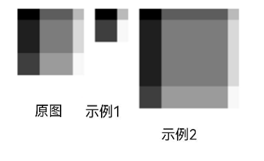

### drawImageLattice<sup>18+</sup>

drawImageLattice(pixelmap: image.PixelMap, lattice: Lattice, dstRect: common2D.Rect, filterMode: FilterMode): void

将图像按照矩形网格对象的设置划分为多个网格，并把图像的每个部分按照网格对象的设置绘制到画布上的目标矩形区域。<br>
偶数行和列（起始计数为0）的每个交叉点都是固定的，若固定网格区域的尺寸不超过目标矩形，则会在不缩放的情况下被绘制在目标矩形，反之则会按比例缩放绘制在目标矩形；如果还有剩余空间，剩下的区域会通过拉伸或压缩来绘制，以便能够完全覆盖目标矩形。

**系统能力**：SystemCapability.Graphics.Drawing

**参数：**

| 参数名 | 类型    | 必填 | 说明           |
| ------ | ------ | ---- | -------------- |
| pixelmap   | [image.PixelMap](../apis-image-kit/js-apis-image.md#pixelmap7) | 是   | 用于绘制网格的像素图。 |
| lattice  | [Lattice](#lattice12) | 是   | 矩形网格对象。 |
| dstRect    | [common2D.Rect](js-apis-graphics-common2D.md#rect) | 是   | 目标矩形区域。 |
| filterMode | [FilterMode](#filtermode12) | 是   | 过滤模式。 |

**错误码：**

以下错误码的详细介绍请参见[通用错误码](../errorcode-universal.md)。

| 错误码ID | 错误信息 |
| ------- | --------------------------------------------|
| 401 | Parameter error.Possible causes:1.Mandatory parameters are left unspecified;2.Incorrect parameter types;3.Parameter verification failed. |

**示例：**

```ts
import { RenderNode } from '@kit.ArkUI';
import { common2D, drawing } from '@kit.ArkGraphics2D';
import { image } from '@kit.ImageKit';

class DrawingRenderNode extends RenderNode {
  draw(context : DrawContext) {
    const canvas = context.canvas;
    let pixelMap: image.PixelMap = globalThis.getInstance().getPixelMap("test_3.jpg");
    canvas.drawImage(pixelMap, 0, 0); // 原图
    let xDivs: Array<number> = [28, 36, 44, 52];
    let yDivs: Array<number> = [28, 36, 44, 52];
    let lattice = drawing.Lattice.createImageLattice(xDivs, yDivs, 4, 4);
    let dst: common2D.Rect = { left: 100, top: 0, right: 164, bottom: 64 };
    let dst1: common2D.Rect = { left: 200, top: 0, right: 360, bottom: 160 };
    canvas.drawImageLattice(pixelMap, lattice, dst, drawing.FilterMode.FILTER_MODE_NEAREST); // 示例1
    canvas.drawImageLattice(pixelMap, lattice, dst1, drawing.FilterMode.FILTER_MODE_NEAREST); // 示例2
  }
}
```
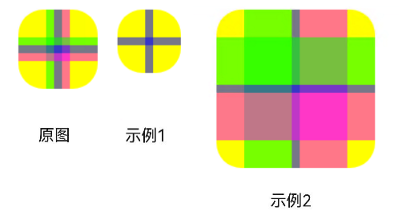

## ImageFilter<sup>12+</sup>

图像滤波器。

### createBlurImageFilter<sup>12+</sup>

static createBlurImageFilter(sigmaX: number, sigmaY: number, tileMode: TileMode, imageFilter?: ImageFilter | null ): ImageFilter

创建具有模糊效果的图像滤波器。

**系统能力**：SystemCapability.Graphics.Drawing

**参数：**

| 参数名          | 类型    | 必填 | 说明                                                        |
| --------------- | ------- | ---- | ----------------------------------------------------------- |
| sigmaX | number | 是   | 表示沿x轴方向上高斯模糊的标准差，必须大于0，该参数为浮点数。 |
| sigmaY | number | 是   | 表示沿y轴方向上高斯模糊的标准差，必须大于0，该参数为浮点数。 |
| tileMode | [TileMode](#tilemode12)| 是   | 表示在边缘处应用的平铺模式。 |
| imageFilter | [ImageFilter](#imagefilter12) \| null | 否   | 表示要和当前图像滤波器叠加的输入滤波器，默认为null，表示直接将当前图像滤波器作用于原始图像。 |

**返回值：**

| 类型                  | 说明           |
| --------------------- | -------------- |
| [ImageFilter](#imagefilter12) | 返回创建的图像滤波器。 |

**错误码：**

以下错误码的详细介绍请参见[通用错误码](../errorcode-universal.md)。

| 错误码ID | 错误信息 |
| ------- | --------------------------------------------|
| 401 | Parameter error.Possible causes:1.Mandatory parameters are left unspecified;2.Incorrect parameter types;3.Parameter verification failed. |

**示例：**

```ts
import { drawing } from '@kit.ArkGraphics2D';
let imgFilter = drawing.ImageFilter.createBlurImageFilter(5, 10, drawing.TileMode.CLAMP);
```

### createFromColorFilter<sup>12+</sup>

static createFromColorFilter(colorFilter: ColorFilter, imageFilter?: ImageFilter | null): ImageFilter

创建一个将颜色滤波器应用于传入的图像滤波器的图像滤波器。

**系统能力**：SystemCapability.Graphics.Drawing

**参数：**

| 参数名          | 类型    | 必填 | 说明                                                        |
| --------------- | ------- | ---- | ----------------------------------------------------------- |
| colorFilter | [ColorFilter](#colorfilter) | 是   | 表示颜色滤波器。 |
| imageFilter | [ImageFilter](#imagefilter12) \| null | 否   | 表示要和当前图像滤波器叠加的输入滤波器，默认为null，表示直接将当前图像滤波器作用于原始图像。 |

**返回值：**

| 类型                  | 说明           |
| --------------------- | -------------- |
| [ImageFilter](#imagefilter12) | 返回创建的图像滤波器。 |

**错误码：**

以下错误码的详细介绍请参见[通用错误码](../errorcode-universal.md)。

| 错误码ID | 错误信息 |
| ------- | --------------------------------------------|
| 401 | Parameter error.Possible causes:1.Mandatory parameters are left unspecified;2.Incorrect parameter types. |

**示例：**

```ts
import { drawing } from '@kit.ArkGraphics2D';
let imgFilter = drawing.ImageFilter.createBlurImageFilter(5, 10, drawing.TileMode.CLAMP);
let clolorfilter = drawing.ColorFilter.createSRGBGammaToLinear();
let imgFilter1 = drawing.ImageFilter.createFromColorFilter(clolorfilter, imgFilter);
```

## TextBlobRunBuffer

描述一行文字中具有相同属性的连续字形。

**系统能力**：SystemCapability.Graphics.Drawing

| 名称      | 类型   | 可读 | 可写 | 说明                      |
| --------- | ------ | ---- | ---- | ------------------------- |
| glyph     | number | 是   | 是   | 存储文字的索引，该参数为整数，传入浮点类型时向下取整。 |
| positionX | number | 是   | 是   | 文本的起点x轴坐标，该参数为浮点数。 |
| positionY | number | 是   | 是   | 文本的起点y轴坐标，该参数为浮点数。 |

## TextEncoding

文本的编码类型枚举。

**系统能力**：SystemCapability.Graphics.Drawing

| 名称                   | 值   | 说明                           |
| ---------------------- | ---- | ------------------------------ |
| TEXT_ENCODING_UTF8     | 0    | 使用1个字节表示UTF-8或ASCII。  |
| TEXT_ENCODING_UTF16    | 1    | 使用2个字节表示大部分unicode。 |
| TEXT_ENCODING_UTF32    | 2    | 使用4个字节表示全部unicode。   |
| TEXT_ENCODING_GLYPH_ID | 3    | 使用2个字节表示glyph index。   |

## ClipOp<sup>12+</sup>
画布裁剪方式的枚举。


**系统能力**：SystemCapability.Graphics.Drawing

| 名称                 | 值    | 说明           | 示意图   |
| ------------------ | ---- | ---------------- | -------- |
| DIFFERENCE | 0    | 将指定区域裁剪（取差集）。 |  |
| INTERSECT  | 1    | 将指定区域保留（取交集）。 | 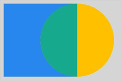 |

> **说明：**
>
> 示意图展示的是以INTERSECT方式裁剪一个矩形后，使用不同枚举值在此基础上裁剪一个圆形的结果，其中绿色区域为最终得到的裁剪区域。

## FilterMode<sup>12+</sup>

过滤模式枚举。

**系统能力**：SystemCapability.Graphics.Drawing

| 名称                  | 值    | 说明      |
| ------------------- | ---- | ------- |
| FILTER_MODE_NEAREST | 0    | 邻近过滤模式。 |
| FILTER_MODE_LINEAR  | 1    | 线性过滤模式。 |

## PathDirection<sup>12+</sup>

添加闭合轮廓方向的枚举。

**系统能力**：SystemCapability.Graphics.Drawing

| 名称                  | 值    | 说明      |
| ------------------- | ---- | ------- |
| CLOCKWISE   | 0    | 顺时针方向添加闭合轮廓。 |
| COUNTER_CLOCKWISE  | 1    | 逆时针方向添加闭合轮廓。 |

## PathFillType<sup>12+</sup>

定义路径的填充类型枚举。

**系统能力**：SystemCapability.Graphics.Drawing

| 名称                  | 值    | 说明      |
| ------------------- | ---- | ------- |
| WINDING   | 0    | 绘制区域中的任意一点，向任意方向射出一条射线，对于射线和路径的所有交点，初始计数为0，遇到每个顺时针的交点（路径从射线的左边向右穿过），计数加1，遇到每个逆时针的交点（路径从射线的右边向左穿过），计数减1，若最终的计数结果不为0，则认为这个点在路径内部，需要被涂色；若计数为0则不被涂色。 |
| EVEN_ODD  | 1    | 绘制区域中的任意一点，向任意方向射出一条射线，若这条射线和路径相交的次数是奇数，则这个点被认为在路径内部，需要被涂色；若是偶数则不被涂色。 |
| INVERSE_WINDING  | 2    | WINDING涂色规则取反。 |
| INVERSE_EVEN_ODD  | 3    | EVEN_ODD涂色规则取反。 |

> **说明：**<br>
> 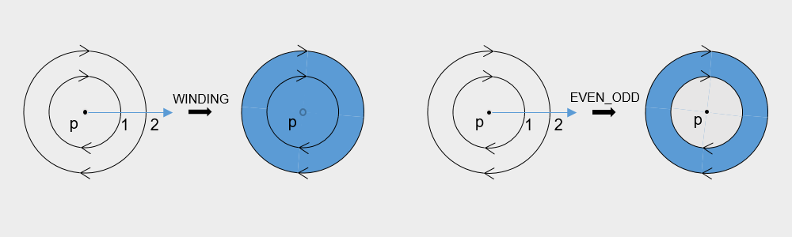<br>
> 如图所示圆环为路径，箭头指示路径的方向，p为区域内任意一点，蓝色线条为点p出发的射线，黑色箭头所指为对应填充规则下使用蓝色填充路径的结果。WINDING填充规则下，射线与路径的交点计数为2，不为0，点p被涂色；EVEN_ODD填充规则下，射线与路径的相交次数为2，是偶数，点p不被涂色。

## PointMode<sup>12+</sup>

绘制数组点的方式的枚举。

**系统能力**：SystemCapability.Graphics.Drawing

| 名称                 | 值    | 说明            |
| ------------------ | ---- | ------------- |
| POINTS  | 0    | 分别绘制每个点。      |
| LINES   | 1    | 将每对点绘制为线段。    |
| POLYGON | 2    | 将点阵列绘制为开放多边形。 |

## FontEdging<sup>12+</sup>

字型边缘效果类型枚举。

**系统能力**：SystemCapability.Graphics.Drawing

| 名称                  | 值    | 说明      |
| ------------------- | ---- | ------- |
| ALIAS | 0    | 无抗锯齿处理。 |
| ANTI_ALIAS  | 1    | 使用抗锯齿来平滑字型边缘。 |
| SUBPIXEL_ANTI_ALIAS  | 2    | 使用次像素级别的抗锯齿来平滑字型边缘，可以获得更加平滑的字型渲染效果。 |

## FontHinting<sup>12+</sup>

字型轮廓效果类型枚举。

**系统能力**：SystemCapability.Graphics.Drawing

| 名称                  | 值    | 说明      |
| ------------------- | ---- | ------- |
| NONE    | 0    | 不修改字型轮廓。 |
| SLIGHT  | 1    | 最小限度修改字型轮廓以改善对比度。 |
| NORMAL  | 2    | 修改字型轮廓以提高对比度。 |
| FULL    | 3    | 修改字型轮廓以获得最大对比度。 |

## TextBlob

由一个或多个具有相同字体的字符组成的字块。

### makeFromPosText<sup>12+</sup>

static makeFromPosText(text: string, len: number, points: common2D.Point[], font: Font): TextBlob

使用文本创建TextBlob对象，TextBlob对象中每个字形的坐标由points中对应的坐标信息决定。

**系统能力**：SystemCapability.Graphics.Drawing

**参数：**

| 参数名   | 类型                          | 必填 | 说明                                   |
| -------- | ----------------------------- | ---- | -------------------------------------- |
| text     | string             | 是   | 绘制字形的文本内容。                   |
| len      | number             | 是   | 字形个数，由[countText](#counttext12)获取，该参数为整数。 |
| points   |[common2D.Point](js-apis-graphics-common2D.md#point)[]     | 是   |点数组，用于指定每个字形的坐标，长度必须为len。|
| font     | [Font](#font)      | 是   | 字型对象。 |

**返回值：**

| 类型                  | 说明           |
| --------------------- | -------------- |
| [TextBlob](#textblob) | TextBlob对象。 |


**错误码：**

以下错误码的详细介绍请参见[通用错误码](../errorcode-universal.md)。

| 错误码ID | 错误信息 |
| ------- | --------------------------------------------|
| 401 | Parameter error. Possible causes: 1. Mandatory parameters are left unspecified;2. Incorrect parameter types. |

**示例：**

```ts
import { RenderNode } from '@kit.ArkUI';
import { drawing,common2D} from '@kit.ArkGraphics2D';

class DrawingRenderNode extends RenderNode {
  draw(context : DrawContext) {
    const canvas = context.canvas;
    let text : string = 'makeFromPosText';
    let font : drawing.Font = new drawing.Font();
    font.setSize(100);
    let length = font.countText(text);
    let points : common2D.Point[] = [];
    for (let i = 0; i !== length; ++i) {
      points.push({ x: i * 35, y: i * 35 });
    }
    let textblob : drawing.TextBlob =drawing.TextBlob.makeFromPosText(text, points.length, points, font);
    canvas.drawTextBlob(textblob, 100, 100);
  }
}
```

### uniqueID<sup>12+</sup>

uniqueID(): number

获取文本的标识符，该标识符是唯一的非零值。

**系统能力**：SystemCapability.Graphics.Drawing

**返回值：**

| 类型                  | 说明           |
| --------------------- | -------------- |
| number | 返回TextBlob对象的唯一标识符。 |

**示例：**

```ts
import {drawing} from "@kit.ArkGraphics2D"
let text : string = 'TextBlobUniqueId';
let font : drawing.Font = new drawing.Font();
font.setSize(100);
let textBlob = drawing.TextBlob.makeFromString(text, font, 0);
let id = textBlob.uniqueID();
console.info("uniqueID---------------" +id);
```

### makeFromString

static makeFromString(text: string, font: Font, encoding?: TextEncoding): TextBlob

将string类型的值转化成TextBlob对象。

**系统能力**：SystemCapability.Graphics.Drawing

**参数：**

| 参数名   | 类型                          | 必填 | 说明                                   |
| -------- | ----------------------------- | ---- | -------------------------------------- |
| text     | string                        | 是   | 绘制字形的文本内容。                   |
| font     | [Font](#font)                 | 是   | 字型对象。           |
| encoding | [TextEncoding](#textencoding) | 否   | 编码类型，默认值为TEXT_ENCODING_UTF8。当前只有TEXT_ENCODING_UTF8生效，其余编码类型也会被视为TEXT_ENCODING_UTF8。 |

**返回值：**

| 类型                  | 说明           |
| --------------------- | -------------- |
| [TextBlob](#textblob) | TextBlob对象。 |

**错误码：**

以下错误码的详细介绍请参见[通用错误码](../errorcode-universal.md)。

| 错误码ID | 错误信息 |
| ------- | --------------------------------------------|
| 401 | Parameter error.Possible causes:1.Mandatory parameters are left unspecified;2.Incorrect parameter types. |

**示例：**

```ts
import { RenderNode } from '@kit.ArkUI';
import { drawing } from '@kit.ArkGraphics2D';
class DrawingRenderNode extends RenderNode {
  draw(context : DrawContext) {
    const canvas = context.canvas;
    const brush = new drawing.Brush();
    brush.setColor({alpha: 255, red: 255, green: 0, blue: 0});
    const font = new drawing.Font();
    font.setSize(20);
    const textBlob = drawing.TextBlob.makeFromString("drawing", font, drawing.TextEncoding.TEXT_ENCODING_UTF8);
    canvas.attachBrush(brush);
    canvas.drawTextBlob(textBlob, 20, 20);
    canvas.detachBrush();
  }
}
```

### makeFromRunBuffer

static makeFromRunBuffer(pos: Array\<TextBlobRunBuffer>, font: Font, bounds?: common2D.Rect): TextBlob

基于RunBuffer信息创建一个Textblob对象。

**系统能力**：SystemCapability.Graphics.Drawing

**参数：**

| 参数名 | 类型                                               | 必填 | 说明                           |
| ------ | -------------------------------------------------- | ---- | ------------------------------ |
| pos    | Array\<[TextBlobRunBuffer](#textblobrunbuffer)>    | 是   | TextBlobRunBuffer数组。        |
| font   | [Font](#font)                                      | 是   | 字型对象。   |
| bounds | [common2D.Rect](js-apis-graphics-common2D.md#rect) | 否   | 可选，如果不设置，则无边界框。 |

**返回值：**

| 类型                  | 说明           |
| --------------------- | -------------- |
| [TextBlob](#textblob) | TextBlob对象。 |

**错误码：**

以下错误码的详细介绍请参见[通用错误码](../errorcode-universal.md)。

| 错误码ID | 错误信息 |
| ------- | --------------------------------------------|
| 401 | Parameter error.Possible causes:1.Mandatory parameters are left unspecified;2.Incorrect parameter types. |

**示例：**

```ts
import { RenderNode } from '@kit.ArkUI';
import { common2D, drawing } from '@kit.ArkGraphics2D';
class DrawingRenderNode extends RenderNode {
  draw(context : DrawContext) {
    const canvas = context.canvas;
    const font = new drawing.Font();
    font.setSize(20);
    let runBuffer : Array<drawing.TextBlobRunBuffer> = [
      { glyph: 65, positionX: 0, positionY: 0 },
      { glyph: 227, positionX: 14.9, positionY: 0 },
      { glyph: 283, positionX: 25.84, positionY: 0 },
      { glyph: 283, positionX: 30.62, positionY: 0 },
      { glyph: 299, positionX: 35.4, positionY: 0}
    ];
    const textBlob = drawing.TextBlob.makeFromRunBuffer(runBuffer, font, null);
    const brush = new drawing.Brush();
    brush.setColor({alpha: 255, red: 255, green: 0, blue: 0});
    canvas.attachBrush(brush);
    canvas.drawTextBlob(textBlob, 20, 20);
    canvas.detachBrush();
  }
}
```

### bounds

bounds(): common2D.Rect

获取文字边界框的矩形区域。

**系统能力**：SystemCapability.Graphics.Drawing

**返回值：**

| 类型                                               | 说明                   |
| -------------------------------------------------- | ---------------------- |
| [common2D.Rect](js-apis-graphics-common2D.md#rect) | 文字边界框的矩形区域。 |

**示例：**

```ts
import { common2D, drawing } from '@kit.ArkGraphics2D';
const font = new drawing.Font();
font.setSize(20);
const textBlob = drawing.TextBlob.makeFromString("drawing", font, drawing.TextEncoding.TEXT_ENCODING_UTF8);
let bounds = textBlob.bounds();
```

## Typeface

字体，如宋体、楷体等。

### getFamilyName

getFamilyName(): string

获取字体的系列名称。

**系统能力**：SystemCapability.Graphics.Drawing

**返回值：**

| 类型   | 说明                 |
| ------ | -------------------- |
| string | 返回字体的系列名称。 |

**示例：**

```ts
import { drawing } from '@kit.ArkGraphics2D';
const font = new drawing.Font();
let typeface = font.getTypeface();
let familyName = typeface.getFamilyName();
```

### makeFromFile<sup>12+</sup>

static makeFromFile(filePath: string): Typeface

从指定字体文件，构造字体。

**系统能力**：SystemCapability.Graphics.Drawing

**参数：**

| 参数名         | 类型                                       | 必填   | 说明                  |
| ----------- | ---------------------------------------- | ---- | ------------------- |
| filePath | string           | 是   | 表示字体资源存放的路径。应用沙箱路径和真实物理路径的对应关系请参考[应用沙箱路径和真实物理路径的对应关系](../../file-management/app-sandbox-directory.md#应用沙箱路径和真实物理路径的对应关系)。 |

**返回值：**

| 类型   | 说明                 |
| ------ | -------------------- |
| [Typeface](#typeface) | 返回Typeface对象。 |

**错误码：**

以下错误码的详细介绍请参见[通用错误码](../errorcode-universal.md)。

| 错误码ID | 错误信息 |
| ------- | --------------------------------------------|
| 401 | Parameter error.Possible causes:1.Mandatory parameters are left unspecified;2.Incorrect parameter types. |

**示例：**

```ts
import { RenderNode } from '@kit.ArkUI';
import { drawing } from '@kit.ArkGraphics2D';
class TextRenderNode extends RenderNode {
  async draw(context: DrawContext) {
    const canvas = context.canvas;
    let font = new drawing.Font();
    let str = "/system/fonts/HarmonyOS_Sans_Italic.ttf";
    const mytypeface = drawing.Typeface.makeFromFile(str);
    font.setTypeface(mytypeface);
    const textBlob = drawing.TextBlob.makeFromString("Hello World", font, drawing.TextEncoding.TEXT_ENCODING_UTF8);
    canvas.drawTextBlob(textBlob, 60, 100);
  }
}
```

### makeFromRawFile<sup>18+</sup>

static makeFromRawFile(rawfile: Resource): Typeface

使用指定字体文件构造字体，其中要求指定的字体文件保存在应用资源文件夹的rawfile路径下。

**系统能力**：SystemCapability.Graphics.Drawing

**参数：**

| 参数名         | 类型                                       | 必填   | 说明                  |
| ----------- | ---------------------------------------- | ---- | ------------------- |
| rawfile | [Resource](../apis-arkui/arkui-ts/ts-types.md#resource)           | 是   | 指定字体文件对应的资源对象。当前只支持``$rawfile``格式引用的资源对象，对应格式写为``$rawfile('filePath')``，其中filePath为指定字体文件相对于工程中resources/rawfile目录的相对路径。如将字体文件直接存放在resources/rawfile目录下，则引用格式应写为：``$rawfile('HarmonyOS_Sans_Bold.ttf')``；也可以创建子目录，将字体文件存放在resources/rawfile/ttf下，则引用格式应写为：``$rawfile('ttf/HarmonyOS_Sans_Bold.ttf')``。 |

**返回值：**

| 类型   | 说明                 |
| ------ | -------------------- |
| [Typeface](#typeface) | 返回Typeface对象（异常情况下会返回空指针）。 |

**错误码：**

以下错误码的详细介绍请参见[通用错误码](../errorcode-universal.md)。

| 错误码ID | 错误信息 |
| ------- | --------------------------------------------|
| 401 | Parameter error.Possible causes:1.Mandatory parameters are left unspecified;2.Incorrect parameter types. |

**示例：**

```ts
import { RenderNode } from '@kit.ArkUI';
import { drawing } from '@kit.ArkGraphics2D';
class TextRenderNode extends RenderNode {
  async draw(context: DrawContext) {
    const canvas = context.canvas;
    let font = new drawing.Font();
    const mytypeface = drawing.Typeface.makeFromRawFile($rawfile('HarmonyOS_Sans_Bold.ttf'));
    font.setTypeface(mytypeface);
    const textBlob = drawing.TextBlob.makeFromString("Hello World", font, drawing.TextEncoding.TEXT_ENCODING_UTF8);
    canvas.drawTextBlob(textBlob, 60, 100);
  }
}
```

## Font

描述字形绘制时所使用的属性，如大小、字体等。

### isSubpixel<sup>12+</sup>

isSubpixel(): boolean

获取字型是否使用次像素渲染。

**系统能力：** SystemCapability.Graphics.Drawing

**返回值：**

| 类型   | 说明                 |
| ------ | -------------------- |
| boolean | 返回字型是否使用次像素渲染的结果，true表示使用，false表示不使用。 |

**示例：**

```ts
import {drawing} from '@kit.ArkGraphics2D';
let font: drawing.Font = new drawing.Font();
font.enableSubpixel(true)
console.info("values=" + font.isSubpixel());
```

### isLinearMetrics<sup>12+</sup>

isLinearMetrics(): boolean

获取字型是否可以线性缩放。

**系统能力：** SystemCapability.Graphics.Drawing

**返回值：**

| 类型   | 说明                 |
| ------ | -------------------- |
| boolean | 返回字型是否可线性缩放的结果，true表示可线性缩放，false表示不可线性缩放。 |

**示例：**

```ts
import {drawing} from '@kit.ArkGraphics2D';
let font: drawing.Font = new drawing.Font();
font.enableLinearMetrics(true)
console.info("values=" + font.isLinearMetrics());
```

### getSkewX<sup>12+</sup>

getSkewX(): number

获取字型在x轴方向上的倾斜度。

**系统能力：** SystemCapability.Graphics.Drawing

**返回值：**

| 类型   | 说明                 |
| ------ | -------------------- |
| number | 返回字型在x轴方向上的倾斜度。 |

**示例：**

```ts
import {drawing} from '@kit.ArkGraphics2D';
let font: drawing.Font = new drawing.Font();
font.setSkewX(-1)
console.info("values=" + font.getSkewX());
```

### isEmbolden<sup>12+</sup>

isEmbolden(): boolean

获取字型是否设置了粗体效果。

**系统能力：** SystemCapability.Graphics.Drawing

**返回值：**

| 类型   | 说明                 |
| ------ | -------------------- |
| boolean  | 返回字型是否设置粗体效果的结果，true表示设置了粗体效果，false表示未设置粗体效果。 |

**示例：**

```ts
import {drawing} from '@kit.ArkGraphics2D';
let font: drawing.Font = new drawing.Font();
font.enableEmbolden(true);
console.info("values=" + font.isEmbolden());
```

### getScaleX<sup>12+</sup>

getScaleX(): number

获取字型在x轴方向上的缩放比例。

**系统能力：** SystemCapability.Graphics.Drawing

**返回值：**

| 类型   | 说明                 |
| ------ | -------------------- |
| number  | 返回字型在x轴方向上的缩放比例。 |

**示例：**

```ts
import {drawing} from '@kit.ArkGraphics2D';
let font: drawing.Font = new drawing.Font();
font.setScaleX(2);
console.info("values=" + font.getScaleX());
```

### getHinting<sup>12+</sup>

getHinting(): FontHinting

获取字型轮廓效果。

**系统能力：** SystemCapability.Graphics.Drawing

**返回值：**

| 类型   | 说明                 |
| ------ | -------------------- |
| [FontHinting](#fonthinting12)  | 返回字型轮廓效果。 |

**示例：**

```ts
import {drawing} from '@kit.ArkGraphics2D';
let font: drawing.Font = new drawing.Font();
console.info("values=" + font.getHinting());
```

### getEdging<sup>12+</sup>

getEdging(): FontEdging

获取字型边缘效果。

**系统能力：** SystemCapability.Graphics.Drawing

**返回值：**

| 类型   | 说明                 |
| ------ | -------------------- |
| [FontEdging](#fontedging12)  | 返回字型边缘效果。 |

**示例：**

```ts
import {drawing} from '@kit.ArkGraphics2D';
let font: drawing.Font = new drawing.Font();
console.info("values=" + font.getEdging());
```

### enableSubpixel

enableSubpixel(isSubpixel: boolean): void

使能字体亚像素级别的文字绘制，显示效果平滑。

**系统能力**：SystemCapability.Graphics.Drawing

**参数：**

| 参数名     | 类型    | 必填 | 说明                                                         |
| ---------- | ------- | ---- | ------------------------------------------------------------ |
| isSubpixel | boolean | 是   | 表示是否使能字体亚像素级别的文字绘制。true表示使能，false表示不使能。 |

**错误码：**

以下错误码的详细介绍请参见[通用错误码](../errorcode-universal.md)。

| 错误码ID | 错误信息 |
| ------- | --------------------------------------------|
| 401 | Parameter error.Possible causes:1.Mandatory parameters are left unspecified;2.Incorrect parameter types. |

**示例：**

```ts
import { drawing } from '@kit.ArkGraphics2D';
let font = new drawing.Font();
font.enableSubpixel(true);
```

### enableEmbolden

enableEmbolden(isEmbolden: boolean): void

使能字体粗体。

**系统能力**：SystemCapability.Graphics.Drawing

**参数：**

| 参数名     | 类型    | 必填 | 说明                                                  |
| ---------- | ------- | ---- | ----------------------------------------------------- |
| isEmbolden | boolean | 是   | 表示是否使能字体粗体。true表示使能，false表示不使能。 |

**错误码：**

以下错误码的详细介绍请参见[通用错误码](../errorcode-universal.md)。

| 错误码ID | 错误信息 |
| ------- | --------------------------------------------|
| 401 | Parameter error.Possible causes:1.Mandatory parameters are left unspecified;2.Incorrect parameter types. |

**示例：**

```ts
import { drawing } from '@kit.ArkGraphics2D';
let font = new drawing.Font();
font.enableEmbolden(true);
```

### enableLinearMetrics

enableLinearMetrics(isLinearMetrics: boolean): void

使能字型的线性缩放。

**系统能力**：SystemCapability.Graphics.Drawing

**参数：**

| 参数名          | 类型    | 必填 | 说明                                                        |
| --------------- | ------- | ---- | ----------------------------------------------------------- |
| isLinearMetrics | boolean | 是   | 表示是否使能字型的线性缩放。true表示使能，false表示不使能。 |

**错误码：**

以下错误码的详细介绍请参见[通用错误码](../errorcode-universal.md)。

| 错误码ID | 错误信息 |
| ------- | --------------------------------------------|
| 401 | Parameter error.Possible causes:1.Mandatory parameters are left unspecified;2.Incorrect parameter types. |

**示例：**

```ts
import { drawing } from '@kit.ArkGraphics2D';
let font = new drawing.Font();
font.enableLinearMetrics(true);
```

### setSize

setSize(textSize: number): void

设置字体大小。

**系统能力**：SystemCapability.Graphics.Drawing

**参数：**

| 参数名   | 类型   | 必填 | 说明             |
| -------- | ------ | ---- | ---------------- |
| textSize | number | 是   | 字体大小，该参数为浮点数，为负数时字体大小会被置为0。字体大小为0时，绘制的文字不会显示。|

**错误码：**

以下错误码的详细介绍请参见[通用错误码](../errorcode-universal.md)。

| 错误码ID | 错误信息 |
| ------- | --------------------------------------------|
| 401 | Parameter error.Possible causes:1.Mandatory parameters are left unspecified;2.Incorrect parameter types;3.Parameter verification failed. |

**示例：**

```ts
import { drawing } from '@kit.ArkGraphics2D';
let font = new drawing.Font();
font.setSize(5);
```

### getSize

getSize(): number

获取字体大小。

**系统能力**：SystemCapability.Graphics.Drawing

**返回值：**

| 类型   | 说明             |
| ------ | ---------------- |
| number | 字体大小，浮点数。 |

**示例：**

```ts
import { drawing } from '@kit.ArkGraphics2D';
let font = new drawing.Font();
font.setSize(5);
let fontSize = font.getSize();
```

### setTypeface

setTypeface(typeface: Typeface): void

设置字体。

**系统能力**：SystemCapability.Graphics.Drawing

**参数：**

| 参数名   | 类型                  | 必填 | 说明   |
| -------- | --------------------- | ---- | ------ |
| typeface | [Typeface](#typeface) | 是   | 字体。 |

**错误码：**

以下错误码的详细介绍请参见[通用错误码](../errorcode-universal.md)。

| 错误码ID | 错误信息 |
| ------- | --------------------------------------------|
| 401 | Parameter error.Possible causes:1.Mandatory parameters are left unspecified;2.Incorrect parameter types. |

**示例：**

```ts
import { drawing } from '@kit.ArkGraphics2D';
let font = new drawing.Font();
font.setTypeface(new drawing.Typeface());
```

### getTypeface

getTypeface(): Typeface

获取字体。

**系统能力**：SystemCapability.Graphics.Drawing

**返回值：**

| 类型                  | 说明   |
| --------------------- | ------ |
| [Typeface](#typeface) | 字体。 |

**示例：**

```ts
import { drawing } from '@kit.ArkGraphics2D';
let font = new drawing.Font();
let typeface = font.getTypeface();
```

### getMetrics

getMetrics(): FontMetrics

获取与字体关联的FontMetrics属性。

**系统能力**：SystemCapability.Graphics.Drawing

**返回值：**

| 类型                        | 说明              |
| --------------------------- | ----------------- |
| [FontMetrics](#fontmetrics) | FontMetrics属性。 |

**示例：**

```ts
import { drawing } from '@kit.ArkGraphics2D';
let font = new drawing.Font();
let metrics = font.getMetrics();
```

### measureText

measureText(text: string, encoding: TextEncoding): number

测量文本的宽度。

> **说明：**
>
> 此接口用于测量原始字符串的文本宽度，若想测量排版后的文本宽度，建议使用[measure.measureText](../apis-arkui/js-apis-measure.md#measuretextmeasuretext)替代。

**系统能力**：SystemCapability.Graphics.Drawing

**参数：**

| 参数名   | 类型                          | 必填 | 说明       |
| -------- | ----------------------------- | ---- | ---------- |
| text     | string                        | 是   | 文本内容。 |
| encoding | [TextEncoding](#textencoding) | 是   | 编码格式。 |

**返回值：**

| 类型   | 说明             |
| ------ | ---------------- |
| number | 文本的宽度，浮点数。 |

**错误码：**

以下错误码的详细介绍请参见[通用错误码](../errorcode-universal.md)。

| 错误码ID | 错误信息 |
| ------- | --------------------------------------------|
| 401 | Parameter error.Possible causes:1.Mandatory parameters are left unspecified;2.Incorrect parameter types. |

**示例：**

```ts
import { drawing } from '@kit.ArkGraphics2D';
let font = new drawing.Font();
font.measureText("drawing", drawing.TextEncoding.TEXT_ENCODING_UTF8);
```

### measureSingleCharacter<sup>12+</sup>

measureSingleCharacter(text: string): number

用于测量单个字符的宽度。当前字型中的字体不支持待测量字符时，退化到使用系统字体测量字符宽度。

**系统能力**：SystemCapability.Graphics.Drawing

**参数**

| 参数名 | 类型                | 必填 | 说明        |
| ------ | ------------------- | ---- | ----------- |
| text   | string | 是   | 待测量的单个字符，字符串的长度必须为1。  |

**返回值：**

| 类型   | 说明             |
| ------ | ---------------- |
| number | 字符的宽度，浮点数。 |

**错误码：**

以下错误码的详细介绍请参见[通用错误码](../errorcode-universal.md)。

| 错误码ID | 错误信息 |
| ------- | --------------------------------------------|
| 401 | Parameter error.Possible causes:1.Mandatory parameters are left unspecified;2.Incorrect parameter types;3.Parameter verification failed. |

**示例**

```ts
import { RenderNode } from '@kit.ArkUI';
import { drawing } from '@kit.ArkGraphics2D';

class DrawingRenderNode extends RenderNode {
  draw(context : DrawContext) {
    const canvas = context.canvas;
    const font = new drawing.Font();
    font.setSize(20);
    let width = font.measureSingleCharacter("你");
  }
}
```

### setScaleX<sup>12+</sup>

setScaleX(scaleX: number): void

用于设置字型对象在x轴上的缩放比例。

**系统能力**：SystemCapability.Graphics.Drawing

**参数：**

| 参数名   | 类型                          | 必填 | 说明       |
| -------- | ----------------------------- | ---- | ---------- |
| scaleX     | number                      | 是   | 文本在x轴上的缩放比例，该参数为浮点数。 |

**错误码：**

以下错误码的详细介绍请参见[通用错误码](../errorcode-universal.md)。

| 错误码ID | 错误信息 |
| ------- | --------------------------------------------|
| 401 | Parameter error.Possible causes:1.Mandatory parameters are left unspecified;2.Incorrect parameter types. |

**示例：**

```ts
import { RenderNode } from '@kit.ArkUI';
import { common2D, drawing } from '@kit.ArkGraphics2D';
class DrawingRenderNode extends RenderNode {
  draw(context : DrawContext) {
    const canvas = context.canvas;
    const pen = new drawing.Pen();
    pen.setStrokeWidth(5);
    pen.setColor({alpha: 255, red: 255, green: 0, blue: 0});
    canvas.attachPen(pen);
    let font = new drawing.Font();
    font.setSize(100);
    font.setScaleX(2);
    const textBlob = drawing.TextBlob.makeFromString("hello", font, drawing.TextEncoding.TEXT_ENCODING_UTF8);
    canvas.drawTextBlob(textBlob, 200, 200);
  }
}
```

### setSkewX<sup>12+</sup>

setSkewX(skewX: number): void

用于设置字型对象在x轴上的倾斜比例。

**系统能力**：SystemCapability.Graphics.Drawing

**参数：**

| 参数名   | 类型                          | 必填 | 说明       |
| -------- | ----------------------------- | ---- | ---------- |
| skewX     | number                      | 是   | 文本在x轴上的倾斜比例，正数表示往左边倾斜，负数表示往右边倾斜，该参数为浮点数。 |

**错误码：**

以下错误码的详细介绍请参见[通用错误码](../errorcode-universal.md)。

| 错误码ID | 错误信息 |
| ------- | --------------------------------------------|
| 401 | Parameter error.Possible causes:1.Mandatory parameters are left unspecified;2.Incorrect parameter types. |

**示例：**

```ts
import { RenderNode } from '@kit.ArkUI';
import { common2D, drawing } from '@kit.ArkGraphics2D';
class DrawingRenderNode extends RenderNode {
  draw(context : DrawContext) {
    const canvas = context.canvas;
    const pen = new drawing.Pen();
    pen.setStrokeWidth(5);
    pen.setColor({alpha: 255, red: 255, green: 0, blue: 0});
    canvas.attachPen(pen);
    let font = new drawing.Font();
    font.setSize(100);
    font.setSkewX(1);
    const textBlob = drawing.TextBlob.makeFromString("hello", font, drawing.TextEncoding.TEXT_ENCODING_UTF8);
    canvas.drawTextBlob(textBlob, 200, 200);
  }
}
```

### setEdging<sup>12+</sup>

setEdging(edging: FontEdging): void

设置字型边缘效果。

**系统能力**：SystemCapability.Graphics.Drawing

**参数：**

| 参数名   | 类型                          | 必填 | 说明       |
| -------- | ----------------------------- | ---- | ---------- |
| edging | [FontEdging](#fontedging12) | 是   | 字型边缘效果。 |

**错误码：**

以下错误码的详细介绍请参见[通用错误码](../errorcode-universal.md)。

| 错误码ID | 错误信息 |
| ------- | --------------------------------------------|
| 401 | Parameter error. Possible causes: 1. Mandatory parameters are left unspecified;2. Incorrect parameter types; 3. Parameter verification failed. |

**示例：**

```ts
import { drawing } from '@kit.ArkGraphics2D';

let font = new drawing.Font();
font.setEdging(drawing.FontEdging.SUBPIXEL_ANTI_ALIAS);
```

### setHinting<sup>12+</sup>

setHinting(hinting: FontHinting): void

设置字型轮廓效果。

**系统能力**：SystemCapability.Graphics.Drawing

**参数：**

| 参数名   | 类型                          | 必填 | 说明       |
| -------- | ----------------------------- | ---- | ---------- |
| hinting | [FontHinting](#fonthinting12) | 是   | 字型轮廓效果。 |

**错误码：**

以下错误码的详细介绍请参见[通用错误码](../errorcode-universal.md)。

| 错误码ID | 错误信息 |
| ------- | --------------------------------------------|
| 401 | Parameter error. Possible causes: 1. Mandatory parameters are left unspecified;2. Incorrect parameter types; 3. Parameter verification failed. |

**示例：**

```ts
import { drawing } from '@kit.ArkGraphics2D';

let font = new drawing.Font();
font.setHinting(drawing.FontHinting.FULL);
```

### countText<sup>12+</sup>

countText(text: string): number

获取文本所表示的字符数量。

**系统能力**：SystemCapability.Graphics.Drawing

**参数：**

| 参数名   | 类型                          | 必填 | 说明       |
| -------- | ----------------------------- | ---- | ---------- |
| text     | string                        | 是   | 文本内容。 |

**返回值：**

| 类型   | 说明             |
| ------ | ---------------- |
| number | 返回文本所表示的字符数量，整数。 |

**错误码：**

以下错误码的详细介绍请参见[通用错误码](../errorcode-universal.md)。

| 错误码ID | 错误信息 |
| ------- | --------------------------------------------|
| 401 | Parameter error.Possible causes:1.Mandatory parameters are left unspecified;2.Incorrect parameter types. |

**示例：**

```ts
import { drawing } from '@kit.ArkGraphics2D';

let font = new drawing.Font();
let resultNumber: number = font.countText('ABCDE');
console.info("count text number: " + resultNumber);
```

### setBaselineSnap<sup>12+</sup>

setBaselineSnap(isBaselineSnap: boolean): void

当前画布矩阵轴对齐时，设置字型基线是否与像素对齐。

**系统能力**：SystemCapability.Graphics.Drawing

**参数：**

| 参数名          | 类型    | 必填 | 说明                                       |
| --------------- | ------- | ---- | ---------------------------------------- |
| isBaselineSnap | boolean | 是   | 指示字型基线是否和像素对齐，true表示对齐，false表示不对齐。 |

**错误码：**

以下错误码的详细介绍请参见[通用错误码](../errorcode-universal.md)。

| 错误码ID | 错误信息 |
| ------- | --------------------------------------------|
| 401 | Parameter error.Possible causes:1.Mandatory parameters are left unspecified;2.Incorrect parameter types. |

**示例：**

```ts
import { drawing } from '@kit.ArkGraphics2D';

let font : drawing.Font = new drawing.Font();
font.setBaselineSnap(true);
console.info("drawing font isBaselineSnap: " + font.isBaselineSnap());
```

### isBaselineSnap()<sup>12+</sup>

isBaselineSnap(): boolean

当前画布矩阵轴对齐时，获取字型基线是否与像素对齐的结果。

**系统能力**：SystemCapability.Graphics.Drawing

**返回值：**

| 类型   | 说明             |
| ------ | ---------------- |
| boolean | 返回字型基线是否与像素对齐，true为对齐，false为没有对齐。 |

**示例：**

```ts
import { drawing } from '@kit.ArkGraphics2D';

let font : drawing.Font = new drawing.Font();
font.setTypeface(new drawing.Typeface());
font.setBaselineSnap(true);
console.info("drawing font isBaselineSnap: " + font.isBaselineSnap());
```

### setEmbeddedBitmaps<sup>12+</sup>

setEmbeddedBitmaps(isEmbeddedBitmaps: boolean): void

设置字型是否转换成位图处理。

**系统能力**：SystemCapability.Graphics.Drawing

**参数：**

| 参数名   | 类型   | 必填 | 说明             |
| -------- | ------ | ---- | ---------------- |
| isEmbeddedBitmaps | boolean | 是   | 设置字型是否转换成位图处理，true表示转换成位图处理，false表示不转换成位图处理。 |

**错误码：**

以下错误码的详细介绍请参见[通用错误码](../errorcode-universal.md)。

| 错误码ID | 错误信息 |
| ------- | --------------------------------------------|
| 401 | Parameter error.Possible causes:1.Mandatory parameters are left unspecified;2.Incorrect parameter types. |

**示例：**

```ts
import { drawing } from '@kit.ArkGraphics2D';

let font : drawing.Font = new drawing.Font();
font.setTypeface(new drawing.Typeface());
font.setEmbeddedBitmaps(false);
console.info("draw isEmbeddedBitmaps: " + font.isEmbeddedBitmaps());
```

### isEmbeddedBitmaps()<sup>12+</sup>

isEmbeddedBitmaps(): boolean

获取字型是否转换成位图处理的结果。

**系统能力**：SystemCapability.Graphics.Drawing

**返回值：**

| 类型   | 说明             |
| ------ | ---------------- |
| boolean | 返回字型是否转换成位图处理结果，true表示转换成位图处理，false表示不转换成位图处理。 |

**示例：**

```ts
import { drawing } from '@kit.ArkGraphics2D';

let font : drawing.Font = new drawing.Font();
font.setTypeface(new drawing.Typeface());
font.setEmbeddedBitmaps(true);
console.info("draw isEmbeddedBitmaps: " + font.isEmbeddedBitmaps());
```

### setForceAutoHinting<sup>12+</sup>

setForceAutoHinting(isForceAutoHinting: boolean): void

设置是否自动调整字型轮廓。

**系统能力**：SystemCapability.Graphics.Drawing

**参数：**

| 参数名   | 类型   | 必填 | 说明             |
| -------- | ------ | ---- | ---------------- |
| isForceAutoHinting | boolean | 是   | 是否自动调整字型轮廓，true为自动调整，false为不自动调整。 |

**错误码：**

以下错误码的详细介绍请参见[通用错误码](../errorcode-universal.md)。

| 错误码ID | 错误信息 |
| ------- | --------------------------------------------|
| 401 | Parameter error.Possible causes:1.Mandatory parameters are left unspecified;2.Incorrect parameter types. |

**示例：**

```ts
import { drawing } from '@kit.ArkGraphics2D';

let font : drawing.Font = new drawing.Font();
font.setTypeface(new drawing.Typeface());
font.setForceAutoHinting(false);
console.info("drawing isForceAutoHinting:  " + font.isForceAutoHinting());
```

### isForceAutoHinting<sup>12+</sup>

isForceAutoHinting(): boolean

获取字型轮廓是否自动调整的结果。

**系统能力**：SystemCapability.Graphics.Drawing

**返回值：**

| 类型   | 说明             |
| ------ | ---------------- |
| boolean | 返回字型轮廓是否自动调整，true为自动调整，false为不自动调整。 |

**示例：**

```ts
import { drawing } from '@kit.ArkGraphics2D';

let font : drawing.Font = new drawing.Font();
font.setTypeface(new drawing.Typeface());
font.setForceAutoHinting(false);
console.info("drawing isForceAutoHinting:  " + font.isForceAutoHinting());
```

### getWidths<sup>12+</sup>

getWidths(glyphs: Array\<number>): Array\<number>

获取字形数组中每个字形对应的宽度。

**系统能力**：SystemCapability.Graphics.Drawing

**参数：**

| 参数名   | 类型                  | 必填 | 说明   |
| -------- | --------------------- | ---- | ------ |
| glyphs | Array\<number> | 是   | 字形索引数组，可由[textToGlyphs](#texttoglyphs12)生成。 |

**返回值：**

| 类型   | 说明             |
| ------ | ---------------- |
| Array\<number> | 返回得到的字形宽度数组。 |

**错误码：**

以下错误码的详细介绍请参见[通用错误码](../errorcode-universal.md)。

| 错误码ID | 错误信息 |
| ------- | --------------------------------------------|
| 401 | Parameter error.Possible causes:1.Mandatory parameters are left unspecified;2.Incorrect parameter types. |

**示例：**

```ts
import { drawing } from '@kit.ArkGraphics2D';

let font: drawing.Font = new drawing.Font();
let text: string = 'hello world';
let glyphs: number[] = font.textToGlyphs(text);
let fontWidths: Array<number> = font.getWidths(glyphs);
for (let index = 0; index < fontWidths.length; index++) {
  console.info("get fontWidths[", index, "]:", fontWidths[index]);
}
```

### textToGlyphs<sup>12+</sup>

textToGlyphs(text: string, glyphCount?: number): Array\<number>

将文本转换为字形索引。

**系统能力**：SystemCapability.Graphics.Drawing

**参数：**

| 参数名   | 类型                          | 必填 | 说明       |
| -------- | ----------------------------- | ---- | ---------- |
| text     | string                        | 是   | 文本字符串。 |
| glyphCount | number | 否   | 文本表示的字符数量，必须与[countText](#counttext12)获取的值相等，默认为text的字符数量，该参数为整数。 |

**返回值：**

| 类型   | 说明             |
| ------ | ---------------- |
| Array\<number> | 返回转换得到的字形索引数组。 |

**错误码：**

以下错误码的详细介绍请参见[通用错误码](../errorcode-universal.md)。

| 错误码ID | 错误信息 |
| ------- | --------------------------------------------|
| 401 | Parameter error.Possible causes:1.Mandatory parameters are left unspecified;2.Incorrect parameter types. |

**示例：**

```ts
import { drawing } from '@kit.ArkGraphics2D';

let font : drawing.Font = new drawing.Font();
let text : string = 'hello world';
let glyphs : number[] = font.textToGlyphs(text);
console.info("drawing text toglyphs OnTestFunction num =  " + glyphs.length );
```

### getBounds<sup>18+</sup>

getBounds(glyphs: Array\<number>): Array\<common2D.Rect>

获取字形数组中每个字形对应的边界矩形。

**系统能力**：SystemCapability.Graphics.Drawing

**参数：**

| 参数名   | 类型                  | 必填 | 说明   |
| -------- | --------------------- | ---- | ------ |
| glyphs | Array\<number> | 是   | 字形索引数组，可由[textToGlyphs](#texttoglyphs12)生成。 |

**返回值：**

| 类型   | 说明             |
| ------ | ---------------- |
| Array\<[common2D.Rect](js-apis-graphics-common2D.md#rect)> | 返回得到的字形边界矩形数组。 |

**错误码：**

以下错误码的详细介绍请参见[通用错误码](../errorcode-universal.md)。

| 错误码ID | 错误信息 |
| ------- | --------------------------------------------|
| 401 | Parameter error.Possible causes:1.Mandatory parameters are left unspecified;2.Incorrect parameter types. |

**示例：**

```ts
import { common2D, drawing } from '@kit.ArkGraphics2D';

let font: drawing.Font = new drawing.Font();
let text: string = 'hello world';
let glyphs: number[] = font.textToGlyphs(text);
let fontBounds: Array<common2D.Rect> = font.getBounds(glyphs);
for (let index = 0; index < fontBounds.length; index++) {
  console.info("get fontWidths[", index, "] left:", fontBounds[index].left, " top:", fontBounds[index].top,
    " right:", fontBounds[index].right, " bottom:", fontBounds[index].bottom);
}
```

### getTextPath<sup>18+</sup>

getTextPath(text: string, byteLength: number, x: number, y: number): Path;

获取文字的轮廓路径。

**系统能力**：SystemCapability.Graphics.Drawing

**参数：**

| 参数名    | 类型                                               | 必填 | 说明                    |
| ------   | ------------------------------------------------   | ---- | ---------------------- |
|   text   |    string                                          | 是   | 表示存储UTF-8 文本编码的字符。|
|byteLength|    number                                          | 是   | 表示要获取对应文本路径的字节长度，按传入的字节长度和实际的文本字节大小之间的最小值来获取对应的文本路径。|
|    x     |    number                                          | 是   | 表示文本在绘图区域内以原点为起始位置的X坐标。|
|    y     |    number                                          | 是   | 表示文本在绘图区域内以原点为起始位置的Y坐标。|

**返回值：**

| 类型   | 说明             |
| ------ | ---------------- |
| [Path](#path) | 返回获取到的文本的路径轮廓。 |

**错误码：**

以下错误码的详细介绍请参见[通用错误码](../errorcode-universal.md)。

| 错误码ID | 错误信息 |
| ------- | --------------------------------------------|
| 401 | Parameter error.Possible causes:1.Mandatory parameters are left unspecified;2.Incorrect parameter types;3.Parameter verification failed. |

**示例：**

```ts
import { drawing } from '@kit.ArkGraphics2D';
import { buffer } from '@kit.ArkTS';
import { RenderNode } from '@kit.ArkUI';

class DrawingRenderNode extends RenderNode {
  draw(context : DrawContext) {
    const canvas = context.canvas;
    let font = new drawing.Font();
    font.setSize(50)
    let myString: string = "你好, HarmonyOS";
    let length = buffer.from(myString).length;
    let path = font.getTextPath(myString, length, 0, 100)
    canvas.drawPath(path)
  }
}
```

### createPathForGlyph<sup>18+</sup>

createPathForGlyph(index: number): Path

获取指定字形的路径轮廓。

**系统能力**：SystemCapability.Graphics.Drawing

**参数：**

| 参数名   | 类型                  | 必填 | 说明   |
| -------- | --------------------- | ---- | ------ |
| index | number | 是   | 字形索引。 |

**返回值：**

| 类型   | 说明             |
| ------ | ---------------- |
| [Path](#path) | 返回指定字形的路径轮廓。 |

**错误码：**

以下错误码的详细介绍请参见[通用错误码](../errorcode-universal.md)。

| 错误码ID | 错误信息 |
| ------- | --------------------------------------------|
| 401 | Parameter error.Possible causes:1.Mandatory parameters are left unspecified;2.Incorrect parameter types. |

**示例：**

```ts
import { FrameNode, NodeController, RenderNode } from '@kit.ArkUI';
import { drawing } from '@kit.ArkGraphics2D';

class DrawingRenderNode extends RenderNode {
  draw(context : DrawContext) {
    const canvas = context.canvas;
    let font = new drawing.Font();
    font.setSize(50)
    let text: string = '你好';
    let glyphs: number[] = font.textToGlyphs(text);
    for (let index = 0; index < glyphs.length; index++) {
      let path: drawing.Path = font.createPathForGlyph(glyphs[index])
      canvas.drawPath(path)
    }
  }
}
```

### setThemeFontFollowed<sup>15+</sup>

setThemeFontFollowed(followed: boolean): void

设置字型中的字体是否跟随主题字体。设置跟随主题字体后，若系统启用主题字体并且字型未被设置字体，字型会使用该主题字体。

**系统能力**：SystemCapability.Graphics.Drawing

**参数：**

| 参数名   | 类型   | 必填 | 说明             |
| -------- | ------ | ---- | ---------------- |
| followed | boolean | 是   | 字型中的字体是否跟随主题字体，true表示跟随主题字体，false表示不跟随主题字体。 |

**错误码：**

以下错误码的详细介绍请参见[通用错误码](../errorcode-universal.md)。

| 错误码ID | 错误信息 |
| ------- | --------------------------------------------|
| 401 | Parameter error.Possible causes:1.Mandatory parameters are left unspecified;2.Incorrect parameter types. |

**示例：**

```ts
import { drawing } from '@kit.ArkGraphics2D';

let font : drawing.Font = new drawing.Font();
font.setThemeFontFollowed(true);
console.info("font is theme font followed: " + font.isThemeFontFollowed());
```

### isThemeFontFollowed()<sup>15+</sup>

isThemeFontFollowed(): boolean

获取字型中的字体是否跟随主题字体。默认不跟随主题字体。

**系统能力**：SystemCapability.Graphics.Drawing

**返回值：**

| 类型   | 说明             |
| ------ | ---------------- |
| boolean | 返回字型中的字体是否跟随主题字体的结果，true表示跟随主题字体，false表示不跟随主题字体。 |

**示例：**

```ts
import { drawing } from '@kit.ArkGraphics2D';

let font : drawing.Font = new drawing.Font();
font.setThemeFontFollowed(true);
console.info("font is theme font followed: " + font.isThemeFontFollowed());
```

## FontMetricsFlags<sup>12+</sup>

字体度量标志枚举，指示字体度量中的各字段数据是否有效。

**系统能力**：SystemCapability.Graphics.Drawing

| 名称                          | 值        | 说明                           |
| ----------------------------- | --------- | ------------------------------ |
| UNDERLINE_THICKNESS_VALID     | 1 << 0    | 表示[FontMetrics](#fontmetrics)结构中的underlineThickness（下划线厚度）字有效。    |
| UNDERLINE_POSITION_VALID      | 1 << 1    | 表示[FontMetrics](#fontmetrics)结构中的underlinePosition（下划线位置）字段有效。  |
| STRIKETHROUGH_THICKNESS_VALID | 1 << 2    | 表示[FontMetrics](#fontmetrics)结构中strikethroughThickness（删除线厚度）是有效的。|
| STRIKETHROUGH_POSITION_VALID  | 1 << 3    | 表示[FontMetrics](#fontmetrics)结构中strikethroughPosition（删除线位置）字段有效。  |
| BOUNDS_INVALID                | 1 << 4    | 表示[FontMetrics](#fontmetrics)结构中的边界度量值（如top、bottom、xMin、xMax）无效。  |

## FontMetrics

描述字形大小和布局的属性信息，同一种字体中的字符属性大致相同。

**系统能力：** SystemCapability.Graphics.Drawing

| 名称    | 类型   | 只读 | 可选 | 说明                                                         |
| ------- | ------ | ---- | ---- | ------------------------------------------------------------ |
| flags<sup>12+</sup>   | [FontMetricsFlags](#fontmetricsflags12) | 是   | 是   | 表明哪些字体度量标志有效。        |
| top     | number | 是   | 否   | 文字最高处到基线之间的最大距离，浮点数。                         |
| ascent  | number | 是   | 否   | 文字最高处到基线之间的距离，浮点数。                             |
| descent | number | 是   | 否   | 基线到文字最低处之间的距离，浮点数。                             |
| bottom  | number | 是   | 否   | 基线到文字最低处之间的最大距离，浮点数。                         |
| leading | number | 是   | 否   | 行间距，从上一行文字descent到下一行文字ascent之间的距离，浮点数。 |
| avgCharWidth<sup>12+</sup> | number | 是   | 是   | 平均字符宽度。                             |
| maxCharWidth<sup>12+</sup> | number | 是   | 是   | 最大字符宽度。                             |
| xMin<sup>12+</sup> | number | 是    | 是   | 字体中任意字形边界框最左边沿到原点的水平距离，这个值往往小于零，意味着字形在水平方向上的最小边界。                |
| xMax<sup>12+</sup> | number | 是   | 是   | 字体中任意字形边界框最右边沿到原点的水平距离，此值多为正数，指示了字形在水平方向上的最大延伸范围。        |
| xHeight<sup>12+</sup> | number | 是   | 是   | 小写字母x的高度，通常为负值。                     |
| capHeight<sup>12+</sup> | number | 是   | 是   | 大写字母的高度，通常为负值。                      |
| underlineThickness<sup>12+</sup> | number | 是   | 是   | 下划线的厚度。                                          |
| underlinePosition<sup>12+</sup>  | number | 是   | 是   | 文本基线到下划线顶部的垂直距离，通常是正数。             |
| strikethroughThickness<sup>12+</sup>  | number | 是   | 是   | 文本删除线的厚度，即贯穿文本字符的水平线的宽度。    |
| strikethroughPosition<sup>12+</sup>  | number | 是   | 是   | 文本基线到底部删除线的垂直距离，通常为负值。         |

## ColorFilter

颜色滤波器。

### createBlendModeColorFilter

createBlendModeColorFilter(color: common2D.Color, mode: BlendMode) : ColorFilter

使用指定的颜色和混合模式创建颜色滤波器。

**系统能力：** SystemCapability.Graphics.Drawing

**参数：**

| 参数名 | 类型                                                 | 必填 | 说明             |
| ------ | ---------------------------------------------------- | ---- | ---------------- |
| color  | [common2D.Color](js-apis-graphics-common2D.md#color) | 是   | ARGB格式的颜色，每个颜色通道是0到255之间的整数。 |
| mode   | [BlendMode](#blendmode)                              | 是   | 颜色的混合模式。 |

**返回值：**

| 类型                        | 说明               |
| --------------------------- | ------------------ |
| [ColorFilter](#colorfilter) | 返回一个颜色滤波器。 |

**错误码：**

以下错误码的详细介绍请参见[通用错误码](../errorcode-universal.md)。

| 错误码ID | 错误信息 |
| ------- | --------------------------------------------|
| 401 | Parameter error.Possible causes:1.Mandatory parameters are left unspecified;2.Incorrect parameter types;3.Parameter verification failed. |

**示例：**

```ts
import { common2D, drawing } from '@kit.ArkGraphics2D';
const color : common2D.Color = { alpha: 255, red: 255, green: 0, blue: 0 };
let colorFilter = drawing.ColorFilter.createBlendModeColorFilter(color, drawing.BlendMode.SRC);
```

### createBlendModeColorFilter<sup>18+</sup>

static createBlendModeColorFilter(color: common2D.Color | number, mode: BlendMode) : ColorFilter

使用指定的颜色和混合模式创建颜色滤波器。

**系统能力：** SystemCapability.Graphics.Drawing

**参数：**

| 参数名 | 类型                                                 | 必填 | 说明             |
| ------ | ---------------------------------------------------- | ---- | ---------------- |
| color  | [common2D.Color](js-apis-graphics-common2D.md#color) \| number | 是   | 颜色，可以用16进制ARGB格式的无符号整数表示。 |
| mode   | [BlendMode](#blendmode)                              | 是   | 颜色的混合模式。 |

**返回值：**

| 类型                        | 说明               |
| --------------------------- | ------------------ |
| [ColorFilter](#colorfilter) | 返回一个颜色滤波器。 |

**错误码：**

以下错误码的详细介绍请参见[通用错误码](../errorcode-universal.md)。

| 错误码ID | 错误信息 |
| ------- | --------------------------------------------|
| 401 | Parameter error.Possible causes:1.Mandatory parameters are left unspecified;2.Incorrect parameter types;3.Parameter verification failed. |

**示例：**

```ts
import { drawing } from '@kit.ArkGraphics2D';
let colorFilter = drawing.ColorFilter.createBlendModeColorFilter(0xffff0000, drawing.BlendMode.SRC);
```

### createComposeColorFilter

createComposeColorFilter(outer: ColorFilter, inner: ColorFilter) : ColorFilter

创建一个先应用inner进行滤波，再应用outer进行滤波的组合颜色滤波器。

**系统能力：** SystemCapability.Graphics.Drawing

**参数：**

| 参数名 | 类型                        | 必填 | 说明                             |
| ------ | --------------------------- | ---- | -------------------------------- |
| outer  | [ColorFilter](#colorfilter) | 是   | 组合滤波器中后生效的颜色滤波器。 |
| inner  | [ColorFilter](#colorfilter) | 是   | 组合滤波器中先生效的颜色滤波器。 |

**返回值：**

| 类型                        | 说明               |
| --------------------------- | ------------------ |
| [ColorFilter](#colorfilter) | 返回一个颜色滤波器。 |

**错误码：**

以下错误码的详细介绍请参见[通用错误码](../errorcode-universal.md)。

| 错误码ID | 错误信息 |
| ------- | --------------------------------------------|
| 401 | Parameter error.Possible causes:1.Mandatory parameters are left unspecified;2.Incorrect parameter types. |

**示例：**

```ts
import { common2D, drawing } from '@kit.ArkGraphics2D';
const color : common2D.Color = { alpha: 255, red: 255, green: 0, blue: 0 };
let colorFilter1 = drawing.ColorFilter.createBlendModeColorFilter(color, drawing.BlendMode.SRC);
let colorFilter2 = drawing.ColorFilter.createBlendModeColorFilter(color, drawing.BlendMode.DST);
let colorFilter = drawing.ColorFilter.createComposeColorFilter(colorFilter1, colorFilter2);
```

### createLinearToSRGBGamma

createLinearToSRGBGamma() : ColorFilter

创建一个从线性颜色空间转换到SRGB颜色空间的颜色滤波器。

**系统能力：** SystemCapability.Graphics.Drawing

**返回值：**

| 类型                        | 说明               |
| --------------------------- | ------------------ |
| [ColorFilter](#colorfilter) | 返回一个颜色滤波器。 |

**示例：**

```ts
import { drawing } from '@kit.ArkGraphics2D';
let colorFilter = drawing.ColorFilter.createLinearToSRGBGamma();
```

### createSRGBGammaToLinear

createSRGBGammaToLinear() : ColorFilter

创建一个从SRGB颜色空间转换到线性颜色空间的颜色滤波器。

**系统能力：** SystemCapability.Graphics.Drawing

**返回值：**

| 类型                        | 说明               |
| --------------------------- | ------------------ |
| [ColorFilter](#colorfilter) | 返回一个颜色滤波器。 |

**示例：**

```ts
import { drawing } from '@kit.ArkGraphics2D';
let colorFilter = drawing.ColorFilter.createSRGBGammaToLinear();
```

### createLumaColorFilter

createLumaColorFilter() : ColorFilter

创建一个颜色滤波器将其输入的亮度值乘以透明度通道，并将红色、绿色和蓝色通道设置为零。

**系统能力：** SystemCapability.Graphics.Drawing

**返回值：**

| 类型                        | 说明               |
| --------------------------- | ------------------ |
| [ColorFilter](#colorfilter) | 返回一个颜色滤波器。 |

**示例：**

```ts
import { drawing } from '@kit.ArkGraphics2D';
let colorFilter = drawing.ColorFilter.createLumaColorFilter();
```

### createMatrixColorFilter<sup>12+</sup>

static createMatrixColorFilter(matrix: Array\<number>): ColorFilter

创建颜色滤波器，通过4x5颜色矩阵变换颜色。

**系统能力：** SystemCapability.Graphics.Drawing

**参数：**

| 参数名   | 类型                                         | 必填 | 说明                            |
| -------- | -------------------------------------------- | ---- | ------------------------------- |
| matrix | Array\<number> | 是   | 长度为20的数组，表示用于颜色变换的4*5矩阵。                 |

**返回值：**

| 类型                        | 说明               |
| --------------------------- | ------------------ |
| [ColorFilter](#colorfilter) | 返回一个颜色滤波器。 |

**错误码：**

以下错误码的详细介绍请参见[通用错误码](../errorcode-universal.md)。

| 错误码ID | 错误信息 |
| ------- | --------------------------------------------|
| 401 | Parameter error.Possible causes:1.Mandatory parameters are left unspecified;2.Incorrect parameter types;3.Parameter verification failed. |

**示例：**

```ts
import { drawing } from '@kit.ArkGraphics2D';
let matrix: Array<number> = [
  1, 0, 0, 0, 0,
  0, 1, 0, 0, 0,
  0, 0, 100, 0, 0,
  0, 0, 0, 1, 0
];
let colorFilter = drawing.ColorFilter.createMatrixColorFilter(matrix);
```

## JoinStyle<sup>12+</sup>

定义线条转角样式的枚举，即画笔在绘制折线段时，在折线转角处的样式。

**系统能力：** SystemCapability.Graphics.Drawing

| 名称        | 值   | 说明                                                         | 示意图   |
| ----------- | ---- | ----------------------------------------------------------- | -------- |
| MITER_JOIN | 0    | 转角类型为尖角，如果折线角度比较小，则尖角会很长，需要使用限制值（miter limit）进行限制。 | 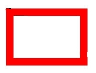 |
| ROUND_JOIN | 1    | 转角类型为圆头。 | 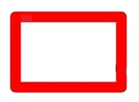 |
| BEVEL_JOIN | 2    | 转角类型为平头。 |  |

## CapStyle<sup>12+</sup>

定义线帽样式的枚举，即画笔在绘制线段时，在线段头尾端点的样式。

**系统能力：** SystemCapability.Graphics.Drawing

| 名称        | 值   | 说明                                                         | 示意图   |
| ---------- | ---- | ----------------------------------------------------------- | -------- |
| FLAT_CAP   | 0    | 没有线帽样式，线条头尾端点处横切。 |  |
| SQUARE_CAP | 1    | 线帽的样式为方框，线条的头尾端点处多出一个方框，方框宽度和线段一样宽，高度是线段宽度的一半。 |  |
| ROUND_CAP  | 2    | 线帽的样式为圆弧，线条的头尾端点处多出一个半圆弧，半圆的直径与线段宽度一致。 | 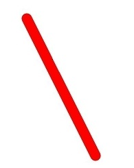 |

## BlurType<sup>12+</sup>

定义蒙版滤镜模糊中操作类型的枚举。

**系统能力：** SystemCapability.Graphics.Drawing

| 名称   | 值 | 说明               | 示意图   |
| ------ | - | ------------------ | -------- |
| NORMAL | 0 | 内外模糊。          | 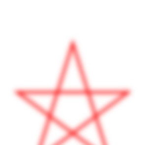 |
| SOLID  | 1 | 内部实体，外部模糊。 | 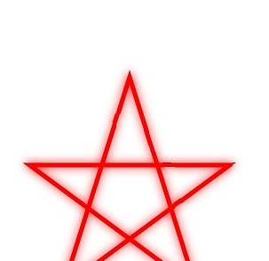 |
| OUTER  | 2 | 内部空白，外部模糊。 |  |
| INNER  | 3 | 内部模糊，外部空白。 | 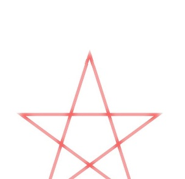 |

## SamplingOptions<sup>12+</sup>

采样选项对象。

### constructor<sup>12+</sup>

constructor()

用于构造一个新的采样选项对象。

**系统能力：** SystemCapability.Graphics.Drawing

**示例：**

```ts
import { RenderNode } from '@kit.ArkUI';
import { common2D, drawing } from '@kit.ArkGraphics2D';
class DrawingRenderNode extends RenderNode {
  draw(context : DrawContext) {
    const canvas = context.canvas;
    const pen = new drawing.Pen();
    let samplingOptions = new drawing.SamplingOptions();
  }
}
```

### constructor<sup>12+</sup>

constructor(filterMode: FilterMode)

用于构造一个新的采样选项对象。

**系统能力：** SystemCapability.Graphics.Drawing

**参数：**

| 参数名     | 类型                   | 必填 | 说明                                 |
| ---------- | --------------------- | ---- | ----------------------------------- |
| filterMode | [FilterMode](#filtermode12)    | 是   | 过滤模式。                    |

**错误码：**

以下错误码的详细介绍请参见[通用错误码](../errorcode-universal.md)。

| 错误码ID | 错误信息 |
| ------- | --------------------------------------------|
| 401 | Parameter error.Possible causes:1.Mandatory parameters are left unspecified;2.Incorrect parameter types. |

**示例：**

```ts
import { RenderNode } from '@kit.ArkUI';
import { common2D, drawing } from '@kit.ArkGraphics2D';
class DrawingRenderNode extends RenderNode {
  draw(context : DrawContext) {
    const canvas = context.canvas;
    let samplingOptions = new drawing.SamplingOptions(drawing.FilterMode.FILTER_MODE_NEAREST);
  }
}
```

## Lattice<sup>12+</sup>

矩形网格对象。该对象用于将图片按照矩形网格进行划分。

### createImageLattice<sup>12+</sup>

static createImageLattice(xDivs: Array\<number>, yDivs: Array\<number>, fXCount: number, fYCount: number, fBounds?: common2D.Rect | null, fRectTypes?: Array\<RectType> | null, fColors?: Array\<common2D.Color> | null): Lattice

创建矩形网格对象。将图像划分为矩形网格，同时处于偶数列和偶数行上的网格是固定的，如果目标网格足够大，则这些固定网格以其原始大小进行绘制。如果目标网格太小，无法容纳这些固定网格，则所有固定网格都会按比例缩小以适应目标网格。其余网格将进行缩放，来适应剩余的空间。

**系统能力：** SystemCapability.Graphics.Drawing

**参数：**

| 参数名       | 类型                                                                | 必填 | 说明                                                                               |
| ------------ | ------------------------------------------------------------------ | ---- | --------------------------------------------------------------------------------- |
| xDivs        | Array\<number>                                                     | 是   | 用于划分图像的X坐标值数组。该参数为整数。                                             |
| yDivs        | Array\<number>                                                     | 是   | 用于划分图像的Y坐标值数组。该参数为整数。                                             |
| fXCount      | number                                                             | 是   | X坐标值数组的大小。基于功能和性能的考虑，取值范围为[0, 5]。                            |
| fYCount      | number                                                             | 是   | Y坐标值数组的大小。基于功能和性能的考虑，取值范围为[0, 5]。                            |
| fBounds      | [common2D.Rect](js-apis-graphics-common2D.md#rect)\|null           | 否   | 可选，要绘制的原始边界矩形，矩形参数须为整数，默认为原始图像矩形大小（若矩形参数为小数，会直接舍弃小数部分，转为整数）。 |
| fRectTypes   | Array\<[RectType](#recttype12)>\|null                              | 否   | 可选，填充网格类型的数组，默认为空。如果设置，大小必须为(fXCount + 1) * (fYCount + 1)。 |
| fColors      | Array\<[common2D.Color](js-apis-graphics-common2D.md#color)>\|null | 否   | 可选，填充网格的颜色数组，默认为空。如果设置，大小必须为(fXCount + 1) * (fYCount + 1)。 |

**返回值：**

| 类型                       | 说明                                |
| ------------------------- | ----------------------------------- |
| [Lattice](#lattice12)     | 返回创建的矩形网格对象。              |

**错误码：**

以下错误码的详细介绍请参见[通用错误码](../errorcode-universal.md)。

| 错误码ID | 错误信息 |
| ------- | --------------------------------------------|
| 401 | Parameter error.Possible causes:1.Mandatory parameters are left unspecified;2.Incorrect parameter types;3.Parameter verification failed. |

**示例：**

```ts
import { RenderNode } from '@kit.ArkUI';
import { drawing } from '@kit.ArkGraphics2D';
class DrawingRenderNode extends RenderNode {
  draw(context : DrawContext) {
    let xDivs : Array<number> = [1, 2, 4];
    let yDivs : Array<number> = [1, 2, 4];
    let lattice = drawing.Lattice.createImageLattice(xDivs, yDivs, 3, 3); // 划分(3+1)*(3+1)的网格，下图蓝色填充矩形为固定网格
  }
}
```


### createImageLattice<sup>18+</sup>

static createImageLattice(xDivs: Array\<number>, yDivs: Array\<number>, fXCount: number, fYCount: number, fBounds?: common2D.Rect | null, fRectTypes?: Array\<RectType> | null, fColors?: Array\<number> | null): Lattice

创建矩形网格对象。将图像划分为矩形网格，同时处于偶数列和偶数行上的网格是固定的，如果目标网格足够大，则这些固定网格以其原始大小进行绘制。如果目标网格太小，无法容纳这些固定网格，则所有固定网格都会按比例缩小以适应目标网格。其余网格将进行缩放，来适应剩余的空间。

**系统能力：** SystemCapability.Graphics.Drawing

**参数：**

| 参数名       | 类型                                                                | 必填 | 说明                                                                               |
| ------------ | ------------------------------------------------------------------ | ---- | --------------------------------------------------------------------------------- |
| xDivs        | Array\<number>                                                     | 是   | 用于划分图像的X坐标值数组。该参数为整数。                                             |
| yDivs        | Array\<number>                                                     | 是   | 用于划分图像的Y坐标值数组。该参数为整数。                                             |
| fXCount      | number                                                             | 是   | X坐标值数组的大小。基于功能和性能的考虑，取值范围为[0, 5]。                            |
| fYCount      | number                                                             | 是   | Y坐标值数组的大小。基于功能和性能的考虑，取值范围为[0, 5]。                            |
| fBounds      | [common2D.Rect](js-apis-graphics-common2D.md#rect)\|null           | 否   | 可选，要绘制的原始边界矩形，矩形参数须为整数，默认为原始图像矩形大小（若矩形参数为小数，会直接舍弃小数部分，转为整数）。 |
| fRectTypes   | Array\<[RectType](#recttype12)>\|null                              | 否   | 可选，填充网格类型的数组，默认为空。如果设置，大小必须为(fXCount + 1) * (fYCount + 1)。 |
| fColors      | Array\<number>\|null | 否   | 可选，填充网格的颜色数组，颜色用16进制ARGB格式的32位无符号整数表示，参数默认为空。如果设置，大小必须为(fXCount + 1) * (fYCount + 1)。 |

**返回值：**

| 类型                       | 说明                                |
| ------------------------- | ----------------------------------- |
| [Lattice](#lattice12)     | 返回创建的矩形网格对象。              |

**错误码：**

以下错误码的详细介绍请参见[通用错误码](../errorcode-universal.md)。

| 错误码ID | 错误信息 |
| ------- | --------------------------------------------|
| 401 | Parameter error.Possible causes:1.Mandatory parameters are left unspecified;2.Incorrect parameter types;3.Parameter verification failed. |

**示例：**

```ts
import { RenderNode } from '@kit.ArkUI';
import { drawing } from '@kit.ArkGraphics2D';
class DrawingRenderNode extends RenderNode {
  draw(context : DrawContext) {
    let xDivs : Array<number> = [1, 2, 4];
    let yDivs : Array<number> = [1, 2, 4];
    let colorArray :Array<number>=[0xffffffff,0x44444444,0x99999999,0xffffffff,0x44444444,0x99999999,0xffffffff,0x44444444,0x99999999,0x44444444,0x99999999,0xffffffff,0x44444444,0x99999999,0xffffffff,0x44444444];
    let lattice = drawing.Lattice.createImageLattice(xDivs, yDivs, 3, 3,null,null,colorArray);
  }
}
```

## RectType<sup>12+</sup>

定义填充网格的矩形类型的枚举。仅在[Lattice](#lattice12)中使用。

**系统能力：** SystemCapability.Graphics.Drawing

| 名称         | 值   | 说明                                                             |
| ------------ | ---- | --------------------------------------------------------------- |
| DEFAULT      | 0    | 将图像绘制到矩形网格中。                                          |
| TRANSPARENT  | 1    | 将矩形网格设置为透明的。                                          |
| FIXEDCOLOR   | 2    | 将[Lattice](#lattice12)中fColors数组的颜色绘制到矩形网格中。       |

## MaskFilter<sup>12+</sup>

蒙版滤镜对象。

### createBlurMaskFilter<sup>12+</sup>

static createBlurMaskFilter(blurType: BlurType, sigma: number): MaskFilter

用于创建具有模糊效果的蒙版滤镜。

**系统能力：** SystemCapability.Graphics.Drawing

**参数：**

| 参数名     | 类型                   | 必填 | 说明                                 |
| ---------- | --------------------- | ---- | ----------------------------------- |
| blurType   | [BlurType](#blurtype12) | 是   | 模糊类型。                           |
| sigma      | number                | 是   | 要应用的高斯模糊的标准偏差，必须为大于0的浮点数。 |

**返回值：**

| 类型                      | 说明                |
| ------------------------- | ------------------ |
| [MaskFilter](#maskfilter12) | 返回创建的蒙版滤镜对象。 |

**错误码：**

以下错误码的详细介绍请参见[通用错误码](../errorcode-universal.md)。

| 错误码ID | 错误信息 |
| ------- | --------------------------------------------|
| 401 | Parameter error.Possible causes:1.Mandatory parameters are left unspecified;2.Incorrect parameter types;3.Parameter verification failed. |

**示例：**

```ts
import { RenderNode } from '@kit.ArkUI';
import { common2D, drawing } from '@kit.ArkGraphics2D';
class DrawingRenderNode extends RenderNode {
  draw(context : DrawContext) {
    const canvas = context.canvas;
    let maskFilter = drawing.MaskFilter.createBlurMaskFilter(drawing.BlurType.OUTER, 10);
  }
}
```

## PathDashStyle<sup>18+</sup>

路径效果的绘制样式枚举。

**系统能力：** SystemCapability.Graphics.Drawing

| 名称   | 值 | 说明               |
| ------ | - | ------------------ |
| TRANSLATE | 0 | 不会随着路径旋转，只会平移。 |
| ROTATE  | 1 | 随着路径的旋转而旋转。 |
| MORPH  | 2 | 随着路径的旋转而旋转，但是在转折处的地方，会拉伸或压缩等增加平滑度。 |

## PathEffect<sup>12+</sup>

路径效果对象。

### createDashPathEffect<sup>12+</sup>

static createDashPathEffect(intervals:  Array\<number>, phase: number): PathEffect

用于创建将路径变为虚线的路径效果对象。

**系统能力：** SystemCapability.Graphics.Drawing

**参数：**

| 参数名     | 类型           | 必填    | 说明                                               |
| ---------- | ------------- | ------- | -------------------------------------------------- |
| intervals  | Array\<number> | 是      | 表示虚线的ON和OFF长度的数组，数组个数必须是偶数，且>=2，该参数为正整数。|
| phase      | number         | 是      | 绘制时的偏移量，该参数为浮点数。                                     |

**返回值：**

| 类型                      | 说明                   |
| ------------------------- | --------------------- |
| [PathEffect](#patheffect12) | 返回创建的路径效果对象。 |

**错误码：**

以下错误码的详细介绍请参见[通用错误码](../errorcode-universal.md)。

| 错误码ID | 错误信息 |
| ------- | --------------------------------------------|
| 401 | Parameter error.Possible causes:1.Mandatory parameters are left unspecified;2.Incorrect parameter types;3.Parameter verification failed. |

**示例：**

```ts
import { RenderNode } from '@kit.ArkUI';
import { common2D, drawing } from '@kit.ArkGraphics2D';
class DrawingRenderNode extends RenderNode {
  draw(context : DrawContext) {
    const canvas = context.canvas;
    let intervals = [10, 5];
    let effect = drawing.PathEffect.createDashPathEffect(intervals, 5);
  }
}
```

### createPathDashEffect<sup>18+</sup>

static createPathDashEffect(path: Path, advance: number, phase: number, style: PathDashStyle): PathEffect

通过路径描述的形状创建一个虚线路径效果。

**系统能力：** SystemCapability.Graphics.Drawing

**参数：**

| 参数名     | 类型           | 必填    | 说明                                               |
| ---------- | ------------- | ------- | -------------------------------------------------- |
| path  | [Path](#path) | 是 | 通过该路径生成一个图形，用来填充每个虚线段。|
| advance | number | 是 | 虚线段的步长，该参数为大于0的浮点数，否则会抛错误码。 |
| phase | number | 是 | 表示虚线段内图形在虚线步长范围内的偏移量，该参数为浮点数，效果为先对偏移量取绝对值，然后对步长取模。 |
| style | [PathDashStyle](#pathdashstyle18) | 是 | 指定虚线效果的样式。 |

**返回值：**

| 类型                      | 说明                   |
| ------------------------- | --------------------- |
| [PathEffect](#patheffect12) | 返回创建的路径效果对象。 |

**错误码：**

以下错误码的详细介绍请参见[通用错误码](../errorcode-universal.md)。

| 错误码ID | 错误信息 |
| ------- | --------------------------------------------|
| 401 | Parameter error.Possible causes:1.Mandatory parameters are left unspecified;2.Incorrect parameter types;3. Parameter verification failed. |

**示例：**

```ts
import { RenderNode } from '@kit.ArkUI';
import { common2D, drawing } from '@kit.ArkGraphics2D';
class DrawingRenderNode extends RenderNode {
  draw(context : DrawContext) {
    const canvas = context.canvas;
    let pen = new drawing.Pen();
    const penColor: common2D.Color = { alpha: 255, red: 255, green: 0, blue: 0 }
    pen.setColor(penColor);
    pen.setStrokeWidth(10);
    canvas.attachPen(pen);
    pen.setAntiAlias(true);

    const path = new drawing.Path();
    path.moveTo(100, 100);
    path.lineTo(150, 50);
    path.lineTo(200, 100);

    const path1 = new drawing.Path();
    path1.moveTo(0, 0);
    path1.lineTo(10, 0);
    path1.lineTo(20, 10);
    path1.lineTo(0,10);

    let pathEffect1: drawing.PathEffect = drawing.PathEffect.createPathDashEffect(path1, 50, -30,
        drawing.PathDashStyle.MORPH);
    pen.setPathEffect(pathEffect1);

    canvas.attachPen(pen);
    canvas.drawPath(path);
    canvas.detachPen();
  }
}
```

### createSumPathEffect<sup>18+</sup>

static createSumPathEffect(firstPathEffect: PathEffect, secondPathEffect: PathEffect): PathEffect

通过两种路径效果创建一个叠加的路径效果。与createComposePathEffect不同的是，会分别对两个参数的效果各自独立进行表现，然后将两个效果简单的重叠在一起显示出来。

**系统能力：** SystemCapability.Graphics.Drawing

**参数：**

| 参数名     | 类型           | 必填    | 说明                                               |
| ---------- | ------------- | ------- | -------------------------------------------------- |
| firstPathEffect | [PathEffect](#patheffect12) | 是 | 表示第一个路径效果。 |
| secondPathEffect | [PathEffect](#patheffect12) | 是 | 表示第二个路径效果。 |

**返回值：**

| 类型                      | 说明                   |
| ------------------------- | --------------------- |
| [PathEffect](#patheffect12) | 返回创建的路径效果对象。 |

**错误码：**

以下错误码的详细介绍请参见[通用错误码](../errorcode-universal.md)。

| 错误码ID | 错误信息 |
| ------- | --------------------------------------------|
| 401 | Parameter error.Possible causes:1.Mandatory parameters are left unspecified;2.Incorrect parameter types. |

**示例：**

```ts
import { RenderNode } from '@kit.ArkUI';
import { drawing } from '@kit.ArkGraphics2D';
class DrawingRenderNode extends RenderNode {
  draw(context : DrawContext) {
    const canvas = context.canvas;
    let intervals = [10, 5];
    let pathEffectOne = drawing.PathEffect.createDashPathEffect(intervals, 5);
    let pathEffectTwo = drawing.PathEffect.createDashPathEffect(intervals, 10);
    let effect = drawing.PathEffect.createSumPathEffect(pathEffectOne, pathEffectTwo);
  }
}
```

### createCornerPathEffect<sup>12+</sup>

static createCornerPathEffect(radius: number): PathEffect

用于创建将路径的夹角变成指定半径的圆角的路径效果对象。

**系统能力：** SystemCapability.Graphics.Drawing

**参数：**

| 参数名     | 类型           | 必填    | 说明                                               |
| ---------- | ------------- | ------- | -------------------------------------------------- |
| radius     | number        | 是      | 圆角的半径，必须大于0，该参数为浮点数。                |

**返回值：**

| 类型                      | 说明                   |
| ------------------------- | --------------------- |
| [PathEffect](#patheffect12) | 返回创建的路径效果对象。 |

**错误码：**

以下错误码的详细介绍请参见[通用错误码](../errorcode-universal.md)。

| 错误码ID | 错误信息 |
| ------- | --------------------------------------------|
| 401 | Parameter error.Possible causes:1.Mandatory parameters are left unspecified;2.Incorrect parameter types;3.Parameter verification failed. |

**示例：**

```ts
import { RenderNode } from '@kit.ArkUI';
import { drawing } from '@kit.ArkGraphics2D';
class DrawingRenderNode extends RenderNode {
  draw(context : DrawContext) {
    const canvas = context.canvas;
    let effect = drawing.PathEffect.createCornerPathEffect(30);
  }
}
```

### createDiscretePathEffect<sup>18+</sup>

static createDiscretePathEffect(segLength: number, dev: number, seedAssist?: number): PathEffect

创建一种将路径打散，并且在路径上产生不规则分布的效果。

**系统能力：** SystemCapability.Graphics.Drawing

**参数：**

| 参数名     | 类型           | 必填    | 说明                                               |
| ---------- | ------------- | ------- | -------------------------------------------------- |
| segLength  | number        | 是      | 路径中每进行一次打散操作的长度，该长度为浮点数，负数和0时无效果。 |
| dev        | number        | 是      | 绘制时的末端点的最大移动偏离量，该偏移量为浮点数。 |
| seedAssist | number        | 否      | 生成效果伪随机种子辅助变量，默认值为0，该参数为32位无符号整数。 |

**返回值：**

| 类型                      | 说明                   |
| ------------------------- | --------------------- |
| [PathEffect](#patheffect12) | 返回创建的路径效果对象。 |

**错误码：**

以下错误码的详细介绍请参见[通用错误码](../errorcode-universal.md)。

| 错误码ID | 错误信息 |
| ------- | --------------------------------------------|
| 401 | Parameter error.Possible causes:1.Mandatory parameters are left unspecified;2.Incorrect parameter types. |

**示例：**

```ts
import { RenderNode } from '@kit.ArkUI';
import { drawing } from '@kit.ArkGraphics2D';
class DrawingRenderNode extends RenderNode {
  draw(context : DrawContext) {
    const canvas = context.canvas;
    let effect = drawing.PathEffect.createDiscretePathEffect(100, -50, 0);
  }
}
```

### createComposePathEffect<sup>18+</sup>

static createComposePathEffect(outer: PathEffect, inner: PathEffect): PathEffect

创建路径组合的路径效果对象，首先应用内部路径效果，然后应用外部路径效果。

**系统能力：** SystemCapability.Graphics.Drawing

**参数：**

| 参数名 | 类型                        | 必填 | 说明                             |
| ------ | --------------------------- | ---- | -------------------------------- |
| outer  | [PathEffect](#patheffect12) | 是   | 组合路径效果中外部路径效果。 |
| inner  | [PathEffect](#patheffect12) | 是   | 组合路径效果中内部路径效果。 |

**返回值：**

| 类型                      | 说明                   |
| ------------------------- | --------------------- |
| [PathEffect](#patheffect12) | 返回创建的路径效果对象。 |

**错误码：**

以下错误码的详细介绍请参见[通用错误码](../errorcode-universal.md)。

| 错误码ID | 错误信息 |
| ------- | --------------------------------------------|
| 401 | Parameter error.Possible causes:1.Mandatory parameters are left unspecified;2.Incorrect parameter types. |

**示例：**

```ts
import { RenderNode } from '@kit.ArkUI';
import { drawing } from '@kit.ArkGraphics2D';
class DrawingRenderNode extends RenderNode {
  draw(context : DrawContext) {
    const canvas = context.canvas;
    let pathEffect1 = drawing.PathEffect.createCornerPathEffect(100);
    let pathEffect2 = drawing.PathEffect.createCornerPathEffect(10);
    let effect = drawing.PathEffect.createComposePathEffect(pathEffect1, pathEffect2);
  }
}
```

## ShadowLayer<sup>12+</sup>

阴影层对象。

### create<sup>12+</sup>

static create(blurRadius: number, x: number, y: number, color: common2D.Color): ShadowLayer

用于创建一个阴影层对象。

**系统能力：** SystemCapability.Graphics.Drawing

**参数：**

| 参数名     | 类型      | 必填 | 说明                                 |
| ---------- | -------- | ---- | ----------------------------------- |
| blurRadius  | number   | 是   | 阴影的半径，必须为大于零的浮点数。     |
| x           | number   | 是   | x轴上的偏移点，该参数为浮点数。        |
| y           | number   | 是   | Y轴上的偏移点，该参数为浮点数。        |
| color       | [common2D.Color](js-apis-graphics-common2D.md#color) | 是   | ARGB格式的颜色，每个颜色通道是0到255之间的整数。 |

**返回值：**

| 类型                        | 说明                  |
| --------------------------- | -------------------- |
| [ShadowLayer](#shadowlayer12) | 返回创建的阴影层对象。 |

**错误码：**

以下错误码的详细介绍请参见[通用错误码](../errorcode-universal.md)。

| 错误码ID | 错误信息 |
| ------- | --------------------------------------------|
| 401 | Parameter error.Possible causes:1.Mandatory parameters are left unspecified;2.Incorrect parameter types;3.Parameter verification failed. |

**示例：**

```ts
import { RenderNode } from '@kit.ArkUI';
import { common2D, drawing } from '@kit.ArkGraphics2D';
class DrawingRenderNode extends RenderNode {
  draw(context : DrawContext) {
    const canvas = context.canvas;
    let color : common2D.Color = {alpha: 0xFF, red: 0x00, green: 0xFF, blue: 0x00};
    let shadowLayer = drawing.ShadowLayer.create(3, -3, 3, color);
  }
}
```

### create<sup>18+</sup>

static create(blurRadius: number, x: number, y: number, color: common2D.Color | number): ShadowLayer

用于创建一个阴影层对象。

**系统能力：** SystemCapability.Graphics.Drawing

**参数：**

| 参数名     | 类型      | 必填 | 说明                                 |
| ---------- | -------- | ---- | ----------------------------------- |
| blurRadius  | number   | 是   | 阴影的半径，必须为大于零的浮点数。     |
| x           | number   | 是   | x轴上的偏移点，该参数为浮点数。        |
| y           | number   | 是   | Y轴上的偏移点，该参数为浮点数。        |
| color       | [common2D.Color](js-apis-graphics-common2D.md#color) \| number   | 是   | 颜色，可以用16进制ARGB格式的无符号整数表示。  |

**返回值：**

| 类型                        | 说明                  |
| --------------------------- | -------------------- |
| [ShadowLayer](#shadowlayer12) | 返回创建的阴影层对象。 |

**错误码：**

以下错误码的详细介绍请参见[通用错误码](../errorcode-universal.md)。

| 错误码ID | 错误信息 |
| ------- | --------------------------------------------|
| 401 | Parameter error.Possible causes:1.Mandatory parameters are left unspecified;2.Incorrect parameter types;3.Parameter verification failed. |

**示例：**

```ts
import { RenderNode } from '@kit.ArkUI';
import { drawing } from '@kit.ArkGraphics2D';
class DrawingRenderNode extends RenderNode {
  draw(context : DrawContext) {
    const canvas = context.canvas;
    let shadowLayer = drawing.ShadowLayer.create(3, -3, 3, 0xff00ff00);
  }
}
```

## Pen

画笔对象，描述所绘制图形形状的轮廓信息。

### constructor<sup>12+</sup>

constructor()

构造一个新的画笔对象。

**系统能力：** SystemCapability.Graphics.Drawing

**示例：**

```ts
import { drawing } from '@kit.ArkGraphics2D';

const pen = new drawing.Pen();
```

### constructor<sup>12+</sup>

constructor(pen: Pen)

复制构造一个新的画笔对象。

**系统能力：** SystemCapability.Graphics.Drawing

**参数：**

| 参数名 | 类型        | 必填 | 说明              |
| ------| ----------- | ---- | ---------------- |
| pen     | [Pen](#pen) | 是   | 待复制的画笔对象。 |

**错误码：**

以下错误码的详细介绍请参见[通用错误码](../errorcode-universal.md)。

| 错误码ID | 错误信息 |
| ------- | --------------------------------------------|
| 401 | Parameter error.Possible causes:1.Mandatory parameters are left unspecified;2.Incorrect parameter types. |

**示例：**

```ts
import { common2D, drawing } from '@kit.ArkGraphics2D';

const pen = new drawing.Pen();
const penColor: common2D.Color = { alpha: 255, red: 0, green: 255, blue: 0 };
pen.setColor(penColor);
pen.setStrokeWidth(10);
const newPen = new drawing.Pen(pen);
```

### setMiterLimit<sup>12+</sup>

setMiterLimit(miter: number): void

设置折线尖角长度与线宽的最大比值，当画笔绘制一条折线，并且[JoinStyle](#joinstyle12)为MITER_JOIN时，若尖角长度与线宽的比值大于限制值，则该折角使用BEVEL_JOIN绘制。

**系统能力：** SystemCapability.Graphics.Drawing

**参数：**

| 参数名 | 类型    | 必填 | 说明              |
| ------ | ------ | ---- | ---------------- |
| miter  | number | 是   | 折线尖角长度与线宽的最大比值，负数在绘制时会被视作4.0处理，非负数正常生效，该参数为浮点数。 |

**错误码：**

以下错误码的详细介绍请参见[通用错误码](../errorcode-universal.md)。

| 错误码ID | 错误信息 |
| ------- | --------------------------------------------|
| 401 | Parameter error.Possible causes:1.Mandatory parameters are left unspecified;2.Incorrect parameter types. |

**示例：**

```ts
import { drawing } from '@kit.ArkGraphics2D';

const pen = new drawing.Pen();
pen.setMiterLimit(5);
```

### getMiterLimit<sup>12+</sup>

getMiterLimit(): number

获取折线尖角的限制值。

**系统能力：** SystemCapability.Graphics.Drawing

**返回值：**

| 类型   | 说明                 |
| -------| -------------------- |
| number | 返回折线尖角长度与线宽的最大比值。 |

**示例：**

```ts
import { drawing } from '@kit.ArkGraphics2D';

const pen = new drawing.Pen();
let miter = pen.getMiterLimit();
```

### setImageFilter<sup>12+</sup>

setImageFilter(filter: ImageFilter | null): void

为画笔设置图像滤波器。

**系统能力：** SystemCapability.Graphics.Drawing

**参数：**

| 参数名 | 类型   | 必填 | 说明                    |
| ------ | ------ | ---- | ----------------------- |
| filter    | [ImageFilter](#imagefilter12) \| null | 是   |  图像滤波器，为null表示清空画笔的图像滤波器效果。 |

**错误码：**

以下错误码的详细介绍请参见[通用错误码](../errorcode-universal.md)。

| 错误码ID | 错误信息 |
| ------- | --------------------------------------------|
| 401 | Parameter error. Possible causes: 1. Mandatory parameters are left unspecified;2. Incorrect parameter types. |

**示例：**

```ts
import {drawing} from '@kit.ArkGraphics2D';
let colorfilter = drawing.ColorFilter.createSRGBGammaToLinear();
let imgFilter = drawing.ImageFilter.createFromColorFilter(colorfilter);
let pen = new drawing.Pen();
pen.setImageFilter(imgFilter);
pen.setImageFilter(null);
```

### getColorFilter<sup>12+</sup>

getColorFilter(): ColorFilter

获取画笔的颜色滤波器。

**系统能力：** SystemCapability.Graphics.Drawing

**返回值：**

| 类型                        | 说明               |
| --------------------------- | ------------------ |
| [ColorFilter](#colorfilter) | 返回一个颜色滤波器。 |

**示例：**

```ts 
import {drawing} from '@kit.ArkGraphics2D';
let pen = new drawing.Pen();
let colorfilter = drawing.ColorFilter.createLumaColorFilter();
pen.setColorFilter(colorfilter);
let filter = pen.getColorFilter();
```

### setColor

setColor(color: common2D.Color) : void

用于设置画笔的颜色。

**系统能力：** SystemCapability.Graphics.Drawing

**参数：**

| 参数名 | 类型                                                 | 必填 | 说明             |
| ------ | ---------------------------------------------------- | ---- | ---------------- |
| color  | [common2D.Color](js-apis-graphics-common2D.md#color) | 是   | ARGB格式的颜色，每个颜色通道是0到255之间的整数。 |

**错误码：**

以下错误码的详细介绍请参见[通用错误码](../errorcode-universal.md)。

| 错误码ID | 错误信息 |
| ------- | --------------------------------------------|
| 401 | Parameter error.Possible causes:1.Mandatory parameters are left unspecified;2.Incorrect parameter types;3.Parameter verification failed. |

**示例：**

```ts
import { common2D, drawing } from '@kit.ArkGraphics2D';
const color : common2D.Color = { alpha: 255, red: 255, green: 0, blue: 0 };
const pen = new drawing.Pen();
pen.setColor(color);
```

### setColor<sup>12+</sup>

setColor(alpha: number, red: number, green: number, blue: number): void

用于设置画笔的颜色。性能优于[setColor](#setcolor)接口，推荐使用本接口。

**系统能力：** SystemCapability.Graphics.Drawing

**参数：**

| 参数名 | 类型    | 必填 | 说明                                                |
| ------ | ------ | ---- | -------------------------------------------------- |
| alpha  | number | 是   | ARGB格式颜色的透明度通道值，该参数是0到255之间的整数，传入范围内的浮点数会向下取整。 |
| red    | number | 是   | ARGB格式颜色的红色通道值，该参数是0到255之间的整数，传入范围内的浮点数会向下取整。   |
| green  | number | 是   | ARGB格式颜色的绿色通道值，该参数是0到255之间的整数，传入范围内的浮点数会向下取整。   |
| blue   | number | 是   | ARGB格式颜色的蓝色通道值，该参数是0到255之间的整数，传入范围内的浮点数会向下取整。   |

**错误码：**

以下错误码的详细介绍请参见[通用错误码](../errorcode-universal.md)。

| 错误码ID | 错误信息 |
| ------- | --------------------------------------------|
| 401 | Parameter error.Possible causes:1.Mandatory parameters are left unspecified;2.Incorrect parameter types. |

**示例：**

```ts
import { drawing } from '@kit.ArkGraphics2D';
const pen = new drawing.Pen();
pen.setColor(255, 255, 0, 0);
```

### setColor<sup>18+</sup>

setColor(color: number) : void

用于设置画笔的颜色。

**系统能力：** SystemCapability.Graphics.Drawing

**参数：**

| 参数名 | 类型                                                 | 必填 | 说明             |
| ------ | ---------------------------------------------------- | ---- | ---------------- |
| color  | number | 是   | 16进制ARGB格式的颜色。 |

**错误码：**

以下错误码的详细介绍请参见[通用错误码](../errorcode-universal.md)。

| 错误码ID | 错误信息 |
| ------- | --------------------------------------------|
| 401 | Parameter error.Possible causes:1.Mandatory parameters are left unspecified;2.Incorrect parameter types. |

**示例：**

```ts
import { drawing } from '@kit.ArkGraphics2D';
const pen = new drawing.Pen();
pen.setColor(0xffff0000);
```

### getColor<sup>12+</sup>

getColor(): common2D.Color

获取画笔的颜色。

**系统能力：** SystemCapability.Graphics.Drawing

**返回值：**

| 类型           | 说明            |
| -------------- | -------------- |
| common2D.Color | 返回画笔的颜色。 |

**示例：**

```ts
import { common2D, drawing } from '@kit.ArkGraphics2D';

const color : common2D.Color = { alpha: 255, red: 255, green: 0, blue: 0 };
const pen = new drawing.Pen();
pen.setColor(color);
let colorGet = pen.getColor();
```

### getHexColor<sup>18+</sup>

getHexColor(): number

获取画笔的颜色。

**系统能力：** SystemCapability.Graphics.Drawing

**返回值：**

| 类型           | 说明            |
| -------------- | -------------- |
| number | 返回画笔的颜色，以16进制ARGB格式的32位无符号整数表示。 |

**示例：**

```ts
import { common2D, drawing } from '@kit.ArkGraphics2D';

let color : common2D.Color = { alpha: 255, red: 255, green: 0, blue: 0 };
let pen = new drawing.Pen();
pen.setColor(color);
let hex_color: number = pen.getHexColor();
console.info('getHexColor: ', hex_color.toString(16));
```

### setStrokeWidth

setStrokeWidth(width: number) : void

用于设置画笔的线宽。0线宽被视作特殊的极细线宽，在绘制时始终会被绘制为1像素，不随画布的缩放而改变；负数线宽在实际绘制时会被视作0线宽。

**系统能力：** SystemCapability.Graphics.Drawing

**参数：**

| 参数名 | 类型   | 必填 | 说明             |
| ------ | ------ | ---- | ---------------- |
| width  | number | 是   | 表示线宽，该参数为浮点数。 |

**错误码：**

以下错误码的详细介绍请参见[通用错误码](../errorcode-universal.md)。

| 错误码ID | 错误信息 |
| ------- | --------------------------------------------|
| 401 | Parameter error.Possible causes:1.Mandatory parameters are left unspecified;2.Incorrect parameter types. |

**示例：**

```ts
import { drawing } from '@kit.ArkGraphics2D';
const pen = new drawing.Pen();
pen.setStrokeWidth(5);
```

### getWidth<sup>12+</sup>

getWidth(): number

获取画笔的线宽属性，线宽描述了画笔绘制图形轮廓的宽度。

**系统能力：** SystemCapability.Graphics.Drawing

**返回值：**

| 类型   | 说明            |
| ------ | -------------- |
| number | 返回画笔的线宽。 |

**示例：**

```ts
import { drawing } from '@kit.ArkGraphics2D';

const pen = new drawing.Pen();
let width = pen.getWidth();
```

### setAntiAlias

setAntiAlias(aa: boolean) : void

用于设置画笔是否开启抗锯齿。开启后，可以使得图形的边缘在显示时更平滑。

**系统能力：** SystemCapability.Graphics.Drawing

**参数：**

| 参数名 | 类型    | 必填 | 说明                                              |
| ------ | ------- | ---- | ------------------------------------------------- |
| aa     | boolean | 是   | 表示是否开启抗锯齿。true表示开启，false表示关闭。 |

**错误码：**

以下错误码的详细介绍请参见[通用错误码](../errorcode-universal.md)。

| 错误码ID | 错误信息 |
| ------- | --------------------------------------------|
| 401 | Parameter error.Possible causes:1.Mandatory parameters are left unspecified;2.Incorrect parameter types. |

**示例：**

```ts
import { drawing } from '@kit.ArkGraphics2D';
const pen = new drawing.Pen();
pen.setAntiAlias(true);
```

### isAntiAlias<sup>12+</sup>

isAntiAlias(): boolean

获取画笔是否开启抗锯齿属性。

**系统能力：** SystemCapability.Graphics.Drawing

**返回值：**

| 类型    | 说明                       |
| ------- | ------------------------- |
| boolean | 返回画笔是否开启抗锯齿属性，true表示开启抗锯齿属性，false表示关闭抗锯齿属性。 |

**示例：**

```ts
import { drawing } from '@kit.ArkGraphics2D';

const pen = new drawing.Pen();
let isAntiAlias = pen.isAntiAlias();
```

### setAlpha

setAlpha(alpha: number) : void

用于设置画笔的透明度。

**系统能力：** SystemCapability.Graphics.Drawing

**参数：**

| 参数名 | 类型   | 必填 | 说明                                     |
| ------ | ------ | ---- | ---------------------------------------- |
| alpha  | number | 是   | 用于表示透明度的[0, 255]区间内的整数值，传入浮点类型时向下取整。 |

**错误码：**

以下错误码的详细介绍请参见[通用错误码](../errorcode-universal.md)。

| 错误码ID | 错误信息 |
| ------- | --------------------------------------------|
| 401 | Parameter error.Possible causes:1.Mandatory parameters are left unspecified;2.Incorrect parameter types;3.Parameter verification failed. |

**示例：**

```ts
import { drawing } from '@kit.ArkGraphics2D';
const pen = new drawing.Pen();
pen.setAlpha(128);
```

### getAlpha<sup>12+</sup>

getAlpha(): number

获取画笔的透明度。

**系统能力：** SystemCapability.Graphics.Drawing

**返回值：**

| 类型   | 说明              |
| ------ | ---------------- |
| number | 返回画笔的透明度，该返回值为0到255之间的整数。 |

**示例：**

```ts
import { drawing } from '@kit.ArkGraphics2D';

const pen = new drawing.Pen();
let alpha = pen.getAlpha();
```

### setColorFilter

setColorFilter(filter: ColorFilter) : void

用于给画笔添加额外的颜色滤波器。

**系统能力：** SystemCapability.Graphics.Drawing

**参数：**

| 参数名 | 类型                        | 必填 | 说明         |
| ------ | --------------------------- | ---- | ------------ |
| filter | [ColorFilter](#colorfilter) | 是   | 颜色滤波器。为null时表示清空颜色滤波器。 |

**错误码：**

以下错误码的详细介绍请参见[通用错误码](../errorcode-universal.md)。

| 错误码ID | 错误信息 |
| ------- | --------------------------------------------|
| 401 | Parameter error.Possible causes:1.Mandatory parameters are left unspecified;2.Incorrect parameter types. |

**示例：**

```ts
import { drawing } from '@kit.ArkGraphics2D';
const pen = new drawing.Pen();
let colorFilter = drawing.ColorFilter.createLinearToSRGBGamma();
pen.setColorFilter(colorFilter);
```

### setMaskFilter<sup>12+</sup>

setMaskFilter(filter: MaskFilter): void

用于给画笔添加额外的蒙版滤镜。

**系统能力：** SystemCapability.Graphics.Drawing

**参数：**

| 参数名 | 类型                       | 必填 | 说明      |
| ------ | ------------------------- | ---- | --------- |
| filter | [MaskFilter](#maskfilter12) | 是   | 蒙版滤镜。为null时表示清空蒙版滤镜。 |

**错误码：**

以下错误码的详细介绍请参见[通用错误码](../errorcode-universal.md)。

| 错误码ID | 错误信息 |
| ------- | --------------------------------------------|
| 401 | Parameter error.Possible causes:1.Mandatory parameters are left unspecified;2.Incorrect parameter types. |

**示例：**

```ts
import { RenderNode } from '@kit.ArkUI';
import { common2D, drawing } from '@kit.ArkGraphics2D';
class DrawingRenderNode extends RenderNode {
  draw(context : DrawContext) {
    const canvas = context.canvas;
    const pen = new drawing.Pen();
    pen.setStrokeWidth(5);
    pen.setColor({alpha: 255, red: 255, green: 0, blue: 0});
    let maskFilter = drawing.MaskFilter.createBlurMaskFilter(drawing.BlurType.OUTER, 10);
    pen.setMaskFilter(maskFilter);
  }
}
```

### setPathEffect<sup>12+</sup>

setPathEffect(effect: PathEffect): void

设置画笔路径效果。

**系统能力：** SystemCapability.Graphics.Drawing

**参数：**

| 参数名  | 类型                       | 必填 | 说明         |
| ------- | ------------------------- | ---- | ------------ |
| effect  | [PathEffect](#patheffect12) | 是   | 路径效果对象。为null时表示清空路径效果。 |

**错误码：**

以下错误码的详细介绍请参见[通用错误码](../errorcode-universal.md)。

| 错误码ID | 错误信息 |
| ------- | --------------------------------------------|
| 401 | Parameter error.Possible causes:1.Mandatory parameters are left unspecified;2.Incorrect parameter types. |

**示例：**

```ts
import { RenderNode } from '@kit.ArkUI';
import { common2D, drawing } from '@kit.ArkGraphics2D';
class DrawingRenderNode extends RenderNode {
  draw(context : DrawContext) {
    const canvas = context.canvas;
    const pen = new drawing.Pen();
    pen.setStrokeWidth(5);
    pen.setColor({alpha: 255, red: 255, green: 0, blue: 0});
    let pathEffect = drawing.PathEffect.createDashPathEffect([30, 10], 0);
    pen.setPathEffect(pathEffect);
  }
}
```

### setShaderEffect<sup>12+</sup>

setShaderEffect(shaderEffect: ShaderEffect): void

设置画笔着色器效果。

**系统能力：** SystemCapability.Graphics.Drawing

**参数：**

| 参数名  | 类型                       | 必填 | 说明         |
| ------- | ------------------------- | ---- | ------------ |
| shaderEffect  | [ShaderEffect](#shadereffect12) | 是   | 着色器对象。为null时表示清空着色器效果。 |

**错误码：**

以下错误码的详细介绍请参见[通用错误码](../errorcode-universal.md)。

| 错误码ID | 错误信息 |
| ------- | --------------------------------------------|
| 401 | Parameter error.Possible causes:1.Mandatory parameters are left unspecified;2.Incorrect parameter types. |

**示例：**

```ts
import { drawing } from '@kit.ArkGraphics2D';

const pen = new drawing.Pen();
let shaderEffect = drawing.ShaderEffect.createLinearGradient({x: 100, y: 100}, {x: 300, y: 300}, [0xFF00FF00, 0xFFFF0000], drawing.TileMode.REPEAT);
pen.setShaderEffect(shaderEffect);
```

### setShadowLayer<sup>12+</sup>

setShadowLayer(shadowLayer: ShadowLayer): void

设置画笔阴影层效果。当前仅在绘制文字时生效。

**系统能力：** SystemCapability.Graphics.Drawing

**参数：**

| 参数名  | 类型                       | 必填 | 说明      |
| ------- | ------------------------- | ---- | --------- |
| shadowLayer  | [ShadowLayer](#shadowlayer12) | 是   | 阴影层对象。为null时表示清空阴影层效果。 |

**错误码：**

以下错误码的详细介绍请参见[通用错误码](../errorcode-universal.md)。

| 错误码ID | 错误信息 |
| ------- | --------------------------------------------|
| 401 | Parameter error.Possible causes:1.Mandatory parameters are left unspecified;2.Incorrect parameter types. |

**示例：**

```ts
import { RenderNode } from '@kit.ArkUI';
import { common2D, drawing } from '@kit.ArkGraphics2D';
class DrawingRenderNode extends RenderNode {
  draw(context : DrawContext) {
    const canvas = context.canvas;
    let font = new drawing.Font();
    font.setSize(60);
    let textBlob = drawing.TextBlob.makeFromString("hello", font, drawing.TextEncoding.TEXT_ENCODING_UTF8);
    let pen = new drawing.Pen();
    pen.setStrokeWidth(2.0);
    let pen_color : common2D.Color = {alpha: 0xFF, red: 0xFF, green: 0x00, blue: 0x00};
    pen.setColor(pen_color);
    canvas.attachPen(pen);
    canvas.drawTextBlob(textBlob, 100, 100);
    canvas.detachPen();
    let color : common2D.Color = {alpha: 0xFF, red: 0x00, green: 0xFF, blue: 0x00};
    let shadowLayer = drawing.ShadowLayer.create(3, -3, 3, color);
    pen.setShadowLayer(shadowLayer);
    canvas.attachPen(pen);
    canvas.drawTextBlob(textBlob, 100, 200);
    canvas.detachPen();
  }
}
```

### setBlendMode

setBlendMode(mode: BlendMode) : void

用于设置画笔的混合模式。

**系统能力：** SystemCapability.Graphics.Drawing

**参数：**

| 参数名 | 类型                    | 必填 | 说明             |
| ------ | ----------------------- | ---- | ---------------- |
| mode   | [BlendMode](#blendmode) | 是   | 颜色的混合模式。 |

**错误码：**

以下错误码的详细介绍请参见[通用错误码](../errorcode-universal.md)。

| 错误码ID | 错误信息 |
| ------- | --------------------------------------------|
| 401 | Parameter error.Possible causes:1.Mandatory parameters are left unspecified;2.Incorrect parameter types;3.Parameter verification failed. |

**示例：**

```ts
import { drawing } from '@kit.ArkGraphics2D';
const pen = new drawing.Pen();
pen.setBlendMode(drawing.BlendMode.SRC);
```

### setJoinStyle<sup>12+</sup>

setJoinStyle(style: JoinStyle): void

用于设置画笔绘制转角的样式。

**系统能力：** SystemCapability.Graphics.Drawing

**参数：**

| 参数名 | 类型                     | 必填 | 说明             |
| ------ | ----------------------- | ---- | --------------- |
| style  | [JoinStyle](#joinstyle12) | 是   | 折线转角样式。     |

**错误码：**

以下错误码的详细介绍请参见[通用错误码](../errorcode-universal.md)。

| 错误码ID | 错误信息 |
| ------- | --------------------------------------------|
| 401 | Parameter error.Possible causes:1.Mandatory parameters are left unspecified;2.Incorrect parameter types;3.Parameter verification failed. |

**示例：**

```ts
import { RenderNode } from '@kit.ArkUI';
import { common2D, drawing } from '@kit.ArkGraphics2D';
class DrawingRenderNode extends RenderNode {
  draw(context : DrawContext) {
    const canvas = context.canvas;
    const pen = new drawing.Pen();
    pen.setStrokeWidth(5);
    pen.setColor({alpha: 255, red: 255, green: 0, blue: 0});
    pen.setJoinStyle(drawing.JoinStyle.ROUND_JOIN);
  }
}
```

### getJoinStyle<sup>12+</sup>

getJoinStyle(): JoinStyle

用于获取画笔绘制转角的样式。

**系统能力：** SystemCapability.Graphics.Drawing

**返回值：**

| 类型          | 说明                    |
| ------------- | ---------------------- |
| JoinStyle | 返回折线转角的样式。         |

**示例：**

```ts
import { RenderNode } from '@kit.ArkUI';
import { common2D, drawing } from '@kit.ArkGraphics2D';
class DrawingRenderNode extends RenderNode {
  draw(context : DrawContext) {
    const canvas = context.canvas;
    const pen = new drawing.Pen();
    pen.setStrokeWidth(5);
    pen.setColor({alpha: 255, red: 255, green: 0, blue: 0});
    pen.setJoinStyle(drawing.JoinStyle.ROUND_JOIN);
    let joinStyle = pen.getJoinStyle();
  }
}
```

### setCapStyle<sup>12+</sup>

setCapStyle(style: CapStyle): void

用于设置线帽样式。

**系统能力：** SystemCapability.Graphics.Drawing

**参数：**

| 参数名 | 类型                     | 必填 | 说明                   |
| ------ | ----------------------- | ---- | --------------------- |
| style  | [CapStyle](#capstyle12)   | 是   | 描述线帽样式的变量。    |

**错误码：**

以下错误码的详细介绍请参见[通用错误码](../errorcode-universal.md)。

| 错误码ID | 错误信息 |
| ------- | --------------------------------------------|
| 401 | Parameter error.Possible causes:1.Mandatory parameters are left unspecified;2.Incorrect parameter types;3.Parameter verification failed. |

**示例：**

```ts
import { RenderNode } from '@kit.ArkUI';
import { common2D, drawing } from '@kit.ArkGraphics2D';
class DrawingRenderNode extends RenderNode {
  draw(context : DrawContext) {
    const canvas = context.canvas;
    const pen = new drawing.Pen();
    pen.setStrokeWidth(5);
    pen.setColor({alpha: 255, red: 255, green: 0, blue: 0});
    pen.setCapStyle(drawing.CapStyle.SQUARE_CAP);
  }
}
```

### getCapStyle<sup>12+</sup>

getCapStyle(): CapStyle

用于获取画笔的线帽样式。

**系统能力：** SystemCapability.Graphics.Drawing

**返回值：**

| 类型         | 说明                |
| ------------ | ------------------ |
| CapStyle     | 返回画笔的线帽样式。 |

**示例：**

```ts
import { RenderNode } from '@kit.ArkUI';
import { common2D, drawing } from '@kit.ArkGraphics2D';
class DrawingRenderNode extends RenderNode {
  draw(context : DrawContext) {
    const canvas = context.canvas;
    const pen = new drawing.Pen();
    pen.setStrokeWidth(5);
    pen.setColor({alpha: 255, red: 255, green: 0, blue: 0});
    pen.setCapStyle(drawing.CapStyle.SQUARE_CAP);
    let capStyle = pen.getCapStyle();
  }
}
```

### setDither

setDither(dither: boolean) : void

开启画笔的抖动绘制效果。抖动绘制可以使得绘制出的颜色更加真实。

**系统能力：** SystemCapability.Graphics.Drawing

**参数：**

| 参数名 | 类型    | 必填 | 说明                                                      |
| ------ | ------- | ---- | --------------------------------------------------------- |
| dither | boolean | 是   | 是否开启画笔的抖动绘制效果。true表示开启，false表示关闭。 |

**错误码：**

以下错误码的详细介绍请参见[通用错误码](../errorcode-universal.md)。

| 错误码ID | 错误信息 |
| ------- | --------------------------------------------|
| 401 | Parameter error.Possible causes:1.Mandatory parameters are left unspecified;2.Incorrect parameter types. |

**示例：**

```ts
import { drawing } from '@kit.ArkGraphics2D';
const pen = new drawing.Pen();
pen.setDither(true);
```

### getFillPath<sup>12+</sup>

getFillPath(src: Path, dst: Path): boolean

获取使用画笔绘制的源路径轮廓，并用目标路径表示。

**系统能力：** SystemCapability.Graphics.Drawing

**参数：**

| 参数名   | 类型                                         | 必填 | 说明                            |
| -------- | -------------------------------------------- | ---- | ------------------------------- |
| src | [Path](#path) | 是   | 源路径对象。                 |
| dst     | [Path](#path)                | 是   | 目标路径对象。 |

**返回值：**

| 类型                  | 说明           |
| --------------------- | -------------- |
| boolean | 返回获取源路径轮廓是否成功的结果，true表示获取成功，false表示获取失败。 |

**错误码：**

以下错误码的详细介绍请参见[通用错误码](../errorcode-universal.md)。

| 错误码ID | 错误信息 |
| ------- | --------------------------------------------|
| 401 | Parameter error.Possible causes:1.Mandatory parameters are left unspecified;2.Incorrect parameter types. |

**示例：**

```ts
import { drawing } from '@kit.ArkGraphics2D';
let pen = new drawing.Pen();
let pathSrc: drawing.Path = new drawing.Path();
let pathDst: drawing.Path = new drawing.Path();
pathSrc.moveTo(0, 0);
pathSrc.lineTo(700, 700);
let value = pen.getFillPath(pathSrc, pathDst);
```

### reset<sup>12+</sup>

reset(): void

重置当前画笔为初始状态。

**系统能力：** SystemCapability.Graphics.Drawing

**示例：**

```ts
import { drawing } from '@kit.ArkGraphics2D';

const pen = new drawing.Pen();
pen.reset();
```

## Brush

画刷对象，描述所绘制图形的填充信息。

### constructor<sup>12+</sup>

constructor()

构造一个新的画刷对象。

**系统能力：** SystemCapability.Graphics.Drawing

**示例：**

```ts
import { drawing } from '@kit.ArkGraphics2D';

const brush = new drawing.Brush();
```

### constructor<sup>12+</sup>

constructor(brush: Brush)

复制构造一个新的画刷对象。

**系统能力：** SystemCapability.Graphics.Drawing

**参数：**

| 参数名 | 类型        | 必填 | 说明              |
| ------| ----------- | ---- | ---------------- |
| brush     | [Brush](#brush) | 是   | 待复制的画刷对象。 |

**错误码：**

以下错误码的详细介绍请参见[通用错误码](../errorcode-universal.md)。

| 错误码ID | 错误信息 |
| ------- | --------------------------------------------|
| 401 | Parameter error.Possible causes:1.Mandatory parameters are left unspecified;2.Incorrect parameter types. |

**示例：**

```ts
import { common2D, drawing } from '@kit.ArkGraphics2D';

const brush = new drawing.Brush();
const brushColor: common2D.Color = { alpha: 255, red: 0, green: 255, blue: 0 };
brush.setColor(brushColor);
const newBrush = new drawing.Brush(brush);
```

### setColor

setColor(color: common2D.Color) : void

用于设置画刷的颜色。

**系统能力：** SystemCapability.Graphics.Drawing

**参数：**

| 参数名 | 类型                                                 | 必填 | 说明             |
| ------ | ---------------------------------------------------- | ---- | ---------------- |
| color  | [common2D.Color](js-apis-graphics-common2D.md#color) | 是   | ARGB格式的颜色，每个颜色通道是0到255之间的整数。 |

**错误码：**

以下错误码的详细介绍请参见[通用错误码](../errorcode-universal.md)。

| 错误码ID | 错误信息 |
| ------- | --------------------------------------------|
| 401 | Parameter error.Possible causes:1.Mandatory parameters are left unspecified;2.Incorrect parameter types;3.Parameter verification failed. |

**示例：**

```ts
import { common2D, drawing } from '@kit.ArkGraphics2D';
const color : common2D.Color = { alpha: 255, red: 255, green: 0, blue: 0 };
const brush = new drawing.Brush();
brush.setColor(color);
```

### setColor<sup>12+</sup>

setColor(alpha: number, red: number, green: number, blue: number): void

用于设置画刷的颜色。性能优于[setColor](#setcolor-1)接口，推荐使用本接口。

**系统能力：** SystemCapability.Graphics.Drawing
 
**参数：**

| 参数名 | 类型    | 必填 | 说明                                               |
| ------ | ------ | ---- | -------------------------------------------------- |
| alpha  | number | 是   | ARGB格式颜色的透明度通道值，该参数是0到255之间的整数，传入范围内的浮点数会向下取整。 |
| red    | number | 是   | ARGB格式颜色的红色通道值，该参数是0到255之间的整数，传入范围内的浮点数会向下取整。   |
| green  | number | 是   | ARGB格式颜色的绿色通道值，该参数是0到255之间的整数，传入范围内的浮点数会向下取整。   |
| blue   | number | 是   | ARGB格式颜色的蓝色通道值，该参数是0到255之间的整数，传入范围内的浮点数会向下取整。   |

**错误码：**

以下错误码的详细介绍请参见[通用错误码](../errorcode-universal.md)。

| 错误码ID | 错误信息 |
| ------- | --------------------------------------------|
| 401 | Parameter error.Possible causes:1.Mandatory parameters are left unspecified;2.Incorrect parameter types;3.Parameter verification failed. |

**示例：**

```ts
import { drawing } from '@kit.ArkGraphics2D';
const brush = new drawing.Brush();
brush.setColor(255, 255, 0, 0);
```

### setColor<sup>18+</sup>

setColor(color: number) : void

用于设置画刷的颜色。

**系统能力：** SystemCapability.Graphics.Drawing

**参数：**

| 参数名 | 类型                                                 | 必填 | 说明             |
| ------ | ---------------------------------------------------- | ---- | ---------------- |
| color  | number | 是   | 16进制ARGB格式的颜色。 |

**错误码：**

以下错误码的详细介绍请参见[通用错误码](../errorcode-universal.md)。

| 错误码ID | 错误信息 |
| ------- | --------------------------------------------|
| 401 | Parameter error.Possible causes:1.Mandatory parameters are left unspecified;2.Incorrect parameter types;3.Parameter verification failed. |

**示例：**

```ts
import { drawing } from '@kit.ArkGraphics2D';
const brush = new drawing.Brush();
brush.setColor(0xffff0000);
```

### getColor<sup>12+</sup>

getColor(): common2D.Color

获取画刷的颜色。

**系统能力：** SystemCapability.Graphics.Drawing

**返回值：**

| 类型           | 说明            |
| -------------- | -------------- |
| common2D.Color | 返回画刷的颜色。 |

**示例：**

```ts
import { common2D, drawing } from '@kit.ArkGraphics2D';

const color : common2D.Color = { alpha: 255, red: 255, green: 0, blue: 0 };
const brush = new drawing.Brush();
brush.setColor(color);
let colorGet = brush.getColor();
```

### getHexColor<sup>18+</sup>

getHexColor(): number

获取画刷的颜色。

**系统能力：** SystemCapability.Graphics.Drawing

**返回值：**

| 类型           | 说明            |
| -------------- | -------------- |
| number | 返回画刷的颜色，以16进制ARGB格式的32位无符号整数表示。 |

**示例：**

```ts
import { common2D, drawing } from '@kit.ArkGraphics2D';

let color : common2D.Color = { alpha: 255, red: 255, green: 0, blue: 0 };
let brush = new drawing.Brush();
brush.setColor(color);
let hex_color: number = brush.getHexColor();
console.info('getHexColor: ', hex_color.toString(16));
```

### setAntiAlias

setAntiAlias(aa: boolean) : void

用于设置画刷是否开启抗锯齿。开启后，可以使得图形的边缘在显示时更平滑。

**系统能力：** SystemCapability.Graphics.Drawing

**参数：**

| 参数名 | 类型    | 必填 | 说明                                              |
| ------ | ------- | ---- | ------------------------------------------------- |
| aa     | boolean | 是   | 表示是否开启抗锯齿。true表示开启，false表示关闭。 |

**错误码：**

以下错误码的详细介绍请参见[通用错误码](../errorcode-universal.md)。

| 错误码ID | 错误信息 |
| ------- | --------------------------------------------|
| 401 | Parameter error.Possible causes:1.Mandatory parameters are left unspecified;2.Incorrect parameter types. |

**示例：**

```ts
import { drawing } from '@kit.ArkGraphics2D';
const brush = new drawing.Brush();
brush.setAntiAlias(true);
```

### isAntiAlias<sup>12+</sup>

isAntiAlias(): boolean

获取画刷是否开启抗锯齿属性。

**系统能力：** SystemCapability.Graphics.Drawing

**返回值：**

| 类型    | 说明                       |
| ------- | ------------------------- |
| boolean | 返回画刷是否开启抗锯齿属性，true表示开启抗锯齿属性，false表示关闭抗锯齿属性。 |

**示例：**

```ts
import { drawing } from '@kit.ArkGraphics2D';

const brush = new drawing.Brush();
let isAntiAlias = brush.isAntiAlias();
```

### setAlpha

setAlpha(alpha: number) : void

用于设置画刷的透明度。

**系统能力：** SystemCapability.Graphics.Drawing

**参数：**

| 参数名 | 类型   | 必填 | 说明                                     |
| ------ | ------ | ---- | ---------------------------------------- |
| alpha  | number | 是   | 用于表示透明度的[0, 255]区间内的整数值，传入浮点类型时向下取整。 |

**错误码：**

以下错误码的详细介绍请参见[通用错误码](../errorcode-universal.md)。

| 错误码ID | 错误信息 |
| ------- | --------------------------------------------|
| 401 | Parameter error.Possible causes:1.Mandatory parameters are left unspecified;2.Incorrect parameter types;3.Parameter verification failed. |

**示例：**

```ts
import { drawing } from '@kit.ArkGraphics2D';
const brush = new drawing.Brush();
brush.setAlpha(128);
```

### getAlpha<sup>12+</sup>

getAlpha(): number

获取画刷的透明度。

**系统能力：** SystemCapability.Graphics.Drawing

**返回值：**

| 类型   | 说明              |
| ------ | ---------------- |
| number | 返回画刷的透明度，该返回值为0到255之间的整数。 |

**示例：**

```ts
import { drawing } from '@kit.ArkGraphics2D';

const brush = new drawing.Brush();
let alpha = brush.getAlpha();
```

### setColorFilter

setColorFilter(filter: ColorFilter) : void

用于给画刷添加额外的颜色滤波器。

**系统能力：** SystemCapability.Graphics.Drawing

**参数：**

| 参数名 | 类型                        | 必填 | 说明         |
| ------ | --------------------------- | ---- | ------------ |
| filter | [ColorFilter](#colorfilter) | 是   | 颜色滤波器。为null时表示清空颜色滤波器。 |

**错误码：**

以下错误码的详细介绍请参见[通用错误码](../errorcode-universal.md)。

| 错误码ID | 错误信息 |
| ------- | --------------------------------------------|
| 401 | Parameter error.Possible causes:1.Mandatory parameters are left unspecified;2.Incorrect parameter types. |

**示例：**

```ts
import { drawing } from '@kit.ArkGraphics2D';
const brush = new drawing.Brush();
let colorFilter = drawing.ColorFilter.createLinearToSRGBGamma();
brush.setColorFilter(colorFilter);
```

### setMaskFilter<sup>12+</sup>

setMaskFilter(filter: MaskFilter): void

用于给画刷添加额外的蒙版滤镜。

**系统能力：** SystemCapability.Graphics.Drawing

**参数：**

| 参数名 | 类型                       | 必填 | 说明      |
| ------ | ------------------------- | ---- | --------- |
| filter | [MaskFilter](#maskfilter12) | 是   | 蒙版滤镜。为null时表示清空蒙版滤镜。 |

**错误码：**

以下错误码的详细介绍请参见[通用错误码](../errorcode-universal.md)。

| 错误码ID | 错误信息 |
| ------- | --------------------------------------------|
| 401 | Parameter error.Possible causes:1.Mandatory parameters are left unspecified;2.Incorrect parameter types. |

**示例：**

```ts
import { RenderNode } from '@kit.ArkUI';
import { common2D, drawing } from '@kit.ArkGraphics2D';
class DrawingRenderNode extends RenderNode {
  draw(context : DrawContext) {
    const canvas = context.canvas;
    const brush = new drawing.Brush();
    let maskFilter = drawing.MaskFilter.createBlurMaskFilter(drawing.BlurType.OUTER, 10);
    brush.setMaskFilter(maskFilter);
  }
}
```

### setShaderEffect<sup>12+</sup>

setShaderEffect(shaderEffect: ShaderEffect): void

设置画刷着色器效果。

**系统能力：** SystemCapability.Graphics.Drawing

**参数：**

| 参数名  | 类型                       | 必填 | 说明         |
| ------- | ------------------------- | ---- | ------------ |
| shaderEffect  | [ShaderEffect](#shadereffect12) | 是   | 着色器对象。为null时表示清空着色器效果。 |

**错误码：**

以下错误码的详细介绍请参见[通用错误码](../errorcode-universal.md)。

| 错误码ID | 错误信息 |
| ------- | --------------------------------------------|
| 401 | Parameter error.Possible causes:1.Mandatory parameters are left unspecified;2.Incorrect parameter types. |

**示例：**

```ts
import { drawing } from '@kit.ArkGraphics2D';

const brush = new drawing.Brush();
let shaderEffect = drawing.ShaderEffect.createLinearGradient({x: 100, y: 100}, {x: 300, y: 300}, [0xFF00FF00, 0xFFFF0000], drawing.TileMode.REPEAT);
brush.setShaderEffect(shaderEffect);
```

### setShadowLayer<sup>12+</sup>

setShadowLayer(shadowLayer: ShadowLayer): void

设置画刷阴影层效果。当前仅在绘制文字时生效。

**系统能力：** SystemCapability.Graphics.Drawing

**参数：**

| 参数名  | 类型                       | 必填 | 说明      |
| ------- | ------------------------- | ---- | --------- |
| shadowLayer  | [ShadowLayer](#shadowlayer12) | 是   | 阴影层对象。为null时表示清空阴影层效果。 |

**错误码：**

以下错误码的详细介绍请参见[通用错误码](../errorcode-universal.md)。

| 错误码ID | 错误信息 |
| ------- | --------------------------------------------|
| 401 | Parameter error.Possible causes:1.Mandatory parameters are left unspecified;2.Incorrect parameter types. |

**示例：**

```ts
import { RenderNode } from '@kit.ArkUI';
import { common2D, drawing } from '@kit.ArkGraphics2D';
class DrawingRenderNode extends RenderNode {
  draw(context : DrawContext) {
    const canvas = context.canvas;
    let font = new drawing.Font();
    font.setSize(60);

    let textBlob = drawing.TextBlob.makeFromString("hello", font, drawing.TextEncoding.TEXT_ENCODING_UTF8);
    let pen = new drawing.Pen();
    pen.setStrokeWidth(2.0);

    let pen_color : common2D.Color = {alpha: 0xFF, red: 0xFF, green: 0x00, blue: 0x00};
    pen.setColor(pen_color);
    canvas.attachPen(pen);
    canvas.drawTextBlob(textBlob, 100, 100);
    canvas.detachPen();

    let color : common2D.Color = {alpha: 0xFF, red: 0x00, green: 0xFF, blue: 0x00};
    let shadowLayer = drawing.ShadowLayer.create(3, -3, 3, color);
    pen.setShadowLayer(shadowLayer);
    canvas.attachPen(pen);
    canvas.drawTextBlob(textBlob, 100, 200);
    canvas.detachPen();

    let brush = new drawing.Brush();
    let brush_color : common2D.Color = {alpha: 0xFF, red: 0xFF, green: 0x00, blue: 0x00};
    brush.setColor(brush_color);
    canvas.attachBrush(brush);
    canvas.drawTextBlob(textBlob, 300, 100);
    canvas.detachBrush();

    brush.setShadowLayer(shadowLayer);
    canvas.attachBrush(brush);
    canvas.drawTextBlob(textBlob, 300, 200);
    canvas.detachBrush();
  }
}
```

### setBlendMode

setBlendMode(mode: BlendMode) : void

用于设置画刷的混合模式。

**系统能力：** SystemCapability.Graphics.Drawing

**参数：**

| 参数名 | 类型                    | 必填 | 说明             |
| ------ | ----------------------- | ---- | ---------------- |
| mode   | [BlendMode](#blendmode) | 是   | 颜色的混合模式。 |

**错误码：**

以下错误码的详细介绍请参见[通用错误码](../errorcode-universal.md)。

| 错误码ID | 错误信息 |
| ------- | --------------------------------------------|
| 401 | Parameter error.Possible causes:1.Mandatory parameters are left unspecified;2.Incorrect parameter types;3.Parameter verification failed. |

**示例：**

```ts
import { drawing } from '@kit.ArkGraphics2D';
const brush = new drawing.Brush();
brush.setBlendMode(drawing.BlendMode.SRC);
```

### setImageFilter<sup>12+</sup>

setImageFilter(filter: ImageFilter | null): void

为画刷设置图像滤波器。

**系统能力：** SystemCapability.Graphics.Drawing

**参数：**

| 参数名 | 类型   | 必填 | 说明                    |
| ------ | ------ | ---- | ----------------------- |
| filter    | [ImageFilter](#imagefilter12) \| null | 是   | 图像滤波器，为null表示清空图像滤波器效果。 |

**错误码：**

以下错误码的详细介绍请参见[通用错误码](../errorcode-universal.md)。

| 错误码ID | 错误信息 |
| ------- | --------------------------------------------|
| 401 | Parameter error. Possible causes: 1. Mandatory parameters are left unspecified;2. Incorrect parameter types. | 

**示例：**

```ts
import {drawing} from '@kit.ArkGraphics2D';
let brush = new drawing.Brush();
let imgFilter = drawing.ImageFilter.createBlurImageFilter(5, 10, drawing.TileMode.DECAL);
brush.setImageFilter(imgFilter);
brush.setImageFilter(null);
```

### getColorFilter<sup>12+</sup>

getColorFilter(): ColorFilter

获取画刷的颜色滤波器。

**系统能力：** SystemCapability.Graphics.Drawing

**返回值：**

| 类型                        | 说明               |
| --------------------------- | ------------------ |
| [ColorFilter](#colorfilter) | 返回一个颜色滤波器。 |

**示例：**

```ts 
import {drawing} from '@kit.ArkGraphics2D';
let brush = new drawing.Brush();
let setColorFilter = drawing.ColorFilter.createSRGBGammaToLinear();
brush.setColorFilter(setColorFilter);
let filter = brush.getColorFilter();   
```

### reset<sup>12+</sup>

reset(): void

重置当前画刷为初始状态。

**系统能力：** SystemCapability.Graphics.Drawing

**示例：**

```ts
import { drawing } from '@kit.ArkGraphics2D';

const brush = new drawing.Brush();
brush.reset();
```

## ScaleToFit<sup>12+</sup>

源矩形到目标矩形的缩放方式枚举。

**系统能力**：SystemCapability.Graphics.Drawing

| 名称                   | 值   | 说明                           |
| ---------------------- | ---- | ------------------------------ |
| FILL_SCALE_TO_FIT     | 0    | 将源矩形缩放以填充满整个目标矩形，可能会改变源矩形的长宽比。  |
| START_SCALE_TO_FIT    | 1    | 保持源矩形的长宽比进行缩放，并对齐到目标矩形的左上方。 |
| CENTER_SCALE_TO_FIT    | 2    | 保持源矩形的长宽比进行缩放，并居中对齐到目标矩形。   |
| END_SCALE_TO_FIT | 3    | 保持源矩形的长宽比进行缩放，并对齐到目标矩形的右下方。   |

## Matrix<sup>12+</sup>

矩阵对象。

表示为3*3的矩阵，如下图所示：

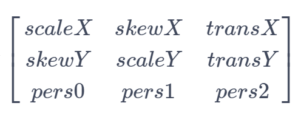

矩阵中的元素从左到右，从上到下分别表示水平缩放系数、水平倾斜系数、水平位移系数、垂直倾斜系数、垂直缩放系数、垂直位移系数、X轴透视系数、Y轴透视系数、透视缩放系数。
设(x<sub>1</sub>, y<sub>1</sub>)为源坐标点，(x<sub>2</sub>, y<sub>2</sub>)为源坐标点通过矩阵变换后的坐标点，则两个坐标点的关系如下：


### constructor<sup>12+</sup>

constructor()

用于构造一个矩阵对象。

**系统能力：** SystemCapability.Graphics.Drawing

**示例：**

```ts
import { drawing } from '@kit.ArkGraphics2D';

let matrix = new drawing.Matrix();
```

### setRotation<sup>12+</sup>

setRotation(degree: number, px: number, py: number): void

设置矩阵为单位矩阵，并围绕位于(px, py)的旋转轴点进行旋转。

**系统能力：** SystemCapability.Graphics.Drawing

**参数：**

| 参数名         | 类型                                       | 必填   | 说明                  |
| ----------- | ---------------------------------------- | ---- | ------------------- |
| degree      | number                  | 是    | 角度，单位为度。正数表示顺时针旋转，负数表示逆时针旋转，该参数为浮点数。|
| px          | number                  | 是    | 旋转轴点的横坐标，该参数为浮点数。     |
| py          | number                  | 是    | 旋转轴点的纵坐标，该参数为浮点数。     |

**错误码：**

以下错误码的详细介绍请参见[通用错误码](../errorcode-universal.md)。

| 错误码ID | 错误信息 |
| ------- | --------------------------------------------|
| 401 | Parameter error.Possible causes:1.Mandatory parameters are left unspecified;2.Incorrect parameter types. |

**示例：**

```ts
import { drawing } from '@kit.ArkGraphics2D';

let matrix = new drawing.Matrix();
matrix.setRotation(90, 100, 100);
```

### setScale<sup>12+</sup>

setScale(sx: number, sy: number, px: number, py: number): void

设置矩阵为单位矩阵围绕位于(px, py)的中心点，以sx和sy进行缩放后的结果。

**系统能力：** SystemCapability.Graphics.Drawing

**参数：**

| 参数名         | 类型                                       | 必填   | 说明                  |
| ----------- | ---------------------------------------- | ---- | ------------------- |
| sx          | number                  | 是    | x轴方向缩放系数，为负数时可看作是先关于y = px作镜像翻转后再进行缩放，该参数为浮点数。     |
| sy          | number                  | 是    | y轴方向缩放系数，为负数时可看作是先关于x = py作镜像翻转后再进行缩放，该参数为浮点数。     |
| px          | number                  | 是    |  缩放中心点的横坐标，该参数为浮点数。      |
| py          | number                  | 是    |  缩放中心点的纵坐标，该参数为浮点数。      |

**错误码：**

以下错误码的详细介绍请参见[通用错误码](../errorcode-universal.md)。

| 错误码ID | 错误信息 |
| ------- | --------------------------------------------|
| 401 | Parameter error.Possible causes:1.Mandatory parameters are left unspecified;2.Incorrect parameter types. |

**示例：**

```ts
import { drawing } from '@kit.ArkGraphics2D';

let matrix = new drawing.Matrix();
matrix.setScale(100, 100, 150, 150);
```

### setTranslation<sup>12+</sup>

setTranslation(dx: number, dy: number): void

设置矩阵为单位矩阵平移(dx, dy)后的结果。

**系统能力：** SystemCapability.Graphics.Drawing

**参数：**

| 参数名         | 类型                                       | 必填   | 说明                  |
| ----------- | ---------------------------------------- | ---- | ------------------- |
| dx          | number                  | 是    | x轴方向平移距离，正数表示往x轴正方向平移，负数表示往x轴负方向平移，该参数为浮点数。     |
| dy          | number                  | 是    | y轴方向平移距离，正数表示往y轴正方向平移，负数表示往y轴负方向平移，该参数为浮点数。     |

**错误码：**

以下错误码的详细介绍请参见[通用错误码](../errorcode-universal.md)。

| 错误码ID | 错误信息 |
| ------- | --------------------------------------------|
| 401 | Parameter error.Possible causes:1.Mandatory parameters are left unspecified;2.Incorrect parameter types. |

**示例：**

```ts
import { drawing } from '@kit.ArkGraphics2D';

let matrix = new drawing.Matrix();
matrix.setTranslation(100, 100);
```

### setMatrix<sup>12+</sup>

setMatrix(values: Array\<number>): void

用于设置矩阵对象的各项参数。

**系统能力：** SystemCapability.Graphics.Drawing

**参数：**

| 参数名 | 类型                                                 | 必填 | 说明             |
| ------ | ---------------------------------------------------- | ---- | ---------------- |
| values  | Array\<number> | 是   | 长度为9的浮点数组，表示矩阵对象参数。数组中的值按下标从小，到大分别表示水平缩放系数、水平倾斜系数、水平位移系数、垂直倾斜系数、垂直缩放系数、垂直位移系数、X轴透视系数、Y轴透视系数、透视缩放系数。 |

**错误码：**

以下错误码的详细介绍请参见[通用错误码](../errorcode-universal.md)。

| 错误码ID | 错误信息 |
| ------- | --------------------------------------------|
| 401 | Parameter error.Possible causes:1.Mandatory parameters are left unspecified;2.Incorrect parameter types; 3. Parameter verification failed. |

**示例：**

```ts
import { drawing } from '@kit.ArkGraphics2D';

let matrix = new drawing.Matrix();
let value : Array<number> = [2, 2, 2, 2, 2, 2, 2, 2, 2];
matrix.setMatrix(value);
```

### preConcat<sup>12+</sup>

preConcat(matrix: Matrix): void

将当前矩阵设置为当前矩阵左乘matrix的结果。

**系统能力：** SystemCapability.Graphics.Drawing

**参数：**

| 参数名 | 类型                                                 | 必填 | 说明             |
| ------ | ---------------------------------------------------- | ---- | ---------------- |
| matrix  | [Matrix](#matrix12) | 是   | 表示矩阵对象，位于乘法表达式右侧。 |

**错误码：**

以下错误码的详细介绍请参见[通用错误码](../errorcode-universal.md)。

| 错误码ID | 错误信息 |
| ------- | --------------------------------------------|
| 401 | Parameter error.Possible causes:1.Mandatory parameters are left unspecified;2.Incorrect parameter types. |

**示例：**

```ts
import { drawing } from '@kit.ArkGraphics2D';

let matrix1 = new drawing.Matrix();
matrix1.setMatrix([2, 1, 3, 1, 2, 1, 3, 1, 2]);
let matrix2 = new drawing.Matrix();
matrix2.setMatrix([-2, 1, 3, 1, 0, -1, 3, -1, 2]);
matrix1.preConcat(matrix2);
```

### isEqual<sup>12+</sup>

isEqual(matrix: Matrix): Boolean

判断两个矩阵是否相等。

**系统能力：** SystemCapability.Graphics.Drawing

**参数：**

| 参数名 | 类型                                                 | 必填 | 说明             |
| ------ | ---------------------------------------------------- | ---- | ---------------- |
| matrix  | [Matrix](#matrix12) | 是   | 另一个矩阵。 |

**返回值：**

| 类型                        | 说明                  |
| --------------------------- | -------------------- |
| Boolean | 返回两个矩阵的比较结果。true表示两个矩阵相等，false表示两个矩阵不相等。 |

**错误码：**

以下错误码的详细介绍请参见[通用错误码](../errorcode-universal.md)。

| 错误码ID | 错误信息 |
| ------- | --------------------------------------------|
| 401 | Parameter error.Possible causes:1.Mandatory parameters are left unspecified;2.Incorrect parameter types. |

**示例：**

```ts
import { drawing } from '@kit.ArkGraphics2D';

let matrix1 = new drawing.Matrix();
matrix1.setMatrix([2, 1, 3, 1, 2, 1, 3, 1, 2]);
let matrix2 = new drawing.Matrix();
matrix2.setMatrix([-2, 1, 3, 1, 0, -1, 3, -1, 2]);
if (matrix1.isEqual(matrix2)) {
  console.info("matrix1 and matrix2 are equal.");
} else {
  console.info("matrix1 and matrix2 are not equal.");
}
```

### invert<sup>12+</sup>

invert(matrix: Matrix): Boolean

将矩阵matrix设置为当前矩阵的逆矩阵，并返回是否设置成功的结果。

**系统能力：** SystemCapability.Graphics.Drawing

**参数：**

| 参数名 | 类型                                                 | 必填 | 说明             |
| ------ | ---------------------------------------------------- | ---- | ---------------- |
| matrix  | [Matrix](#matrix12) | 是   | 矩阵对象，用于存储获取到的逆矩阵。 |

**返回值：**

| 类型                        | 说明                  |
| --------------------------- | -------------------- |
| Boolean | 返回matrix是否被设置为逆矩阵的结果。true表示当前矩阵可逆，matrix被填充为逆矩阵，false表示当前矩阵不可逆，matrix不被改变。 |

**错误码：**

以下错误码的详细介绍请参见[通用错误码](../errorcode-universal.md)。

| 错误码ID | 错误信息 |
| ------- | --------------------------------------------|
| 401 | Parameter error.Possible causes:1.Mandatory parameters are left unspecified;2.Incorrect parameter types. |

**示例：**

```ts
import { drawing } from '@kit.ArkGraphics2D';

let matrix1 = new drawing.Matrix();
matrix1.setMatrix([2, 1, 3, 1, 2, 1, 3, 1, 2]);
let matrix2 = new drawing.Matrix();
matrix2.setMatrix([-2, 1, 3, 1, 0, -1, 3, -1, 2]);
if (matrix1.invert(matrix2)) {
  console.info("matrix1 is invertible and matrix2 is set as an inverse matrix of the matrix1.");
} else {
  console.info("matrix1 is not invertible and matrix2 is not changed.");
}
```

### isIdentity<sup>12+</sup>

isIdentity(): Boolean

判断矩阵是否是单位矩阵。

**系统能力：** SystemCapability.Graphics.Drawing

**返回值：**

| 类型                        | 说明                  |
| --------------------------- | -------------------- |
| Boolean | 返回矩阵是否是单位矩阵。true表示矩阵是单位矩阵，false表示矩阵不是单位矩阵。 |

**示例：**

```ts
import { drawing } from '@kit.ArkGraphics2D';

let matrix = new drawing.Matrix();
if (matrix.isIdentity()) {
  console.info("matrix is identity.");
} else {
  console.info("matrix is not identity.");
}
```

### getValue<sup>12+</sup>

getValue(index: number): number

获取矩阵给定索引位的值。索引范围0-8。

**系统能力**：SystemCapability.Graphics.Drawing

**参数：**

| 参数名          | 类型    | 必填 | 说明                                                        |
| --------------- | ------- | ---- | ----------------------------------------------------------- |
| index | number | 是   | 索引位置，范围0-8，该参数为整数。 |

**返回值：**

| 类型                  | 说明           |
| --------------------- | -------------- |
| number | 函数返回矩阵给定索引位对应的值，该返回值为整数。 |

**错误码：**

以下错误码的详细介绍请参见[通用错误码](../errorcode-universal.md)。

| 错误码ID | 错误信息 |
| ------- | --------------------------------------------|
| 401 | Parameter error. Possible causes: 1. Mandatory parameters are left unspecified;2. Incorrect parameter types;3. Parameter verification failed.|

**示例：**

```ts
import {drawing} from "@kit.ArkGraphics2D"
let matrix = new drawing.Matrix();
for (let i = 0; i < 9; i++) {
    console.info("matrix "+matrix.getValue(i).toString());
}
```

### postRotate<sup>12+</sup>

postRotate(degree: number, px: number, py: number): void

将矩阵设置为矩阵右乘围绕轴心点旋转一定角度的单位矩阵后得到的矩阵。

**系统能力**：SystemCapability.Graphics.Drawing

**参数：**

| 参数名          | 类型    | 必填 | 说明                                                        |
| --------------- | ------- | ---- | ----------------------------------------------------------- |
| degree | number | 是   | 旋转角度，单位为度。正数表示顺时针旋转，负数表示逆时针旋转，该参数为浮点数。 |
| px | number | 是   | 旋转中心点的横坐标，该参数为浮点数。 |
| py | number | 是   | 旋转中心点的纵坐标，该参数为浮点数。 |

**错误码：**

以下错误码的详细介绍请参见[通用错误码](../errorcode-universal.md)。

| 错误码ID | 错误信息 |
| ------- | --------------------------------------------|
| 401 | Parameter error.Possible causes:1.Mandatory parameters are left unspecified;2.Incorrect parameter types. |

**示例：**

```ts
import {drawing} from "@kit.ArkGraphics2D"
let matrix = new drawing.Matrix();
let degree: number = 2;
let px: number = 3;
let py: number = 4;
matrix.postRotate(degree, px, py);
console.info("matrix= "+matrix.getAll().toString());
```

### postScale<sup>12+</sup>

postScale(sx: number, sy: number, px: number, py: number): void

将矩阵设置为矩阵右乘围绕轴心点按一定缩放系数缩放后的单位矩阵后得到的矩阵。

**系统能力**：SystemCapability.Graphics.Drawing

**参数：**

| 参数名          | 类型    | 必填 | 说明                                                        |
| --------------- | ------- | ---- | ----------------------------------------------------------- |
| sx | number | 是   | x轴方向缩放系数，为负数时可看作是先关于y = px作镜像翻转后再进行缩放，该参数为浮点数。 |
| sy | number | 是   | y轴方向缩放系数，为负数时可看作是先关于x = py作镜像翻转后再进行缩放，该参数为浮点数。 |
| px | number | 是   | 缩放中心点的横坐标，该参数为浮点数。 |
| py | number | 是   | 缩放中心点的纵坐标，该参数为浮点数。 |

**错误码：**

以下错误码的详细介绍请参见[通用错误码](../errorcode-universal.md)。

| 错误码ID | 错误信息 |
| ------- | --------------------------------------------|
| 401 | Parameter error.Possible causes:1.Mandatory parameters are left unspecified;2.Incorrect parameter types. |

**示例：**

```ts
import {drawing} from "@kit.ArkGraphics2D"
let matrix = new drawing.Matrix();
let sx: number = 2;
let sy: number = 0.5;
let px: number = 1;
let py: number = 1;
matrix.postScale(sx, sy, px, py);
console.info("matrix= "+matrix.getAll().toString());
```

### postTranslate<sup>12+</sup>

postTranslate(dx: number, dy: number): void

将矩阵设置为矩阵右乘平移一定距离后的单位矩阵后得到的矩阵。

**系统能力**：SystemCapability.Graphics.Drawing

**参数：**

| 参数名          | 类型    | 必填 | 说明                                                        |
| --------------- | ------- | ---- | ----------------------------------------------------------- |
| dx | number | 是   | x轴方向平移距离，正数表示往x轴正方向平移，负数表示往x轴负方向平移，该参数为浮点数。 |
| dy | number | 是   | y轴方向平移距离，正数表示往y轴正方向平移，负数表示往y轴负方向平移，该参数为浮点数。 |

**错误码：**

以下错误码的详细介绍请参见[通用错误码](../errorcode-universal.md)。

| 错误码ID | 错误信息 |
| ------- | --------------------------------------------|
| 401 | Parameter error.Possible causes:1.Mandatory parameters are left unspecified;2.Incorrect parameter types. |

**示例：**

```ts
import {drawing} from "@kit.ArkGraphics2D"
let matrix = new drawing.Matrix();
let dx: number = 3;
let dy: number = 4;
matrix.postTranslate(dx, dy);
console.info("matrix= "+matrix.getAll().toString());
```

### preRotate<sup>12+</sup>

preRotate(degree: number, px: number, py: number): void

将矩阵设置为矩阵左乘围绕轴心点旋转一定角度的单位矩阵后得到的矩阵。

**系统能力**：SystemCapability.Graphics.Drawing

**参数：**

| 参数名          | 类型    | 必填 | 说明                                                        |
| --------------- | ------- | ---- | ----------------------------------------------------------- |
| degree | number | 是   | 旋转角度，单位为度。正数表示顺时针旋转，负数表示逆时针旋转，该参数为浮点数。 |
| px | number | 是   | 旋转中心点的横坐标，该参数为浮点数。 |
| py | number | 是   | 旋转中心点的纵坐标，该参数为浮点数。 |

**错误码：**

以下错误码的详细介绍请参见[通用错误码](../errorcode-universal.md)。

| 错误码ID | 错误信息 |
| ------- | --------------------------------------------|
| 401 | Parameter error.Possible causes:1.Mandatory parameters are left unspecified;2.Incorrect parameter types. |

**示例：**

```ts
import {drawing} from "@kit.ArkGraphics2D"
let matrix = new drawing.Matrix();
let degree: number = 2;
let px: number = 3;
let py: number = 4;
matrix.preRotate(degree, px, py);
console.info("matrix= "+matrix.getAll().toString());
```

### preScale<sup>12+</sup>

preScale(sx: number, sy: number, px: number, py: number): void

将矩阵设置为矩阵左乘围绕轴心点按一定缩放系数缩放后的单位矩阵后得到的矩阵。

**系统能力**：SystemCapability.Graphics.Drawing

**参数：**

| 参数名          | 类型    | 必填 | 说明                                                        |
| --------------- | ------- | ---- | ----------------------------------------------------------- |
| sx | number | 是   | x轴方向缩放系数，为负数时可看作是先关于y = px作镜像翻转后再进行缩放，该参数为浮点数。 |
| sy | number | 是   | y轴方向缩放系数，为负数时可看作是先关于x = py作镜像翻转后再进行缩放，该参数为浮点数。 |
| px | number | 是   | 轴心点横坐标，该参数为浮点数。 |
| py | number | 是   | 轴心点纵坐标，该参数为浮点数。 |

**错误码：**

以下错误码的详细介绍请参见[通用错误码](../errorcode-universal.md)。

| 错误码ID | 错误信息 |
| ------- | --------------------------------------------|
| 401 | Parameter error.Possible causes:1.Mandatory parameters are left unspecified;2.Incorrect parameter types. |

**示例：**

```ts
import {drawing} from "@kit.ArkGraphics2D"
let matrix = new drawing.Matrix();
let sx: number = 2;
let sy: number = 0.5;
let px: number = 1;
let py: number = 1;
matrix.preScale(sx, sy, px, py);
console.info("matrix"+matrix.getAll().toString());
```

### preTranslate<sup>12+</sup>

preTranslate(dx: number, dy: number): void

将矩阵设置为矩阵左乘平移一定距离后的单位矩阵后得到的矩阵。

**系统能力**：SystemCapability.Graphics.Drawing

**参数：**

| 参数名          | 类型    | 必填 | 说明                                                        |
| --------------- | ------- | ---- | ----------------------------------------------------------- |
| dx | number | 是   | x轴方向平移距离，正数表示往x轴正方向平移，负数表示往x轴负方向平移，该参数为浮点数。 |
| dy | number | 是   | y轴方向平移距离，正数表示往y轴正方向平移，负数表示往y轴负方向平移，该参数为浮点数。 |

**错误码：**

以下错误码的详细介绍请参见[通用错误码](../errorcode-universal.md)。

| 错误码ID | 错误信息 |
| ------- | --------------------------------------------|
| 401 | Parameter error.Possible causes:1.Mandatory parameters are left unspecified;2.Incorrect parameter types. |

**示例：**

```ts
import {drawing} from "@kit.ArkGraphics2D"
let matrix = new drawing.Matrix();
let dx: number = 3;
let dy: number = 4;
matrix.preTranslate(dx, dy);
console.info("matrix"+matrix.getAll().toString());
```

### reset<sup>12+</sup>

reset(): void

重置当前矩阵为单位矩阵。

**系统能力**：SystemCapability.Graphics.Drawing

**示例：**

```ts
import {drawing} from "@kit.ArkGraphics2D"
let matrix = new drawing.Matrix();
matrix.postScale(2, 3, 4, 5);
matrix.reset();
console.info("matrix= "+matrix.getAll().toString());
```

### mapPoints<sup>12+</sup>

mapPoints(src: Array\<common2D.Point>): Array\<common2D.Point>

通过矩阵变换将源点数组映射到目标点数组。

**系统能力**：SystemCapability.Graphics.Drawing

**参数：**

| 参数名          | 类型    | 必填 | 说明                                                        |
| --------------- | ------- | ---- | ----------------------------------------------------------- |
| src | Array\<[common2D.Point](js-apis-graphics-common2D.md#point)> | 是   | 源点数组。 |

**返回值：**

| 类型                  | 说明           |
| --------------------- | -------------- |
| Array\<[common2D.Point](js-apis-graphics-common2D.md#point)> | 源点数组经矩阵变换后的点数组。 |

**错误码：**

以下错误码的详细介绍请参见[通用错误码](../errorcode-universal.md)。

| 错误码ID | 错误信息 |
| ------- | --------------------------------------------|
| 401 | Parameter error.Possible causes:1.Mandatory parameters are left unspecified;2.Incorrect parameter types. |

**示例：**

```ts
import {drawing,common2D} from "@kit.ArkGraphics2D"
let src: Array<common2D.Point> = [];
src.push({x: 15, y: 20});
src.push({x: 20, y: 15});
src.push({x: 30, y: 10});
let matrix = new drawing.Matrix();
let dst: Array<common2D.Point> = matrix.mapPoints(src);
console.info("matrix= src: "+JSON.stringify(src));
console.info("matrix= dst: "+JSON.stringify(dst));
```

### getAll<sup>12+</sup>

getAll(): Array\<number>

获取矩阵所有元素值。

**系统能力**：SystemCapability.Graphics.Drawing

**返回值：**

| 类型                  | 说明           |
| --------------------- | -------------- |
| Array\<number> | 存储矩阵元素值的浮点数组，长度为9。 |

**示例：**

```ts
import {drawing} from "@kit.ArkGraphics2D"
let matrix = new drawing.Matrix();
console.info("matrix "+ matrix.getAll());
```

### mapRect<sup>12+</sup>

mapRect(dst: common2D.Rect, src: common2D.Rect): boolean

将目标矩形设置为源矩形通过矩阵变换后的图形的外接矩形。如下图所示，蓝色矩形为源矩形，假设黄色矩形为源矩形通过矩阵变换形成的图形，此时黄色矩形的边不与坐标轴平行，无法使用矩形对象表示，因此，将目标矩形设置为黄色矩形的外接矩形，即黑色矩形。


**系统能力**：SystemCapability.Graphics.Drawing

**参数：**

| 参数名          | 类型    | 必填 | 说明                                                        |
| --------------- | ------- | ---- | ----------------------------------------------------------- |
| dst | [common2D.Rect](js-apis-graphics-common2D.md#rect) | 是   | 目标矩形对象，用于存储源矩形经矩阵变换后的的图形的外接矩形。 |
| src |[common2D.Rect](js-apis-graphics-common2D.md#rect) | 是   | 源矩形对象。 |

**返回值：**

| 类型                  | 说明           |
| --------------------- | -------------- |
| boolean | 返回源矩形经过矩阵变换后的图形是否仍然是矩形的结果，true表示是矩形，false表示不是矩形。 |

**错误码：**

以下错误码的详细介绍请参见[通用错误码](../errorcode-universal.md)。

| 错误码ID | 错误信息 |
| ------- | --------------------------------------------|
| 401 | Parameter error.Possible causes:1.Mandatory parameters are left unspecified;2.Incorrect parameter types. |

**示例：**

```ts
import {drawing,common2D} from "@kit.ArkGraphics2D"
let dst: common2D.Rect = { left: 100, top: 20, right: 130, bottom: 60 };
let src: common2D.Rect = { left: 100, top: 80, right: 130, bottom: 120 };
let matrix = new drawing.Matrix();
if (matrix.mapRect(dst, src)) {
    console.info("matrix= dst "+JSON.stringify(dst));
}
```

### setRectToRect<sup>12+</sup>

setRectToRect(src: common2D.Rect, dst: common2D.Rect, scaleToFit: ScaleToFit): boolean

将当前矩阵设置为能使源矩形映射到目标矩形的变换矩阵。

**系统能力**：SystemCapability.Graphics.Drawing

**参数：**

| 参数名          | 类型    | 必填 | 说明                                                        |
| --------------- | ------- | ---- | ----------------------------------------------------------- |
| src | [common2D.Rect](js-apis-graphics-common2D.md#rect) | 是   | 源矩形。 |
| dst | [common2D.Rect](js-apis-graphics-common2D.md#rect) | 是   | 目标矩形。 |
| scaleToFit | [ScaleToFit](#scaletofit12) | 是   | 源矩形到目标矩形的映射方式。 |

**返回值：**

| 类型                  | 说明           |
| --------------------- | -------------- |
| boolean | 返回矩阵是否可以表示矩形之间的映射，true表示可以，false表示不可以。特别地，如果源矩形的宽高任意一个小于等于0，则返回false，并将矩阵设置为单位矩阵；如果目标矩形的宽高任意一个小于等于0，则返回true，并将矩阵设置为除透视缩放系数为1外其余值皆为0的矩阵。 |

**错误码：**

以下错误码的详细介绍请参见[通用错误码](../errorcode-universal.md)。

| 错误码ID | 错误信息 |
| ------- | --------------------------------------------|
| 401 | Parameter error.Possible causes:1.Mandatory parameters are left unspecified;2.Incorrect parameter types;3.Parameter verification failed. |

**示例：**

```ts
import {drawing,common2D} from "@kit.ArkGraphics2D"
let src: common2D.Rect = { left: 100, top: 100, right: 300, bottom: 300 };
let dst: common2D.Rect = { left: 200, top: 200, right: 600, bottom: 600 };
let scaleToFit: drawing.ScaleToFit = drawing.ScaleToFit.FILL_SCALE_TO_FIT
let matrix = new drawing.Matrix();
if (matrix.setRectToRect(src, dst, scaleToFit)) {
    console.info("matrix"+matrix.getAll().toString());
}
```

### setPolyToPoly<sup>12+</sup>

setPolyToPoly(src: Array\<common2D.Point>, dst: Array\<common2D.Point>, count: number): boolean

将当前矩阵设置为能使源点数组映射到目标点数组的变换矩阵。源点以及目标点的个数要大于等于0，小于等于4。

**系统能力**：SystemCapability.Graphics.Drawing

**参数：**

| 参数名          | 类型    | 必填 | 说明                                                        |
| --------------- | ------- | ---- | ----------------------------------------------------------- |
| src | Array\<[common2D.Point](js-apis-graphics-common2D.md#point)> | 是   | 源点数组，长度必须为count。 |
| dst | Array\<[common2D.Point](js-apis-graphics-common2D.md#point)> | 是   | 目标点数组，长度必须为count。 |
| count | number | 是   | 在src和dst点的数量，该参数为整数。 |

**返回值：**

| 类型                  | 说明           |
| --------------------- | -------------- |
| boolean | 返回设置矩阵是否成功的结果，true表示设置成功，false表示设置失败。 |

**错误码：**

以下错误码的详细介绍请参见[通用错误码](../errorcode-universal.md)。

| 错误码ID | 错误信息 |
| ------- | --------------------------------------------|
| 401 | Parameter error.Possible causes:1.Mandatory parameters are left unspecified;2.Incorrect parameter types. |

**示例：**

```ts
import {drawing,common2D} from "@kit.ArkGraphics2D"
let srcPoints: Array<common2D.Point> = [ {x: 10, y: 20}, {x: 200, y: 150} ];
let dstPoints: Array<common2D.Point> = [{ x:0, y: 10 }, { x:300, y: 600 }];
let matrix = new drawing.Matrix();
if (matrix.setPolyToPoly(srcPoints, dstPoints, 2)) {
    console.info("matrix"+matrix.getAll().toString());
}
```

## RoundRect<sup>12+</sup>

圆角矩形对象。

### constructor<sup>12+</sup>

constructor(rect: common2D.Rect, xRadii: number, yRadii: number)

构造一个圆角矩形对象，当且仅当xRadii和yRadii均大于0时，圆角生效，否则只会构造一个矩形。

**系统能力：** SystemCapability.Graphics.Drawing

**参数：**

| 参数名         | 类型                                       | 必填   | 说明                  |
| ----------- | ---------------------------------------- | ---- | ------------------- |
| rect        | [common2D.Rect](js-apis-graphics-common2D.md#rect) | 是    | 需要创建的圆角矩形区域。      |
| xRadii        | number                  | 是    | X轴上的圆角半径，该参数为浮点数，小于等于0时无效。     |
| yRadii        | number                  | 是    | Y轴上的圆角半径，该参数为浮点数，小于等于0时无效。     |

**错误码：**

以下错误码的详细介绍请参见[通用错误码](../errorcode-universal.md)。

| 错误码ID | 错误信息 |
| ------- | --------------------------------------------|
| 401 | Parameter error.Possible causes:1.Mandatory parameters are left unspecified;2.Incorrect parameter types. |

**示例：**

```ts
import { common2D, drawing } from '@kit.ArkGraphics2D';

let rect: common2D.Rect = {left : 100, top : 100, right : 500, bottom : 300};
let roundRect = new drawing.RoundRect(rect, 50, 50);
```
### setCorner<sup>12+</sup>

setCorner(pos: CornerPos, x: number, y: number): void

用于设置圆角矩形中指定圆角位置的圆角半径。

**系统能力：** SystemCapability.Graphics.Drawing

**参数：**

| 参数名   | 类型                                         | 必填 | 说明                            |
| -------- | -------------------------------------------- | ---- | ------------------------------- |
| pos | [CornerPos](#cornerpos12) | 是   | 圆角位置。                 |
| x     | number                 | 是   | x轴方向的圆角半径，该参数为浮点数，小于等于0时无效。 |
| y     | number      | 是   | y轴方向的圆角半径，该参数为浮点数，小于等于0时无效。 |

**错误码：**

以下错误码的详细介绍请参见[通用错误码](../errorcode-universal.md)。

| 错误码ID | 错误信息 |
| ------- | --------------------------------------------|
| 401 | Parameter error.Possible causes:1.Mandatory parameters are left unspecified;2.Incorrect parameter types;3.Parameter verification failed. |

**示例：**

```ts
import { drawing } from '@kit.ArkGraphics2D';
let roundRect : drawing.RoundRect = new drawing.RoundRect({left: 0, top: 0, right: 300, bottom: 300}, 50, 50);
roundRect.setCorner(drawing.CornerPos.TOP_LEFT_POS, 150, 150);
```

### getCorner<sup>12+</sup>

getCorner(pos: CornerPos): common2D.Point

获取圆角矩形中指定圆角位置的圆角半径。

**系统能力：** SystemCapability.Graphics.Drawing

**参数：**

| 参数名   | 类型                                         | 必填 | 说明                            |
| -------- | -------------------------------------------- | ---- | ------------------------------- |
| pos | [CornerPos](#cornerpos12) | 是   | 圆角位置。                 |

**返回值：**

| 类型                  | 说明           |
| --------------------- | -------------- |
| [common2D.Point](js-apis-graphics-common2D.md#point)  | 返回一个点，其横坐标表示圆角x轴方向上的半径，纵坐标表示y轴方向上的半径。 |

**错误码：**

以下错误码的详细介绍请参见[通用错误码](../errorcode-universal.md)。

| 错误码ID | 错误信息 |
| ------- | --------------------------------------------|
| 401 | Parameter error.Possible causes:1.Mandatory parameters are left unspecified;2.Incorrect parameter types;3.Parameter verification failed. |

**示例：**

```ts
import { drawing } from '@kit.ArkGraphics2D';
let roundRect : drawing.RoundRect = new drawing.RoundRect({left: 0, top: 0, right: 300, bottom: 300}, 50, 50);
let cornerRadius = roundRect.getCorner(drawing.CornerPos.BOTTOM_LEFT_POS);
console.info("getCorner---"+cornerRadius.x)
console.info("getCorner---"+cornerRadius.y)
```

### offset<sup>12+</sup>

offset(dx: number, dy: number): void

将圆角矩形分别沿x轴方向和y轴方向平移dx,dy。

**系统能力：** SystemCapability.Graphics.Drawing

**参数：**

| 参数名   | 类型                                         | 必填 | 说明                            |
| -------- | -------------------------------------------- | ---- | ------------------------------- |
| dx | number | 是   | 表示x轴方向上的偏移量，正数表示往x轴正方向平移，负数表示往x轴负方向平移，该参数为浮点数。                 |
| dy | number | 是   | 表示y轴方向上的偏移量，正数表示往y轴正方向平移，负数表示往y轴负方向平移，该参数为浮点数。                 |

**错误码：**

以下错误码的详细介绍请参见[通用错误码](../errorcode-universal.md)。

| 错误码ID | 错误信息 |
| ------- | --------------------------------------------|
| 401 | Parameter error.Possible causes:1.Mandatory parameters are left unspecified;2.Incorrect parameter types. |

**示例：**

```ts
import { drawing } from '@kit.ArkGraphics2D';
let roundRect : drawing.RoundRect = new drawing.RoundRect({left: 0, top: 0, right: 300, bottom: 300}, 50, 50);
roundRect.offset(100, 100);
```

## Region<sup>12+</sup>

区域对象，用于描述所绘制图形的区域信息。

### isPointContained<sup>12+</sup>

isPointContained(x: number, y: number) : boolean

用于判断测试点是否在区域内。

**系统能力：** SystemCapability.Graphics.Drawing

**参数：**

| 参数名 | 类型   | 必填 | 说明                    |
| ------ | ------ | ---- | ----------------------- |
| x      | number | 是   | 测试点的x轴坐标。该参数必须为整数。当输入的数字带小数时，小数部分会被舍去。 |
| y      | number | 是   | 测试点的y轴坐标。该参数必须为整数。当输入的数字带小数时，小数部分会被舍去。 |

**返回值：**

| 类型    | 说明           |
| ------- | -------------- |
| boolean | 返回测试点是否在区域内的结果。true表示测试点在区域内，false表示测试点不在区域内。 |

**错误码：**

以下错误码的详细介绍请参见[通用错误码](../errorcode-universal.md)。

| 错误码ID | 错误信息 |
| ------- | --------------------------------------------|
| 401 | Parameter error.Possible causes:1.Mandatory parameters are left unspecified;2.Incorrect parameter types. |

**示例：**

```ts
import { RenderNode } from '@kit.ArkUI';
import { drawing } from '@kit.ArkGraphics2D';
class DrawingRenderNode extends RenderNode {
  draw(context : DrawContext) {
    const canvas = context.canvas;
    const pen = new drawing.Pen();
    pen.setColor({ alpha: 255, red: 255, green: 0, blue: 0 });
    pen.setStrokeWidth(10);
    canvas.attachPen(pen);
    let region = new drawing.Region();
    region.setRect(100, 100, 400, 400);
    let flag: boolean = false;
    flag = region.isPointContained(200,200);
    console.info("region isPointContained : " + flag);
    canvas.drawPoint(200,200);
    canvas.drawRegion(region);
    canvas.detachPen();
  }
}
```

### isRegionContained<sup>12+</sup>

isRegionContained(other: Region) : boolean

用于判断其他区域是否在当前区域内。

**系统能力：** SystemCapability.Graphics.Drawing

**参数：**

| 参数名 | 类型   | 必填 | 说明                    |
| ------ | ------ | ---- | ----------------------- |
| other      | [Region](#region12) | 是   | 区域对象。 |

**返回值：**

| 类型    | 说明           |
| ------- | -------------- |
| boolean | 返回其他区域是否在当前区域内的结果。true表示其他区域在当前区域内，false表示其他区域不在当前区域内。 |

**错误码：**

以下错误码的详细介绍请参见[通用错误码](../errorcode-universal.md)。

| 错误码ID | 错误信息 |
| ------- | --------------------------------------------|
| 401 | Parameter error.Possible causes:1.Mandatory parameters are left unspecified;2.Incorrect parameter types. |

**示例：**

```ts
import { RenderNode } from '@kit.ArkUI';
import { drawing } from '@kit.ArkGraphics2D';
class DrawingRenderNode extends RenderNode {
  draw(context : DrawContext) {
    const canvas = context.canvas;
    const pen = new drawing.Pen();
    pen.setColor({ alpha: 255, red: 255, green: 0, blue: 0 });
    pen.setStrokeWidth(10);
    canvas.attachPen(pen);
    let region = new drawing.Region();
    let other = new drawing.Region();
    region.setRect(100, 100, 400, 400);
    other.setRect(150, 150, 250 ,250);
    let flag: boolean = false;
    flag = region.isRegionContained(other);
    console.info("region isRegionContained : " + flag);
    canvas.drawRegion(region);
    canvas.drawRegion(other);
    canvas.detachPen();
  }
}
```

### op<sup>12+</sup>

op(region: Region, regionOp: RegionOp) : boolean

用于将当前区域与指定区域进行指定运算操作，并将当前区域替换为运算结果。

**系统能力：** SystemCapability.Graphics.Drawing

**参数：**

| 参数名 | 类型   | 必填 | 说明                    |
| ------ | ------ | ---- | ----------------------- |
| region      | [Region](#region12) | 是   | 区域对象。 |
| regionOp      | [RegionOp](#regionop12) | 是   | 区域合并操作类型。 |

**返回值：**

| 类型    | 说明           |
| ------- | -------------- |
| boolean | 返回区域运算结果是否成功替换当前区域。true表示区域运算结果替换当前区域成功，false表示区域运算结果替换当前区域失败。 |

**错误码：**

以下错误码的详细介绍请参见[通用错误码](../errorcode-universal.md)。

| 错误码ID | 错误信息 |
| ------- | --------------------------------------------|
| 401 | Parameter error.Possible causes:1.Mandatory parameters are left unspecified;2.Incorrect parameter types. |

**示例：**

```ts
import { RenderNode } from '@kit.ArkUI';
import { drawing } from '@kit.ArkGraphics2D';
class DrawingRenderNode extends RenderNode {
  draw(context : DrawContext) {
    const canvas = context.canvas;
    const pen = new drawing.Pen();
    pen.setColor({ alpha: 255, red: 255, green: 0, blue: 0 });
    pen.setStrokeWidth(10);
    canvas.attachPen(pen);
    let region = new drawing.Region();
    region.setRect(200, 200, 400, 400);
    let othregion = new drawing.Region();
    othregion.setRect(110, 110, 240, 240);
    let flag: boolean = false;
    flag = region.op(othregion,drawing.RegionOp.REPLACE);
    console.info("region op : " + flag);
    canvas.drawRegion(region);
    canvas.detachPen();
  }
}
```

### quickReject<sup>12+</sup>

quickReject(left: number, top: number, right: number, bottom: number) : boolean

用于快速判断矩形和区域是否不相交，实际上比较的是矩形和区域的外接矩形是否不相交，因此会有误差。

**系统能力：** SystemCapability.Graphics.Drawing

**参数：**

| 参数名 | 类型   | 必填 | 说明                    |
| ------ | ------ | ---- | ----------------------- |
| left   | number | 是   | 矩形区域的左侧位置。该参数必须为整数。当输入的数字带小数时，小数部分会被舍去。 |
| top    | number | 是   | 矩形区域的顶部位置。该参数必须为整数。当输入的数字带小数时，小数部分会被舍去。 |
| right  | number | 是   | 矩形区域的右侧位置。该参数必须为整数。当输入的数字带小数时，小数部分会被舍去。 |
| bottom | number | 是   | 矩形区域的底部位置。该参数必须为整数。当输入的数字带小数时，小数部分会被舍去。 |

**返回值：**

| 类型    | 说明           |
| ------- | -------------- |
| boolean | 返回矩形是否与区域不相交的结果。true表示矩形与区域不相交，false表示矩形与区域相交。 |

**错误码：**

以下错误码的详细介绍请参见[通用错误码](../errorcode-universal.md)。

| 错误码ID | 错误信息 |
| ------- | --------------------------------------------|
| 401 | Parameter error.Possible causes:1.Mandatory parameters are left unspecified;2.Incorrect parameter types. |

**示例：**

```ts
import { RenderNode } from '@kit.ArkUI';
import { drawing } from '@kit.ArkGraphics2D';
class DrawingRenderNode extends RenderNode {
  draw(context : DrawContext) {
    const canvas = context.canvas;
    const pen = new drawing.Pen();
    pen.setColor({ alpha: 255, red: 255, green: 0, blue: 0 });
    pen.setStrokeWidth(10);
    canvas.attachPen(pen);
    let region = new drawing.Region();
    region.setRect(100, 100, 400, 400);
    let flag: boolean = false;
    flag = region.quickReject(50, 50, 70, 70);
    console.info("region quickReject : " + flag);
    canvas.drawRegion(region);
    canvas.detachPen();
  }
}
```

### setPath<sup>12+</sup>

setPath(path: Path, clip: Region) : boolean

设置一个与裁剪区域内路径的轮廓相匹配的区域。

**系统能力：** SystemCapability.Graphics.Drawing

**参数：**

| 参数名 | 类型   | 必填 | 说明                    |
| ------ | ------ | ---- | ----------------------- |
| path      | [Path](#path) | 是   | 路径对象。 |
| clip      | [Region](#region12) | 是   | 区域对象。 |

**返回值：**

| 类型    | 说明           |
| ------- | -------------- |
| boolean | 返回是否成功设置一个与裁剪区域内路径的轮廓相匹配的区域。true表示设置成功，false表示设置失败。 |

**错误码：**

以下错误码的详细介绍请参见[通用错误码](../errorcode-universal.md)。

| 错误码ID | 错误信息 |
| ------- | --------------------------------------------|
| 401 | Parameter error.Possible causes:1.Mandatory parameters are left unspecified;2.Incorrect parameter types. |

**示例：**

```ts
import { RenderNode } from '@kit.ArkUI';
import { drawing } from '@kit.ArkGraphics2D';
class DrawingRenderNode extends RenderNode {
  draw(context : DrawContext) {
    const canvas = context.canvas;
    const pen = new drawing.Pen();
    pen.setColor({ alpha: 255, red: 255, green: 0, blue: 0 });
    pen.setStrokeWidth(10);
    canvas.attachPen(pen);
    let region = new drawing.Region();
    let path = new drawing.Path();
    region.setRect(100, 100, 400, 400);
    path.arcTo(50, 50, 300, 300, 0, 359);
    let flag: boolean = false;
    flag = region.setPath(path,region);
    console.info("region setPath : " + flag);
    canvas.drawRegion(region);
    canvas.detachPen();
  }
}
```

### setRect<sup>12+</sup>

setRect(left: number, top: number, right: number, bottom: number) : boolean

设置一个矩形区域。

**系统能力：** SystemCapability.Graphics.Drawing

**参数：**

| 参数名 | 类型   | 必填 | 说明                    |
| ------ | ------ | ---- | ----------------------- |
| left   | number | 是   | 矩形区域的左侧位置。该参数必须为整数。当输入的数字带小数时，小数部分会被舍去。 |
| top    | number | 是   | 矩形区域的顶部位置。该参数必须为整数。当输入的数字带小数时，小数部分会被舍去。 |
| right  | number | 是   | 矩形区域的右侧位置。该参数必须为整数。当输入的数字带小数时，小数部分会被舍去。 |
| bottom | number | 是   | 矩形区域的底部位置。该参数必须为整数。当输入的数字带小数时，小数部分会被舍去。 |

**返回值：**

| 类型    | 说明           |
| ------- | -------------- |
| boolean | 返回设置矩形区域是否成功的结果。true表示设置矩形区域成功，false表示设置矩形区域失败。 |

**错误码：**

以下错误码的详细介绍请参见[通用错误码](../errorcode-universal.md)。

| 错误码ID | 错误信息 |
| ------- | --------------------------------------------|
| 401 | Parameter error.Possible causes:1.Mandatory parameters are left unspecified;2.Incorrect parameter types. |

**示例：**

```ts
import { RenderNode } from '@kit.ArkUI';
import { drawing } from '@kit.ArkGraphics2D';
class DrawingRenderNode extends RenderNode {
  draw(context : DrawContext) {
    const canvas = context.canvas;
    const pen = new drawing.Pen();
    pen.setColor({ alpha: 255, red: 255, green: 0, blue: 0 });
    pen.setStrokeWidth(10);
    canvas.attachPen(pen);
    let region = new drawing.Region();
    let flag: boolean = false;
    flag = region.setRect(50, 50, 300, 300);
    console.info("region setRect : " + flag);
    canvas.drawRegion(region);
    canvas.detachPen();
  }
}
```

## TileMode<sup>12+</sup>

着色器效果平铺模式的枚举。

**系统能力**：SystemCapability.Graphics.Drawing

| 名称                   | 值   | 说明                           |
| ---------------------- | ---- | ------------------------------ |
| CLAMP     | 0    | 如果着色器效果超出其原始边界，剩余区域使用着色器的边缘颜色填充。 |
| REPEAT    | 1    | 在水平和垂直方向上重复着色器效果。 |
| MIRROR    | 2    | 在水平和垂直方向上重复着色器效果，交替镜像图像，以便相邻图像始终接合。 |
| DECAL     | 3    | 仅在其原始边界内渲染着色器效果。|

## ShaderEffect<sup>12+</sup>

着色器。画刷和画笔设置着色器后，会使用着色器效果而不是颜色属性去绘制，但此时画笔和画刷的透明度属性仍然生效。

### createColorShader<sup>12+</sup>

static createColorShader(color: number): ShaderEffect

创建具有单一颜色的着色器。

**系统能力：** SystemCapability.Graphics.Drawing

**参数：**

| 参数名 | 类型                                               | 必填 | 说明           |
| ------ | -------------------------------------------------- | ---- | -------------- |
| color   | number | 是   | 表示着色器的ARGB格式颜色，该参数为32位无符号整数。 |

**返回值：**

| 类型    | 说明                       |
| ------- | ------------------------- |
| [ShaderEffect](#shadereffect12) | 返回具有单一颜色的着色器对象。 |

**错误码：**

以下错误码的详细介绍请参见[通用错误码](../errorcode-universal.md)。

| 错误码ID | 错误信息 |
| ------- | --------------------------------------------|
| 401 | Parameter error.Possible causes:1.Mandatory parameters are left unspecified;2.Incorrect parameter types. |

**示例：**

```ts
import { drawing } from '@kit.ArkGraphics2D';

let shaderEffect = drawing.ShaderEffect.createColorShader(0xFFFF0000);
```

### createLinearGradient<sup>12+</sup>

static createLinearGradient(startPt: common2D.Point, endPt: common2D.Point, colors: Array
\<number>, mode: TileMode, pos?: Array\<number> | null, matrix?: Matrix | null): ShaderEffect

创建着色器，在两个指定点之间生成线性渐变。

**系统能力：** SystemCapability.Graphics.Drawing

**参数：**

| 参数名 | 类型                                               | 必填 | 说明           |
| ------ | -------------------------------------------------- | ---- | -------------- |
| startPt  | [common2D.Point](js-apis-graphics-common2D.md#point)  | 是   | 表示渐变的起点。 |
| endPt   | [common2D.Point](js-apis-graphics-common2D.md#point)  | 是   | 表示渐变的终点。 |
| colors | Array\<number> | 是   | 表示在两个点之间分布的颜色数组，数组中的值为32位（ARGB）无符号整数。 |
| mode  | [TileMode](#tilemode12) | 是   | 着色器效果平铺模式。 |
| pos | Array\<number> \|null| 否   | 表示每种对应颜色在颜色数组中的相对位置。数组长度需和colors保持一致，数组的首个元素应当是0.0，末尾元素应当是1.0，中间的元素应当在0与1之间并且逐下标递增，表示colors中每个对应颜色的相对位置。默认为null，表示颜色均匀分布在起点和终点之间。 |
| matrix | [Matrix](#matrix12) \| null | 否   | 矩阵对象，用于对着色器做矩阵变换。默认为null，表示单位矩阵。 |


如上图是设置颜色数组为红绿蓝，位置数组为0.0，0.75，1.0后的显示效果。三角下标即为对应的颜色所在起始点和终点之间的相对位置，颜色与颜色之间使用渐变填充。

**返回值：**

| 类型    | 说明                       |
| ------- | ------------------------- |
| [ShaderEffect](#shadereffect12) | 返回创建的着色器对象。 |

**错误码：**

以下错误码的详细介绍请参见[通用错误码](../errorcode-universal.md)。

| 错误码ID | 错误信息 |
| ------- | --------------------------------------------|
| 401 | Parameter error.Possible causes:1.Mandatory parameters are left unspecified;2.Incorrect parameter types; 3. Parameter verification failed. |

**示例：**

```ts
import { common2D,drawing } from '@kit.ArkGraphics2D';

let startPt: common2D.Point = { x: 100, y: 100 };
let endPt: common2D.Point = { x: 300, y: 300 };
let shaderEffect = drawing.ShaderEffect.createLinearGradient(startPt, endPt, [0xFF00FF00, 0xFFFF0000], drawing.TileMode.REPEAT);
```

### createRadialGradient<sup>12+</sup>

static createRadialGradient(centerPt: common2D.Point, radius: number, colors: Array\<number>, mode: TileMode, pos?: Array\<number> | null, matrix?: Matrix | null): ShaderEffect;

创建着色器，使用给定圆心和半径生成径向渐变。从圆心到圆边界，颜色由内到外生成圆形渐变（从圆心向外一圈圈扩散）称为径向渐变。

**系统能力：** SystemCapability.Graphics.Drawing

**参数：**

| 参数名 | 类型                                               | 必填 | 说明           |
| ------ | -------------------------------------------------- | ---- | -------------- |
| centerPt  | [common2D.Point](js-apis-graphics-common2D.md#point)  | 是   | 表示渐变的圆心。 |
| radius   | number  | 是   | 表示渐变的半径，小于等于0时无效，该参数为浮点数。 |
| colors | Array\<number> | 是   | 表示在圆心和圆边界之间分布的颜色数组，数组中的值为32位（ARGB）无符号整数。 |
| mode  | [TileMode](#tilemode12) | 是   | 着色器效果平铺模式。 |
| pos | Array\<number> \| null | 否   | 表示每种对应颜色在颜色数组中的相对位置。数组长度需和colors保持一致，数组的首个元素应当是0.0，末尾元素应当是1.0，中间的元素应当在0与1之间并且逐下标递增，表示colors中每个对应颜色的相对位置。默认为null，表示颜色均匀分布在圆心和圆边界之间。 |
| matrix | [Matrix](#matrix12) \| null | 否   | 矩阵对象，用于对着色器做矩阵变换。默认为null，表示单位矩阵。 |

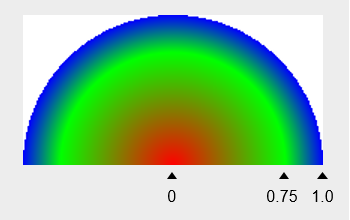

如上图是设置颜色数组为红绿蓝，位置数组为0.0，0.75，1.0后的显示效果。三角下标即为对应的颜色所在圆心和圆边界之间的相对位置，颜色与颜色之间使用渐变填充。

**返回值：**

| 类型    | 说明                       |
| ------- | ------------------------- |
| [ShaderEffect](#shadereffect12) | 返回创建的着色器对象。 |

**错误码：**

以下错误码的详细介绍请参见[通用错误码](../errorcode-universal.md)。

| 错误码ID | 错误信息 |
| ------- | --------------------------------------------|
| 401 | Parameter error.Possible causes:1.Mandatory parameters are left unspecified;2.Incorrect parameter types; 3. Parameter verification failed. |

**示例：**

```ts
import { common2D,drawing } from '@kit.ArkGraphics2D';

let centerPt: common2D.Point = { x: 100, y: 100 };
let shaderEffect = drawing.ShaderEffect.createRadialGradient(centerPt, 100, [0xFF00FF00, 0xFFFF0000], drawing.TileMode.REPEAT);
```

### createSweepGradient<sup>12+</sup>

static createSweepGradient(centerPt: common2D.Point, colors: Array\<number>,
  mode: TileMode, startAngle: number, endAngle: number, pos?: Array\<number> | null,
  matrix?: Matrix | null): ShaderEffect;

创建着色器，该着色器在给定中心的情况下生成扫描渐变。以给定中心为圆心，颜色在顺时针或逆时针方向上生成渐变称为扫描渐变。

**系统能力：** SystemCapability.Graphics.Drawing

**参数：**

| 参数名 | 类型                                               | 必填 | 说明           |
| ------ | -------------------------------------------------- | ---- | -------------- |
| centerPt  | [common2D.Point](js-apis-graphics-common2D.md#point)  | 是   | 表示渐变的圆心。 |
| colors | Array\<number> | 是   | 表示在起始角度和结束角度之间分布的颜色数组，数组中的值为32位（ARGB）无符号整数。 |
| mode  | [TileMode](#tilemode12) | 是   | 着色器效果平铺模式。 |
| startAngle | number | 是   | 表示扇形渐变的起始角度，单位为度。0度时为x轴正方向，正数往顺时针方向偏移，负数往逆时针方向偏移。该参数为浮点数。 |
| endAngle | number | 是   | 表示扇形渐变的结束角度，单位为度。0度时为x轴正方向，正数往顺时针方向偏移，负数往逆时针方向偏移。小于起始角度时无效。该参数为浮点数。 |
| pos | Array\<number> \| null | 否   | 表示每种对应颜色在颜色数组中的相对位置。数组长度需和colors保持一致，数组的首个元素应当是0.0，末尾元素应当是1.0，中间的元素应当在0与1之间并且逐下标递增，表示colors中每个对应颜色的相对位置。默认为null，表示颜色均匀分布在起始角度和结束角度之间。 |
| matrix | [Matrix](#matrix12) \| null | 否   |矩阵对象，用于对着色器做矩阵变换。默认为null，表示单位矩阵。 |


如上图是设置颜色数组为红绿蓝，位置数组为0.0，0.75，1.0，起始角度设置为0度，结束角度设置为180度后的显示效果。0.0对应0度的位置，0.75对应135度的位置，1.0对应180度的位置，颜色与颜色之间使用渐变填充。

**返回值：**

| 类型    | 说明                       |
| ------- | ------------------------- |
| [ShaderEffect](#shadereffect12) | 返回创建的着色器对象。 |

**错误码：**

以下错误码的详细介绍请参见[通用错误码](../errorcode-universal.md)。

| 错误码ID | 错误信息 |
| ------- | --------------------------------------------|
| 401 | Parameter error.Possible causes:1.Mandatory parameters are left unspecified;2.Incorrect parameter types; 3. Parameter verification failed. |

**示例：**

```ts
import { common2D,drawing } from '@kit.ArkGraphics2D';

let centerPt: common2D.Point = { x: 100, y: 100 };
let shaderEffect = drawing.ShaderEffect.createSweepGradient(centerPt, [0xFF00FF00, 0xFFFF0000], drawing.TileMode.REPEAT, 100, 200);
```

### createConicalGradient<sup>12+</sup>

static createConicalGradient(startPt: common2D.Point, startRadius: number, endPt: common2D.Point, endRadius: number, colors: Array\<number>, mode: TileMode, 
pos?: Array\<number> | null, matrix?: Matrix | null): ShaderEffect;

创建着色器，在给定两个圆之间生成径向渐变。

**系统能力：** SystemCapability.Graphics.Drawing

**参数：**

| 参数名 | 类型                                               | 必填 | 说明           |
| ------ | -------------------------------------------------- | ---- | -------------- |
| startPt  | [common2D.Point](js-apis-graphics-common2D.md#point)  | 是   |表示渐变的起始圆的圆心。 |
| startRadius | number | 是   | 表示渐变的起始圆的半径，小于0时无效。该参数为浮点数。 |
| endPt  | [common2D.Point](js-apis-graphics-common2D.md#point)  | 是   | 表示渐变的结束圆的圆心。 |
| endRadius | number | 是   | 表示渐变的结束圆的半径，小于0时无效。该参数为浮点数。 |
| colors | Array\<number> | 是   | 表示在起始圆和结束圆之间分布的颜色数组，数组中的值为32位（ARGB）无符号整数。 |
| mode  | [TileMode](#tilemode12) | 是   | 着色器效果平铺模式。 |
| pos | Array\<number> \| null | 否   | 表示每种对应颜色在颜色数组中的相对位置。数组长度需和colors保持一致，数组的首个元素应当是0.0，末尾元素应当是1.0，中间的元素应当在0与1之间并且逐下标递增，表示colors中每个对应颜色的相对位置。默认为null，表示颜色均匀分布在起始圆和结束圆之间。|
| matrix | [Matrix](#matrix12) \| null | 否   | 矩阵对象，用于对着色器做矩阵变换。默认为null，表示单位矩阵。 |


如上图是设置颜色数组为红绿蓝，位置数组为0.0，0.5，1.0的绘制结果。左侧为起始圆不在结束圆内的绘制结果，右侧为起始圆在结束圆内的绘制结果。

**返回值：**

| 类型    | 说明                       |
| ------- | ------------------------- |
| [ShaderEffect](#shadereffect12) | 返回创建的着色器对象。 |

**错误码：**

以下错误码的详细介绍请参见[通用错误码](../errorcode-universal.md)。

| 错误码ID | 错误信息 |
| ------- | --------------------------------------------|
| 401 | Parameter error.Possible causes:1.Mandatory parameters are left unspecified;2.Incorrect parameter types; 3. Parameter verification failed. |

**示例：**

```ts
import { common2D,drawing } from '@kit.ArkGraphics2D';

let startPt: common2D.Point = { x: 100, y: 100 };
let endPt: common2D.Point = {x: 200, y: 200};
let shaderEffect = drawing.ShaderEffect.createConicalGradient(startPt, 100, endPt, 50, [0xFF00FF00, 0xFFFF0000], drawing.TileMode.REPEAT);
```

## Tool<sup>15+</sup>

本模块定义的工具类，仅提供静态的方法，主要完成其他模块和[common2D](js-apis-graphics-common2D.md)中定义的数据结构的转换功能等操作。

### makeColorFromResourceColor<sup>15+</sup>

static makeColorFromResourceColor(resourceColor: ResourceColor): common2D.Color

将ResourceColor类型的值转换为common2D.Color对象。

**系统能力：** SystemCapability.Graphics.Drawing

**参数：**

| 参数名 | 类型                                               | 必填 | 说明           |
| ------ | -------------------------------------------------- | ---- | -------------- |
| resourceColor | [ResourceColor](../apis-arkui/arkui-ts/ts-types.md#resourcecolor) | 是   | ResourceColor格式的颜色值（支持所有的4种输入，示例中提供13个示例输入）。其中第4种类型[Resource](../apis-arkui/arkui-ts/ts-types.md#resource)只接受``$r('belonging.type.name')``构造方法，需要确保该资源在main/resources/base/element目录下已定义(app支持color、string和integer，sys只支持color)。 |

**返回值：**

| 类型    | 说明                       |
| ------- | ------------------------- |
| [common2D.Color](js-apis-graphics-common2D.md#color) | 转换后的common2D.Color颜色对象，若转换失败则返回空指针。 |

**错误码：**

以下错误码的详细介绍请参见[通用错误码](../errorcode-universal.md)。

| 错误码ID | 错误信息 |
| ------- | --------------------------------------------|
| 401 | Parameter error.Possible causes:1.Mandatory parameters are left unspecified;2.Incorrect parameter types. |

**示例：**

```ts
import { drawing, common2D } from '@kit.ArkGraphics2D';

// Color
let color1: common2D.Color = drawing.Tool.makeColorFromResourceColor(Color.Blue);

// Number
let color2: common2D.Color = drawing.Tool.makeColorFromResourceColor(0xffc0cb);
let color3: common2D.Color = drawing.Tool.makeColorFromResourceColor(0x11ffa500);

// String
let color4: common2D.Color = drawing.Tool.makeColorFromResourceColor('#ff0000');
let color5: common2D.Color = drawing.Tool.makeColorFromResourceColor('#110000ff');
let color6: common2D.Color = drawing.Tool.makeColorFromResourceColor('#00f');
let color7: common2D.Color = drawing.Tool.makeColorFromResourceColor('#100f');
let color8: common2D.Color = drawing.Tool.makeColorFromResourceColor('rgb(255, 100, 255)');
let color9: common2D.Color = drawing.Tool.makeColorFromResourceColor('rgba(255, 100, 255, 0.5)');

// Resource
let color10: common2D.Color = drawing.Tool.makeColorFromResourceColor($r('sys.color.ohos_id_color_secondary'));
let color11: common2D.Color = drawing.Tool.makeColorFromResourceColor($r('app.color.appColorTest'));
let color12: common2D.Color = drawing.Tool.makeColorFromResourceColor($r('app.string.appColorTest'));
let color13: common2D.Color = drawing.Tool.makeColorFromResourceColor($r('app.integer.appColorTest'));

// Use color
let brush = new drawing.Brush();
brush.setColor(color1);
```

## RegionOp<sup>12+</sup>

两个区域合并时的操作的枚举。

**系统能力**：SystemCapability.Graphics.Drawing

| 名称                   | 值   | 说明                           | 示意图   |
| --------------------- | ---- | ------------------------------ | -------- |
| DIFFERENCE         | 0    | 两个区域相减操作。  | 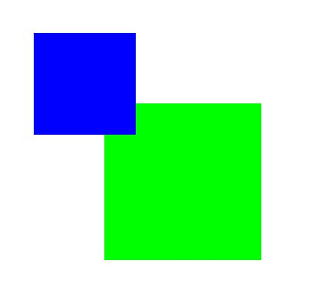 |
| INTERSECT          | 1    | 两个区域相交操作。 |  |
| UNION              | 2    | 两个区域联合操作。   | 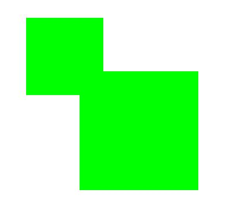 |
| XOR                | 3    | 两个区域异或操作。   | 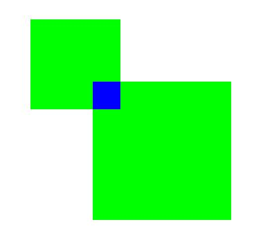 |
| REVERSE_DIFFERENCE | 4    | 两个区域反向相减操作。   |  |
| REPLACE            | 5    | 两个区域替换操作。   |  |

> **说明：**
>
> 示意图展示的是以一个红色区域为基础，使用不同枚举值与另一个蓝色区域合并后获得的结果，其中绿色区域为最终得到的区域。

## CornerPos<sup>12+</sup>

圆角位置枚举。

**系统能力**：SystemCapability.Graphics.Drawing

| 名称                   | 值   | 说明                           |
| --------------------- | ---- | ------------------------------ | 
| TOP_LEFT_POS          | 0    | 左上角圆角位置。  |
| TOP_RIGHT_POS         | 1    | 右上角圆角位置。 |
| BOTTOM_RIGHT_POS      | 2    | 右下角圆角位置。   |
| BOTTOM_LEFT_POS       | 3    | 左下角圆角位置。   |