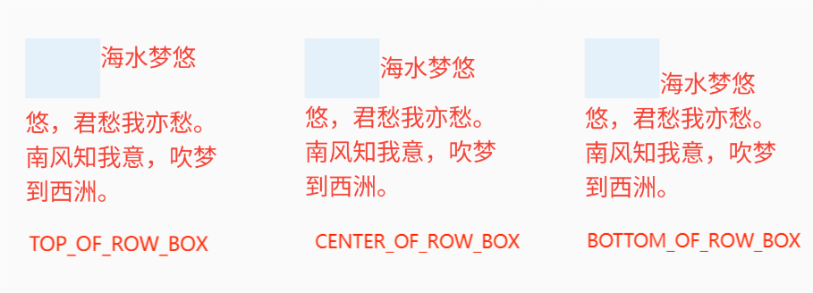
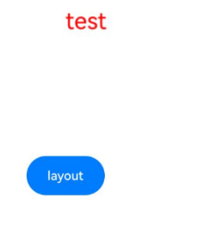
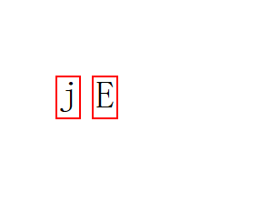
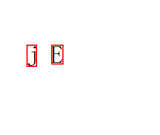
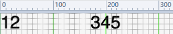

# @ohos.graphics.text (文本模块)

本模块提供一系列用于文本布局和字体管理的编程接口。文本布局相关的接口旨在提供高质量的排版，包括字符到字形的转换、字距调整、换行、对齐、文本测量等。字体管理接口提供字体注册、字体描述符、字体集管理等功能。

该模块提供以下创建复杂样式的文本段落的常用类：

- [TextStyle](#textstyle)：文本样式，控制文本的字体类型、大小、间距等属性。
- [FontCollection](#fontcollection)：字体集，控制各种不同的字体。
- [FontDescriptor](#fontdescriptor14)：字体描述符信息。
- [ParagraphStyle](#paragraphstyle)：段落样式，控制整个段落的断行策略、断词策略等属性。
- [ParagraphBuilder](#paragraphbuilder)：段落生成器，控制生成不同的段落对象。
- [Paragraph](#paragraph)：段落，由ParagraphBuilder类调用[build()](#build)接口构建而成。
- [LineTypeset](#linetypeset18)：行排版器，由ParagraphBuilder类调用[buildLineTypeset()](#buildlinetypeset18)接口构建而成。
- [TextLine](#textline)：以行为单位的段落文本的载体，由Paragraph类调用[getTextLines()](#gettextlines)接口获取。
- [Run](#run)：文本排版单元，由TextLine类调用[getGlyphRuns()](#getglyphruns)接口获取。

> **说明：**
>
> 本模块首批接口从API version 12开始支持。后续版本的新增接口，采用上角标单独标记接口的起始版本。

## 导入模块

```ts
import { text } from '@kit.ArkGraphics2D';
```

## text.setTextHighContrast<sup>20+</sup>

setTextHighContrast(action: TextHighContrast): void

用于设置文字渲染高对比度模式。

该接口设置后整个进程都会生效，进程内所有页面共用相同模式。

可调用此接口设置，也可通过系统设置界面中**高对比度文字配置开关**进行开启/关闭。使用此接口设置开启/关闭文字渲染高对比度配置的优先级高于系统开关设置。

该接口针对应用的文字自绘制场景不生效。

**系统能力**：SystemCapability.Graphics.Drawing

**参数：**

| 参数名 | 类型               | 必填 | 说明                              |
| ----- | ------------------ | ---- | --------------------------------------------------------------------------------- |
| action | [TextHighContrast](#texthighcontrast20)  | 是   | 文字渲染高对比度模式。                                                              |

**示例：**

```ts
text.setTextHighContrast(text.TextHighContrast.TEXT_APP_DISABLE_HIGH_CONTRAST)
```

## text.setTextUndefinedGlyphDisplay<sup>20+</sup>

setTextUndefinedGlyphDisplay(noGlyphShow: TextUndefinedGlyphDisplay): void

设置字符映射到.notdef（未定义）字形时要使用的字形类型。

影响此调用后呈现的所有文本。

此配置会影响显示字体中未定义字符的方式：

- 默认行为遵循字体的内部.notdef字形设计。
- 开启后将强制使缺失字形的字符以豆腐块形式显示。

**系统能力**：SystemCapability.Graphics.Drawing

**参数：**

| 参数名 | 类型               | 必填 | 说明                              |
| ----- | ------------------ | ---- | ------------------------------------------------------------------------------- |
| noGlyphShow | [TextUndefinedGlyphDisplay](#textundefinedglyphdisplay20) | 是   | 无法塑形字符的显示方式。 |

**示例：**

```ts
text.setTextUndefinedGlyphDisplay(text.TextUndefinedGlyphDisplay.USE_TOFU)
```

## text.matchFontDescriptors<sup>18+</sup>

matchFontDescriptors(desc: FontDescriptor): Promise&lt;Array&lt;FontDescriptor&gt;&gt;

根据指定的字体描述符返回所有符合要求的系统字体描述符，使用Promise异步回调。

**系统能力**：SystemCapability.Graphics.Drawing

**参数：**

| 参数名 | 类型 | 必填 | 说明 |
| - | - | - | - |
| desc | [FontDescriptor](#fontdescriptor14) | 是 | 指定需要用来做匹配的字体描述符。如果不指定任何字段，则返回系统的所有字体描述符。如果填写了指定字段，则按照指定字段进行匹配。如果匹配失败，返回空数组。 |

**返回值：**

| 类型 | 说明 |
| - | - |
| Promise&lt;Array&lt;[FontDescriptor](#fontdescriptor14)&gt;&gt; | Promise对象，返回所有匹配到的系统字体描述符。 |

**错误码：**

以下错误码的详细介绍请参见[通用错误码](../errorcode-universal.md)。

| 错误码ID | 错误信息 |
| ------- | --------------------------------------------|
| 401 | Parameter error. Possible causes: 1. Mandatory parameters are left unspecified;2. Incorrect parameter types;3. Parameter verification failed. |

**示例：**

```ts
import { text } from "@kit.ArkGraphics2D"
import { BusinessError } from '@kit.BasicServicesKit';

@Entry
@Component
struct Index {
  build() {
    Row() {
      Column() {
        Button("font descriptor")
          .fontSize(30)
          .fontWeight(FontWeight.Bold)
          .width(300)
          .height(80)
          .onClick(() => {
            console.info(`Get font descriptor start`)
            let promise = text.matchFontDescriptors({
              weight: text.FontWeight.W400,
            })
            promise.then((data) => {
              console.info(`Font descriptor array size: ${data.length}`);
              console.info(`Font descriptor result: ${JSON.stringify(data)}`)
            }).catch((error: BusinessError) => {
              console.error(`Failed to match the font descriptor, error: ${JSON.stringify(error)}`);
            });
          })
      }
      .width('100%')
    }
    .height('100%')
  }
}
```

## text.getSystemFontFullNamesByType<sup>14+</sup>

getSystemFontFullNamesByType(fontType: SystemFontType): Promise&lt;Array&lt;string&gt;&gt;

根据字体类型返回该类型对应的所有字体的字体名称，使用Promise异步回调。

**系统能力：** SystemCapability.Graphics.Drawing

**参数：**

| 参数名 | 类型 | 必填 | 说明 |
| - | - | - | - |
| fontType | [SystemFontType](#systemfonttype14) | 是 | 指定的字体类型。 |

**返回值：**

| 类型 | 说明 |
| - | - |
| Promise&lt;Array&lt;string&gt;&gt; | Promise对象，返回相应字体类型的所有字体的fullName。 |

**错误码：**

以下错误码的详细介绍请参见[通用错误码](../errorcode-universal.md)。

| 错误码ID | 错误信息 |
| ------- | --------------------------------------------|
| 401 | Parameter error. Possible causes: 1. Mandatory parameters are left unspecified;2. Incorrect parameter types; 3. Parameter verification failed. |

**示例：**

```ts
import { text } from "@kit.ArkGraphics2D"
import { BusinessError } from '@kit.BasicServicesKit';

@Entry
@Component
struct Index {
  build() {
    Row() {
      Column() {
        Button("get font list")
          .fontSize(30)
          .fontWeight(FontWeight.Bold)
          .width(300)
          .height(80)
          .onClick(() => {
            let fontType:text.SystemFontType = text.SystemFontType.GENERIC
            let promise = text.getSystemFontFullNamesByType(fontType)
            promise.then((data) => {
              console.info(`then font list size: ${data.length}`)
              data.forEach((fontItem) => {
                console.info(fontItem)
              })
            }).catch((error: BusinessError) => {
              console.error(`Failed to get font fullNames by type, error: ${JSON.stringify(error)}`);
            });
          })
      }
      .width('100%')
    }
    .height('100%')
  }
}
```

## text.getFontDescriptorByFullName<sup>14+</sup>

getFontDescriptorByFullName(fullName: string, fontType: SystemFontType): Promise&lt;FontDescriptor&gt;

根据字体名称和类型获取字体描述符，使用Promise异步回调。

字体描述符是描述字体特征的数据结构，包含字体外观和属性的详细信息。

**系统能力：** SystemCapability.Graphics.Drawing

**参数：**

| 参数名 | 类型 | 必填 | 说明 |
| - | - | - | - |
| fullName | string | 是 | 指定的字体名称。对应字体文件的name表中的fullName。可以使用[getSystemFontFullNamesByType](#textgetsystemfontfullnamesbytype14)获取。 |
| fontType | [SystemFontType](#systemfonttype14) | 是 | 指定的字体类型。 |

**返回值：**

| 类型 | 说明 |
| - | - |
| Promise&lt;[FontDescriptor](#fontdescriptor14)&gt; | Promise对象，返回指定的字体描述符。 |

**错误码：**

以下错误码的详细介绍请参见[通用错误码](../errorcode-universal.md)。

| 错误码ID | 错误信息 |
| ------- | --------------------------------------------|
| 401 | Parameter error.Possible causes:1.Mandatory parameters are left unspecified;2.Incorrect parameter types. |

**示例：**

```ts
import { text } from "@kit.ArkGraphics2D"
import { BusinessError } from '@kit.BasicServicesKit';

@Entry
@Component
struct Index {
  build() {
    Row() {
      Column() {
        Button("get fontDesciptor")
          .fontSize(30)
          .fontWeight(FontWeight.Bold)
          .width(300)
          .height(80)
          .onClick(() => {
            let fontType:text.SystemFontType = text.SystemFontType.GENERIC
            let promise = text.getFontDescriptorByFullName("HarmonyOS Sans", fontType)
            promise.then((fontdecriptor) => {
              console.info(`desc: ${JSON.stringify(fontdecriptor)}`)
            }).catch((error: BusinessError) => {
              console.error(`Failed to get fontDescriptor by fullName, error: ${JSON.stringify(error)}`);
            });
          })
      }
      .width('100%')
    }
    .height('100%')
  }
}
```

## TextHighContrast<sup>20+</sup>

文字渲染高对比度配置类型枚举。

**系统能力：** SystemCapability.Graphics.Drawing

| 名称                               | 值   | 说明                                            |
| ---------------------------------- | ---- | ---------------------------------------------- |
| TEXT_FOLLOW_SYSTEM_HIGH_CONTRAST   | 0    | 跟随系统设置中的高对比度文字配置。                                            |
| TEXT_APP_DISABLE_HIGH_CONTRAST     | 1    | 关闭APP的文字渲染高对比度配置，该模式的优先级要高于系统设置中的高对比度文字配置。 |
| TEXT_APP_ENABLE_HIGH_CONTRAST      | 2    | 开启APP的文字渲染高对比度配置，该模式的优先级要高于系统设置中的高对比度文字配置。 |

## TextUndefinedGlyphDisplay<sup>20+</sup>

文本未定义字形时的显示方式枚举。

**系统能力：** SystemCapability.Graphics.Drawing

| 名称           | 值   | 说明                                 |
| -------------- | ---- | ------------------------------------ |
| USE_DEFAULT    | 0    | 使用字体的内部.notdef字形。遵循字体的内部.notdef字形设计，可以是空框、空格或自定义符号。|
| USE_TOFU       | 1    | 总是用显式的豆腐块替换未定义的字形，覆盖字体的默认行为。用于调试缺失字符或强制一致的缺失符号显示。|

## TextAlign

文本对齐方式枚举。

**系统能力：** SystemCapability.Graphics.Drawing

| 名称        | 值   | 说明                                          |
| --------- | ---- | ---------------------------------------------- |
| LEFT      | 0    | 文本靠左对齐。                                  |
| RIGHT     | 1    | 文本靠右对齐。                                  |
| CENTER    | 2    | 文本居中对齐。                                  |
| JUSTIFY   | 3    | 文本两侧对齐，对最后一行无效。                    |
| START     | 4    | 基于文本的方向[TextDirection](#textdirection)，文本靠开头方向对齐。 |
| END       | 5    | 基于文本的方向[TextDirection](#textdirection)，文本以结束方向对齐。 |

## TextVerticalAlign<sup>20+</sup>

文本垂直对齐方式枚举。

**系统能力：** SystemCapability.Graphics.Drawing

| 名称        | 值   | 说明                                          |
| --------- | ---- | ---------------------------------------------- |
| BASELINE | 0    | 文本基线对齐。                                  |
| BOTTOM | 1    | 文本底部对齐。                                  |
| CENTER    | 2    | 文本居中对齐。                                  |
| TOP | 3    | 文本顶部对齐。                    |

## TextDirection

文本排版方向枚举。

**系统能力：** SystemCapability.Graphics.Drawing

| 名称     | 值   | 说明              |
| -------- | ---- | ---------------- |
| RTL      | 0    | 文本从右到左排版。 |
| LTR      | 1    | 文本从左到右排版。 |

## BreakStrategy

断行策略枚举。

**系统能力：** SystemCapability.Graphics.Drawing

| 名称          | 值   | 说明                                            |
| ------------- | ---- | ---------------------------------------------- |
| GREEDY        | 0    | 尽可能将当前行填满，不会自动添加连词符。           |
| HIGH_QUALITY  | 1    | 布局优化，必要时会自动添加连词符。                |
| BALANCED      | 2    | 保证一个段落的每一行的宽度相同，必要时会添加连词符。|

## WordBreak

断词策略枚举。

**系统能力：** SystemCapability.Graphics.Drawing

| 名称                          | 值   | 说明                                                                                                                  |
|-----------------------------| ---- | -------------------------------------------------------------------------------------------------------------------- |
| NORMAL                      | 0    | 默认的换行规则。依据各自语言的规则，允许在字间发生换行。                                                                  |
| BREAK_ALL                   | 1    | 对于Non-CJK（非中文，日文，韩文）文本允许在任意字符内发生换行。该值适合包含一些非亚洲文本的亚洲文本，比如使连续的英文字符断行。|
| BREAK_WORD                  | 2    | 对于Non-CJK的文本可在任意2个字符间断行，一行文本中有断行破发点（如空白符）时，优先按破发点换行，保障单词优先完整显示。若整一行文本均无断行破发点时，则在任意2个字符间断行。对于CJK与NORMAL效果一致。|
| BREAK_HYPHEN<sup>18+</sup>  | 3    | 每行末尾单词尝试通过连字符“-”进行断行，若无法添加连字符“-”，则跟`BREAK_WORD`保持一致。                        |

## Decoration

文本装饰线。

**系统能力：** SystemCapability.Graphics.Drawing

| 名称                      | 类型                                                  | 只读 | 可选 | 说明                                         |
| ------------------------- | --------------------------------------------------- | ---- | ---- | -------------------------------------------- |
| textDecoration            | [TextDecorationType](#textdecorationtype)           | 是   | 是   | 装饰线类型，默认为NONE。                       |
| color                     | [common2D.Color](js-apis-graphics-common2D.md#color)| 是   | 是   | 装饰线颜色，默认为跟随文本颜色。                       |
| decorationStyle           | [TextDecorationStyle](#textdecorationstyle)         | 是   | 是   | 装饰线样式，默认为SOLID。                      |
| decorationThicknessScale  | number                                              | 是   | 是   | 装饰线粗细系数，浮点数，默认为1.0。如果设置的值小于等于0，则不会绘制装饰线。|

## TextDecorationType

装饰线类型枚举。

**系统能力：** SystemCapability.Graphics.Drawing

| 名称           | 值 | 说明        |
| -------------- | - | ----------- |
| NONE           | 0 | 无装饰线。|
| UNDERLINE      | 1 | 下划线。      |
| OVERLINE       | 2 | 上划线。     |
| LINE_THROUGH   | 4 | 删除线。      |

## TextDecorationStyle

装饰线样式枚举。

**系统能力：** SystemCapability.Graphics.Drawing

| 名称   | 值 | 说明   |
| ------ | - | ------ |
| SOLID  | 0 | 实线。  |
| DOUBLE | 1 | 双层线。|
| DOTTED | 2 | 点状线。|
| DASHED | 3 | 虚线。  |
| WAVY   | 4 | 波浪线。|

## FontWeight

字重枚举。

**系统能力：** SystemCapability.Graphics.Drawing

| 名称  | 值 | 说明   |
| ----- | - | ------- |
| W100  | 0 | 100字重。|
| W200  | 1 | 200字重。|
| W300  | 2 | 300字重。|
| W400  | 3 | 400字重。|
| W500  | 4 | 500字重。|
| W600  | 5 | 600字重。|
| W700  | 6 | 700字重。|
| W800  | 7 | 800字重。|
| W900  | 8 | 900字重。|

## FontWidth

字体宽度的枚举。

**系统能力：** SystemCapability.Graphics.Drawing

| 名称             | 值 | 说明       |
| ---------------- | - | ---------- |
| ULTRA_CONDENSED  | 1 | 超窄字宽。  |
| EXTRA_CONDENSED  | 2 | 特窄字宽。  |
| CONDENSED        | 3 | 窄的字宽。  |
| SEMI_CONDENSED   | 4 | 半窄字宽。  |
| NORMAL           | 5 | 常规字宽。  |
| SEMI_EXPANDED    | 6 | 半宽字宽。  |
| EXPANDED         | 7 | 宽的字宽。  |
| EXTRA_EXPANDED   | 8 | 特宽字宽。  |
| ULTRA_EXPANDED   | 9 | 超宽的字宽。|

## FontStyle

字体样式枚举。

**系统能力：** SystemCapability.Graphics.Drawing

| 名称    | 值 | 说明                                                 |
| ------- | - | ---------------------------------------------------- |
| NORMAL  | 0 | 常规样式。                                            |
| ITALIC  | 1 | 斜体。如果当前字体没有可用的斜体版本，会选用倾斜体替代。  |
| OBLIQUE | 2 | 倾斜体。如果当前字体没有可用的倾斜体版本，会选用斜体替代。|

## TextHeightBehavior

文本高度修饰符模式枚举。

**系统能力：** SystemCapability.Graphics.Drawing

| 名称                  |  值 | 说明                                                  |
| --------------------- | --- | ---------------------------------------------------- |
| ALL                   | 0x0 | 高度修饰符设置为段落中第一行上升、最后一行下降。            |
| DISABLE_FIRST_ASCENT  | 0x1 | 高度修饰符设置为禁止段落中第一行上升。                   |
| DISABLE_LAST_ASCENT   | 0x2 | 高度修饰符设置为禁止段落中最后一行下降。                 |
| DISABLE_ALL           | 0x1 \| 0x2 | 高度修饰符设置为禁止段落中第一行上升、最后一行下降。          |

## TextBaseline

文本基线类型枚举。

**系统能力：** SystemCapability.Graphics.Drawing

| 名称        | 值 | 说明 |
| ----------- | - | ---- |
| ALPHABETIC  | 0 | 用于拉丁字母的文本基线对齐。|
| IDEOGRAPHIC | 1 | 用于CJK（中文，日文，韩文）的文本基线对齐。|

## EllipsisMode

省略号类型枚举。

EllipsisMode.START和EllipsisMode.MIDDLE仅在单行超长文本生效。

**系统能力：** SystemCapability.Graphics.Drawing

| 名称   | 值 | 说明      |
| ------ | - | --------- |
| START  | 0 | 开头省略号，只在[ParagraphStyle](#paragraphstyle)中设置maxLines为1时生效。|
| MIDDLE | 1 | 中间省略号，只在[ParagraphStyle](#paragraphstyle)中设置maxLines为1时生效。|
| END    | 2 | 末尾省略号。|

## TextShadow

字体阴影。

**系统能力：** SystemCapability.Graphics.Drawing

| 名称          | 类型                                                 | 只读 | 可选 | 说明                               |
| ------------- | ---------------------------------------------------- | --  | ---  | --------------------------------- |
| color         | [common2D.Color](js-apis-graphics-common2D.md#color) | 是  |  是   | 字体阴影的颜色，默认为黑色Color(255, 0, 0, 0)。        |
| point         | [common2D.Point](js-apis-graphics-common2D.md#point12) | 是  |  是   | 字体阴影基于当前文本的偏移位置，横、纵坐标要大于等于零。    |
| blurRadius    | number                                               | 是  |  是   | 模糊半径，浮点数，默认为0.0px。       |

## RectStyle

矩形框样式。

**系统能力：** SystemCapability.Graphics.Drawing

| 名称               | 类型                                                 | 只读 | 可选 | 说明                                      |
| -----------------  | ---------------------------------------------------- | --  | ---  | ---------------------------------------- |
| color              | [common2D.Color](js-apis-graphics-common2D.md#color) | 是  |  否   | 矩形框的颜色。                 |
| leftTopRadius      | number                                               | 是  |  否   | 矩形框的左上半径。       |
| rightTopRadius     | number                                               | 是  |  否   | 矩形框的右上半径。       |
| rightBottomRadius  | number                                               | 是  |  否   | 矩形框的右下半径。       |
| leftBottomRadius   | number                                               | 是  |  否   | 矩形框的左下半径。       |

## FontFeature

文本字体特征。

**系统能力：** SystemCapability.Graphics.Drawing

| 名称      | 类型                                                 | 只读 | 可选 | 说明                                       |
| --------- | ---------------------------------------------------- | --  | ---  | ----------------------------------------- |
| name      | string                                               | 是  |  否   | 字体特征键值对中的关键字标识的字符串。       |
| value     | number                                               | 是  |  否   | 字体特征键值对的值。                        |

## FontVariation

可变字体属性。

**系统能力：** SystemCapability.Graphics.Drawing

| 名称      | 类型                                                 | 只读 | 可选 | 说明                                       |
| --------- | ---------------------------------------------------- | --  | ---  | ----------------------------------------- |
| axis      | string                                               | 是  |  否   | 可变字体属性键值对中的关键字标识的字符串。       |
| value     | number                                               | 是  |  否   | 可变字体属性键值对的值。                        |

## TextBadgeType<sup>20+</sup>

文本上下标枚举。

**系统能力：** SystemCapability.Graphics.Drawing

| 名称   | 值 | 说明      |
| ------ | - | --------- |
| TEXT_BADGE_NONE | 0 | 不使能上下标。 |
| TEXT_SUPERSCRIPT | 1 | 使能上标。 |
| TEXT_SUBSCRIPT | 2 | 使能下标。 |

## TextStyle

文本样式。

**系统能力：** SystemCapability.Graphics.Drawing

| 名称                      | 类型                                     | 只读 | 可选 | 说明                                                   |
| ------------- | ---------------------------------------------------- | -- | -- | --------------------------------------------------------- |
| decoration    | [Decoration](#decoration)                            | 是 | 是 | 装饰线设置，默认不使用装饰线。             |
| color         | [common2D.Color](js-apis-graphics-common2D.md#color) | 是 | 是 | 文字颜色，默认为白色。                         |
| fontWeight    | [FontWeight](#fontweight)                            | 是 | 是 | 字重，默认为W400。 目前只有系统默认字体支持字重的调节，其他字体设置字重值小于semi-bold（即W600）时字体粗细无变化，当设置字重值大于等于semi-bold（即W600）时可能会触发伪加粗效果。                         |
| fontStyle     | [FontStyle](#fontstyle)                              | 是 | 是 | 字体样式，默认为常规样式。                          |
| baseline      | [TextBaseline](#textbaseline)                        | 是 | 是 | 文本基线类型，默认为ALPHABETIC。               |
| fontFamilies  | Array\<string>                                       | 是 | 是 | 字体家族名称列表，默认为空，匹配系统字体。                    |
| fontSize      | number                                               | 是 | 是 | 字体大小，浮点数，默认为14.0，单位为px。  |
| letterSpacing | number                                               | 是 | 是 | 字符间距，正数拉开字符距离，若是负数则拉近字符距离，浮点数，默认为0.0，单位为物理像素px。|
| wordSpacing   | number                                               | 是 | 是 | 单词间距，浮点数，默认为0.0，单位为px。                 |
| heightScale   | number                                               | 是 | 是 | 行高缩放倍数，浮点数，默认为1.0，heightOnly为true时生效。              |
| heightOnly    | boolean                                              | 是 | 是 | true表示根据字体大小和heightScale设置文本框的高度，false表示根据行高和行距，默认为false。|
| halfLeading   | boolean                                              | 是 | 是 | true表示将行间距平分至行的顶部与底部，false则不平分，默认为false。|
| ellipsis      | string                                               | 是 | 是 | 省略号文本，表示省略号生效后使用该字段值替换省略号部分。       |
| ellipsisMode  | [EllipsisMode](#ellipsismode)                        | 是 | 是 | 省略号类型，默认为END，行尾省略号。                       |
| locale        | string                                               | 是 | 是 | 语言类型，如字段为'en'代表英文，'zh-Hans'代表简体中文，'zh-Hant'代表繁体中文。具体请参照ISO 639-1规范，默认为空字符串。|
| baselineShift | number                                               | 是 | 是 | 文本下划线的偏移距离，浮点数，默认为0.0px。                 |
| fontFeatures  | Array\<[FontFeature](#fontfeature)>                  | 是 | 是 | 文本字体特征数组。|
| fontVariations| Array\<[FontVariation](#fontvariation)>              | 是 | 是 | 可变字体属性数组。|
| textShadows   | Array\<[TextShadow](#textshadow)>                    | 是 | 是 | 文本阴影数组。|
| backgroundRect| [RectStyle](#rectstyle)                              | 是 | 是 | 文本矩形框样式。|
| badgeType<sup>20+</sup>   | [TextBadgeType](#textbadgetype20) | 是   | 是   | 设置文本排版时是否使能上标或下标。TEXT_SUPERSCRIPT表示使能上标，TEXT_SUBSCRIPT表示使能下标，默认值为TEXT_BADGE_NONE表示不使能。|

## StrutStyle

支柱样式，用于控制绘制文本的行间距、基线对齐方式以及其他与行高相关的属性，默认不开启。

**系统能力：** SystemCapability.Graphics.Drawing

| 名称                      | 类型                                       | 只读 | 可选 | 说明                                                                 |
| -------------  | ---------------------------------------------------- | ---- | -- | --------------------------------------------------------------------- |
| fontFamilies   | Array\<string>                                       | 是   | 是 | 字体家族名称列表，默认为空，匹配系统字体。                                               |
| fontStyle      | [FontStyle](#fontstyle)                              | 是   | 是 | 字体样式，默认为常规样式。                                               |
| fontWidth      | [FontWidth](#fontwidth)                              | 是   | 是 | 字体宽度，默认为NORMAL。                                                |
| fontWeight     | [FontWeight](#fontweight)                            | 是   | 是 | 字重，默认为W400。系统默认字体支持字重调节，其他字体设置字重值小于W600时无变化，大于等于W600时可能触发伪加粗效果。                             |
| fontSize       | number                                               | 是   | 是 | 字体大小，浮点数，默认14.0，单位物理像素px。                             |
| height         | number                                               | 是   | 是 | 行高缩放倍数，浮点数，默认为1.0。                                         |
| leading        | number                                               | 是   | 是 | 以自定义行距应用于支柱的行距，浮点数，默认为-1.0。                          |
| forceHeight    | boolean                                              | 是   | 是 | 是否所有行都将使用支柱的高度，true表示使用，false表示不使用，默认为false。     |
| enabled        | boolean                                              | 是   | 是 | 是否启用支柱样式，true表示使用，false表示不使用，默认为false。              |
| heightOverride | boolean                                              | 是   | 是 | 是否覆盖高度，true表示覆盖，false表示不覆盖，默认为false。                  |
| halfLeading    | boolean                                              | 是   | 是 | true表示将行间距平分至行的顶部与底部，false则不平分，默认为false。           |

## FontDescriptor<sup>14+</sup>

字体描述符信息。

**系统能力**：SystemCapability.Graphics.Drawing

| 名称 | 类型 | 只读 | 可选 | 说明 |
| - | - | -  | - | - |
| path | string | 否 | 是 | 字体绝对路径，可取遵循系统限制的任意字符串，默认为空字符串。 |
| postScriptName | string | 否 | 是 | 字体唯一标识名称，可取任意字符串，默认为空字符串。 |
| fullName | string | 否 | 是 | 字体名称，可取任意字符串，默认为空字符串。 |
| fontFamily | string | 否 | 是 | 字体家族，可取任意字符串，默认为空字符串。 |
| fontSubfamily | string | 否 | 是 | 子字体家族，可取任意字符串，默认为空字符串。 |
| weight | [FontWeight](#fontweight) | 否 | 是 | 字体字重，默认值为0。 |
| width | number | 否 | 是 | 字体宽度，取值范围1-9整数，默认值为0。 |
| italic | number | 否 | 是 | 是否是斜体字体，0表示非斜体，1表示斜体，默认值为0。 |
| monoSpace | boolean | 否 | 是 | 是否是等宽字体，true表示等宽，false表示非等宽，默认值为false。 |
| symbolic | boolean | 否 | 是 | 是否支持符号，true表示支持，false表示不支持，默认值为false。 |

## FontCollection

字体集。

### getGlobalInstance

static getGlobalInstance(): FontCollection

获取应用全局FontCollection实例。

**系统能力**：SystemCapability.Graphics.Drawing

**返回值：**

| 类型   | 说明                |
| ------ | ------------------ |
| [FontCollection](#fontcollection) | FontCollection对象。|

**示例：**

```ts
import { text } from "@kit.ArkGraphics2D"

function textFunc() {
  let fontCollection = text.FontCollection.getGlobalInstance();
}

@Entry
@Component
struct Index {
  fun: Function = textFunc;
  build() {
    Column() {
      Button().onClick(() => {
        this.fun();
      })
    }
  }
}
```

### loadFontSync

loadFontSync(name: string, path: string | Resource): void

同步接口，加载自定义字体。其中参数name对应的值需要在[TextStyle](#textstyle)中的fontFamilies属性配置，才能显示自定义字体效果。支持的字体文件格式包含：ttf、otf。

**系统能力**：SystemCapability.Graphics.Drawing

**参数：**

| 参数名 | 类型               | 必填 | 说明                              |
| ----- | ------------------ | ---- | --------------------------------------------------------------------------------- |
| name  | string             | 是   | 加载成字体后，调用该字体所使用的名称。                                                |
| path  | string \| [Resource](../apis-arkui/arkui-ts/ts-types.md#resource) | 是   | 需要导入的字体文件的路径，应为 "file:// + 字体文件绝对路径" 或 "rawfile/目录or文件名"。 |

**示例：**

```ts
import { text } from "@kit.ArkGraphics2D"

let fontCollection: text.FontCollection = new text.FontCollection();

@Entry
@Component
struct RenderTest {
  LoadFontSyncTest() {
    fontCollection.loadFontSync('Clock_01', 'file:///system/fonts/HarmonyClock_01.ttf')
    let fontFamilies: Array<string> = ["Clock_01"]
    let myTextStyle: text.TextStyle = {
      fontFamilies: fontFamilies
    };
    let myParagraphStyle: text.ParagraphStyle = {
      textStyle: myTextStyle,
    }
    let paragraphBuilder: text.ParagraphBuilder = new text.ParagraphBuilder(myParagraphStyle, fontCollection);

    let textData = "测试 loadFontSync 加载字体HarmonyClock_01.ttf";
    paragraphBuilder.addText(textData);
    let paragraph: text.Paragraph = paragraphBuilder.build();
    paragraph.layoutSync(600);
  }

  aboutToAppear() {
    this.LoadFontSyncTest();
  }

  build() {
  }
}
```

### loadFont<sup>18+</sup>

loadFont(name: string, path: string | Resource): Promise\<void>

异步接口，加载自定义字体。其中参数name对应的值需要在[TextStyle](#textstyle)中的fontFamilies属性配置，才能显示自定义字体效果，支持的字体文件格式包含：ttf、otf。

**系统能力**：SystemCapability.Graphics.Drawing

**参数：**

|   参数名 | 类型               | 必填 | 说明                              |
|   -----  | ------------------ | ---- | --------------------------------------------------------------------------------- |
|   name   | string             | 是   | 加载字体后，调用该字体所使用的别名，可填写任意字符串，可使用该别名指定并使用该字体。 |
|   path   | string \| [Resource](../apis-arkui/arkui-ts/ts-types.md#resource) | 是   | 需要加载的字体文件的路径，支持两种格式： "file:// + 字体文件绝对路径" 或 "rawfile/目录or文件名"。 |

**返回值：**

| 类型           | 说明                          |
| -------------- | ----------------------------- |
| Promise\<void> | 无返回结果的Promise对象。 |

**错误码：**

以下错误码的详细介绍请参见[通用错误码](../errorcode-universal.md)。

| 错误码ID | 错误信息 |
| ------- | --------------------------------------------|
| 401 | Parameter error. Possible causes: 1. Mandatory parameters are left unspecified;2. Incorrect parameter types; 3. Parameter verification failed.|

**示例：**

```ts
import { text } from "@kit.ArkGraphics2D"

let fontCollection: text.FontCollection = new text.FontCollection();

@Entry
@Component
struct RenderTest {
  async loadFontPromise() {
    fontCollection.loadFont('testName', 'file:///system/fonts/a.ttf').then((data) => {
      console.info(`Succeeded in doing loadFont ${JSON.stringify(data)} `);
    }).catch((error: Error) => {
      console.error(`Failed to do loadFont, error: ${JSON.stringify(error)} message: ${error.message}`);
    });
  }

  aboutToAppear() {
    this.loadFontPromise();
  }

  build() {
  }
}
```

### unloadFontSync<sup>20+</sup>
unloadFontSync(name: string): void

卸载指定的自定义字体，此接口为同步接口。

使用此接口卸载字体别名所对应的自定义字体后，对应的自定义字体将不再可用。

所有使用该字体别名的排版对象都应该被销毁重建。

- 卸载不存在的字体别名不会产生任何效果且不会抛出错误。
- 此操作仅影响后续字体使用。
- 卸载正在使用的字体可能导致文本渲染异常（如乱码或字形缺失）。

**系统能力**：SystemCapability.Graphics.Drawing

**参数：**

|   参数名 | 类型               | 必填 | 说明                              |
|   -----  | ------------------ | ---- | --------------------------------------------------------------------------------- |
|   name   | string             | 是   | 需要取消注册的字体别名，与加载字体时使用的别名相同。 |

**示例：**

``` ts
import { text } from "@kit.ArkGraphics2D"

@Entry
@Component
struct UnloadFontSyncTest {
  private fc: text.FontCollection = text.FontCollection.getGlobalInstance();
  @State content: string = "默认字体"

  build() {
    Column({ space: 10 }) {
      Text(this.content)
        .fontFamily("custom")
      Button("load font")
        .onClick(() => {
          this.fc.loadFontSync("custom", "file:///system/fonts/NotoSansCJK-Regular.ttc")
          this.content = "自定义字体"
        })
      Button("unload font")
        .onClick(() => {
          this.fc.unloadFontSync("custom")
          this.content = "默认字体"
        })
    }.width("100%")
    .height("100%")
    .justifyContent(FlexAlign.Center)
  }
}
```

### unloadFont<sup>20+</sup>
unloadFont(name: string): Promise\<void>

卸载指定的自定义字体。使用Promise异步回调。

使用此接口卸载字体别名所对应的自定义字体后，对应的自定义字体将不再可用。

所有使用该字体别名的排版对象都应该被销毁重建。

- 卸载不存在的字体别名不会产生任何效果且不会抛出错误。
- 此操作仅影响后续字体使用。
- 卸载正在使用的字体可能导致文本渲染异常（如乱码或字形缺失）。

**系统能力**：SystemCapability.Graphics.Drawing

**参数：**

| 参数名 | 类型               | 必填 | 说明                              |
| -----  | ------------------ | ---- | --------------------------------- |
| name   | string             | 是   | 需要卸载的字体的别名，与加载字体时使用的别名相同。 |

**返回值：**

| 类型           | 说明                      |
| -------------- | ------------------------- |
| Promise\<void> | 无返回结果的Promise对象。 |

**示例：**

```ts
import { text } from "@kit.ArkGraphics2D"

@Entry
@Component
struct UnloadFontTest {
  private fc: text.FontCollection = text.FontCollection.getGlobalInstance();
  @State content: string = "默认字体"

  build() {
    Column({ space: 10 }) {
      Text(this.content)
        .fontFamily("custom")
      Button("load font")
        .onClick(async () => {
          await this.fc.loadFont("custom", "file:///system/fonts/NotoSansCJK-Regular.ttc")
          this.content = "自定义字体"
        })
      Button("unload font")
        .onClick(async () => {
          await this.fc.unloadFont("custom")
          this.content = "默认字体"
        })
    }.width("100%")
    .height("100%")
    .justifyContent(FlexAlign.Center)
  }
}
```

### clearCaches

clearCaches(): void

清理字体排版缓存（字体排版缓存本身设有内存上限和清理机制，所占内存有限，如无内存要求，不建议清理）。

**系统能力**：SystemCapability.Graphics.Drawing

**示例：**

```ts
import { text } from "@kit.ArkGraphics2D"

@Entry
@Component
struct Index {
  build() {
    Column() {
      Button().onClick(() => {
        text.FontCollection.getGlobalInstance().clearCaches();
      })
    }
  }
}
```

## ParagraphStyle

段落样式。

**系统能力：** SystemCapability.Graphics.Drawing

| 名称                 | 类型                                        | 只读 | 可选 | 说明                                          |
| -------------------- | ------------------------------------------ | ---- | ---- | -------------------------------------------- |
| textStyle            | [TextStyle](#textstyle)                    | 是   | 是   | 作用于整个段落的文本样式，默认为初始的文本样式。|
| textDirection        | [TextDirection](#textdirection)            | 是   | 是   | 文本方向，默认为LTR。                          |
| align                | [TextAlign](#textalign)                    | 是   | 是   | 文本对齐方式，默认为START。若同时配置tab属性，制表符对齐方式将失效。|
| wordBreak            | [WordBreak](#wordbreak)                    | 是   | 是   | 断词类型，默认为BREAK_WORD。                    |
| maxLines             | number                                     | 是   | 是   | 最大行数限制，整数，默认为1e9。                  |
| breakStrategy        | [BreakStrategy](#breakstrategy)            | 是   | 是   | 断行策略，默认为GREEDY。                        |
| strutStyle           | [StrutStyle](#strutstyle)                  | 是   | 是   | 支柱样式，默认为初始的StrutStyle。               |
| textHeightBehavior   | [TextHeightBehavior](#textheightbehavior)  | 是   | 是   | 文本高度修饰符模式，默认为ALL。                              |
| tab<sup>18+</sup>   | [TextTab](#texttab18)  | 是   | 是   | 表示段落中文本制表符后的文本对齐方式及位置，默认将制表符替换为一个空格。此参数与文本对齐方式（align属性）或省略号样式（[TextStyle](#textstyle)中的ellipsis属性）共同配置时无效。 |
| trailingSpaceOptimized<sup>20+</sup>   | boolean | 是   | 是   | 表示文本排版时行尾空格是否参与对齐计算。true表示行尾空格不参与计算，false表示行尾空格参与计算，默认值为false。|
| autoSpace<sup>20+</sup>   | boolean | 是   | 是   | 设置文本排版时是否使能自动间距。true表示使能自动间距，则会在文本排版时自动调整CJK（中文字符、日文字符、韩文字符）与西文（拉丁字母、西里尔字母、希腊字母）、CJK与数字、CJK与版权符号、版权符号与数字、版权符号与西文之间的间距。false表示不使能自动间距，默认值为false。|
| verticalAlign<sup>20+</sup>   | [TextVerticalAlign](#textverticalalign20) | 是   | 是   | 文本垂直对齐方式，开启行高缩放（即设置[TextStyle](#textstyle)的heightScale）或行内不同字号（即设置[TextStyle](#textstyle)的fontSize）文本混排时生效。 |

## PlaceholderAlignment

占位符相对于周围文本的纵向对齐方式。

**系统能力：** SystemCapability.Graphics.Drawing

| 名称                | 值 | 说明                   |
| ------------------- | - | ---------------------- |
| OFFSET_AT_BASELINE  | 0 | 基线与文本基线对齐。     |
| ABOVE_BASELINE      | 1 | 底部与文本基线对齐。   |
| BELOW_BASELINE      | 2 | 顶部与文本基线对齐。   |
| TOP_OF_ROW_BOX      | 3 | 顶部与文本顶部对齐。   |
| BOTTOM_OF_ROW_BOX   | 4 | 底部与文本底部对齐。   |
| CENTER_OF_ROW_BOX   | 5 | 居中对齐。|
| FOLLOW_PARAGRAPH<sup>20+</sup> | 6 | 跟随文本排版对齐。|



> **说明：**
>
> 示意图展示了后三种对齐方式，前三种对齐方式类似，比较位置是文本基线，即绿色线条部分。
>
>

## PlaceholderSpan

描述占位符样式。

**系统能力：** SystemCapability.Graphics.Drawing

| 名称           | 类型                                           | 只读 | 可选 | 说明                         |
| -------------- | --------------------------------------------- | ---- | --- | --------------------------- |
| width          | number                                        | 是   | 否   | 占位符的宽度，浮点数，单位为物理像素px。|
| height         | number                                        | 是   | 否   | 占位符的高度，浮点数，单位为物理像素px。|
| align          | [PlaceholderAlignment](#placeholderalignment) | 是   | 否   | 相对于周围文本的纵向对齐方式。|
| baseline       | [TextBaseline](#textbaseline)                 | 是   | 否   | 基线类型。                   |
| baselineOffset | number                                        | 是   | 否   | 基线偏移量，浮点数，单位为物理像素px。  |

## Range

描述左闭右开区间。

**系统能力：** SystemCapability.Graphics.Drawing

| 名称   | 类型   | 只读 | 可选 | 说明            |
| ----- | ------ | ---- | --- | --------------- |
| start | number | 是   | 否   | 区间左侧端点索引，整数。|
| end   | number | 是   | 否   | 区间右侧端点索引，整数。|

## Paragraph

保存文本内容及样式的载体，支持排版与绘制操作。

下列API示例中都需先使用[ParagraphBuilder](#paragraphbuilder)类的[build()](#build)接口获取到Paragraph对象实例，再通过此实例调用对应方法。

### layoutSync

layoutSync(width: number): void

进行排版并计算所有字形位置。

**系统能力**：SystemCapability.Graphics.Drawing

**参数：**

| 参数名 | 类型   | 必填 | 说明           |
| ----- | ------ | ---- | -------------- |
| width | number | 是   | 单行的最大宽度，浮点数，单位为物理像素px。|

**示例：**

```ts
paragraph.layoutSync(100);
```

### layout<sup>18+</sup>

layout(width: number): Promise\<void>

进行排版并计算所有字形位置，使用Promise异步回调。

**系统能力**：SystemCapability.Graphics.Drawing

**参数：**

|   参数名   |    类型               | 必填 | 说明                                    |
|   -----   |   ------------------  | ---- | --------------------------------------- |
|   width   | number                | 是   | 单行的最大宽度，浮点数，单位为物理像素px。    |

**返回值：**

| 类型           | 说明                          |
| -------------- | ----------------------------- |
| Promise\<void> | 无返回结果的Promise对象。 |

**错误码：**

以下错误码的详细介绍请参见[通用错误码](../errorcode-universal.md)。

| 错误码ID | 错误信息 |
| ------- | --------------------------------------------|
| 401 | Parameter error. Possible causes: 1. Mandatory parameters are left unspecified;2. Incorrect parameter types;3. Parameter verification failed. |

**示例：**

```ts
import { drawing, text } from '@kit.ArkGraphics2D'
import { image } from '@kit.ImageKit';

let textStyle: text.TextStyle = {
  color: {
    alpha: 255,
    red: 255,
    green: 0,
    blue: 0
  },
  fontSize: 30,
};
let paragraphStyle: text.ParagraphStyle = {
  textStyle: textStyle,
};
let fontCollection: text.FontCollection = new text.FontCollection();
let paragraphBuilder = new text.ParagraphBuilder(paragraphStyle, fontCollection);
// 添加文本字符串
paragraphBuilder.addText("test");
// 生成排版对象
let paragraph = paragraphBuilder.build();

function textFunc(pixelmap: PixelMap) {
  // 通过图片对象构造画布
  let canvas = new drawing.Canvas(pixelmap);
  // 进行绘制文本字符串
  paragraph.paint(canvas, 100, 10);
}

@Entry
@Component
struct Index {
  @State pixelmap?: PixelMap = undefined;
  fun: Function = textFunc;

  async prepareLayoutPromise() {
    // 排版对象进行布局计算
    paragraph.layout(200).then((data) => {
      console.info(`Succeeded in doing layout,  ${JSON.stringify(data)}`);
    }).catch((error: Error) => {
      console.error(`Failed to do layout, error: ${JSON.stringify(error)} message: ${error.message}`);
    });
  }

  aboutToAppear() {
    this.prepareLayoutPromise();
  }

  build() {
    Column() {
      Image(this.pixelmap).width(200).height(200);
      Button("layout")
        .width(100)
        .height(50)
        .onClick(() => {
          const color: ArrayBuffer = new ArrayBuffer(160000);
          let opts: image.InitializationOptions = { editable: true, pixelFormat: 3, size: { height: 200, width: 200 } }
          if (this.pixelmap == undefined) {
            // 构造图片对象
            this.pixelmap = image.createPixelMapSync(color, opts);
          }
          // 进行绘制文字
          this.fun(this.pixelmap);
        })
    }
  }
}
```

>**说明：**
>
>示意图展示了点击按钮后layout接口示例代码的运行结果。
>
>

### paint

paint(canvas: drawing.Canvas, x: number, y: number): void

在画布上以 (x, y) 为左上角绘制文本。

**系统能力**：SystemCapability.Graphics.Drawing

**参数：**

| 参数名 | 类型                                                  | 必填 | 说明                    |
| ------ | ---------------------------------------------------- | ---- | ---------------------- |
| canvas | [drawing.Canvas](js-apis-graphics-drawing.md#canvas) | 是   | 绘制的目标画布。         |
|    x   | number                                               | 是   | 绘制的左上角位置的横坐标，浮点数。|
|    y   | number                                               | 是   | 绘制的左上角位置的纵坐标，浮点数。|

**示例：**

```ts
const color: ArrayBuffer = new ArrayBuffer(160000);
let opts: image.InitializationOptions = { editable: true, pixelFormat: 3, size: { height: 200, width: 200 } }
let pixelMap: image.PixelMap = image.createPixelMapSync(color, opts);
let canvas = new drawing.Canvas(pixelMap);
paragraph.paint(canvas, 0, 0);
```

### paintOnPath

paintOnPath(canvas: drawing.Canvas, path: drawing.Path, hOffset: number, vOffset: number): void

在画布上沿路径绘制文本。

**系统能力**：SystemCapability.Graphics.Drawing

**参数：**

| 参数名 | 类型                                                  | 必填 | 说明                    |
| ------ | ---------------------------------------------------- | ---- | ---------------------- |
| canvas | [drawing.Canvas](js-apis-graphics-drawing.md#canvas) | 是   | 绘制的目标画布。         |
| path | [drawing.Path](js-apis-graphics-drawing.md#path) | 是   | 确认文字位置的路径。         |
|    hOffset   | number                                               | 是   | 沿路径方向偏置，从路径起点向前为正，向后为负。|
|    vOffset   | number                                               | 是   | 沿路径垂直方向偏置，沿路径方向左侧为负，右侧为正。|

**示例：**

```ts
const color: ArrayBuffer = new ArrayBuffer(160000);
let opts: image.InitializationOptions = { editable: true, pixelFormat: 3, size: { height: 200, width: 200 } }
let pixelMap: image.PixelMap = image.createPixelMapSync(color, opts);
let canvas = new drawing.Canvas(pixelMap);
let path = new drawing.Path();
path.arcTo(20, 20, 180, 180, 180, 90);
paragraph.paintOnPath(canvas, path, 0, 0);
```

### getMaxWidth

getMaxWidth(): number

获取文本最大行宽。

**系统能力**：SystemCapability.Graphics.Drawing

**返回值：**

| 类型   | 说明       |
| ------ | --------- |
| number | 最大的行宽，浮点数，单位为物理像素px。|

**示例：**

```ts
let maxWidth = paragraph.getMaxWidth();
```

### getHeight

getHeight(): number

获取文本总高度。

**系统能力**：SystemCapability.Graphics.Drawing

**返回值：**

| 类型   | 说明   |
| ------ | ----- |
| number | 总高度，浮点数，单位为物理像素px。|

**示例：**

```ts
let height = paragraph.getHeight();
```

### getLongestLine

getLongestLine(): number

获取文本最长行宽。

**系统能力**：SystemCapability.Graphics.Drawing

**返回值：**

| 类型   | 说明           |
| ------ | ------------- |
| number | 最长一行的宽度，浮点数，单位为物理像素px。|

**示例：**

```ts
let longestLine = paragraph.getLongestLine();
```

### getLongestLineWithIndent<sup>13+</sup>

getLongestLineWithIndent(): number

获取文本最长一行的宽度（包含缩进），建议向上取整。文本内容为空时返回0。

**系统能力**：SystemCapability.Graphics.Drawing

**返回值：**

| 类型   | 说明           |
| ------ | ------------- |
| number | 最长一行的宽度（该宽度包含当前行缩进的宽度），浮点数，单位为物理像素px。|

**示例：**

```ts
let longestLineWithIndent = paragraph.getLongestLineWithIndent();
```

### getMinIntrinsicWidth

getMinIntrinsicWidth(): number

获取段落最小固有宽度。

**系统能力**：SystemCapability.Graphics.Drawing

**返回值：**

| 类型   | 说明                           |
| ------ | ----------------------------- |
| number | 该段落所占水平空间的最小固有宽度，浮点数，单位为物理像素px。|

**示例：**

```ts
let minIntrinsicWidth = paragraph.getMinIntrinsicWidth();
```

### getMaxIntrinsicWidth

getMaxIntrinsicWidth(): number

获取段落最大固有宽度。

**系统能力**：SystemCapability.Graphics.Drawing

**返回值：**

| 类型   | 说明                           |
| ------ | ----------------------------- |
| number | 该段落所占水平空间的最大固有宽度，浮点数，单位为物理像素px。|

**示例：**

```ts
let maxIntrinsicWidth = paragraph.getMaxIntrinsicWidth();
```

### getAlphabeticBaseline

getAlphabeticBaseline(): number

获取拉丁字母基线位置。

**系统能力**：SystemCapability.Graphics.Drawing

**返回值：**

| 类型   | 说明                |
| ------ | ------------------ |
| number | 拉丁字母下的基线位置，浮点数，单位为物理像素px。|

**示例：**

```ts
let alphabeticBaseline = paragraph.getAlphabeticBaseline();
```

### getIdeographicBaseline

getIdeographicBaseline(): number

获取表意字（如CJK（中文，日文，韩文））下的基线位置。

**系统能力**：SystemCapability.Graphics.Drawing

**返回值：**

| 类型   | 说明                  |
| ------ | -------------------- |
| number | 获取表意字下的基线位置，浮点数，单位为物理像素px。|

**示例：**

```ts
let ideographicBaseline = paragraph.getIdeographicBaseline();
```

### getRectsForRange

getRectsForRange(range: Range, widthStyle: RectWidthStyle, heightStyle: RectHeightStyle): Array\<TextBox>

获取给定的矩形区域宽度以及矩形区域高度的规格下，文本中该区间范围内的字符所占的矩形区域。

**系统能力**：SystemCapability.Graphics.Drawing

**参数：**

| 参数名      | 类型                                 | 必填 | 说明                     |
| ----------- | ----------------------------------- | ---- | ------------------------ |
| range       | [Range](#range)                     | 是   | 需要获取的区域的文本区间。  |
| widthStyle  | [RectWidthStyle](#rectwidthstyle)   | 是   | 返回的矩形区域的宽度的规格。|
| heightStyle | [RectHeightStyle](#rectheightstyle) | 是   | 返回的矩形区域的高度的规格。|

**返回值：**

| 类型                         | 说明        |
| --------------------------- | ----------- |
| Array\<[TextBox](#textbox)> | 矩形区域数组。|

**示例：**

```ts
let range: text.Range = { start: 0, end: 1};
let rects = paragraph.getRectsForRange(range, text.RectWidthStyle.TIGHT, text.RectHeightStyle.TIGHT);
```

### getRectsForPlaceholders

getRectsForPlaceholders(): Array\<TextBox>

获取文本中所有占位符所占的矩形区域。

**系统能力**：SystemCapability.Graphics.Drawing

**返回值：**

| 类型                         | 说明        |
| --------------------------- | ----------- |
| Array\<[TextBox](#textbox)> | 矩形区域数组。|

**示例：**

```ts
let placeholderRects = paragraph.getRectsForPlaceholders();
```

### getGlyphPositionAtCoordinate

getGlyphPositionAtCoordinate(x: number, y: number): PositionWithAffinity

获取与给定坐标最接近的字形位置信息。

**系统能力**：SystemCapability.Graphics.Drawing

**参数：**

| 参数名 | 类型   | 必填 | 说明   |
| ----- | ------ | ---- | ------ |
| x     | number | 是   | 横坐标，浮点数。|
| y     | number | 是   | 纵坐标，浮点数。|

**返回值：**

| 类型                                          | 说明        |
| --------------------------------------------- | ----------- |
| [PositionWithAffinity](#positionwithaffinity) | 字形位置信息。|

**示例：**

```ts
let positionWithAffinity = paragraph.getGlyphPositionAtCoordinate(0, 0);
```

### getWordBoundary

getWordBoundary(offset: number): Range

返回给定offset的字形所在单词的索引区间。

**系统能力**：SystemCapability.Graphics.Drawing

**参数：**

| 参数名 | 类型    | 必填 | 说明        |
| ------ | ------ | ---- | ----------- |
| offset | number | 是   | 字形的偏移量，整数。|

**返回值：**

| 类型            | 说明            |
| --------------- | -------------- |
| [Range](#range) | 单词的索引区间。|

**示例：**

```ts
let wordRange = paragraph.getWordBoundary(0);
```

### getLineCount

getLineCount(): number

返回文本行数。

**系统能力**：SystemCapability.Graphics.Drawing

**返回值：**

| 类型   | 说明       |
| ------ | --------- |
| number | 文本行数量，整数。|

**示例：**

```ts
let lineCount = paragraph.getLineCount();
```

### getLineHeight

getLineHeight(line: number): number

返回指定行的行高。

**系统能力**：SystemCapability.Graphics.Drawing

**参数：**

| 参数名 | 类型   | 必填 | 说明      |
| ----- | ------ | ---- | --------- |
| line  | number | 是   | 文本行索引，整数，范围为0~getLineCount()-1。|

**返回值：**

| 类型   | 说明  |
| ------ | ---- |
| number | 行高。|

**示例：**

```ts
let lineHeight = paragraph.getLineHeight(0);
```

### getLineWidth

getLineWidth(line: number): number

返回指定行的行宽。

**系统能力**：SystemCapability.Graphics.Drawing

**参数：**

| 参数名 | 类型   | 必填 | 说明      |
| ----- | ------ | ---- | --------- |
| line  | number | 是   | 文本行索引，整数，范围为0~getLineCount()-1。|

**返回值：**

| 类型   | 说明  |
| ------ | ---- |
| number | 行宽。|

**示例：**

```ts
let lineWidth = paragraph.getLineWidth(0);
```

### didExceedMaxLines

didExceedMaxLines(): boolean

返回段落是否超过最大行数。

**系统能力**：SystemCapability.Graphics.Drawing

**返回值：**

| 类型    | 说明                                                      |
| ------- | -------------------------------------------------------- |
| boolean | true表示段落超出了最大行限制，false则表示没有超出最大行限制。 |

**示例：**

```ts
let didExceed = paragraph.didExceedMaxLines();
```

### getTextLines

getTextLines(): Array\<TextLine>

返回所有的文本行。

**系统能力**：SystemCapability.Graphics.Drawing

**返回值：**

| 类型                          | 说明          |
| ----------------------------- | ------------- |
| Array\<[TextLine](#textline)> | 文本行载体数组。|

**示例：**

```ts
let lines = paragraph.getTextLines();
```

### getActualTextRange

getActualTextRange(lineNumber: number, includeSpaces: boolean): Range

获取指定行的实际可见文本范围，不包括溢出的省略号。

**系统能力**：SystemCapability.Graphics.Drawing

**参数：**

| 参数名 | 类型   | 必填 | 说明      |
| ----- | ------ | ---- | --------- |
| lineNumber  | number | 是   | 要获取文本范围的行索引，行索引从0开始。该接口只能获取已有行的边界，即输入行索引从0开始。最大行索引为文本行数量-1，文本行数量可通过[getLineCount](#getlinecount)接口获取。|
| includeSpaces  | boolean | 是   | 表示是否应包含空白字符。true表示包含空白字符，false表示不包含空白字符。|

**返回值：**

| 类型             | 说明                                              |
| ---------------- | ------------------------------------------------ |
| [Range](#range)  | 返回对应行数的实际文本范围。如果行索引非法，返回的start和end均为0。 |

**示例：**

```ts
let rang = paragraph.getActualTextRange(0, true);
```


### getLineMetrics

getLineMetrics(): Array\<LineMetrics>

获取文本行的行度量数组。

**系统能力**：SystemCapability.Graphics.Drawing

**返回值：**

| 类型                          | 说明          |
| ----------------------------- | ------------- |
| Array\<[LineMetrics](#linemetrics)> | 文本行的行度量数组。|

**示例：**

```ts
let arrLineMetrc =  paragraph.getLineMetrics();
```

### getLineMetrics

getLineMetrics(lineNumber: number): LineMetrics | undefined

获取特定行号的行度量信息。

**系统能力**：SystemCapability.Graphics.Drawing

**参数：**

| 参数名 | 类型   | 必填 | 说明      |
| ----- | ------ | ---- | --------- |
| lineNumber  | number | 是   | 要查询度量信息的行的编号，行号从0开始。|

**返回值：**

| 类型             | 说明                                              |
| ---------------- | ------------------------------------------------ |
| [LineMetrics](#linemetrics) | 如果指定的行号有效且度量信息存在，则返回一个包含该行度量数据的LineMetrics对象；如果行号无效或无法获取度量信息，则返回undefined。                  |

**示例：**

```ts
let lineMetrics =  paragraph.getLineMetrics(0);
```

### updateColor<sup>20+</sup>

updateColor(color: common2D.Color): void;

更新整个文本段落的颜色。如果当前装饰线未设置颜色，使用该接口也会同时更新装饰线的颜色。

**系统能力**：SystemCapability.Graphics.Drawing

**参数：**

| 参数名 | 类型                                                  | 必填 | 说明                    |
| ------ | ---------------------------------------------------- | ---- | ---------------------- |
| color  | [common2D.Color](js-apis-graphics-common2D.md#color) | 是   | 更新后的字体色。|

**示例：**

```ts
paragraph.updateColor({ alpha: 255, red: 255, green: 0, blue: 0 });
```

### updateDecoration<sup>20+</sup>

updateDecoration(decoration: Decoration): void;

更新整个文本段落的装饰线。

**系统能力**：SystemCapability.Graphics.Drawing

**参数：**

| 参数名 | 类型                                                  | 必填 | 说明                    |
| ------ | ---------------------------------------------------- | ---- | ---------------------- |
| decoration | [Decoration](#decoration)                        | 是 | 更新后的装饰线。|

**示例：**

```ts
paragraph.updateDecoration({
  textDecoration: text.TextDecorationType.OVERLINE,
  color: { alpha: 255, red: 255, green: 0, blue: 0 },
  decorationStyle: text.TextDecorationStyle.WAVY,
  decorationThicknessScale: 2.0,
});
```

## LineTypeset<sup>18+</sup>

保存着文本内容以及样式的载体，可以用于计算单行排版信息。

下列API示例中都需先使用[ParagraphBuilder](#paragraphbuilder)类的[buildLineTypeset()](#buildlinetypeset18)接口获取到LineTypeset对象实例，再通过此实例调用对应方法。

### getLineBreak<sup>18+</sup>

getLineBreak(startIndex: number, width: number): number

计算在限定宽度下，从指定位置开始可以排版的字符数。

**系统能力**：SystemCapability.Graphics.Drawing

**参数：**

| 参数名 | 类型   | 必填 | 说明           |
| ----- | ------ | ---- | -------------- |
| startIndex | number | 是 | 开始计算排版的起始位置（包括起始位置）。取值范围需要为[0,文本字符总数）的整数，参数非法时抛出异常。|
| width | number | 是   | 可用于排版的宽度，大于0的浮点数，单位为物理像素px。|

**返回值：**

| 类型         | 说明                         |
| ------------ | --------------------------- |
| number | 返回在限定排版宽度下，从指定位置开始可排版的字符总数，取值为整数。|

**错误码：**

以下错误码的详细介绍请参见[通用错误码](../errorcode-universal.md)。

| 错误码ID | 错误信息 |
| ------- | --------------------------------------------|
| 401 | Parameter error.Possible causes:1.Mandatory parameters are left unspecified;2.Incorrect parameter types;3. Parameter verification failed. |

**示例：**

```ts
let startIndex = 0;
let width = 100.0;
let count = lineTypeset.getLineBreak(startIndex, width);
```

### createLine<sup>18+</sup>

createLine(startIndex: number, count: number): TextLine

根据指定的排版区间生成文本行对象。 

**系统能力**：SystemCapability.Graphics.Drawing

**参数：**

| 参数名 | 类型   | 必填 | 说明           |
| ----- | ------ | ---- | -------------- |
| startIndex | number | 是 | 开始计算排版的起始位置，整数，取值范围为[0, 文本字符总数)。|
| count | number | 是   | 从指定起始位置开始进行排版的字符个数，取值为[0,文本字符总数)的整数，startIndex和count之和不能大于文本字符总数。当count为0时，表示排版区间为[startIndex, 文本结尾]。可以先使用[getLineBreak](#getlinebreak18)获取合理的排版字符总数。|

**返回值：**

| 类型         | 说明                         |
| ------------ | --------------------------- |
| [TextLine](#textline) | 根据文本区间字符生成的TextLine对象。|

**错误码：**

以下错误码的详细介绍请参见[通用错误码](../errorcode-universal.md)。

| 错误码ID | 错误信息 |
| ------- | --------------------------------------------|
| 401 | Parameter error.Possible causes:1.Mandatory parameters are left unspecified;2.Incorrect parameter types;3. Parameter verification failed. |

**示例：**

```ts
let startIndex = 0;
let width = 100.0;
let count = lineTypeset.getLineBreak(startIndex, width);
let line : text.TextLine = lineTypeset.createLine(startIndex, count);
```

## RunMetrics

描述文本行中连续文本块的布局信息和度量数据。

**系统能力：** SystemCapability.Graphics.Drawing

| 名称      | 类型                                                | 只读 | 可选 | 说明        |
| --------- | -------------------------------------------------- | ---- | ---- | ----------- |
| textStyle | [TextStyle](#textstyle)                             | 是   | 否   | 字体的样式信息。|
| fontMetrics | [drawing.FontMetrics](js-apis-graphics-drawing.md#fontmetrics)| 是   | 否   | 字体度量信息。    |

## LineMetrics

描述文本布局中单行文字的度量信息。

**系统能力：** SystemCapability.Graphics.Drawing

| 名称      | 类型                                                | 只读 | 可选 | 说明        |
| --------- | -------------------------------------------------- | ---- | ---- | ----------- |
| startIndex | number                                            | 是   | 否   | 文本缓冲区中该行开始的索引位置。|
| endIndex   | number                                            | 是   | 否   | 文本缓冲区中该行结束的索引位置。|
| ascent     | number                                            | 是   | 否   | 文字上升高度，即从基线到字符顶部的距离。|
| descent    | number                                            | 是   | 否   | 文字下降高度，即从基线到字符底部的距离。|
| height     | number                                            | 是   | 否   | 当前行的高度，计算方式为 `Math.round(ascent + descent)`|
| width      | number                                            | 是   | 否   | 行的宽度。                      |
| left       | number                        | 是   | 否   | 行的左边缘位置。右边缘可通过 `left+width` 计算得出。|
| baseline   | number                        | 是   | 否   | 该行基线相对于段落顶部的 Y 坐标位置。|
| lineNumber   | number                        | 是   | 否   | 行号，从0开始计数。|
| topHeight   | number                        | 是   | 否   | 从顶部到当前行的高度。|
| runMetrics   | Map<number, [RunMetrics](#runmetrics)>                        | 是   | 否   | 文本索引范围与关联的字体度量信息之间的映射。|

## TextBox

文本矩形区域。

**系统能力：** SystemCapability.Graphics.Drawing

| 名称      | 类型                                                | 只读 | 可选 | 说明        |
| --------- | -------------------------------------------------- | ---- | ---- | ----------- |
| rect      | [common2D.Rect](js-apis-graphics-common2D.md#rect) | 是   | 否   | 矩形区域信息。|
| direction | [TextDirection](#textdirection)                    | 是   | 否   | 文本方向。    |

## PositionWithAffinity

位置和亲和度。

**系统能力：** SystemCapability.Graphics.Drawing

| 名称      | 类型                   | 只读 | 可选 | 说明                      |
| --------- | --------------------- | ---- | ---- | ------------------------ |
| position  | number                | 是   | 否   | 字形相对于段落的索引，整数。  |
| affinity  | [Affinity](#affinity) | 是   | 否   | 位置亲和度。               |

## RectWidthStyle

矩形区域宽度规格枚举。

**系统能力：** SystemCapability.Graphics.Drawing

| 名称  | 值 | 说明                                   |
| ----- | - | -------------------------------------- |
| TIGHT | 0 | 不设置letterSpacing时，与字形紧贴，否则包含letterSpacing的宽度。|
| MAX   | 1 | 扩展宽度，以匹配所有行上最宽矩形的位置。   |

## RectHeightStyle

矩形区域高度规格枚举。

**系统能力：** SystemCapability.Graphics.Drawing

| 名称                      | 值 | 说明                                           |
| ------------------------- | - | ---------------------------------------------- |
| TIGHT                     | 0 | 与字形紧贴。                                    |
| MAX                       | 1 | 扩展高度，以匹配所有行上最高矩形的位置。           |
| INCLUDE_LINE_SPACE_MIDDLE | 2 | 每个矩形的顶部和底部将覆盖行上方和行下方的一半空间。|
| INCLUDE_LINE_SPACE_TOP    | 3 | 行间距将被添加到矩形的顶部。                      |
| INCLUDE_LINE_SPACE_BOTTOM | 4 | 行间距将被添加到矩形的底部。                      |
| STRUT                     | 5 | 高度按照文本的样式设置。                          |

## Affinity

位置亲和度枚举。

**系统能力：** SystemCapability.Graphics.Drawing

| 名称       | 值 | 说明                          |
| ---------- | - | ----------------------------- |
| UPSTREAM   | 0 | 该位置与文本位置的前一位有关联。 |
| DOWNSTREAM | 1 | 该位置与文本位置的后一位有关联。 |

## ParagraphBuilder

段落生成器。

### constructor

constructor(paragraphStyle: ParagraphStyle, fontCollection: FontCollection)

ParagraphBuilder对象的构造函数。

**系统能力**：SystemCapability.Graphics.Drawing

**参数：**

| 参数名         | 类型                               | 必填 | 说明        |
| -------------- | --------------------------------- | ---- | ----------- |
| paragraphStyle | [ParagraphStyle](#paragraphstyle) | 是   | 段落样式。   |
| fontCollection | [FontCollection](#fontcollection) | 是   | 字体集。 |

**示例：**

```ts
import { text } from "@kit.ArkGraphics2D";

function textFunc() {
  let myTextStyle: text.TextStyle = {
    color: { alpha: 255, red: 255, green: 0, blue: 0 },
    fontSize: 33,
  };
  let myParagraphStyle: text.ParagraphStyle = {
    textStyle: myTextStyle,
    align: text.TextAlign.END,
  };
  let fontCollection = new text.FontCollection();
  let paragraphBuilder = new text.ParagraphBuilder(myParagraphStyle, fontCollection);
}

@Entry
@Component
struct Index {
  fun: Function = textFunc;
  build() {
    Column() {
      Button().onClick(() => {
        this.fun();
      })
    }
  }
}
```

### pushStyle

 pushStyle(textStyle: TextStyle): void

更新当前文本块的样式。

> **说明：**
>
> 更新当前文本块的样式，之后添加文字均采用该样式。

**系统能力**：SystemCapability.Graphics.Drawing

**参数：**

| 参数名    | 类型       | 必填 | 说明                                                                                                   |
| --------- | --------- | ---- | ------------------------------------------------------------------------------------------------------ |
| textStyle | [TextStyle](#textstyle) | 是   | 包含了对文本的各种视觉属性的定义，如字体、字号、颜色、字重、字间距、行距、装饰（如下划线、删除线）、文本阴影等。 |

**示例：**

```ts
import { drawing } from '@kit.ArkGraphics2D'
import { text } from "@kit.ArkGraphics2D"
import { common2D } from "@kit.ArkGraphics2D"
import { image } from '@kit.ImageKit';

function textFunc() {
  let myTextStyle: text.TextStyle = {
    color: { alpha: 255, red: 255, green: 0, blue: 0 },
    fontSize: 33,
  };
  let myParagraphStyle: text.ParagraphStyle = {
    textStyle: myTextStyle,
    align: text.TextAlign.CENTER,
  };
  let fontCollection = new text.FontCollection();
  let paragraphBuilder = new text.ParagraphBuilder(myParagraphStyle, fontCollection);
  paragraphBuilder.pushStyle(myTextStyle);
}

@Entry
@Component
struct Index {
  fun: Function = textFunc;
  build() {
    Column() {
      Button().onClick(() => {
        this.fun();
      })
    }
  }
}
```

### popStyle

popStyle(): void

弹出当前文本样式。

**系统能力**：SystemCapability.Graphics.Drawing

**示例：**

```ts
import { drawing } from '@kit.ArkGraphics2D'
import { text } from "@kit.ArkGraphics2D"
import { common2D } from "@kit.ArkGraphics2D"
import { image } from '@kit.ImageKit';

function textFunc() {
  let myTextStyle: text.TextStyle = {
    color: { alpha: 255, red: 255, green: 0, blue: 0 },
    fontSize: 33,
  };
  let myParagraphStyle: text.ParagraphStyle = {
    textStyle: myTextStyle,
    align: text.TextAlign.END,
  };
  let fontCollection = new text.FontCollection();
  let paragraphBuilder = new text.ParagraphBuilder(myParagraphStyle, fontCollection);
  paragraphBuilder.pushStyle(myTextStyle);
  paragraphBuilder.popStyle();
}

@Entry
@Component
struct Index {
  fun: Function = textFunc;
  build() {
    Column() {
      Button().onClick(() => {
        this.fun();
      })
    }
  }
}
```

### addText

addText(text: string): void

向正在构建的文本段落中插入具体的文本字符串。

**系统能力**：SystemCapability.Graphics.Drawing

**参数：**

| 参数名   | 类型    | 必填 | 说明                       |
| ------- | ------- | ---- | -------------------------- |
| text    | string  | 是   | 段落中插入的具体文本字符串，传入非法Unicode时会显示�。 |

**示例：**

```ts
import { drawing } from '@kit.ArkGraphics2D'
import { text } from "@kit.ArkGraphics2D"
import { common2D } from "@kit.ArkGraphics2D"
import { image } from '@kit.ImageKit';

function textFunc() {
  let myTextStyle: text.TextStyle = {
    color: { alpha: 255, red: 255, green: 0, blue: 0 },
    fontSize: 33,
  };
  let myParagraphStyle: text.ParagraphStyle = {
    textStyle: myTextStyle,
    align: text.TextAlign.END,
  };
  let fontCollection = new text.FontCollection();
  let paragraphBuilder = new text.ParagraphBuilder(myParagraphStyle, fontCollection);
  paragraphBuilder.addText("123666");
}

@Entry
@Component
struct Index {
  fun: Function = textFunc;
  build() {
    Column() {
      Button().onClick(() => {
        this.fun();
      })
    }
  }
}
```

### addPlaceholder

addPlaceholder(placeholderSpan: PlaceholderSpan): void

用于构建文本段落时插入占位符。

**系统能力**：SystemCapability.Graphics.Drawing

**参数：**

| 参数名          | 类型                                 | 必填 | 说明                                                |
| --------------- | ----------------------------------- | ---- | --------------------------------------------------- |
| placeholderSpan | [PlaceholderSpan](#placeholderspan) | 是   | 定义了占位符的尺寸、对齐方式、基线类型以及基线偏移量。  |

**示例：**

```ts
import { drawing } from '@kit.ArkGraphics2D'
import { text } from "@kit.ArkGraphics2D"
import { common2D } from "@kit.ArkGraphics2D"
import { image } from '@kit.ImageKit';

function textFunc() {
  let myParagraphStyle: text.ParagraphStyle = {
    align: text.TextAlign.END,
  };
  let myPlaceholderSpan: text.PlaceholderSpan = {
    width: 10000,
    height: 10000000,
    align: text.PlaceholderAlignment.ABOVE_BASELINE,
    baseline: text.TextBaseline.ALPHABETIC,
    baselineOffset: 100000
  };
  let fontCollection = new text.FontCollection();
  let paragraphBuilder = new text.ParagraphBuilder(myParagraphStyle, fontCollection);
  paragraphBuilder.addPlaceholder(myPlaceholderSpan);
}

@Entry
@Component
struct Index {
  fun: Function = textFunc;
  build() {
    Column() {
      Button().onClick(() => {
        this.fun();
      })
    }
  }
}
```

### build

build(): Paragraph

用于构建段落，生成可用于后续排版渲染的段落对象。

**系统能力**：SystemCapability.Graphics.Drawing

**返回值：**

| 类型                     | 说明                           |
| ------------------------ | ------------------------------ |
| [Paragraph](#paragraph)  | 可用于后续渲染的 Paragraph 对象。|

**示例：**

```ts
import { drawing, text, common2D } from '@kit.ArkGraphics2D'
import { image } from '@kit.ImageKit';

function textFunc() {
  let myTextStyle: text.TextStyle = {
    color : {alpha: 255, red: 255, green: 0, blue: 0},
    fontSize : 20,
  };
  let myParagraphStyle: text.ParagraphStyle = {
    textStyle : myTextStyle,
  };
  let fontCollection = new text.FontCollection();
  let paragraphBuilder = new text.ParagraphBuilder(myParagraphStyle, fontCollection);
  paragraphBuilder.addText("123456789");
  let paragraph = paragraphBuilder.build();
  paragraph.layoutSync(200);
}

@Entry
@Component
struct Index {
  fun: Function = textFunc;
  build() {
    Column() {
      Button().onClick(() => {
        this.fun();
      })
    }
  }
}
```

### buildLineTypeset<sup>18+</sup>

buildLineTypeset(): LineTypeset

构建行排版器。

**系统能力**：SystemCapability.Graphics.Drawing

**返回值：**

| 类型                     | 说明                           |
| ------------------------ | ------------------------------ |
| [LineTypeset](#linetypeset18)  | 可用于后续渲染的LineTypeset对象。|

**示例：**

```ts
import { text } from '@kit.ArkGraphics2D'

function test() {
  let myParagraphStyle: text.ParagraphStyle = {
    align: text.TextAlign.JUSTIFY,
  };
  let fontCollection = new text.FontCollection();
  let paragraphBuilder = new text.ParagraphBuilder(myParagraphStyle, fontCollection);
  paragraphBuilder.addText("123456789");
  let lineTypeset = paragraphBuilder.buildLineTypeset();
}

@Entry
@Component
struct Index {
  fun: Function = test;
  build() {
    Column() {
      Button().onClick(() => {
        this.fun();
      })
    }
  }
}
```

### addSymbol

addSymbol(symbolId: number): void

向正在构建的文本段落中插入具体符号。

**系统能力**：SystemCapability.Graphics.Drawing

**参数：**

| 参数名    | 类型    | 必填 | 说明                                                        |
| -------- | ------- | ---- | ----------------------------------------------------------- |
| symbolId | number  | 是   | 要设置的symbol码位，十六进制，当前支持的取值范围为：0xF0000-0xF0C97。可设置的symbol码位（即列表视图下的unicode值）请见[主题图标库](https://developer.huawei.com/consumer/cn/design/harmonyos-symbol/)。|

**示例：**

```ts
import { text } from "@kit.ArkGraphics2D";

function textFunc() {
  let myTextStyle: text.TextStyle = {
    color: { alpha: 255, red: 255, green: 0, blue: 0 },
    fontSize: 33,
  };
  let myParagraphStyle: text.ParagraphStyle = {
    textStyle: myTextStyle,
    align: text.TextAlign.END,
  };
  let fontCollection = new text.FontCollection();
  let paragraphBuilder = new text.ParagraphBuilder(myParagraphStyle, fontCollection);
  paragraphBuilder.addSymbol(0xF0000);
  let paragraph = paragraphBuilder.build();
}

@Entry
@Component
struct Index {
  fun: Function = textFunc;
  build() {
    Column() {
      Button().onClick(() => {
        this.fun();
      })
    }
  }
}
```

## TypographicBounds<sup>18+</sup>

文本行的排版边界。文本行排版边界与排版字体、排版字号有关，与字符本身无关，例如字符串为" a b "，'a'字符前面有1个空格，'b'字符后面有1个空格，排版边界就包括行首和末尾空格的边界。例如字符串为"j"或"E"，排版边界相同，即与字符本身无关。

**系统能力：** SystemCapability.Graphics.Drawing

| 名称 | 类型 | 只读 | 可选 | 说明 |
| - | - | - | - | - |
| ascent | number | 是 | 否 | 文本行的上升高度，浮点数。 |
| descent | number | 是 | 否 | 文本行的下降高度，浮点数。 |
| leading | number | 是 | 否 | 文本行的行间距，浮点数。 |
| width | number | 是 | 否 | 排版边界的总宽度，浮点数。 |

>**说明：**
>
>示意图展示了ascent、descent、leading、top、baseline、bottom、next line top的含义。width为文本行排版包括左右空格的宽度。ascent为文本行上升高度最高点，descent为文本行下降高度最低点，leading为文本行间距，top为文本行的最高点，baseline为字符基线，bottom为文本行的最低点，next line top为下一个文本行的最高点。
>
>
>
>示意图展示了字符串为" a b "的排版边界。
>
>
>
>示意图展示了字符串为"j"或"E"的排版边界。
>
>

## CaretOffsetsCallback<sup>18+</sup>

type CaretOffsetsCallback = (offset: number, index: number, leadingEdge: boolean) => boolean

将文本行中每个字符的偏移量和索引值作为参数的回调方法。

**系统能力：** SystemCapability.Graphics.Drawing

**参数：**
| 参数名 | 类型 | 必填 | 说明 |
| - | - | - | - |
| offset | number | 是 | 文本行中每个字符的偏移量，浮点数。 |
| index | number | 是 | 文本行中每个字符的索引值，整数。 |
| leadingEdge | boolean | 是 | 光标是否位于字符的前缘，true表示位于字符前缘，即偏移量不包含该字符宽度，false表示位于字符后缘，即偏移量包含该字符宽度。 |

**返回值：**

| 类型 | 说明 |
| - | - |
| boolean | 表示是否停止调用该回调函数，true表示停止调用该回调函数，false表示继续调用该回调函数。 |

## TextLine

描述段落基础文本行结构的载体。

下列API示例中都需先使用[Paragraph](#paragraph)类的[getTextLines()](#gettextlines)接口或者[LineTypeset](#linetypeset18)类的[createLine()](#createline18)接口获取到TextLine对象实例，再通过此实例调用对应方法。
### getGlyphCount

getGlyphCount(): number

获取文本行中字形的数量。

**系统能力**：SystemCapability.Graphics.Drawing

**返回值：**

| 类型    | 说明               |
| ------- | ------------------ |
| number  | 该文本行中字形数量，整数。 |

**示例：**

```ts
let glyphCount = lines[0].getGlyphCount();
```

### getTextRange

getTextRange(): Range

获取该行文本在整个段落文本中的索引区间。

**系统能力**：SystemCapability.Graphics.Drawing

**返回值：**

| 类型             | 说明                                              |
| ---------------- | ------------------------------------------------ |
| [Range](#range)  | 该行文本在整个段落文本中的索引区间。|

**示例：**

```ts
let textRange = lines[0].getTextRange();
```

### getGlyphRuns

getGlyphRuns(): Array\<Run>

获取文本行的排版单元数组。

**系统能力**：SystemCapability.Graphics.Drawing

**返回值：**

| 类型         | 说明                         |
| ------------ | --------------------------- |
| Array\<[Run](#run)>  | 该文本行中的文本排版单元数组。|

**示例：**

```ts
let runs = lines[0].getGlyphRuns();
```

### paint

paint(canvas: drawing.Canvas, x: number, y: number): void

在画布上以坐标点(x, y)为左上角位置绘制该文本行。

**系统能力**：SystemCapability.Graphics.Drawing

**参数：**

| 参数名 | 类型                                                  | 必填 | 说明                    |
| ------ | ---------------------------------------------------- | ---- | ---------------------- |
| canvas | [drawing.Canvas](js-apis-graphics-drawing.md#canvas) | 是   | 绘制的目标canvas。      |
|    x   | number                                               | 是   | 绘制的左上角位置的横坐标，浮点数。|
|    y   | number                                               | 是   | 绘制的左上角位置的纵坐标，浮点数。|

**示例：**

<!--code_no_check-->
```ts
import { drawing } from '@kit.ArkGraphics2D'
import { text } from "@kit.ArkGraphics2D"
import { common2D } from "@kit.ArkGraphics2D"
import { image } from '@kit.ImageKit';

function textFunc(pixelmap: PixelMap) {
  let canvas = new drawing.Canvas(pixelmap);
  lines[0].paint(canvas, 0, 0);
}

@Entry
@Component
struct Index {
  @State pixelmap?: PixelMap = undefined;
  fun: Function = textFunc;
  build() {
    Column() {
      Image(this.pixelmap).width(200).height(200);
      Button().onClick(() => {
        if (this.pixelmap == undefined) {
          const color: ArrayBuffer = new ArrayBuffer(160000);
          let opts: image.InitializationOptions = { editable: true, pixelFormat: 3, size: { height: 200, width: 200 } }
          this.pixelmap = image.createPixelMapSync(color, opts);
        }
        this.fun(this.pixelmap);
      })
    }
  }
}
```

### createTruncatedLine<sup>18+</sup>

createTruncatedLine(width: number, ellipsisMode: EllipsisMode, ellipsis: string): TextLine

创建一个截断的文本行对象。

**系统能力**：SystemCapability.Graphics.Drawing

**参数：**

| 参数名 | 类型 | 必填 | 说明                            |
| -| - | - |-------------------------------|
| width | number | 是 | 截断后的行宽度，浮点数。                  |
| ellipsisMode | [EllipsisMode](#ellipsismode) | 是 | 截断的类型，当前仅支持头部截断START和尾部截断END。 |
| ellipsis | string | 是 | 截断的标记字符串。                     |

**返回值：**

| 类型         | 说明                         |
| ------------ | --------------------------- |
| [TextLine](#textline)  | 截断的文本行对象。|

**示例：**

<!--code_no_check-->
```ts
import { drawing, text, common2D } from '@kit.ArkGraphics2D'
import { image } from '@kit.ImageKit';

function textFunc(pixelmap: PixelMap) {
  let canvas = new drawing.Canvas(pixelmap);
  let truncatedTextLine = lines[0].createTruncatedLine(100, text.EllipsisMode.START, "...");
  truncatedTextLine.paint(canvas, 0, 100);
}

@Entry
@Component
struct Index {
  @State pixelmap?: PixelMap = undefined;
  fun: Function = textFunc;
  build() {
    Column() {
      Image(this.pixelmap).width(200).height(200);
      Button().onClick(() => {
        if (this.pixelmap == undefined) {
          const color: ArrayBuffer = new ArrayBuffer(160000);
          let opts: image.InitializationOptions = { editable: true, pixelFormat: 3, size: { height: 200, width: 200 } }
          this.pixelmap = image.createPixelMapSync(color, opts);
        }
        this.fun(this.pixelmap);
      })
    }
  }
}
```

### getTypographicBounds<sup>18+</sup>

getTypographicBounds(): TypographicBounds

获取文本行的排版边界。文本行排版边界与排版字体、排版字号有关，与字符本身无关。例如字符串为" a b "，'a'字符前面有1个空格，'b'字符后面有1个空格，排版边界就包括行首和末尾空格的边界。例如字符串为"j"或"E"，排版边界相同，即与字符本身无关。

>**说明：**
>
>示意图展示了字符串为" a b "的排版边界。
>
>
>
>示意图展示了字符串为"j"或"E"的排版边界。
>
>

**系统能力**：SystemCapability.Graphics.Drawing

**返回值：**

| 类型 | 说明  |
| -| - |
| [TypographicBounds](#typographicbounds18) | 文本行的排版边界。|

**示例：**

```ts
let bounds = lines[0].getTypographicBounds();
console.info('textLine ascent:' + bounds.ascent + ', descent:' + bounds.descent + ', leading:' + bounds.leading + ', width:' + bounds.width);
```

### getImageBounds<sup>18+</sup>

getImageBounds(): common2D.Rect

获取文本行的图像边界。文本行图像边界与排版字体、排版字号、字符本身都有关，相当于视觉边界。例如字符串为" a b "，'a'字符前面有1个空格，'b'字符后面有1个空格，用户在界面上只能看到"a b"，图像边界即为不包括带行首和末尾空格的边界。例如字符串为"j"或"E"，视觉边界不同，即与字符本身有关，"j"字符串的视觉边界宽度小于"E"字符串的视觉边界宽度，"j"字符串的视觉边界高度大于"E"字符串的视觉边界高度。

>**说明：**
>
>示意图展示了字符串为" a b "的图像边界。
>
>
>
>示意图展示了字符串为"j"或"E"的图像边界。
>
>


**系统能力**：SystemCapability.Graphics.Drawing

**返回值：**

| 类型         | 说明                         |
| ------------ | --------------------------- |
| [common2D.Rect](js-apis-graphics-common2D.md#rect)  | 文本行的图像边界。|

**示例：**

```ts
let imageBounds = lines[0].getImageBounds();
```

### getTrailingSpaceWidth<sup>18+</sup>

getTrailingSpaceWidth(): number

获取文本行尾部空白字符的宽度。

**系统能力**：SystemCapability.Graphics.Drawing

**返回值：**

| 类型         | 说明                         |
| ------------ | --------------------------- |
| number | 文本行尾部空白字符的宽度，浮点数。|

**示例：**

```ts
let trailingSpaceWidth = lines[0].getTrailingSpaceWidth();
```

### getStringIndexForPosition<sup>18+</sup>

getStringIndexForPosition(point: common2D.Point): number

获取给定位置在原始字符串中的字符索引。

**系统能力**：SystemCapability.Graphics.Drawing

**参数：**

| 参数名 | 类型 | 必填 | 说明 |
| -| - | - | - |
| point | [common2D.Point](js-apis-graphics-common2D.md#point12) | 是 | 要查找索引的位置。|

**返回值：**

| 类型         | 说明                         |
| ------------ | --------------------------- |
| number | 给定位置在文本行中对应的字符串索引，整数。|

**示例：**

```ts
let point : common2D.Point = { x: 15.0, y: 2.0 };
let index = lines[0].getStringIndexForPosition(point);
```

### getOffsetForStringIndex<sup>18+</sup>

getOffsetForStringIndex(index: number): number

获取文本行中给定字符串索引处的偏移量。

**系统能力**：SystemCapability.Graphics.Drawing

**参数：**

| 参数名 | 类型 | 必填 | 说明 |
| -| - | - | - |
| index | number | 是 | 要获取偏移量的字符串索引，整数。|

**返回值：**

| 类型         | 说明                         |
| ------------ | --------------------------- |
| number | 给定字符串索引处的偏移量，浮点数。|

**示例：**

```ts
let offset = lines[0].getOffsetForStringIndex(3);
```

### enumerateCaretOffsets<sup>18+</sup>

enumerateCaretOffsets(callback: CaretOffsetsCallback): void

枚举文本行中每个字符的偏移量和索引值。

**系统能力**：SystemCapability.Graphics.Drawing

**参数：**

| 参数名 | 类型 | 必填 | 说明 |
| -| - | - | - |
| callback | [CaretOffsetsCallback](#caretoffsetscallback18) | 是 | 用户自定义函数。回调方法参数包括文本行中每个字符的偏移量和索引值。 |

**示例：**

```ts
function callback(offset: number, index: number, leadingEdge: boolean): boolean {
  console.info('textLine: offset: ' + offset + ', index: ' + index + ', leadingEdge: ' + leadingEdge);
  return index > 50;
}
lines[0].enumerateCaretOffsets(callback);
```

### getAlignmentOffset<sup>18+</sup>

getAlignmentOffset(alignmentFactor: number, alignmentWidth: number): number

获取文本行根据对齐因子和对齐宽度计算的对齐所需偏移量。

**系统能力**：SystemCapability.Graphics.Drawing

**参数：**

| 参数名 | 类型 | 必填 | 说明 |
| -| - | - | - |
| alignmentFactor | number | 是 | 对齐因子，即对齐的程度，浮点数。小于等于0.0表示左对齐，大于0.0小于0.5表示偏左对齐，0.5表示居中对齐，大于0.5小于1.0表示偏右对齐，大于等于1.0表示右对齐。|
| alignmentWidth | number | 是 | 对齐宽度，即文本行的宽度，浮点数。小于文本行的实际宽度时，返回0。|

**返回值：**

| 类型         | 说明                         |
| ------------ | --------------------------- |
| number | 计算得到的对齐所需偏移量，浮点数。|

**示例：**

```ts
let alignmentOffset = lines[0].getAlignmentOffset(0.5, 500);
```

## Run

文本排版单元。

下列API示例中都需先使用[TextLine](#textline)类的[getGlyphRuns()](#getglyphruns)接口获取Run对象实例，再通过此实例调用对应方法。

### getGlyphCount

getGlyphCount(): number

获取该排版单元中字形的数量。

**系统能力**：SystemCapability.Graphics.Drawing

**返回值：**

| 类型     | 说明                |
| ------- | -------------------- |
| number  | 该排版单元中字形数量，整数。 |

**示例：**

```ts
let glyphs = runs[0].getGlyphCount();
```

### getGlyphs

getGlyphs(): Array\<number>

获取该排版单元中每个字符的字形序号。

**系统能力**：SystemCapability.Graphics.Drawing

**返回值：**

| 类型            | 说明                             |
| --------------- | -------------------------------- |
| Array\<number>  | 该排版单元中每个字符对应的字形序号。|

**示例：**

```ts
let glyph = runs[0].getGlyphs();
```

### getGlyphs<sup>18+</sup>

getGlyphs(range: Range): Array\<number>

获取该排版单元指定范围内每个字符的字形序号。

**系统能力**：SystemCapability.Graphics.Drawing

**参数：**

| 参数名    | 类型    | 必填 | 说明                       |
| -------- | ------- | ---- | -------------------------- |
| range    | [Range](#range)   | 是   | 要获取的字形序号范围，range.start表示范围开始的位置，range.end表示范围的长度，如果长度是0表示从范围range.start开始获取到渲染块结束。当range.end、range.start为负数，或者传入null、undefined时，该方法将返回undefined。|

**返回值：**

| 类型            | 说明                             |
| --------------- | -------------------------------- |
| Array\<number>  | 该排版单元中每个字符对应的字形序号。|

**示例：**

<!--code_no_check-->
```ts
import { text } from "@kit.ArkGraphics2D"

function textFunc() {
  let glyphs = runs[0].getGlyphs(); // 获取渲染块全部字形序号
  let glyphsRange = runs[0].getGlyphs({start:1, end:2}); // 获取渲染块从起始位置1开始, 长度为2范围内的字形序号
  glyphsRange = runs[0].getGlyphs({start:-1, end:2}); // -1是非法参数，将返回undefined
  glyphsRange = runs[0].getGlyphs({start:0, end:-10}); // -10是非法参数，将返回undefined
  let glyphsNull = runs[0].getGlyphs(null); // null是非法参数，将返回undefined
  let glyphsUndefined = runs[0].getGlyphs(undefined); // undefined是非法参数，将返回undefined
}

@Entry
@Component
struct Index {
  fun: Function = textFunc;
  build() {
    Column() {
      Button().onClick(() => {
        this.fun();
      })
    }
  }
}
```

### getPositions

getPositions(): Array<common2D.Point>

获取该排版单元中每个字形相对于每行的字形位置。

**系统能力**：SystemCapability.Graphics.Drawing

**返回值：**

| 类型                   | 说明                                   |
| ---------------------- | ------------------------------------- |
| Array<[common2D.Point](js-apis-graphics-common2D.md#point12)>  | 该排版单元中每个字形相对于每行的字形位置。 |

**示例：**

```ts
let positions = runs[0].getPositions();
```
### getPositions<sup>18+</sup>

getPositions(range: Range): Array<common2D.Point>

获取该排版单元指定范围内每个字形相对于每行的字形位置数组。

**系统能力**：SystemCapability.Graphics.Drawing

**参数：**

| 参数名    | 类型    | 必填 | 说明                       |
| -------- | ------- | ---- | -------------------------- |
| range    | [Range](#range)   | 是   | 要获取的字形位置范围，range.start表示范围开始的位置，range.end表示范围的长度，如果长度是0表示从范围range.start开始获取到渲染块结束。当range.end、range.start为负数，或者传入null、undefined时，该方法将返回undefined。|

**返回值：**

| 类型                   | 说明                                   |
| ---------------------- | ------------------------------------- |
| Array<[common2D.Point](js-apis-graphics-common2D.md#point12)>  | 该排版单元中每个字形相对于每行的字形位置。 |

**示例：**

<!--code_no_check-->
```ts
import { text } from "@kit.ArkGraphics2D";

function textFunc() {
  let positions = runs[0].getPositions(); // 获取渲染块全部字形位置
  let positionsRange = runs[0].getPositions({start:1, end:2}); // 获取渲染块从起始位置1开始, 长度为2范围内的字形位置
  positionsRange = runs[0].getPositions({start:-1, end:2}); // -1是非法参数，将返回undefined
  positionsRange = runs[0].getPositions({start:0, end:-10}); // -10是非法参数，将返回undefined
  let positionsNull = runs[0].getPositions(null); // null是非法参数，将返回undefined
  let positionsUndefined = runs[0].getPositions(undefined); // undefined是非法参数，将返回undefined
}

@Entry
@Component
struct Index {
  fun: Function = textFunc;
  build() {
    Column() {
      Button().onClick(() => {
        this.fun();
      })
    }
  }
}
```

### getOffsets

getOffsets(): Array<common2D.Point>

获取该排版单元中每个字形的索引偏移量。

**系统能力**：SystemCapability.Graphics.Drawing

**返回值：**

| 类型                   | 说明           |
| ---------------------- | -------------- |
| Array<[common2D.Point](js-apis-graphics-common2D.md#point12)>  | 该排版单元中每个字形相对于其索引的偏移量。|

**示例：**

```ts
let offsets = runs[0].getOffsets();
```

### getFont

getFont(): drawing.Font

获取排版单元的字体属性对象。

**系统能力**：SystemCapability.Graphics.Drawing

**返回值：**

| 类型                   | 说明           |
| ------------------------------------------------- | -------------------------- |
| [drawing.Font](js-apis-graphics-drawing.md#font)  | 该排版单元的字体属性对象实例。|

**示例：**

```ts
let font = runs[0].getFont();
```

### paint

paint(canvas: drawing.Canvas, x: number, y: number): void

在画布上以(x, y)为左上角位置绘制排版单元。

**系统能力**：SystemCapability.Graphics.Drawing

**参数：**

| 参数名 | 类型                                                  | 必填 | 说明                    |
| ------ | ---------------------------------------------------- | ---- | ---------------------- |
| canvas | [drawing.Canvas](js-apis-graphics-drawing.md#canvas) | 是   | 绘制的目标 canvas。      |
|    x   | number                                               | 是   | 绘制的左上角位置的横坐标，浮点数。|
|    y   | number                                               | 是   | 绘制的左上角位置的纵坐标。浮点数。|

**示例：**

<!--code_no_check-->
```ts
import { drawing } from '@kit.ArkGraphics2D'
import { text } from "@kit.ArkGraphics2D"
import { common2D } from "@kit.ArkGraphics2D"
import { image } from '@kit.ImageKit';

function textFunc(pixelmap: PixelMap) {
  let canvas = new drawing.Canvas(pixelmap);
  runs[0].paint(canvas, 0, 0);
}

@Entry
@Component
struct Index {
  @State pixelmap?: PixelMap = undefined;
  fun: Function = textFunc;
  build() {
    Column() {
      Image(this.pixelmap).width(200).height(200);
      Button().onClick(() => {
        if (this.pixelmap == undefined) {
          const color: ArrayBuffer = new ArrayBuffer(160000);
          let opts: image.InitializationOptions = { editable: true, pixelFormat: 3, size: { height: 200, width: 200 } }
          this.pixelmap = image.createPixelMapSync(color, opts);
        }
        this.fun(this.pixelmap);
      })
    }
  }
}
```

### getStringRange<sup>18+</sup>

getStringRange(): Range

获取排版单元生成字形的字符范围。

**系统能力**：SystemCapability.Graphics.Drawing

**返回值：**

| 类型                   | 说明           |
| ---------------------- | -------------- |
| [Range](#range) | 排版单元生成字形的字符范围，Range类型中的start表示字符范围的开始位置，该位置是相对于整个段落的索引，Range类型中的end表示字符范围的长度。|


**示例：**

```ts
let runStringRange = runs[0].getStringRange();
let location = runStringRange.start;
let length = runStringRange.end;
```

### getStringIndices<sup>18+</sup>

getStringIndices(range?: Range): Array\<number>

获取排版单元指定范围内字形的字符索引，该索引是相对于整个段落的偏移。

**系统能力**：SystemCapability.Graphics.Drawing

**参数：**

| 参数名    | 类型    | 必填 | 说明                       |
| -------- | ------- | ---- | -------------------------- |
| range    | [Range](#range)   | 否   | 要获取的字符索引范围，range.start表示范围开始的位置，range.end表示范围的长度，如果长度是0表示从范围range.start开始获取到渲染块结束。当range.end、range.start为负数，或者传入null、undefined时，该方法将返回undefined。不传该参数时，默认获取整个渲染块。|

**返回值：**

| 类型                   | 说明           |
| ---------------------- | -------------- |
| Array\<number>  | 返回每个字符的索引。|

**示例：**

<!--code_no_check-->
```ts
import { text } from "@kit.ArkGraphics2D";

function textFunc() {
  let indices = runs[0].getStringIndices(); // 获取渲染块全部字符索引
  let indicesRange = runs[0].getStringIndices({start:1, end:2}); // 获取渲染块从起始位置1开始, 长度为2范围内的字符索引
  indicesRange = runs[0].getStringIndices({start:-1, end:2}); // -1是非法参数，将返回undefined
  indicesRange = runs[0].getStringIndices({start:0, end:-10}); // -10是非法参数，将返回undefined
  let indicesNull = runs[0].getStringIndices(null); // null是非法参数，将返回undefined
  let indicesUndefined = runs[0].getStringIndices(undefined); // undefined是非法参数，将返回undefined
}

@Entry
@Component
struct Index {
  fun: Function = textFunc;
  build() {
    Column() {
      Button().onClick(() => {
        this.fun();
      })
    }
  }
}
```

### getImageBounds<sup>18+</sup>

getImageBounds(): common2D.Rect

获取该排版单元的图像边界，图像边界与排版字体、排版字号、字符本身都有关，相当于视觉边界，例如字符串为" a b "，'a'字符前面有1个空格，'b'字符后面有1个空格，用户在界面上只能看到"a b"，图像边界即为不包括带行首和末尾空格的边界。

>**说明：**
>
>示意图展示了字符串为" a b "的图像边界。
>
>
>
>示意图展示了字符串为"j"或"E"的图像边界。
>
>

**系统能力**：SystemCapability.Graphics.Drawing

**返回值：**

| 类型                   | 说明           |
| ---------------------- | -------------- |
|   [common2D.Rect](js-apis-graphics-common2D.md#rect)  | 该排版单元的图像边界。|

**示例：**

```ts
let bounds = runs[0].getImageBounds();
```

### getTypographicBounds<sup>18+</sup>

getTypographicBounds(): TypographicBounds

获取该排版单元的排版边界，排版边界与排版字体、排版字号有关，与字符本身无关，例如字符串为" a b "，'a'字符前面有1个空格，'b'字符后面有1个空格，排版边界就包括行首和末尾空格的边界。

>**说明：**
>
>示意图展示了字符串为" a b "的排版边界。
>
>
>
>示意图展示了字符串为"j"或"E"的排版边界。
>
>

**系统能力**：SystemCapability.Graphics.Drawing

**返回值：**

| 类型                   | 说明           |
| ---------------------- | -------------- |
|  [TypographicBounds](#typographicbounds18)  | 该排版单元的排版边界。|

**示例：**

```ts
let typographicBounds = runs[0].getTypographicBounds();
```

### getTextDirection<sup>20+</sup>

getTextDirection(): TextDirection

获取该排版单元的文本方向。

**系统能力**：SystemCapability.Graphics.Drawing

**返回值：**

| 类型                   | 说明           |
| ---------------------- | -------------- |
|   [TextDirection](#textdirection)  | 返回该排版单元的文本方向。|

**示例：**

```ts
let textDirection = runs[0].getTextDirection();
```

### getAdvances<sup>20+</sup>

getAdvances(range: Range): Array<common2D.Point>

获取该排版单元指定范围内每个字形的字形宽度数组。

**系统能力**：SystemCapability.Graphics.Drawing

**参数：**

| 参数名    | 类型    | 必填 | 说明                       |
| -------- | ------- | ---- | -------------------------- |
| range    | [Range](#range)   | 是   | 要获取的字形位置范围。range.start表示范围开始的位置，range.end表示范围的长度。如果长度是0表示从range.start开始获取到渲染块结束。当range.end、range.start为负数，或者传入null、undefined时，该方法将返回undefined。|

**返回值：**

| 类型                   | 说明                                   |
| ---------------------- | ------------------------------------- |
| Array<[common2D.Point](js-apis-graphics-common2D.md#point12)>  | 返回该排版单元中每个字形相对于水平方向和垂直方向的字形宽度。 |

**示例：**

```ts
let advancesRange = runs[0].getAdvances({start:1, end:2}); // 获取渲染块从起始位置1开始, 长度为2范围内的字形宽度
advancesRange = runs[0].getAdvances({start:-1, end:2}); // -1是非法参数，将返回undefined
advancesRange = runs[0].getAdvances({start:0, end:-10}); // -10是非法参数，将返回undefined
let advancesNull = runs[0].getAdvances(null); // null是非法参数，将返回undefined
```

## TextTab<sup>18+</sup>

段落风格的文本制表符，储存了对齐方式和位置。

**系统能力：** SystemCapability.Graphics.Drawing

| 名称               | 类型                    | 只读 | 可选 | 说明                                               |
| -----------------  | ----------------------- | ---- | ---  | -------------------------------------------------- |
| alignment          | [TextAlign](#textalign) | 是   |  否  | 段落中制表符之后的文本对齐方式，支持设置[TextAlign](#textalign)的LEFT左对齐、RIGHT右对齐和CENTER居中对齐方式，其他枚举值为左对齐，默认为左对齐。 |
| location           | number                  | 是   |  否  | 制表符之后的文本对齐位置，浮点数，单位为物理像素px，最小值为1.0，当该值小于1.0时，该制表符会被替换为一个空格。 |

**示例：**

alignment为CENTER，location为200，文本为"12/t345"：



alignment为LEFT，location为100，文本为"abccccccccc/tdef"：


alignment为RIGHT，location为100，文本为"aabcdef/tg hi/tjkl/tmno/tp qr"：


## SystemFontType<sup>14+</sup>

字体类型枚举，通过位或运算可实现组合类型。

**系统能力：** SystemCapability.Graphics.Drawing

| 名称 | 值 | 说明 |
| - | - | - |
| ALL | 1 << 0 | 所有字体类型，包括系统字体类型、风格字体类型和用户已安装字体类型。 |
| GENERIC  | 1 << 1 | 系统字体类型。 |
| STYLISH  | 1 << 2 | 风格字体类型。风格字体类型是专为2in1设备设计的字体类型。 |
| INSTALLED  | 1 << 3 | 用户已安装的字体类型。 |
| CUSTOMIZED<sup>18+</sup>  | 1 << 4 | 自定义字体类型。 |
