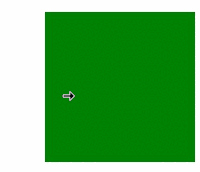

# Class (CursorController)
<!--Kit: ArkUI-->
<!--Subsystem: ArkUI-->
<!--Owner: @yihao-lin-->
<!--Designer: @piggyguy-->
<!--Tester: @songyanhong-->
<!--Adviser: @Brilliantry_Rui-->

提供鼠标光标样式设置的能力，支持恢复默认鼠标光标样式、设置系统鼠标光标样式以及设置自定义鼠标光标样式，适用于需要根据界面交互状态动态调整鼠标光标显示效果的场景，有助于提升界面交互提示的清晰度。

> **说明：**
>
> - 本模块首批接口从API version 10开始支持。后续版本的新增接口，采用上角标单独标记接口的起始版本。
>
> - 本Class首批接口从API version 12开始支持。
>
> - 本模块接口仅可在Stage模型下使用。
>
> - 以下API需先使用UIContext中的[getCursorController()](arkts-apis-uicontext-uicontext.md#getcursorcontroller12)方法获取CursorController实例，再通过此实例调用对应方法。

## restoreDefault<sup>12+</sup>

restoreDefault(): void

恢复默认的光标样式。

**模型约束：** 此接口仅可在Stage模型下使用。

**原子化服务API：** 从API version 12开始，该接口支持在原子化服务中使用。

**系统能力：** SystemCapability.ArkUI.ArkUI.Full

**示例：**

当光标移出绿框时，通过CursorController的restoreDefault方法恢复默认光标样式。

```ts
import { pointer } from '@kit.InputKit';
import { CursorController } from '@kit.ArkUI';

@Entry
@Component
struct CursorControlExample {
  cursorController: CursorController = this.getUIContext().getCursorController();

  build() {
    Column() {
      Row().height(200).width(200).backgroundColor(Color.Green).position({x: 150, y:70})
        .onHover((flag) => {
          if (flag) {
            this.cursorController.setCursor(pointer.PointerStyle.EAST);
          } else {
            console.info('restoreDefault');
            this.cursorController.restoreDefault();
          }
        })
    }.width('100%')
  }
}
```


## setCursor<sup>12+</sup>

setCursor(value: PointerStyle): void

更改当前的鼠标光标样式。

**模型约束：** 此接口仅可在Stage模型下使用。

> **说明：**
>
> 该接口调用后不会立即生效，而是在下一帧改变鼠标光标样式。

**原子化服务API：** 从API version 12开始，该接口支持在原子化服务中使用。

**系统能力：** SystemCapability.ArkUI.ArkUI.Full

**参数：**

| 参数名     | 类型                                       | 必填   | 说明      |
| ------- | ---------------------------------------- | ---- | ------- |
| value | [PointerStyle](arkts-apis-uicontext-t.md#pointerstyle) | 是    | 鼠标光标样式，指定要设置的系统预定义光标类型（如箭头、手型指针、十字准星等），各样式含义详见PointerStyle枚举说明。 |

**示例：**

当光标进入蓝色框时，通过CursorController的setCursor方法修改光标样式为PointerStyle.WEST。

```ts
import { pointer } from '@kit.InputKit';
import { CursorController } from '@kit.ArkUI';

@Entry
@Component
struct CursorControlExample {
  @State text: string = '';
  cursorCustom: CursorController = this.getUIContext().getCursorController();

  build() {
    Column() {
      Row().height(200).width(200).backgroundColor(Color.Blue).position({x: 100, y:70})
        .onHover((flag) => {
          if (flag) {
            this.cursorCustom.setCursor(pointer.PointerStyle.WEST);
          } else {
            this.cursorCustom.restoreDefault();
          }
        })
    }.width('100%')
  }
}
```


## setCustomCursor

setCustomCursor(value: image.PixelMap, focusX?: number, focusY?: number): void

设置自定义鼠标光标样式。

> **说明：**
>
> - 该接口调用后不会立即生效，而是在下一帧改变鼠标光标样式。
> - 仅支持设置静态图片，不支持设置动态图片。

**起始版本：** 26.0.0

**原子化服务API：** 从API版本26.0.0开始，该接口支持在原子化服务中使用。

**系统能力：** SystemCapability.ArkUI.ArkUI.Full

**模型约束：** 此接口仅可在Stage模型下使用。

**参数：**

| 参数名    | 类型                              | 必填   | 说明                                     |
| ------- | ------------------------------- | ---- | -------------------------------------- |
| value | [image.PixelMap](../apis-image-kit/arkts-apis-image-PixelMap.md) | 是 | 自定义鼠标光标样式的像素图。仅支持静态图片，不支持动态图片。最大尺寸为256*256px，超过该尺寸时，本次设置不会生效，鼠标光标保持当前样式不变。 |
| focusX | number | 否 | 自定义光标焦点的X坐标。以光标图片左上角为原点，向右为正方向。该焦点将在显示时与系统鼠标指针的屏幕坐标对齐，鼠标的点击、拖拽等操作均以此点为准。<br>默认值：0<br>单位：px<br>取值范围：[0, 图片宽度]，超出取值范围时按默认值处理。 |
| focusY | number | 否 | 自定义光标焦点的Y坐标。以光标图片左上角为原点，向下为正方向。结合focusX共同确定图像内代表实际交互位置的点。<br>默认值：0<br>单位：px<br>取值范围：[0, 图片高度]，超出取值范围时按默认值处理。 |

**示例：**

当光标进入蓝框且自定义光标图片加载完成后，通过调用[setCustomCursor](#setcustomcursor)接口，设置自定义鼠标光标样式。

```ts
import { image } from '@kit.ImageKit';
import { CursorController } from '@kit.ArkUI';
import { BusinessError } from '@kit.BasicServicesKit';

@Entry
@Component
struct CustomCursorExample {
  cursorController: CursorController = this.getUIContext().getCursorController();
  @State pixelMap: image.PixelMap | undefined = undefined;

  async loadPixelMapFromRawFile(): Promise<void> {
    try {
      // 1. 获取资源管理器，添加空值检查
      const uiContext = this.getUIContext();
      if (!uiContext) {
        console.error('UIContext is undefined');
        return;
      }
      const context = uiContext.getHostContext();
      if (!context) {
        console.error('HostContext is undefined');
        return;
      }
      const resourceManager = context.resourceManager;
      if (!resourceManager) {
        console.error('ResourceManager is undefined');
        return;
      }
      // 2. 读取rawfile中的图片文件
      const fileData: Uint8Array = await resourceManager.getRawFileContent('cursor.png');
      const buffer = fileData.buffer.slice(0);
      // 3. 创建ImageSource
      const imageSource = image.createImageSource(buffer);
      // 4. 创建PixelMap（可以指定期望的尺寸）
      const pixelMap = await imageSource.createPixelMap({
        desiredSize: { width: 32, height: 32 }
      });
      this.pixelMap = pixelMap;
      console.info('Custom cursor loaded successfully');
    } catch (error) {
      let err = error as BusinessError;
      console.error(`Failed to load cursor. Code: ${err.code}, message: ${err.message}`);
    }
  }

  build() {
    Column() {
      Button('load image')
        .width('40%')
        .height('7%')
        .fontSize('30vp')
        .margin(70)
        .backgroundColor(Color.Blue)
        .onClick(() => {
          // 点击按钮加载PixelMap
          this.loadPixelMapFromRawFile();
        })
      Row()
        .height(200)
        .width(200)
        .backgroundColor(Color.Blue)
        .onHover((isHover: boolean) => {
          if (isHover && this.pixelMap != undefined) {
            // 设置自定义鼠标光标样式，焦点位置设为（16，16），即光标中心
            this.cursorController.setCustomCursor(this.pixelMap, 16, 16);
          } else {
            this.cursorController.restoreDefault();
          }
        })
    }
    .justifyContent(FlexAlign.Center)
    .alignItems(HorizontalAlign.Center)
    .width('100%')
    .height('100%')
  }

  aboutToDisappear(): void {
    // 释放PixelMap资源
    if (this.pixelMap) {
      this.pixelMap.release();
      this.pixelMap = undefined;
    }
    this.cursorController.restoreDefault();
  }
}
```

