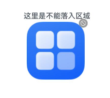

# Class (DragController)

提供发起主动拖拽的能力，当应用接收到触摸或长按等事件时可以主动发起拖拽的动作，并在其中携带拖拽信息。

> **说明：**
>
> - 本模块首批接口从API version 10开始支持。后续版本如有新增内容，则采用上角标单独标记该内容的起始版本。
>
> - 本Class首批接口从API version 11开始支持。
>
> - 以下API需先使用UIContext中的[getDragController()](arkts-apis-uicontext-uicontext.md#getdragcontroller11)方法获取DragController实例，再通过此实例调用对应方法。

## executeDrag<sup>11+</sup>

executeDrag(custom: CustomBuilder | DragItemInfo, dragInfo: dragController.DragInfo, callback: AsyncCallback&lt;dragController.DragEventParam&gt;): void

主动发起拖拽能力，传入拖拽发起后跟手效果所拖拽的对象以及携带拖拽信息。通过回调返回拖拽事件结果。

**原子化服务API：** 从API version 12开始，该接口支持在原子化服务中使用。

**系统能力：** SystemCapability.ArkUI.ArkUI.Full

**参数：**

| 参数名   | 类型                                                         | 必填 | 说明                                                         |
| -------- | ------------------------------------------------------------ | ---- | ------------------------------------------------------------ |
| custom   | [CustomBuilder](arkui-ts/ts-types.md#custombuilder8) \| [DragItemInfo](arkui-ts/ts-universal-events-drag-drop.md#dragiteminfo说明) | 是   | 拖拽发起后跟手效果所拖拽的对象。 <br/> **说明：** <br/>不支持全局builder。如果builder中使用了[Image](arkui-ts/ts-basic-components-image.md)组件，应尽量开启同步加载，即配置Image的[syncLoad](arkui-ts/ts-basic-components-image.md#syncload8)为true。该builder只用于生成当次拖拽中显示的图片，builder的修改不会同步到当前正在拖拽的图片，对builder的修改需要在下一次拖拽时生效。 |
| dragInfo | [dragController.DragInfo](js-apis-arkui-dragController.md#draginfo) | 是   | 拖拽信息。                                                   |
| callback | [AsyncCallback](../apis-basic-services-kit/js-apis-base.md#asynccallback)&lt;[dragController.DragEventParam](js-apis-arkui-dragController.md#drageventparam12)&gt; | 是   | 拖拽结束返回结果的回调<br/>- event：拖拽事件信息，仅包括拖拽结果。<br/>- extraParams：拖拽事件额外信息。 |

**错误码：** 

以下错误码的详细介绍请参见[通用错误码](../errorcode-universal.md)。

| 错误码ID | 错误信息      |
| -------- | ------------- |
| 401      | Parameter error. Possible causes: 1. Mandatory parameters are left unspecified; 2.Incorrect parameters types; 3. Parameter verification failed. |
| 100001   | Internal handling failed. |

**示例：**

```ts
import { dragController } from "@kit.ArkUI";
import { unifiedDataChannel } from '@kit.ArkData';

@Entry
@Component
struct DragControllerPage {
  @Builder DraggingBuilder() {
    Column() {
      Text("DraggingBuilder")
    }
    .width(100)
    .height(100)
    .backgroundColor(Color.Blue)
  }

  build() {
    Column() {
      Button('touch to execute drag')
        .onTouch((event?: TouchEvent) => {
          if (event) {
            if (event.type == TouchType.Down) {
              let text = new unifiedDataChannel.Text();
              let unifiedData = new unifiedDataChannel.UnifiedData(text);

              let dragInfo: dragController.DragInfo = {
                pointerId: 0,
                data: unifiedData,
                extraParams: ''
              };
              class tmp {
                event: DragEvent | undefined = undefined;
                extraParams: string = '';
              }
              let eve: tmp = new tmp();
              this.getUIContext().getDragController().executeDrag(() => { this.DraggingBuilder() }, dragInfo, (err, eve) => {
                if (eve.event) {
                  if (eve.event.getResult() == DragResult.DRAG_SUCCESSFUL) {
                    // ...
                  } else if (eve.event.getResult() == DragResult.DRAG_FAILED) {
                    // ...
                  }
                }
              })
            }
          }
        })
    }
  }
}
```

## executeDrag<sup>11+</sup>

executeDrag(custom: CustomBuilder | DragItemInfo, dragInfo: dragController.DragInfo): Promise&lt;dragController.DragEventParam&gt;

主动发起拖拽能力，传入拖拽发起后跟手效果所拖拽的对象以及携带拖拽信息。通过Promise返回拖拽事件结果。

**原子化服务API：** 从API version 12开始，该接口支持在原子化服务中使用。

**系统能力：** SystemCapability.ArkUI.ArkUI.Full

**参数：**

| 参数名   | 类型                                                         | 必填 | 说明                             |
| -------- | ------------------------------------------------------------ | ---- | -------------------------------- |
| custom   | [CustomBuilder](arkui-ts/ts-types.md#custombuilder8) \| [DragItemInfo](arkui-ts/ts-universal-events-drag-drop.md#dragiteminfo说明) | 是   | 拖拽发起后跟手效果所拖拽的对象。 |
| dragInfo | [dragController.DragInfo](js-apis-arkui-dragController.md#draginfo)                                        | 是   | 拖拽信息。                       |

**返回值：**

| 类型                                                         | 说明                                                         |
| ------------------------------------------------------------ | ------------------------------------------------------------ |
| Promise&lt;[dragController.DragEventParam](js-apis-arkui-dragController.md#drageventparam12)&gt; | 拖拽结束返回结果的回调<br/>- event：拖拽事件信息，仅包括拖拽结果。<br/>- extraParams：拖拽事件额外信息。 |

**错误码：**

以下错误码的详细介绍请参见[通用错误码](../errorcode-universal.md)。

| 错误码ID | 错误信息      |
| -------- | ------------- |
| 401      | Parameter error. Possible causes: 1. Mandatory parameters are left unspecified; 2.Incorrect parameters types; 3. Parameter verification failed. |
| 100001   | Internal handling failed. |

**示例：**

```ts
import { dragController } from "@kit.ArkUI";
import { image } from '@kit.ImageKit';
import { unifiedDataChannel } from '@kit.ArkData';

@Entry
@Component
struct DragControllerPage {
  @State pixmap: image.PixelMap | null = null;

  @Builder DraggingBuilder() {
    Column() {
      Text("DraggingBuilder")
    }
    .width(100)
    .height(100)
    .backgroundColor(Color.Blue)
  }

  @Builder PixmapBuilder() {
    Column() {
      Text("PixmapBuilder")
    }
    .width(100)
    .height(100)
    .backgroundColor(Color.Blue)
  }

  build() {
    Column() {
      Button('touch to execute drag')
        .onTouch((event?: TouchEvent) => {
          if (event) {
            if (event.type == TouchType.Down) {
              let text = new unifiedDataChannel.Text();
              let unifiedData = new unifiedDataChannel.UnifiedData(text);

              let dragInfo: dragController.DragInfo = {
                pointerId: 0,
                data: unifiedData,
                extraParams: ''
              };
              let pb: CustomBuilder = (): void => { this.PixmapBuilder() };
              this.getUIContext().getComponentSnapshot().createFromBuilder(pb).then((pix: image.PixelMap) => {
                this.pixmap = pix;
                let dragItemInfo: DragItemInfo = {
                  pixelMap: this.pixmap,
                  builder: () => { this.DraggingBuilder() },
                  extraInfo: "DragItemInfoTest"
                };

                class tmp {
                  event: DragResult | undefined = undefined;
                  extraParams: string = '';
                }
                let eve: tmp = new tmp();
                this.getUIContext().getDragController().executeDrag(dragItemInfo, dragInfo)
                  .then((eve) => {
                    if (eve.event.getResult() == DragResult.DRAG_SUCCESSFUL) {
                      // ...
                    } else if (eve.event.getResult() == DragResult.DRAG_FAILED) {
                      // ...
                    }
                  })
                  .catch((err: Error) => {
                  })
              })
            }
          }
        })
    }
    .width('100%')
    .height('100%')
  }
}
```

## createDragAction<sup>11+</sup>

createDragAction(customArray: Array&lt;CustomBuilder \| DragItemInfo&gt;, dragInfo: dragController.DragInfo): dragController.DragAction

创建拖拽的Action对象，需要显式指定拖拽背板图（可多个），以及拖拽的数据，跟手点等信息；当通过一个已创建的Action对象发起的拖拽未结束时，无法再次创建新的Action对象，接口会抛出异常；当Action对象的生命周期结束后，注册在该对象上的回调函数会失效，因此需要在一个尽量长的作用域下持有该对象，并在每次发起拖拽前通过createDragAction返回新的对象覆盖旧值。

**说明：** 建议控制传递的拖拽背板数量，传递过多容易导致拖起的效率问题。

**原子化服务API：** 从API version 12开始，该接口支持在原子化服务中使用。

**系统能力：** SystemCapability.ArkUI.ArkUI.Full

**参数：**

| 参数名   | 类型                                                         | 必填 | 说明                             |
| --------      | ------------------------------------------------------------ | ---- | -------------------------------- |
| customArray  | Array&lt;[CustomBuilder](arkui-ts/ts-types.md#custombuilder8) \| [DragItemInfo](arkui-ts/ts-universal-events-drag-drop.md#dragiteminfo说明)&gt; | 是   | 拖拽发起后跟手效果所拖拽的对象。 |
| dragInfo | [dragController.DragInfo](js-apis-arkui-dragController.md#draginfo)                                | 是   | 拖拽信息。                       |

**返回值：**

| 类型                                                   | 说明               |
| ------------------------------------------------------ | ------------------ |
| [dragController.DragAction](js-apis-arkui-dragController.md#dragaction11)| 创建拖拽Action对象，主要用于后面实现注册监听拖拽状态改变事件和启动拖拽服务。 |

**错误码：**

以下错误码的详细介绍请参见[通用错误码](../errorcode-universal.md)。

| 错误码ID | 错误信息      |
| -------- | ------------- |
| 401      | Parameter error. Possible causes: 1. Mandatory parameters are left unspecified; 2.Incorrect parameters types; 3. Parameter verification failed. |
| 100001   | Internal handling failed. |

**示例：**

1.在EntryAbility.ets中获取UI上下文并保存至LocalStorage中。

```ts
import { AbilityConstant, UIAbility, Want } from '@kit.AbilityKit';
import { hilog } from '@kit.PerformanceAnalysisKit';
import { window, UIContext } from '@kit.ArkUI';

let uiContext: UIContext;
let localStorage: LocalStorage = new LocalStorage('uiContext');

export default class EntryAbility extends UIAbility {
  storage: LocalStorage = localStorage;
  onCreate(want: Want, launchParam: AbilityConstant.LaunchParam): void {
    hilog.info(0x0000, 'testTag', '%{public}s', 'Ability onCreate');
  }

  onDestroy(): void {
    hilog.info(0x0000, 'testTag', '%{public}s', 'Ability onDestroy');
  }

  onWindowStageCreate(windowStage: window.WindowStage): void {
    // Main window is created, set main page for this ability
    hilog.info(0x0000, 'testTag', '%{public}s', 'Ability onWindowStageCreate');

    windowStage.loadContent('pages/Index', this.storage, (err, data) => {
      if (err.code) {
        hilog.error(0x0000, 'testTag', 'Failed to load the content. Cause: %{public}s', JSON.stringify(err) ?? '');
        return;
      }
      hilog.info(0x0000, 'testTag', 'Succeeded in loading the content. Data: %{public}s', JSON.stringify(data) ?? '');
      windowStage.getMainWindow((err, data) =>
      {
        if (err.code) {
          console.error('Failed to abtain the main window. Cause:' + err.message);
          return;
        }
        let windowClass: window.Window = data;
        uiContext = windowClass.getUIContext();
        this.storage.setOrCreate<UIContext>('uiContext', uiContext);
        // 获取UIContext实例
      });
    });
  }

  onWindowStageDestroy(): void {
    // Main window is destroyed, release UI related resources
    hilog.info(0x0000, 'testTag', '%{public}s', 'Ability onWindowStageDestroy');
  }

  onForeground(): void {
    // Ability has brought to foreground
    hilog.info(0x0000, 'testTag', '%{public}s', 'Ability onForeground');
  }

  onBackground(): void {
    // Ability has back to background
    hilog.info(0x0000, 'testTag', '%{public}s', 'Ability onBackground');
  }
}
```
2.通过this.getUIContext().getSharedLocalStorage()获取上下文，进而获取DragController对象实施后续操作。
```ts
import { dragController, componentSnapshot, UIContext, DragController } from "@kit.ArkUI";
import { image } from '@kit.ImageKit';
import { unifiedDataChannel } from '@kit.ArkData';

@Entry()
@Component
struct DragControllerPage {
  @State pixmap: image.PixelMap | null = null;
  private dragAction: dragController.DragAction | null = null;
  customBuilders: Array<CustomBuilder | DragItemInfo> = new Array<CustomBuilder | DragItemInfo>();
  storages = this.getUIContext().getSharedLocalStorage();

  @Builder DraggingBuilder() {
    Column() {
      Text("DraggingBuilder")
    }
    .width(100)
    .height(100)
    .backgroundColor(Color.Blue)
  }

  build() {
    Column() {

      Column() {
        Text("测试")
      }
      .width(100)
      .height(100)
      .backgroundColor(Color.Red)

      Button('多对象dragAction customBuilder拖拽').onTouch((event?: TouchEvent) => {
        if (event) {
          if (event.type == TouchType.Down) {
            console.info("muti drag Down by listener");
            this.customBuilders.push(() => { this.DraggingBuilder() });
            this.customBuilders.push(() => { this.DraggingBuilder() });
            this.customBuilders.push(() => { this.DraggingBuilder() });
            let text = new unifiedDataChannel.Text();
            let unifiedData = new unifiedDataChannel.UnifiedData(text);
            let dragInfo: dragController.DragInfo = {
              pointerId: 0,
              data: unifiedData,
              extraParams: ''
            };
            try{
              let uiContext: UIContext = this.storages?.get<UIContext>('uiContext') as UIContext;
              this.dragAction = uiContext.getDragController().createDragAction(this.customBuilders, dragInfo);
              if (!this.dragAction) {
                console.info("listener dragAction is null");
                return;
              }
              this.dragAction.on('statusChange', (dragAndDropInfo) => {
                if (dragAndDropInfo.status == dragController.DragStatus.STARTED) {
                  console.info("drag has start");
                } else if (dragAndDropInfo.status == dragController.DragStatus.ENDED) {
                  console.info("drag has end");
                  if (!this.dragAction) {
                    return;
                  }
                  this.customBuilders.splice(0, this.customBuilders.length);
                  this.dragAction.off('statusChange');
                }
              })
              this.dragAction.startDrag().then(() => {}).catch((err: Error) => {
                console.error("start drag Error:" + err.message);
              })
            } catch(err) {
              console.error("create dragAction Error:" + err.message);
            }
          }
        }
      }).margin({ top: 20 })
    }
  }
}
```

## getDragPreview<sup>11+</sup>

getDragPreview(): dragController.DragPreview

返回一个代表拖拽背板的对象。

**原子化服务API：** 从API version 12开始，该接口支持在原子化服务中使用。

**系统能力：** SystemCapability.ArkUI.ArkUI.Full

**返回值：** 

| 类型                                                         | 说明                                                         |
| ------------------------------------------------------------ | ------------------------------------------------------------ |
| [dragController.DragPreview](js-apis-arkui-dragController.md#dragpreview11) | 一个代表拖拽背板的对象，提供背板样式设置的接口，在OnDrop和OnDragEnd回调中使用不生效。 |

**错误码：** 通用错误码请参考[通用错误码说明文档](../errorcode-universal.md)。

**示例：**

请参考[animate](js-apis-arkui-dragController.md#animate11)示例。

## setDragEventStrictReportingEnabled<sup>12+</sup>

setDragEventStrictReportingEnabled(enable: boolean): void

当目标从父组件拖拽到子组件时，通过该方法设置是否会触发父组件的onDragLeave的回调。

**原子化服务API：** 从API version 12开始，该接口支持在原子化服务中使用。

**系统能力：** SystemCapability.ArkUI.ArkUI.Full

**参数：**

| 参数名 | 类型    | 必填 | 说明                                                         |
| ------ | ------- | ---- | ------------------------------------------------------------ |
| enable | boolean | 是   | 将目标从父组件拖拽到子组件时，是否会触发父组件的onDragLeave的回调。true表示触发父组件的onDragLeave的回调，false表示不触发。 |

**示例：**

```ts
import { UIAbility } from '@kit.AbilityKit';
import { window, UIContext } from '@kit.ArkUI';

 export default class EntryAbility extends UIAbility {
   onWindowStageCreate(windowStage: window.WindowStage): void {
       windowStage.loadContent('pages/Index', (err, data) => {
         if (err.code) {
         return;
       }
       windowStage.getMainWindow((err, data) => {
         if (err.code) {
           return;
         }
         let windowClass: window.Window = data;
         let uiContext: UIContext = windowClass.getUIContext();
         uiContext.getDragController().setDragEventStrictReportingEnabled(true);
     });
   });
 }
}
```

## cancelDataLoading<sup>15+</sup>

cancelDataLoading(key: string): void

当使用[startDataLoading](arkui-ts/ts-universal-events-drag-drop.md#dragevent7)获取拖拽数据时，可调用该接口取消数据传输。

**原子化服务API：** 从API version 15开始，该接口支持在原子化服务中使用。

**系统能力：** SystemCapability.ArkUI.ArkUI.Full

**参数：**

| 参数名 | 类型    | 必填 | 说明                                                         |
| ------ | ------- | ---- | ------------------------------------------------------------ |
| key | string | 是   | 拖拽数据的标识，用于区分每次拖拽。key可通过startDataLoading接口获取。 |

**错误码：** 

以下错误码的详细介绍请参见[通用错误码](../errorcode-universal.md)和[拖拽事件错误码](./errorcode-drag-event.md)。

| 错误码ID | 错误信息                                                     |
| -------- | ------------------------------------------------------------ |
| 401      | Parameter error. |
| 190004      | Operation failed. |

## notifyDragStartRequest<sup>18+</sup>

notifyDragStartRequest(requestStatus: dragController.DragStartRequestStatus): void

控制应用是否可以发起拖拽。

**原子化服务API：** 从API version 18开始，该接口支持在原子化服务中使用。

**系统能力：** SystemCapability.ArkUI.ArkUI.Full

**参数：**

| 参数名 | 类型   | 必填| 说明                                                        |
| ------ | ------- | ---- | ------------------------------------------------------------ |
| requestStatus  | [dragController.DragStartRequestStatus](js-apis-arkui-dragController.md#dragstartrequeststatus18)    | 是  |定义应用是否可以发起拖拽。|

**示例：**

```ts
import { unifiedDataChannel } from '@kit.ArkData';
import { image } from '@kit.ImageKit';
import { dragController } from "@kit.ArkUI";

// xxx.ets
@Entry
@Component
struct NormalEts {
  @State finished: boolean = false;
  @State timeout1: number = 1;
  @State pixmap: image.PixelMap | undefined = undefined;
  @State unifiedData1: unifiedDataChannel.UnifiedData | undefined = undefined;
  @State previewData: DragItemInfo | undefined = undefined;

  loadData() {
    let timeout = setTimeout(() => {
      this.getUIContext().getComponentSnapshot().get("image1", (error: Error, pixmap: image.PixelMap) => {
        this.pixmap = pixmap;
        this.previewData = {
          pixelMap: this.pixmap
        };
      });

      let data: unifiedDataChannel.Image = new unifiedDataChannel.Image();
      data.imageUri = "app.media.startIcon";
      let unifiedData = new unifiedDataChannel.UnifiedData(data);
      this.unifiedData1 = unifiedData;

      this.getUIContext().getDragController().notifyDragStartRequest(dragController.DragStartRequestStatus.READY);
    }, 4000);
    this.timeout1 = timeout;
  }


    build() {
      Column({space: 20}) {
        Image($r("app.media.startIcon"))
          .width(300)
          .height(200)
          .id("image1")
          .draggable(true)
          .dragPreview(this.previewData)
          .onPreDrag((status: PreDragStatus) => {
            if (status == PreDragStatus.PREPARING_FOR_DRAG_DETECTION) {
              this.loadData();
            } else {
              clearTimeout(this.timeout1);
            }
          })
          .onDragStart((event: DragEvent) => {
            if (this.finished == false) {
              this.getUIContext().getDragController().notifyDragStartRequest(dragController.DragStartRequestStatus.WAITING);
            } else {
              event.setData(this.unifiedData1);
            }
          })
          .onDragEnd(() => {
            this.finished = false;
          })
      }
      .height(400)
      .backgroundColor(Color.Pink)
    }
}
```
## enableDropDisallowedBadge<sup>20+</sup>

enableDropDisallowedBadge(enabled: boolean): void

当组件的类型与配置的[allowDrop](../apis-arkui/arkui-ts/ts-universal-attributes-drag-drop.md#allowdrop)无交集时可显示禁用角标。当目标进行拖拽时，通过该方法检查是否显示拖拽禁止角标。该接口暂不支持[UIExtension](../apis-arkui/js-apis-arkui-uiExtension.md)。

**原子化服务API：** 从API version 20开始，该接口支持在原子化服务中使用。

**系统能力：** SystemCapability.ArkUI.ArkUI.Full

**参数：**

| 参数名 | 类型    | 必填 | 说明                                                         |
| ------ | ------- | ---- | ------------------------------------------------------------ |
| enabled | boolean | 是   | 当组件的类型与配置的[allowDrop](../apis-arkui/arkui-ts/ts-universal-attributes-drag-drop.md#allowdrop)无交集时可显示禁用角标，当目标进行拖拽时，通过enableDropDisallowedBadge方法检查是否显示拖拽禁止角标。true表示显示拖拽禁止角标，false表示不显示拖拽禁止角标。默认值为false。 |

**示例：**

该示例通过enableDropDisallowedBadge接口实现了对目标进行拖拽时显示拖拽禁止角标的功能。

```ts
import { UIAbility } from '@kit.AbilityKit';
import { window, UIContext } from '@kit.ArkUI';

 export default class EntryAbility extends UIAbility {
   onWindowStageCreate(windowStage: window.WindowStage): void {
       windowStage.loadContent('pages/Index', (err, data) => {
         if (err.code) {
         return;
       }
       windowStage.getMainWindow((err, data) => {
         if (err.code) {
           return;
         }
         let windowClass: window.Window = data;
         let uiContext: UIContext = windowClass.getUIContext();
         uiContext.getDragController().enableDropDisallowedBadge(true);
     });
   });
 }
}
```


