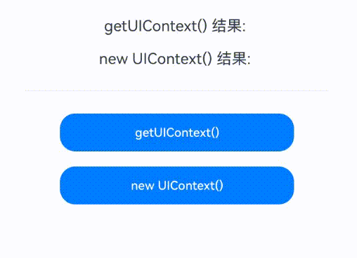

# Class (UIContext)
<!--Kit: ArkUI-->
<!--Subsystem: ArkUI-->
<!--Owner: @xiang-shouxing-->
<!--Designer: @xiang-shouxing-->
<!--Tester: @sally__-->
<!--Adviser: @HelloCrease-->

UIContext实例对象。

> **说明：**
>
> - 本模块首批接口从API version 10开始支持。后续版本的新增接口，采用上角标单独标记接口的起始版本。
>
> - 示例效果请以真机运行为准，当前DevEco Studio预览器不支持。
>
> - 以下API需先使用ohos.window中的[getUIContext()](arkts-apis-window-Window.md#getuicontext10)方法获取UIContext实例，再通过此实例调用对应方法。或者可以通过自定义组件内置方法[getUIContext()](arkui-ts/ts-custom-component-api.md#getuicontext)获取。本文中UIContext对象以uiContext表示。

**示例：**

以下示例展示了两种获取UIContext实例的方法。

```ts
//两种方法获取到的UIContext没有差异
//index.ets
import { UIContext } from '@kit.ArkUI';

@Entry
@Component
struct Index {
  build() {
    Column() {
      Button("Button")
          .onClick(()=>{
            //通过自定义组件内置方法获取
            this.getUIContext()
            //其他运行逻辑
          })
    }  
  }
}

//EntryAbility.ets
import { AbilityConstant, ConfigurationConstant, UIAbility, Want } from '@kit.AbilityKit';
import { hilog } from '@kit.PerformanceAnalysisKit';
import { window } from '@kit.ArkUI';

const DOMAIN = 0x0000;

export default class EntryAbility extends UIAbility {
  onWindowStageCreate(windowStage: window.WindowStage): void {
    //通过ohos.window获取
    windowStage.getMainWindowSync().getUIContext()
    //其他运行逻辑
  }
}
```

## isAvailable<sup>20+</sup>

isAvailable(): boolean

判断UIContext对象对应的UI实例是否有效。使用[getUIContext](arkts-apis-window-Window.md#getuicontext10)方法获取UIContext对象。后端UI实例存在时，该UI实例有效。通过new UIContext()创建的UIContext对象无对应的UI实例；多次[loadContent](arkts-apis-window-Window.md#loadcontent9)后，旧的UI实例会失效。多窗口应用场景，当窗口关闭后，该窗口的UI实例失效。总而言之，当UIContext对象没有对应的后端UI实例时，该对象是无效的。

**原子化服务API：** 从API version 20开始，该接口支持在原子化服务中使用。

**系统能力：** SystemCapability.ArkUI.ArkUI.Full

**返回值：**

| 类型            | 说明          |
| ------------- | ----------- |
| boolean | 返回UIContext对象对应的UI实例是否有效。true表示有效，false表示无效。 |

**示例：**

```ts
import { UIContext } from '@kit.ArkUI'

@Entry
@Component
struct UIContextCompare {
  @State result1: string = ""
  @State result2: string = ""

  build() {
    Column() {
      Text("getUIContext() 结果: " + this.result1)
        .fontSize(20)
        .margin(10)

      Text("new UIContext() 结果: " + this.result2)
        .fontSize(20)
        .margin(10)

      Divider().margin(20)

      Button("getUIContext()")
        .width("70%")
        .height(50)
        .margin(10)
        .onClick(() => {
          try {
            const ctx: UIContext = this.getUIContext();
            const available: boolean = ctx.isAvailable();
            this.result1 = `可用状态: ${available} UI实例有效 `;
            console.info("getUIContext测试:", available);
          } catch (e) {
            this.result1 = "错误: " + (e instanceof Error ? e.message : String(e));
          }
        })

      Button("new UIContext()")
        .width("70%")
        .height(50)
        .margin(10)
        .onClick(() => {
          try {
            const ctx: UIContext = new UIContext();
            const available: boolean = ctx.isAvailable();
            this.result2 = `可用状态: ${available} UI实例无效`;
            console.info("new UIContext测试:", available);
          } catch (e) {
            this.result2 = "错误: " + (e instanceof Error ? e.message : String(e));
          }
        })
    }
    .width("100%")
    .height("100%")
    .padding(20)
  }
}
```

## getFont

getFont(): Font

获取Font对象。

**原子化服务API：** 从API version 11开始，该接口支持在原子化服务中使用。

**系统能力：** SystemCapability.ArkUI.ArkUI.Full

**返回值：**

| 类型            | 说明          |
| ------------- | ----------- |
| [Font](./arkts-apis-uicontext-font.md) | 返回Font实例对象。 |

**示例：**

完整示例请参考[Font](arkts-apis-uicontext-font.md)中的示例。

## getComponentUtils

getComponentUtils(): ComponentUtils

获取ComponentUtils对象。

**原子化服务API：** 从API version 11开始，该接口支持在原子化服务中使用。

**系统能力：** SystemCapability.ArkUI.ArkUI.Full

**返回值：**

| 类型                                | 说明                    |
| --------------------------------- | --------------------- |
| [ComponentUtils](arkts-apis-uicontext-componentutils.md) | 返回ComponentUtils实例对象。 |

**示例：** 

完整示例请参考[getComponentUtils](js-apis-arkui-componentUtils.md)中的示例。

## getUIInspector

getUIInspector(): UIInspector

获取UIInspector对象。

**原子化服务API：** 从API version 11开始，该接口支持在原子化服务中使用。

**系统能力：** SystemCapability.ArkUI.ArkUI.Full

**返回值：**

| 类型                          | 说明                 |
| --------------------------- | ------------------ |
| [UIInspector](./arkts-apis-uicontext-uiinspector.md) | 返回UIInspector实例对象。 |

**示例：**

完整示例请参考[UIInspector](./arkts-apis-uicontext-uiinspector.md)中的示例。

## getUIObserver<sup>11+</sup>

getUIObserver(): UIObserver

获取UIObserver对象。

**原子化服务API：** 从API version 12开始，该接口支持在原子化服务中使用。

**系统能力：** SystemCapability.ArkUI.ArkUI.Full

**返回值：**

| 类型                          | 说明                 |
| --------------------------- | ------------------ |
| [UIObserver](./arkts-apis-uicontext-uiobserver.md) | 返回UIObserver实例对象。 |

**示例：**

```ts
@Component
struct PageOne {
  build() {
    NavDestination() {
      Text("pageOne")
    }.title("pageOne")
  }
}

@Entry
@Component
struct Index {
  private stack: NavPathStack = new NavPathStack();

  @Builder
  PageBuilder(name: string) {
    PageOne()
  }

  aboutToAppear() {
    this.getUIContext().getUIObserver().on('navDestinationUpdate', (info) => {
      console.info('NavDestination state update', JSON.stringify(info));
    });
  }

  aboutToDisappear() {
    this.getUIContext().getUIObserver().off('navDestinationUpdate');
  }

  build() {
    Column() {
      Navigation(this.stack) {
        Button("push").onClick(() => {
          this.stack.pushPath({ name: "pageOne" });
        })
      }
      .title("Navigation")
      .navDestination(this.PageBuilder)
    }
    .width('100%')
    .height('100%')
  }
}
```

## getMediaQuery

getMediaQuery(): MediaQuery

获取MediaQuery对象。

**原子化服务API：** 从API version 11开始，该接口支持在原子化服务中使用。

**系统能力：** SystemCapability.ArkUI.ArkUI.Full

**返回值：**

| 类型                        | 说明                |
| ------------------------- | ----------------- |
| [MediaQuery](arkts-apis-uicontext-mediaquery.md) | 返回MediaQuery实例对象。 |

**示例：** 

完整示例请参考[mediaquery示例](js-apis-mediaquery.md#示例)。

## getRouter

getRouter(): Router

获取Router对象。

**原子化服务API：** 从API version 11开始，该接口支持在原子化服务中使用。

**系统能力：** SystemCapability.ArkUI.ArkUI.Full

**返回值：**

| 类型                | 说明            |
| ----------------- | ------------- |
| [Router](arkts-apis-uicontext-router.md) | 返回Router实例对象。 |

**示例：**

完整示例请参考[pushUrl](arkts-apis-uicontext-router.md#pushurl)。

## getPromptAction

getPromptAction(): PromptAction

获取PromptAction对象。

**原子化服务API：** 从API version 11开始，该接口支持在原子化服务中使用。

**系统能力：** SystemCapability.ArkUI.ArkUI.Full

**返回值：**

| 类型                            | 说明                  |
| ----------------------------- | ------------------- |
| [PromptAction](arkts-apis-uicontext-promptaction.md) | 返回PromptAction实例对象。 |

**示例：**

完整示例请参考[PromptAction](arkts-apis-uicontext-promptaction.md)中的示例。

## getOverlayManager<sup>12+</sup>

getOverlayManager(): OverlayManager

获取OverlayManager对象。

**原子化服务API：** 从API version 12开始，该接口支持在原子化服务中使用。

**系统能力：**: SystemCapability.ArkUI.ArkUI.Full

**返回值：**

| 类型                           | 说明                 |
| ----------------------------- | ------------------- |
| [OverlayManager](arkts-apis-uicontext-overlaymanager.md) | 返回OverlayManager实例对象。 |

**示例：**

完整示例请参考[OverlayManager](arkts-apis-uicontext-overlaymanager.md)中的示例。

## setOverlayManagerOptions<sup>15+</sup>

setOverlayManagerOptions(options: OverlayManagerOptions): boolean

设置[OverlayManager](arkts-apis-uicontext-overlaymanager.md)参数。用于在使用OverlayManager能力之前先初始化overlayManager的参数，包括是否需要渲染overlay根节点等属性。该方法需要在执行getOverlayManager方法之前执行生效，且该方法只生效一次。

**原子化服务API：** 从API version 15开始，该接口支持在原子化服务中使用。

**系统能力：**: SystemCapability.ArkUI.ArkUI.Full

**参数：**

| 参数名   | 类型                                       | 必填   | 说明                                    |
| ----- | ---------------------------------------- | ---- | ------------------------------------- |
| options | [OverlayManagerOptions](arkts-apis-uicontext-i.md#overlaymanageroptions15) | 是 | OverlayManager参数。|

**返回值：** 

| 类型    | 说明           |
| ------- | -------------- |
| boolean | 是否设置成功。<br/>返回true表示设置成功。返回false表示设置失败。 |

**示例：**

完整示例请参考[OverlayManager](arkts-apis-uicontext-overlaymanager.md)中的示例。

## getOverlayManagerOptions<sup>15+</sup>

getOverlayManagerOptions(): OverlayManagerOptions

用于获取当前[OverlayManagerOptions](arkts-apis-uicontext-i.md#overlaymanageroptions15)参数。

**原子化服务API：** 从API version 15开始，该接口支持在原子化服务中使用。

**系统能力：**: SystemCapability.ArkUI.ArkUI.Full

**返回值：**

| 类型                           | 说明                 |
| ----------------------------- | ------------------- |
| [OverlayManagerOptions](arkts-apis-uicontext-i.md#overlaymanageroptions15) | 返回当前OverlayManagerOptions。 |

**示例：**

完整示例请参考[OverlayManager](arkts-apis-uicontext-overlaymanager.md)中的示例。

## animateTo

animateTo(value: AnimateParam, event: () => void): void

提供animateTo接口来指定由于闭包代码导致的状态变化插入过渡动效。

**原子化服务API：** 从API version 11开始，该接口支持在原子化服务中使用。

**系统能力：** SystemCapability.ArkUI.ArkUI.Full

> **说明：**
> - 不推荐在aboutToAppear、aboutToDisappear中调用动画。
> - 如果在[aboutToAppear](../apis-arkui/arkui-ts/ts-custom-component-lifecycle.md#abouttoappear)中调用动画，自定义组件内的build还未执行，内部组件还未创建，动画时机过早，动画属性没有初值无法对组件产生动画。
> - 执行[aboutToDisappear](../apis-arkui/arkui-ts/ts-custom-component-lifecycle.md#abouttodisappear)时，组件即将销毁，不能在aboutToDisappear里面做动画。
> - 在组件出现和消失时，可以通过[组件内转场](../apis-arkui/arkui-ts/ts-transition-animation-component.md)添加动画效果。
> - 组件内转场不支持的属性，可以参考[显式动画](./arkui-ts/ts-explicit-animation.md)中的[示例2](./arkui-ts/ts-explicit-animation.md#示例2动画执行结束后组件消失)，使用animateTo实现动画执行结束后组件消失的效果。
> - 某些场景下，在[状态管理V2](../../ui/state-management/arkts-state-management-overview.md#状态管理v2)中使用animateTo动画，会产生异常效果，具体可参考：[在状态管理V2中使用animateTo动画效果异常](../../ui/state-management/arkts-new-local.md#在状态管理v2中使用animateto动画效果异常)。

**参数：**

| 参数名   | 类型                                       | 必填   | 说明                                    |
| ----- | ---------------------------------------- | ---- | ------------------------------------- |
| value | [AnimateParam](arkui-ts/ts-explicit-animation.md#animateparam对象说明) | 是    | 设置动画效果相关参数。                           |
| event | () => void                               | 是    | 指定显示动效的闭包函数，在闭包函数中导致的状态变化系统会自动插入过渡动画。 |

**示例：**

```ts
// xxx.ets
@Entry
@Component
struct AnimateToExample {
  @State widthSize: number = 250;
  @State heightSize: number = 100;
  @State rotateAngle: number = 0;
  private flag: boolean = true;
  uiContext: UIContext | undefined = undefined;

  aboutToAppear() {
    this.uiContext = this.getUIContext();
    if (!this.uiContext) {
      console.warn("no uiContext");
      return;
    }
  }

  build() {
    Column() {
      Button('change size')
        .width(this.widthSize)
        .height(this.heightSize)
        .margin(30)
        .onClick(() => {
          if (this.flag) {
            this.uiContext?.animateTo({
              duration: 2000,
              curve: Curve.EaseOut,
              iterations: 3,
              playMode: PlayMode.Normal,
              onFinish: () => {
                console.info('play end');
              }
            }, () => {
              this.widthSize = 150;
              this.heightSize = 60;
            });
          } else {
            this.uiContext?.animateTo({}, () => {
              this.widthSize = 250;
              this.heightSize = 100;
            });
          }
          this.flag = !this.flag;
        })
      Button('stop rotating')
        .margin(50)
        .rotate({ x: 0, y: 0, z: 1, angle: this.rotateAngle })
        .onAppear(() => {
          // 组件出现时开始做动画
          this.uiContext?.animateTo({
            duration: 1200,
            curve: Curve.Friction,
            delay: 500,
            iterations: -1, // 设置-1表示动画无限循环
            playMode: PlayMode.Alternate,
            expectedFrameRateRange: {
              min: 10,
              max: 120,
              expected: 60,
            }
          }, () => {
            this.rotateAngle = 90
          });
        })
        .onClick(() => {
          this.uiContext?.animateTo({ duration: 0 }, () => {
            // this.rotateAngle之前为90，在duration为0的动画中修改属性，可以停止该属性之前的动画，按新设置的属性显示
            this.rotateAngle = 0;
          });
        })
    }.width('100%').margin({ top: 5 })
  }
}
```

## getSharedLocalStorage<sup>12+</sup>

getSharedLocalStorage(): LocalStorage | undefined

获取当前stage共享的LocalStorage实例。

**原子化服务API：** 从API version 12开始，该接口支持在原子化服务中使用。

**系统能力：** SystemCapability.ArkUI.ArkUI.Full

**模型约束：** 此接口仅可在Stage模型下使用。

**返回值：**

| 类型                             | 说明                |
| ------------------------------ | ----------------- |
| [LocalStorage](arkui-ts/ts-state-management.md#localstorage9)&nbsp;\|&nbsp;undefined | 返回LocalStorage实例。共享的LocalStorage实例不存在时返回undefined。 |

**示例：**

```ts
// EntryAbility.ets
import { UIAbility } from '@kit.AbilityKit';
import { window } from '@kit.ArkUI';

export default class EntryAbility extends UIAbility {
  storage: LocalStorage = new LocalStorage();

  onWindowStageCreate(windowStage: window.WindowStage) {
    windowStage.loadContent('pages/Index', this.storage);
  }
}
```

```ts
// Index.ets

@Entry
@Component
struct SharedLocalStorage {
  localStorage = this.getUIContext().getSharedLocalStorage();

  build() {
    Row() {
      Column() {
        Button("Change Local Storage to 47")
          .onClick(() => {
            this.localStorage?.setOrCreate("propA", 47);
          })
        Button("Get Local Storage")
          .onClick(() => {
            console.info(`localStorage: ${this.localStorage?.get("propA")}`);
          })
      }
      .width('100%')
    }
    .height('100%')
  }
}
```

## getHostContext<sup>12+</sup>

getHostContext(): Context | undefined

获得当前元能力的Context。

**原子化服务API：** 从API version 12开始，该接口支持在原子化服务中使用。

**系统能力：** SystemCapability.ArkUI.ArkUI.Full

**模型约束：** 此接口仅可在Stage模型下使用。

**返回值：**

| 类型 | 说明                             |
| ------ | ------------------------------- |
| [Context](arkts-apis-uicontext-t.md#context12)&nbsp;\|&nbsp;undefined | 返回当前组件所在Ability的Context，Context的具体类型为当前Ability关联的Context对象。例如：在UIAbility窗口中的页面调用该接口，返回类型为[UIAbilityContext](../apis-ability-kit/js-apis-inner-application-uiAbilityContext.md#uiabilitycontext-1)。在ExtensionAbility窗口中的页面调用该接口，返回类型为[ExtensionContext](../apis-ability-kit/js-apis-inner-application-extensionContext.md)。ability上下文不存在时返回undefined。 |

**示例：**

```ts
@Entry
@Component
struct Index {
  uiContext = this.getUIContext();

  build() {
    Row() {
      Column() {
        Text("cacheDir='"+this.uiContext?.getHostContext()?.cacheDir+"'")
          .fontSize(25)
          .border({ color:Color.Red, width:2 })
          .padding(50)
        Text("bundleCodeDir='"+this.uiContext?.getHostContext()?.bundleCodeDir+"'")
          .fontSize(25)
          .border({ color:Color.Red, width:2 })
          .padding(50)
      }
      .width('100%')
    }
    .height('100%')
  }
}
```

## getFrameNodeById<sup>12+</sup>

getFrameNodeById(id: string): FrameNode | null

通过组件的id获取组件树的实体节点。

**原子化服务API：** 从API version 12开始，该接口支持在原子化服务中使用。

**系统能力：** SystemCapability.ArkUI.ArkUI.Full

**参数：**

| 参数名   | 类型                                       | 必填   | 说明                                    |
| ----- | ---------------------------------------- | ---- | ------------------------------------- |
| id | string | 是    | 节点对应的[组件标识](arkui-ts/ts-universal-attributes-component-id.md)。       |

**返回值：**

| 类型                                       | 说明            |
| ---------------------------------------- | ------------- |
| [FrameNode](js-apis-arkui-frameNode.md)  \| null | 返回的组件树的实体节点或者空节点。 |

> **说明：**
>
> getFrameNodeById通过遍历查询对应id的节点，性能较差。推荐使用[getAttachedFrameNodeById](#getattachedframenodebyid12)。

**示例：**

完整示例请参考[获取根节点示例](js-apis-arkui-frameNode.md#获取根节点示例)。

## getAttachedFrameNodeById<sup>12+</sup>

getAttachedFrameNodeById(id: string): FrameNode | null

通过组件的id获取当前窗口上的实体节点。

**原子化服务API：** 从API version 12开始，该接口支持在原子化服务中使用。

**系统能力：** SystemCapability.ArkUI.ArkUI.Full

**参数：**

| 参数名   | 类型                                       | 必填   | 说明                                    |
| ----- | ---------------------------------------- | ---- | ------------------------------------- |
| id | string | 是    | 节点对应的[组件标识](arkui-ts/ts-universal-attributes-component-id.md)。                          |

**返回值：**

| 类型                                       | 说明            |
| ---------------------------------------- | ------------- |
| [FrameNode](js-apis-arkui-frameNode.md)  \| null | 返回的组件树的实体节点或者空节点。 |

> **说明：**
>
> getAttachedFrameNodeById仅能查询上屏节点。

**示例：**

```ts
@Entry
@Component
struct MyComponent {
  @State message: string = 'Hello World';

  build() {
    RelativeContainer() {
      Text(this.message)
        .id('HelloWorld')
        .fontSize($r('app.float.page_text_font_size'))
        .fontWeight(FontWeight.Bold)
        .alignRules({
          center: { anchor: '__container__', align: VerticalAlign.Center },
          middle: { anchor: '__container__', align: HorizontalAlign.Center }
        })
        .onClick(() => {
          let node = this.getUIContext().getAttachedFrameNodeById("HelloWorld");
          console.info(`Find HelloWorld Tag:${node!.getNodeType()} id:${node!.getUniqueId()}`);
        })
    }
    .height('100%')
    .width('100%')
  }
}
```

## getFrameNodeByUniqueId<sup>12+</sup>

getFrameNodeByUniqueId(id: number): FrameNode | null

提供getFrameNodeByUniqueId接口通过组件的uniqueId获取组件树的实体节点。
1. 当uniqueId对应的是系统组件时，返回组件所对应的FrameNode；
2. 当uniqueId对应的是自定义组件时，若其有渲染内容，则返回该自定义组件的根节点，类型为__Common__；若其无渲染内容，则返回其第一个子组件的FrameNode。
3. 当uniqueId无对应的组件时，返回null。

**原子化服务API：** 从API version 12开始，该接口支持在原子化服务中使用。

**系统能力：** SystemCapability.ArkUI.ArkUI.Full

**参数：**

| 参数名   | 类型                                       | 必填   | 说明                                    |
| ----- | ---------------------------------------- | ---- | ------------------------------------- |
| id | number | 是    | 节点对应的UniqueId                          |

**返回值：**

| 类型                                       | 说明            |
| ---------------------------------------- | ------------- |
| [FrameNode](js-apis-arkui-frameNode.md)  \| null | 返回的组件树的实体节点或者空节点。 |

**示例：**

```ts
import { UIContext, FrameNode } from '@kit.ArkUI';

@Entry
@Component
struct MyComponent {
  aboutToAppear() {
    let uniqueId: number = this.getUniqueId();
    let uiContext: UIContext = this.getUIContext();
    if (uiContext) {
      let node: FrameNode | null = uiContext.getFrameNodeByUniqueId(uniqueId);
    }
  }

  build() {
    // ...
  }
}
```

## getPageInfoByUniqueId<sup>12+</sup>

getPageInfoByUniqueId(id: number): PageInfo

提供getPageInfoByUniqueId接口通过组件的uniqueId获取该节点对应的Router和NavDestination页面信息。
1. 当uniqueId对应的节点在Page节点中，routerPageInfo属性为其对应的Router信息；
2. 当uniqueId对应的节点在NavDestination节点中，navDestinationInfo属性为其对应的NavDestination信息；
3. 当uniqueId对应的节点无对应的Router或NavDestination信息时，对应的属性为undefined；
4. 模态弹窗并不在任何Page节点中。当uniqueId对应的节点在模态弹窗中，例如[CustomDialog](./arkui-ts/ts-methods-custom-dialog-box.md)、[bindSheet](./arkui-ts/ts-universal-attributes-sheet-transition.md#bindsheet)和[bindContentCover](./arkui-ts/ts-universal-attributes-modal-transition.md#bindcontentcover)构建的模态页面中，routerPageInfo属性为undefined。

**原子化服务API：** 从API version 12开始，该接口支持在原子化服务中使用。

**系统能力：** SystemCapability.ArkUI.ArkUI.Full

**参数：**

| 参数名   | 类型                                       | 必填   | 说明                                    |
| ----- | ---------------------------------------- | ---- | ------------------------------------- |
| id | number | 是    | 节点对应的UniqueId。                          |

**返回值：**

| 类型                                       | 说明            |
| ---------------------------------------- | ------------- |
| [PageInfo](arkts-apis-uicontext-i.md#pageinfo12) | 返回节点对应的Router和NavDestination信息。 |

**示例：**

```ts
import { UIContext, PageInfo } from '@kit.ArkUI';

@Entry
@Component
struct PageInfoExample {
  @Provide('pageInfos') pageInfos: NavPathStack = new NavPathStack();

  build() {
    Column() {
      Navigation(this.pageInfos) {
        NavDestination() {
          MyComponent()
        }
      }.id('navigation')
    }
  }
}

@Component
struct MyComponent {
  @State content: string = '';

  build() {
    Column() {
      Text('PageInfoExample')
      Button('click').onClick(() => {
        const uiContext: UIContext = this.getUIContext();
        const uniqueId: number = this.getUniqueId();
        const pageInfo: PageInfo = uiContext.getPageInfoByUniqueId(uniqueId);
        console.info('pageInfo: ' + JSON.stringify(pageInfo));
        console.info('navigationInfo: ' + JSON.stringify(uiContext.getNavigationInfoByUniqueId(uniqueId)));
      })
      TextArea({
        text: this.content
      })
      .width('100%')
      .height(100)
    }
    .width('100%')
    .alignItems(HorizontalAlign.Center)
  }
}
```

## getNavigationInfoByUniqueId<sup>12+</sup>

getNavigationInfoByUniqueId(id: number): observer.NavigationInfo | undefined

提供getNavigationInfoByUniqueId接口通过组件的uniqueId获取该节点对应的Navigation页面信息。
1. 当uniqueId对应的节点在Navigation节点中，返回其对应的Navigation信息；
2. 当uniqueId对应的节点无对应的Navigation信息时，返回undefined。

**原子化服务API：** 从API version 12开始，该接口支持在原子化服务中使用。

**系统能力：** SystemCapability.ArkUI.ArkUI.Full

**参数：**

| 参数名   | 类型                                       | 必填   | 说明                                    |
| ----- | ---------------------------------------- | ---- | ------------------------------------- |
| id | number | 是    | 节点对应的UniqueId。                          |

**返回值：**

| 类型                                       | 说明            |
| ---------------------------------------- | ------------- |
| observer.[NavigationInfo](js-apis-arkui-observer.md#navigationinfo12) \| undefined | 返回节点对应的Navigation信息。 |

**示例：**

请参考[getPageInfoByUniqueId](#getpageinfobyuniqueid12)的示例。

## showAlertDialog

showAlertDialog(options: AlertDialogParamWithConfirm | AlertDialogParamWithButtons | AlertDialogParamWithOptions): void

显示警告弹窗组件，可设置文本内容与响应回调。

>  **说明：**
>
>  不支持在输入法类型窗口中使用子窗（showInSubwindow为true）的showAlertDialog，详情见输入法框架的约束与限制说明[createPanel](../apis-ime-kit/js-apis-inputmethodengine.md#createpanel10-1)。

**原子化服务API：** 从API version 11开始，该接口支持在原子化服务中使用。

**系统能力：** SystemCapability.ArkUI.ArkUI.Full

**参数：**

| 参数名     | 类型                                       | 必填   | 说明                  |
| ------- | ---------------------------------------- | ---- | ------------------- |
| options | [AlertDialogParamWithConfirm](arkui-ts/ts-methods-alert-dialog-box.md#alertdialogparamwithconfirm对象说明)&nbsp;\|&nbsp;[AlertDialogParamWithButtons](arkui-ts/ts-methods-alert-dialog-box.md#alertdialogparamwithbuttons对象说明)&nbsp;\|&nbsp;[AlertDialogParamWithOptions](arkui-ts/ts-methods-alert-dialog-box.md#alertdialogparamwithoptions10对象说明) | 是    | 定义并显示AlertDialog组件。 |


**示例：**

```ts
@Entry
@Component
struct Index {
  uiContext: UIContext = this.getUIContext()

  build() {
    Column() {
      Button('showAlertDialog')
        .onClick(() => {
          this.uiContext.showAlertDialog(
            {
              title: 'title',
              message: 'text',
              autoCancel: true,
              alignment: DialogAlignment.Bottom,
              offset: { dx: 0, dy: -20 },
              gridCount: 3,
              confirm: {
                value: 'button',
                action: () => {
                  console.info('Button-clicking callback');
                }
              },
              cancel: () => {
                console.info('Closed callbacks');
              }
            }
          );
        })
    }.height('100%').width('100%').justifyContent(FlexAlign.Center)
  }
}
```

## showActionSheet

showActionSheet(value: ActionSheetOptions): void

定义列表弹窗并弹出。

**原子化服务API：** 从API version 11开始，该接口支持在原子化服务中使用。

**系统能力：** SystemCapability.ArkUI.ArkUI.Full

**参数：** 

| 参数名 | 类型                                                         | 必填 | 说明                 |
| ------ | ------------------------------------------------------------ | ---- | -------------------- |
| value  | [ActionSheetOptions](arkui-ts/ts-methods-action-sheet.md#actionsheetoptions对象说明) | 是   | 配置列表弹窗的参数。 |

**示例：**

```ts
@Entry
@Component
struct Index {
  uiContext: UIContext = this.getUIContext()

  build() {
    Column() {
      Button('showActionSheet')
        .onClick(() => {
          this.uiContext.showActionSheet({
            title: 'ActionSheet title',
            message: 'message',
            autoCancel: true,
            confirm: {
              value: 'Confirm button',
              action: () => {
                console.info('Get ActionSheet handled');
              }
            },
            cancel: () => {
              console.info('ActionSheet canceled');
            },
            alignment: DialogAlignment.Bottom,
            offset: { dx: 0, dy: -10 },
            sheets: [
              {
                title: 'apples',
                action: () => {
                  console.info('apples');
                }
              },
              {
                title: 'bananas',
                action: () => {
                  console.info('bananas');
                }
              },
              {
                title: 'pears',
                action: () => {
                  console.info('pears');
                }
              }
            ]
          });
        })
    }.height('100%').width('100%').justifyContent(FlexAlign.Center)
  }
}
```

## showDatePickerDialog

showDatePickerDialog(options: DatePickerDialogOptions): void

定义日期滑动选择器弹窗并弹出。

>  **说明：**
>
>  不支持在输入法类型窗口中使用子窗（showInSubwindow为true）的showDatePickerDialog，详情见输入法框架的约束与限制说明[createPanel](../apis-ime-kit/js-apis-inputmethodengine.md#createpanel10-1)。

**原子化服务API：** 从API version 11开始，该接口支持在原子化服务中使用。

**系统能力：** SystemCapability.ArkUI.ArkUI.Full

**设备行为差异：** 该接口在Wearable设备上使用时，应用程序运行异常，异常信息中提示接口未定义，在其他设备中可正常调用。

**参数：** 

| 参数名  | 类型                                                         | 必填 | 说明                           |
| ------- | ------------------------------------------------------------ | ---- | ------------------------------ |
| options | [DatePickerDialogOptions](arkui-ts/ts-methods-datepicker-dialog.md#datepickerdialogoptions对象说明) | 是   | 配置日期滑动选择器弹窗的参数。 |

**示例：**

```ts
// xxx.ets
@Entry
@Component
struct DatePickerDialogExample {
  selectedDate: Date = new Date("2010-1-1");

  build() {
    Column() {
      Button("DatePickerDialog")
        .margin(20)
        .onClick(() => {
          this.getUIContext().showDatePickerDialog({
            start: new Date("2000-1-1"),
            end: new Date("2100-12-31"),
            selected: this.selectedDate,
            showTime: true,
            useMilitaryTime: false,
            dateTimeOptions: { hour: "numeric", minute: "2-digit" },
            onDateAccept: (value: Date) => {
              // 通过Date的setFullYear方法设置按下确定按钮时的日期，这样当弹窗再次弹出时显示选中的是上一次确定的日期
              this.selectedDate = value;
              console.info("DatePickerDialog:onDateAccept()" + value.toString());
            },
            onCancel: () => {
              console.info("DatePickerDialog:onCancel()");
            },
            onDateChange: (value: Date) => {
              console.info("DatePickerDialog:onDateChange()" + value.toString());
            },
            onDidAppear: () => {
              console.info("DatePickerDialog:onDidAppear()");
            },
            onDidDisappear: () => {
              console.info("DatePickerDialog:onDidDisappear()");
            },
            onWillAppear: () => {
              console.info("DatePickerDialog:onWillAppear()");
            },
            onWillDisappear: () => {
              console.info("DatePickerDialog:onWillDisappear()");
            }
          })
        })
    }.width('100%')
  }
}
```

## showTimePickerDialog

showTimePickerDialog(options: TimePickerDialogOptions): void

定义时间滑动选择器弹窗并弹出。

>  **说明：**
>
>  不支持在输入法类型窗口中使用子窗（showInSubwindow为true）的showTimePickerDialog，详情见输入法框架的约束与限制说明[createPanel](../apis-ime-kit/js-apis-inputmethodengine.md#createpanel10-1)。

**原子化服务API：** 从API version 11开始，该接口支持在原子化服务中使用。

**系统能力：** SystemCapability.ArkUI.ArkUI.Full

**设备行为差异：** 该接口在Wearable设备上使用时，应用程序运行异常，异常信息中提示接口未定义，在其他设备中可正常调用。

**参数：** 

| 参数名  | 类型                                                         | 必填 | 说明                           |
| ------- | ------------------------------------------------------------ | ---- | ------------------------------ |
| options | [TimePickerDialogOptions](arkui-ts/ts-methods-timepicker-dialog.md#timepickerdialogoptions对象说明) | 是   | 配置时间滑动选择器弹窗的参数。 |

**示例：**

```ts
// xxx.ets

class SelectTime{
  selectTime: Date = new Date('2020-12-25T08:30:00');
  hours(h:number,m:number){
    this.selectTime.setHours(h, m);
  }
}

@Entry
@Component
struct TimePickerDialogExample {
  @State selectTime: Date = new Date('2023-12-25T08:30:00');

  build() {
    Column() {
      Button('showTimePickerDialog')
        .margin(30)
        .onClick(() => {
          this.getUIContext().showTimePickerDialog({
            selected: this.selectTime,
            onAccept: (value: TimePickerResult) => {
              // 设置selectTime为按下确定按钮时的时间，这样当弹窗再次弹出时显示选中的为上一次确定的时间
              let time = new SelectTime();
              if(value.hour && value.minute){
                time.hours(value.hour, value.minute);
              }
              console.info("TimePickerDialog:onAccept()" + JSON.stringify(value));
            },
            onCancel: () => {
              console.info("TimePickerDialog:onCancel()");
            },
            onChange: (value: TimePickerResult) => {
              console.info("TimePickerDialog:onChange()" + JSON.stringify(value));
            }
          });
        })
    }.width('100%').margin({ top: 5 })
  }
}
```

## showTextPickerDialog

showTextPickerDialog(options: TextPickerDialogOptions): void

定义文本滑动选择器弹窗并弹出。

>  **说明：**
>
>  不支持在输入法类型窗口中使用子窗（showInSubwindow为true）的showTextPickerDialog，详情见输入法框架的约束与限制说明[createPanel](../apis-ime-kit/js-apis-inputmethodengine.md#createpanel10-1)。

**原子化服务API：** 从API version 11开始，该接口支持在原子化服务中使用。

**系统能力：** SystemCapability.ArkUI.ArkUI.Full

**设备行为差异：** 该接口在Wearable设备上使用时，应用程序运行异常，异常信息中提示接口未定义，在其他设备中可正常调用。

**参数：** 

| 参数名  | 类型                                                         | 必填 | 说明                           |
| ------- | ------------------------------------------------------------ | ---- | ------------------------------ |
| options | [TextPickerDialogOptions](arkui-ts/ts-methods-textpicker-dialog.md#textpickerdialogoptions对象说明) | 是   | 配置文本滑动选择器弹窗的参数。 |

**示例：**

```ts
// xxx.ets

class SelectedValue{
  select: number = 2;
  set(val: number){
    this.select = val;
  }
}
class SelectedArray{
  select: number[] = [];
  set(val: number[]){
    this.select = val;
  }
}
@Entry
@Component
struct TextPickerDialogExample {
  @State selectTime: Date = new Date('2023-12-25T08:30:00');
  private fruits: string[] = ['apple1', 'orange2', 'peach3', 'grape4', 'banana5'];
  private select: number  = 0;
  build() {
    Column() {
      Button('showTextPickerDialog')
        .margin(30)
        .onClick(() => {
          this.getUIContext().showTextPickerDialog({
            range: this.fruits,
            selected: this.select,
            onAccept: (value: TextPickerResult) => {
              // 设置select为按下确定按钮时候的选中项index，这样当弹窗再次弹出时显示选中的是上一次确定的选项
              let selectedVal = new SelectedValue();
              let selectedArr = new SelectedArray();
              if (value.index){
                value.index instanceof Array?selectedArr.set(value.index) : selectedVal.set(value.index);
              }
              console.info("TextPickerDialog:onAccept()" + JSON.stringify(value));
            },
            onCancel: () => {
              console.info("TextPickerDialog:onCancel()");
            },
            onChange: (value: TextPickerResult) => {
              console.info("TextPickerDialog:onChange()" + JSON.stringify(value));
            }
          });
        })
    }.width('100%').margin({ top: 5 })
  }
}
```

## showTextPickerDialog<sup>20+</sup>

showTextPickerDialog(style: TextPickerDialogOptions\|TextPickerDialogOptionsExt): void

定义文本滑动选择器弹窗并弹出，相比API version 11，新增了TextPickerDialogOptionsExt参数支持。

>  **说明：**
>
>  不支持在输入法类型窗口中使用子窗（showInSubwindow为true）的showTextPickerDialog，详情见输入法框架的约束与限制说明[createPanel](../apis-ime-kit/js-apis-inputmethodengine.md#createpanel10-1)。

**原子化服务API：** 从API version 20开始，该接口支持在原子化服务中使用。

**系统能力：** SystemCapability.ArkUI.ArkUI.Full

**设备行为差异：** 该接口在Wearable设备上使用时，应用程序运行异常，异常信息中提示接口未定义，在其他设备中可正常调用。

**参数：** 

| 参数名  | 类型                                                         | 必填 | 说明                           |
| ------- | ------------------------------------------------------------ | ---- | ------------------------------ |
| style | [TextPickerDialogOptions](arkui-ts/ts-methods-textpicker-dialog.md#textpickerdialogoptions对象说明)\| [TextPickerDialogOptionsExt](arkui-ts/ts-methods-textpicker-dialog.md#textpickerdialogoptionsext20对象说明) | 是   | 配置文本滑动选择器弹窗的参数。 |

## createAnimator

createAnimator(options: AnimatorOptions): AnimatorResult

定义Animator类。

**原子化服务API：** 从API version 11开始，该接口支持在原子化服务中使用。

**系统能力：**  SystemCapability.ArkUI.ArkUI.Full

**参数：**

| 参数名     | 类型                                       | 必填   | 说明      |
| ------- | ---------------------------------------- | ---- | ------- |
| options | [AnimatorOptions](js-apis-animator.md#animatoroptions) | 是    | 定义动画选项。 |

**返回值：**

| 类型                                       | 说明            |
| ---------------------------------------- | ------------- |
| [AnimatorResult](js-apis-animator.md#animatorresult) | Animator结果接口。 |


**错误码**：

以下错误码详细介绍请参考[通用错误码](../errorcode-universal.md)。

| 错误码ID | 错误信息 |
| ------- | -------- |
| 401      | Parameter error. Possible causes: 1. Mandatory parameters are left unspecified; 2.Incorrect parameters types; 3. Parameter verification failed.   |

**示例：**

```ts
// EntryAbility.ets
import { UIAbility } from '@kit.AbilityKit';
import { AnimatorOptions, window } from '@kit.ArkUI';
import { hilog } from '@kit.PerformanceAnalysisKit';

export default class EntryAbility extends UIAbility {
  onWindowStageCreate(windowStage: window.WindowStage) {
    // 创建主窗口，设置此功能的主页
    hilog.info(0x0000, 'testTag', '%{public}s', 'Ability onWindowStageCreate');
    windowStage.loadContent('pages/Index', (err, data) => {
      if (err.code) {
        hilog.error(0x0000, 'testTag', 'Failed to load the content. Cause: %{public}s', err.message);
        return;
      }
      hilog.info(0x0000, 'testTag', 'Succeeded in loading the content. Data: %{public}s', JSON.stringify(data) ?? '');
      let uiContext = windowStage.getMainWindowSync().getUIContext();
      let options:AnimatorOptions = {
        duration: 1500,
        easing: "friction",
        delay: 0,
        fill: "forwards",
        direction: "normal",
        iterations: 3,
        begin: 200.0,
        end: 400.0
      };
      uiContext.createAnimator(options);
    });
  }
}
```

## createAnimator<sup>18+</sup>

createAnimator(options: AnimatorOptions | SimpleAnimatorOptions): AnimatorResult

创建animator动画结果对象（AnimatorResult）。与[createAnimator](#createanimator)相比，新增对[SimpleAnimatorOptions](js-apis-animator.md#simpleanimatoroptions18)类型入参的支持。

**原子化服务API：** 从API version 18开始，该接口支持在原子化服务中使用。

**系统能力：**  SystemCapability.ArkUI.ArkUI.Full

**参数：**

| 参数名     | 类型                                       | 必填   | 说明      |
| ------- | ---------------------------------------- | ---- | ------- |
| options | [AnimatorOptions](js-apis-animator.md#animatoroptions) \| [SimpleAnimatorOptions](js-apis-animator.md#simpleanimatoroptions18) | 是    | 定义动画选项。 |

**返回值：**

| 类型                                       | 说明            |
| ---------------------------------------- | ------------- |
| [AnimatorResult](js-apis-animator.md#animatorresult) | Animator结果接口。 |

**错误码**：

以下错误码详细介绍请参考[通用错误码](../errorcode-universal.md)。

| 错误码ID | 错误信息 |
| ------- | -------- |
| 401      | Parameter error. Possible causes: 1. Mandatory parameters are left unspecified; 2.Incorrect parameters types; 3. Parameter verification failed.   |

**示例：**

```ts
// EntryAbility.ets
import { UIAbility } from '@kit.AbilityKit';
import { SimpleAnimatorOptions, window } from '@kit.ArkUI';
import { hilog } from '@kit.PerformanceAnalysisKit';

export default class EntryAbility extends UIAbility {
  onWindowStageCreate(windowStage: window.WindowStage) {
    // 创建主窗口，设置此功能的主页
    hilog.info(0x0000, 'testTag', '%{public}s', 'Ability onWindowStageCreate');
    windowStage.loadContent('pages/Index', (err, data) => {
      if (err.code) {
        hilog.error(0x0000, 'testTag', 'Failed to load the content. Cause: %{public}s', err.message);
        return;
      }
      hilog.info(0x0000, 'testTag', 'Succeeded in loading the content. Data: %{public}s', JSON.stringify(data) ?? '');
      let uiContext = windowStage.getMainWindowSync().getUIContext();
      let options: SimpleAnimatorOptions = new SimpleAnimatorOptions(100, 200).duration(2000);
      uiContext.createAnimator(options);
    });
  }
}
```

## runScopedTask

runScopedTask(callback: () => void): void

在当前UI上下文执行传入的回调函数。

**原子化服务API：** 从API version 11开始，该接口支持在原子化服务中使用。

**系统能力：**  SystemCapability.ArkUI.ArkUI.Full

**参数：**

| 参数名      | 类型         | 必填   | 说明   |
| -------- | ---------- | ---- | ---- |
| callback | () => void | 是    | 回调函数 |

**示例：**

```ts
@Entry
@Component
struct Index {
  uiContext = this.getUIContext();

  build() {
    Row() {
      Column() {
        Button("run task").onClick(()=>{
          this.uiContext.runScopedTask(()=>{
            // do something
          })
        })
      }
      .width('100%')
    }
    .height('100%')
  }
}
```

## setKeyboardAvoidMode<sup>11+</sup>

setKeyboardAvoidMode(value: KeyboardAvoidMode): void

配置虚拟键盘弹出时，页面的避让模式。

**原子化服务API：** 从API version 11开始，该接口支持在原子化服务中使用。

**系统能力：**  SystemCapability.ArkUI.ArkUI.Full

**参数：**

| 参数名      | 类型         | 必填   | 说明   |
| -------- | ---------- | ---- | ---- |
| value | [KeyboardAvoidMode](arkts-apis-uicontext-e.md#keyboardavoidmode11)| 是    | 键盘弹出时的页面避让模式。<br />默认值：KeyboardAvoidMode.OFFSET |

>  **说明：**
>
>  KeyboardAvoidMode.RESIZE模式会压缩页面大小，页面中设置百分比宽高的组件会跟随页面压缩，而直接设置宽高的组件会按设置的固定大小布局。设置KeyboardAvoidMode的RESIZE模式时，expandSafeArea([SafeAreaType.KEYBOARD],[SafeAreaEdge.BOTTOM])不生效。
>
>  KeyboardAvoidMode.NONE模式配置页面不避让键盘，页面会被抬起的键盘遮盖。
>
>  setKeyboardAvoidMode针对页面生效，对于弹窗类组件不生效，比如Dialog、Popup、Menu、BindSheet、BindContentCover、Toast、OverlayManager。弹窗类组件的避让模式可以参考[CustomDialogControllerOptions对象说明](./arkui-ts/ts-methods-custom-dialog-box.md#customdialogcontrolleroptions对象说明)。

**示例：**

完整示例请参考[示例4（设置键盘避让模式为压缩）](./arkui-ts/ts-universal-attributes-expand-safe-area.md#示例4设置键盘避让模式为压缩)、[示例5（设置键盘避让模式为上抬）](./arkui-ts/ts-universal-attributes-expand-safe-area.md#示例5设置键盘避让模式为上抬)以及[示例6（切换避让模式）](./arkui-ts/ts-universal-attributes-expand-safe-area.md#示例6切换避让模式)。

<!--code_no_check-->
```ts
// EntryAbility.ets
import { KeyboardAvoidMode, UIContext } from '@kit.ArkUI';
import { hilog } from '@kit.PerformanceAnalysisKit';

export default class EntryAbility extends UIAbility{
  onWindowStageCreate(windowStage: window.WindowStage) {
      // Main window is created, set main page for this ability
      hilog.info(0x0000, 'testTag', '%{public}s', 'Ability onWindowStageCreate');

      windowStage.loadContent('pages/Index', (err, data) => {
        let uiContext: UIContext = windowStage.getMainWindowSync().getUIContext();
        uiContext.setKeyboardAvoidMode(KeyboardAvoidMode.RESIZE);
        if (err.code) {
          hilog.error(0x0000, 'testTag', 'Failed to load the content. Cause: %{public}s', JSON.stringify(err) ?? '');
          return;
        }
        hilog.info(0x0000, 'testTag', 'Succeeded in loading the content. Data: %{public}s', JSON.stringify(data) ?? '');
      });
    }
}
```

## getKeyboardAvoidMode<sup>11+</sup>

getKeyboardAvoidMode(): KeyboardAvoidMode

获取虚拟键盘弹出时，页面的避让模式。

**原子化服务API：** 从API version 11开始，该接口支持在原子化服务中使用。

**系统能力：**  SystemCapability.ArkUI.ArkUI.Full

**返回值：**

| 类型         | 说明   |
| ---------- | ---- |
| [KeyboardAvoidMode](arkts-apis-uicontext-e.md#keyboardavoidmode11)| 返回当前的页面避让模式。|

**示例：**

完整示例请参考[示例4（设置键盘避让模式为压缩）](./arkui-ts/ts-universal-attributes-expand-safe-area.md#示例4设置键盘避让模式为压缩)、[示例5（设置键盘避让模式为上抬）](./arkui-ts/ts-universal-attributes-expand-safe-area.md#示例5设置键盘避让模式为上抬)以及[示例6（切换避让模式）](./arkui-ts/ts-universal-attributes-expand-safe-area.md#示例6切换避让模式)。

<!--code_no_check-->
```ts
// EntryAbility.ets
import { KeyboardAvoidMode, UIContext } from '@kit.ArkUI';
import { hilog } from '@kit.PerformanceAnalysisKit';

export default class EntryAbility extends UIAbility{
  onWindowStageCreate(windowStage: window.WindowStage) {
      // Main window is created, set main page for this ability
      hilog.info(0x0000, 'testTag', '%{public}s', 'Ability onWindowStageCreate');

      windowStage.loadContent('pages/Index', (err, data) => {
        let uiContext: UIContext = windowStage.getMainWindowSync().getUIContext();
        let KeyboardAvoidMode = uiContext.getKeyboardAvoidMode();
        hilog.info(0x0000, "KeyboardAvoidMode:", JSON.stringify(KeyboardAvoidMode));
        if (err.code) {
          hilog.error(0x0000, 'testTag', 'Failed to load the content. Cause: %{public}s', JSON.stringify(err) ?? '');
          return;
        }
        hilog.info(0x0000, 'testTag', 'Succeeded in loading the content. Data: %{public}s', JSON.stringify(data) ?? '');
      });
    }
}
```

## getAtomicServiceBar<sup>11+</sup>

getAtomicServiceBar(): Nullable\<AtomicServiceBar>

获取AtomicServiceBar对象，通过该对象设置原子化服务menuBar的属性。

**原子化服务API：** 从API version 11开始，该接口支持在原子化服务中使用。

**系统能力：**  SystemCapability.ArkUI.ArkUI.Full

**返回值：**

| 类型                                              | 说明                                                         |
| ------------------------------------------------- | ------------------------------------------------------------ |
| Nullable<[AtomicServiceBar](arkts-apis-uicontext-atomicservicebar.md)> | 如果是原子化服务则返回AtomicServerBar类型，否则返回undefined。 |

**示例：**

```ts
// EntryAbility.ets
import { UIAbility } from '@kit.AbilityKit';
import { UIContext, AtomicServiceBar, window } from '@kit.ArkUI';

export default class EntryAbility extends UIAbility {
  onWindowStageCreate(windowStage: window.WindowStage) {
    // Main window is created, set main page for this ability
    console.info('Ability onWindowStageCreate');
    windowStage.loadContent('pages/Index', (err, data) => {
      let uiContext: UIContext = windowStage.getMainWindowSync().getUIContext();
      let atomicServiceBar: Nullable<AtomicServiceBar> = uiContext.getAtomicServiceBar();
      if (atomicServiceBar != undefined) {
        console.info('Get AtomServiceBar Successfully.');
      } else {
        console.error('Get AtomicServiceBar failed.');
      }
    });
  }
}
```
## getDragController<sup>11+</sup>

getDragController(): DragController

获取DragController对象，可通过该对象创建并发起拖拽。

**原子化服务API：** 从API version 12开始，该接口支持在原子化服务中使用。

**系统能力：**  SystemCapability.ArkUI.ArkUI.Full

**返回值：**

|类型|说明|
|----|----|
|[DragController](js-apis-arkui-dragController.md)| 获取DragController对象。|

**示例：**

完整示例请参考[DragController](./arkts-apis-uicontext-dragcontroller.md)中的示例。

## keyframeAnimateTo<sup>11+</sup>

keyframeAnimateTo(param: KeyframeAnimateParam, keyframes: Array&lt;KeyframeState&gt;): void

产生关键帧动画。该接口的使用说明请参考[keyframeAnimateTo](arkui-ts/ts-keyframeAnimateTo.md)。

**原子化服务API：** 从API version 12开始，该接口支持在原子化服务中使用。

**系统能力：**  SystemCapability.ArkUI.ArkUI.Full

**参数：**

| 参数名 | 类型                                              | 必填 | 说明                      |
| ------------ | ---------------------------------------------------- | ------- | ---------------------------- |
| param        | [KeyframeAnimateParam](arkui-ts/ts-keyframeAnimateTo.md#keyframeanimateparam对象说明) | 是      | 关键帧动画的整体动画参数。     |
| keyframes    | Array&lt;[KeyframeState](arkui-ts/ts-keyframeAnimateTo.md#keyframestate对象说明)&gt;  | 是      | 所有的关键帧状态的列表。            |

**示例：**

```ts
// xxx.ets
import { UIContext } from '@kit.ArkUI';

@Entry
@Component
struct KeyframeDemo {
  @State myScale: number = 1.0;
  uiContext: UIContext | undefined = undefined;

  aboutToAppear() {
    this.uiContext = this.getUIContext();
  }

  build() {
    Column() {
      Circle()
        .width(100)
        .height(100)
        .fill("#46B1E3")
        .margin(100)
        .scale({ x: this.myScale, y: this.myScale })
        .onClick(() => {
          if (!this.uiContext) {
            console.error("no uiContext, keyframe failed");
            return;
          }
          this.myScale = 1;
          // 设置关键帧动画整体播放3次
          this.uiContext.keyframeAnimateTo({
              iterations: 3,
              expectedFrameRateRange: {
                min: 10,
                max: 120,
                expected: 60,
              }
            }, [
            {
              // 第一段关键帧动画时长为800ms，scale属性做从1到1.5的动画
              duration: 800,
              event: () => {
                this.myScale = 1.5;
              }
            },
            {
              // 第二段关键帧动画时长为500ms，scale属性做从1.5到1的动画
              duration: 500,
              event: () => {
                this.myScale = 1;
              }
            }
          ]);
        })
    }.width('100%').margin({ top: 5 })
  }
}
```

## getFocusController<sup>12+</sup>

getFocusController(): FocusController

获取[FocusController](arkts-apis-uicontext-focuscontroller.md)对象，可通过该对象控制焦点。

**原子化服务API：** 从API version 12开始，该接口支持在原子化服务中使用。

**系统能力：**  SystemCapability.ArkUI.ArkUI.Full

**返回值：**

|类型|说明|
|----|----|
|[FocusController](arkts-apis-uicontext-focuscontroller.md)| 获取FocusController对象。|

**示例：**

完整示例请参考[FocusController](arkts-apis-uicontext-focuscontroller.md)中的示例。

## getFilteredInspectorTree<sup>12+</sup>

getFilteredInspectorTree(filters?: Array\<string\>): string

获取组件树及组件属性。此接口耗时较长，仅适用于测试场景。

**原子化服务API：** 从API version 12开始，该接口支持在原子化服务中使用。

**系统能力：**  SystemCapability.ArkUI.ArkUI.Full

**参数：**

| 参数名  | 类型            | 必填 | 说明                                                         |
| ------- | --------------- | ---- | ------------------------------------------------------------ |
| filters | Array\<string\> | 否   | 需要获取的组件属性的过滤列表。目前仅支持过滤字段：<br/>"id"：组件唯一标识。<br/>"src"：资源来源。 <br/>"content"：元素、组件或对象所包含的信息或数据。<br/>"editable"：是否可编辑。<br/>"scrollable"：是否可滚动。<br/>"selectable"：是否可选择。<br/>"focusable"：是否可聚焦。<br/>"focused"：是否已聚焦。<br/>如果在filters参数中包含以上一个或者多个字段，则未包含的字段会在组件属性查询结果中被过滤掉。如果用户未传入filters参数或者filters参数为空数组，则以上字段全部不会在组件属性查询结果中被过滤掉。<br/>从API version 20开始，支持该过滤字段：<br/>"isLayoutInspector"：返回组件树是否包含[自定义组件](../../ui/state-management/arkts-create-custom-components.md)。如果用户未传入filters参数或者filters数组不包含isLayoutInspector，返回的组件树将缺少自定义组件的信息。<br/>其余字段仅供测试场景使用。 |

**返回值：** 

| 类型   | 说明                               |
| ------ | ---------------------------------- |
| string | 获取组件树及组件属性的JSON字符串。组件中每个字段的含义请参考[getInspectorInfo](./js-apis-arkui-frameNode.md#getinspectorinfo12)的返回值说明。 |

**错误码**：

以下错误码详细介绍请参考[通用错误码](../errorcode-universal.md)。

| 错误码ID | 错误信息 |
| ------- | -------- |
| 401      | Parameter error. Possible causes: <br /> 1. Mandatory parameters are left unspecified. <br /> 2. Incorrect parameters types. <br /> 3. Parameter verification failed.  |

**示例：**

<!--code_no_check-->
```ts
uiContext.getFilteredInspectorTree(['id', 'src', 'content']);
```

<!--code_no_check-->
```ts
// xxx.ets
import { UIContext } from '@kit.ArkUI';
@Entry
@Component
struct ComponentPage {
  loopConsole(inspectorStr: string, i: string) {
    console.info(`InsTree ${i}| type: ${JSON.parse(inspectorStr).$type}, ID: ${JSON.parse(inspectorStr).$ID}`);
    if (JSON.parse(inspectorStr).$children) {
      i += '-';
      for (let index = 0; index < JSON.parse(inspectorStr).$children.length; index++) {
        this.loopConsole(JSON.stringify(JSON.parse(inspectorStr).$children[index]), i);
      }
    }
  }

  build() {
    Column() {
      Button('content').onClick(() => {
        const uiContext: UIContext = this.getUIContext();
        let inspectorStr = uiContext.getFilteredInspectorTree(['content']);
        console.info(`InsTree : ${inspectorStr}`);
        inspectorStr = JSON.stringify(JSON.parse(inspectorStr));
        this.loopConsole(inspectorStr, '-');
      })
      Button('isLayoutInspector').onClick(() => {
        const uiContext: UIContext = this.getUIContext();
        let inspectorStr = uiContext.getFilteredInspectorTree(['isLayoutInspector']);
        console.info(`InsTree : ${inspectorStr}`);
        inspectorStr = JSON.stringify(JSON.parse(inspectorStr).content);
        this.loopConsole(inspectorStr, '-');
      })
    }
    .width('100%')
    .height('100%')
  }
}
```

当传入"content"过滤字段时，返回的JSON字符串结构如下：

<!--code_no_check-->
```ts
InsTree : {"$type":"root","width":"720.000000","height":"1280.000000","$resolution":"1.500000","$children":[{"$type":"Column","$ID":15,"type":"build-in","$rect":"[0.00, 72.00],[720.00,1208.00]","$debugLine":"","$attrs":{},"$children":[{"$type":"Button","$ID":16,"type":"build-in","$rect":"[293.00, 72.00],[427.00,132.00]","$debugLine":"","$attrs":{}},{"$type":"Button","$ID":18,"type":"build-in","$rect":"[237.00, 132.00],[484.00,192.00]","$debugLine":"","$attrs":{}}]}]}\
InsTree -| type: root, ID: undefined
InsTree --| type: Column, ID: 15
InsTree ---| type: Button, ID: 16
InsTree ---| type: Button, ID: 18
```

从API version 20开始，当传入"isLayoutInspector"过滤字段时，返回的JSON字符串结构新增外层结构"type"与"content"，其中"content"包含未增加该字段时的原有JSON字符串结构；同时，返回值结构中增添自定义组件。返回的JSON字符串结构如下：

<!--code_no_check-->
```ts
InsTree : {"type":"root","content":{"$type":"root","width":"720.000000","height":"1280.000000","$resolution":"1.500000","$children":[{"$type":"JsView","$ID":13,"type":"custom","state":{"observedPropertiesInfo":[],"viewInfo":{"componentName":"ComponentPage","id":14,"isV2":false,"isViewActive_":true}},"$rect":"[0.00, 72.00],[720.00,1208.00]","$debugLine":"{\"$line\":\"(0:0)\"}","viewTag":"ComponentPage","$attrs":{"viewKey":"13"},"$children":[{"$type":"Column","$ID":15, "type":"build-in","$rect":"[0.00, 72.00],[720.00,1208.00]","$debugLine":"","$attrs":{ ...
InsTree -| type: root, ID: undefined
InsTree --| type: JsView, ID: 13
InsTree ---| type: Column, ID: 15
InsTree ----| type: Button, ID: 16
InsTree ----| type: Button, ID: 18
```

## getFilteredInspectorTreeById<sup>12+</sup>

getFilteredInspectorTreeById(id: string, depth: number, filters?: Array\<string\>): string

获取指定的组件及其子组件的属性。此接口耗时较长，仅适用于测试场景。

**原子化服务API：** 从API version 12开始，该接口支持在原子化服务中使用。

**系统能力：**  SystemCapability.ArkUI.ArkUI.Full

**参数：**

| 参数名  | 类型            | 必填 | 说明                                                         |
| ------- | --------------- | ---- | ------------------------------------------------------------ |
| id      | string          | 是   | 指定的[组件标识](arkui-ts/ts-universal-attributes-component-id.md)id。 |
| depth   | number          | 是   | 获取子组件的层数。当取值0时，获取指定的组件及其所有的子孙组件的属性。当取值1时，仅获取指定的组件的属性。当取值2时，指定的组件及其1层子组件的属性。以此类推。 |
| filters | Array\<string\> | 否   | 需要获取的组件属性的过滤列表。目前仅支持过滤字段：<br/>"id"：组件唯一标识。<br/>"src"：资源来源。 <br/>"content"：元素、组件或对象所包含的信息或数据。<br/>"editable"：是否可编辑。<br/>"scrollable"：是否可滚动。<br/>"selectable"：是否可选择。<br/>"focusable"：是否可聚焦。<br/>"focused"：是否已聚焦。<br/>如果在filters参数中包含以上一个或者多个字段，则未包含的字段会在组件属性查询结果中被过滤掉。如果用户未传入filters参数或者filters参数为空数组，则以上字段全部不会在组件属性查询结果中被过滤掉。<br/>其余字段仅供测试场景使用。 |

**返回值：** 

| 类型   | 说明                                         |
| ------ | -------------------------------------------- |
| string | 获取指定的组件及其子组件的属性的JSON字符串。组件中每个字段的含义请参考[getInspectorInfo](./js-apis-arkui-frameNode.md#getinspectorinfo12)的返回值说明。 |


**错误码**：

以下错误码详细介绍请参考[通用错误码](../errorcode-universal.md)。

| 错误码ID | 错误信息 |
| ------- | -------- |
| 401      | Parameter error. Possible causes: <br /> 1. Mandatory parameters are left unspecified. <br /> 2. Incorrect parameters types. <br /> 3. Parameter verification failed.  |

**示例：**

<!--code_no_check-->
```ts
uiContext.getFilteredInspectorTreeById('testId', 0, ['id', 'src', 'content']);
```

<!--code_no_check-->
```ts
import { UIContext } from '@kit.ArkUI';
@Entry
@Component
struct ComponentPage {
  build() {
    Column() {
      Text("Hello World")
        .fontSize(20)
        .id("TEXT")
      Button('getFilteredInspectorTreeById').onClick(() => {
        const uiContext: UIContext = this.getUIContext();
        try {
          let inspectorStr = uiContext.getFilteredInspectorTreeById('TEXT', 1, ["id", "src"]);
          console.info(`result1: ${inspectorStr}`);
          inspectorStr = JSON.stringify(JSON.parse(inspectorStr)['$children'][0]);
          console.info(`result2: ${inspectorStr}`);
          inspectorStr = uiContext.getFilteredInspectorTreeById('TEXT', 1, ["src"]);
          inspectorStr = JSON.stringify(JSON.parse(inspectorStr)['$children'][0]);
          console.info(`result3: ${inspectorStr}`);
        } catch(e) {
          console.info(`getFilteredInspectorTreeById error: ${e}`);
        }
      })
    }
    .width('100%')
    .height('100%')
  }
}
```
返回的JSON字符串结构如下：
<!--code_no_check-->
```ts
result1: {"$type":"root","width":"1260.000000","height":"2720.000000","$resolution":"3.250000","$children":[{"$type":"Text","$ID":6,"type":"build-in","$rect":"[457.00, 123.00],[804.00,199.00]","$debugLine":"","$attrs":{"id":"TEXT","isLayoutDirtyMarked":false,"isRenderDirtyMarked":false,"isMeasureBoundary":false,"hasPendingRequest":false,"isFirstBuilding":false}}]}
result2: {"$type":"Text","$ID":6,"type":"build-in","$rect":"[457.00, 123.00],[804.00,199.00]","$debugLine":"","$attrs":{"id":"TEXT","isLayoutDirtyMarked":false,"isRenderDirtyMarked":false,"isMeasureBoundary":false,"hasPendingRequest":false,"isFirstBuilding":false}}
result3: {"$type":"Text","$ID":6,"type":"build-in","$rect":"[457.00, 123.00],[804.00,199.00]","$debugLine":"","$attrs":{"isLayoutDirtyMarked":false,"isRenderDirtyMarked":false,"isMeasureBoundary":false,"hasPendingRequest":false,"isFirstBuilding":false}}
```
若需获取getFilteredInspectorTreeById方法中首个参数id指定的组件，须参照示例代码将getFilteredInspectorTreeById方法结果先转换为json对象，随后提取$children数组的首项。通过result2和result3的结果对比可知，如果filters参数由["id", "src"]改为["src"]，获取到的\$attrs属性将缺少"id"这一key。

## getCursorController<sup>12+</sup>

getCursorController(): CursorController

获取[CursorController](arkts-apis-uicontext-cursorcontroller.md)对象，可通过该对象控制光标。

**原子化服务API：** 从API version 12开始，该接口支持在原子化服务中使用。

**系统能力：**  SystemCapability.ArkUI.ArkUI.Full

**返回值：**

|类型|说明|
|----|----|
|[CursorController](arkts-apis-uicontext-cursorcontroller.md)| 获取CursorController对象。|

**示例：**

完整示例请参考[CursorController](arkts-apis-uicontext-contextmenucontroller.md)中的示例。

## getContextMenuController<sup>12+</sup>

getContextMenuController(): ContextMenuController

获取[ContextMenuController](arkts-apis-uicontext-contextmenucontroller.md)对象，可通过该对象控制菜单。

**原子化服务API：** 从API version 12开始，该接口支持在原子化服务中使用。

**系统能力：**  SystemCapability.ArkUI.ArkUI.Full

**返回值：**

|类型|说明|
|----|----|
|[ContextMenuController](arkts-apis-uicontext-contextmenucontroller.md)| 获取ContextMenuController对象。|

## getMeasureUtils<sup>12+</sup>

getMeasureUtils(): MeasureUtils

允许用户通过UIContext对象，获取MeasureUtils对象进行文本计算。

**原子化服务API：** 从API version 12开始，该接口支持在原子化服务中使用。

**系统能力：**  SystemCapability.ArkUI.ArkUI.Full

**返回值：** 

| 类型   | 说明                                         |
| ------ | -------------------------------------------- |
| [MeasureUtils](arkts-apis-uicontext-measureutils.md) | 提供文本宽度、高度等相关计算。 |

**示例：**

完整示例请参考[MeasureUtils](arkts-apis-uicontext-measureutils.md)中的示例。

## getComponentSnapshot<sup>12+</sup>

getComponentSnapshot(): ComponentSnapshot

获取ComponentSnapshot对象，可通过该对象获取组件截图的能力。

典型使用场景（如长截图）及最佳实践请参考[使用组件截图](../../ui/arkts-uicontext-component-snapshot.md)。

**原子化服务API：** 从API version 12开始，该接口支持在原子化服务中使用。

**系统能力：**  SystemCapability.ArkUI.ArkUI.Full

**返回值：**

| 类型                                                         | 说明                        |
| ------------------------------------------------------------ | --------------------------- |
| [ComponentSnapshot](arkts-apis-uicontext-componentsnapshot.md) | 获取ComponentSnapshot对象。 |

**示例：**

完整示例请参考[ComponentSnapshot](arkts-apis-uicontext-componentsnapshot.md)中的示例。

## vp2px<sup>12+</sup>

vp2px(value : number) : number

将vp单位的数值转换为以px为单位的数值。

转换公式为：px值 = vp值 × 像素密度

像素密度：当前窗口生效的像素密度值，即屏幕物理像素密度[VirtualScreenConfig.density](js-apis-display.md#virtualscreenconfig16)。

> **说明：**
>
> getUIContext需在[windowStage.loadContent](./arkts-apis-window-WindowStage.md#loadcontent9)之后调用，确保UIContext初始化完成后调用此接口，否则无法返回准确结果。

**原子化服务API：** 从API version 12开始，该接口支持在原子化服务中使用。

**系统能力：** SystemCapability.ArkUI.ArkUI.Full

**参数：**

| 参数名 | 类型   | 必填 | 说明                                   |
| ------ | ------ | ---- | -------------------------------------- |
| value | number | 是   | 将vp单位的数值转换为以px为单位的数值。<br/>取值范围：(-∞, +∞) |

**返回值：**

| 类型   | 说明           |
| ------ | -------------- |
| number | 转换后的数值。<br/>取值范围：(-∞, +∞) |

**示例：**

```ts
@Entry
@Component
struct MatrixExample {
  build() {
    Column({ space: 100 }) {
      Text('Hello1')
        .textAlign(TextAlign.Center)
        .width(100)
        .height(60)
        .backgroundColor(0xAFEEEE)
        .borderWidth(1)
        .rotate({
          z: 1,
          angle: 90,
          centerX: this.getUIContext().vp2px(50),
          centerY: this.getUIContext().vp2px(30)
        })
    }.width('100%')
    .height('100%')
  }
}
```

## px2vp<sup>12+</sup>

px2vp(value : number) : number

将px单位的数值转换为以vp为单位的数值。

转换公式为：vp值 = px值 ÷ 像素密度

像素密度：当前窗口生效的像素密度值，即屏幕物理像素密度[VirtualScreenConfig.density](js-apis-display.md#virtualscreenconfig16)。

> **说明：**
>
> getUIContext需在[windowStage.loadContent](./arkts-apis-window-WindowStage.md#loadcontent9)之后调用，确保UIContext初始化完成后调用此接口，否则无法返回准确结果。

**原子化服务API：** 从API version 12开始，该接口支持在原子化服务中使用。

**系统能力：** SystemCapability.ArkUI.ArkUI.Full

**参数：**

| 参数名 | 类型   | 必填 | 说明                                   |
| ------ | ------ | ---- | -------------------------------------- |
| value | number | 是   | 将px单位的数值转换为以vp为单位的数值。<br/>取值范围：(-∞, +∞) |

**返回值：**

| 类型   | 说明           |
| ------ | -------------- |
| number | 转换后的数值。<br/>取值范围：(-∞, +∞) |

**示例：**

```ts
@Entry
@Component
struct MatrixExample {
  build() {
    Column({ space: 100 }) {
      Text('Hello1')
        .textAlign(TextAlign.Center)
        .width(100)
        .height(60)
        .backgroundColor(0xAFEEEE)
        .borderWidth(1)
        .rotate({
          z: 1,
          angle: 90,
          centerX: this.getUIContext().px2vp(50),
          centerY: this.getUIContext().px2vp(30)
        })
    }.width('100%')
    .height('100%')
  }
}
```

## fp2px<sup>12+</sup>

fp2px(value : number) : number

将fp单位的数值转换为以px为单位的数值。

转换公式为：px值 = fp值 × 像素密度 × 字体缩放比例

像素密度：当前窗口生效的像素密度值，即屏幕物理像素密度[VirtualScreenConfig.density](js-apis-display.md#virtualscreenconfig16)。

字体缩放比例：系统设置的字体缩放系数，对应 [Configuration.fontScale](arkui-ts/ts-types.md#configuration)。

> **说明：**
>
> getUIContext需在[windowStage.loadContent](./arkts-apis-window-WindowStage.md#loadcontent9)之后调用，确保UIContext初始化完成后调用此接口，否则无法返回准确结果。

**原子化服务API：** 从API version 12开始，该接口支持在原子化服务中使用。

**系统能力：** SystemCapability.ArkUI.ArkUI.Full

**参数：**

| 参数名 | 类型   | 必填 | 说明                                   |
| ------ | ------ | ---- | -------------------------------------- |
| value | number | 是   | 将fp单位的数值转换为以px为单位的数值。<br/>取值范围：(-∞, +∞) |

**返回值：**

| 类型   | 说明           |
| ------ | -------------- |
| number | 转换后的数值。<br/>取值范围：(-∞, +∞) |

**示例：**

```ts
@Entry
@Component
struct MatrixExample {
  build() {
    Column({ space: 100 }) {
      Text('Hello1')
        .textAlign(TextAlign.Center)
        .width(100)
        .height(60)
        .backgroundColor(0xAFEEEE)
        .borderWidth(1)
        .rotate({
          z: 1,
          angle: 90,
          centerX: this.getUIContext().fp2px(50),
          centerY: this.getUIContext().fp2px(30)
        })
    }.width('100%')
    .height('100%')
  }
}
```

## px2fp<sup>12+</sup>

px2fp(value : number) : number

将px单位的数值转换为以fp为单位的数值。

转换公式为：fp值 = px值 ÷ 像素密度 ÷ 字体缩放比例

像素密度：当前窗口生效的像素密度值，通常就是屏幕物理像素密度[VirtualScreenConfig.density](js-apis-display.md#virtualscreenconfig16)。

字体缩放比例：系统设置的字体缩放系数，对应 [Configuration.fontScale](arkui-ts/ts-types.md#configuration)。

> **说明：**
>
> getUIContext需在[windowStage.loadContent](./arkts-apis-window-WindowStage.md#loadcontent9)之后调用，确保UIContext初始化完成后调用此接口，否则无法返回准确结果。

**原子化服务API：** 从API version 12开始，该接口支持在原子化服务中使用。

**系统能力：** SystemCapability.ArkUI.ArkUI.Full

**参数：**

| 参数名 | 类型   | 必填 | 说明                                   |
| ------ | ------ | ---- | -------------------------------------- |
| value | number | 是   | 将px单位的数值转换为以fp为单位的数值。<br/>取值范围：(-∞, +∞) |

**返回值：**

| 类型   | 说明           |
| ------ | -------------- |
| number | 转换后的数值。<br/>取值范围：(-∞, +∞) |

**示例：**

```ts
@Entry
@Component
struct MatrixExample {
  build() {
    Column({ space: 100 }) {
      Text('Hello1')
        .textAlign(TextAlign.Center)
        .width(100)
        .height(60)
        .backgroundColor(0xAFEEEE)
        .borderWidth(1)
        .rotate({
          z: 1,
          angle: 90,
          centerX: this.getUIContext().px2fp(50),
          centerY: this.getUIContext().px2fp(30)
        })
    }.width('100%')
    .height('100%')
  }
}
```

## lpx2px<sup>12+</sup>

lpx2px(value : number) : number

将lpx单位的数值转换为以px为单位的数值。

转换公式为：px值 = lpx值 × 实际屏幕宽度与逻辑宽度（通过[designWidth](../../quick-start/module-configuration-file.md#pages标签)配置）的比值。

> **说明：**
>
> getUIContext需在[windowStage.loadContent](./arkts-apis-window-WindowStage.md#loadcontent9)之后调用，确保UIContext初始化完成后调用此接口，否则无法返回准确结果。

**原子化服务API：** 从API version 12开始，该接口支持在原子化服务中使用。

**系统能力：** SystemCapability.ArkUI.ArkUI.Full

**参数：**

| 参数名 | 类型   | 必填 | 说明                                    |
| ------ | ------ | ---- | --------------------------------------- |
| value | number | 是   | 将lpx单位的数值转换为以px为单位的数值。<br/>取值范围：(-∞, +∞) |

**返回值：**

| 类型   | 说明           |
| ------ | -------------- |
| number | 转换后的数值。<br/>取值范围：(-∞, +∞) |

**示例：**

```ts
@Entry
@Component
struct MatrixExample {
  build() {
    Column({ space: 100 }) {
      Text('Hello1')
        .textAlign(TextAlign.Center)
        .width(100)
        .height(60)
        .backgroundColor(0xAFEEEE)
        .borderWidth(1)
        .rotate({
          z: 1,
          angle: 90,
          centerX: this.getUIContext().lpx2px(50),
          centerY: this.getUIContext().lpx2px(30)
        })
    }.width('100%')
    .height('100%')
  }
}
```

## px2lpx<sup>12+</sup>

px2lpx(value : number) : number

将px单位的数值转换为以lpx为单位的数值。

转换公式为：lpx值 = px值 ÷ 实际屏幕宽度与逻辑宽度（通过[designWidth](../../quick-start/module-configuration-file.md#pages标签)配置）的比值。

> **说明：**
>
> getUIContext需在[windowStage.loadContent](./arkts-apis-window-WindowStage.md#loadcontent9)之后调用，确保UIContext初始化完成后调用此接口，否则无法返回准确结果。

**原子化服务API：** 从API version 12开始，该接口支持在原子化服务中使用。

**系统能力：** SystemCapability.ArkUI.ArkUI.Full

**参数：**

| 参数名 | 类型   | 必填 | 说明                                    |
| ------ | ------ | ---- | --------------------------------------- |
| value | number | 是   | 将px单位的数值转换为以lpx为单位的数值。<br/>取值范围：(-∞, +∞) |

**返回值：**

| 类型   | 说明           |
| ------ | -------------- |
| number | 转换后的数值。<br/>取值范围：(-∞, +∞) |

**示例：**

```ts
@Entry
@Component
struct MatrixExample {
  build() {
    Column({ space: 100 }) {
      Text('Hello1')
        .textAlign(TextAlign.Center)
        .width(100)
        .height(60)
        .backgroundColor(0xAFEEEE)
        .borderWidth(1)
        .rotate({
          z: 1,
          angle: 90,
          centerX: this.getUIContext().px2lpx(50),
          centerY: this.getUIContext().px2lpx(30)
        })
    }.width('100%')
    .height('100%')
  }
}
```

## getWindowName<sup>12+</sup>

getWindowName(): string | undefined

获取当前实例所在窗口的名称。

**原子化服务API：** 从API version 12开始，该接口支持在原子化服务中使用。

**系统能力：**  SystemCapability.ArkUI.ArkUI.Full

**返回值：** 

| 类型   | 说明                                         |
| ------ | -------------------------------------------- |
| string \| undefined | 当前实例所在窗口的名称。若窗口不存在，则返回undefined。 |

**示例：**

```ts
import { window } from '@kit.ArkUI';

@Entry
@Component
struct Index {
  @State message: string = 'Hello World';

  aboutToAppear() {
    const windowName = this.getUIContext().getWindowName();
    console.info('WindowName ' + windowName);
    const currWindow = window.findWindow(windowName);
    const windowProperties = currWindow.getWindowProperties();
    console.info(`Window width ${windowProperties.windowRect.width}, height ${windowProperties.windowRect.height}`);
  }

  build() {
    Row() {
      Column() {
        Text(this.message)
          .fontSize(50)
          .fontWeight(FontWeight.Bold)
      }
      .width('100%')
    }
    .height('100%')
  }
}
```

## getWindowWidthBreakpoint<sup>13+</sup>

getWindowWidthBreakpoint(): WidthBreakpoint

获取当前实例所在窗口的宽度断点枚举值。具体枚举值根据窗口宽度vp值确定，详见 [WidthBreakpoint](./arkui-ts/ts-appendix-enums.md#widthbreakpoint13)。

**原子化服务API：** 从API version 13开始，该接口支持在原子化服务中使用。

**系统能力：**  SystemCapability.ArkUI.ArkUI.Full

**返回值：** 

| 类型   | 说明                                         |
| ------ | -------------------------------------------- |
| [WidthBreakpoint](./arkui-ts/ts-appendix-enums.md#widthbreakpoint13) | 当前实例所在窗口的宽度断点枚举值。若窗口宽度为 0vp，则返回WIDTH_XS。 |

**示例：**

```ts
import { UIContext } from '@kit.ArkUI';

@Entry
@Component
struct Index {
  @State message: string = 'Hello World';

  build() {
    Row() {
      Column() {
        Text(this.message)
          .fontSize(30)
          .fontWeight(FontWeight.Bold)
        Button() {
          Text('test')
            .fontSize(30)
        }
        .onClick(() => {
          let uiContext: UIContext = this.getUIContext();
          let widthBp: WidthBreakpoint = uiContext.getWindowWidthBreakpoint();
          console.info(`Window widthBp: ${widthBp}`);
        })
      }
      .width('100%')
    }
    .height('100%')
  }
}
```

## getWindowHeightBreakpoint<sup>13+</sup>

getWindowHeightBreakpoint(): HeightBreakpoint

获取当前实例所在窗口的高度断点。具体枚举值根据窗口高宽比确定，详见 [HeightBreakpoint](./arkui-ts/ts-appendix-enums.md#heightbreakpoint13)。

**原子化服务API：** 从API version 13开始，该接口支持在原子化服务中使用。

**系统能力：**  SystemCapability.ArkUI.ArkUI.Full

**返回值：** 

| 类型   | 说明                                         |
| ------ | -------------------------------------------- |
| [HeightBreakpoint](./arkui-ts/ts-appendix-enums.md#heightbreakpoint13) | 当前实例所在窗口的宽高比对应的高度断点枚举值。若窗口高宽比为0，则返回HEIGHT_SM。 |

**示例：**

```ts
import { UIContext } from '@kit.ArkUI';

@Entry
@Component
struct Index {
  @State message: string = 'Hello World';

  build() {
    Row() {
      Column() {
        Text(this.message)
          .fontSize(30)
          .fontWeight(FontWeight.Bold)
        Button() {
          Text('test')
            .fontSize(30)
        }
        .onClick(() => {
          let uiContext: UIContext = this.getUIContext();
          let heightBp: HeightBreakpoint = uiContext.getWindowHeightBreakpoint();
          let widthBp: WidthBreakpoint = uiContext.getWindowWidthBreakpoint();
          console.info(`Window heightBP: ${heightBp}, widthBp: ${widthBp}`);
        })
      }
      .width('100%')
    }
    .height('100%')
  }
}
```

## postFrameCallback<sup>12+</sup>

postFrameCallback(frameCallback: FrameCallback): void

注册一个回调，仅在下一帧渲染时调用。

**原子化服务API：** 从API version 12开始，该接口支持在原子化服务中使用。

**系统能力：** SystemCapability.ArkUI.ArkUI.Full

**参数：**

| 参数名 | 类型   | 必填 | 说明                                    |
| ------ | ------ | ---- | --------------------------------------- |
| frameCallback | [FrameCallback](arkts-apis-uicontext-framecallback.md) | 是   | 下一帧需要执行的回调。 |

**示例：**

```ts
import {FrameCallback } from '@kit.ArkUI';

class MyFrameCallback extends FrameCallback {
  private tag: string;

  constructor(tag: string) {
    super();
    this.tag = tag;
  }

  onFrame(frameTimeNanos: number) {
    console.info('MyFrameCallback ' + this.tag + ' ' + frameTimeNanos.toString());
  }
}

@Entry
@Component
struct Index {
  build() {
    Row() {
      Button('点击触发postFrameCallback')
        .onClick(() => {
          this.getUIContext().postFrameCallback(new MyFrameCallback("normTask"));
        })
    }
  }
}
```

## postDelayedFrameCallback<sup>12+</sup>

postDelayedFrameCallback(frameCallback: FrameCallback, delayTime: number): void

注册一个回调，在延迟一段时间后的下一帧进行渲染时执行。

**原子化服务API：** 从API version 12开始，该接口支持在原子化服务中使用。

**系统能力：** SystemCapability.ArkUI.ArkUI.Full

**参数：**

| 参数名 | 类型   | 必填 | 说明                                    |
| ------ | ------ | ---- | --------------------------------------- |
| frameCallback | [FrameCallback](arkts-apis-uicontext-framecallback.md) | 是   | 下一帧需要执行的回调。 |
| delayTime | number | 是   | 延迟的时间，以毫秒为单位。传入null、undefined或小于0的值，会按0处理。 |

**示例：**

```ts
import {FrameCallback } from '@kit.ArkUI';

class MyFrameCallback extends FrameCallback {
  private tag: string;

  constructor(tag: string) {
    super();
    this.tag = tag;
  }

  onFrame(frameTimeNanos: number) {
    console.info('MyFrameCallback ' + this.tag + ' ' + frameTimeNanos.toString());
  }
}

@Entry
@Component
struct Index {
  build() {
    Row() {
      Button('点击触发postDelayedFrameCallback')
        .onClick(() => {
          this.getUIContext().postDelayedFrameCallback(new MyFrameCallback("delayTask"), 5);
        })
    }
  }
}
```

## requireDynamicSyncScene<sup>12+</sup>

requireDynamicSyncScene(id: string): Array&lt;DynamicSyncScene&gt;

请求组件的动态帧率场景，用于自定义场景相关帧率配置。

**原子化服务API：** 从API version 12开始，该接口支持在原子化服务中使用。

**系统能力：** SystemCapability.ArkUI.ArkUI.Full

**参数：**

| 参数名 | 类型   | 必填 | 说明                                    |
| ------ | ------ | ---- | --------------------------------------- |
| id | string | 是    | 节点对应的[组件标识](arkui-ts/ts-universal-attributes-component-id.md)。|

**返回值：** 

| 类型   | 说明                                         |
| ------ | -------------------------------------------- |
| Array&lt;DynamicSyncScene&gt; | 获取DynamicSyncScene对象数组。 |

**示例：**

```ts
import { SwiperDynamicSyncSceneType, SwiperDynamicSyncScene } from '@kit.ArkUI';

@Entry
@Component
struct Frame {
  @State ANIMATION: ExpectedFrameRateRange = { min: 0, max: 120, expected: 90 };
  @State GESTURE: ExpectedFrameRateRange = { min: 0, max: 120, expected: 30};
  private scenes: SwiperDynamicSyncScene[] = [];

  build() {
    Column() {
      Text("动画"+ JSON.stringify(this.ANIMATION))
      Text("跟手"+ JSON.stringify(this.GESTURE))
      Row(){
        Swiper() {
          Text("one")
          Text("two")
          Text("three")
        }
        .width('100%')
        .height('300vp')
        .id("dynamicSwiper")
        .backgroundColor(Color.Blue)
        .autoPlay(true)
        .onAppear(()=>{
          this.scenes = this.getUIContext().requireDynamicSyncScene("dynamicSwiper") as SwiperDynamicSyncScene[];
        })
      }

      Button("set frame")
        .onClick(() => {
          this.scenes.forEach((scenes: SwiperDynamicSyncScene) => {

            if (scenes.type == SwiperDynamicSyncSceneType.ANIMATION) {
              scenes.setFrameRateRange(this.ANIMATION);
            }

            if (scenes.type == SwiperDynamicSyncSceneType.GESTURE) {
              scenes.setFrameRateRange(this.GESTURE);
            }
          });
        })
    }
  }
}
```

## openBindSheet<sup>12+</sup>

openBindSheet\<T extends Object>(bindSheetContent: ComponentContent\<T>, sheetOptions?: SheetOptions, targetId?: number): Promise&lt;void&gt;

创建并弹出以bindSheetContent作为内容的半模态页面，使用Promise异步回调。通过该接口弹出的半模态页面样式完全按照bindSheetContent中设置的样式显示。

> **说明：**
>
> 1. 使用该接口时，若未传入有效的targetId，则不支持设置SheetOptions.preferType为POPUP模式、不支持设置SheetOptions.mode为EMBEDDED模式。
>
> 2. 由于[updateBindSheet](#updatebindsheet12)和[closeBindSheet](#closebindsheet12)依赖bindSheetContent去更新或者关闭指定的半模态页面，开发者需自行维护传入的bindSheetContent。
>
> 3. 不支持设置SheetOptions.UIContext。
>

**原子化服务API：** 从API version 12开始，该接口支持在原子化服务中使用。

**系统能力：** SystemCapability.ArkUI.ArkUI.Full

**参数：**

| 参数名     | 类型                                       | 必填   | 说明      |
| ------- | ---------------------------------------- | ---- | ------- |
| bindSheetContent | [ComponentContent\<T>](js-apis-arkui-ComponentContent.md) | 是 | 半模态页面中显示的组件内容。 |
| sheetOptions | [SheetOptions](arkui-ts/ts-universal-attributes-sheet-transition.md#sheetoptions) | 否    |   半模态页面样式。<br/>**说明：** <br/>1. 不支持设置SheetOptions.uiContext，该属性的值固定为当前实例的UIContext。<br/>2. 若不传递targetId，则不支持设置SheetOptions.preferType为POPUP样式，若设置了POPUP样式则使用CENTER样式替代。<br/>3. 若不传递targetId，则不支持设置SheetOptions.mode为EMBEDDED模式，默认为OVERLAY模式。<br/>4. 其余属性的默认值参考[SheetOptions](arkui-ts/ts-universal-attributes-sheet-transition.md#sheetoptions)文档。 |
| targetId | number | 否    |   需要绑定组件的ID，若不指定则不绑定任何组件。 |

**返回值：**

| 类型                                       | 说明      |
| ---------------------------------------- | ------- |
|   Promise&lt;void&gt;           |    Promise对象，无返回结果。 |

**错误码：**

以下错误码的详细介绍请参见[通用错误码](../errorcode-universal.md)和[半模态错误码](errorcode-bindSheet.md)错误码。

| 错误码ID  | 错误信息                               |
| ------ | ---------------------------------- |
| 401      | Parameter error. Possible causes: 1. Mandatory parameters are left unspecified; 2.Incorrect parameters types; 3. Parameter verification failed.   |
| 120001 | The bindSheetContent is incorrect. |
| 120002 | The bindSheetContent already exists. |
| 120004 | The targetId does not exist. |
| 120005 | The node of targetId is not in the component tree. |
| 120006 | The node of targetId is not a child of the page node or NavDestination node. |

**示例：**

```ts
import { FrameNode, ComponentContent } from "@kit.ArkUI";
import { BusinessError } from '@kit.BasicServicesKit';

class Params {
  text: string = "";

  constructor(text: string) {
    this.text = text;
  }
}

let contentNode: ComponentContent<Params>;
let gUIContext: UIContext;

@Builder
function buildText(params: Params) {
  Column() {
    Text(params.text)
    Button('Update BindSheet')
      .fontSize(20)
      .onClick(() => {
        gUIContext.updateBindSheet(contentNode, {
          backgroundColor: Color.Pink,
        }, true)
          .then(() => {
            console.info('updateBindSheet success');
          })
          .catch((err: BusinessError) => {
            console.error('updateBindSheet error: ' + err.code + ' ' + err.message);
          })
      })

    Button('Close BindSheet')
      .fontSize(20)
      .onClick(() => {
        gUIContext.closeBindSheet(contentNode)
          .then(() => {
            console.info('closeBindSheet success');
          })
          .catch((err: BusinessError) => {
            console.error('closeBindSheet error: ' + err.code + ' ' + err.message);
          })
      })
  }
}

@Entry
@Component
struct UIContextBindSheet {
  @State message: string = 'BindSheet';

  aboutToAppear() {
    gUIContext = this.getUIContext();
    contentNode = new ComponentContent(this.getUIContext(), wrapBuilder(buildText), new Params(this.message));
  }

  build() {
    RelativeContainer() {
      Column() {
        Button('Open BindSheet')
          .fontSize(20)
          .onClick(() => {
            let uiContext = this.getUIContext();
            let uniqueId = this.getUniqueId();
            let frameNode: FrameNode | null = uiContext.getFrameNodeByUniqueId(uniqueId);
            let targetId = frameNode?.getFirstChild()?.getUniqueId();
            uiContext.openBindSheet(contentNode, {
              height: SheetSize.MEDIUM,
              backgroundColor: Color.Green,
              title: { title: "Title", subtitle: "subtitle" }
            }, targetId)
              .then(() => {
                console.info('openBindSheet success');
              })
              .catch((err: BusinessError) => {
                console.error('openBindSheet error: ' + err.code + ' ' + err.message);
              })
          })
      }
    }
    .height('100%')
    .width('100%')
  }
}
```

## updateBindSheet<sup>12+</sup>

updateBindSheet\<T extends Object>(bindSheetContent: ComponentContent\<T>, sheetOptions: SheetOptions, partialUpdate?: boolean ): Promise&lt;void&gt;

更新bindSheetContent对应的半模态页面的样式，使用Promise异步回调。

> **说明：**
>
> 不支持更新SheetOptions.UIContext、SheetOptions.mode、回调函数。
>

**原子化服务API：** 从API version 12开始，该接口支持在原子化服务中使用。

**系统能力：** SystemCapability.ArkUI.ArkUI.Full

**参数：**

| 参数名     | 类型                                       | 必填   | 说明      |
| ------- | ---------------------------------------- | ---- | ------- |
| bindSheetContent | [ComponentContent\<T>](js-apis-arkui-ComponentContent.md) | 是 | 半模态页面中显示的组件内容。 |
| sheetOptions | [SheetOptions](arkui-ts/ts-universal-attributes-sheet-transition.md#sheetoptions) | 是    |   半模态页面样式。<br/>**说明：** <br/>不支持更新SheetOptions.uiContext、SheetOptions.mode、回调函数。 |
| partialUpdate | boolean | 否    |   半模态页面更新方式, 默认值为false。<br/>**说明：** <br/>1. true为增量更新，保留当前值，更新SheetOptions中的指定属性。 <br/>2. false为全量更新，除SheetOptions中的指定属性，其他属性恢复默认值。 |

**返回值：**

| 类型                                       | 说明      |
| ---------------------------------------- | ------- |
|   Promise&lt;void&gt;           |    Promise对象，无返回结果。 |

**错误码：**

以下错误码的详细介绍请参见[通用错误码](../errorcode-universal.md)和[半模态错误码](errorcode-bindSheet.md)错误码。

| 错误码ID  | 错误信息                               |
| ------ | ---------------------------------- |
| 401      | Parameter error. Possible causes: 1. Mandatory parameters are left unspecified; 2.Incorrect parameters types; 3. Parameter verification failed.   |
| 120001 | The bindSheetContent is incorrect. |
| 120003 | The bindSheetContent cannot be found. |

**示例：**

```ts
import { FrameNode, ComponentContent } from "@kit.ArkUI";
import { BusinessError } from '@kit.BasicServicesKit';

class Params {
  text: string = "";

  constructor(text: string) {
    this.text = text;
  }
}

let contentNode: ComponentContent<Params>;
let gUIContext: UIContext;

@Builder
function buildText(params: Params) {
  Column() {
    Text(params.text)
    Button('Update BindSheet')
      .fontSize(20)
      .onClick(() => {
        gUIContext.updateBindSheet(contentNode, {
          backgroundColor: Color.Pink,
        }, true)
          .then(() => {
            console.info('updateBindSheet success');
          })
          .catch((err: BusinessError) => {
            console.error('updateBindSheet error: ' + err.code + ' ' + err.message);
          })
      })

    Button('Close BindSheet')
      .fontSize(20)
      .onClick(() => {
        gUIContext.closeBindSheet(contentNode)
          .then(() => {
            console.info('closeBindSheet success');
          })
          .catch((err: BusinessError) => {
            console.error('closeBindSheet error: ' + err.code + ' ' + err.message);
          })
      })
  }
}

@Entry
@Component
struct UIContextBindSheet {
  @State message: string = 'BindSheet';

  aboutToAppear() {
    gUIContext = this.getUIContext();
    contentNode = new ComponentContent(this.getUIContext(), wrapBuilder(buildText), new Params(this.message));
  }

  build() {
    RelativeContainer() {
      Column() {
        Button('Open BindSheet')
          .fontSize(20)
          .onClick(() => {
            let uiContext = this.getUIContext();
            let uniqueId = this.getUniqueId();
            let frameNode: FrameNode | null = uiContext.getFrameNodeByUniqueId(uniqueId);
            let targetId = frameNode?.getFirstChild()?.getUniqueId();
            uiContext.openBindSheet(contentNode, {
              height: SheetSize.MEDIUM,
              backgroundColor: Color.Green,
              title: { title: "Title", subtitle: "subtitle" }
            }, targetId)
              .then(() => {
                console.info('openBindSheet success');
              })
              .catch((err: BusinessError) => {
                console.error('openBindSheet error: ' + err.code + ' ' + err.message);
              })
          })
      }
    }
    .height('100%')
    .width('100%')
  }
}
```

## closeBindSheet<sup>12+</sup>

closeBindSheet\<T extends Object>(bindSheetContent: ComponentContent\<T>): Promise&lt;void&gt;

关闭bindSheetContent对应的半模态页面，使用Promise异步回调。

> **说明：**
>
> 使用此接口关闭半模态页面时，不会触发shouldDismiss回调。
>

**原子化服务API：** 从API version 12开始，该接口支持在原子化服务中使用。

**系统能力：** SystemCapability.ArkUI.ArkUI.Full

**参数：**

| 参数名     | 类型                                       | 必填   | 说明      |
| ------- | ---------------------------------------- | ---- | ------- |
| bindSheetContent | [ComponentContent\<T>](js-apis-arkui-ComponentContent.md) | 是 | 半模态页面中显示的组件内容。 |

**返回值：**

| 类型                                       | 说明      |
| ---------------------------------------- | ------- |
|   Promise&lt;void&gt;           |    Promise对象，无返回结果。 |

**错误码：**

以下错误码的详细介绍请参见[通用错误码](../errorcode-universal.md)和[半模态错误码](errorcode-bindSheet.md)错误码。

| 错误码ID  | 错误信息                               |
| ------ | ---------------------------------- |
| 401      | Parameter error. Possible causes: 1. Mandatory parameters are left unspecified; 2.Incorrect parameters types; 3. Parameter verification failed.   |
| 120001 | The bindSheetContent is incorrect. |
| 120003 | The bindSheetContent cannot be found. |

**示例：**

```ts
import { FrameNode, ComponentContent } from "@kit.ArkUI";
import { BusinessError } from '@kit.BasicServicesKit';

class Params {
  text: string = "";

  constructor(text: string) {
    this.text = text;
  }
}

let contentNode: ComponentContent<Params>;
let gUIContext: UIContext;

@Builder
function buildText(params: Params) {
  Column() {
    Text(params.text)
    Button('Update BindSheet')
      .fontSize(20)
      .onClick(() => {
        gUIContext.updateBindSheet(contentNode, {
          backgroundColor: Color.Pink,
        }, true)
          .then(() => {
            console.info('updateBindSheet success');
          })
          .catch((err: BusinessError) => {
            console.error('updateBindSheet error: ' + err.code + ' ' + err.message);
          })
      })

    Button('Close BindSheet')
      .fontSize(20)
      .onClick(() => {
        gUIContext.closeBindSheet(contentNode)
          .then(() => {
            console.info('closeBindSheet success');
          })
          .catch((err: BusinessError) => {
            console.error('closeBindSheet error: ' + err.code + ' ' + err.message);
          })
      })
  }
}

@Entry
@Component
struct UIContextBindSheet {
  @State message: string = 'BindSheet';

  aboutToAppear() {
    gUIContext = this.getUIContext();
    contentNode = new ComponentContent(this.getUIContext(), wrapBuilder(buildText), new Params(this.message));
  }

  build() {
    RelativeContainer() {
      Column() {
        Button('Open BindSheet')
          .fontSize(20)
          .onClick(() => {
            let uiContext = this.getUIContext();
            let uniqueId = this.getUniqueId();
            let frameNode: FrameNode | null = uiContext.getFrameNodeByUniqueId(uniqueId);
            let targetId = frameNode?.getFirstChild()?.getUniqueId();
            uiContext.openBindSheet(contentNode, {
              height: SheetSize.MEDIUM,
              backgroundColor: Color.Green,
              title: { title: "Title", subtitle: "subtitle" }
            }, targetId)
              .then(() => {
                console.info('openBindSheet success');
              })
              .catch((err: BusinessError) => {
                console.error('openBindSheet error: ' + err.code + ' ' + err.message);
              })
          })
      }
    }
    .height('100%')
    .width('100%')
  }
}
```

## isFollowingSystemFontScale<sup>13+</sup>

isFollowingSystemFontScale(): boolean

获取当前UI上下文是否跟随系统字体倍率。

**原子化服务API：** 从API version 13开始，该接口支持在原子化服务中使用。

**系统能力：** SystemCapability.ArkUI.ArkUI.Full

**返回值：**

| 类型      | 说明            |
|---------|---------------|
| boolean | 当前UI上下文是否跟随系统字体倍率。<br/> true表示UI上下文跟随系统倍率，false表示UI上下文不跟随系统倍率。 |

**示例：**

参考[configuration标签](../../quick-start/app-configuration-file.md#configuration标签)，配置fontSizeScale的值为“followSystem”。
```ts
@Entry
@Component
struct Index {
  build() {
    Column() {
      Button('isFollowingSystemFontScale').onClick(() => {
        console.info('isFollowingSystemFontScale', this.getUIContext().isFollowingSystemFontScale());
      });
    }
  }
}
```

## getMaxFontScale<sup>13+</sup>

getMaxFontScale(): number

获取当前UI上下文最大字体倍率。

**原子化服务API：** 从API version 13开始，该接口支持在原子化服务中使用。

**系统能力：** SystemCapability.ArkUI.ArkUI.Full

**返回值：**

| 类型      | 说明        |
|---------|-----------|
| number | 当前UI上下文最大字体倍率。 |

**示例：**

参考[configuration标签](../../quick-start/app-configuration-file.md#configuration标签)，配置fontSizeMaxScale的值为“1.75”。
```ts
@Entry
@Component
struct Index {
  build() {
    Column() {
      Button('getMaxFontScale').onClick(() => {
        console.info('getMaxFontScale', this.getUIContext().getMaxFontScale().toFixed(2));
      });
    }
  }
}
```

## bindTabsToScrollable<sup>13+</sup>

bindTabsToScrollable(tabsController: TabsController, scroller: Scroller): void

绑定Tabs组件和可滚动容器组件（支持[List](./arkui-ts/ts-container-list.md)、[Scroll](./arkui-ts/ts-container-scroll.md)、[Grid](./arkui-ts/ts-container-grid.md)、[WaterFlow](./arkui-ts/ts-container-waterflow.md)），当滑动可滚动容器组件时，会触发所有与其绑定的Tabs组件的TabBar的显示和隐藏动效，上滑隐藏，下滑显示。一个TabsController可与多个Scroller绑定，一个Scroller也可与多个TabsController绑定。

>  **说明：**
>
>  当多个可滚动容器组件绑定了同一个Tabs组件时，只要滑动任意一个可滚动容器组件，就会触发TabBar的显示或隐藏。且当任意一个可滚动容器组件滑动到底部时，会立即触发TabBar的显示动效。因此不建议同时触发多个可滚动容器组件的滑动。

**原子化服务API：** 从API version 13开始，该接口支持在原子化服务中使用。

**系统能力：** SystemCapability.ArkUI.ArkUI.Full

**参数：**

| 参数名     | 类型                                       | 必填   | 说明      |
| ------- | ---------------------------------------- | ---- | ------- |
| tabsController | [TabsController](./arkui-ts/ts-container-tabs.md#tabscontroller) | 是 | Tabs组件的控制器。 |
| scroller | [Scroller](./arkui-ts/ts-container-scroll.md#scroller) | 是 | 可滚动容器组件的控制器。 |

**示例：**

```ts
@Entry
@Component
struct TabsExample {
  private arr: string[] = [];
  private parentTabsController: TabsController = new TabsController();
  private childTabsController: TabsController = new TabsController();
  private listScroller: Scroller = new Scroller();
  private parentScroller: Scroller = new Scroller();
  private childScroller: Scroller = new Scroller();

  aboutToAppear(): void {
    for (let i = 0; i < 20; i++) {
      this.arr.push(i.toString());
    }
    let context = this.getUIContext();
    context.bindTabsToScrollable(this.parentTabsController, this.listScroller);
    context.bindTabsToScrollable(this.childTabsController, this.listScroller);
    context.bindTabsToNestedScrollable(this.parentTabsController, this.parentScroller, this.childScroller);
  }

  aboutToDisappear(): void {
    let context = this.getUIContext();
    context.unbindTabsFromScrollable(this.parentTabsController, this.listScroller);
    context.unbindTabsFromScrollable(this.childTabsController, this.listScroller);
    context.unbindTabsFromNestedScrollable(this.parentTabsController, this.parentScroller, this.childScroller);
  }

  build() {
    Tabs({ barPosition: BarPosition.End, controller: this.parentTabsController }) {
      TabContent() {
        Tabs({ controller: this.childTabsController }) {
          TabContent() {
            List({ space: 20, initialIndex: 0, scroller: this.listScroller }) {
              ForEach(this.arr, (item: string) => {
                ListItem() {
                  Text(item)
                    .width('100%')
                    .height(100)
                    .fontSize(16)
                    .textAlign(TextAlign.Center)
                    .borderRadius(10)
                    .backgroundColor(Color.Gray)
                }
              }, (item: string) => item)
            }
            .scrollBar(BarState.Off)
            .width('90%')
            .height('100%')
            .contentStartOffset(56)
            .contentEndOffset(52)
          }.tabBar(SubTabBarStyle.of('顶部页签'))
        }
        .width('100%')
        .height('100%')
        .barOverlap(true) // 使TabBar叠加在TabContent上，当TabBar向上或向下隐藏后，原位置处不为空白
        .clip(true) // 对超出Tabs组件范围的子组件进行裁剪，防止TabBar向上或向下隐藏后误触TabBar
      }.tabBar(BottomTabBarStyle.of($r('app.media.startIcon'), 'scroller联动多个TabsController'))

      TabContent() {
        Scroll(this.parentScroller) {
            List({ space: 20, initialIndex: 0, scroller: this.childScroller }) {
              ForEach(this.arr, (item: string) => {
                ListItem() {
                  Text(item)
                    .width('100%')
                    .height(100)
                    .fontSize(16)
                    .textAlign(TextAlign.Center)
                    .borderRadius(10)
                    .backgroundColor(Color.Gray)
                }
              }, (item: string) => item)
            }
            .scrollBar(BarState.Off)
            .width('90%')
            .height('100%')
            .contentEndOffset(52)
            .nestedScroll({ scrollForward: NestedScrollMode.SELF_FIRST, scrollBackward: NestedScrollMode.SELF_FIRST })
        }
        .width('100%')
        .height('100%')
        .scrollBar(BarState.Off)
        .scrollable(ScrollDirection.Vertical)
        .edgeEffect(EdgeEffect.Spring)
      }.tabBar(BottomTabBarStyle.of($r('app.media.startIcon'), '嵌套的scroller联动TabsController'))
    }
    .width('100%')
    .height('100%')
    .barOverlap(true) // 使TabBar叠加在TabContent上，当TabBar向上或向下隐藏后，原位置处不为空白
    .clip(true) // 对超出Tabs组件范围的子组件进行裁剪，防止TabBar向上或向下隐藏后误触TabBar
  }
}
```


## unbindTabsFromScrollable<sup>13+</sup>

unbindTabsFromScrollable(tabsController: TabsController, scroller: Scroller): void

解除Tabs组件和可滚动容器组件的绑定。

**原子化服务API：** 从API version 13开始，该接口支持在原子化服务中使用。

**系统能力：** SystemCapability.ArkUI.ArkUI.Full

**参数：**

| 参数名     | 类型                                       | 必填   | 说明      |
| ------- | ---------------------------------------- | ---- | ------- |
| tabsController | [TabsController](./arkui-ts/ts-container-tabs.md#tabscontroller) | 是 | Tabs组件的控制器。 |
| scroller | [Scroller](./arkui-ts/ts-container-scroll.md#scroller) | 是 | 可滚动容器组件的控制器。 |

**示例：**

参考[bindTabsToScrollable](#bindtabstoscrollable13)接口示例。

## bindTabsToNestedScrollable<sup>13+</sup>

bindTabsToNestedScrollable(tabsController: TabsController, parentScroller: Scroller, childScroller: Scroller): void

绑定Tabs组件和嵌套的可滚动容器组件（支持[List](./arkui-ts/ts-container-list.md)、[Scroll](./arkui-ts/ts-container-scroll.md)、[Grid](./arkui-ts/ts-container-grid.md)、[WaterFlow](./arkui-ts/ts-container-waterflow.md)），当滑动父组件或子组件时，会触发所有与其绑定的Tabs组件的TabBar的显示和隐藏动效，上滑隐藏，下滑显示。一个TabsController可与多个嵌套的Scroller绑定，嵌套的Scroller也可与多个TabsController绑定。

**原子化服务API：** 从API version 13开始，该接口支持在原子化服务中使用。

**系统能力：** SystemCapability.ArkUI.ArkUI.Full

**参数：**

| 参数名     | 类型                                       | 必填   | 说明      |
| ------- | ---------------------------------------- | ---- | ------- |
| tabsController | [TabsController](./arkui-ts/ts-container-tabs.md#tabscontroller) | 是 | Tabs组件的控制器。 |
| parentScroller | [Scroller](./arkui-ts/ts-container-scroll.md#scroller) | 是 | 可滚动容器组件的控制器。 |
| childScroller | [Scroller](./arkui-ts/ts-container-scroll.md#scroller) | 是 | 可滚动容器组件的控制器。其对应组件为parentScroller对应组件的子组件，且组件间存在嵌套滚动关系。 |

**示例：**

参考[bindTabsToScrollable](#bindtabstoscrollable13)接口示例。

## unbindTabsFromNestedScrollable<sup>13+</sup>

unbindTabsFromNestedScrollable(tabsController: TabsController, parentScroller: Scroller, childScroller: Scroller): void

解除Tabs组件和嵌套的可滚动容器组件的绑定。

**原子化服务API：** 从API version 13开始，该接口支持在原子化服务中使用。

**系统能力：** SystemCapability.ArkUI.ArkUI.Full

**参数：**

| 参数名     | 类型                                       | 必填   | 说明      |
| ------- | ---------------------------------------- | ---- | ------- |
| tabsController | [TabsController](./arkui-ts/ts-container-tabs.md#tabscontroller) | 是 | Tabs组件的控制器。 |
| parentScroller | [Scroller](./arkui-ts/ts-container-scroll.md#scroller) | 是 | 可滚动容器组件的控制器。 |
| childScroller | [Scroller](./arkui-ts/ts-container-scroll.md#scroller) | 是 | 可滚动容器组件的控制器。其对应组件为parentScroller对应组件的子组件，且组件间存在嵌套滚动关系。 |

**示例：**

参考[bindTabsToScrollable](#bindtabstoscrollable13)接口示例。

## enableSwipeBack<sup>18+</sup>

enableSwipeBack(enabled: Optional\<boolean\>): void

设置是否支持应用内横向滑动返回上一级。

**原子化服务API:** 从API version 18 开始，该接口支持在原子化服务中使用。

**系统能力：** SystemCapability.ArkUI.ArkUI.Circle

**参数：**

| 参数名     | 类型    | 必填   | 说明      |
| --- | --- | --- | --- |
| enabled | Optional\<boolean> | 是 | 是否支持应用内横向滑动返回，默认值为true。<br>当值为true时，支持应用内横向滑动返回。<br>当值为false时，不支持应用内横向滑动返回。|

**示例：**

```js
@Entry
@Component
struct Index {
  @State isEnable: boolean = true;

  build() {
    RelativeContainer() {
      Button(`enable swipe back: ${this.isEnable}`).onClick(() => {
        this.isEnable = !this.isEnable;
        this.getUIContext().enableSwipeBack(this.isEnable);
      })
    }
    .height('100%')
    .width('100%')
  }
}
```

## getTextMenuController<sup>16+</sup>

getTextMenuController(): TextMenuController

获取[TextMenuController](arkts-apis-uicontext-textmenucontroller.md)对象，可通过该对象控制文本选择菜单。

**原子化服务API:** 从API version 16 开始，该接口支持在原子化服务中使用。

**系统能力：** SystemCapability.ArkUI.ArkUI.Full

**返回值：**

|类型|说明|
|----|----|
|[TextMenuController](arkts-apis-uicontext-textmenucontroller.md)| 获取TextMenuController对象。|

**示例：**

参考[TextMenuController](arkts-apis-uicontext-textmenucontroller.md)接口示例。

## createUIContextWithoutWindow<sup>17+</sup>

static createUIContextWithoutWindow(context: common.UIAbilityContext | common.ExtensionContext) : UIContext | undefined

创建一个不依赖窗口的UI实例，并返回其UI上下文。该接口所创建的UI实例是单例。

> **说明：**
>
> 返回的UI上下文只可用于创建[自定义节点](../../ui/arkts-user-defined-node.md)，不能执行其他UI操作。

**原子化服务API:** 从API version 17 开始，该接口支持在原子化服务中使用。

**系统能力：** SystemCapability.ArkUI.ArkUI.Full

**参数：**

| 参数名  | 类型                                     | 必填 | 说明        |
| ------- | ---------------------------------------- | ---- | ----------- |
| context | common.[UIAbilityContext](../apis-ability-kit/js-apis-inner-application-uiAbilityContext.md) \| common.[ExtensionContext](../apis-ability-kit/js-apis-inner-application-extensionContext.md) | 是    | [UIAbility](../apis-ability-kit/js-apis-app-ability-uiAbility.md)或[ExtensionAbility](../apis-ability-kit/js-apis-app-ability-extensionAbility.md)所对应的上下文环境。 |

**返回值：**

|类型|说明|
|----|----|
| UIContext \| undefined | 创建的UI实例的上下文，创建失败时返回undefined。 |

**错误码：**

以下错误码的详细介绍请参见[通用错误码](../errorcode-universal.md)和[UI上下文](errorcode-uicontext.md)错误码。

| 错误码ID  | 错误信息                        |
| ------ | ---------------------------------- |
| 401    | Parameter error. Possible causes: <br> 1. The number of parameters is incorrect.<br> 2. Invalid parameter type of context. |
| 100001 | Internal error. |


**示例：**

```ts
// EntryAbility.ets
import { AbilityConstant, UIAbility, Want } from '@kit.AbilityKit';
import { hilog } from '@kit.PerformanceAnalysisKit';
import { UIContext } from '@kit.ArkUI';

export default class EntryAbility extends UIAbility {
  onCreate(want: Want, launchParam: AbilityConstant.LaunchParam): void {
    hilog.info(0x0000, 'testTag', '%{public}s', 'Ability onCreate');
    let uiContext : UIContext | undefined = UIContext.createUIContextWithoutWindow(this.context);
  }

  // ......
}
```

## destroyUIContextWithoutWindow<sup>17+</sup>

static destroyUIContextWithoutWindow(): void

销毁[createUIContextWithoutWindow](#createuicontextwithoutwindow17)创建的UI实例。

**原子化服务API:** 从API version 17 开始，该接口支持在原子化服务中使用。

**系统能力：** SystemCapability.ArkUI.ArkUI.Full

**示例：**

```ts
// EntryAbility.ets
import { AbilityConstant, UIAbility, Want } from '@kit.AbilityKit';
import { hilog } from '@kit.PerformanceAnalysisKit';
import { UIContext } from '@kit.ArkUI';

export default class EntryAbility extends UIAbility {
  onCreate(want: Want, launchParam: AbilityConstant.LaunchParam): void {
    hilog.info(0x0000, 'testTag', '%{public}s', 'Ability onCreate');
    let uiContext : UIContext | undefined = UIContext.createUIContextWithoutWindow(this.context);
    UIContext.destroyUIContextWithoutWindow();
  }

  // ......
}
```

## dispatchKeyEvent<sup>15+</sup>

dispatchKeyEvent(node: number | string, event: KeyEvent): boolean

按键事件应分发给指定的组件。为了确保行为的可预测性，目标组件必须位于分发组件的子树中。

**原子化服务API：** 从API version 15开始，该接口支持在原子化服务中使用。

**系统能力：**  SystemCapability.ArkUI.ArkUI.Full

**参数：** 

| 参数名 | 类型                          | 必填 | 说明               |
| ------ | ----------------------------- | ---- | ------------------ |
| node  | number \| string | 是   | 组件的id或者节点UniqueID。 |
| event  |[KeyEvent](./arkui-ts/ts-universal-events-key.md#keyevent对象说明) | 是   | KeyEvent对象。 |

**返回值：**

| 类型      | 说明            |
|---------|---------------|
| boolean | 按键事件是否成功分发给指定的组件。<br/> true表示分发成功，false表示分发失败。 |

**示例：**

```ts
@Entry
@Component
struct Index {
  build() {
    Row() {
      Row() {
        Button('Button1').id('Button1').onKeyEvent((event) => {
          console.info("Button1");
          return true;
        })
        Button('Button2').id('Button2').onKeyEvent((event) => {
          console.info("Button2");
          return true;
        })
      }
      .width('100%')
      .height('100%')
      .id('Row1')
      .onKeyEventDispatch((event) => {
        let context = this.getUIContext();
        context.getFocusController().requestFocus('Button1');
        return context.dispatchKeyEvent('Button1', event);
      })

    }
    .height('100%')
    .width('100%')
    .onKeyEventDispatch((event) => {
      if (event.type == KeyType.Down) {
        let context = this.getUIContext();
        context.getFocusController().requestFocus('Row1');
        return context.dispatchKeyEvent('Row1', event);
      }
      return true;
    })
  }
}
```
## setPixelRoundMode<sup>18+</sup>

setPixelRoundMode(mode: PixelRoundMode): void

配置当前页面的像素取整模式。

**原子化服务API：** 从API version 18开始，该接口支持在原子化服务中使用。

**系统能力：**  SystemCapability.ArkUI.ArkUI.Full

**参数：**

| 参数名      | 类型         | 必填   | 说明   |
| -------- | ---------- | ---- | ---- |
| mode | [PixelRoundMode](./arkui-ts/ts-appendix-enums.md#pixelroundmode18)| 是    | 像素取整模式。<br />默认值：PixelRoundMode.PIXEL_ROUND_ON_LAYOUT_FINISH |

**示例：**

<!--code_no_check-->
```ts
// EntryAbility.ets
import { UIContext } from '@kit.ArkUI';
import { hilog } from '@kit.PerformanceAnalysisKit';

export default class EntryAbility extends UIAbility{
  onWindowStageCreate(windowStage: window.WindowStage) {
      // Main window is created, set main page for this ability
      hilog.info(0x0000, 'testTag', '%{public}s', 'Ability onWindowStageCreate');

      windowStage.loadContent('pages/Index', (err, data) => {
        let uiContext :UIContext = windowStage.getMainWindowSync().getUIContext();
        uiContext.setPixelRoundMode(PixelRoundMode.PIXEL_ROUND_ON_LAYOUT_FINISH);
        if (err.code) {
          hilog.error(0x0000, 'testTag', 'Failed to load the content. Cause: %{public}s', JSON.stringify(err) ?? '');
          return;
        }
        hilog.info(0x0000, 'testTag', 'Succeeded in loading the content. Data: %{public}s', JSON.stringify(data) ?? '');
      });
    }
}
```

## getPixelRoundMode<sup>18+</sup>

getPixelRoundMode(): PixelRoundMode

获取当前页面的像素取整模式。

**原子化服务API：** 从API version 18开始，该接口支持在原子化服务中使用。

**系统能力：**  SystemCapability.ArkUI.ArkUI.Full

**返回值：**

| 类型         | 说明   |
| ---------- | ---- |
| [PixelRoundMode](./arkui-ts/ts-appendix-enums.md#pixelroundmode18)| 当前页面的像素取整模式。|

**示例：**

<!--code_no_check-->
```ts
// EntryAbility.ets
import { UIContext } from '@kit.ArkUI';
import { hilog } from '@kit.PerformanceAnalysisKit';

export default class EntryAbility extends UIAbility{
  onWindowStageCreate(windowStage: window.WindowStage) {
      // Main window is created, set main page for this ability
      hilog.info(0x0000, 'testTag', '%{public}s', 'Ability onWindowStageCreate');

      windowStage.loadContent('pages/Index', (err, data) => {
        let uiContext: UIContext = windowStage.getMainWindowSync().getUIContext();
        console.info("pixelRoundMode : " + uiContext.getPixelRoundMode().valueOf());
        if (err.code) {
          hilog.error(0x0000, 'testTag', 'Failed to load the content. Cause: %{public}s', JSON.stringify(err) ?? '');
          return;
        }
        hilog.info(0x0000, 'testTag', 'Succeeded in loading the content. Data: %{public}s', JSON.stringify(data) ?? '');
      });
    }
}
```

