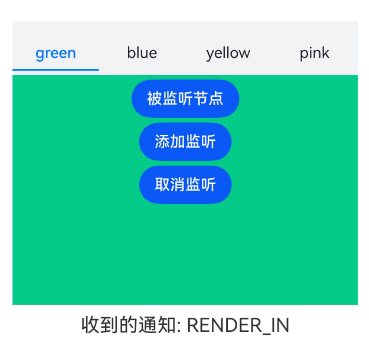
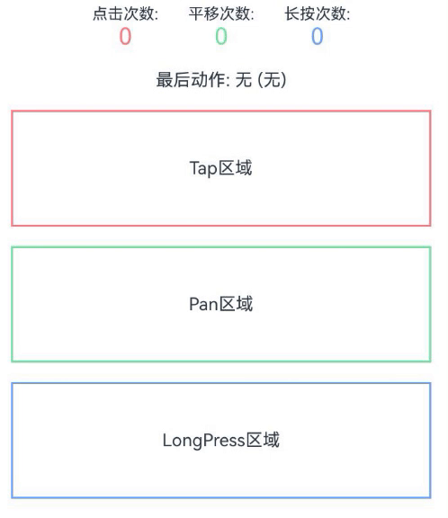

# Class (UIObserver)

<!--Kit: ArkUI-->
<!--Subsystem: ArkUI-->
<!--Owner: @piggyguy; @xiang-shouxing; @yangfan229-->
<!--Designer: @piggyguy; @xiang-shouxing; @yangfan229-->
<!--Tester: @fredyuan912-->
<!--Adviser: @HelloCrease-->

提供UI组件行为变化的无感监听能力。

> **说明：**
>
> - 本模块首批接口从API version 10开始支持。后续版本如有新增内容，则采用上角标单独标记该内容的起始版本。
>
> - 本Class首批接口从API version 11开始支持。
>
> - 以下API需先使用UIContext中的[getUIObserver()](arkts-apis-uicontext-uicontext.md#getuiobserver11)方法获取到UIObserver对象，再通过该对象调用对应方法。
>
> - UIObserver仅能监听到本进程内的相关信息，不支持获取<!--Del-->[UIExtensionComponent](../../reference/apis-arkui/arkui-ts/ts-container-ui-extension-component-sys.md)等<!--DelEnd-->跨进程场景的信息。

## on('navDestinationUpdate')<sup>11+</sup>

on(type: 'navDestinationUpdate', callback: Callback\<observer.NavDestinationInfo\>): void

监听NavDestination组件的状态变化。

**原子化服务API：** 从API version 12开始，该接口支持在原子化服务中使用。

**系统能力：** SystemCapability.ArkUI.ArkUI.Full

**参数：** 

| 参数名   | 类型                                                  | 必填 | 说明                                                         |
| -------- | ----------------------------------------------------- | ---- | ------------------------------------------------------------ |
| type     | string                                                | 是   | 监听事件，固定为'navDestinationUpdate'，即NavDestination组件的状态变化。 |
| callback | Callback\<observer.[NavDestinationInfo](js-apis-arkui-observer.md#navdestinationinfo)\> | 是   | 回调函数。返回当前的NavDestination组件状态。                 |

**示例：**

<!--code_no_check-->
```ts
// Index.ets
// 演示 uiObserver.on('navDestinationUpdate', callback)
// uiObserver.off('navDestinationUpdate', callback)

@Component
struct PageOne {
  build() {
    NavDestination() {
      Text("pageOne")
    }.title("pageOne")
  }
}

@Entry
@Component
struct Index {
  private stack: NavPathStack = new NavPathStack();

  @Builder
  PageBuilder(name: string) {
    PageOne()
  }

  aboutToAppear() {
    this.getUIContext().getUIObserver().on('navDestinationUpdate', (info) => {
      console.info('NavDestination state update', JSON.stringify(info));
    });
  }

  aboutToDisappear() {
    this.getUIContext().getUIObserver().off('navDestinationUpdate');
  }

  build() {
    Column() {
      Navigation(this.stack) {
        Button("push").onClick(() => {
          this.stack.pushPath({ name: "pageOne" });
        })
      }
      .title("Navigation")
      .navDestination(this.PageBuilder)
    }
    .width('100%')
    .height('100%')
  }
}
```

## off('navDestinationUpdate')<sup>11+</sup>

off(type: 'navDestinationUpdate', callback?: Callback\<observer.NavDestinationInfo\>): void

取消监听NavDestination组件的状态变化。

**原子化服务API：** 从API version 12开始，该接口支持在原子化服务中使用。

**系统能力：** SystemCapability.ArkUI.ArkUI.Full

**参数：** 

| 参数名   | 类型                                                  | 必填 | 说明                                                         |
| -------- | ----------------------------------------------------- | ---- | ------------------------------------------------------------ |
| type     | string                                                | 是   | 监听事件，固定为'navDestinationUpdate'，即NavDestination组件的状态变化。 |
| callback | Callback\<observer.[NavDestinationInfo](js-apis-arkui-observer.md#navdestinationinfo)\> | 否   | 需要取消的监听回调，不传参数时，取消所有的Navigation监听回调。                 |

**示例：** 

参考[uiObserver.on('navDestinationUpdate')](#onnavdestinationupdate11)示例。

## on('navDestinationUpdate')<sup>11+</sup>

on(type: 'navDestinationUpdate', options: { navigationId: ResourceStr }, callback: Callback\<observer.NavDestinationInfo\>): void

监听NavDestination组件的状态变化。

**原子化服务API：** 从API version 12开始，该接口支持在原子化服务中使用。

**系统能力：** SystemCapability.ArkUI.ArkUI.Full

**参数：** 

| 参数名   | 类型                                                         | 必填 | 说明                                                         |
| -------- | ------------------------------------------------------------ | ---- | ------------------------------------------------------------ |
| type     | string                                                       | 是   | 监听事件，固定为'navDestinationUpdate'，即NavDestination组件的状态变化。 |
| options  | { navigationId: [ResourceStr](arkui-ts/ts-types.md#resourcestr) } | 是   | 指定监听的Navigation的id。                                   |
| callback | Callback\<observer.[NavDestinationInfo](js-apis-arkui-observer.md#navdestinationinfo)\>        | 是   | 回调函数。返回当前的NavDestination组件状态。                 |

**示例：**

<!--code_no_check-->
```ts
// Index.ets
// 演示 uiObserver.on('navDestinationUpdate', navigationId, callback)
// uiObserver.off('navDestinationUpdate', navigationId, callback)
@Component
struct PageOne {
  build() {
    NavDestination() {
      Text("pageOne")
    }.title("pageOne")
  }
}

@Entry
@Component
struct Index {
  private stack: NavPathStack = new NavPathStack();

  @Builder
  PageBuilder(name: string) {
    PageOne()
  }

  aboutToAppear() {
    this.getUIContext().getUIObserver().on('navDestinationUpdate', { navigationId: "testId" }, (info) => {
      console.info('NavDestination state update', JSON.stringify(info));
    });
  }

  aboutToDisappear() {
    this.getUIContext().getUIObserver().off('navDestinationUpdate', { navigationId: "testId" });
  }

  build() {
    Column() {
      Navigation(this.stack) {
        Button("push").onClick(() => {
          this.stack.pushPath({ name: "pageOne" });
        })
      }
      .id("testId")
      .title("Navigation")
      .navDestination(this.PageBuilder)
    }
    .width('100%')
    .height('100%')
  }
}
```

## off('navDestinationUpdate')<sup>11+</sup>

off(type: 'navDestinationUpdate', options: { navigationId: ResourceStr }, callback?: Callback\<observer.NavDestinationInfo\>): void

取消监听NavDestination组件的状态变化。

**原子化服务API：** 从API version 12开始，该接口支持在原子化服务中使用。

**系统能力：** SystemCapability.ArkUI.ArkUI.Full

**参数：** 

| 参数名   | 类型                                                         | 必填 | 说明                                                         |
| -------- | ------------------------------------------------------------ | ---- | ------------------------------------------------------------ |
| type     | string                                                       | 是   | 监听事件，固定为'navDestinationUpdate'，即NavDestination组件的状态变化。 |
| options  | { navigationId: [ResourceStr](arkui-ts/ts-types.md#resourcestr) } | 是   | 指定监听的Navigation的id。                                   |
| callback | Callback\<observer.[NavDestinationInfo](js-apis-arkui-observer.md#navdestinationinfo)\>        | 否   |需要取消的监听回调，不传参数时，取消该Navigation上所有的监听回调。                 |

**示例：**

参考[uiObserver.on('navDestinationUpdate')](#onnavdestinationupdate11-1)示例。

## on('navDestinationUpdateByUniqueId')<sup>20+</sup>

on(type: 'navDestinationUpdateByUniqueId', navigationUniqueId: number, callback: Callback\<observer.NavDestinationInfo\>): void

通过Navigation的uniqueId监听NavDestination组件的状态变化，uniqueId可通过[queryNavigationInfo](arkui-ts/ts-custom-component-api.md#querynavigationinfo12)获取。

**原子化服务API：** 从API version 20开始，该接口支持在原子化服务中使用。

**系统能力：** SystemCapability.ArkUI.ArkUI.Full

**参数：** 

| 参数名   | 类型                                                                 | 必填 | 说明                                                                     |
| -------- | -------------------------------------------------------------------- | ---- | ------------------------------------------------------------------------ |
| type     | string                                                               | 是   | 监听事件，固定为'navDestinationUpdateByUniqueId'，即NavDestination组件的状态变化。 |
| navigationUniqueId  | number | 是   | 指定监听的Navigation的uniqueId，可以通过[queryNavigationInfo](arkui-ts/ts-custom-component-api.md#querynavigationinfo12)获取。                                               |
| callback | Callback\<observer.[NavDestinationInfo](js-apis-arkui-observer.md#navdestinationinfo)\>                | 是   | 回调函数。返回当前的NavDestination组件状态。                             |

**示例：**

通过Navigation的uniqueId，可以触发NavDestination组件的状态变化。

```ts
// Index.ets
// 演示 on('navDestinationUpdateByUniqueId', navigationUniqueId, callback)
// off('navDestinationUpdateByUniqueId', navigationUniqueId, callback)
@Component
struct PageOne {
  private text = '';
  private uniqueid = -1;
  aboutToAppear() {
    let navigationUniqueId = this.queryNavigationInfo()?.uniqueId;
    if (navigationUniqueId) {
      this.uniqueid = navigationUniqueId.valueOf();
    }
    this.text = JSON.stringify(this.uniqueid);
    this.getUIContext().getUIObserver().on('navDestinationUpdateByUniqueId', this.uniqueid, (info) => {
      console.info('NavDestination state update navigationId', JSON.stringify(info));
    });
  }
  aboutToDisappear() {
    this.getUIContext().getUIObserver().off('navDestinationUpdateByUniqueId', this.uniqueid);
  }
  build() {
    NavDestination() {
      Text("pageOne")
      Text('navigationUniqueId是:' + this.text)
        .width('80%')
        .height(50)
        .margin(50)
        .fontSize(20)
    }.title("pageOne")
  }
}

@Entry
@Component
struct Index {
  private stack: NavPathStack = new NavPathStack();

  @Builder
  PageBuilder(name: string) {
    PageOne()
  }

  build() {
    Column() {
      Navigation(this.stack) {
        Button("push").onClick(() => {
          this.stack.pushPath({ name: "pageOne" });
        })
      }
      .id("testId")
      .title("Navigation")
      .navDestination(this.PageBuilder)
    }
    .width('100%')
    .height('100%')
  }
}
```

## off('navDestinationUpdateByUniqueId')<sup>20+</sup>

off(type: 'navDestinationUpdateByUniqueId', navigationUniqueId: number, callback?: Callback\<observer.NavDestinationInfo\>): void

取消通过navigationUniqueId监听NavDestination组件的变化。

**原子化服务API：** 从API version 20开始，该接口支持在原子化服务中使用。

**系统能力：** SystemCapability.ArkUI.ArkUI.Full

**参数：** 

| 参数名   | 类型                                                                 | 必填 | 说明                                                                     |
| -------- | -------------------------------------------------------------------- | ---- | ------------------------------------------------------------------------ |
| type     | string                                                               | 是   | 监听事件，固定为'navDestinationUpdateByUniqueId'，即NavDestination组件的状态变化。 |
| navigationUniqueId  | number | 是   | 指定监听的Navigation的uniqueId，可以通过[queryNavigationInfo](arkui-ts/ts-custom-component-api.md#querynavigationinfo12)获取。                                               |
| callback | Callback\<observer.[NavDestinationInfo](js-apis-arkui-observer.md#navdestinationinfo)\>                | 否   | 需要取消的监听回调，不传参数时，取消该Navigation上所有的监听回调。                             |

**示例：**

参考[uiObserver.on('navDestinationUpdateByUniqueId')](#onnavdestinationupdatebyuniqueid20)示例。

## on('scrollEvent')<sup>12+</sup>

on(type: 'scrollEvent', callback: Callback\<observer.ScrollEventInfo\>): void

监听所有滚动组件滚动事件的开始和结束。滚动组件包括[List](./arkui-ts/ts-container-list.md)、[Grid](./arkui-ts/ts-container-grid.md)、[Scroll](./arkui-ts/ts-container-scroll.md)、[WaterFlow](./arkui-ts/ts-container-waterflow.md)、[ArcList](./arkui-ts/ts-container-arclist.md)。

**原子化服务API：** 从API version 12开始，该接口支持在原子化服务中使用。

**系统能力：** SystemCapability.ArkUI.ArkUI.Full

**参数：** 

| 参数名   | 类型                                                  | 必填 | 说明                                                         |
| -------- | ----------------------------------------------------- | ---- | ------------------------------------------------------------ |
| type     | string                                                | 是   | 监听事件，固定为'scrollEvent'，即滚动事件的开始和结束。      |
| callback | Callback\<observer.[ScrollEventInfo](js-apis-arkui-observer.md#scrolleventinfo12)\> | 是   | 回调函数。返回滚动事件的信息。   |

**示例：**

参考[off('scrollEvent')](#offscrollevent12-1)示例。

## off('scrollEvent')<sup>12+</sup>

off(type: 'scrollEvent', callback?: Callback\<observer.ScrollEventInfo\>): void

取消监听所有滚动组件滚动事件的开始和结束。滚动组件包括[List](./arkui-ts/ts-container-list.md)、[Grid](./arkui-ts/ts-container-grid.md)、[Scroll](./arkui-ts/ts-container-scroll.md)、[WaterFlow](./arkui-ts/ts-container-waterflow.md)、[ArcList](./arkui-ts/ts-container-arclist.md)。

**原子化服务API：** 从API version 12开始，该接口支持在原子化服务中使用。

**系统能力：** SystemCapability.ArkUI.ArkUI.Full

**参数：** 

| 参数名   | 类型                                                  | 必填 | 说明                                                         |
| -------- | ----------------------------------------------------- | ---- | ------------------------------------------------------------ |
| type     | string                                                | 是   | 监听事件，固定为'scrollEvent'，即滚动事件的开始和结束。      |
| callback | Callback\<observer.[ScrollEventInfo](js-apis-arkui-observer.md#scrolleventinfo12)\> | 否   | 回调函数。返回滚动事件的信息。   |

**示例：**

参考[off('scrollEvent')](#offscrollevent12-1)示例。

## on('scrollEvent')<sup>12+</sup>

on(type: 'scrollEvent', options: observer.ObserverOptions, callback: Callback\<observer.ScrollEventInfo\>): void

监听指定id的滚动组件滚动事件的开始和结束。滚动组件包括[List](./arkui-ts/ts-container-list.md)、[Grid](./arkui-ts/ts-container-grid.md)、[Scroll](./arkui-ts/ts-container-scroll.md)、[WaterFlow](./arkui-ts/ts-container-waterflow.md)、[ArcList](./arkui-ts/ts-container-arclist.md)。

**原子化服务API：** 从API version 12开始，该接口支持在原子化服务中使用。

**系统能力：** SystemCapability.ArkUI.ArkUI.Full

**参数：** 

| 参数名   | 类型                                                         | 必填 | 说明                                                         |
| -------- | ------------------------------------------------------------ | ---- | ------------------------------------------------------------ |
| type     | string                                                       | 是   | 监听事件，固定为'scrollEvent'，即滚动事件的开始和结束。 |
| options  | [observer.ObserverOptions](js-apis-arkui-observer.md#observeroptions12) | 是   | Observer选项，包含指定监听的滚动组件的id。                    |
| callback | Callback\<observer.[ScrollEventInfo](js-apis-arkui-observer.md#scrolleventinfo12)\>        | 是   | 回调函数。返回滚动事件的信息。                 |

**示例：**

参考[off('scrollEvent')](#offscrollevent12-1)示例。

## off('scrollEvent')<sup>12+</sup>

off(type: 'scrollEvent', options: observer.ObserverOptions, callback?: Callback\<observer.ScrollEventInfo\>): void

取消监听指定id的滚动组件滚动事件的开始和结束。滚动组件包括[List](./arkui-ts/ts-container-list.md)、[Grid](./arkui-ts/ts-container-grid.md)、[Scroll](./arkui-ts/ts-container-scroll.md)、[WaterFlow](./arkui-ts/ts-container-waterflow.md)、[ArcList](./arkui-ts/ts-container-arclist.md)。

**原子化服务API：** 从API version 12开始，该接口支持在原子化服务中使用。

**系统能力：** SystemCapability.ArkUI.ArkUI.Full

**参数：** 

| 参数名   | 类型                                                         | 必填 | 说明                                                         |
| -------- | ------------------------------------------------------------ | ---- | ------------------------------------------------------------ |
| type     | string                                                       | 是   | 监听事件，固定为'scrollEvent'，即滚动事件的开始和结束。 |
| options  | [observer.ObserverOptions](js-apis-arkui-observer.md#observeroptions12) | 是   | Observer选项，包含指定监听的滚动组件的id。                    |
| callback | Callback\<observer.[ScrollEventInfo](js-apis-arkui-observer.md#scrolleventinfo12)\>        | 否   | 回调函数。返回滚动事件的信息。                 |

**示例：**

```ts
import { UIObserver } from '@kit.ArkUI';

@Entry
@Component
struct Index {
  scroller: Scroller = new Scroller();
  observer: UIObserver = this.getUIContext().getUIObserver();
  private arr: number[] = [0, 1, 2, 3, 4, 5, 6, 7];

  build() {
    Column() {
      Column() {
        Scroll(this.scroller) {
          Column() {
            ForEach(this.arr, (item: number) => {
              Text(item.toString())
                .width('90%')
                .height(150)
                .backgroundColor(0xFFFFFF)
                .borderRadius(15)
                .fontSize(16)
                .textAlign(TextAlign.Center)
                .margin({ top: 10 })
            }, (item: string) => item)
          }.width('100%')
        }
        .id('testId')
        .height('80%')
      }
      .width('100%')

      Row() {
        Button('UIObserver on')
          .onClick(() => {
            this.observer.on('scrollEvent', (info) => {
              console.info('scrollEventInfo', JSON.stringify(info));
            });
          })
        Button('UIObserver off')
          .onClick(() => {
            this.observer.off('scrollEvent');
          })
      }

      Row() {
        Button('UIObserverWithId on')
          .onClick(() => {
            this.observer.on('scrollEvent', { id: 'testId' }, (info) => {
              console.info('scrollEventInfo', JSON.stringify(info));
            });
          })
        Button('UIObserverWithId off')
          .onClick(() => {
            this.observer.off('scrollEvent', { id: 'testId' });
          })
      }
    }
    .height('100%')
  }
}
```

## on('routerPageUpdate')<sup>11+</sup>

on(type: 'routerPageUpdate', callback: Callback\<observer.RouterPageInfo\>): void

监听router中page页面的状态变化。

**原子化服务API：** 从API version 12开始，该接口支持在原子化服务中使用。

**系统能力：** SystemCapability.ArkUI.ArkUI.Full

**参数：** 

| 参数名   | 类型                                                         | 必填 | 说明                                                         |
| -------- | ------------------------------------------------------------ | ---- | ------------------------------------------------------------ |
| type     | string                                                       | 是   | 监听事件，固定为'routerPageUpdate'，即router中page页面的状态变化。 |
| callback | Callback\<observer.[RouterPageInfo](js-apis-arkui-observer.md#routerpageinfo)\>        | 是   | 回调函数。携带pageInfo，返回当前的page页面状态。                 |

**示例：**

完整示例请参考[on('navDestinationUpdate')](#onnavdestinationupdate11)中的示例。

<!--code_no_check-->
```ts
import { UIContext, UIObserver } from '@kit.ArkUI';

let observer:UIObserver = this.getUIContext().getUIObserver();
observer.on('routerPageUpdate', (info) => {
    console.info('RouterPage state updated, called by ' + `${info.name}`);
});
```

## off('routerPageUpdate')<sup>11+</sup>

off(type: 'routerPageUpdate', callback?: Callback\<observer.RouterPageInfo\>): void

取消监听router中page页面的状态变化。

**原子化服务API：** 从API version 12开始，该接口支持在原子化服务中使用。

**系统能力：** SystemCapability.ArkUI.ArkUI.Full

**参数：** 

| 参数名   | 类型                                                         | 必填 | 说明                                                         |
| -------- | ------------------------------------------------------------ | ---- | ------------------------------------------------------------ |
| type     | string                                                       | 是   | 监听事件，固定为'routerPageUpdate'，即router中page页面的状态变化。 |
| callback | Callback\<observer.[RouterPageInfo](js-apis-arkui-observer.md#routerpageinfo)\>        | 否   | 需要被注销的回调函数。                 |

**示例：**

完整示例请参考[on('navDestinationUpdate')](#onnavdestinationupdate11)中的示例。

<!--code_no_check-->
```ts
import { UIContext, UIObserver } from '@kit.ArkUI';

let observer:UIObserver = this.getUIContext().getUIObserver();
function callBackFunc(info:observer.RouterPageInfo) {};
// callBackFunc is defined and used before
observer.off('routerPageUpdate', callBackFunc);
```

## on('densityUpdate')<sup>12+</sup>

on(type: 'densityUpdate', callback: Callback\<observer.DensityInfo\>): void

监听屏幕像素密度变化。

**原子化服务API：** 从API version 12开始，该接口支持在原子化服务中使用。

**系统能力：** SystemCapability.ArkUI.ArkUI.Full

**参数：** 

| 参数名   | 类型                                                         | 必填 | 说明                                                         |
| -------- | ------------------------------------------------------------ | ---- | ------------------------------------------------------------ |
| type     | string                                                       | 是   | 监听事件，固定为'densityUpdate'，即屏幕像素密度变化。 |
| callback | Callback\<observer.[DensityInfo](./js-apis-arkui-observer.md#densityinfo12)\>        | 是   | 回调函数。携带densityInfo，返回变化后的屏幕像素密度。                 |

```ts
import { uiObserver } from '@kit.ArkUI';

@Entry
@Component
struct Index {
  @State density: number = 0;
  @State message: string = '未注册监听';

  densityUpdateCallback = (info: uiObserver.DensityInfo) => {
    this.density = info.density;
    this.message = '变化后的DPI：' + this.density.toString();
  }

  build() {
    Column() {
      Text(this.message)
        .fontSize(24)
        .fontWeight(FontWeight.Bold)
      Button('注册屏幕像素密度变化监听')
        .onClick(() => {
          this.message = '已注册监听';
          this.getUIContext().getUIObserver().on('densityUpdate', this.densityUpdateCallback);
        })
    }
  }
}
```

## off('densityUpdate')<sup>12+</sup>

off(type: 'densityUpdate', callback?: Callback\<observer.DensityInfo\>): void

取消监听屏幕像素密度的变化。

**原子化服务API：** 从API version 12开始，该接口支持在原子化服务中使用。

**系统能力：** SystemCapability.ArkUI.ArkUI.Full

**参数：** 

| 参数名   | 类型                                                                 | 必填 | 说明                                                                                         |
| -------- | -------------------------------------------------------------------- | ---- | -------------------------------------------------------------------------------------------- |
| type     | string                                                               | 是   | 监听事件，固定为'densityUpdate'，即屏幕像素密度变化。                                        |
| callback | Callback\<observer.[DensityInfo](./js-apis-arkui-observer.md#densityinfo12)\> | 否   | 需要被注销的回调函数。若不指定具体的回调函数，则注销该UIContext下所有densityUpdate事件监听。 |

```ts
import { uiObserver } from '@kit.ArkUI';

@Entry
@Component
struct Index {
  @State density: number = 0;
  @State message: string = '未注册监听';

  densityUpdateCallback = (info: uiObserver.DensityInfo) => {
    this.density = info.density;
    this.message = '变化后的DPI：' + this.density.toString();
  }

  build() {
    Column() {
      Text(this.message)
        .fontSize(24)
        .fontWeight(FontWeight.Bold)
      Button('注册屏幕像素密度变化监听')
        .margin({ bottom: 10 })
        .onClick(() => {
          this.message = '已注册监听';
          this.getUIContext().getUIObserver().on('densityUpdate', this.densityUpdateCallback);
        })
      Button('解除注册屏幕像素密度变化监听')
        .onClick(() => {
          this.message = '未注册监听';
          this.getUIContext().getUIObserver().off('densityUpdate', this.densityUpdateCallback);
        })
    }
  }
}
```

## on('willDraw')<sup>12+</sup>

on(type: 'willDraw', callback: Callback\<void\>): void

监听每一帧绘制指令下发情况。

**原子化服务API：** 从API version 12开始，该接口支持在原子化服务中使用。

**系统能力：** SystemCapability.ArkUI.ArkUI.Full

**参数：** 

| 参数名   | 类型                                                         | 必填 | 说明                                                         |
| -------- | ------------------------------------------------------------ | ---- | ------------------------------------------------------------ |
| type     | string                                                       | 是   | 监听事件，固定为'willDraw'，即是否将要绘制。 |
| callback | Callback\<void\>        | 是   | 回调函数。                 |

```ts
import { uiObserver } from '@kit.ArkUI';

@Entry
@Component
struct Index {
  willDrawCallback = () => {
    console.info("willDraw指令下发");
  }
  build() {
    Column() {
      Button('注册绘制指令下发监听')
        .onClick(() => {
          this.getUIContext().getUIObserver().on('willDraw', this.willDrawCallback);
        })
    }
  }
}
```

## off('willDraw')<sup>12+</sup>

off(type: 'willDraw', callback?: Callback\<void\>): void

取消监听每一帧绘制指令下发情况。

**原子化服务API：** 从API version 12开始，该接口支持在原子化服务中使用。

**系统能力：** SystemCapability.ArkUI.ArkUI.Full

**参数：** 

| 参数名   | 类型                                                         | 必填 | 说明                                                         |
| -------- | ------------------------------------------------------------ | ---- | ------------------------------------------------------------ |
| type     | string                                                       | 是   | 监听事件，固定为'willDraw'，即是否将要绘制。 |
| callback | Callback\<void\>        | 否   | 需要被注销的回调函数。                  |

```ts
import { uiObserver } from '@kit.ArkUI';

@Entry
@Component
struct Index {
  willDrawCallback = () => {
    console.info("willDraw指令下发")
  }

  build() {
    Column() {
      Button('注册绘制指令下发监听')
        .margin({ bottom: 10 })
        .onClick(() => {
          this.getUIContext().getUIObserver().on('willDraw', this.willDrawCallback);
        })
      Button('解除注册绘制指令下发监听')
        .onClick(() => {
          this.getUIContext().getUIObserver().off('willDraw', this.willDrawCallback);
        })
    }
  }
}
```

## on('didLayout')<sup>12+</sup>

on(type: 'didLayout', callback: Callback\<void\>): void

监听每一帧布局完成情况。

**原子化服务API：** 从API version 12开始，该接口支持在原子化服务中使用。

**系统能力：** SystemCapability.ArkUI.ArkUI.Full

**参数：** 

| 参数名   | 类型                                                         | 必填 | 说明                                                         |
| -------- | ------------------------------------------------------------ | ---- | ------------------------------------------------------------ |
| type     | string                                                       | 是   | 监听事件，固定为'didLayout'，即是否布局完成。 |
| callback | Callback\<void\>        | 是   | 回调函数。                 |

```ts
import { uiObserver } from '@kit.ArkUI';

@Entry
@Component
struct Index {
  didLayoutCallback = () => {
    console.info("layout布局完成");
  }
  build() {
    Column() {
      Button('注册布局完成监听')
        .onClick(() => {
          this.getUIContext().getUIObserver().on('didLayout', this.didLayoutCallback);
        })
    }
  }
}
```

## off('didLayout')<sup>12+</sup>

off(type: 'didLayout', callback?: Callback\<void\>): void

取消监听每一帧布局完成情况。

**原子化服务API：** 从API version 12开始，该接口支持在原子化服务中使用。

**系统能力：** SystemCapability.ArkUI.ArkUI.Full

**参数：** 

| 参数名   | 类型                                                         | 必填 | 说明                                                         |
| -------- | ------------------------------------------------------------ | ---- | ------------------------------------------------------------ |
| type     | string                                                       | 是   | 监听事件，固定为'didLayout'，即是否布局完成。 |
| callback | Callback\<void\>        | 否   | 需要被注销的回调函数。                  |

```ts
import { uiObserver } from '@kit.ArkUI';

@Entry
@Component
struct Index {
  didLayoutCallback = () => {
    console.info("layout布局完成");
  }

  build() {
    Column() {
      Button('注册布局完成监听')
        .margin({ bottom: 10 })
        .onClick(() => {
          this.getUIContext().getUIObserver().on('didLayout', this.didLayoutCallback);
        })
      Button('解除注册注册布局完成监听')
        .onClick(() => {
          this.getUIContext().getUIObserver().off('didLayout', this.didLayoutCallback);
        })
    }
  }
}
```

## on('navDestinationSwitch')<sup>12+</sup>

on(type: 'navDestinationSwitch', callback: Callback\<observer.NavDestinationSwitchInfo\>): void

监听Navigation的页面切换事件。

**原子化服务API：** 从API version 12开始，该接口支持在原子化服务中使用。

**系统能力：** SystemCapability.ArkUI.ArkUI.Full

**参数：** 

| 参数名   | 类型                                                         | 必填 | 说明                                                         |
| -------- | ------------------------------------------------------------ | ---- | ------------------------------------------------------------ |
| type     | string                                                       | 是   | 监听事件，固定为'navDestinationSwitch'，即Navigation的页面切换事件。 |
| callback | Callback\<observer.[NavDestinationSwitchInfo](js-apis-arkui-observer.md#navdestinationswitchinfo12)\>        | 是   | 回调函数。携带NavDestinationSwitchInfo，返回页面切换事件的信息。                 |

**示例：**

```ts
// Index.ets
// 演示 UIObserver.on('navDestinationSwitch', callback)
// UIObserver.off('navDestinationSwitch', callback)
import { uiObserver } from '@kit.ArkUI';

@Component
struct PageOne {
  build() {
    NavDestination() {
      Text("pageOne")
    }.title("pageOne")
  }
}

function callBackFunc(info: uiObserver.NavDestinationSwitchInfo) {
  console.info(`testTag navDestinationSwitch from: ${JSON.stringify(info.from)} to: ${JSON.stringify(info.to)}`);
}

@Entry
@Component
struct Index {
  private stack: NavPathStack = new NavPathStack();

  @Builder
  PageBuilder(name: string) {
    PageOne()
  }

  aboutToAppear() {
    let obs = this.getUIContext().getUIObserver();
    obs.on('navDestinationSwitch', callBackFunc);
  }

  aboutToDisappear() {
    let obs = this.getUIContext().getUIObserver();
    obs.off('navDestinationSwitch', callBackFunc);
  }

  build() {
    Column() {
      Navigation(this.stack) {
        Button("push").onClick(() => {
          this.stack.pushPath({name: "pageOne"});
        })
      }
      .title("Navigation")
      .navDestination(this.PageBuilder)
    }
    .width('100%')
    .height('100%')
  }
}
```

## off('navDestinationSwitch')<sup>12+</sup>

off(type: 'navDestinationSwitch', callback?: Callback\<observer.NavDestinationSwitchInfo\>): void

取消监听Navigation的页面切换事件。

**原子化服务API：** 从API version 12开始，该接口支持在原子化服务中使用。

**系统能力：** SystemCapability.ArkUI.ArkUI.Full

**参数：** 

| 参数名   | 类型                                                         | 必填 | 说明                                                         |
| -------- | ------------------------------------------------------------ | ---- | ------------------------------------------------------------ |
| type     | string                                                       | 是   | 监听事件，固定为'navDestinationSwitch'，即Navigation的页面切换事件。 |
| callback | Callback\<observer.[NavDestinationSwitchInfo](js-apis-arkui-observer.md#navdestinationswitchinfo12)\>        | 否   | 需要被注销的回调函数。                 |

**示例代码参考上述UIObserver.on('navDestinationSwitch')接口的示例代码。**

## on('navDestinationSwitch')<sup>12+</sup>

on(type: 'navDestinationSwitch', observerOptions: observer.NavDestinationSwitchObserverOptions, callback: Callback\<observer.NavDestinationSwitchInfo\>): void

监听Navigation的页面切换事件。

**原子化服务API：** 从API version 12开始，该接口支持在原子化服务中使用。

**系统能力：** SystemCapability.ArkUI.ArkUI.Full

**参数：** 

| 参数名   | 类型                                                         | 必填 | 说明                                                         |
| -------- | ------------------------------------------------------------ | ---- | ------------------------------------------------------------ |
| type     | string                                                       | 是   | 监听事件，固定为'navDestinationSwitch'，即Navigation的页面切换事件。 |
| observerOptions | observer.[NavDestinationSwitchObserverOptions](js-apis-arkui-observer.md#navdestinationswitchobserveroptions12)        | 是   | 监听选项。   |
| callback | Callback\<observer.[NavDestinationSwitchInfo](js-apis-arkui-observer.md#navdestinationswitchinfo12)\>        | 是   | 回调函数。携带NavDestinationSwitchInfo，返回页面切换事件的信息。                 |

**示例：**

```ts
// Index.ets
// 演示 UIObserver.on('navDestinationSwitch', NavDestinationSwitchObserverOptions, callback)
// UIObserver.off('navDestinationSwitch', NavDestinationSwitchObserverOptions, callback)
import { uiObserver } from '@kit.ArkUI';

@Component
struct PageOne {
  build() {
    NavDestination() {
      Text("pageOne")
    }.title("pageOne")
  }
}

function callBackFunc(info: uiObserver.NavDestinationSwitchInfo) {
  console.info(`testTag navDestinationSwitch from: ${JSON.stringify(info.from)} to: ${JSON.stringify(info.to)}`);
}

@Entry
@Component
struct Index {
  private stack: NavPathStack = new NavPathStack();

  @Builder
  PageBuilder(name: string) {
    PageOne()
  }

  aboutToAppear() {
    let obs = this.getUIContext().getUIObserver();
    obs.on('navDestinationSwitch', { navigationId: "myNavId" }, callBackFunc);
  }

  aboutToDisappear() {
    let obs = this.getUIContext().getUIObserver();
    obs.off('navDestinationSwitch', { navigationId: "myNavId" }, callBackFunc);
  }

  build() {
    Column() {
      Navigation(this.stack) {
        Button("push").onClick(() => {
          this.stack.pushPath({name: "pageOne"});
        })
      }
      .id("myNavId")
      .title("Navigation")
      .navDestination(this.PageBuilder)
    }
    .width('100%')
    .height('100%')
  }
}
```

## off('navDestinationSwitch')<sup>12+</sup>

off(type: 'navDestinationSwitch', observerOptions: observer.NavDestinationSwitchObserverOptions, callback?: Callback\<observer.NavDestinationSwitchInfo\>): void

取消监听Navigation的页面切换事件。

**原子化服务API：** 从API version 12开始，该接口支持在原子化服务中使用。

**系统能力：** SystemCapability.ArkUI.ArkUI.Full

**参数：** 

| 参数名   | 类型                                                         | 必填 | 说明                                                         |
| -------- | ------------------------------------------------------------ | ---- | ------------------------------------------------------------ |
| type     | string                                                       | 是   | 监听事件，固定为'navDestinationSwitch'，即Navigation的页面切换事件。 |
| observerOptions | observer.[NavDestinationSwitchObserverOptions](js-apis-arkui-observer.md#navdestinationswitchobserveroptions12)        | 是   | 监听选项。   |
| callback | Callback\<observer.[NavDestinationSwitchInfo](js-apis-arkui-observer.md#navdestinationswitchinfo12)\>        | 否   | 需要被注销的回调函数。                 |

**示例代码参考上述UIObserver.on('navDestinationSwitch')接口的示例代码。**

## on('willClick')<sup>12+</sup>

on(type: 'willClick', callback: GestureEventListenerCallback): void

监听点击事件指令下发情况。回调类型为[GestureEventListenerCallback](arkts-apis-uicontext-t.md#gestureeventlistenercallback12)。从API version 20开始支持屏幕朗读触控模式。

**原子化服务API：** 从API version 12开始，该接口支持在原子化服务中使用。

**系统能力：** SystemCapability.ArkUI.ArkUI.Full

**参数：** 

| 参数名   | 类型                                                         | 必填 | 说明                                                         |
| -------- | ------------------------------------------------------------ | ---- | ------------------------------------------------------------ |
| type     | string                                                       | 是   | 监听事件，固定为'willClick'，用于监听点击事件指令下发情况，所注册回调将于点击事件触发前触发。 |
| callback | [GestureEventListenerCallback](arkts-apis-uicontext-t.md#gestureeventlistenercallback12) | 是   | 回调函数。可以获得点击事件的GestureEvent和组件的FrameNode。  |

**示例：**

```ts
// 定义监听回调函数
function willClickGestureCallback(event: GestureEvent, node?: FrameNode) {
  console.info('Example willClickCallback GestureEvent is called');
}

function willClickCallback(event: ClickEvent, node?: FrameNode) {
  console.info('Example willClickCallback ClickEvent is called');
}

function didClickGestureCallback(event: GestureEvent, node?: FrameNode) {
  console.info('Example didClickCallback GestureEvent is called');
}

function didClickCallback(event: ClickEvent, node?: FrameNode) {
  console.info('Example didClickCallback ClickEvent is called');
}

@Entry
@Component
struct ClickExample {
  @State clickCount: number = 0;
  @State tapGestureCount: number = 0;

  aboutToAppear(): void {
    // 添加监听
    let observer = this.getUIContext().getUIObserver();
    observer.on('willClick', willClickGestureCallback);
    observer.on('willClick', willClickCallback);
    observer.on('didClick', didClickGestureCallback);
    observer.on('didClick', didClickCallback);
  }

  aboutToDisappear(): void {
    // 取消监听
    let observer = this.getUIContext().getUIObserver();
    observer.off('willClick', willClickGestureCallback);
    observer.off('willClick', willClickCallback);
    // 如果不选择回调，则会取消所有监听的回调
    observer.off('didClick');
  }

  build() {
    Column() {
      /**
       * onClick和TapGesture在后端的处理是一致的
       * 所以无论是触发onClick还是触发TapGesture
       * on('willClick')两种类型入参的回调（GestureEvent和ClickEvent）都会被触发
       * 同理，on('didClick')的两种回调也会被触发
       */
      Column() {
        Text('Click Count: ' + this.clickCount)
      }
      .height(200)
      .width(300)
      .padding(20)
      .border({ width: 3 })
      .margin(50)
      .onClick((event: ClickEvent) => {
        this.clickCount++;
        console.info('Example Click event is called');
      })

      Column() {
        Text('TapGesture Count: ' + this.tapGestureCount)
      }
      .height(200)
      .width(300)
      .padding(20)
      .border({ width: 3 })
      .margin(50)
      .gesture(TapGesture({ count: 2 }).onAction((event: TapGestureEvent) => {
        this.tapGestureCount++;
        console.info('Example Click event is called');
      }))
    }
  }
}
```

## off('willClick')<sup>12+</sup>

off(type: 'willClick', callback?: GestureEventListenerCallback): void

取消监听点击事件指令下发情况。从API version 20开始支持屏幕朗读触控模式。

**原子化服务API：** 从API version 12开始，该接口支持在原子化服务中使用。

**系统能力：** SystemCapability.ArkUI.ArkUI.Full

**参数：** 

| 参数名   | 类型                                                         | 必填 | 说明                                                  |
| -------- | ------------------------------------------------------------ | ---- | ----------------------------------------------------- |
| type     | string                                                       | 是   | 监听事件，固定为'willClick'，即点击事件指令下发情况。 |
| callback | [GestureEventListenerCallback](arkts-apis-uicontext-t.md#gestureeventlistenercallback12) | 否   | 需要被注销的回调函数。                                |

**示例：**

完整示例请参考[on('willClick')](#onwillclick12)中的示例。

## on('didClick')<sup>12+</sup>

on(type: 'didClick', callback: GestureEventListenerCallback): void

监听点击事件指令下发情况。回调类型为[GestureEventListenerCallback](arkts-apis-uicontext-t.md#gestureeventlistenercallback12)。从API version 20开始支持屏幕朗读触控模式。

**原子化服务API：** 从API version 12开始，该接口支持在原子化服务中使用。

**系统能力：** SystemCapability.ArkUI.ArkUI.Full

**参数：** 

| 参数名   | 类型                                                         | 必填 | 说明                                                         |
| -------- | ------------------------------------------------------------ | ---- | ------------------------------------------------------------ |
| type     | string                                                       | 是   | 监听事件，固定为'didClick'，用于监听点击事件指令下发情况，所注册回调将于点击事件触发后触发。 |
| callback | [GestureEventListenerCallback](arkts-apis-uicontext-t.md#gestureeventlistenercallback12) | 是   | 回调函数。可以获得点击事件的GestureEvent和组件的FrameNode。  |

**示例：**

完整示例请参考[on('willClick')](#onwillclick12)中的示例。

## off('didClick')<sup>12+</sup>

off(type: 'didClick', callback?: GestureEventListenerCallback): void

取消监听点击事件指令下发情况。从API version 20开始，支持屏幕朗读触控模式。

**原子化服务API：** 从API version 12开始，该接口支持在原子化服务中使用。

**系统能力：** SystemCapability.ArkUI.ArkUI.Full

**参数：** 

| 参数名   | 类型                                                         | 必填 | 说明                                                 |
| -------- | ------------------------------------------------------------ | ---- | ---------------------------------------------------- |
| type     | string                                                       | 是   | 监听事件，固定为'didClick'，即点击事件指令下发情况。 |
| callback | [GestureEventListenerCallback](arkts-apis-uicontext-t.md#gestureeventlistenercallback12) | 否   | 需要被注销的回调函数。                               |

**示例：**

完整示例请参考[on('willClick')](#onwillclick12)中的示例。

## on('willClick')<sup>12+</sup>

on(type: 'willClick', callback: ClickEventListenerCallback): void

监听点击事件指令下发情况。回调类型为[ClickEventListenerCallback](arkts-apis-uicontext-t.md#clickeventlistenercallback12)。从API version 20开始支持屏幕朗读触控模式。

**原子化服务API：** 从API version 12开始，该接口支持在原子化服务中使用。

**系统能力：** SystemCapability.ArkUI.ArkUI.Full

**参数：** 

| 参数名   | 类型                                                        | 必填 | 说明                                                         |
| -------- | ----------------------------------------------------------- | ---- | ------------------------------------------------------------ |
| type     | string                                                      | 是   | 监听事件，固定为'willClick'，用于监听点击事件指令下发情况，所注册回调将于点击事件触发前触发。 |
| callback | [ClickEventListenerCallback](arkts-apis-uicontext-t.md#clickeventlistenercallback12) | 是   | 回调函数。可以获得点击事件的ClickEvent和组件的FrameNode。    |

**示例：**

完整示例请参考[on('willClick')](#onwillclick12)中的示例。

## off('willClick')<sup>12+</sup>

off(type: 'willClick', callback?: ClickEventListenerCallback): void

取消监听点击事件指令下发情况。从API version 20开始，支持屏幕朗读触控模式。

**原子化服务API：** 从API version 12开始，该接口支持在原子化服务中使用。

**系统能力：** SystemCapability.ArkUI.ArkUI.Full

**参数：** 

| 参数名   | 类型                                                        | 必填 | 说明                                                  |
| -------- | ----------------------------------------------------------- | ---- | ----------------------------------------------------- |
| type     | string                                                      | 是   | 监听事件，固定为'willClick'，即点击事件指令下发情况。 |
| callback | [ClickEventListenerCallback](arkts-apis-uicontext-t.md#clickeventlistenercallback12) | 否   | 需要被注销的回调函数。                                |

**示例：**

完整示例请参考[on('willClick')](#onwillclick12)中的示例。

## on('didClick')<sup>12+</sup>

on(type: 'didClick', callback: ClickEventListenerCallback): void

监听点击事件指令下发情况。回调类型为[ClickEventListenerCallback](arkts-apis-uicontext-t.md#clickeventlistenercallback12)。从API version 20开始支持屏幕朗读触控模式。

**原子化服务API：** 从API version 12开始，该接口支持在原子化服务中使用。

**系统能力：** SystemCapability.ArkUI.ArkUI.Full

**参数：** 

| 参数名   | 类型                                                        | 必填 | 说明                                                         |
| -------- | ----------------------------------------------------------- | ---- | ------------------------------------------------------------ |
| type     | string                                                      | 是   | 监听事件，固定为'didClick'，用于监听点击事件指令下发情况，所注册回调将于点击事件触发后触发。 |
| callback | [ClickEventListenerCallback](arkts-apis-uicontext-t.md#clickeventlistenercallback12) | 是   | 回调函数。可以获得点击事件的ClickEvent和组件的FrameNode。    |

**示例：**

完整示例请参考[on('willClick')](#onwillclick12)中的示例。

## off('didClick')<sup>12+</sup>

off(type: 'didClick', callback?: ClickEventListenerCallback): void

取消监听点击事件指令下发情况。从API version 20开始支持屏幕朗读触控模式。

**原子化服务API：** 从API version 12开始，该接口支持在原子化服务中使用。

**系统能力：** SystemCapability.ArkUI.ArkUI.Full

**参数：** 

| 参数名   | 类型                                                        | 必填 | 说明                                                 |
| -------- | ----------------------------------------------------------- | ---- | ---------------------------------------------------- |
| type     | string                                                      | 是   | 监听事件，固定为'didClick'，即点击事件指令下发情况。 |
| callback | [ClickEventListenerCallback](arkts-apis-uicontext-t.md#clickeventlistenercallback12) | 否   | 需要被注销的回调函数。                               |

**示例：**

完整示例请参考[on('willClick')](#onwillclick12)中的示例。

## on('tabContentUpdate')<sup>12+</sup>

on(type: 'tabContentUpdate', callback: Callback\<observer.TabContentInfo\>): void

监听TabContent页面的切换事件。

**原子化服务API：** 从API version 12开始，该接口支持在原子化服务中使用。

**系统能力：** SystemCapability.ArkUI.ArkUI.Full

**参数：** 

| 参数名   | 类型                                                         | 必填 | 说明                                                         |
| -------- | ------------------------------------------------------------ | ---- | ------------------------------------------------------------ |
| type     | string                                                       | 是   | 监听事件，固定为'tabContentUpdate'，即TabContent页面的切换事件。 |
| callback | Callback\<observer.[TabContentInfo](js-apis-arkui-observer.md#tabcontentinfo12)\> | 是   | 回调函数。携带TabContentInfo，返回TabContent页面切换事件的信息。 |

**示例：**

```ts
import { uiObserver } from '@kit.ArkUI';

function callbackFunc(info: uiObserver.TabContentInfo) {
  console.info('tabContentUpdate', JSON.stringify(info));
}

@Entry
@Component
struct TabsExample {

  aboutToAppear(): void {
    let observer = this.getUIContext().getUIObserver();
    observer.on('tabContentUpdate', callbackFunc);
  }

  aboutToDisappear(): void {
    let observer = this.getUIContext().getUIObserver();
    observer.off('tabContentUpdate', callbackFunc);
  }

  build() {
    Column() {
      Tabs() {
        TabContent() {
          Column().width('100%').height('100%').backgroundColor('#00CB87')
        }.tabBar('green').id('tabContentId0')

        TabContent() {
          Column().width('100%').height('100%').backgroundColor('#007DFF')
        }.tabBar('blue').id('tabContentId1')

        TabContent() {
          Column().width('100%').height('100%').backgroundColor('#FFBF00')
        }.tabBar('yellow').id('tabContentId2')

        TabContent() {
          Column().width('100%').height('100%').backgroundColor('#E67C92')
        }.tabBar('pink').id('tabContentId3')
      }
      .width(360)
      .height(296)
      .backgroundColor('#F1F3F5')
      .id('tabsId')
    }.width('100%')
  }
}
```

## off('tabContentUpdate')<sup>12+</sup>

off(type: 'tabContentUpdate', callback?: Callback\<observer.TabContentInfo\>): void

取消监听TabContent页面的切换事件。

**原子化服务API：** 从API version 12开始，该接口支持在原子化服务中使用。

**系统能力：** SystemCapability.ArkUI.ArkUI.Full

**参数：** 

| 参数名   | 类型                                                         | 必填 | 说明                                                         |
| -------- | ------------------------------------------------------------ | ---- | ------------------------------------------------------------ |
| type     | string                                                       | 是   | 监听事件，固定为'tabContentUpdate'，即TabContent页面的切换事件。 |
| callback | Callback\<observer.[TabContentInfo](js-apis-arkui-observer.md#tabcontentinfo12)\> | 否   | 需要被注销的回调函数。 |

**示例：**

参考[on('tabContentUpdate')](#ontabcontentupdate12)接口示例。

## on('tabContentUpdate')<sup>12+</sup>

on(type: 'tabContentUpdate', options: observer.ObserverOptions, callback: Callback\<observer.TabContentInfo\>): void

监听TabContent页面的切换事件。

**原子化服务API：** 从API version 12开始，该接口支持在原子化服务中使用。

**系统能力：** SystemCapability.ArkUI.ArkUI.Full

**参数：** 

| 参数名   | 类型                                                         | 必填 | 说明                                                         |
| -------- | ------------------------------------------------------------ | ---- | ------------------------------------------------------------ |
| type     | string                                                       | 是   | 监听事件，固定为'tabContentUpdate'，即TabContent页面的切换事件。 |
| options  | observer.[ObserverOptions](js-apis-arkui-observer.md#observeroptions12) | 是   | 指定监听的Tabs组件的id。 |
| callback | Callback\<observer.[TabContentInfo](js-apis-arkui-observer.md#tabcontentinfo12)\> | 是   | 回调函数。携带TabContentInfo，返回TabContent页面切换事件的信息。 |

**示例：**

```ts
import { uiObserver } from '@kit.ArkUI';

function callbackFunc(info: uiObserver.TabContentInfo) {
  console.info('tabContentUpdate', JSON.stringify(info));
}

@Entry
@Component
struct TabsExample {

  aboutToAppear(): void {
    let observer = this.getUIContext().getUIObserver();
    observer.on('tabContentUpdate', { id: 'tabsId' }, callbackFunc);
  }

  aboutToDisappear(): void {
    let observer = this.getUIContext().getUIObserver();
    observer.off('tabContentUpdate', { id: 'tabsId' }, callbackFunc);
  }

  build() {
    Column() {
      Tabs() {
        TabContent() {
          Column().width('100%').height('100%').backgroundColor('#00CB87')
        }.tabBar('green').id('tabContentId0')

        TabContent() {
          Column().width('100%').height('100%').backgroundColor('#007DFF')
        }.tabBar('blue').id('tabContentId1')

        TabContent() {
          Column().width('100%').height('100%').backgroundColor('#FFBF00')
        }.tabBar('yellow').id('tabContentId2')

        TabContent() {
          Column().width('100%').height('100%').backgroundColor('#E67C92')
        }.tabBar('pink').id('tabContentId3')
      }
      .width(360)
      .height(296)
      .backgroundColor('#F1F3F5')
      .id('tabsId')
    }.width('100%')
  }
}
```

## off('tabContentUpdate')<sup>12+</sup>

off(type: 'tabContentUpdate', options: observer.ObserverOptions, callback?: Callback\<observer.TabContentInfo\>): void

取消监听TabContent页面的切换事件。

**原子化服务API：** 从API version 12开始，该接口支持在原子化服务中使用。

**系统能力：** SystemCapability.ArkUI.ArkUI.Full

**参数：** 

| 参数名   | 类型                                                         | 必填 | 说明                                                         |
| -------- | ------------------------------------------------------------ | ---- | ------------------------------------------------------------ |
| type     | string                                                       | 是   | 监听事件，固定为'tabContentUpdate'，即TabContent页面的切换事件。 |
| options  | observer.[ObserverOptions](js-apis-arkui-observer.md#observeroptions12) | 是   | 指定监听的Tabs组件的id。 |
| callback | Callback\<observer.[TabContentInfo](js-apis-arkui-observer.md#tabcontentinfo12)\> | 否   | 需要被注销的回调函数。 |

**示例：**

参考[on('tabContentUpdate')](#ontabcontentupdate12-1)接口示例。

## on('beforePanStart')<sup>19+</sup>

on(type: 'beforePanStart', callback: PanListenerCallback): void

监听Pan手势[onActionStart](arkui-ts/ts-basic-gestures-pangesture.md#事件)事件，在onActionStart事件执行之前执行callback回调。支持手指滑动、鼠标滑动、鼠标滚轮和触摸板拖动，暂不支持屏幕朗读触控模式。

**原子化服务API：** 从API version 19开始，该接口支持在原子化服务中使用。

**系统能力：** SystemCapability.ArkUI.ArkUI.Full

**参数：** 

| 参数名   | 类型                                                        | 必填 | 说明                                                         |
| -------- | ----------------------------------------------------------- | ---- | ------------------------------------------------------------ |
| type     | string                                                      | 是   | 监听事件，固定为'beforePanStart'，用于监听Pan手势onActionStart事件执行前的指令下发情况，所注册回调将于Pan手势onActionStart事件触发前触发。 |
| callback | [PanListenerCallback](arkts-apis-uicontext-t.md#panlistenercallback19) | 是   | 回调函数。可以获得Pan手势事件的GestureEvent，GestureRecognizer和组件的FrameNode。   |

**示例：**

```ts
// 在页面Component中使用
let TEST_TAG: string = 'node';

function callbackFunc() {
  console.info('on == beforePanStart');
}

function afterPanCallBack() {
  console.info('on == afterPanStart');
}

function beforeEndCallBack() {
  console.info('on == beforeEnd');
}

function afterEndCallBack() {
  console.info('on == afterEnd');
}

function beforeStartCallBack() {
  console.info('on == beforeStartCallBack');
}

function panGestureCallBack(event: GestureEvent, current: GestureRecognizer, node?: FrameNode) {
  TEST_TAG = 'panGestureEvent';
  console.info('===' + TEST_TAG + '=== event.repeat is ' + event.repeat);
  console.info('===' + TEST_TAG + '=== event target is ' + event.target.id);
  TEST_TAG = 'panGestureCurrent';
  console.info('===' + TEST_TAG + '=== current.getTag() is ' + current.getTag());
  TEST_TAG = 'panGestureNode';
  console.info('===' + TEST_TAG + '=== node?.getId() is ' + node?.getId());
}


@Entry
@Component
struct PanExample {
  @State offsetX: number = 0;
  @State offsetY: number = 0;
  @State positionX: number = 0;
  @State positionY: number = 0;
  private panOption: PanGestureOptions = new PanGestureOptions({direction: PanDirection.All });

  aboutToAppear(): void {
    let observer = this.getUIContext().getUIObserver();
    observer.on('beforePanStart', callbackFunc);
    observer.on('beforePanStart', panGestureCallBack);
    observer.on('beforePanStart', beforeStartCallBack);
    observer.on('afterPanStart', afterPanCallBack);
    observer.on('beforePanEnd', beforeEndCallBack);
    observer.on('afterPanEnd', afterEndCallBack);
  }

  aboutToDisappear(): void {
    let observer = this.getUIContext().getUIObserver();
    observer.off('beforePanStart', callbackFunc);
    observer.off('beforePanStart');
    observer.off('afterPanStart', afterPanCallBack);
    observer.off('beforePanEnd');
    observer.off('afterPanEnd');
  }
  build() {
    Column(){
      Column(){
        Text('PanGesture :\nX: ' + this.offsetX + '\n' + 'Y: ' + this.offsetY)
      }
      .height(200)
      .width(300)
      .padding(20)
      .border({ width: 3 })
      .margin(50)
      .translate({ x: this.offsetX, y: this.offsetY, z: 0 })
      .id('columnOuter')
      .gesture(
        PanGesture(this.panOption)
          .onActionStart((event: GestureEvent) => {
            console.info('Pan start');
          })
          .onActionUpdate((event: GestureEvent) => {
            if (event) {
              this.offsetX = this.positionX + event.offsetX;
              this.offsetY = this.positionY + event.offsetY;
            }
          })
          .onActionEnd((event: GestureEvent) => {
            this.positionX = this.offsetX;
            this.positionY = this.offsetY;
            console.info('Pan end');
            }))
          }
  }
}
```

## off('beforePanStart')<sup>19+</sup>

off(type: 'beforePanStart', callback?: PanListenerCallback): void

取消[on('beforePanStart')](#onbeforepanstart19)监听Pan手势[onActionStart](arkui-ts/ts-basic-gestures-pangesture.md#事件)事件执行前的callback回调。

**原子化服务API：** 从API version 19开始，该接口支持在原子化服务中使用。

**系统能力：** SystemCapability.ArkUI.ArkUI.Full

**参数：** 

| 参数名   | 类型                                                        | 必填 | 说明                                                 |
| -------- | ----------------------------------------------------------- | ---- | ---------------------------------------------------- |
| type     | string                                                      | 是   | 监听事件，固定为'beforePanStart'，即Pan手势onActionStart事件执行前的指令下发情况。 |
| callback | [PanListenerCallback](arkts-apis-uicontext-t.md#panlistenercallback19) | 否   | 需要被注销的回调函数。                               |

**示例：**

参考[on('beforePanStart')](#onbeforepanstart19)接口示例。

## on('afterPanStart')<sup>19+</sup>

on(type: 'afterPanStart', callback: PanListenerCallback): void

监听Pan手势[onActionStart](arkui-ts/ts-basic-gestures-pangesture.md#事件)事件执行后的指令下发情况，在onActionStart事件执行之后执行callback回调。支持手指滑动、鼠标滑动、鼠标滚轮和触摸板拖动，暂不支持屏幕朗读触控模式。

**原子化服务API：** 从API version 19开始，该接口支持在原子化服务中使用。

**系统能力：** SystemCapability.ArkUI.ArkUI.Full

**参数：** 

| 参数名   | 类型                                                        | 必填 | 说明                                                         |
| -------- | ----------------------------------------------------------- | ---- | ------------------------------------------------------------ |
| type     | string                                                      | 是   | 监听事件，固定为'afterPanStart'，用于监听Pan手势onActionStart事件执行后的指令下发情况，所注册回调将于Pan手势onActionStart事件触发后触发。 |
| callback | [PanListenerCallback](arkts-apis-uicontext-t.md#panlistenercallback19) | 是   | 回调函数。可以获得Pan手势事件的GestureEvent，GestureRecognizer和组件的FrameNode。   |

**示例：**

参考[on('beforePanStart')](#onbeforepanstart19)接口示例

## off('afterPanStart')<sup>19+</sup>

off(type: 'afterPanStart', callback?: PanListenerCallback): void

取消[on('afterPanStart')](#onafterpanstart19)监听Pan手势[onActionStart](arkui-ts/ts-basic-gestures-pangesture.md#事件)事件执行后的callback回调。

**原子化服务API：** 从API version 19开始，该接口支持在原子化服务中使用。

**系统能力：** SystemCapability.ArkUI.ArkUI.Full

**参数：** 

| 参数名   | 类型                                                        | 必填 | 说明                                                 |
| -------- | ----------------------------------------------------------- | ---- | ---------------------------------------------------- |
| type     | string                                                      | 是   | 监听事件，固定为'afterPanStart'，即Pan手势onActionStart事件执行后的指令下发情况。 |
| callback | [PanListenerCallback](arkts-apis-uicontext-t.md#panlistenercallback19) | 否   | 需要被注销的回调函数。                               |

**示例：**

参考[on('beforePanStart')](#onbeforepanstart19)接口示例

## on('beforePanEnd')<sup>19+</sup>

on(type: 'beforePanEnd', callback: PanListenerCallback): void

监听Pan手势[onActionEnd](arkui-ts/ts-basic-gestures-pangesture.md#事件)事件执行前的指令下发情况，在onActionEnd事件执行之前执行callback回调。支持手指滑动、鼠标滑动、鼠标滚轮和触摸板拖动，暂不支持屏幕朗读触控模式。

**原子化服务API：** 从API version 19开始，该接口支持在原子化服务中使用。

**系统能力：** SystemCapability.ArkUI.ArkUI.Full

**参数：** 

| 参数名   | 类型                                                        | 必填 | 说明                                                         |
| -------- | ----------------------------------------------------------- | ---- | ------------------------------------------------------------ |
| type     | string                                                      | 是   | 监听事件，固定为'beforePanEnd'，用于监听Pan手势onActionEnd事件执行前的指令下发情况，所注册回调将于Pan手势onActionEnd事件触发前触发。 |
| callback | [PanListenerCallback](arkts-apis-uicontext-t.md#panlistenercallback19) | 是   | 回调函数。可以获得Pan手势事件的GestureEvent，GestureRecognizer和组件的FrameNode。   |

**示例：**

参考[on('beforePanStart')](#onbeforepanstart19)接口示例

## off('beforePanEnd')<sup>19+</sup>

off(type: 'beforePanEnd', callback?: PanListenerCallback): void

取消[on('beforePanEnd')](#onbeforepanend19)监听Pan手势[onActionEnd](arkui-ts/ts-basic-gestures-pangesture.md#事件)事件执行前的callback回调。

**原子化服务API：** 从API version 19开始，该接口支持在原子化服务中使用。

**系统能力：** SystemCapability.ArkUI.ArkUI.Full

**参数：** 

| 参数名   | 类型                                                        | 必填 | 说明                                                 |
| -------- | ----------------------------------------------------------- | ---- | ---------------------------------------------------- |
| type     | string                                                      | 是   | 监听事件，固定为'beforePanEnd'，即Pan手势onActionEnd事件执行前的指令下发情况。 |
| callback | [PanListenerCallback](arkts-apis-uicontext-t.md#panlistenercallback19) | 否   | 需要被注销的回调函数。                               |

**示例：**

参考[on('beforePanStart')](#onbeforepanstart19)接口示例

## on('afterPanEnd')<sup>19+</sup>

on(type: 'afterPanEnd', callback: PanListenerCallback): void

监听Pan手势[onActionEnd](arkui-ts/ts-basic-gestures-pangesture.md#事件)事件执行后的指令下发情况，在onActionEnd事件执行之后执行callback回调。支持手指滑动、鼠标滑动、鼠标滚轮和触摸板拖动，暂不支持屏幕朗读触控模式。

**原子化服务API：** 从API version 19开始，该接口支持在原子化服务中使用。

**系统能力：** SystemCapability.ArkUI.ArkUI.Full

**参数：** 

| 参数名   | 类型                                                        | 必填 | 说明                                                         |
| -------- | ----------------------------------------------------------- | ---- | ------------------------------------------------------------ |
| type     | string                                                      | 是   | 监听事件，固定为'beforePanEnd'，用于监听Pan手势onActionEnd事件执行后的指令下发情况，所注册回调将于Pan手势onActionEnd事件触发后触发。 |
| callback | [PanListenerCallback](arkts-apis-uicontext-t.md#panlistenercallback19) | 是   | 回调函数。可以获得Pan手势事件的GestureEvent，GestureRecognizer和组件的FrameNode。   |

**示例：**

参考[on('beforePanStart')](#onbeforepanstart19)接口示例

## off('afterPanEnd')<sup>19+</sup>

off(type: 'afterPanEnd', callback?: PanListenerCallback): void

取消[on('afterPanEnd')](#onafterpanend19)监听Pan手势[onActionEnd](arkui-ts/ts-basic-gestures-pangesture.md#事件)事件执行后的callback回调。

**原子化服务API：** 从API version 19开始，该接口支持在原子化服务中使用。

**系统能力：** SystemCapability.ArkUI.ArkUI.Full

**参数：** 

| 参数名   | 类型                                                        | 必填 | 说明                                                 |
| -------- | ----------------------------------------------------------- | ---- | ---------------------------------------------------- |
| type     | string                                                      | 是   | 监听事件，固定为'afterPanEnd'，即Pan手势onActionEnd事件执行后的指令下发情况。 |
| callback | [PanListenerCallback](arkts-apis-uicontext-t.md#panlistenercallback19) | 否   | 需要被注销的回调函数。                               |

**示例：**

参考[on('beforePanStart')](#onbeforepanstart19)接口示例

## on('nodeRenderState')<sup>20+</sup>

on(type: 'nodeRenderState', nodeIdentity: NodeIdentity, callback: NodeRenderStateChangeCallback): void

注册一个回调函数，以便在特定节点的渲染状态发生变化时调用，当注册成功时，此回调将立即执行一次。

注意节点数量的限制。出于性能考虑，在单个UI实例中，注册节点太多，将会抛出异常。

通常，当组件被移动到屏幕外时，会收到RENDER_OUT的通知。但在某些情况下，即使组件移动到屏幕外也不会触发RENDER_OUT通知。例如，具有缓存功能的组件[Swiper](./arkui-ts/ts-container-swiper.md)，即使[cachedCount](./arkui-ts/ts-container-swiper.md#cachedcount15)属性中的参数isShown配置为true，也不会触发RENDER_OUT通知。

**原子化服务API：** 从API version 20开始，该接口支持在原子化服务中使用。

**系统能力：** SystemCapability.ArkUI.ArkUI.Full

**参数：** 

| 参数名   | 类型                                                        | 必填 | 说明                                                         |
| -------- | ----------------------------------------------------------- | ---- | ------------------------------------------------------------ |
| type     | string                                                      | 是   | 监听事件，固定为'nodeRenderState'，用于监听节点渲染状态发生改变。 |
| nodeIdentity | [NodeIdentity](arkts-apis-uicontext-t.md#nodeidentity20) | 是   | 组件标识。   |
| callback | [NodeRenderStateChangeCallback](arkts-apis-uicontext-t.md#noderenderstatechangecallback20) | 是   | 回调函数。可以获得组件渲染状态改变事件的NodeRenderState和组件的FrameNode。   |

**错误码：**

以下错误码的详细介绍请参见[注册节点渲染状态监听错误码](errorcode-node-render-monitor.md)。

| 错误码ID   | 错误信息 |
| --------- | ------- |
| 161001    | The count of nodes monitoring render state is over the limitation. |

**示例：**

该示例展示了如何对目标组件添加监听和取消监听。当向左滑动，被监听组件从屏幕消失，会收到RENDER_OUT的通知，然后向右滑动，被监听组件重新出现在屏幕上，会收到RENDER_IN通知。

```ts
// 在页面Component中使用
import { NodeRenderState } from '@ohos.arkui.UIContext';

@Entry
@Component
struct Index {
  @State fontColor: string = '#182431'
  @State selectedFontColor: string = '#007DFF'
  @State currentIndex: number = 0
  @State selectedIndex: number = 0
  @State notice: string = ""
  private controller: TabsController = new TabsController()

  @Builder
  tabBuilder(index: number, name: string) {
    Column() {
      Text(name)
        .fontColor(this.selectedIndex === index ? this.selectedFontColor : this.fontColor)
        .fontSize(16)
        .fontWeight(this.selectedIndex === index ? 500 : 400)
        .lineHeight(22)
        .margin({ top: 17, bottom: 7 })
      Divider()
        .strokeWidth(2)
        .color('#007DFF')
        .opacity(this.selectedIndex === index ? 1 : 0)
    }.width('100%')
  }

  build() {
    Column() {
      Tabs({ barPosition: BarPosition.Start, index: this.currentIndex, controller: this.controller }) {
        TabContent() {
          Column() {
            Column() {
              Button("被监听节点").margin({ top: 5 }).id("button_1")
              Button("添加监听").margin({ top: 5 }).onClick(() => {
                let node: FrameNode | null = this.getUIContext().getFrameNodeById("button_1");
                if (node) {
                  let observer = this.getUIContext().getUIObserver();
                  observer.on("nodeRenderState", node?.getUniqueId(), (state: NodeRenderState, node?: FrameNode) => {
                    if (state === 0)
                    {
                      this.notice = "RENDER_IN";
                    }
                    else
                    {
                      this.notice = "RENDER_OUT";
                    }
                    console.log("节点状态发生改变，当前状态：", state)
                  })
                }
              })
              Button("取消监听").margin({ top: 5 }).onClick(() => {
                let node: FrameNode | null = this.getUIContext().getFrameNodeById("button_1");
                if (node) {
                  let observer = this.getUIContext().getUIObserver();
                  observer.off("nodeRenderState", node?.getUniqueId())
                }
                this.notice = "";
              })
            }
          }.width('100%').height('100%').backgroundColor('#00CB87')
        }.tabBar(this.tabBuilder(0, 'green'))

        TabContent() {
          Column().width('100%').height('100%').backgroundColor('#FFBF00')
        }.tabBar(this.tabBuilder(1, 'blue'))

        TabContent() {
          Column().width('100%').height('100%').backgroundColor('#FFBF00')
        }.tabBar(this.tabBuilder(2, 'yellow'))

        TabContent() {
          Column().width('100%').height('100%').backgroundColor('#E67C92')
        }.tabBar(this.tabBuilder(3, 'pink'))
      }
      .vertical(false)
      .barMode(BarMode.Fixed)
      .barWidth(360)
      .barHeight(56)
      .animationDuration(400)
      .onChange((index: number) => {
        this.currentIndex = index
        this.selectedIndex = index
      })
      .onAnimationStart((index: number, targetIndex: number, event: TabsAnimationEvent) => {
        if (index === targetIndex) {
          return
        }
        this.selectedIndex = targetIndex
      })
      .width(360)
      .height(296)
      .margin({ top: 52 })
      .backgroundColor('#F1F3F5')

      Text(`收到的通知: ${this.notice}`)
        .fontSize(20)
        .margin(10)
    }.width('100%')
  }
}
```


## off('nodeRenderState')<sup>20+</sup>

off(type: 'nodeRenderState', nodeIdentity: NodeIdentity, callback?: NodeRenderStateChangeCallback): void

取消监听节点渲染状态发生变化的callback回调。

**原子化服务API：** 从API version 20开始，该接口支持在原子化服务中使用。

**系统能力：** SystemCapability.ArkUI.ArkUI.Full

**参数：** 

| 参数名   | 类型                                                        | 必填 | 说明                                                 |
| -------- | ----------------------------------------------------------- | ---- | ---------------------------------------------------- |
| type     | string                                                      | 是   | 监听事件，固定为'nodeRenderState'，即节点渲染状态变化指令下发情况。 |
| nodeIdentity | [NodeIdentity](arkts-apis-uicontext-t.md#nodeidentity20) | 是   | 组件标识。   |
| callback | [NodeRenderStateChangeCallback](arkts-apis-uicontext-t.md#noderenderstatechangecallback20) | 否   | 需要被注销的回调函数。   |                               |

**示例：**

参考[on('nodeRenderState')](#onnoderenderstate20)接口示例。

## addGlobalGestureListener<sup>20+</sup>

addGlobalGestureListener(type: GestureListenerType, option: GestureObserverConfigs, callback: GestureListenerCallback): void

注册回调函数以监听手势触发信息。

**原子化服务API：** 从API version 20开始，该接口支持在原子化服务中使用。

**系统能力：** SystemCapability.ArkUI.ArkUI.Full

**参数：** 

| 参数名   | 类型         | 必填 | 说明          |
| -------- | ----------- | ---- | ----------- |
| type     | [GestureListenerType](arkts-apis-uicontext-e.md#gesturelistenertype20)     | 是   |要监听的手势类型。  |
| option | [GestureObserverConfigs](arkts-apis-uicontext-i.md#gestureobserverconfigs20) | 是   |  绑定全局监听器时的配置选项。  |
| callback | [GestureListenerCallback](arkts-apis-uicontext-t.md#gesturelistenercallback20) | 是   |  手势状态更新时的回调函数。  |  

## removeGlobalGestureListener<sup>20+</sup>

removeGlobalGestureListener(type: GestureListenerType, callback?: GestureListenerCallback): void

移除某一手势监听器类型的回调函数。

**原子化服务API：** 从API version 20开始，该接口支持在原子化服务中使用。

**系统能力：** SystemCapability.ArkUI.ArkUI.Full

**参数：** 

| 参数名   | 类型     | 必填 | 说明       |
| -------- | ---------- | ---- | --------- |
| type     | [GestureListenerType](arkts-apis-uicontext-e.md#gesturelistenertype20)    | 是   | 要移除监听器的事件类型。 |
| callback | [GestureListenerCallback](arkts-apis-uicontext-t.md#gesturelistenercallback20) | 否   | 待移除的回调函数（未提供时将清除该手势类型的所有回调）。   |  

**示例：**

该示例使用全局手势监听器实时追踪Tap、Pan和LongPress三个独立区域的触发状态，记录各手势的触发次数和最后操作信息，并在组件生命周期内自动管理监听器的注册与注销。

```ts

// xxx.ets

import { GestureListenerType, GestureActionPhase, GestureTriggerInfo, GestureListenerCallback } from '@kit.ArkUI';

@Entry
@Component
struct Index {
  @State message: string = '全局手势监控';
  @State tapCount: number = 0;
  @State panCount: number = 0;
  @State longPressCount: number = 0;
  @State lastAction: string = '无';
  @State lastArea: string = '无';

  // 存储监听器回调引用
  private tapCallback?: GestureListenerCallback;
  private panCallback?: GestureListenerCallback;
  private longPressCallback?: GestureListenerCallback;

  // 启用全局监听
  aboutToAppear() {
    this.addGlobalListeners();
  }
  // 终止全局监听
  aboutToDisappear() {
    this.removeGlobalListeners();
  }

  private addGlobalListeners() {
    const observer = this.getUIContext().getUIObserver();

    // Tap监听任务
    this.tapCallback = (info: GestureTriggerInfo) => {
      if (info.event?.target?.id === 'tap-area') {
        this.tapCount++;
        this.lastAction = '点击';
        this.lastArea = 'Tap区域';
      }
    };
    observer.addGlobalGestureListener(
      GestureListenerType.TAP,
      { actionPhases: [GestureActionPhase.WILL_START, GestureActionPhase.WILL_END] },
      this.tapCallback
    );

    // Pan监听任务
    this.panCallback = (info: GestureTriggerInfo) => {
      if (info.event?.target?.id === 'pan-area') {
        this.panCount++;
        this.lastAction = '平移';
        this.lastArea = 'Pan区域';
      }
    };
    observer.addGlobalGestureListener(
      GestureListenerType.PAN,
      {
        actionPhases: [GestureActionPhase.WILL_START, GestureActionPhase.WILL_END]
      },
      this.panCallback
    );

    // LongPress监听任务
    this.longPressCallback = (info: GestureTriggerInfo) => {
      if (info.event?.target?.id === 'longpress-area') {
        this.longPressCount++;
        this.lastAction = '长按';
        this.lastArea = 'LongPress区域';
      }
    };
    observer.addGlobalGestureListener(
      GestureListenerType.LONG_PRESS,
      {
        actionPhases: [GestureActionPhase.WILL_START, GestureActionPhase.WILL_END]
      },
      this.longPressCallback
    );
  }

  private removeGlobalListeners() {
    const observer = this.getUIContext().getUIObserver();
    if (this.tapCallback) {
      observer.removeGlobalGestureListener(0, this.tapCallback);
    }
    if (this.panCallback) {
      observer.removeGlobalGestureListener(2, this.panCallback);
    }
    if (this.longPressCallback) {
      observer.removeGlobalGestureListener(1, this.longPressCallback);
    }
  }

  build() {
    Column() {
      // 手势数据统计面板
      Row({ space: 30 }) {
        Column() {
          Text('点击次数:').fontSize(16)
          Text(`${this.tapCount}`).fontSize(24).fontColor('#FF6B81')
        }
        Column() {
          Text('平移次数:').fontSize(16)
          Text(`${this.panCount}`).fontSize(24).fontColor('#7BED9F')
        }
        Column() {
          Text('长按次数:').fontSize(16)
          Text(`${this.longPressCount}`).fontSize(24).fontColor('#70A1FF')
        }
      }
      .margin(10)

      Text(`最后动作: ${this.lastAction} (${this.lastArea})`)
        .fontSize(18)
        .margin(10)

      // 手势区域
      Row() {
        Text('Tap区域').fontSize(18)
      }
      .id('tap-area')
      .width('90%')
      .height(120)
      .margin(10)
      .border({ width: 2, color: '#FF6B81' })
      .justifyContent(FlexAlign.Center)
      .gesture(TapGesture().onAction((event: GestureEvent)=>{
        //具体实现内容
      }))

      Row() {
        Text('Pan区域').fontSize(18)
      }
      .id('pan-area')
      .width('90%')
      .height(120)
      .margin(10)
      .border({ width: 2, color: '#7BED9F' })
      .justifyContent(FlexAlign.Center)
      .gesture(PanGesture().onActionStart((event: GestureEvent) => {
        //具体实现内容
      }))

      Row() {
        Text('LongPress区域').fontSize(18)
      }
      .id('longpress-area')
      .width('90%')
      .height(120)
      .margin(10)
      .border({ width: 2, color: '#70A1FF' })
      .justifyContent(FlexAlign.Center)
      .gesture(LongPressGesture().onAction((event: GestureEvent)=>{
        //具体实现内容
      }))
    }
    .width('100%')
    .height('100%')
  }
}
```



