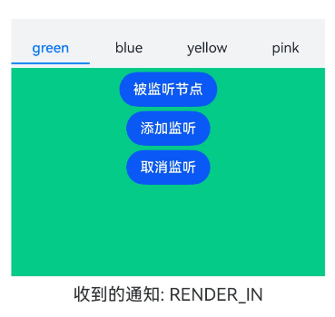
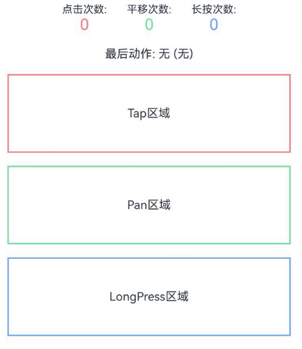

# Class (UIObserver)

<!--Kit: ArkUI-->
<!--Subsystem: ArkUI-->
<!--Owner: @piggyguy; @wangyang2022-->
<!--Designer: @piggyguy; @wangyang2022-->
<!--Tester: @fredyuan912-->
<!--Adviser: @Brilliantry_Rui-->

UIObserver提供UI组件行为变化的无感监听能力。无感监听是指开发者注册回调函数后，无需手动轮询或主动查询组件状态；当目标组件状态变化时，系统会自动触发回调并返回变化信息。UIObserver支持监听Navigation页面状态变化（NavDestination）、滚动事件、路由页面状态、屏幕像素密度变化、绘制与布局完成情况、点击事件、手势触发信息、文本变化及组件内容切换等UI行为，适用于页面生命周期监控、滚动事件处理和渲染性能优化等场景。

> **说明：**
>
> - 本模块首批接口从API version 10开始支持。后续版本的新增接口，采用上角标单独标记接口的起始版本。
>
> - 本Class首批接口从API version 11开始支持。
>
> - 本模块接口仅可在Stage模型下使用。
>
> - 以下API需先使用UIContext中的[getUIObserver()](arkts-apis-uicontext-uicontext.md#getuiobserver11)方法获取到UIObserver对象，再通过该对象调用对应方法。
>
> - UIObserver仅能监听到本进程内的UI组件状态变化信息，不支持获取<!--Del-->[UIExtensionComponent](../../reference/apis-arkui/arkui-ts/ts-container-ui-extension-component-sys.md)等<!--DelEnd-->跨进程场景的信息。

## on('navDestinationUpdate')<sup>11+</sup>

on(type: 'navDestinationUpdate', callback: Callback\<observer.NavDestinationInfo\>): void

监听[NavDestination](arkui-ts/ts-basic-components-navdestination.md)组件的状态变化。监听器通过注册回调函数实现，当NavDestination组件的状态发生变化（如显示、隐藏、销毁等）时，系统会自动调用已注册的回调函数，携带状态变化信息。

**原子化服务API：** 从API version 12开始，该接口支持在原子化服务中使用。

**系统能力：** SystemCapability.ArkUI.ArkUI.Full

**参数：**

| 参数名   | 类型                                                  | 必填 | 说明                                                         |
| -------- | ----------------------------------------------------- | ---- | ------------------------------------------------------------ |
| type     | string                                                | 是   | 监听事件，固定为'navDestinationUpdate'，即[NavDestination](arkui-ts/ts-basic-components-navdestination.md)组件的状态变化。 |
| callback | Callback\<observer.[NavDestinationInfo](js-apis-arkui-observer.md#navdestinationinfo)\> | 是   | 回调函数。返回当前的[NavDestination](arkui-ts/ts-basic-components-navdestination.md)组件状态。                 |

**示例：**

<!--code_no_check-->
```ts
// Index.ets
// 演示uiObserver.on('navDestinationUpdate', callback)
// uiObserver.off('navDestinationUpdate', callback)

@Component
struct PageOne {
  build() {
    NavDestination() {
      Text('pageOne')
    }.title('pageOne')
  }
}

@Entry
@Component
struct Index {
  private stack: NavPathStack = new NavPathStack();

  @Builder
  pageBuilder(name: string) {
    PageOne()
  }

  aboutToAppear() {
    // 添加监听
    this.getUIContext().getUIObserver().on('navDestinationUpdate', (info) => {
      console.info('NavDestination state update', JSON.stringify(info));
    });
  }

  aboutToDisappear() {
    // 取消监听，不选择回调时，取消所有监听的回调
    this.getUIContext().getUIObserver().off('navDestinationUpdate');
  }

  build() {
    Column() {
      Navigation(this.stack) {
        Button('push').onClick(() => {
          // 将PageOne的NavDestination入栈
          this.stack.pushPath({ name: 'pageOne' });
        })
      }
      .title('Navigation')
      .navDestination(this.pageBuilder)
    }
    .width('100%')
    .height('100%')
  }
}
```

## off('navDestinationUpdate')<sup>11+</sup>

off(type: 'navDestinationUpdate', callback?: Callback\<observer.NavDestinationInfo\>): void

取消监听[NavDestination](arkui-ts/ts-basic-components-navdestination.md)组件的状态变化。

**原子化服务API：** 从API version 12开始，该接口支持在原子化服务中使用。

**系统能力：** SystemCapability.ArkUI.ArkUI.Full

**参数：**

| 参数名   | 类型                                                  | 必填 | 说明                                                         |
| -------- | ----------------------------------------------------- | ---- | ------------------------------------------------------------ |
| type     | string                                                | 是   | 监听事件，固定为'navDestinationUpdate'，即[NavDestination](arkui-ts/ts-basic-components-navdestination.md)组件的状态变化。 |
| callback | Callback\<observer.[NavDestinationInfo](js-apis-arkui-observer.md#navdestinationinfo)\> | 否   | 需要取消的监听回调，不传参数时，取消所有[NavDestination](arkui-ts/ts-basic-components-navdestination.md)组件状态变化的监听回调。                 |

**示例：**

参考[on('navDestinationUpdate')](#onnavdestinationupdate11)接口示例。

## on('navDestinationUpdate')<sup>11+</sup>

on(type: 'navDestinationUpdate', options: { navigationId: ResourceStr }, callback: Callback\<observer.NavDestinationInfo\>): void

通过[Navigation](arkui-ts/ts-basic-components-navigation.md)的id监听[NavDestination](arkui-ts/ts-basic-components-navdestination.md)组件的状态变化。

**原子化服务API：** 从API version 12开始，该接口支持在原子化服务中使用。

**系统能力：** SystemCapability.ArkUI.ArkUI.Full

**参数：**

| 参数名   | 类型                                                         | 必填 | 说明                                                         |
| -------- | ------------------------------------------------------------ | ---- | ------------------------------------------------------------ |
| type     | string                                                       | 是   | 监听事件，固定为'navDestinationUpdate'，即[NavDestination](arkui-ts/ts-basic-components-navdestination.md)组件的状态变化。 |
| options  | { navigationId: [ResourceStr](arkui-ts/ts-types.md#resourcestr) } | 是   | 指定监听的[Navigation](arkui-ts/ts-basic-components-navigation.md)的id。                                   |
| callback | Callback\<observer.[NavDestinationInfo](js-apis-arkui-observer.md#navdestinationinfo)\>        | 是   | 回调函数。返回当前的[NavDestination](arkui-ts/ts-basic-components-navdestination.md)组件状态。                 |

**示例：**

<!--code_no_check-->
```ts
// Index.ets
// 演示uiObserver.on('navDestinationUpdate', options, callback)
// uiObserver.off('navDestinationUpdate', options, callback)

@Component
struct PageOne {
  build() {
    NavDestination() {
      Text('pageOne')
    }.title('pageOne')
  }
}

@Entry
@Component
struct Index {
  private stack: NavPathStack = new NavPathStack();

  @Builder
  pageBuilder(name: string) {
    PageOne()
  }

  aboutToAppear() {
    // 添加监听，指定Navigation的id
    this.getUIContext().getUIObserver().on('navDestinationUpdate', { navigationId: 'testId' }, (info) => {
      console.info('NavDestination state update', JSON.stringify(info));
    });
  }

  aboutToDisappear() {
    // 取消监听，不选择回调时，取消所有监听的回调
    this.getUIContext().getUIObserver().off('navDestinationUpdate', { navigationId: 'testId' });
  }

  build() {
    Column() {
      Navigation(this.stack) {
        Button('push').onClick(() => {
          // 将PageOne的NavDestination入栈
          this.stack.pushPath({ name: 'pageOne' });
        })
      }
      .id('testId')
      .title('Navigation')
      .navDestination(this.pageBuilder)
    }
    .width('100%')
    .height('100%')
  }
}
```

## off('navDestinationUpdate')<sup>11+</sup>

off(type: 'navDestinationUpdate', options: { navigationId: ResourceStr }, callback?: Callback\<observer.NavDestinationInfo\>): void

取消通过[Navigation](arkui-ts/ts-basic-components-navigation.md)的id监听[NavDestination](arkui-ts/ts-basic-components-navdestination.md)组件的状态变化。

**原子化服务API：** 从API version 12开始，该接口支持在原子化服务中使用。

**系统能力：** SystemCapability.ArkUI.ArkUI.Full

**参数：**

| 参数名   | 类型                                                         | 必填 | 说明                                                         |
| -------- | ------------------------------------------------------------ | ---- | ------------------------------------------------------------ |
| type     | string                                                       | 是   | 监听事件，固定为'navDestinationUpdate'，即[NavDestination](arkui-ts/ts-basic-components-navdestination.md)组件的状态变化。 |
| options  | { navigationId: [ResourceStr](arkui-ts/ts-types.md#resourcestr) } | 是   | 指定监听的[Navigation](arkui-ts/ts-basic-components-navigation.md)的id。                                   |
| callback | Callback\<observer.[NavDestinationInfo](js-apis-arkui-observer.md#navdestinationinfo)\>        | 否   |需要取消的监听回调。不指定具体的回调函数时，取消该[Navigation](arkui-ts/ts-basic-components-navigation.md)上所有的监听回调。                 |

**示例：**

参考[on('navDestinationUpdate')](#onnavdestinationupdate11-1)接口示例。

## on('navDestinationUpdateByUniqueId')<sup>20+</sup>

on(type: 'navDestinationUpdateByUniqueId', navigationUniqueId: number, callback: Callback\<observer.NavDestinationInfo\>): void

通过[Navigation](arkui-ts/ts-basic-components-navigation.md)的uniqueId监听[NavDestination](arkui-ts/ts-basic-components-navdestination.md)组件的状态变化，uniqueId可通过[queryNavigationInfo](arkui-ts/ts-custom-component-api.md#querynavigationinfo12)获取。

**原子化服务API：** 从API version 20开始，该接口支持在原子化服务中使用。

**系统能力：** SystemCapability.ArkUI.ArkUI.Full

**参数：**

| 参数名   | 类型                                                                 | 必填 | 说明                                                                     |
| -------- | -------------------------------------------------------------------- | ---- | ------------------------------------------------------------------------ |
| type     | string                                                               | 是   | 监听事件，固定为'navDestinationUpdateByUniqueId'，即[NavDestination](arkui-ts/ts-basic-components-navdestination.md)组件的状态变化。 |
| navigationUniqueId  | number | 是   | 指定监听的[Navigation](arkui-ts/ts-basic-components-navigation.md)的uniqueId，可以通过[queryNavigationInfo](arkui-ts/ts-custom-component-api.md#querynavigationinfo12)获取。                                               |
| callback | Callback\<observer.[NavDestinationInfo](js-apis-arkui-observer.md#navdestinationinfo)\>                | 是   | 回调函数。返回当前的[NavDestination](arkui-ts/ts-basic-components-navdestination.md)组件状态。                             |

**示例：**

通过[Navigation](arkui-ts/ts-basic-components-navigation.md)的uniqueId，可以监听[NavDestination](arkui-ts/ts-basic-components-navdestination.md)组件的状态变化。

```ts
// Index.ets
// 演示on('navDestinationUpdateByUniqueId', navigationUniqueId, callback)
// off('navDestinationUpdateByUniqueId', navigationUniqueId, callback)

@Component
struct PageOne {
  private text = '';
  private uniqueId = -1;
  aboutToAppear() {
    // 获取Navigation的uniqueId
    let navigationUniqueId = this.queryNavigationInfo()?.uniqueId;
    if (navigationUniqueId) {
      this.uniqueId = navigationUniqueId.valueOf();
    }
    this.text = JSON.stringify(this.uniqueId);
    // 添加监听，指定Navigation的uniqueId
    this.getUIContext().getUIObserver().on('navDestinationUpdateByUniqueId', this.uniqueId, (info) => {
      console.info('NavDestination state update navigationId', JSON.stringify(info));
    });
  }
  aboutToDisappear() {
    // 取消监听，不选择回调时，取消所有监听的回调
    this.getUIContext().getUIObserver().off('navDestinationUpdateByUniqueId', this.uniqueId);
  }
  build() {
    NavDestination() {
      Text('pageOne')
      Text('navigationUniqueId是：' + this.text)
        .width('80%')
        .height(50)
        .margin(50)
        .fontSize(20)
    }.title('pageOne')
  }
}

@Entry
@Component
struct Index {
  private stack: NavPathStack = new NavPathStack();

  @Builder
  pageBuilder(name: string) {
    PageOne()
  }

  build() {
    Column() {
      Navigation(this.stack) {
        Button('push').onClick(() => {
          // 将PageOne的NavDestination入栈
          this.stack.pushPath({ name: 'pageOne' });
        })
      }
      .id('testId')
      .title('Navigation')
      .navDestination(this.pageBuilder)
    }
    .width('100%')
    .height('100%')
  }
}
```

## off('navDestinationUpdateByUniqueId')<sup>20+</sup>

off(type: 'navDestinationUpdateByUniqueId', navigationUniqueId: number, callback?: Callback\<observer.NavDestinationInfo\>): void

取消通过[Navigation](arkui-ts/ts-basic-components-navigation.md)的uniqueId监听[NavDestination](arkui-ts/ts-basic-components-navdestination.md)组件的状态变化。

**原子化服务API：** 从API version 20开始，该接口支持在原子化服务中使用。

**系统能力：** SystemCapability.ArkUI.ArkUI.Full

**参数：**

| 参数名   | 类型                                                                 | 必填 | 说明                                                                     |
| -------- | -------------------------------------------------------------------- | ---- | ------------------------------------------------------------------------ |
| type     | string                                                               | 是   | 监听事件，固定为'navDestinationUpdateByUniqueId'，即[NavDestination](arkui-ts/ts-basic-components-navdestination.md)组件的状态变化。 |
| navigationUniqueId  | number | 是   | 指定监听的[Navigation](arkui-ts/ts-basic-components-navigation.md)的uniqueId，可以通过[queryNavigationInfo](arkui-ts/ts-custom-component-api.md#querynavigationinfo12)获取。                                               |
| callback | Callback\<observer.[NavDestinationInfo](js-apis-arkui-observer.md#navdestinationinfo)\>                | 否   | 需要取消的监听回调，不传参数时，取消该[Navigation](arkui-ts/ts-basic-components-navigation.md)上所有的监听回调。                             |

**示例：**

参考[on('navDestinationUpdateByUniqueId')](#onnavdestinationupdatebyuniqueid20)接口示例。

## on('scrollEvent')<sup>12+</sup>

on(type: 'scrollEvent', callback: Callback\<observer.ScrollEventInfo\>): void

监听所有滚动组件滚动事件的开始和结束。滚动组件包括[List](./arkui-ts/ts-container-list.md)、[Grid](./arkui-ts/ts-container-grid.md)、[Scroll](./arkui-ts/ts-container-scroll.md)、[WaterFlow](./arkui-ts/ts-container-waterflow.md)、[ArcList](./arkui-ts/ts-container-arclist.md)。

**原子化服务API：** 从API version 12开始，该接口支持在原子化服务中使用。

**系统能力：** SystemCapability.ArkUI.ArkUI.Full

**参数：**

| 参数名   | 类型                                                  | 必填 | 说明                                                         |
| -------- | ----------------------------------------------------- | ---- | ------------------------------------------------------------ |
| type     | string                                                | 是   | 监听事件，固定为'scrollEvent'，即滚动事件的开始和结束。      |
| callback | Callback\<observer.[ScrollEventInfo](js-apis-arkui-observer.md#scrolleventinfo12)\> | 是   | 回调函数。返回滚动事件的信息。   |

**示例：**

```ts
// Index.ets
// 演示uiObserver.on('scrollEvent', callback)
// uiObserver.off('scrollEvent', callback)
// uiObserver.on('scrollEvent', options, callback)
// uiObserver.off('scrollEvent', options, callback)

import { UIObserver } from '@kit.ArkUI';

@Entry
@Component
struct Index {
  scroller: Scroller = new Scroller();
  observer: UIObserver = this.getUIContext().getUIObserver();
  private arr: number[] = [0, 1, 2, 3, 4, 5, 6, 7];

  build() {
    Column() {
      Column() {
        Scroll(this.scroller) {
          Column() {
            ForEach(this.arr, (item: number) => {
              Text(item.toString())
                .width('90%')
                .height(150)
                .backgroundColor(0xFFFFFF)
                .borderRadius(15)
                .fontSize(16)
                .textAlign(TextAlign.Center)
                .margin({ top: 10 })
            }, (item: number) => item.toString())
          }.width('100%')
        }
        .id('testId')
        .height('80%')
      }
      .width('100%')

      Row() {
        Button('UIObserver on')
          .onClick(() => {
            // 添加监听
            this.observer.on('scrollEvent', (info) => {
              console.info('scrollEventInfo', JSON.stringify(info));
            });
          })
        Button('UIObserver off')
          .onClick(() => {
            // 取消监听，不选择回调时，取消所有监听的回调
            this.observer.off('scrollEvent');
          })
      }

      Row() {
        Button('UIObserverWithId on')
          .onClick(() => {
            // 添加监听，指定滚动组件的id
            this.observer.on('scrollEvent', { id: 'testId' }, (info) => {
              console.info('scrollEventInfo', JSON.stringify(info));
            });
          })
        Button('UIObserverWithId off')
          .onClick(() => {
            // 取消监听，不选择回调时，取消所有监听的回调
            this.observer.off('scrollEvent', { id: 'testId' });
          })
      }
    }
    .height('100%')
  }
}
```

## off('scrollEvent')<sup>12+</sup>

off(type: 'scrollEvent', callback?: Callback\<observer.ScrollEventInfo\>): void

取消监听所有滚动组件滚动事件的开始和结束。滚动组件包括[List](./arkui-ts/ts-container-list.md)、[Grid](./arkui-ts/ts-container-grid.md)、[Scroll](./arkui-ts/ts-container-scroll.md)、[WaterFlow](./arkui-ts/ts-container-waterflow.md)、[ArcList](./arkui-ts/ts-container-arclist.md)。

**原子化服务API：** 从API version 12开始，该接口支持在原子化服务中使用。

**系统能力：** SystemCapability.ArkUI.ArkUI.Full

**参数：**

| 参数名   | 类型                                                  | 必填 | 说明                                                         |
| -------- | ----------------------------------------------------- | ---- | ------------------------------------------------------------ |
| type     | string                                                | 是   | 监听事件，固定为'scrollEvent'，即滚动事件的开始和结束。      |
| callback | Callback\<observer.[ScrollEventInfo](js-apis-arkui-observer.md#scrolleventinfo12)\> | 否 | 需要取消的滚动事件监听回调。当只需要取消指定回调时传入该参数；不传参数时，取消所有滚动事件的监听回调。 |

**示例：**

参考[on('scrollEvent')](#onscrollevent12)接口示例。

## on('scrollEvent')<sup>12+</sup>

on(type: 'scrollEvent', options: observer.ObserverOptions, callback: Callback\<observer.ScrollEventInfo\>): void

监听指定id的滚动组件滚动事件的开始和结束。滚动组件包括[List](./arkui-ts/ts-container-list.md)、[Grid](./arkui-ts/ts-container-grid.md)、[Scroll](./arkui-ts/ts-container-scroll.md)、[WaterFlow](./arkui-ts/ts-container-waterflow.md)、[ArcList](./arkui-ts/ts-container-arclist.md)。

**原子化服务API：** 从API version 12开始，该接口支持在原子化服务中使用。

**系统能力：** SystemCapability.ArkUI.ArkUI.Full

**参数：**

| 参数名   | 类型                                                         | 必填 | 说明                                                         |
| -------- | ------------------------------------------------------------ | ---- | ------------------------------------------------------------ |
| type     | string                                                       | 是   | 监听事件，固定为'scrollEvent'，即滚动事件的开始和结束。 |
| options  | observer.[ObserverOptions](js-apis-arkui-observer.md#observeroptions12) | 是   | Observer选项，包含指定监听的滚动组件的id。                    |
| callback | Callback\<observer.[ScrollEventInfo](js-apis-arkui-observer.md#scrolleventinfo12)\>        | 是   | 回调函数。返回滚动事件的信息。                 |

**示例：**

参考[on('scrollEvent')](#onscrollevent12)接口示例。

## off('scrollEvent')<sup>12+</sup>

off(type: 'scrollEvent', options: observer.ObserverOptions, callback?: Callback\<observer.ScrollEventInfo\>): void

取消监听指定id的滚动组件滚动事件的开始和结束。滚动组件包括[List](./arkui-ts/ts-container-list.md)、[Grid](./arkui-ts/ts-container-grid.md)、[Scroll](./arkui-ts/ts-container-scroll.md)、[WaterFlow](./arkui-ts/ts-container-waterflow.md)、[ArcList](./arkui-ts/ts-container-arclist.md)。

**原子化服务API：** 从API version 12开始，该接口支持在原子化服务中使用。

**系统能力：** SystemCapability.ArkUI.ArkUI.Full

**参数：**

| 参数名   | 类型                                                         | 必填 | 说明                                                         |
| -------- | ------------------------------------------------------------ | ---- | ------------------------------------------------------------ |
| type     | string                                                       | 是   | 监听事件，固定为'scrollEvent'，即滚动事件的开始和结束。 |
| options  | observer.[ObserverOptions](js-apis-arkui-observer.md#observeroptions12) | 是   | Observer选项，包含指定监听的滚动组件的id。                    |
| callback | Callback\<observer.[ScrollEventInfo](js-apis-arkui-observer.md#scrolleventinfo12)\> | 否 | 需要取消的滚动事件监听回调。当只需要取消 options 指定滚动组件上的指定回调时传入该参数；不传参数时，取消 options 指定滚动组件上的所有滚动事件监听回调。 |

**示例：**

参考[on('scrollEvent')](#onscrollevent12)接口示例。

## on('routerPageUpdate')<sup>11+</sup>

on(type: 'routerPageUpdate', callback: Callback\<observer.RouterPageInfo\>): void

监听[Router](arkts-apis-uicontext-router.md)中page页面的状态变化。典型使用场景包括页面路由生命周期管理、页面跳转埋点、页面切换状态跟踪等。

**原子化服务API：** 从API version 12开始，该接口支持在原子化服务中使用。

**系统能力：** SystemCapability.ArkUI.ArkUI.Full

**参数：**

| 参数名   | 类型                                                         | 必填 | 说明                                                         |
| -------- | ------------------------------------------------------------ | ---- | ------------------------------------------------------------ |
| type     | string                                                       | 是   | 监听事件，固定为'routerPageUpdate'，即[Router](arkts-apis-uicontext-router.md)中page页面的状态变化。 |
| callback | Callback\<observer.[RouterPageInfo](js-apis-arkui-observer.md#routerpageinfo)\>        | 是   | 回调函数。携带[RouterPageInfo](js-apis-arkui-observer.md#routerpageinfo)对象，返回当前的page页面状态。                 |

**示例：**

<!--code_no_check-->
```ts
// PageOne.ets

@Entry
@Component
struct PageOne {
  build() {
    Column() {
      Text('pageOne')
    }
  }
}
```

<!--code_no_check-->
```ts
// Index.ets
// 演示uiObserver.on('routerPageUpdate', callback)
// uiObserver.off('routerPageUpdate', callback)

@Entry
@Component
struct Index {
  aboutToAppear() {
    // 添加监听
    this.getUIContext().getUIObserver().on('routerPageUpdate', (info) => {
      console.info('router page update', JSON.stringify(info));
    });
  }

  aboutToDisappear() {
    // 取消监听，不选择回调时，取消所有监听的回调
    this.getUIContext().getUIObserver().off('routerPageUpdate');
  }

  build() {
    Column() {
      Button('pushUrl').onClick(() => {
        // router跳转到PageOne.ets页面
        this.getUIContext().getRouter().pushUrl({ url: 'pages/PageOne' });
      })
    }
    .width('100%')
    .height('100%')
  }
}
```

## off('routerPageUpdate')<sup>11+</sup>

off(type: 'routerPageUpdate', callback?: Callback\<observer.RouterPageInfo\>): void

取消监听[Router](arkts-apis-uicontext-router.md)中page页面的状态变化。

**原子化服务API：** 从API version 12开始，该接口支持在原子化服务中使用。

**系统能力：** SystemCapability.ArkUI.ArkUI.Full

**参数：**

| 参数名   | 类型                                                         | 必填 | 说明                                                         |
| -------- | ------------------------------------------------------------ | ---- | ------------------------------------------------------------ |
| type     | string                                                       | 是   | 监听事件，固定为'routerPageUpdate'，即[Router](arkts-apis-uicontext-router.md)中page页面的状态变化。 |
| callback | Callback\<observer.[RouterPageInfo](js-apis-arkui-observer.md#routerpageinfo)\>        | 否   | 需要被注销的回调函数。不传参数时，取消所有[Router](arkts-apis-uicontext-router.md)中page页面状态变化的监听回调。                 |

**示例：**

参考[on('routerPageUpdate')](#onrouterpageupdate11)接口示例。

## on('densityUpdate')<sup>12+</sup>

on(type: 'densityUpdate', callback: Callback\<observer.DensityInfo\>): void

监听屏幕像素密度变化。

**原子化服务API：** 从API version 12开始，该接口支持在原子化服务中使用。

**系统能力：** SystemCapability.ArkUI.ArkUI.Full

**参数：**

| 参数名   | 类型                                                         | 必填 | 说明                                                         |
| -------- | ------------------------------------------------------------ | ---- | ------------------------------------------------------------ |
| type     | string                                                       | 是   | 监听事件，固定为'densityUpdate'，即屏幕像素密度变化。 |
| callback | Callback\<observer.[DensityInfo](./js-apis-arkui-observer.md#densityinfo12)\>        | 是   | 回调函数。携带[DensityInfo](./js-apis-arkui-observer.md#densityinfo12)，返回变化后的屏幕像素密度。                 |

**示例：**

```ts
// Index.ets
// 演示uiObserver.on('densityUpdate', callback)
// uiObserver.off('densityUpdate', callback)

import { uiObserver } from '@kit.ArkUI';

@Entry
@Component
struct Index {
  @State density: number = 0;
  @State message: string = '未注册监听';

  // 定义监听回调函数
  densityUpdateCallback = (info: uiObserver.DensityInfo) => {
    this.density = info.density;
    this.message = '变化后的DPI：' + this.density.toString();
  }

  build() {
    Column() {
      Text(this.message)
        .fontSize(24)
        .fontWeight(FontWeight.Bold)
      Button('注册屏幕像素密度变化监听')
        .margin({ bottom: 10 })
        .onClick(() => {
          this.message = '已注册监听';
          // 添加监听
          this.getUIContext().getUIObserver().on('densityUpdate', this.densityUpdateCallback);
        })
      Button('解除注册屏幕像素密度变化监听')
        .onClick(() => {
          this.message = '未注册监听';
          // 取消监听
          this.getUIContext().getUIObserver().off('densityUpdate', this.densityUpdateCallback);
        })
    }
  }
}
```

## off('densityUpdate')<sup>12+</sup>

off(type: 'densityUpdate', callback?: Callback\<observer.DensityInfo\>): void

取消监听屏幕像素密度的变化。

**原子化服务API：** 从API version 12开始，该接口支持在原子化服务中使用。

**系统能力：** SystemCapability.ArkUI.ArkUI.Full

**参数：**

| 参数名   | 类型                                                                 | 必填 | 说明                                                                                         |
| -------- | -------------------------------------------------------------------- | ---- | -------------------------------------------------------------------------------------------- |
| type     | string                                                               | 是   | 监听事件，固定为'densityUpdate'，即屏幕像素密度变化。                                        |
| callback | Callback\<observer.[DensityInfo](./js-apis-arkui-observer.md#densityinfo12)\> | 否   | 需要被注销的回调函数。若不指定具体的回调函数，则注销该[UIContext](arkts-apis-uicontext-uicontext.md)下所有屏幕像素密度变化事件监听。 |

**示例：**

参考[on('densityUpdate')](#ondensityupdate12)接口示例。

## on('willDraw')<sup>12+</sup>

on(type: 'willDraw', callback: Callback\<void\>): void

监听每一帧绘制指令下发情况。

**原子化服务API：** 从API version 12开始，该接口支持在原子化服务中使用。

**系统能力：** SystemCapability.ArkUI.ArkUI.Full

**参数：**

| 参数名   | 类型                                                         | 必填 | 说明                                                         |
| -------- | ------------------------------------------------------------ | ---- | ------------------------------------------------------------ |
| type     | string                                                       | 是   | 监听事件，固定为'willDraw'，即是否将要绘制。 |
| callback | Callback\<void\>        | 是   | 回调函数，无入参、无返回值；用于在每一帧绘制指令下发时接收通知并执行自定义处理。                 |

**示例：**

```ts
// Index.ets
// 演示uiObserver.on('willDraw', callback)
// uiObserver.off('willDraw', callback)

@Entry
@Component
struct Index {
  // 定义监听回调函数
  willDrawCallback = () => {
    console.info('willDraw指令下发');
  }

  build() {
    Column() {
      Button('注册绘制指令下发监听')
        .margin({ bottom: 10 })
        .onClick(() => {
          // 添加监听
          this.getUIContext().getUIObserver().on('willDraw', this.willDrawCallback);
        })
      Button('解除注册绘制指令下发监听')
        .onClick(() => {
          // 取消监听
          this.getUIContext().getUIObserver().off('willDraw', this.willDrawCallback);
        })
    }
  }
}
```

## off('willDraw')<sup>12+</sup>

off(type: 'willDraw', callback?: Callback\<void\>): void

取消监听每一帧绘制指令下发情况。

**原子化服务API：** 从API version 12开始，该接口支持在原子化服务中使用。

**系统能力：** SystemCapability.ArkUI.ArkUI.Full

**参数：**

| 参数名   | 类型                                                         | 必填 | 说明                                                         |
| -------- | ------------------------------------------------------------ | ---- | ------------------------------------------------------------ |
| type     | string                                                       | 是   | 监听事件，固定为'willDraw'，即是否将要绘制。 |
| callback | Callback\<void\>        | 否   | 需要被注销的回调函数。不传参数时，取消所有绘制指令下发事件的监听回调。                  |

**示例：**

参考[on('willDraw')](#onwilldraw12)接口示例。

## on('didLayout')<sup>12+</sup>

on(type: 'didLayout', callback: Callback\<void\>): void

监听每一帧布局完成情况。

**原子化服务API：** 从API version 12开始，该接口支持在原子化服务中使用。

**系统能力：** SystemCapability.ArkUI.ArkUI.Full

**参数：**

| 参数名   | 类型                                                         | 必填 | 说明                                                         |
| -------- | ------------------------------------------------------------ | ---- | ------------------------------------------------------------ |
| type     | string                                                       | 是   | 监听事件，固定为'didLayout'，即是否布局完成。 |
| callback | Callback\<void\> | 是 | 回调函数，无入参、无返回值；用于在每一帧布局完成时接收通知并执行自定义处理。 |

**示例：**

```ts
// Index.ets
// 演示uiObserver.on('didLayout', callback)
// uiObserver.off('didLayout', callback)

@Entry
@Component
struct Index {
  // 定义监听回调函数
  didLayoutCallback = () => {
    console.info('layout布局完成');
  }

  build() {
    Column() {
      Button('注册布局完成监听')
        .margin({ bottom: 10 })
        .onClick(() => {
          // 添加监听
          this.getUIContext().getUIObserver().on('didLayout', this.didLayoutCallback);
        })
      Button('解除注册布局完成监听')
        .onClick(() => {
          // 取消监听
          this.getUIContext().getUIObserver().off('didLayout', this.didLayoutCallback);
        })
    }
  }
}
```

## off('didLayout')<sup>12+</sup>

off(type: 'didLayout', callback?: Callback\<void\>): void

取消监听每一帧布局完成情况。

**原子化服务API：** 从API version 12开始，该接口支持在原子化服务中使用。

**系统能力：** SystemCapability.ArkUI.ArkUI.Full

**参数：**

| 参数名   | 类型                                                         | 必填 | 说明                                                         |
| -------- | ------------------------------------------------------------ | ---- | ------------------------------------------------------------ |
| type     | string                                                       | 是   | 监听事件，固定为'didLayout'，即是否布局完成。 |
| callback | Callback\<void\>        | 否   | 需要被注销的回调函数。不传参数时，取消所有布局完成的监听回调。                  |


**示例：**

参考[on('didLayout')](#ondidlayout12)接口示例。

## on('navDestinationSwitch')<sup>12+</sup>

on(type: 'navDestinationSwitch', callback: Callback\<observer.NavDestinationSwitchInfo\>): void

监听[Navigation](arkui-ts/ts-basic-components-navigation.md)的页面切换事件。

**原子化服务API：** 从API version 12开始，该接口支持在原子化服务中使用。

**系统能力：** SystemCapability.ArkUI.ArkUI.Full

**参数：**

| 参数名   | 类型                                                         | 必填 | 说明                                                         |
| -------- | ------------------------------------------------------------ | ---- | ------------------------------------------------------------ |
| type     | string                                                       | 是   | 监听事件，固定为'navDestinationSwitch'，即[Navigation](arkui-ts/ts-basic-components-navigation.md)的页面切换事件。 |
| callback | Callback\<observer.[NavDestinationSwitchInfo](js-apis-arkui-observer.md#navdestinationswitchinfo12)\>        | 是   | 回调函数。携带[NavDestinationSwitchInfo](js-apis-arkui-observer.md#navdestinationswitchinfo12)，返回页面切换事件的信息。                 |

**示例：**

```ts
// Index.ets
// 演示UIObserver.on('navDestinationSwitch', callback)
// UIObserver.off('navDestinationSwitch', callback)

import { uiObserver } from '@kit.ArkUI';

@Component
struct PageOne {
  build() {
    NavDestination() {
      Text('pageOne')
    }.title('pageOne')
  }
}

// 定义监听回调函数
const callbackFunc = (info: uiObserver.NavDestinationSwitchInfo) => {
  console.info(`testTag navDestinationSwitch from: ${JSON.stringify(info.from)} to: ${JSON.stringify(info.to)}`);
}

@Entry
@Component
struct Index {
  private stack: NavPathStack = new NavPathStack();

  @Builder
  pageBuilder(name: string) {
    PageOne()
  }

  aboutToAppear() {
    let obs = this.getUIContext().getUIObserver();
    // 添加监听
    obs.on('navDestinationSwitch', callbackFunc);
  }

  aboutToDisappear() {
    let obs = this.getUIContext().getUIObserver();
    // 取消监听
    obs.off('navDestinationSwitch', callbackFunc);
  }

  build() {
    Column() {
      Navigation(this.stack) {
        Button('push').onClick(() => {
          // 将PageOne的NavDestination入栈
          this.stack.pushPath({ name: 'pageOne' });
        })
      }
      .title("Navigation")
      .navDestination(this.pageBuilder)
    }
    .width('100%')
    .height('100%')
  }
}
```

## off('navDestinationSwitch')<sup>12+</sup>

off(type: 'navDestinationSwitch', callback?: Callback\<observer.NavDestinationSwitchInfo\>): void

取消监听[Navigation](arkui-ts/ts-basic-components-navigation.md)的页面切换事件。

**原子化服务API：** 从API version 12开始，该接口支持在原子化服务中使用。

**系统能力：** SystemCapability.ArkUI.ArkUI.Full

**参数：**

| 参数名   | 类型                                                         | 必填 | 说明                                                         |
| -------- | ------------------------------------------------------------ | ---- | ------------------------------------------------------------ |
| type     | string                                                       | 是   | 监听事件，固定为'navDestinationSwitch'，即[Navigation](arkui-ts/ts-basic-components-navigation.md)的页面切换事件。 |
| callback | Callback\<observer.[NavDestinationSwitchInfo](js-apis-arkui-observer.md#navdestinationswitchinfo12)\> | 否 | 需要被注销的回调函数。不传参数时，取消所有[Navigation](arkui-ts/ts-basic-components-navigation.md)页面切换事件的监听回调。 |

**示例：**

参考[on('navDestinationSwitch')](#onnavdestinationswitch12)接口示例。

## on('navDestinationSwitch')<sup>12+</sup>

on(type: 'navDestinationSwitch', observerOptions: observer.NavDestinationSwitchObserverOptions, callback: Callback\<observer.NavDestinationSwitchInfo\>): void

通过监听选项监听[Navigation](arkui-ts/ts-basic-components-navigation.md)的页面切换事件。

**原子化服务API：** 从API version 12开始，该接口支持在原子化服务中使用。

**系统能力：** SystemCapability.ArkUI.ArkUI.Full

**参数：**

| 参数名   | 类型                                                         | 必填 | 说明                                                         |
| -------- | ------------------------------------------------------------ | ---- | ------------------------------------------------------------ |
| type     | string                                                       | 是   | 监听事件，固定为'navDestinationSwitch'，即[Navigation](arkui-ts/ts-basic-components-navigation.md)的页面切换事件。 |
| observerOptions | observer.[NavDestinationSwitchObserverOptions](js-apis-arkui-observer.md#navdestinationswitchobserveroptions12)        | 是   | 页面切换监听选项，用于指定需要监听的[Navigation](arkui-ts/ts-basic-components-navigation.md)组件，例如通过navigationId指定Navigation组件的id。   |
| callback | Callback\<observer.[NavDestinationSwitchInfo](js-apis-arkui-observer.md#navdestinationswitchinfo12)\>        | 是   | 回调函数。携带[NavDestinationSwitchInfo](js-apis-arkui-observer.md#navdestinationswitchinfo12)，返回页面切换事件的信息。                 |

**示例：**

```ts
// Index.ets
// 演示UIObserver.on('navDestinationSwitch', observerOptions, callback)
// UIObserver.off('navDestinationSwitch', observerOptions, callback)

import { uiObserver } from '@kit.ArkUI';

@Component
struct PageOne {
  build() {
    NavDestination() {
      Text('pageOne')
    }.title('pageOne')
  }
}

// 定义监听回调函数
function callbackFunc(info: uiObserver.NavDestinationSwitchInfo) {
  console.info(`testTag navDestinationSwitch from: ${JSON.stringify(info.from)} to: ${JSON.stringify(info.to)}`);
}

@Entry
@Component
struct Index {
  private stack: NavPathStack = new NavPathStack();

  @Builder
  pageBuilder(name: string) {
    PageOne()
  }

  aboutToAppear() {
    let obs = this.getUIContext().getUIObserver();
    // 添加监听，指定Navigation的id
    obs.on('navDestinationSwitch', { navigationId: 'myNavId' }, callbackFunc);
  }

  aboutToDisappear() {
    let obs = this.getUIContext().getUIObserver();
    // 取消监听
    obs.off('navDestinationSwitch', { navigationId: 'myNavId' }, callbackFunc);
  }

  build() {
    Column() {
      Navigation(this.stack) {
        Button('push').onClick(() => {
          // 将PageOne的NavDestination入栈
          this.stack.pushPath({ name: 'pageOne' });
        })
      }
      .id("myNavId")
      .title("Navigation")
      .navDestination(this.pageBuilder)
    }
    .width('100%')
    .height('100%')
  }
}
```

## off('navDestinationSwitch')<sup>12+</sup>

off(type: 'navDestinationSwitch', observerOptions: observer.NavDestinationSwitchObserverOptions, callback?: Callback\<observer.NavDestinationSwitchInfo\>): void

取消通过监听选项监听[Navigation](arkui-ts/ts-basic-components-navigation.md)的页面切换事件。

**原子化服务API：** 从API version 12开始，该接口支持在原子化服务中使用。

**系统能力：** SystemCapability.ArkUI.ArkUI.Full

**参数：**

| 参数名   | 类型                                                         | 必填 | 说明                                                         |
| -------- | ------------------------------------------------------------ | ---- | ------------------------------------------------------------ |
| type     | string                                                       | 是   | 监听事件，固定为'navDestinationSwitch'，即[Navigation](arkui-ts/ts-basic-components-navigation.md)的页面切换事件。 |
| observerOptions | observer.[NavDestinationSwitchObserverOptions](js-apis-arkui-observer.md#navdestinationswitchobserveroptions12) | 是 | 页面切换监听选项，用于指定需要取消监听的[Navigation](arkui-ts/ts-basic-components-navigation.md)组件，例如通过navigationId指定Navigation组件的id。 |
| callback | Callback\<observer.[NavDestinationSwitchInfo](js-apis-arkui-observer.md#navdestinationswitchinfo12)\>        | 否   | 需要被注销的回调函数。不传参数时，取消该[Navigation](arkui-ts/ts-basic-components-navigation.md)上所有的监听回调。                 |

**示例：**

参考[on('navDestinationSwitch')](#onnavdestinationswitch12-1)接口示例。

## on('willClick')<sup>12+</sup>

on(type: 'willClick', callback: GestureEventListenerCallback): void

监听点击事件指令下发情况，所注册回调将于点击事件触发前触发。回调类型为[GestureEventListenerCallback](arkts-apis-uicontext-t.md#gestureeventlistenercallback)。从API version 20开始支持屏幕朗读触控模式。

**原子化服务API：** 从API version 12开始，该接口支持在原子化服务中使用。

**系统能力：** SystemCapability.ArkUI.ArkUI.Full

**参数：**

| 参数名   | 类型                                                         | 必填 | 说明                                                         |
| -------- | ------------------------------------------------------------ | ---- | ------------------------------------------------------------ |
| type     | string                                                       | 是   | 监听事件，固定为'willClick'，用于监听点击事件指令下发情况，所注册回调将于点击事件触发前触发。 |
| callback | [GestureEventListenerCallback](arkts-apis-uicontext-t.md#gestureeventlistenercallback) | 是   | 回调函数。可以获得点击事件的[GestureEvent](arkui-ts/ts-gesture-common.md#gestureevent对象说明)和组件的[FrameNode](js-apis-arkui-frameNode.md)。  |

**示例：**

```ts
// Index.ets
// 演示uiObserver.on('willClick', callback)
// uiObserver.off('willClick', callback)
// uiObserver.on('didClick', callback)
// uiObserver.off('didClick', callback)

// 定义监听回调函数
const willClickGestureCallback = (event: GestureEvent, node?: FrameNode) => {
  console.info('Example willClickCallback GestureEvent is called');
}

const willClickCallback = (event: ClickEvent, node?: FrameNode) => {
  console.info('Example willClickCallback ClickEvent is called');
}

const didClickGestureCallback = (event: GestureEvent, node?: FrameNode) => {
  console.info('Example didClickCallback GestureEvent is called');
}

const didClickCallback = (event: ClickEvent, node?: FrameNode) => {
  console.info('Example didClickCallback ClickEvent is called');
}

@Entry
@Component
struct ClickExample {
  @State clickCount: number = 0;
  @State tapGestureCount: number = 0;

  aboutToAppear(): void {
    // 添加监听
    let observer = this.getUIContext().getUIObserver();
    observer.on('willClick', willClickGestureCallback);
    observer.on('willClick', willClickCallback);
    observer.on('didClick', didClickGestureCallback);
    observer.on('didClick', didClickCallback);
  }

  aboutToDisappear(): void {
    // 取消监听
    let observer = this.getUIContext().getUIObserver();
    observer.off('willClick', willClickGestureCallback);
    observer.off('willClick', willClickCallback);
    // 如果不选择回调，则会取消所有监听的回调
    observer.off('didClick');
  }

  build() {
    Column() {
      /**
       * onClick和TapGesture在后端的处理是一致的
       * 所以无论是触发onClick还是触发TapGesture
       * on('willClick')两种类型入参的回调（GestureEvent和ClickEvent）都会被触发
       * 同理，on('didClick')的两种回调也会被触发
       */
      Column() {
        Text('Click Count: ' + this.clickCount)
      }
      .height(200)
      .width(300)
      .padding(20)
      .border({ width: 3 })
      .margin(50)
      .onClick((event: ClickEvent) => {
        this.clickCount++;
        console.info('Example Click event is called');
      })

      Column() {
        Text('TapGesture Count: ' + this.tapGestureCount)
      }
      .height(200)
      .width(300)
      .padding(20)
      .border({ width: 3 })
      .margin(50)
      .gesture(TapGesture({ count: 2 }).onAction((event: TapGestureEvent) => {
        this.tapGestureCount++;
        console.info('Example Click event is called');
      }))
    }
  }
}
```

## off('willClick')<sup>12+</sup>

off(type: 'willClick', callback?: GestureEventListenerCallback): void

取消监听[on('willClick')](#onwillclick12)中的点击事件指令下发情况。从API version 20开始，支持屏幕朗读触控模式。

**原子化服务API：** 从API version 12开始，该接口支持在原子化服务中使用。

**系统能力：** SystemCapability.ArkUI.ArkUI.Full

**参数：**

| 参数名   | 类型                                                         | 必填 | 说明                                                  |
| -------- | ------------------------------------------------------------ | ---- | ----------------------------------------------------- |
| type     | string                                                       | 是   | 监听事件，固定为'willClick'，即点击事件指令下发情况。 |
| callback | [GestureEventListenerCallback](arkts-apis-uicontext-t.md#gestureeventlistenercallback) | 否   | 需要被注销的回调函数。不传参数时，取消所有的点击事件指令下发监听回调。                                |

**示例：**

参考[on('willClick')](#onwillclick12)接口示例。

## on('didClick')<sup>12+</sup>

on(type: 'didClick', callback: GestureEventListenerCallback): void

监听点击事件指令下发情况，所注册回调将于点击事件触发后触发。回调类型为[GestureEventListenerCallback](arkts-apis-uicontext-t.md#gestureeventlistenercallback)。从API version 20开始支持屏幕朗读触控模式。

**原子化服务API：** 从API version 12开始，该接口支持在原子化服务中使用。

**系统能力：** SystemCapability.ArkUI.ArkUI.Full

**参数：**

| 参数名   | 类型                                                         | 必填 | 说明                                                         |
| -------- | ------------------------------------------------------------ | ---- | ------------------------------------------------------------ |
| type     | string                                                       | 是   | 监听事件，固定为'didClick'，用于监听点击事件指令下发情况，所注册回调将于点击事件触发后触发。 |
| callback | [GestureEventListenerCallback](arkts-apis-uicontext-t.md#gestureeventlistenercallback) | 是   | 回调函数。可以获得点击事件的[GestureEvent](arkui-ts/ts-gesture-common.md#gestureevent对象说明)和组件的[FrameNode](js-apis-arkui-frameNode.md)。  |

**示例：**

参考[on('willClick')](#onwillclick12)接口示例。

## off('didClick')<sup>12+</sup>

off(type: 'didClick', callback?: GestureEventListenerCallback): void

取消监听[on('didClick')](#ondidclick12)中的点击事件指令下发情况。从API version 20开始，支持屏幕朗读触控模式。

**原子化服务API：** 从API version 12开始，该接口支持在原子化服务中使用。

**系统能力：** SystemCapability.ArkUI.ArkUI.Full

**参数：**

| 参数名   | 类型                                                         | 必填 | 说明                                                 |
| -------- | ------------------------------------------------------------ | ---- | ---------------------------------------------------- |
| type     | string                                                       | 是   | 监听事件，固定为'didClick'，即点击事件指令下发情况。 |
| callback | [GestureEventListenerCallback](arkts-apis-uicontext-t.md#gestureeventlistenercallback) | 否   | 需要被注销的回调函数。不传参数时，取消所有的点击事件指令下发监听回调。                               |

**示例：**

参考[on('willClick')](#onwillclick12)接口示例。

## on('willClick')<sup>12+</sup>

on(type: 'willClick', callback: ClickEventListenerCallback): void

监听点击事件指令下发情况，所注册回调将于点击事件触发前触发。回调类型为[ClickEventListenerCallback](arkts-apis-uicontext-t.md#clickeventlistenercallback)。从API version 20开始支持屏幕朗读触控模式。

**原子化服务API：** 从API version 12开始，该接口支持在原子化服务中使用。

**系统能力：** SystemCapability.ArkUI.ArkUI.Full

**参数：**

| 参数名   | 类型                                                        | 必填 | 说明                                                         |
| -------- | ----------------------------------------------------------- | ---- | ------------------------------------------------------------ |
| type     | string                                                      | 是   | 监听事件，固定为'willClick'，用于监听点击事件指令下发情况，所注册回调将于点击事件触发前触发。 |
| callback | [ClickEventListenerCallback](arkts-apis-uicontext-t.md#clickeventlistenercallback) | 是   | 回调函数。可以获得点击事件的[ClickEvent](arkui-ts/ts-universal-events-click.md#clickevent)和组件的[FrameNode](js-apis-arkui-frameNode.md)。    |

**示例：**

参考[on('willClick')](#onwillclick12)接口示例。

## off('willClick')<sup>12+</sup>

off(type: 'willClick', callback?: ClickEventListenerCallback): void

取消监听[on('willClick')](#onwillclick12-1)中的点击事件指令下发情况。从API version 20开始，支持屏幕朗读触控模式。

**原子化服务API：** 从API version 12开始，该接口支持在原子化服务中使用。

**系统能力：** SystemCapability.ArkUI.ArkUI.Full

**参数：**

| 参数名   | 类型                                                        | 必填 | 说明                                                  |
| -------- | ----------------------------------------------------------- | ---- | ----------------------------------------------------- |
| type     | string                                                      | 是   | 监听事件，固定为'willClick'，即点击事件指令下发情况。 |
| callback | [ClickEventListenerCallback](arkts-apis-uicontext-t.md#clickeventlistenercallback) | 否   | 需要被注销的回调函数。不传参数时，取消所有的点击事件指令下发监听回调。                                |

**示例：**

参考[on('willClick')](#onwillclick12)接口示例。

## on('didClick')<sup>12+</sup>

on(type: 'didClick', callback: ClickEventListenerCallback): void

监听点击事件指令下发情况，所注册回调将于点击事件触发后触发。回调类型为[ClickEventListenerCallback](arkts-apis-uicontext-t.md#clickeventlistenercallback)。从API version 20开始支持屏幕朗读触控模式。

**原子化服务API：** 从API version 12开始，该接口支持在原子化服务中使用。

**系统能力：** SystemCapability.ArkUI.ArkUI.Full

**参数：**

| 参数名   | 类型                                                        | 必填 | 说明                                                         |
| -------- | ----------------------------------------------------------- | ---- | ------------------------------------------------------------ |
| type     | string                                                      | 是   | 监听事件，固定为'didClick'，用于监听点击事件指令下发情况，所注册回调将于点击事件触发后触发。 |
| callback | [ClickEventListenerCallback](arkts-apis-uicontext-t.md#clickeventlistenercallback) | 是   | 回调函数。可以获得点击事件的[ClickEvent](arkui-ts/ts-universal-events-click.md#clickevent)和组件的[FrameNode](js-apis-arkui-frameNode.md)。    |

**示例：**

参考[on('willClick')](#onwillclick12)接口示例。

## off('didClick')<sup>12+</sup>

off(type: 'didClick', callback?: ClickEventListenerCallback): void

取消监听[on('didClick')](#ondidclick12-1)中的点击事件指令下发情况。从API version 20开始，支持屏幕朗读触控模式。

**原子化服务API：** 从API version 12开始，该接口支持在原子化服务中使用。

**系统能力：** SystemCapability.ArkUI.ArkUI.Full

**参数：**

| 参数名   | 类型                                                        | 必填 | 说明                                                 |
| -------- | ----------------------------------------------------------- | ---- | ---------------------------------------------------- |
| type     | string                                                      | 是   | 监听事件，固定为'didClick'，即点击事件指令下发情况。 |
| callback | [ClickEventListenerCallback](arkts-apis-uicontext-t.md#clickeventlistenercallback) | 否   | 需要被注销的回调函数。不传参数时，取消所有的点击事件指令下发监听回调。                               |

**示例：**

参考[on('willClick')](#onwillclick12)接口示例。

## on('tabContentUpdate')<sup>12+</sup>

on(type: 'tabContentUpdate', callback: Callback\<observer.TabContentInfo\>): void

监听[TabContent](arkui-ts/ts-container-tabcontent.md)页面的切换事件。相比[on('tabChange')](#ontabchange22)，本接口不支持监听Tabs组件初始化时，显示首个页签的事件。

**原子化服务API：** 从API version 12开始，该接口支持在原子化服务中使用。

**系统能力：** SystemCapability.ArkUI.ArkUI.Full

**参数：**

| 参数名   | 类型                                                         | 必填 | 说明                                                         |
| -------- | ------------------------------------------------------------ | ---- | ------------------------------------------------------------ |
| type     | string                                                       | 是   | 监听事件，固定为'tabContentUpdate'，即[TabContent](arkui-ts/ts-container-tabcontent.md)页面的切换事件。 |
| callback | Callback\<observer.[TabContentInfo](js-apis-arkui-observer.md#tabcontentinfo12)\> | 是   | 回调函数。携带[TabContentInfo](js-apis-arkui-observer.md#tabcontentinfo12)，返回[TabContent](arkui-ts/ts-container-tabcontent.md)页面切换事件的信息。 |

**示例：**

```ts
// Index.ets
// 演示uiObserver.on('tabContentUpdate', callback)
// uiObserver.off('tabContentUpdate', callback)

import { uiObserver } from '@kit.ArkUI';

// 定义监听回调函数
const callbackFunc = (info: uiObserver.TabContentInfo) => {
  console.info('tabContentUpdate', JSON.stringify(info));
}

@Entry
@Component
struct TabsExample {

  aboutToAppear(): void {
    let observer = this.getUIContext().getUIObserver();
    // 添加监听
    observer.on('tabContentUpdate', callbackFunc);
  }

  aboutToDisappear(): void {
    let observer = this.getUIContext().getUIObserver();
    // 取消监听
    observer.off('tabContentUpdate', callbackFunc);
  }

  build() {
    Column() {
      Tabs() {
        TabContent() {
          Column().width('100%').height('100%').backgroundColor('#00CB87')
        }.tabBar('green').id('tabContentId0')

        TabContent() {
          Column().width('100%').height('100%').backgroundColor('#007DFF')
        }.tabBar('blue').id('tabContentId1')

        TabContent() {
          Column().width('100%').height('100%').backgroundColor('#FFBF00')
        }.tabBar('yellow').id('tabContentId2')

        TabContent() {
          Column().width('100%').height('100%').backgroundColor('#E67C92')
        }.tabBar('pink').id('tabContentId3')
      }
      .width(360)
      .height(296)
      .backgroundColor('#F1F3F5')
      .id('tabsId')
    }.width('100%')
  }
}
```

## off('tabContentUpdate')<sup>12+</sup>

off(type: 'tabContentUpdate', callback?: Callback\<observer.TabContentInfo\>): void

取消监听[TabContent](arkui-ts/ts-container-tabcontent.md)页面的切换事件。

**原子化服务API：** 从API version 12开始，该接口支持在原子化服务中使用。

**系统能力：** SystemCapability.ArkUI.ArkUI.Full

**参数：**

| 参数名   | 类型                                                         | 必填 | 说明                                                         |
| -------- | ------------------------------------------------------------ | ---- | ------------------------------------------------------------ |
| type     | string                                                       | 是   | 监听事件，固定为'tabContentUpdate'，即[TabContent](arkui-ts/ts-container-tabcontent.md)页面的切换事件。 |
| callback | Callback\<observer.[TabContentInfo](js-apis-arkui-observer.md#tabcontentinfo12)\> | 否   | 需要被注销的回调函数。不传参数时，取消该[Tabs](arkui-ts/ts-container-tabs.md)上所有的监听回调。 |

**示例：**

参考[on('tabContentUpdate')](#ontabcontentupdate12)接口示例。

## on('tabContentUpdate')<sup>12+</sup>

on(type: 'tabContentUpdate', options: observer.ObserverOptions, callback: Callback\<observer.TabContentInfo\>): void

通过[Tabs](arkui-ts/ts-container-tabs.md)组件的id监听[TabContent](arkui-ts/ts-container-tabcontent.md)页面的切换事件。相比[on('tabChange')](#ontabchange22-1)，本接口不支持监听Tabs组件初始化时，显示首个页签的事件。

**原子化服务API：** 从API version 12开始，该接口支持在原子化服务中使用。

**系统能力：** SystemCapability.ArkUI.ArkUI.Full

**参数：**

| 参数名   | 类型                                                         | 必填 | 说明                                                         |
| -------- | ------------------------------------------------------------ | ---- | ------------------------------------------------------------ |
| type     | string                                                       | 是   | 监听事件，固定为'tabContentUpdate'，即[TabContent](arkui-ts/ts-container-tabcontent.md)页面的切换事件。 |
| options  | observer.[ObserverOptions](js-apis-arkui-observer.md#observeroptions12) | 是   | 指定监听的[Tabs](arkui-ts/ts-container-tabs.md)组件的id。 |
| callback | Callback\<observer.[TabContentInfo](js-apis-arkui-observer.md#tabcontentinfo12)\> | 是   | 回调函数。携带TabContentInfo，返回[TabContent](arkui-ts/ts-container-tabcontent.md)页面切换事件的信息。 |

**示例：**

```ts
// Index.ets
// 演示uiObserver.on('tabContentUpdate', options, callback)
// uiObserver.off('tabContentUpdate', options, callback)

import { uiObserver } from '@kit.ArkUI';

// 定义监听回调函数
function callbackFunc(info: uiObserver.TabContentInfo) {
  console.info('tabContentUpdate', JSON.stringify(info));
}

@Entry
@Component
struct TabsExample {

  aboutToAppear(): void {
    let observer = this.getUIContext().getUIObserver();
    // 添加监听，指定Tabs的id
    observer.on('tabContentUpdate', { id: 'tabsId' }, callbackFunc);
  }

  aboutToDisappear(): void {
    let observer = this.getUIContext().getUIObserver();
    // 取消监听
    observer.off('tabContentUpdate', { id: 'tabsId' }, callbackFunc);
  }

  build() {
    Column() {
      Tabs() {
        TabContent() {
          Column().width('100%').height('100%').backgroundColor('#00CB87')
        }.tabBar('green').id('tabContentId0')

        TabContent() {
          Column().width('100%').height('100%').backgroundColor('#007DFF')
        }.tabBar('blue').id('tabContentId1')

        TabContent() {
          Column().width('100%').height('100%').backgroundColor('#FFBF00')
        }.tabBar('yellow').id('tabContentId2')

        TabContent() {
          Column().width('100%').height('100%').backgroundColor('#E67C92')
        }.tabBar('pink').id('tabContentId3')
      }
      .width(360)
      .height(296)
      .backgroundColor('#F1F3F5')
      .id('tabsId')
    }.width('100%')
  }
}
```

## off('tabContentUpdate')<sup>12+</sup>

off(type: 'tabContentUpdate', options: observer.ObserverOptions, callback?: Callback\<observer.TabContentInfo\>): void

取消通过[Tabs](arkui-ts/ts-container-tabs.md)组件的id监听[TabContent](arkui-ts/ts-container-tabcontent.md)页面的切换事件。

**原子化服务API：** 从API version 12开始，该接口支持在原子化服务中使用。

**系统能力：** SystemCapability.ArkUI.ArkUI.Full

**参数：**

| 参数名   | 类型                                                         | 必填 | 说明                                                         |
| -------- | ------------------------------------------------------------ | ---- | ------------------------------------------------------------ |
| type     | string                                                       | 是   | 监听事件，固定为'tabContentUpdate'，即[TabContent](arkui-ts/ts-container-tabcontent.md)页面的切换事件。 |
| options  | observer.[ObserverOptions](js-apis-arkui-observer.md#observeroptions12) | 是   | 指定监听的[Tabs](arkui-ts/ts-container-tabs.md)组件的id。 |
| callback | Callback\<observer.[TabContentInfo](js-apis-arkui-observer.md#tabcontentinfo12)\> | 否   | 需要被注销的回调函数。不传参数时，取消该[Tabs](arkui-ts/ts-container-tabs.md)上所有的监听回调。 |

**示例：**

参考[on('tabContentUpdate')](#ontabcontentupdate12-1)接口示例。

## on('tabChange')<sup>22+</sup>

on(type: 'tabChange', callback: Callback\<observer.TabContentInfo\>): void

监听[Tabs](arkui-ts/ts-container-tabs.md)组件页签的切换事件，支持多个[Tabs](arkui-ts/ts-container-tabs.md)组件的监听。相比[on('tabContentUpdate')](#ontabcontentupdate12)，本接口支持监听Tabs组件初始化时，显示首个页签的事件。

**原子化服务API：** 从API version 22开始，该接口支持在原子化服务中使用。

**系统能力：** SystemCapability.ArkUI.ArkUI.Full

**参数：**

| 参数名   | 类型                                                         | 必填 | 说明                                                         |
| -------- | ------------------------------------------------------------ | ---- | ------------------------------------------------------------ |
| type     | string                                                       | 是   | 监听事件，固定为'tabChange'，即[Tabs](arkui-ts/ts-container-tabs.md)组件页签的切换事件。 |
| callback | Callback\<observer.[TabContentInfo](js-apis-arkui-observer.md#tabcontentinfo12)\>              | 是   | 回调函数。携带[TabContentInfo](js-apis-arkui-observer.md#tabcontentinfo12)，返回[Tabs](arkui-ts/ts-container-tabs.md)组件页签的切换事件的信息。 |

**示例：**

```ts
// Index.ets
// 演示监听Tabs组件页签的切换事件。
// 此用例同时监听id为'tabsId1'、'tabsId2'的两个Tabs组件。
// 两个Tabs组件初始化时，会监听到第0页页签的显示事件，页签对应id分别为'tabContentId0'、'tabContentId5'。
// 在id为'tabsId1'的Tabs组件上滑动一下，会监听到第0页的页签隐藏、id为'tabContentId1'的第1页页签显示事件。
import { uiObserver } from '@kit.ArkUI';

// 定义监听回调函数
function callbackFunc(info: uiObserver.TabContentInfo) {
  console.info('tabChange', JSON.stringify(info));
}

@Entry
@Component
struct TabsExample {

  aboutToAppear(): void {
    let observer = this.getUIContext().getUIObserver();
    // 添加监听
    observer.on('tabChange', callbackFunc);
  }

  aboutToDisappear(): void {
    let observer = this.getUIContext().getUIObserver();
    // 取消监听
    observer.off('tabChange', callbackFunc);
  }

  build() {
    Column() {
      Tabs() {
        TabContent() {
          Column().width('100%').height('100%').backgroundColor('#00CB87')
        }.tabBar('green').id('tabContentId0')

        TabContent() {
          Column().width('100%').height('100%').backgroundColor('#007DFF')
        }.tabBar('blue').id('tabContentId1')

        TabContent() {
          Column().width('100%').height('100%').backgroundColor('#FFBF00')
        }.tabBar('yellow').id('tabContentId2')

        TabContent() {
          Column().width('100%').height('100%').backgroundColor('#E67C92')
        }.tabBar('pink').id('tabContentId3')
      }
      .width(360)
      .height(296)
      .backgroundColor('#F1F3F5')
      .id('tabsId1')

      Tabs() {
        TabContent() {
          Column().width('100%').height('100%').backgroundColor('#00CB87')
        }.tabBar('green').id('tabContentId5')

        TabContent() {
          Column().width('100%').height('100%').backgroundColor('#007DFF')
        }.tabBar('blue').id('tabContentId6')

        TabContent() {
          Column().width('100%').height('100%').backgroundColor('#FFBF00')
        }.tabBar('yellow').id('tabContentId7')

        TabContent() {
          Column().width('100%').height('100%').backgroundColor('#E67C92')
        }.tabBar('pink').id('tabContentId8')
      }
      .width(360)
      .height(296)
      .backgroundColor('#F1F3F5')
      .id('tabsId2')
    }.width('100%')
  }
}
```

## off('tabChange')<sup>22+</sup>

off(type: 'tabChange', callback?: Callback\<observer.TabContentInfo\>): void

取消监听所有的[Tabs](arkui-ts/ts-container-tabs.md)组件页签的切换事件。

**原子化服务API：** 从API version 22开始，该接口支持在原子化服务中使用。

**系统能力：** SystemCapability.ArkUI.ArkUI.Full

**参数：**

| 参数名   | 类型                                                         | 必填 | 说明                                                         |
| -------- | ------------------------------------------------------------ | ---- | ------------------------------------------------------------ |
| type     | string                                                       | 是   | 监听事件，固定为'tabChange'，即[Tabs](arkui-ts/ts-container-tabs.md)组件页签的切换事件。 |
| callback | Callback\<observer.[TabContentInfo](js-apis-arkui-observer.md#tabcontentinfo12)\>              | 否   | 需要被注销的回调函数。若不指定具体的回调函数，则注销所有通过[on('tabChange')](#ontabchange22)接口注册的回调函数。<br>默认值：undefined |

**示例：**

参考[on('tabChange')](#ontabchange22)接口示例。

## on('tabChange')<sup>22+</sup>

on(type: 'tabChange', config: observer.ObserverOptions, callback: Callback\<observer.TabContentInfo\>): void

监听指定[Tabs](arkui-ts/ts-container-tabs.md)组件的页签切换事件。相比[on('tabContentUpdate')](#ontabcontentupdate12-1)，本接口支持监听Tabs组件初始化时，显示首个页签的事件。

**原子化服务API：** 从API version 22开始，该接口支持在原子化服务中使用。

**系统能力：** SystemCapability.ArkUI.ArkUI.Full

**参数：**

| 参数名   | 类型                                                         | 必填 | 说明                                                         |
| -------- | ------------------------------------------------------------ | ---- | ------------------------------------------------------------ |
| type     | string                                                       | 是   | 监听事件，固定为'tabChange'，即[Tabs](arkui-ts/ts-container-tabs.md)组件页签的切换事件。 |
| config  | observer.[ObserverOptions](js-apis-arkui-observer.md#observeroptions12)   | 是   | 指定监听的[Tabs](arkui-ts/ts-container-tabs.md)组件的id。 |
| callback | Callback\<observer.[TabContentInfo](js-apis-arkui-observer.md#tabcontentinfo12)\>    | 是   | 回调函数。携带[TabContentInfo](js-apis-arkui-observer.md#tabcontentinfo12)，返回[Tabs](arkui-ts/ts-container-tabs.md)组件页签的切换事件的信息。 |

**示例：**

```ts
// Index.ets
// 演示监听id为'tabsId'的Tabs组件页签的切换事件。
// Tabs组件页签初始化的时候，会监听到第0页页签的显示事件，页签对应id为'tabContentId0'；滑动一下，会监听到第0页的页签隐藏、id为'tabContentId1'的第1页页签显示事件。
import { uiObserver } from '@kit.ArkUI';

// 定义监听回调函数
function callbackFunc(info: uiObserver.TabContentInfo) {
  console.info('tabChange', JSON.stringify(info));
}

@Entry
@Component
struct TabsExample {

  aboutToAppear(): void {
    let observer = this.getUIContext().getUIObserver();
    // 添加监听，指定Tabs的id
    observer.on('tabChange', { id: 'tabsId' }, callbackFunc);
  }

  aboutToDisappear(): void {
    let observer = this.getUIContext().getUIObserver();
    // 取消监听
    observer.off('tabChange', { id: 'tabsId' }, callbackFunc);
  }

  build() {
    Column() {
      Tabs() {
        TabContent() {
          Column().width('100%').height('100%').backgroundColor('#00CB87')
        }.tabBar('green').id('tabContentId0')

        TabContent() {
          Column().width('100%').height('100%').backgroundColor('#007DFF')
        }.tabBar('blue').id('tabContentId1')

        TabContent() {
          Column().width('100%').height('100%').backgroundColor('#FFBF00')
        }.tabBar('yellow').id('tabContentId2')

        TabContent() {
          Column().width('100%').height('100%').backgroundColor('#E67C92')
        }.tabBar('pink').id('tabContentId3')
      }
      .width(360)
      .height(296)
      .backgroundColor('#F1F3F5')
      .id('tabsId')

      Tabs() {
        TabContent() {
          Column().width('100%').height('100%').backgroundColor('#00CB87')
        }.tabBar('green').id('tabContentId5')

        TabContent() {
          Column().width('100%').height('100%').backgroundColor('#007DFF')
        }.tabBar('blue').id('tabContentId6')

        TabContent() {
          Column().width('100%').height('100%').backgroundColor('#FFBF00')
        }.tabBar('yellow').id('tabContentId7')

        TabContent() {
          Column().width('100%').height('100%').backgroundColor('#E67C92')
        }.tabBar('pink').id('tabContentId8')
      }
      .width(360)
      .height(296)
      .backgroundColor('#F1F3F5')
    }.width('100%')
  }
}
```

## off('tabChange')<sup>22+</sup>

off(type: 'tabChange', config: observer.ObserverOptions, callback?: Callback\<observer.TabContentInfo\>): void

取消监听指定[Tabs](arkui-ts/ts-container-tabs.md)组件页签的切换事件。

**原子化服务API：** 从API version 22开始，该接口支持在原子化服务中使用。

**系统能力：** SystemCapability.ArkUI.ArkUI.Full

**参数：**

| 参数名   | 类型                                                         | 必填 | 说明                                                         |
| -------- | ------------------------------------------------------------ | ---- | ------------------------------------------------------------ |
| type     | string                                                       | 是   | 监听事件，固定为'tabChange'，即[Tabs](arkui-ts/ts-container-tabs.md)组件页签的切换事件。 |
| config  | observer.[ObserverOptions](js-apis-arkui-observer.md#observeroptions12)        | 是   | 指定监听的[Tabs](arkui-ts/ts-container-tabs.md)组件的id。 |
| callback | Callback\<observer.[TabContentInfo](js-apis-arkui-observer.md#tabcontentinfo12)\>              | 否   | 需要被注销的回调函数。若不指定具体的回调函数，则注销config指定的[Tabs](arkui-ts/ts-container-tabs.md)组件下注册的所有的回调函数。<br>默认值：undefined |

**示例：**

参考[on('tabChange')](#ontabchange22-1)接口示例。

## on('textChange')<sup>22+</sup>

on(type: 'textChange', callback: Callback\<observer.TextChangeEventInfo\>): void

全局监听输入框文本变化。

**原子化服务API：** 从API version 22开始，该接口支持在原子化服务中使用。

**系统能力：** SystemCapability.ArkUI.ArkUI.Full

**参数：**

| 参数名   | 类型                                                  | 必填 | 说明                                                                     |
| -------- | ----------------------------------------------------- | ---- | ------------------------------------------------------------------------ |
| type     | string                                                | 是   | 监听事件，固定为'textChange'，表示文本输入的变化。|
| callback | Callback\<observer.[TextChangeEventInfo](js-apis-arkui-observer.md#textchangeeventinfo22)\> | 是   | 回调函数，返回文本变化的信息。|

**示例：**
```ts
import { UIObserver } from '@kit.ArkUI';

@Entry
@Component
struct TextUiObserver {
  observer: UIObserver = this.getUIContext().getUIObserver();
  build() {
    Column() {
      TextArea({ text: 'Hello World TextArea' })
        .width(336)
        .height(56)
        .margin({bottom:5})
        .backgroundColor('#FFFFFF')
        .id('TestId1')
      TextInput({ text: 'Hello World TextInput' })
        .width(336)
        .height(56)
        .margin({bottom:5})
        .backgroundColor('#FFFFFF')
        .id('TestId2')
      Search({ value: 'Hello World Search' })
        .width(336)
        .height(56)
        .margin({bottom:5})
        .backgroundColor('#FFFFFF')
        .id('TestId3')
      Row() {
        // 开启全局监听
        Button('UIObserver on')
          .onClick(() => {
            this.observer.on('textChange', (info) => {
              console.info('textChangeInfo', JSON.stringify(info));
            });
          })
        // 关闭全局监听
        Button('UIObserver off')
          .onClick(() => {
            this.observer.off('textChange');
          })
      }.margin({bottom:5})
      // 开启和关闭指定ID的局部监听
      Row() {
        Button('UIObserver TestId1 on')
          .onClick(() => {
            this.observer.on('textChange', { id: 'TestId1' }, (info) => {
              console.info('textChangeInfo', JSON.stringify(info));
            });
          })

        Button('UIObserver TestId1 off')
          .onClick(() => {
            this.observer.off('textChange', { id: 'TestId1' });
          })
      }.margin({bottom:5})
      Row() {
        Button('UIObserver TestId2 on')
          .onClick(() => {
            this.observer.on('textChange', { id: "TestId2" }, (info) => {
              console.info('textChangeInfo', JSON.stringify(info));
            });
          })

        Button('UIObserver TestId2 off')
          .onClick(() => {
            this.observer.off('textChange', { id: "TestId2" });
          })
      }.margin({bottom:5})
      Row() {
        Button('UIObserver TestId3 on')
          .onClick(() => {
            this.observer.on('textChange', { id: "TestId3" }, (info) => {
              console.info('textChangeInfo', JSON.stringify(info));
            });
          })

        Button('UIObserver TestId3 off')
          .onClick(() => {
            this.observer.off('textChange', { id: "TestId3" });
          })
      }.margin({bottom:5})
    }.width('100%').height('100%').backgroundColor('#F1F3F5')
  }
}
```
## off('textChange')<sup>22+</sup>

off(type: 'textChange', callback?: Callback\<observer.TextChangeEventInfo\>): void

取消输入框文本变化的全局监听。

**原子化服务API：** 从API version 22开始，该接口支持在原子化服务中使用。

**系统能力：** SystemCapability.ArkUI.ArkUI.Full

**参数：**

| 参数名   | 类型                                                  | 必填 | 说明                                                                     |
| -------- | ----------------------------------------------------- | ---- | ------------------------------------------------------------------------ |
| type     | string                                                | 是   | 监听事件，固定为'textChange'，表示文本输入的变化。|
| callback | Callback\<observer.[TextChangeEventInfo](js-apis-arkui-observer.md#textchangeeventinfo22)\> | 否   | 需要被注销的回调函数。不传参数时，取消输入框文本变化的所有全局监听。|

**示例：**

参考[on('textChange')](#ontextchange22)示例。

## on('textChange')<sup>22+</sup>

on(type: 'textChange', identity: observer.ObserverOptions, callback: Callback\<observer.TextChangeEventInfo\>): void

指定id的输入框文本变化的局部监听。

**原子化服务API：** 从API version 22开始，该接口支持在原子化服务中使用。

**系统能力：** SystemCapability.ArkUI.ArkUI.Full

**参数：**

| 参数名   | 类型                                                  | 必填 | 说明                                                                     |
| -------- | ----------------------------------------------------- | ---- | ------------------------------------------------------------------------ |
| type     | string                                                | 是   | 监听事件，固定为'textChange'，表示文本输入的变化。 |
| identity | observer.[ObserverOptions](js-apis-arkui-observer.md#observeroptions12) | 是   | 指定监听的文本输入组件的id。                             |
| callback | Callback\<observer.[TextChangeEventInfo](js-apis-arkui-observer.md#textchangeeventinfo22)\> | 是   | 回调函数。返回文本变化的信息。|

**示例：**

参考[on('textChange')](#ontextchange22)示例。

## off('textChange')<sup>22+</sup>

off(type: 'textChange', identity: observer.ObserverOptions, callback?: Callback\<observer.TextChangeEventInfo\>): void

取消指定ID对应输入框文本变化的局部监听。

**原子化服务API：** 从API version 22开始，该接口支持在原子化服务中使用。

**系统能力：** SystemCapability.ArkUI.ArkUI.Full

**参数：**

| 参数名   | 类型                                                  | 必填 | 说明                                                                     |
| -------- | ----------------------------------------------------- | ---- | ------------------------------------------------------------------------ |
| type     | string                                                | 是   | 监听事件，固定为'textChange'，表示文本输入的变化。|
| identity | observer.[ObserverOptions](js-apis-arkui-observer.md#observeroptions12) | 是   | 指定监听的文本输入组件的id。|
| callback | Callback\<observer.[TextChangeEventInfo](js-apis-arkui-observer.md#textchangeeventinfo22)\> | 否   | 需要被注销的回调函数。不传参数时，取消指定ID输入框文本变化的所有局部监听。|

**示例：**

参考[on('textChange')](#ontextchange22)示例。

## on('beforePanStart')<sup>19+</sup>

on(type: 'beforePanStart', callback: PanListenerCallback): void

监听Pan手势[onActionStart](arkui-ts/ts-basic-gestures-pangesture.md#onactionstart)事件，在[onActionStart](arkui-ts/ts-basic-gestures-pangesture.md#onactionstart)事件执行之前执行callback回调。支持手指滑动、鼠标滑动、鼠标滚轮和触摸板拖动，暂不支持屏幕朗读触控模式。

**原子化服务API：** 从API version 19开始，该接口支持在原子化服务中使用。

**系统能力：** SystemCapability.ArkUI.ArkUI.Full

**参数：**

| 参数名   | 类型                                                        | 必填 | 说明                                                         |
| -------- | ----------------------------------------------------------- | ---- | ------------------------------------------------------------ |
| type     | string                                                      | 是   | 监听事件，固定为'beforePanStart'，用于监听Pan手势[onActionStart](arkui-ts/ts-basic-gestures-pangesture.md#onactionstart)事件执行前的指令下发情况，所注册回调将于Pan手势[onActionStart](arkui-ts/ts-basic-gestures-pangesture.md#onactionstart)事件触发前触发。 |
| callback | [PanListenerCallback](arkts-apis-uicontext-t.md#panlistenercallback19) | 是   | 回调函数。可以获得Pan手势事件的[GestureEvent](arkui-ts/ts-gesture-common.md#gestureevent对象说明)，[GestureRecognizer](arkui-ts/ts-gesture-common.md#gesturerecognizer12)和组件的[FrameNode](js-apis-arkui-frameNode.md)。   |

**示例：**

```ts
// Index.ets
// 演示uiObserver.on('beforePanStart', callback)
// uiObserver.off('beforePanStart', callback)
// uiObserver.on('afterPanStart', callback)
// uiObserver.off('afterPanStart', callback)
// uiObserver.on('beforePanEnd', callback)
// uiObserver.off('beforePanEnd', callback)
// uiObserver.on('afterPanEnd', callback)
// uiObserver.off('afterPanEnd', callback)

// 在页面Component中使用
let TEST_TAG: string = 'node';

// 定义监听回调函数
const callbackFunc = () => {
  console.info('on == beforePanStart');
}

const afterPanCallBack = () => {
  console.info('on == afterPanStart');
}

const beforeEndCallBack = () => {
  console.info('on == beforeEnd');
}

const afterEndCallBack = () => {
  console.info('on == afterEnd');
}

const beforeStartCallBack = () => {
  console.info('on == beforeStartCallBack');
}

const panGestureCallBack = (event: GestureEvent, current: GestureRecognizer, node?: FrameNode) => {
  TEST_TAG = 'panGestureEvent';
  console.info('===' + TEST_TAG + '=== event.repeat is ' + event.repeat);
  console.info('===' + TEST_TAG + '=== event target is ' + event.target.id);
  TEST_TAG = 'panGestureCurrent';
  console.info('===' + TEST_TAG + '=== current.getTag() is ' + current.getTag());
  TEST_TAG = 'panGestureNode';
  console.info('===' + TEST_TAG + '=== node?.getId() is ' + node?.getId());
}


@Entry
@Component
struct PanExample {
  @State offsetX: number = 0;
  @State offsetY: number = 0;
  @State positionX: number = 0;
  @State positionY: number = 0;
  private panOption: PanGestureOptions = new PanGestureOptions({direction: PanDirection.All });

  aboutToAppear(): void {
    let observer = this.getUIContext().getUIObserver();
    // 添加监听
    observer.on('beforePanStart', callbackFunc);
    observer.on('beforePanStart', panGestureCallBack);
    observer.on('beforePanStart', beforeStartCallBack);
    observer.on('afterPanStart', afterPanCallBack);
    observer.on('beforePanEnd', beforeEndCallBack);
    observer.on('afterPanEnd', afterEndCallBack);
  }

  aboutToDisappear(): void {
    let observer = this.getUIContext().getUIObserver();
    // 取消监听
    observer.off('beforePanStart', callbackFunc);
    observer.off('beforePanStart');
    observer.off('afterPanStart', afterPanCallBack);
    observer.off('beforePanEnd');
    observer.off('afterPanEnd');
  }

  build() {
    Column() {
      Column() {
        Text('PanGesture :\nX: ' + this.offsetX + '\n' + 'Y: ' + this.offsetY)
      }
      .height(200)
      .width(300)
      .padding(20)
      .border({ width: 3 })
      .margin(50)
      .translate({ x: this.offsetX, y: this.offsetY, z: 0 })
      .id('columnOuter')
      .gesture(
        PanGesture(this.panOption)
          .onActionStart((event: GestureEvent) => {
            console.info('Pan start');
          })
          .onActionUpdate((event: GestureEvent) => {
            if (event) {
              this.offsetX = this.positionX + event.offsetX;
              this.offsetY = this.positionY + event.offsetY;
            }
          })
          .onActionEnd((event: GestureEvent) => {
            this.positionX = this.offsetX;
            this.positionY = this.offsetY;
            console.info('Pan end');
            }))
          }
  }
}
```

## off('beforePanStart')<sup>19+</sup>

off(type: 'beforePanStart', callback?: PanListenerCallback): void

取消[on('beforePanStart')](#onbeforepanstart19)监听Pan手势[onActionStart](arkui-ts/ts-basic-gestures-pangesture.md#onactionstart)事件执行前的callback回调。支持手指滑动、鼠标滑动、鼠标滚轮和触摸板拖动，暂不支持屏幕朗读触控模式。

**原子化服务API：** 从API version 19开始，该接口支持在原子化服务中使用。

**系统能力：** SystemCapability.ArkUI.ArkUI.Full

**参数：**

| 参数名   | 类型                                                        | 必填 | 说明                                                 |
| -------- | ----------------------------------------------------------- | ---- | ---------------------------------------------------- |
| type     | string                                                      | 是   | 监听事件，固定为'beforePanStart'，即Pan手势[onActionStart](arkui-ts/ts-basic-gestures-pangesture.md#onactionstart)事件执行前的指令下发情况。 |
| callback | [PanListenerCallback](arkts-apis-uicontext-t.md#panlistenercallback19) | 否   | 需要被注销的回调函数。不传参数时，取消所有的Pan手势[onActionStart](arkui-ts/ts-basic-gestures-pangesture.md#onactionstart)事件执行前的指令下发监听回调。                               |

**示例：**

参考[on('beforePanStart')](#onbeforepanstart19)接口示例。

## on('afterPanStart')<sup>19+</sup>

on(type: 'afterPanStart', callback: PanListenerCallback): void

监听Pan手势[onActionStart](arkui-ts/ts-basic-gestures-pangesture.md#onactionstart)事件执行后的指令下发情况，在[onActionStart](arkui-ts/ts-basic-gestures-pangesture.md#onactionstart)事件执行之后执行callback回调。支持手指滑动、鼠标滑动、鼠标滚轮和触摸板拖动，暂不支持屏幕朗读触控模式。

**原子化服务API：** 从API version 19开始，该接口支持在原子化服务中使用。

**系统能力：** SystemCapability.ArkUI.ArkUI.Full

**参数：**

| 参数名   | 类型                                                        | 必填 | 说明                                                         |
| -------- | ----------------------------------------------------------- | ---- | ------------------------------------------------------------ |
| type     | string                                                      | 是   | 监听事件，固定为'afterPanStart'，用于监听Pan手势[onActionStart](arkui-ts/ts-basic-gestures-pangesture.md#onactionstart)事件执行后的指令下发情况，所注册回调将于Pan手势[onActionStart](arkui-ts/ts-basic-gestures-pangesture.md#onactionstart)事件触发后触发。 |
| callback | [PanListenerCallback](arkts-apis-uicontext-t.md#panlistenercallback19) | 是   | 回调函数。可以获得Pan手势事件的[GestureEvent](arkui-ts/ts-gesture-common.md#gestureevent对象说明)，[GestureRecognizer](arkui-ts/ts-gesture-common.md#gesturerecognizer12)和组件的[FrameNode](js-apis-arkui-frameNode.md)。   |

**示例：**

参考[on('beforePanStart')](#onbeforepanstart19)接口示例。

## off('afterPanStart')<sup>19+</sup>

off(type: 'afterPanStart', callback?: PanListenerCallback): void

取消[on('afterPanStart')](#onafterpanstart19)监听Pan手势[onActionStart](arkui-ts/ts-basic-gestures-pangesture.md#onactionstart)事件执行后的callback回调。支持手指滑动、鼠标滑动、鼠标滚轮和触摸板拖动，暂不支持屏幕朗读触控模式。

**原子化服务API：** 从API version 19开始，该接口支持在原子化服务中使用。

**系统能力：** SystemCapability.ArkUI.ArkUI.Full

**参数：**

| 参数名   | 类型                                                        | 必填 | 说明                                                 |
| -------- | ----------------------------------------------------------- | ---- | ---------------------------------------------------- |
| type     | string                                                      | 是   | 监听事件，固定为'afterPanStart'，即Pan手势[onActionStart](arkui-ts/ts-basic-gestures-pangesture.md#onactionstart)事件执行后的指令下发情况。 |
| callback | [PanListenerCallback](arkts-apis-uicontext-t.md#panlistenercallback19) | 否   | 需要被注销的回调函数。不传参数时，取消所有的Pan手势[onActionStart](arkui-ts/ts-basic-gestures-pangesture.md#onactionstart)事件执行后的指令下发监听回调。                               |

**示例：**

参考[on('beforePanStart')](#onbeforepanstart19)接口示例。

## on('beforePanEnd')<sup>19+</sup>

on(type: 'beforePanEnd', callback: PanListenerCallback): void

监听Pan手势[onActionEnd](arkui-ts/ts-basic-gestures-pangesture.md#onactionend)事件执行前的指令下发情况，在[onActionEnd](arkui-ts/ts-basic-gestures-pangesture.md#onactionend)事件执行之前执行callback回调。支持手指滑动、鼠标滑动、鼠标滚轮和触摸板拖动，暂不支持屏幕朗读触控模式。

**原子化服务API：** 从API version 19开始，该接口支持在原子化服务中使用。

**系统能力：** SystemCapability.ArkUI.ArkUI.Full

**参数：**

| 参数名   | 类型                                                        | 必填 | 说明                                                         |
| -------- | ----------------------------------------------------------- | ---- | ------------------------------------------------------------ |
| type     | string                                                      | 是   | 监听事件，固定为'beforePanEnd'，用于监听Pan手势[onActionEnd](arkui-ts/ts-basic-gestures-pangesture.md#onactionend)事件执行前的指令下发情况，所注册回调将于Pan手势[onActionEnd](arkui-ts/ts-basic-gestures-pangesture.md#onactionend)事件触发前触发。 |
| callback | [PanListenerCallback](arkts-apis-uicontext-t.md#panlistenercallback19) | 是   | 回调函数。可以获得Pan手势事件的[GestureEvent](arkui-ts/ts-gesture-common.md#gestureevent对象说明)，[GestureRecognizer](arkui-ts/ts-gesture-common.md#gesturerecognizer12)和组件的[FrameNode](js-apis-arkui-frameNode.md)。   |

**示例：**

参考[on('beforePanStart')](#onbeforepanstart19)接口示例。

## off('beforePanEnd')<sup>19+</sup>

off(type: 'beforePanEnd', callback?: PanListenerCallback): void

取消[on('beforePanEnd')](#onbeforepanend19)监听Pan手势[onActionEnd](arkui-ts/ts-basic-gestures-pangesture.md#onactionend)事件执行前的callback回调。支持手指滑动、鼠标滑动、鼠标滚轮和触摸板拖动，暂不支持屏幕朗读触控模式。

**原子化服务API：** 从API version 19开始，该接口支持在原子化服务中使用。

**系统能力：** SystemCapability.ArkUI.ArkUI.Full

**参数：**

| 参数名   | 类型                                                        | 必填 | 说明                                                 |
| -------- | ----------------------------------------------------------- | ---- | ---------------------------------------------------- |
| type     | string                                                      | 是   | 监听事件，固定为'beforePanEnd'，即Pan手势[onActionEnd](arkui-ts/ts-basic-gestures-pangesture.md#onactionend)事件执行前的指令下发情况。 |
| callback | [PanListenerCallback](arkts-apis-uicontext-t.md#panlistenercallback19) | 否   | 需要被注销的回调函数。不传参数时，取消所有的Pan手势[onActionEnd](arkui-ts/ts-basic-gestures-pangesture.md#onactionend)事件执行前的指令下发监听回调。                               |

**示例：**

参考[on('beforePanStart')](#onbeforepanstart19)接口示例。

## on('afterPanEnd')<sup>19+</sup>

on(type: 'afterPanEnd', callback: PanListenerCallback): void

监听Pan手势[onActionEnd](arkui-ts/ts-basic-gestures-pangesture.md#onactionend)事件执行后的指令下发情况，在[onActionEnd](arkui-ts/ts-basic-gestures-pangesture.md#onactionend)事件执行之后执行callback回调。支持手指滑动、鼠标滑动、鼠标滚轮和触摸板拖动，暂不支持屏幕朗读触控模式。

**原子化服务API：** 从API version 19开始，该接口支持在原子化服务中使用。

**系统能力：** SystemCapability.ArkUI.ArkUI.Full

**参数：**

| 参数名   | 类型                                                        | 必填 | 说明                                                         |
| -------- | ----------------------------------------------------------- | ---- | ------------------------------------------------------------ |
| type     | string                                                      | 是   | 监听事件，固定为'afterPanEnd'，用于监听Pan手势[onActionEnd](arkui-ts/ts-basic-gestures-pangesture.md#onactionend)事件执行后的指令下发情况，所注册回调将于Pan手势[onActionEnd](arkui-ts/ts-basic-gestures-pangesture.md#onactionend)事件触发后触发。 |
| callback | [PanListenerCallback](arkts-apis-uicontext-t.md#panlistenercallback19) | 是   | 回调函数。可以获得Pan手势事件的[GestureEvent](arkui-ts/ts-gesture-common.md#gestureevent对象说明)，[GestureRecognizer](arkui-ts/ts-gesture-common.md#gesturerecognizer12)和组件的[FrameNode](js-apis-arkui-frameNode.md)。   |

**示例：**

参考[on('beforePanStart')](#onbeforepanstart19)接口示例。

## off('afterPanEnd')<sup>19+</sup>

off(type: 'afterPanEnd', callback?: PanListenerCallback): void

取消[on('afterPanEnd')](#onafterpanend19)监听Pan手势[onActionEnd](arkui-ts/ts-basic-gestures-pangesture.md#onactionend)事件执行后的callback回调。支持手指滑动、鼠标滑动、鼠标滚轮和触摸板拖动，暂不支持屏幕朗读触控模式。

**原子化服务API：** 从API version 19开始，该接口支持在原子化服务中使用。

**系统能力：** SystemCapability.ArkUI.ArkUI.Full

**参数：**

| 参数名   | 类型                                                        | 必填 | 说明                                                 |
| -------- | ----------------------------------------------------------- | ---- | ---------------------------------------------------- |
| type     | string                                                      | 是   | 监听事件，固定为'afterPanEnd'，即Pan手势[onActionEnd](arkui-ts/ts-basic-gestures-pangesture.md#onactionend)事件执行后的指令下发情况。 |
| callback | [PanListenerCallback](arkts-apis-uicontext-t.md#panlistenercallback19) | 否   | 需要被注销的回调函数。不传参数时，取消所有的Pan手势[onActionEnd](arkui-ts/ts-basic-gestures-pangesture.md#onactionend)事件执行后的指令下发监听回调。                               |

**示例：**

参考[on('beforePanStart')](#onbeforepanstart19)接口示例。

## on('nodeRenderState')<sup>20+</sup>

on(type: 'nodeRenderState', nodeIdentity: NodeIdentity, callback: NodeRenderStateChangeCallback): void

注册回调函数，用于监听特定节点的渲染状态变化。注册成功后，该回调会立即执行一次。

注意节点数量的限制。出于性能考虑，在单个UI实例中，当注册节点数量超过节点渲染状态监听数量限制时，将会抛出161001异常，详细说明请参见下方错误码。

通常，当组件被移动到屏幕外时，会收到RENDER_OUT的通知。但在某些情况下，即使组件移动到屏幕外也不会触发RENDER_OUT通知。例如，具有缓存功能的组件[Swiper](./arkui-ts/ts-container-swiper.md)，即使[cachedCount](./arkui-ts/ts-container-swiper.md#cachedcount15)属性中的参数isShown配置为true，也不会触发RENDER_OUT通知。

**原子化服务API：** 从API version 20开始，该接口支持在原子化服务中使用。

**系统能力：** SystemCapability.ArkUI.ArkUI.Full

**参数：**

| 参数名   | 类型                                                        | 必填 | 说明                                                         |
| -------- | ----------------------------------------------------------- | ---- | ------------------------------------------------------------ |
| type     | string                                                      | 是   | 监听事件，固定为'nodeRenderState'，用于监听节点渲染状态发生改变。 |
| nodeIdentity | [NodeIdentity](arkts-apis-uicontext-t.md#nodeidentity20) | 是   | 需要监听渲染状态变化的目标节点标识，可通过目标组件对应FrameNode的getUniqueId等方式获取。   |
| callback | [NodeRenderStateChangeCallback](arkts-apis-uicontext-t.md#noderenderstatechangecallback20) | 是   | 回调函数。可以获得节点渲染状态改变事件的[NodeRenderState](arkts-apis-uicontext-e.md#noderenderstate20)和组件的[FrameNode](js-apis-arkui-frameNode.md)。   |

**错误码：**

以下错误码的详细介绍请参见[注册节点渲染状态监听错误码](errorcode-node-render-monitor.md)。

| 错误码ID   | 错误信息 |
| --------- | ------- |
| 161001    | The count of nodes monitoring render state is over the limitation. |

**示例：**

该示例展示了如何对目标组件添加监听和取消监听。当向左滑动，被监听组件从屏幕消失，会收到RENDER_OUT的通知，然后向右滑动，被监听组件重新出现在屏幕上，会收到RENDER_IN通知。

```ts
// Index.ets
// 演示uiObserver.on('nodeRenderState', nodeIdentity, callback)
// uiObserver.off('nodeRenderState', nodeIdentity, callback)

// 在页面Component中使用
import { NodeRenderState } from '@kit.ArkUI';

@Entry
@Component
struct Index {
  @State fontColor: string = '#182431';
  @State selectedFontColor: string = '#007DFF';
  @State currentIndex: number = 0;
  @State selectedIndex: number = 0;
  @State notice: string = "";
  private controller: TabsController = new TabsController();

  @Builder
  tabBuilder(index: number, name: string) {
    Column() {
      Text(name)
        .fontColor(this.selectedIndex === index ? this.selectedFontColor : this.fontColor)
        .fontSize(16)
        .fontWeight(this.selectedIndex === index ? 500 : 400)
        .lineHeight(22)
        .margin({ top: 17, bottom: 7 })
      Divider()
        .strokeWidth(2)
        .color('#007DFF')
        .opacity(this.selectedIndex === index ? 1 : 0)
    }.width('100%')
  }

  build() {
    Column() {
      Tabs({ barPosition: BarPosition.Start, index: this.currentIndex, controller: this.controller }) {
        TabContent() {
          Column() {
            Column() {
              Button("被监听节点").margin({ top: 5 }).id("button_1")
              Button("添加监听").margin({ top: 5 }).onClick(() => {
                let node: FrameNode | null = this.getUIContext().getFrameNodeById("button_1");
                if (node) {
                  let observer = this.getUIContext().getUIObserver();
                  // 添加监听
                  observer.on("nodeRenderState", node?.getUniqueId(), (state: NodeRenderState, node?: FrameNode) => {
                    // 根据节点状态修改通知信息
                    if (state === 0) {
                      this.notice = "RENDER_IN";
                    } else {
                      this.notice = "RENDER_OUT";
                    }
                    console.info("节点状态发生改变，当前状态：", state);
                  });
                }
              })
              Button("取消监听").margin({ top: 5 }).onClick(() => {
                let node: FrameNode | null = this.getUIContext().getFrameNodeById("button_1");
                if (node) {
                  let observer = this.getUIContext().getUIObserver();
                  // 取消监听，不选择回调时，取消所有监听的回调
                  observer.off("nodeRenderState", node?.getUniqueId());
                }
                this.notice = "";
              })
            }
          }.width('100%').height('100%').backgroundColor('#00CB87')
        }.tabBar(this.tabBuilder(0, 'green'))

        TabContent() {
          Column().width('100%').height('100%').backgroundColor('#007DFF')
        }.tabBar(this.tabBuilder(1, 'blue'))

        TabContent() {
          Column().width('100%').height('100%').backgroundColor('#FFBF00')
        }.tabBar(this.tabBuilder(2, 'yellow'))

        TabContent() {
          Column().width('100%').height('100%').backgroundColor('#E67C92')
        }.tabBar(this.tabBuilder(3, 'pink'))
      }
      .vertical(false)
      .barMode(BarMode.Fixed)
      .barWidth(360)
      .barHeight(56)
      .animationDuration(400)
      .onChange((index: number) => {
        this.currentIndex = index;
        this.selectedIndex = index;
      })
      .onAnimationStart((index: number, targetIndex: number, event: TabsAnimationEvent) => {
        if (index === targetIndex) {
          return;
        }
        this.selectedIndex = targetIndex;
      })
      .width(360)
      .height(296)
      .margin({ top: 52 })
      .backgroundColor('#F1F3F5')

      Text(`收到的通知：${this.notice}`)
        .fontSize(20)
        .margin(10)
    }.width('100%')
  }
}
```


## off('nodeRenderState')<sup>20+</sup>

off(type: 'nodeRenderState', nodeIdentity: NodeIdentity, callback?: NodeRenderStateChangeCallback): void

取消监听节点渲染状态发生变化的callback回调。

**原子化服务API：** 从API version 20开始，该接口支持在原子化服务中使用。

**系统能力：** SystemCapability.ArkUI.ArkUI.Full

**参数：**

| 参数名   | 类型                                                        | 必填 | 说明                                                 |
| -------- | ----------------------------------------------------------- | ---- | ---------------------------------------------------- |
| type     | string                                                      | 是   | 监听事件，固定为'nodeRenderState'，即节点渲染状态发生变化。 |
| nodeIdentity | [NodeIdentity](arkts-apis-uicontext-t.md#nodeidentity20) | 是 | 需要取消渲染状态监听的目标节点标识，应与调用on('nodeRenderState')注册监听时传入的节点标识一致。 |
| callback | [NodeRenderStateChangeCallback](arkts-apis-uicontext-t.md#noderenderstatechangecallback20) | 否   | 需要被注销的回调函数。不传参数时，取消该节点所有的渲染状态变化指令下发监听回调。   |

**示例：**

参考[on('nodeRenderState')](#onnoderenderstate20)接口示例。

## addGlobalGestureListener<sup>20+</sup>

addGlobalGestureListener(type: GestureListenerType, option: GestureObserverConfigs, callback: GestureListenerCallback): void

注册回调函数以监听手势触发信息。

**原子化服务API：** 从API version 20开始，该接口支持在原子化服务中使用。

**系统能力：** SystemCapability.ArkUI.ArkUI.Full

**参数：**

| 参数名   | 类型         | 必填 | 说明          |
| -------- | ----------- | ---- | ----------- |
| type     | [GestureListenerType](arkts-apis-uicontext-e.md#gesturelistenertype20)     | 是   | 要监听的手势类型。  |
| option | [GestureObserverConfigs](arkts-apis-uicontext-i.md#gestureobserverconfigs20) | 是 | 绑定全局手势监听器时的配置选项，用于指定需要监听的手势触发阶段等信息，例如通过actionPhases配置GestureActionPhase枚举值。 |
| callback | [GestureListenerCallback](arkts-apis-uicontext-t.md#gesturelistenercallback20) | 是   | 手势状态更新时的回调函数，用于接收手势触发信息；回调参数包含[GestureTriggerInfo](arkts-apis-uicontext-i.md#gesturetriggerinfo20)，可获取手势事件、触发阶段等信息。  |

**示例：**

该示例使用全局手势监听器实时追踪Tap、Pan和LongPress三个独立区域的触发状态，记录各手势的触发次数和最后操作信息，并在组件生命周期内自动管理监听器的注册与注销。

```ts
// Index.ets
// 演示uiObserver.addGlobalGestureListener(type, option, callback)
// uiObserver.removeGlobalGestureListener(type, callback)

import { GestureListenerType, GestureActionPhase, GestureTriggerInfo, GestureListenerCallback } from '@kit.ArkUI';

@Entry
@Component
struct Index {
  @State tapCount: number = 0;
  @State panCount: number = 0;
  @State longPressCount: number = 0;
  @State lastAction: string = '无';
  @State lastArea: string = '无';

  // 存储监听器回调引用
  private tapCallback?: GestureListenerCallback;
  private panCallback?: GestureListenerCallback;
  private longPressCallback?: GestureListenerCallback;

  // 启用全局监听
  aboutToAppear() {
    this.addGlobalListeners();
  }
  // 终止全局监听
  aboutToDisappear() {
    this.removeGlobalListeners();
  }

  private addGlobalListeners() {
    const observer = this.getUIContext().getUIObserver();

    // Tap监听任务
    this.tapCallback = (info: GestureTriggerInfo) => {
      if (info.event?.target?.id === 'tap-area') {
        this.tapCount++;
        this.lastAction = '点击';
        this.lastArea = 'Tap区域';
      }
    };
    observer.addGlobalGestureListener(
      GestureListenerType.TAP,
      { actionPhases: [GestureActionPhase.WILL_START, GestureActionPhase.WILL_END] },
      this.tapCallback
    );

    // Pan监听任务
    this.panCallback = (info: GestureTriggerInfo) => {
      if (info.event?.target?.id === 'pan-area') {
        this.panCount++;
        this.lastAction = '平移';
        this.lastArea = 'Pan区域';
      }
    };
    observer.addGlobalGestureListener(
      GestureListenerType.PAN,
      {
        actionPhases: [GestureActionPhase.WILL_START, GestureActionPhase.WILL_END]
      },
      this.panCallback
    );

    // LongPress监听任务
    this.longPressCallback = (info: GestureTriggerInfo) => {
      if (info.event?.target?.id === 'longpress-area') {
        this.longPressCount++;
        this.lastAction = '长按';
        this.lastArea = 'LongPress区域';
      }
    };
    observer.addGlobalGestureListener(
      GestureListenerType.LONG_PRESS,
      {
        actionPhases: [GestureActionPhase.WILL_START, GestureActionPhase.WILL_END]
      },
      this.longPressCallback
    );
  }

  private removeGlobalListeners() {
    const observer = this.getUIContext().getUIObserver();
// 0、2、1分别表示Tap、Pan和LongPress手势类型，用于移除对应的全局监听
    if (this.tapCallback) {
      observer.removeGlobalGestureListener(GestureListenerType.TAP, this.tapCallback);
    }
    if (this.panCallback) {
      observer.removeGlobalGestureListener(GestureListenerType.PAN, this.panCallback);
    }
    if (this.longPressCallback) {
      observer.removeGlobalGestureListener(GestureListenerType.LONG_PRESS, this.longPressCallback);
    }
  }

  build() {
    Column() {
      // 手势数据统计面板
      Row({ space: 30 }) {
        Column() {
          Text('点击次数：').fontSize(16)
          Text(`${this.tapCount}`).fontSize(24).fontColor('#FF6B81')
        }
        Column() {
          Text('平移次数：').fontSize(16)
          Text(`${this.panCount}`).fontSize(24).fontColor('#7BED9F')
        }
        Column() {
          Text('长按次数：').fontSize(16)
          Text(`${this.longPressCount}`).fontSize(24).fontColor('#70A1FF')
        }
      }
      .margin(10)

      Text(`最后动作：${this.lastAction}（${this.lastArea}）`)
        .fontSize(18)
        .margin(10)

      // 手势区域
      Row() {
        Text('Tap区域').fontSize(18)
      }
      .id('tap-area')
      .width('90%')
      .height(120)
      .margin(10)
      .border({ width: 2, color: '#FF6B81' })
      .justifyContent(FlexAlign.Center)
      .gesture(TapGesture().onAction((event: GestureEvent) => {
        // 具体实现内容
      }))

      Row() {
        Text('Pan区域').fontSize(18)
      }
      .id('pan-area')
      .width('90%')
      .height(120)
      .margin(10)
      .border({ width: 2, color: '#7BED9F' })
      .justifyContent(FlexAlign.Center)
      .gesture(
        PanGesture()
          .onActionStart((event: GestureEvent) => {
            // 具体实现内容
          })
          .onActionEnd((event: GestureEvent) => {
            // 具体实现内容
          })
      )

      Row() {
        Text('LongPress区域').fontSize(18)
      }
      .id('longpress-area')
      .width('90%')
      .height(120)
      .margin(10)
      .border({ width: 2, color: '#70A1FF' })
      .justifyContent(FlexAlign.Center)
      .gesture(
        LongPressGesture()
          .onAction((event: GestureEvent) => {
            // 具体实现内容
          })
          .onActionEnd((event: GestureEvent) => {
            // 具体实现内容
          })
      )
    }
    .width('100%')
    .height('100%')
  }
}
```


## removeGlobalGestureListener<sup>20+</sup>

removeGlobalGestureListener(type: GestureListenerType, callback?: GestureListenerCallback): void

移除某一手势监听器类型的回调函数。

**原子化服务API：** 从API version 20开始，该接口支持在原子化服务中使用。

**系统能力：** SystemCapability.ArkUI.ArkUI.Full

**参数：**

| 参数名   | 类型     | 必填 | 说明       |
| -------- | ---------- | ---- | --------- |
| type     | [GestureListenerType](arkts-apis-uicontext-e.md#gesturelistenertype20)    | 是   | 要移除监听器的事件类型。 |
| callback | [GestureListenerCallback](arkts-apis-uicontext-t.md#gesturelistenercallback20) | 否   | 待移除的回调函数（未提供时将清除该手势类型的所有回调）。   |

**示例：**

参考[addGlobalGestureListener](#addglobalgesturelistener20)接口示例。

## on('windowSizeLayoutBreakpointChange')<sup>22+</sup>

on(type: 'windowSizeLayoutBreakpointChange', callback: Callback\<observer.WindowSizeLayoutBreakpointInfo\>): void

注册窗口尺寸布局断点变化的回调函数。该方法用于监听窗口尺寸断点变化，可用于根据窗口尺寸自适应调整UI布局。

**原子化服务API：** 从API version 22开始，该接口支持在原子化服务中使用。

**系统能力：** SystemCapability.ArkUI.ArkUI.Full

**参数：**

| 参数名       | 类型                                                         | 必填 | 说明                                                         |
| ------------ | ------------------------------------------------------------ | ---- | ------------------------------------------------------------ |
| type         | string                                                       | 是   | 监听事件，固定为'windowSizeLayoutBreakpointChange'，用于监听窗口尺寸布局断点发生改变。 |
| callback     | Callback\<observer.[WindowSizeLayoutBreakpointInfo](js-apis-arkui-observer.md#windowsizelayoutbreakpointinfo22)> | 是   | 回调函数。携带WindowSizeLayoutBreakpointInfo，包含窗口宽度和高度所在的布局断点枚举。 |

**示例：**

该示例展示添加和取消监听窗口尺寸布局断点变化的方法。

```ts
import { uiObserver, window } from '@kit.ArkUI';
import { common } from '@kit.AbilityKit';

@Entry
@Component
struct Index {
  private changeOrientation(isLandscape: boolean) {
    let context = this.getUIContext().getHostContext() as common.UIAbilityContext;
    window.getLastWindow(context).then((lastWindow) => {
      lastWindow.setPreferredOrientation(isLandscape ? window.Orientation.LANDSCAPE : window.Orientation.PORTRAIT);
    });
  }

  @State message: string = '';
  @State widthBreakpoint: WidthBreakpoint = WidthBreakpoint.WIDTH_SM;
  @State heightBreakpoint: HeightBreakpoint = HeightBreakpoint.HEIGHT_SM;
  winSizeLayoutBreakpointCallback = (info: uiObserver.WindowSizeLayoutBreakpointInfo) => {
    this.widthBreakpoint = info.widthBreakpoint;
    this.heightBreakpoint = info.heightBreakpoint;
    this.message = 'widthBpt:' + this.widthBreakpoint.toString() + 'heightBpt:' + this.heightBreakpoint.toString();
  }

  build() {
    Column() {
      Text(this.message)
      Button('注册窗口尺寸布局断点变化监听')
        .onClick(() => {
          this.getUIContext()
            .getUIObserver()
            .on('windowSizeLayoutBreakpointChange', this.winSizeLayoutBreakpointCallback);
        })
      Button('解除窗口尺寸布局断点变化监听')
        .onClick(() => {
          this.getUIContext()
            .getUIObserver()
            .off('windowSizeLayoutBreakpointChange', this.winSizeLayoutBreakpointCallback);
        })
      Button("竖屏").onClick(() => {
        this.changeOrientation(false);
      })
      Button("横屏").onClick(() => {
        this.changeOrientation(true);
      })
    }
  }
}
```

## off('windowSizeLayoutBreakpointChange')<sup>22+</sup>

off(type: 'windowSizeLayoutBreakpointChange', callback?: Callback\<observer.WindowSizeLayoutBreakpointInfo\>): void

移除之前注册的窗口尺寸布局断点变化回调函数。如果未提供回调函数参数，将移除指定上下文的所有回调函数。

**原子化服务API：** 从API version 22开始，该接口支持在原子化服务中使用。

**系统能力：** SystemCapability.ArkUI.ArkUI.Full

**参数：**

| 参数名       | 类型                                           | 必填 | 说明                                                         |
| ------------ | ---------------------------------------------- | ---- | ------------------------------------------------------------ |
| type         | string                                         | 是   | 监听事件，固定为'windowSizeLayoutBreakpointChange'，用于监听窗口尺寸布局断点发生改变。 |
| callback     | Callback\<observer.[WindowSizeLayoutBreakpointInfo](js-apis-arkui-observer.md#windowsizelayoutbreakpointinfo22)>    | 否   | 需要被注销的回调函数。若不指定具体的回调函数，则注销该[UIContext](arkts-apis-uicontext-uicontext.md)下所有窗口尺寸布局断点变化事件监听。 |

**示例：**

参考[on('windowSizeLayoutBreakpointChange')](#onwindowsizelayoutbreakpointchange22)接口示例。

## onSwiperContentUpdate<sup>22+</sup>

onSwiperContentUpdate(callback: Callback\<SwiperContentInfo\>): void

监听Swiper内容的切换事件。

**原子化服务API：** 从API version 22开始，该接口支持在原子化服务中使用。

**系统能力：** SystemCapability.ArkUI.ArkUI.Full

**参数：**

| 参数名   | 类型                          | 必填 | 说明                                                         |
| -------- | ----------------------------- | ---- | ------------------------------------------------------------ |
| callback | Callback\<[SwiperContentInfo](./arkts-apis-uicontext-i.md#swipercontentinfo22)\> | 是   | 回调函数。携带SwiperContentInfo，返回Swiper内容切换的信息。  |

**示例：**

```ts
// Index.ets
import { SwiperContentInfo } from '@kit.ArkUI';

// 定义监听回调函数
const callbackFunc = (info: SwiperContentInfo) => {
  console.info('swiperContentUpdate', JSON.stringify(info));
}

@Entry
@Component
struct SwiperExample {
  private swiperController: SwiperController = new SwiperController();

  aboutToAppear(): void {
    // 注册swiperContentUpdate监听回调
    this.getUIContext().getUIObserver().onSwiperContentUpdate(callbackFunc);
  }

  aboutToDisappear(): void {
    // 取消swiperContentUpdate监听回调
    this.getUIContext().getUIObserver().offSwiperContentUpdate(callbackFunc);
  }

  build() {
    Column({ space: 5 }) {
      Swiper(this.swiperController) {
        Column() {
          Text('SwiperItem1')
        }.width('100%').height('100%').backgroundColor('#00CB87')

        Column() {
          Text('SwiperItem2')
        }.width('100%').height('100%').backgroundColor('#007DFF')

        Column() {
          Text('SwiperItem3')
        }.width('100%').height('100%').backgroundColor('#FFBF00')

        Column() {
          Text('SwiperItem4')
        }.width('100%').height('100%').backgroundColor('#E67C92')
      }
      .width(360)
      .height(300)
    }.width('100%')
  }
}
```

## offSwiperContentUpdate<sup>22+</sup>

offSwiperContentUpdate(callback?: Callback\<SwiperContentInfo\>): void

取消监听Swiper内容的切换事件。

**原子化服务API：** 从API version 22开始，该接口支持在原子化服务中使用。

**系统能力：** SystemCapability.ArkUI.ArkUI.Full

**参数：**

| 参数名   | 类型                         | 必填 | 说明                                                         |
| -------- | ---------------------------- | ---- | ------------------------------------------------------------ |
| callback | Callback\<[SwiperContentInfo](./arkts-apis-uicontext-i.md#swipercontentinfo22)> | 否   | 需要被注销的回调函数。不传参数时，取消该Swiper上所有的监听回调。 |

**示例：**

参考[onSwiperContentUpdate](#onswipercontentupdate22)接口示例。

## onSwiperContentUpdate<sup>22+</sup>

onSwiperContentUpdate(config: observer.ObserverOptions, callback: Callback\<SwiperContentInfo\>): void

通过Swiper组件的id监听Swiper内容的切换事件。

**原子化服务API：** 从API version 22开始，该接口支持在原子化服务中使用。

**系统能力：** SystemCapability.ArkUI.ArkUI.Full

**参数：**

| 参数名   | 类型                                                         | 必填 | 说明                                                         |
| -------- | ------------------------------------------------------------ | ---- | ------------------------------------------------------------ |
| config  | observer.[ObserverOptions](js-apis-arkui-observer.md#observeroptions12) | 是   | 指定监听的Swiper组件信息，用于通过id等属性标识需要监听内容切换事件的Swiper组件。                                   |
| callback | Callback\<[SwiperContentInfo](./arkts-apis-uicontext-i.md#swipercontentinfo22)\>  | 是   | 回调函数。携带SwiperContentInfo，返回Swiper内容切换的信息。  |

**示例：**

```ts
// Index.ets
import { SwiperContentInfo } from '@kit.ArkUI';

// 定义监听回调函数
function callbackFunc(info: SwiperContentInfo) {
  console.info('swiperContentUpdate', JSON.stringify(info));
}

@Entry
@Component
struct SwiperExample {
  private swiperController: SwiperController = new SwiperController();

  aboutToAppear(): void {
    // 通过id注册swiperContentUpdate监听回调
    this.getUIContext().getUIObserver().onSwiperContentUpdate({ id: 'swiperId' }, callbackFunc);
  }

  aboutToDisappear(): void {
    // 通过id取消swiperContentUpdate监听回调
    this.getUIContext().getUIObserver().offSwiperContentUpdate({ id: 'swiperId' }, callbackFunc);
  }

  build() {
    Column({ space: 5 }) {
      Swiper(this.swiperController) {
        Column() {
          Text('SwiperItem1')
        }.width('100%').height('100%').backgroundColor('#00CB87')

        Column() {
          Text('SwiperItem2')
        }.width('100%').height('100%').backgroundColor('#007DFF')

        Column() {
          Text('SwiperItem3')
        }.width('100%').height('100%').backgroundColor('#FFBF00')

        Column() {
          Text('SwiperItem4')
        }.width('100%').height('100%').backgroundColor('#E67C92')
      }
      .id('swiperId')
      .width(360)
      .height(300)
    }.width('100%')
  }
}
```

## offSwiperContentUpdate<sup>22+</sup>

offSwiperContentUpdate(config: observer.ObserverOptions, callback?: Callback\<SwiperContentInfo\>): void

取消通过Swiper组件id监听的Swiper内容切换事件。

**原子化服务API：** 从API version 22开始，该接口支持在原子化服务中使用。

**系统能力：** SystemCapability.ArkUI.ArkUI.Full

**参数：**

| 参数名   | 类型                                                         | 必填 | 说明                                                         |
| -------- | ------------------------------------------------------------ | ---- | ------------------------------------------------------------ |
| config  | observer.[ObserverOptions](js-apis-arkui-observer.md#observeroptions12) | 是   | 指定监听的Swiper组件信息。                                   |
| callback | Callback\<[SwiperContentInfo](./arkts-apis-uicontext-i.md#swipercontentinfo22)\> | 否   | 需要被注销的回调函数。不传参数时，取消该Swiper上所有的监听回调。 |

**示例：**

参考[onSwiperContentUpdate](#onswipercontentupdate22-1)接口示例。

## onRouterPageSizeChange<sup>23+</sup>

onRouterPageSizeChange(callback: Callback\<observer.RouterPageInfo\>): void

注册监听回调函数，当可见的Router页面大小发生变化时，会触发该回调函数。使用callback异步回调。

**原子化服务API：** 从API version 23开始，该接口支持在原子化服务中使用。

**系统能力：** SystemCapability.ArkUI.ArkUI.Full

**参数：**

| 参数名   | 类型                                                         | 必填 | 说明                                                         |
| -------- | ------------------------------------------------------------ | ---- | ------------------------------------------------------------ |
| callback | Callback\<observer.[RouterPageInfo](js-apis-arkui-observer.md#routerpageinfo)\>  | 是   | 回调函数。携带RouterPageInfo，返回Router页面的信息。  |

**示例：**

``` ts
import { uiObserver } from '@kit.ArkUI';

const myPageRouterPageSizeCallback = (info: uiObserver.RouterPageInfo): void => {
  console.info(`testTag pageSize changeTo ${(info && info.size) ? JSON.stringify(info.size) : 'NA'}`);
}

@Entry
@Component
struct QueryRouterPageSize {
  aboutToAppear(): void {
    // 可以通过注册监听的方式获取页面大小信息
    this.getUIContext().getUIObserver().onRouterPageSizeChange(myPageRouterPageSizeCallback);
  }

  aboutToDisappear(): void {
    this.getUIContext().getUIObserver().offRouterPageSizeChange(myPageRouterPageSizeCallback);
  }

  build() {
    Column() {
      Button('querySize').onClick(() => {
        // 也可以主动获取页面大小信息
        let info = this.queryRouterPageInfo();
        console.info(`testTag pageSize: ${info && info.size ? JSON.stringify(info.size) : 'NA'}`);
      })
    }
    .width('100%')
    .height('100%')
  }
}
```

## offRouterPageSizeChange<sup>23+</sup>

offRouterPageSizeChange(callback?: Callback\<observer.RouterPageInfo\>): void

移除使用onRouterPageSizeChange接口注册的监听回调函数。

**原子化服务API：** 从API version 23开始，该接口支持在原子化服务中使用。

**系统能力：** SystemCapability.ArkUI.ArkUI.Full

**参数：**

| 参数名   | 类型                                                         | 必填 | 说明                                                         |
| -------- | ------------------------------------------------------------ | ---- | ------------------------------------------------------------ |
| callback | Callback\<observer.[RouterPageInfo](js-apis-arkui-observer.md#routerpageinfo)\> | 否   | 需要被移除的回调函数。不传参数时，移除所有回调函数。 |

**示例：**

参考[onRouterPageSizeChange](#onrouterpagesizechange23)接口示例。

## onNavDestinationSizeChange<sup>23+</sup>

onNavDestinationSizeChange(callback: Callback\<observer.NavDestinationInfo\>): void

注册监听回调函数，当可见的NavDestination大小发生变化时，会触发该回调函数。使用callback异步回调。

**原子化服务API：** 从API version 23开始，该接口支持在原子化服务中使用。

**系统能力：** SystemCapability.ArkUI.ArkUI.Full

**参数：**

| 参数名   | 类型                                                         | 必填 | 说明                                                         |
| -------- | ------------------------------------------------------------ | ---- | ------------------------------------------------------------ |
| callback | Callback\<observer.[NavDestinationInfo](js-apis-arkui-observer.md#navdestinationinfo)\>  | 是   | 回调函数。携带NavDestinationInfo，返回NavDestination的信息。  |

**示例：**

``` ts
import { uiObserver } from '@kit.ArkUI';

@Component
struct PageOneContent {
  destSizeCallback(info: uiObserver.NavDestinationInfo): void {
    console.info(`testTag destSize changeTo ${(info && info.size) ? JSON.stringify(info.size) : 'NA'}`);
  }

  aboutToAppear(): void {
    // 可以通过注册监听的方式获取NavDestination页面大小信息
    this.getUIContext().getUIObserver().onNavDestinationSizeChange(this.destSizeCallback);
  }

  aboutToDisappear(): void {
    this.getUIContext().getUIObserver().offNavDestinationSizeChange(this.destSizeCallback);
  }

  build() {
    Column() {
      Button('queryDestSize').onClick(() => {
        // 也可以主动获取NavDestination页面大小信息
        let info = this.queryNavDestinationInfo();
        console.info(`testTag destSize: ${(info && info.size) ? JSON.stringify(info.size) : 'NA'}`);
      })
    }
    .width('100%')
    .height('100%')
  }
}

@Component
struct PageOne {
  build() {
    NavDestination() {
      PageOneContent()
    }
    .title('pageOne')
  }
}

@Entry
@Component
struct QueryNavDestinationSize {
  private stack: NavPathStack = new NavPathStack();

  aboutToAppear(): void {
    this.stack.pushPath({name: 'one'});
  }

  @Builder
  myPageMap(name: string) {
    PageOne()
  }

  build() {
    Navigation(this.stack) {
    }
    .width('100%')
    .height('100%')
    .navDestination(this.myPageMap)
    .hideNavBar(true)
  }
}
```

## offNavDestinationSizeChange<sup>23+</sup>

offNavDestinationSizeChange(callback?: Callback\<observer.NavDestinationInfo\>): void

移除使用onNavDestinationSizeChange接口注册的监听回调函数。

**原子化服务API：** 从API version 23开始，该接口支持在原子化服务中使用。

**系统能力：** SystemCapability.ArkUI.ArkUI.Full

**参数：**

| 参数名   | 类型                                                         | 必填 | 说明                                                         |
| -------- | ------------------------------------------------------------ | ---- | ------------------------------------------------------------ |
| callback | Callback\<observer.[NavDestinationInfo](js-apis-arkui-observer.md#navdestinationinfo)\> | 否   | 需要被移除的回调函数。不传参数时，移除所有回调函数。 |

**示例：**

参考[onNavDestinationSizeChange](#onnavdestinationsizechange23)接口示例。

## onNavDestinationSizeChangeByUniqueId<sup>23+</sup>

onNavDestinationSizeChangeByUniqueId(navigationUniqueId: number, callback: Callback\<observer.NavDestinationInfo\>): void

注册监听回调函数，当属于指定Navigation的可见NavDestination的大小发生变化时，会触发该回调函数。使用callback异步回调。

**原子化服务API：** 从API version 23开始，该接口支持在原子化服务中使用。

**系统能力：** SystemCapability.ArkUI.ArkUI.Full

**参数：**

| 参数名   | 类型                                                         | 必填 | 说明                                                         |
| -------- | ------------------------------------------------------------ | ---- | ------------------------------------------------------------ |
| navigationUniqueId | number | 是 | 希望监听NavDestination所属的Navigation的唯一ID，可以通过[queryNavigationInfo](arkui-ts/ts-custom-component-api.md#querynavigationinfo12)获取。 |
| callback | Callback\<observer.[NavDestinationInfo](js-apis-arkui-observer.md#navdestinationinfo)\>  | 是   | 回调函数。携带NavDestinationInfo，返回NavDestination的信息。  |

**示例：**

``` ts
import { uiObserver } from '@kit.ArkUI';

@Component
struct PageOneContent {
  private navUniqueId: number = 0;

  destSizeCallback(info: uiObserver.NavDestinationInfo): void {
    console.info(`testTag destSize changeTo ${(info && info.size) ? JSON.stringify(info.size) : 'NA'}`);
  }

  aboutToAppear(): void {
    let navInfo = this.queryNavigationInfo();
    if (navInfo && navInfo.uniqueId) {
      this.navUniqueId = navInfo.uniqueId;
      // 可以通过注册监听的方式获取NavDestination页面大小信息
      this.getUIContext().getUIObserver().onNavDestinationSizeChangeByUniqueId(this.navUniqueId, this.destSizeCallback);
    }
  }

  aboutToDisappear(): void {
    this.getUIContext().getUIObserver().offNavDestinationSizeChangeByUniqueId(this.navUniqueId, this.destSizeCallback);
  }

  build() {
    Column() {
      Button('queryDestSize').onClick(() => {
        // 也可以主动获取NavDestination页面大小信息
        let info = this.queryNavDestinationInfo();
        console.info(`testTag destSize: ${(info && info.size) ? JSON.stringify(info.size) : 'NA'}`);
      })
    }
    .width('100%')
    .height('100%')
  }
}

@Component
struct PageOne {
  build() {
    NavDestination() {
      PageOneContent()
    }
    .title('pageOne')
  }
}

@Entry
@Component
struct QueryNavDestinationSize {
  private stack: NavPathStack = new NavPathStack();

  aboutToAppear(): void {
    this.stack.pushPath({name: 'one'});
  }

  @Builder
  myPageMap(name: string) {
    PageOne()
  }

  build() {
    Navigation(this.stack) {
    }
    .width('100%')
    .height('100%')
    .navDestination(this.myPageMap)
    .hideNavBar(true)
  }
}
```

## offNavDestinationSizeChangeByUniqueId<sup>23+</sup>

offNavDestinationSizeChangeByUniqueId(navigationUniqueId: number, callback?: Callback\<observer.NavDestinationInfo\>): void

移除使用onNavDestinationSizeChangeByUniqueId接口注册的监听回调函数。

**原子化服务API：** 从API version 23开始，该接口支持在原子化服务中使用。

**系统能力：** SystemCapability.ArkUI.ArkUI.Full

**参数：**

| 参数名   | 类型                                                         | 必填 | 说明                                                         |
| -------- | ------------------------------------------------------------ | ---- | ------------------------------------------------------------ |
| navigationUniqueId | number | 是 | 需要取消监听的NavDestination所属的Navigation的唯一ID，可以通过[queryNavigationInfo](arkui-ts/ts-custom-component-api.md#querynavigationinfo12)获取。 |
| callback | Callback\<observer.[NavDestinationInfo](js-apis-arkui-observer.md#navdestinationinfo)\> | 否   | 需要被移除的回调函数。不传参数时，移除所有指定了相同navigationUniqueId的回调函数。 |

**示例：**

参考[onNavDestinationSizeChangeByUniqueId](#onnavdestinationsizechangebyuniqueid23)接口示例。
