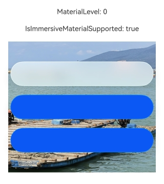
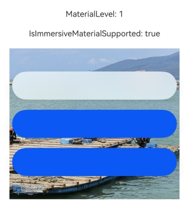
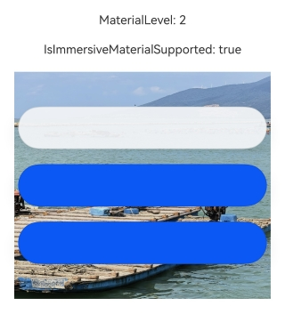
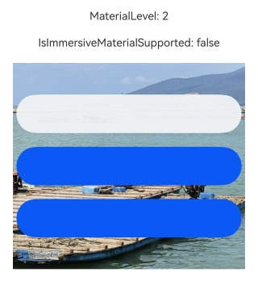

# @ohos.arkui.uiMaterial (系统材质)
<!--Kit: ArkUI-->
<!--Subsystem: ArkUI-->
<!--Owner: @hehongyang3-->
<!--Designer: @hehongyang3-->
<!--Tester: @lxl007-->
<!--Adviser: @Brilliantry_Rui-->

本模块提供系统材质的接口定义。不同的系统材质对应不同的UI效果，包括背景色[backgroundColor](arkui-ts/ts-universal-attributes-background.md#backgroundcolor)、边框颜色[borderColor](arkui-ts/ts-universal-attributes-border.md#bordercolor)、边框宽度[borderWidth](arkui-ts/ts-universal-attributes-border.md#borderwidth)、阴影[shadow](arkui-ts/ts-universal-attributes-image-effect.md#shadow)、材质层滤镜[materialFilter](arkui-ts/ts-universal-attributes-filter-effect.md#materialfilter23)效果。当前提供的系统材质为沉浸式材质类型[ImmersiveMaterial](#immersivematerial)，沉浸式材质对象在不同设备上的表现存在差异，只有支持沉浸式材质的设备上设置才有效果，在不支持沉浸式材质的设备上可设置但无效果，可通过[isImmersiveMaterialSupported](#uimaterialisimmersivematerialsupported)判断设备是否支持沉浸式材质。在支持沉浸式材质的设备上，材质效果在不同算力的设备上有分档表现，可通过[getGlobalMaterialLevel](#uimaterialgetglobalmateriallevel)获取设备的材质等级，分档效果具体参考[ImmersiveMaterial](#immersivematerial)的描述。

开发指导请参考[沉浸光感](../../ui/arkts-immersive-light-sense.md)指南文档。

**起始版本：** 26.0.0

## 导入模块

``` ts
import { uiMaterial } from '@kit.ArkUI';
```

## ImmersiveMaterial

沉浸式材质类，继承自[Material](#material)。

沉浸式材质根据设备是否支持沉浸式材质和设备算力有分档表现，可通过[isImmersiveMaterialSupported](#uimaterialisimmersivematerialsupported)判断设备是否支持沉浸式材质，通过[getGlobalMaterialLevel](#uimaterialgetglobalmateriallevel)获取设备的材质等级。在不支持沉浸式材质的设备上可设置沉浸式材质但无效果。在支持沉浸式材质的高算力和中算力设备上，通过材质层滤镜属性[materialFilter](arkui-ts/ts-universal-attributes-filter-effect.md#materialfilter23)和阴影[shadow](arkui-ts/ts-universal-attributes-image-effect.md#shadow)属性实现材质效果，当[systemMaterial](arkui-ts/ts-universal-attributes-image-effect.md#systemmaterial)属性生效后，已设置的背景色属性[backgroundColor](arkui-ts/ts-universal-attributes-background.md#backgroundcolor)会被恢复为透明色，已设置的边框宽度[borderWidth](arkui-ts/ts-universal-attributes-border.md#borderwidth)属性会被恢复为无边框效果。在支持沉浸式材质的低算力设备上，通过背景色[backgroundColor](arkui-ts/ts-universal-attributes-background.md#backgroundcolor)、边框颜色[borderColor](arkui-ts/ts-universal-attributes-border.md#bordercolor)、边框宽度[borderWidth](arkui-ts/ts-universal-attributes-border.md#borderwidth)、阴影[shadow](arkui-ts/ts-universal-attributes-image-effect.md#shadow)属性实现材质效果。同一材质的效果，会受到系统设置应用中沉浸光感配置项的影响，不同强弱程度的沉浸光感配置下，材质的参数和效果存在差异。

### constructor

constructor(options?: ImmersiveOptions)

ImmersiveMaterial的构造函数。

**起始版本：** 26.0.0

**模型约束：** 此接口仅可在Stage模型下使用。

**原子化服务API：** 从API版本26.0.0开始，该接口支持在原子化服务中使用。

**系统能力：** SystemCapability.ArkUI.ArkUI.Full

**参数：** 

| 参数名       | 类型                                                       | 必填 | 说明                                                         |
| ---------- | ----------------------------------------------------------- | ---- | ------------------------------------------------------------ |
|  options      | [ImmersiveOptions](#immersiveoptions)                    | 否   | 系统材质配置选项，包括材质样式、材质层赋色等。<br>默认值参考ImmersiveOptions接口各参数的默认值，即`{style:uiMaterial.ImmersiveStyle.REGULAR, materialColor:undefined, colorInvert:false, applyShadow:true, interactive:false, lightEffect:undefined}`。    |

## Material

系统材质对象基类。

**起始版本：** 26.0.0

**模型约束：** 此接口仅可在Stage模型下使用。

**原子化服务API：** 从API版本26.0.0开始，该接口支持在原子化服务中使用。

**卡片能力：** 从API版本26.0.0开始，该接口支持在ArkTS卡片中使用。

**系统能力：** SystemCapability.ArkUI.ArkUI.Full

### empty

static get empty(): Material

返回空材质对象，用于组件单独关闭沉浸式系统材质效果。使用方式为`uiMaterial.Material.empty`。

在ENABLE使能模式下，可通过设置`systemMaterial(uiMaterial.Material.empty)`来单独关闭某个组件的沉浸式系统材质效果。如果组件未支持组件级沉浸式系统材质接口，则无法通过此方法关闭材质效果。

**起始版本：** 26.0.0

**模型约束：** 此接口仅可在Stage模型下使用。

**原子化服务API：** 从API版本26.0.0开始，该接口支持在原子化服务中使用。

**系统能力：** SystemCapability.ArkUI.ArkUI.Full

**返回值：**

| 类型   | 说明                     |
| ------ | ------------------------ |
| [Material](#material) | 返回空材质对象，表示无材质效果。 |

## MaterialType

系统材质类型枚举。

**起始版本：** 26.0.0

**模型约束：** 此接口仅可在Stage模型下使用。

**原子化服务API：** 从API版本26.0.0开始，该接口支持在原子化服务中使用。

**系统能力：** SystemCapability.ArkUI.ArkUI.Full

| 名称     | 值 | 说明              |
| ------ | --- | --------------- |
| IMMERSIVE | 2 | 沉浸式材质类型。仅用于[MaterialInfo](#materialinfo)接口的type属性标识当前配置的材质类型，不映射到底层功能。实际材质效果通过[ImmersiveMaterial](#immersivematerial)类实现。 |

## MaterialState

材质使能状态枚举，表示应用级沉浸式系统材质配置的状态。

**起始版本：** 26.0.0

**模型约束：** 此接口仅可在Stage模型下使用。

**原子化服务API：** 从API版本26.0.0开始，该接口支持在原子化服务中使用。

**系统能力：** SystemCapability.ArkUI.ArkUI.Full

| 名称     | 值 | 说明              |
| ------ | --- | --------------- |
| DEFAULT | 0 | 默认模式。[弹出框Dialog](../../ui/arkts-base-dialog-overview.md)、[即时反馈（Toast）](../../ui/arkts-create-toast.md)、[AlphabetIndexer](arkui-ts/ts-container-alphabet-indexer.md)在组件本身未设置背景颜色、模糊参数和阴影参数时默认开启沉浸式系统材质；[Text](arkui-ts/ts-basic-components-text.md)设置[copyOption](arkui-ts/ts-basic-components-text.md#copyoption9)后长按或双击触发的文本菜单默认开启沉浸式系统材质；其他组件由应用主动设置。 |
| ENABLE | 1 | 使能模式。[弹出框Dialog](../../ui/arkts-base-dialog-overview.md)、[即时反馈（Toast）](../../ui/arkts-create-toast.md)、[AlphabetIndexer](arkui-ts/ts-container-alphabet-indexer.md)、[ChipGroup](arkui-ts/ohos-arkui-advanced-ChipGroup.md)、[Chip](arkui-ts/ohos-arkui-advanced-Chip.md)、[Select](arkui-ts/ts-basic-components-select.md)、[菜单控制](arkui-ts/ts-universal-attributes-menu.md)、[Toggle](arkui-ts/ts-basic-components-toggle.md)、[SegmentButton](arkui-ts/ohos-arkui-advanced-SegmentButton.md)、[SegmentButtonV2](arkui-ts/ohos-arkui-advanced-SegmentButtonV2.md)、[Slider](arkui-ts/ts-basic-components-slider.md)、[SelectionMenu](arkui-ts/ohos-arkui-advanced-SelectionMenu.md)组件默认开启沉浸式系统材质；[Text](arkui-ts/ts-basic-components-text.md)设置[copyOption](arkui-ts/ts-basic-components-text.md#copyoption9)后长按或双击触发的文本菜单默认开启沉浸式系统材质。此模式下，沉浸式系统材质样式生效的优先级高于组件本身设置的背景色、模糊、阴影和边框样式。其他组件需开发者主动设置。|
| DISABLE | 2 | 禁用模式。所有组件禁止开启沉浸式系统材质，即使主动为组件设置沉浸式系统材质参数也不会生效。 |

## MaterialInfo

材质配置信息，包含材质使能状态和材质类型。

**起始版本：** 26.0.0

**模型约束：** 此接口仅可在Stage模型下使用。

**原子化服务API：** 从API版本26.0.0开始，该接口支持在原子化服务中使用。

**系统能力：** SystemCapability.ArkUI.ArkUI.Full

| 名称       | 类型                                                        | 只读 | 可选 | 说明                                                     |
| ---------- | ----------------------------------------------------------- | ---- | ------- | ----------------------------------------------------- |
| state   | [MaterialState](#materialstate)                                   | 否 | 否   | 材质使能状态配置，决定当前应用沉浸式系统材质的使能模式。不同状态影响组件默认是否开启沉浸式系统材质效果，具体参考[MaterialState](#materialstate)枚举说明。 |
| type   | [MaterialType](#materialtype)                                   | 否 | 否   | 系统材质类型标识，表示当前配置对应的材质类型。该值仅用于类型标识，不映射到底层功能。 |

## uiMaterial.getMaterialInfo

getMaterialInfo(): MaterialInfo

获取当前应用的材质配置信息。在需要根据材质使能状态决定组件是否开启或关闭沉浸式系统材质效果时，可调用此方法获取配置信息。返回的配置信息来自应用在[module.json5](../../quick-start/module-configuration-file.md)中配置的metadata。只有在entry类型的module中配置的metadata才会生效。

**起始版本：** 26.0.0

**模型约束：** 此接口仅可在Stage模型下使用。

**原子化服务API：** 从API版本26.0.0开始，该接口支持在原子化服务中使用。

**系统能力：** SystemCapability.ArkUI.ArkUI.Full

**返回值：**

| 类型   | 说明                     |
| ------ | ------------------------ |
| [MaterialInfo](#materialinfo) | 返回当前应用的材质配置信息，包含材质使能状态和材质类型。 |

## ImmersiveStyle

沉浸式材质样式枚举。不同的材质样式对应不同的材质参数，主要包括材质的模糊程度、高光效果等。开发者可根据UI场景需要选择合适的材质样式：悬浮按钮和轻量提示建议使用`ULTRA_THIN`或`THIN`样式，常规内容区域和卡片建议使用`REGULAR`样式，需要强调层次感或遮挡背景的场景建议使用`THICK`或`ULTRA_THICK`样式。

**起始版本：** 26.0.0

**模型约束：** 此接口仅可在Stage模型下使用。

**原子化服务API：** 从API版本26.0.0开始，该接口支持在原子化服务中使用。

**系统能力：** SystemCapability.ArkUI.ArkUI.Full

| 名称     | 值 | 说明              |
| ------ | --- | --------------- |
| ULTRA_THIN | 0 | 超薄样式。材质层超薄，具有很强的透明效果。 |
| THIN | 1 | 薄样式。材质层薄，具有较强的透明效果。 |
| REGULAR | 2 | 常规样式。材质层的厚度常规，具有适度的透明和模糊效果。 |
| THICK | 3 | 厚样式。材质层厚，模糊效果较强。 |
| ULTRA_THICK | 4 | 超厚样式。材质层超厚，模糊效果很强。 |

## MaterialLevel

材质等级枚举，表示设备的算力等级。可通过[uiMaterial.getGlobalMaterialLevel](#uimaterialgetglobalmateriallevel)获取当前设备的材质等级。

**起始版本：** 26.0.0

**模型约束：** 此接口仅可在Stage模型下使用。

**原子化服务API：** 从API版本26.0.0开始，该接口支持在原子化服务中使用。

**系统能力：** SystemCapability.ArkUI.ArkUI.Full

| 名称     | 值 | 说明              |
| ------ | --- | --------------- |
| EXQUISITE | 0 | 高算力设备的材质等级。 |
| GENTLE | 1 | 中算力设备的材质等级。 |
| SMOOTH | 2 | 低算力设备的材质等级。 |

## uiMaterial.getGlobalMaterialLevel

getGlobalMaterialLevel(): MaterialLevel

获取全局材质等级，与设备算力相关。该配置项由设备定义，不可修改。

**起始版本：** 26.0.0

**模型约束：** 此接口仅可在Stage模型下使用。

**原子化服务API：** 从API版本26.0.0开始，该接口支持在原子化服务中使用。

**系统能力：** SystemCapability.ArkUI.ArkUI.Full

**返回值：**

| 类型   | 说明                     |
| ------ | ------------------------ |
| [MaterialLevel](#materiallevel) | 返回设备的材质等级。 |

## uiMaterial.isImmersiveMaterialSupported

isImmersiveMaterialSupported(): boolean

判断当前设备是否支持沉浸式系统材质[ImmersiveMaterial](#immersivematerial)。该配置项由设备定义，不可修改。

**起始版本：** 26.0.0

**模型约束：** 此接口仅可在Stage模型下使用。

**原子化服务API：** 从API版本26.0.0开始，该接口支持在原子化服务中使用。

**系统能力：** SystemCapability.ArkUI.ArkUI.Full

**返回值：**

| 类型   | 说明                     |
| ------ | ------------------------ |
| boolean | 当前设备是否支持ImmersiveMaterial。true表示当前设备支持ImmersiveMaterial，false表示不支持。 |

## LightEffectOptions

沉浸式材质的光感交互反馈配置。光感交互反馈是指组件在用户触摸交互时，材质表面呈现动态光感变化的视觉效果。用于自定义反馈光感的颜色。

**起始版本：** 26.0.0

**模型约束：** 此接口仅可在Stage模型下使用。

**原子化服务API：** 从API版本26.0.0开始，该接口支持在原子化服务中使用。

**系统能力：** SystemCapability.ArkUI.ArkUI.Full

| 名称                           | 类型                                     | 只读 | 可选 | 说明                                     |
| ----------------------------- | ---------------------------------------- | ---- | ---------------------------------------- | ---------------------------------------- |
| color       | [ResourceColor](arkui-ts/ts-types.md#resourcecolor) | 否    | 是   | 自定义交互反馈光感的颜色。设置后，交互反馈光感将使用该颜色作为显示颜色，替代默认的白色光感效果。<br>默认值：Color.White |

## ImmersiveOptions

沉浸式材质参数。

**起始版本：** 26.0.0

**模型约束：** 此接口仅可在Stage模型下使用。

**原子化服务API：** 从API版本26.0.0开始，该接口支持在原子化服务中使用。

**系统能力：** SystemCapability.ArkUI.ArkUI.Full

| 名称       | 类型                                                        | 只读 | 可选 | 说明                                                     |
| ---------- | ----------------------------------------------------------- | ---- | ------- | ----------------------------------------------------- |
| style   | [ImmersiveStyle](#immersivestyle)                                   | 否 | 是   | 材质样式。不同样式对应不同的材质参数，影响材质的厚度。<br>**说明**：该参数仅对支持沉浸式材质的高算力和中算力设备的显示效果生效。<br>默认值：uiMaterial.ImmersiveStyle.REGULAR |
| materialColor   | [ResourceColor](arkui-ts/ts-types.md#resourcecolor)                                   | 否 | 是   | 材质层赋色。对于支持沉浸式材质的高算力和中算力设备，若不设置该参数或该参数为undefined，不额外混合纯色效果；若设置该参数为有效颜色值，该参数会为材质层滤镜再混合一层纯色效果，若该颜色为纯不透明的颜色，会遮挡材质层滤镜效果。对于支持沉浸式材质的低算力设备，若不设置该参数或该参数为undefined，生效低算力设备材质自带的背景色效果；若设置该参数为有效颜色值，该参数作为背景色[backgroundColor](arkui-ts/ts-universal-attributes-background.md#backgroundcolor)属性值。<br>**说明**：该参数对支持沉浸式材质的所有档位的算力设备的显示效果生效。<br>默认值：undefined |
| colorInvert   | boolean                                   | 否 | 是   | 设置了材质对象的节点的子树是否自动将颜色适配为材质背景色的反色。<br>若为false，则不会自动反色。<br>若为true，则当材质样式满足系统定义的反色条件(需要材质参数足够薄)时才会自动反色。具体能反色的材质由系统定义，材质样式为THIN或ULTRA_THIN，且与设置应用的沉浸光感的强弱配置相关。材质越薄、沉浸光感越强，越容易符合反色材质的要求。<br>自动反色能力仅对部分属性接口设置特殊资源（见下表1）值时生效，生效的属性接口包括：<br>Text组件的[fontColor](arkui-ts/ts-basic-components-text.md#fontcolor)，<br>Button组件的[fontColor](arkui-ts/ts-basic-components-button.md#fontcolor)，<br>SymbolGlyph组件的[fontColor](arkui-ts/ts-basic-components-symbolGlyph.md#fontcolor)，<br>Image组件的[fillColor](arkui-ts/ts-basic-components-image.md#fillcolor)，<br>Search组件的[placeholderColor](arkui-ts/ts-basic-components-search.md#placeholdercolor)、[fontColor](arkui-ts/ts-basic-components-search.md#fontcolor10)，[searchIcon](arkui-ts/ts-basic-components-search.md#searchicon10)中的图标颜色、[cancelButton](arkui-ts/ts-basic-components-search.md#cancelbutton10)中的图标颜色、[caretStyle](arkui-ts/ts-basic-components-search.md#caretstyle10)中的光标颜色，[searchButton](arkui-ts/ts-basic-components-search.md#searchbutton) 中的按钮颜色，<br>TabContent组件的[tabBar](arkui-ts/ts-container-tabcontent.md#tabbar)属性使用[BottomTabBarStyle](arkui-ts/ts-container-tabcontent.md#bottomtabbarstyle9)，<br>Chip组件的[prefixIcon](arkui-ts/ohos-arkui-advanced-Chip.md#prefixiconoptions)、suffixIcon属性的[fillColor](arkui-ts/ohos-arkui-advanced-Chip.md#iconcommonoptions)，[label](arkui-ts/ohos-arkui-advanced-Chip.md#labeloptions)属性的[fontColor](arkui-ts/ohos-arkui-advanced-Chip.md#labeloptions)，<br>ChipGroup组件的[itemStyle](arkui-ts/ohos-arkui-advanced-ChipGroup.md#chipitemstyle)的[fontColor](arkui-ts/ohos-arkui-advanced-ChipGroup.md#chipitemstyle)，<br>TextArea组件的[fontColor](arkui-ts/ts-basic-components-textarea.md#fontcolor)、[placeholderColor](arkui-ts/ts-basic-components-textarea.md#placeholdercolor)，<br>TextInput组件的[fontColor](arkui-ts/ts-basic-components-textinput.md#fontcolor)、[placeholderColor](arkui-ts/ts-basic-components-textinput.md#placeholdercolor)，<br>SegmentButton组件的[fontColor](arkui-ts/ohos-arkui-advanced-SegmentButton.md#属性-1)，<br>Swiper组件的[fontColor](arkui-ts/ts-container-swiper.md#fontcolor)，<br>使用以上接口时，其中的文本和图标颜色会自动反色。<br>**说明**：该参数仅对支持沉浸式材质的高算力和中算力设备的显示效果生效。<br>默认值：false |
| applyShadow   | boolean                                   | 否 | 是   | 是否添加材质的阴影效果。<br>当该参数为true时，材质中的阴影效果固定生效，优先于[shadow](arkui-ts/ts-universal-attributes-image-effect.md#shadow)通用属性。当该参数为false时，shadow通用属性生效，材质的阴影效果不生效。<br>**说明**：该参数对支持沉浸式材质的所有档位的算力设备的显示效果生效。<br>默认值：true |
| interactive   | boolean                                   | 否 | 是   | 是否启用交互形变效果。交互形变效果是指组件在用户交互时产生形变的视觉反馈效果。<br>当该参数为true时，启用交互形变效果。当该参数为false时，不启用交互形变效果。<br>**说明**：该参数对支持沉浸式材质的所有档位的算力设备的显示效果生效。<br>默认值：false |
| lightEffect   | [LightEffectOptions](#lighteffectoptions) \| null                                   | 否 | 是   | 光感交互反馈效果参数。传入LightEffectOptions对象时启用光感交互反馈；传入null时显式禁用光感交互反馈效果；不传入时默认为undefined，取决于组件是否默认有交互光感效果。<br>**说明**：该参数仅对支持沉浸式材质的高算力和中算力设备的显示效果生效。<br>默认值：undefined，不设置光感交互反馈效果。 |

**表1** 特殊资源值对应的深浅色值

| 特殊资源值 | 浅色 | 深色 |
| --------- | ----------- | ------ |
| $r('sys.color.brand') | #FF0A59F7 | #FF317AF7 |
| $r('sys.color.brand_font') | #FF0A59F7 | #FF5291FF |
| $r('sys.color.warning') | #FFE84026 | #FFD94838 |
| $r('sys.color.font_on_primary') | #FFFFFFFF | #FFFFFFFF |
| $r('sys.color.font_primary') | #E5000000 | #E5FFFFFF |
| $r('sys.color.font_secondary') | #99000000 | #99FFFFFF |
| $r('sys.color.font_tertiary') | #66000000 | #66FFFFFF |
| $r('sys.color.font_fourth') | #33000000 | #33FFFFFF |
| $r('sys.color.font_emphasize') | #FF0A59F7 | #FF5291FF |
| $r('sys.color.icon_primary') | #E5000000 | #E5FFFFFF |
| $r('sys.color.icon_secondary') | #99000000 | #99FFFFFF |
| $r('sys.color.icon_tertiary') | #66000000 | #66FFFFFF |
| $r('sys.color.icon_fourth') | #33000000 | #33FFFFFF |
| $r('sys.color.icon_emphasize') | #FF0A59F7 | #FF5291FF |
| $r('sys.color.icon_sub_emphasize') | #660A59F7 | #665291FF |
| $r('sys.color.comp_background_primary_contrary') | #FFFFFFFF | #FFE5E5E5 |
| $r('sys.color.comp_background_primary_contrary_secondary') | #FFFFFFFF | #FF666666 |
| $r('sys.color.comp_background_secondary') | #19000000 | #19FFFFFF |
| $r('sys.color.comp_background_tertiary') | #0C000000 | #19FFFFFF |
| $r('sys.color.comp_background_emphasize') | #FF0A59F7 | #FF317AF7 |
| $r('sys.color.comp_emphasize_secondary') | #330A59F7 | #33317AF7 |
| $r('sys.color.comp_emphasize_tertiary') | #190A59F7 | #19317AF7 |
| $r('sys.color.comp_divider') | #33000000 | #33FFFFFF |
| $r('sys.color.interactive_hover') | #0C000000 | #19FFFFFF |
| $r('sys.color.interactive_focus') | #FF0A59F7 | #FF317AF7 |
| $r('sys.color.interactive_pressed') | #19000000 | #26FFFFFF |

## 示例

### 示例1（设置沉浸式系统材质）

本示例介绍如何将沉浸式材质的[ImmersiveMaterial](#immersivematerial)对象通过[systemMaterial](arkui-ts/ts-universal-attributes-image-effect.md#systemmaterial)属性设置给组件。

从API版本26.0.0开始，新增ImmersiveMaterial对象和systemMaterial属性。

``` ts
import { uiMaterial } from '@kit.ArkUI';

@Entry
@Component
struct SystemMaterialPage {

  build() {
    Column() {
      Stack() {
        Image($r('app.media.bg1')) // $r('app.media.bg1')需要替换为开发者所需的图像资源文件
          .width('100%')
          .height('100%')

        Column({ space: 30 }) {
          Column() {
            Text('ULTRA_THIN')
          }
          .width(328)
          .height(56)
          .borderRadius(28)
          .justifyContent(FlexAlign.Center)
          .alignItems(HorizontalAlign.Center)
          .systemMaterial(new uiMaterial.ImmersiveMaterial({
            style: uiMaterial.ImmersiveStyle.ULTRA_THIN,
          }))

          Column() {
            Text('THIN')
          }
          .width(328)
          .height(56)
          .borderRadius(28)
          .justifyContent(FlexAlign.Center)
          .alignItems(HorizontalAlign.Center)
          .systemMaterial(new uiMaterial.ImmersiveMaterial({
            style: uiMaterial.ImmersiveStyle.THIN,
          }))

          Column() {
            Text('REGULAR')
          }
          .width(328)
          .height(56)
          .borderRadius(28)
          .justifyContent(FlexAlign.Center)
          .alignItems(HorizontalAlign.Center)
          .systemMaterial(new uiMaterial.ImmersiveMaterial({
            style: uiMaterial.ImmersiveStyle.REGULAR,
          }))

          Column() {
            Text('THICK')
          }
          .width(328)
          .height(56)
          .borderRadius(28)
          .justifyContent(FlexAlign.Center)
          .alignItems(HorizontalAlign.Center)
          .systemMaterial(new uiMaterial.ImmersiveMaterial({
            style: uiMaterial.ImmersiveStyle.THICK,
          }))

          Column() {
            Text('ULTRA_THICK')
          }
          .width(328)
          .height(56)
          .borderRadius(28)
          .justifyContent(FlexAlign.Center)
          .alignItems(HorizontalAlign.Center)
          .systemMaterial(new uiMaterial.ImmersiveMaterial({
            style: uiMaterial.ImmersiveStyle.ULTRA_THICK,
          }))
        }
      }
      .height('90%')
      .width('90%')
    }
    .height('100%')
    .width('100%')
    .alignItems(HorizontalAlign.Center)
    .justifyContent(FlexAlign.Center)
  }
}
```

在支持沉浸式材质的低算力设备上表现：


在支持沉浸式材质的中算力设备上表现：


在支持沉浸式材质的高算力设备上表现：


### 示例2（获取材质配置信息并使用空材质关闭沉浸式系统材质）

本示例介绍如何通过[uiMaterial.getMaterialInfo](#uimaterialgetmaterialinfo)获取当前应用的材质配置信息，并根据配置状态使用[empty](#empty)关闭特定组件的沉浸式系统材质效果。

从API版本26.0.0开始，新增uiMaterial.getMaterialInfo方法和empty方法。

首先在[module.json5](../../quick-start/module-configuration-file.md)文件中配置开关信息，需注意只有在entry类型的module中配置才会生效。
``` json5
{
  "module": {
    // ···
    "type": "entry", // 需注意只有在entry类型的module中配置才会生效。
    // ···
    "metadata": [{
      "name": "ohos.arkui.UIMaterial.state",
      "value": "enable"
    }],
    // ···
  }
}
```
然后按照如下内容编写示例代码。
``` ts
import { uiMaterial } from '@kit.ArkUI';

@Entry
@Component
struct MaterialInfoPage {
  // 获取材质配置信息
  private info: uiMaterial.MaterialInfo = uiMaterial.getMaterialInfo();
  build() {
    Column() {
      Text(`MaterialState: ${this.info.state}`)
        .fontSize(16)
        .margin({ bottom: 10 })
      Text(`MaterialType: ${this.info.type}`)
        .fontSize(16)
        .margin({ bottom: 20 })

      // 根据状态决定组件行为
      if (this.info.state === uiMaterial.MaterialState.ENABLE) {
        // 主动使用沉浸式材质
        Button('Enable UiMaterial')
          .backgroundColor(Color.Transparent)
          .systemMaterial(new uiMaterial.ImmersiveMaterial({
            style: uiMaterial.ImmersiveStyle.ULTRA_THIN
          }))
          .fontColor(Color.Blue)
          .margin({ bottom: 10 })
        // Select组件默认开启沉浸式系统材质
        Select([
          {value: 'select item'}
        ]).value('select item')
        .margin({ bottom: 10 })
        // 单独关闭Select组件的沉浸式系统材质
        Select([
          {value: 'select item'}
        ]).value('select item')
        .systemMaterial(uiMaterial.Material.empty)
      }
    }
    .width('100%')
    .height('100%')
    .justifyContent(FlexAlign.Center)
    // $r('app.media.img')需要替换为开发者所需的图像资源文件
    .backgroundImage($r('app.media.img'))
    .backgroundImageSize(ImageSize.FILL)
  }
}
```

在支持沉浸式材质的高算力设备上表现：


在支持沉浸式材质的中算力设备上表现：


在支持沉浸式材质的低算力设备上表现：


### 示例3（设置组件材质的交互形变效果）

本示例介绍如何通过[ImmersiveOptions](#immersiveoptions)中的interactive接口使组件实现交互形变效果。

从API版本26.0.0开始，新增interactive接口。

``` ts
import { uiMaterial } from '@kit.ArkUI';

@Entry
@Component
struct Index {
  build() {
    Stack() {
      // $r('app.media.startIcon')需要替换为开发者所需的图像资源文件。
      Image($r('app.media.startIcon'))
      Column() {
        Column() {
          Text('Context')
        }
        .margin({ bottom: 100 })
        .width(248)
        .height(56)
        .borderRadius(28)
        .justifyContent(FlexAlign.Center)
        .alignItems(HorizontalAlign.Center)
        .systemMaterial(new uiMaterial.ImmersiveMaterial({
          style: uiMaterial.ImmersiveStyle.ULTRA_THIN,
          interactive: true,
        }))
      }
      .height('100%')
      .width('100%')
      .justifyContent(FlexAlign.Center)
    }
  }
}
```


### 示例4（设置组件材质的光感交互反馈效果）

本示例介绍如何通过[ImmersiveOptions](#immersiveoptions)中的lightEffect接口使组件实现光感交互反馈效果。

从API版本26.0.0开始，新增lightEffect接口。

``` ts
import { uiMaterial } from '@kit.ArkUI';

@Entry
@Component
struct LightEffect {
  @State itemsKey: number[] = [0, 1, 2];
  @State circleRadius: number = 40;
  @State spaceValue: number = 10;
  // 创建沉浸式材质对象，启用交互形变和光感交互反馈效果（lightEffect.color为undefined时使用默认白色光感颜色）
  @State myMaterial: uiMaterial.Material = new uiMaterial.ImmersiveMaterial({
    style: uiMaterial.ImmersiveStyle.ULTRA_THIN,
    interactive: true,
    lightEffect: { color: undefined },
  });
  build() {
    Column() {
      Row() {
        Row({ space: this.spaceValue }) {
          ForEach(this.itemsKey, (_: number, __: number) => {
            Row()
              .width(this.circleRadius * 2)
              .height(this.circleRadius * 2)
              .borderRadius(this.circleRadius)
              .systemMaterial(this.myMaterial)
          })
        }
      }
      .justifyContent(FlexAlign.End)
      .backgroundColor(Color.Black)
      .width('100%')
      .padding(20)
    }
    .height('100%')
    .width('100%')
  }
}
```


### 示例5（查询材质等级与是否支持沉浸式材质）

本示例介绍如何通过[getGlobalMaterialLevel](#uimaterialgetglobalmateriallevel)获取设备的材质等级，并通过[isImmersiveMaterialSupported](#uimaterialisimmersivematerialsupported)判断设备是否支持沉浸式材质，据此决定是否为组件设置沉浸式材质。通过此种适配方式，应用可以在支持和不支持沉浸式材质的不同设备上复用同一套代码，在不支持沉浸式材质的设备上自动降级为普通样式，无需为不同设备编写不同代码。

从API版本26.0.0开始，新增getGlobalMaterialLevel和isImmersiveMaterialSupported方法。

``` ts
import { uiMaterial } from '@kit.ArkUI';

@Entry
@Component
struct MaterialLevelPage {
  private materialLevel: uiMaterial.MaterialLevel = uiMaterial.getGlobalMaterialLevel(); // 材质档位由设备决定，应用运行后不会改变
  private isSupported: boolean = uiMaterial.isImmersiveMaterialSupported(); // 是否支持沉浸式材质由设备决定，应用运行后不会改变

  build() {
    Column({ space: 20 }) {
      Text(`MaterialLevel: ${this.materialLevel}`)
        .fontSize(16)

      Text(`IsImmersiveMaterialSupported: ${this.isSupported}`)
        .fontSize(16)

      Column({ space: 20 }) {
        // 适配方式1，判断设备是否支持材质，根据支持情况设不同的属性，写法更直观，能适用的属性范围更广
        Column()
          .width(328)
          .height(56)
          .borderRadius(28)
          .backgroundColor(this.isSupported ? Color.Transparent :
            '#f2f1f3f5') // 背景色写到systemMaterial之前，在支持沉浸式材质的低算力设备上，沉浸式材质中包含的背景色效果最终生效
          // 在支持沉浸式材质的设备上，设置透明的背景色和沉浸式材质，沉浸式材质后设置生效；在不支持沉浸式材质的设备上，设置'#f2f1f3f5'的背景色和undefined的无材质效果，'#f2f1f3f5'的背景色属性生效
          .systemMaterial(this.isSupported ? new uiMaterial.ImmersiveMaterial({
            style: uiMaterial.ImmersiveStyle.REGULAR,
          }) : undefined)

        Column()
          .width(328)
          .height(56)
          .borderRadius(28)
          .backgroundColor(this.isSupported ? Color.Transparent :
            $r('sys.color.comp_background_emphasize')) // 背景色写到systemMaterial之前，在支持沉浸式材质的低算力设备上，沉浸式材质中包含的背景色效果最终生效
          // 在支持沉浸式材质的设备上，设置透明的背景色和带赋色的沉浸式材质，带赋色的沉浸式材质后设置生效；在不支持沉浸式材质的设备上，设置资源值的背景色和undefined的无材质效果，资源值的背景色属性生效
          .systemMaterial(this.isSupported ? new uiMaterial.ImmersiveMaterial({
            style: uiMaterial.ImmersiveStyle.REGULAR,
            materialColor: $r('sys.color.comp_background_emphasize'),
          }) : undefined)

        // 适配方式2，后设置systemMaterial属性，利用systemMaterial能覆盖与材质冲突的属性的特性
        Column()
          .width(328)
          .height(56)
          .borderRadius(28)
          .backgroundColor($r('sys.color.comp_background_emphasize')) // 背景色写到systemMaterial之前，在支持沉浸式材质的低算力设备上，沉浸式材质中包含的背景色效果最终生效
          // 在支持沉浸式材质的设备上，如果是高算力或中算力设备，后设置的沉浸式材质会清除背景色效果为透明色，使用材质效果；如果是低算力设备，后设置的沉浸式材质中包含的背景色效果覆盖了backgroundColor属性的效果，使用材质颜色
          // 在不支持沉浸式材质的设备上，设置systemMaterial无作用，资源值的背景色属性生效
          .systemMaterial(new uiMaterial.ImmersiveMaterial({
            style: uiMaterial.ImmersiveStyle.REGULAR,
            materialColor: $r('sys.color.comp_background_emphasize')
          }))
      }
      .backgroundImage($r('app.media.bg1')) // $r("app.media.bg1")需要替换为开发者所需的图像资源文件
      .backgroundImageSize({ width: '100%', height: '100%' })
      .width('90%')
      .height(300)
      .justifyContent(FlexAlign.Center)
    }
    .width('100%')
    .height('100%')
    .justifyContent(FlexAlign.Center)
  }
}
```

在支持沉浸式材质的高算力设备上表现：



在支持沉浸式材质的中算力设备上表现：



在支持沉浸式材质的低算力设备上表现：



在不支持沉浸式材质的设备上表现：


