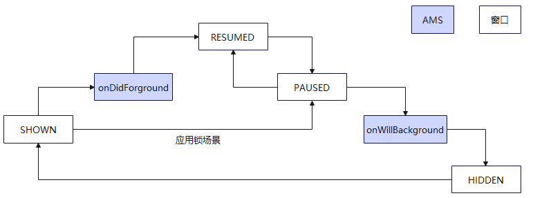

# 主窗口生命周期状态说明与事件监听接口适配指导

## 主窗口生命周期状态说明

**SHOWN**

窗口进入到前台。窗口触发SHOWN生命周期事件后，将会进入到用户可交互状态。特殊场景下，会进入进入不可交互状态，例如加锁场景。

**RESUMED**

窗口进入可交互状态。窗口会一直保持这种状态，直到窗口切换或退后台等，例如跳转到其他窗口、设备屏幕关闭等。当窗口切换时，窗口会触发PAUSED生命周期事件，进入不可交互状态。如果窗口恢复，则会触发RESUMED生命周期事件，窗口再次进入可交互状态。

**PAUSED**

窗口进入不可交互状态。窗口触发PAUSED生命周期事件，说明窗口不再位于前台，窗口会保持这种状态，直到恢复或完全变为对用户不可见。如果窗口恢复，则会触发RESUMED生命周期事件，进入可交互状态。

**HIDDEN**

窗口进入到后台。当窗口不在对用户可见时，触发HIDDEN生命周期事件，它会进入到后台。当全屏启动新的窗口时，老的窗口会进入到该状态。窗口进入到后台状态后，如果恢复到用户可交互状态，则会触发SHOWN和RESUMED事件。

|事件名称|说明|触发场景举例|
|-------|----------|----------|
|SHOWN  |切到前台        |例如：应用全屏启动、悬浮窗被拉起、应用在前台然后锁屏再解锁等。|
|RESUMED|前台可交互状态  |例如：应用全屏启动、悬浮窗被拉起、应用在前台然后锁屏再解锁、应用上滑悬停后回到应用等。|
|PAUSED |前台不可交互状态|例如：应用退后台回到桌面、、上滑进入多任务、应用加锁后进入到解锁界面，应用上滑悬停、应用退后台、应用销毁等。|
|HIDDEN |切到后台       |例如：应用在前台时锁屏、应用上滑回到桌面、应用退后台、应用销毁等。|

主窗口生命周期事件调度关系如下图：



## 新接口与老接口差异

**新接口**

新接口[on('windowStageLifecycleEvent')](arkts-apis-window-WindowStage.md#on('windowstagelifecycleevent')20)监听的窗口生命周期包括切到前台（SHOWN）、前台可交互状态（RESUMED）、前台不可交互状态（PAUSED）和切到后台（HIDDEN），不包含获焦状态（ACTIVE）和失焦状态（INACTIVE）。

**老接口**

老接口[on('windowStageEvent')](arkts-apis-window-WindowStage.md#on('windowstageevent')9)监听的窗口生命周期包括切到前台（SHOWN）、获焦状态（ACTIVE）、失焦状态（INACTIVE）、切到后台（HIDDEN）、前台可交互状态（RESUMED）和前台不可交互状态（PAUSED）。

**新接口和老接口区别**

- 老接口无法保证状态切换间的顺序，对于状态间的顺序有要求的情况下不推荐使用，推荐使用新接口；
- 新接口不提供WindowStage的获焦失焦状态监听，对于windowStage获焦失焦状态有监听需求的情况下，推荐使用[on('windowEvent')](arkts-apis-window-Window.md#on('windowevent')10)；

## 新接口适配指导

**开启监听**

通过新接口[on('windowStageLifecycleEvent')](arkts-apis-window-WindowStage.md#on('windowstagelifecycleevent')20)开启WindowStage新生命周期变化的监听可参考下列代码进行适配。

示例：

```ts
// EntryAbility.ets
import { UIAbility } from '@kit.AbilityKit';

export default class EntryAbility extends UIAbility {
  // ...

  onWindowStageCreate(windowStage: window.WindowStage) {
    console.info('onWindowStageCreate');
    const callback = (data: window.WindowStageLifecycleEventType) => {
        console.info('Succeeded in enabling the listener for window stage event changes. Data: ' +
        JSON.stringify(data));
    }
    try {
      windowStage.on('windowStageLifecycleEvent', callback);
    } catch (exception) {
      console.error(`Failed to enable the listener for window stage event changes. Cause code: ${exception.code}, message: ${exception.message}`);
    }
  }
};
```

**关闭监听**

通过新接口[off('windowStageLifecycleEvent')](arkts-apis-window-WindowStage.md#off('windowstagelifecycleevent')20)关闭WindowStage新生命周期变化的监听可参考如下代码进行适配。

示例：

```ts
// EntryAbility.ets
import { UIAbility } from '@kit.AbilityKit';

export default class EntryAbility extends UIAbility {
  // ...

  onWindowStageCreate(windowStage: window.WindowStage) {
    console.info('onWindowStageCreate');
    const callback = (windowStageLifecycleEvent: window.WindowStageLifecycleEventType) => {
      // ...
    }
    try {
      windowStage.on('windowStageLifecycleEvent', callback);
    } catch (exception) {
      console.error(`Failed to enable the listener for window stage event changes. Cause code: ${exception.code}, message: ${exception.message}`);
    }
    try {
      windowStage.off('windowStageLifecycleEvent', callback);
      // 如果通过on开启多个callback进行监听，同时关闭所有监听：
      windowStage.off('windowStageLifecycleEvent');
    } catch (exception) {
      console.error(`Failed to disable the listener for window stage event changes. Cause code: ${exception.code}, message: ${exception.message}`);
    }
  }
};
```
