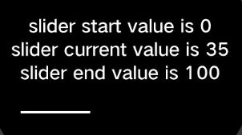

# slider
<!--Kit: ArkUI-->
<!--Subsystem: ArkUI-->
<!--Owner: @houguobiao-->
<!--Designer: @houguobiao-->
<!--Tester: @lxl007-->
<!--Adviser: @HelloCrease-->

滑动条组件，用来快速调节设置值，如音量、亮度等。

> **说明：**
>
> 该组件从API version 4 开始支持。后续版本如有新增内容，则采用上角标单独标记该内容的起始版本。


## 子组件

不支持。


## 属性

| 名称    | 类型     | 默认值  | 必填   | 描述                                       |
| ----- | ------ | ---- | ---- | ---------------------------------------- |
| min   | number | 0    | 否    | 滑动选择器的最小值。                               |
| max   | number | 100  | 否    | 滑动选择器的最大值。                               |
| value | number | 0    | 否    | 滑动选择器的初始值。                               |
| id    | string | -    | 否    | 组件的唯一标识。                                 |
| style | string | -    | 否    | 组件的样式声明。                                 |
| class | string | -    | 否    | 组件的样式类，用于引用样式表。                          |
| ref   | string | -    | 否    | 用来指定指向子元素的引用信息，该引用将注册到父组件的$refs&nbsp;属性对象上。 |


## 事件

| 名称                 | 参数                                | 描述             |
| ------------------ | --------------------------------- | -------------- |
| change             | ChangeEvent                       | 选择值发生变化时触发该事件。 |
| click              | -                                 | 点击动作触发该事件。     |
| longpress          | -                                 | 长按动作触发该事件。     |
| swipe<sup>5+</sup> | [SwipeEvent](js-lite-common-events.md) | 组件上快速滑动后触发。    |

  **表1** ChangeEvent

| 属性                                       | 类型     | 说明            |
| ---------------------------------------- | ------ | ------------- |
| progress<sup>(deprecated<sup>5+</sup>)</sup> | string | 当前slider的进度值。 |
| value<sup>5+</sup>                       | number | 当前slider的进度值。 |


## 样式

| 名称                               | 类型                                                        | 默认值   | 必填 | 描述                                                         |
| ---------------------------------- | ----------------------------------------------------------- | -------- | ---- | ------------------------------------------------------------ |
| color                              | &lt;color&gt;                                               | \#000000 | 否   | 滑动条的背景颜色。                                           |
| selected-color                     | &lt;color&gt;                                               | \#ffffff | 否   | 滑动条的已选择颜色。                                         |
| width                              | &lt;length&gt;&nbsp;\|&nbsp;&lt;percentage&gt;<sup>5+</sup> | -        | 否   | 设置组件自身的宽度。<br/>未设置时组件宽度默认为0。           |
| height                             | &lt;length&gt;&nbsp;\|&nbsp;&lt;percentage&gt;<sup>5+</sup> | -        | 否   | 设置组件自身的高度。<br/>未设置时组件高度默认为0。           |
| padding                            | &lt;length&gt;                                              | 0        | 否   | 使用简写属性设置所有的内边距属性。<br/>&nbsp;&nbsp;该属性可以有1到4个值：<br/>-&nbsp;指定一个值时，该值指定四个边的内边距。<br/>-&nbsp;指定两个值时，第一个值指定上下两边的内边距，第二个指定左右两边的内边距。<br/>-&nbsp;指定三个值时，第一个指定上边的内边距，第二个指定左右两边的内边距，第三个指定下边的内边距。<br/>-&nbsp;指定四个值时分别为上、右、下、左边的内边距（顺时针顺序）。 |
| padding-[left\|top\|right\|bottom] | &lt;length&gt;                                              | 0        | 否   | 设置左、上、右、下内边距属性。                               |
| margin                             | &lt;length&gt;&nbsp;\|&nbsp;&lt;percentage&gt;<sup>5+</sup> | 0        | 否   | 使用简写属性设置所有的外边距属性，该属性可以有1到4个值。<br/>-&nbsp;只有一个值时，这个值会被指定给全部的四个边。<br/>-&nbsp;两个值时，第一个值被匹配给上和下，第二个值被匹配给左和右。<br/>-&nbsp;三个值时，第一个值被匹配给上，&nbsp;第二个值被匹配给左和右，第三个值被匹配给下。<br/>-&nbsp;四个值时，会依次按上、右、下、左的顺序匹配&nbsp;(即顺时针顺序)。 |
| margin-[left\|top\|right\|bottom]  | &lt;length&gt;&nbsp;\|&nbsp;&lt;percentage&gt;<sup>5+</sup> | 0        | 否   | 设置左、上、右、下外边距属性。                               |
| border-width                       | &lt;length&gt;                                              | 0        | 否   | 使用简写属性设置元素的所有边框宽度。                         |
| border-color                       | &lt;color&gt;                                               | black    | 否   | 使用简写属性设置元素的所有边框颜色。                         |
| border-radius                      | &lt;length&gt;                                              | -        | 否   | border-radius属性是设置元素的外边框圆角半径。                |
| background-color                   | &lt;color&gt;                                               | -        | 否   | 设置背景颜色。                                               |
| display                            | string                                                      | flex     | 否   | 确定一个元素所产生的框的类型，可选值为：<br/>-&nbsp;flex：弹性布局。<br/>-&nbsp;none：不渲染此元素。 |
| [left\|top]                        | &lt;length&gt;&nbsp;\|&nbsp;&lt;percentage&gt;<sup>6+</sup> | -        | 否   | left\|top确定元素的偏移位置。<br/>-&nbsp;left属性规定元素的左边缘。该属性定义了定位元素左外边距边界与其包含块左边界之间的偏移。<br/>-&nbsp;top属性规定元素的顶部边缘。该属性定义了一个定位元素的上外边距边界与其包含块上边界之间的偏移。 |

## 方法

| 名称 | 参数 | 描述 |
| -------- | -------- | -------- |
|rotation | {&nbsp;focus:&nbsp;boolean&nbsp;} | 控制slider是否请求旋转表冠的焦点。设置focus参数为true，slider将获取旋转表冠的焦点，允许用户通过旋转表冠来滚动选择器中的选项；设置为false将释放旋转表冠的焦点。|

## 示例

```html
<!-- xxx.hml -->
<div class="container">
    <text>slider start value is {{startValue}}</text>
    <text>slider current value is {{currentValue}}</text>
    <text>slider end value is {{endValue}}</text>
    <slider min="0" max="100" value="{{value}}" ref="sliderObj"
            onchange="setValue" style="margin-top: 10%; width: 80%;height: 1%"></slider>
</div>
```

```css
/* xxx.css */
.container {
  flex-direction: column;
  justify-content: center;
  align-items: center;
  width: 100%;
  height: 100%;
}
```

```javascript
// xxx.js
export default {
    data: {
        value: 34,
        startValue: 0,
        currentValue: 0,
        endValue: 100,
    },
    onShow() {
        this.$refs.sliderObj.rotation({focus: true});
    },
    setValue(e) {
        this.currentValue = e.value;
    }
}
```

