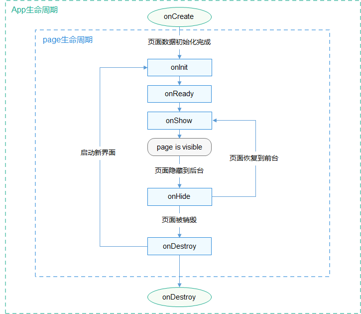

# 生命周期
<!--Kit: ArkUI-->
<!--Subsystem: ArkUI-->
<!--Owner: @mayaolll-->
<!--SE: @jiangdayuan-->
<!--TSE: @lxl007-->

## 应用生命周期

在app.js中可以定义如下应用生命周期函数：

| 属性      | 类型       | 描述     | 触发时机           |
| --------- | ---------- | -------- | ------------------ |
| onCreate  | () => void | 应用创建 | 当应用创建时调用。 |
| onDestroy | () => void | 应用销毁 | 当应用退出时触发。 |

## 页面生命周期

在页面JS文件中可以定义如下页面生命周期函数：

> **说明：** 请注意不要在生命周期函数中执行复杂耗时操作，以避免影响页面切换性能

| 属性      | 类型       | 描述         | 触发时机                               |
| --------- | ---------- | ------------ | -------------------------------------- |
| onInit    | () => void | 页面初始化   | 页面数据初始化完成时触发，只触发一次。 |
| onReady   | () => void | 页面创建完成 | 页面创建完成时触发，只触发一次。       |
| onShow    | () => void | 页面显示     | 页面显示时触发。                       |
| onHide    | () => void | 页面消失     | 页面消失时触发。                       |
| onDestroy | () => void | 页面销毁     | 页面销毁时触发。                       |

页面A的生命周期接口的调用顺序：

- 打开页面A：onInit() -> onReady() -> onShow()
- 在页面A打开页面B：onHide() -> onDestroy()
- 从页面B返回页面A：onInit() -> onReady() -> onShow()
- 退出页面A：onHide() -> onDestroy()
- 页面隐藏到后台运行：onHide()
- 页面从后台运行恢复到前台：onShow()

