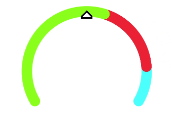

# chart

>  **说明：**
>  从API version 4开始支持。后续版本如有新增内容，则采用上角标单独标记该内容的起始版本。

图表组件，用于呈现线形图、柱状图、量规图界面。

## 权限列表

无


## 子组件

不支持。


## 属性

除支持[通用属性](js-components-common-attributes.md)外，还支持如下属性：

| 名称                             | 类型                                       | 默认值  | 必填   | 描述                                       |
| ------------------------------ | ---------------------------------------- | ---- | ---- | ---------------------------------------- |
| type                           | string                                   | line | 否    | 设置图表类型（不支持动态修改），可选项有：<br/>-&nbsp;bar：柱状图。<br/>-&nbsp;line：线形图。<br/>-&nbsp;gauge：量规图。<br/>-&nbsp;progress<sup>5+</sup>：进度类圆形图表。<br/>-&nbsp;loading<sup>5+</sup>：加载类圆形图表。<br/>-&nbsp;rainbow<sup>5+</sup>：占比类圆形图表。 |
| options                        | ChartOptions                             | -    | 否    | 图表参数设置，柱状图和线形图必须设置参数设置，量规图不生效。可以设置x轴、y轴的最小值、最大值、刻度数、是否显示，线条宽度、是否平滑等。（不支持动态修改） |
| datasets                       | Array&lt;ChartDataset&gt;                | -    | 否    | 数据集合，柱状图和线形图必须设置数据集合，量规图不生效。可以设置多条数据集及其背景色。 |
| segments<sup>5+</sup>          | DataSegment&nbsp;\|&nbsp;Array&lt;DataSegment&gt; | -    | 否    | 进度类、加载类和占比类圆形图表使用的数据结构。<br/>DataSegment针对进度类和加载类圆形图表使用，<br/>Array&lt;DataSegment&gt;针对占比类图标使用，DataSegment最多9个。 |
| effects<sup>5+</sup>           | boolean                                  | true | 否    | 是否开启占比类、进度类圆形图表特效。                       |
| animationduration<sup>6+</sup> | number                                   | 3000 | 否    | 设置占比类圆形图表展开动画时长，单位为ms。                   |

**表1** ChartOptions

| 名称     | 类型          | 默认值  | 必填   | 描述                                       |
| ------ | ----------- | ---- | ---- | ---------------------------------------- |
| xAxis  | ChartAxis   | -    | 是    | x轴参数设置。可以设置x轴最小值、最大值、刻度数以及是否显示。          |
| yAxis  | ChartAxis   | -    | 是    | y轴参数设置。可以设置y轴最小值、最大值、刻度数以及是否显示。          |
| series | ChartSeries | -    | 否    | 仅线形图支持设置数据序列参数，可以设置的样式：<br>- 线的样式，如线宽、是否平滑。<br>- 设置线最前端位置白点的样式和大小。 |

**表2** ChartDataset

| 名称          | 类型                                       | 默认值      | 必填   | 描述                     |
| ----------- | ---------------------------------------- | -------- | ---- | ---------------------- |
| strokeColor | &lt;color&gt;                            | \#ff6384 | 否    | 仅线形图支持设置线条颜色。          |
| fillColor   | &lt;color&gt;                            | \#ff6384 | 否    | 填充颜色。<br>线形图表示填充的渐变颜色。 |
| data        | Array&lt;number&gt;&nbsp;\|&nbsp;Array&lt;Point&gt;<sup>5+</sup> | -        | 是    | 设置绘制线或柱中的点集。           |
| gradient    | boolean                                  | false    | 否    | 仅线形图支持设置是否显示填充渐变颜色。    |

**表3** ChartAxis

| 名称       | 类型            | 默认值      | 必填   | 描述                                       |
| -------- | ------------- | -------- | ---- | ---------------------------------------- |
| min      | number        | 0        | 否    | 轴的最小值，仅线形图支持负数。                          |
| max      | number        | 100      | 否    | 轴的最大值，仅线形图支持负数。                          |
| axisTick | number        | 10       | 否    | 轴显示的刻度数量。仅支持1~20，且具体显示的效果与图的宽度所占的像素/（max-min）有关。<br/>在柱状图中，每组数据显示的柱子数量与刻度数量一致，且柱子显示在刻度处。 |
| display  | boolean       | false    | 否    | 是否显示轴。                                   |
| color    | &lt;color&gt; | \#c0c0c0 | 否    | 轴颜色。                                     |

**表4** ChartSeries

| 名称          | 类型             | 默认值  | 必填   | 描述                   |
| ----------- | -------------- | ---- | ---- | -------------------- |
| lineStyle   | ChartLineStyle | -    | 否    | 线样式设置，如线宽、是否平滑。      |
| headPoint   | PointStyle     | -    | 否    | 线最前端位置白点的样式和大小。      |
| topPoint    | PointStyle     | -    | 否    | 最高点的样式和大小。           |
| bottomPoint | PointStyle     | -    | 否    | 最低点的样式和大小。           |
| loop        | ChartLoop      | -    | 否    | 设置屏幕显示满时，是否需要重头开始绘制。 |

**表5** ChartLineStyle

| 名称     | 类型             | 默认值   | 必填   | 描述    |
| ------ | -------------- | ----- | ---- | ----- |
| width  | &lt;length&gt; | 1px   | 否    | 线宽设置。 |
| smooth | boolean        | false | 否    | 是否平滑。 |

**表6** PointStyle

| 名称          | 类型             | 默认值      | 必填   | 描述                                       |
| ----------- | -------------- | -------- | ---- | ---------------------------------------- |
| shape       | string         | circle   | 否    | 高亮点的形状。可选值为：<br/>-&nbsp;circle：圆形。<br/>-&nbsp;square：方形。<br/>-&nbsp;triangle：三角形。 |
| size        | &lt;length&gt; | 5px      | 否    | 高亮点的大小。                                  |
| strokeWidth | &lt;length&gt; | 1px      | 否    | 边框宽度                                     |
| strokeColor | &lt;color&gt;  | \#ff0000 | 否    | 边框颜色。                                    |
| fillColor   | &lt;color&gt;  | \#ff0000 | 否    | 填充颜色。                                    |

**表7** ChartLoop

| 名称       | 类型             | 默认值   | 必填   | 描述                                       |
| -------- | -------------- | ----- | ---- | ---------------------------------------- |
| margin   | &lt;length&gt; | 1     | 否    | 擦除点的个数（最新绘制的点与最老的点之间的横向距离）。轻量设备margin和topPoint/bottomPoint/headPoint同时使用时，有概率出现point正好位于擦除区域的情况，导致point不可见，因此不建议同时使用。 |
| gradient | boolean        | false | 否    | 是否需要渐变擦除。                                |

**表8** Point<sup>5+</sup>

| 名称           | 类型            | 默认值      | 必填   | 描述                                       |
| ------------ | ------------- | -------- | ---- | ---------------------------------------- |
| value        | number        | 0        | 是    | 表示绘制点的Y轴坐标。                              |
| pointStyle   | PointStyle    | -        | 否    | 表示当前数据点的绘制样式。                            |
| description  | string        | -        | 否    | 表示当前点的注释内容。                              |
| textLocation | string        | -        | 否    | 可选值为top，bottom，none。分别表示注释的绘制位置位于点的上方，下方，以及不绘制。 |
| textColor    | &lt;color&gt; | \#000000 | 否    | 表示注释文字的颜色。                               |
| lineDash     | string        | solid    | 否    | 表示绘制当前线段虚线的样式。“dashed，&nbsp;5，&nbsp;5”表示纯虚线，绘制5px的实线后留5px的空白。“solid”表示绘制实线。 |
| lineColor    | &lt;color&gt; | \#000000 | 否    | 表示绘制当前线段的颜色。此颜色不设置会默认使用整体的strokeColor。   |

**表9** DataSegment<sup>5+</sup>

| 名称         | 类型     | 默认值  | 必填   | 描述                                       |
| ---------- | ------ | ---- | ---- | ---------------------------------------- |
| startColor | Color  | -    | 否    | 起始位置的颜色，设置startColor必须设置endColor。不设置startColor时，会使用系统默认预置的颜色数组，具体颜色值见下表。 |
| endColor   | Color  | -    | 否    | 终止位置的颜色，设置endColor必须设置startColor。<br/>不设置startColor时，会使用系统默认预置的颜色数组。 |
| value      | number | 0    | 是    | 占比数据的所占份额，最大100。                         |
| name       | string | -    | 否    | 此类数据的名称。                                 |

| 数据组  | 浅色主题                        | 深色主题                        |
| ---- | --------------------------- | --------------------------- |
| 0    | 起始颜色：\#f7ce00，结束颜色：\#f99b11 | 起始颜色：\#d1a738，结束颜色：\#eb933d |
| 1    | 起始颜色：\#f76223，结束颜色：\#f2400a | 起始颜色：\#e67d50，结束颜色：\#d9542b |
| 2    | 起始颜色：\#f772ac，结束颜色：\#e65392 | 起始颜色：\#d5749e，结束颜色：\#d6568d |
| 3    | 起始颜色：\#a575eb，结束颜色：\#a12df7 | 起始颜色：\#9973d1，结束颜色：\#5552d9 |
| 4    | 起始颜色：\#7b79f7，结束颜色：\#4b48f7 | 起始颜色：\#7977d9，结束颜色：\#f99b11 |
| 5    | 起始颜色：\#4b8af3，结束颜色：\#007dff | 起始颜色：\#4c81d9，结束颜色：\#217bd9 |
| 6    | 起始颜色：\#73c1e6，结束颜色：\#4fb4e3 | 起始颜色：\#5ea6d1，结束颜色：\#4895c2 |
| 7    | 起始颜色：\#a5d61d，结束颜色：\#69d14f | 起始颜色：\#91c23a，结束颜色：\#70ba5d |
| 8    | 起始颜色：\#a2a2b0，结束颜色：\#8e8e93 | 起始颜色：\#8c8c99，结束颜色：\#6b6b76 |

当类型为量规图时，还支持如下属性：

| 名称      | 类型     | 默认值  | 必填   | 描述                     |
| ------- | ------ | ---- | ---- | ---------------------- |
| percent | number | 0    | 否    | 当前值占整体的百分比，取值范围为0-100。 |


## 样式


除支持[通用样式](js-components-common-styles.md)外，还支持如下样式：

| 名称                       | 类型             | 默认值                        | 必填   | 描述                                       |
| ------------------------ | -------------- | -------------------------- | ---- | ---------------------------------------- |
| stroke-width             | &lt;length&gt; | 32px（量规）<br/>24px（占比类圆形图表） | 否    | 量规、占比类圆形图表组件刻度条的宽度。                      |
| start-angle              | &lt;deg&gt;    | 240（量规）<br/>0（占比类圆形图表）     | 否    | 量规、占比类圆形图表组件刻度条起始角度，以时钟0点为基线。范围为0到360。   |
| total-angle              | &lt;deg&gt;    | 240（量规）<br/>360（占比类圆形图表）   | 否    | 量规、占比类圆形图表组件刻度条总长度，范围为-360到360，负数标识起点到终点为逆时针。 |
| center-x                 | &lt;length&gt; | -                          | 否    | 量规组件刻度条中心位置，该样式优先于通用样式的position样式。该样式需要和center-y和radius一起配置才能生效。（仅量规图支持） |
| center-y                 | &lt;length&gt; | -                          | 否    | 量规组件刻度条中心位置，该样式优先于通用样式的position样式。该样式需要和center-x和radius一起配置才能生效。（仅量规图支持） |
| radius                   | &lt;length&gt; | -                          | 否    | 量规组件刻度条半径，该样式优先于通用样式的width和height样式。该样式需要和center-x和center-y一起配置才能生效。（仅量规图支持） |
| colors                   | Array          | -                          | 否    | 量规组件刻度条每一个区段的颜色。<br/>如：colors:&nbsp;\#ff0000,&nbsp;\#00ff00。（仅量规图支持） |
| weights                  | Array          | -                          | 否    | 量规组件刻度条每一个区段的权重。<br/>如：weights:&nbsp;2,&nbsp;2。（仅量规图支持） |
| font-family<sup>5+</sup> | Array          | -                          | 否    | 表示绘制注释的字体样式，支持[自定义字体](js-components-common-customizing-font.md)。 |
| font-size<sup>5+</sup>   | &lt;length&gt; | -                          | 否    | 表示绘制注释的字体的大小。                            |


## 事件

支持[通用事件](js-components-common-events.md)。


## 方法

除支持[通用方法](js-components-common-methods.md)外，还支持如下方法：

| 方法     | 参数                                       | 描述                                       |
| ------ | ---------------------------------------- | ---------------------------------------- |
| append | {<br/>serial:&nbsp;number,&nbsp;<br/>data:&nbsp;Array&lt;number&gt;,&nbsp;<br/>} | 向已有的数据序列中动态添加数据，根据serial指定目标序列，serial为datasets数组的下标，从0开始。假设serial的值为index，使用data数据更新datasets[index].data。仅线形图支持，按横坐标加1递增（与xAxis&nbsp;min/max设置相关）。 |

## 示例

1. 线形图
   ```html
   <!-- xxx.hml -->
   <div class="container">
     <stack class="chart-region">
       <image class="chart-background" src="common/background.png"></image>
       <chart class="chart-data" type="line" ref="linechart" options="{{lineOps}}" datasets="{{lineData}}"></chart>
     </stack>
     <button value="Add data" onclick="addData"></button>
   </div>
   ```

   ```css
   /* xxx.css */
   .container {
     flex-direction: column;
     justify-content: center;
     align-items: center;
   }
   .chart-region {
     height: 400px;
     width: 700px;
   }
   .chart-background {
     object-fit: fill;
   }
   .chart-data {
     width: 700px;
     height: 600px;
   }
   button {
     width: 100%;
     height: 50px;
     background-color: #F4F2F1;
     text-color: #0C81F3;
   }
   ```

   ```js
   // xxx.js
   export default {
     data: {
       lineData: [
         {
           strokeColor: '#0081ff',
           fillColor: '#cce5ff',
           data: [763, 550, 551, 554, 731, 654, 525, 696, 595, 628, 791, 505, 613, 575, 475, 553, 491, 680, 657, 716],
           gradient: true
         }
       ],
       lineOps: {
         xAxis: {
           min: 0,
           max: 20,
           display: false
         },
         yAxis: {
           min: 0,
           max: 1000,
           display: false
         },
         series: {
           lineStyle: {
             width: "5px",
             smooth: true
           },
           headPoint: {
             shape: "circle",
             size: 20,
             strokeWidth: 5,
             fillColor: '#ffffff',
             strokeColor: '#007aff',
             display: true
           },
           loop: {
             margin: 2,
             gradient: true
           }
         }
       }
     },
     addData() {
       this.$refs.linechart.append({
         serial: 0,
         data: [Math.floor(Math.random() * 400) + 400]
       })
     }
   }
   ```

   

2. 柱状图
   ```html
   <!-- xxx.hml -->
   <div class="container">
     <stack class="data-region">
       <image class="data-background" src="common/background.png"></image>
       <chart class="data-bar" type="bar" id="bar-chart" options="{{barOps}}" datasets="{{barData}}"></chart>
     </stack>
   </div>
   ```

   ```css
   /* xxx.css */
   .container {
     flex-direction: column;
     justify-content: center;
     align-items: center;
   }
   .data-region {
     height: 400px;
     width: 700px;
   }
   .data-background {
     object-fit: fill;
   }
   .data-bar {
     width: 700px;
     height: 400px;
   }
   ```

   ```js
   // xxx.js
   export default {
     data: {
       barData: [
         {
           fillColor: '#f07826',
           data: [763, 550, 551, 554, 731, 654, 525, 696, 595, 628]
         },
         {
           fillColor: '#cce5ff',
           data: [535, 776, 615, 444, 694, 785, 677, 609, 562, 410]
         },
         {
           fillColor: '#ff88bb',
           data: [673, 500, 574, 483, 702, 583, 437, 506, 693, 657]
         },
       ],
       barOps: {
         xAxis: {
           min: 0,
           max: 20,
           display: false,
           axisTick: 10
         },
         yAxis: {
           min: 0,
           max: 1000,
           display: false
         }
       }
     }
   }
   ```

   

3. 量规图
   ```html
   <!-- xxx.hml -->
   <div class="container">
     <div class="gauge-region">
       <chart class="data-gauge" type="gauge" percent = "50"></chart>
     </div>
   </div>
   ```

   ```css
   /* xxx.css */
   .container {
     flex-direction: column;
     justify-content: center;
     align-items: center;
   }
   .gauge-region {
     height: 400px;
     width: 400px;
   }
   .data-gauge {
     colors: #83f115, #fd3636, #3bf8ff;
     weights: 4, 2, 1;
   }
   ```

   

4. 进度类、加载类、占比类圆形图表
   ```html
   <!-- xxx.hml -->
   <div class="container">
       <text class="text">progress Example</text>
       <stack class="chart-region">
           <chart class="" type="progress" segments="{{ progressdata }}"></chart>
       </stack>
       <text class="text">loading Example</text>
       <stack class="chart-region">
           <chart class="" type="loading" segments="{{ loadingdata }}"></chart>
       </stack>
       <text class="text">rainbow Example</text>
       <stack class="chart-region">
           <chart class="" type="rainbow" segments="{{ rainbowdata }}" effects="true" animationduration="5000"></chart>
       </stack>
   </div>
   ```
   ```css
   /* xxx.css */
   .container {
       flex-direction: column;
       justify-content: center;
       align-items: center;
   }
   .chart-region {
       height: 400px;
       width: 700px;
       margin-top: 10px;
   }
   .text {
       margin-top: 30px;
   }
   ```
   ```js
   // xxx.js
   export default {
      data: {
         progressdata: {
            value: 50,
            name: 'progress'
         },
         loadingdata: {
            startColor: "#ffc0cb",
            endColor: "#00bfff",
         },
         rainbowdata: [
            {
               value: 50,
               name: 'item1'
            },
            {
               value: 10,
               name: 'item2'
            },
            {
               value: 20,
               name: 'item3'
            },
            {
               value: 10,
               name: 'item4'
            },
            {
               value: 10,
               name: 'item5'
            }
         ]
      }
   }
   ```
   