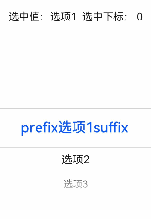
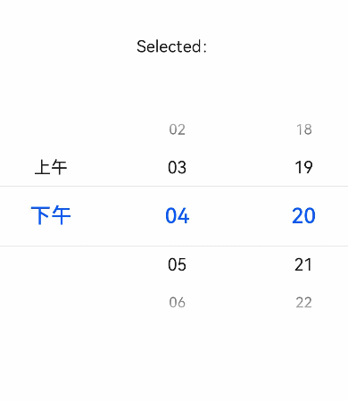
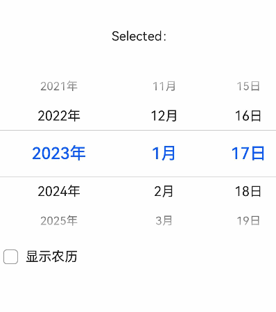
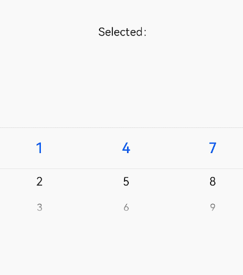

# picker-view

>  **说明：**
>  从API version 4开始支持。后续版本如有新增内容，则采用上角标单独标记该内容的起始版本。

嵌入页面的滑动选择器。


## 子组件

不支持。


## 属性

除支持[通用属性](js-components-common-attributes.md)外，还支持如下属性：

| 名称   | 类型     | 默认值  | 必填   | 描述                                       |
| ---- | ------ | ---- | ---- | ---------------------------------------- |
| type | string | text | 否    | 设置滑动选择器的类型，该属性不支持动态修改，可选项有：<br/>-&nbsp;text：文本选择器。<br/>-&nbsp;time：时间选择器。<br/>-&nbsp;date：日期选择器。<br/>-&nbsp;datetime：日期时间选择器。<br/>-&nbsp;multi-text：多列文本选择器。 |

### 文本选择器

| 名称              | 类型     | 默认值  | 必填   | 描述                                       |
| --------------- | ------ | ---- | ---- | ---------------------------------------- |
| range           | Array  | -    | 否    | 设置文本选择器的取值范围。<br/>使用时需要使用数据绑定的方式`range ={{data}}`，js中声明相应变量`data：["15","20","25"]`。 |
| selected        | string | 0    | 否    | 设置文本选择器的默认选择值，该值需要为range的索引。             |
| indicatorprefix | string | -    | 否    | 文本选择器选定值增加的前缀字段。                         |
| indicatorsuffix | string | -    | 否    | 文本选择器选定值增加的后缀字段。                         |

### 时间选择器

| 名称            | 类型      | 默认值                                 | 必填   | 描述                                       |
| ------------- | ------- | ----------------------------------- | ---- | ---------------------------------------- |
| containsecond | boolean | false                               | 否    | 时间选择器是否包含秒。                              |
| selected      | string  | 当前时间                                | 否    | 设置时间选择器的默认取值，格式为&nbsp;HH:mm；<br/>当包含秒时，格式为HH:mm:ss。 |
| hours         | number  | 24<sup>1-4</sup><br/>-<sup>5+</sup> | 否    | 设置时间选择器采用的时间格式，可选值：<br/>-&nbsp;12：按照12小时制显示，用上午和下午进行区分；<br/>-&nbsp;24：按照24小时制显示。<br/>从API Version 5开始，默认值会依据系统当前所选地区和语言选择当地习惯的小时制(12小时制或24小时制)。 |

### 日期选择器

| 名称                 | 类型           | 默认值        | 必填   | 描述                                       |
| ------------------ | ------------ | ---------- | ---- | ---------------------------------------- |
| start              | &lt;time&gt; | 1970-1-1   | 否    | 设置日期选择器的起始时间，格式为&nbsp;YYYY-MM-DD。        |
| end                | &lt;time&gt; | 2100-12-31 | 否    | 设置日期选择器的结束时间，格式为&nbsp;YYYY-MM-DD。        |
| selected           | string       | 当前日期       | 否    | 设置日期选择器的默认选择值，格式为&nbsp;YYYY-MM-DD。       |
| lunar<sup>5+</sup> | boolean      | false      | 否    | 设置日期选择器弹窗界面是否为农历展示。                      |
| lunarswitch        | boolean      | false      | 否    | 设置日期选择器是否显示农历开关，显示农历开关时，可以在弹窗界面展现农历的开关由于公历和农历切换。在设置显示农历时，开关状态为开，当设置不显示农历时，开关状态为关。 |

### 日期时间选择器

| 名称                 | 类型      | 默认值                                 | 必填   | 描述                                       |
| ------------------ | ------- | ----------------------------------- | ---- | ---------------------------------------- |
| selected           | string  | 当前日期时间                              | 否    | 设置日期时间选择器的默认取值，格式有两种，为月日时分MM-DD-HH-mm或者年月日时分YYYY-MM-DD-HH-mm，不设置年时，默认使用当前年，该取值表示选择器弹窗时弹窗界面的默认选择值。 |
| hours              | number  | 24<sup>1-4</sup><br/>-<sup>5+</sup> | 否    | 设置日期时间选择器采用的时间格式，可选值：<br/>-&nbsp;12：按照12小时制显示，用上午和下午进行区分；<br/>-&nbsp;24：按照24小时制显示。<br/>从API Version 5开始，默认值会依据系统当前所选地区和语言选择当地习惯的小时制(12小时制或24小时制)。 |
| lunar<sup>5+</sup> | boolean | false                               | 否    | 设置日期时间选择器弹窗界面是否为农历展示。                    |
| lunarswitch        | boolean | false                               | 否    | 设置日期时间选择器是否显示农历开关，显示农历开关时，可以在弹窗界面展现农历的开关由于公历和农历切换。在设置显示农历时，开关状态为开，当设置不显示农历时，开关状态为关。 |

### 多列文本选择器

| 名称       | 类型      | 默认值       | 必填   | 描述                                       |
| -------- | ------- | --------- | ---- | ---------------------------------------- |
| columns  | number  | -         | 是    | 设置多列文本选择器的列数。                            |
| range    | 二维Array | -         | 否    | 设置多列文本选择器的选择值，该值为二维数组。长度表示多少列，数组的每项表示每列的数据，如&nbsp;&nbsp;[["a","b"],&nbsp;["c","d"]]。<br/>使用时需要使用数据绑定的方式`range ={{data}}`，js中声明相应变量`data：["15","20","25"]`。 |
| selected | Array   | [0,0,0,…] | 否    | 设置多列文本选择器的默认值，每一列被选中项对应的索引构成的数组，该取值表示选择器弹窗时弹窗界面的默认选择值。 |


## 样式

除支持[通用样式](js-components-common-styles.md)外，还支持如下样式：

| 名称                               | 类型             | 默认值        | 必填   | 描述                                       |
| -------------------------------- | -------------- | ---------- | ---- | ---------------------------------------- |
| color                            | &lt;color&gt;  | \#ffffff   | 否    | 候选项字体颜色。                                 |
| font-size                        | &lt;length&gt; | 16px       | 否    | 候选项字体尺寸，类型length，单位px。                   |
| selected-color                   | &lt;color&gt;  | #ff0a69f7  | 否    | 选中项字体颜色。                                 |
| selected-font-size               | &lt;length&gt; | 20px       | 否    | 选中项字体尺寸，类型length，单位px。                   |
| disappear-color<sup>5+</sup>     | &lt;color&gt;  | \#ffffff   | 否    | 渐变消失项的字体颜色。消失项是在一列中有五个选项场景下最上和最下的两个选项。   |
| disappear-font-size<sup>5+</sup> | &lt;length&gt; | 14px       | 否    | 渐变消失项的字体尺寸。消失项是在一列中有五个选项场景下最上和最下的两个选项。   |
| font-family                      | string         | sans-serif | 否    | 选项字体类型。字体列表，用逗号分隔，每个字体用字体名或者字体族名设置。列表中第一个系统中存在的或者通过[自定义字体](js-components-common-customizing-font.md)指定的字体，会被选中作为文本的字体。 |


## 事件

仅支持如下事件：

### 文本选择器

| 名称     | 参数                                       | 描述              |
| ------ | ---------------------------------------- | --------------- |
| change | {&nbsp;newValue:&nbsp;newValue,&nbsp;newSelected:&nbsp;newSelected&nbsp;} | 文本选择器选定值后触发该事件。 |

### 时间选择器

| 名称     | 参数                                       | 描述                              |
| ------ | ---------------------------------------- | ------------------------------- |
| change | {&nbsp;hour:&nbsp;hour,&nbsp;minute:&nbsp;minute,&nbsp;[second:second]} | 时间选择器选定值后触发该事件。<br/>包含秒时，返回时分秒。 |

### 日期选择器

| 名称     | 参数                                       | 描述              |
| ------ | ---------------------------------------- | --------------- |
| change | {&nbsp;year:year,&nbsp;month:month,&nbsp;day:day&nbsp;} | 日期选择器选择值后触发该事件。 |

### 日期时间选择器

| 名称     | 参数                                       | 描述                |
| ------ | ---------------------------------------- | ----------------- |
| change | {&nbsp;year:year,&nbsp;month:month,&nbsp;day:day,&nbsp;&nbsp;hour:hour,&nbsp;minute:minute&nbsp;} | 日期时间选择器选择值后触发该事件。 |

### 多列文本选择器

| 名称           | 参数                                       | 描述                                       |
| ------------ | ---------------------------------------- | ---------------------------------------- |
| columnchange | {&nbsp;column:column,&nbsp;newValue:newValue,&nbsp;newSelected:newSelected&nbsp;} | 多列文本选择器某一列的值改变时触发该事件，column：第几列修改，newValue：选中的值，newSelected：选中值对应的索引。 |


## 方法

不支持。


## 示例
### 文本选择器

```html
<!-- xxx.hml -->
<div class="container">
    <text class="title">
        选中值：{{value}}  选中下标： {{index}}
    </text>
    <picker-view class="text-picker" type="text" range="{{options}}" selected="0" indicatorprefix="prefix" indicatorsuffix="suffix" @change="handleChange"></picker-view>
</div>
```

```css
/* xxx.css */
.container {
    flex-direction: column;
    justify-content: center;
    align-items: center;
    width: 100%;
    height: 50%;
}
.title {
    font-size: 30px;
    text-align: center;
    margin-top: 50%;
}
```

```js
/* xxx.js */
export default {
    data: {
        options: ['选项1', '选项2', '选项3'],
        value: "选项1",
        index: 0
    },
    handleChange(data) {
        this.value = data.newValue;
        this.index = data.newSelected;
    },
}
```


### 时间选择器

```html
<!-- xxx.hml -->
<div class="container">
  <text class="title">
    Selected：{{time}}
  </text>
  <picker-view class="time-picker" type="time" selected="{{defaultTime}}" @change="handleChange"></picker-view>
</div>
```

```css
/* xxx.css */
.container {
    flex-direction: column;
    justify-content: center;
    align-items: center;
    width: 100%;
    height: 50%;
}
.title {
    font-size: 31px;
    text-align: center;
    margin-top: 50%;
}
```

```js
/* xxx.js */
export default {
  data: {
    defaultTime: "",
    time: "",
  },
  onInit() {
    this.defaultTime = this.now();
  },
  handleChange(data) {
    this.time = this.concat(data.hour, data.minute);
  },
  now() {
    const date = new Date();
    const hours = date.getHours();
    const minutes = date.getMinutes();
    return this.concat(hours, minutes);
  },
  fill(value) {
    return (value > 9 ? "" : "0") + value;
  },
  concat(hours, minutes) {
    return `${this.fill(hours)}:${this.fill(minutes)}`;
  },
}
```



### 日期选择器

```html
<!-- xxx.hml -->
<div class="container">
    <text class="title">
        Selected：{{date}}
    </text>
    <picker-view class="time-picker" type="date" selected="{{defaultTime}}" @change="handleChange" lunarswitch="true"></picker-view>
</div>
```

```css
/* xxx.css */
.container {
    flex-direction: column;
    justify-content: center;
    align-items: center;
    width: 100%;
    height: 50%;
}
.title {
    font-size: 31px;
    text-align: center;
    margin-top: 50%;
}
```

```js
/* xxx.js */
export default {
    data: {
        date: "",
    },
    handleChange(data) {
        this.date = data.year + "年" + data.month + "月" + data.day + "日";
    },
}
```


### 日期时间选择器

```html
<!-- xxx.hml -->
<div class="container">
    <text class="title">
        Selected：{{datetime}}
    </text>
    <picker-view class="date-picker" type="datetime"  hours="24" lunarswitch="true" @change="handleChange"></picker-view>
</div>
```

```css
/* xxx.css */
.container {
    flex-direction: column;
    justify-content: center;
    align-items: center;
    width: 100%;
    height: 50%;
}
.title {
    font-size: 31px;
    text-align: center;
    margin-top: 50%;
}
```

```js
/* xxx.js */
export default {
    data: {
        datetime: "",
    },
    handleChange(data) {
        this.datetime = data.year + "年" + data.month + "月" + data.day + "日" + data.hour + "时" + data.minute + "分";
    },
}
```


### 多列文本选择器

```html
<!-- xxx.hml -->
<div class="container">
    <text class="title">
        Selected：{{ value }}
    </text>
    <picker-view class="multitype-picker" type="multi-text" columns="3" range="{{ multitext }}" @columnchange="handleChange"></picker-view>
</div>
```

```css
/* xxx.css */
.container {
    flex-direction: column;
    justify-content: center;
    align-items: center;
    width: 100%;
    height: 50%;
}
.title {
    font-size: 31px;
    text-align: center;
    margin-top: 50%;
}
```

```js
/* xxx.js */
export default {
    data: {
        multitext: [
            [1, 2, 3],
            [4, 5, 6],
            [7, 8, 9],
        ],
        value: ""
    },
    handleChange(data) {
        this.value = data.column + "列，" + "值为" + data.newValue + "，下标为" + data.newSelected;
    },
}
```
