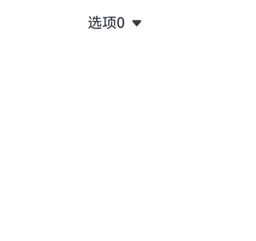

# select

下拉选择按钮，可使用下拉菜单展示并选择内容。

>  **说明：**
>
>  从API version 4开始支持。后续版本如有新增内容，则采用上角标单独标记该内容的起始版本。


## 子组件

支持&lt;[option](js-components-basic-option.md)&gt;。


## 属性

支持[通用属性](js-components-common-attributes.md)。


## 样式

除支持[通用样式](js-components-common-styles.md)外，还支持如下样式：

| 名称        | 类型   | 必填 | 描述                                                         |
| ----------- | ------ | ---- | ------------------------------------------------------------ |
| font-family | string | 否   | 字体样式列表，用逗号分隔。列表中第一个系统中存在的字体样式或者通过[自定义字体](./js-components-common-customizing-font.md)指定的字体样式，会被选中作为当前文本的字体样式。<br/>默认值：sans-serif |


## 事件

除支持[通用事件](js-components-common-events.md)外，还支持如下事件：

| 名称   | 参数                      | 描述                                                         |
| ------ | ------------------------- | ------------------------------------------------------------ |
| change | {newValue:&nbsp;newValue} | 选择下拉选项后触发该事件，返回值为一个对象，其中newValue为选中项option的value值。 |

>  **说明：**
>
>  select组件不支持click事件。


## 方法

支持[通用方法](js-components-common-methods.md)。


## 示例

```html
<!-- xxx.hml -->
<div class="container">
    <select @change="onChange">
        <option for="{{ array }}" value="{{ $item.value }}">
            {{ $item.name }}
        </option>
    </select>
</div>
```

```css
/* xxx.css */
.container {
    display: flex;
    justify-content: center;
    align-items: center;
    width: 100%;
    height: 100%;
}
```

```js
// xxx.js
export default {
    data: {
        array: [
            {
                "value": "下拉选项0", "name": "选项0"
            },
            {
                "value": "下拉选项1", "name": "选项1"
            },
            {
                "value": "下拉选项2", "name": "选项2"
            },
            {
                "value": "下拉选项3", "name": "选项3"
            },
        ]
    },
    getData() {
        let other = [
            {
                "value": "下拉选项a", "name": "选项a"
            },
            {
                "value": "下拉选项b", "name": "选项b"
            },
            {
                "value": "下拉选项c", "name": "选项c"
            },
            {
                "value": "下拉选项d", "name": "选项d"
            },
        ]
        return other
    },
    onChange() {
        this.array = this.getData()
    }
}
```

