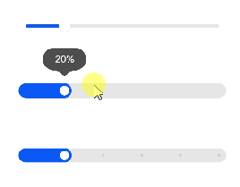

# slider

>  **说明：**
>
> 从API version 4开始支持。后续版本如有新增内容，则采用上角标单独标记该内容的起始版本。

滑动条组件，用来快速调节设置值，如音量、亮度等。


## 子组件

不支持。


## 属性

除支持[通用属性](js-components-common-attributes.md)外，还支持如下属性：

| 名称 | 类型 | 默认值 | 必填 | 描述 |
| -------- | -------- | -------- | -------- | -------- |
| min | number | 0 | 否 | 滑动选择器的最小值。 |
| max | number | 100 | 否 | 滑动选择器的最大值。 |
| step | number | 1 | 否 | 每次滑动的步长。 |
| value | number | 0 | 否 | 滑动选择器的初始值。 |
| mode<sup>5+</sup> | string | outset | 否 | 滑动条样式：<br/>-&nbsp;outset：滑块在滑杆上；<br/>-&nbsp;inset：滑块在滑杆内。 |
| showsteps<sup>5+</sup> | boolean | false | 否 | 是否显示步长标识。true表示显示步长标识，false表示不显示步长标识。 |
| showtips<sup>5+</sup> | boolean | false | 否 | 滑动时是否有气泡提示百分比。true表示有气泡提示百分比，false表示没有气泡提示百分比。 |


## 样式

除支持[通用样式](js-components-common-styles.md)外，还支持如下样式：

| 名称 | 类型 | 默认值 | 必填 | 描述 |
| -------- | -------- | -------- | -------- | -------- |
| color | &lt;color&gt; | #19000000 | 否 | 滑动条的背景颜色。 |
| selected-color | &lt;color&gt; | #ff007dff | 否 | 滑动条的已选择颜色。 |
| block-color | &lt;color&gt; | \#ffffff | 否 | 滑动条的滑块颜色。 |


## 事件

除支持[通用事件](js-components-common-events.md)外，还支持如下事件：

| 名称 | 参数 | 描述 |
| -------- | -------- | -------- |
| change | ChangeEvent | 选择值发生变化时触发该事件。 |

**表1** ChangeEvent

| 属性 | 类型 | 说明 |
| -------- | -------- | -------- |
| value<sup>5+</sup> | number | 当前slider的进度值。 |
| mode<sup>5+</sup> | string | 当前change事件的类型，可选值为：<br/>-&nbsp;start：slider的值开始改变。<br/>-&nbsp;move：slider的值跟随手指拖动中。<br/>-&nbsp;end：slider的值结束改变。<br/>-&nbsp;click：slider的值在点击进度条后改变。 |


## 示例

```html
<!-- xxx.hml -->
<div class="container">
    <slider min="0" max="100" value="{{ value }}" mode="outset" showtips="true"></slider>
    <slider class="" min="0" max="100" value="{{ value }}" step="20" mode="inset"  showtips="true"></slider>
    <slider class="" min="0" max="100" value="{{ value }}" showsteps="true" step="20" mode="inset"  showtips="false"></slider>
</div>
```

```css
/* xxx.css */
.container {
    flex-direction: column;
    justify-content: center;
    align-items: center;
}
slider{
    margin-top: 100px;
}
```





