# CanvasRenderingContext2D对象
<!--Kit: ArkUI-->
<!--Subsystem: ArkUI-->
<!--Owner: @sd-wu-->
<!--Designer: @sunbees-->
<!--Tester: @liuli0427-->
<!--Adviser: @HelloCrease-->

>  **说明：**
>
>  从API version 4开始支持。后续版本如有新增内容，则采用上角标单独标记该内容的起始版本。

使用CanvasRenderingContext2D在canvas画布组件上进行绘制，绘制对象可以是矩形、文本、图片等。


**示例：** 
  ```html
  <!-- xxx.hml -->
  <div>
    <canvas ref="canvas1" style="width: 200px; height: 150px; background-color: #ffff00;"></canvas>
    <input type="button" style="width: 180px; height: 60px;" value="handleClick" onclick="handleClick" />
    <input type="button" style="width: 180px; height: 60px;" value="antialias" onclick="antialias" />
  </div>
  ```

  ```js
  // xxx.js
  export default {
    handleClick() {
      const el = this.$refs.canvas1;
      const ctx = el.getContext('2d');
      ctx.beginPath();
      ctx.arc(100, 75, 50, 0, 6.28);
      ctx.stroke();
    },
    antialias() {
      const el = this.$refs.canvas1;
      const ctx = el.getContext('2d', { antialias: true });
      ctx.beginPath();   
      ctx.arc(100, 75, 50, 0, 6.28);
      ctx.stroke(); 
      }
    }
  ```

- 示意图（关闭抗锯齿）

  

- 示意图（开启抗锯齿）

  


## 属性

| 名称                                       | 类型                                       | 描述                                       |
| ---------------------------------------- | ---------------------------------------- | ---------------------------------------- |
| [fillStyle](#fillstyle)                  | &lt;color&gt;&nbsp;\|&nbsp;[CanvasGradient](js-components-canvas-canvasgradient.md)&nbsp;\|&nbsp;CanvasPattern | 指定绘制的填充色。<br/>-&nbsp;类型为&lt;color&gt;时，表示设置填充区域的颜色。<br/>-&nbsp;类型为CanvasGradient时，表示渐变对象，使用&nbsp;createLinearGradient()方法创建。<br/>-&nbsp;类型为CanvasPattern时，使用&nbsp;createPattern()方法创建。 |
| [lineWidth](#linewidth)                  | number                                   | 设置绘制线条的宽度。                               |
| [strokeStyle](#strokestyle)              | &lt;color&gt;&nbsp;\|&nbsp;[CanvasGradient](js-components-canvas-canvasgradient.md)&nbsp;\|&nbsp;CanvasPattern | 设置描边的颜色。<br/>-&nbsp;类型为&lt;color&gt;时，表示设置描边使用的颜色。<br/>-&nbsp;类型为CanvasGradient时，表示渐变对象，使用&nbsp;createLinearGradient()方法创建。<br/>-&nbsp;类型为CanvasPattern时，使用&nbsp;createPattern()方法创建。 |
| [lineCap](#linecap)                      | string                                   | 指定线端点的样式，可选值为：<br/>-&nbsp;butt：线端点以方形结束。<br/>-&nbsp;round：线端点以圆形结束。<br/>-&nbsp;square：线端点以方形结束，该样式下会增加一个长度和线段厚度相同，宽度是线段厚度一半的矩形。<br>默认值：butt |
| [lineJoin](#linejoin)                    | string                                   | 指定线段间相交的交点样式，可选值为：<br/>-&nbsp;round：在线段相连处绘制一个扇形，扇形的圆角半径是线段的宽度。<br/>-&nbsp;bevel：在线段相连处使用三角形为底填充，&nbsp;每个部分矩形拐角独立。<br/>-&nbsp;miter：在相连部分的外边缘处进行延伸，使其相交于一点，形成一个菱形区域，该属性可以通过设置miterLimit属性展现效果。<br>默认值：miter |
| [miterLimit](#miterlimit)                | number                                   | 设置斜接面限制值，该值指定了线条相交处内角和外角的距离。<br>默认值：10   |
| [font](#font)                            | string                                   | 设置文本绘制中的字体样式。<br/>语法：ctx.font="font-style&nbsp;font-weight&nbsp;font-size&nbsp;font-family"<sup>5+</sup><br/>-&nbsp;font-style(可选)，用于指定字体样式，支持如下几种样式：normal,&nbsp;italic。<br/>-&nbsp;font-weight(可选)，用于指定字体的粗细，支持如下几种类型：normal,&nbsp;bold,&nbsp;bolder,&nbsp;lighter,&nbsp;100,&nbsp;200,&nbsp;300,&nbsp;400,&nbsp;500,&nbsp;600,&nbsp;700,&nbsp;800,&nbsp;900。<br/>-&nbsp;font-size(可选)，指定字号和行高，单位只支持px。<br/>-&nbsp;font-family(可选)，指定字体系列，支持如下几种类型：sans-serif,&nbsp;serif,&nbsp;monospace。<br>默认值："normal&nbsp;normal&nbsp;14px&nbsp;sans-serif" |
| [textAlign](#textalign)                  | string                                   | 设置文本绘制中的文本对齐方式，可选值为：<br/>-&nbsp;left：文本左对齐。<br/>-&nbsp;right：文本右对齐。<br/>-&nbsp;center：文本居中对齐。<br/>-&nbsp;start：文本对齐界线开始的地方。<br/>-&nbsp;end：文本对齐界线结束的地方。<br/>ltr布局模式下start和left一致，rtl布局模式下start和right一致。<br>默认值：left |
| [textBaseline](#textbaseline)            | string                                   | 设置文本绘制中的水平对齐方式，可选值为：<br/>-&nbsp;alphabetic：文本基线是标准的字母基线。<br/>-&nbsp;top：文本基线在文本块的顶部。<br/>-&nbsp;hanging：文本基线是悬挂基线。<br/>-&nbsp;middle：文本基线在文本块的中间。<br/>-&nbsp;ideographic：文字基线是表意字基线；如果字符本身超出了alphabetic&nbsp;基线，那么ideographic基线位置在字符本身的底部。<br/>-&nbsp;bottom：文本基线在文本块的底部。&nbsp;与&nbsp;ideographic&nbsp;基线的区别在于&nbsp;ideographic&nbsp;基线不需要考虑下行字母。<br>默认值： alphabetic |
| [globalAlpha](#globalalpha)              | number                                   | 设置透明度，0.0为完全透明，1.0为完全不透明。                |
| [lineDashOffset](#linedashoffset)        | number                                   | 设置画布的虚线偏移量，精度为float。<br>默认值：0.0          |
| [globalCompositeOperation](#globalcompositeoperation) | string                                   | 设置合成操作的方式。类型字段可选值有source-over，source-atop，source-in，source-out，destination-over，destination-atop，destination-in，destination-out，lighter，copy，xor。具体请参考[表 类型字段说明](#globalcompositeoperation)。<br>默认值：source-over |
| [shadowBlur](#shadowblur)                | number                                   | 设置绘制阴影时的模糊级别，值越大越模糊，精度为float。<br>默认值：0.0 |
| [shadowColor](#shadowcolor)              | &lt;color&gt;                            | 设置绘制阴影时的阴影颜色。                            |
| [shadowOffsetX](#shadowoffsetx)          | number                                   | 设置绘制阴影时和原有对象的水平偏移值。                      |
| [shadowOffsetY](#shadowoffsety)          | number                                   | 设置绘制阴影时和原有对象的垂直偏移值。                      |
| [imageSmoothingEnabled](#imagesmoothingenabled6)<sup>6+</sup> | boolean                                  | 用于设置绘制图片时是否进行图像平滑度调整，true为启用，false为不启用。<br>默认值：true |


### fillStyle

  ```html
<!-- xxx.hml -->
<div>
  <canvas ref="canvas" style="width: 200px; height: 150px; "></canvas>
</div>
  ```

```js
// xxx.js
export default {
  onShow() {
    const el = this.$refs.canvas;
    const ctx = el.getContext('2d');
    ctx.fillStyle = '#0000ff';
    ctx.fillRect(20, 20, 150, 100);
  }
}
```


### lineWidth

```html
<!-- xxx.hml -->
<div>
  <canvas ref="canvas" style="width: 200px; height: 150px; "></canvas>
</div>
```

```js
// xxx.js
export default {
  onShow() {
    const el = this.$refs.canvas;
    const ctx = el.getContext('2d');
    ctx.lineWidth = 5;
    ctx.strokeRect(25, 25, 85, 105);
  }
}

```


### strokeStyle

```html
<!-- xxx.hml -->
<div>
  <canvas ref="canvas" style="width: 200px; height: 150px; "></canvas>
</div>
```

```js
// xxx.js
export default {
  onShow() {
    const el = this.$refs.canvas;
    const ctx = el.getContext('2d');
    ctx.lineWidth = 10;
    ctx.strokeStyle = '#0000ff';
    ctx.strokeRect(25, 25, 155, 105);
  }
}
```


### lineCap

```html
<!-- xxx.hml -->
<div>
  <canvas ref="canvas" style="width: 200px; height: 150px; "></canvas>
</div>
```

```js
// xxx.js
export default {
  onShow() {
    const el = this.$refs.canvas;
    const ctx = el.getContext('2d');
    ctx.lineWidth = 8;
    ctx.beginPath();
    ctx.lineCap = 'round';
    ctx.moveTo(30, 50);
    ctx.lineTo(220, 50);
    ctx.stroke();
  }
}
```

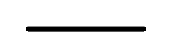

### lineJoin

```html
<!-- xxx.hml -->
<div>
  <canvas ref="canvas" style="width: 200px; height: 150px; "></canvas>
</div>
```

```js 
// xxx.js
export default {
  onShow() {
    const el = this.$refs.canvas;
    const ctx = el.getContext('2d');
    ctx.beginPath();
    ctx.lineWidth = 8;
    ctx.lineJoin = 'miter';
    ctx.moveTo(30, 30);
    ctx.lineTo(120, 60);
    ctx.lineTo(30, 110);
    ctx.stroke();
  }
}
```

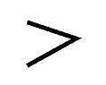

### miterLimit

```html
<!-- xxx.hml -->
<div>
  <canvas ref="canvas" style="width: 500px; height: 500px; "></canvas>
</div>
```

```js
// xxx.js
export default {
  onShow() {
    const el = this.$refs.canvas;
    const ctx = el.getContext('2d');
    ctx.lineWidth =14;
    ctx.lineJoin = 'miter';
    ctx.miterLimit = 3;
    ctx.moveTo(30, 30);
    ctx.lineTo(120, 60);
    ctx.lineTo(30, 70);
    ctx.stroke();
  }
}
```


### font

```html
<!-- xxx.hml -->
<div>
  <canvas ref="canvas" style="width: 200px; height: 150px; "></canvas>
</div>
```

```js
// xxx.js
export default {
  onShow() {
    const el = this.$refs.canvas;
    const ctx = el.getContext('2d');
    ctx.font = '30px sans-serif';
    ctx.fillText("Hello World", 20, 60);
  }
}
```


### textAlign

```html
<!-- xxx.hml -->
<div>
  <canvas ref="canvas" style="width: 200px; height: 150px; "></canvas>
</div>
```

```js
// xxx.js
export default {
  onShow() {
    const el = this.$refs.canvas;
    const ctx = el.getContext('2d');
    ctx.strokeStyle = '#0000ff';
    ctx.moveTo(140, 10);
    ctx.lineTo(140, 160);
    ctx.stroke();
    ctx.font = '18px sans-serif'; 
    // Show the different textAlign values
    ctx.textAlign = 'start'; 
    ctx.fillText('textAlign=start', 140, 60);
    ctx.textAlign = 'end';
    ctx.fillText('textAlign=end', 140, 80);
    ctx.textAlign = 'left'; 
    ctx.fillText('textAlign=left', 140, 100);
    ctx.textAlign = 'center'; 
    ctx.fillText('textAlign=center',140, 120);
    ctx.textAlign = 'right';
    ctx.fillText('textAlign=right',140, 140);
  }
}

```


### textBaseline

```html
<!-- xxx.hml -->
<div>
  <canvas ref="canvas" style="width: 500px; height: 500px; "></canvas>
</div>
```

```js
// xxx.js
export default {
  onShow() {
    const el = this.$refs.canvas;
    const ctx = el.getContext('2d');
    ctx.strokeStyle = '#0000ff';
    ctx.moveTo(0, 120);
    ctx.lineTo(400, 120);
    ctx.stroke();
    ctx.font = '20px sans-serif';
    ctx.textBaseline = 'top'; 
    ctx.fillText('Top', 10, 120); 
    ctx.textBaseline = 'bottom'; 
    ctx.fillText('Bottom', 55, 120); 
    ctx.textBaseline = 'middle'; 
    ctx.fillText('Middle', 125, 120); 
    ctx.textBaseline = 'alphabetic'; 
    ctx.fillText('Alphabetic', 195, 120); 
    ctx.textBaseline = 'hanging'; 
    ctx.fillText('Hanging', 295, 120);
  }
}
```


### globalAlpha

```html
<!-- xxx.hml -->
<div>
  <canvas ref="canvas" style="width: 200px; height: 150px; "></canvas>
</div>
```

```js
// xxx.js
export default {
  onShow() {
    const el = this.$refs.canvas;
    const ctx = el.getContext('2d');
    ctx.fillStyle = 'rgb(255,0,0)';
    ctx.fillRect(0, 0, 50, 50);
    ctx.globalAlpha = 0.4;
    ctx.fillStyle = 'rgb(0,0,255)'; 
    ctx.fillRect(50, 50, 50, 50);

  }
}
```

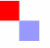

### lineDashOffset

```html
<!-- xxx.hml -->
<div>
  <canvas ref="canvas" style="width: 200px; height: 150px; background-color: #ffff00;"></canvas>
</div>
```

```js
// xxx.js
export default {
  onShow() {
    const el = this.$refs.canvas;
    const ctx = el.getContext('2d');
    ctx.arc(100, 75, 50, 0, 6.28);
    ctx.setLineDash([10,20]);
    ctx.lineDashOffset = 10.0;
    ctx.stroke();
  }
}
```


### globalCompositeOperation

类型字段说明。

| 值                | 描述                       |
| ---------------- | ------------------------ |
| source-over      | 在现有绘制内容上显示新绘制内容，属于默认值。   |
| source-atop      | 在现有绘制内容顶部显示新绘制内容。        |
| source-in        | 在现有绘制内容中显示新绘制内容。         |
| source-out       | 在现有绘制内容之外显示新绘制内容。        |
| destination-over | 在新绘制内容上方显示现有绘制内容。        |
| destination-atop | 在新绘制内容顶部显示现有绘制内容。        |
| destination-in   | 在新绘制内容中显示现有绘制内容。         |
| destination-out  | 在新绘制内容外显示现有绘制内容。         |
| lighter          | 显示新绘制内容和现有绘制内容。          |
| copy             | 显示新绘制内容而忽略现有绘制内容。        |
| xor              | 使用异或操作对新绘制内容与现有绘制内容进行融合。 |

**示例：** 

```html
<!-- xxx.hml -->
<div>
  <canvas ref="canvas" style="width: 200px; height: 150px; "></canvas>
</div>
```

  ```js
// xxx.js
export default {
  onShow() {
    const el = this.$refs.canvas;
    const ctx = el.getContext('2d');
    ctx.fillStyle = 'rgb(255,0,0)';
    ctx.fillRect(20, 20, 50, 50);
    ctx.globalCompositeOperation = 'source-over';
    ctx.fillStyle = 'rgb(0,0,255)';
    ctx.fillRect(50, 50, 50, 50);
    // Start drawing second example
    ctx.fillStyle = 'rgb(255,0,0)';
    ctx.fillRect(120, 20, 50, 50);
    ctx.globalCompositeOperation = 'destination-over';
    ctx.fillStyle = 'rgb(0,0,255)';
    ctx.fillRect(150, 50, 50, 50);
  }
}
  ```

  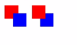

  示例中，新绘制内容是蓝色矩形，现有绘制内容是红色矩形。

### shadowBlur

  ```html
<!-- xxx.hml -->
<div>
  <canvas ref="canvas" style="width: 200px; height: 150px; "></canvas>
</div>
  ```

```js
// xxx.js
export default {
  onShow() {
    const el = this.$refs.canvas;
    const ctx = el.getContext('2d');
    ctx.shadowBlur = 30;
    ctx.shadowColor = 'rgb(0,0,0)';
    ctx.fillStyle = 'rgb(255,0,0)';
    ctx.fillRect(20, 20, 100, 80);
  }
}
```

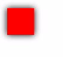

### shadowColor

```html
<!-- xxx.hml -->
<div>
  <canvas ref="canvas" style="width: 200px; height: 150px;"></canvas>
</div>
```

```js
// xxx.js
export default {
  onShow() {
    const el = this.$refs.canvas;
    const ctx = el.getContext('2d');
    ctx.shadowBlur = 30;
    ctx.shadowColor = 'rgb(0,0,255)';
    ctx.fillStyle = 'rgb(255,0,0)';
    ctx.fillRect(30, 30, 100, 100);
  }
}
```


### shadowOffsetX

```html
<!-- xxx.hml -->
<div>
  <canvas ref="canvas" style="width: 200px; height: 150px;"></canvas>
</div>
```

```js
// xxx.js
export default {
  onShow() {
    const el = this.$refs.canvas;
    const ctx = el.getContext('2d');
    ctx.shadowBlur = 10;
    ctx.shadowOffsetX = 20;
    ctx.shadowColor = 'rgb(0,0,0)';
    ctx.fillStyle = 'rgb(255,0,0)';
    ctx.fillRect(20, 20, 100, 80);
  }
}
```


### shadowOffsetY

```html
<!-- xxx.hml -->
<div>
  <canvas ref="canvas" style="width: 200px; height: 150px; "></canvas>
</div>
```

```js
// xxx.js
export default {
  onShow() {
    const el = this.$refs.canvas;
    const ctx = el.getContext('2d');
    ctx.shadowBlur = 10;
    ctx.shadowOffsetY = 20;
    ctx.shadowColor = 'rgb(0,0,0)';
    ctx.fillStyle = 'rgb(255,0,0)';
    ctx.fillRect(30, 30, 100, 100);
 }
}
```


### imageSmoothingEnabled<sup>6+</sup>

```html
<!-- xxx.hml -->
<div>
  <canvas ref="canvas" style="width: 200px; height: 150px; "></canvas>
</div>
```

```js
// xxx.js
export default {
  onShow() {
    const el = this.$refs.canvas;
    const ctx = el.getContext('2d');
    var img = new Image();
    // 'common/image/example.jpg'需要替换为开发者所需的图像资源文件
    img.src = 'common/image/example.jpg';
    img.onload = function() {
    ctx.imageSmoothingEnabled = false;
    ctx.drawImage(img, 0, 0, 400, 200);
    };
  }
}
```


## 方法

### fillRect

fillRect(x: number, y: number, width:number, height: number): void

填充一个矩形。

**系统能力：** SystemCapability.ArkUI.ArkUI.Full

**参数：** 

| 参数名 | 类型    | 必填 | 说明                         |
| ------ | ------- | ---- | ---------------------------- |
| x      | number | 是 | 指定矩形左上角点的x坐标。 |
| y      | number | 是 | 指定矩形左上角点的y坐标。 |
| width  | number | 是 | 指定矩形的宽度。      |
| height | number | 是 | 指定矩形的高度。      |

**示例：** 

```html
  <!-- xxx.hml -->
  <div>
    <canvas ref="canvas" style="width: 500px; height: 500px; background-color: #ffff00;"></canvas>
  </div>
```

  ```js
  //xxx.js
  export default {
    onShow() {
      const el = this.$refs.canvas;
      const ctx = el.getContext('2d');
      ctx.fillRect(20, 20, 200, 150);
    }
  }
  ```

  

### clearRect

clearRect(x: number, y: number, width:number, height: number): void

删除指定区域内的绘制内容。

**系统能力：** SystemCapability.ArkUI.ArkUI.Full

**参数：** 

| 参数名 | 类型    | 必填 | 说明                         |
| ------ | ------- | ---- | ---------------------------- |
| x      | number | 是 | 指定矩形上的左上角x坐标。 |
| y      | number | 是 | 指定矩形上的左上角y坐标。 |
| width  | number | 是 | 指定矩形的宽度。      |
| height | number | 是 | 指定矩形的高度。      |

**示例：** 
  ```html
  <!-- xxx.hml -->
  <div>
    <canvas ref="canvas" style="width: 500px; height: 500px; background-color: #ffff00;"></canvas>
  </div>
  ```

  ```js
  //xxx.js
  export default {
    onShow() {
      const el = this.$refs.canvas;
      const ctx = el.getContext('2d');
      ctx.fillStyle = 'rgb(0,0,255)';
      ctx.fillRect(0, 0, 400, 200);
      ctx.clearRect(20, 20, 150, 100);
    }
  }
  ```

  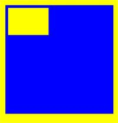


### strokeRect

strokeRect(x: number, y: number, width:number, height: number): void

绘制具有边框的矩形，矩形内部不填充。

**系统能力：** SystemCapability.ArkUI.ArkUI.Full

**参数：** 

| 参数名 | 类型    | 必填 | 说明                         |
| ------ | ------- | ---- | ---------------------------- |
| x      | number | 是 | 指定矩形的左上角x坐标。 |
| y      | number | 是 | 指定矩形的左上角y坐标。 |
| width  | number | 是 | 指定矩形的宽度。     |
| height | number | 是 | 指定矩形的高度。     |

**示例：** 
  ```html
  <!-- xxx.hml -->
  <div>
    <canvas ref="canvas" style="width: 200px; height: 150px; "></canvas>
  </div>
  ```

  ```js
  //xxx.js
  export default {
    onShow() {
      const el = this.$refs.canvas;
      const ctx = el.getContext('2d');
      ctx.strokeRect(30, 30, 200, 150);
    }
  }
  ```

  


### fillText

fillText(text: string, x: number, y: number): void

绘制填充类文本。

**系统能力：** SystemCapability.ArkUI.ArkUI.Full

**参数：** 

| 参数名 | 类型    | 必填 | 说明                         |
| ------ | ------- | ---- | ---------------------------- |
| text | string | 是 | 需要绘制的文本内容。      |
| x    | number | 是 | 需要绘制的文本的左下角x坐标。 |
| y    | number | 是 | 需要绘制的文本的左下角y坐标。 |

**示例：** 
  ```html
  <!-- xxx.hml -->
  <div>
    <canvas ref="canvas" style="width: 200px; height: 150px; "></canvas>
  </div>
  ```

  ```js
  //xxx.js
  export default {
    onShow() {
      const el = this.$refs.canvas;
      const ctx = el.getContext('2d');
      ctx.font = '35px sans-serif';
      ctx.fillText("Hello World!", 10, 60);
    }
  }
  ```

  

### strokeText

strokeText(text: string, x: number, y: number): void

绘制描边类文本。

**系统能力：** SystemCapability.ArkUI.ArkUI.Full

**参数：** 

| 参数名 | 类型    | 必填 | 说明                         |
| ------ | ------- | ---- | ---------------------------- |
| text | string | 是 | 需要绘制的文本内容。      |
| x    | number | 是 | 需要绘制的文本的左下角x坐标。 |
| y    | number | 是 | 需要绘制的文本的左下角y坐标。 |

**示例：** 
  ```html
  <!-- xxx.hml -->
  <div>
    <canvas ref="canvas" style="width: 200px; height: 150px; "></canvas>
  </div>
  ```

  ```js
  //xxx.js
  export default {
    onShow() {
      const el = this.$refs.canvas;
      const ctx = el.getContext('2d');
      ctx.font = '25px sans-serif';
      ctx.strokeText("Hello World!", 10, 60);
    }
  }
  ```

  

### measureText

measureText(text: string): TextMetrics

该方法返回一个文本测算的对象，通过该对象可以获取指定文本的宽度值。

**系统能力：** SystemCapability.ArkUI.ArkUI.Full

**参数：** 

| 参数名 | 类型    | 必填 | 说明                         |
| ------ | ------- | ---- | ---------------------------- |
| text | string | 是 | 需要进行测量的文本。 |

**返回值：** 

| 类型          | 说明                                     |
| ----------- | -------------------------------------- |
| TextMetrics | 包含指定字体的宽度，该宽度可以通过TextMetrics.width来获取。 |

**示例：** 
  ```html
  <!-- xxx.hml -->
  <div>
    <canvas ref="canvas" style="width: 200px; height: 150px;"></canvas>
  </div>
  ```

  ```js
  //xxx.js
  export default {
    onShow() {
      const el = this.$refs.canvas;
      const ctx = el.getContext('2d');
      ctx.font = '20px sans-serif';
      var txt = 'Hello World';
      ctx.fillText("width:" + ctx.measureText(txt).width, 20, 60);
      ctx.fillText(txt, 20, 110);
    }
  }
  ```

  


### stroke
stroke(): void

进行边框绘制操作。

**系统能力：** SystemCapability.ArkUI.ArkUI.Full

**示例：** 
  ```html
  <!-- xxx.hml -->
  <div>
    <canvas ref="canvas" style="width: 200px; height: 150px; "></canvas>
  </div>
  ```

  ```js
  //xxx.js
  export default {
    onShow() {
      const el = this.$refs.canvas;
      const ctx = el.getContext('2d');
      ctx.moveTo(25, 25);
      ctx.lineTo(25, 250);
      ctx.lineWidth = '6';
      ctx.strokeStyle = 'rgb(0,0,255)';
      ctx.stroke();
    }
  }
  ```

  


### beginPath
beginPath(): void

创建一个新的绘制路径。

**系统能力：** SystemCapability.ArkUI.ArkUI.Full

**示例：** 
  ```html
  <!-- xxx.hml -->
  <div>
    <canvas ref="canvas" style="width: 500px; height: 500px; "></canvas>
  </div>
  ```

  ```js
  //xxx.js
  export default {
    onShow() {
      const el = this.$refs.canvas;
      const ctx = el.getContext('2d');
      ctx.beginPath();              
      ctx.lineWidth = '6';
      ctx.strokeStyle = '#0000ff';
      ctx.moveTo(15, 80); 
      ctx.lineTo(280, 80);
      ctx.stroke();
    }
  }
  ```

  


### moveTo
moveTo(x: number, y: number): void

路径从当前点移动到指定点。

**系统能力：** SystemCapability.ArkUI.ArkUI.Full

**参数：** 

| 参数名 | 类型    | 必填 | 说明                         |
| ------ | ------- | ---- | ---------------------------- |
| x    | number | 是 | 指定位置的x坐标。<br>单位：vp |
| y    | number | 是 | 指定位置的y坐标。<br>单位：vp |

**示例：** 
  ```html
  <!-- xxx.hml -->
  <div>
    <canvas ref="canvas" style="width: 200px; height: 150px; "></canvas>
  </div>
  ```

  ```js
  //xxx.js
  export default {
    onShow() {
      const el = this.$refs.canvas;
      const ctx = el.getContext('2d');
      ctx.beginPath();
      ctx.moveTo(10, 10);
      ctx.lineTo(280, 160);
      ctx.stroke();
    }
  }
  ```

  


### lineTo
lineTo(x: number, y: number): void

从当前点到指定点进行路径连接。

**系统能力：** SystemCapability.ArkUI.ArkUI.Full

**参数：** 

| 参数名 | 类型    | 必填 | 说明                         |
| ------ | ------- | ---- | ---------------------------- |
| x    | number | 是 | 指定位置的x坐标。<br>单位：vp |
| y    | number | 是 | 指定位置的y坐标。<br>单位：vp |

**示例：** 
  ```html
  <!-- xxx.hml -->
  <div>
    <canvas ref="canvas" style="width: 200px; height: 150px; "></canvas>
  </div>
  ```

  ```js
  //xxx.js
  export default {
    onShow() {
      const el = this.$refs.canvas;
      const ctx = el.getContext('2d');
      ctx.beginPath();
      ctx.moveTo(10, 10);
      ctx.lineTo(280, 160);
      ctx.stroke();
    }
  }
  ```

  


### closePath
closePath(): void

结束当前路径形成一个封闭路径。

**系统能力：** SystemCapability.ArkUI.ArkUI.Full

**示例：** 
  ```html
  <!-- xxx.hml -->
  <div>
    <canvas ref="canvas" style="width: 200px; height: 150px;"></canvas>
  </div>
  ```

  ```js
  //xxx.js
  export default {
    onShow() {
      const el = this.$refs.canvas;
      const ctx = el.getContext('2d');
      ctx.beginPath();
      ctx.moveTo(30, 30);
      ctx.lineTo(110, 30);
      ctx.lineTo(70, 90);
      ctx.closePath();
      ctx.stroke();
    }
  }
  ```

  

### createPattern

createPattern(image: Image, repetition: string): Object

通过指定图像和重复方式创建图片填充的模板。

**系统能力：** SystemCapability.ArkUI.ArkUI.Full

**参数：** 

| 参数名 | 类型    | 必填 | 说明                         |
| ------ | ------- | ---- | ---------------------------- |
| image      | Image  | 是 | 图源对象，具体参考[Image对象](js-components-canvas-image.md)。 |
| repetition | string | 是 | 设置图像重复的方式，取值为：'repeat'、'repeat-x'、&nbsp;'repeat-y'、'no-repeat'。 |

**返回值：** 

| 类型     | 说明                |
| ------ | ----------------- |
| Object | 指定图像填充的Pattern对象。 |

**示例：** 
  ```html
  <!-- xxx.hml -->
  <div>
    <canvas ref="canvas" style="width: 1000px; height: 1000px;"></canvas>
  </div>
  ```

  ```js
  //xxx.js
  export default {
    onShow() {
      const el = this.$refs.canvas;
      const ctx = el.getContext('2d');
      var img = new Image();
      // 'common/images/example.jpg'需要替换为开发者所需的图像资源文件
      img.src = 'common/images/example.jpg';
      var pat = ctx.createPattern(img, 'repeat');
      ctx.fillStyle = pat;
      ctx.fillRect(0, 0, 500, 500);
    }
  }
  ```

  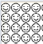

### bezierCurveTo

bezierCurveTo(cp1x: number, cp1y: number, cp2x: number, cp2y: number, x: number, y: number): void

创建三次贝塞尔曲线的路径。

**系统能力：** SystemCapability.ArkUI.ArkUI.Full

**参数：** 

| 参数名 | 类型    | 必填 | 说明                         |
| ------ | ------- | ---- | ---------------------------- |
| cp1x | number | 是 | 第一个贝塞尔参数的x坐标值。 |
| cp1y | number | 是 | 第一个贝塞尔参数的y坐标值。 |
| cp2x | number | 是 | 第二个贝塞尔参数的x坐标值。 |
| cp2y | number | 是 | 第二个贝塞尔参数的y坐标值。 |
| x    | number | 是 | 路径结束时的x坐标值。    |
| y    | number | 是 | 路径结束时的y坐标值。    |

**示例：** 
  ```html
  <!-- xxx.hml -->
  <div>
    <canvas ref="canvas" style="width: 200px; height: 150px;"></canvas>
  </div>
  ```

  ```js
  //xxx.js
  export default {
    onShow() {
      const el = this.$refs.canvas;
      const ctx = el.getContext('2d');
      ctx.beginPath();
      ctx.moveTo(10, 10);
      ctx.bezierCurveTo(20, 100, 200, 100, 200, 20);
      ctx.stroke();
    }
  }
  ```

  

### quadraticCurveTo

quadraticCurveTo(cpx: number, cpy: number, x: number, y: number): void

创建二次贝塞尔曲线的路径。

**系统能力：** SystemCapability.ArkUI.ArkUI.Full

**参数：** 

| 参数名 | 类型    | 必填 | 说明                         |
| ------ | ------- | ---- | ---------------------------- |
| cpx  | number | 是 | 贝塞尔参数的x坐标值。 |
| cpy  | number | 是 | 贝塞尔参数的y坐标值。 |
| x    | number | 是 | 路径结束时的x坐标值。 |
| y    | number | 是 | 路径结束时的y坐标值。 |

**示例：** 
  ```html
  <!-- xxx.hml -->
  <div>
    <canvas ref="canvas" style="width: 200px; height: 150px; "></canvas>
  </div>
  ```

  ```js
  //xxx.js
  export default {
    onShow() {
      const el = this.$refs.canvas;
      const ctx = el.getContext('2d');
      ctx.beginPath();
      ctx.moveTo(20, 20);
      ctx.quadraticCurveTo(100, 100, 200, 20);
      ctx.stroke();
    }
  }
  ```

  


### arc
arc(x: number, y: number, radius: number, startAngle: number, endAngle: number, anticlockwise?: boolean): void

绘制弧线路径。

**系统能力：** SystemCapability.ArkUI.ArkUI.Full

**参数：** 

| 参数名 | 类型    | 必填 | 说明                         |
| ------ | ------- | ---- | ---------------------------- |
| x             | number  | 是 | 弧线圆心的x坐标值。 |
| y             | number  | 是 | 弧线圆心的y坐标值。 |
| radius        | number  | 是 | 弧线的圆半径。    |
| startAngle    | number  | 是 | 弧线的起始弧度。   |
| endAngle      | number  | 是 | 弧线的终止弧度。   |
| anticlockwise | boolean | 否 | 是否逆时针绘制圆弧，true为逆时针，false为顺时针。<br/>默认值：false  |

**示例：** 
  ```html
  <!-- xxx.hml -->
  <div>
    <canvas ref="canvas" style="width: 200px; height: 150px;"></canvas>
  </div>
  ```

  ```js
  //xxx.js
  export default {
    onShow() {
      const el = this.$refs.canvas;
      const ctx = el.getContext('2d');
      ctx.beginPath();
      ctx.arc(100, 75, 50, 0, 6.28);
      ctx.stroke();
    }
  }
  ```

  

### arcTo

arcTo(x1: number, y1: number, x2: number, y2: number, radius: number): void

依据圆弧经过的点和圆弧半径创建圆弧路径。

**系统能力：** SystemCapability.ArkUI.ArkUI.Full

**参数：** 

| 参数名 | 类型    | 必填 | 说明                         |
| ------ | ------- | ---- | ---------------------------- |
| x1     | number | 是 | 圆弧经过的第一个点的x坐标值。 |
| y1     | number | 是 | 圆弧经过的第一个点的y坐标值。 |
| x2     | number | 是 | 圆弧经过的第二个点的x坐标值。 |
| y2     | number | 是 | 圆弧经过的第二个点的y坐标值。 |
| radius | number | 是 | 圆弧的圆半径值。        |

**示例：** 
  ```html
  <!-- xxx.hml -->
  <div>
    <canvas ref="canvas" style="width: 200px; height: 150px;"></canvas>
  </div>
  ```

  ```js
  //xxx.js
  export default {
    onShow() {
      const el = this.$refs.canvas;
      const ctx = el.getContext('2d');
      ctx.moveTo(100, 20);
      ctx.arcTo(150, 20, 150, 70, 50); // Create an arc
      ctx.stroke();
    }
  }
  ```

  

### ellipse<sup>6+</sup>

ellipse(x: number, y: number, radiusX: number, radiusY: number, rotation: number, startAngle: number, endAngle: number, anticlockwise?: number): void

在规定的矩形区域绘制一个椭圆。

**系统能力：** SystemCapability.ArkUI.ArkUI.Full

**参数：** 

| 参数名 | 类型    | 必填 | 说明                         |
| ------ | ------- | ---- | ---------------------------- |
| x             | number | 是 | 椭圆圆心的x轴坐标。                           |
| y             | number | 是 | 椭圆圆心的y轴坐标。                           |
| radiusX       | number | 是 | 椭圆x轴的半径长度。                           |
| radiusY       | number | 是 | 椭圆y轴的半径长度。                           |
| rotation      | number | 是 | 椭圆的旋转角度，单位为弧度。                       |
| startAngle    | number | 是 | 椭圆绘制的起始点角度，以弧度表示。                    |
| endAngle      | number | 是 | 椭圆绘制的结束点角度，以弧度表示。                    |
| anticlockwise | number | 否 | 是否以逆时针方向绘制椭圆，0为顺时针，1为逆时针。其它数值均按默认值处理。<br/>默认值：0 |

**示例：** 
  ```html
  <!-- xxx.hml -->
  <div>
    <canvas ref="canvas" style="width: 500px; height: 500px; background-color: #ffff00;"></canvas>
  </div>
  ```

  ```js
  //xxx.js
  export default {
    onShow() {
      const el = this.$refs.canvas;
      const ctx = el.getContext('2d');
      ctx.beginPath();
      ctx.ellipse(200, 200, 50, 100, Math.PI * 0.25, Math.PI * 0.5, Math.PI, 1);
      ctx.stroke();
    }
  }
  ```

  


### rect
rect(x: number, y: number, width: number, height: number): void

创建矩形路径。

**系统能力：** SystemCapability.ArkUI.ArkUI.Full

**参数：** 

| 参数名 | 类型    | 必填 | 说明                         |
| ------ | ------- | ---- | ---------------------------- |
| x      | number | 是 | 指定矩形的左上角x坐标值。 |
| y      | number | 是 | 指定矩形的左上角y坐标值。 |
| width  | number | 是 | 指定矩形的宽度。      |
| height | number | 是 | 指定矩形的高度。      |

**示例：** 
  ```html
  <!-- xxx.hml -->
  <div>
    <canvas ref="canvas" style="width: 200px; height: 150px; "></canvas>
  </div>
  ```

  ```js
  //xxx.js
  export default {
    onShow() {
      const el = this.$refs.canvas;
      const ctx = el.getContext('2d');
      ctx.rect(20, 20, 100, 100); // Create a 100*100 rectangle at (20, 20)
      ctx.stroke(); // Draw it
    }
  }
  ```

  

### fill

fill(): void

对封闭路径进行填充。

**系统能力：** SystemCapability.ArkUI.ArkUI.Full

**示例：** 
  ```html
  <!-- xxx.hml -->
  <div>
    <canvas ref="canvas" style="width: 200px; height: 150px;"></canvas>
  </div>
  ```

  ```js
  //xxx.js
  export default {
    onShow() {
      const el = this.$refs.canvas;
      const ctx = el.getContext('2d');
      ctx.rect(20, 20, 100, 100); // Create a 100*100 rectangle at (20, 20)
      ctx.fill(); // Draw it in default setting
    }
  }
  ```

  

### clip

clip(): void

设置当前路径为剪切路径。

**系统能力：** SystemCapability.ArkUI.ArkUI.Full

**示例：** 
  ```html
  <!-- xxx.hml -->
  <div>
    <canvas ref="canvas" style="width: 200px; height: 150px;"></canvas>
  </div>
  ```

  ```js
  //xxx.js
  export default {
    onShow() {
      const el = this.$refs.canvas;
      const ctx = el.getContext('2d');
      ctx.rect(0, 0, 200, 200);
      ctx.stroke();
      ctx.clip();
      // Draw red rectangle after clip
      ctx.fillStyle = "rgb(255,0,0)";
      ctx.fillRect(0, 0, 150, 150);
    }
  }
  ```

  

### rotate

rotate(rotate: number): void

针对当前坐标轴进行顺时针旋转。

**系统能力：** SystemCapability.ArkUI.ArkUI.Full

**参数：** 

| 参数名 | 类型    | 必填 | 说明                         |
| ------ | ------- | ---- | ---------------------------- |
| rotate | number | 是 | 设置顺时针旋转的弧度值，可以通过Math.PI&nbsp;/&nbsp;180将角度转换为弧度值。 |

**示例：** 
  ```html
  <!-- xxx.hml -->
  <div>
    <canvas ref="canvas" style="width: 200px; height: 150px;"></canvas>
  </div>
  ```

  ```js
  //xxx.js
  export default {
    onShow() {
      const el = this.$refs.canvas;
      const ctx = el.getContext('2d');
      ctx.rotate(45 * Math.PI / 180); // Rotate the rectangle 45 degrees
      ctx.fillRect(70, 20, 50, 50);
    }
  }
  ```

  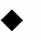

### scale

scale(x: number, y: number): void

设置canvas画布的缩放变换属性，后续的绘制操作将按照缩放比例进行缩放。

**系统能力：** SystemCapability.ArkUI.ArkUI.Full

**参数：** 

| 参数名 | 类型    | 必填 | 说明                         |
| ------ | ------- | ---- | ---------------------------- |
| x    | number | 是 | 设置水平方向的缩放值。 |
| y    | number | 是 | 设置垂直方向的缩放值。 |

**示例：** 
  ```html
  <!-- xxx.hml -->
  <div>
    <canvas ref="canvas" style="width: 200px; height: 150px;"></canvas>
  </div>
  ```

  ```js
  //xxx.js
  export default {
    onShow() {
      const el = this.$refs.canvas;
      const ctx = el.getContext('2d');
      ctx.strokeRect(10, 10, 25, 25);
      ctx.scale(2, 2);// Scale to 200%
      ctx.strokeRect(10, 10, 25, 25);
    }
  }
  ```

  

### transform

transform(scaleX: number, skewX: number, skewY: number, scale: number, translateX: number, translateY: number): void

transform方法对应一个变换矩阵，想对一个图形进行变化的时候，只要设置此变换矩阵相应的参数，对图形的各个定点的坐标分别乘以这个矩阵，就能得到新的定点的坐标。矩阵变换效果可叠加。

>  **说明：**
>  变换后的坐标计算方式（x和y为变换前坐标，x'和y'为变换后坐标）：
>
>  - x' = scaleX \* x + skewY \* y + translateX
>
>  - y' = skewX \* x + scaleY \* y + translateY

**系统能力：** SystemCapability.ArkUI.ArkUI.Full

**参数：** 

| 参数名 | 类型    | 必填 | 说明                         |
| ------ | ------- | ---- | ---------------------------- |
| scaleX     | number | 是 | 指定水平缩放值。 |
| skewX      | number | 是 | 指定水平倾斜值。 |
| skewY      | number | 是 | 指定垂直倾斜值。 |
| scaleY     | number | 是 | 指定垂直缩放值。 |
| translateX | number | 是 | 指定水平移动值。 |
| translateY | number | 是 | 指定垂直移动值。 |

**示例：** 
  ```html
  <!-- xxx.hml -->
  <div>
    <canvas ref="canvas" style="width: 200px; height: 150px;"></canvas>
  </div>
  ```

  ```js
  //xxx.js
  export default {
    onShow() {
      const el = this.$refs.canvas;
      const ctx = el.getContext('2d');
      ctx.fillStyle = 'rgb(0,0,0)';
      ctx.fillRect(0, 0, 100, 100);
      ctx.transform(1, 0.5, -0.5, 1, 10, 10);
      ctx.fillStyle = 'rgb(255,0,0)';
      ctx.fillRect(0, 0, 100, 100);
      ctx.transform(1, 0.5, -0.5, 1, 10, 10);
      ctx.fillStyle = 'rgb(0,0,255)';
      ctx.fillRect(0, 0, 100, 100);
    }
  }
  ```

  

### setTransform

setTransform(scaleX: number, skewX: number, skewY: number, scale: number, translateX: number, translateY: number): void

setTransform方法使用的参数和transform()方法相同，但setTransform()方法会重置现有的变换矩阵并创建新的变换矩阵。

**系统能力：** SystemCapability.ArkUI.ArkUI.Full

**参数：** 

| 参数名 | 类型    | 必填 | 说明                         |
| ------ | ------- | ---- | ---------------------------- |
| scaleX     | number | 是 | 指定水平缩放值。 |
| skewX      | number | 是 | 指定水平倾斜值。 |
| skewY      | number | 是 | 指定垂直倾斜值。 |
| scaleY     | number | 是 | 指定垂直缩放值。 |
| translateX | number | 是 | 指定水平移动值。 |
| translateY | number | 是 | 指定垂直移动值。 |

**示例：** 
  ```html
  <!-- xxx.hml -->
  <div>
    <canvas ref="canvas" style="width: 200px; height: 150px;"></canvas>
  </div>
  ```

  ```js
  //xxx.js
  export default {
    onShow() {
      const el = this.$refs.canvas;
      const ctx = el.getContext('2d');
      ctx.fillStyle = 'rgb(255,0,0)';
      ctx.fillRect(0, 0, 100, 100);
      ctx.setTransform(1,0.5, -0.5, 1, 10, 10);
      ctx.fillStyle = 'rgb(0,0,255)';
      ctx.fillRect(0, 0, 100, 100);
    }
  }
  ```

  

### translate

translate(x: number, y: number): void

移动当前坐标系的原点。

**系统能力：** SystemCapability.ArkUI.ArkUI.Full

**参数：** 

| 参数名 | 类型    | 必填 | 说明                         |
| ------ | ------- | ---- | ---------------------------- |
| x    | number | 是 | 设置水平平移量。 |
| y    | number | 是 | 设置竖直平移量。 |

**示例：** 
  ```html
  <!-- xxx.hml -->
  <div>
    <canvas ref="canvas" style="width: 200px; height: 150px;"></canvas>
  </div>
  ```

  ```js
  //xxx.js
  export default {
    onShow() {
      const el = this.$refs.canvas;
      const ctx = el.getContext('2d');
      ctx.fillRect(10, 10, 50, 50);
      ctx.translate(70, 70);
      ctx.fillRect(10, 10, 50, 50);
    }
  }
  ```

  

### createPath2D<sup>6+</sup>

createPath2D(path: Path2D, cmds: string): Path2D

创建一个Path2D对象。

**系统能力：** SystemCapability.ArkUI.ArkUI.Full

**参数：** 

| 参数名 | 类型    | 必填 | 说明                         |
| ------ | ------- | ---- | ---------------------------- |
| path | Path2D | 是 | Path2D对象。      |
| cmds | string | 是 | SVG的Path描述字符串。 |

**返回值：**

  [Path2D对象](js-components-canvas-path2d.md)

**示例：** 
  ```html
  <!-- xxx.hml -->
  <div>
    <canvas ref="canvas" style="width: 500px; height: 500px; background-color: #ffff00;"></canvas>
  </div>
  ```

  ```js
  //xxx.js
  export default {
    onShow() {
      const el = this.$refs.canvas;
      const ctx = el.getContext('2d');
      var path1 = ctx.createPath2D();
      path1.moveTo(100, 100);
      path1.lineTo(200, 100);
      path1.lineTo(100, 200);
      path1.closePath();
      ctx.stroke(path1);
      var path2 = ctx.createPath2D("M150 150 L50 250 L250 250 Z");
      ctx.stroke(path2);
      var path3 = ctx.createPath2D(path2);
      ctx.stroke(path3);
    }
  }
  ```

  

### drawImage

drawImage(image: Image | PixelMap, sx: number, sy: number, sWidth: number, sHeight: number, dx: number, dy: number, dWidth: number, dHeight: number):void

进行图像绘制。

**系统能力：** SystemCapability.ArkUI.ArkUI.Full

**参数：** 

| 参数名 | 类型    | 必填 | 说明                         |
| ------ | ------- | ---- | ---------------------------- |
| image   | Image \| PixelMap<sup>9+</sup> | 是 | 图片资源，请参考[Image对象](js-components-canvas-image.md) 或[PixelMap对象](../../apis-image-kit/arkts-apis-image-PixelMap.md)。 |
| sx      | number                         | 是 | 裁切源图像时距离源图像左上角的x坐标值。                     |
| sy      | number                         | 是 | 裁切源图像时距离源图像左上角的y坐标值。                     |
| sWidth  | number                         | 是 | 裁切源图像时需要裁切的宽度。                           |
| sHeight | number                         | 是 | 裁切源图像时需要裁切的高度。                           |
| dx      | number                         | 是 | 绘制区域左上角在x轴的位置。                           |
| dy      | number                         | 是 | 绘制区域左上角在y&nbsp;轴的位置。                     |
| dWidth  | number                         | 是 | 绘制区域的宽度。                                 |
| dHeight | number                         | 是 | 绘制区域的高度。                                 |

**示例：** 
  ```html
  <!-- xxx.hml -->
  <div>
    <canvas ref="canvas" style="width: 500px; height: 500px; background-color: #ffff00;"></canvas>
  </div>
  ```

  ```js
  //xxx.js
  export default {
    onShow() {
      var test = this.$refs.canvas;
      var ctx = test.getContext('2d');
      var img = new Image();
      // 'common/image/test.jpg'需要替换为开发者所需的图像资源文件
      img.src = 'common/image/test.jpg';
      ctx.drawImage(img, 0, 0, 200, 200, 10, 10, 200, 200);
    }
  }
  ```

  

### restore

restore(): void

对保存的绘图上下文进行恢复。

**系统能力：** SystemCapability.ArkUI.ArkUI.Full

**示例：** 
  ```html
  <!-- xxx.hml -->
  <div>
    <canvas ref="canvas" style="width: 200px; height: 150px; background-color: #ffff00;"></canvas>
  </div>
  ```

  ```js
  //xxx.js
  export default {
    onShow() {
      const el = this.$refs.canvas;
      const ctx = el.getContext('2d');
      ctx.restore();
    }
  }
  ```

### save

save(): void

对当前的绘图上下文进行保存。

**系统能力：** SystemCapability.ArkUI.ArkUI.Full

**示例：** 
  ```html
  <!-- xxx.hml -->
  <div>
    <canvas ref="canvas" style="width: 200px; height: 150px; background-color: #ffff00;"></canvas>
  </div>
  ```

  ```js
  //xxx.js
  export default {
    onShow() {
      const el = this.$refs.canvas;
      const ctx = el.getContext('2d');
      ctx.save();
    }
  }
  ```

### createLinearGradient<sup>6+</sup>

createLinearGradient(x0: number, y0: number, x1: number, y1: number): Object

创建一个线性渐变色，返回CanvasGradient对象，请参考[CanvasGradient对象](js-components-canvas-canvasgradient.md)。

**系统能力：** SystemCapability.ArkUI.ArkUI.Full

**参数：** 

| 参数名 | 类型    | 必填 | 说明                         |
| ------ | ------- | ---- | ---------------------------- |
| x0   | number | 是 | 起点的x轴坐标。 |
| y0   | number | 是 | 起点的y轴坐标。 |
| x1   | number | 是 | 终点的x轴坐标。 |
| y1   | number | 是 | 终点的y轴坐标。 |

**返回值：** 

| 类型     | 说明                     |
| ------ | ---------------------- |
| Object | 返回创建的CanvasGradient对象。 |

**示例：** 
  ```html
  <!-- xxx.hml -->
  <div>
    <canvas ref="canvas" style="width: 500px; height: 500px; background-color: #ffff00;"></canvas>
    <input type="button" style="width: 180px; height: 60px;" value="fillStyle" onclick="handleClick" />
  </div>
  ```

  ```js
  // xxx.js
  export default {
    handleClick() {
      const el = this.$refs.canvas;
      const ctx = el.getContext('2d');
      // Linear gradient: start(50,0) end(300,100)
      var gradient = ctx.createLinearGradient(50,0, 300,100);
      // Add three color stops
      gradient.addColorStop(0.0, '#ff0000');
      gradient.addColorStop(0.5, '#ffffff');
      gradient.addColorStop(1.0, '#00ff00');
      // Set the fill style and draw a rectangle
      ctx.fillStyle = gradient;
      ctx.fillRect(0, 0, 500, 500);
    }
  }
  ```

  

### createRadialGradient<sup>6+</sup>

createRadialGradient(x0: number, y0: number, r0: number, x1: number, y1: number, r1: number): Object

创建一个径向渐变色，返回CanvasGradient对象，请参考CanvasGradient。

**系统能力：** SystemCapability.ArkUI.ArkUI.Full

**参数：** 

| 参数名 | 类型    | 必填 | 说明                         |
| ------ | ------- | ---- | ---------------------------- |
| x0   | number | 是 | 起始圆的x轴坐标。         |
| y0   | number | 是 | 起始圆的y轴坐标。         |
| r0   | number | 是 | 起始圆的半径。必须是非负且有限的。 |
| x1   | number | 是 | 终点圆的x轴坐标。         |
| y1   | number | 是 | 终点圆的y轴坐标。         |
| r1   | number | 是 | 终点圆的半径。必须为非负且有限的。 |

**返回值：** 

| 类型     | 说明                     |
| ------ | ---------------------- |
| Object | 返回创建的CanvasGradient对象。 |

**示例：** 
  ```html
  <!-- xxx.hml -->
  <div>
    <canvas ref="canvas" style="width: 500px; height: 500px; background-color: #ffff00;"></canvas>
    <input type="button" style="width: 180px; height: 60px;" value="fillStyle" onclick="handleClick" />
  </div>
  ```

  ```js
  // xxx.js
  export default {
    handleClick() {
      const el = this.$refs.canvas;
      const ctx = el.getContext('2d');
      // Radial gradient: inner circle(200,200,r:50) outer circle(200,200,r:200)
      var gradient = ctx.createRadialGradient(200,200,50, 200,200,200);
      // Add three color stops
      gradient.addColorStop(0.0, '#ff0000');
      gradient.addColorStop(0.5, '#ffffff');
      gradient.addColorStop(1.0, '#00ff00');
      // Set the fill style and draw a rectangle
      ctx.fillStyle = gradient;
      ctx.fillRect(0, 0, 500, 500);
    }
  }
  ```

  

### createImageData

createImageData(width: number, height: number): ImageData

创建新的ImageData对象，请参考[ImageData对象](js-components-canvas-imagedata.md)。

**系统能力：** SystemCapability.ArkUI.ArkUI.Full

**参数：**

| 参数名        | 类型     | 必填     | 说明                |
| --------- | ------ | ------ |----------------- |
| width     | number |  是 | ImageData的宽度。     |
| height    | number |  是 | ImageData的高度。     |

**返回值：**

| 类型     | 说明                |
| ------ | ----------------- |
| [ImageData](js-components-canvas-imagedata.md) | 返回创建的ImageData对象。 |

**示例：**
  ```html
  <!-- xxx.hml -->
  <div>
    <canvas ref="canvas" style="width: 200px; height: 150px; background-color: #ffff00;"></canvas>
  </div>
  ```

  ```js
  //xxx.js
  export default {
    onShow() {
      const el = this.$refs.canvas;
      const ctx = el.getContext('2d');
      var imageData = ctx.createImageData(50, 100);  // Create ImageData with 50px width and 100px height
    }
  }
  ```

### createImageData

createImageData(imageData: ImageData): ImageData

创建新的ImageData对象，请参考[ImageData对象](js-components-canvas-imagedata.md)。

**系统能力：** SystemCapability.ArkUI.ArkUI.Full

**参数：**

| 参数名        | 类型     | 必填     | 说明                |
| --------- | ------ | ------ |----------------- |
| imageData | [ImageData](js-components-canvas-imagedata.md) | 是 |复制现有的ImageData对象。 |

**返回值：**

| 类型     | 说明                |
| ------ | ----------------- |
| [ImageData](js-components-canvas-imagedata.md) | 返回创建的ImageData对象。 |

**示例：** 
  ```html
  <!-- xxx.hml -->
  <div>
    <canvas ref="canvas" style="width: 200px; height: 150px; background-color: #ffff00;"></canvas>
  </div>
  ```

  ```js
  //xxx.js
  export default {
    onShow() {
      const el = this.$refs.canvas;
      const ctx = el.getContext('2d');
      var imageData = ctx.createImageData(50, 100);  // Create ImageData with 50px width and 100px height
      var newImageData = ctx.createImageData(imageData);  // Create ImageData using the input imageData
    }
  }
  ```

### getImageData

getImageData(sx: number, sy: number, sw: number, sh: number): ImageData

以当前canvas指定区域内的像素创建[ImageData对象](js-components-canvas-imagedata.md)。

**系统能力：** SystemCapability.ArkUI.ArkUI.Full

**参数：** 

| 参数名 | 类型    | 必填 | 说明                         |
| ------ | ------- | ---- | ---------------------------- |
| sx   | number | 是 | 需要输出的区域的左上角x坐标。 |
| sy   | number | 是 | 需要输出的区域的左上角y坐标。 |
| sw   | number | 是 | 需要输出的区域的宽度。     |
| sh   | number | 是 | 需要输出的区域的高度。     |

**返回值：** 

| 类型     | 说明                      |
| ------ | ----------------------- |
| [ImageData](js-components-canvas-imagedata.md) | 返回包含指定区域像素的ImageData对象。 |

**示例：** 
  ```html
  <!-- xxx.hml -->
  <div>
    <canvas id="getImageData" style="width: 200px; height: 150px; background-color: #ffff00;"></canvas>
  </div>
  ```

  ```js
  //xxx.js
  export default {
    onShow() {
      const test = this.$element('getImageData')
      const ctx = test.getContext('2d');
      var imageData = ctx.getImageData(0, 0, 280, 300);
    }
  }
  ```

### putImageData

putImageData(imageData: ImageData, dx: number, dy: number, dirtyX: number, dirtyY: number, dirtyWidth: number, dirtyHeight: number): void

使用ImageData数据填充新的矩形区域。

**系统能力：** SystemCapability.ArkUI.ArkUI.Full

**参数：**

| 参数名 | 类型    | 必填 | 说明                         |
| ------ | ------- | ---- | ---------------------------- |
| imageData   | [ImageData](js-components-canvas-imagedata.md) | 是 | 包含像素值的ImageData对象。            |
| dx          | number | 是 | 填充区域在x轴方向的偏移量。                |
| dy          | number | 是 | 填充区域在y轴方向的偏移量。                |
| dirtyX      | number | 是 | 源图像数据矩形裁切范围左上角距离源图像左上角的x轴偏移量。 |
| dirtyY      | number | 是 | 源图像数据矩形裁切范围左上角距离源图像左上角的y轴偏移量。 |
| dirtyWidth  | number | 是 | 源图像数据矩形裁切范围的宽度。               |
| dirtyHeight | number | 是 | 源图像数据矩形裁切范围的高度。               |

**示例：**
  ```html
  <!-- xxx.hml -->
  <div>
    <canvas id="putImageData" style="width: 200px; height: 150px; background-color: #D5D5D5;"></canvas>
  </div>
  ```

  ```js
  //xxx.js
  export default {
      onShow() {
          const test = this.$element('putImageData')
          const ctx = test.getContext('2d');
          var imgData = ctx.createImageData(100, 100);
          for (var i = 0; i < imgData.data.length; i += 4) {
              imgData.data[i + 0] = 39;
              imgData.data[i + 1] = 135;
              imgData.data[i + 2] = 217;
              imgData.data[i + 3] = 255;
          }
          ctx.putImageData(imgData, 10, 10, 0, 0, 100, 50);
      }
  }
  ```
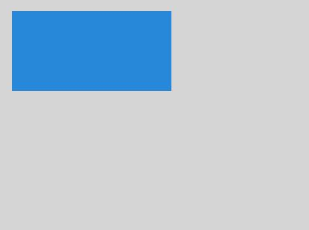

### putImageData

putImageData(imageData: ImageData, dx: number, dy: number): void

使用ImageData数据填充新的矩形区域。

**系统能力：** SystemCapability.ArkUI.ArkUI.Full

**参数：**

| 参数名 | 类型    | 必填 | 说明                         |
| ------ | ------- | ---- | ---------------------------- |
| imageData   | [ImageData](js-components-canvas-imagedata.md) | 是 | 包含像素值的ImageData对象。            |
| dx          | number | 是 | 填充区域在x轴方向的偏移量。                |
| dy          | number | 是 | 填充区域在y轴方向的偏移量。                |

**示例：**
  ```html
  <!-- xxx.hml -->
  <div>
    <canvas id="putImageData" style="width: 200px; height: 150px; background-color: #ffff00;"></canvas>
  </div>
  ```

  ```js
  //xxx.js
  export default {
    onShow() {
      const test = this.$element('putImageData')
      const ctx = test.getContext('2d');
      var imgData = ctx.createImageData(100, 100);
      for (var i = 0; i < imgData.data.length; i += 4) {
        imgData.data[i + 0] = 255;
        imgData.data[i + 1] = 0;
        imgData.data[i + 2] = 0;
        imgData.data[i + 3] = 255;
    }
      ctx.putImageData(imgData, 10, 10);
    }
  }
  ```

  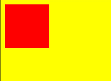

### getPixelMap<sup>9+</sup>

getPixelMap(sx: number, sy: number, sw: number, sh: number): PixelMap

获取用当前canvas指定区域内的像素创建的PixelMap对象。

**系统能力：** SystemCapability.ArkUI.ArkUI.Full

**参数：** 

| 参数名 | 类型    | 必填 | 说明                         |
| ------ | ------- | ---- | ---------------------------- |
| sx   | number | 是 | 指定区域的左上角x坐标。 |
| sy   | number | 是 | 指定区域的左上角y坐标。 |
| sw   | number | 是 | 指定区域的宽度。     |
| sh   | number | 是 | 指定区域的高度。     |

**返回值：** 

| 类型                                       | 说明                     |
| ---------------------------------------- | ---------------------- |
| [PixelMap](../../apis-image-kit/arkts-apis-image-PixelMap.md) | 返回包含指定区域像素的PixelMap对象。 |

**示例：** 

  ```html
  <!-- xxx.hml -->
  <div>
    <canvas id="canvasId" style="width: 200px; height: 150px; background-color: #ffff00;"></canvas>
  </div>
  ```

  ```js
  //xxx.js
  export default {
    onShow() {
      const test = this.$element('canvasId')
      const ctx = test.getContext('2d');
      var pixelMap = ctx.getPixelMap(0, 0, 280, 300);
    }
  }
  ```

### setLineDash

setLineDash(segments: Array): void

设置画布的虚线样式。

**系统能力：** SystemCapability.ArkUI.ArkUI.Full

**参数：** 

| 参数名 | 类型    | 必填 | 说明                         |
| ------ | ------- | ---- | ---------------------------- |
| segments | Array | 是 | 作为数组用来描述线段如何交替和间距长度。 |

**示例：** 
  ```html
  <!-- xxx.hml -->
  <div>
    <canvas ref="canvas" style="width: 200px; height: 150px; background-color: #ffff00;"></canvas>
  </div>
  ```

  ```js
  //xxx.js
  export default {
    onShow() {
      const el = this.$refs.canvas;
      const ctx = el.getContext('2d');
      ctx.arc(100, 75, 50, 0, 6.28);
      ctx.setLineDash([10,20]);
      ctx.stroke();
    }
  }
  ```

  

### getLineDash

getLineDash(): Array

获得当前画布的虚线样式。

**系统能力：** SystemCapability.ArkUI.ArkUI.Full

**返回值：** 

| 类型    | 说明                       |
| ----- | ------------------------ |
| Array | 返回数组，该数组用来描述线段如何交替和间距长度。 |

**示例：** 
  ```html
  <!-- xxx.hml -->
  <div>
    <canvas ref="canvas" style="width: 200px; height: 150px; "></canvas>
  </div>
  ```

  ```js
  //xxx.js
  export default {
    onShow() {
      const el = this.$refs.canvas;
      const ctx = el.getContext('2d');
      var info = ctx.getLineDash();
    }
  }
  ```

### transferFromImageBitmap<sup>7+</sup>

transferFromImageBitmap(bitmap: ImageBitmap): void

显示给定的[ImageBitmap对象](js-components-canvas-imagebitmap.md)。

**系统能力：** SystemCapability.ArkUI.ArkUI.Full

**参数：** 

| 参数名 | 类型    | 必填 | 说明                         |
| ------ | ------- | ---- | ---------------------------- |
| bitmap | [ImageBitmap](js-components-canvas-imagebitmap.md) | 是 | 待显示的ImageBitmap对象。 |

**示例：** 
  ```html
  <!-- xxx.hml -->
  <div>
    <canvas ref="canvas" style="width: 500px; height: 500px; background-color: #ffff00;"></canvas>
  </div>
  ```

  ```js
  //xxx.js
  export default {
    onShow() {
      const el = this.$refs.canvas;
      const ctx = el.getContext('2d');
      var canvas = this.$refs.canvas.getContext('2d');
      var offscreen = new OffscreenCanvas(500,500);
      var offscreenCanvasCtx = offscreen.getContext("2d");
      offscreenCanvasCtx.fillRect(0, 0, 200, 200); 

      var bitmap = offscreen.transferToImageBitmap();
      canvas.transferFromImageBitmap(bitmap);
    }
  }
  ```

  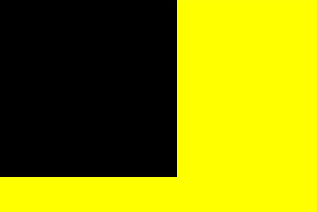