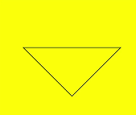
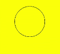

# Path2D对象
<!--Kit: ArkUI-->
<!--Subsystem: ArkUI-->
<!--Owner: @sd-wu-->
<!--Designer: @sunbees-->
<!--Tester: @liuli0427-->
<!--Adviser: @HelloCrease-->

>  **说明：**
>  从API version 6开始支持。后续版本如有新增内容，则采用上角标单独标记该内容的起始版本。

路径对象，支持通过对象的接口进行路径的描述，并通过Canvas的stroke接口进行绘制。


## addPath

addPath(path: Object): void

将另一个路径添加到当前的路径对象中。

**参数：**

| 参数   | 类型     | 描述             |
| ---- | ------ | -------------- |
| path | Object | 需要添加到当前路径的路径对象。 |

**示例：** 

  ```html
<!-- xxx.hml -->
<div>
    <canvas ref="canvas" style="width: 500px; height: 500px; background-color: #ffff00;"></canvas>
</div>
  ```

  ```js
// xxx.js
export default {
    onShow() {
        const el = this.$refs.canvas;
        const ctx = el.getContext('2d');
        var path1 = ctx.createPath2D("M250 150 L150 350 L350 350 Z");
        var path2 = ctx.createPath2D();
        path2.addPath(path1);
        ctx.stroke(path2);
    }
}
  ```

  

## setTransform

setTransform(scaleX: number, skewX: number, skewY: number, scaleY: number, translateX: number, translateY: number): void

设置路径变换矩阵。

**参数：**

| 参数         | 类型     | 描述      |
| ---------- | ------ | ------- |
| scaleX     | number | x轴的缩放比例。 |
| skewX      | number | x轴的倾斜角度。 |
| skewY      | number | y轴的倾斜角度。 |
| scaleY     | number | y轴的缩放比例。 |
| translateX | number | x轴的平移距离。 |
| translateY | number | y轴的平移距离。 |

**示例：**  

  ```html
<!-- xxx.hml -->
<div>
    <canvas ref="canvas" style="width: 300px; height: 250px; background-color: #ffff00;"></canvas>
</div>
  ```

  ```js
// xxx.js
export default {
    onShow() {
        const el = this.$refs.canvas;
        const ctx = el.getContext('2d');
        var path = ctx.createPath2D("M250 150 L150 350 L350 350 Z");
        path.setTransform(0.8, 0, 0, 0.4, 0, 0);
        ctx.stroke(path);
    }
}
  ```

  


## closePath

closePath(): void

将路径的当前点移回到路径的起点，当前点到起点间画一条直线。如果形状已经闭合或只有一个点，则此功能不执行任何操作。

**示例：**  

  ```html
<!-- xxx.hml -->
<div>
    <canvas ref="canvas" style="width: 500px; height: 500px; background-color: #ffff00;"></canvas>
</div>
  ```

  ```js
// xxx.js
export default {
    onShow() {
        const el = this.$refs.canvas;
        const ctx = el.getContext('2d');
        var path = ctx.createPath2D();
        path.moveTo(200, 100);
        path.lineTo(300, 100);
        path.lineTo(200, 200);
        path.closePath();
        ctx.stroke(path);
    }
}
  ```

  


## moveTo

moveTo(x: number, y: number): void

将路径的当前坐标点移动到目标点，移动过程中不绘制线条。

**参数：**

| 参数   | 类型     | 描述      |
| ---- | ------ | ------- |
| x    | number | 目标点X轴坐标。 |
| y    | number | 目标点Y轴坐标。 |

**示例：**  

  ```html
<!-- xxx.hml -->
<div>
    <canvas ref="canvas" style="width: 300px; height: 250px; background-color: #ffff00;"></canvas>
</div>
  ```

  ```js
// xxx.js
export default {
    onShow() {
        const el = this.$refs.canvas;
        const ctx = el.getContext('2d');
        var path = ctx.createPath2D();
        path.moveTo(50, 100);
        path.lineTo(250, 100);
        path.lineTo(150, 200);
        path.closePath();
        ctx.stroke(path);
    }
}
  ```

  


## lineTo

lineTo(x: number, y: number): void

从当前点绘制一条直线到目标点。

**参数：**

| 参数   | 类型     | 描述      |
| ---- | ------ | ------- |
| x    | number | 目标点X轴坐标。 |
| y    | number | 目标点Y轴坐标。|

**示例：**

  ```html
<!-- xxx.hml -->
<div>
    <canvas ref="canvas" style="width: 400px; height: 450px; background-color: #ffff00;"></canvas>
</div>
  ```

  ```js
// xxx.js
export default {
    onShow() {
        const el = this.$refs.canvas;
        const ctx = el.getContext('2d');
        var path = ctx.createPath2D();
        path.moveTo(100, 100);
        path.lineTo(100, 200);
        path.lineTo(200, 200);
        path.lineTo(200, 100);
        path.closePath();
        ctx.stroke(path);
    }
}
  ```

  


## bezierCurveTo

bezierCurveTo(cp1x: number, cp1y: number, cp2x: number, cp2y: number, x: number, y: number): void

创建三次贝赛尔曲线的路径。

**参数：** 

| 参数   | 类型     | 描述             |
| ---- | ------ | -------------- |
| cp1x | number | 第一个贝塞尔参数的x坐标值。 |
| cp1y | number | 第一个贝塞尔参数的y坐标值。 |
| cp2x | number | 第二个贝塞尔参数的x坐标值。 |
| cp2y | number | 第二个贝塞尔参数的y坐标值。 |
| x    | number | 路径结束时的x坐标值。    |
| y    | number | 路径结束时的y坐标值。    |

**示例：**  

  ```html
<!-- xxx.hml -->
<div>
    <canvas ref="canvas" style="width: 300px; height: 250px; background-color: #ffff00;"></canvas>
</div>
  ```

  ```js
// xxx.js
export default {
    onShow() {
        const el = this.$refs.canvas;
        const ctx = el.getContext('2d');
        var path = ctx.createPath2D();
        path.moveTo(10, 10);
        path.bezierCurveTo(20, 100, 200, 100, 200, 20);
        ctx.stroke(path);
    }
}
  ```

  


## quadraticCurveTo

quadraticCurveTo(cpx: number, cpy: number, x: number, y: number): void

创建二次贝赛尔曲线的路径。

**参数：**  

| 参数   | 类型     | 描述          |
| ---- | ------ | ----------- |
| cpx  | number | 贝塞尔参数的x坐标值。 |
| cpy  | number | 贝塞尔参数的y坐标值。 |
| x    | number | 路径结束时的x坐标值。 |
| y    | number | 路径结束时的y坐标值。 |

**示例：** 

  ```html
<!-- xxx.hml -->
<div>
    <canvas ref="canvas" style="width: 300px; height: 250px; background-color: #ffff00;"></canvas>
</div>
  ```

  ```js
// xxx.js
export default {
    onShow() {
        const el = this.$refs.canvas;
        const ctx = el.getContext('2d');
        var path = ctx.createPath2D();
        path.moveTo(10, 10);
        path.quadraticCurveTo(100, 100, 200, 20);
        ctx.stroke(path);
    }
}
  ```

  


## arc

arc(x: number, y: number, radius: number, startAngle: number, endAngle: number, anticlockwise: number): void

绘制弧线路径。

**参数：**  

| 参数            | 类型      | 描述         |
| ------------- | ------- | ---------- |
| x             | number  | 弧线圆心的x坐标值。 |
| y             | number  | 弧线圆心的y坐标值。 |
| radius        | number  | 弧线的圆半径。    |
| startAngle    | number  | 弧线的起始弧度。   |
| endAngle      | number  | 弧线的终止弧度。   |
| anticlockwise | boolean | 是否逆时针绘制圆弧。 |

**示例：**  

  ```html
<!-- xxx.hml -->
<div>
    <canvas ref="canvas" style="width: 300px; height: 250px; background-color: #ffff00;"></canvas>
</div>
  ```

  ```js
// xxx.js
export default {
    onShow() {
        const el = this.$refs.canvas;
        const ctx = el.getContext('2d');
        var path = ctx.createPath2D();
        path.arc(100, 75, 50, 0, 6.28);
        ctx.stroke(path);
    }
}
  ```

  


## arcTo

arcTo(x1: number, y1: number, x2: number, y2: number, radius: number): void

依据圆弧经过的点和圆弧半径创建圆弧路径。

**参数：** 

| 参数     | 类型     | 描述              |
| ------ | ------ | --------------- |
| x1     | number | 圆弧经过的第一个点的x坐标值。 |
| y1     | number | 圆弧经过的第一个点的y坐标值。 |
| x2     | number | 圆弧经过的第二个点的x坐标值。 |
| y2     | number | 圆弧经过的第二个点的y坐标值。 |
| radius | number | 圆弧的圆半径值。        |

**示例：**  

  ```html
<!-- xxx.hml -->
<div>
    <canvas ref="canvas" style="width: 300px; height: 250px; background-color: #ffff00;"></canvas>
</div>
  ```

  ```js
// xxx.js
export default {
    onShow() {
        const el = this.$refs.canvas;
        const ctx = el.getContext('2d');
        var path = ctx.createPath2D();
        path.arcTo(150, 20, 150, 70, 50);
        ctx.stroke(path);
    }
}
  ```

  


## ellipse

ellipse(x: number, y: number, radiusX: number, radiusY: number, rotation: number, startAngle: number, endAngle: number, anticlockwise: number): void

在规定的矩形区域绘制一个椭圆。

**参数：** 

| 参数            | 类型     | 描述                                   |
| ------------- | ------ | ------------------------------------ |
| x             | number | 椭圆圆心的x轴坐标。                           |
| y             | number | 椭圆圆心的y轴坐标。                           |
| radiusX       | number | 椭圆x轴的半径长度。                           |
| radiusY       | number | 椭圆y轴的半径长度。                           |
| rotation      | number | 椭圆的旋转角度，单位为弧度。                       |
| startAngle    | number | 椭圆绘制的起始点角度，以弧度表示。                    |
| endAngle      | number | 椭圆绘制的结束点角度，以弧度表示。                    |
| anticlockwise | number | 是否以逆时针方向绘制椭圆，0为顺时针，1为逆时针。(可选参数，默认为0) |

**示例：**  

  ```html
<!-- xxx.hml -->
<div>
    <canvas ref="canvas" style="width: 500px; height: 450px; background-color: #ffff00;"></canvas>
</div>
  ```

  ```js
// xxx.js
export default {
    onShow() {
        const el = this.$refs.canvas;
        const ctx = el.getContext('2d');
        var path = ctx.createPath2D();
        path.ellipse(200, 200, 50, 100, Math.PI * 0.25, Math.PI * 0.5, Math.PI, 1);
        ctx.stroke(path);
    }
}
  ```

  


## rect

rect(x: number, y: number, width: number, height: number): void

创建矩形路径。

**参数：** 

| 参数     | 类型     | 描述            |
| ------ | ------ | ------------- |
| x      | number | 指定矩形的左上角x坐标值。 |
| y      | number | 指定矩形的左上角y坐标值。 |
| width  | number | 指定矩形的宽度。      |
| height | number | 指定矩形的高度。      |

**示例：**  

  ```html
<!-- xxx.hml -->
<div>
    <canvas ref="canvas" style="width: 500px; height: 450px; background-color: #ffff00;"></canvas>
</div>
  ```

  ```js
// xxx.js
export default {
    onShow() {
        const el = this.$refs.canvas;
        const ctx = el.getContext('2d');
        var path = ctx.createPath2D();
        path.rect(20, 20, 100, 100);
        ctx.stroke(path);
    }
}
  ```

  
