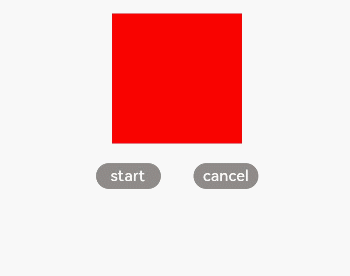

# 通用方法
<!--Kit: ArkUI-->
<!--Subsystem: ArkUI-->
<!--Owner: @CCFFWW-->
<!--Designer: @CCFFWW-->
<!--Tester: @lxl007-->
<!--Adviser: @HelloCrease-->

>  **说明：**
>  从API version 4开始支持。后续版本如有新增内容，则采用上角标单独标记该内容的起始版本。

当组件通过id属性标识后，可以使用该id获取组件对象并调用相关组件方法。


## animate

animate( keyframes: Keyframes, options: Options)：void

**参数：** 

| 参数名       | 类型      | 必填   | 说明                                   |
| --------- | --------- | ---- | ------------------------------------ |
| keyframes | keyframes | 是    | 设置动画样式。                               |
| options   | Options   | 是    | 用于设置动画属性的对象列表。options请见表3 Options说明。 |

  **表1** keyframes

| 属性     | 类型                 | 说明                                     |
| ------ | ------------------ | -------------------------------------- |
| frames | Array&lt;Style&gt; | 用于设置动画样式的对象列表。Style类型说明请见表2 Style类型说明。 |

  **表2** Style类型说明

| 参数                 | 类型                                       | 默认值                  | 说明                                       |
| ------------------ | ---------------------------------------- | -------------------- | ---------------------------------------- |
| width              | number                                   | -                    | 动画执行过程中设置到组件上的宽度值。                       |
| height             | number                                   | -                    | 动画执行过程中设置到组件上的高度值。                       |
| backgroundColor    | &lt;color&gt;                            | none                 | 动画执行过程中设置到组件上的背景颜色。                      |
| opacity            | number                                   | 1                    | 设置到组件上的透明度，介于0到1之间。                      |
| backgroundPosition | string                                   | -                    | 格式为"x&nbsp;y"，单位为百分号或者px。<br/>第一个值是水平位置，第二个值是垂直位置。<br/>如果仅规定了一个值，另一个值为&nbsp;50%。 |
| transformOrigin    | string                                   | 'center&nbsp;center' | 变换对象的中心点。<br/>第一个参数表示x轴的值，可以设置为left、center、right、长度值或百分比值。<br/>第二个参数表示y轴的值，可以设置为top、center、bottom、长度值或百分比值。 |
| transform          | [Transform](js-components-common-animation.md) | -                    | 设置到变换对象上的类型。                             |
| offset             | number                                   | -                    | -&nbsp;offset值（如果提供）必须在0.0到1.0（含）之间，并以升序排列。<br/>-&nbsp;若只有两帧，可以不填offset。<br/>-&nbsp;若超过两帧，offset必填。 |

  **表3** Options说明

| 参数                     | 类型                         | 默认值    | 说明                                       |
| ---------------------- | -------------------------- | ------ | ---------------------------------------- |
| duration               | number                     | 0      | 指定当前动画的运行时长，单位毫秒。                        |
| easing                 | string                     | linear | 描述动画的时间曲线，支持类型见表4 easing有效值说明。           |
| delay                  | number                     | 0      | 设置动画执行的延迟时间，默认值表示无延迟。                    |
| iterations             | number&nbsp;\|&nbsp;string | 1      | 设置动画执行的次数。number表示固定次数，Infinity枚举表示无限次数播放。 |
| direction<sup>6+</sup> | string                     | normal | 指定动画的播放模式：<br/>normal：&nbsp;动画正向循环播放；<br/>reverse：&nbsp;动画反向循环播放；<br/>alternate：动画交替循环播放，奇数次正向播放，偶数次反向播放；<br/>alternate-reverse：动画反向交替循环播放，奇数次反向播放，偶数次正向播放。 |
| fill                   | string                     | none   | 指定动画开始和结束的状态：<br/>none：在动画执行之前和之后都不会应用任何样式到目标上。<br/>forwards：在动画结束后，目标将保留动画结束时的状态（在最后一个关键帧中定义）。<br/>backwards<sup>6+</sup>：动画将在animation-delay期间应用第一个关键帧中定义的值。当animation-direction为"normal"或"alternate"时应用from关键帧中的值，当animation-direction为"reverse"或"alternate-reverse"时应用to关键帧中的值。<br/>both：动画将遵循forwards和backwards的规则，从而在两个方向上扩展动画属性。 |

  **表4** easing有效值说明

| 值                                        | 描述                                       |
| ---------------------------------------- | ---------------------------------------- |
| linear                                   | 动画线性变化。                                  |
| ease-in                                  | 动画速度先慢后快，cubic-bezier(0.42,&nbsp;0.0,&nbsp;1.0,&nbsp;1.0)。 |
| ease-out                                 | 动画速度先快后慢，cubic-bezier(0.0,&nbsp;0.0,&nbsp;0.58,&nbsp;1.0)。 |
| ease-in-out                              | 动画先加速后减速，cubic-bezier(0.42,&nbsp;0.0,&nbsp;0.58,&nbsp;1.0)。 |
| friction                                 | 阻尼曲线，cubic-bezier(0.2,&nbsp;0.0,&nbsp;0.2,&nbsp;1.0)。 |
| extreme-deceleration                     | 急缓曲线，cubic-bezier(0.0,&nbsp;0.0,&nbsp;0.0,&nbsp;1.0)。 |
| sharp                                    | 锐利曲线，cubic-bezier(0.33,&nbsp;0.0,&nbsp;0.67,&nbsp;1.0)。 |
| rhythm                                   | 节奏曲线，cubic-bezier(0.7,&nbsp;0.0,&nbsp;0.2,&nbsp;1.0)。 |
| smooth                                   | 平滑曲线，cubic-bezier(0.4,&nbsp;0.0,&nbsp;0.4,&nbsp;1.0)。 |
| cubic-bezier(x1,&nbsp;y1,&nbsp;x2,&nbsp;y2) | 在三次贝塞尔函数中定义动画变化过程，入参的x和y值必须处于0-1之间。      |
| steps(number,&nbsp;step-position)<sup>6+</sup> | Step曲线。<br/>number必须设置，支持的类型为int。<br/>step-position参数可选，支持设置start或end，默认值为end。 |

**返回值：** 
  animation对象属性：

| 属性        | 类型      | 说明                                       |
| --------- | ------- | ---------------------------------------- |
| finished  | boolean | 只读，用于表示当前动画是否已播放完成。返回true时，动画播放完成。返回false时，动画没播放完成。                      |
| pending   | boolean | 只读，用于表示当前动画是否处于等待其他异步操作完成的等待状态（例如启动一个延时播放的动画）。返回true时，动画处于等待状态。返回false时，动画不处于等待状态。 |
| playState | string  | 可读可写，动画的执行状态：<br/>-&nbsp;idle：未执行状态，包括已结束或未开始。<br/>-&nbsp;running：动画正在运行。<br/>-&nbsp;paused：动画暂停。<br/>-&nbsp;finished：动画播放完成。 |
| startTime | number  | 可读可写，动画播放开始的预定时间，用途类似于options参数中的delay。  |

  animation对象方法：

| 方法      | 参数   | 说明      |
| ------- | ---- | ------- |
| play    | -    | 组件播放动画。 |
| finish  | -    | 组件完成动画。 |
| pause   | -    | 组件暂停动画。 |
| cancel  | -    | 组件取消动画。 |
| reverse | -    | 组件倒播动画。 |

  animation对象事件：

| 事件                 | 说明       |
| ------------------ | -------- |
| start<sup>6+</sup> | 动画开始事件。  |
| cancel             | 动画被强制取消。 |
| finish             | 动画播放完成。  |
| repeat             | 动画重播事件。  |

**示例：** 
```html
<!-- xxx.hml -->
<div class="container">
  <div id="idName" class="box"></div>
  <div class="buttonBox">
    <button @click="start">
      start
    </button>
    <button @click="cancel">
      cancel
    </button>
  </div>
</div>
```

```css
/* xxx.css */
.container {
  flex-direction: column;
  justify-content: center;
  align-items: center;
  width: 100%;
}
.box{
  width: 200px;
  height: 200px;
  background-color: #ff0000;
  margin-top: 30px;
}
.buttonBox{
  margin-top: 30px;
  width: 250px;
  justify-content: space-between;
}
button{
  background-color: #8e8b89;
  color: white;
  width: 100px;
  height: 40px;
  font-size: 24px;
}
```

```js
// xxx.js
export default {
    data: {
        animation: '',
        options: {},
        frames: {}
    },
    onInit() {
        this.options = {
            duration: 1500,
            easing: 'friction',
            delay: 500,
            fill: 'forwards',
            iterations: 2,
            direction: 'normal',
        };
        this.frames = [
            {
                transform: {
                    translate: '-120px -0px'
                }, opacity: 0.1, offset: 0.0
            },
            {
                transform: {
                    translate: '120px 0px'
                }, opacity: 1.0, offset: 1.0
            }
        ];
    },

    start() {
        this.animation = this.$element('idName').animate(this.frames, this.options);
        this.animation.play();
    },
    cancel() {
        this.animation.cancel();
    }
}
```



## getBoundingClientRect

getBoundingClientRect(): \<Rect>

获取元素的大小及其相对于窗口的位置。

**返回值：** 

  **表5** Rect对象说明<sup>6+</sup>

| 属性     | 类型     | 描述             |
| ------ | ------ | -------------- |
| width  | number | 该元素的宽度。        |
| height | number | 该元素的高度。        |
| left   | number | 该元素左边界距离窗口的偏移。 |
| top    | number | 该元素上边界距离窗口的偏移。 |

**示例：** 
```js
// xxx.js
var rect = this.$element('id').getBoundingClientRect();
console.info(`current element position is ${rect.left}, ${rect.top}`);
```
## createIntersectionObserver

createIntersectionObserver(param?:  ObserverParam): Observer

监听元素在当前页面的可见范围。

**参数：** 

| 参数名   | 参数类型          | 必填   | 描述             |
| ----- | ------------- | ---- | -------------- |
| param | ObserverParam | -    | 获取observer的回调。 |

  **表6** ObserverParam对象说明<sup>6+</sup>

| 属性     | 类型                  | 描述                       |
| ------ | ------------------- | ------------------------ |
| ratios | Array&lt;number&gt; | 组件超出或小于范围时触发observer的回调。 |

**返回值：** 

  **表7** Observer对象支持的方法<sup>6+</sup>

| 方法        | 参数                      | 描述                                  |
| --------- | ----------------------- | ----------------------------------- |
| observe   | callback:&nbsp;function | 开启observer的订阅方法。超出或小于阈值时触发callback。 |
| unobserve | -                       | 取消observer的订阅方法。                    |

**示例：** 
```js
// xxx.js
let observer = this.$element('broad').createIntersectionObserver({
  ratios: [0.2, 0.5], // number
});

observer.observe((isVisible, ratio)=> {
    console.info('this element is ' + isVisible + 'ratio is ' + ratio)
})

observer.unobserve()
```