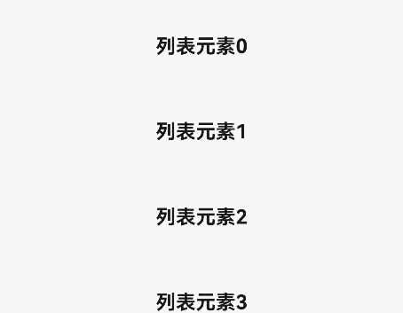

# refresh

>  **说明：**
> 从API version 4开始支持。后续版本如有新增内容，则采用上角标单独标记该内容的起始版本。

下拉刷新容器。

## 权限列表

无


## 子组件

支持。


## 属性

除支持[通用属性](js-components-common-attributes.md)外，还支持如下属性：

| 名称 | 类型 | 默认值 | 必填 | 描述 |
| -------- | -------- | -------- | -------- | -------- |
| offset | &lt;length&gt; | - | 否 | 刷新组件静止时距离父组件顶部的距离。 |
| refreshing | boolean | false | 否 | 标识刷新组件当前是否正在刷新。 |
| type | string | auto | 否 | 设置组件刷新时的动效。两个可选值，不支持动态修改。<br/>-&nbsp;auto:&nbsp;默认效果，列表界面拉到顶后，列表不移动，下拉后有转圈弹出。<br/>-&nbsp;pulldown:&nbsp;列表界面拉到顶后，可以继续往下滑动一段距离触发刷新，刷新完成后有回弹效果（如果子组件含有list，防止下拉效果冲突，需将list的scrolleffect设置为no）。 |
| lasttime | boolean | false | 否 | 设置是否显示上次更新时间，字符串格式为：“上次更新时间：XXXX&nbsp;”，XXXX&nbsp;按照时间日期显示规范显示，不可动态修改（建议type为pulldown时使用，固定距离位于内容下拉区域底部，使用时注意offset属性设置，防止出现重叠）。 |
| timeoffset<sup>6+</sup> | &lt;length&gt; | - | 否 | 设置更新时间距离父组件顶部的距离。 |
| friction | number | 42 | 否 | 下拉摩擦系数，取值范围：0-100，数值越大refresh组件跟手性高，数值越小refresh跟手性低。 |


## 样式

除支持[通用样式](js-components-common-styles.md)外，还支持如下样式：

| 名称 | 类型 | 默认值 | 必填 | 描述 |
| -------- | -------- | -------- | -------- | -------- |
| background-color | &lt;color&gt; | white<br/> | 否 | 设置刷新组件的背景颜色。 |
| progress-color | &lt;color&gt; | black<br/> | 否 | 设置刷新组件的loading图标颜色。 |


## 事件

仅支持如下事件：

| 名称 | 参数 | 描述 |
| -------- | -------- | -------- |
| refresh | {&nbsp;refreshing:&nbsp;refreshingValue&nbsp;} | 下拉刷新状态变化时触发。可能值：<br/>-&nbsp;false：当前处于下拉刷新过程中。<br/>-&nbsp;true：当前未处于下拉刷新过程中。 |
| pulldown | {&nbsp;state:&nbsp;string&nbsp;} | 下拉开始和松手时触发。可能值：<br/>-&nbsp;start：表示开始下拉。<br/>-&nbsp;end：表示结束下拉。 |


## 方法

不支持[通用方法](js-components-common-methods.md)。


## 示例

```html
<!-- xxx.hml -->
<div class="container">
  <refresh refreshing="{{fresh}}" onrefresh="refresh">
    <list class="list" scrolleffect="no">
      <list-item class="listitem" for="list">
        <div class="content">
          <text class="text">{{$item}}</text>
        </div>
      </list-item>
    </list>
  </refresh>
</div>
```

```css
/* xxx.css */
.container {
  flex-direction: column;
  align-items: center;
  width: 100%;
  height: 100%;
}

.list {
  width: 100%;
  height: 100%;
}

.listitem {
  width: 100%;
  height: 150px;
}

.content {
  width: 100%;
  height: 100%;
  flex-direction: column;
  align-items: center;
  justify-content: center;
}

.text {
  font-size: 35px;
  font-weight: bold;
}
```

```js
// xxx.js
import promptAction from '@ohos.promptAction';
export default {
  data: {
    list:[],
    fresh:false
  },
  onInit() {
    this.list = [];
    for (var i = 0; i <= 3; i++) {
      var item = '列表元素' + i;
      this.list.push(item);
    }
  },
  refresh: function (e) {
    promptAction.showToast({
      message: '刷新中...'
    })
    var that = this;
    that.fresh = e.refreshing;
    setTimeout(function () {
      that.fresh = false;
      var addItem = '更新元素';
      that.list.unshift(addItem);
      promptAction.showToast({
        message: '刷新完成!'
      })
    }, 2000)
  }
}
```


