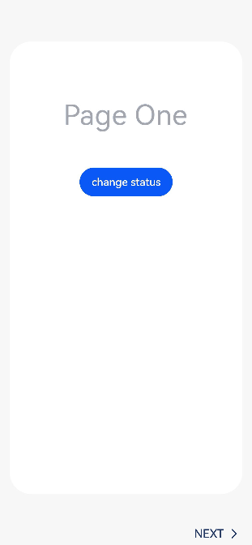

# stepper

>  **说明：**
>  从API version 5开始支持。后续版本如有新增内容，则采用上角标单独标记该内容的起始版本。

步骤导航器。当完成一个任务需要多个步骤时，可以使用步骤导航器展示当前进展。


## 权限列表

无


## 子组件

仅支持&lt;stepper-item&gt;子组件。

>  **说明：**
>  步骤导航器内的步骤顺序按照子组件&lt;stepper-item&gt;的顺序进行排序。


## 属性

除支持[通用属性](js-components-common-attributes.md)外，还支持如下属性：

| 名称    | 类型     | 默认值  | 描述                             |
| ----- | ------ | ---- | ------------------------------ |
| index | number | 0    | 设置步骤导航器步骤显示第几个stepper-item子组件，默认显示第一个stepper-item。 |


## 样式

支持[通用样式](js-components-common-styles.md)。

>  **说明：**
>  stepper组件默认占满父容器大小，建议父组件使用应用窗口大小（或者父组件为根节点）来优化体验。


## 事件

除支持[通用事件](js-components-common-events.md)外，还支持如下事件：

| 名称     | 参数                                       | 描述                                       |
| ------ | ---------------------------------------- | ---------------------------------------- |
| finish | 无                                        | 当步骤导航器最后一个步骤完成时,触发该事件。                    |
| skip   | 无                                        | 当前步骤导航器下一步按钮状态为skip，即可跳过时，点击右侧跳过按钮触发该事件。 |
| change | {&nbsp;prevIndex：prevIndex,&nbsp;index:&nbsp;index} | 当用户点击步骤导航器的左边或者右边按钮进行步骤切换时触发该事件，prevIndex表示老步骤的序号，index表示新步骤的序号。 |
| next   | {&nbsp;index：index,&nbsp;pendingIndex:&nbsp;pendingIndex&nbsp;} | 当用户点击下一步按钮时触发该事件，index表示当前步骤序号，pendingIndex表示将要跳转的序号，该事件有返回值，返回值格式为：{&nbsp;pendingIndex：pendingIndex&nbsp;}，可以通过指定pendingIndex来修改下一个步骤使用哪个stepper-item子组件。 |
| back   | {&nbsp;index：index,&nbsp;pendingIndex:&nbsp;pendingIndex&nbsp;} | 当用户点击上一步按钮时触发该事件，index表示当前步骤序号，pendingIndex表示将要跳转的序号，该事件有返回值，返回值格式为Object：{&nbsp;pendingIndex：pendingIndex&nbsp;}，可以通过指定pendingIndex来修改上一个步骤使用哪个stepper-item子组件。 |


## 方法

除支持[通用方法](js-components-common-methods.md)外，支持如下方法：

| 名称                  | 参数                                       | 描述                                       |
| ------------------- | ---------------------------------------- | ---------------------------------------- |
| setNextButtonStatus | {&nbsp;status:&nbsp;string,&nbsp;label:&nbsp;label&nbsp;} | 设置当前步骤中下一步按钮的文本与状态，参数中label为指定按钮文本，status指定按钮状态，status可选值为：<br/>-&nbsp;normal：正常状态，下一步文本按钮正常显示，可点击进入下一个步骤；<br/>-&nbsp;disabled：不可用状态，下一步文本按钮灰度显示，不可点击进入下一个步骤；<br/>-&nbsp;waiting：等待状态，下一步文本按钮不显示，使用等待进度条，不可点击进入下一个步骤；<br/>-&nbsp;skip：跳过状态，下一步文本按钮显示跳过按钮，点击时会跳过剩下步骤。 |


## 示例

```html
<!-- xxx.hml -->
<div class="container">
    <stepper class="stepper" id="mystepper" onnext="nextclick" onback="backclick" onchange="statuschange"
             onfinish="finish" onskip="skip" style="height : 100%;">
        <stepper-item class="stepper-item" label="{{ label_1 }}">
            <div class="item">
                <text>Page One</text>
                <button type="capsule" class="button" value="change status" onclick="setRightButton"></button>
            </div>
        </stepper-item>
        <stepper-item class="stepper-item" label="{{ label_2 }}">
            <div class="item">
                <text>Page Two</text>
                <button type="capsule" class="button" value="change status" onclick="setRightButton"></button>
            </div>
        </stepper-item>
        <stepper-item class="stepper-item" label="{{ label_3 }}">
            <div class="item">
                <text>Page Three</text>
                <button type="capsule" class="button" value="change status" onclick="setRightButton"></button>
            </div>
        </stepper-item>
    </stepper>
</div>
```

```css
/* xxx.css */
.container {
    flex-direction: column;
    align-items: center;
    height: 100%;
    width: 100%;
    background-color: #f7f7f7;
}
.stepper{
    width: 100%;
    height: 100%;
}
.stepper-item {
    width: 100%;
    height: 100%;
    flex-direction: column;
    align-items: center;
}
.item{
    width: 90%;
    height: 86%;
    margin-top: 80px;
    background-color: white;
    border-radius: 60px;
    flex-direction: column;
    align-items: center;
    padding-top: 160px;
}
text {
    font-size: 78px;
    color: #182431;
    opacity: 0.4;
}
.button {
    width: 40%;
    margin-top: 100px;
    justify-content: center;
}
```

```js
// xxx.js
import prompt from '@ohos.promptAction';

export default {
    data: {
        label_1:
        {
            prevLabel: 'BACK',
            nextLabel: 'NEXT',
            status: 'normal'
        },
        label_2:
        {
            prevLabel: 'BACK',
            nextLabel: 'NEXT',
            status: 'normal'
        },
        label_3:
        {
            prevLabel: 'BACK',
            nextLabel: 'NEXT',
            status: 'normal'
        }
    },
    setRightButton(e) {
        this.$element('mystepper').setNextButtonStatus({
            status: 'waiting', label: 'SKIP'
        });
    },
    nextclick(e) {
        var index = {
            pendingIndex: e.pendingIndex
        }
        return index;
    },
    backclick(e) {
        var index = {
            pendingIndex: e.pendingIndex
        }
        return index;
    },
    statuschange(e) {
        prompt.showToast({
            message: '上一步序号' + e.prevIndex + '当前序号' + e.index
        })
    },
    finish() {
        prompt.showToast({
            message: '最后一步已完成'
        })
    },
    skip() {
        prompt.showToast({
            message: 'skip触发'
        })
    }
}
```


