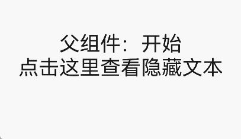

# 自定义组件的基本用法
<!--Kit: ArkUI-->
<!--Subsystem: ArkUI-->
<!--Owner: @seaside_wu1-->
<!--SE: @shiyu_huang-->
<!--TSE: @TerryTsao-->

自定义组件是用户根据业务需求，将已有的组件组合，封装成的新组件，可以在工程中多次调用，从而提高代码的可读性。自定义组件通过element引入到宿主页面，使用方法如下：

```html
<element name='comp' src='../common/component/comp.hml'></element>
<div>
  <comp prop1='xxxx' @child1="bindParentVmMethod"></comp>
</div>
```

结合if-else使用自定义组件的示例，showComp1为true时显示自定义组件comp1，否则显示comp2：

```html
<element name='comp1' src='../common/component/comp1/comp1.hml'></element>
<element name='comp2' src='../common/component/comp2/comp2.hml'></element>
<div>
  <comp1 if="{{showComp1}}" prop1='xxxx' @child1="bindParentVmMethodOne"></comp1>
  <comp2 else prop1='xxxx' @child1="bindParentVmMethodTwo"></comp2>
</div>
```

自定义组件的name属性指自定义组件名称(非必填)，组件名称对大小写不敏感，默认使用小写。src属性指自定义组件hml文件路径(必填)，若没有设置name属性，则默认使用hml文件名作为组件名。


## 自定义事件

父组件中绑定自定义子组件的事件使用(on|@)event-name="bindParentVmMethod"语法，子组件中通过this.$emit('eventName', { params: '传递参数' })触发事件并向上传递参数，父组件执行bindParentVmMethod方法并接收子组件传递的参数。

>  **说明：**
>
>  子组件中使用驼峰命名法命名的事件，在父组件中绑定时需要使用短横线分隔命名形式，例如：\@children-event表示绑定子组件的childrenEvent事件。

**示例1：无参数传递**

子组件comp定义如下：

```html
<!-- comp.hml -->
<div class="item">  
   <text class="text-style" onclick="childClicked">点击这里查看隐藏文本</text> 
   <text class="text-style" if="{{showObj}}">hello world</text> 
</div>
```

```css
/* comp.css */
.item {  
  width: 700px;   
  flex-direction: column;   
  height: 300px;   
  align-items: center;   
  margin-top: 100px;  
} 
.text-style { 
  font-weight: 500; 
  font-family: Courier; 
  font-size: 40px;
}
```

```js
// comp.js
export default { 
  data: {  
    showObj: false,  
  },  
  childClicked () {  
    this.$emit('eventType1'); 
    this.showObj = !this.showObj;  
  },  
}
```

引入子组件comp的父组件示例如下：

```html
<!-- xxx.hml --> 
<element name='comp' src='../common/component/comp.hml'></element>  
<div class="container">  
  <comp @event-type1="textClicked"></comp>  
</div>
```

```css
/* xxx.css */
.container {  
  background-color: #f8f8ff;  
  flex: 1;  
  flex-direction: column;  
  align-content: center; 
} 
```

```js
// xxx.js
export default {    
  textClicked () {} 
}
```

**示例2：有参数传递**

子组件comp定义如下：

```html
<!-- comp.hml -->
<div class="item">  
   <text class="text-style" onclick="childClicked">点击这里查看隐藏文本</text> 
   <text class="text-style" if="{{ showObj }}">hello world</text> 
</div>
```

```js
// comp.js
export default { 
  childClicked () {
    this.$emit('eventType1', { text: '收到子组件参数' });
    this.showObj = !this.showObj;
  },
}
```

子组件向上传递参数text，父组件接收时通过e.detail来获取该参数：

```html
<!-- xxx.hml -->
<element name='comp' src='../common/comp/comp.hml'></element>
<div class="container">  
   <text>父组件：{{text}}</text> 
   <comp @event-type1="textClicked"></comp>  
</div>
```

```js
// xxx.js
export default { 
  data: {
    text: '开始',
  },
  textClicked (e) {
    this.text = e.detail.text;
  },
}
```




## 自定义组件数据


自定义组件的js文件中可以通过声明data、props、computed等字段完成数据的定义、传递与处理，其中props与computed的具体使用请参考[数据传递与处理](js-components-custom-props.md)章节。

**表1** 自定义组件数据

| 名称      | 类型            | 描述                                     |
| -------- | --------------- | ---------------------------------------- |
| data     | Object&nbsp;\|&nbsp;Function | 页面的数据模型，类型是对象或者函数，如果类型是函数，返回值必须是对象。属性名不能以$或_开头，不要使用保留字for,&nbsp;if,&nbsp;show,&nbsp;tid。<br/>data与private和public不能重合使用。 |
| props    | Array&nbsp;\|&nbsp;Object    | props用于组件之间的数据通信，可以通过&lt;tag&nbsp;xxxx='value'&gt;方式传递给组件；props名称必须用小写，不能以$或_开头，不要使用保留字for,&nbsp;if,&nbsp;show,&nbsp;tid。目前props的数据类型不支持Function。 |
| computed | Object          | 计算属性，用于在读取或设置参数时，进行预先处理，其结果会被缓存。计算属性名不能以$或_开头，不要使用保留字。 |