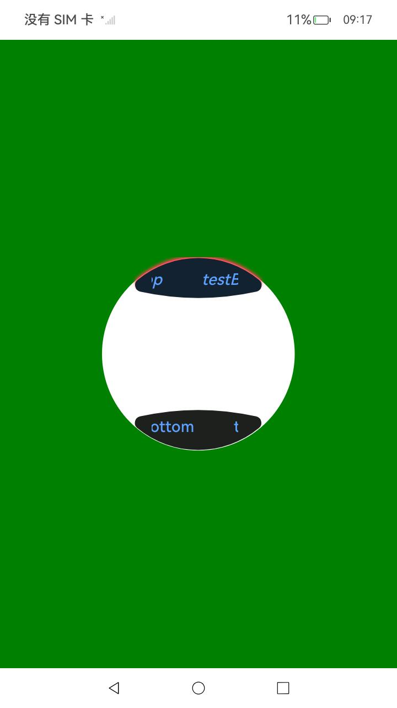

#  ArcButton

弧形按钮组件用于穿戴设备圆形屏幕使用。

> **说明：**
>
> 该组件从API Version 12开始支持。后续版本如有新增内容，则采用上角标单独标记该内容的起始版本。

## 导入模块

```
import {
  ArcButton,
  ArcButtonOptions,
  ArcButtonStatus,
  ArcButtonStyleMode,
  ArkButtonClickEffectStyle,
  ArcButtonTypeMode,
}  from '@kit.ArkUI';
```

## 子组件

无

## 属性
不支持[通用属性](ts-universal-attributes-size.md)，通用事件支持[点击事件](ts-universal-events-click.md)

## ArcButton

ArcButton({options:ArcButtonOptions})

**装饰器类型：**@ComponentV2

**原子化服务API：** 从API version 12开始，该接口支持在原子化服务中使用。

**系统能力：** SystemCapability.ArkUI.ArkUI.Full

**参数**：

| 名称    | 类型             | 必填 | 装饰器类型  | 说明                      |
| ------- | ---------------- | ---- | ----------- | ------------------------- |
| options | [ArcButtonOptions](#arcbuttonoptions) | 是   | @ObservedV2 | 定义ArcButton组件的参数。 |


## ArcButtonOptions

ArcButtonOptions定义ArcButton的样式及具体式样参数。

**系统能力：** SystemCapability.ArkUI.ArkUI.Circle

| 名称             | 类型                                                    | 必填 | 说明                                                         |
| ---------------- | ------------------------------------------------------- | ---- | ------------------------------------------------------------ |
| type             | [ArcButtonTypeMode](#arcbuttontypemode)                 | 否   | 上下弧形按钮类型属性。<br/>默认:下弧形按钮。                 |
| width            | [LengthMetrics](../js-apis-arkui-graphics.md#lengthmetrics12)                                          | 否   | 大圆弧的半径。<br>默认值：330vp。                            |
| height           | [LengthMetrics](../js-apis-arkui-graphics.md#lengthmetrics12)                                           | 否   | 弯曲按钮的高度。<br>默认值：48vp。                           |
| styleMode        | [ArcButtonStyleMode](#arcbuttonstylemode)               | 否   | 弧形按钮样式模式。<br>默认值：ArcButtonStyleMode.EMPHASIZED_LIGHT。 |
| status           | [ArcButtonStatus](#arcbuttonstatus)                     | 否   | 弧形按钮状态。<br/>默认值：ArcButtonStatus.NORMAL。          |
| resourceText     | [ResourceStr](ts-types.md#resourcestr)                                             | 否   | 弧形按钮显示文本。                                           |
| touchEffect      | [ArkButtonClickEffectStyle](#arkbuttonclickeffectstyle) | 否   | 弧形按钮动态效果开关。<br/>默认值：ArkButtonClickEffectStyle.NONE。 |
| backgroundColor  | [ColorMetrics](../js-apis-arkui-graphics.md#colormetrics12)                                            | 否   | 弧形按钮背景颜色。<br/>默认值：Color.Black。                 |
| shadowColor      | [ColorMetrics](../js-apis-arkui-graphics.md#colormetrics12)                                            | 否   | 弧形按钮阴影颜色。<br/>默认值：Color.Black。                 |
| shadowEnabled    | boolean                                                 | 否   | 弧形按钮阴影开关。<br/>默认值：false。                       |
| textSize         | [LengthMetrics](../js-apis-arkui-graphics.md#lengthmetrics12)                                           | 否   | 弧形按钮文本大小。<br/>默认值：19fp。                        |
| textColor        | [ColorMetrics](../js-apis-arkui-graphics.md#colormetrics12)                                            | 否   | 弧形按钮文本颜色。<br/>默认值：Color.White。                 |
| pressedTextColor | [ColorMetrics](../js-apis-arkui-graphics.md#colormetrics12)                                            | 否   | 弧形按钮按下文本颜色。<br/>默认值：Color.White。             |
| textStyle        | [FontStyle](ts-appendix-enums.md#fontstyle)                                               | 否   | 弧形按钮文本样式。<br/>默认值：FontStyle.Normal。            |
| textFamily       | string \| [Resource](ts-types.md#resource)                                     | 否   | 弧形按钮文本族。                                             |
| textMargin       | [LocalizedMargin](ts-types.md#localizedmargin12)                                        | 否   | 弧形按钮文本边距。<br/>默认值：{start:24vp, top: 10vp,end: 24vp, bottom:16vp }。 |


## ArcButtonTypeMode

ArcButtonType是ArcButton可设置的弧形按钮的类型。

**原子化服务API：** 从API version 12开始，该接口支持在原子化服务中使用。

**系统能力：** SystemCapability.ArkUI.ArkUI.Circle

| 名称        | 值   | 描述                             |
| ----------- | ---- | -------------------------------- |
| TOP_EDGE    | 0    | 上弧形按钮，位于圆形屏幕上方     |
| BOTTOM_EDGE | 1    | 底部弧形按钮，位于圆形屏幕底部。 |


## ArcButtonStyleMode

ArcButtonStyleMode是ArcButton可设置弧形按钮样式模式。

**原子化服务API：** 从API version 12开始，该接口支持在原子化服务中使用。

**系统能力：** SystemCapability.ArkUI.ArkUI.Circle

| 名称             | 值   | 描述             |
| ---------------- | ---- | ---------------- |
| EMPHASIZED_LIGHT | 0    | 强调状态，亮色。 |
| EMPHASIZED_DEEP  | 1    | 强调状态，暗色。 |
| NORMAL_LIGHT     | 2    | 正常状态，亮色。 |
| NORMAL_DEEP      | 3    | 正常状态，暗色。 |


## ArcButtonStatus

ArcButtonStatus是ArcButton可设置的弧形按钮状态。

**原子化服务API：** 从API version 12开始，该接口支持在原子化服务中使用。

**系统能力：** SystemCapability.ArkUI.ArkUI.Circle

| 名称     | 值   | 描述       |
| -------- | ---- | ---------- |
| NORMAL   | 0    | 正常状态。 |
| PRESSED  | 1    | 按压状态。 |
| DISABLED | 2    | 禁用状态。 |


## ArkButtonClickEffectStyle

ArkButtonClickEffectStyle是ArcButton提供的弧形按钮点击效果状态。

**原子化服务API：** 从API version 12开始，该接口支持在原子化服务中使用。

**系统能力：** SystemCapability.ArkUI.ArkUI.Circle

| 名称   | 值   | 描述           |
| ------ | ---- | -------------- |
| NONE   | 0    | 关闭点击效果。 |
| LIGHT  | 1    | 轻盈。         |
| MIDDLE | 2    | 稳定。         |
| HEAVY  | 3    | 厚重。         |


## 示例

ArcButton使用示例。

```ts
// xxx.ets
import { ColorMetrics, LengthMetrics, LengthUnit } from '@kit.ArkUI';
import {
  ArcButton,
  ArcButtonOptions,
  ArcButtonStatus,
  ArcButtonStyleMode,
  ArkButtonClickEffectStyle,
  ArcButtonTypeMode,
}  from '@kit.ArkUI';

@Entry
@ComponentV2
struct Index {
  @Local options: ArcButtonOptions = new ArcButtonOptions({})
  @Local options1: ArcButtonOptions = new ArcButtonOptions({})

  aboutToAppear() {
    this.options = new ArcButtonOptions({
      resourceText: 'ButtonTop',
      type: ArcButtonTypeMode.TOP_EDGE,
      touchEffect: ArkButtonClickEffectStyle.LIGHT,
      styleMode: ArcButtonStyleMode.NORMAL_LIGHT,
      backgroundColor: ColorMetrics.resourceColor(Color.Orange),
      shadowColor: ColorMetrics.resourceColor('#FF4151'),
      textSize: new LengthMetrics(19, LengthUnit.FP),
      textColor: ColorMetrics.resourceColor(Color.Green),
      pressedTextColor: ColorMetrics.resourceColor(Color.Pink),
      textStyle: FontStyle.Italic,
      textFamily: 'HarmonyOS Sans',
    })
    this.options1 = new ArcButtonOptions({
      resourceText: 'ButtonBottom',
      touchEffect: ArkButtonClickEffectStyle.HEAVY,
      styleMode: ArcButtonStyleMode.NORMAL_DEEP,
      status: ArcButtonStatus.NORMAL
    })
  }

  build() {
    Stack() {
      Stack() {
        Circle({ width: 233, height: 233 })
          .strokeWidth(0.1)
          .fill(Color.White)

        Column() {
          ArcButton({ options: this.options })
          Blank()
          ArcButton({ options: this.options1 })
        }.width('100%')
        .height('100%')
      }.width(233)
      .height(233)
    }.width('100%')
    .height('100%')
    .alignContent(Alignment.Center)
    .backgroundColor(Color.Gray)
  }
}

```

