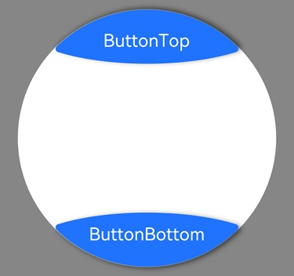

#  ArcButton
<!--Kit: ArkUI-->
<!--Subsystem: ArkUI-->
<!--Owner: @liyi0309-->
<!--SE: @liyi0309-->
<!--TSE: @lxl007-->

弧形按钮组件用于圆形屏幕的穿戴设备。提供强调、普通、警告等样式按钮。

> **说明：**
>
> 该组件从API version 18开始支持。后续版本如有新增内容，则采用上角标单独标记该内容的起始版本。

## 导入模块

```ts
import {
  ArcButton,
  ArcButtonOptions,
  ArcButtonStatus,
  ArcButtonStyleMode,
  ArcButtonPosition,
}  from '@kit.ArkUI';
```

## 子组件

无

## 属性
不支持[通用属性](ts-component-general-attributes.md)

## 事件
通用事件支持[点击事件](ts-universal-events-click.md)和[触摸事件](ts-universal-events-touch.md)。

## ArcButton

ArcButton({ options: ArcButtonOptions })

创建ArcButton实例，入参是弧形按钮配置选项。

**装饰器类型：** @Component

**原子化服务API：** 从API version 18开始，该接口支持在原子化服务中使用。

**系统能力：** SystemCapability.ArkUI.ArkUI.Circle

**参数**：

| 名称    | 类型             | 必填 | 装饰器类型  | 说明                      |
| ------- | ---------------- | ---- | ----------- | ------------------------- |
| options | [ArcButtonOptions](#arcbuttonoptions) | 是   | @Require | 定义ArcButton组件的文本、背景色、阴影等参数。 |

## ArcButtonOptions

定义ArcButton的默认样式或自定义样式参数。

**原子化服务API：** 从API version 18开始，该接口支持在原子化服务中使用。

**系统能力：** SystemCapability.ArkUI.ArkUI.Circle

### 属性

| 名称             | 类型                                                         | 只读 | 可选 | 说明                                                         |
| ---------------- | ------------------------------------------------------------ | ---- | ------------------------------------------------------------ | ------------------------------------------------------------ |
| position         | [ArcButtonPosition](#arcbuttonposition)                      | 否   | 否 | 上下弧形按钮类型属性。<br/>默认值：ArcButtonPosition.BOTTOM_EDGE |
| styleMode        | [ArcButtonStyleMode](#arcbuttonstylemode)                    | 否   | 否  | 弧形按钮样式模式。<br>默认值：ArcButtonStyleMode.EMPHASIZED_LIGHT |
| status           | [ArcButtonStatus](#arcbuttonstatus)                          | 否  | 否  | 弧形按钮状态。<br/>默认值：ArcButtonStatus.NORMAL          |
| label     | [ResourceStr](ts-types.md#resourcestr)                       | 否   | 否  | 弧形按钮显示文本。                                           |
| backgroundBlurStyle | [BlurStyle](ts-universal-attributes-background.md#blurstyle9) | 否   | 否  | 弧形按钮背景模糊能力。<br/>默认值：BlurStyle.NONE |
| backgroundColor  | [ColorMetrics](../js-apis-arkui-graphics.md#colormetrics12)  | 否  | 否  | 弧形按钮背景颜色。<br/>ArcButtonStyleMode需要设置为CUSTOM。<br/>默认值：Color.Black                 |
| shadowColor      | [ColorMetrics](../js-apis-arkui-graphics.md#colormetrics12)  | 否  | 否  | 弧形按钮阴影颜色。<br/>默认值：Color.Black                 |
| shadowEnabled    | boolean                                                      | 否  | 否  | 弧形按钮阴影开关。<br/>默认值：false<br/>值为true时，显示阴影。值为false时，不显示阴影。 |
| fontSize | [LengthMetrics](../js-apis-arkui-graphics.md#lengthmetrics12) | 否  | 否  | 弧形按钮文本大小。<br/>默认值：19fp                        |
| fontColor | [ColorMetrics](../js-apis-arkui-graphics.md#colormetrics12)  | 否   | 否  | 弧形按钮文本颜色。<br/>ArcButtonStyleMode需要设置为CUSTOM。<br/>默认值：Color.White                 |
| pressedFontColor | [ColorMetrics](../js-apis-arkui-graphics.md#colormetrics12)  | 否  | 否  | 弧形按钮按下文本颜色。<br/>ArcButtonStyleMode需要设置为CUSTOM。<br/>默认值：Color.White             |
| fontStyle | [FontStyle](ts-appendix-enums.md#fontstyle)                  | 否  | 否  | 弧形按钮文本样式。<br/>默认值：FontStyle.Normal            |
| fontFamily | string \| [Resource](ts-types.md#resource)                   | 否  | 否  | 弧形按钮字体名。                                             |
| fontMargin | [LocalizedMargin](ts-types.md#localizedmargin12)             | 否  | 否  | 弧形按钮文本边距。<br/>默认值：{start:24vp, top: 10vp,end: 24vp, bottom:16vp } |
|onTouch | [Callback](ts-types.md#voidcallback12)&lt; [TouchEvent](ts-universal-events-touch.md#touchevent对象说明)&gt; | 否   | 是  | 弧形按钮手指触摸动作触发该回调。 |
|onClick | [Callback](ts-types.md#voidcallback12)&lt;[ClickEvent](ts-universal-events-click.md#clickevent对象说明) &gt; | 否   | 是  | 弧形按钮点击动作触发该回调。 |

### constructor

constructor(options: CommonArcButtonOptions)

弧形按钮的构造器。

**原子化服务API：** 从API version 18开始，该接口支持在原子化服务中使用。

**系统能力：** SystemCapability.ArkUI.ArkUI.Circle

**参数：** 

| 参数名| 类型                                              | 必填 | 说明                                          |
| ------- | ------------------------------------------------- | ---- | --------------------------------------------- |
| options | [CommonArcButtonOptions](#commonarcbuttonoptions) | 是   | 定义ArcButton组件的文本、背景色、阴影等参数。 |

## CommonArcButtonOptions

ArcButton的默认样式或自定义样式参数。

**原子化服务API：** 从API version 18开始，该接口支持在原子化服务中使用。

**系统能力：** SystemCapability.ArkUI.ArkUI.Circle

| 名称                | 类型                                                         | 只读 | 可选 | 说明                                                         |
| ------------------- | ------------------------------------------------------------ | ---- | ------------------------------------------------------------ | ------------------------------------------------------------ |
| position            | [ArcButtonPosition](#arcbuttonposition)                      |否  |是  | 上下弧形按钮类型属性。<br/>默认值：ArcButtonPosition.BOTTOM_EDGE |
| styleMode           | [ArcButtonStyleMode](#arcbuttonstylemode)                    | 否  | 是 | 弧形按钮样式模式。<br>默认值：ArcButtonStyleMode.EMPHASIZED_LIGHT |
| status              | [ArcButtonStatus](#arcbuttonstatus)                          |否   |是   | 弧形按钮状态。<br/>默认值：ArcButtonStatus.NORMAL            |
| label               | [ResourceStr](ts-types.md#resourcestr)                       |否 |是 | 弧形按钮显示文本。                                           |
| backgroundBlurStyle | [BlurStyle](ts-universal-attributes-background.md#blurstyle9) | 否  | 是 | 弧形按钮背景模糊能力。<br/>默认值：BlurStyle.NONE            |
| backgroundColor     | [ColorMetrics](../js-apis-arkui-graphics.md#colormetrics12)  | 否 | 是 | 弧形按钮背景颜色。<br/>ArcButtonStyleMode需要设置为CUSTOM。<br/>默认值：Color.Black                   |
| shadowColor         | [ColorMetrics](../js-apis-arkui-graphics.md#colormetrics12)  | 否  | 是 | 弧形按钮阴影颜色。<br/>默认值：Color.Black                   |
| shadowEnabled       | boolean                                                      | 否 | 是 | 弧形按钮阴影开关。<br/>默认值：false<br/>值为true时，显示阴影。值为false时，不显示阴影。 |
| fontSize            | [LengthMetrics](../js-apis-arkui-graphics.md#lengthmetrics12) | 否  | 是 | 弧形按钮文本大小。<br/>默认值：19fp                          |
| fontColor           | [ColorMetrics](../js-apis-arkui-graphics.md#colormetrics12)  |否  |是  | 弧形按钮文本颜色。<br/>ArcButtonStyleMode需要设置为CUSTOM。<br/>默认值：Color.White                   |
| pressedFontColor    | [ColorMetrics](../js-apis-arkui-graphics.md#colormetrics12)  | 否  | 是 | 弧形按钮按下文本颜色。<br/>ArcButtonStyleMode需要设置为CUSTOM。<br/>默认值：Color.White               |
| fontStyle           | [FontStyle](ts-appendix-enums.md#fontstyle)                  | 否  | 是 | 弧形按钮文本样式。<br/>默认值：FontStyle.Normal              |
| fontFamily          | string \| [Resource](ts-types.md#resource)                   |否  |是  | 弧形按钮字体名。                                             |
| fontMargin          | [LocalizedMargin](ts-types.md#localizedmargin12)             | 否  | 是 | 弧形按钮文本边距。<br/>默认值：{start:24vp, top: 10vp,end: 24vp, bottom:16vp } |
| onTouch             | [Callback](ts-types.md#voidcallback12)&lt; [TouchEvent](ts-universal-events-touch.md#touchevent对象说明)&gt; | 否   | 是  | 弧形按钮手指触摸动作触发该回调。                             |
| onClick             | [Callback](ts-types.md#voidcallback12)&lt;[ClickEvent](ts-universal-events-click.md#clickevent对象说明) &gt; | 否   | 是  | 弧形按钮点击动作触发该回调。                                 |

## ArcButtonPosition

定义ArcButton可设置的弧形按钮的类型。

**原子化服务API：** 从API version 18开始，该接口支持在原子化服务中使用。

**系统能力：** SystemCapability.ArkUI.ArkUI.Circle

| 名称        | 值   | 说明                           |
| ----------- | ---- | -------------------------------- |
| TOP_EDGE    | 0    | 上弧形按钮，位于圆形屏幕上方。     |
| BOTTOM_EDGE | 1    | 底部弧形按钮，位于圆形屏幕底部。 |


## ArcButtonStyleMode

定义ArcButton可设置弧形按钮样式模式。

**原子化服务API：** 从API version 18开始，该接口支持在原子化服务中使用。

**系统能力：** SystemCapability.ArkUI.ArkUI.Circle

| 名称             | 值   | 说明             |
| ---------------- | ---- | ---------------- |
| EMPHASIZED_LIGHT | 0    | 强调状态，亮色。 |
| EMPHASIZED_DARK  | 1    | 强调状态，暗色。 |
| NORMAL_LIGHT     | 2    | 正常状态，亮色。 |
| NORMAL_DARK      | 3    | 正常状态，暗色。 |
| CUSTOM           | 4    | 自定义按钮颜色和字体颜色。 |


## ArcButtonStatus

定义ArcButton可设置的弧形按钮状态。

**原子化服务API：** 从API version 18开始，该接口支持在原子化服务中使用。

**系统能力：** SystemCapability.ArkUI.ArkUI.Circle

| 名称     | 值   | 说明       |
| -------- | ---- | ---------- |
| NORMAL   | 0    | 正常状态。 |
| PRESSED  | 1    | 按压状态。 |
| DISABLED | 2    | 禁用状态。 |


## 示例

从API version18开始，该示例展示了ArcButton的基本用法。

topOptions定义了上弧形按钮，按钮文本为ButtonTop，字体大小为15fp，按钮状态为正常状态，按钮样式为亮色强调，启用阴影。

bottomOptions定义了底部弧形按钮，按钮文本为ButtonBottom，字体大小为15fp，按钮样式为亮色强调，启用阴影，设置了按钮的点击事件。

```ts
// xxx.ets
import {
  LengthMetrics,
  LengthUnit,
  ArcButton,
  ArcButtonOptions,
  ArcButtonStatus,
  ArcButtonStyleMode,
  ArcButtonPosition,
}  from '@kit.ArkUI';

@Entry
@ComponentV2
struct Index {
  @Local topOptions: ArcButtonOptions = new ArcButtonOptions({});
  @Local bottomOptions: ArcButtonOptions = new ArcButtonOptions({});

  aboutToAppear() {
    this.topOptions = new ArcButtonOptions({
      label: 'ButtonTop',
      status: ArcButtonStatus.NORMAL,
      position: ArcButtonPosition.TOP_EDGE,
      styleMode: ArcButtonStyleMode.EMPHASIZED_LIGHT,
      fontSize: new LengthMetrics(15, LengthUnit.FP),
      shadowEnabled: true
    })

    this.bottomOptions = new ArcButtonOptions({
      label: 'ButtonBottom',
      styleMode: ArcButtonStyleMode.EMPHASIZED_LIGHT,
      fontSize: new LengthMetrics(15, LengthUnit.FP),
      shadowEnabled: true,
      onClick: () => {
        console.info('click from ArcButton.');
      }
    })
  }

  build() {
    Stack() {
      Stack() {
        Circle({ width: 233, height: 233 })
          .strokeWidth(0.1)
          .fill(Color.White)

        Column() {
          ArcButton({ options: this.topOptions })
          Blank()
          ArcButton({ options: this.bottomOptions })

        }.width('100%')
        .height('100%')
      }.width(233)
      .height(233)
    }.width('100%')
    .height('100%')
    .alignContent(Alignment.Center)
    .backgroundColor(Color.Gray)
  }
}

```

