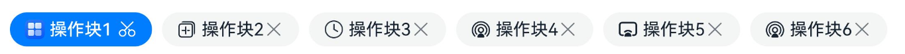
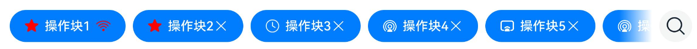

# ChipGroup
<!--Kit: ArkUI-->
<!--Subsystem: ArkUI-->
<!--Owner: @song-song-song-->
<!--Designer: @fenglinbailu-->
<!--Tester: @weixin_45530366-->
<!--Adviser: @Brilliantry_Rui-->

ChipGroup组件提供操作块群组能力，支持单选或多选模式，可自定义样式、图标和间距，支持选中状态管理和事件回调。适用于文件分类、资源筛选、标签选择、内容分组等多种场景，帮助开发者快速实现选择功能，提供统一的视觉和交互体验。

> **说明：**
>
> - 该组件从API version 12开始支持。后续版本如有新增内容，则采用上角标单独标记该内容的起始版本。
>
> - 本模块接口仅可在Stage模型下使用。

## 导入模块

```typescript
import { ChipSize, ChipGroup } from '@kit.ArkUI';
```

## 子组件

无

## ChipGroup

ChipGroup({ <br> 
  items: ChipGroupItemOptions[], <br> 
  itemStyle?: ChipItemStyle, <br> 
  selectedIndexes?: Array<number\>, <br> 
  multiple?: boolean, <br> 
  chipGroupSpace?: ChipGroupSpaceOptions, <br> 
  chipGroupPadding?: ChipGroupPaddingOptions, <br> 
  backgroundSystemMaterial?: uiMaterial.Material, <br> 
  selectedBackgroundSystemMaterial?: uiMaterial.Material, <br> 
  onChange?: Callback<Array<number\>\>, <br> 
  suffix?: Callback<void\> <br> 
})

**装饰器类型：**@Component

**系统能力：** SystemCapability.ArkUI.ArkUI.Full

**设备行为差异：** 该接口在Wearable设备上使用时，应用程序运行异常，异常信息中提示接口未定义，在其他设备中可正常调用。

| 名称            | 类型                                            | 必填 | 装饰器类型 | 说明                                                                                     |
| --------------- | ----------------------------------------------- | ---- | ------------------------------------------------------------                             | ------------------------------------------------------------                             |
| items           | [ChipGroupItemOptions[]](#chipgroupitemoptions) | 是   | @Require &nbsp;@Prop | 每个Chip的特定属性，参考[ChipGroupItemOptions[]](#chipgroupitemoptions)类型。<br>若为undefined时，ChipGroup默认为空。<br>**原子化服务API：** 从API version 12开始，该接口支持在原子化服务中使用。 |
| itemStyle       | [ChipItemStyle](#chipitemstyle)                 | 否   | @Prop | `Chip`的`style`属性，如颜色、大小等，参考[ChipItemStyle](#chipitemstyle)类型。当需要自定义Chip的外观样式（如改变背景色、字体颜色、尺寸）时传入此参数。<br>默认值：<br>{  size: ChipSize.NORMAL, backgroundColor: $r('sys.color.ohos_id_color_button_normal'), fontColor: $r('sys.color.ohos_id_color_text_primary'), selectedFontColor: $r('sys.color.ohos_id_color_text_primary_contrary'), selectedBackgroundColor: $r('sys.color.ohos_id_color_emphasize') }<br>值为undefined时，按默认值处理。<br>**原子化服务API：** 从API version 12开始，该接口支持在原子化服务中使用。 |
| selectedIndexes | Array&lt;number&gt;                             | 否   | @Prop | 被选中Chip的索引，索引从0开始计数。<br>取值范围：索引值为非负整数，且不能超过items数组长度减1。<br>传入负数、超出数组范围的索引值或非整数时，该索引值不生效。<br>默认值：[0]<br>若multiple=false，selectedIndexes为空数组时默认选中第1个；selectedIndexes包含多个元素时仅第一个索引生效。<br>值为undefined时，按默认值处理。<br>**原子化服务API：** 从API version 12开始，该接口支持在原子化服务中使用。  |
| multiple        | boolean                                         | 否   | @Prop | 是否选中多个`Chip`。<br>`true`：支持多个`Chip`选中，适用于需要同时选择多个选项的场景（如多标签选择、多条件筛选）；`false`：仅支持单个`Chip`选中，适用于单选场景（如单项选择）。<br>默认值：`false`<br>值为undefined时，按默认值处理。<br>**原子化服务API：** 从API version 12开始，该接口支持在原子化服务中使用。 |
| chipGroupSpace  | [ChipGroupSpaceOptions](#chipgroupspaceoptions) | 否   | @Prop | 左右内边距及Chip之间间距。参考[ChipGroupSpaceOptions](#chipgroupspaceoptions)类型。当默认间距无法满足布局要求或需要根据UI设计调整Chip之间的间隔时传入此参数。<br>默认值：{ itemSpace: 8, startSpace: 16, endSpace: 16 }<br>单位：vp<br>值为undefined时，按默认值处理。<br>**原子化服务API：** 从API version 12开始，该接口支持在原子化服务中使用。 |
| chipGroupPadding  | [ChipGroupPaddingOptions](#chipgrouppaddingoptions) | 否   | @Prop | 设置ChipGroup的上下内边距，以控制整体高度。类型为[ChipGroupPaddingOptions](#chipgrouppaddingoptions)。当需要调整ChipGroup组件的垂直空间占用或匹配特定UI设计要求时传入此参数。<br>默认值：{ top: 14, bottom: 14 }<br>单位：vp<br>值为undefined时，按默认值处理。<br>**原子化服务API：** 从API version 12开始，该接口支持在原子化服务中使用。 |
| backgroundSystemMaterial | [uiMaterial.Material](../arkts-apis-uimaterial.md#material) | 否 | @Prop | 设置组件系统材质样式。不同材质具有不同的效果，能够影响组件的[backgroundColor](ts-universal-attributes-background.md#backgroundcolor)、[border](ts-universal-attributes-border.md#border)、[shadow](ts-universal-attributes-image-effect.md#shadow)视觉属性。设置自动反色的系统材质时，fontColor如果使用系统预定义的可反色颜色资源（如`$r('sys.color.font_primary')`），颜色自动适配到材质背景色的反色。当设置backgroundSystemMaterial时，应将backgroundColor设为Color.Transparent，否则会与系统材质冲突。<br>默认值：undefined<br>值为undefined时，不应用材质样式。<br>**起始版本：** 26.0.0<br>**模型约束：** 此接口仅可在Stage模型下使用。<br>**原子化服务API：** 从API版本26.0.0开始，该接口支持在原子化服务中使用。 |
| selectedBackgroundSystemMaterial | [uiMaterial.Material](../arkts-apis-uimaterial.md#material) | 否 | @Prop | 设置组件选中状态的系统材质样式。不同材质具有不同的效果，能够影响组件选中时的[backgroundColor](ts-universal-attributes-background.md#backgroundcolor)、[border](ts-universal-attributes-border.md#border)、[shadow](ts-universal-attributes-image-effect.md#shadow)视觉属性。设置自动反色的系统材质时，selectedFontColor如果使用系统预定义的可反色颜色资源（如`$r('sys.color.font_primary')`），颜色自动适配到材质背景色的反色。当设置selectedBackgroundSystemMaterial时，应将selectedBackgroundColor设为Color.Transparent，否则会与系统材质冲突。<br>默认值：undefined<br>值为undefined时，不应用选中状态的材质样式。<br>**起始版本：** 26.0.0<br>**模型约束：** 此接口仅可在Stage模型下使用。<br>**原子化服务API：** 从API版本26.0.0开始，该接口支持在原子化服务中使用。 |
| onChange        | [Callback](ts-types.md#callback12)\<Array\<number>>  | 否   | -  | Chip状态改变时的回调方法，用于监听Chip选中状态的变更。该回调在selectedIndexes属性更新后触发，开发者可在回调中获取最新的选中状态并执行相应操作，如更新UI、保存选中数据、触发业务逻辑等。当需要监听用户选择Chip的操作并执行相应业务逻辑时传入此参数。不传入时，无法接收Chip状态变化的通知。<br>若为undefined，不触发该回调。<br>**原子化服务API：** 从API version 12开始，该接口支持在原子化服务中使用。                                                              |
| suffix          | [Callback](ts-types.md#callback12)\<void\>                                        | 否   | @BuilderParam | 支持开发者自定义builder，如需在组件最右侧显示自定义内容可配置suffix属性，使用属性suffix需引用[IconGroupSuffix](#icongroupsuffix)接口。<br>默认不传入时，没有suffix。<br>值为undefined时，没有suffix。<br>**原子化服务API：** 从API version 12开始，该接口支持在原子化服务中使用。 |

> **说明：**
>
> 1. 针对`selectedIndexes`和`multiple`接口，当`multiple`等于`false`时，如果没有传入`selectedIndexes`，默认是第一个Chip被选中，如果传入的`selectedIndexes`有一个以上的元素时，默认第一个索引的Chip被选中。
>
> 2. 使用suffix接口时，需引入IconGroupSuffix接口，若不传入，suffix将为空。
>
> 3. 图标填充色（`fillColor`和`activatedFillColor`）的设置应与字体颜色（`fontColor`）保持一致。如果需要设置不同的颜色，可以在传入[ChipGroupItemOptions](#chipgroupitemoptions)时使用`prefixSymbol`。

## ChipGroupItemOptions

ChipGroupItemOptions定义每个Chip的非通用属性。

**系统能力：** SystemCapability.ArkUI.ArkUI.Full

**设备行为差异：** 该接口在Wearable设备上使用时，应用程序运行异常，异常信息中提示接口未定义，在其他设备中可正常调用。

| 名称         | 类型                           | 只读 | 可选 | 说明                              |
| ----------   | ----------------------------- | ---- | ----------------------------------- | ----------------------------------- |
| prefixIcon   | [IconOptions](#iconoptions)   | 否  | 是  | 前缀Image图标属性。当需要在Chip前显示图标以增强视觉识别或提供功能提示时设置此参数。<br>默认值：没有前缀Image图标。<br>值为undefined时，按默认值处理。<br>**原子化服务API：** 从API version 12开始，该接口支持在原子化服务中使用。 |
| prefixSymbol | [ChipSymbolGlyphOptions](ohos-arkui-advanced-Chip.md#chipsymbolglyphoptions12) | 否  | 是  | 前缀SymbolGlyph图标属性。当需要在Chip前显示SymbolGlyph图标以增强视觉识别或提供功能提示时设置此参数。<br>默认值：没有前缀SymbolGlyph图标。<br>值为undefined时，按默认值处理。<br> **原子化服务API：** 从API version 12开始，该接口支持在原子化服务中使用。 |
| label        | [LabelOptions](#labeloptions) | 否  | 否  | 设置Chip项显示的文本内容及样式。<br> **原子化服务API：** 从API version 12开始，该接口支持在原子化服务中使用。                            |
| suffixIcon<sup>(deprecated)</sup>   | [IconOptions](#iconoptions) | 否  | 是 | 后缀Image图标属性。当需要在Chip后显示Image图标以提供额外操作或状态提示时设置此参数。<br>默认值：不显示后缀Image图标。<br>值为undefined时，按默认值处理。<br>**说明**：当suffixIcon有传入参数时，allowClose不生效。<br>**原子化服务API：** 从API version 12开始，该接口支持在原子化服务中使用。<br>**说明：** 从API version 12开始支持，从API version 14开始废弃。建议使用[suffixImageIcon](#suffiximageiconoptions14)替代。 |
| suffixSymbol | [ChipSymbolGlyphOptions](ohos-arkui-advanced-Chip.md#chipsymbolglyphoptions12) | 否  | 是  | 后缀SymbolGlyph图标属性。当需要在Chip后显示SymbolGlyph图标以提供额外操作或状态提示时设置此参数。<br>**说明**：当suffixSymbol有传入参数时，allowClose不生效。suffixSymbol与suffixImageIcon为互斥属性，同一Chip项中只能配置其中一个，若同时配置仅优先级最高的生效（优先级：suffixSymbol > suffixImageIcon）。<br>默认值：不显示后缀SymbolGlyph图标。<br>值为undefined时，按默认值处理。<br> **原子化服务API：** 从API version 12开始，该接口支持在原子化服务中使用。 |
| allowClose   | boolean                       | 否  | 是  | 关闭图标是否显示。<br>false表示关闭图标不显示，true表示关闭图标显示。<br>当需要允许用户删除或移除Chip项时设置此参数为true，适用于编辑模式、可配置标签列表等场景。<br>默认值：false<br>值为undefined时，按默认值处理。<br>**说明**：当suffixSymbol有传入参数时，allowClose不生效；当suffixSymbol没有传入参数而suffixIcon或suffixImageIcon有传入参数时，allowClose不生效；当suffixSymbol、suffixIcon和suffixImageIcon都没有传入参数时，allowClose决定是否显示关闭图标。<br>**原子化服务API：** 从API version 12开始，该接口支持在原子化服务中使用。 |
| suffixImageIcon<sup>14+</sup> | [SuffixImageIconOptions](#suffiximageiconoptions14) | 否 | 是 | 后缀Image图标属性。当需要在Chip后显示图标以提供额外操作或状态提示时设置此参数。<br>**说明**：当suffixImageIcon有传入参数时，allowClose不生效；当suffixSymbol和suffixImageIcon同时配置时，仅suffixSymbol生效，suffixImageIcon不生效。<br>默认值：不显示后缀Image图标。<br>值为undefined时，按默认值处理。<br> **原子化服务API：** 从API version 14开始，该接口支持在原子化服务中使用。 |
| suffixSymbolOptions<sup>14+</sup> | [ChipSuffixSymbolGlyphOptions](ohos-arkui-advanced-Chip.md#chipsuffixsymbolglyphoptions14) | 否 | 是 | 后缀Symbol图标属性，用于配置后缀Symbol图标的交互功能和无障碍属性。当需要为后缀Symbol图标添加点击事件或无障碍支持时设置此参数。<br>默认值：使用[ChipSuffixSymbolGlyphOptions](ohos-arkui-advanced-Chip.md#chipsuffixsymbolglyphoptions14)的默认值。<br>值为undefined时，按默认值处理。<br>**原子化服务API：** 从API version 14开始，该接口支持在原子化服务中使用。 |
| closeOptions<sup>14+</sup> | [CloseOptions](ohos-arkui-advanced-Chip.md#closeoptions14) | 否 | 是 | 默认关闭图标的无障碍朗读功能和字体大小属性。当需要为关闭图标提供自定义的无障碍朗读内容和字体大小时设置此参数。<br>默认值：参考[CloseOptions](ohos-arkui-advanced-Chip.md#closeoptions14)中的默认配置。 <br>值为undefined时，按默认值处理。<br> **原子化服务API：** 从API version 14开始，该接口支持在原子化服务中使用。 |
| accessibilityDescription<sup>14+</sup> | [ResourceStr](ts-types.md#resourcestr) | 否 | 是 | ChipGroup中Chip项的无障碍描述。此描述用于向用户详细解释ChipGroup中Chip项，开发人员应为该Chip项的这一属性提供较为详尽的文本说明，以协助用户理解即将执行的操作及其可能产生的结果。特别是当这些结果无法仅从该Chip项的属性和无障碍文本中直接获知时。如果该Chip项同时具备label文本属性和无障碍说明属性，当其被选中时，系统将首先播报该Chip项的label文本属性，随后播报无障碍说明属性的内容。<br>默认值：空字符串。<br>值为undefined时，按默认值处理。<br> **原子化服务API：** 从API version 14开始，该接口支持在原子化服务中使用。 |
| accessibilityLevel<sup>14+</sup> | string | 否 | 是 | ChipGroup中Chip项无障碍重要性。用于控制ChipGroup中Chip项是否可被无障碍辅助服务所识别。<br>支持的值为：<br>"auto"：ChipGroup中Chip项会转换为“yes”，适用于大多数场景。<br>"yes"：ChipGroup中Chip项可被无障碍辅助服务所识别，适用于需要明确启用无障碍访问的场景。<br>"no"：ChipGroup中Chip项不可被无障碍辅助服务所识别，适用于纯装饰性图标的场景。<br>"no-hide-descendants"：ChipGroup中Chip项及其所有子组件不可被无障碍辅助服务所识别，适用于需要隐藏整个区域的场景。<br>默认值："auto"<br>值为undefined时，按默认值处理。<br> **原子化服务API：** 从API version 14开始，该接口支持在原子化服务中使用。 |


> **说明：**
>
> 当传入`suffixSymbol`参数时，`allowClose`不生效；当传入`suffixImageIcon`参数而`suffixSymbol`没有传入参数时，`allowClose`不生效；当`suffixSymbol`和`suffixImageIcon`都没有传入参数时，`allowClose`决定是否显示关闭图标。`suffixIcon`已废弃，请使用`suffixImageIcon`。
>
> `suffixSymbol`、`suffixImageIcon`均为后缀图标，同一Chip项中只能配置其中一个。若同时配置多个，仅优先级最高的生效（优先级：`suffixSymbol` > `suffixImageIcon`）。`suffixIcon`已废弃，建议使用`suffixImageIcon`替代。

## ChipItemStyle

ChipItemStyle定义了Chip的通用属性。

**原子化服务API：** 从API version 12开始，该接口支持在原子化服务中使用。

**系统能力：** SystemCapability.ArkUI.ArkUI.Full

**设备行为差异：** 该接口在Wearable设备上使用时，应用程序运行异常，异常信息中提示接口未定义，在其他设备中可正常调用。

| 名称                    | 类型                                                         | 只读 | 可选 | 说明                                                         |
| ----------------------- | ------------------------------------------------------------ | ---- | ---- | ------------------------------------------------------------ |
| size                    | [ChipSize](ohos-arkui-advanced-Chip.md#chipsize) \| [SizeOptions](ts-types.md#sizeoptions) | 否   | 是   | Chip尺寸，使用时需要从Chip组件引入ChipSize类型。ChipSize.NORMAL适用于大多数标准场景；ChipSize.SMALL适用于紧凑布局或空间受限场景；SizeOptions适用于需要自定义精确尺寸的特殊场景。<br>默认值：ChipSize.NORMAL或{ height: 0, width: 0 }<br> 为undefined时，使用默认值。 |
| backgroundColor         | [ResourceColor](ts-types.md#resourcecolor)                   | 否   | 是   | Chip背景颜色。<br>默认值：$r('sys.color.ohos_id_color_button_normal')<br>**说明**：从API版本26.0.0开始，当设置backgroundSystemMaterial时，应将backgroundColor设为Color.Transparent，否则会与系统材质冲突；当backgroundSystemMaterial为undefined时，backgroundColor属性生效。<br>为undefined时，backgroundColor走默认值。 |
| fontColor               | [ResourceColor](ts-types.md#resourcecolor)                   | 否   | 是   | Chip文字颜色。<br>默认值：$r('sys.color.ohos_id_color_text_primary')<br>**说明**：从API版本26.0.0开始，backgroundSystemMaterial设置自动反色的系统材质时，fontColor使用系统预定义的可反色颜色资源，文字颜色自动适配到材质背景色的反色。<br>为undefined时，fontColor走默认值。 |
| selectedFontColor       | [ResourceColor](ts-types.md#resourcecolor)                   | 否   | 是   | Chip激活时的文字颜色。<br>默认值：\$r('sys.color.ohos_id_color_text_primary_contrary')<br>**说明**：从API版本26.0.0开始，selectedBackgroundSystemMaterial设置自动反色的系统材质时，selectedFontColor使用系统预定义的可反色颜色资源（如`$r('sys.color.font_primary')`），颜色自动适配到材质背景色的反色。<br>为undefined时，selectedFontColor走默认值。 |
| selectedBackgroundColor | [ResourceColor](ts-types.md#resourcecolor)                   | 否   | 是   | Chip激活时的背景颜色。<br>默认值：$r('sys.color.ohos_id_color_emphasize')<br>**说明**：从API版本26.0.0开始，当设置selectedBackgroundSystemMaterial时，应将selectedBackgroundColor设为Color.Transparent，否则会与系统材质冲突；当selectedBackgroundSystemMaterial为undefined时，selectedBackgroundColor属性生效。<br>为undefined时，selectedBackgroundColor走默认值。 |

> **说明：**
>
> 1. Chip的大小有两种类型，一种是ChipSize，提供NORMAL和SMALL两种尺寸供选择；另一种是SizeOptions。
>
> 2. backgroundColor、selectedBackgroundColor传入undefined时，显示默认背景颜色，传入非法值时，背景色透明。
>
> 3. 从API版本26.0.0开始，backgroundSystemMaterial设置自动反色的系统材质时，fontColor使用系统预定义的可反色颜色资源（如`$r('sys.color.font_primary')`），颜色自动适配到材质背景色的反色。

## ChipGroupSpaceOptions

ChipGroupSpaceOptions定义了ChipGroup左右内边距，以及Chip与Chip之间的间距。

**原子化服务API：** 从API version 12开始，该接口支持在原子化服务中使用。

**系统能力：** SystemCapability.ArkUI.ArkUI.Full

**设备行为差异：** 该接口在Wearable设备上使用时，应用程序运行异常，异常信息中提示接口未定义，在其他设备中可正常调用。

| 名称       | 类型            | 只读 | 可选 | 说明                                             |
| ---------- | -------------- | ---- | ------------------------------------------------ | ------------------------------------------------ |
| itemSpace | string \| number  | 否  | 是  | Chip与Chip之间的间距（不支持百分比）。<br>取值范围：<br>number类型：大于等于0的数值（如：0、8、16、24.5）。<br>string类型：单位为fp \| vp \| px \| lpx且数值部分大于等于0的字符串（如："8vp"、"16fp"、"12px"、"10lpx"）。<br>**说明**：传入负数、百分比或无效字符串格式时，使用默认值。 <br>默认值：8<br>单位：vp<br>值为undefined时，按默认值处理。 |
| startSpace | [Length](ts-types.md#length)         | 否  | 是  | 左侧内边距（不支持百分比）。<br>传入负数、百分比或无效字符串格式时，使用默认值。<br>默认值：16<br>单位：vp<br>值为undefined时，按默认值处理。           |
| endSpace   | [Length](ts-types.md#length)         | 否  | 是  | 右侧内边距（不支持百分比）。<br>传入负数、百分比或无效字符串格式时，使用默认值。<br>默认值：16<br>单位：vp<br>值为undefined时，按默认值处理。 |

## ChipGroupPaddingOptions

ChipGroupPaddingOptions定义了ChipGroup的上下内边距，用于控制其整体高度。

**原子化服务API：** 从API version 12开始，该接口支持在原子化服务中使用。

**系统能力：** SystemCapability.ArkUI.ArkUI.Full

**设备行为差异：** 该接口在Wearable设备上使用时，应用程序运行异常，异常信息中提示接口未定义，在其他设备中可正常调用。

| 名称   | 类型            | 只读 | 可选 | 说明                                                      |
| ------ | -------------- | ---- | ------------------------------------------------            | ------------------------------------------------            |
| top    | [Length](ts-types.md#length)         | 否  | 否  | ChipGroup的上方内边距（不支持百分比）。<br>传入负数、百分比或无效字符串格式时，使用默认值。<br>默认值：14<br> 单位：vp<br>值为undefined时，按默认值处理。     |
| bottom | [Length](ts-types.md#length)         | 否  | 否  | ChipGroup的下方内边距（不支持百分比）。<br>传入负数、百分比或无效字符串格式时，使用默认值。<br>默认值：14<br> 单位：vp<br>值为undefined时，按默认值处理。     |

## SuffixImageIconOptions<sup>14+</sup>

后缀图标选项的类型。

继承自[IconOptions](#iconoptions)。

**原子化服务API：** 从API version 14开始，该接口支持在原子化服务中使用。

**系统能力：** SystemCapability.ArkUI.ArkUI.Full

**设备行为差异：** 该接口在Wearable设备上使用时，应用程序运行异常，异常信息中提示接口未定义，在其他设备中可正常调用。

| 名称 | 类型 | 只读 | 可选 | 说明 |
| ---- | ---- | --- | ---- | ---- |
| action | [VoidCallback](ts-types.md#voidcallback12) | 否 | 是 | 后缀图标响应事件，用户点击后缀图标时触发回调。当需要为后缀图标添加自定义交互功能时设置此参数，如执行搜索、打开菜单、删除项等操作。<br>值为undefined时，无后缀图标响应事件。 |
| accessibilityText | [ResourceStr](ts-types.md#resourcestr) | 否 | 是 | 后缀图标的无障碍文本属性。用于为用户进一步说明后缀图标，开发人员可为后缀图标的该属性设置相对较详细的解释文本，帮助用户理解将要执行的操作。如帮助用户理解将要执行的操作可能导致什么后果，尤其是当这些后果无法从后缀图标本身属性与无障碍文本中了解到时。若后缀图标既拥有文本属性又拥有无障碍说明属性，则后缀图标被选中时，先播报后缀图标的文本属性，再播报无障碍说明属性的内容。<br>默认值：空字符串。<br>值为undefined时，按默认值处理。 |
| accessibilityDescription | [ResourceStr](ts-types.md#resourcestr) | 否 | 是 | 后缀图标的无障碍描述。此描述用于向用户详细解释后缀图标，开发人员应为后缀图标的这一属性提供较为详尽的文本说明，以协助用户理解即将执行的操作及其可能产生的后果，特别是当这些后果无法仅从后缀图标的属性和无障碍文本中直接获知时。如果后缀图标同时具备文本属性和无障碍说明属性，当后缀图标被选中时，系统将首先播报后缀图标的文本属性，随后播报无障碍说明属性的内容。<br>默认值：空字符串。<br>值为undefined时，按默认值处理。 |
| accessibilityLevel | string | 否 | 是 | 后缀图标无障碍重要性。用于控制后缀图标是否可被无障碍辅助服务所识别。当需要为无障碍辅助服务用户提供访问支持，或需要将装饰性图标从无障碍树中排除时设置此参数。<br>支持的值为：<br>"auto"：后缀图标存在action时转化为“yes”，不存在action时，转化为“no”，适用于大多数场景。<br>"yes"：后缀图标可被无障碍辅助服务所识别，适用于功能性图标。<br>"no"：后缀图标不可被无障碍辅助服务所识别，适用于纯装饰性图标。<br>"no-hide-descendants"：后缀图标及其所有子组件不可被无障碍辅助服务所识别，适用于需要隐藏整个区域的场景。<br>默认值："auto"<br>值为undefined时，按默认值处理。 |

## SymbolItemOptions<sup>14+</sup>

ChipGroup的后缀图标选项类型。

**原子化服务API：** 从API version 14开始，该接口支持在原子化服务中使用。

**系统能力：** SystemCapability.ArkUI.ArkUI.Full

**设备行为差异：** 该接口在Wearable设备上使用时，应用程序运行异常，异常信息中提示接口未定义，在其他设备中可正常调用。

| 名称 | 类型 | 只读 | 可选 | 说明 |
| ---- | ---- | --- | ---- | ---- |
| symbol | [SymbolGlyphModifier](ts-universal-attributes-attribute-symbolglyphmodifier.md#symbolglyphmodifier) | 否 | 否 | 尾部图标的SymbolGlyphModifier配置对象，用于设置图标的显示样式、渲染模式等。|
| action | [VoidCallback](ts-types.md#voidcallback12) | 否 | 否 | 尾部图标响应事件，用户点击尾部图标时触发回调。当需要为尾部图标添加自定义交互功能时设置此参数，如执行特定操作、打开界面等。<br>值为undefined时，无尾部图标响应事件。|
| accessibilityText | [ResourceStr](ts-types.md#resourcestr) | 否 | 是 | 尾部图标的无障碍文本属性。用于为用户进一步说明尾部图标，开发人员可为尾部图标的该属性设置相对较详细的解释文本，帮助用户理解将要执行的操作。如帮助用户理解将要执行的操作可能导致什么后果，尤其是当这些后果无法从尾部图标本身属性与无障碍文本中了解到时。若尾部图标既拥有文本属性又拥有无障碍说明属性，则尾部图标被选中时，先播报尾部图标的文本属性，再播报无障碍说明属性的内容。<br>默认值：空字符串。<br>值为undefined时，按默认值处理。|
| accessibilityDescription | [ResourceStr](ts-types.md#resourcestr) | 否 | 是 | 尾部图标的无障碍描述。此描述用于向用户详细解释尾部图标，开发人员应为尾部图标的这一属性提供较为详尽的文本说明，以协助用户理解即将执行的操作及其可能产生的后果，特别是当这些后果无法仅从尾部图标的属性和无障碍文本中直接获知时。如果尾部图标同时具备文本属性和无障碍说明属性，当尾部图标被选中时，系统将首先播报尾部图标的文本属性，随后播报无障碍说明属性的内容。<br>默认值：空字符串。<br>值为undefined时，按默认值处理。|
| accessibilityLevel | string | 否 | 是 | 尾部图标无障碍重要性。用于控制尾部图标是否可被无障碍辅助服务所识别。当需要为无障碍辅助服务用户提供访问支持，或需要将装饰性图标从无障碍树中排除时设置此参数。<br>支持的值为：<br>"auto"：尾部图标转化为“yes”，适用于大多数场景。<br>"yes"：尾部图标可被无障碍辅助服务所识别，适用于需要明确启用无障碍访问的场景。<br>"no"：尾部图标不可被无障碍辅助服务所识别，适用于纯装饰性图标的场景。<br>"no-hide-descendants"：尾部图标及其所有子组件不可被无障碍辅助服务所识别，适用于需要隐藏整个区域的场景。<br>默认值："auto"。<br>值为undefined时，按默认值处理。 |

## IconGroupSuffix

```typescript
IconGroupSuffix({
  items: Array<IconItemOptions | SymbolGlyphModifier | SymbolItemOptions>,
  iconBackgroundSystemMaterial?: uiMaterial.Material
})
```

**装饰器类型：**@Component

**系统能力：** SystemCapability.ArkUI.ArkUI.Full

**设备行为差异：** 该接口在Wearable设备上使用时，应用程序运行异常，异常信息中提示接口未定义，在其他设备中可正常调用。

| 名称                        | 类型                    | 必填 | 装饰器类型 | 说明                                                              |
| --------------------------- | ---------------------- | ---- | ----------------------------------------------| ----------------------------------------------|
| items                       | Array<[IconItemOptions](#iconitemoptions) \| [SymbolGlyphModifier](ts-universal-attributes-attribute-symbolglyphmodifier.md#symbolglyphmodifier) \| [SymbolItemOptions](#symbolitemoptions14)> | 是   | @Require &nbsp;@Prop | 尾部区域显示的自定义项数组，支持IconItemOptions（Image图标）、SymbolGlyphModifier（Symbol图标）或SymbolItemOptions（Symbol图标配置）类型。<br>**原子化服务API：** 从API version 12开始，该接口支持在原子化服务中使用。|
| iconBackgroundSystemMaterial | [uiMaterial.Material](../arkts-apis-uimaterial.md#material) | 否 | @Prop | 设置组件系统材质样式。不同材质具有不同的效果，能够影响组件的[backgroundColor](ts-universal-attributes-background.md#backgroundcolor)、[border](ts-universal-attributes-border.md#border)、[shadow](ts-universal-attributes-image-effect.md#shadow)视觉属性。设置自动反色的系统材质时，fontColor如果使用系统预定义的可反色颜色资源（如`$r('sys.color.font_primary')`），颜色自动适配到材质背景色的反色。<br>默认值：undefined<br>值为undefined时，不应用材质样式。<br>**起始版本：** 26.0.0<br>**模型约束：** 此接口仅可在Stage模型下使用。<br>**原子化服务API：** 从API版本26.0.0开始，该接口支持在原子化服务中使用。|

> **说明：**
>
> 传参SymbolGlyphModifier时，不支持使用symbolEffect修改动效类型和[effectStrategy](./ts-basic-components-symbolGlyph.md#effectstrategy)设置动效。
>

## IconItemOptions

定义了尾部builder接口，用于配置尾部图标及其背景区域的显示属性。

**系统能力：** SystemCapability.ArkUI.ArkUI.Full

**设备行为差异：** 该接口在Wearable设备上使用时，应用程序运行异常，异常信息中提示接口未定义，在其他设备中可正常调用。

| 名称     | 类型                            | 只读 | 可选 | 说明                                    |
| -------- | --------------                 | ---- | ------------------------------           | ------------------------------           |
| icon     | [IconOptions](#iconoptions)    | 否  | 否  | 自定义Builder icon。<br>Chip大小是ChipSize.SMALL时，icon的size默认值：{width: '16vp',height: '16vp'}。<br>Chip大小是ChipSize.NORMAL时，icon的size默认值：{width: '24vp',height: '24vp'}。<br> 如果想动态修改size，那么必须在引入[IconGroupSuffix](#icongroupsuffix)时，使用[SymbolGlyphModifier](ts-universal-attributes-attribute-symbolglyphmodifier.md#symbolglyphmodifier)类型。<br>值为undefined时，按默认值处理。<br> **原子化服务API：** 从API version 12开始，该接口支持在原子化服务中使用。 |
| action   | [Callback](ts-types.md#callback12)\<void>        | 否  | 否  | 尾部图标点击事件回调，用户点击尾部图标时触发。当需要为尾部图标添加自定义交互功能时设置此参数，如执行特定操作、打开界面等。<br>为undefined时，不触发该回调。<br> **原子化服务API：** 从API version 12开始，该接口支持在原子化服务中使用。            |
| accessibilityText<sup>14+</sup> | [ResourceStr](ts-types.md#resourcestr) | 否 | 是 | 尾部图标无障碍文本属性。用于为用户进一步说明尾部图标，开发人员可为尾部图标的该属性设置相对较详细的解释文本，帮助用户理解将要执行的操作。如帮助用户理解将要执行的操作可能导致什么后果，尤其是当这些后果无法从尾部图标本身属性与无障碍文本中了解到时。若尾部图标既拥有文本属性又拥有无障碍说明属性，则尾部图标被选中时，先播报尾部图标的文本属性，再播报无障碍说明属性的内容。<br>默认值：空字符串。<br>值为undefined时，按默认值处理。<br>**原子化服务API：** 从API version 14开始，该接口支持在原子化服务中使用。 |
| accessibilityDescription<sup>14+</sup> | [ResourceStr](ts-types.md#resourcestr) | 否 | 是 | 尾部图标无障碍描述。此描述用于向用户详细解释尾部图标，开发人员应为尾部图标的这一属性提供较为详尽的文本说明，以协助用户理解即将执行的操作及其可能产生的后果，特别是当这些后果无法仅从尾部图标的属性和无障碍文本中直接获知时。如果尾部图标同时具备文本属性和无障碍说明属性，当尾部图标被选中时，系统将首先播报尾部图标的文本属性，随后播报无障碍说明属性的内容。<br>默认值：空字符串。<br>值为undefined时，按默认值处理。<br>**原子化服务API：** 从API version 14开始，该接口支持在原子化服务中使用。 |
| accessibilityLevel<sup>14+</sup> | string | 否 | 是 | 尾部图标无障碍重要性。用于控制尾部图标是否可被无障碍辅助服务所识别。当需要为无障碍辅助服务用户提供访问支持，或需要将装饰性图标从无障碍树中排除时设置此参数。<br>支持的值为：<br>"auto"：尾部图标转化为“yes”，适用于大多数场景。<br>"yes"：尾部图标可被无障碍辅助服务所识别，适用于功能性图标。<br>"no"：尾部图标不可被无障碍辅助服务所识别，适用于纯装饰性图标。<br>"no-hide-descendants"：尾部图标及其所有子组件不可被无障碍辅助服务所识别，适用于需要隐藏整个区域的场景。<br>默认值："auto"<br>值为undefined时，按默认值处理。<br>**原子化服务API：** 从API version 14开始，该接口支持在原子化服务中使用。 |

## IconOptions

IconOptions定义图标的通用属性。

**原子化服务API：** 从API version 12开始，该接口支持在原子化服务中使用。

**系统能力：** SystemCapability.ArkUI.ArkUI.Full

**设备行为差异：** 该接口在Wearable设备上使用时，应用程序运行异常，异常信息中提示接口未定义，在其他设备中可正常调用。

| 名称 | 类型                                   | 只读 | 可选 | 说明                                                         |
| ---- | -------------------------------------- | ---- | ---- | ------------------------------------------------------------ |
| src  | [ResourceStr](ts-types.md#resourcestr) | 否   | 否   | 图标图片或图片地址引用请参考[Image](ts-basic-components-image.md#image-1)。 |
| size | [SizeOptions](ts-types.md#sizeoptions) | 否   | 是   | 图标大小，不支持百分比。当需要自定义图标尺寸时设置此参数。<br>默认值：<br>- ChipItemStyle.size为ChipSize.SMALL时，默认值为：{width: $r('sys.float.chip_small_icon_size'), height: $r('sys.float.chip_small_icon_size')}<br>- 其他情况下，默认值为：{width: $r('sys.float.chip_normal_icon_size'), height: $r('sys.float.chip_normal_icon_size')}   <br>值为undefined时，按默认值处理。   |

## LabelOptions

LabelOptions定义文本属性。

**原子化服务API：** 从API version 12开始，该接口支持在原子化服务中使用。

**系统能力：** SystemCapability.ArkUI.ArkUI.Full

**设备行为差异：** 该接口在Wearable设备上使用时，应用程序运行异常，异常信息中提示接口未定义，在其他设备中可正常调用。

| 名称 | 类型   | 只读 | 可选 | 说明     |
| ---- | ------ | ---- | -------- | -------- |
| text | string | 否  | 否  | Chip项显示的文本内容，用于设置Chip上展示的文字信息。 |

## 示例

### 示例1（无最右侧的builder）

该示例实现了在没有最右侧builder时的效果。

```typescript
import { ChipSize, ChipGroup } from '@kit.ArkUI';

@Entry
@Component
struct Index {
  @State selectedIndex: Array<number> = [0, 1, 2, 3, 4, 5, 6];

  build() {
    Column() {
      ChipGroup({
        // items内每个对象设置的都是每个Chip的特定属性。
        items: [
          {
            // $r('app.media.icon')需要替换为开发者所需的图像资源文件。
            prefixIcon: { src: $r('app.media.icon') },
            label: { text: '操作块1' },
            suffixIcon: { src: $r('sys.media.ohos_ic_public_cut') },
            allowClose: false
          },
          {
            prefixIcon: { src: $r('sys.media.ohos_ic_public_copy') },
            label: { text: '操作块2' },
            allowClose: true
          },
          {
            prefixIcon: { src: $r('sys.media.ohos_ic_public_clock') },
            label: { text: '操作块3' },
            allowClose: true
          },
          {
            prefixIcon: { src: $r('sys.media.ohos_ic_public_cast_stream') },
            label: { text: '操作块4' },
            allowClose: true
          },
          {
            prefixIcon: { src: $r('sys.media.ohos_ic_public_cast_mirror') },
            label: { text: '操作块5' },
            allowClose: true
          },
          {
            prefixIcon: { src: $r('sys.media.ohos_ic_public_cast_stream') },
            label: { text: '操作块6' },
            allowClose: true
          },
        ],
        // 设置Chip的style属性。
        itemStyle: {
          size: ChipSize.SMALL,
          backgroundColor: $r('sys.color.ohos_id_color_button_normal'),
          fontColor: $r('sys.color.ohos_id_color_text_primary'),
          selectedBackgroundColor: $r('sys.color.ohos_id_color_emphasize'),
          selectedFontColor: $r('sys.color.ohos_id_color_text_primary_contrary'),
        },
        selectedIndexes: this.selectedIndex,
        multiple: false,
        chipGroupSpace: { itemSpace: 8, endSpace: 0 },
        chipGroupPadding: { top: 10, bottom: 10 },
        onChange: (activatedChipsIndex: Array<number>) => {
          console.info('chips on clicked, activated index ' + activatedChipsIndex);
        },
      })
    }
  }
}
```



### 示例2（有最右侧的builder）

通过配置suffix实现最右侧的自定义组件效果。

```typescript
import { ChipSize, ChipGroup, IconGroupSuffix } from '@kit.ArkUI';

@Entry
@Component
struct Index {
  @State selectedIndex: Array<number> = [0, 1, 2, 3, 4, 5, 6];
  @State selectedState: boolean = true;

  @LocalBuilder
  ChipGroupSuffix(): void {
    // 开发者通过引用IconGroupSuffix，实现组件最右侧的自定义组件效果。
    IconGroupSuffix({
      items: [{
        icon: { src: $r('sys.media.ohos_ic_public_search_filled'), size: { width: 36, height: 36 } },
        action: () => {
          if (this.selectedState == false) {
            this.selectedIndex = [0, 1, 2, 3, 4, 5, 6];
            this.selectedState = true;
          } else {
            this.selectedIndex = [];
            this.selectedState = false;
          }
        }
      }
      ]
    })
  }

  build() {
    Column() {
      ChipGroup({
        // items内每个对象设置的都是每个Chip的特定属性。
        items: [
          {
            // $r('app.media.icon')需要替换为开发者所需的图像资源文件。
            prefixIcon: { src: $r('app.media.icon') },
            label: { text: '操作块1' },
            suffixIcon: { src: $r('sys.media.ohos_ic_public_cut') },
            allowClose: false
          },
          {
            prefixIcon: { src: $r('sys.media.ohos_ic_public_copy') },
            label: { text: '操作块2' },
            allowClose: true
          },
          {
            prefixIcon: { src: $r('sys.media.ohos_ic_public_clock') },
            label: { text: '操作块3' },
            allowClose: true
          },
          {
            prefixIcon: { src: $r('sys.media.ohos_ic_public_cast_stream') },
            label: { text: '操作块4' },
            allowClose: true
          },
          {
            prefixIcon: { src: $r('sys.media.ohos_ic_public_cast_mirror') },
            label: { text: '操作块5' },
            allowClose: true
          },
          {
            prefixIcon: { src: $r('sys.media.ohos_ic_public_cast_stream') },
            label: { text: '操作块6' },
            allowClose: true
          },
        ],
        // 设置Chip的style属性。
        itemStyle: {
          size: ChipSize.NORMAL,
          backgroundColor: $r('sys.color.ohos_id_color_button_normal'),
          fontColor: $r('sys.color.ohos_id_color_text_primary'),
          selectedBackgroundColor: $r('sys.color.ohos_id_color_emphasize'),
          selectedFontColor: $r('sys.color.ohos_id_color_text_primary_contrary'),
        },
        selectedIndexes: this.selectedIndex,
        multiple: true,
        chipGroupSpace: { itemSpace: 8, endSpace: 0 },
        chipGroupPadding: { top: 10, bottom: 10 },
        onChange: (activatedChipsIndex: Array<number>) => {
          console.info('chips on clicked, activated index ' + activatedChipsIndex);
        },
        // 自定义builder，在组件最右侧显示自定义的内容。
        suffix: this.ChipGroupSuffix
      })
    }
  }
}
```


### 示例3（设置Symbol类型图标）
该示例实现了IconGroupSuffix和ChipGroup传入SymbolGlyph资源。
```typescript
import { ChipSize, ChipGroup, IconGroupSuffix, SymbolGlyphModifier } from '@kit.ArkUI';

@Entry
@Component
struct Index {
  @State selectedIndex: Array<number> = [0, 1, 2, 3, 4, 5, 6];
  @State selectedState: boolean = true;
  @State prefixModifierNormal: SymbolGlyphModifier = new SymbolGlyphModifier($r('sys.symbol.ohos_star'));
  @State prefixModifierActivated: SymbolGlyphModifier =
    new SymbolGlyphModifier($r('sys.symbol.ohos_star')).fontColor([Color.Red]);
  @State suffixModifierNormal: SymbolGlyphModifier = new SymbolGlyphModifier($r('sys.symbol.ohos_wifi'));
  @State suffixModifierActivated: SymbolGlyphModifier =
    new SymbolGlyphModifier($r('sys.symbol.ohos_wifi')).fontColor([Color.Red]);

  @LocalBuilder
  ChipGroupSuffix(): void {
    // 开发者通过引用IconGroupSuffix，实现组件最右侧的自定义组件效果。
    IconGroupSuffix({
      items: [
        new SymbolGlyphModifier($r('sys.symbol.magnifyingglass'))
          .onClick(() => {
            if (this.selectedState == false) {
              this.selectedIndex = [0, 1, 2, 3, 4, 5, 6];
              this.selectedState = true;
            } else {
              this.selectedIndex = [];
              this.selectedState = false;
            }
          })
      ]
    })
  }

  build() {
    Column() {
      ChipGroup({
        // items内每个对象设置的都是每个Chip的特定属性。
        items: [
          {
            prefixSymbol: { normal: this.prefixModifierNormal, activated: this.prefixModifierActivated },
            label: { text: '操作块1' },
            suffixSymbol: { normal: this.suffixModifierNormal, activated: this.suffixModifierActivated },
            allowClose: false,
          },
          {
            prefixSymbol: { normal: this.prefixModifierNormal, activated: this.prefixModifierActivated },
            label: { text: '操作块2' },
            allowClose: true,
          },
          {
            prefixIcon: { src: $r('sys.media.ohos_ic_public_clock') },
            label: { text: '操作块3' },
            allowClose: true,
          },
          {
            prefixIcon: { src: $r('sys.media.ohos_ic_public_cast_stream') },
            label: { text: '操作块4' },
            allowClose: true,
          },
          {
            prefixIcon: { src: $r('sys.media.ohos_ic_public_cast_mirror') },
            label: { text: '操作块5' },
            allowClose: true,
          },
          {
            prefixIcon: { src: $r('sys.media.ohos_ic_public_cast_stream') },
            label: { text: '操作块6' },
            allowClose: true,
          },
        ],
        // 设置Chip的style属性。
        itemStyle: {
          size: ChipSize.NORMAL,
          backgroundColor: $r('sys.color.ohos_id_color_button_normal'),
          fontColor: $r('sys.color.ohos_id_color_text_primary'),
          selectedBackgroundColor: $r('sys.color.ohos_id_color_emphasize'),
          selectedFontColor: $r('sys.color.ohos_id_color_text_primary_contrary'),
        },
        selectedIndexes: this.selectedIndex,
        multiple: true,
        chipGroupSpace: { itemSpace: 8, endSpace: 0 },
        chipGroupPadding: { top: 10, bottom: 10 },
        onChange: (activatedChipsIndex: Array<number>) => {
          console.info('chips on clicked, activated index ' + activatedChipsIndex);
        },
        // 自定义builder，在组件最右侧显示自定义的内容。
        suffix: this.ChipGroupSuffix
      })
    }
  }
}
```


### 示例4（单选时无障碍朗读）

该示例实现ChipGroup在单选模式下，有后缀区域和无后缀区域的屏幕朗读功能，具体播报内容为accessibilityText属性中的内容。

```typescript
import { ChipGroup, IconGroupSuffix, SymbolGlyphModifier } from '@kit.ArkUI';

@Builder
function defaultFunction(): void {
}

@Component
struct SectionGroup {
  @Prop
  @Require
  title: ResourceStr;
  @BuilderParam
  @Require
  content: () => void = defaultFunction;

  build() {
    Column({ space: 4 }) {
      Text(this.title)
        .fontColor('#FF666666')
        .fontSize(12)
      Column({ space: 8 }) {
        this.content()
      }
    }
    .alignItems(HorizontalAlign.Start)
    .width('100%')
  }
}

@Component
struct SectionItem {
  @Prop
  @Require
  title: ResourceStr;
  @BuilderParam
  @Require
  content: () => void = defaultFunction;

  build() {
    Column({ space: 12 }) {
      Text(this.title)
      this.content()
    }
    .backgroundColor('#FFFFFFFF')
    .borderRadius(12)
    .padding(12)
    .width('100%')
  }
}

@Entry
@Component
export struct ChipGroupExample2 {
  @LocalBuilder
  suffixBuilder() {
    IconGroupSuffix({
      items: [
        {
          icon: { src: $r('sys.media.ohos_ic_public_more'), },
          accessibilityText: '更多', // 播报“更多，按钮，新手提醒”
          accessibilityDescription: '新手提醒',
          action: () => {
            this.getUIContext().getPromptAction().showToast({
              message: '更多按钮被点击！'
            });
          }
        },
        {
          symbol: new SymbolGlyphModifier($r('sys.symbol.more')),
          accessibilityText: '更多', // 播报“更多，按钮，新手提醒”
          accessibilityDescription: '新手提醒',
          action: () => {
            this.getUIContext().getPromptAction().showToast({
              message: '更多按钮被点击！'
            });
          }
        },
        {
          icon: { src: $r('sys.media.ohos_ic_public_more'), },
          accessibilityText: '更多', // accessibilityLevel属性设置为“no”时，accessibilityText属性和accessibilityDescription属性无效
          accessibilityDescription: '新手提醒',
          accessibilityLevel: 'no',
          action: () => {
            this.getUIContext().getPromptAction().showToast({
              message: '更多按钮被点击！'
            });
          }
        }
      ]
    })
  }

  build() {
    NavDestination() {
      Scroll() {
        Column({ space: 12 }) {
          SectionGroup({ title: '可用的' }) {
            SectionItem({ title: '单选 无后缀区域' }) {
              ChipGroup({
                items: [
                  {
                    prefixIcon: {
                      src: $r('app.media.startIcon')
                    },
                    label: { text: '选项1' },
                    suffixImageIcon: {
                      src: $r('sys.media.save_button_picture'),
                      accessibilityText: '保存', // 播报“保存，按钮”
                      action: () => {
                        this.getUIContext().getPromptAction().showToast({
                          message: '后缀图标被点击！'
                        });
                      },
                    }
                  },
                  {
                    label: { text: '选项2' },
                    suffixSymbol: {
                      normal: new SymbolGlyphModifier($r('sys.symbol.save')),
                      activated: new SymbolGlyphModifier($r('sys.symbol.save'))
                    },
                    suffixSymbolOptions: {
                      normalAccessibility: {
                        accessibilityText: '保存' // 播报“保存，按钮”
                      },
                      action: () => {
                        this.getUIContext().getPromptAction().showToast({
                          message: '后缀图标被点击！'
                        });
                      }
                    }
                  },
                  {
                    label: { text: '选项3' },
                    suffixIcon: { src: $r('sys.media.save_button_picture'), }
                  },
                  { label: { text: '选项4' } },
                  { label: { text: '选项5' } },
                  { label: { text: '选项6' } },
                  { label: { text: '选项7' } },
                  { label: { text: '选项8' } },
                  { label: { text: '选项9' } },
                ]
              })
            }

            SectionItem({ title: '单选 有后缀区域' }) {
              ChipGroup({
                items: [
                  { label: { text: '选项1' } },
                  { label: { text: '选项2' } },
                  { label: { text: '选项3' } },
                  { label: { text: '选项4' } },
                  { label: { text: '选项5' } },
                  { label: { text: '选项6' } },
                  { label: { text: '选项7' } },
                  { label: { text: '选项8' } },
                  { label: { text: '选项9' } },
                ],
                suffix: this.suffixBuilder,
              })
            }
          }
        }
      }
      .padding({
        top: 8,
        bottom: 8,
        left: 16,
        right: 16,
      })
    }
    .title('基础用法')
    .backgroundColor('#F1F3F5')
  }
}
```

### 示例5（多选时无障碍朗读）

该示例实现了ChipGroup在多选模式下，有后缀区域和无后缀区域的屏幕朗读功能，具体播报内容为accessibilityText属性中的内容。

```typescript
import { ChipGroup, IconGroupSuffix, SymbolGlyphModifier } from '@kit.ArkUI';

@Builder
function defaultFunction(): void {
}

@Component
struct SectionGroup {
  @Prop
  @Require
  title: ResourceStr;
  @BuilderParam
  @Require
  content: () => void = defaultFunction;

  build() {
    Column({ space: 4 }) {
      Text(this.title)
        .fontColor('#FF666666')
        .fontSize(12)
      Column({ space: 8 }) {
        this.content()
      }
    }
    .alignItems(HorizontalAlign.Start)
    .width('100%')
  }
}

@Component
struct SectionItem {
  @Prop
  @Require
  title: ResourceStr;
  @BuilderParam
  @Require
  content: () => void = defaultFunction;

  build() {
    Column({ space: 12 }) {
      Text(this.title)
      this.content()
    }
    .backgroundColor('#FFFFFFFF')
    .borderRadius(12)
    .padding(12)
    .width('100%')
  }
}

@Entry
@Component
export struct ChipGroupExample2 {
  @LocalBuilder
  suffixBuilder() {
    IconGroupSuffix({
      items: [
        {
          icon: { src: $r('sys.media.ohos_ic_public_more'), },
          accessibilityText: '更多', // 播报“更多，按钮，新手提醒”
          accessibilityDescription: '新手提醒',
          action: () => {
            this.getUIContext().getPromptAction().showToast({
              message: '更多按钮被点击！'
            });
          }
        },
        {
          symbol: new SymbolGlyphModifier($r('sys.symbol.more')),
          accessibilityText: '更多', // 播报“更多，按钮，新手提醒”
          accessibilityDescription: '新手提醒',
          action: () => {
            this.getUIContext().getPromptAction().showToast({
              message: '更多按钮被点击！'
            });
          }
        },
        {
          icon: { src: $r('sys.media.ohos_ic_public_more'), },
          accessibilityText: '更多', // accessibilityLevel属性设置为“no”时，accessibilityText属性和accessibilityDescription属性无效
          accessibilityDescription: '新手提醒',
          accessibilityLevel: 'no',
          action: () => {
            this.getUIContext().getPromptAction().showToast({
              message: '更多按钮被点击！'
            });
          }
        }
      ]
    })
  }

  build() {
    NavDestination() {
      Scroll() {
        Column({ space: 12 }) {
          SectionGroup({ title: '可用的' }) {
            SectionItem({ title: '多选 无后缀区域' }) {
              ChipGroup({
                items: [
                  { label: { text: '选项1' } },
                  { label: { text: '选项2' } },
                  { label: { text: '选项3' } },
                  { label: { text: '选项4' } },
                  { label: { text: '选项5' } },
                  { label: { text: '选项6' } },
                  { label: { text: '选项7' } },
                  { label: { text: '选项8' } },
                  { label: { text: '选项9' } },
                ],
                multiple: true
              })
            }

            SectionItem({ title: '多选 有后缀区域' }) {
              ChipGroup({
                items: [
                  { label: { text: '选项1' } },
                  { label: { text: '选项2' } },
                  { label: { text: '选项3' } },
                  { label: { text: '选项4' } },
                  { label: { text: '选项5' } },
                  { label: { text: '选项6' } },
                  { label: { text: '选项7' } },
                  { label: { text: '选项8' } },
                  { label: { text: '选项9' } },
                ],
                suffix: this.suffixBuilder,
                multiple: true,
              })
            }
          }
        }
      }
      .padding({
        top: 8,
        bottom: 8,
        left: 16,
        right: 16,
      })
    }
    .title('基础用法')
    .backgroundColor('#F1F3F5')
  }
}
```

### 示例6（设置系统材质样式）

该示例通过配置backgroundSystemMaterial和iconBackgroundSystemMaterial实现系统材质样式，开启自动反色功能使文本颜色适配背景色。

从API版本26.0.0开始，[ChipGroup](#chipgroup-1)新增backgroundSystemMaterial属性，[IconGroupSuffix](#icongroupsuffix)新增iconBackgroundSystemMaterial属性。

```typescript
import { ChipGroup, IconGroupSuffix, SymbolGlyphModifier, uiMaterial } from '@kit.ArkUI';

@Entry
@Component
struct ChipGroupMaterialExample {
  @State selectedIndexes: Array<number> = [0];

  @LocalBuilder
  suffixBuilder() {
    IconGroupSuffix({
      items: [new SymbolGlyphModifier($r('sys.symbol.magnifyingglass'))
      // 将fontColor设置为特殊系统资源值，启用自动反色能力。
        .fontColor([$r('sys.color.font_primary')])],
      // 设置后缀图标的系统材质样式为ULTRA_THIN，并开启自动反色。
      iconBackgroundSystemMaterial: new uiMaterial.ImmersiveMaterial({
        style: uiMaterial.ImmersiveStyle.ULTRA_THIN,
        colorInvert: true
      })
    })
  }

  build() {
    Column({ space: 10 }) {
      ChipGroup({
        items: [
          { label: { text: '选项1' } },
          { label: { text: '选项2' } },
          { label: { text: '选项3' } },
          { label: { text: '选项4' } },
          { label: { text: '选项5' } },
          { label: { text: '选项6' } },
        ],
        selectedIndexes: this.selectedIndexes,
        itemStyle: {
          // 设置透明的背景颜色，否则会和系统材质冲突。
          backgroundColor: Color.Transparent,
          // 将fontColor设置为特殊系统资源值，启用自动反色能力。
          fontColor: $r('sys.color.font_primary'),
          selectedFontColor: $r('sys.color.font_primary')
        },
        // 设置ChipGroup的系统材质样式为ULTRA_THIN，并开启自动反色。
        backgroundSystemMaterial: new uiMaterial.ImmersiveMaterial({
          style: uiMaterial.ImmersiveStyle.ULTRA_THIN,
          colorInvert: true
        }),
        onChange: (activatedChipsIndex: Array<number>) => {
          this.selectedIndexes = activatedChipsIndex;
        },
        suffix: () => {
          this.suffixBuilder()
        }
      })
    }
    .linearGradient({
      angle: 90, // 渐变角度，90度是从左到右。
      colors: [
        ['#FF9A9E', 0.0], // 起始颜色及位置（0.0表示起点）。
        ['#FECFEF', 0.5], // 中间颜色及位置。
        ['#3B324C', 1.0] // 结束颜色及位置（1.0表示终点）。
      ]
    })
    .padding(12)
    .width('100%')
    .height('100%')
  }
}
```


