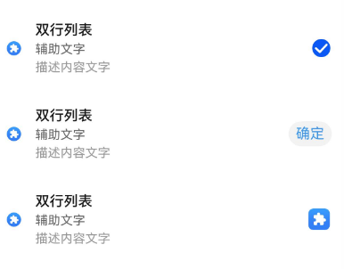
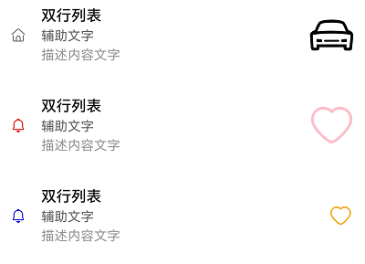

# ComposeListItem


列表包含一系列相同宽度的列表项。内容包括适合连续、多行呈现同类数据的组合，例如图片和文本。


> **说明：**
>
> 该组件从API version 10开始支持。后续版本如有新增内容，则采用上角标单独标记该内容的起始版本。
>
> 该组件不支持在Wearable设备上使用。


## 导入模块

```
import { ComposeListItem } from "@kit.ArkUI";
```


## 子组件

无

## 属性
不支持[通用属性](ts-component-general-attributes.md)。


## ComposeListItem

ComposeListItem({contentItem?: ContentItem, operateItem?: OperateItem})

列表组件，可自定义列表左侧、中间元素以及右侧显示内容。

**装饰器类型：**\@Component

**系统能力：** SystemCapability.ArkUI.ArkUI.Full


| 名称 | 类型 | 必填 | 装饰器类型 | 说明 |
| -------- | -------- | -------- | -------- | -------- |
| contentItem | [ContentItem](#contentitem) | 否 | \@Prop | 定义左侧以及中间元素。<br/>**原子化服务API：** 从API version 11开始，该接口支持在原子化服务中使用。 |
| operateItem | [OperateItem](#operateitem) | 否 | \@Prop | 定义右侧元素。<br/>**原子化服务API：** 从API version 11开始，该接口支持在原子化服务中使用。 |

## ContentItem

列表左侧显示的图标、图标大小以及中间元素文字内容。

**系统能力：** SystemCapability.ArkUI.ArkUI.Full


| 名称 | 类型 | 必填 | 说明 |
| -------- | -------- | -------- | -------- |
| iconStyle | [IconType](#icontype) | 否 | 左侧元素的图标样式。<br/>**原子化服务API：** 从API version 11开始，该接口支持在原子化服务中使用。 |
| icon | [ResourceStr](ts-types.md#resourcestr) | 否 | 左侧元素的图标资源。<br/>**原子化服务API：** 从API version 11开始，该接口支持在原子化服务中使用。 |
| symbolStyle<sup>18+</sup> | [SymbolGlyphModifier](ts-universal-attributes-attribute-modifier.md) | 否 | 左侧元素的Symbol图标资源，优先级大于icon。<br/>**原子化服务API：** 从API version 18开始，该接口支持在原子化服务中使用。 |
| primaryText | [ResourceStr](ts-types.md#resourcestr) | 否 | 中间元素的标题内容。<br/>**文字处理规则：** 文本超长后无限换行显示。<br/>**原子化服务API：** 从API version 11开始，该接口支持在原子化服务中使用。  |
| secondaryText | [ResourceStr](ts-types.md#resourcestr) | 否 | 中间元素的副标题内容。<br/>**文字处理规则：** 文本超长后无限换行显示。<br/>**原子化服务API：** 从API version 11开始，该接口支持在原子化服务中使用。 |
| description | [ResourceStr](ts-types.md#resourcestr) | 否 | 中间元素的描述内容。<br/>**文字处理规则：** 文本超长后无限换行显示。<br/>**原子化服务API：** 从API version 11开始，该接口支持在原子化服务中使用。  |

## IconType

列表左侧图标大小。

**原子化服务API：** 从API version 11开始，该接口支持在原子化服务中使用。

**系统能力：** SystemCapability.ArkUI.ArkUI.Full

| 名称 | 值 | 说明 |
| -------- | -------- | -------- |
| BADGE | 1 | 左侧图标为badge类型，图标大小为8\*8vp。 |
| NORMAL_ICON | 2 | 左侧图标为小图标类型，图标大小为16\*16vp。 |
| SYSTEM_ICON | 3 | 左侧图标为系统图标类型，图标大小为24\*24vp。 |
| HEAD_SCULPTURE | 4 | 左侧图标为头像类型，图标大小为40\*40vp。 |
| APP_ICON | 5 | 左侧图标为应用图标类型，图标大小为64\*64vp。 |
| PREVIEW | 6 | 左侧图标为预览图类型，图标大小为96\*96vp。 |
| LONGITUDINAL | 7 | 左侧图标为横向特殊比例（宽比高大），保持最长边为96vp。 |
| VERTICAL | 8 | 左侧图标为竖向特殊比例（高比宽大），保持最长边为96vp。 |

## OperateItem

列表右侧显示的元素类型以及文字内容。

**系统能力：** SystemCapability.ArkUI.ArkUI.Full

| 名称 | 类型 | 必填 | 说明 |
| -------- | -------- | -------- | -------- |
| arrow | [OperateIcon](#operateicon) | 否 | 右侧元素为箭头，大小为12\*24vp。<br/>**原子化服务API：** 从API version 11开始，该接口支持在原子化服务中使用。  |
| icon | [OperateIcon](#operateicon) | 否 | 右侧元素的第一个图标，大小为24\*24vp。<br/>**原子化服务API：** 从API version 11开始，该接口支持在原子化服务中使用。  |
| subIcon | [OperateIcon](#operateicon) | 否 | 右侧元素的第二个图标，大小为24\*24vp。<br/>**原子化服务API：** 从API version 11开始，该接口支持在原子化服务中使用。  |
| button | [OperateButton](#operatebutton) | 否 | 右侧元素为按钮。<br/>**原子化服务API：** 从API version 11开始，该接口支持在原子化服务中使用。  |
| switch | [OperateCheck](#operatecheck) | 否 | 右侧元素为开关。<br/>**原子化服务API：** 从API version 11开始，该接口支持在原子化服务中使用。  |
| checkbox | [OperateCheck](#operatecheck) | 否 | 右侧元素为多选框，大小为24\*24vp。<br/>**原子化服务API：** 从API version 11开始，该接口支持在原子化服务中使用。  |
| radio | [OperateCheck](#operatecheck) | 否 | 右侧元素为单选，大小为24\*24vp。<br/>**原子化服务API：** 从API version 11开始，该接口支持在原子化服务中使用。  |
| image | [ResourceStr](ts-types.md#resourcestr) | 否 | 右侧元素为图片，大小为48\*48vp。<br/>**原子化服务API：** 从API version 11开始，该接口支持在原子化服务中使用。  |
| symbolStyle<sup>18+</sup> | [SymbolGlyphModifier](ts-universal-attributes-attribute-modifier.md) | 否 | 右侧元素为Symbol，大小为48\*48vp。<br/>**原子化服务API：** 从API version 18开始，该接口支持在原子化服务中使用。 |
| text | [ResourceStr](ts-types.md#resourcestr) | 否 | 右侧元素为文字。 <br/>**原子化服务API：** 从API version 11开始，该接口支持在原子化服务中使用。 |

## OperateIcon

列表右侧显示的元素为图标的参数。

**系统能力：** SystemCapability.ArkUI.ArkUI.Full

| 名称 | 类型 | 必填 | 说明                                                                                                                                                                                                                                                   |
| -------- | -------- | -------- |------------------------------------------------------------------------------------------------------------------------------------------------------------------------------------------------------------------------------------------------------|
| value | [ResourceStr](ts-types.md#resourcestr) | 是 | 右侧图标/箭头资源。<br/>**原子化服务API：** 从API version 11开始，该接口支持在原子化服务中使用。                                                                                                                                                                                                                                           |
| symbolStyle<sup>18+</sup> | [SymbolGlyphModifier](ts-universal-attributes-attribute-modifier.md) | 否 | 右侧Symbol图标/箭头资源，优先级大于value。<br/>**原子化服务API：** 从API version 18开始，该接口支持在原子化服务中使用。 |
| action | ()=&gt;void | 否 | 右侧图标/箭头点击事件。 <br/>**原子化服务API：** 从API version 11开始，该接口支持在原子化服务中使用。                                                                                                                                                                                                                                        |
| accessibilityText<sup>18+</sup>        | [ResourceStr](ts-types.md#resourcestr)                    | 否 | 右侧图标/箭头的无障碍文本属性。当组件不包含文本属性时，屏幕朗读选中此组件时不播报，使用者无法清楚地知道当前选中了什么组件。为了解决此场景，开发人员可为不包含文字信息的组件设置无障碍文本，当屏幕朗读选中此组件时播报无障碍文本的内容，帮助屏幕朗读的使用者清楚地知道自己选中了什么组件。<br/>默认值为""。<br/>**原子化服务API：** 从API version 18开始，该接口支持在原子化服务中使用。                                          |
| accessibilityDescription<sup>18+</sup> | [ResourceStr](ts-types.md#resourcestr)                    | 否 | 右侧图标/箭头的无障碍描述。此描述用于向用户详细解释当前组件，开发人员应为组件的这一属性提供较为详尽的文本说明，以协助用户理解即将执行的操作及其可能产生的后果。特别是当这些后果无法仅从组件的属性和无障碍文本中直接获知时。如果组件同时具备文本属性和无障碍说明属性，当组件被选中时，系统将首先播报组件的文本属性，随后播报无障碍说明属性的内容。<br/>默认值为“单指双击即可执行”。<br/>**原子化服务API：** 从API version 18开始，该接口支持在原子化服务中使用。    |
| accessibilityLevel<sup>18+</sup>       | string                                                    | 否 | 右侧图标/箭头的无障碍重要性。用于控制当前项是否可被无障碍辅助服务所识别。<br/>支持的值为：<br/>"auto"：当前组件会转换"no"。<br/>"yes"：当前组件可被无障碍辅助服务所识别。<br/>"no"：当前组件不可被无障碍辅助服务所识别。<br/>"no-hide-descendants"：当前组件及其所有子组件不可被无障碍辅助服务所识别。<br/>默认值："auto" <br/>**原子化服务API：** 从API version 18开始，该接口支持在原子化服务中使用。 |

## OperateButton

列表右侧显示的元素为按钮的参数。

**系统能力：** SystemCapability.ArkUI.ArkUI.Full

| 名称 | 类型 | 必填 | 说明 |
| -------- | -------- | -------- | -------- |
| text | [ResourceStr](ts-types.md#resourcestr) | 否 | 右侧按钮文字。<br/>**原子化服务API：** 从API version 11开始，该接口支持在原子化服务中使用。 |
| accessibilityText<sup>18+</sup>        | [ResourceStr](ts-types.md#resourcestr)                    | 否 | 右侧按钮的无障碍文本属性。当组件不包含文本属性时，屏幕朗读选中此组件时不播报，使用者无法清楚地知道当前选中了什么组件。为了解决此场景，开发人员可为不包含文字信息的组件设置无障碍文本，当屏幕朗读选中此组件时播报无障碍文本的内容，帮助屏幕朗读的使用者清楚地知道自己选中了什么组件。<br/>**原子化服务API：** 从API version 18开始，该接口支持在原子化服务中使用。                                  |
| accessibilityDescription<sup>18+</sup> | [ResourceStr](ts-types.md#resourcestr)                    | 否 | 右侧按钮的无障碍描述。此描述用于向用户详细解释当前组件，开发人员应为组件的这一属性提供较为详尽的文本说明，以协助用户理解即将执行的操作及其可能产生的后果。特别是当这些后果无法仅从组件的属性和无障碍文本中直接获知时。如果组件同时具备文本属性和无障碍说明属性，当组件被选中时，系统将首先播报组件的文本属性，随后播报无障碍说明属性的内容。<br/>**原子化服务API：** 从API version 18开始，该接口支持在原子化服务中使用。          |
| accessibilityLevel<sup>18+</sup>       | string                                                    | 否 | 右侧按钮的无障碍重要性。用于控制当前项是否可被无障碍辅助服务所识别。<br/>支持的值为：<br/>"auto"：当前组件会转换"no"。<br/>"yes"：当前组件可被无障碍辅助服务所识别。<br/>"no"：当前组件不可被无障碍辅助服务所识别。<br/>"no-hide-descendants"：当前组件及其所有子组件不可被无障碍辅助服务所识别。<br/>默认值："auto" <br/>**原子化服务API：** 从API version 18开始，该接口支持在原子化服务中使用。 |

## OperateCheck

列表右侧显示元素类型为Switch、CheckBox、Radio的参数。

**系统能力：** SystemCapability.ArkUI.ArkUI.Full

| 名称 | 类型 | 必填 | 说明                                                                                                                                                                                                                                                                                   |
| -------- | -------- | -------- |--------------------------------------------------------------------------------------------------------------------------------------------------------------------------------------------------------------------------------------------------------------------------------------|
| isCheck | boolean | 否 | 右侧Switch/CheckBox/Radio选中状态。<br> isCheck默认值为false。<br> isCheck为true时，表示为选中。<br> isCheck为false时，表示为未选中。<br/>**原子化服务API：** 从API version 11开始，该接口支持在原子化服务中使用。                                                                                                                                                                          |
| onChange | (value:&nbsp;boolean)=&gt;void | 否 | 右侧Switch/CheckBox/Radio选中状态改变时触发回调。<br> value为true时，表示从未选中变为选中。<br> value为false时，表示从选中变为未选中。 <br/>**原子化服务API：** 从API version 11开始，该接口支持在原子化服务中使用。                                                                                                                                                                                        |
| accessibilityText<sup>18+</sup>        | [ResourceStr](ts-types.md#resourcestr)                    | 否 | 右侧Switch/CheckBox/Radio的无障碍文本属性。当组件不包含文本属性时，屏幕朗读选中此组件时不播报，使用者无法清楚地知道当前选中了什么组件。为了解决此场景，开发人员可为不包含文字信息的组件设置无障碍文本，当屏幕朗读选中此组件时播报无障碍文本的内容，帮助屏幕朗读的使用者清楚地知道自己选中了什么组件。<br/>**原子化服务API：** 从API version 18开始，该接口支持在原子化服务中使用。                                                                    |
| accessibilityDescription<sup>18+</sup> | [ResourceStr](ts-types.md#resourcestr)                    | 否 | 右侧Switch/CheckBox/Radio的无障碍描述。此描述用于向用户详细解释当前组件，开发人员应为组件的这一属性提供较为详尽的文本说明，以协助用户理解即将执行的操作及其可能产生的后果。特别是当这些后果无法仅从组件的属性和无障碍文本中直接获知时。如果组件同时具备文本属性和无障碍说明属性，当组件被选中时，系统将首先播报组件的文本属性，随后播报无障碍说明属性的内容。<br/>默认跟随基础组件Switch/CheckBox/Radio播报规则。<br/>**原子化服务API：** 从API version 18开始，该接口支持在原子化服务中使用。 |
| accessibilityLevel<sup>18+</sup>       | string                                                    | 否 | 右侧Switch/CheckBox/Radio的无障碍重要性。用于控制当前项是否可被无障碍辅助服务所识别。<br/>支持的值为：<br/>"auto"：当前组件会转换"no"。<br/>"yes"：当前组件可被无障碍辅助服务所识别。<br/>"no"：当前组件不可被无障碍辅助服务所识别。<br/>"no-hide-descendants"：当前组件及其所有子组件不可被无障碍辅助服务所识别。<br/>默认值："auto" <br/>**原子化服务API：** 从API version 18开始，该接口支持在原子化服务中使用。              |

## 事件
不支持[通用事件](ts-component-general-events.md)。

## 示例

### 示例1（设置简单列表项）
该示例实现了带有主标题、副标题、描述、右侧按钮及文本的简单列表项。
```ts
// 该示例主要演示该组件的基础功能使用，包含左侧右侧元素的情况
import { IconType, ComposeListItem } from '@kit.ArkUI';

@Entry
@Component
struct ComposeListItemExample {
  build() {
    Column() {
      List() {
        ListItem() {
          ComposeListItem({
            contentItem: ({
              iconStyle: IconType.NORMAL_ICON,
              icon: $r('sys.media.ohos_app_icon'),
              primaryText: '双行列表',
              secondaryText: '辅助文字',
              description: '描述内容文字'
            }),
            operateItem: ({
              icon: {
                value: $r('sys.media.ohos_app_icon'),
                action: () => {
                  this.getUIContext().getPromptAction().showToast({
                    message: 'icon'
                  });
                } },
              text: '右侧文本'
            })
          })
        }
      }
    }
  }
}
```


### 示例2（设置右侧不同元素自定义播报）
该示例通过设置属性accessibilityText、accessibilityDescription、accessibilityLevel，实现右侧图标、按钮、单选框自定义屏幕朗读播报文本。
```ts
import { IconType, ComposeListItem } from '@kit.ArkUI';
@Entry
@Component
struct ComposeListItemExample {
  build() {
    Column() {
      List() {
        ListItem() {
          ComposeListItem({
            contentItem: ({
              iconStyle: IconType.NORMAL_ICON,
              icon: $r('sys.media.ohos_app_icon'),
              primaryText: '双行列表',
              secondaryText: '辅助文字',
              description: '描述内容文字'
            }),
            operateItem: ({
              radio: {
                accessibilityText: '单选框', // 该单选框屏幕朗读播报文本为‘单选框’
                accessibilityDescription: '未选中', // 该单选框屏幕朗读播报描述为'未选中'
                accessibilityLevel: 'yes'  // 该项可被无障碍屏幕朗读聚焦
              }
            })
          })
        }

        ListItem() {
          ComposeListItem({
            contentItem: ({
              iconStyle: IconType.NORMAL_ICON,
              icon: $r('sys.media.ohos_app_icon'),
              primaryText: '双行列表',
              secondaryText: '辅助文字',
              description: '描述内容文字'
            }),
            operateItem: ({
              button: {
                text: '确定',
                accessibilityText: '这是一个按钮',
                accessibilityDescription: '单指双击即可执行',
                accessibilityLevel: 'no'  // 该按钮不可被屏幕朗读服务识别
              }
            })
          })
        }

        ListItem() {
          ComposeListItem({
            contentItem: ({
              iconStyle: IconType.NORMAL_ICON,
              icon: $r('sys.media.ohos_app_icon'),
              primaryText: '双行列表',
              secondaryText: '辅助文字',
              description: '描述内容文字'
            }),
            operateItem: ({
              icon: {
                value: $r('sys.media.ohos_app_icon'),
                action: () => {
                this.getUIContext().getPromptAction().showToast({
                    message: 'icon'
                  });
                },
                accessibilityText: '这是一个icon', // 该icon屏幕朗读播报文本为‘这是一个icon’
                accessibilityDescription: '单指双击即可弹出', // 该icon屏幕朗读播报描述为'单指双击即可弹出'
                accessibilityLevel: 'yes'  // 该项可被无障碍屏幕朗读聚焦
              }
            })
          })
        }
      }
    }
  }
}
```


### 示例3（设置Symbol类型图标）

该示例通过设置ContentItem、OperateItem、OperateIcon的属性symbolStyle，展示了自定义Symbol类型图标。

```ts
import { IconType, ComposeListItem, SymbolGlyphModifier } from '@kit.ArkUI';
@Entry
@Component
struct ComposeListItemExample {
  build() {
    Column() {
      List() {
        ListItem() {
          ComposeListItem({
            contentItem: ({
              iconStyle: IconType.NORMAL_ICON,
              icon: $r('sys.symbol.house'),
              primaryText: '双行列表',
              secondaryText: '辅助文字',
              description: '描述内容文字'
            }),
            operateItem: ({
              image: $r('sys.symbol.car'),
            })
          })
        }

        ListItem() {
          ComposeListItem({
            contentItem: ({
              iconStyle: IconType.NORMAL_ICON,
              icon: $r('sys.symbol.house'),
              symbolStyle: new SymbolGlyphModifier($r('sys.symbol.bell')).fontColor([Color.Red]),
              primaryText: '双行列表',
              secondaryText: '辅助文字',
              description: '描述内容文字'
            }),
            operateItem: ({
              image: $r('sys.symbol.car'),
              symbolStyle: new SymbolGlyphModifier($r('sys.symbol.heart')).fontColor([Color.Pink]),
            })
          })
        }

        ListItem() {
          ComposeListItem({
            contentItem: ({
              iconStyle: IconType.NORMAL_ICON,
              icon: $r('sys.symbol.house'),
              symbolStyle: new SymbolGlyphModifier($r('sys.symbol.bell')).fontColor([Color.Blue]),
              primaryText: '双行列表',
              secondaryText: '辅助文字',
              description: '描述内容文字'
            }),
            operateItem: ({
              icon: {
                value: $r('sys.symbol.car'),
                symbolStyle: new SymbolGlyphModifier($r('sys.symbol.heart')).fontColor([Color.Orange]),
                action: () => {
                  this.getUIContext().getPromptAction().showToast({
                    message: 'icon'
                  });
                }
              }
            })
          })
        }
      }
    }
  }
}
```

