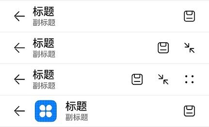

# ComposeTitleBar


一种普通标题栏，支持设置标题、头像（可选）和副标题（可选），可用于一级页面、二级及其以上界面配置返回键。


> **说明：**
>
> 该组件从API Version 10开始支持。后续版本如有新增内容，则采用上角标单独标记该内容的起始版本。


## 导入模块

```
import { ComposeTitleBar } from '@kit.ArkUI'
```


## 子组件

无

## 属性
不支持[通用属性](ts-universal-attributes-size.md)

## ComposeTitleBar

ComposeTitleBar({item?: ComposeTitleBarMenuItem, title: ResourceStr, subtitle?: ResourceStr, menuItems?: Array&lt;ComposeTitleBarMenuItem&gt;})

**装饰器类型：**\@Component

**原子化服务API：** 从API version 11开始，该接口支持在原子化服务中使用。

**系统能力：** SystemCapability.ArkUI.ArkUI.Full

| 名称 | 类型 | 必填 | 说明 |
| -------- | -------- | -------- | -------- |
| item | [ComposeTitleBarMenuItem](#composetitlebarmenuitem) | 否 | 用于左侧头像的单个菜单项目。 |
| title | [ResourceStr](ts-types.md#resourcestr) | 是 | 标题。 |
| subtitle | [ResourceStr](ts-types.md#resourcestr) | 否 | 副标题。 |
| menuItems | Array&lt;[ComposeTitleBarMenuItem](#composetitlebarmenuitem)&gt; | 否 | 右侧菜单项目列表。 |

> **说明：**
> 
> 入参对象不可为undefined，即`ComposeTitleBar(undefined)`。

## ComposeTitleBarMenuItem

**系统能力：** SystemCapability.ArkUI.ArkUI.Full

| 名称 | 类型 | 必填 | 说明 |
| -------- | -------- | -------- | -------- |
| value | [ResourceStr](ts-types.md#resourcestr) | 是 | 图标资源。<br/>**原子化服务API：** 从API version 11开始，该接口支持在原子化服务中使用。 |
| label<sup>13+</sup> | [ResourceStr](ts-types.md#resourcestr) | 否 | 图标标签描述。<br/>**原子化服务API：** 从API version 13开始，该接口支持在原子化服务中使用。 |
| isEnabled | boolean | 否 | 是否启用，默认禁用。<br> isEnabled为true时，表示为启用。<br> isEnabled为false时，表示为禁用。<br/>**原子化服务API：** 从API version 11开始，该接口支持在原子化服务中使用。 |
| action | ()&nbsp;=&gt;&nbsp;void | 否 | 触发时的动作闭包，item属性不支持触发action事件。<br/>**原子化服务API：** 从API version 11开始，该接口支持在原子化服务中使用。 |

## 事件
不支持[通用事件](ts-universal-events-click.md)

## 示例

```ts
import { ComposeTitleBar, promptAction, ComposeTitleBarMenuItem } from '@kit.ArkUI'

@Entry
@Component
struct Index {
  private menuItems: Array<ComposeTitleBarMenuItem> = [
    {
      value: $r('app.media.ic_public_save'),
      isEnabled: true,
      action: () => promptAction.showToast({ message: "show toast index 1" })
    },
    {
      value: $r('app.media.ic_public_save'),
      isEnabled: true,
      action: () => promptAction.showToast({ message: "show toast index 1" })
    },
    {
      value: $r('app.media.ic_public_save'),
      isEnabled: true,
      action: () => promptAction.showToast({ message: "show toast index 1" })
    },
    {
      value: $r('app.media.ic_public_save'),
      isEnabled: true,
      action: () => promptAction.showToast({ message: "show toast index 1" })
    },
  ]

  build() {
    Row() {
      Column() {
        Divider().height(2).color(0xCCCCCC)
        ComposeTitleBar({
          title: "标题",
          subtitle: "副标题",
          menuItems: this.menuItems.slice(0, 1),
        })
        Divider().height(2).color(0xCCCCCC)
        ComposeTitleBar({
          title: "标题",
          subtitle: "副标题",
          menuItems: this.menuItems.slice(0, 2),
        })
        Divider().height(2).color(0xCCCCCC)
        ComposeTitleBar({
          title: "标题",
          subtitle: "副标题",
          menuItems: this.menuItems,
        })
        Divider().height(2).color(0xCCCCCC)
        ComposeTitleBar({
          menuItems: [{ isEnabled: true, value: $r('app.media.ic_public_save'),
            action: () => promptAction.showToast({ message: "show toast index 1" })
          }],
          title: "标题",
          subtitle: "副标题",
          item: { isEnabled: true, value: $r('app.media.app_icon') }
        })
        Divider().height(2).color(0xCCCCCC)
      }
    }.height('100%')
  }
}
```


