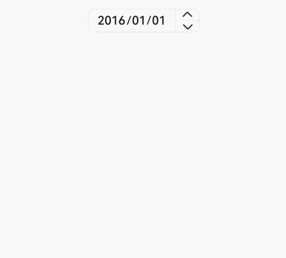
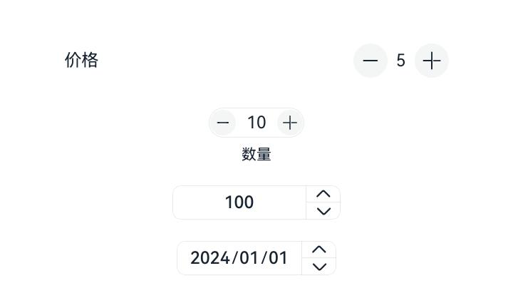

# advanced.Counter
<!--Kit: ArkUI--> 
<!--Subsystem: ArkUI--> 
<!--Owner: @xieziang--> 
<!--SE: @youzhi92--> 
<!--TSE: @TerryTsao-->

Counter是用于精确调节数值的组件。

>  **说明：**
>
>  该组件从API Version 11开始支持。后续版本如有新增内容，则采用上角标单独标记该内容的起始版本。
>
>  如果Counter设置[通用属性](ts-component-general-attributes.md)和[通用事件](ts-component-general-events.md)，编译工具链会额外生成节点__Common__，并将通用属性或通用事件挂载在__Common__上，而不是直接应用到Counter本身。这可能导致开发者设置的通用属性或通用事件的效果不生效或不符合预期，因此，不建议Counter设置通用属性和通用事件。

## 导入模块

```
import { CounterType, CounterComponent, CounterOptions, DateData } from '@kit.ArkUI';
```

## 子组件

无

## CounterComponent

CounterComponent({&nbsp;options:&nbsp;CounterOptions&nbsp;})

定义计数器组件。

**装饰器类型：**@Component

**原子化服务API：** 从API version 12开始，该接口支持在原子化服务中使用。

**系统能力：** SystemCapability.ArkUI.ArkUI.Full

**参数**：

| 名称   | 类型                              | 必填 | 装饰器类型 | 说明                    |
| ------- | --------------------------------- | ---- | ---------- | ----------------------- |
| options | [CounterOptions](#counteroptions) | 是   | @Prop      | 定义counter组件的类型。 |

## CounterOptions

CounterOptions定义Counter的类型及具体式样参数。

**原子化服务API：** 从API version 12开始，该接口支持在原子化服务中使用。

**系统能力：** SystemCapability.ArkUI.ArkUI.Full

| 名称        | 类型       | 必填 | 说明                            |
| ----------- | ---------- | ---- | ------------------------------- |
| type | [CounterType](#countertype) | 是   | 指定当前Counter的类型。 |
| direction<sup>12+</sup> | [Direction](ts-appendix-enums.md#direction) | 否 | 布局方向。<br/>默认值：Direction.Auto |
| numberOptions | [NumberStyleOptions](#numberstyleoptions) | 否    | 列表型和紧凑型counter的式样。 |
| inlineOptions | [InlineStyleOptions](#inlinestyleoptions) | 否 | 普通数字内联调节型Counter的式样。 |
| dateOptions | [DateStyleOptions](#datestyleoptions) | 否 | 日期型内联型counter的式样。 |

选择不同的counter类型，需要选择对应的counter式样，其对应关系如下：

| counter类型             | counter式样        |
| ----------------------- | ------------------ |
| CounterType.LIST        | NumberStyleOptions |
| CounterType.COMPACT     | NumberStyleOptions |
| CounterType.INLINE      | InlineStyleOptions |
| CounterType.INLINE_DATE | DateStyleOptions   |

## CounterType

CounterType指定Counter的类型，如列表型Counter。

**原子化服务API：** 从API version 12开始，该接口支持在原子化服务中使用。

**系统能力：** SystemCapability.ArkUI.ArkUI.Full

| 名称        | 值   | 说明                        |
| ----------- | ---- | --------------------------- |
| LIST        | 0    | 列表型Counter。             |
| COMPACT     | 1    | 紧凑型Counter。             |
| INLINE      | 2    | 普通数字内联调节型Counter。 |
| INLINE_DATE | 3    | 日期型内联型Counter。       |

## CommonOptions

CommonOptions定义Counter的共通属性和事件。

**原子化服务API：** 从API version 12开始，该接口支持在原子化服务中使用。

**系统能力：** SystemCapability.ArkUI.ArkUI.Full

| 名称            | 类型                      | 必填 | 说明                                                         |
| --------------- | ------------------------- | ---- | ------------------------------------------------------------ |
| focusable       | boolean                   | 否   | 设置Counter是否可以获焦。<br/>**说明：** <br/>该属性对列表型、紧凑型Counter生效。<br/>默认值：true。 <br/>true：设置Counter可以获焦；false：设置Counter不可以获焦。|
| step            | number                    | 否   | 设置Counter的步长。<br/>取值范围：大于等于1的整数。<br/>默认值：1 |
| onHoverIncrease | (isHover: boolean) => void | 否   | 鼠标进入或退出Counter组件的增加按钮触发该回调。<br/>isHover：表示鼠标是否悬浮在组件上，鼠标进入时为true，退出时为false。 |
| onHoverDecrease | (isHover: boolean) => void | 否   | 鼠标进入或退出Counter组件的减小按钮触发该回调。<br/>isHover：表示鼠标是否悬浮在组件上，鼠标进入时为true，退出时为false。 |

## InlineStyleOptions

InlineStyleOptions定义Inline Style（数值内联型Counter）的属性和事件。

继承于[CommonOptions](#commonoptions)。

**原子化服务API：** 从API version 12开始，该接口支持在原子化服务中使用。

**系统能力：** SystemCapability.ArkUI.ArkUI.Full

| 名称      | 类型                   | 必填 | 说明                                                   |
| --------- | ---------------------- | ---- | ------------------------------------------------------ |
| value     | number                 | 否   | 设置Counter的初始值。<br/>默认值：0                    |
| min       | number                 | 否   | 设置Counter的最小值。<br/>默认值：0                    |
| max       | number                 | 否   | 设置Counter的最大值。<br/>默认值：999                  |
| textWidth | number                 | 否   | 设置数值文本的宽度。<br/>默认值：0                     |
| onChange  | (value: number) => void | 否   | 当数值改变时，返回当前值。<br/>value：当前显示的数值。 |

## NumberStyleOptions

NumberStyleOptions定义Number style（列表型Counter和紧凑型Counter）的属性和事件。

继承于[InlineStyleOptions](#inlinestyleoptions)。

**原子化服务API：** 从API version 12开始，该接口支持在原子化服务中使用。

**系统能力：** SystemCapability.ArkUI.ArkUI.Full

| 名称            | 类型                                   | 必填 | 说明                                          |
| --------------- | -------------------------------------- | ---- | --------------------------------------------- |
| label           | [ResourceStr](ts-types.md#resourcestr) | 否   | 设置Counter的说明文本。                       |
| onFocusIncrease | () => void                              | 否   | 当前Counter组件增加按钮获取焦点时触发的回调。 |
| onFocusDecrease | () => void                              | 否   | 当前Counter组件减小按钮获取焦点时触发的回调。 |
| onBlurIncrease  | () => void                              | 否   | 当前Counter组件增加按钮失去焦点时触发的回调。 |
| onBlurDecrease  | () => void                              | 否   | 当前Counter组件减小按钮失去焦点时触发的回调。 |

## DateStyleOptions

DateStyleOptions定义Date style（日期内联型Counter）的属性和事件。

继承于[CommonOptions](#commonoptions)。

**原子化服务API：** 从API version 12开始，该接口支持在原子化服务中使用。

**系统能力：** SystemCapability.ArkUI.ArkUI.Full

| 名称         | 类型                                | 必填 | 说明                                                      |
| ------------ | ----------------------------------- | ---- | --------------------------------------------------------- |
| year         | number                              | 否   | 设置日期内联型初始年份。<br/>默认值：1                    |
| month        | number                              | 否   | 设置日期内联型初始月份。<br/>默认值：1                    |
| day          | number                              | 否   | 设置日期内联型初始日。<br/>默认值：1                      |
| onDateChange | (date: [DateData](#datedata)) => void | 否   | 当日期改变时，返回当前日期。<br/>date：当前显示的日期值。 |

## DateData

DateData定义Date通用属性和方法，如年、月、日。

**原子化服务API：** 从API version 12开始，该接口支持在原子化服务中使用。

**系统能力：** SystemCapability.ArkUI.ArkUI.Full

| 名称  | 类型   | 只读 | 可选 | 说明                     |
| ----- | ------ | ---- | ---- | ------------------------ |
| year  | number | 否   | 否   | 设置日期内联型初始年份。 |
| month | number | 否   | 否   | 设置日期内联型初始月份。 |
| day   | number | 否   | 否   | 设置日期内联型初始日。   |

### constructor

constructor(year: number, month: number, day: number)

DateData的构造函数。

**原子化服务API**：从API version 12 开始，该接口支持在原子化服务中使用。

**系统能力：** SystemCapability.ArkUI.ArkUI.Full

| 参数名 | 类型 | 说明 |
| ---------- | ------ | ---------------------------- |
| year       | number | 设置日期内联型初始年份。     |
| month      | number | 设置日期内联型初始月份。     |
| day        | number | 设置日期内联型初始日。       |

### toString

toString(): string

以字符串格式返回当前日期值。

**原子化服务API**：从API version 12 开始，该接口支持在原子化服务中使用。

**系统能力：** SystemCapability.ArkUI.ArkUI.Full

**返回值：**

| 类型 | 说明 |
| -------- | -------- |
| string | 当前日期值。 |

## 示例

### 示例1（列表型Counter）

该示例通过设置type为CounterType.LIST以及numberOptions，实现列表型Counter。

```ts
import { CounterType, CounterComponent } from '@kit.ArkUI';

@Entry
@Component
struct ListCounterExample {
  build() {
    Column() {
      //列表型Counter
      CounterComponent({
        options: {
          type: CounterType.LIST,
          numberOptions: {
            label: "价格",
            min: 0,
            value: 5,
            max: 10
          }
        }
      })
    }
  }
}
```


### 示例2（紧凑型Counter）

该示例通过设置type为CounterType.COMPACT以及numberOptions，实现紧凑型Counter。

```ts
import { CounterType, CounterComponent } from '@kit.ArkUI';

@Entry
@Component
struct CompactCounterExample {
  build() {
    Column() {
      //紧凑型Counter
      CounterComponent({
        options: {
          type: CounterType.COMPACT,
          numberOptions: {
            label: "数量",
            value: 10,
            min: 0,
            max: 100,
            step: 10
          }
        }
      })
    }
  }
}
```


### 示例3（数值内联型Counter）

该示例通过设置type为CounterType.INLINE以及inlineOptions，实现数值内联型Counter。

```ts
import { CounterType, CounterComponent } from '@kit.ArkUI';

@Entry
@Component
struct NumberStyleExample {
  build() {
    Column() {
      //数值内联型Counter
      CounterComponent({
        options: {
          type: CounterType.INLINE,
          inlineOptions: {
            value: 100,
            min: 10,
            step: 2,
            max: 1000,
            textWidth: 100,
            onChange: (value: number) => {
              console.log("onDateChange Date: " + value.toString());
            }
          }
        }
      })
    }
  }
}
```


### 示例4（日期内联型Counter）

该示例通过设置type为CounterType.INLINE_DATE以及dateOptions，实现日期内联型Counter，用户可以手动输入日期。

```ts
import { CounterType, CounterComponent, DateData } from '@kit.ArkUI';

@Entry
@Component
struct DataStyleExample {
  build() {
    Column() {
      //日期内联型counter
      CounterComponent({
        options: {
          type: CounterType.INLINE_DATE,
          dateOptions: {
            year: 2016,
            onDateChange: (date: DateData) => {
              console.log("onDateChange Date: " + date.toString());
            }
          }
        }
      })
    }
  }
}
```



### 示例5（镜像布局展示）

该示例通过设置direction属性，实现列表型、紧凑型、数字内联型、日期内联型Counter进行镜像布局。

```ts
// xxx.ets
import { CounterType, CounterComponent, DateData } from '@kit.ArkUI';

@Entry
@Component
struct CounterPage {
  @State currentDirection: Direction = Direction.Rtl

  build() {
    Column({}) {

      //列表型Counter
      CounterComponent({
        options: {
          direction: this.currentDirection,
          type: CounterType.LIST,
          numberOptions: {
            label: "价格",
            min: 0,
            value: 5,
            max: 10,
          }
        }
      })
        .width('80%')

      //数值型Counter
      CounterComponent({
        options: {
          direction: this.currentDirection,
          type: CounterType.COMPACT,
          numberOptions: {
            label: "数量",
            value: 10,
            min: 0,
            max: 100,
            step: 10
          }
        }
      }).margin({ top: 20 })

      //数值内联型Counter
      CounterComponent({
        options: {
          type: CounterType.INLINE,
          direction: this.currentDirection,
          inlineOptions: {
            value: 100,
            min: 10,
            step: 2,
            max: 1000,
            textWidth: 100,
            onChange: (value: number) => {
              console.log("onDateChange Date: " + value.toString());
            }
          }
        }
      }).margin({ top: 20 })
      //日期内联型counter
      CounterComponent({
        options: {
          direction: this.currentDirection,
          type: CounterType.INLINE_DATE,
          dateOptions: {
            year: 2024,
            onDateChange: (date: DateData) => {
              console.log("onDateChange Date: " + date.toString());
            }
          }
        }
      }).margin({ top: 20 })
    }
    .width('100%')
    .height('100%')
    .justifyContent(FlexAlign.Center)
    .alignItems(HorizontalAlign.Center)
  }
}
```


