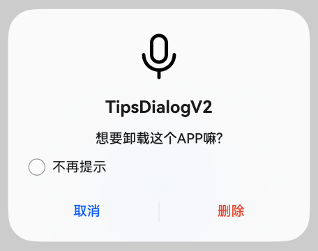
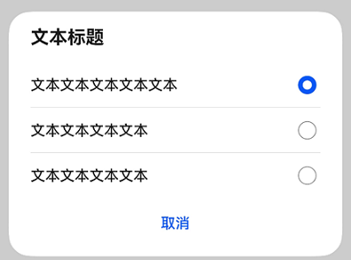
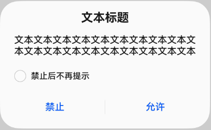
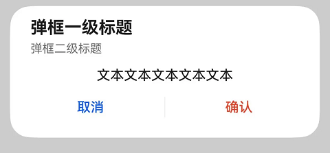
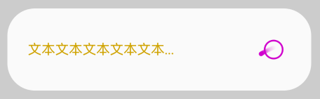
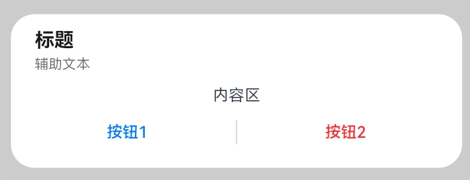

#  弹出框 (Dialog)


弹出框是一种模态窗口，通常用于在保持当前的上下文环境时，临时展示用户需关注的信息或待处理的操作，用户在模态弹出框内完成上述交互任务。模态弹出框需要用户进行交互才能够退出模态模式。


> **说明：**
>
> 该组件从API Version 10开始支持。后续版本如有新增内容，则采用上角标单独标记该内容的起始版本。


## 导入模块

```
import { TipsDialog, SelectDialog, ConfirmDialog, AlertDialog, LoadingDialog, CustomContentDialog } from '@kit.ArkUI'
```


## 子组件

无

## 属性

不支持[通用属性](ts-universal-attributes-size.md)

## TipsDialog


TipsDialog({controller: CustomDialogController, imageRes: Resource, imageSize?: SizeOptions, title?: ResourceStr, content?: ResourceStr, checkTips?: ResourceStr, ischecked?: boolean, checkAction?: (isChecked: boolean) => void, primaryButton?: ButtonOptions, secondaryButton?: ButtonOptions})


提示弹出框，即为带图形确认框，必要时可通过图形化方式展现确认框。


**装饰器类型：**\@CustomDialog


**系统能力：** SystemCapability.ArkUI.ArkUI.Full

**参数：** 

| 名称                          | 参数类型                                                     | 必填 | 装饰器类型 | 说明                                                         |
| ----------------------------- | ------------------------------------------------------------ | ---- | ---------- | ------------------------------------------------------------ |
| controller                    | [CustomDialogController](ts-methods-custom-dialog-box.md#customdialogcontroller) | 否  | -          | 提示弹出框控制器。<br/>**说明：** 未使用@Require装饰，构造时不强制校验参数。<br/>**原子化服务API：** 从API version 11开始，该接口支持在原子化服务中使用。 |
| imageRes                      | [ResourceStr<sup>12+</sup>](ts-types.md#resourcestr) \| [PixelMap<sup>12+</sup>](../../apis-image-kit/js-apis-image.md#pixelmap7) | 是   | -          | 展示的图片。<br/>**原子化服务API：** 从API version 11开始，该接口支持在原子化服务中使用。 |
| imageSize                     | [SizeOptions](ts-types.md#sizeoptions)                       | 否   | -          | 自定义图片尺寸。<br/>默认值：64*64vp<br/>**原子化服务API：** 从API version 11开始，该接口支持在原子化服务中使用。 |
| title                         | [ResourceStr](ts-types.md#resourcestr)                       | 否   | -          | 提示弹出框标题。<br/>**原子化服务API：** 从API version 11开始，该接口支持在原子化服务中使用。 |
| content                       | [ResourceStr](ts-types.md#resourcestr)                       | 否   | -          | 提示弹出框内容。<br/>**原子化服务API：** 从API version 11开始，该接口支持在原子化服务中使用。 |
| checkTips                     | [ResourceStr](ts-types.md#resourcestr)                       | 否   | -          | checkbox的提示内容。<br/>**原子化服务API：** 从API version 11开始，该接口支持在原子化服务中使用。 |
| isChecked                     | boolean                                                      | 否   | \@Prop     | value为true时，表示checkbox已选中，value为false时，表示未选中。<br/>默认值：false<br/>**原子化服务API：** 从API version 11开始，该接口支持在原子化服务中使用。 |
| checkAction<sup>12+</sup>     | (isChecked: boolean) => void                                 | 否   | -          | 现推荐使用 onCheckedChange<sup>12+</sup>。<br/>**原子化服务API：** 从API version 12开始，该接口支持在原子化服务中使用。                   |
| onCheckedChange<sup>12+</sup> | Callback\<boolean>                                           | 否   | -          | checkbox的选中状态改变事件。<br/>**原子化服务API：** 从API version 12开始，该接口支持在原子化服务中使用。                                 |
| primaryButton                 | [ButtonOptions](#buttonoptions)                              | 否   | -          | 提示框左侧按钮。<br/>**原子化服务API：** 从API version 11开始，该接口支持在原子化服务中使用。 |
| secondaryButton               | [ButtonOptions](#buttonoptions)                              | 否   | -          | 提示框右侧按钮。<br/>**原子化服务API：** 从API version 11开始，该接口支持在原子化服务中使用。 |
| theme<sup>12+</sup>           | [Theme](../js-apis-arkui-theme.md#theme) \| [CustomTheme](../js-apis-arkui-theme.md#customtheme) | 否   | -          | 主题信息，可以是CustomTheme或从onWillApplyTheme中获取的Theme实例。<br/>**原子化服务API：** 从API version 12开始，该接口支持在原子化服务中使用。 |
| themeColorMode<sup>12+</sup>  | [ThemeColorMode](ts-container-with-theme.md#themecolormode10枚举说明) | 否 | -     | 自定义弹窗深浅色模式。<br/>**原子化服务API：** 从API version 12开始，该接口支持在原子化服务中使用。                                                 |

## SelectDialog

SelectDialog({controller: CustomDialogController, title: ResourceStr, content?: ResourceStr, selectedIndex?: number, confirm?: ButtonOptions, radioContent: Array&lt;SheetInfo&gt;})

选择类弹出框，弹框中以列表或网格的形式提供可选的内容。

**装饰器类型：**\@CustomDialog

**系统能力：** SystemCapability.ArkUI.ArkUI.Full

**参数：**

| 名称                | 参数类型                                                     | 必填 | 说明                                                         |
| ------------------- | ------------------------------------------------------------ | ---- | ------------------------------------------------------------ |
| controller          | [CustomDialogController](ts-methods-custom-dialog-box.md#customdialogcontroller) | 否  | 选择弹出框控制器。<br/>**说明：** 未使用@Require装饰，构造时不强制校验参数。<br/>**原子化服务API：** 从API version 11开始，该接口支持在原子化服务中使用。 |
| title               | [ResourceStr](ts-types.md#resourcestr)                       | 是   | 选择弹出框标题。<br/>**原子化服务API：** 从API version 11开始，该接口支持在原子化服务中使用。 |
| content             | [ResourceStr](ts-types.md#resourcestr)                       | 否   | 选择弹出框内容。<br/>**原子化服务API：** 从API version 11开始，该接口支持在原子化服务中使用。 |
| selectedIndex       | number                                                       | 否   | 选择弹出框的选中项。<br/>默认值：-1<br/>**原子化服务API：** 从API version 11开始，该接口支持在原子化服务中使用。 |
| confirm             | [ButtonOptions](#buttonoptions)                              | 否   | 选择弹出框底部按钮。<br/>**原子化服务API：** 从API version 11开始，该接口支持在原子化服务中使用。 |
| radioContent        | Array&lt;[SheetInfo](ts-methods-action-sheet.md#sheetinfo对象说明)&gt; | 是   | 选择弹出框的子项内容列表，每个选择项支持设置文本和选中的回调事件。<br/>**原子化服务API：** 从API version 11开始，该接口支持在原子化服务中使用。 |
| theme<sup>12+</sup> | [Theme](../js-apis-arkui-theme.md#theme) \| [CustomTheme](../js-apis-arkui-theme.md#customtheme) | 否   | 主题信息，可以是CustomTheme或从onWillApplyTheme中获取的Theme实例。<br/>**原子化服务API：** 从API version 12开始，该接口支持在原子化服务中使用。 |
| themeColorMode<sup>12+</sup> | [ThemeColorMode](ts-container-with-theme.md#themecolormode10枚举说明) | 否 | 自定义弹窗深浅色模式。<br/>**原子化服务API：** 从API version 12开始，该接口支持在原子化服务中使用。                       |

## ConfirmDialog

ConfirmDialog({controller: CustomDialogController, title: ResourceStr, content?: ResourceStr, checkTips?: ResourceStr, ischecked?: boolean, primaryButton?: ButtonOptions, secondaryButton?: ButtonOptions})

信息确认类弹出框，操作未正确执行（如网络错误、电池电量过低），或未正确操作时（如指纹录入），反馈的错误或提示信息。

**装饰器类型：**\@CustomDialog

**系统能力：** SystemCapability.ArkUI.ArkUI.Full

**参数：**

| 名称                          | 参数类型                                                     | 必填 | 装饰器类型 | 说明                                                         |
| ----------------------------- | ------------------------------------------------------------ | ---- | ---------- | ------------------------------------------------------------ |
| controller                    | [CustomDialogController](ts-methods-custom-dialog-box.md#customdialogcontroller) | 否  | -          | 确认弹出框控制器。<br/>**说明：** 未使用@Require装饰，构造时不强制校验参数。<br/>**原子化服务API：** 从API version 11开始，该接口支持在原子化服务中使用。 |
| title                         | [ResourceStr](ts-types.md#resourcestr)                       | 是   | -          | 确认弹出框标题。<br/>**原子化服务API：** 从API version 11开始，该接口支持在原子化服务中使用。 |
| content                       | [ResourceStr](ts-types.md#resourcestr)                       | 否   | -          | 确认弹出框内容。<br/>**原子化服务API：** 从API version 11开始，该接口支持在原子化服务中使用。 |
| checkTips                     | [ResourceStr](ts-types.md#resourcestr)                       | 否   | -          | checkbox的提示内容。<br/>**原子化服务API：** 从API version 11开始，该接口支持在原子化服务中使用。 |
| isChecked                     | boolean                                                      | 否   | \@Prop     | value为true时，表示checkbox已选中，value为false时，表示未选中。<br/>默认值：false<br/>**原子化服务API：** 从API version 11开始，该接口支持在原子化服务中使用。 |
| onCheckedChange<sup>12+</sup> | Callback\<boolean>                                           | 否   | -          | checkbox的选中状态改变事件。<br/>**原子化服务API：** 从API version 12开始，该接口支持在原子化服务中使用。                                 |
| primaryButton                 | [ButtonOptions](#buttonoptions)                              | 否   | -          | 确认框左侧按钮。<br/>**原子化服务API：** 从API version 11开始，该接口支持在原子化服务中使用。 |
| secondaryButton               | [ButtonOptions](#buttonoptions)                              | 否   | -          | 确认框右侧按钮。<br/>**原子化服务API：** 从API version 11开始，该接口支持在原子化服务中使用。 |
| theme<sup>12+</sup>           | [Theme](../js-apis-arkui-theme.md#theme)\| [CustomTheme](../js-apis-arkui-theme.md#customtheme) | 否   | -          | 主题信息，可以是CustomTheme或从onWillApplyTheme中获取的Theme实例。<br/>**原子化服务API：** 从API version 12开始，该接口支持在原子化服务中使用。 |
| themeColorMode<sup>12+</sup>  | [ThemeColorMode](ts-container-with-theme.md#themecolormode10枚举说明) | 否 | -     | 自定义弹窗深浅色模式。<br/>**原子化服务API：** 从API version 12开始，该接口支持在原子化服务中使用。                                                 |


## AlertDialog

AlertDialog({controller: CustomDialogController, primaryTitle?: ResourceStr, secondaryTitle?: ResourceStr, content: ResourceStr, primaryButton?: ButtonOptions, secondaryButton?: ButtonOptions})

操作确认类弹出框，触发一个将产生严重后果的不可逆操作时，如删除、重置、取消编辑、停止等。

**装饰器类型：**\@CustomDialog

**系统能力：** SystemCapability.ArkUI.ArkUI.Full

**参数：**

| 名称                         | 参数类型                                                     | 必填 | 说明                                                         |
| ---------------------------- | ------------------------------------------------------------ | ---- | ------------------------------------------------------------ |
| controller                   | [CustomDialogController](ts-methods-custom-dialog-box.md#customdialogcontroller) | 否  | 确认弹出框控制器。<br/>**说明：** 未使用@Require装饰，构造时不强制校验参数。<br/>**原子化服务API：** 从API version 11开始，该接口支持在原子化服务中使用。 |
| primaryTitle<sup>12+</sup>   | [ResourceStr](ts-types.md#resourcestr)                       | 否   | 确认框一级标题。<br/>**原子化服务API：** 从API version 12开始，该接口支持在原子化服务中使用。                                             |
| secondaryTitle<sup>12+</sup> | [ResourceStr](ts-types.md#resourcestr)                       | 否   | 确认框二级标题。<br/>**原子化服务API：** 从API version 12开始，该接口支持在原子化服务中使用。                                             |
| content                      | [ResourceStr](ts-types.md#resourcestr)                       | 是   | 确认弹出框内容。<br/>**原子化服务API：** 从API version 11开始，该接口支持在原子化服务中使用。 |
| primaryButton                | [ButtonOptions](#buttonoptions)                              | 否   | 确认框左侧按钮。<br/>**原子化服务API：** 从API version 11开始，该接口支持在原子化服务中使用。 |
| secondaryButton              | [ButtonOptions](#buttonoptions)                              | 否   | 确认框右侧按钮。<br/>**原子化服务API：** 从API version 11开始，该接口支持在原子化服务中使用。 |
| theme<sup>12+</sup>          | [Theme](../js-apis-arkui-theme.md#theme) \| [CustomTheme](../js-apis-arkui-theme.md#customtheme) | 否   | 主题信息，可以是CustomTheme或从onWillApplyTheme中获取的Theme实例。<br/>**原子化服务API：** 从API version 12开始，该接口支持在原子化服务中使用。 |
| themeColorMode<sup>12+</sup> | [ThemeColorMode](ts-container-with-theme.md#themecolormode10枚举说明) | 否 | 自定义弹窗深浅色模式。<br/>**原子化服务API：** 从API version 12开始，该接口支持在原子化服务中使用。 |


## LoadingDialog

LoadingDialog({controller: CustomDialogController, content?: ResourceStr})

进度加载类弹出框，操作正在执行时的提示信息。

**装饰器类型：**\@CustomDialog

**系统能力：** SystemCapability.ArkUI.ArkUI.Full

**参数：**

| 名称                | 参数类型                                                     | 必填 | 说明                                                         |
| ------------------- | ------------------------------------------------------------ | ---- | ------------------------------------------------------------ |
| controller          | [CustomDialogController](ts-methods-custom-dialog-box.md#customdialogcontroller) | 否  | 加载弹出框控制器。<br/>**说明：** 未使用@Require装饰，构造时不强制校验参数。<br/>**原子化服务API：** 从API version 11开始，该接口支持在原子化服务中使用。 |
| content             | [ResourceStr](ts-types.md#resourcestr)                       | 否   | 加载弹出框内容。<br/>**原子化服务API：** 从API version 11开始，该接口支持在原子化服务中使用。 |
| theme<sup>12+</sup> | [Theme](../js-apis-arkui-theme.md#theme)\| [CustomTheme](../js-apis-arkui-theme.md#customtheme) | 否   | 主题信息，可以是CustomTheme或从onWillApplyTheme中获取的Theme实例。<br/>**原子化服务API：** 从API version 12开始，该接口支持在原子化服务中使用。 |
| themeColorMode<sup>12+</sup> | [ThemeColorMode](ts-container-with-theme.md#themecolormode10枚举说明) | 否 | 自定义弹窗深浅色模式。<br/>**原子化服务API：** 从API version 12开始，该接口支持在原子化服务中使用。 |


## CustomContentDialog<sup>12+</sup>

CustomContentDialog({controller: CustomDialogController, contentBuilder: () => void, primaryTitle?: ResourceStr, secondaryTitle?: ResourceStr, contentAreaPadding?: Padding, buttons?: ButtonOptions[]})

自定义内容区弹出框，同时支持定义操作区按钮样式。

**装饰器类型：**\@CustomDialog

**原子化服务API：** 从API version 12开始，该接口支持在原子化服务中使用。

**系统能力：** SystemCapability.ArkUI.ArkUI.Full

**参数：**

| 名称                | 参数类型                                                     | 必填 | 说明                                                         |
| ------------------- | ------------------------------------------------------------ | ---- | ------------------------------------------------------------ |
| controller          | [CustomDialogController](ts-methods-custom-dialog-box.md#customdialogcontroller) | 否  | 弹出框控制器。<br/>**说明：** 未使用@Require装饰，构造时不强制校验参数。                                               |
| contentBuilder      | () => void                                                   | 是   | 弹出框内容。                                                 |
| primaryTitle        | [ResourceStr](ts-types.md#resourcestr)                       | 否   | 弹出框标题。                                                 |
| secondaryTitle      | [ResourceStr](ts-types.md#resourcestr)                       | 否   | 弹出框辅助文本。                                             |
| localizedContentAreaPadding | [LocalizedPadding](ts-types.md#LocalizedPadding)     | 否   | 弹出框内容区内边距。                                         |
| contentAreaPadding  | [Padding](ts-types.md#padding)                               | 否   | 弹出框内容区内边距。设置了localizedContentAreaPadding属性时该属性不生效。|
| buttons             | Array<[ButtonOptions](#buttonoptions)>                       | 否   | 弹出框操作区按钮，最多支持4个按钮。                          |
| theme | [Theme](../js-apis-arkui-theme.md#theme) \| [CustomTheme](../js-apis-arkui-theme.md#customtheme) | 否   | 主题信息，可以是CustomTheme或从onWillApplyTheme中获取的Theme实例。 |
| themeColorMode | [ThemeColorMode](ts-container-with-theme.md#themecolormode10枚举说明) | 否 | 自定义弹窗深浅色模式。 |


## ButtonOptions

**系统能力：** SystemCapability.ArkUI.ArkUI.Full

| 名称                      | 类型                                                         | 必填 | 说明                                                         |
| ------------------------- | ------------------------------------------------------------ | ---- | ------------------------------------------------------------ |
| value                     | [ResourceStr](ts-types.md#resourcestr)                       | 是   | 按钮的内容。<br/>**原子化服务API：** 从API version 11开始，该接口支持在原子化服务中使用。 |
| action                    | ()&nbsp;=&gt;&nbsp;void                                      | 否   | 按钮的点击事件。<br/>**原子化服务API：** 从API version 11开始，该接口支持在原子化服务中使用。 |
| background                | [ResourceColor](ts-types.md#resourcecolor)                   | 否   | 按钮的背景。<br/>**原子化服务API：** 从API version 11开始，该接口支持在原子化服务中使用。 |
| fontColor                 | [ResourceColor](ts-types.md#resourcecolor)                   | 否   | 按钮的字体颜色。<br/>**原子化服务API：** 从API version 11开始，该接口支持在原子化服务中使用。 |
| buttonStyle<sup>12+</sup> | [ButtonStyleMode](ts-basic-components-button.md#buttonstylemode11枚举说明) | 否   | 按钮的样式。<br/>默认值：2in1设备为ButtonStyleMode.NORMAL，其他设备为ButtonStyleMode.TEXTUAL。<br/>**原子化服务API：** 从API version 12开始，该接口支持在原子化服务中使用。 |
| role<sup>12+</sup>        | [ButtonRole](ts-basic-components-button.md#buttonrole12枚举说明) | 否   | 按钮的角色。<br/>默认值：ButtonRole.NORMAL。<br/>**原子化服务API：** 从API version 12开始，该接口支持在原子化服务中使用。                 |

>  **说明：**
>
>  buttonStyle和role优先级高于fontColor和background。如果buttonStyle和role设置的是默认值，那么fontColor和background可生效。

## 事件

不支持[通用事件](ts-universal-events-click.md)

## 示例

### 示例1（上图下文弹出框）
上图下文弹出框,包含imageRes、content等内容。

```ts
import { TipsDialog } from '@kit.ArkUI';
import { image } from '@kit.ImageKit';

@Entry
@Component
struct Index {
  @State pixelMap: PixelMap | undefined = undefined;
  isChecked = false;
  dialogControllerImage: CustomDialogController = new CustomDialogController({
    builder: TipsDialog({
      imageRes: $r('sys.media.ohos_ic_public_voice'),
      content: '想要卸载这个APP嘛?',
      primaryButton: {
        value: '取消',
        action: () => {
          console.info('Callback when the first button is clicked')
        },
      },
      secondaryButton: {
        value: '删除',
        role: ButtonRole.ERROR,
        action: () => {
          console.info('Callback when the second button is clicked')
        }
      },
      onCheckedChange: () => {
        console.info('Callback when the checkbox is clicked')
      }
    }),
  })

  build() {
    Row() {
      Stack() {
        Column(){
          Button("上图下文弹出框")
            .width(96)
            .height(40)
            .onClick(() => {
              this.dialogControllerImage.open()
            })
        }.margin({bottom: 300})
      }.align(Alignment.Bottom)
      .width('100%').height('100%')
    }
    .backgroundImageSize({ width: '100%', height: '100%' })
    .height('100%')
  }
  
  aboutToAppear(): void {
    this.getPixmapFromMedia($r('app.media.app_icon'));    
  }
  
  async getPixmapFromMedia(resource: Resource) {
    let unit8Array = await getContext(this)?.resourceManager?.getMediaContent({
      bundleName: resource.bundleName,
      moduleName: resource.moduleName,
      id: resource.id
    })
    let imageSource = image.createImageSource(unit8Array.buffer.slice(0, unit8Array.buffer.byteLength))
    this.pixelMap = await imageSource.createPixelMap({
      desiredPixelFormat: image.PixelMapFormat.RGBA_8888
    })
    await imageSource.release()
    return this.pixelMap;
  }
}
```



### 示例2（纯列表弹出框）
纯列表弹出框，包含selectedIndex、radioContent等内容。

```ts
import { SelectDialog } from '@kit.ArkUI'

@Entry
@Component
struct Index {
  radioIndex = 0;
  dialogControllerList: CustomDialogController = new CustomDialogController({
    builder: SelectDialog({
      title: '文本标题',
      selectedIndex: this.radioIndex,
      confirm: {
        value: '取消',
        action: () => {},
      },
      radioContent: [
        {
          title: '文本文本文本文本文本',
          action: () => {
            this.radioIndex = 0
          }
        },
        {
          title: '文本文本文本文本',
          action: () => {
            this.radioIndex = 1
          }
        },
        {
          title: '文本文本文本文本',
          action: () => {
            this.radioIndex = 2
          }
        },
      ]
    }),
  })

  build() {
    Row() {
      Stack() {
        Column() {
          Button("纯列表弹出框")
            .width(96)
            .height(40)
            .onClick(() => {
              this.dialogControllerList.open()
            })
        }.margin({ bottom: 300 })
      }.align(Alignment.Bottom)
      .width('100%').height('100%')
    }
    .backgroundImageSize({ width: '100%', height: '100%' })
    .height('100%')
  }
}
```



### 示例3（文本与勾选弹出框）
文本与勾选弹出框，包含content、checkTips等内容。

```ts
import { ConfirmDialog } from '@kit.ArkUI'

@Entry
@Component
struct Index {
  isChecked = false;
  dialogControllerCheckBox: CustomDialogController = new CustomDialogController({
    builder: ConfirmDialog({
      title: '文本标题',
      content: '文本文本文本文本文本文本文本文本文本文本文本文本文本文本文本文本文本文本文本',
      isChecked: this.isChecked,
      checkTips: '禁止后不再提示',
      primaryButton: {
        value: '禁止',
        action: () => {},
      },
      secondaryButton: {
        value: '允许',
        action: () => {
          this.isChecked = false
          console.info('Callback when the second button is clicked')
        }
      },
      onCheckedChange: () => {
        console.info('Callback when the checkbox is clicked')
      },
    }),
    autoCancel: true,
    alignment: DialogAlignment.Bottom
  })

  build() {
    Row() {
      Stack() {
        Column(){
          Button("文本+勾选弹出框")
            .width(96)
            .height(40)
            .onClick(() => {
              this.dialogControllerCheckBox.open()
            })
        }.margin({bottom: 300})
      }.align(Alignment.Bottom)
      .width('100%').height('100%')
    }
    .backgroundImageSize({ width: '100%', height: '100%' })
    .height('100%')
  }
}
```



### 示例4（纯文本弹出框）
纯文本弹出框，包含primaryTitle、secondaryTitle、content等内容。

```ts
import { AlertDialog } from '@kit.ArkUI'

@Entry
@Component
struct Index {
  dialogControllerConfirm: CustomDialogController = new CustomDialogController({
    builder: AlertDialog({
      primaryTitle: '弹框一级标题',
      secondaryTitle: '弹框二级标题',
      content: '文本文本文本文本文本',
      primaryButton: {
        value: '取消',
        action: () => {
        },
      },
      secondaryButton: {
        value: '确认',
        role: ButtonRole.ERROR,
        action: () => {
          console.info('Callback when the second button is clicked')
        }
      },
    }),
  })

  build() {
    Row() {
      Stack() {
        Column() {
          Button("纯文本弹出框")
            .width(96)
            .height(40)
            .onClick(() => {
              this.dialogControllerConfirm.open()
            })
        }.margin({ bottom: 300 })
      }.align(Alignment.Bottom)
      .width('100%').height('100%')
    }
    .backgroundImageSize({ width: '100%', height: '100%' })
    .height('100%')
  }
}
```



### 示例5（进度条弹出框）
进度条弹出框，包含content等内容。

```ts
import { LoadingDialog } from '@kit.ArkUI'

@Entry
@Component
struct Index {
  dialogControllerProgress: CustomDialogController = new CustomDialogController({
    builder: LoadingDialog({
      content: '文本文本文本文本文本...',
    }),
  })

  build() {
    Row() {
      Stack() {
        Column() {
          Button("进度条弹出框")
            .width(96)
            .height(40)
            .onClick(() => {
              this.dialogControllerProgress.open()
            })
        }.margin({ bottom: 300 })
      }.align(Alignment.Bottom)
      .width('100%').height('100%')
    }
    .backgroundImageSize({ width: '100%', height: '100%' })
    .height('100%')
  }
}
```


### 示例6（自定义主题风格弹出框）
自定义主题风格弹出框，包含content、theme等内容。

```ts
import { CustomColors, CustomTheme, LoadingDialog } from '@kit.ArkUI'

class CustomThemeImpl implements CustomTheme {
  colors?: CustomColors;

  constructor(colors: CustomColors) {
    this.colors = colors;
  }
}

class CustomThemeColors implements CustomColors {
  fontPrimary = '#ffd0a300';
  iconSecondary = '#ffd000cd';
}

@Entry
@Component
struct Index {
  @State customTheme: CustomTheme = new CustomThemeImpl(new CustomThemeColors());
  dialogController: CustomDialogController = new CustomDialogController({
    builder: LoadingDialog({
      content: 'text',
      theme: this.customTheme,
    })
  });

  build() {
    Row() {
      Stack() {
        Column() {
          Button('dialog')
            .width(96)
            .height(40)
            .onClick(() => {
              this.dialogController.open();
            })
        }.margin({ bottom: 300 })
      }.align(Alignment.Bottom)
      .width('100%').height('100%')
    }
    .backgroundImageSize({ width: '100%', height: '100%' })
    .height('100%')
  }
}
```



### 示例7（自定义深浅色模式弹出框）
自定义深浅色模式弹出框，包含content、themeColorMode等内容。

```ts
import { LoadingDialog } from '@kit.ArkUI'

@Entry
@Component
struct Index {
  dialogController: CustomDialogController = new CustomDialogController({
    builder: LoadingDialog({
      content: 'Text',
      themeColorMode: ThemeColorMode.DARK, //设置弹窗深浅色模式为深色模式
    })
  });

  build() {
    Row() {
      Stack() {
        Column() {
          Button('Dialog')
            .width(96)
            .height(40)
            .onClick(() => {
              this.dialogController.open();
            })
        }.margin({ bottom: 300 })
      }.align(Alignment.Bottom)
      .width('100%').height('100%')
    }
    .backgroundImageSize({ width: '100%', height: '100%' })
    .height('100%')
  }
}
```


### 示例8（自定义内容弹出框）
支持自定义内容弹出框，包含contentBuilder、buttons等内容。

```ts
import { CustomContentDialog } from '@kit.ArkUI'

@Entry
@Component
struct Index {
  dialogController: CustomDialogController = new CustomDialogController({
    builder: CustomContentDialog({
      primaryTitle: '标题',
      secondaryTitle: '辅助文本',
      contentBuilder: () => {
        this.buildContent();
      },
      buttons: [{ value: '按钮1', buttonStyle: ButtonStyleMode.TEXTUAL, action: () => {
        console.info('Callback when the button is clicked')
      } }, { value: '按钮2', buttonStyle: ButtonStyleMode.TEXTUAL, role: ButtonRole.ERROR }],
    }),
  });

  build() {
    Column() {
      Button("支持自定义内容弹出框")
        .onClick(() => {
          this.dialogController.open()
        })
    }
    .width('100%')
    .height('100%')
    .justifyContent(FlexAlign.Center)
  }

  @Builder
  buildContent(): void {
    Column() {
      Text('内容区')
    }
  }
}
```

