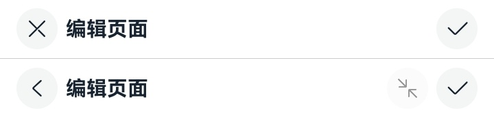
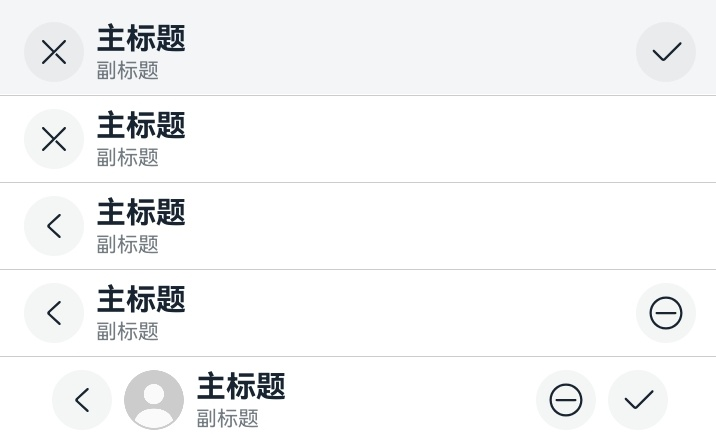

# EditableTitleBar


编辑型标题栏，适用于多选界面或者内容的编辑界面，一般采取左叉右勾的形式。


> **说明：**
>
> 该组件从API Version 10开始支持。后续版本如有新增内容，则采用上角标单独标记该内容的起始版本。


## 导入模块

```
import { EditableTitleBar } from '@kit.ArkUI'
```


## 子组件

无

## 属性
不支持[通用属性](ts-universal-attributes-size.md)


## EditableTitleBar

EditableTitleBar({leftIconStyle: EditableLeftIconType, imageItem?: EditableTitleBarItem, title: ResourceStr, subtitle?: ResourceStr, menuItems?: Array&lt;EditableTitleBarMenuItem&gt;, isSaveIconRequired: boolean, onSave?: () =&gt; void, onCancel?: () =&gt;void, options: EditableTitleBarOptions, contentMargin?: LocalizedMargin})

**装饰器类型：**\@Component

**系统能力：** SystemCapability.ArkUI.ArkUI.Full

| 名称 | 类型 | 必填 | 装饰器类型 | 说明 |
| -------- | -------- | -------- | -------- | -------- |
| leftIconStyle | [EditableLeftIconType](#editablelefticontype) | 是 | - | 左侧按钮类型。<br />默认值：EditableLeftIconType.Back，表示返回。<br/>**原子化服务API：** 从API version 11开始，该接口支持在原子化服务中使用。  |
| imageItem<sup>12+</sup> | [EditableTitleBarItem](#editabletitlebaritem12) | 否 | - | 用于左侧头像的单个菜单项目。<br />默认值：undefined。<br/>**原子化服务API：** 从API version 12开始，该接口支持在原子化服务中使用。                    |
| title | [ResourceStr](ts-types.md#resourcestr) | 是 | - | 标题。<br />默认值：''，表示标题内容为空。<br/>**原子化服务API：** 从API version 11开始，该接口支持在原子化服务中使用。          |
| subtitle<sup>12+</sup> | [ResourceStr](ts-types.md#resourcestr) | 否 | - | 副标题。<br />默认值：''，表示副标题内容为空。<br/>**原子化服务API：** 从API version 12开始，该接口支持在原子化服务中使用。    |
| menuItems | Array&lt;[EditableTitleBarMenuItem](#editabletitlebarmenuitem)&gt; | 否 | - | 右侧菜单项目列表。<br />默认值：undefined。<br/>**原子化服务API：** 从API version 11开始，该接口支持在原子化服务中使用。       |
| isSaveIconRequired<sup>12+</sup> | boolean | 否 | - | 是否需要右侧的保存按钮。<br />默认值：true，表示需要右侧的保存按钮。<br/>**说明：** 未使用@Require装饰，构造时不强制校验参数。<br/>**原子化服务API：** 从API version 12开始，该接口支持在原子化服务中使用。        |
| onSave | ()&nbsp;=&gt;&nbsp;void | 否 | - | 保存时的动作闭包。<br />默认值：() => void。<br/>**原子化服务API：** 从API version 11开始，该接口支持在原子化服务中使用。        |
| onCancel | ()&nbsp;=&gt;&nbsp;void | 否 | - | 当左侧按钮类型为&nbsp;Cancel，触发取消时的动作闭包。<br />默认值：() => void。<br />从API version 12开始，当左侧按钮类型为&nbsp;Back，触发返回时的动作闭包。<br/>**原子化服务API：** 从API version 11开始，该接口支持在原子化服务中使用。    |
| options<sup>12+</sup> | [EditableTitleBarOptions](#editabletitlebaroptions12) | 否 | - | 标题样式。<br />默认值：<br />{<br />safeAreaType: [SafeAreaType.SYSTEM],<br />safeAreaEdges: [SafeAreaEdge.TOP], <br />backgroundColor: '#00000000'<br />}。<br/>**说明：** 未使用@Require装饰，构造时不强制校验参数。<br/>**原子化服务API：** 从API version 12开始，该接口支持在原子化服务中使用。 |
| contentMargin<sup>12+</sup> | [LocalizedMargin](ts-types.md#localizedmargin12) | 否 | @Prop | 标题栏外边距，不支持设置负数。<br />默认值：<br /> {start: LengthMetrics.resource(`$r('sys.float.margin_left')`), end: LengthMetrics.resource(`$r('sys.float.margin_right')`)}。<br/>**原子化服务API：** 从API version 12开始，该接口支持在原子化服务中使用。 |

## EditableLeftIconType

**原子化服务API：** 从API version 11开始，该接口支持在原子化服务中使用。

**系统能力：** SystemCapability.ArkUI.ArkUI.Full

| 名称 | 值 | 说明 |
| -------- | -------- | -------- |
| Back | 0 | 返回按钮。 |
| Cancel | 1 | 取消按钮。 |

## EditableTitleBarMenuItem

**系统能力：** SystemCapability.ArkUI.ArkUI.Full

| 名称 | 类型 | 必填 | 说明 |
| -------- | -------- | -------- | -------- |
| value | [ResourceStr](ts-types.md#resourcestr) | 是 | 图标资源。<br/>**原子化服务API：** 从API version 11开始，该接口支持在原子化服务中使用。 |
| label<sup>12+</sup> | [ResourceStr](ts-types.md#resourcestr) | 否 | 图标标签描述。<br/>**原子化服务API：** 从API version 12开始，该接口支持在原子化服务中使用。 |
| isEnabled | boolean | 否 | 是否启用，默认禁用。<br> isEnabled为true时，表示为启用。<br> isEnabled为false时，表示为禁用。<br/>**原子化服务API：** 从API version 11开始，该接口支持在原子化服务中使用。 |
| action | ()&nbsp;=&gt;&nbsp;void | 否 | 触发时的动作闭包。<br/>**原子化服务API：** 从API version 11开始，该接口支持在原子化服务中使用。 |

## EditableTitleBarItem<sup>12+</sup>

type EditableTitleBarItem = EditableTitleBarMenuItem

**原子化服务API：** 从API version 12开始，该接口支持在原子化服务中使用。

**系统能力：** SystemCapability.ArkUI.ArkUI.Full

| 类型 | 说明 |
| -------- | -------- |
| [EditableTitleBarMenuItem](#editabletitlebarmenuitem) | 左侧头像的单个菜单类型。 |

## EditableTitleBarOptions<sup>12+</sup>

**原子化服务API：** 从API version 12开始，该接口支持在原子化服务中使用。

**系统能力：** SystemCapability.ArkUI.ArkUI.Full

| 名称 | 类型 | 必填 | 说明 |
| -------- | -------- | -------- | -------- |
| backgroundColor | [ResourceColor](ts-types.md#resourcecolor) | 否 | 标题栏背景色。<br />默认值: '#00000000'|
| backgroundBlurStyle | [BlurStyle](ts-universal-attributes-background.md#blurstyle9) | 否 | 标题栏背景模糊样式。<br />默认值: [BlurStyle.NONE]|
| safeAreaTypes | Array <[SafeAreaType](ts-types.md#safeareatype10)> | 否   | 非必填，配置扩展安全区域的类型。<br />默认值: [SafeAreaType.SYSTEM] |
| safeAreaEdges  | Array <[SafeAreaEdge](ts-types.md#safeareaedge10)> | 否   | 非必填，配置扩展安全区域的方向。<br />默认值: [SafeAreaEdge.TOP] |

## 事件
不支持[通用事件](ts-universal-events-click.md)

## 示例

### 示例1

```ts
// 该示例主要演示EditableTitleBar设置左侧图标、主标题及自定义右侧图标区的效果。
import { EditableLeftIconType, EditableTitleBar, promptAction } from '@kit.ArkUI';

@Entry
@Component
struct Index {
  build() {
    Row() {
      Column() {
        Divider().height(2).color(0xCCCCCC)
        EditableTitleBar({
          leftIconStyle: EditableLeftIconType.Cancel,
          title: '编辑页面',
          menuItems: [],
          onCancel: () => {
            promptAction.showToast({ message: 'on cancel' });
          },
          onSave: () => {
            promptAction.showToast({ message: 'on save' });
          }
        })
        Divider().height(2).color(0xCCCCCC)
        EditableTitleBar({
          leftIconStyle: EditableLeftIconType.Back,
          title: '编辑页面',
          menuItems: [
            {
              value: $r('app.media.ic_public_reduce'),
              isEnabled: false,
              action: () => {
                promptAction.showToast({ message: 'show toast index 2' });
              }
            }
          ],
          onSave: () => {
            promptAction.showToast({ message: 'on save' })
          }
        })
        Divider().height(2).color(0xCCCCCC)
      }.width('100%')
    }.height('100%')
  }
}
```



### 示例2

```ts
// 该示例主要演示EditableTitleBar设置背景模糊、头像；取消右侧保存图标及自定义标题栏外边距的效果。
import { EditableLeftIconType, EditableTitleBar, LengthMetrics, promptAction, router } from '@kit.ArkUI';

@Entry
@Component
struct Index {
  @State titlebarMargin: LocalizedMargin = {
    start: LengthMetrics.vp(35),
    end: LengthMetrics.vp(35),
  };

  build() {
    Row() {
      Column() {
        EditableTitleBar({
          leftIconStyle: EditableLeftIconType.Cancel,
          title: '主标题',
          subtitle: '副标题',
          // 设置背景模糊效果
          options: {
            backgroundBlurStyle: BlurStyle.COMPONENT_THICK,
          },
          onSave: () => {
            promptAction.showToast({ message: "on save" });
          },
        })

        Divider().height(2).color(0xCCCCCC);

        EditableTitleBar({
          leftIconStyle: EditableLeftIconType.Cancel,
          title: '主标题',
          subtitle: '副标题',
          // 取消右侧保存按钮
          isSaveIconRequired: false,
        })

        Divider().height(2).color(0xCCCCCC);

        EditableTitleBar({
          leftIconStyle: EditableLeftIconType.Back,
          title: '主标题',
          subtitle: '副标题',
          isSaveIconRequired: false,
          onCancel: () => {
            router.back();
          },
        })

        Divider().height(2).color(0xCCCCCC);

        EditableTitleBar({
          leftIconStyle: EditableLeftIconType.Back,
          title: '主标题',
          subtitle: '副标题',
          menuItems: [
            {
              value: $r('sys.media.ohos_ic_public_remove'),
              isEnabled: true,
              action: () => {
                promptAction.showToast({ message: "show toast index 1" });
              }
            }
          ],
          isSaveIconRequired: false,
          // 点击左侧Back图标，触发的动作。
          onCancel: () => {
            router.back();
          },
        })

        Divider().height(2).color(0xCCCCCC);

        EditableTitleBar({
          leftIconStyle: EditableLeftIconType.Back,
          title: '主标题',
          subtitle: '副标题',
          // 设置可点击头像
          imageItem: {
            value: $r('app.media.img'),
            isEnabled: true,
            action: () => {
              promptAction.showToast({ message: "show toast index 2" });
            }
          },
          // 设置标题栏外边距
          contentMargin: this.titlebarMargin,
          // 右侧图标配置
          menuItems: [
            {
              value: $r('sys.media.ohos_ic_public_remove'),
              isEnabled: true,
              action: () => {
                promptAction.showToast({ message: "show toast index 3" });
              }
            }
          ],
          onCancel: () => {
            router.back();
          },
        })
      }
    }
  }
}
```


