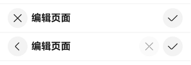
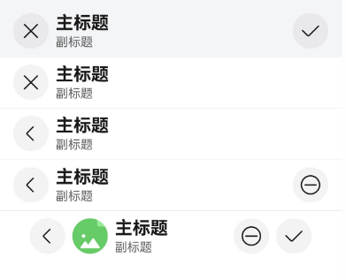
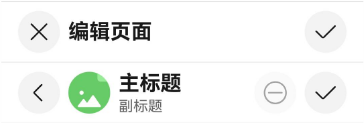
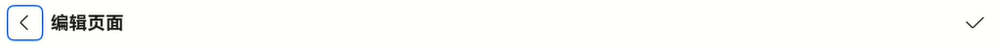
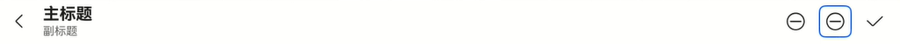
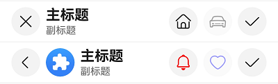

# EditableTitleBar


编辑型标题栏，适用于多选界面或者内容的编辑界面，一般采取左叉右勾的形式。


> **说明：**
>
> 该组件从API version 10开始支持。后续版本如有新增内容，则采用上角标单独标记该内容的起始版本。
>
> 该组件不支持在Wearable设备上使用。


## 导入模块

```
import { EditableTitleBar } from '@kit.ArkUI';
```


## 子组件

无

## 属性
不支持[通用属性](ts-component-general-attributes.md)。


## EditableTitleBar

EditableTitleBar({leftIconStyle: EditableLeftIconType, imageItem?: EditableTitleBarItem, title: ResourceStr, subtitle?: ResourceStr, menuItems?: Array&lt;EditableTitleBarMenuItem&gt;, isSaveIconRequired: boolean, onSave?: () =&gt; void, onCancel?: () =&gt;void, options: EditableTitleBarOptions, contentMargin?: LocalizedMargin, leftIconDefaultFocus?: boolean, saveIconDefaultFocus?: boolean})

**装饰器类型：**\@Component

**系统能力：** SystemCapability.ArkUI.ArkUI.Full

| 名称 | 类型 | 必填 | 装饰器类型 | 说明                                                                                                                                                                                                                                             |
| -------- | -------- | -------- | -------- |------------------------------------------------------------------------------------------------------------------------------------------------------------------------------------------------------------------------------------------------|
| leftIconStyle | [EditableLeftIconType](#editablelefticontype) | 是 | - | 左侧按钮类型。<br />默认值：EditableLeftIconType.Back，表示返回。<br/>**原子化服务API：** 从API version 11开始，该接口支持在原子化服务中使用。                                                                                                                                           |
| imageItem<sup>12+</sup> | [EditableTitleBarItem](#editabletitlebaritem12) | 否 | - | 用于左侧头像的单个菜单项目。<br />默认值：undefined。<br/>**说明：** 左侧头像不支持配置无障碍属性。<br/>**原子化服务API：** 从API version 12开始，该接口支持在原子化服务中使用。                                                                                                                             |
| title | [ResourceStr](ts-types.md#resourcestr) | 是 | - | 标题。<br />默认值：''，表示标题内容为空。<br/>**原子化服务API：** 从API version 11开始，该接口支持在原子化服务中使用。                                                                                                                                                                  |
| subtitle<sup>12+</sup> | [ResourceStr](ts-types.md#resourcestr) | 否 | - | 副标题。<br />默认值：''，表示副标题内容为空。<br/>**原子化服务API：** 从API version 12开始，该接口支持在原子化服务中使用。                                                                                                                                                                |
| menuItems | Array&lt;[EditableTitleBarMenuItem](#editabletitlebarmenuitem)&gt; | 否 | - | 右侧菜单项目列表。<br />默认值：undefined。<br/>**原子化服务API：** 从API version 11开始，该接口支持在原子化服务中使用。                                                                                                                                                              |
| isSaveIconRequired<sup>12+</sup> | boolean | 是 | - | 是否需要右侧的保存按钮。<br />默认值：true，表示需要右侧的保存按钮。<br/>**说明：** 未使用@Require装饰，构造时不强制校验参数。<br/>**原子化服务API：** 从API version 12开始，该接口支持在原子化服务中使用。                                                                                                              |
| onSave | ()&nbsp;=&gt;&nbsp;void | 否 | - | 保存时的动作闭包。<br />默认值：() => void。<br/>**原子化服务API：** 从API version 11开始，该接口支持在原子化服务中使用。                                                                                                                                                             |
| onCancel | ()&nbsp;=&gt;&nbsp;void | 否 | - | 当左侧按钮类型为&nbsp;Cancel，触发取消时的动作闭包。<br />默认值：() => void。<br />从API version 12开始，当左侧按钮类型为&nbsp;Back，触发返回时的动作闭包。<br/>**原子化服务API：** 从API version 11开始，该接口支持在原子化服务中使用。                                                                                |
| options<sup>12+</sup> | [EditableTitleBarOptions](#editabletitlebaroptions12) | 是 | - | 标题样式。<br />默认值：<br />{<br />safeAreaTypes: [SafeAreaType.SYSTEM],<br />safeAreaEdges: [SafeAreaEdge.TOP], <br />backgroundColor: '#00000000'<br />}。<br/>**说明：** 未使用@Require装饰，构造时不强制校验参数。<br/>**原子化服务API：** 从API version 12开始，该接口支持在原子化服务中使用。 |
| contentMargin<sup>12+</sup> | [LocalizedMargin](ts-types.md#localizedmargin12) | 否 | @Prop | 标题栏外边距，不支持设置负数。<br />默认值：<br /> {start: LengthMetrics.resource(`$r('sys.float.margin_left')`), end: LengthMetrics.resource(`$r('sys.float.margin_right')`)}。<br/>**原子化服务API：** 从API version 12开始，该接口支持在原子化服务中使用。                               |
| leftIconDefaultFocus<sup>18+</sup> | boolean  | 否 | - | 左侧图标是否为默认焦点。<br />默认值：false，表示不是默认焦点。 <br/>**原子化服务API：** 从API version 18开始，该接口支持在原子化服务中使用。                                                                                                                                                     |
| saveIconDefaultFocus<sup>18+</sup> | boolean  | 否 | - | 保存图标是否为默认焦点。<br />默认值：false，表示不是默认焦点。 <br/>**原子化服务API：** 从API version 18开始，该接口支持在原子化服务中使用。                                                                                                                                                               |

> **说明：**
> 
> 入参对象不可为undefined，即`EditableTitleBar(undefined)`。
> 若同时有多个可操作区域设置值默认焦点，则设置过默认焦点的可操作区域中显示顺序的第一个为默认焦点。

## EditableLeftIconType

**原子化服务API：** 从API version 11开始，该接口支持在原子化服务中使用。

**系统能力：** SystemCapability.ArkUI.ArkUI.Full

| 名称 | 值 | 说明 |
| -------- | -------- | -------- |
| Back | 0 | 返回按钮。 |
| Cancel | 1 | 取消按钮。 |

## EditableTitleBarMenuItem

**系统能力：** SystemCapability.ArkUI.ArkUI.Full

| 名称 | 类型 | 必填 | 说明                                                                                                                                                                                                                                                          |
| -------- | -------- | -------- |-------------------------------------------------------------------------------------------------------------------------------------------------------------------------------------------------------------------------------------------------------------|
| value | [ResourceStr](ts-types.md#resourcestr) | 是 | 图标资源。<br/>**原子化服务API：** 从API version 11开始，该接口支持在原子化服务中使用。                                                                                                                                                                                                   |
| symbolStyle<sup>18+</sup> | [SymbolGlyphModifier](ts-universal-attributes-attribute-modifier.md) | 否 | Symbol图标资源，优先级大于value。<br/>**原子化服务API：** 从API version 18开始，该接口支持在原子化服务中使用。 |
| label<sup>12+</sup> | [ResourceStr](ts-types.md#resourcestr) | 否 | 图标标签描述。<br/>**原子化服务API：** 从API version 12开始，该接口支持在原子化服务中使用。                                                                                                                                                                                                 |
| isEnabled | boolean | 否 | 是否启用，默认启用。<br> isEnabled为true时，表示为启用。<br> isEnabled为false时，表示为禁用。<br/>**原子化服务API：** 从API version 11开始，该接口支持在原子化服务中使用。                                                                                                                                       |
| action | ()&nbsp;=&gt;&nbsp;void | 否 | 触发时的动作闭包。<br/>**原子化服务API：** 从API version 11开始，该接口支持在原子化服务中使用。                                                                                                                                                                                               |
| accessibilityLevel<sup>18+<sup>       | string  | 否 | 标题栏右侧自定义按钮无障碍重要性。用于控制当前项是否可被无障碍辅助服务所识别。<br/>支持的值为：<br/>"auto"：当前组件会转换'yes'。<br/>"yes"：当前组件可被无障碍辅助服务所识别。<br/>"no"：当前组件不可被无障碍辅助服务所识别。<br/>"no-hide-descendants"：当前组件及其所有子组件不可被无障碍辅助服务所识别。<br/>默认值："auto"。<br/>**原子化服务API：** 从API version 18开始，该接口支持在原子化服务中使用。 |
| accessibilityText<sup>18+<sup>        | ResourceStr | 否 | 标题栏右侧自定义按钮的无障碍文本属性。当组件不包含文本属性时，屏幕朗读选中此组件时不播报，使用者无法清楚地知道当前选中了什么组件。为了解决此场景，开发人员可为不包含文字信息的组件设置无障碍文本，当屏幕朗读选中此组件时播报无障碍文本的内容，帮助屏幕朗读的使用者清楚地知道自己选中了什么组件。<br/>默认值：有label默认值为当前项label属性内容，没有设置label时，默认值为“ ”。<br/>**原子化服务API：** 从API version 18开始，该接口支持在原子化服务中使用。                                     |
| accessibilityDescription<sup>18+<sup> | ResourceStr | 否 | 标题栏右侧自定义按钮的无障碍描述。此描述用于向用户详细解释当前组件，开发人员应为组件的这一属性提供较为详尽的文本说明，以协助用户理解即将执行的操作及其可能产生的后果。特别是当这些后果无法仅从组件的属性和无障碍文本中直接获知时。如果组件同时具备文本属性和无障碍说明属性，当组件被选中时，系统将首先播报组件的文本属性，随后播报无障碍说明属性的内容。<br/>默认值为“单指双击即可执行”。<br/>**原子化服务API：** 从API version 18开始，该接口支持在原子化服务中使用。           |
| defaultFocus<sup>18+<sup>             | boolean | 否 | 是否设置为默认获焦。<br/>true: 获焦 <br/>false: 不获焦 <br/>默认值：false <br/>**原子化服务API：** 从API version 18开始，该接口支持在原子化服务中使用。                                                                                                                                                 |

## EditableTitleBarItem<sup>12+</sup>

type EditableTitleBarItem = EditableTitleBarMenuItem

**原子化服务API：** 从API version 12开始，该接口支持在原子化服务中使用。

**系统能力：** SystemCapability.ArkUI.ArkUI.Full

| 类型 | 说明 |
| -------- | -------- |
| [EditableTitleBarMenuItem](#editabletitlebarmenuitem) | 左侧头像的单个菜单类型。 |

## EditableTitleBarOptions<sup>12+</sup>

**原子化服务API：** 从API version 12开始，该接口支持在原子化服务中使用。

**系统能力：** SystemCapability.ArkUI.ArkUI.Full

| 名称 | 类型 | 必填 | 说明 |
| -------- | -------- | -------- | -------- |
| backgroundColor | [ResourceColor](ts-types.md#resourcecolor) | 否 | 标题栏背景色。<br />默认值: '#00000000'|
| backgroundBlurStyle | [BlurStyle](ts-universal-attributes-background.md#blurstyle9) | 否 | 标题栏背景模糊样式。<br />默认值: [BlurStyle.NONE]|
| safeAreaTypes | Array <[SafeAreaType](ts-types.md#safeareatype10)> | 否   | 非必填，配置扩展安全区域的类型。<br />默认值: [SafeAreaType.SYSTEM] |
| safeAreaEdges  | Array <[SafeAreaEdge](ts-types.md#safeareaedge10)> | 否   | 非必填，配置扩展安全区域的方向。<br />默认值: [SafeAreaEdge.TOP] |

## 事件
不支持[通用事件](ts-component-general-events.md)。

## 示例

### 示例1（右侧图标自定义标题栏）
 该示例主要演示EditableTitleBar设置左侧图标、主标题及自定义右侧图标区的效果。

```ts
import { EditableLeftIconType, EditableTitleBar, Prompt } from '@kit.ArkUI';

@Entry
@Component
struct Index {
  build() {
    Row() {
      Column() {
        Divider().height(2).color(0xCCCCCC)
        // 左侧取消按钮，右侧保存按钮。
        EditableTitleBar({
          leftIconStyle: EditableLeftIconType.Cancel,
          title: '编辑页面',
          menuItems: [],
          onCancel: () => {
            Prompt.showToast({ message: 'on cancel' });
          },
          onSave: () => {
            Prompt.showToast({ message: 'on save' });
          }
        })
        Divider().height(2).color(0xCCCCCC)
        // 左侧返回按钮，右侧自定义取消按钮（disabled）、保存按钮。
        EditableTitleBar({
          leftIconStyle: EditableLeftIconType.Back,
          title: '编辑页面',
          menuItems: [
            {
              value: $r('sys.media.ohos_ic_public_cancel'),
              isEnabled: false,
              action: () => {
                Prompt.showToast({ message: 'show toast index 2' });
              }
            }
          ],
          onSave: () => {
            Prompt.showToast({ message: 'on save' })
          }
        })
        Divider().height(2).color(0xCCCCCC)
      }.width('100%')
    }.height('100%')
  }
}
```



### 示例2（头像与背景模糊标题栏）
该示例主要演示EditableTitleBar设置背景模糊、头像；取消右侧保存图标及自定义标题栏外边距的效果。

```ts
import { EditableLeftIconType, EditableTitleBar, LengthMetrics, Prompt } from '@kit.ArkUI';

@Entry
@Component
struct Index {
  @State titleBarMargin: LocalizedMargin = {
    start: LengthMetrics.vp(35),
    end: LengthMetrics.vp(35),
  };

  build() {
    Row() {
      Column() {
        EditableTitleBar({
          leftIconStyle: EditableLeftIconType.Cancel,
          title: '主标题',
          subtitle: '副标题',
          // 设置背景模糊效果
          options: {
            backgroundBlurStyle: BlurStyle.COMPONENT_THICK,
          },
          onSave: () => {
            Prompt.showToast({ message: "on save" });
          },
        })
        Divider().height(2).color(0xCCCCCC);
        EditableTitleBar({
          leftIconStyle: EditableLeftIconType.Cancel,
          title: '主标题',
          subtitle: '副标题',
          // 取消右侧保存按钮
          isSaveIconRequired: false,
        })
        Divider().height(2).color(0xCCCCCC);
        EditableTitleBar({
          leftIconStyle: EditableLeftIconType.Back,
          title: '主标题',
          subtitle: '副标题',
          isSaveIconRequired: false,
          onCancel: () => {
            this.getUIContext()?.getRouter()?.back();
          },
        })
        Divider().height(2).color(0xCCCCCC);
        EditableTitleBar({
          leftIconStyle: EditableLeftIconType.Back,
          title: '主标题',
          subtitle: '副标题',
          menuItems: [
            {
              value: $r('sys.media.ohos_ic_public_remove'),
              isEnabled: true,
              action: () => {
                Prompt.showToast({ message: "show toast index 1" });
              }
            }
          ],
          isSaveIconRequired: false,
          // 点击左侧Back图标，触发的动作。
          onCancel: () => {
            this.getUIContext()?.getRouter()?.back();
          },
        })
        Divider().height(2).color(0xCCCCCC);
        EditableTitleBar({
          leftIconStyle: EditableLeftIconType.Back,
          title: '主标题',
          subtitle: '副标题',
          // 设置可点击头像
          imageItem: {
            value: $r('sys.media.ohos_ic_normal_white_grid_image'),
            isEnabled: true,
            action: () => {
              Prompt.showToast({ message: "show toast index 2" });
            }
          },
          // 设置标题栏外边距
          contentMargin: this.titleBarMargin,
          // 右侧图标配置
          menuItems: [
            {
              value: $r('sys.media.ohos_ic_public_remove'),
              isEnabled: true,
              action: () => {
                Prompt.showToast({ message: "show toast index 3" });
              }
            }
          ],
          onCancel: () => {
            this.getUIContext()?.getRouter()?.back();
          },
        })
      }
    }
  }
}
```



### 示例3（右侧自定义按钮播报）
该示例通过设置标题栏的右侧自定义按钮属性accessibilityText、accessibilityDescription、accessibilityLevel自定义屏幕朗读播报文本。
```ts

import { Prompt, EditableLeftIconType, EditableTitleBar } from '@kit.ArkUI';

@Entry
@Component
struct Index1 {
  build() {
    Row() {
      Column() {
        Divider().height(2).color(0xCCCCCC)
        EditableTitleBar({
          leftIconStyle: EditableLeftIconType.Cancel,
          title: '编辑页面',
          menuItems: [],
          onCancel: () => {
            Prompt.showToast({ message: 'on cancel' });
          },
          onSave: () => {
            Prompt.showToast({ message: 'on save' });
          }
        })
        Divider().height(2).color(0xCCCCCC)
        EditableTitleBar({
          // 头像、自定义按钮不可用
          leftIconStyle: EditableLeftIconType.Back,
          title: '主标题',
          subtitle: '副标题',
          imageItem: {
            value: $r('sys.media.ohos_ic_normal_white_grid_image'),
            isEnabled: true,
            action: () => {
              Prompt.showToast({ message: "show toast index 1" });
            }
          },
          menuItems: [
            {
              value: $r('sys.media.ohos_ic_public_remove'),
              label: '取消',
              isEnabled: false,
              accessibilityText: '删除',
              accessibilityDescription: '点击即可删除',
              action: () => {
                Prompt.showToast({ message: "show toast index 2" });
              }
            }
          ],
          onCancel: () => {
            this.getUIContext()?.getRouter()?.back();
          },
        })
        Divider().height(2).color(0xCCCCCC)
      }
    }
  }
}
```


### 示例4（左侧图标设置为默认焦点）
该示例通过设置标题栏属性leftIconDefaultFocus使左侧图标默认获焦。
```ts

import { Prompt, EditableLeftIconType, EditableTitleBar } from '@kit.ArkUI';

@Entry
@Component
struct Index {
  build() {
    Column() {
      EditableTitleBar({
        leftIconStyle: EditableLeftIconType.Back,
        leftIconDefaultFocus: true, //设置左侧图标默认获焦。
        title: '编辑页面',
        menuItems: [],
        onSave: () => {
          Prompt.showToast({ message: 'on save' });
        }
      })
    }
    .height('100%')
    .width('100%')
  }
}
```


### 示例5（右侧自定义图标设置为默认焦点）
该示例通过设置标题栏右侧图标属性defaultFocus使右侧图标默认获焦。
```ts

import { Prompt, EditableLeftIconType, EditableTitleBar } from '@kit.ArkUI';

@Entry
@Component
struct Index {
  build() {
    Column() {
      EditableTitleBar({
        leftIconStyle: EditableLeftIconType.Back,
        title: '主标题',
        subtitle: '副标题',
        // 右侧图标配置
        menuItems: [
          {
            value: $r('sys.media.ohos_ic_public_remove'),
            isEnabled: true,
            action: () => {
              Prompt.showToast({ message: "show toast index 1" });
            }
          },
          {
            value: $r('sys.media.ohos_ic_public_remove'),
            isEnabled: true,
            defaultFocus: true,
            action: () => {
              Prompt.showToast({ message: "show toast index 2" });
            }
          }
        ],
        onCancel: () => {
          this.getUIContext()?.getRouter()?.back();
        },
      })
    }
    .height('100%')
    .width('100%')
  }
}
```


### 示例6（设置Symbol类型图标）

该示例通过设置EditableTitleBarMenuItem的属性symbolStyle，展示了自定义Symbol类型图标。

```ts
import { EditableLeftIconType, EditableTitleBar, Prompt, SymbolGlyphModifier } from '@kit.ArkUI';

@Entry
@Component
struct Index {
  build() {
    Row() {
      Column() {
        Divider().height(2).color(0xCCCCCC)
        EditableTitleBar({
          leftIconStyle: EditableLeftIconType.Cancel,
          title: '主标题',
          subtitle: '副标题',
          menuItems: [
            {
              value: $r('sys.symbol.house'),
              isEnabled: true,
              action: () => {
                Prompt.showToast({ message: 'show toast index 2' });
              }
            },
            {
              value: $r('sys.symbol.car'),
              isEnabled: false,
            }
          ],
        })
        Divider().height(2).color(0xCCCCCC)
        EditableTitleBar({
          leftIconStyle: EditableLeftIconType.Back,
          title: '主标题',
          subtitle: '副标题',
          imageItem: {
            value: $r('sys.media.ohos_app_icon'),
            isEnabled: true,
            action: () => {
              Prompt.showToast({ message: "show toast index 1" });
            }
          },
          menuItems: [
            {
              value: $r('sys.symbol.house'),
              symbolStyle: new SymbolGlyphModifier($r('sys.symbol.bell')).fontColor([Color.Red]),
              isEnabled: true,
              action: () => {
                Prompt.showToast({ message: 'show toast index 2' });
              }
            },
            {
              value: $r('sys.symbol.car'),
              symbolStyle: new SymbolGlyphModifier($r('sys.symbol.heart')).fontColor([Color.Blue]),
              isEnabled: false,
            }
          ],
        })
        Divider().height(2).color(0xCCCCCC)
      }.width('100%')
    }.height('100%')
  }
}
```

