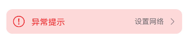
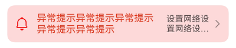

# ExceptionPrompt
<!--Kit: ArkUI-->
<!--Subsystem: ArkUI-->
<!--Owner: @fengluochenai-->
<!--Designer: @YanSanzo-->
<!--Tester: @tinygreyy-->
<!--Adviser: @HelloCrease-->


异常提示，适用于有异常需要提示异常内容的情况。


> **说明：**
>
> 该组件从API version 11开始支持。后续版本如有新增内容，则采用上角标单独标记该内容的起始版本。
>
> 该组件不支持在Wearable设备上使用。


## 导入模块

```ts
import { ExceptionPrompt, PromptOptions, MarginType } from '@kit.ArkUI';
```


## 子组件

无

## 属性

不支持[通用属性](ts-component-general-attributes.md)。

## ExceptionPrompt

ExceptionPrompt({ options: PromptOptions, onTipClick?: ()=>void, onActionTextClick?: ()=>void })

**装饰器类型：**\@Component

**原子化服务API：** 从API version 12开始，该接口支持在原子化服务中使用。

**系统能力：** SystemCapability.ArkUI.ArkUI.Full

**参数：**


| 名称 | 类型 | 必填 | 装饰器类型 | 说明 |
| -------- | -------- | -------- | -------- | -------- |
| options | [PromptOptions](#promptoptions) | 是 | \@Prop | 指定当前异常提示的配置信息。 |
| onTipClick | ()=>void | 否 | - | 点击左侧提示文本的回调函数。 |
| onActionTextClick | ()=>void | 否 | - | 点击右侧图标按钮的回调函数。 |

## PromptOptions

PromptOptions定义options的类型。

**系统能力：** SystemCapability.ArkUI.ArkUI.Full

| 名称 | 类型                                                                               | 必填 | 说明                                                                                                                                                                                                                                                                                                                                                                      |
| -------- |----------------------------------------------------------------------------------| -------- |-------------------------------------------------------------------------------------------------------------------------------------------------------------------------------------------------------------------------------------------------------------------------------------------------------------------------------------------------------------------------|
| icon | [ResourceStr](ts-types.md#resourcestr)                                           | 否 | 指定当前异常提示的异常图标样式。<br/>默认不设置或设置为undefined，异常图标不显示。<br/>**原子化服务API：** 从API version 12开始，该接口支持在原子化服务中使用。                                                                                                                                                                                                                                                                                                    |
| symbolStyle<sup>18+</sup> | [SymbolGlyphModifier](ts-universal-attributes-attribute-symbolglyphmodifier.md#symbolglyphmodifier) | 否 | 指定当前异常提示的异常Symbol图标样式，优先级大于icon。<br/>默认不设置或设置为undefined，Symbol图标不显示。<br/>**原子化服务API：** 从API version 18开始，该接口支持在原子化服务中使用。                                                                                                                                                                                                                                                           |
| tip | [ResourceStr](ts-types.md#resourcestr)                                           | 否 | 指定当前异常提示的文字提示内容。<br />支持默认内置四种状态文字资源如下：<br />1.无网络状态：显示网络未连接：引用ohos_network_not_connected。<br />2.网络差状态：显示网络连接不稳定，请点击重试：引用ohos_network_connected_unstable。<br />3.连不上服务器状态：显示无法连接到服务器，请点击重试：引用ohos_unstable_connect_server。<br />4.有网但是获取不到内容状态：显示无法获取位置，请点击重试：引用ohos_custom_network_tips_left。<br/>默认不设置或设置为undefined，文字提示内容不显示。<br/>**原子化服务API：** 从API version 12开始，该接口支持在原子化服务中使用。 |
| marginType | [MarginType](#margintype)                                                        | 是 | 指定当前异常提示的边距样式。 <br/>**原子化服务API：** 从API version 12开始，该接口支持在原子化服务中使用。                                                                                                                                                                                                                                                                                                     |
| actionText | [ResourceStr](ts-types.md#resourcestr)                                           | 否 | 指定当前异常提示的右侧图标按钮的文字内容。 <br/>默认不设置或设置为undefined，文字内容不显示。<br/>**原子化服务API：** 从API version 12开始，该接口支持在原子化服务中使用。                                                                                                                                                                                                                                                                     |
| marginTop | [Dimension](ts-types.md#dimension10)                                             | 是 | 指定当前异常提示的距离顶部的位置。 <br/>**原子化服务API：** 从API version 12开始，该接口支持在原子化服务中使用。                                                                                                                                                                                                                                                                                                  |
| isShown | boolean                                                                          | 否 | 指定当前异常提示的显隐状态。<br />true：显示状态。<br />false：隐藏状态。<br/>默认值：false<br/>**原子化服务API：** 从API version 12开始，该接口支持在原子化服务中使用。                                                                                                                                                                                                                                                      |

## MarginType

MarginType定义marginType的类型。

**原子化服务API：** 从API version 12开始，该接口支持在原子化服务中使用。

**系统能力：** SystemCapability.ArkUI.ArkUI.Full

| 名称 | 值 | 说明 |
| -------- | -------- | -------- |
| DEFAULT_MARGIN | 0 | 默认边距：<br />边距1：引用ohos_id_card_margin_start。<br />边距2：引用ohos_id_card_margin_end。 |
| FIT_MARGIN | 1 | 可适配边距：<br /> 边距1：引用ohos_id_max_padding_start。<br /> 边距2：引用ohos_id_max_padding_end。 |

## 事件
不支持[通用事件](ts-component-general-events.md)。

## 示例
### 示例1（设置异常提示）

该示例展示了如何设置异常提示的异常图标、异常提示的文字、边距样式和右侧图标按钮的文字内容。

```ts
import { ExceptionPrompt, PromptOptions, MarginType } from '@kit.ArkUI';

@Entry
@Component
struct Index {
  @State options: PromptOptions = {
    icon: $r('sys.media.ohos_ic_public_fail'),
    tip: '异常提示',
    marginType: MarginType.DEFAULT_MARGIN,
    actionText: '设置网络',
    marginTop: 80,
    isShown: true,
  }

  build() {
    Column() {
      ExceptionPrompt({
        options: this.options,
        onTipClick: () => {
          // 单击左侧的文本切换到连接状态
        },
        onActionTextClick: () => {
          // 点击“设置网络”按钮，打开设置网络弹窗界面
        },
      })
    }
  }
}
```



### 示例2（设置弹窗类型的异常提示）

该示例使用自定义弹窗设置弹窗类型的异常提示。

```ts
import { ExceptionPrompt, PromptOptions, MarginType } from '@kit.ArkUI';

@CustomDialog
struct CustomDialogExample {
  @Link textValue: string;
  @Link inputValue: string;
  @State options: PromptOptions = {
    icon: $r('sys.media.ohos_ic_public_fail'),
    tip: '异常提示！',
    marginType: MarginType.DEFAULT_MARGIN,
    actionText: '设置',
    marginTop: 5,
    isShown: true,
  };
  cancel: () => void = () => {
  };
  confirm: () => void = () => {
  };
  controller?: CustomDialogController;

  // 若尝试在CustomDialog中传入多个其他的Controller，以实现在CustomDialog中打开另一个或另一些CustomDialog，
  // 那么此处需要将指向自己的controller放在最后
  build() {
    Column() {
      ExceptionPrompt({
        options: this.options,
      })
      TextInput({ placeholder: '', text: this.textValue }).margin({ top: 70 }).height(60).width('90%')
        .onChange((value: string) => {
          this.textValue = value;
        })
      Text('Whether to change a text?').fontSize(16).margin({ bottom: 10 })
      Flex({ justifyContent: FlexAlign.SpaceAround }) {
        Button('cancel')
          .onClick(() => {
            this.controller?.close();
            this.cancel();
          }).backgroundColor(0xffffff).fontColor(Color.Black)
        Button('confirm')
          .onClick(() => {
            this.inputValue = this.textValue;
            this.controller?.close();
            this.confirm();
          }).backgroundColor(0xffffff).fontColor(Color.Red)
      }.margin({ bottom: 10 })
    }
  }
}

@Entry
@Component
struct Index1 {
  @State ButtonText: string = '';
  @State MAP_HEIGHT: string = '30%';
  @State duration: number = 2500;
  @State tips: string = '';
  @State actionText: string = '';
  controller: TextInputController = new TextInputController();
  cancel: () => void = () => {
  };
  confirm: () => void = () => {
  };
  @State options: PromptOptions = {
    icon: $r('sys.media.ohos_ic_public_fail'),
    tip: '',
    marginType: MarginType.DEFAULT_MARGIN,
    actionText: '',
    marginTop: 80,
    isShown: true,
  }
  @State textValue: string = '';
  @State inputValue: string = 'click me';
  dialogController: CustomDialogController | undefined = new CustomDialogController({
    builder: CustomDialogExample({
      cancel: this.onCancel,
      confirm: this.onAccept,
      textValue: $textValue,
      inputValue: $inputValue,
    }),
    cancel: this.existApp,
    autoCancel: true,
    alignment: DialogAlignment.Bottom,
    offset: { dx: 0, dy: -20 },
    gridCount: 4,
    customStyle: false,
  })

  aboutToDisappear() {
    this.dialogController = undefined; // 将dialogController置空
  }

  onCancel() {
    console.info('Callback when the first button is clicked');
  }

  onAccept() {
    console.info('Callback when the second button is clicked');
  }

  existApp() {
    console.info('Click the callback in the blank area');
  }

  build() {
    Column() {
      Button('Click Me')
        .width('30%')
        .margin({ top: 420 })
        .zIndex(999)
        .onClick(() => {
          if (this.dialogController != undefined) {
            this.dialogController.open();
          }
        })
    }
    .height('100%')
    .width('100%')
  }
}
```


### 示例3（设置Symbol类型图标）

从API version 18开始，该示例通过设置PromptOptions的属性symbolStyle，展示了自定义Symbol类型图标。

```ts
import { ExceptionPrompt, MarginType, SymbolGlyphModifier } from '@kit.ArkUI';

@Entry
@Component
struct Index {
  build() {
    Column() {
      ExceptionPrompt({
        options: {
          icon: $r('sys.symbol.house'),
          tip: '异常提示',
          marginType: MarginType.DEFAULT_MARGIN,
          actionText: '设置网络',
          marginTop: 80,
          isShown: true,
        },
      })
      ExceptionPrompt({
        options: {
          icon: $r('sys.symbol.house'),
          symbolStyle: new SymbolGlyphModifier($r('sys.symbol.bell')).fontColor([Color.Red]),
          tip: '异常提示',
          marginType: MarginType.DEFAULT_MARGIN,
          actionText: '设置网络',
          marginTop: 200,
          isShown: true,
        },
      })
    }
  }
}
```

