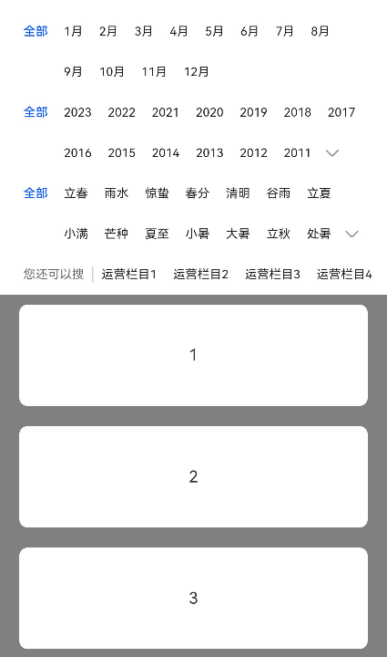

# Filter


多条件筛选，帮助用户在大量信息中找到所需内容，应结合具体场景选择合适筛选方式。多条件筛选控件由筛选器与悬浮条构成，悬浮条可下拉展示悬浮筛选器。筛选器样式可分为多行可折叠类型与多行列表类型，并可以在筛选器最后一行附加快捷筛选器。


> **说明：**
>
> 该组件从API Version 10开始支持。后续版本如有新增内容，则采用上角标单独标记该内容的起始版本。


## 导入模块

```
import { Filter } from '@kit.ArkUI'
```


## 子组件

无

## 属性
支持[通用属性](ts-universal-attributes-size.md)

## Filter

Filter({ multiFilters: Array&lt;FilterParams&gt;,  additionFilters: FilterParams, filterType: FilterType, onFilterChanged: (Array&lt;FilterResult&gt;) =&gt; void, container: ()=&gt; void })

**装饰器类型：**\@Component

**原子化服务API：** 从API version 11开始，该接口支持在原子化服务中使用。

**系统能力：** SystemCapability.ArkUI.ArkUI.Full

**参数：**


| 名称 | 类型 | 必填  | 装饰器类型 | 说明 |
| -------- | -------- | -------- | -------- | -------- |
| multiFilters | Array&lt;[FilterParams](#filterparams)&gt; | 是   | \@Prop | 多条件筛选列表。 |
| additionFilters | [FilterParams](#filterparams) | 否   | \@Prop | 附加快捷筛选项。 |
| filterType | [FilterType](#filtertype) | 否   | \@Prop | 筛选器的样式类型。 |
| onFilterChanged | (filterResults: Array&lt;[FilterResult](#filterresult)&gt;)&nbsp;=&gt;&nbsp;void | 是   | - | 用户点击后的回调事件。回调函数的参数为选中的筛选项结果列表。 |
| container | ()=&gt;void | 是   | \@BuilderParam | 筛选结果展示区域自定义内容，通过尾随闭包形式传入。 |

## FilterParams

**原子化服务API：** 从API version 11开始，该接口支持在原子化服务中使用。

**系统能力：** SystemCapability.ArkUI.ArkUI.Full

| 名称 | 类型 | 必填 | 说明 |
| -------- | -------- | -------- | -------- |
| name | [ResourceStr](ts-types.md#resourcestr) | 是 | 筛选项维度名称。 |
| options | Array&lt;[ResourceStr](ts-types.md#resourcestr)&gt; | 是 | 筛选项维度可选项列表。 |

## FilterType

**原子化服务API：** 从API version 11开始，该接口支持在原子化服务中使用。

**系统能力：** SystemCapability.ArkUI.ArkUI.Full

| 名称 | 值 | 说明 |
| -------- | -------- | -------- |
| MULTI_LINE_FILTER | 0 | 多行可折叠类型筛选器。 |
| LIST_FILTER | 1 | 多行列表类型筛选器。 |

## FilterResult

**原子化服务API：** 从API version 11开始，该接口支持在原子化服务中使用。

**系统能力：** SystemCapability.ArkUI.ArkUI.Full

| 名称 | 类型 | 必填 | 说明 |
| -------- | -------- | -------- | -------- |
| name | [ResourceStr](ts-types.md#resourcestr) | 是 | 筛选项维度名称。 |
| index | number | 是 | 该维度筛选项选中项目的索引值。 |
| value | [ResourceStr](ts-types.md#resourcestr) | 是 | 该维度筛选项选中项目的值。 |

## 事件
不支持[通用事件](ts-universal-events-click.md)

## 示例

该示例展示了设置FilterType属性为MULTI_LINE_FILTER的多行可折叠类型筛选器。

```ts
import { Filter, FilterParams, FilterResult, FilterType } from '@kit.ArkUI'

@Entry
@Component
struct Index {
  private filterParam: Array<FilterParams> = [{name: '月份', options: ['全部','1月','2月','3月','4月','5月','6月','7月','8月','9月','10月','11月','12月']},
    {name: '年份', options: ['全部','2023','2022','2021','2020','2019','2018','2017','2016','2015','2014','2013','2012','2011','2010','2009','2008']},
    {name: '节气', options: ['全部','立春','雨水','惊蛰','春分','清明','谷雨','立夏','小满','芒种','夏至','小暑','大暑','立秋','处暑','白露','秋分','寒露','霜降','立冬','小雪','大雪','冬至','小寒','大寒']}]
  private additionParam: FilterParams = { name: '您还可以搜', options: ['运营栏目1','运营栏目2','运营栏目3','运营栏目4','运营栏目5','运营栏目6']}
  private arr: number[] = [1,2,3,4,5,6,7,8,9,10,1,2,3,4,5,6,7,8,9,10];
  build() {
    Column() {
      Filter({
        multiFilters: this.filterParam,
        additionFilters: this.additionParam,
        filterType: FilterType.MULTI_LINE_FILTER,
        onFilterChanged: (select: Array<FilterResult>) => {
          console.log('rec filter change')
          for (let filter of select) {
            console.log('name:' + filter.name + ',index:' + filter.index + ',value:' + filter.value)
          }
        }
      }){
        List({ initialIndex: 0 }) {
          ForEach(this.arr, (item:string, index: number) => {
            ListItem() {
              Text(item.toString())
                .width("100%")
                .height(100)
                .fontSize(16)
                .textAlign(TextAlign.Center)
                .borderRadius(10)
                .backgroundColor(Color.White)
                .margin({ top:10, bottom: 10 })
            }
          })
        }.backgroundColor(Color.Gray)
        .padding({ left: 20, right: 20 })
      }
    }
    .height('100%')
    .width('100%')
  }
}
```


