# FoldSplitContainer


FoldSplitContainer分栏布局，实现折叠屏二分栏、三分栏在展开态、悬停态以及折叠态的区域控制。


> **说明：**
>
> 该组件从API Version 12开始支持。后续版本如有新增内容，则采用上角标单独标记该内容的起始版本。

## 导入模块

```ts
import { FoldSplitContainer } from '@kit.ArkUI';
```

## 子组件

无

## FoldSplitContainer

FoldSplitContainer({
  primary: Callback&lt;void&gt;,
  secondary: Callback&lt;void&gt;,
  extra?: Callback&lt;void&gt;,
  expandedLayoutOptions: ExpandedRegionLayoutOptions,
  hoverModeLayoutOptions: HoverModeRegionLayoutOptions,
  foldedLayoutOptions: FoldedRegionLayoutOptions,
  animationOptions?: AnimateParam,
  onHoverStatusChange?: OnHoverStatusChangeHandler
})

**装饰器类型：**\@Component

**原子化服务API：** 从API version 12开始，该接口支持在原子化服务中使用。

**系统能力：** SystemCapability.ArkUI.ArkUI.Full

| 名称 | 类型 | 必填 | 装饰器类型 | 说明 |
| -------- | -------- | -------- | -------- | -------- |
| primary | ()=>void | 是 | @BuilderParam | 主要区域回调函数。 |
| secondary | ()=>void | 是 | @BuilderParam | 次要区域回调函数。 |
| extra | ()=>void | 否 | @BuilderParam | 扩展区域回调函数，不传入的情况，没有对应区域。 |
| expandedLayoutOptions | [ExpandedRegionLayoutOptions](#expandedregionlayoutoptions) | 是 | @Prop | 展开态布局信息。 |
| hoverModeLayoutOptions | [HoverModeRegionLayoutOptions](#hovermoderegionlayoutoptions) | 是 | @Prop | 悬停态布局信息。 |
| foldedLayoutOptions | [FoldedRegionLayoutOptions](#foldedregionlayoutoptions) | 是 | @Prop | 折叠态布局信息。 |
| animationOptions | [AnimateParam](ts-explicit-animation.md#animateparam对象说明) \| null | 否 | @Prop | 设置动画效果相关的参数，null表示表示关闭动效。 |
| onHoverStatusChange | [OnHoverStatusChangeHandler](#onhoverstatuschangehandler) | 否 | - | 折叠屏进入或退出悬停模式时触发的回调函数。 |

## ExpandedRegionLayoutOptions

展开态布局信息。

**原子化服务API：** 从API version 12开始，该接口支持在原子化服务中使用。

**系统能力：** SystemCapability.ArkUI.ArkUI.Full

| 名称 | 类型 | 必填 | 说明 |
| -------- | -------- | -------- | -------- |
| isExtraRegionPerpendicular | boolean | 否 | 扩展区域是否从上到下贯穿整个组件，当且仅当extra有效时此字段才生效。默认值：true。 |
| verticalSplitRatio | number | 否 | 主要区域与次要区域之间的高度比例。默认值：PresetSplitRatio.LAYOUT_1V1。 |
| horizontalSplitRatio | number | 否 | 主要区域与扩展区域之间的宽度比例，当且仅当extra有效时此字段才生效。默认值：PresetSplitRatio.LAYOUT_3V2。 |
| extraRegionPosition | [ExtraRegionPosition](#extraregionposition) | 否 | 扩展区域的位置信息，当且仅当isExtraRegionPerpendicular = false有效时此字段才生效。默认值：ExtraRegionPosition.top。 |

## HoverModeRegionLayoutOptions

悬停态布局信息。

**原子化服务API：** 从API version 12开始，该接口支持在原子化服务中使用。

**系统能力：** SystemCapability.ArkUI.ArkUI.Full

| 名称 | 类型 | 必填 | 说明 |
| -------- | -------- | -------- | -------- |
| showExtraRegion | boolean | 否 | 可折叠屏幕在半折叠状态下是否显示扩展区域。默认值：false。 |
| horizontalSplitRatio | number | 否 | 主要区域与扩展区域之间的宽度比例，当且仅当extra有效时此字段才生效。默认值：PresetSplitRatio.LAYOUT_3V2。 |
| extraRegionPosition | [ExtraRegionPosition](#extraregionposition) | 否 | 扩展区域的位置信息，当且仅当showExtraRegion时此字段才生效。默认值：ExtraRegionPosition.top。 |

> **说明：**
>
> 1.设备处于悬停态时，存在避让区域，布局计算需要考虑避让区域对布局的影响。
> 2.在悬停模式下，屏幕上半部分用于显示，下半部分用于操作。

## FoldedRegionLayoutOptions

**原子化服务API：** 从API version 12开始，该接口支持在原子化服务中使用。

**系统能力：** SystemCapability.ArkUI.ArkUI.Full

折叠态布局信息。

| 名称 | 类型 | 必填 | 说明 |
| -------- | -------- | -------- | -------- |
| verticalSplitRatio | number | 否 | 主要区域与次要区域之间的高度比例。默认值：PresetSplitRatio.LAYOUT_1V1。 |

## OnHoverStatusChangeHandler

type OnHoverStatusChangeHandler = (status: HoverModeStatus) => void

onHoverStatusChange事件处理。

**原子化服务API：** 从API version 12开始，该接口支持在原子化服务中使用。

**系统能力：** SystemCapability.ArkUI.ArkUI.Full

**参数：** 

| 参数名 | 类型 | 必填 | 说明 |
| -------- | -------- | -------- | -------- |
| status | [HoverModeStatus](#hovermodestatus) | 是 | 折叠屏进入或退出悬停模式时触发的回调函数。 |

## HoverModeStatus

折叠态布局信息。

**原子化服务API：** 从API version 12开始，该接口支持在原子化服务中使用。

**系统能力：** SystemCapability.ArkUI.ArkUI.Full

| 名称 | 类型 | 必填 | 说明 |
| -------- | -------- | -------- | -------- |
| foldStatus | [display.FoldStatus<sup>10+</sup>](../js-apis-display.md#foldstatus10) | 是 | 设备的折叠状态。 |
| isHoverMode | boolean | 是 | app当前是否处于悬停态。 |
| appRotation | number | 是 | 应用旋转角度。 |
| windowStatusType | [window.WindowStatusType<sup>11+</sup>](../js-apis-window.md#windowstatustype11) | 是 | 窗口模式。 |

## ExtraRegionPosition

扩展区域位置信息。

**原子化服务API：** 从API version 12开始，该接口支持在原子化服务中使用。

**系统能力：** SystemCapability.ArkUI.ArkUI.Full

| 名称 | 值 | 说明 |
| -------- | -------- | -------- |
| TOP | 1 | 扩展区域在组件上半区域。 |
| BOTTOM | 2 | 扩展区域在组件下半区域。 |

## PresetSplitRatio

区域比例。

**原子化服务API：** 从API version 12开始，该接口支持在原子化服务中使用。

**系统能力：** SystemCapability.ArkUI.ArkUI.Full

| 名称 | 值 | 说明 |
| -------- | -------- | -------- |
| LAYOUT_1V1 | 1 | 1:1比例。 |
| LAYOUT_3V2 | 1.5 | 3:2比例。 |
| LAYOUT_2V3 | 0.6666666666666666 | 2:3比例。 |

## 示例

### 示例1（设置二分栏）

该示例实现了折叠屏二分栏在展开态、悬停态以及折叠态的区域控制。

```ts
import { FoldSplitContainer } from '@kit.ArkUI';

@Entry
@Component
struct TwoColumns {
  @Builder
  privateRegion() {
    Text("Primary")
      .backgroundColor('rgba(255, 0, 0, 0.1)')
      .fontSize(28)
      .textAlign(TextAlign.Center)
      .height('100%')
      .width('100%')
  }

  @Builder
  secondaryRegion() {
    Text("Secondary")
      .backgroundColor('rgba(0, 255, 0, 0.1)')
      .fontSize(28)
      .textAlign(TextAlign.Center)
      .height('100%')
      .width('100%')
  }

  build() {
    RelativeContainer() {
      FoldSplitContainer({
        primary: () => {
          this.privateRegion()
        },
        secondary: () => {
          this.secondaryRegion()
        }
      })
    }
    .height('100%')
    .width('100%')
  }
}
```

| 折叠态 | 展开态 | 悬停态 |
| ----- | ------ | ------ |
| 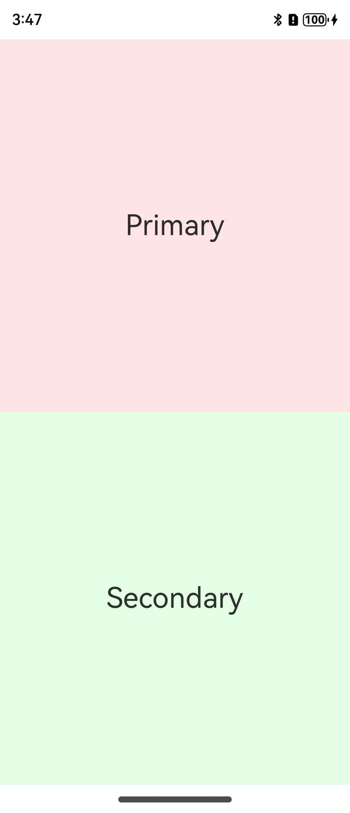 | 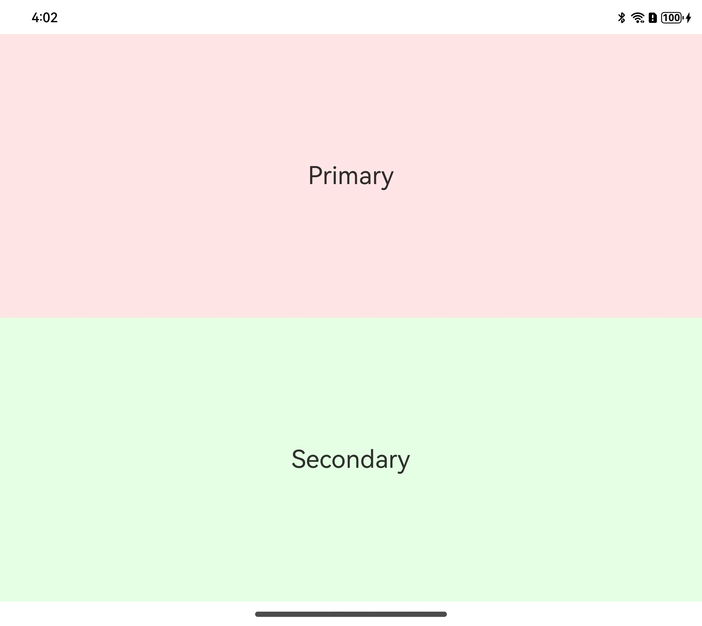 | 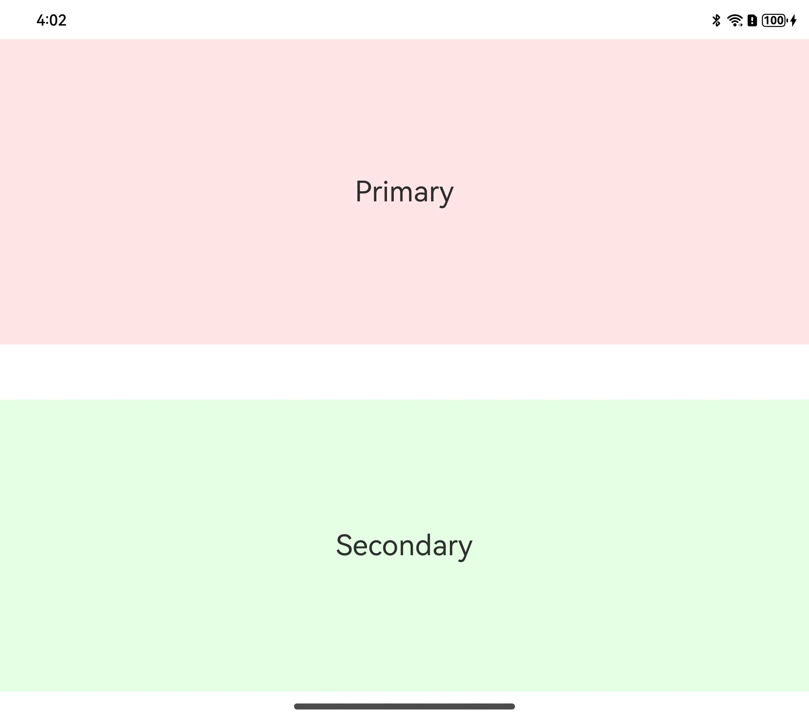 |

### 示例2（设置三分栏）

该示例实现了折叠屏三分栏在展开态、悬停态以及折叠态的区域控制。

```ts
import { FoldSplitContainer } from '@kit.ArkUI';

@Entry
@Component
struct ThreeColumns {
  @Builder
  privateRegion() {
    Text("Primary")
      .backgroundColor('rgba(255, 0, 0, 0.1)')
      .fontSize(28)
      .textAlign(TextAlign.Center)
      .height('100%')
      .width('100%')
  }

  @Builder
  secondaryRegion() {
    Text("Secondary")
      .backgroundColor('rgba(0, 255, 0, 0.1)')
      .fontSize(28)
      .textAlign(TextAlign.Center)
      .height('100%')
      .width('100%')
  }

  @Builder
  extraRegion() {
    Text("Extra")
      .backgroundColor('rgba(0, 0, 255, 0.1)')
      .fontSize(28)
      .textAlign(TextAlign.Center)
      .height('100%')
      .width('100%')
  }

  build() {
    RelativeContainer() {
      FoldSplitContainer({
        primary: () => {
          this.privateRegion()
        },
        secondary: () => {
          this.secondaryRegion()
        },
        extra: () => {
          this.extraRegion()
        }
      })
    }
    .height('100%')
    .width('100%')
  }
}
```

| 折叠态 | 展开态 | 悬停态 |
| ----- | ------ | ------ |
| 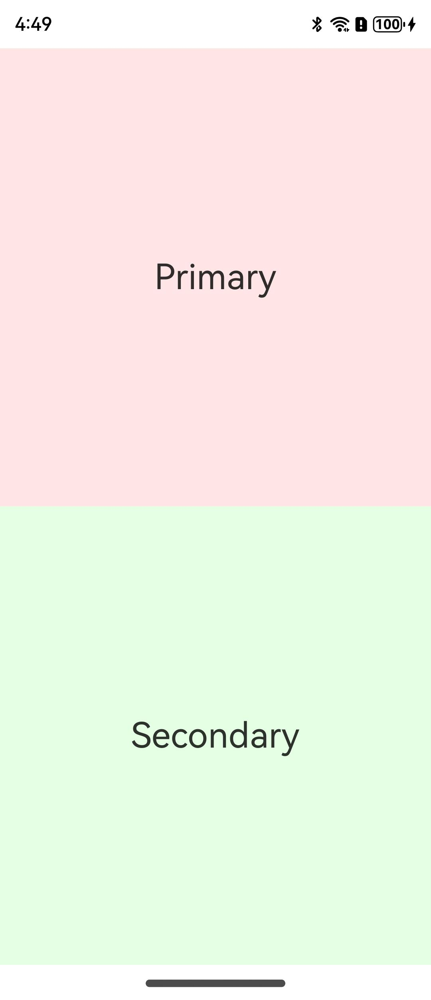 |  |  |

### 示例3（展开态布局信息）

该示例通过配置ExpandedRegionLayoutOptions实现折叠屏展开态的布局信息。

```ts
import {
  FoldSplitContainer,
  PresetSplitRatio,
  ExtraRegionPosition,
  ExpandedRegionLayoutOptions,
  HoverModeRegionLayoutOptions,
  FoldedRegionLayoutOptions
} from '@kit.ArkUI';

@Component
struct Region {
  @Prop title: string;
  @BuilderParam content: () => void;
  @Prop compBackgroundColor: string;

  build() {
    Column({ space: 8 }) {
      Text(this.title)
        .fontSize("24fp")
        .fontWeight(600)

      Scroll() {
        this.content()
      }
      .layoutWeight(1)
      .width("100%")
    }
    .backgroundColor(this.compBackgroundColor)
    .width("100%")
    .height("100%")
    .padding(12)
  }
}

const noop = () => {
};

@Component
struct SwitchOption {
  @Prop label: string = ""
  @Prop value: boolean = false
  public onChange: (checked: boolean) => void = noop;

  build() {
    Row() {
      Text(this.label)
      Blank()
      Toggle({ type: ToggleType.Switch, isOn: this.value })
        .onChange((isOn) => {
          this.onChange(isOn);
        })
    }
    .backgroundColor(Color.White)
    .borderRadius(8)
    .padding(8)
    .width("100%")
  }
}

interface RadioOptions {
  label: string;
  value: Object | undefined | null;
  onChecked: () => void;
}

@Component
struct RadioOption {
  @Prop label: string;
  @Prop value: Object | undefined | null;
  @Prop options: Array<RadioOptions>;

  build() {
    Row() {
      Text(this.label)
      Blank()
      Column({ space: 4 }) {
        ForEach(this.options, (option: RadioOptions) => {
          Row() {
            Radio({
              group: this.label,
              value: JSON.stringify(option.value),
            })
              .checked(this.value === option.value)
              .onChange((checked) => {
                if (checked) {
                  option.onChecked();
                }
              })
            Text(option.label)
          }
        })
      }
      .alignItems(HorizontalAlign.Start)
    }
    .alignItems(VerticalAlign.Top)
    .backgroundColor(Color.White)
    .borderRadius(8)
    .padding(8)
    .width("100%")
  }
}

@Entry
@Component
struct Index {
  @State expandedRegionLayoutOptions: ExpandedRegionLayoutOptions = {
    horizontalSplitRatio: PresetSplitRatio.LAYOUT_3V2,
    verticalSplitRatio: PresetSplitRatio.LAYOUT_1V1,
    isExtraRegionPerpendicular: true,
    extraRegionPosition: ExtraRegionPosition.TOP
  };
  @State foldingRegionLayoutOptions: HoverModeRegionLayoutOptions = {
    horizontalSplitRatio: PresetSplitRatio.LAYOUT_3V2,
    showExtraRegion: false,
    extraRegionPosition: ExtraRegionPosition.TOP
  };
  @State foldedRegionLayoutOptions: FoldedRegionLayoutOptions = {
    verticalSplitRatio: PresetSplitRatio.LAYOUT_1V1
  };

  @Builder
  MajorRegion() {
    Region({
      title: "折叠态配置",
      compBackgroundColor: "rgba(255, 0, 0, 0.1)",
    }) {
      Column({ space: 4 }) {
        RadioOption({
          label: "折叠态垂直高度度比",
          value: this.foldedRegionLayoutOptions.verticalSplitRatio,
          options: [
            {
              label: "1:1",
              value: PresetSplitRatio.LAYOUT_1V1,
              onChecked: () => {
                this.foldedRegionLayoutOptions.verticalSplitRatio = PresetSplitRatio.LAYOUT_1V1
              }
            },
            {
              label: "2:3",
              value: PresetSplitRatio.LAYOUT_2V3,
              onChecked: () => {
                this.foldedRegionLayoutOptions.verticalSplitRatio = PresetSplitRatio.LAYOUT_2V3
              }
            },
            {
              label: "3:2",
              value: PresetSplitRatio.LAYOUT_3V2,
              onChecked: () => {
                this.foldedRegionLayoutOptions.verticalSplitRatio = PresetSplitRatio.LAYOUT_3V2
              }
            },
            {
              label: "未定义",
              value: undefined,
              onChecked: () => {
                this.foldedRegionLayoutOptions.verticalSplitRatio = undefined
              }
            }
          ]
        })
      }
      .constraintSize({ minHeight: "100%" })
    }
  }

  @Builder
  MinorRegion() {
    Region({
      title: "悬停态配置",
      compBackgroundColor: "rgba(0, 255, 0, 0.1)"
    }) {
      Column({ space: 4 }) {
        RadioOption({
          label: "悬停态水平宽度比",
          value: this.foldingRegionLayoutOptions.horizontalSplitRatio,
          options: [
            {
              label: "1:1",
              value: PresetSplitRatio.LAYOUT_1V1,
              onChecked: () => {
                this.foldingRegionLayoutOptions.horizontalSplitRatio = PresetSplitRatio.LAYOUT_1V1
              }
            },
            {
              label: "2:3",
              value: PresetSplitRatio.LAYOUT_2V3,
              onChecked: () => {
                this.foldingRegionLayoutOptions.horizontalSplitRatio = PresetSplitRatio.LAYOUT_2V3
              }
            },
            {
              label: "3:2",
              value: PresetSplitRatio.LAYOUT_3V2,
              onChecked: () => {
                this.foldingRegionLayoutOptions.horizontalSplitRatio = PresetSplitRatio.LAYOUT_3V2
              }
            },
            {
              label: "未定义",
              value: undefined,
              onChecked: () => {
                this.foldingRegionLayoutOptions.horizontalSplitRatio = undefined
              }
            },
          ]
        })

        SwitchOption({
          label: "悬停态是否显示扩展区",
          value: this.foldingRegionLayoutOptions.showExtraRegion,
          onChange: (checked) => {
            this.foldingRegionLayoutOptions.showExtraRegion = checked;
          }
        })

        if (this.foldingRegionLayoutOptions.showExtraRegion) {
          RadioOption({
            label: "悬停态扩展区位置",
            value: this.foldingRegionLayoutOptions.extraRegionPosition,
            options: [
              {
                label: "顶部",
                value: ExtraRegionPosition.TOP,
                onChecked: () => {
                  this.foldingRegionLayoutOptions.extraRegionPosition = ExtraRegionPosition.TOP
                }
              },
              {
                label: "底部",
                value: ExtraRegionPosition.BOTTOM,
                onChecked: () => {
                  this.foldingRegionLayoutOptions.extraRegionPosition = ExtraRegionPosition.BOTTOM
                }
              },
              {
                label: "未定义",
                value: undefined,
                onChecked: () => {
                  this.foldingRegionLayoutOptions.extraRegionPosition = undefined
                }
              },
            ]
          })
        }
      }
      .constraintSize({ minHeight: "100%" })
    }
  }

  @Builder
  ExtraRegion() {
    Region({
      title: "展开态配置",
      compBackgroundColor: "rgba(0, 0, 255, 0.1)"
    }) {
      Column({ space: 4 }) {
        RadioOption({
          label: "展开态水平宽度比",
          value: this.expandedRegionLayoutOptions.horizontalSplitRatio,
          options: [
            {
              label: "1:1",
              value: PresetSplitRatio.LAYOUT_1V1,
              onChecked: () => {
                this.expandedRegionLayoutOptions.horizontalSplitRatio = PresetSplitRatio.LAYOUT_1V1
              }
            },
            {
              label: "2:3",
              value: PresetSplitRatio.LAYOUT_2V3,
              onChecked: () => {
                this.expandedRegionLayoutOptions.horizontalSplitRatio = PresetSplitRatio.LAYOUT_2V3
              }
            },
            {
              label: "3:2",
              value: PresetSplitRatio.LAYOUT_3V2,
              onChecked: () => {
                this.expandedRegionLayoutOptions.horizontalSplitRatio = PresetSplitRatio.LAYOUT_3V2
              }
            },
            {
              label: "未定义",
              value: undefined,
              onChecked: () => {
                this.expandedRegionLayoutOptions.horizontalSplitRatio = undefined
              }
            },
          ]
        })

        RadioOption({
          label: "展开态垂直高度度比",
          value: this.expandedRegionLayoutOptions.verticalSplitRatio,
          options: [
            {
              label: "1:1",
              value: PresetSplitRatio.LAYOUT_1V1,
              onChecked: () => {
                this.expandedRegionLayoutOptions.verticalSplitRatio = PresetSplitRatio.LAYOUT_1V1
              }
            },
            {
              label: "2:3",
              value: PresetSplitRatio.LAYOUT_2V3,
              onChecked: () => {
                this.expandedRegionLayoutOptions.verticalSplitRatio = PresetSplitRatio.LAYOUT_2V3
              }
            },
            {
              label: "3:2",
              value: PresetSplitRatio.LAYOUT_3V2,
              onChecked: () => {
                this.expandedRegionLayoutOptions.verticalSplitRatio = PresetSplitRatio.LAYOUT_3V2
              }
            },
            {
              label: "未定义",
              value: undefined,
              onChecked: () => {
                this.expandedRegionLayoutOptions.verticalSplitRatio = undefined
              }
            }
          ]
        })

        SwitchOption({
          label: "展开态扩展区是否上下贯穿",
          value: this.expandedRegionLayoutOptions.isExtraRegionPerpendicular,
          onChange: (checked) => {
            this.expandedRegionLayoutOptions.isExtraRegionPerpendicular = checked;
          }
        })

        if (!this.expandedRegionLayoutOptions.isExtraRegionPerpendicular) {
          RadioOption({
            label: "展开态扩展区位置",
            value: this.expandedRegionLayoutOptions.extraRegionPosition,
            options: [
              {
                label: "顶部",
                value: ExtraRegionPosition.TOP,
                onChecked: () => {
                  this.expandedRegionLayoutOptions.extraRegionPosition = ExtraRegionPosition.TOP
                }
              },
              {
                label: "底部",
                value: ExtraRegionPosition.BOTTOM,
                onChecked: () => {
                  this.expandedRegionLayoutOptions.extraRegionPosition = ExtraRegionPosition.BOTTOM
                }
              },
              {
                label: "未定义",
                value: undefined,
                onChecked: () => {
                  this.expandedRegionLayoutOptions.extraRegionPosition = undefined
                }
              },
            ]
          })
        }
      }
      .constraintSize({ minHeight: "100%" })
    }
  }

  build() {
    Column() {
      FoldSplitContainer({
        primary: () => {
          this.MajorRegion()
        },
        secondary: () => {
          this.MinorRegion()
        },
        extra: () => {
          this.ExtraRegion()
        },
        expandedLayoutOptions: this.expandedRegionLayoutOptions,
        hoverModeLayoutOptions: this.foldingRegionLayoutOptions,
        foldedLayoutOptions: this.foldedRegionLayoutOptions,
      })
    }
    .width("100%")
    .height("100%")
  }
}
```

| 折叠态 | 展开态 | 悬停态 |
| ----- | ------ | ------ |
| 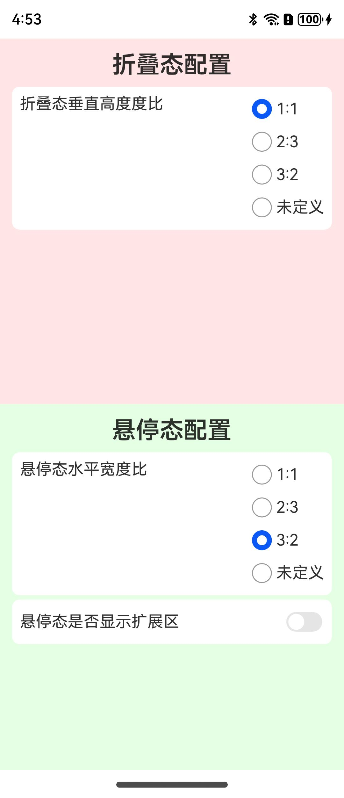 | 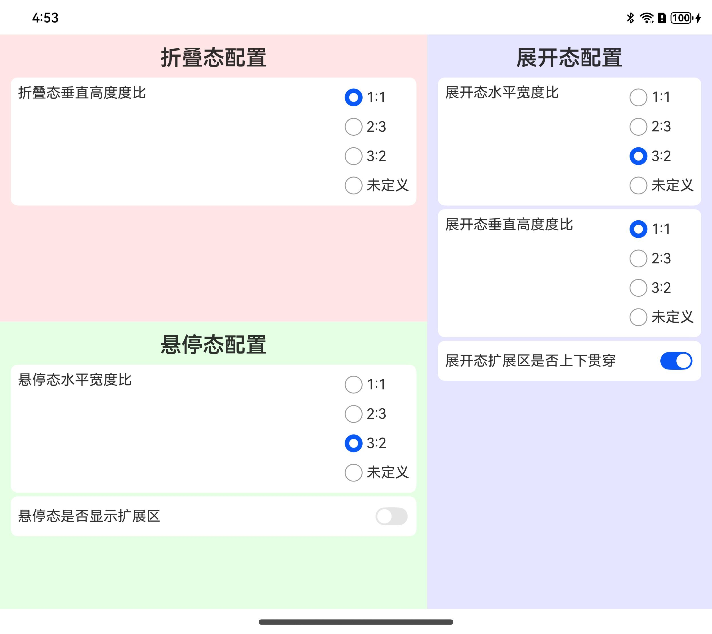 | 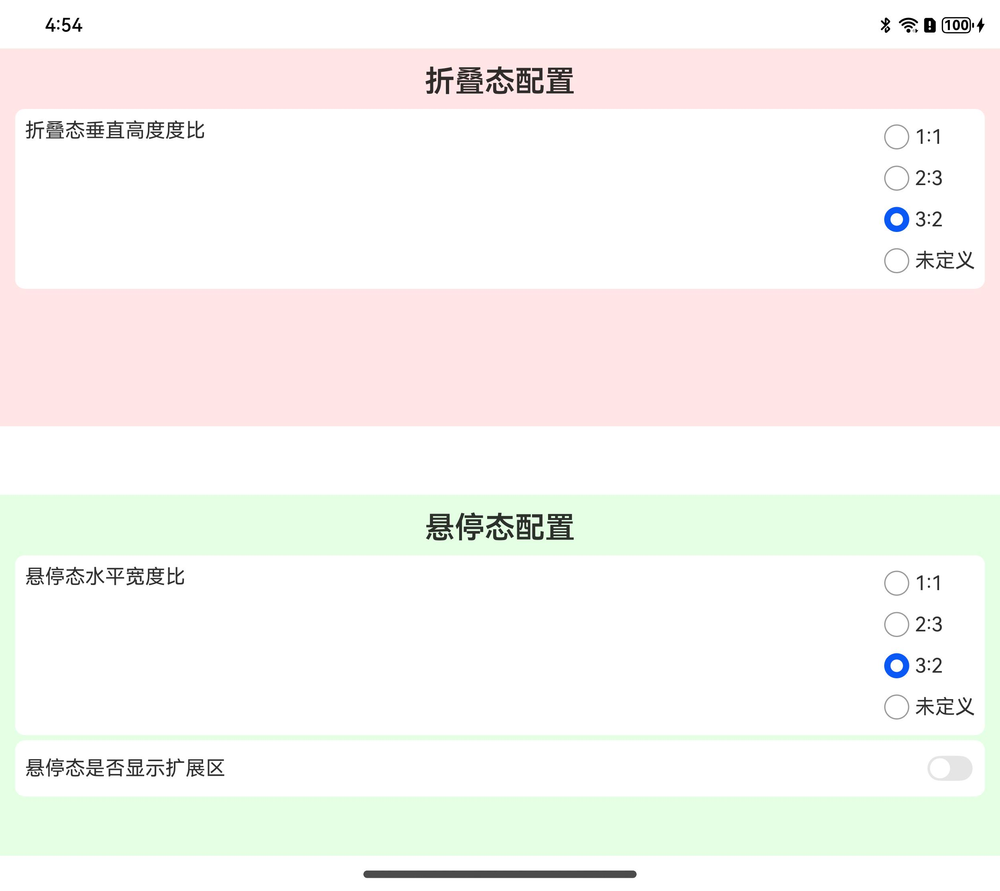 |
|                                       | 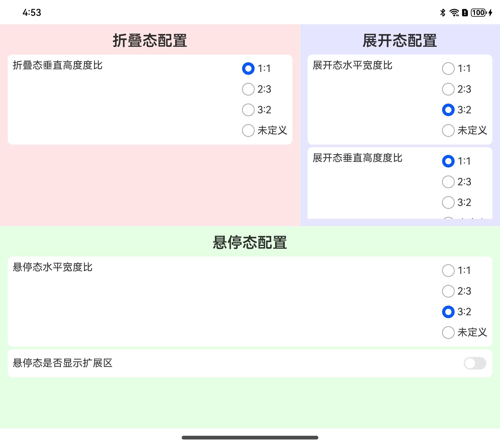 | 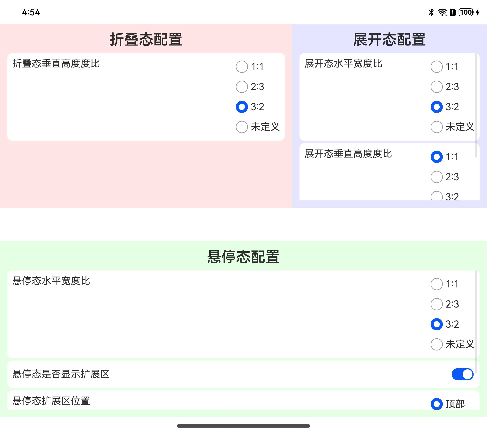 |
|                                       | 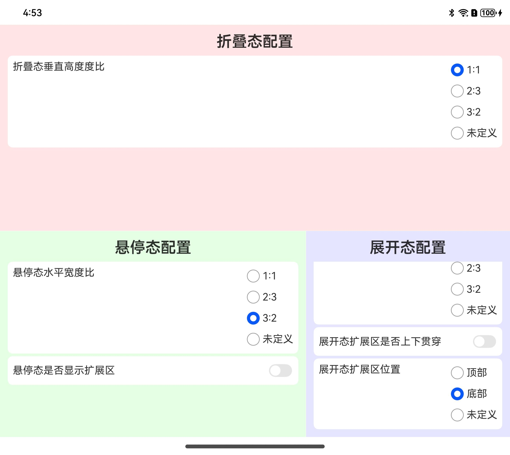 | 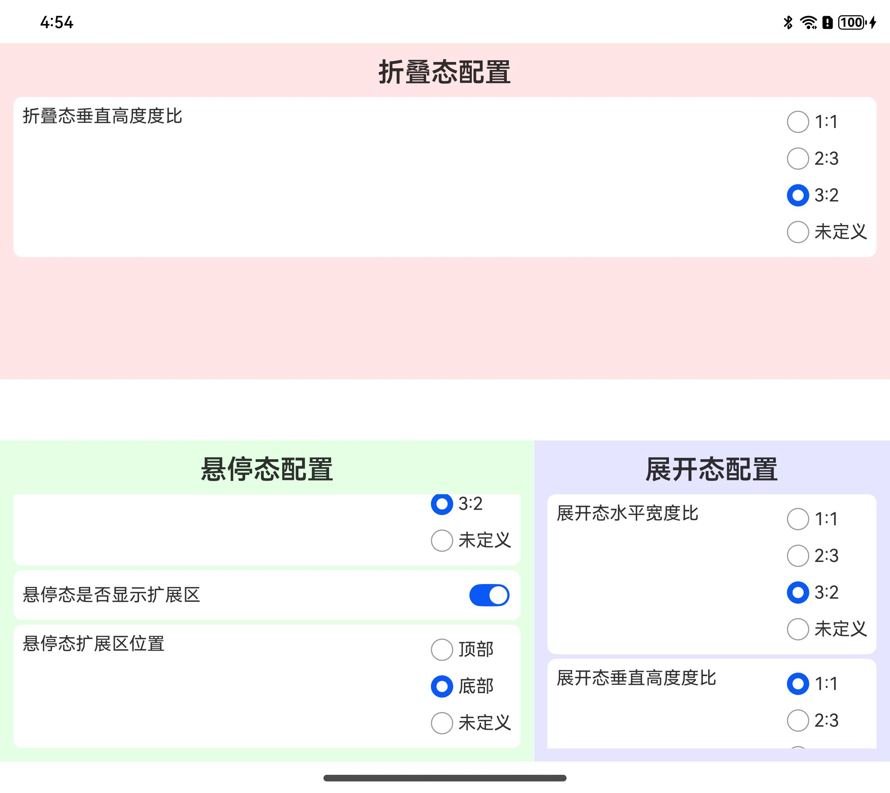 |
