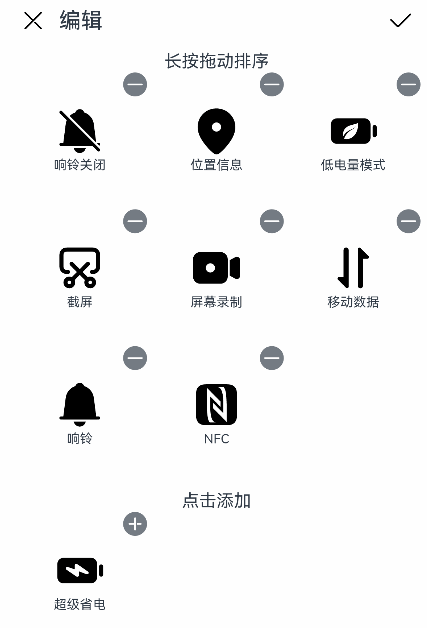

# GridObjectSortComponent
<!--Kit: ArkUI-->
<!--Subsystem: ArkUI-->
<!--Owner: @rongShao-Z-->
<!--Designer: @yangcan18-->
<!--Tester: @leiyuqian-->
<!--Adviser: @Brilliantry_Rui-->


网格对象排序组件，用于网格对象的编辑、拖动排序、新增和删除。


>  **说明：**
>
>  - 该组件从API version 11开始支持。后续版本如有新增内容，则采用上角标单独标记该内容的起始版本。
>
> - 该组件仅可在Stage模型下使用。
>
> - 如果GridObjectSortComponent设置[通用属性](ts-component-general-attributes.md)和[通用事件](ts-component-general-events.md)，编译工具链会额外生成节点__Common__，并将通用属性或通用事件挂载在__Common__上，而不是直接应用到GridObjectSortComponent本身。这可能导致开发者设置的通用属性或通用事件不生效或不符合预期，因此，不建议GridObjectSortComponent设置通用属性和通用事件。


## 导入模块

```ts
import { GridObjectSortComponent, GridObjectSortComponentItem, GridObjectSortComponentOptions, GridObjectSortComponentType , SymbolGlyphModifier } from '@kit.ArkUI';
```

##  子组件

无

## GridObjectSortComponent

GridObjectSortComponent({options: GridObjectSortComponentOptions, dataList: Array\<GridObjectSortComponentItem>, onSave: (select: Array\<GridObjectSortComponentItem>, unselect: Array\<GridObjectSortComponentItem>) => void, onCancel: () => void })

网格对象排序组件。

**装饰器类型：**\@Component

**原子化服务API：** 从API version 12开始，该接口支持在原子化服务中使用。

**系统能力：** SystemCapability.ArkUI.ArkUI.Full

**设备行为差异：** 该接口在Wearable设备上使用时，应用程序运行异常，异常信息中提示接口未定义，在其他设备中可正常调用。


| 名称     | 类型                             | 必填 | 装饰器类型 | 说明         |
| -------- | -------------------------------- | ---------- | ---- | ---- |
| options  | [GridObjectSortComponentOptions](#gridobjectsortcomponentoptions) | 是     | @Prop      | 组件配置信息。 |
| dataList | Array<[GridObjectSortComponentItem](#gridobjectsortcomponentitem)> | 是    | -     | 传入的数据，最大长度为50，数据长度超过50，只会取前50条数据。 |
| onSave | (select: Array<[GridObjectSortComponentItem](#gridobjectsortcomponentitem)>, unselect: Array<[GridObjectSortComponentItem](#gridobjectsortcomponentitem)>)  => void | 是 | - | 保存编辑排序的回调函数，select为编辑后的选中数据，unselect为编辑后的未选中数据。 |
| onCancel | () => void | 是 | - | 取消保存数据的回调。 |

##  GridObjectSortComponentOptions

网格对象排序组件的组件配置信息。

**原子化服务API：** 从API version 12开始，该接口支持在原子化服务中使用。

**系统能力：** SystemCapability.ArkUI.ArkUI.Full

**设备行为差异：** 该接口在Wearable设备上使用时，应用程序运行异常，异常信息中提示接口未定义，在其他设备中可正常调用。

| 名称           | 类型                      | 只读 | 可选 | 说明                                                          |
| -------------- | ------------------------- |---|---|-------------------------------------------------------------|
| type           | [GridObjectSortComponentType](#gridobjectsortcomponenttype) | 否 | 是 | 组件展示形态：文字\|图片+文字。设置为GridObjectSortComponentType.IMAGE_TEXT时，需为数据项配置url或symbolStyle。<br />默认值：GridObjectSortComponentType.TEXT |
| imageSize      | number \| [Resource](ts-types.md#resource) | 否 | 是 | 图片的尺寸，单位vp。仅在type为GridObjectSortComponentType.IMAGE_TEXT时生效。设置为数值0时，普通图片按默认尺寸显示，Symbol图标的字号为0vp。<br />取值范围：大于等于0。<br />默认值：56vp                  |
| normalTitle | [ResourceStr](ts-types.md#resourcestr)     | 否 | 是 | 未编辑状态下显示的标题。<br />默认值：频道。                                   |
| showAreaTitle | [ResourceStr](ts-types.md#resourcestr)     | 否 | 是 | 展示区域标题，第一个子标题。<br />默认值：长按拖动排序。                             |
| addAreaTitle | [ResourceStr](ts-types.md#resourcestr)     | 否 | 是 | 添加区域标题，第二个子标题。<br />默认值：点击添加。                               |
| editTitle      | [ResourceStr](ts-types.md#resourcestr)     | 否 | 是 | 编辑状态下头部标题显示。<br />默认值：编辑。                                   |

## GridObjectSortComponentType

配置网格对象排序组件节点的类型，配置名称 IMAGE_TEXT 为图片文字类型，TEXT 为文字类型。

**原子化服务API：** 从API version 12开始，该接口支持在原子化服务中使用。

**系统能力：** SystemCapability.ArkUI.ArkUI.Full

**设备行为差异：** 该接口在Wearable设备上使用时，应用程序运行异常，异常信息中提示接口未定义，在其他设备中可正常调用。

| 名称     | 值  | 说明           |
| -------- | --- | -------------- |
| IMAGE_TEXT | "image_text" | 图片文字类型。 |
| TEXT     | "text"     | 文字类型。     |

## GridObjectSortComponentItem

网格对象排序组件的组件数据配置信息。

**系统能力：** SystemCapability.ArkUI.ArkUI.Full

**设备行为差异：** 该接口在Wearable设备上使用时，应用程序运行异常，异常信息中提示接口未定义，在其他设备中可正常调用。

| 名称     | 类型                                   | 只读 | 可选 | 说明                                                                                                                       |
| -------- | -------------------------------------- |---|---|--------------------------------------------------------------------------------------------------------------------------|
| id       | number&nbsp;\|&nbsp;string             | 否 | 否 | 数据id序号，不可重复。<br />默认值：空字符串。<br/>**原子化服务API：** 从API version 12开始，该接口支持在原子化服务中使用。                                          |
| text     | [ResourceStr](ts-types.md#resourcestr) | 否 | 否 | 显示文本信息。<br/>**原子化服务API：** 从API version 12开始，该接口支持在原子化服务中使用。                                                              |
| selected | boolean                                | 否 | 否 | 是否被选中，已选中：true，未选中：false。<br/>**原子化服务API：** 从API version 12开始，该接口支持在原子化服务中使用。                                           |
| url      | [ResourceStr](ts-types.md#resourcestr) | 否 | 是 | GridObjectSortComponentType类型为IMAGE_TEXT时，用于配置图片地址；类型为TEXT时不生效。若同时配置symbolStyle，优先使用symbolStyle。<br/>**原子化服务API：** 从API version 12开始，该接口支持在原子化服务中使用。                  |
| symbolStyle<sup>18+</sup> | [SymbolGlyphModifier](ts-universal-attributes-attribute-symbolglyphmodifier.md#symbolglyphmodifier) | 否 | 是 | GridObjectSortComponentType类型为IMAGE_TEXT时，用于配置Symbol图标资源；类型为TEXT时不生效。配置优先级高于url。<br/>**原子化服务API：** 从API version 18开始，该接口支持在原子化服务中使用。 |
| order    | number                                 | 否 | 否 | 顺序序号，数值越小排序越靠前。<br />取值范围：大于等于0。<br />默认值：0 <br/>**原子化服务API：** 从API version 12开始，该接口支持在原子化服务中使用。                                   |

## 事件

不建议设置[通用事件](ts-component-general-events.md)，设置后可能不生效或不符合预期。

## 示例
网格对象的编辑排序组件基础用法，涉及对组件配置信息初始化，数据初始化，保存、取消方法的使用。

```ts
import { GridObjectSortComponent, GridObjectSortComponentItem, GridObjectSortComponentOptions, GridObjectSortComponentType, SymbolGlyphModifier } from '@kit.ArkUI';

@Entry
@Component
struct Index {
  // 组件数据初始化。
  @State dataList: GridObjectSortComponentItem[] = [
    {
      id: 0,
      url: $r('sys.media.ohos_save_button_filled'),
      text: '下载',
      selected: true,
      order: 3
    },
    {
      id: 1,
      url: $r('sys.media.ohos_ic_public_web'),
      text: '网络',
      selected: true,
      order: 9
    },
    {
      id: 2,
      url: $r('sys.media.ohos_ic_public_video'),
      text: '视频',
      selected: false,
      order: 1
    },
    {
      id: 3,
      symbolStyle: new SymbolGlyphModifier($r('sys.symbol.record_circle')),
      text: '录制',
      selected: false,
      order: 4
    }
  ]

  // 组件配置信息初始化。
  @State option: GridObjectSortComponentOptions = {
    type: GridObjectSortComponentType.IMAGE_TEXT,
    imageSize: 45,
    normalTitle: '菜单',
    editTitle: '编辑',
    showAreaTitle: '长按拖动排序',
    addAreaTitle: '点击添加'
  }

  build() {
    Column() {
      GridObjectSortComponent({
        options: this.option,
        dataList: this.dataList,
        // 保存编辑排序的回调函数，接收编辑后的选中数据和未选中数据。
        onSave: (
          select: Array<GridObjectSortComponentItem>,
          unselect: Array<GridObjectSortComponentItem>
        ) => {
          // save ToDo
        },
        // 取消保存数据的回调。
        onCancel: () =>{
          // cancel ToDo
        }
      })
    }
  }
}
```

