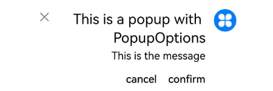
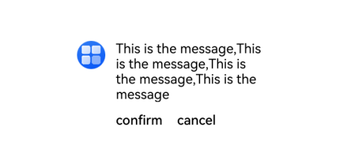

# Popup

Popup是用于显示特定样式气泡。

>  **说明：**
>
>  - 该组件从API Version 11开始支持。后续版本如有新增内容，则采用上角标单独标记该内容的起始版本。
>
>  - 建议开发者结合[Popup控制](ts-universal-attributes-popup.md)中提供的自定义气泡功能一起使用。

## 导入模块

```
import { Popup, PopupOptions, PopupTextOptions, PopupButtonOptions, PopupIconOptions } from '@kit.ArkUI';
```

##  子组件

无

## Popup

Popup(options: PopupOptions): void

**装饰器类型：**@Builder

**原子化服务API：** 从API version 12开始，该接口支持在原子化服务中使用。

**系统能力：** SystemCapability.ArkUI.ArkUI.Full

**参数**：

| 参数名  | 类型                          | 必填 | 说明                  |
| ------- | ----------------------------- | ---- | --------------------- |
| options | [PopupOptions](#popupoptions) | 是   | 定义Popup组件的类型。 |

## PopupOptions

PopupOptions定义Popup的具体式样参数。

**原子化服务API：** 从API version 12开始，该接口支持在原子化服务中使用。

**系统能力：** SystemCapability.ArkUI.ArkUI.Full

| 名称        | 类型       | 必填        | 说明                            |
| ----------- | ---------- | ------| --------------------------------- |
| icon      | [PopupIconOptions](#popupiconoptions)                        | 否   | 设置popup图标。<br />**说明：**<br />当size设置异常值或0时不显示。 |
| title     | [PopupTextOptions](#popuptextoptions)                        | 否   | 设置popup标题文本。                  |
| message   | [PopupTextOptions](#popuptextoptions)                        | 是   | 设置popup内容文本。<br />**说明：**<br />message不支持设置fontWeight。 |
| showClose | boolean \| [Resource](ts-types.md#resource)                | 否   | 设置popup关闭按钮。<br />默认值：true |
| onClose   | () => void                                                   | 否   | 设置popup关闭按钮回调函数。|
| buttons   | [[PopupButtonOptions](#popupbuttonoptions)?,[PopupButtonOptions](#popupbuttonoptions)?] | 否   | 设置popup操作按钮,按钮最多设置两个。 |
| direction<sup>12+</sup> | [Direction](ts-appendix-enums.md#direction)                                             | 否                                | 布局方向。<br/>默认值：Direction.Auto                                |
| maxWidth<sup>16+</sup> | [Dimension](ts-types.md#dimension10)                                             | 否                                | 设置popup的最大宽度，通过此接口popup可以自定义宽度显示。<br/>默认值：400vp                                |

## PopupTextOptions

PopupTextOptions设置文本样式。

**原子化服务API：** 从API version 12开始，该接口支持在原子化服务中使用。

**系统能力：** SystemCapability.ArkUI.ArkUI.Full

| 名称       | 类型                                                         | 必填 | 说明         |
| ---------- | ------------------------------------------------------------ | ---- | ------------------ |
| text       | [ResourceStr](ts-types.md#resourcestr)                       | 是   | 设置文本内容。     |
| fontSize   | number \| string \| [Resource](ts-types.md#resource)         | 否   | 设置文本字体大小。<br />默认值：`$r('sys.float.ohos_id_text_size_body2')`  |
| fontColor  | [ResourceColor](ts-types.md#resourcecolor)                   | 否   | 设置文本字体颜色。<br />默认值：`$r('sys.color.ohos_id_color_text_secondary')` |
| fontWeight | number \| [FontWeight](ts-appendix-enums.md#fontweight) \| string | 否   | 设置文本字体粗细。<br />默认值：FontWeight.Regular |

## PopupButtonOptions

PopupButtonOptions定义按钮的相关属性和事件。

**原子化服务API：** 从API version 12开始，该接口支持在原子化服务中使用。

**系统能力：** SystemCapability.ArkUI.ArkUI.Full

| 名称      | 类型                                                 | 必填 | 说明                 |
| --------- | ---------------------------------------------------- | ---- | ---------------------- |
| text      | [ResourceStr](ts-types.md#resourcestr)               | 是   | 设置按钮内容。         |
| action    | () => void                                           | 否   | 设置按钮click回调。 |
| fontSize  | number \| string \| [Resource](ts-types.md#resource) | 否   | 设置按钮文本字体大小。 <br />默认值：`$r('sys.float.ohos_id_text_size_button2')` |
| fontColor | [ResourceColor](ts-types.md#resourcecolor)           | 否   | 设置按钮文本字体颜色。<br />默认值：`$r('sys.color.ohos_id_color_text_primary_activated')` |

##  PopupIconOptions

PopupIconOptions定义icon（右上角图标）的属性。

**原子化服务API：** 从API version 12开始，该接口支持在原子化服务中使用。

**系统能力：** SystemCapability.ArkUI.ArkUI.Full

| 名称         | 类型                                                         | 必填 | 说明                             |
| ------------ | ------------------------------------------------------------ | ---- | ---------------------------------- |
| image        | [ResourceStr](ts-types.md#resourcestr)                       | 是   | 设置图标内容。                     |
| width        | [Dimension](ts-types.md#dimension10)                         | 否   | 设置图标宽度。<br />默认值：32VP |
| height       | [Dimension](ts-types.md#dimension10)                         | 否   | 设置图标高度。<br />默认值：32VP |
| fillColor    | [ResourceColor](ts-types.md#resourcecolor)                   | 否   | 设置图标填充颜色。 <br />**说明：**<br />仅针对svg图源生效。|
| borderRadius | [Length](ts-types.md#length) \| [BorderRadiuses](ts-types.md#borderradiuses9) | 否   | 设置图标圆角。<br />默认值：`$r('sys.float.ohos_id_corner_radius_default_s')`  |

## 示例

### 示例1（设置气泡样式）

该示例通过配置PopupIconOptions、PopupTextOptions、PopupButtonOptions实现气泡的样式。

```ts
// xxx.ets
import { Popup, PopupTextOptions, PopupButtonOptions, PopupIconOptions } from '@kit.ArkUI';

@Entry
@Component
struct PopupExample {

  build() {
    Row() {
      // popup 自定义高级组件
      Popup({
        // PopupIconOptions类型设置图标内容
        icon: {
          image: $r('app.media.icon'),
          width:32,
          height:32,
          fillColor:Color.White,
          borderRadius: 16
        } as PopupIconOptions,
        // PopupTextOptions类型设置文字内容
        title: {
          text: 'This is a popup with PopupOptions',
          fontSize: 20,
          fontColor: Color.Black,
          fontWeight: FontWeight.Normal
        } as PopupTextOptions,
        // PopupTextOptions类型设置文字内容
        message: {
          text: 'This is the message',
          fontSize: 15,
          fontColor: Color.Black
        } as PopupTextOptions,
        showClose: false,
        onClose: () => {
          console.info('close Button click')
        },
        // PopupButtonOptions类型设置按钮内容
        buttons: [{
          text: 'confirm',
          action: () => {
            console.info('confirm button click')
          },
          fontSize: 15,
          fontColor: Color.Black,
        },
          {
            text: 'cancel',
            action: () => {
              console.info('cancel button click')
            },
            fontSize: 15,
            fontColor: Color.Black
          },] as [PopupButtonOptions?, PopupButtonOptions?]
      })
    }
    .width(300)
    .height(200)
    .borderWidth(2)
    .justifyContent(FlexAlign.Center)
  }
}
```


### 示例 2（设置镜像效果）
该示例通过配置direction实现Popup的镜像效果。

```ts
// xxx.ets
import { Popup, PopupTextOptions, PopupButtonOptions, PopupIconOptions } from '@kit.ArkUI'

@Entry
@Component
struct PopupPage {
  @State currentDirection: Direction = Direction.Rtl

  build() {
    Column() {
      // popup 自定义高级组件
      Popup({
        //PopupIconOptions 类型设置图标内容
        direction: this.currentDirection,
        icon: {
          image: $r('app.media.icon'),
          width: 32,
          height: 32,
          fillColor: Color.White,
          borderRadius: 16,
        } as PopupIconOptions,
        // PopupTextOptions 类型设置文字内容
        title: {
          text: 'This is a popup with PopupOptions',
          fontSize: 20,
          fontColor: Color.Black,
          fontWeight: FontWeight.Normal,

        } as PopupTextOptions,
        //PopupTextOptions 类型设置文字内容
        message: {
          text: 'This is the message',
          fontSize: 15,
          fontColor: Color.Black,
        } as PopupTextOptions,
        showClose: true,
        onClose: () => {
          console.info('close Button click')
        },
        // PopupButtonOptions 类型设置按钮内容
        buttons: [{
          text: 'confirm',
          action: () => {
            console.info('confirm button click')
          },
          fontSize: 15,
          fontColor: Color.Black,

        },
          {
            text: 'cancel',
            action: () => {
              console.info('cancel button click')
            },
            fontSize: 15,
            fontColor: Color.Black,
          },] as [PopupButtonOptions?, PopupButtonOptions?],
      })

    }
    .justifyContent(FlexAlign.Center)
    .width('100%')
    .height('100%')
  }
}
```



### 示例3（设置自定义宽度）
该示例通过配置maxWidth实现Popup的自定义宽度效果。

```ts
// xxx.ets
import { Popup, PopupTextOptions, PopupButtonOptions, PopupIconOptions } from '@kit.ArkUI'

@Entry
@Component
struct PopupPage {
  @State currentDirection: Direction = Direction.Rtl

  build() {
     Row() {
       // popup 自定义高级组件
       Popup({
         //设置自定义宽度
         maxWidth:'50%',
         //PopupIconOptions 类型设置图标内容
         icon: {
           image: $r('app.media.startIcon'),
           width: 32,
           height: 32,
           fillColor: Color.White,
           borderRadius: 16,
         } as PopupIconOptions,
         // PopupTextOptions类型设置文字内容
         message: {
           text: 'This is the message,This is the message,This is the message,This is the message',
           fontSize: 15,
           fontColor: Color.Black
         } as PopupTextOptions,
         showClose: false,
         onClose: () => {
           console.info('close Button click')
         },
         // PopupButtonOptions类型设置按钮内容
         buttons: [{
           text: 'confirm',
           action: () => {
             console.info('confirm button click')
           },
           fontSize: 15,
           fontColor: Color.Black,
         },
           {
             text: 'cancel',
             action: () => {
               console.info('cancel button click')
             },
             fontSize: 15,
             fontColor: Color.Black
           },] as [PopupButtonOptions?, PopupButtonOptions?]
       })
     }
     .width(400)
     .height(200)
     .borderWidth(2)
     .justifyContent(FlexAlign.Center)
   }
}
```

