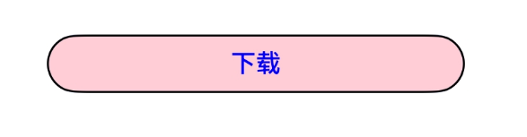

# ProgressButton
<!--Kit: ArkUI-->
<!--Subsystem: ArkUI-->
<!--Owner: @fengluochenai-->
<!--Designer: @YanSanzo-->
<!--Tester: @tinygreyy-->
<!--Adviser: @HelloCrease-->


文本下载按钮，可显示具体下载进度。


> **说明：**
>
> 该组件从API version 10开始支持。后续版本如有新增内容，则采用上角标单独标记该内容的起始版本。
>


## 导入模块

```
import { ProgressButton } from '@kit.ArkUI';
```

## 属性
不支持[通用属性](ts-component-general-attributes.md)。

## ProgressButton

ProgressButton({progress: number, content: ResourceStr, progressButtonWidth?: Length, clickCallback: () => void, enable:
boolean, colorOptions?: ProgressButtonColorOptions, progressButtonRadius?: LengthMetrics})

**装饰器类型：**\@Component


**系统能力：** SystemCapability.ArkUI.ArkUI.Full

**设备行为差异：** 该接口在Wearable设备上使用时，应用程序运行异常，异常信息中提示接口未定义，在其他设备中可正常调用。

| 名称                                | 类型                                                            | 必填 | 装饰器类型  | 说明                                                                                                                                      |
|-----------------------------------|---------------------------------------------------------------|----|--------|-----------------------------------------------------------------------------------------------------------------------------------------|
| progress                          | number                                                        | 是  | \@Prop | 下载按钮的当前进度值。<br/>取值范围：[0,100]。设置小于0的数值时置为0，设置大于100的数值置为100。<br/>默认值：0<br/>**原子化服务API：** 从API version 11开始，该接口支持在原子化服务中使用。                |
| content                           | [ResourceStr](ts-types.md#resourcestr)                        | 是  | \@Prop | 下载按钮的文本。<br/>默认值：空字符串。<br/>**说明**：最长显示组件宽度，超出部分用省略号代替。从API version 20开始，支持Resource类型。<br/>**原子化服务API：** 从API version 11开始，该接口支持在原子化服务中使用。 |
| progressButtonWidth               | [Length](ts-types.md#length)                                  | 否  | -      | 下载按钮的宽度，单位vp。<br/>取值范围：大于等于44vp。<br/>默认值：44vp。小于默认值和非法值设置为默认值。<br/>**原子化服务API：** 从API version 11开始，该接口支持在原子化服务中使用。                      |
| clickCallback                     | () => void                                                 | 是  | -      | 下载按钮的点击回调。<br/>**原子化服务API：** 从API version 11开始，该接口支持在原子化服务中使用。                                                                          |
| enable                            | boolean                                                       | 是  | \@Prop | 下载按钮是否可以点击。<br> enable为true时，表示可以点击。<br> enable为false时，表示不可点击。<br/>**原子化服务API：** 从API version 11开始，该接口支持在原子化服务中使用。                      |
| colorOptions<sup>18+<sup>         | [ProgressButtonColorOptions](#progressbuttoncoloroptions18)   | 否  | \@Prop | 下载按钮颜色。<br/>**原子化服务API：** 从API version 18开始，该接口支持在原子化服务中使用。                                                                             |
| progressButtonRadius<sup>18+<sup> | [LengthMetrics](../js-apis-arkui-graphics.md#lengthmetrics12) | 否  | \@Prop | 下载按钮的圆角（不支持百分比设置）。<br/>取值范围：[0, height/2]<br/>默认值：height/2<br/>设置非法数值时，按照默认值处理。 <br/>**原子化服务API：** 从API version 18开始，该接口支持在原子化服务中使用。    |

## ProgressButtonColorOptions<sup>18+<sup>

下载按钮颜色选项

**原子化服务API：** 从API version 18开始，该接口支持在原子化服务中使用。

**系统能力：** SystemCapability.ArkUI.ArkUI.Full

**设备行为差异：** 该接口在Wearable设备上使用时，应用程序运行异常，异常信息中提示接口未定义，在其他设备中可正常调用。

| 名称              | 类型                                     | 必填 | 说明                                                               |
|-----------------|----------------------------------------|----|------------------------------------------------------------------|
| progressColor   | [ResourceColor](ts-types.md#resourcecolor) | 否  | 进度条颜色。<br/>默认值：#330A59F7                                         |
| borderColor     | [ResourceColor](ts-types.md#resourcecolor) | 否  | 按钮描边颜色。<br/>默认值：#330A59F7                                        |
| textColor       | [ResourceColor](ts-types.md#resourcecolor) | 否  | 按钮文本颜色。<br/>默认值：系统默认值（#CE000000）                                 |
| backgroundColor | [ResourceColor](ts-types.md#resourcecolor) | 否  | 按钮背景色。<br/>默认值：\$r('sys.color.ohos_id_color_foreground_contrary') |

## 事件
不支持[通用事件](ts-component-general-events.md)。

## 示例

### 示例1（进度条下载按钮）
该示例实现了一个简单的带加载进度的文本下载按钮。
```ts
import { ProgressButton } from '@kit.ArkUI';

@Entry
@Component
struct Index {
  @State progressIndex: number = 0;
  @State textState: string = '下载';
  @State buttonWidth: number = 200;
  @State isRunning: boolean = false;
  @State enableState: boolean = true;

  build() {
    Column() {
      Scroll() {
        Column({ space: 20 }) {
          ProgressButton({
            progress: this.progressIndex,
            progressButtonWidth: this.buttonWidth,
            content: this.textState,
            enable: this.enableState,
            clickCallback: () => {
              if (this.textState && !this.isRunning && this.progressIndex < 100) {
                this.textState = '继续';
              }
              this.isRunning = !this.isRunning;
              let timer = setInterval(() => {
                if (this.isRunning) {
                  if (this.progressIndex === 100) {
                    clearInterval(timer);
                  } else {
                    this.progressIndex++;
                    if (this.progressIndex === 100) {
                      this.textState = '已完成';
                      this.enableState = false;
                    }
                  }
                } else {
                  clearInterval(timer);
                }
              }, 20)
            }
          })
        }.alignItems(HorizontalAlign.Center).width('100%').margin({ top: 20 })
      }
    }
  }
}
```


### 示例2（自定义颜色按钮）
该示例实现了一个简单的自定义颜色的文本下载按钮。
```ts
import { ProgressButton } from '@kit.ArkUI';

@Entry
@Component
struct Index {
  @State progressIndex: number = 0;
  @State textState: string = '下载';
  @State buttonWidth: number = 200;
  @State isRunning: boolean = false;
  @State enableState: boolean = true;

  build() {
    Column() {
      Scroll() {
        Column({ space: 20 }) {
          ProgressButton({
            //设置下载按钮颜色
            colorOptions: {
              progressColor: Color.Orange,
              borderColor: Color.Black,
              textColor: Color.Blue,
              backgroundColor: Color.Pink
            },
            progress: this.progressIndex,
            progressButtonWidth: this.buttonWidth,
            content: this.textState,
            enable: this.enableState,
            clickCallback: () => {
              if (this.textState && !this.isRunning && this.progressIndex < 100) {
                this.textState = '继续';
              }
              this.isRunning = !this.isRunning;
              let timer = setInterval(() => {
                if (this.isRunning) {
                  if (this.progressIndex === 100) {
                    clearInterval(timer);
                  } else {
                    this.progressIndex++;
                    if (this.progressIndex === 100) {
                      this.textState = '已完成';
                      this.enableState = false;
                    }
                  }
                } else {
                  clearInterval(timer);
                }
              }, 20)
            }
          })
        }.alignItems(HorizontalAlign.Center).width('100%').margin({ top: 20 })
      }
    }
  }
}
```


### 示例3（自定义圆角按钮）
该示例实现了一个简单的自定义圆角的文本下载按钮。
```ts
import { ProgressButton, LengthMetrics } from '@kit.ArkUI';

@Entry
@Component
struct Index {
  @State progressIndex: number = 0;
  @State textState: string = '下载';
  @State buttonWidth: number = 200;
  @State isRunning: boolean = false;
  @State enableState: boolean = true;

  build() {
    Column() {
      Scroll() {
        Column({ space: 20 }) {
          ProgressButton({
            progressButtonRadius: LengthMetrics.vp(8), //自定义圆角值为8vp
            progress: this.progressIndex,
            progressButtonWidth: this.buttonWidth,
            content: this.textState,
            enable: this.enableState,
            clickCallback: () => {
              if (this.textState && !this.isRunning && this.progressIndex < 100) {
                this.textState = '继续';
              }
              this.isRunning = !this.isRunning;
              let timer = setInterval(() => {
                if (this.isRunning) {
                  if (this.progressIndex === 100) {
                    clearInterval(timer);
                  } else {
                    this.progressIndex++;
                    if (this.progressIndex === 100) {
                      this.textState = '已完成';
                      this.enableState = false;
                    }
                  }
                } else {
                  clearInterval(timer);
                }
              }, 20)
            }
          })
        }.alignItems(HorizontalAlign.Center).width('100%').margin({ top: 20 })
      }
    }
  }
}
```
