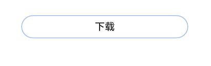

# ProgressButtonV2
<!--Kit: ArkUI-->
<!--Subsystem: ArkUI-->
<!--Owner: @fengluochenai-->
<!--Designer: @YanSanzo-->
<!--Tester: @tinygreyy-->
<!--Adviser: @HelloCrease-->


文本下载按钮，可显示具体的下载进度。

该组件基于[状态管理V2](../../../ui/state-management/arkts-state-management-overview.md#状态管理v2)实现，相较于[状态管理V1](../../../ui/state-management/arkts-state-management-overview.md#状态管理v1)，状态管理V2增强了对数据对象的深度观察与管理能力，不再局限于组件层级。借助状态管理V2，开发者可以通过该组件更灵活地控制文本下载按钮的数据和状态，实现更高效的用户界面刷新。


> **说明：**
>
> - 该组件从API version 18开始支持。后续版本如有新增内容，则采用上角标单独标记该内容的起始版本。
> 
> - 该组件不支持在Wearable设备上使用。


## 导入模块

```
import { ColorMetrics, LengthMetrics, ProgressButtonV2,  ProgressButtonV2Color } from '@kit.ArkUI';
```

## ProgressButtonV2

ProgressButtonV2({progress: number, content: ResourceStr, progressButtonWidth?: LengthMetrics, onClicked: ClickCallback,
isEnabled: boolean, colorOptions?: ProgressButtonColorOptions, progressButtonRadius?: LengthMetrics})

文本下载按钮，可显示具体下载进度。

**装饰器类型：**\@ComponentV2

**原子化服务API：** 从API version 18开始，该接口支持在原子化服务中使用。

**系统能力：** SystemCapability.ArkUI.ArkUI.Full

| 名称                                | 类型                                                            | 必填 | 装饰器类型                  | 说明                                                                                |
|-----------------------------------|---------------------------------------------------------------|----|------------------------|-----------------------------------------------------------------------------------|
| progress                          | number                                                        | 是  | \@Require <br/>\@Param | 下载按钮的当前进度值。<br/>取值范围：[0,100]。设置小于0的数值时置为0，设置大于100的数值置为100。<br/>默认值：0                                                                       |
| content                           | [ResourceStr](ts-types.md#resourcestr)                        | 是  | \@Require <br/>\@Param | 下载按钮的文本。                                                                          |
| progressButtonWidth               | [LengthMetrics](../js-apis-arkui-graphics.md#lengthmetrics12) | 否  | \@Param <br/>\@Once  | 下载按钮的宽度。<br/>默认值：44vp                                                           |
| onClicked                         | [ClickCallback](#clickcallback)                               | 是  | \@Param                | 下载按钮的点击回调。                                                       |
| isEnabled                         | boolean                                                       | 是  | \@Param                | 下载按钮是否可以点击。<br> isEnabled为true时，表示可以点击。<br> isEnabled为false时，表示不可点击。 |
| colorOptions                      | [ProgressButtonV2Color](#progressbuttonv2color)               | 否  | \@Param                | 下载按钮颜色选项。<br/>默认值：undefined                                                       |
| progressButtonRadius<sup>18+<sup> | [LengthMetrics](../js-apis-arkui-graphics.md#lengthmetrics12) | 否  | \@Param                | 下载按钮的圆角（不支持百分比设置）。<br/>取值范围：[0, height/2]<br/>默认值：height/2<br/>设置非法数值时，按照默认值处理。   |

## 属性
不支持[通用属性](ts-component-general-attributes.md)。

## ClickCallback

type ClickCallback = () => void

下载按钮的点击回调。

**原子化服务API：** 从API version 18开始，该接口支持在原子化服务中使用。

**系统能力：** SystemCapability.ArkUI.ArkUI.Full

## ProgressButtonV2Color
下载按钮颜色选项。

**装饰器类型：**\@ObservedV2

### 属性

**原子化服务API：** 从API version 18开始，该接口支持在原子化服务中使用。

**系统能力：** SystemCapability.ArkUI.ArkUI.Full

| 名称              | 类型           | 必填 | 装饰器类型   | 说明                        |
|-----------------|--------------|----|---------|---------------------------|
| progressColor   | [ColorMetrics](../js-apis-arkui-graphics.md#colormetrics12) | 否  | \@Trace | 进度条颜色。<br/>默认值：undefined  |
| borderColor     | [ColorMetrics](../js-apis-arkui-graphics.md#colormetrics12) | 否  | \@Trace | 按钮描边颜色。<br/>默认值：undefined |
| textColor       | [ColorMetrics](../js-apis-arkui-graphics.md#colormetrics12) | 否  | \@Trace | 按钮文本颜色。<br/>默认值：undefined |
| backgroundColor | [ColorMetrics](../js-apis-arkui-graphics.md#colormetrics12) | 否  | \@Trace | 按钮背景颜色。<br/>默认值：undefined |

### constructor
constructor(options: ProgressButtonV2ColorOptions);

下载按钮颜色选项构造函数。

**原子化服务API：** 从API version 18开始，该接口支持在原子化服务中使用。

**系统能力：** SystemCapability.ArkUI.ArkUI.Full

**参数：**

| 参数名       | 类型                           | 必填 | 说明    |
|---------|------------------------------|----|-------|
| options | ProgressButtonV2ColorOptions | 是  | 色彩信息。 |

## ProgressButtonV2ColorOptions

下载按钮色彩信息选项。

**原子化服务API：** 从API version 18开始，该接口支持在原子化服务中使用。

**系统能力：** SystemCapability.ArkUI.ArkUI.Full

| 名称              | 类型           | 必填 | 说明                        |
|-----------------|--------------|----|---------------------------|
| progressColor   | [ColorMetrics](../js-apis-arkui-graphics.md#colormetrics12)| 否  | 进度条颜色。<br/>默认值：undefined  |
| borderColor     | [ColorMetrics](../js-apis-arkui-graphics.md#colormetrics12)| 否  | 按钮描边颜色。<br/>默认值：undefined |
| textColor       | [ColorMetrics](../js-apis-arkui-graphics.md#colormetrics12)| 否  | 按钮文本颜色。<br/>默认值：undefined |
| backgroundColor | [ColorMetrics](../js-apis-arkui-graphics.md#colormetrics12)| 否  | 按钮背景颜色。<br/>默认值：undefined |

## 事件
不支持[通用事件](ts-component-general-events.md)。

## 示例

该示例实现了一个简单的带加载进度的文本下载按钮。
```ts
import { LengthMetrics, ProgressButtonV2 } from '@kit.ArkUI';

@Entry
@ComponentV2
struct Index {
  @Local progressIndex: number = 0;
  @Local textState: string = '下载';
  @Local buttonWidth: LengthMetrics = LengthMetrics.vp(200);
  @Local isRunning: boolean = false;
  @Local enableState: boolean = true;

  build() {
    Column() {
      Scroll() {
        Column({ space: 20 }) {
          ProgressButtonV2({
            progress: this.progressIndex,
            progressButtonWidth: this.buttonWidth,
            content: this.textState,
            isEnabled: this.enableState,
            onClicked: () => {
              if (this.textState && !this.isRunning && this.progressIndex < 100) {
                this.textState = '继续';
              }
              this.isRunning = !this.isRunning;
              let timer = setInterval(() => {
                if (this.isRunning) {
                  if (this.progressIndex === 100) {

                  } else {
                    this.progressIndex++
                    if (this.progressIndex === 100) {
                      this.textState = '已完成';
                      this.enableState = false;
                    }
                  }
                } else {
                  clearInterval(timer);
                }
              }, 20);
            }
          })
        }.alignItems(HorizontalAlign.Center).width('100%').margin({ top: 20 });
      }
    }
  }
}
```


