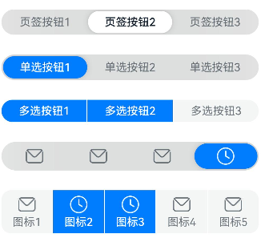
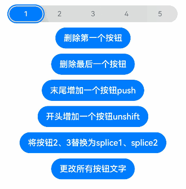
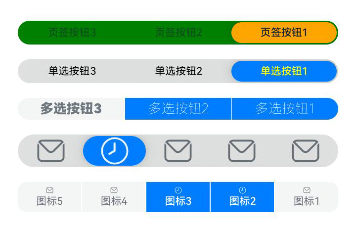
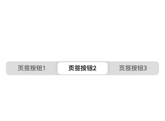

# SegmentButton
<!--Kit: ArkUI-->
<!--Subsystem: ArkUI-->
<!--Owner: @xieziang-->
<!--SE: @youzhi92-->
<!--TSE: @TerryTsao-->

分段按钮组件，包含页签类分段按钮、胶囊类单选分段按钮、胶囊类多选分段按钮。

>**说明：**
>
>该组件从 API Version 11 开始支持。后续版本如有新增内容，则采用上角标单独标记该内容的起始版本。
>
>该组件不支持在Wearable设备上使用。

## 导入模块

```
import { SegmentButton, SegmentButtonOptions, SegmentButtonItemOptionsArray } from '@kit.ArkUI';
```

## 子组件

无

## SegmentButton

SegmentButton({ options: SegmentButtonOptions, selectedIndexes: number[], onItemClicked: Callback\<number\>, maxFontScale: number \| Resource })

**装饰器类型：**@Component

**系统能力：** SystemCapability.ArkUI.ArkUI.Full

| 名称            | 类型                                      | 必填 | 装饰器类型  | 说明                                                         |
| --------------- | --------------------------------------------- | ---- | ----------- | ------------------------------------------------------------ |
| options         | [SegmentButtonOptions](#segmentbuttonoptions) | 是   | @ObjectLink | 分段按钮选项。<br/>**原子化服务API：** 从API version 12开始，该接口支持在原子化服务中使用。 |
| selectedIndexes | number[]                                      | 是   | @Link       | 分段按钮的选中项编号，第一项的编号为0，之后顺序增加。<br/>**说明：**<br/>`selectedIndexes`使用[@Link装饰器：父子双向同步](../../../ui/state-management/arkts-link.md)，仅支持有效的按钮编号（第一个按钮编号为0，之后按顺序累加），如没有选中项可传入空数组`[]`。<br/>**原子化服务API：** 从API version 12开始，该接口支持在原子化服务中使用。 |
| onItemClicked<sup>13+</sup> | Callback\<number\> | 否 | - | 当分段按钮选项被点击时触发的回调函数，回调入参为被点击的选项下标。<br/>**原子化服务API：** 从API version 13开始，该接口支持在原子化服务中使用。 |
| maxFontScale<sup>14+</sup> | number&nbsp;\|&nbsp;[Resource](ts-types.md#resource) | 是 | @Prop | 分段按钮选项文字的最大字体放大倍数。<br/>默认值：1<br/>取值范围：[1,2]<br/>**说明：** <br/>当设置的值小于1时，按值为1处理，设置的值大于2时，按值为2处理。<br/>**原子化服务API：** 从API version 14开始，该接口支持在原子化服务中使用。 |

>**说明：** 
>
>分段按钮组件不支持通用属性。分段按钮组件使用当前区域可使用的最大宽度作为组件宽度，并且根据按钮个数平均分配每个按钮宽度；分段按钮组件高度根据按钮内容（文本及图片）自动适应，其最小高度为28vp。

## SegmentButtonOptions

>**说明：** 
> 
> 不支持设置字体类型。

分段按钮选项类，用于为分段按钮提供初始数据和自定义属性。

**装饰器类型：** @Observed

**系统能力：** SystemCapability.ArkUI.ArkUI.Full

### 属性

| 名称                  | 类型                                                         | 必填                                                       | 说明                                                       |
| ----------------------- | ------------------------------------------------------------ | ------------------------------------------------------------ | ------------------------------------------------------------ |
| type                    | 'tab' \| 'capsule'                                       | 是                                        | 分段按钮的类型。<br/>**说明：**<br/>'tab'：页签类分段按钮，适用于页面或内容区域的切换场景。<br/>'capsule'：胶囊类分段按钮，适用于单选或多选的选择场景。<br/>**原子化服务API：** 从API version 12开始，该接口支持在原子化服务中使用。 |
| multiply                | boolean                                                      | 是                                                   | 是否可以多选。<br/>**说明：**<br/>默认值：false。<br/>true: 可多选；false: 不可多选。页签类分段按钮只支持单选，设置`multiply`为`true`不生效。<br/>**原子化服务API：** 从API version 12开始，该接口支持在原子化服务中使用。 |
| buttons                 | [SegmentButtonItemOptionsArray](#segmentbuttonitemoptionsarray) | 是 | 按钮信息，包括图标和文本信息。<br/>**原子化服务API：** 从API version 12开始，该接口支持在原子化服务中使用。 |
| fontColor               | [ResourceColor](ts-types.md#resourcecolor)                   | 否                  | 按钮未选中态的文本颜色。<br/>默认值：$r('sys.color.ohos_id_color_text_secondary')<br/>**原子化服务API：** 从API version 12开始，该接口支持在原子化服务中使用。 |
| selectedFontColor       | [ResourceColor](ts-types.md#resourcecolor)                   | 否                  | 按钮选中态的文本颜色。<br/>type为"tab"时，默认值为`$r('sys.color.ohos_id_color_text_primary')`。<br/>type为"capsule"时，默认值为`$r('sys.color.ohos_id_color_foreground_contrary')`。<br/>**原子化服务API：** 从API version 12开始，该接口支持在原子化服务中使用。 |
| fontSize                | [DimensionNoPercentage](#dimensionnopercentage)              | 否             | 按钮未选中态的字体大小（不支持百分比设置）。<br/>默认值：$r('sys.float.ohos_id_text_size_body2')<br/>**原子化服务API：** 从API version 12开始，该接口支持在原子化服务中使用。 |
| selectedFontSize        | [DimensionNoPercentage](#dimensionnopercentage)              | 否             | 按钮选中态的字体大小（不支持百分比设置）。<br/>默认值：$r('sys.float.ohos_id_text_size_body2')<br/>**原子化服务API：** 从API version 12开始，该接口支持在原子化服务中使用。 |
| fontWeight              | [FontWeight](ts-appendix-enums.md#fontweight)                | 否               | 按钮未选中态的字体粗细。<br/>默认值：FontWeight.Regular<br/>**原子化服务API：** 从API version 12开始，该接口支持在原子化服务中使用。 |
| selectedFontWeight      | [FontWeight](ts-appendix-enums.md#fontweight)                | 否               | 按钮选中态的字体粗细。<br/>默认值：FontWeight.Medium。<br/>**原子化服务API：** 从API version 12开始，该接口支持在原子化服务中使用。 |
| backgroundColor         | [ResourceColor](ts-types.md#resourcecolor)                   | 否                  | 底板颜色。<br/>默认值：$r('sys.color.ohos_id_color_button_normal')<br/>**原子化服务API：** 从API version 12开始，该接口支持在原子化服务中使用。 |
| selectedBackgroundColor | [ResourceColor](ts-types.md#resourcecolor)                   | 否                  | 按钮选中态底板颜色。<br/>type为"tab"时，默认值为`$r('sys.color.ohos_id_color_foreground_contrary')`。<br/>type为"capsule"时，默认值为`$r('sys.color.ohos_id_color_emphasize')`。<br/>**原子化服务API：** 从API version 12开始，该接口支持在原子化服务中使用。 |
| imageSize               | [SizeOptions](ts-types.md#sizeoptions)                       | 否                      | 图片尺寸，默认值：{ width: 24, height: 24 }。<br/>**说明：**<br/>`imageSize`属性对仅图标按钮和图标+文本按钮生效，对仅文字按钮无效果。<br/>**原子化服务API：** 从API version 12开始，该接口支持在原子化服务中使用。 |
| buttonPadding           | [Padding](ts-types.md#padding)&nbsp;\|&nbsp;[Dimension](ts-types.md#dimension10) | 否 | 按钮内边距，默认值：仅图标按钮和仅文字按钮`{ top: 4, right: 8, bottom: 4, left: 8 }`，图标+文本按钮`{ top: 6, right: 8, bottom: 6, left: 8 }`。<br/>**原子化服务API：** 从API version 12开始，该接口支持在原子化服务中使用。 |
| textPadding             | [Padding](ts-types.md#padding)&nbsp;\|&nbsp;[Dimension](ts-types.md#dimension10) | 否 | 文本内边距。<br/>默认值：0<br/>**原子化服务API：** 从API version 12开始，该接口支持在原子化服务中使用。 |
| localizedButtonPadding<sup>12+</sup> | [LocalizedPadding](ts-types.md#localizedpadding12)                 | 否                | 按钮内边距，默认值：仅图标按钮和仅文字按钮`{ top: LengthMetrics.vp(4), end: LengthMetrics.vp(8), bottom: LengthMetrics.vp(4), start: LengthMetrics.vp(8) }`，图标+文本按钮`{ top: LengthMetrics.vp(6), end: LengthMetrics.vp(8), bottom: LengthMetrics.vp(6), start: LengthMetrics.vp(8) }`。<br/>**原子化服务API：** 从API version 12开始，该接口支持在原子化服务中使用。 |
| localizedTextPadding<sup>12+</sup>   | [LocalizedPadding](ts-types.md#localizedpadding12)                 | 否                | 文本内边距。<br/>默认值：0<br/>**原子化服务API：** 从API version 12开始，该接口支持在原子化服务中使用。 |
| direction<sup>12+</sup> | [Direction](ts-appendix-enums.md#direction)                                             | 否                                            | 布局方向。<br/>默认值：Direction.Auto<br/>**原子化服务API：** 从API version 12开始，该接口支持在原子化服务中使用。 |
| backgroundBlurStyle     | [BlurStyle](ts-universal-attributes-background.md#blurstyle9)                 | 否                | 背景模糊材质。<br/>默认值：BlurStyle.NONE<br/>**原子化服务API：** 从API version 12开始，该接口支持在原子化服务中使用。 |
| borderRadiusMode<sup>20+</sup> | [BorderRadiusMode](#borderradiusmode20) | 否 | 边框圆角模式，用于控制圆角计算方式。<br/>默认值：BorderRadiusMode.DEFAULT<br/>**原子化服务API：** 从API version 20开始，该接口支持在原子化服务中使用。 |
| backgroundBorderRadius<sup>20+</sup> | [LengthMetrics](../js-apis-arkui-graphics.md#lengthmetrics12)   | 否 | 分段按钮整体容器的边框圆角半径。<br/>**说明：**<br/>此属性仅在borderRadiusMode为BorderRadiusMode.CUSTOM时生效。<br/>对于胶囊类多选按钮(type为'capsule'且multiply为true)，此属性不生效，需要用itemBorderRadius配置圆角。<br/>圆角大小受组件尺寸限制，最大值为组件宽或高的一半，不支持百分比设置。<br/>默认值：`$r('sys.float.segmentbutton_container_shape')`<br/>**原子化服务API：** 从API version 20开始，该接口支持在原子化服务中使用。 |
| itemBorderRadius<sup>20+</sup> | [LengthMetrics](../js-apis-arkui-graphics.md#lengthmetrics12)   | 否 | 分段按钮中按钮项的边框圆角半径。<br/>**说明：**<br/>此属性仅在borderRadiusMode为BorderRadiusMode.CUSTOM时生效。<br/>对于胶囊类多选按钮(type为'capsule'且multiply为true)，只能控制两端的选项圆角。<br/>圆角大小受组件尺寸限制，最大值为组件宽或高的一半，不支持百分比设置。<br/>默认值：`$r('sys.float.segmentbutton_selected_background_shape')`<br/>**原子化服务API：** 从API version 20开始，该接口支持在原子化服务中使用。 |

### constructor

constructor(options: TabSegmentButtonOptions | CapsuleSegmentButtonOptions)

构造函数。

**原子化服务API：** 从API version 12开始，该接口支持在原子化服务中使用。

**系统能力：** SystemCapability.ArkUI.ArkUI.Full

**参数**

| 名称    | 类型                                                     | 必填 | 说明                 |
| ------- | ------------------------------------------------------------ | ---- | -------------------- |
| options | [TabSegmentButtonOptions](#tabsegmentbuttonoptions) \|   [CapsuleSegmentButtonOptions](#capsulesegmentbuttonoptions) | 是 | 页签类或者胶囊类分段按钮信息。 |

### tab

static tab(options: TabSegmentButtonConstructionOptions): SegmentButtonOptions

创建页签类的SegmentButtonOptions。

**原子化服务API：** 从API version 12开始，该接口支持在原子化服务中使用。

**系统能力：** SystemCapability.ArkUI.ArkUI.Full

**参数**

| 名称    | 类型                                                         | 必填 | 说明                 |
| ------- | ------------------------------------------------------------ | ---- | -------------------- |
| options | [TabSegmentButtonConstructionOptions](#tabsegmentbuttonconstructionoptions) | 是   | 页签类分段按钮信息。 |

**返回值：**

| 类型   | 说明                     |
| ------ | ------------------------ |
| [SegmentButtonOptions](#segmentbuttonoptions) | 分段按钮选项。 |

### capsule

static capsule(options: CapsuleSegmentButtonConstructionOptions): SegmentButtonOptions

创建胶囊类的SegmentButtonOptions。

**原子化服务API：** 从API version 12开始，该接口支持在原子化服务中使用。

**系统能力：** SystemCapability.ArkUI.ArkUI.Full

**参数**

| 名称    | 类型                                                         | 必填 | 说明                        |
| ------- | ------------------------------------------------------------ | ---- | --------------------------- |
| options | [CapsuleSegmentButtonConstructionOptions](#capsulesegmentbuttonconstructionoptions) | 是   | 胶囊类分段按钮信息。 |

**返回值：**

| 类型   | 说明                     |
| ------ | ------------------------ |
| [SegmentButtonOptions](#segmentbuttonoptions) | 分段按钮选项。 |

## DimensionNoPercentage

type DimensionNoPercentage = PX | VP | FP | LPX | Resource

不支持百分比类型的长度的联合类型。

**原子化服务API：** 从API version 12开始，该接口支持在原子化服务中使用。

**系统能力：** SystemCapability.ArkUI.ArkUI.Full

| 类型                             | 说明                                          |
| -------------------------------- | --------------------------------------------- |
| [PX](ts-types.md#px10)           | 长度类型，用于描述以px为单位的长度。  |
| [VP](ts-types.md#vp10)           | 长度类型，用于描述以vp为单位的长度。  |
| [FP](ts-types.md#fp10)           | 长度类型，用于描述以fp为单位的长度。  |
| [LPX](ts-types.md#lpx10)         | 长度类型，用于描述以lpx为单位的长度。 |
| [Resource](ts-types.md#resource) | 资源引用类型，用于设置组件属性的值。          |

## CommonSegmentButtonOptions

用于定义分段按钮组件可自定义的属性。

**系统能力：** SystemCapability.ArkUI.ArkUI.Full

### 属性

| 名称                  | 类型                                                         | 必填                                                       | 说明                                                       |
| ----------------------- | ------------------------------------------------------------ | ------------------------------------------------------------ | ------------------------------------------------------------ |
| fontColor               | [ResourceColor](ts-types.md#resourcecolor)                   | 否                  | 按钮未选中态的文本颜色。<br/>默认值：$r('sys.color.ohos_id_color_text_secondary')<br/>**原子化服务API：** 从API version 12开始，该接口支持在原子化服务中使用。 |
| selectedFontColor       | [ResourceColor](ts-types.md#resourcecolor)                   | 否                  | 按钮选中态的文本颜色。<br/>type为"tab"时，默认值为`$r('sys.color.ohos_id_color_text_primary')`。<br/>type为"capsule"时，默认值为`$r('sys.color.ohos_id_color_foreground_contrary')`。<br/>**原子化服务API：** 从API version 12开始，该接口支持在原子化服务中使用。 |
| fontSize                | [DimensionNoPercentage](#dimensionnopercentage)              | 否             | 按钮未选中态的字体大小（不支持百分比设置）。<br/>默认值：$r('sys.float.ohos_id_text_size_body2')<br/>**原子化服务API：** 从API version 12开始，该接口支持在原子化服务中使用。 |
| selectedFontSize        | [DimensionNoPercentage](#dimensionnopercentage)              | 否             | 按钮选中态的字体大小（不支持百分比设置）。<br/>默认值：$r('sys.float.ohos_id_text_size_body2')<br/>**原子化服务API：** 从API version 12开始，该接口支持在原子化服务中使用。 |
| fontWeight              | [FontWeight](ts-appendix-enums.md#fontweight)                | 否               | 按钮未选中态的字体粗细。<br/>默认值：FontWeight.Regular<br/>**原子化服务API：** 从API version 12开始，该接口支持在原子化服务中使用。 |
| selectedFontWeight      | [FontWeight](ts-appendix-enums.md#fontweight)                | 否               | 按钮选中态的字体粗细。<br/>默认值：FontWeight.Medium。<br/>**原子化服务API：** 从API version 12开始，该接口支持在原子化服务中使用。 |
| backgroundColor         | [ResourceColor](ts-types.md#resourcecolor)                   | 否                  | 底板颜色。<br/>默认值：$r('sys.color.ohos_id_color_button_normal')<br/>**原子化服务API：** 从API version 12开始，该接口支持在原子化服务中使用。 |
| selectedBackgroundColor | [ResourceColor](ts-types.md#resourcecolor)                   | 否                  | 按钮选中态底板颜色。<br/>type为"tab"时，默认值为`$r('sys.color.ohos_id_color_foreground_contrary')`。<br/>type为"capsule"时，默认值为`$r('sys.color.ohos_id_color_emphasize')`。<br/>**原子化服务API：** 从API version 12开始，该接口支持在原子化服务中使用。 |
| imageSize               | [SizeOptions](ts-types.md#sizeoptions)                       | 否                      | 图片尺寸，默认值：{ width: 24, height: 24 }。<br/>**说明：**<br/>`imageSize`属性对仅图标按钮和图标+文本按钮生效，对仅文字按钮无效果。<br/>**原子化服务API：** 从API version 12开始，该接口支持在原子化服务中使用。 |
| buttonPadding           | [Padding](ts-types.md#padding)&nbsp;\|&nbsp;[Dimension](ts-types.md#dimension10) | 否 | 按钮内边距，默认值：仅图标按钮和仅文字按钮`{ top: 4, right: 8, bottom: 4, left: 8 }`，图标+文本按钮`{ top: 6, right: 8, bottom: 6, left: 8 }`。<br/>**原子化服务API：** 从API version 12开始，该接口支持在原子化服务中使用。 |
| textPadding             | [Padding](ts-types.md#padding)&nbsp;\|&nbsp;[Dimension](ts-types.md#dimension10) | 否 | 文本内边距。<br/>默认值：0<br/>**原子化服务API：** 从API version 12开始，该接口支持在原子化服务中使用。 |
| localizedButtonPadding<sup>12+</sup> | [LocalizedPadding](ts-types.md#localizedpadding12)                 | 否                | 按钮内边距，默认值：仅图标按钮和仅文字按钮`{ top: LengthMetrics.vp(4), end: LengthMetrics.vp(8), bottom: LengthMetrics.vp(4), start: LengthMetrics.vp(8) }`，图标+文本按钮`{ top: LengthMetrics.vp(6), end: LengthMetrics.vp(8), bottom: LengthMetrics.vp(6), start: LengthMetrics.vp(8) }`。<br/>**原子化服务API：** 从API version 12开始，该接口支持在原子化服务中使用。 |
| localizedTextPadding<sup>12+</sup>   | [LocalizedPadding](ts-types.md#localizedpadding12)                 | 否                | 文本内边距。<br/>默认值：0<br/>**原子化服务API：** 从API version 12开始，该接口支持在原子化服务中使用。 |
| direction<sup>12+</sup> | [Direction](ts-appendix-enums.md#direction)                                             | 否                                            | 布局方向。<br/>默认值：Direction.Auto<br/>**原子化服务API：** 从API version 12开始，该接口支持在原子化服务中使用。 |
| backgroundBlurStyle     | [BlurStyle](ts-universal-attributes-background.md#blurstyle9)                 | 否                | 背景模糊材质。<br/>默认值：BlurStyle.NONE<br/>**原子化服务API：** 从API version 12开始，该接口支持在原子化服务中使用。 |
| borderRadiusMode<sup>20+</sup> | [BorderRadiusMode](#borderradiusmode20) | 否 | 边框圆角模式，用于控制圆角计算方式。<br/>默认值：BorderRadiusMode.DEFAULT<br/>**原子化服务API：** 从API version 20开始，该接口支持在原子化服务中使用。 |
| backgroundBorderRadius<sup>20+</sup> | [LengthMetrics](../js-apis-arkui-graphics.md#lengthmetrics12)   | 否 | 分段按钮整体容器的边框圆角半径。<br/>**说明：**<br/>此属性仅在borderRadiusMode为BorderRadiusMode.CUSTOM时生效。<br/>对于胶囊类多选按钮(type为'capsule'且multiply为true)，此属性不生效，需要用itemBorderRadius配置圆角。<br/>圆角大小受组件尺寸限制，最大值为组件宽或高的一半，不支持百分比设置。<br/>默认值：`$r('sys.float.segmentbutton_container_shape')`<br/>**原子化服务API：** 从API version 20开始，该接口支持在原子化服务中使用。 |
| itemBorderRadius<sup>20+</sup> | [LengthMetrics](../js-apis-arkui-graphics.md#lengthmetrics12)   | 否 | 分段按钮中按钮项的边框圆角半径。<br/>**说明：**<br/>此属性仅在borderRadiusMode为BorderRadiusMode.CUSTOM时生效。<br/>对于胶囊类多选按钮(type为'capsule'且multiply为true)，只能控制两端的选项圆角。<br/>圆角大小受组件尺寸限制，最大值为组件宽或高的一半，不支持百分比设置。<br/>默认值：`$r('sys.float.segmentbutton_selected_background_shape')`<br/>**原子化服务API：** 从API version 20开始，该接口支持在原子化服务中使用。 |

## BorderRadiusMode<sup>20+</sup>

边框圆角模式枚举，用于控制分段按钮的圆角计算方式。

**原子化服务API：** 从API version 20开始，该接口支持在原子化服务中使用。

**系统能力：** SystemCapability.ArkUI.ArkUI.Full

| 名称    |值 | 说明                             |
| ------- | - |-------------------------------- |
| DEFAULT | 0 |默认模式，框架自动计算边框圆角。 |
| CUSTOM  | 1 |自定义模式，开发者设置边框圆角。 |

## TabSegmentButtonConstructionOptions

用于构建页签类的SegmentButtonOptions对象。

继承[CommonSegmentButtonOptions](#commonsegmentbuttonoptions)。

**原子化服务API：** 从API version 12开始，该接口支持在原子化服务中使用。

**系统能力：** SystemCapability.ArkUI.ArkUI.Full

### 属性

| 名称    | 类型                                                         | 必填 | 说明       |
| ------- | ------------------------------------------------------------ | ---- | ---------- |
| buttons | [ItemRestriction](#itemrestriction)\<[SegmentButtonTextItem](#segmentbuttontextitem)> | 是   | 按钮信息。 |

## CapsuleSegmentButtonConstructionOptions

用于构建胶囊类的SegmentButtonOptions对象。

继承[CommonSegmentButtonOptions](#commonsegmentbuttonoptions)。

**原子化服务API：** 从API version 12开始，该接口支持在原子化服务中使用。

**系统能力：** SystemCapability.ArkUI.ArkUI.Full

### 属性

| 名称      | 类型                                              | 必填 | 说明                        |
| -------- | ------------------------------------------------- | ---- | ----------------------------- |
| buttons  | [SegmentButtonItemTuple](#segmentbuttonitemtuple) | 是   | 按钮信息。                    |
| multiply | boolean                                           | 否   | 是否可以多选。true表示可以多选，false表示不可以多选。默认为false。 |

## ItemRestriction

type ItemRestriction\<T> = [T, T, T?, T?, T?]

用于保存按钮信息的元组。

**原子化服务API：** 从API version 12开始，该接口支持在原子化服务中使用。

**系统能力：** SystemCapability.ArkUI.ArkUI.Full

| 类型                                      | 说明                              |
| ----------------------------------------- | --------------------------------- |
|[T, T, T?, T?, T?] | 表示包含2~5个相同类型元素的元组。 |

>**说明：**
>
>分段按钮组件仅支持2到5个按钮。

## SegmentButtonItemTuple

type SegmentButtonItemTuple = ItemRestriction\<SegmentButtonTextItem> | ItemRestriction\<SegmentButtonIconItem> | ItemRestriction\<SegmentButtonIconTextItem>

用于保存按钮信息的元组的联合类型。

**原子化服务API：** 从API version 12开始，该接口支持在原子化服务中使用。

**系统能力：** SystemCapability.ArkUI.ArkUI.Full

| 类型                                                         | 说明                      |
| ------------------------------------------------------------ | ------------------------- |
| [ItemRestriction](#itemrestriction)\<[SegmentButtonTextItem](#segmentbuttontextitem)\> | 仅文本按钮信息的元组。    |
| [ItemRestriction](#itemrestriction)\<[SegmentButtonIconItem](#segmentbuttoniconitem)\> | 仅图标按钮信息的元组。    |
| [ItemRestriction](#itemrestriction)\<[SegmentButtonIconTextItem](#segmentbuttonicontextitem)\> | 图标+文本按钮信息的元组。 |

## SegmentButtonItemArray

type SegmentButtonItemArray = Array\<SegmentButtonTextItem> | Array\<SegmentButtonIconItem> | Array\<SegmentButtonIconTextItem>

用于保存按钮信息的数组的联合类型。

**原子化服务API：** 从API version 12开始，该接口支持在原子化服务中使用。

**系统能力：** SystemCapability.ArkUI.ArkUI.Full

| 类型                                                         | 说明                      |
| ------------------------------------------------------------ | ------------------------- |
| Array\<[SegmentButtonTextItem](#segmentbuttontextitem)\>     | 仅文本按钮信息的数组。    |
| Array\<[SegmentButtonIconItem](#segmentbuttoniconitem)\>     | 仅图标按钮信息的数组。    |
| Array\<[SegmentButtonIconTextItem](#segmentbuttonicontextitem)\> | 图标+文本按钮信息的数组。 |

## SegmentButtonItemOptionsArray

用于保存按钮信息的数组。

**装饰器类型：** @Observed

>**说明：**
>
>分段按钮组件仅支持2到5个按钮，SegmentButtonItemOptionsArray只保存2到5个按钮信息。

### constructor

constructor(elements: SegmentButtonItemTuple)

构造函数。

**原子化服务API：** 从API version 12开始，该接口支持在原子化服务中使用。

**系统能力：** SystemCapability.ArkUI.ArkUI.Full

**参数：**


| 参数名   | 类型                                              | 必填 | 说明       |
| -------- | ------------------------------------------------- | ---- | ---------- |
| elements | [SegmentButtonItemTuple](#segmentbuttonitemtuple) | 是   | 按钮信息。 |

### push

push(...items: SegmentButtonItemArray): number

在数组末尾添加新的元素，返回添加元素后数组的长度。

**原子化服务API：** 从API version 12开始，该接口支持在原子化服务中使用。

**系统能力：** SystemCapability.ArkUI.ArkUI.Full

**参数：**


| 参数名 | 类型                                              | 必填 | 说明                   |
| ------ | ------------------------------------------------- | ---- | ---------------------- |
| items  | [SegmentButtonItemArray](#segmentbuttonitemarray) | 是   | 被添加的按钮信息数组。 |

**返回值：**

| 类型   | 说明                     |
| ------ | ------------------------ |
| number | 添加元素后数组的长度。 |

>**说明：**
>
>分段按钮组件仅支持2到5个按钮，SegmentButtonItemOptionsArray只保存2到5个按钮信息，当超过按钮信息个数限制此方法无效。

### pop

pop(): SegmentButtonItemOptions | undefined

移除数组末尾最后一个元素，返回被移除的元素。

**原子化服务API：** 从API version 12开始，该接口支持在原子化服务中使用。

**系统能力：** SystemCapability.ArkUI.ArkUI.Full

**返回值：**

| 类型                                                         | 说明           |
| ------------------------------------------------------------ | -------------- |
| [SegmentButtonItemOptions](#segmentbuttonitemoptions)&nbsp;\|&nbsp;undefined | 被移除的元素。 |

>**说明：**
>
>分段按钮组件仅支持2到5个按钮，SegmentButtonItemOptionsArray只保存2到5个按钮信息，当超过按钮信息个数限制此方法无效。

### shift

shift(): SegmentButtonItemOptions | undefined

移除数组开头第一个元素，返回被移除的元素。

**原子化服务API：** 从API version 12开始，该接口支持在原子化服务中使用。

**系统能力：** SystemCapability.ArkUI.ArkUI.Full

**返回值：**

| 类型                                                         | 说明           |
| ------------------------------------------------------------ | -------------- |
| [SegmentButtonItemOptions](#segmentbuttonitemoptions)&nbsp;\|&nbsp;undefined | 被移除的元素。 |

>**说明：**
>
>分段按钮组件仅支持2到5个按钮，SegmentButtonItemOptionsArray只保存2到5个按钮信息，当超过按钮信息个数限制此方法无效。

### unshift

unshift(...items: SegmentButtonItemArray): number

在数组开头添加新的元素，返回添加元素后数组的长度。

**原子化服务API：** 从API version 12开始，该接口支持在原子化服务中使用。

**系统能力：** SystemCapability.ArkUI.ArkUI.Full

**参数：**


| 参数名  | 类型                                              | 必填 | 说明                 |
| ----- | ------------------------------------------------- | ---- | -------------------- |
| items | [SegmentButtonItemArray](#segmentbuttonitemarray) | 是   | 添加的按钮信息数组。 |

**返回值：**

| 类型   | 说明                   |
| ------ | ---------------------- |
| number | 添加元素后数组的长度。 |

>**说明：**
>
>分段按钮组件仅支持2到5个按钮，SegmentButtonItemOptionsArray只保存2到5个按钮信息，当超过按钮信息个数限制此方法无效。

### splice

splice(start: number, deleteCount: number, ...items: SegmentButtonItemOptions[]): SegmentButtonItemOptions[]

在数组中，删除从start位置开始的deleteCount数量的元素，并插入items中的元素，返回一个包含了被删除的元素的数组。

**原子化服务API：** 从API version 12开始，该接口支持在原子化服务中使用。

**系统能力：** SystemCapability.ArkUI.ArkUI.Full

**参数：**


| 参数名      | 类型                                                    | 必填 | 说明                 |
| ----------- | ------------------------------------------------------- | ---- | -------------------- |
| start       | number                                                  | 是   | 删除元素的起始位置。 |
| deleteCount | number                                                  | 是   | 删除元素的数量。     |
| items       | [SegmentButtonItemOptions](#segmentbuttonitemoptions)[] | 否   | 插入元素数组。       |

**返回值：**

| 类型                                                    | 说明                           |
| ------------------------------------------------------- | ------------------------------ |
| [SegmentButtonItemOptions](#segmentbuttonitemoptions)[] | 返回包含了被删除的元素的数组。 |

>**说明：**
>
>分段按钮组件仅支持2到5个按钮，SegmentButtonItemOptionsArray只保存2到5个按钮信息，当超过按钮信息个数限制此方法无效。

### create

static create(elements: SegmentButtonItemTuple): SegmentButtonItemOptionsArray

创建一个SegmentButtonItemOptionsArray对象。

**原子化服务API：** 从API version 12开始，该接口支持在原子化服务中使用。

**系统能力：** SystemCapability.ArkUI.ArkUI.Full

**参数：** 


| 参数名   | 类型                                              | 必填 | 说明       |
| -------- | ------------------------------------------------- | ---- | ---------- |
| elements | [SegmentButtonItemTuple](#segmentbuttonitemtuple) | 是   | 按钮信息。 |

**返回值：**

| 类型                                                         | 说明                                      |
| ------------------------------------------------------------ | ----------------------------------------- |
| [SegmentButtonItemOptionsArray](#segmentbuttonitemoptionsarray) | 创建的SegmentButtonItemOptionsArray对象。 |

## TabSegmentButtonOptions

页签类分段按钮选项。继承自[TabSegmentButtonConstructionOptions](#tabsegmentbuttonconstructionoptions)。

**原子化服务API：** 从API version 12开始，该接口支持在原子化服务中使用。

**系统能力：** SystemCapability.ArkUI.ArkUI.Full

| 名称 | 类型  | 必填 | 说明                   |
| ---- | ----- | ---- | ---------------------- |
| type | 'tab' | 是   | 类型为页签类分段按钮。 |

## CapsuleSegmentButtonOptions

胶囊类分段按钮选项。继承自[CapsuleSegmentButtonConstructionOptions](#capsulesegmentbuttonconstructionoptions)。

**原子化服务API：** 从API version 12开始，该接口支持在原子化服务中使用。

**系统能力：** SystemCapability.ArkUI.ArkUI.Full

| 名称 | 类型      | 必填 | 说明                        |
| ---- | --------- | ---- | ----------------------------- |
| type | 'capsule' | 是   | 类型为胶囊类分段按钮。 |

## SegmentButtonTextItem

仅文本按钮信息。

**系统能力：** SystemCapability.ArkUI.ArkUI.Full

| 名称 | 类型                                   | 必填 | 说明      |
| ---- | -------------------------------------- | ---- | ---------- |
| text | [ResourceStr](ts-types.md#resourcestr) | 是   | 按钮文本。<br/>**原子化服务API：** 从API version 12开始，该接口支持在原子化服务中使用。 |
| accessibilityLevel<sup>13+</sup> | string | 否   | 无障碍重要性，用于控制当前组件是否可被无障碍辅助服务所识别。<br/>支持的值为:<br/>"auto"：当前组件可被无障碍辅助服务所识别。<br/>"yes"：当前组件可被无障碍辅助服务所识别。<br/>"no"：当前组件不可被无障碍辅助服务所识别。<br/>"no-hide-descendants"：当前组件及其所有子组件不可被无障碍辅助服务所识别。<br/>默认值："auto"。<br/>**原子化服务API：** 从API version 13开始，该接口支持在原子化服务中使用。 |
| accessibilityDescription<sup>13+</sup> | [ResourceStr](ts-types.md#resourcestr) | 否   | 无障碍说明，用于为用户进一步说明当前组件，开发人员可为组件的该属性设置相对较详细的解释文本，帮助用户理解将要执行的操作。如帮助用户理解将要执行的操作可能导致什么后果，尤其是当这些后果无法从组件本身属性与无障碍文本中了解到时。若组件既拥有文本属性又拥有无障碍说明属性，则组件被选中时，先播报组件的文本属性，再播报无障碍说明属性的内容。<br/>**原子化服务API：** 从API version 13开始，该接口支持在原子化服务中使用。 |

## SegmentButtonIconItem

仅图标按钮信息。

**系统能力：** SystemCapability.ArkUI.ArkUI.Full

|名称      | 类型                                   | 必填 | 说明               |
| ------------ | -------------------------------------- | ---- | -------------------- |
| icon         | [ResourceStr](ts-types.md#resourcestr) | 是   | 未选中态的按钮图标。<br/>**原子化服务API：** 从API version 12开始，该接口支持在原子化服务中使用。 |
| iconAccessibilityText<sup>13+</sup>         | [ResourceStr](ts-types.md#resourcestr) | 否   | 未选中态按钮图标的无障碍文本。<br/>**原子化服务API：** 从API version 13开始，该接口支持在原子化服务中使用。 |
| selectedIcon | [ResourceStr](ts-types.md#resourcestr) | 是   | 选中态的按钮图标。<br/>**原子化服务API：** 从API version 12开始，该接口支持在原子化服务中使用。   |
| selectedIconAccessibilityText<sup>13+</sup> | [ResourceStr](ts-types.md#resourcestr) | 否   | 选中态按钮图标的无障碍文本。<br/>**原子化服务API：** 从API version 13开始，该接口支持在原子化服务中使用。   |
| accessibilityLevel<sup>13+</sup> | string | 否   | 无障碍重要性，用于控制当前组件是否可被无障碍辅助服务所识别。<br/>支持的值为:<br/>"auto"：当前组件可被无障碍辅助服务所识别。<br/>"yes"：当前组件可被无障碍辅助服务所识别。<br/>"no"：当前组件不可被无障碍辅助服务所识别。<br/>"no-hide-descendants"：当前组件及其所有子组件不可被无障碍辅助服务所识别。<br/>默认值："auto"。<br/>**原子化服务API：** 从API version 13开始，该接口支持在原子化服务中使用。   |
| accessibilityDescription<sup>13+</sup> | [ResourceStr](ts-types.md#resourcestr) | 否   | 无障碍说明，用于为用户进一步说明当前组件，开发人员可为组件的该属性设置相对较详细的解释文本，帮助用户理解将要执行的操作。如帮助用户理解将要执行的操作可能导致什么后果，尤其是当这些后果无法从组件本身属性与无障碍文本中了解到时。若组件既拥有文本属性又拥有无障碍说明属性，则组件被选中时，先播报组件的文本属性，再播报无障碍说明属性的内容。<br/>**原子化服务API：** 从API version 13开始，该接口支持在原子化服务中使用。   |

>**说明：**
>
>未选中态图标`icon`与选中态图标`selectedIcon`都需要设置，单独设置不生效。

## SegmentButtonIconTextItem

图标+文本按钮信息。

**系统能力：** SystemCapability.ArkUI.ArkUI.Full

### 属性

| 名称         | 类型                                   | 必填 | 说明                 |
| ------------ | -------------------------------------- | ---- | -------------------- |
| icon         | [ResourceStr](ts-types.md#resourcestr) | 是   | 未选中态的按钮图标。<br/>**原子化服务API：** 从API version 12开始，该接口支持在原子化服务中使用。 |
| iconAccessibilityText<sup>13+</sup>         | [ResourceStr](ts-types.md#resourcestr) | 否   | 未选中态按钮图标的无障碍文本。<br/>**原子化服务API：** 从API version 13开始，该接口支持在原子化服务中使用。 |
| selectedIcon | [ResourceStr](ts-types.md#resourcestr) | 是   | 选中态的按钮图标。<br/>**原子化服务API：** 从API version 12开始，该接口支持在原子化服务中使用。   |
| selectedIconAccessibilityText<sup>13+</sup> | [ResourceStr](ts-types.md#resourcestr) | 否   | 选中态按钮图标的无障碍文本。<br/>**原子化服务API：** 从API version 13开始，该接口支持在原子化服务中使用。   |
| text         | [ResourceStr](ts-types.md#resourcestr) | 是   | 按钮文本。<br/>**原子化服务API：** 从API version 12开始，该接口支持在原子化服务中使用。           |
| accessibilityLevel<sup>13+</sup> | string | 否   | 无障碍重要性，用于控制当前组件是否可被无障碍辅助服务所识别。<br/>支持的值为:<br/>"auto"：当前组件可被无障碍辅助服务所识别。<br/>"yes"：当前组件可被无障碍辅助服务所识别。<br/>"no"：当前组件不可被无障碍辅助服务所识别。<br/>"no-hide-descendants"：当前组件及其所有子组件不可被无障碍辅助服务所识别。<br/>默认值："auto"。<br/>**原子化服务API：** 从API version 13开始，该接口支持在原子化服务中使用。   |
| accessibilityDescription<sup>13+</sup> | [ResourceStr](ts-types.md#resourcestr) | 否   | 无障碍说明，用于为用户进一步说明当前组件，开发人员可为组件的该属性设置相对较详细的解释文本，帮助用户理解将要执行的操作。如帮助用户理解将要执行的操作可能导致什么后果，尤其是当这些后果无法从组件本身属性与无障碍文本中了解到时。若组件既拥有文本属性又拥有无障碍说明属性，则组件被选中时，先播报组件的文本属性，再播报无障碍说明属性的内容。<br/>**原子化服务API：** 从API version 13开始，该接口支持在原子化服务中使用。   |

>**说明：**
>
>未选中态图标`icon`与选中态图标`selectedIcon`都需要设置，单独设置不生效。

## SegmentButtonItemOptions

分段按钮中按钮的选项。

**装饰器类型：** @Observed

**系统能力：** SystemCapability.ArkUI.ArkUI.Full

### 属性

| 名称         | 类型                                   | 必填 | 说明                 |
| ------------ | -------------------------------------- | ---- | -------------------- |
| icon         | [ResourceStr](ts-types.md#resourcestr) | 否   | 未选中态的按钮图标。<br/>**原子化服务API：** 从API version 12开始，该接口支持在原子化服务中使用。 |
| iconAccessibilityText<sup>13+</sup>         | [ResourceStr](ts-types.md#resourcestr) | 否   | 未选中态按钮图标的无障碍文本。<br/>**原子化服务API：** 从API version 13开始，该接口支持在原子化服务中使用。 |
| selectedIcon | [ResourceStr](ts-types.md#resourcestr) | 否   | 选中态的按钮图标。<br/>**原子化服务API：** 从API version 12开始，该接口支持在原子化服务中使用。   |
| selectedIconAccessibilityText<sup>13+</sup> | [ResourceStr](ts-types.md#resourcestr) | 否   | 选中态按钮图标的无障碍文本。<br/>**原子化服务API：** 从API version 13开始，该接口支持在原子化服务中使用。   |
| text         | [ResourceStr](ts-types.md#resourcestr) | 否   | 按钮文本。<br/>**原子化服务API：** 从API version 12开始，该接口支持在原子化服务中使用。           |
| accessibilityLevel<sup>13+</sup> | string | 否   | 无障碍重要性，用于控制当前组件是否可被无障碍辅助服务所识别。<br/>支持的值为:<br/>"auto"：当前组件可被无障碍辅助服务所识别。<br/>"yes"：当前组件可被无障碍辅助服务所识别。<br/>"no"：当前组件不可被无障碍辅助服务所识别。<br/>"no-hide-descendants"：当前组件及其所有子组件不可被无障碍辅助服务所识别。<br/>默认值："auto"。<br/>**原子化服务API：** 从API version 13开始，该接口支持在原子化服务中使用。   |
| accessibilityDescription<sup>13+</sup> | [ResourceStr](ts-types.md#resourcestr) | 否   | 无障碍说明，用于为用户进一步说明当前组件，开发人员可为组件的该属性设置相对较详细的解释文本，帮助用户理解将要执行的操作。如帮助用户理解将要执行的操作可能导致什么后果，尤其是当这些后果无法从组件本身属性与无障碍文本中了解到时。若组件既拥有文本属性又拥有无障碍说明属性，则组件被选中时，先播报组件的文本属性，再播报无障碍说明属性的内容。<br/>**原子化服务API：** 从API version 13开始，该接口支持在原子化服务中使用。   |

### constructor

constructor(options: SegmentButtonItemOptionsConstructorOptions)

构造函数。

**原子化服务API：** 从API version 12开始，该接口支持在原子化服务中使用。

**系统能力：** SystemCapability.ArkUI.ArkUI.Full

**参数：**


| 参数名  | 类型                                                         | 必填 | 说明               |
| ------- | ------------------------------------------------------------ | ---- | ------------------ |
| options | [SegmentButtonItemOptionsConstructorOptions](#segmentbuttonitemoptionsconstructoroptions) | 是   | 单个分段按钮的配置选项，包含图标、文本、无障碍属性等配置信息。 |

## SegmentButtonItemOptionsConstructorOptions

SegmentButtonItemOptions的构造参数。

**系统能力：** SystemCapability.ArkUI.ArkUI.Full

### 属性

| 名称         | 类型                                   | 必填 | 说明              |
| ------------ | -------------------------------------- | ---- | -------------------- |
| icon         | [ResourceStr](ts-types.md#resourcestr) | 否   | 未选中态的按钮图标。<br/>**原子化服务API：** 从API version 12开始，该接口支持在原子化服务中使用。 |
| iconAccessibilityText<sup>13+</sup>         | [ResourceStr](ts-types.md#resourcestr) | 否   | 未选中态按钮图标的无障碍文本。<br/>**原子化服务API：** 从API version 13开始，该接口支持在原子化服务中使用。 |
| selectedIcon | [ResourceStr](ts-types.md#resourcestr) | 否   | 选中态的按钮图标。<br/>**原子化服务API：** 从API version 12开始，该接口支持在原子化服务中使用。   |
| selectedIconAccessibilityText<sup>13+</sup> | [ResourceStr](ts-types.md#resourcestr) | 否   | 选中态按钮图标的无障碍文本。<br/>**原子化服务API：** 从API version 13开始，该接口支持在原子化服务中使用。   |
| text         | [ResourceStr](ts-types.md#resourcestr) | 否   | 按钮文本。<br/>**原子化服务API：** 从API version 12开始，该接口支持在原子化服务中使用。           |
| accessibilityLevel<sup>13+</sup> | string | 否   | 无障碍重要性，用于控制当前组件是否可被无障碍辅助服务所识别。<br/>支持的值为:<br/>"auto"：当前组件可被无障碍辅助服务所识别。<br/>"yes"：当前组件可被无障碍辅助服务所识别。<br/>"no"：当前组件不可被无障碍辅助服务所识别。<br/>"no-hide-descendants"：当前组件及其所有子组件不可被无障碍辅助服务所识别。<br/>默认值："auto"。<br/>**原子化服务API：** 从API version 13开始，该接口支持在原子化服务中使用。   |
| accessibilityDescription<sup>13+</sup> | [ResourceStr](ts-types.md#resourcestr) | 否   | 无障碍说明，用于为用户进一步说明当前组件，开发人员可为组件的该属性设置相对较详细的解释文本，帮助用户理解将要执行的操作。如帮助用户理解将要执行的操作可能导致什么后果，尤其是当这些后果无法从组件本身属性与无障碍文本中了解到时。若组件既拥有文本属性又拥有无障碍说明属性，则组件被选中时，先播报组件的文本属性，再播报无障碍说明属性的内容。<br/>**原子化服务API：** 从API version 13开始，该接口支持在原子化服务中使用。   |

## 示例

### 示例1（设置分段按钮的类型）

该示例通过配置SegmentButtonOptions的tab和capsule创建两种不同类型的分段按钮。

```ts
// xxx.ets
import {
  ItemRestriction,
  SegmentButton,
  SegmentButtonItemTuple,
  SegmentButtonOptions,
  SegmentButtonTextItem
} from '@kit.ArkUI';

@Entry
@Component
struct Index {
  @State tabOptions: SegmentButtonOptions = SegmentButtonOptions.tab({
    buttons: [{ text: '页签按钮1' }, { text: '页签按钮2' }, {
      text: '页签按钮3'
    }] as ItemRestriction<SegmentButtonTextItem>,
    backgroundBlurStyle: BlurStyle.BACKGROUND_THICK
  })
  @State singleSelectCapsuleOptions: SegmentButtonOptions = SegmentButtonOptions.capsule({
    buttons: [{ text: '单选按钮1' }, { text: '单选按钮2' }, { text: '单选按钮3' }] as SegmentButtonItemTuple,
    multiply: false,
    backgroundBlurStyle: BlurStyle.BACKGROUND_THICK
  })
  @State multiplySelectCapsuleOptions: SegmentButtonOptions = SegmentButtonOptions.capsule({
    buttons: [{ text: '多选按钮1' }, { text: '多选按钮2' }, { text: '多选按钮3' }] as SegmentButtonItemTuple,
    multiply: true
  })
  @State iconCapsuleOptions: SegmentButtonOptions = SegmentButtonOptions.capsule({
    buttons: [
      { icon: $r('sys.media.ohos_ic_public_email'), selectedIcon: $r('sys.media.ohos_ic_public_clock') },
      { icon: $r('sys.media.ohos_ic_public_email'), selectedIcon: $r('sys.media.ohos_ic_public_clock') },
      { icon: $r('sys.media.ohos_ic_public_email'), selectedIcon: $r('sys.media.ohos_ic_public_clock') },
      { icon: $r('sys.media.ohos_ic_public_email'), selectedIcon: $r('sys.media.ohos_ic_public_clock') }
    ] as SegmentButtonItemTuple,
    multiply: false,
    backgroundBlurStyle: BlurStyle.BACKGROUND_THICK
  })
  @State iconTextCapsuleOptions: SegmentButtonOptions = SegmentButtonOptions.capsule({
    buttons: [
      { text: '图标1', icon: $r('sys.media.ohos_ic_public_email'), selectedIcon: $r('sys.media.ohos_ic_public_clock') },
      { text: '图标2', icon: $r('sys.media.ohos_ic_public_email'), selectedIcon: $r('sys.media.ohos_ic_public_clock') },
      { text: '图标3', icon: $r('sys.media.ohos_ic_public_email'), selectedIcon: $r('sys.media.ohos_ic_public_clock') },
      { text: '图标4', icon: $r('sys.media.ohos_ic_public_email'), selectedIcon: $r('sys.media.ohos_ic_public_clock') },
      { text: '图标5', icon: $r('sys.media.ohos_ic_public_email'), selectedIcon: $r('sys.media.ohos_ic_public_clock') }
    ] as SegmentButtonItemTuple,
    multiply: true
  })
  @State tabSelectedIndexes: number[] = [1]
  @State singleSelectCapsuleSelectedIndexes: number[] = [0]
  @State multiplySelectCapsuleSelectedIndexes: number[] = [0, 1]
  @State singleSelectIconCapsuleSelectedIndexes: number[] = [3]
  @State multiplySelectIconTextCapsuleSelectedIndexes: number[] = [1, 2]

  build() {
    Row() {
      Column() {
        Column({ space: 25 }) {
          SegmentButton({ options: this.tabOptions,
            selectedIndexes: $tabSelectedIndexes })
          SegmentButton({ options: this.singleSelectCapsuleOptions,
            selectedIndexes: $singleSelectCapsuleSelectedIndexes })
          SegmentButton({
            options: this.multiplySelectCapsuleOptions,
            selectedIndexes: $multiplySelectCapsuleSelectedIndexes })
          SegmentButton({ options: this.iconCapsuleOptions,
            selectedIndexes: $singleSelectIconCapsuleSelectedIndexes })
          SegmentButton({ options: this.iconTextCapsuleOptions,
            selectedIndexes: $multiplySelectIconTextCapsuleSelectedIndexes })
        }.width('90%')
      }.width('100%')
    }.height('100%')
  }
}
```



### 示例2（设置分段按钮样式）

该示例通过配置CommonSegmentButtonOptions实现了自定义分段按钮的文本以及背板样式。

```ts
// xxx.ets
import {
  ItemRestriction,
  SegmentButton,
  SegmentButtonItemTuple,
  SegmentButtonOptions,
  SegmentButtonTextItem
} from '@kit.ArkUI';

@Entry
@Component
struct Index {
  @State tabOptions: SegmentButtonOptions = SegmentButtonOptions.tab({
    buttons: [{ text: '页签按钮1' }, { text: '页签按钮2' }, {
      text: '页签按钮3'
    }] as ItemRestriction<SegmentButtonTextItem>,
    backgroundColor: 'rgb(213,213,213)',
    selectedBackgroundColor: 'rgb(112,112,112)',
    textPadding: {
      top: 10,
      right: 10,
      bottom: 10,
      left: 10
    },
  })
  @State singleSelectCapsuleOptions: SegmentButtonOptions = SegmentButtonOptions.capsule({
    buttons: [{ text: '单选按钮1' }, { text: '单选按钮2' }, { text: '单选按钮3' }] as SegmentButtonItemTuple,
    multiply: false,
    fontColor: 'rgb(0,74,175)',
    selectedFontColor: 'rgb(247,247,247)',
    backgroundBlurStyle: BlurStyle.BACKGROUND_THICK
  })
  @State multiplySelectCapsuleOptions: SegmentButtonOptions = SegmentButtonOptions.capsule({
    buttons: [{ text: '多选按钮1' }, { text: '多选按钮2' }, { text: '多选按钮3' }] as SegmentButtonItemTuple,
    multiply: true,
    fontSize: 18,
    selectedFontSize: 18,
    fontWeight: FontWeight.Bolder,
    selectedFontWeight: FontWeight.Lighter,
  })
  @State iconCapsuleOptions: SegmentButtonOptions = SegmentButtonOptions.capsule({
    buttons: [
      { icon: $r('sys.media.ohos_ic_public_email'), selectedIcon: $r('sys.media.ohos_ic_public_clock') },
      { icon: $r('sys.media.ohos_ic_public_email'), selectedIcon: $r('sys.media.ohos_ic_public_clock') },
      { icon: $r('sys.media.ohos_ic_public_email'), selectedIcon: $r('sys.media.ohos_ic_public_clock') },
      { icon: $r('sys.media.ohos_ic_public_email'), selectedIcon: $r('sys.media.ohos_ic_public_clock') }
    ] as SegmentButtonItemTuple,
    multiply: false,
    imageSize: { width: 40, height: 40 },
    buttonPadding: {
      top: 6,
      right: 10,
      bottom: 6,
      left: 10
    },
    backgroundBlurStyle: BlurStyle.BACKGROUND_THICK
  })
  @State iconTextCapsuleOptions: SegmentButtonOptions = SegmentButtonOptions.capsule({
    buttons: [
      { text: '图标1', icon: $r('sys.media.ohos_ic_public_email'), selectedIcon: $r('sys.media.ohos_ic_public_clock') },
      { text: '图标2', icon: $r('sys.media.ohos_ic_public_email'), selectedIcon: $r('sys.media.ohos_ic_public_clock') },
      { text: '图标3', icon: $r('sys.media.ohos_ic_public_email'), selectedIcon: $r('sys.media.ohos_ic_public_clock') },
      { text: '图标4', icon: $r('sys.media.ohos_ic_public_email'), selectedIcon: $r('sys.media.ohos_ic_public_clock') },
      { text: '图标5', icon: $r('sys.media.ohos_ic_public_email'), selectedIcon: $r('sys.media.ohos_ic_public_clock') }
    ] as SegmentButtonItemTuple,
    multiply: true,
    imageSize: { width: 10, height: 10 },
  })
  @State tabSelectedIndexes: number[] = [0]
  @State singleSelectCapsuleSelectedIndexes: number[] = [0]
  @State multiplySelectCapsuleSelectedIndexes: number[] = [0, 1]
  @State singleSelectIconCapsuleSelectedIndexes: number[] = [3]
  @State multiplySelectIconTextCapsuleSelectedIndexes: number[] = [1, 2]

  build() {
    Row() {
      Column() {
        Column({ space: 20 }) {
          SegmentButton({ options: this.tabOptions, selectedIndexes: $tabSelectedIndexes })
          SegmentButton({
            options: this.singleSelectCapsuleOptions,
            selectedIndexes: $singleSelectCapsuleSelectedIndexes
          })
          SegmentButton({
            options: this.multiplySelectCapsuleOptions,
            selectedIndexes: $multiplySelectCapsuleSelectedIndexes
          })
          SegmentButton({
            options: this.iconCapsuleOptions,
            selectedIndexes: $singleSelectIconCapsuleSelectedIndexes
          })
          SegmentButton({
            options: this.iconTextCapsuleOptions,
            selectedIndexes: $multiplySelectIconTextCapsuleSelectedIndexes
          })
        }.width('90%')
      }.width('100%')
    }.height('100%')
  }
}
```


### 示例3（分段按钮数组处理）

该示例通过pop、shift、unshift等函数实现分段按钮数组的新增、删除等操作。

```ts
import {
  SegmentButton,
  SegmentButtonOptions,
  SegmentButtonItemOptionsArray,
  SegmentButtonItemTuple,
  SegmentButtonItemOptions
} from '@kit.ArkUI';

@Entry
@Component
struct Index {
  @State singleSelectCapsuleOptions: SegmentButtonOptions = SegmentButtonOptions.capsule({
    buttons: [{ text: '1' }, { text: '2' }, { text: '3' },
      { text: '4' }, { text: '5' }] as SegmentButtonItemTuple,
    multiply: false,
    backgroundBlurStyle: BlurStyle.BACKGROUND_THICK
  })
  @State capsuleSelectedIndexes: number[] = [0]

  build() {
    Row() {
      Column() {
        Column({ space: 10 }) {
          SegmentButton({
            options: this.singleSelectCapsuleOptions,
            selectedIndexes: $capsuleSelectedIndexes
          })
          Button("删除第一个按钮")
            .onClick(() => {
              this.singleSelectCapsuleOptions.buttons.shift()
            })
          Button("删除最后一个按钮")
            .onClick(() => {
              this.singleSelectCapsuleOptions.buttons.pop()
            })
          Button("末尾增加一个按钮push")
            .onClick(() => {
              this.singleSelectCapsuleOptions.buttons.push({ text: 'push' })
            })
          Button("开头增加一个按钮unshift")
            .onClick(() => {
              this.singleSelectCapsuleOptions.buttons.unshift(({ text: 'unshift' }))
            })
          Button("将按钮2、3替换为splice1、splice2")
            .onClick(() => {
              this.singleSelectCapsuleOptions.buttons.splice(1, 2, new SegmentButtonItemOptions({
                text: 'splice1'
              }), new SegmentButtonItemOptions({ text: 'splice2' }))
            })
          Button("更改所有按钮文字")
            .onClick(() => {
              this.singleSelectCapsuleOptions.buttons =
                SegmentButtonItemOptionsArray.create([{ text: 'a' }, { text: 'b' },
                  { text: 'c' }, { text: 'd' }, { text: 'e' }])
            })
        }.width('90%')
      }.width('100%')
    }.height('100%')
  }
}
```



### 示例4（设置镜像效果）
该示例通过配置direction设置分段按钮的布局方向，实现镜像效果。

```ts
// xxx.ets
import { LengthMetrics, SegmentButton, SegmentButtonOptions } from '@kit.ArkUI';


@Entry
@Component
struct Index {
  @State tabOptions: SegmentButtonOptions = SegmentButtonOptions.tab({
    buttons: [{ text: '页签按钮1' }, { text: '页签按钮2' }, {
      text: '页签按钮3'
    }],
    direction: Direction.Rtl,
    backgroundColor: Color.Green,
    selectedBackgroundColor: Color.Orange,
    localizedTextPadding: {
      end: LengthMetrics.vp(10),
      start: LengthMetrics.vp(10)
    },
  })
  @State singleSelectCapsuleOptions: SegmentButtonOptions = SegmentButtonOptions.capsule({
    buttons: [{ text: '单选按钮1' }, { text: '单选按钮2' }, { text: '单选按钮3' }],
    multiply: false,
    direction: Direction.Rtl,
    fontColor: Color.Black,
    selectedFontColor: Color.Yellow,
    backgroundBlurStyle: BlurStyle.BACKGROUND_THICK
  })
  @State multiplySelectCapsuleOptions: SegmentButtonOptions = SegmentButtonOptions.capsule({
    buttons: [{ text: '多选按钮1' }, { text: '多选按钮2' }, { text: '多选按钮3' }],
    multiply: true,
    direction: Direction.Rtl,
    fontSize: 18,
    selectedFontSize: 18,
    fontWeight: FontWeight.Bolder,
    selectedFontWeight: FontWeight.Lighter,
  })
  @State iconCapsuleOptions: SegmentButtonOptions = SegmentButtonOptions.capsule({
    buttons: [
      { icon: $r('sys.media.ohos_ic_public_email'), selectedIcon: $r('sys.media.ohos_ic_public_clock') },
      { icon: $r('sys.media.ohos_ic_public_email'), selectedIcon: $r('sys.media.ohos_ic_public_clock') },
      { icon: $r('sys.media.ohos_ic_public_email'), selectedIcon: $r('sys.media.ohos_ic_public_clock') },
      { icon: $r('sys.media.ohos_ic_public_email'), selectedIcon: $r('sys.media.ohos_ic_public_clock') },
      { icon: $r('sys.media.ohos_ic_public_email'), selectedIcon: $r('sys.media.ohos_ic_public_clock') }
    ],
    multiply: false,
    direction: Direction.Rtl,
    imageSize: { width: 40, height: 40 },
    localizedButtonPadding: {
      end: LengthMetrics.vp(10),
      start: LengthMetrics.vp(10)
    },
    backgroundBlurStyle: BlurStyle.BACKGROUND_THICK
  })
  @State iconTextCapsuleOptions: SegmentButtonOptions = SegmentButtonOptions.capsule({
    buttons: [
      { text: '图标1', icon: $r('sys.media.ohos_ic_public_email'), selectedIcon: $r('sys.media.ohos_ic_public_clock') },
      { text: '图标2', icon: $r('sys.media.ohos_ic_public_email'), selectedIcon: $r('sys.media.ohos_ic_public_clock') },
      { text: '图标3', icon: $r('sys.media.ohos_ic_public_email'), selectedIcon: $r('sys.media.ohos_ic_public_clock') },
      { text: '图标4', icon: $r('sys.media.ohos_ic_public_email'), selectedIcon: $r('sys.media.ohos_ic_public_clock') },
      { text: '图标5', icon: $r('sys.media.ohos_ic_public_email'), selectedIcon: $r('sys.media.ohos_ic_public_clock') }
    ],
    multiply: true,
    direction: Direction.Rtl,
    imageSize: { width: 10, height: 10 },
  })
  @State tabSelectedIndexes: number[] = [0]
  @State singleSelectCapsuleSelectedIndexes: number[] = [0]
  @State multiplySelectCapsuleSelectedIndexes: number[] = [0, 1]
  @State singleSelectIconCapsuleSelectedIndexes: number[] = [3]
  @State multiplySelectIconTextCapsuleSelectedIndexes: number[] = [1, 2]

  build() {
    Row() {
      Column() {
        Column({ space: 20 }) {
          SegmentButton({ options: this.tabOptions, selectedIndexes: $tabSelectedIndexes })
          SegmentButton({
            options: this.singleSelectCapsuleOptions,
            selectedIndexes: $singleSelectCapsuleSelectedIndexes
          })
          SegmentButton({
            options: this.multiplySelectCapsuleOptions,
            selectedIndexes: $multiplySelectCapsuleSelectedIndexes
          })
          SegmentButton({
            options: this.iconCapsuleOptions,
            selectedIndexes: $singleSelectIconCapsuleSelectedIndexes
          })
          SegmentButton({
            options: this.iconTextCapsuleOptions,
            selectedIndexes: $multiplySelectIconTextCapsuleSelectedIndexes
          })
        }.width('90%')
      }.width('100%')
    }.height('100%')
  }
}
```



### 示例5（设置无障碍朗读）
该示例通过配置accessibilityLevel、selectedIconAccessibilityText等属性实现了分段按钮的无障碍朗读功能。

```ts
// xxx.ets
import {
  ItemRestriction,
  SegmentButton,
  SegmentButtonItemTuple,
  SegmentButtonOptions,
  SegmentButtonTextItem,
  SegmentButtonItemOptions
} from '@kit.ArkUI';

@Entry
@Component
struct Index {
  @State tabOptions: SegmentButtonOptions = SegmentButtonOptions.tab({
    buttons: [{ text: '页签按钮1', accessibilityLevel: 'yes', accessibilityDescription: '页签按钮1 新手提醒' },
      { text: '页签按钮2', accessibilityLevel: 'yes', accessibilityDescription: '页签按钮2 新手提醒' },
      {
        text: '页签按钮3', accessibilityLevel: 'yes', accessibilityDescription: '页签按钮3 新手提醒'
      }] as ItemRestriction<SegmentButtonTextItem>,
    backgroundBlurStyle: BlurStyle.BACKGROUND_THICK
  })
  @State iconCapsuleOptions: SegmentButtonOptions = SegmentButtonOptions.capsule({
    buttons: [
      {
        icon: $r('sys.media.ohos_ic_public_email'),
        iconAccessibilityText: '未选中图标无障碍文本',
        selectedIcon: $r('sys.media.ohos_ic_public_clock'),
        selectedIconAccessibilityText: '选中图标无障碍文本',
        accessibilityLevel: 'yes',
        accessibilityDescription: 'SegmentButtonIconItem 新手提醒'
      },
      {
        icon: $r('sys.media.ohos_ic_public_email'),
        iconAccessibilityText: '未选中图标无障碍文本',
        selectedIcon: $r('sys.media.ohos_ic_public_clock'),
        selectedIconAccessibilityText: '选中图标无障碍文本',
        accessibilityLevel: 'yes',
        accessibilityDescription: 'SegmentButtonIconItem 新手提醒'
      },
      {
        icon: $r('sys.media.ohos_ic_public_email'),
        iconAccessibilityText: '未选中图标无障碍文本',
        selectedIcon: $r('sys.media.ohos_ic_public_clock'),
        selectedIconAccessibilityText: '选中图标无障碍文本',
        accessibilityLevel: 'yes',
        accessibilityDescription: 'SegmentButtonIconItem 新手提醒'
      },
      {
        icon: $r('sys.media.ohos_ic_public_email'),
        iconAccessibilityText: '未选中图标无障碍文本',
        selectedIcon: $r('sys.media.ohos_ic_public_clock'),
        selectedIconAccessibilityText: '选中图标无障碍文本',
        accessibilityLevel: 'yes',
        accessibilityDescription: 'SegmentButtonIconItem 新手提醒'
      }
    ] as SegmentButtonItemTuple,
    multiply: false,
    backgroundBlurStyle: BlurStyle.BACKGROUND_THICK
  })
  @State iconTextCapsuleOptions: SegmentButtonOptions = SegmentButtonOptions.capsule({
    buttons: [
      {
        text: '图标1',
        icon: $r('sys.media.ohos_ic_public_email'),
        iconAccessibilityText: '未选中图标无障碍文本',
        selectedIcon: $r('sys.media.ohos_ic_public_clock'),
        selectedIconAccessibilityText: '选中图标无障碍文本',
        accessibilityLevel: 'yes',
        accessibilityDescription: 'SegmentButtonIconTextItem 新手提醒'
      },
      {
        text: '图标1',
        icon: $r('sys.media.ohos_ic_public_email'),
        iconAccessibilityText: '未选中图标无障碍文本',
        selectedIcon: $r('sys.media.ohos_ic_public_clock'),
        selectedIconAccessibilityText: '选中图标无障碍文本',
        accessibilityLevel: 'yes',
        accessibilityDescription: 'SegmentButtonIconTextItem 新手提醒'
      },
      {
        text: '图标1',
        icon: $r('sys.media.ohos_ic_public_email'),
        iconAccessibilityText: '未选中图标无障碍文本',
        selectedIcon: $r('sys.media.ohos_ic_public_clock'),
        selectedIconAccessibilityText: '选中图标无障碍文本',
        accessibilityLevel: 'yes',
        accessibilityDescription: 'SegmentButtonIconTextItem 新手提醒'
      },
      {
        text: '图标1',
        icon: $r('sys.media.ohos_ic_public_email'),
        iconAccessibilityText: '未选中图标无障碍文本',
        selectedIcon: $r('sys.media.ohos_ic_public_clock'),
        selectedIconAccessibilityText: '选中图标无障碍文本',
        accessibilityLevel: 'yes',
        accessibilityDescription: 'SegmentButtonIconTextItem 新手提醒'
      }
    ] as SegmentButtonItemTuple,
    multiply: true
  })
  @State tabSelectedIndexes: number[] = [1]
  @State singleSelectIconCapsuleSelectedIndexes: number[] = [3]
  @State multiplySelectIconTextCapsuleSelectedIndexes: number[] = [1, 2]

  build() {
    Row() {
      Column() {
        Column({ space: 25 }) {
          SegmentButton({
            options: this.tabOptions,
            selectedIndexes: $tabSelectedIndexes
          })
          SegmentButton({
            options: this.iconCapsuleOptions,
            selectedIndexes: $singleSelectIconCapsuleSelectedIndexes
          })
          SegmentButton({
            options: this.iconTextCapsuleOptions,
            selectedIndexes: $multiplySelectIconTextCapsuleSelectedIndexes
          })
          Button("将按钮2、3替换为splice1、splice2")
            .onClick(() => {
              this.iconTextCapsuleOptions.buttons.splice(1, 2, new SegmentButtonItemOptions({
                text: 'splice1', accessibilityLevel: 'yes', accessibilityDescription: 'SegmentButtonItemOptions 新手提醒'
              }), new SegmentButtonItemOptions({
                text: 'splice2',
                icon: $r('sys.media.ohos_ic_public_email'),
                iconAccessibilityText: '未选中图标无障碍文本',
                selectedIcon: $r('sys.media.ohos_ic_public_clock'),
                selectedIconAccessibilityText: '选中图标无障碍文本',
                accessibilityLevel: 'yes',
                accessibilityDescription: 'SegmentButtonIconTextItem 新手提醒'
              }))
            })
        }.width('90%')
      }.width('100%')
    }.height('100%')
  }
}
```

### 示例6（设置自定义圆角）

该示例演示了如何为分段按钮组件设置自定义的边框圆角半径。

```ts
// xxx.ets
import {
  BorderRadiusMode,
  ItemRestriction,
  LengthMetrics,
  SegmentButton,
  SegmentButtonOptions,
  SegmentButtonTextItem
} from '@kit.ArkUI';

@Entry
@Component
struct Index {
  @State tabOptions: SegmentButtonOptions = SegmentButtonOptions.tab({
    buttons: [{ text: '页签按钮1' }, { text: '页签按钮2' }, {
      text: '页签按钮3'
    }] as ItemRestriction<SegmentButtonTextItem>,
    backgroundBlurStyle: BlurStyle.BACKGROUND_THICK,
    borderRadiusMode: BorderRadiusMode.CUSTOM,
    backgroundBorderRadius: LengthMetrics.vp(8),
    itemBorderRadius: LengthMetrics.vp(6)
  })
  @State tabSelectedIndexes: number[] = [1]

  build() {
    Row() {
      Column() {
        Column({ space: 25 }) {
          SegmentButton({
            options: this.tabOptions,
            selectedIndexes: $tabSelectedIndexes,
          })
        }.width('90%')
      }.width('100%')
    }.height('100%')
  }
}
```

