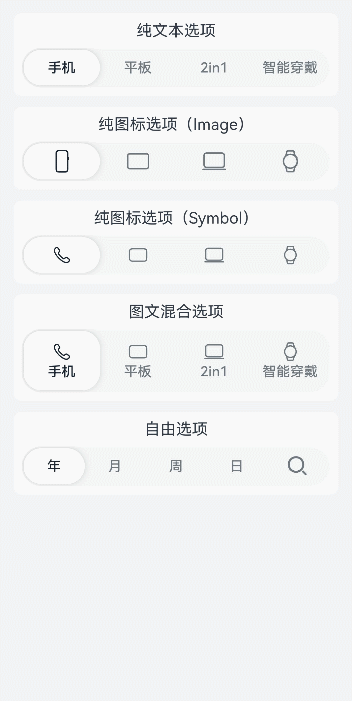
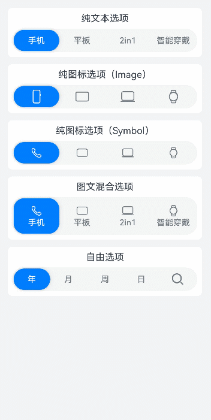
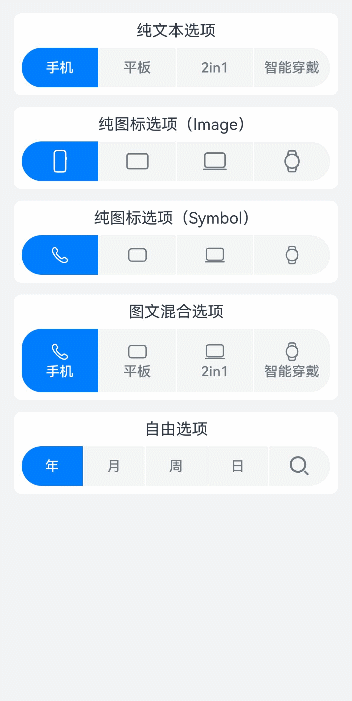

# SegmentButtonV2

分段按钮组件，创建页签型、单选或多选的胶囊型分段按钮。

> **说明：** 
>
> 该组件从 API version 18 开始支持。后续版本如有新增内容，则采用上角标单独标记该内容的起始版本。

## 导入模块

```
import { TabSegmentButtonV2, CapsuleSegmentButtonV2, MultiCapsuleSegmentButtonV2, SegmentButtonV2Items } from '@kit.ArkUI';
```

## 子组件

无

## TabSegmentButtonV2

```ts
TabSegmentButtonV2({
  items: SegmentButtonV2Items,
  selectedIndex: number,
  $selectedIndex?: OnSelectedIndexChange,
  onItemClicked?: Callback<number>,
  itemMinFontScale?: number | Resource,
  itemMaxFontScale?: number | Resource,
  itemSpace?: LengthMetrics,
  itemFontSize?: LengthMetrics,
  itemSelectedFontSize?: LengthMetrics,
  itemFontColor?: ColorMetrics,
  itemSelectedFontColor?: ColorMetrics,
  itemFontWeight?: FontWeight,
  itemSelectedFontWeight?: FontWeight,
  itemBorderRadius?: LengthMetrics,
  itemSelectedBackgroundColor?: ColorMetrics,
  itemIconSize?: SizeT<LengthMetrics>,
  itemIconFillColor?: ColorMetrics,
  itemSelectedIconFillColor?: ColorMetrics,
  itemSymbolFontSize?: LengthMetrics,
  itemSymbolFontColor?: ColorMetrics,
  itemSelectedSymbolFontColor?: ColorMetrics,
  itemMinHeight?: LengthMetrics,
  itemPadding?: LocalizedPadding,
  itemShadow?: ShadowOptions | ShadowStyle,
  buttonBackgroundColor?: ColorMetrics,
  buttonBackgroundBlurStyle?: BlurStyle,
  buttonBackgroundBlurStyleOptions?: BackgroundBlurStyleOptions,
  buttonBackgroundEffect?: BackgroundEffectOptions,
  buttonBorderRadius?: LengthMetrics, 
  buttonMinHeight?: LengthMetrics, 
  buttonPadding?: LengthMetrics, 
  languageDirection?: Direction 
})
```

**装饰器类型：** @ComponentV2

**原子化服务API：** 从 API version 18 开始，该接口支持在原子化服务中使用。

**系统能力：** SystemCapability.ArkUI.ArkUI.Full

| 名称                             | 类型                                                                                                                                           | 只读 | 可选 | 装饰器类型         | 说明                                                                                                                                                                                                                                                                                                     |
| -------------------------------- | ---------------------------------------------------------------------------------------------------------------------------------------------- | ---- | ---- | ------------------ | -------------------------------------------------------------------------------------------------------------------------------------------------------------------------------------------------------------------------------------------------------------------------------------------------------- |
| items                            | [SegmentButtonV2Items](#segmentbuttonv2items)                                                                                                  | 是   | 否   | @Require<br>@Param | 用于配置分段按钮的选项集合信息。                                                                                                                                                                                                                                                                         |
| selectedIndex                    | number                                                                                                                                         | 是   | 否   | @Require<br>@Param | 用于配置分段按钮被选中的选项下标。                                                                                                                                                                                                                                                                       |
| $selectedIndex                   | [OnSelectedIndexChange](#onselectedindexchange)                                                                                                | 否   | 是   | @Event             | 用于配置分段按钮选中项变更时触发的回调函数。                                                                                                                                                                                                                                                             |
| onItemClicked                    | Callback\<number>                                                                                                                              | 否   | 是   | @Event             | 用于配置分段按钮选项被点击时触发的回调函数。                                                                                                                                                                                                                                                             |
| buttonBackgroundColor            | [ColorMetrics](../js-apis-arkui-graphics.md#colormetrics12)                                                                                    | 是   | 是   | @Param             | 用于配置分段按钮背板颜色。<br>默认值：`$r('sys.color.segment_button_v2_tab_button_background')`                                                                                                                                                                                                          |
| buttonBackgroundBlurStyle        | [BlurStyle](ts-universal-attributes-background.md#blurstyle9)                                                                                  | 是   | 是   | @Param             | 用于配置分段按钮背板模糊材质。<br>默认值：undefined                                                                                                                                                                                                                                                                           |
| buttonBackgroundBlurStyleOptions | [BackgroundBlurStyleOptions](ts-universal-attributes-background.md#backgroundblurstyleoptions10对象说明)                                               | 是   | 是   | @Param             | 用于配置分段按钮背板模糊材质配置参数。<br>默认值：undefined                                                                                                                                                                                                                                                                   |
| buttonBackgroundEffect           | [BackgroundEffectOptions](ts-universal-attributes-background.md#backgroundeffectoptions11)                                                     | 是   | 是   | @Param             | 用于配置分段按钮背板模糊配置参数。<br>默认值：undefined                                                                                                                                                                                                                                                                   |
| buttonBorderRadius               | [LengthMetrics](../js-apis-arkui-graphics.md#lengthmetrics12)                                                                                  | 是   | 是   | @Param             | 用于配置分段按钮背板的圆角大小。<br>取值范围:[0, +∞) <br>默认值：`$r('sys.float.segment_button_v2_background_corner_radius')`                                                                                                                                                                            |
| buttonMinHeight                  | [LengthMetrics](../js-apis-arkui-graphics.md#lengthmetrics12)                                                                                  | 是   | 是   | @Param             | 用于配置分段按钮最小的高度。<br>取值范围:[0, +∞) <br>默认值：只有纯文本或者纯图标选项时：`$r('sys.float.segment_button_v2_singleline_background_height')`；有图文混合的选项时：`$r('sys.float.segment_button_v2_doubleline_background_height')`                                                          |
| buttonPadding                    | [LengthMetrics](../js-apis-arkui-graphics.md#lengthmetrics12)                                                                                  | 是   | 是   | @Param             | 用于配置分段按钮的内边距。<br>取值范围:[0, +∞)<br>默认值：`$r('sys.float.padding_level1')`                                                                                                                                                                                                               |
| itemSelectedBackgroundColor      | [ColorMetrics](../js-apis-arkui-graphics.md#colormetrics12)                                                                                    | 是   | 是   | @Param             | 用于配置分段按钮选中的选项背景颜色。<br>默认值：`$r('sys.color.segment_button_v2_tab_selected_item_background')`                                                                                                                                                                                         |
| itemMinHeight                    | [LengthMetrics](../js-apis-arkui-graphics.md#lengthmetrics12)                                                                                  | 是   | 是   | @Param             | 用于配置分段按钮选项的最小高度。<br>取值范围:[0, +∞)<br>默认值：<br>只有纯文本或者纯图标选项时：`$r('sys.float.segment_button_v2_singleline_selected_height')`；有图文混合的选项时：`$r('sys.float.segment_button_v2_doubleline_selected_height')`                                                       |
| itemPadding                      | [LocalizedPadding](ts-types.md#localizedpadding12)                                                                                             | 是   | 是   | @Param             | 用于配置分段按钮选项的内边距。<br> 默认值：`{ top: LengthMetrics.resource($r('sys.float.padding_level2')), bottom: LengthMetrics.resource($r('sys.float.padding_level2')), start: LengthMetrics.resource($r('sys.float.padding_level4')), end: LengthMetrics.resource($r('sys.float.padding_level4')) }` |
| itemShadow                       | [ShadowOptions](ts-universal-attributes-image-effect.md#shadowoptions对象说明) \| [ShadowStyle](ts-universal-attributes-image-effect.md#shadowstyle10枚举说明) | 是   | 是   | @Param             | 用于配置分段按钮选项的阴影。<br>默认值：ShadowStyle.OUTER_DEFAULT_XS                                                                                                                                                                                                                                     |
| itemSpace                        | [LengthMetrics](../js-apis-arkui-graphics.md#lengthmetrics12)                                                                                  | 是   | 是   | @Param             | 用于配置分段按钮选项之间的间隔。<br>取值范围:[0, +∞)<br>默认值：`LengthMetrics.vp(0)`<br>**说明：** <br>不支持设置百分比类型，异常值按默认值处理。                                                                                                                                                           |
| itemMinFontScale                 | number \| [Resource](ts-types.md#resource)                                                                                                     | 是   | 是   | @Param             | 用于配置分段按钮选项文字大小可以缩小到的最小字体大小缩放倍数。<br>取值范围：[0, 1]<br>默认值：0<br>**说明：** <br>设置的值小于 0 时，按值为 0 处理，设置的值大于 1，按值为 1 处理，异常值默认不生效。                                                                                                                 |
| itemMaxFontScale                 | number \| [Resource](ts-types.md#resource)                                                                                                     | 是   | 是   | @Param             | 用于配置分段按钮选项文字大小可以放大到的最大字体大小放大倍数。<br>取值范围：[1, 2]<br>默认值：1<br>**说明：** <br>设置的值小于 1 时，按值为 1 处理，设置的值大于 2，按值为 2 处理，异常值默认不生效。                                                                                                    |
| itemFontSize                     | [LengthMetrics](../js-apis-arkui-graphics.md#lengthmetrics12)                                                                                  | 是   | 是   | @Param             | 用于配置分段按钮非选中的选项字体大小。<br>取值范围:[0, +∞)<br>默认值：`14fp`<br>**说明：** <br>不支持设置百分比类型，异常值按默认值处理。                                                                                                                                                                                                                             |
| itemSelectedFontSize             | [LengthMetrics](../js-apis-arkui-graphics.md#lengthmetrics12)                                                                                  | 是   | 是   | @Param             | 用于配置分段按钮选中的选项字体大小。<br>取值范围:[0, +∞)<br>默认值：`14fp`<br>**说明：** <br>不支持设置百分比类型，异常值按默认值处理。                                                                                                                                                                                                                               |
| itemFontColor                    | [ColorMetrics](../js-apis-arkui-graphics.md#colormetrics12)                                                                                    | 是   | 是   | @Param             | 用于配置分段按钮非选中的选项字体颜色。<br>默认值：`$r('sys.color.font_secondary')`                                                                                                                                                                                                                       |
| itemSelectedFontColor            | [ColorMetrics](../js-apis-arkui-graphics.md#colormetrics12)                                                                                    | 是   | 是   | @Param             | 用于配置分段按钮选中的选项字体颜色。<br> 默认值：`$r('sys.color.font_primary')`                                                                                                                                                                                                                          |
| itemFontWeight                   | [FontWeight](ts-appendix-enums.md#fontweight)                                                                                                  | 是   | 是   | @Param             | 用于配置分段按钮非选中的选项字体字重。<br>默认值：FontWeight.Medium                                                                                                                                                                                                                                      |
| itemSelectedFontWeight           | [FontWeight](ts-appendix-enums.md#fontweight)                                                                                                  | 是   | 是   | @Param             | 用于配置分段按钮选中的选项字体字重。<br>默认值：FontWeight.Medium                                                                                                                                                                                                                                        |
| itemBorderRadius                 | [LengthMetrics](../js-apis-arkui-graphics.md#lengthmetrics12)                                                                                  | 是   | 是   | @Param             | 用于配置分段按钮选项的圆角大小。<br>取值范围:[0, +∞)<br> 默认值：`$r('sys.float.segment_button_v2_selected_corner_radius')`                                                                                                                                                                              |
| itemIconSize                     | [SizeT](../js-apis-arkui-graphics.md#sizett12)\<[LengthMetrics](../js-apis-arkui-graphics.md#lengthmetrics12)>                                 | 是   | 是   | @Param             | 用于配置分段按钮选项中 Image 类型图标大小。<br>取值范围:[0, +∞)<br> 默认值：`{ width: LengthMetrics.vp(24), height: LengthMetrics.vp(24) }`                                                                                                                                                              |
| itemIconFillColor                | [ColorMetrics](../js-apis-arkui-graphics.md#colormetrics12)                                                                                    | 是   | 是   | @Param             | 用于配置分段按钮非选中的选项图标颜色。<br> 默认值：`$r('sys.color.font_secondary')`                                                                                                                                                                                                                      |
| itemSelectedIconFillColor        | [ColorMetrics](../js-apis-arkui-graphics.md#colormetrics12)                                                                                    | 是   | 是   | @Param             | 用于配置分段按钮选中的选项图标颜色。<br>默认值：`$r('sys.color.font_primary')`                                                                                                                                                                                                                           |
| itemSymbolFontSize               | [LengthMetrics](../js-apis-arkui-graphics.md#lengthmetrics12)                                                                                  | 是   | 是   | @Param             | 用于配置分段按钮选项中HM Symbol类型图标大小。<br>取值范围：[0, +∞)<br>默认值：`20fp`<br>**说明：**<br>不支持设置百分比类型，异常值按默认值处理。                                                                                                                                                                                                                    |
| itemSymbolFontColor              | [ColorMetrics](../js-apis-arkui-graphics.md#colormetrics12)                                                                                    | 是   | 是   | @Param             | 用于配置分段按钮非选中的选项中HM Symbol类型图标颜色。<br>默认值：`$r('sys.color.font_secondary')`                                                                                                                                                                                                      |
| itemSelectedSymbolFontColor      | [ColorMetrics](../js-apis-arkui-graphics.md#colormetrics12)                                                                                    | 是   | 是   | @Param             | 用于配置分段按钮选中的选项中HM Symbol类型图标颜色。<br>默认值：`$r('sys.color.font_primary')`                                                                                                                                                                                                       |
| languageDirection                | [Direction](ts-appendix-enums.md#direction)                                                                                                    | 是   | 是   | @Param             | 用于配置分段按钮的布局方向。<br>默认值：Direction.Auto                                                                                                                                                                                                                                                   |

## CapsuleSegmentButtonV2

```ts
CapsuleSegmentButtonV2({
  items: SegmentButtonV2Items,
  selectedIndex: number,
  $selectedIndex?: OnSelectedIndexChange,
  onItemClicked?: Callback<number>,
  itemMinFontScale?: number | Resource,
  itemMaxFontScale?: number | Resource,
  itemSpace?: LengthMetrics,
  itemFontSize?: LengthMetrics,
  itemSelectedFontSize?: LengthMetrics,
  itemFontColor?: ColorMetrics,
  itemSelectedFontColor?: ColorMetrics,
  itemFontWeight?: FontWeight,
  itemSelectedFontWeight?: FontWeight,
  itemBorderRadius?: LengthMetrics,
  itemSelectedBackgroundColor?: ColorMetrics,
  itemIconSize?: SizeT<LengthMetrics>,
  itemIconFillColor?: ColorMetrics,
  itemSelectedIconFillColor?: ColorMetrics,
  itemSymbolFontSize?: LengthMetrics,
  itemSymbolFontColor?: ColorMetrics,
  itemSelectedSymbolFontColor?: ColorMetrics,
  itemMinHeight?: LengthMetrics,
  itemPadding?: LocalizedPadding,
  itemShadow?: ShadowOptions | ShadowStyle,
  buttonBackgroundColor?: ColorMetrics,
  buttonBackgroundBlurStyle?: BlurStyle,
  buttonBackgroundBlurStyleOptions?: BackgroundBlurStyleOptions,
  buttonBackgroundEffect?: BackgroundEffectOptions,
  buttonBorderRadius?: LengthMetrics,
  buttonMinHeight?: LengthMetrics,
  buttonPadding?: LengthMetrics,
  languageDirection?: Direction 
})
```

**装饰器类型：** @ComponentV2

**原子化服务API：** 从 API version 18 开始，该接口支持在原子化服务中使用。

**系统能力：** SystemCapability.ArkUI.ArkUI.Full

| 名称                             | 类型                                                                                                                                           | 只读 | 可选 | 装饰器类型         | 说明                                                                                                                                                                                                                                                                                                     |
| -------------------------------- | ---------------------------------------------------------------------------------------------------------------------------------------------- | ---- | ---- | ------------------ | -------------------------------------------------------------------------------------------------------------------------------------------------------------------------------------------------------------------------------------------------------------------------------------------------------- |
| items                            | [SegmentButtonV2Items](#segmentbuttonv2items)                                                                                                  | 是   | 否   | @Require<br>@Param | 用于配置分段按钮的选项集合信息。                                                                                                                                                                                                                                                                         |
| selectedIndex                    | number                                                                                                                                         | 是   | 否   | @Require<br>@Param | 用于配置分段按钮被选中的选项下标。                                                                                                                                                                                                                                                                       |
| $selectedIndex                   | [OnSelectedIndexChange](#onselectedindexchange)                                                                                                | 否   | 是   | @Event             | 用于配置分段按钮选中项变更时触发的回调函数。                                                                                                                                                                                                                                                             |
| onItemClicked                    | Callback\<number>                                                                                                                              | 否   | 是   | @Event             | 用于配置分段按钮选项被点击时触发的回调函数。                                                                                                                                                                                                                                                             |
| buttonBackgroundColor            | [ColorMetrics](../js-apis-arkui-graphics.md#colormetrics12)                                                                                    | 是   | 是   | @Param             | 用于配置分段按钮背板颜色。<br>默认值：`$r('sys.color.segment_button_v2_tab_button_background')`                                                                                                                                                                                                          |
| buttonBackgroundBlurStyle        | [BlurStyle](ts-universal-attributes-background.md#blurstyle9)                                                                                  | 是   | 是   | @Param             | 用于配置分段按钮背板模糊材质。<br>默认值：undefined                                                                                                                                                                                                                                                                           |
| buttonBackgroundBlurStyleOptions | [BackgroundBlurStyleOptions](ts-universal-attributes-background.md#backgroundblurstyleoptions10对象说明)                                               | 是   | 是   | @Param             | 用于配置分段按钮背板模糊材质配置参数。<br>默认值：undefined                                                                                                                                                                                                                                                                   |
| buttonBackgroundEffect           | [BackgroundEffectOptions](ts-universal-attributes-background.md#backgroundeffectoptions11)                                                     | 是   | 是   | @Param             | 用于配置分段按钮背板模糊配置参数。<br>默认值：undefined                                                                                                                                                                                                                                                                   |
| buttonBorderRadius               | [LengthMetrics](../js-apis-arkui-graphics.md#lengthmetrics12)                                                                                  | 是   | 是   | @Param             | 用于配置分段按钮背板的圆角大小。<br>取值范围:[0, +∞) <br>默认值：`$r('sys.float.segment_button_v2_background_corner_radius')`                                                                                                                                                                            |
| buttonMinHeight                  | [LengthMetrics](../js-apis-arkui-graphics.md#lengthmetrics12)                                                                                  | 是   | 是   | @Param             | 用于配置分段按钮最小的高度。<br>取值范围:[0, +∞) <br>默认值：只有纯文本或者纯图标选项时：`$r('sys.float.segment_button_v2_singleline_background_height')`；有图文混合的选项时：`$r('sys.float.segment_button_v2_doubleline_background_height')`                                                          |
| buttonPadding                    | [LengthMetrics](../js-apis-arkui-graphics.md#lengthmetrics12)                                                                                  | 是   | 是   | @Param             | 用于配置分段按钮的内边距。<br>取值范围:[0, +∞)<br>默认值：`$r('sys.float.padding_level1')`                                                                                                                                                                                                               |
| itemSelectedBackgroundColor      | [ColorMetrics](../js-apis-arkui-graphics.md#colormetrics12)                                                                                    | 是   | 是   | @Param             | 用于配置分段按钮选中的选项背景颜色。<br>默认值：`$r('sys.color.comp_background_emphasize')`                                                                                                                                                                                                              |
| itemMinHeight                    | [LengthMetrics](../js-apis-arkui-graphics.md#lengthmetrics12)                                                                                  | 是   | 是   | @Param             | 用于配置分段按钮选项的最小高度。<br>取值范围:[0, +∞)<br>默认值：<br>只有纯文本或者纯图标选项时：`$r('sys.float.segment_button_v2_singleline_selected_height')`；有图文混合的选项时：`$r('sys.float.segment_button_v2_doubleline_selected_height')`                                                       |
| itemPadding                      | [LocalizedPadding](ts-types.md#localizedpadding12)                                                                                             | 是   | 是   | @Param             | 用于配置分段按钮选项的内边距。<br> 默认值：`{ top: LengthMetrics.resource($r('sys.float.padding_level2')), bottom: LengthMetrics.resource($r('sys.float.padding_level2')), start: LengthMetrics.resource($r('sys.float.padding_level4')), end: LengthMetrics.resource($r('sys.float.padding_level4')) }` |
| itemShadow                       | [ShadowOptions](ts-universal-attributes-image-effect.md#shadowoptions对象说明) \| [ShadowStyle](ts-universal-attributes-image-effect.md#shadowstyle10枚举说明) | 是   | 是   | @Param             | 用于配置分段按钮选项的阴影。<br>默认值：ShadowStyle.OUTER_DEFAULT_XS                                                                                                                                                                                                                                     |
| itemSpace                        | [LengthMetrics](../js-apis-arkui-graphics.md#lengthmetrics12)                                                                                  | 是   | 是   | @Param             | 用于配置分段按钮选项之间的间隔。<br>取值范围:[0, +∞)<br>默认值：`LengthMetrics.vp(0)`<br>**说明：** <br>不支持设置百分比类型，异常值按默认值处理。                                                                                                                                                           |
| itemMinFontScale                 | number \| [Resource](ts-types.md#resource)                                                                                                     | 是   | 是   | @Param             | 用于配置分段按钮选项文字大小可以缩小到的最小字体大小缩放倍数。<br>取值范围：[0, 1]<br>默认值：0<br>**说明：** <br>设置的值小于 0 时，按值为 0 处理，设置的值大于 1，按值为 1 处理，异常值默认不生效。                                                                                                                 |
| itemMaxFontScale                 | number \| [Resource](ts-types.md#resource)                                                                                                     | 是   | 是   | @Param             | 用于配置分段按钮选项文字大小可以放大到的最大字体大小放大倍数。<br>取值范围：[1, 2]<br>默认值：1<br>**说明：** <br>设置的值小于 1 时，按值为 1 处理，设置的值大于 2，按值为 2 处理，异常值默认不生效。                                                                                                    |
| itemFontSize                     | [LengthMetrics](../js-apis-arkui-graphics.md#lengthmetrics12)                                                                                  | 是   | 是   | @Param             | 用于配置分段按钮非选中的选项字体大小。<br>取值范围:[0, +∞)<br>默认值：`14fp`<br>**说明：** <br>不支持设置百分比类型，异常值按默认值处理。                                                                                                                                                                                                                             |
| itemSelectedFontSize             | [LengthMetrics](../js-apis-arkui-graphics.md#lengthmetrics12)                                                                                  | 是   | 是   | @Param             | 用于配置分段按钮选中的选项字体大小。<br>取值范围:[0, +∞)<br>默认值：`14fp`<br>**说明：** <br>不支持设置百分比类型，异常值按默认值处理。                                                                                                                                                                                                                               |
| itemFontColor                    | [ColorMetrics](../js-apis-arkui-graphics.md#colormetrics12)                                                                                    | 是   | 是   | @Param             | 用于配置分段按钮非选中的选项字体颜色。<br>默认值：`$r('sys.color.font_secondary')`                                                                                                                                                                                                                       |
| itemSelectedFontColor            | [ColorMetrics](../js-apis-arkui-graphics.md#colormetrics12)                                                                                    | 是   | 是   | @Param             | 用于配置分段按钮选中的选项字体颜色。<br> 默认值：`$r('sys.color.font_on_primary')`                                                                                                                                                                                                                          |
| itemFontWeight                   | [FontWeight](ts-appendix-enums.md#fontweight)                                                                                                  | 是   | 是   | @Param             | 用于配置分段按钮非选中的选项字体字重。<br>默认值：FontWeight.Medium                                                                                                                                                                                                                                      |
| itemSelectedFontWeight           | [FontWeight](ts-appendix-enums.md#fontweight)                                                                                                  | 是   | 是   | @Param             | 用于配置分段按钮选中的选项字体字重。<br>默认值：FontWeight.Medium                                                                                                                                                                                                                                        |
| itemBorderRadius                 | [LengthMetrics](../js-apis-arkui-graphics.md#lengthmetrics12)                                                                                  | 是   | 是   | @Param             | 用于配置分段按钮选项的圆角大小。<br>取值范围:[0, +∞)<br> 默认值：`$r('sys.float.segment_button_v2_selected_corner_radius')`                                                                                                                                                                              |
| itemIconSize                     | [SizeT](../js-apis-arkui-graphics.md#sizett12)\<[LengthMetrics](../js-apis-arkui-graphics.md#lengthmetrics12)>                                 | 是   | 是   | @Param             | 用于配置分段按钮选项中 Image 类型图标大小。<br>取值范围:[0, +∞)<br> 默认值：`{ width: LengthMetrics.vp(24), height: LengthMetrics.vp(24) }`                                                                                                                                                              |
| itemIconFillColor                | [ColorMetrics](../js-apis-arkui-graphics.md#colormetrics12)                                                                                    | 是   | 是   | @Param             | 用于配置分段按钮非选中的选项图标颜色。<br> 默认值：`$r('sys.color.font_secondary')`                                                                                                                                                                                                                      |
| itemSelectedIconFillColor        | [ColorMetrics](../js-apis-arkui-graphics.md#colormetrics12)                                                                                    | 是   | 是   | @Param             | 用于配置分段按钮选中的选项图标颜色。<br>默认值：`$r('sys.color.font_on_primary')`                                                                                                                                                                                                                           |
| itemSymbolFontSize               | [LengthMetrics](../js-apis-arkui-graphics.md#lengthmetrics12)                                                                                  | 是   | 是   | @Param             | 用于配置分段按钮选项中HM Symbol类型图标大小。<br>取值范围：[0, +∞)<br>默认值：`20fp`<br>**说明：**<br>不支持设置百分比类型，异常值按默认值处理。                                                                                                                                                                                                                    |
| itemSymbolFontColor              | [ColorMetrics](../js-apis-arkui-graphics.md#colormetrics12)                                                                                    | 是   | 是   | @Param             | 用于配置分段按钮非选中的选项中HM Symbol类型图标颜色。<br>默认值：`$r('sys.color.font_secondary')`                                                                                                                                                                                                      |
| itemSelectedSymbolFontColor      | [ColorMetrics](../js-apis-arkui-graphics.md#colormetrics12)                                                                                    | 是   | 是   | @Param             | 用于配置分段按钮选中的选项中HM Symbol类型图标颜色。<br>默认值：`$r('sys.color.font_on_primary')`                                                                                                                                                                                                       |
| languageDirection                | [Direction](ts-appendix-enums.md#direction)                                                                                                    | 是   | 是   | @Param             | 用于配置分段按钮的布局方向。<br>默认值：Direction.Auto                                                                                                                                                                                                                                                   |

## MultiCapsuleSegmentButtonV2

```ts
MultiCapsuleSegmentButtonV2({
  items: SegmentButtonV2Items,
  selectedIndexes: number[],
  $selectedIndexes: OnSelectedIndexesChange,
  onItemClicked?: Callback<number>,
  itemMinFontScale?: number | Resource,
  itemMaxFontScale?: number | Resource,
  itemSpace?: LengthMetrics,
  itemFontColor?: ColorMetrics,
  itemSelectedFontColor?: ColorMetrics,
  itemFontSize?: LengthMetrics,
  itemSelectedFontSize?: LengthMetrics,
  itemFontWeight?: FontWeight,
  itemSelectedFontWeight?: FontWeight,
  itemBorderRadius?: LengthMetrics,
  itemBackgroundColor?: ColorMetrics,
  itemBackgroundEffect?: BackgroundEffectOptions,
  itemBackgroundBlurStyle?: BlurStyle,
  itemBackgroundBlurStyleOptions?: BackgroundBlurStyleOptions,
  itemSelectedBackgroundColor?: ColorMetrics,
  itemIconSize?: SizeT<LengthMetrics>,
  itemIconFillColor?: ColorMetrics,
  itemSelectedIconFillColor?: ColorMetrics,
  itemSymbolFontSize?: LengthMetrics,
  itemSymbolFontColor?: ColorMetrics,
  itemSelectedSymbolFontColor?: ColorMetrics,
  itemMinHeight?: LengthMetrics,
  itemPadding?: LocalizedPadding,
  languageDirection?: Direction
})
```

**装饰器类型：** @ComponentV2

**原子化服务API：** 从 API version 18 开始，该接口支持在原子化服务中使用。

**系统能力：** SystemCapability.ArkUI.ArkUI.Full

| 名称                           | 类型                                                                                                                                           | 只读 | 可选 | 装饰器类型         | 说明                                                                                                                                                                                                                                                                                                     |
| ------------------------------ | ---------------------------------------------------------------------------------------------------------------------------------------------- | ---- | ---- | ------------------ | -------------------------------------------------------------------------------------------------------------------------------------------------------------------------------------------------------------------------------------------------------------------------------------------------------- |
| items                          | [SegmentButtonV2Items](#segmentbuttonv2items)                                                                                                  | 是   | 否   | @Require<br>@Param | 用于配置分段按钮的选项集合信息。                                                                                                                                                                                                                                                                         |
| selectedIndexes                | number[]                                                                                                                                       | 是   | 否   | @Require<br>@Param | 用于配置分段按钮被选中的选项下标集合。                                                                                                                                                                                                                                                                   |
| $selectedIndexes               | [OnSelectedIndexesChange](#onselectedindexeschange)                                                                                            | 否   | 是   | @Event             | 用于配置分段按钮选中项变更时触发的回调函数。                                                                                                                                                                                                                                                             |
| onItemClicked                  | Callback\<number>                                                                                                                              | 否   | 是   | @Event             | 用于配置分段按钮选项被点击时触发的回调函数。                                                                                                                                                                                                                                                             |
| itemBackgroundColor            | [ColorMetrics](../js-apis-arkui-graphics.md#colormetrics12)                                                                                    | 是   | 是   | @Param             | 用于配置分段按钮非选中的选项背板颜色。<br>默认值：`$r('sys.color.segment_button_v2_multi_capsule_button_background')`                                                                                                                                                                                    |
| itemBackgroundEffect           | [BackgroundEffectOptions](ts-universal-attributes-background.md#backgroundeffectoptions11)                                                     | 是   | 是   | @Param             | 用于配置分段按钮非选中的选项背板效果。                                                                                                                                                                                                                                                                   |
| itemBackgroundBlurStyle        | [BlurStyle](ts-universal-attributes-background.md#blurstyle9)                                                                                  | 是   | 是   | @Param             | 用于配置分段按钮非选中的选项背板材质。                                                                                                                                                                                                                                                                   |
| itemBackgroundBlurStyleOptions | [BackgroundBlurStyleOptions](ts-universal-attributes-background.md#backgroundblurstyleoptions10对象说明)                                               | 是   | 是   | @Param             | 用于配置分段按钮非选中的选项背板材质配置参数。                                                                                                                                                                                                                                                           |
| itemSelectedBackgroundColor    | [ColorMetrics](../js-apis-arkui-graphics.md#colormetrics12)                                                                                    | 是   | 是   | @Param             | 用于配置分段按钮选中的选项背景颜色。<br>默认值：`$r('sys.color.comp_background_emphasize')`                                                                                                                                                                                                              |
| itemMinHeight                  | [LengthMetrics](../js-apis-arkui-graphics.md#lengthmetrics12)                                                                                  | 是   | 是   | @Param             | 用于配置分段按钮选项的最小高度。<br>取值范围:[0, +∞)<br>默认值：<br>只有纯文本或者纯图标选项时：`$r('sys.float.segment_button_v2_singleline_selected_height')`；有图文混合的选项时：`$r('sys.float.segment_button_v2_doubleline_selected_height')`                                                       |
| itemPadding                    | [LocalizedPadding](ts-types.md#localizedpadding12)                                                                                             | 是   | 是   | @Param             | 用于配置分段按钮选项的内边距。<br> 默认值：`{ top: LengthMetrics.resource($r('sys.float.padding_level2')), bottom: LengthMetrics.resource($r('sys.float.padding_level2')), start: LengthMetrics.resource($r('sys.float.padding_level4')), end: LengthMetrics.resource($r('sys.float.padding_level4')) }` |
| itemSpace                      | [LengthMetrics](../js-apis-arkui-graphics.md#lengthmetrics12)                                                                                  | 是   | 是   | @Param             | 用于配置分段按钮选项之间的间隔。<br>取值范围:[0, +∞)<br>默认值：`LengthMetrics.vp(1)`<br>**说明：** <br>不支持设置百分比类型，异常值按默认值处理。                                                                                                                                                           |
| itemMinFontScale               | number \| [Resource](ts-types.md#resource)                                                                                                     | 是   | 是   | @Param             | 用于配置分段按钮选项文字大小可以缩小到的最小字体大小缩放倍数。<br>取值范围：[0, 1]<br>默认值：0<br>**说明：** <br>设置的值小于 0 时，按值为 0 处理，设置的值大于 1，按值为 1 处理，异常值默认不生效。                                                                                                                 |
| itemMaxFontScale               | number \| [Resource](ts-types.md#resource)                                                                                                     | 是   | 是   | @Param             | 用于配置分段按钮选项文字大小可以放大到的最大字体大小放大倍数。<br>取值范围：[1, 2]<br>默认值：1<br>**说明：** <br>设置的值小于 1 时，按值为 1 处理，设置的值大于 2，按值为 2 处理，异常值默认不生效。                                                                                                    |
| itemSelectedFontSize           | [LengthMetrics](../js-apis-arkui-graphics.md#lengthmetrics12)                                                                                  | 是   | 是   | @Param             | 用于配置分段按钮选中的选项字体大小。<br>取值范围:[0, +∞)<br>默认值：`14fp`<br>**说明：** <br>不支持设置百分比类型，异常值按默认值处理。                                                                                                                                                                                                                               |
| itemFontColor                  | [ColorMetrics](../js-apis-arkui-graphics.md#colormetrics12)                                                                                    | 是   | 是   | @Param             | 用于配置分段按钮非选中的选项字体颜色。<br>默认值：`$r('sys.color.font_secondary')`                                                                                                                                                                                                                       |
| itemFontSize                   | [LengthMetrics](../js-apis-arkui-graphics.md#lengthmetrics12)                                                                                  | 是   | 是   | @Param             | 用于配置分段按钮非选中的选项字体大小。<br>取值范围:[0, +∞)<br>默认值：`14fp`<br>**说明：** <br>不支持设置百分比类型，异常值按默认值处理。                                                                                                                                                                                                                             |
| itemSelectedFontColor          | [ColorMetrics](../js-apis-arkui-graphics.md#colormetrics12)                                                                                    | 是   | 是   | @Param             | 用于配置分段按钮选中的选项字体颜色。<br> 默认值：`$r('sys.color.font_on_primary')`                                                                                                                                                                                                                       |
| itemFontWeight                 | [FontWeight](ts-appendix-enums.md#fontweight)                                                                                                  | 是   | 是   | @Param             | 用于配置分段按钮非选中的选项字体字重。<br>默认值：FontWeight.Medium                                                                                                                                                                                                                                      |
| itemSelectedFontWeight         | [FontWeight](ts-appendix-enums.md#fontweight)                                                                                                  | 是   | 是   | @Param             | 用于配置分段按钮选中的选项字体字重。<br>默认值：FontWeight.Medium                                                                                                                                                                                                                                        |
| itemBorderRadius               | [LengthMetrics](../js-apis-arkui-graphics.md#lengthmetrics12)                                                                                  | 是   | 是   | @Param             | 用于配置分段按钮选项的圆角大小。<br>取值范围:[0, +∞)<br> 默认值：`$r('sys.float.segment_button_v2_multi_corner_radius')`                                                                                                                                                                                 |
| itemIconSize                   | [SizeT](../js-apis-arkui-graphics.md#sizett12)\<[LengthMetrics](../js-apis-arkui-graphics.md#lengthmetrics12)>                                 | 是   | 是   | @Param             | 用于配置分段按钮选项中 Image 类型图标大小。<br>取值范围:[0, +∞)<br> 默认值：`{ width: LengthMetrics.vp(24), height: LengthMetrics.vp(24) }`                                                                                                                                                              |
| itemIconFillColor              | [ColorMetrics](../js-apis-arkui-graphics.md#colormetrics12)                                                                                    | 是   | 是   | @Param             | 用于配置分段按钮非选中的选项图标颜色。<br> 默认值：`$r('sys.color.font_secondary')`                                                                                                                                                                                                                      |
| itemSelectedIconFillColor      | [ColorMetrics](../js-apis-arkui-graphics.md#colormetrics12)                                                                                    | 是   | 是   | @Param             | 用于配置分段按钮选中的选项图标颜色。<br>默认值：`$r('sys.color.font_on_primary')`                                                                                                                                                                                                                        |
| itemSymbolFontSize             | [LengthMetrics](../js-apis-arkui-graphics.md#lengthmetrics12)                                                                                  | 是   | 是   | @Param             | 用于配置分段按钮选项中HM Symbol类型图标大小。<br>取值范围：[0, +∞)<br>默认值：`20fp`<br>**说明：**<br>不支持设置百分比类型，异常值按默认值处理。                                                                                                                                                                                                                    |
| itemSymbolFontColor            | [ColorMetrics](../js-apis-arkui-graphics.md#colormetrics12)                                                                                    | 是   | 是   | @Param             | 用于配置分段按钮非选中的选项中HM Symbol类型图标颜色。<br>默认值：`$r('sys.color.font_secondary')`                                                                                                                                                                                                      |
| itemSelectedSymbolFontColor    | [ColorMetrics](../js-apis-arkui-graphics.md#colormetrics12)                                                                                    | 是   | 是   | @Param             | 用于配置分段按钮选中的选项中HM Symbol类型图标颜色。<br>默认值：`$r('sys.color.font_on_primary')`                                                                                                                                                                                                       |
| languageDirection              | [Direction](ts-appendix-enums.md#direction)                                                                                                    | 是   | 是   | @Param             | 用于配置分段按钮的布局方向。<br>默认值：Direction.Auto                                                                                                                                                                                                                                                   |

## SegmentButtonV2Items

分段按钮选项集合。

继承自 Array\<[SegmentButtonV2Item](#segmentbuttonv2item)>

**装饰器类型：** @ObservedV2

**原子化服务API：** 从 API version 18 开始，该接口支持在原子化服务中使用。

**系统能力：** SystemCapability.ArkUI.ArkUI.Full

### constructor

constructor(items: SegmentButtonV2ItemOptions[])

构造函数。

**原子化服务API：** 从 API version 18 开始，该接口支持在原子化服务中使用。

**系统能力：** SystemCapability.ArkUI.ArkUI.Full

**参数：** 

| 参数名  | 类型                                                              | 必填 | 说明                       |
| ----- | ----------------------------------------------------------------- | ---- | -------------------------- |
| items | [SegmentButtonV2ItemOptions](#segmentbuttonv2itemoptions)[] | 是   | 分段按钮选项配置参数集合。 |

### hasHybrid

get hasHybrid():boolean

是否有图文混合选项。

**原子化服务API：** 从 API version 18 开始，该接口支持在原子化服务中使用。

**系统能力：** SystemCapability.ArkUI.ArkUI.Full

**返回值：** 

| 类型    | 说明                 |
| ------- | -------------------- |
| boolean | 是否有图文混合选项。<br>true：有图文混合选项；false：无图文混合选项。 |

## SegmentButtonV2Item

**装饰器类型：** @ObservedV2

**原子化服务API：** 从 API version 18 开始，该接口支持在原子化服务中使用。

**系统能力：** SystemCapability.ArkUI.ArkUI.Full

### 属性

**原子化服务API：** 从 API version 18 开始，该接口支持在原子化服务中使用。

**系统能力：** SystemCapability.ArkUI.ArkUI.Full

| 名称                     | 类型                                                                 | 必填 | 装饰器类型 | 说明                                            |
| ------------------------ | -------------------------------------------------------------------- | ------ | ---- | ----------------------------------------------- |
| text                     | [ResourceStr](ts-types.md#resourcestr)                               | 否 | @Trace   | 分段按钮选项文本。<br>默认值：undefined                              |
| icon                     | [ResourceStr](ts-types.md#resourcestr)                               | 否 | @Trace   | 分段按钮选项图片类型图标。<br>默认值：undefined                      |
| symbol                   | [Resource](ts-types.md#resource)                                     | 否 | @Trace   | 分段按钮选项HM Symbol类型图标。<br>默认值：undefined               |
| enabled                  | boolean                                                              | 是 | @Trace   | 分段按钮选项是否可用。<br>默认值：true。<br>true：分段按钮选项可用；false：分段按钮选项不可用。                          |
| textModifier             | [TextModifier](ts-universal-attributes-attribute-modifier.md)        | 否 | @Trace   | 分段按钮选项文本属性样式修改器。<br>默认值：undefined                |
| iconModifier             | [ImageModifier](ts-universal-attributes-attribute-modifier.md)       | 否 | @Trace   | 分段按钮选项图片类型图标属性样式修改器。<br>默认值：undefined        |
| symbolModifier           | [SymbolGlyphModifier](ts-universal-attributes-attribute-modifier.md) | 否 | @Trace   | 分段按钮选项HM Symbol类型图标属性样式修改器。<br>默认值：undefined |
| accessibilityText        | [ResourceStr](ts-types.md#resourcestr)                               | 否 | @Trace   | 分段按钮选项无障碍文本。<br>默认值：""                        |
| accessibilityDescription | [ResourceStr](ts-types.md#resourcestr)                               | 否 | @Trace   | 分段按钮选项无障碍说明。<br>默认值：""                        |
| accessibilityLevel       | string                                                               | 否 | @Trace   | 分段按钮选项[无障碍重要性](ts-universal-attributes-accessibility.md#accessibilitylevel)。<br/>默认值："auto"                      |

> **说明** 
>
> 1. 当`symbol` 与`icon` 同时配置时，`symbol`的显示优先级更高。
> 2. 当`symbol` 和`symbolModifier` 同时设置了HM Symbol资源，`symbolModifier`设置的资源显示优先级更高

### constructor

constructor(options: SegmentButtonV2ItemOptions)

构造函数。

**原子化服务API：** 从 API version 18 开始，该接口支持在原子化服务中使用。

**系统能力：** SystemCapability.ArkUI.ArkUI.Full

**参数：** 

| 参数名    | 类型                                                      | 必填 | 说明                   |
| ------- | --------------------------------------------------------- | ---- | ---------------------- |
| options | [SegmentButtonV2ItemOptions](#segmentbuttonv2itemoptions) | 是   | 分段按钮选项配置参数。 |

### isHybrid

get isHybrid():boolean

分段按钮选项是否同时配置了文本和图标。

**原子化服务API：** 从 API version 18 开始，该接口支持在原子化服务中使用。

**系统能力：** SystemCapability.ArkUI.ArkUI.Full

**返回值：** 

| 类型    | 说明                           |
| ------- | ------------------------------ |
| boolean | 选项是否同时配置了文本和图标。 |

## SegmentButtonV2ItemOptions

分段按钮选项配置参数。

**原子化服务API：** 从 API version 18 开始，该接口支持在原子化服务中使用。

**系统能力：** SystemCapability.ArkUI.ArkUI.Full

### 属性

| 名称                     | 类型                                                                 | 必填 | 说明                                            |
| ------------------------ | -------------------------------------------------------------------- | ---- | ----------------------------------------------- |
| text                     | [ResourceStr](ts-types.md#resourcestr)                               | 否   | 分段按钮选项文本。<br>默认值：undefined                              |
| icon                     | [ResourceStr](ts-types.md#resourcestr)                               | 否   | 分段按钮选项图片类型图标。<br>默认值：undefined                      |
| symbol                   | [Resource](ts-types.md#resource)                                     | 否   | 分段按钮选项HM Symbol类型图标。<br>默认值：undefined               |
| enabled                  | boolean                                                              | 否   | 分段按钮选项是否可用。<br>默认值：true。<br>true：分段按钮选项可用；false：分段按钮选项不可用。                          |
| textModifier             | [TextModifier](ts-universal-attributes-attribute-modifier.md)        | 否   | 分段按钮选项文本属性样式修改器。<br>默认值：undefined                |
| iconModifier             | [ImageModifier](ts-universal-attributes-attribute-modifier.md)       | 否   | 分段按钮选项图片类型图标属性样式修改器。<br>默认值：undefined        |
| symbolModifier           | [SymbolGlyphModifier](ts-universal-attributes-attribute-modifier.md) | 否   | 分段按钮选项HM Symbol类型图标属性样式修改器。<br>默认值：undefined |
| accessibilityText        | [ResourceStr](ts-types.md#resourcestr)                               | 否   | 分段按钮选项无障碍文本。<br>默认值：""                        |
| accessibilityDescription | [ResourceStr](ts-types.md#resourcestr)                               | 否   | 分段按钮选项无障碍说明。<br>默认值：""                        |
| accessibilityLevel       | string                                                               | 否   | 分段按钮选项[无障碍重要性](ts-universal-attributes-accessibility.md#accessibilitylevel)。<br/>默认值："auto"                      |

> **说明** 
>
> 1. 当`symbol` 与`icon` 同时配置时，`symbol`的显示优先级更高。
> 2. 当`symbol` 和`symbolModifier` 同时设置了HM Symbol资源，`symbolModifier`设置的资源显示优先级更高

## OnSelectedIndexChange

type OnSelectedIndexChange = (selectedIndex: number) => void

单选的分段按钮选中项变更时调用的回调函数的类型。

**原子化服务API：** 从 API version 18 开始，该接口支持在原子化服务中使用。

**系统能力：** SystemCapability.ArkUI.ArkUI.Full

**参数：** 

| 参数名        | 类型   | 必填 | 说明               |
| ------------- | ------ | ---- | ------------------ |
| selectedIndex | number | 是   | 分段按钮选项下标。 |

## OnSelectedIndexesChange

type OnSelectedIndexesChange = (selectedIndexes: number[]) => void

多选的分段按钮选中项变更时调用的回调函数的类型。

**原子化服务API：** 从 API version 18 开始，该接口支持在原子化服务中使用。

**系统能力：** SystemCapability.ArkUI.ArkUI.Full

**参数：** 

| 参数名          | 类型     | 必填 | 说明                   |
| --------------- | -------- | ---- | ---------------------- |
| selectedIndexes | number[] | 是   | 分段按钮选项下标集合。 |

## 示例

### 示例 1（页签型分段按钮）

此示例介绍页签型分段按钮的基本用法。

```ts
import { SegmentButtonV2Items, TabSegmentButtonV2 } from '@kit.ArkUI';

@Entry
@ComponentV2
struct TabSegmentButtonV2Example {
  @Local textItems: SegmentButtonV2Items = new SegmentButtonV2Items([
    { text: '手机' },
    { text: '平板' },
    { text: '2in1' },
    { text: '智能穿戴' },
  ]);
  @Local textSelectedIndex: number = 0;
  @Local imageItems: SegmentButtonV2Items = new SegmentButtonV2Items([
    { icon: $r('sys.media.ohos_ic_public_device_phone') },
    { icon: $r('sys.media.ohos_ic_public_device_pad') },
    { icon: $r('sys.media.ohos_ic_public_device_matebook') },
    { icon: $r('sys.media.ohos_ic_public_device_watch') },
  ]);
  @Local imageSelectedIndex: number = 0;
  @Local symbolItems: SegmentButtonV2Items = new SegmentButtonV2Items([
    { symbol: $r('sys.symbol.phone') },
    { symbol: $r('sys.symbol.pad') },
    { symbol: $r('sys.symbol.matebook') },
    { symbol: $r('sys.symbol.watch') },
  ]);
  @Local symbolSelectedIndex: number = 0;
  @Local hybridItems: SegmentButtonV2Items = new SegmentButtonV2Items([
    { text: '手机', symbol: $r('sys.symbol.phone') },
    { text: '平板', symbol: $r('sys.symbol.pad') },
    { text: '2in1', symbol: $r('sys.symbol.matebook') },
    { text: '智能穿戴', symbol: $r('sys.symbol.watch') },
  ]);
  @Local hybridSelectedIndex: number = 0;
  @Local freeItems: SegmentButtonV2Items = new SegmentButtonV2Items([
    { text: '年' },
    { text: '月' },
    { text: '周' },
    { text: '日' },
    { icon: $r('sys.media.ohos_ic_public_search_filled') },
  ]);
  @Local freeSelectedIndex: number = 0;

  build() {
    Scroll() {
      Column({ space: 12 }) {
        VCard({ title: '纯文本选项' }) {
          TabSegmentButtonV2({
            items: this.textItems,
            selectedIndex: this.textSelectedIndex!!,
          })
        }

        VCard({ title: '纯图标选项（Image）' }) {
          TabSegmentButtonV2({
            items: this.imageItems,
            selectedIndex: this.imageSelectedIndex!!,
          })
        }

        VCard({ title: '纯图标选项（Symbol）' }) {
          TabSegmentButtonV2({
            items: this.symbolItems,
            selectedIndex: this.symbolSelectedIndex!!,
          })
        }

        VCard({ title: '图文混合选项' }) {
          TabSegmentButtonV2({
            items: this.hybridItems,
            selectedIndex: this.hybridSelectedIndex!!,
          })
        }

        VCard({ title: '自由选项' }) {
          TabSegmentButtonV2({
            items: this.freeItems,
            selectedIndex: this.freeSelectedIndex!!,
          })
        }
      }
      .constraintSize({ minHeight: '100%' })
      .justifyContent(FlexAlign.Start)
      .padding(16)
    }
    .backgroundColor('#f1f3f5')
    .width('100%')
    .height('100%')
  }
}

@Builder
function Noop() {
}

@Component
export struct VCard {
  @Prop
  title: ResourceStr;
  @BuilderParam
  content: () => void = Noop;

  build() {
    Column({ space: 8 }) {
      if (this.title) {
        Text(this.title)
          .maxLines(1)
          .textOverflow({ overflow: TextOverflow.Ellipsis })
          .constraintSize({ maxWidth: '80%' })
      }
      this.content()
    }
    .backgroundColor(Color.White)
    .borderRadius(8)
    .padding(8)
    .width('100%')
  }
}
```



### 示例 2（单选的胶囊型分段按钮）

该示例介绍单选的胶囊型分段按钮的基本用法。

```ts
import { CapsuleSegmentButtonV2, SegmentButtonV2Items } from '@kit.ArkUI';

@Entry
@ComponentV2
struct CapsuleSegmentButtonV2Example {
  @Local textItems: SegmentButtonV2Items = new SegmentButtonV2Items([
    { text: '手机' },
    { text: '平板' },
    { text: '2in1' },
    { text: '智能穿戴' },
  ]);
  @Local textSelectedIndex: number = 0;
  @Local imageItems: SegmentButtonV2Items = new SegmentButtonV2Items([
    { icon: $r('sys.media.ohos_ic_public_device_phone') },
    { icon: $r('sys.media.ohos_ic_public_device_pad') },
    { icon: $r('sys.media.ohos_ic_public_device_matebook') },
    { icon: $r('sys.media.ohos_ic_public_device_watch') },
  ]);
  @Local imageSelectedIndex: number = 0;
  @Local symbolItems: SegmentButtonV2Items = new SegmentButtonV2Items([
    { symbol: $r('sys.symbol.phone') },
    { symbol: $r('sys.symbol.pad') },
    { symbol: $r('sys.symbol.matebook') },
    { symbol: $r('sys.symbol.watch') },
  ]);
  @Local symbolSelectedIndex: number = 0;
  @Local hybridItems: SegmentButtonV2Items = new SegmentButtonV2Items([
    { text: '手机', symbol: $r('sys.symbol.phone') },
    { text: '平板', symbol: $r('sys.symbol.pad') },
    { text: '2in1', symbol: $r('sys.symbol.matebook') },
    { text: '智能穿戴', symbol: $r('sys.symbol.watch') },
  ]);
  @Local hybridSelectedIndex: number = 0;
  @Local freeItems: SegmentButtonV2Items = new SegmentButtonV2Items([
    { text: '年' },
    { text: '月' },
    { text: '周' },
    { text: '日' },
    { icon: $r('sys.media.ohos_ic_public_search_filled') },
  ]);
  @Local freeSelectedIndex: number = 0;

  build() {
    Scroll() {
      Column({ space: 12 }) {
        VCard({ title: '纯文本选项' }) {
          CapsuleSegmentButtonV2({
            items: this.textItems,
            selectedIndex: this.textSelectedIndex!!,
          })
        }

        VCard({ title: '纯图标选项（Image）' }) {
          CapsuleSegmentButtonV2({
            items: this.imageItems,
            selectedIndex: this.imageSelectedIndex!!,
          })
        }

        VCard({ title: '纯图标选项（Symbol）' }) {
          CapsuleSegmentButtonV2({
            items: this.symbolItems,
            selectedIndex: this.symbolSelectedIndex!!,
          })
        }

        VCard({ title: '图文混合选项' }) {
          CapsuleSegmentButtonV2({
            items: this.hybridItems,
            selectedIndex: this.hybridSelectedIndex!!,
          })
        }

        VCard({ title: '自由选项' }) {
          CapsuleSegmentButtonV2({
            items: this.freeItems,
            selectedIndex: this.freeSelectedIndex!!,
          })
        }
      }
      .constraintSize({ minHeight: '100%' })
      .justifyContent(FlexAlign.Start)
      .padding(16)
    }
    .backgroundColor('#f1f3f5')
    .width('100%')
    .height('100%')
  }
}

@Builder
function Noop() {
}

@Component
export struct VCard {
  @Prop
  title: ResourceStr;
  @BuilderParam
  content: () => void = Noop;

  build() {
    Column({ space: 8 }) {
      if (this.title) {
        Text(this.title)
          .maxLines(1)
          .textOverflow({ overflow: TextOverflow.Ellipsis })
          .constraintSize({ maxWidth: '80%' })
      }
      this.content()
    }
    .backgroundColor(Color.White)
    .borderRadius(8)
    .padding(8)
    .width('100%')
  }
}

```



### 示例 3（多选的胶囊型分段按钮）

该示例介绍多选的胶囊型分段按钮的基本用法。

```ts
import { MultiCapsuleSegmentButtonV2, SegmentButtonV2Items } from '@kit.ArkUI';

@Entry
@ComponentV2
struct MultiCapsuleSegmentButtonV2Example {
  @Local textItems: SegmentButtonV2Items = new SegmentButtonV2Items([
    { text: '手机' },
    { text: '平板' },
    { text: '2in1' },
    { text: '智能穿戴' },
  ]);
  @Local textSelectedIndexes: number[] = [0];
  @Local imageItems: SegmentButtonV2Items = new SegmentButtonV2Items([
    { icon: $r('sys.media.ohos_ic_public_device_phone') },
    { icon: $r('sys.media.ohos_ic_public_device_pad') },
    { icon: $r('sys.media.ohos_ic_public_device_matebook') },
    { icon: $r('sys.media.ohos_ic_public_device_watch') },
  ]);
  @Local imageSelectedIndexes: number[] = [0];
  @Local symbolItems: SegmentButtonV2Items = new SegmentButtonV2Items([
    { symbol: $r('sys.symbol.phone') },
    { symbol: $r('sys.symbol.pad') },
    { symbol: $r('sys.symbol.matebook') },
    { symbol: $r('sys.symbol.watch') },
  ]);
  @Local symbolSelectedIndexes: number[] = [0];
  @Local hybridItems: SegmentButtonV2Items = new SegmentButtonV2Items([
    { text: '手机', symbol: $r('sys.symbol.phone') },
    { text: '平板', symbol: $r('sys.symbol.pad') },
    { text: '2in1', symbol: $r('sys.symbol.matebook') },
    { text: '智能穿戴', symbol: $r('sys.symbol.watch') },
  ]);
  @Local hybridSelectedIndexes: number[] = [0];
  @Local freeItems: SegmentButtonV2Items = new SegmentButtonV2Items([
    { text: '年' },
    { text: '月' },
    { text: '周' },
    { text: '日' },
    { icon: $r('sys.media.ohos_ic_public_search_filled') },
  ]);
  @Local freeSelectedIndexes: number[] = [0];

  build() {
    Scroll() {
      Column({ space: 12 }) {
        VCard({ title: '纯文本选项' }) {
          MultiCapsuleSegmentButtonV2({
            items: this.textItems,
            selectedIndexes: this.textSelectedIndexes!!,
          })
        }

        VCard({ title: '纯图标选项（Image）' }) {
          MultiCapsuleSegmentButtonV2({
            items: this.imageItems,
            selectedIndexes: this.imageSelectedIndexes!!,
          })
        }

        VCard({ title: '纯图标选项（Symbol）' }) {
          MultiCapsuleSegmentButtonV2({
            items: this.symbolItems,
            selectedIndexes: this.symbolSelectedIndexes!!,
          })
        }

        VCard({ title: '图文混合选项' }) {
          MultiCapsuleSegmentButtonV2({
            items: this.hybridItems,
            selectedIndexes: this.hybridSelectedIndexes!!,
          })
        }

        VCard({ title: '自由选项' }) {
          MultiCapsuleSegmentButtonV2({
            items: this.freeItems,
            selectedIndexes: this.freeSelectedIndexes!!,
          })
        }
      }
      .constraintSize({ minHeight: '100%' })
      .justifyContent(FlexAlign.Start)
      .padding(16)
    }
    .backgroundColor('#f1f3f5')
    .width('100%')
    .height('100%')
  }
}

@Builder
function Noop() {
}

@Component
export struct VCard {
  @Prop
  title: ResourceStr;
  @BuilderParam
  content: () => void = Noop;

  build() {
    Column({ space: 8 }) {
      if (this.title) {
        Text(this.title)
          .maxLines(1)
          .textOverflow({ overflow: TextOverflow.Ellipsis })
          .constraintSize({ maxWidth: '80%' })
      }
      this.content()
    }
    .backgroundColor(Color.White)
    .borderRadius(8)
    .padding(8)
    .width('100%')
  }
}

```


