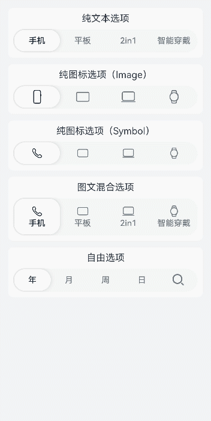
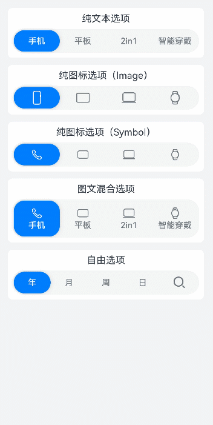
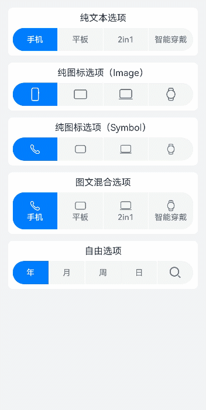
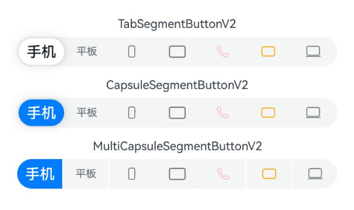

# SegmentButtonV2
<!--Kit: ArkUI-->
<!--Subsystem: ArkUI-->
<!--Owner: @song-song-song-->
<!--Designer: @fenglinbailu-->
<!--Tester: @weixin_45530366-->
<!--Adviser: @Brilliantry_Rui-->

分段按钮组件用于创建页签型、单选或多选的胶囊型分段按钮，支持文本、图标、Symbol等多种选项类型及图文混合配置，可自定义字体、颜色、圆角等样式。页签型分段按钮适用于页签切换场景，单选胶囊型分段按钮适用于单选切换场景，多选胶囊型分段按钮适用于多选筛选场景。

> **说明：** 
>
> - 该组件从API version 18开始支持。后续版本如有新增内容，则采用上角标单独标记该内容的起始版本。
>
> - 本模块接口仅可在Stage模型下使用。

## 导入模块

```ts
import { TabSegmentButtonV2, CapsuleSegmentButtonV2, MultiCapsuleSegmentButtonV2, SegmentButtonV2Items } from '@kit.ArkUI';
```

## 子组件

无

## 属性

不支持[通用属性](ts-component-general-attributes.md)。

## 事件

不支持[通用事件](ts-component-general-events.md)。

## TabSegmentButtonV2

```ts
TabSegmentButtonV2({
  items: SegmentButtonV2Items,
  selectedIndex: number,
  $selectedIndex?: OnSelectedIndexChange,
  onItemClicked?: Callback<number>,
  itemMinFontScale?: number | Resource,
  itemMaxFontScale?: number | Resource,
  itemSpace?: LengthMetrics,
  itemFontSize?: LengthMetrics,
  itemSelectedFontSize?: LengthMetrics,
  itemFontColor?: ColorMetrics,
  itemSelectedFontColor?: ColorMetrics,
  itemFontWeight?: FontWeight,
  itemSelectedFontWeight?: FontWeight,
  itemBorderRadius?: LengthMetrics,
  itemSelectedBackgroundColor?: ColorMetrics,
  itemIconSize?: SizeT<LengthMetrics>,
  itemIconFillColor?: ColorMetrics,
  itemSelectedIconFillColor?: ColorMetrics,
  itemSymbolFontSize?: LengthMetrics,
  itemSymbolFontColor?: ColorMetrics,
  itemSelectedSymbolFontColor?: ColorMetrics,
  itemMinHeight?: LengthMetrics,
  itemPadding?: LocalizedPadding,
  itemShadow?: ShadowOptions | ShadowStyle,
  buttonBackgroundColor?: ColorMetrics,
  buttonBackgroundBlurStyle?: BlurStyle,
  buttonBackgroundBlurStyleOptions?: BackgroundBlurStyleOptions,
  buttonBackgroundEffect?: BackgroundEffectOptions,
  buttonBorderRadius?: LengthMetrics, 
  buttonMinHeight?: LengthMetrics, 
  buttonPadding?: LengthMetrics, 
  languageDirection?: Direction,
  enableStateAnimation?: boolean,
  backgroundSystemMaterial?: uiMaterial.Material
})
```

**装饰器类型：** @ComponentV2

**系统能力：** SystemCapability.ArkUI.ArkUI.Full

**设备行为差异：** 该接口在Wearable设备上使用时，应用程序运行异常，异常信息中提示接口未定义，在其他设备中可正常调用。

| 名称                             | 类型                                                         | 必填 | 装饰器类型         | 说明                                                         |
| -------------------------------- | ------------------------------------------------------------ | ---- | ------------------ | ------------------------------------------------------------ |
| items                            | [SegmentButtonV2Items](#segmentbuttonv2items)                | 是   | @Require<br>@Param | 配置分段按钮的选项集合信息。<br>值为undefined时，不显示选项信息。<br>该成员只读，不支持更改。<br>**原子化服务API：** 从API version 18开始，该接口支持在原子化服务中使用。 |
| selectedIndex                   | number                                                       | 是   | @Require<br>@Param | 配置分段按钮被选中的选项下标，第一项的编号为0，之后顺序增加。<br>取值范围：[0, items长度-1]<br>值为undefined时，不选中任何选项。传入有效数值（包括0）时，选中对应下标的选项；传入数值大于items长度-1时，选中items长度-1项；传入数值小于0时，选中索引为0项。<br>该成员只读，不支持更改。<br>**原子化服务API：** 从API version 18开始，该接口支持在原子化服务中使用。 |
| $selectedIndex                   | [OnSelectedIndexChange](#onselectedindexchange)              | 否   | @Event             | 配置分段按钮选中项变更时触发的回调函数。<br>默认值：undefined，未设置时不触发回调。<br>**原子化服务API：** 从API version 18开始，该接口支持在原子化服务中使用。                     |
| onItemClicked                    | Callback\<number>                                            | 否   | @Event             | 配置分段按钮选项被单击时触发的回调函数。回调参数为number类型，表示被单击选项的下标，第一项编号为0，之后按顺序递增。<br>默认值：undefined，未设置时不触发回调。<br>**原子化服务API：** 从API version 18开始，该接口支持在原子化服务中使用。                     |
| buttonBackgroundColor            | [ColorMetrics](../js-apis-arkui-graphics.md#colormetrics12)  | 否   | @Param             | 配置分段按钮背板颜色。<br>默认值：`$r('sys.color.segment_button_v2_tab_button_background')`<br>值为undefined时，按默认值处理。<br>该成员只读，不支持更改。<br>**原子化服务API：** 从API version 18开始，该接口支持在原子化服务中使用。 |
| buttonBackgroundBlurStyle        | [BlurStyle](ts-universal-attributes-background.md#blurstyle9) | 否   | @Param             | 配置分段按钮背板模糊材质。<br>默认值：undefined<br>该成员只读，不支持更改。<br>**原子化服务API：** 从API version 18开始，该接口支持在原子化服务中使用。 |
| buttonBackgroundBlurStyleOptions | [BackgroundBlurStyleOptions](ts-universal-attributes-background.md#backgroundblurstyleoptions10对象说明) | 否   | @Param             | 配置分段按钮背板模糊材质配置参数。<br>默认值：undefined<br>该成员只读，不支持更改。<br>**原子化服务API：** 从API version 18开始，该接口支持在原子化服务中使用。 |
| buttonBackgroundEffect           | [BackgroundEffectOptions](ts-universal-attributes-background.md#backgroundeffectoptions11) | 否   | @Param             | 配置分段按钮背板效果配置参数。<br>默认值：undefined<br>该成员只读，不支持更改。<br>**原子化服务API：** 从API version 18开始，该接口支持在原子化服务中使用。 |
| buttonBorderRadius               | [LengthMetrics](../js-apis-arkui-graphics.md#lengthmetrics12) | 否   | @Param             | 配置分段按钮背板的圆角大小。<br>取值范围：[0, +∞) <br>默认值：`$r('sys.float.segment_button_v2_background_corner_radius')`<br>超出取值范围按默认值处理。<br>该成员只读，不支持更改。<br>**原子化服务API：** 从API version 18开始，该接口支持在原子化服务中使用。 |
| buttonMinHeight                  | [LengthMetrics](../js-apis-arkui-graphics.md#lengthmetrics12) | 否   | @Param             | 配置分段按钮最小高度。<br>取值范围：[0, +∞) <br>默认值：只有纯文本或者纯图标选项时：`$r('sys.float.segment_button_v2_singleline_background_height')`；有图文混合的选项时：`$r('sys.float.segment_button_v2_doubleline_background_height')`<br>超出取值范围按默认值处理。<br>该成员只读，不支持更改。<br>**原子化服务API：** 从API version 18开始，该接口支持在原子化服务中使用。 |
| buttonPadding                    | [LengthMetrics](../js-apis-arkui-graphics.md#lengthmetrics12) | 否   | @Param             | 配置分段按钮内边距。<br>取值范围：[0, +∞)<br>默认值：`$r('sys.float.padding_level1')`<br>超出取值范围按默认值处理。<br>该成员只读，不支持更改。<br>**原子化服务API：** 从API version 18开始，该接口支持在原子化服务中使用。 |
| itemSelectedBackgroundColor      | [ColorMetrics](../js-apis-arkui-graphics.md#colormetrics12)  | 否   | @Param             | 配置分段按钮选中的选项背景颜色。<br>默认值：`$r('sys.color.segment_button_v2_tab_selected_item_background')`<br>值为undefined时，按默认值处理。<br>该成员只读，不支持更改。<br>**原子化服务API：** 从API version 18开始，该接口支持在原子化服务中使用。 |
| itemMinHeight                    | [LengthMetrics](../js-apis-arkui-graphics.md#lengthmetrics12) | 否   | @Param             | 配置分段按钮选项最小高度。<br>取值范围：[0, +∞)<br>默认值：<br>只有纯文本或者纯图标选项时：`$r('sys.float.segment_button_v2_singleline_selected_height')`；有图文混合的选项时：`$r('sys.float.segment_button_v2_doubleline_selected_height')`<br>超出取值范围按默认值处理。<br>该成员只读，不支持更改。<br>**原子化服务API：** 从API version 18开始，该接口支持在原子化服务中使用。 |
| itemPadding                      | [LocalizedPadding](ts-types.md#localizedpadding12)           | 否   | @Param             | 配置分段按钮选项内边距。<br> 默认值：`{ top: LengthMetrics.resource($r('sys.float.padding_level2')), bottom: LengthMetrics.resource($r('sys.float.padding_level2')), start: LengthMetrics.resource($r('sys.float.padding_level4')), end: LengthMetrics.resource($r('sys.float.padding_level4')) }`<br>值为undefined时，按默认值处理。<br>该成员只读，不支持更改。<br>**原子化服务API：** 从API version 18开始，该接口支持在原子化服务中使用。 |
| itemShadow                       | [ShadowOptions](ts-universal-attributes-image-effect.md#shadowoptions对象说明) \| [ShadowStyle](ts-universal-attributes-image-effect.md#shadowstyle10枚举说明) | 否   | @Param             | 配置分段按钮选项阴影。<br>默认值：ShadowStyle.OUTER_DEFAULT_XS<br>超出取值范围按默认值处理。<br>该成员只读，不支持更改。<br>**原子化服务API：** 从API version 18开始，该接口支持在原子化服务中使用。 |
| itemSpace                        | [LengthMetrics](../js-apis-arkui-graphics.md#lengthmetrics12) | 否   | @Param             | 配置分段按钮选项之间的间隔。<br>取值范围：[0, +∞)<br>默认值：`LengthMetrics.vp(0)`<br>**说明：** <br>不支持设置百分比类型，异常值按默认值处理。<br>该成员只读，不支持更改。<br>**原子化服务API：** 从API version 18开始，该接口支持在原子化服务中使用。 |
| itemMinFontScale                 | number \| [Resource](ts-types.md#resource)                   | 否   | @Param             | 配置分段按钮选项文字大小的最小字体缩放倍数。<br>取值范围：[0, 1]<br>默认值：0<br>**说明：** <br>设置的最小字体缩放值小于0时，按值为0处理，设置的最小字体缩放值大于1时，按值为1处理，异常值默认不生效。<br>该成员只读，不支持更改。<br>**原子化服务API：** 从API version 18开始，该接口支持在原子化服务中使用。 |
| itemMaxFontScale                 | number \| [Resource](ts-types.md#resource)                   | 否   | @Param             | 配置分段按钮选项文字大小的最大字体缩放倍数。<br>取值范围：[1, 2]<br>默认值：1<br>**说明：** <br>设置的值小于1时，按值为1处理；设置的值大于2时，按值为2处理；异常值默认不生效。<br>该成员只读，不支持更改。<br>**原子化服务API：** 从API version 18开始，该接口支持在原子化服务中使用。 |
| itemFontSize                     | [LengthMetrics](../js-apis-arkui-graphics.md#lengthmetrics12) | 否   | @Param             | 配置分段按钮非选中的选项字体大小。<br>取值范围：[0, +∞)<br>默认值：`14fp`<br>**说明：** <br>不支持设置百分比类型，异常值按默认值处理。<br>items设置textModifier/fontSize属性值时，itemFontSize不生效。<br>该成员只读，不支持更改。<br>**原子化服务API：** 从API version 18开始，该接口支持在原子化服务中使用。 |
| itemSelectedFontSize             | [LengthMetrics](../js-apis-arkui-graphics.md#lengthmetrics12) | 否   | @Param             | 配置分段按钮选中的选项字体大小。<br>取值范围：[0, +∞)<br>默认值：`14fp`<br>**说明：** <br>不支持设置百分比类型，异常值按默认值处理。<br>items设置textModifier/fontSize属性值时，itemSelectedFontSize不生效。<br>该成员只读，不支持更改。<br>**原子化服务API：** 从API version 18开始，该接口支持在原子化服务中使用。 |
| itemFontColor                    | [ColorMetrics](../js-apis-arkui-graphics.md#colormetrics12)  | 否   | @Param             | 配置分段按钮非选中选项的字体颜色。<br>默认值：`$r('sys.color.font_secondary')`<br>值为undefined时，按默认值处理。<br>**说明：**<br>items设置textModifier/fontColor属性值时，itemFontColor不生效。<br>backgroundSystemMaterial设置自动反色的系统材质时，该属性使用支持反色的特殊系统资源，颜色自动适配到材质背景色的反色。<br>该成员只读，不支持更改。<br>**原子化服务API：** 从API version 18开始，该接口支持在原子化服务中使用。 |
| itemSelectedFontColor            | [ColorMetrics](../js-apis-arkui-graphics.md#colormetrics12)  | 否   | @Param             | 配置分段按钮选中项的字体颜色。<br>默认值：`$r('sys.color.font_primary')`<br>值为undefined时，按默认值处理。<br>**说明：**<br>items设置textModifier/fontColor属性值时，itemSelectedFontColor不生效。<br>backgroundSystemMaterial设置自动反色的系统材质时，该属性使用支持反色的特殊系统资源，颜色自动适配到材质背景色的反色。<br>该成员只读，不支持更改。<br>**原子化服务API：** 从API version 18开始，该接口支持在原子化服务中使用。 |
| itemFontWeight                   | [FontWeight](ts-appendix-enums.md#fontweight)                | 否   | @Param             | 配置分段按钮非选中选项的字体字重。<br>默认值：FontWeight.Medium<br>超出取值范围按默认值处理。<br>**说明：**<br>items设置textModifier/fontWeight属性值时，itemFontWeight不生效。<br>该成员只读，不支持更改。<br>**原子化服务API：** 从API version 18开始，该接口支持在原子化服务中使用。 |
| itemSelectedFontWeight           | [FontWeight](ts-appendix-enums.md#fontweight)                | 否   | @Param             | 配置分段按钮选中项的字体字重。<br>默认值：FontWeight.Medium<br>超出取值范围按默认值处理。<br>**说明：**<br>items设置textModifier/fontWeight属性值时，itemSelectedFontWeight不生效。<br>该成员只读，不支持更改。<br>**原子化服务API：** 从API version 18开始，该接口支持在原子化服务中使用。 |
| itemBorderRadius                 | [LengthMetrics](../js-apis-arkui-graphics.md#lengthmetrics12) | 否   | @Param             | 配置分段按钮选项的圆角大小。<br>取值范围：[0, +∞)<br>默认值：`$r('sys.float.segment_button_v2_selected_corner_radius')`<br>超出取值范围按默认值处理。<br>该成员只读，不支持更改。<br>**原子化服务API：** 从API version 18开始，该接口支持在原子化服务中使用。 |
| itemIconSize                     | [SizeT](../js-apis-arkui-graphics.md#sizett12)\<[LengthMetrics](../js-apis-arkui-graphics.md#lengthmetrics12)> | 否   | @Param             | 配置分段按钮选项中Image类型的图标大小。<br>取值范围：[0, +∞)<br>默认值：`{ width: LengthMetrics.vp(24), height: LengthMetrics.vp(24) }`<br>超出取值范围按默认值处理。<br>**说明：**<br>items设置iconModifier/width、height属性值时，itemIconSize不生效。<br>该成员只读，不支持更改。<br>**原子化服务API：** 从API version 18开始，该接口支持在原子化服务中使用。 |
| itemIconFillColor                | [ColorMetrics](../js-apis-arkui-graphics.md#colormetrics12)  | 否   | @Param             | 配置分段按钮非选中的选项图标颜色。<br>默认值：`$r('sys.color.font_secondary')`<br>值为undefined时，按默认值处理。<br>**说明：**<br>items设置iconModifier/fillColor属性值时，itemIconFillColor不生效。<br>backgroundSystemMaterial设置自动反色的系统材质时，该属性使用支持反色的特殊系统资源，颜色自动适配到材质背景色的反色。<br>该成员只读，不支持更改。<br>**原子化服务API：** 从API version 18开始，该接口支持在原子化服务中使用。 |
| itemSelectedIconFillColor        | [ColorMetrics](../js-apis-arkui-graphics.md#colormetrics12)  | 否   | @Param             | 配置分段按钮选中的选项图标颜色。<br>默认值：`$r('sys.color.font_primary')`<br>值为undefined时，按默认值处理。<br>**说明：**<br>items设置iconModifier/fillColor属性值时，itemSelectedIconFillColor不生效。<br>backgroundSystemMaterial设置自动反色的系统材质时，该属性使用支持反色的特殊系统资源，颜色自动适配到材质背景色的反色。<br>该成员只读，不支持更改。<br>**原子化服务API：** 从API version 18开始，该接口支持在原子化服务中使用。 |
| itemSymbolFontSize               | [LengthMetrics](../js-apis-arkui-graphics.md#lengthmetrics12) | 否   | @Param             | 配置分段按钮选项中HM Symbol类型图标大小。<br>取值范围：[0, +∞)<br>默认值：`20fp`<br>**说明：**<br>不支持设置百分比类型，异常值按默认值处理。<br>items设置symbolModifier/fontSize属性值时，itemSymbolFontSize不生效。<br>该成员只读，不支持更改。<br>**原子化服务API：** 从API version 18开始，该接口支持在原子化服务中使用。 |
| itemSymbolFontColor              | [ColorMetrics](../js-apis-arkui-graphics.md#colormetrics12)  | 否   | @Param             | 配置分段按钮非选中选项HM Symbol类型图标的颜色。<br>默认值：`$r('sys.color.font_secondary')`<br>值为undefined时，按默认值处理。<br>**说明：**<br>items设置symbolModifier/fontColor属性值时，itemSymbolFontColor不生效。<br>backgroundSystemMaterial设置自动反色的系统材质时，该属性使用支持反色的特殊系统资源，颜色自动适配到材质背景色的反色。<br>该成员只读，不支持更改。<br>**原子化服务API：** 从API version 18开始，该接口支持在原子化服务中使用。 |
| itemSelectedSymbolFontColor      | [ColorMetrics](../js-apis-arkui-graphics.md#colormetrics12)  | 否   | @Param             | 配置分段按钮选中选项的HM Symbol类型图标颜色。<br>默认值：`$r('sys.color.font_primary')`<br>值为undefined时，按默认值处理。<br>**说明：**<br>items设置symbolModifier/fontColor属性值时，itemSelectedSymbolFontColor不生效。<br>backgroundSystemMaterial设置自动反色的系统材质时，该属性使用支持反色的特殊系统资源，颜色自动适配到材质背景色的反色。<br>该成员只读，不支持更改。<br>**原子化服务API：** 从API version 18开始，该接口支持在原子化服务中使用。 |
| languageDirection                | [Direction](ts-appendix-enums.md#direction)                  | 否   | @Param             | 配置分段按钮的布局方向。<br>默认值：Direction.Auto<br>超出取值范围按默认值处理。<br>该成员只读，不支持更改。<br>**原子化服务API：** 从API version 18开始，该接口支持在原子化服务中使用。 |
| enableStateAnimation<sup>24+</sup>             | boolean                                                      | 否   | @Param             | 设置当通过变量修改selectedIndex值时，是否开启分段按钮的属性动画。<br>true表示开启分段按钮的属性动画；未配置该属性或值为false时表示不开启分段按钮的属性动画，使用组件默认的切换动画效果。<br>默认值：false<br>该成员只读，不支持更改。<br>**原子化服务API：** 从API version 24开始，该接口支持在原子化服务中使用。<br>**模型约束：** 此接口仅可在Stage模型下使用。 |
| backgroundSystemMaterial | [uiMaterial.Material](../arkts-apis-uimaterial.md#material)    | 否 | @Param | 分段按钮组件的背景板的系统材质。不同系统材质包含不同的属性影响效果。传入材质后，SegmentButtonV2的动效发生改变。<br>分段按钮在新材质场景下新增支持选中背板跟手拖拽能力，在拖拽结束时，更新分段按钮被选中的选项下标。<br>默认值：无材质效果。 <br>该成员只读，不支持更改。<br>**起始版本：** 26.0.0 <br>**原子化服务API：** 从API版本26.0.0开始，该接口支持在原子化服务中使用。 <br>**模型约束：** 此接口仅可在Stage模型下使用。|

> **说明：**
>
> 从API版本26.0.0开始，backgroundSystemMaterial设置自动反色的系统材质时，itemFontColor、itemSelectedFontColor、itemIconFillColor、itemSelectedIconFillColor、itemSymbolFontColor、itemSelectedSymbolFontColor使用支持反色的特殊系统资源，颜色自动适配到材质背景色的反色。

## CapsuleSegmentButtonV2

```ts
CapsuleSegmentButtonV2({
  items: SegmentButtonV2Items,
  selectedIndex: number,
  $selectedIndex?: OnSelectedIndexChange,
  onItemClicked?: Callback<number>,
  itemMinFontScale?: number | Resource,
  itemMaxFontScale?: number | Resource,
  itemSpace?: LengthMetrics,
  itemFontSize?: LengthMetrics,
  itemSelectedFontSize?: LengthMetrics,
  itemFontColor?: ColorMetrics,
  itemSelectedFontColor?: ColorMetrics,
  itemFontWeight?: FontWeight,
  itemSelectedFontWeight?: FontWeight,
  itemBorderRadius?: LengthMetrics,
  itemSelectedBackgroundColor?: ColorMetrics,
  itemIconSize?: SizeT<LengthMetrics>,
  itemIconFillColor?: ColorMetrics,
  itemSelectedIconFillColor?: ColorMetrics,
  itemSymbolFontSize?: LengthMetrics,
  itemSymbolFontColor?: ColorMetrics,
  itemSelectedSymbolFontColor?: ColorMetrics,
  itemMinHeight?: LengthMetrics,
  itemPadding?: LocalizedPadding,
  itemShadow?: ShadowOptions | ShadowStyle,
  buttonBackgroundColor?: ColorMetrics,
  buttonBackgroundBlurStyle?: BlurStyle,
  buttonBackgroundBlurStyleOptions?: BackgroundBlurStyleOptions,
  buttonBackgroundEffect?: BackgroundEffectOptions,
  buttonBorderRadius?: LengthMetrics,
  buttonMinHeight?: LengthMetrics,
  buttonPadding?: LengthMetrics,
  languageDirection?: Direction,
  enableStateAnimation?: boolean,
  backgroundSystemMaterial?: uiMaterial.Material
})
```

**装饰器类型：** @ComponentV2

**系统能力：** SystemCapability.ArkUI.ArkUI.Full

**设备行为差异：** 该接口在Wearable设备上使用时，应用程序运行异常，异常信息中提示接口未定义，在其他设备中可正常调用。

| 名称                             | 类型                                                         | 必填 | 装饰器类型         | 说明                                                         |
| -------------------------------- | ------------------------------------------------------------ | ---- | ------------------ | ------------------------------------------------------------ |
| items                            | [SegmentButtonV2Items](#segmentbuttonv2items)                | 是   | @Require<br>@Param | 配置分段按钮的选项集合信息。<br>值为undefined时，不显示选项信息。<br>该成员只读，不支持更改。<br>**原子化服务API：** 从API version 18开始，该接口支持在原子化服务中使用。 |
| selectedIndex                    | number                                                       | 是   | @Require<br>@Param | 配置分段按钮被选中的选项下标，第一项的编号为0，之后顺序增加。<br>取值范围：[0, items长度-1]<br>值为undefined时，不选中任何选项。传入有效数值（包括0）时，选中对应下标的选项；传入数值大于items长度-1时，选中items长度-1项；传入数值小于0时，选中索引为0项。<br>该成员只读，不支持更改。<br>**原子化服务API：** 从API version 18开始，该接口支持在原子化服务中使用。 |
| $selectedIndex                   | [OnSelectedIndexChange](#onselectedindexchange)              | 否   | @Event             | 配置分段按钮选中项变更时触发的回调函数。<br>默认值：undefined，未设置时不触发回调。<br>**原子化服务API：** 从API version 18开始，该接口支持在原子化服务中使用。                         |
| onItemClicked                    | Callback\<number>                                            | 否   | @Event             | 配置分段按钮选项被单击时触发的回调函数。回调参数为number类型，表示被单击选项的下标，第一项编号为0，之后按顺序递增。<br>默认值：undefined，未设置时不触发回调。<br>**原子化服务API：** 从API version 18开始，该接口支持在原子化服务中使用。                     |
| buttonBackgroundColor            | [ColorMetrics](../js-apis-arkui-graphics.md#colormetrics12)  | 否   | @Param             | 配置分段按钮背板颜色。<br>默认值：`$r('sys.color.segment_button_v2_tab_button_background')`<br>值为undefined时，按默认值处理。<br>该成员只读，不支持更改。<br>**原子化服务API：** 从API version 18开始，该接口支持在原子化服务中使用。 |
| buttonBackgroundBlurStyle        | [BlurStyle](ts-universal-attributes-background.md#blurstyle9) | 否   | @Param             | 配置分段按钮背板模糊材质。<br>默认值：undefined<br>该成员只读，不支持更改。<br>**原子化服务API：** 从API version 18开始，该接口支持在原子化服务中使用。 |
| buttonBackgroundBlurStyleOptions | [BackgroundBlurStyleOptions](ts-universal-attributes-background.md#backgroundblurstyleoptions10对象说明) | 否   | @Param             | 配置分段按钮背板模糊材质配置参数。<br>默认值：undefined<br>该成员只读，不支持更改。<br>**原子化服务API：** 从API version 18开始，该接口支持在原子化服务中使用。 |
| buttonBackgroundEffect           | [BackgroundEffectOptions](ts-universal-attributes-background.md#backgroundeffectoptions11) | 否   | @Param             | 配置分段按钮背板效果配置参数。<br>默认值：undefined<br>该成员只读，不支持更改。<br>**原子化服务API：** 从API version 18开始，该接口支持在原子化服务中使用。 |
| buttonBorderRadius               | [LengthMetrics](../js-apis-arkui-graphics.md#lengthmetrics12) | 否   | @Param             | 配置分段按钮背板的圆角大小。<br>取值范围：[0, +∞) <br>默认值：`$r('sys.float.segment_button_v2_background_corner_radius')`<br>超出取值范围按默认值处理。<br>该成员只读，不支持更改。<br>**原子化服务API：** 从API version 18开始，该接口支持在原子化服务中使用。 |
| buttonMinHeight                  | [LengthMetrics](../js-apis-arkui-graphics.md#lengthmetrics12) | 否   | @Param             | 配置分段按钮最小的高度。<br>取值范围：[0, +∞) <br>默认值：只有纯文本或者纯图标选项时：`$r('sys.float.segment_button_v2_singleline_background_height')`；有图文混合的选项时：`$r('sys.float.segment_button_v2_doubleline_background_height')`<br>超出取值范围按默认值处理。<br>该成员只读，不支持更改。<br>**原子化服务API：** 从API version 18开始，该接口支持在原子化服务中使用。 |
| buttonPadding                    | [LengthMetrics](../js-apis-arkui-graphics.md#lengthmetrics12) | 否   | @Param             | 配置分段按钮的内边距。<br>取值范围：[0, +∞)<br>默认值：`$r('sys.float.padding_level1')`<br>超出取值范围按默认值处理。<br>该成员只读，不支持更改。<br>**原子化服务API：** 从API version 18开始，该接口支持在原子化服务中使用。 |
| itemSelectedBackgroundColor      | [ColorMetrics](../js-apis-arkui-graphics.md#colormetrics12)  | 否   | @Param             | 配置分段按钮选中的选项背景颜色。<br>默认值：`$r('sys.color.comp_background_emphasize')`<br>值为undefined时，按默认值处理。<br>该成员只读，不支持更改。<br>**原子化服务API：** 从API version 18开始，该接口支持在原子化服务中使用。 |
| itemMinHeight                    | [LengthMetrics](../js-apis-arkui-graphics.md#lengthmetrics12) | 否   | @Param             | 配置分段按钮选项的最小高度。<br>取值范围：[0, +∞)<br>默认值：<br>只有纯文本或者纯图标选项时：`$r('sys.float.segment_button_v2_singleline_selected_height')`；有图文混合的选项时：`$r('sys.float.segment_button_v2_doubleline_selected_height')`<br>超出取值范围按默认值处理。<br>该成员只读，不支持更改。<br>**原子化服务API：** 从API version 18开始，该接口支持在原子化服务中使用。 |
| itemPadding                      | [LocalizedPadding](ts-types.md#localizedpadding12)           | 否   | @Param             | 配置分段按钮选项的内边距。<br>默认值：`{ top: LengthMetrics.resource($r('sys.float.padding_level2')), bottom: LengthMetrics.resource($r('sys.float.padding_level2')), start: LengthMetrics.resource($r('sys.float.padding_level4')), end: LengthMetrics.resource($r('sys.float.padding_level4')) }`<br>值为undefined时，按默认值处理。<br>该成员只读，不支持更改。<br>**原子化服务API：** 从API version 18开始，该接口支持在原子化服务中使用。 |
| itemShadow                       | [ShadowOptions](ts-universal-attributes-image-effect.md#shadowoptions对象说明) \| [ShadowStyle](ts-universal-attributes-image-effect.md#shadowstyle10枚举说明) | 否   | @Param             | 配置分段按钮选项的阴影。<br>默认值：ShadowStyle.OUTER_DEFAULT_XS<br>超出取值范围按默认值处理。<br>该成员只读，不支持更改。<br>**原子化服务API：** 从API version 18开始，该接口支持在原子化服务中使用。 |
| itemSpace                        | [LengthMetrics](../js-apis-arkui-graphics.md#lengthmetrics12) | 否   | @Param             | 配置分段按钮选项之间的间隔。<br>取值范围：[0, +∞)<br>默认值：`LengthMetrics.vp(0)`<br>**说明：** <br>不支持设置百分比类型，异常值按默认值处理。<br>该成员只读，不支持更改。<br>**原子化服务API：** 从API version 18开始，该接口支持在原子化服务中使用。 |
| itemMinFontScale                 | number \| [Resource](ts-types.md#resource)                   | 否   | @Param             | 配置分段按钮选项文字大小的最小字体缩放倍数。<br>取值范围：[0, 1]<br>默认值：0<br>**说明：** <br>设置的最小字体缩放值小于0时，按值为0处理，设置的最小字体缩放值大于1时，按值为1处理，异常值默认不生效。<br>该成员只读，不支持更改。<br>**原子化服务API：** 从API version 18开始，该接口支持在原子化服务中使用。 |
| itemMaxFontScale                 | number \| [Resource](ts-types.md#resource)                   | 否   | @Param             | 配置分段按钮选项文字大小的最大字体缩放倍数。<br>取值范围：[1, 2]<br>默认值：1<br>**说明：** <br>设置的值小于1时，按值为1处理；设置的值大于2时，按值为2处理；异常值默认不生效。<br>该成员只读，不支持更改。<br>**原子化服务API：** 从API version 18开始，该接口支持在原子化服务中使用。 |
| itemFontSize                     | [LengthMetrics](../js-apis-arkui-graphics.md#lengthmetrics12) | 否   | @Param             | 配置分段按钮非选中的选项字体大小。<br>取值范围：[0, +∞)<br>默认值：`14fp`<br>**说明：** <br>不支持设置百分比类型，异常值按默认值处理。<br>items设置textModifier/fontSize属性值时，itemFontSize不生效。<br>该成员只读，不支持更改。<br>**原子化服务API：** 从API version 18开始，该接口支持在原子化服务中使用。 |
| itemSelectedFontSize             | [LengthMetrics](../js-apis-arkui-graphics.md#lengthmetrics12) | 否   | @Param             | 配置分段按钮选中的选项字体大小。<br>取值范围：[0, +∞)<br>默认值：`14fp`<br>**说明：** <br>不支持设置百分比类型，异常值按默认值处理。<br>items设置textModifier/fontSize属性值时，itemSelectedFontSize不生效。<br>该成员只读，不支持更改。<br>**原子化服务API：** 从API version 18开始，该接口支持在原子化服务中使用。 |
| itemFontColor                    | [ColorMetrics](../js-apis-arkui-graphics.md#colormetrics12)  | 否   | @Param             | 配置分段按钮非选中的选项字体颜色。<br>默认值：`$r('sys.color.font_secondary')`<br>值为undefined时，按默认值处理。<br>**说明：**<br>items设置textModifier/fontColor属性值时，itemFontColor不生效。<br>backgroundSystemMaterial设置自动反色的系统材质时，该属性使用支持反色的特殊系统资源，颜色自动适配到材质背景色的反色。<br>该成员只读，不支持更改。<br>**原子化服务API：** 从API version 18开始，该接口支持在原子化服务中使用。 |
| itemSelectedFontColor            | [ColorMetrics](../js-apis-arkui-graphics.md#colormetrics12)  | 否   | @Param             | 配置分段按钮选中的选项字体颜色。<br>默认值：`$r('sys.color.font_on_primary')`<br>值为undefined时，按默认值处理。<br>**说明：**<br>items设置textModifier/fontColor属性值时，itemSelectedFontColor不生效。<br>backgroundSystemMaterial设置自动反色的系统材质时，该属性使用支持反色的特殊系统资源，颜色自动适配到材质背景色的反色。<br>该成员只读，不支持更改。<br>**原子化服务API：** 从API version 18开始，该接口支持在原子化服务中使用。 |
| itemFontWeight                   | [FontWeight](ts-appendix-enums.md#fontweight)                | 否   | @Param             | 配置分段按钮非选中的选项字体字重。<br>默认值：FontWeight.Medium<br>超出取值范围按默认值处理。<br>**说明：**<br>items设置textModifier/fontWeight属性值时，itemFontWeight不生效。<br>该成员只读，不支持更改。<br>**原子化服务API：** 从API version 18开始，该接口支持在原子化服务中使用。 |
| itemSelectedFontWeight           | [FontWeight](ts-appendix-enums.md#fontweight)                | 否   | @Param             | 配置分段按钮选中的选项字体字重。<br>默认值：FontWeight.Medium<br>超出取值范围按默认值处理。<br>**说明：**<br>items设置textModifier/fontWeight属性值时，itemSelectedFontWeight不生效。<br>该成员只读，不支持更改。<br>**原子化服务API：** 从API version 18开始，该接口支持在原子化服务中使用。 |
| itemBorderRadius                 | [LengthMetrics](../js-apis-arkui-graphics.md#lengthmetrics12) | 否   | @Param             | 配置分段按钮选项的圆角大小。<br>取值范围：[0, +∞)<br>默认值：`$r('sys.float.segment_button_v2_selected_corner_radius')`<br>超出取值范围按默认值处理。<br>该成员只读，不支持更改。<br>**原子化服务API：** 从API version 18开始，该接口支持在原子化服务中使用。 |
| itemIconSize                     | [SizeT](../js-apis-arkui-graphics.md#sizett12)\<[LengthMetrics](../js-apis-arkui-graphics.md#lengthmetrics12)> | 否   | @Param             | 配置分段按钮选项中Image类型图标大小。<br>取值范围：[0, +∞)<br>默认值：`{ width: LengthMetrics.vp(24), height: LengthMetrics.vp(24) }`<br>超出取值范围按默认值处理。<br>**说明：**<br>items设置iconModifier/width、height属性值时，itemIconSize不生效。<br>该成员只读，不支持更改。<br>**原子化服务API：** 从API version 18开始，该接口支持在原子化服务中使用。 |
| itemIconFillColor                | [ColorMetrics](../js-apis-arkui-graphics.md#colormetrics12)  | 否   | @Param             | 配置分段按钮非选中的选项图标颜色。<br>默认值：`$r('sys.color.font_secondary')`<br>值为undefined时，按默认值处理。<br>**说明：**<br>items设置iconModifier/fillColor属性值时，itemIconFillColor不生效。<br>backgroundSystemMaterial设置自动反色的系统材质时，该属性使用支持反色的特殊系统资源，颜色自动适配到材质背景色的反色。<br>该成员只读，不支持更改。<br>**原子化服务API：** 从API version 18开始，该接口支持在原子化服务中使用。 |
| itemSelectedIconFillColor        | [ColorMetrics](../js-apis-arkui-graphics.md#colormetrics12)  | 否   | @Param             | 配置分段按钮选中的选项图标颜色。<br>默认值：`$r('sys.color.font_on_primary')`<br>值为undefined时，按默认值处理。<br>**说明：**<br>items设置iconModifier/fillColor属性值时，itemSelectedIconFillColor不生效。<br>backgroundSystemMaterial设置自动反色的系统材质时，该属性使用支持反色的特殊系统资源，颜色自动适配到材质背景色的反色。<br>该成员只读，不支持更改。<br>**原子化服务API：** 从API version 18开始，该接口支持在原子化服务中使用。 |
| itemSymbolFontSize               | [LengthMetrics](../js-apis-arkui-graphics.md#lengthmetrics12) | 否   | @Param             | 配置分段按钮选项中HM Symbol类型图标大小。<br>取值范围：[0, +∞)<br>默认值：`20fp`<br>**说明：**<br>不支持设置百分比类型，异常值按默认值处理。<br>items设置symbolModifier/fontSize属性值时，itemSymbolFontSize不生效。<br>该成员只读，不支持更改。<br>**原子化服务API：** 从API version 18开始，该接口支持在原子化服务中使用。 |
| itemSymbolFontColor              | [ColorMetrics](../js-apis-arkui-graphics.md#colormetrics12)  | 否   | @Param             | 配置分段按钮非选中的选项中HM Symbol类型图标颜色。<br>默认值：`$r('sys.color.font_secondary')`<br>值为undefined时，按默认值处理。<br>**说明：**<br>items设置symbolModifier/fontColor属性值时，itemSymbolFontColor不生效。<br>backgroundSystemMaterial设置自动反色的系统材质时，该属性使用支持反色的特殊系统资源，颜色自动适配到材质背景色的反色。<br>该成员只读，不支持更改。<br>**原子化服务API：** 从API version 18开始，该接口支持在原子化服务中使用。 |
| itemSelectedSymbolFontColor      | [ColorMetrics](../js-apis-arkui-graphics.md#colormetrics12)  | 否   | @Param             | 配置分段按钮选中的选项中HM Symbol类型图标颜色。<br>默认值：`$r('sys.color.font_on_primary')`<br>值为undefined时，按默认值处理。<br>**说明：**<br>items设置symbolModifier/fontColor属性值时，itemSelectedSymbolFontColor不生效。<br>backgroundSystemMaterial设置自动反色的系统材质时，该属性使用支持反色的特殊系统资源，颜色自动适配到材质背景色的反色。<br>该成员只读，不支持更改。<br>**原子化服务API：** 从API version 18开始，该接口支持在原子化服务中使用。 |
| languageDirection                | [Direction](ts-appendix-enums.md#direction)                  | 否   | @Param             | 配置分段按钮的布局方向。<br>默认值：Direction.Auto<br>超出取值范围按默认值处理。<br>该成员只读，不支持更改。<br>**原子化服务API：** 从API version 18开始，该接口支持在原子化服务中使用。 |
| enableStateAnimation<sup>24+</sup>             | boolean                                                      | 否   | @Param             | 设置当通过变量修改selectedIndex值时，是否开启分段按钮的属性动画。<br>true表示开启分段按钮的属性动画；未配置该属性或值为false时表示不开启分段按钮的属性动画，使用组件默认的切换动画效果。<br>默认值：false<br>该成员只读，不支持更改。<br>**原子化服务API：** 从API version 24开始，该接口支持在原子化服务中使用。<br>**模型约束：** 此接口仅可在Stage模型下使用。 |
| backgroundSystemMaterial | [uiMaterial.Material](../arkts-apis-uimaterial.md#material)    | 否 | @Param | 分段按钮组件的背景板的系统材质。不同系统材质包含不同的属性影响效果。传入材质后，SegmentButtonV2的动效发生改变。<br>默认值：无材质效果。 <br>该成员只读，不支持更改。<br>**起始版本：** 26.0.0 <br>**原子化服务API：** 从API版本26.0.0开始，该接口支持在原子化服务中使用。  <br>**模型约束：** 此接口仅可在Stage模型下使用。|

> **说明：**
>
> 从API版本26.0.0开始，backgroundSystemMaterial设置自动反色的系统材质时，itemFontColor、itemSelectedFontColor、itemIconFillColor、itemSelectedIconFillColor、itemSymbolFontColor、itemSelectedSymbolFontColor使用支持反色的特殊系统资源，颜色自动适配到材质背景色的反色。

## MultiCapsuleSegmentButtonV2

```ts
MultiCapsuleSegmentButtonV2({
  items: SegmentButtonV2Items,
  selectedIndexes: number[],
  $selectedIndexes: OnSelectedIndexesChange,
  onItemClicked?: Callback<number>,
  itemMinFontScale?: number | Resource,
  itemMaxFontScale?: number | Resource,
  itemSpace?: LengthMetrics,
  itemFontColor?: ColorMetrics,
  itemSelectedFontColor?: ColorMetrics,
  itemFontSize?: LengthMetrics,
  itemSelectedFontSize?: LengthMetrics,
  itemFontWeight?: FontWeight,
  itemSelectedFontWeight?: FontWeight,
  itemBorderRadius?: LengthMetrics,
  itemBackgroundColor?: ColorMetrics,
  itemBackgroundEffect?: BackgroundEffectOptions,
  itemBackgroundBlurStyle?: BlurStyle,
  itemBackgroundBlurStyleOptions?: BackgroundBlurStyleOptions,
  itemSelectedBackgroundColor?: ColorMetrics,
  itemIconSize?: SizeT<LengthMetrics>,
  itemIconFillColor?: ColorMetrics,
  itemSelectedIconFillColor?: ColorMetrics,
  itemSymbolFontSize?: LengthMetrics,
  itemSymbolFontColor?: ColorMetrics,
  itemSelectedSymbolFontColor?: ColorMetrics,
  itemMinHeight?: LengthMetrics,
  itemPadding?: LocalizedPadding,
  languageDirection?: Direction
})
```

**装饰器类型：** @ComponentV2

**原子化服务API：** 从API version 18开始，该接口支持在原子化服务中使用。

**系统能力：** SystemCapability.ArkUI.ArkUI.Full

**设备行为差异：** 该接口在Wearable设备上使用时，应用程序运行异常，异常信息中提示接口未定义，在其他设备中可正常调用。

| 名称                           | 类型                                                         | 必填 | 装饰器类型         | 说明                                                         |
| ------------------------------ | ------------------------------------------------------------ | ---- | ------------------ | ------------------------------------------------------------ |
| items                          | [SegmentButtonV2Items](#segmentbuttonv2items)                | 是   | @Require<br>@Param | 配置分段按钮的选项集合信息。<br>值为undefined时，不显示选项信息。<br>该成员只读，不支持更改。<br>**原子化服务API：** 从API version 18开始，该接口支持在原子化服务中使用。 |
| selectedIndexes                | number[]                                                     | 是   | @Require<br>@Param | 配置分段按钮被选中的选项下标集合，第一项的编号为0，之后顺序增加。<br>值为undefined时，不选中任何选项。<br>**说明：**<br>仅支持有效的按钮编号（第一个按钮编号为0，之后按顺序累加，取值范围：[0, items长度-1]），如没有选中项可传入空数组`[]`。传入无效编号（小于0或大于items长度-1）时，该编号不选中对应选项。<br>该成员只读，不支持更改。 |
| $selectedIndexes               | [OnSelectedIndexesChange](#onselectedindexeschange)          | 是   | @Event             | 配置分段按钮选中项变更时触发的回调函数。                         |
| onItemClicked                  | Callback\<number>                                            | 否   | @Event             | 配置分段按钮选项被单击时触发的回调函数。回调参数为number类型，表示被单击选项的下标，第一项编号为0，之后按顺序递增。<br>默认值：undefined，未设置时不触发回调。                     |
| itemBackgroundColor            | [ColorMetrics](../js-apis-arkui-graphics.md#colormetrics12)  | 否   | @Param             | 配置分段按钮非选中的选项背板颜色。<br>默认值：`$r('sys.color.segment_button_v2_multi_capsule_button_background')`<br>值为undefined时，按默认值处理。<br>该成员只读，不支持更改。 |
| itemBackgroundEffect           | [BackgroundEffectOptions](ts-universal-attributes-background.md#backgroundeffectoptions11) | 否   | @Param             | 配置分段按钮选项的背板效果。<br>默认值：undefined<br>该成员只读，不支持更改。 |
| itemBackgroundBlurStyle        | [BlurStyle](ts-universal-attributes-background.md#blurstyle9) | 否   | @Param             | 配置分段按钮选项的模糊材质。<br>默认值：undefined<br>该成员只读，不支持更改。 |
| itemBackgroundBlurStyleOptions | [BackgroundBlurStyleOptions](ts-universal-attributes-background.md#backgroundblurstyleoptions10对象说明) | 否   | @Param             | 配置分段按钮选项的模糊材质配置参数。<br>默认值：undefined<br>该成员只读，不支持更改。 |
| itemSelectedBackgroundColor    | [ColorMetrics](../js-apis-arkui-graphics.md#colormetrics12)  | 否   | @Param             | 配置分段按钮选中的选项背景颜色。<br>默认值：`$r('sys.color.comp_background_emphasize')`<br>值为undefined时，按默认值处理。<br>该成员只读，不支持更改。 |
| itemMinHeight                  | [LengthMetrics](../js-apis-arkui-graphics.md#lengthmetrics12) | 否   | @Param             | 配置分段按钮选项的最小高度。<br>取值范围：[0, +∞)<br>默认值：<br>只有纯文本或者纯图标选项时：`$r('sys.float.segment_button_v2_singleline_selected_height')`；有图文混合的选项时：`$r('sys.float.segment_button_v2_doubleline_selected_height')`<br>超出取值范围按默认值处理。<br>该成员只读，不支持更改。 |
| itemPadding                    | [LocalizedPadding](ts-types.md#localizedpadding12)           | 否   | @Param             | 配置分段按钮选项的内边距。<br>默认值：`{ top: LengthMetrics.resource($r('sys.float.padding_level2')), bottom: LengthMetrics.resource($r('sys.float.padding_level2')), start: LengthMetrics.resource($r('sys.float.padding_level4')), end: LengthMetrics.resource($r('sys.float.padding_level4')) }`<br>值为undefined时，按默认值处理。<br>该成员只读，不支持更改。 |
| itemSpace                      | [LengthMetrics](../js-apis-arkui-graphics.md#lengthmetrics12) | 否   | @Param             | 配置分段按钮选项之间的间隔。<br>取值范围：[0, +∞)<br>默认值：`LengthMetrics.vp(1)`<br>**说明：** <br>不支持设置百分比类型，异常值按默认值处理。<br>该成员只读，不支持更改。 |
| itemMinFontScale               | number \| [Resource](ts-types.md#resource)                   | 否   | @Param             | 配置分段按钮选项文字大小的最小字体缩放倍数。<br>取值范围：[0, 1]<br>默认值：0<br>**说明：** <br>设置的最小字体缩放值小于0时，按值为0处理，设置的最小字体缩放值大于1时，按值为1处理，异常值默认不生效。<br>该成员只读，不支持更改。 |
| itemMaxFontScale                 | number \| [Resource](ts-types.md#resource)                   | 否   | @Param             | 配置分段按钮选项文字大小的最大字体缩放倍数。<br>取值范围：[1, 2]<br>默认值：1<br>**说明：** <br>设置的值小于1时，按值为1处理；设置的值大于2时，按值为2处理；异常值默认不生效。<br>该成员只读，不支持更改。 |
| itemSelectedFontSize           | [LengthMetrics](../js-apis-arkui-graphics.md#lengthmetrics12) | 否   | @Param             | 配置分段按钮选中的选项字体大小。<br>取值范围：[0, +∞)<br>默认值：`14fp`<br>**说明：** <br>不支持设置百分比类型，异常值按默认值处理。<br>items设置textModifier/fontSize属性值时，itemSelectedFontSize不生效。<br>该成员只读，不支持更改。 |
| itemFontColor                  | [ColorMetrics](../js-apis-arkui-graphics.md#colormetrics12)  | 否   | @Param             | 配置分段按钮非选中的选项字体颜色。<br>默认值：`$r('sys.color.font_secondary')`<br>值为undefined时，按默认值处理。<br>**说明：**<br>items设置textModifier/fontColor属性值时，itemFontColor不生效。<br>该成员只读，不支持更改。 |
| itemFontSize                   | [LengthMetrics](../js-apis-arkui-graphics.md#lengthmetrics12) | 否   | @Param             | 配置分段按钮非选中的选项字体大小。<br>取值范围：[0, +∞)<br>默认值：`14fp`<br>**说明：** <br>不支持设置百分比类型，异常值按默认值处理。<br>items设置textModifier/fontSize属性值时，itemFontSize不生效。<br>该成员只读，不支持更改。 |
| itemSelectedFontColor          | [ColorMetrics](../js-apis-arkui-graphics.md#colormetrics12)  | 否   | @Param             | 配置分段按钮选中的选项字体颜色。<br>默认值：`$r('sys.color.font_on_primary')`<br>值为undefined时，按默认值处理。<br>**说明：**<br>items设置textModifier/fontColor属性值时，itemSelectedFontColor不生效。<br>该成员只读，不支持更改。 |
| itemFontWeight                 | [FontWeight](ts-appendix-enums.md#fontweight)                | 否   | @Param             | 配置分段按钮非选中的选项字体字重。<br>默认值：FontWeight.Medium<br>超出取值范围按默认值处理。<br>**说明：**<br>items设置textModifier/fontWeight属性值时，itemFontWeight不生效。<br>该成员只读，不支持更改。 |
| itemSelectedFontWeight         | [FontWeight](ts-appendix-enums.md#fontweight)                | 否   | @Param             | 配置分段按钮选中的选项字体字重。<br>默认值：FontWeight.Medium<br>超出取值范围按默认值处理。<br>**说明：**<br>items设置textModifier/fontWeight属性值时，itemSelectedFontWeight不生效。<br>该成员只读，不支持更改。 |
| itemBorderRadius               | [LengthMetrics](../js-apis-arkui-graphics.md#lengthmetrics12) | 否   | @Param             | 配置分段按钮选项的圆角大小。<br>取值范围：[0, +∞)<br>默认值：`$r('sys.float.segment_button_v2_multi_corner_radius')`<br>超出取值范围按默认值处理。<br>该成员只读，不支持更改。 |
| itemIconSize                   | [SizeT](../js-apis-arkui-graphics.md#sizett12)\<[LengthMetrics](../js-apis-arkui-graphics.md#lengthmetrics12)> | 否   | @Param             | 配置分段按钮选项中Image类型图标大小。<br>取值范围：[0, +∞)<br>默认值：`{ width: LengthMetrics.vp(24), height: LengthMetrics.vp(24) }`<br>超出取值范围按默认值处理。<br>**说明：**<br>items设置iconModifier/width、height属性值时，itemIconSize不生效。<br>该成员只读，不支持更改。 |
| itemIconFillColor              | [ColorMetrics](../js-apis-arkui-graphics.md#colormetrics12)  | 否   | @Param             | 配置分段按钮非选中的选项图标颜色。<br>默认值：`$r('sys.color.font_secondary')`<br>值为undefined时，按默认值处理。<br>**说明：**<br>items设置iconModifier/fillColor属性值时，itemIconFillColor不生效。<br>该成员只读，不支持更改。 |
| itemSelectedIconFillColor      | [ColorMetrics](../js-apis-arkui-graphics.md#colormetrics12)  | 否   | @Param             | 配置分段按钮选中的选项图标颜色。<br>默认值：`$r('sys.color.font_on_primary')`<br>值为undefined时，按默认值处理。<br>**说明：**<br>items设置iconModifier/fillColor属性值时，itemSelectedIconFillColor不生效。<br>该成员只读，不支持更改。 |
| itemSymbolFontSize             | [LengthMetrics](../js-apis-arkui-graphics.md#lengthmetrics12) | 否   | @Param             | 配置分段按钮选项中HM Symbol类型图标大小。<br>取值范围：[0, +∞)<br>默认值：`20fp`<br>**说明：**<br>不支持设置百分比类型，异常值按默认值处理。<br>items设置symbolModifier/fontSize属性值时，itemSymbolFontSize不生效。<br>该成员只读，不支持更改。 |
| itemSymbolFontColor            | [ColorMetrics](../js-apis-arkui-graphics.md#colormetrics12)  | 否   | @Param             | 配置分段按钮非选中的选项中HM Symbol类型图标颜色。<br>默认值：`$r('sys.color.font_secondary')`<br>值为undefined时，按默认值处理。<br>**说明：**<br>items设置symbolModifier/fontColor属性值时，itemSymbolFontColor不生效。<br>该成员只读，不支持更改。 |
| itemSelectedSymbolFontColor    | [ColorMetrics](../js-apis-arkui-graphics.md#colormetrics12)  | 否   | @Param             | 配置分段按钮选中的选项中HM Symbol类型图标颜色。<br>默认值：`$r('sys.color.font_on_primary')`<br>值为undefined时，按默认值处理。<br>**说明：**<br>items设置symbolModifier/fontColor属性值时，itemSelectedSymbolFontColor不生效。<br>该成员只读，不支持更改。 |
| languageDirection              | [Direction](ts-appendix-enums.md#direction)                  | 否   | @Param             | 配置分段按钮的布局方向。<br>默认值：Direction.Auto<br>超出取值范围按默认值处理。<br>该成员只读，不支持更改。 |

## SegmentButtonV2Items

分段按钮选项集合。

继承自 Array\<[SegmentButtonV2Item](#segmentbuttonv2item)>

**装饰器类型：** @ObservedV2

### constructor

constructor(items: SegmentButtonV2ItemOptions[])

构造函数。

**原子化服务API：** 从API version 18开始，该接口支持在原子化服务中使用。

**系统能力：** SystemCapability.ArkUI.ArkUI.Full

**设备行为差异：** 该接口在Wearable设备上使用时，应用程序运行异常，异常信息中提示接口未定义，在其他设备中可正常调用。

**参数：** 

| 参数名  | 类型                                                              | 必填 | 说明                       |
| ----- | ----------------------------------------------------------------- | ---- | -------------------------- |
| items | [SegmentButtonV2ItemOptions](#segmentbuttonv2itemoptions)[] | 是   | 分段按钮选项配置参数集合。 |

### hasHybrid

get hasHybrid():boolean

是否包含图文混合选项。

**原子化服务API：** 从API version 18开始，该接口支持在原子化服务中使用。

**系统能力：** SystemCapability.ArkUI.ArkUI.Full

**设备行为差异：** 该接口在Wearable设备上使用时，应用程序运行异常，异常信息中提示接口未定义，在其他设备中可正常调用。

**返回值：** 

| 类型    | 说明                                                         |
| ------- | ------------------------------------------------------------ |
| boolean | 是否包含图文混合选项。<br>true：有图文混合选项；false：无图文混合选项。 |

## SegmentButtonV2Item

**装饰器类型：** @ObservedV2

### 属性

**原子化服务API：** 从API version 18开始，该接口支持在原子化服务中使用。

**系统能力：** SystemCapability.ArkUI.ArkUI.Full

**设备行为差异：** 该接口在Wearable设备上使用时，应用程序运行异常，异常信息中提示接口未定义，在其他设备中可正常调用。

| 名称                     | 类型                                                                 | 只读 | 可选 | 说明                                            |
| ------------------------ | -------------------------------------------------------------------- | ------ | ---- | ---- |
| text                     | [ResourceStr](ts-types.md#resourcestr)                               | 否 | 是 | 分段按钮选项文本。<br>默认值：undefined<br>装饰器类型：@Trace         |
| icon                     | [ResourceStr](ts-types.md#resourcestr)                               | 否 | 是 | 分段按钮选项图片类型图标。<br>默认值：undefined<br>装饰器类型：@Trace      |
| symbol                   | [Resource](ts-types.md#resource)                                     | 否 | 是 | 分段按钮选项的HM Symbol类型图标。<br>默认值：undefined<br>装饰器类型：@Trace |
| enabled                  | boolean                                                              | 否 | 否 | 分段按钮选项是否可用。<br>默认值：true<br>true：可用；false：不可用。<br>值为undefined时，按默认值处理。<br>装饰器类型：@Trace |
| textModifier             | [TextModifier](ts-universal-attributes-attribute-modifier.md#自定义modifier)        | 否 | 是 | 分段按钮选项文本属性样式修改器。<br>默认值：undefined<br>装饰器类型：@Trace |
| iconModifier             | [ImageModifier](ts-universal-attributes-attribute-modifier.md#自定义modifier)       | 否 | 是 | 分段按钮选项图片类型图标属性的样式修改器。<br>默认值：undefined<br>装饰器类型：@Trace |
| symbolModifier           | [SymbolGlyphModifier](ts-universal-attributes-attribute-symbolglyphmodifier.md#symbolglyphmodifier) | 否 | 是 | 分段按钮选项HM Symbol类型图标属性样式修改器。<br>默认值：undefined<br>装饰器类型：@Trace |
| accessibilityText        | [ResourceStr](ts-types.md#resourcestr)                               | 否 | 是 | 分段按钮选项的无障碍文本[accessibilityText](ts-universal-attributes-accessibility.md#accessibilitytext)。<br>默认值：""<br>值为undefined时，按默认值处理。<br>装饰器类型：@Trace |
| accessibilityDescription | [ResourceStr](ts-types.md#resourcestr)                               | 否 | 是 | 分段按钮选项的无障碍说明[accessibilityDescription](ts-universal-attributes-accessibility.md#accessibilitydescription)。<br>默认值：""<br>值为undefined时，按默认值处理。<br>装饰器类型：@Trace |
| accessibilityLevel       | string                                                               | 否 | 是 | 分段按钮选项的无障碍重要性[accessibilityLevel](ts-universal-attributes-accessibility.md#accessibilitylevel)。<br>默认值："auto"<br>值为undefined时，按默认值处理。<br>装饰器类型：@Trace |

> **说明** 
>
> 1. 当配置了`symbol`和`icon` 时，`symbol`的显示优先级更高。
> 2. 当`symbol`和`symbolModifier` 同时设置HM Symbol资源时，`symbolModifier`设置的资源具有更高的显示优先级。

### constructor

constructor(options: SegmentButtonV2ItemOptions)

构造函数。

**原子化服务API：** 从API version 18开始，该接口支持在原子化服务中使用。

**系统能力：** SystemCapability.ArkUI.ArkUI.Full

**设备行为差异：** 该接口在Wearable设备上使用时，应用程序运行异常，异常信息中提示接口未定义，在其他设备中可正常调用。

**参数：** 

| 参数名    | 类型                                                      | 必填 | 说明                   |
| ------- | --------------------------------------------------------- | ---- | ---------------------- |
| options | [SegmentButtonV2ItemOptions](#segmentbuttonv2itemoptions) | 是   | 分段按钮选项配置参数。 |

### isHybrid

get isHybrid():boolean

检查分段按钮选项是否已配置文本和图标。与[hasHybrid](#hashybrid)的区别：hasHybrid用于检查整个选项集合是否包含图文混合选项，本接口用于检查单个选项是否已配置文本和图标。

**原子化服务API：** 从API version 18开始，该接口支持在原子化服务中使用。

**系统能力：** SystemCapability.ArkUI.ArkUI.Full

**设备行为差异：** 该接口在Wearable设备上使用时，应用程序运行异常，异常信息中提示接口未定义，在其他设备中可正常调用。

**返回值：** 

| 类型    | 说明                                                         |
| ------- | ------------------------------------------------------------ |
| boolean | 选项是否有图文混合配置。<br>true：有图文混合配置；false：无图文混合配置。 |

## SegmentButtonV2ItemOptions

配置分段按钮选项参数。

**原子化服务API：** 从API version 18开始，该接口支持在原子化服务中使用。

**系统能力：** SystemCapability.ArkUI.ArkUI.Full

**设备行为差异：** 该接口在Wearable设备上使用时，应用程序运行异常，异常信息中提示接口未定义，在其他设备中可正常调用。

| 名称                     | 类型                                                         | 只读 | 可选 | 说明                                                         |
| ------------------------ | ------------------------------------------------------------ | ---- | ---- | ------------------------------------------------------------ |
| text                     | [ResourceStr](ts-types.md#resourcestr)                       | 否   | 是   | 分段按钮选项文本。<br>默认值：undefined                      |
| icon                     | [ResourceStr](ts-types.md#resourcestr)                       | 否   | 是   | 分段按钮选项图片类型图标。<br>默认值：undefined                      |
| symbol                   | [Resource](ts-types.md#resource)                             | 否   | 是   | 分段按钮选项的HM Symbol类型图标。<br>默认值：undefined |
| enabled                  | boolean                                                      | 否   | 是   | 分段按钮选项是否可用。<br>默认值：true<br>true：可用；false：不可用。<br>值为undefined时，按默认值处理。 |
| textModifier             | [TextModifier](ts-universal-attributes-attribute-modifier.md#自定义modifier) | 否   | 是   | 分段按钮选项文本属性样式修改器。<br>默认值：undefined        |
| iconModifier             | [ImageModifier](ts-universal-attributes-attribute-modifier.md#自定义modifier) | 否   | 是   | 分段按钮选项图片类型图标属性的样式修改器。<br>默认值：undefined |
| symbolModifier           | [SymbolGlyphModifier](ts-universal-attributes-attribute-symbolglyphmodifier.md#symbolglyphmodifier) | 否   | 是   | 分段按钮选项HM Symbol类型图标属性样式修改器。<br>默认值：undefined |
| accessibilityText        | [ResourceStr](ts-types.md#resourcestr)                       | 否   | 是   | 分段按钮选项的无障碍文本[accessibilityText](ts-universal-attributes-accessibility.md#accessibilitytext)。<br>默认值：""<br>值为undefined时，按默认值处理。 |
| accessibilityDescription | [ResourceStr](ts-types.md#resourcestr)                       | 否   | 是   | 分段按钮选项无障碍说明[accessibilityDescription](ts-universal-attributes-accessibility.md#accessibilitydescription)。<br>默认值：""<br>值为undefined时，按默认值处理。 |
| accessibilityLevel       | string                                                       | 否   | 是   | 分段按钮选项无障碍重要性[accessibilityLevel](ts-universal-attributes-accessibility.md#accessibilitylevel)。<br>默认值："auto"<br>值为undefined时，按默认值处理。 |

> **说明** 
>
> 1. 当配置`symbol`和`icon`时，`symbol`的显示优先级更高。
> 2. 当`symbol`和`symbolModifier`同时设置HM Symbol资源时，`symbolModifier`设置的资源具有更高的显示优先级。

## OnSelectedIndexChange

type OnSelectedIndexChange = (selectedIndex: number) => void

单选分段按钮选中项变更时调用的回调函数类型。

**原子化服务API：** 从API version 18开始，该接口支持在原子化服务中使用。

**系统能力：** SystemCapability.ArkUI.ArkUI.Full

**设备行为差异：** 该接口在Wearable设备上使用时，应用程序运行异常，异常信息中提示接口未定义，在其他设备中可正常调用。

**参数：** 

| 参数名        | 类型   | 必填 | 说明               |
| ------------- | ------ | ---- | ------------------ |
| selectedIndex | number | 是   | 分段按钮选项下标。第一项编号为0，之后按顺序递增。 |

## OnSelectedIndexesChange

type OnSelectedIndexesChange = (selectedIndexes: number[]) => void

多选分段按钮选中项变更时调用的回调函数类型。

**原子化服务API：** 从API version 18开始，该接口支持在原子化服务中使用。

**系统能力：** SystemCapability.ArkUI.ArkUI.Full

**设备行为差异：** 该接口在Wearable设备上使用时，应用程序运行异常，异常信息中提示接口未定义，在其他设备中可正常调用。

**参数：** 

| 参数名          | 类型     | 必填 | 说明                   |
| --------------- | -------- | ---- | ---------------------- |
| selectedIndexes | number[] | 是   | 分段按钮被选中项的下标集合，第一项编号为0，之后按顺序递增。 |

## 示例

### 示例1（页签型分段按钮）

此示例说明页签型分段按钮的基本用法。

```ts
import { SegmentButtonV2Items, TabSegmentButtonV2 } from '@kit.ArkUI';

@Entry
@ComponentV2
struct TabSegmentButtonV2Example {
  @Local textItems: SegmentButtonV2Items = new SegmentButtonV2Items([
    { text: '手机' },
    { text: '平板' },
    { text: '2in1' },
    { text: '智能穿戴' },
  ]);
  @Local textSelectedIndex: number = 0;
  @Local imageItems: SegmentButtonV2Items = new SegmentButtonV2Items([
    { icon: $r('sys.media.ohos_ic_public_device_phone') },
    { icon: $r('sys.media.ohos_ic_public_device_pad') },
    { icon: $r('sys.media.ohos_ic_public_device_matebook') },
    { icon: $r('sys.media.ohos_ic_public_device_watch') },
  ]);
  @Local imageSelectedIndex: number = 0;
  @Local symbolItems: SegmentButtonV2Items = new SegmentButtonV2Items([
    { symbol: $r('sys.symbol.phone') },
    { symbol: $r('sys.symbol.pad') },
    { symbol: $r('sys.symbol.matebook') },
    { symbol: $r('sys.symbol.watch') },
  ]);
  @Local symbolSelectedIndex: number = 0;
  @Local hybridItems: SegmentButtonV2Items = new SegmentButtonV2Items([
    { text: '手机', symbol: $r('sys.symbol.phone') },
    { text: '平板', symbol: $r('sys.symbol.pad') },
    { text: '2in1', symbol: $r('sys.symbol.matebook') },
    { text: '智能穿戴', symbol: $r('sys.symbol.watch') },
  ]);
  @Local hybridSelectedIndex: number = 0;
  @Local freeItems: SegmentButtonV2Items = new SegmentButtonV2Items([
    { text: '年' },
    { text: '月' },
    { text: '周' },
    { text: '日' },
    { icon: $r('sys.media.ohos_ic_public_search_filled') },
  ]);
  @Local freeSelectedIndex: number = 0;

  build() {
    Scroll() {
      Column({ space: 12 }) {
        VCard({ title: '纯文本选项' }) {
          TabSegmentButtonV2({
            items: this.textItems,
            selectedIndex: this.textSelectedIndex!!,
          })
        }

        VCard({ title: '纯图标选项（Image）' }) {
          TabSegmentButtonV2({
            items: this.imageItems,
            selectedIndex: this.imageSelectedIndex!!,
          })
        }

        VCard({ title: '纯图标选项（Symbol）' }) {
          TabSegmentButtonV2({
            items: this.symbolItems,
            selectedIndex: this.symbolSelectedIndex!!,
          })
        }

        VCard({ title: '图文混合选项' }) {
          TabSegmentButtonV2({
            items: this.hybridItems,
            selectedIndex: this.hybridSelectedIndex!!,
          })
        }

        VCard({ title: '自由选项' }) {
          TabSegmentButtonV2({
            items: this.freeItems,
            selectedIndex: this.freeSelectedIndex!!,
          })
        }

        Button(`isHybrid接口用法说明，${this.textItems[0].isHybrid}`) // 纯文本选项未配置图标，显示false。
          .width('70%')

        Button(`isHybrid接口用法说明，${this.hybridItems[0].isHybrid}`) // 图文混合选项已配置文本和图标，显示true。
          .width('70%')

        Button(`hasHybrid接口用法说明，${this.textItems.hasHybrid}`) // 分段按钮无图文混合选项，显示false。
          .width('70%')

        Button(`hasHybrid接口用法说明，${this.hybridItems.hasHybrid}`) // 分段按钮有图文混合选项，显示true。
          .width('70%')
      }
      .constraintSize({ minHeight: '100%' })
      .justifyContent(FlexAlign.Start)
      .padding(16)
    }
    .backgroundColor('#f1f3f5')
    .width('100%')
    .height('100%')
  }
}

@Builder
function Noop() {
}

@Component
export struct VCard {
  @Prop
  title: ResourceStr;
  @BuilderParam
  content: () => void = Noop;

  build() {
    Column({ space: 8 }) {
      if (this.title) {
        Text(this.title)
          .maxLines(1)
          .textOverflow({ overflow: TextOverflow.Ellipsis })
          .constraintSize({ maxWidth: '80%' })
      }
      this.content()
    }
    .backgroundColor(Color.White)
    .borderRadius(8)
    .padding(8)
    .width('100%')
  }
}
```



### 示例2（单选的胶囊型分段按钮）

该示例介绍单选胶囊型分段按钮的基本用法。

```ts
import { CapsuleSegmentButtonV2, SegmentButtonV2Items } from '@kit.ArkUI';

@Entry
@ComponentV2
struct CapsuleSegmentButtonV2Example {
  @Local textItems: SegmentButtonV2Items = new SegmentButtonV2Items([
    // 设置分段按钮选项文本。
    { text: '手机' },
    { text: '平板' },
    { text: '2in1' },
    { text: '智能穿戴' },
  ]);
  @Local textSelectedIndex: number = 0;
  @Local imageItems: SegmentButtonV2Items = new SegmentButtonV2Items([
    // 设置分段按钮选项图标。
    { icon: $r('sys.media.ohos_ic_public_device_phone') },
    { icon: $r('sys.media.ohos_ic_public_device_pad') },
    { icon: $r('sys.media.ohos_ic_public_device_matebook') },
    { icon: $r('sys.media.ohos_ic_public_device_watch') },
  ]);
  @Local imageSelectedIndex: number = 0;
  @Local symbolItems: SegmentButtonV2Items = new SegmentButtonV2Items([
    // 分段按钮选项图标，Symbol类型。
    { symbol: $r('sys.symbol.phone') },
    { symbol: $r('sys.symbol.pad') },
    { symbol: $r('sys.symbol.matebook') },
    { symbol: $r('sys.symbol.watch') },
  ]);
  @Local symbolSelectedIndex: number = 0;
  @Local hybridItems: SegmentButtonV2Items = new SegmentButtonV2Items([
    { text: '手机', symbol: $r('sys.symbol.phone') },
    { text: '平板', symbol: $r('sys.symbol.pad') },
    { text: '2in1', symbol: $r('sys.symbol.matebook') },
    { text: '智能穿戴', symbol: $r('sys.symbol.watch') },
  ]);
  @Local hybridSelectedIndex: number = 0;
  @Local freeItems: SegmentButtonV2Items = new SegmentButtonV2Items([
    { text: '年' },
    { text: '月' },
    { text: '周' },
    { text: '日' },
    { icon: $r('sys.media.ohos_ic_public_search_filled') },
  ]);
  @Local freeSelectedIndex: number = 0;

  build() {
    Scroll() {
      Column({ space: 12 }) {
        VCard({ title: '纯文本选项' }) {
          CapsuleSegmentButtonV2({
            items: this.textItems,
            selectedIndex: this.textSelectedIndex!!,
          })
        }

        VCard({ title: '纯图标选项（Image）' }) {
          CapsuleSegmentButtonV2({
            items: this.imageItems,
            selectedIndex: this.imageSelectedIndex!!,
          })
        }

        VCard({ title: '纯图标选项（Symbol）' }) {
          CapsuleSegmentButtonV2({
            items: this.symbolItems,
            selectedIndex: this.symbolSelectedIndex!!,
          })
        }

        VCard({ title: '图文混合选项' }) {
          CapsuleSegmentButtonV2({
            items: this.hybridItems,
            selectedIndex: this.hybridSelectedIndex!!,
          })
        }

        VCard({ title: '自由选项' }) {
          CapsuleSegmentButtonV2({
            items: this.freeItems,
            selectedIndex: this.freeSelectedIndex!!,
          })
        }
      }
      .constraintSize({ minHeight: '100%' })
      .justifyContent(FlexAlign.Start)
      .padding(16)
    }
    .backgroundColor('#f1f3f5')
    .width('100%')
    .height('100%')
  }
}

@Builder
function Noop() {
}

@Component
export struct VCard {
  @Prop
  title: ResourceStr;
  @BuilderParam
  content: () => void = Noop;

  build() {
    Column({ space: 8 }) {
      // 判断title是否存在，不存在不显示。
      if (this.title) {
        Text(this.title)
          .maxLines(1)
          .textOverflow({ overflow: TextOverflow.Ellipsis })
          .constraintSize({ maxWidth: '80%' })
      }
      this.content()
    }
    .backgroundColor(Color.White)
    .borderRadius(8)
    .padding(8)
    .width('100%')
  }
}
```



### 示例3（多选的胶囊型分段按钮）

该示例介绍多选胶囊型分段按钮的基本用法。

```ts
import { MultiCapsuleSegmentButtonV2, SegmentButtonV2Items } from '@kit.ArkUI';

@Entry
@ComponentV2
struct MultiCapsuleSegmentButtonV2Example {
  @Local textItems: SegmentButtonV2Items = new SegmentButtonV2Items([
    // 设置分段按钮选项文本。
    { text: '手机' },
    { text: '平板' },
    { text: '2in1' },
    { text: '智能穿戴' },
  ]);
  @Local textSelectedIndexes: number[] = [0];
  @Local imageItems: SegmentButtonV2Items = new SegmentButtonV2Items([
    // 设置分段按钮选项图标。
    { icon: $r('sys.media.ohos_ic_public_device_phone') },
    { icon: $r('sys.media.ohos_ic_public_device_pad') },
    { icon: $r('sys.media.ohos_ic_public_device_matebook') },
    { icon: $r('sys.media.ohos_ic_public_device_watch') },
  ]);
  @Local imageSelectedIndexes: number[] = [0];
  @Local symbolItems: SegmentButtonV2Items = new SegmentButtonV2Items([
    // 分段按钮选项图标，Symbol类型。
    { symbol: $r('sys.symbol.phone') },
    { symbol: $r('sys.symbol.pad') },
    { symbol: $r('sys.symbol.matebook') },
    { symbol: $r('sys.symbol.watch') },
  ]);
  @Local symbolSelectedIndexes: number[] = [0];
  @Local hybridItems: SegmentButtonV2Items = new SegmentButtonV2Items([
    { text: '手机', symbol: $r('sys.symbol.phone') },
    { text: '平板', symbol: $r('sys.symbol.pad') },
    { text: '2in1', symbol: $r('sys.symbol.matebook') },
    { text: '智能穿戴', symbol: $r('sys.symbol.watch') },
  ]);
  @Local hybridSelectedIndexes: number[] = [0];
  @Local freeItems: SegmentButtonV2Items = new SegmentButtonV2Items([
    { text: '年' },
    { text: '月' },
    { text: '周' },
    { text: '日' },
    { icon: $r('sys.media.ohos_ic_public_search_filled') },
  ]);
  @Local freeSelectedIndexes: number[] = [0];

  build() {
    Scroll() {
      Column({ space: 12 }) {
        VCard({ title: '纯文本选项' }) {
          MultiCapsuleSegmentButtonV2({
            items: this.textItems,
            selectedIndexes: this.textSelectedIndexes!!,
          })
        }

        VCard({ title: '纯图标选项（Image）' }) {
          MultiCapsuleSegmentButtonV2({
            items: this.imageItems,
            selectedIndexes: this.imageSelectedIndexes!!,
          })
        }

        VCard({ title: '纯图标选项（Symbol）' }) {
          MultiCapsuleSegmentButtonV2({
            items: this.symbolItems,
            selectedIndexes: this.symbolSelectedIndexes!!,
          })
        }

        VCard({ title: '图文混合选项' }) {
          MultiCapsuleSegmentButtonV2({
            items: this.hybridItems,
            selectedIndexes: this.hybridSelectedIndexes!!,
          })
        }

        VCard({ title: '自由选项' }) {
          MultiCapsuleSegmentButtonV2({
            items: this.freeItems,
            selectedIndexes: this.freeSelectedIndexes!!,
          })
        }
      }
      .constraintSize({ minHeight: '100%' })
      .justifyContent(FlexAlign.Start)
      .padding(16)
    }
    .backgroundColor('#f1f3f5')
    .width('100%')
    .height('100%')
  }
}

@Builder
function Noop() {
}

@Component
export struct VCard {
  @Prop
  title: ResourceStr;
  @BuilderParam
  content: () => void = Noop;

  build() {
    Column({ space: 8 }) {
      // 判断title是否存在，不存在不显示。
      if (this.title) {
        Text(this.title)
          .maxLines(1)
          .textOverflow({ overflow: TextOverflow.Ellipsis })
          .constraintSize({ maxWidth: '80%' })
      }
      this.content()
    }
    .backgroundColor(Color.White)
    .borderRadius(8)
    .padding(8)
    .width('100%')
  }
}
```



### 示例4（分段按钮Modifier的基本用法）

该示例介绍页签型分段按钮、单选的胶囊型分段按钮、多选的胶囊型分段按钮的Modifier基本用法。

```ts
import {
  SegmentButtonV2Items,
  TabSegmentButtonV2,
  CapsuleSegmentButtonV2,
  MultiCapsuleSegmentButtonV2,
  TextModifier,
  ImageModifier,
  SymbolGlyphModifier
} from '@kit.ArkUI';

@Entry
@ComponentV2
struct SegmentButtonV2Example {
  @Local textItems: SegmentButtonV2Items = new SegmentButtonV2Items([
    { text: '手机', textModifier: new TextModifier().fontSize(20) }, // textModifier: 分段按钮选项文本属性样式修改器。
    { text: '平板' },
    // iconModifier: 修改分段按钮选项图片类型的图标属性样式。
    { icon: $r('sys.media.ohos_ic_public_device_phone'), iconModifier: new ImageModifier().height(17).width(17) },
    { icon: $r('sys.media.ohos_ic_public_device_pad') },
    // symbolModifier: 分段按钮选项Symbol类型图标属性样式修改器。
    { symbol: $r('sys.symbol.phone'), symbolModifier: new SymbolGlyphModifier().fontColor([Color.Pink]) },
    { symbolModifier: new SymbolGlyphModifier($r('sys.symbol.pad')).fontColor([Color.Orange]) },
    { symbol: $r('sys.symbol.matebook') },
  ]);
  @Local textSelectedIndex: number = 0;
  @Local freeSelectedIndexes: number[] = [0];

  build() {
    Column() {
      VCard({ title: 'TabSegmentButtonV2' }) {
        TabSegmentButtonV2({
          items: this.textItems,
          selectedIndex: this.textSelectedIndex!!,
        })
      }

      VCard({ title: 'CapsuleSegmentButtonV2' }) {
        CapsuleSegmentButtonV2({
          items: this.textItems,
          selectedIndex: this.textSelectedIndex!!,
        })
      }

      VCard({ title: 'MultiCapsuleSegmentButtonV2' }) {
        MultiCapsuleSegmentButtonV2({
          items: this.textItems,
          selectedIndexes: this.freeSelectedIndexes!!,
        })
      }

    }
    .constraintSize({ minHeight: '100%' })
    .justifyContent(FlexAlign.Start)
    .padding(16)

  }
}

@Builder
function Noop() {
}

@Component
export struct VCard {
  @Prop
  title: ResourceStr;
  @BuilderParam
  content: () => void = Noop;

  build() {
    Column({ space: 8 }) {
      // 判断title是否存在，不存在不显示。
      if (this.title) {
        Text(this.title)
          .maxLines(1)
          .textOverflow({ overflow: TextOverflow.Ellipsis })
          .constraintSize({ maxWidth: '80%' })
      }
      this.content()
    }
    .backgroundColor(Color.White)
    .borderRadius(8)
    .padding(8)
    .width('100%')
  }
}
```



### 示例5（开启SegmentButtonV2的属性动画）

此示例展示了SegmentButtonV2开启enableStateAnimation后，在通过状态变量修改selectedIndex的值时，按钮切换也具有动画效果。

从API version 24开始，[TabSegmentButtonV2](#tabsegmentbuttonv2)和[CapsuleSegmentButtonV2](#capsulesegmentbuttonv2)新增enableStateAnimation属性。

```ts
import { TabSegmentButtonV2, CapsuleSegmentButtonV2, SegmentButtonV2Items } from '@kit.ArkUI';

@Entry
@ComponentV2
struct SegmentButtonV2Example {
  @Local textItems: SegmentButtonV2Items = new SegmentButtonV2Items([
    { text: '手机' },
    { text: '平板' },
    { text: '2in1' },
    { text: '智能穿戴' },
  ]);
  @Local imageItems: SegmentButtonV2Items = new SegmentButtonV2Items([
    { icon: $r('sys.media.ohos_ic_public_device_phone') },
    { icon: $r('sys.media.ohos_ic_public_device_pad') },
    { icon: $r('sys.media.ohos_ic_public_device_matebook') },
    { icon: $r('sys.media.ohos_ic_public_device_watch') },
  ]);
  @Local textSelectedIndex: number = 0;
  @Local imageSelectedIndex: number = 0;
  @Local currentSelectedIndex: number = 0; // 切换选中项的索引计数器

  build() {
    Scroll() {
      Column({ space: 12 }) {
        VCard({ title: 'TabSegmentButtonV2' }) {
          TabSegmentButtonV2({
            items: this.textItems,
            selectedIndex: this.textSelectedIndex!!,
            enableStateAnimation: true // 开启TabSegmentButtonV2的属性动画
          })
        }

        VCard({ title: 'CapsuleSegmentButtonV2' }) {
          CapsuleSegmentButtonV2({
            items: this.imageItems,
            selectedIndex: this.imageSelectedIndex!!,
            enableStateAnimation: true // 开启CapsuleSegmentButtonV2的属性动画
          })
        }

        Button('ChangeSelectedIndex').onClick((event: ClickEvent) => {
          // 通过状态变量自增修改选中项的索引值，若超出最大索引则重置为0
          this.currentSelectedIndex = this.currentSelectedIndex < 3 ? this.currentSelectedIndex + 1 : 0;
          this.textSelectedIndex = this.currentSelectedIndex;
          this.imageSelectedIndex = this.currentSelectedIndex;
        })
      }
      .constraintSize({ minHeight: '100%' })
      .justifyContent(FlexAlign.Start)
      .padding(16)
    }
    .backgroundColor('#f1f3f5')
    .width('100%')
    .height('100%')
  }
}

@Builder
function Noop() {
}

@Component
export struct VCard {
  @Prop
  title: ResourceStr;
  @BuilderParam
  content: () => void = Noop;

  build() {
    Column({ space: 8 }) {
      if (this.title) {
        Text(this.title)
          .maxLines(1)
          .textOverflow({ overflow: TextOverflow.Ellipsis })
          .constraintSize({ maxWidth: '80%' })
      }
      this.content()
    }
    .backgroundColor(Color.White)
    .borderRadius(8)
    .padding(8)
    .width('100%')
  }
}
```


### 示例6（设置背景板材质）
以下示例通过backgroundSystemMaterial属性，为分段按钮设置了透明的背景板材质、开启自动反色和交互形变效果，并自定义反馈光感的颜色。

从API版本26.0.0开始，[TabSegmentButtonV2](#tabsegmentbuttonv2)和[CapsuleSegmentButtonV2](#capsulesegmentbuttonv2)中新增backgroundSystemMaterial属性。

```ts
import { SegmentButtonV2Items, TabSegmentButtonV2, CapsuleSegmentButtonV2, uiMaterial, ColorMetrics } from '@kit.ArkUI';

@Entry
@ComponentV2
struct SegmentButtonV2Example {
  @Local textItems: SegmentButtonV2Items = new SegmentButtonV2Items([
    { text: '手机' },
    { text: '平板' },
    { text: 'PC/2in1' },
    { text: '智能穿戴' },
  ]);
  @Local textSelectedIndex: number = 0;
  @Local imageItems: SegmentButtonV2Items = new SegmentButtonV2Items([
    { icon: $r('sys.media.ohos_ic_public_device_phone') },
    { icon: $r('sys.media.ohos_ic_public_device_pad') },
    { icon: $r('sys.media.ohos_ic_public_device_matebook') },
    { icon: $r('sys.media.ohos_ic_public_device_watch') },
  ]);
  @Local imageSelectedIndex: number = 0;

  build() {
    Column({ space: 12 }) {
      VCard({ title: '纯文本选项' }) {
        TabSegmentButtonV2({
          items: this.textItems,
          selectedIndex: this.textSelectedIndex!!,
          // 将itemFontColor设置为特殊系统资源值，启用自动反色能力。
          itemFontColor: ColorMetrics.resourceColor($r('sys.color.font_primary')),
          itemSelectedFontColor: ColorMetrics.resourceColor(Color.Black),
          // 设置为系统材质样式为ULTRA_THIN，并开启自动反色和交互形变效果、自定义反馈光感的颜色。
          backgroundSystemMaterial: new uiMaterial.ImmersiveMaterial({
            style: uiMaterial.ImmersiveStyle.ULTRA_THIN,
            colorInvert: true,
            interactive: true,
            lightEffect: { color: $r('sys.color.interactive_click') }
          })
        })
      }

      VCard({ title: '纯图标选项' }) {
        CapsuleSegmentButtonV2({
          items: this.imageItems,
          selectedIndex: this.imageSelectedIndex!!,
          // 将itemFontColor设置为特殊系统资源值，启用自动反色能力。
          itemFontColor: ColorMetrics.resourceColor($r('sys.color.font_primary')),
          itemSelectedFontColor: ColorMetrics.resourceColor(Color.Black),
          // 设置为系统材质样式为ULTRA_THIN，开启自动反色和交互形变效果、自定义反馈光感的颜色。
          backgroundSystemMaterial: new uiMaterial.ImmersiveMaterial({
            style: uiMaterial.ImmersiveStyle.ULTRA_THIN,
            colorInvert: true,
            interactive: true,
            lightEffect: { color: undefined }
          })
        })
      }

    }
    .linearGradient({
      angle: 180, // 渐变角度，180度是从上到下。
      colors: [
        ['#FF9A9E', 0.0], // 起始颜色及位置（0.0表示起点）。
        ['#FECFEF', 0.5], // 中间颜色及位置。
        ['#3B324C', 1.0] // 结束颜色及位置（1.0表示终点）。
      ]
    })
    .height(225)
    .justifyContent(FlexAlign.Start)
    .padding(16)
  }
}

@Builder
function Noop() {
}

@Component
export struct VCard {
  @Prop
  title: ResourceStr;
  @BuilderParam
  content: () => void = Noop;

  build() {
    Column({ space: 8 }) {
      if (this.title) {
        Text(this.title)
          .maxLines(1)
          .textOverflow({ overflow: TextOverflow.Ellipsis })
          .constraintSize({ maxWidth: '80%' })
      }
      this.content()
    }
    .backgroundColor(Color.Transparent)
    .borderRadius(8)
    .padding(8)
    .width('100%')
  }
}
```


### 示例7（监听对象类型属性内部属性的变化）

[SegmentButtonV2Item](#segmentbuttonv2item)使用了@ObservedV2装饰器，SegmentButtonV2组件通过@Param接收各个属性参数。对于@Trace装饰的基本类型属性，@Param已能观测到属性变化并触发UI刷新。但对于对象类型属性（如itemIconSize、itemPadding等）的内部属性（如itemIconSize的width、height，itemPadding的top、bottom、start、end），这些对象类型本身未被@ObservedV2装饰，其内部属性变化无法被@Param感知。因此，修改内部属性时UI不会自动刷新。使用[makeObserved](../js-apis-stateManagement.md#makeobserved)接口对对象类型属性（如itemIconSize）进行包裹，可以为该对象的内部属性补充深度观察能力，使得修改内部属性（如width、height）时，框架能够监听到变化并触发UI刷新。makeObserved接口的详细说明请参考[makeObserved接口：将非观察数据变为可观察数据](../../../ui/state-management/arkts-new-makeObserved.md)。

以下示例使用UIUtils.makeObserved包裹itemIconSize，并通过Button修改itemIconSize的width和height属性，验证对象类型属性内部属性变化能够触发SegmentButtonV2的UI刷新。

```ts
import { CapsuleSegmentButtonV2, SegmentButtonV2Items, LengthMetrics, UIUtils } from '@kit.ArkUI';

@Entry
@ComponentV2
struct Index {
  @Local items: SegmentButtonV2Items = new SegmentButtonV2Items([
    { text: '手机', icon: $r('sys.media.ohos_ic_public_device_phone') },
    { text: '平板', icon: $r('sys.media.ohos_ic_public_device_pad') },
    { text: 'PC/2in1', icon: $r('sys.media.ohos_ic_public_device_matebook') },
  ]);
  @Local selectedIndex: number = 0;
  // 使用UIUtils.makeObserved包裹itemIconSize，使内部属性width和height可被观测。
  @Local itemIconSize: SizeT<LengthMetrics> = UIUtils.makeObserved({ width: LengthMetrics.vp(30), height: LengthMetrics.vp(30) });
  @Local currentIconSize: number = 30;

  build() {
    Column({ space: 20 }) {
      CapsuleSegmentButtonV2({
        items: this.items,
        selectedIndex: this.selectedIndex!!,
        // 将makeObserved包裹的itemIconSize传入组件。
        itemIconSize: this.itemIconSize,
      })
      Button('修改图标大小')
        .onClick(() => {
          this.currentIconSize = this.currentIconSize === 30 ? 10 : 30;
          // 修改itemIconSize的内部属性，由于makeObserved包裹，UI会自动刷新。
          this.itemIconSize.width = LengthMetrics.vp(this.currentIconSize);
          this.itemIconSize.height = LengthMetrics.vp(this.currentIconSize);
        })
    }
    .width('100%')
    .height('30%')
    .padding(10)
  }
}
```

